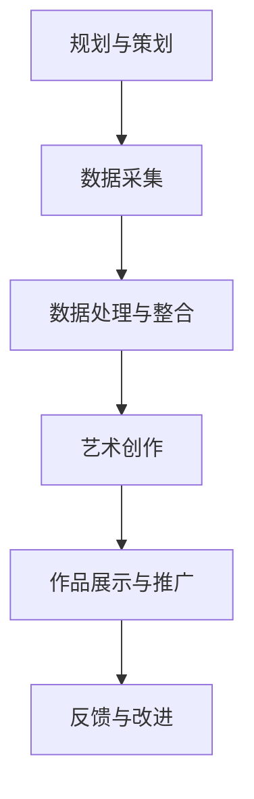

                 

# 数字化遗产艺术创业：逝者记忆的艺术呈现

## 关键词

- 数字化遗产
- 艺术创业
- 逝者记忆
- 数据采集
- 艺术呈现
- 跨学科合作

## 摘要

本文旨在探讨数字化遗产艺术创业的实践与探索，尤其是如何通过艺术手法呈现逝者的记忆。文章首先概述了数字化遗产和艺术创业的概念，接着详细分析了逝者记忆的数字化采集、艺术呈现方法和跨学科合作的重要性。随后，通过具体案例展示了数字化遗产艺术创业的实践过程，包括动画短片制作、数字艺术装置展览策划和数字艺术衍生品开发。最后，文章探讨了数字化遗产艺术创业面临的挑战和机遇，以及如何实现可持续发展。

### 目录大纲

#### 第一部分：数字化遗产艺术创业概述

- **第1章：数字化遗产艺术创业概述**
  - **1.1 数字化遗产的定义与背景**
  - **1.2 艺术创业的概念与趋势**
  - **1.3 数字化遗产艺术创业的优势

#### 第二部分：逝者记忆的艺术呈现

- **第2章：逝者记忆的艺术呈现**
  - **2.1 逝者记忆的数字化采集**
  - **2.2 艺术表现手法与媒介**
  - **2.3 跨学科合作与影响

#### 第三部分：实践与探索

- **第3章：数字化遗产艺术创业案例研究**
  - **3.1 案例一：逝者记忆动画短片制作**
  - **3.2 案例二：数字艺术装置展览策划**
  - **3.3 案例三：数字艺术衍生品开发**

#### 第四部分：未来展望

- **第4章：数字化遗产艺术创业的挑战与机遇**
  - **4.1 技术挑战**
  - **4.2 市场机遇**
  - **4.3 可持续发展**

#### 第五部分：资源与工具

- **第5章：数字化遗产艺术创业资源与工具**
  - **5.1 开发工具与软件**
  - **5.2 数据资源库**
  - **5.3 研究文献与资料**

#### 附录

- **附录A：数字化遗产艺术创业指南**
- **附录B：数字化遗产艺术创业案例精选**
- **附录C：开源代码与资源链接**

### Mermaid 流程图

### 第1章 数字化遗产艺术创业概述

#### 1.1 数字化遗产的定义与背景

##### 1.1.1 什么是数字化遗产

数字化遗产，指的是通过数字化手段保存和传承的文化遗产，包括文字、图像、音频、视频等多种形式。随着信息技术的飞速发展，数字化遗产逐渐成为文化遗产保护的重要手段。数字化遗产不仅能够更好地保存文化遗产，还能让更多人便捷地访问和利用这些资源。

##### 1.1.2 数字化遗产的重要性

数字化遗产的重要性体现在多个方面：

1. **文化传承**：数字化遗产为文化遗产的传承提供了新的途径，使得历史、艺术、民俗等文化内涵能够跨越时空，传递给下一代。
2. **资源共享**：通过数字化手段，文化遗产可以在全球范围内共享，打破了地域和时间的限制，为人类文明的交流提供了便利。
3. **科技创新**：数字化遗产的保存和利用推动了相关技术的进步，如数据存储、数据挖掘、虚拟现实等。

##### 1.1.3 数字化遗产的发展历程

数字化遗产的发展可以分为以下几个阶段：

1. **起步阶段**（1990s）：随着计算机技术的普及，一些博物馆、图书馆开始尝试将文物、书籍等数字化。
2. **发展阶段**（2000s）：互联网的兴起，使得数字化遗产的访问和利用变得更加便捷，同时也推动了更多领域对数字化遗产的需求。
3. **成熟阶段**（2010s至今）：大数据、云计算、人工智能等新技术的发展，为数字化遗产的保护、利用和传播提供了更广阔的空间。

#### 1.2 艺术创业的概念与趋势

##### 1.2.1 艺术创业的定义

艺术创业，指的是将艺术创作与商业运营相结合，通过创新的方式开发艺术产品或服务，实现经济和社会价值的过程。艺术创业不仅包括传统艺术领域的创作和销售，还涵盖了艺术与其他产业的融合。

##### 1.2.2 艺术创业的发展趋势

随着文化创意产业的蓬勃发展，艺术创业呈现出以下几个趋势：

1. **跨界融合**：艺术创业越来越倾向于与其他产业（如科技、时尚、旅游等）的融合，创造出新的艺术形态和市场。
2. **数字化**：数字化技术的应用，使得艺术创作和传播更加便捷，也为艺术创业提供了新的机遇。
3. **个性化**：消费者对个性化、定制化艺术产品的需求日益增长，艺术创业者需要提供更加个性化的产品和服务。

##### 1.2.3 数字化遗产艺术创业的优势

数字化遗产艺术创业具有以下几个优势：

1. **资源丰富**：数字化遗产提供了丰富的素材，为艺术创业提供了广阔的创作空间。
2. **市场潜力**：随着人们对文化、艺术的需求增加，数字化遗产艺术创业具有巨大的市场潜力。
3. **技术创新**：数字化遗产艺术创业需要运用多种新技术，如人工智能、虚拟现实等，为技术创新提供了实践机会。

### 第2章 逝者记忆的艺术呈现

#### 2.1 逝者记忆的数字化采集

##### 2.1.1 个人记忆的数字化采集方法

个人记忆的数字化采集是数字化遗产艺术创业的重要环节。以下是一些常见的数字化采集方法：

1. **照片与视频**：使用相机、手机等设备拍摄照片和视频，记录生活中的点滴。
2. **音频记录**：使用录音设备记录声音，如亲友的谈话、往事的回忆等。
3. **文档扫描**：使用扫描仪将纸质文档转化为电子文档，如信件、日记等。
4. **社交网络数据**：从社交媒体平台上收集与逝者相关的数据，如微博、朋友圈等。

##### 2.1.2 数据采集工具与软件

在进行数据采集时，可以使用以下工具和软件：

1. **相机和手机**：用于拍摄照片和视频。
2. **录音设备**：如录音笔、手机等，用于记录声音。
3. **扫描仪**：用于将纸质文档转化为电子文档。
4. **社交媒体平台API**：如微博API、Facebook Graph API等，用于从社交网络上获取数据。

##### 2.1.3 数据采集中的伦理问题

在数据采集过程中，需要关注以下几个伦理问题：

1. **隐私保护**：确保采集的数据不涉及个人隐私，如未经授权的照片、视频等。
2. **知情同意**：在采集个人记忆时，应获得逝者家属或相关人士的知情同意。
3. **数据安全**：确保采集到的数据安全存储，防止数据泄露或丢失。

#### 2.2 艺术表现手法与媒介

##### 2.2.1 数字化遗产艺术呈现的方法

数字化遗产可以通过多种艺术手法进行呈现，以下是一些常见的方法：

1. **视觉艺术**：如数字绘画、数字雕塑、数字摄影等，将逝者的记忆转化为视觉艺术作品。
2. **数字动画**：通过数字动画技术，将逝者的记忆转化为生动的故事或场景。
3. **虚拟现实（VR）**：利用VR技术，让观众沉浸式体验逝者的生活。
4. **增强现实（AR）**：通过AR技术，将逝者的记忆与现实场景相结合。

##### 2.2.2 艺术媒介的选择与应用

在进行数字化遗产艺术呈现时，需要根据具体需求和创作目的选择合适的艺术媒介。以下是一些常见的艺术媒介及其应用：

1. **数字绘画**：适用于创作具象或抽象的艺术作品，如肖像画、风景画等。
2. **数字雕塑**：适用于创作立体雕塑作品，如人物雕塑、动物雕塑等。
3. **数字摄影**：适用于记录和再现现实场景，如照片集、纪录片等。
4. **数字动画**：适用于创作动态故事或场景，如动画短片、广告等。
5. **VR和AR**：适用于沉浸式体验和互动性展示，如虚拟博物馆、增强现实游戏等。

##### 2.2.3 数字化遗产艺术作品案例分析

以下是一些数字化遗产艺术作品的案例分析：

1. **动画短片《阿尔兹记忆之书》**：通过动画短片的形式，呈现了患有阿尔兹海默症的患者的记忆世界，让观众感受到患者内心的孤独和挣扎。
2. **数字艺术装置《记忆的碎片》**：利用数字技术，将逝者的照片和回忆片段投射在建筑物的表面，形成一种独特的视觉体验。
3. **VR体验《逝者的世界》**：通过VR技术，让观众进入一个虚拟的逝者世界，感受到逝者的生活环境和情感状态。

#### 2.3 跨学科合作与影响

##### 2.3.1 数字化遗产艺术创业中的跨学科合作

数字化遗产艺术创业往往需要跨学科的合作，以下是一些常见的跨学科合作领域：

1. **计算机科学**：涉及数据采集、处理、存储等技术的应用。
2. **艺术设计**：涉及视觉艺术、数字动画、VR/AR等艺术创作方法的运用。
3. **心理学**：涉及对逝者记忆的研究，以及如何通过艺术形式传达情感和记忆。
4. **社会学**：涉及对文化、社会背景的研究，以及如何将数字化遗产艺术创业融入社会生活中。

##### 2.3.2 数字化遗产艺术创业对社会文化的影响

数字化遗产艺术创业对社会文化的影响主要体现在以下几个方面：

1. **文化遗产保护**：通过数字化手段，将文化遗产保存和传承，为后代提供宝贵的文化资源。
2. **文化创新**：数字化遗产艺术创业推动了文化领域的创新，产生了新的艺术形式和市场。
3. **文化认同**：通过数字化遗产艺术创业，人们能够更好地理解和认同自己的文化，增强文化自信。
4. **文化融合**：数字化遗产艺术创业促进了不同文化之间的交流与融合，为世界文化的多样性和丰富性做出贡献。

### 第3章 实践与探索

#### 3.1 案例一：逝者记忆动画短片制作

##### 3.1.1 项目背景

项目A：逝者记忆动画短片制作

- **项目目标**：通过动画短片的形式，将逝者的记忆转化为可视化的艺术作品，传达对逝者的怀念与纪念。
- **背景故事**：某个家庭希望通过数字化技术保存和传承家族成员的记忆，将逝者的故事和精神永远流传。

##### 3.1.2 制作流程

1. **数据采集与整理**
   - **采集内容**：照片、视频、音频、文档等与逝者相关的记忆素材。
   - **整理步骤**：筛选和分类素材，去除重复和无用的内容，对有价值的素材进行标注和整理。

2. **剧本创作与设计**
   - **剧本创作**：根据采集到的素材，编写动画短片的剧本，确保故事的连贯性和情感表达。
   - **视觉设计**：设计动画短片的视觉风格，包括角色形象、场景布置、色彩搭配等。

3. **动画制作**
   - **角色设计**：根据剧本要求，设计角色的外观和动作。
   - **场景制作**：创建动画短片中的各个场景，包括室内、室外、记忆片段等。
   - **动画合成**：将角色和场景结合，制作出完整的动画片段。

4. **后期制作与合成**
   - **音效添加**：为动画短片添加背景音乐、音效等，增强画面的感染力。
   - **色彩调整**：对画面进行色彩调整，使动画效果更加美观。
   - **输出与发布**：将动画短片输出为合适的格式，发布到线上平台或实体媒介。

##### 3.1.3 成果展示

1. **动画短片展示**
   - **视频播放**：展示制作完成的动画短片，让观众感受到逝者的记忆和情感。
   - **互动体验**：提供动画短片的互动版本，让观众参与其中，增强体验感。

2. **观众反馈**
   - **受众反应**：收集观众对动画短片的反馈，了解他们对作品的理解和感受。
   - **专家评价**：邀请艺术专家对动画短片进行评价，从专业角度分析作品的优缺点。

##### 3.1.4 评价与反馈

1. **项目评价**
   - **观众满意度**：通过问卷调查和在线评论，了解观众对动画短片的满意度和喜好。
   - **艺术价值**：从艺术创作的角度，评价动画短片的表现手法、创意和情感传达。

2. **反馈与改进**
   - **项目团队**：根据观众的反馈和专家的评价，对动画短片进行改进和优化。
   - **家庭用户**：与逝者家属沟通，了解他们的需求和期望，进一步完善作品。

#### 3.2 案例二：数字艺术装置展览策划

##### 3.2.1 项目背景

项目B：数字艺术装置展览策划

- **项目目标**：通过数字艺术装置展览，展示数字化遗产艺术创业的创新成果，传达对逝者的怀念与纪念。
- **背景故事**：某个艺术机构希望通过展览形式，推广数字化遗产艺术创业的理念，并让更多人了解和体验这一新兴领域。

##### 3.2.2 制作流程

1. **策展主题与目标**
   - **策展主题**：确定展览主题，如“逝者记忆的艺术呈现”。
   - **展览目标**：传达对逝者的怀念与纪念，展示数字化遗产艺术创业的创新成果。

2. **艺术作品征集与创作**
   - **作品征集**：向艺术家和设计师征集数字艺术装置作品，要求作品能够体现数字化遗产艺术创业的理念。
   - **作品创作**：艺术家和设计师根据策展主题和展览目标，创作数字艺术装置作品。

3. **展览策划与设计**
   - **展览策划**：设计展览的整体布局、互动环节、展示方式等，确保展览的连贯性和观赏性。
   - **展览设计**：设计展览视觉，包括展板、海报、导览等，提升展览的美观度和吸引力。

4. **展览搭建与布展**
   - **展览搭建**：搭建展览现场，确保艺术装置作品的安全和美观。
   - **布展**：将艺术装置作品放置在展览现场，确保展览的视觉效果和互动体验。

5. **展览宣传与推广**
   - **宣传材料**：制作展览海报、宣传册等宣传材料，提升展览的知名度。
   - **推广渠道**：利用社交媒体、线上平台、线下活动等渠道，推广展览信息，吸引观众参与。

6. **展览开放与互动**
   - **展览开放**：正式对外开放展览，接待观众参观。
   - **互动活动**：组织互动活动，如讲座、工作坊、互动游戏等，让观众更深入地体验数字化遗产艺术创业的魅力。

##### 3.2.3 展览效果与反馈

1. **展览效果**
   - **观众反应**：收集观众对展览的参观体验和艺术作品的评价，了解他们对数字化遗产艺术创业的理解和认同。
   - **媒体报道**：展览在媒体上的报道和评价，提升展览的影响力和知名度。

2. **反馈与改进**
   - **艺术家与策展人**：根据观众的反馈和媒体报道，对艺术作品和展览策划进行改进和优化，提升展览的质量。
   - **展览机构**：分析展览的数据，如参观人数、互动数据等，为未来的展览策划提供参考。

#### 3.3 案例三：数字艺术衍生品开发

##### 3.3.1 项目背景

项目C：数字艺术衍生品开发

- **项目目标**：通过开发数字艺术衍生品，将数字化遗产艺术创业的创意转化为可售商品，拓宽市场渠道，实现商业价值。
- **背景故事**：某个设计师希望通过数字艺术衍生品，推广数字化遗产艺术创业的理念，并将创意转化为实际商品，满足消费者对个性化文化产品的需求。

##### 3.3.2 制作流程

1. **市场分析**
   - **消费者需求**：分析目标消费者的需求和偏好，了解他们对数字艺术衍生品的接受程度和购买意愿。
   - **市场趋势**：研究市场趋势和行业动态，把握数字艺术衍生品的发展方向。

2. **设计创作**
   - **艺术创作**：根据市场分析的结果，创作数字艺术作品，如插画、动画等，作为衍生品的设计元素。
   - **衍生品设计**：将艺术作品转化为衍生品设计，如T恤、杯垫、手机壳等。

3. **制作与生产**
   - **材料选择**：根据衍生品的设计要求，选择合适的材料，如纺织品、塑料、金属等。
   - **制作流程**：确定制作流程，如数码印刷、3D打印等，确保产品质量和成本控制。

4. **销售与推广**
   - **线上销售**：在电商平台开设店铺，如淘宝、京东等，提供线上购买渠道。
   - **线下推广**：参与艺术展览、市集等活动，进行线下推广，提升品牌知名度。

5. **售后服务**
   - **售后服务**：提供良好的售后服务，如退换货政策、客户咨询等，增强消费者满意度。

##### 3.3.3 销售与市场推广

1. **销售数据**
   - **销售额**：记录衍生品的销售额和销售数量，分析销售趋势和市场份额。
   - **客户反馈**：收集消费者对衍生品的评价和反馈，了解产品优势和改进方向。

2. **市场推广**
   - **社交媒体推广**：利用微信、微博、抖音等社交媒体平台，发布衍生品宣传内容，吸引潜在消费者。
   - **合作推广**：与相关行业品牌合作，进行联合推广，扩大市场影响力。

### 第4章 数字化遗产艺术创业的挑战与机遇

#### 4.1 技术挑战

##### 4.1.1 数据隐私保护

- **挑战**：在数字化遗产艺术创业过程中，个人数据的隐私保护是一个重要且具有挑战性的问题。数据可能包括敏感的个人记忆、家庭照片、亲友访谈等，一旦泄露，可能会对个人隐私造成严重侵害。
- **解决方案**：
  - **数据加密**：采用先进的加密技术对数据进行加密，确保数据在传输和存储过程中安全。
  - **隐私保护政策**：制定明确的隐私保护政策，明确数据采集、使用和存储的规则。
  - **匿名化处理**：在数据采集和分享过程中，对个人身份信息进行匿名化处理，降低隐私泄露风险。

##### 4.1.2 技术标准化

- **挑战**：数字化遗产艺术创业涉及多个领域的技术，包括数据采集、处理、存储、艺术创作等。目前，相关技术标准不统一，导致创业者在技术选择和实施过程中面临困难。
- **解决方案**：
  - **制定行业标准**：推动行业协会和标准组织制定统一的行业标准，确保技术的兼容性和互操作性。
  - **技术协作与共享**：鼓励跨行业、跨领域的协作与共享，共同解决技术标准化问题。
  - **技术创新**：持续进行技术创新，推动技术的标准化和规范化。

##### 4.1.3 伦理道德问题

- **挑战**：数字化遗产艺术创业过程中，可能会涉及到伦理道德问题，如数据采集的伦理边界、艺术创作的道德规范等。这些问题需要得到妥善处理，以避免对个人和社会产生负面影响。
- **解决方案**：
  - **伦理准则制定**：建立明确的伦理准则，明确数字化遗产艺术创业中的道德边界和责任。
  - **伦理培训**：对创业者和相关从业者进行伦理培训，提高他们的伦理意识和道德素养。
  - **社会监督**：加强社会监督和舆论引导，形成良好的行业氛围。

#### 4.2 市场机遇

##### 4.2.1 市场需求分析

- **潜在市场**：数字化遗产艺术创业具有巨大的市场潜力。随着社会对文化、艺术、个性化的需求增加，数字化遗产艺术创业将迎来更多的市场机遇。
  - **消费群体**：年轻一代对数字化遗产艺术创业表现出浓厚的兴趣，他们是主要的消费群体。
  - **市场趋势**：市场对个性化、定制化的数字艺术产品需求增加，为数字化遗产艺术创业提供了广阔的市场空间。

##### 4.2.2 创业模式探索

- **艺术工作室模式**：独立经营，提供个性化定制服务，如动画短片制作、数字艺术装置创作等。
- **跨界合作模式**：与相关行业进行跨界合作，如与科技企业合作开发数字艺术技术，与旅游企业合作打造数字艺术旅游项目等。
- **平台化运营模式**：搭建数字化遗产艺术创业平台，吸引更多的参与者，提供作品展示、交易、推广等服务。

##### 4.2.3 行业趋势分析

- **技术创新**：数字化技术（如人工智能、虚拟现实、增强现实等）的不断发展，为数字化遗产艺术创业提供了更多可能性。
- **文化融合**：数字化遗产艺术创业逐渐与其他产业融合，形成了多元化的市场格局。
- **可持续发展**：数字化遗产艺术创业开始关注社会责任和可持续发展，通过创新和绿色发展实现经济效益与社会效益的双赢。

#### 4.3 可持续发展

##### 4.3.1 社会责任与道德规范

- **社会责任**：数字化遗产艺术创业应承担社会责任，关注社会效益，如保护文化遗产、传承文化记忆等。
- **道德规范**：建立明确的道德规范，确保数字化遗产艺术创业过程中的伦理道德边界，如保护个人隐私、尊重知识产权等。

##### 4.3.2 可持续发展策略

- **技术创新**：持续进行技术创新，提高数字化遗产艺术创业的竞争力。
- **绿色环保**：关注环境保护，推动绿色生产，降低数字化遗产艺术创业的环境影响。
- **社会责任**：承担社会责任，积极参与公益活动，为社会做出贡献。

##### 4.3.3 未来发展方向

- **技术创新**：随着技术的不断发展，数字化遗产艺术创业将融入更多新技术，如人工智能、区块链等，推动行业的创新和发展。
- **跨界融合**：数字化遗产艺术创业将与其他产业更加深入地融合，形成多元化的发展格局。
- **可持续发展**：数字化遗产艺术创业将注重可持续发展，通过创新和绿色发展实现经济效益与社会效益的双赢。

### 第5章 数字化遗产艺术创业资源与工具

#### 5.1 开发工具与软件

- **数据采集工具**：如Adobe Photoshop、Adobe Premiere Pro、Audacity等。
- **艺术创作工具**：如Adobe Illustrator、Adobe After Effects、Autodesk Maya等。
- **编程工具**：如Python、JavaScript、Unity等。

#### 5.2 数据资源库

- **公开数据资源库**：如Google Dataset Search、UCI Machine Learning Repository等。
- **专业数据资源库**：如国家图书馆数字资源库、博物馆数字资源库等。
- **开源数据集**：如Open Images、Flickr Creative Commons等。

#### 5.3 研究文献与资料

- **学术期刊与论文**：如IEEE Xplore、ACM Digital Library等。
- **行业报告与白皮书**：如市场研究公司发布的行业报告、企业发布的白皮书等。
- **书籍与讲座资料**：如专业书籍、讲座PPT、线上课程等。

### 附录

#### 附录A：数字化遗产艺术创业指南

- **创业准备与策划**：包括市场调研、团队建设、资金筹备等。
- **项目管理与团队建设**：包括项目进度管理、团队沟通与协作等。
- **营销与推广策略**：包括品牌建设、线上推广、线下活动等。
- **法律法规与知识产权保护**：包括相关法律法规、知识产权保护等。

#### 附录B：数字化遗产艺术创业案例精选

- **案例一**：逝者记忆动画短片制作
- **案例二**：数字艺术装置展览策划
- **案例三**：数字艺术衍生品开发

#### 附录C：开源代码与资源链接

- **开源代码资源链接**：如GitHub、GitLab等。
- **工具与框架下载链接**：如Node.js、React等。
- **开源数据集链接**：如Open Images、Flickr Creative Commons等。
- **研究文献与资料链接**：如IEEE Xplore、ACM Digital Library等。

### 结论

数字化遗产艺术创业是一种充满创新和挑战的创业模式。通过数字化手段，我们可以将逝者的记忆转化为艺术作品，传承文化，弘扬精神。在这个过程中，技术、艺术和社会责任交织在一起，形成了一个多元化的生态系统。未来，随着技术的不断进步和市场的不断扩展，数字化遗产艺术创业将迎来更多的机遇和挑战。让我们共同努力，推动这一领域的繁荣发展，为人类文明的传承和创新贡献力量。

### 作者信息

作者：AI天才研究院/AI Genius Institute & 禅与计算机程序设计艺术 /Zen And The Art of Computer Programming

