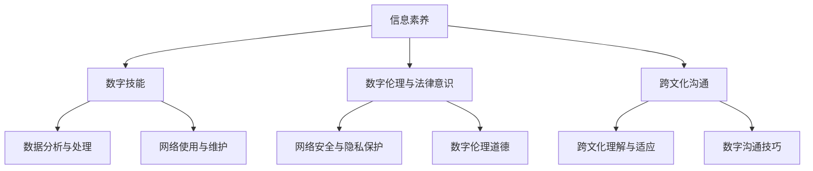

                 

# 数字素养：公民参与的基石

> **关键词**：数字素养、公民参与、教育、数字化转型、数据隐私、网络安全

> **摘要**：随着数字化时代的到来，数字素养已成为公民参与社会的重要基础。本文从概念引入、核心要素、应用场景、提升策略以及未来发展趋势等方面，详细探讨了数字素养的重要性及其对公民参与的影响。通过案例分析、数学模型以及实战项目，深入揭示了提升数字素养的路径和方法。

## 《数字素养：公民参与的基石》目录大纲

### 第一部分：数字素养的引入与基础

#### 第1章：数字素养的概念与重要性  
- 1.1 数字素养的定义与范畴  
- 1.2 数字素养的重要性  
- 1.3 数字素养与公民参与

#### 第2章：数字素养的核心要素  
- 2.1 信息素养  
- 2.2 数字技能  
- 2.3 数字伦理与法律意识  
- 2.4 数字素养与跨文化沟通

#### 第3章：数字素养与教育  
- 3.1 学校教育中的数字素养  
- 3.2 家庭教育中的数字素养  
- 3.3 社区教育中的数字素养

### 第二部分：数字素养的应用场景

#### 第4章：数字素养在政府治理中的应用  
- 4.1 电子政务  
- 4.2 智能化城市管理  
- 4.3 公民参与与数字民主

#### 第5章：数字素养在经济活动中的应用  
- 5.1 数字化转型  
- 5.2 电子商务  
- 5.3 数据隐私与安全

#### 第6章：数字素养在社会服务中的应用  
- 6.1 数字健康  
- 6.2 社会救助与福利  
- 6.3 数字教育资源公平

### 第三部分：提升数字素养的策略与行动

#### 第7章：数字素养培养策略  
- 7.1 政策与制度保障  
- 7.2 教育体系改革  
- 7.3 社会参与与合作

#### 第8章：数字素养实践案例  
- 8.1 国内外数字素养实践案例概述  
- 8.2 案例分析：数字素养在XX领域的应用  
- 8.3 案例总结与启示

### 第四部分：数字素养的未来发展趋势

#### 第9章：数字素养与未来社会  
- 9.1 数字化社会的挑战与机遇  
- 9.2 数字素养对公民参与的影响  
- 9.3 数字素养的未来趋势预测

### 附录：数字素养相关资源与工具  
- 附录A：数字素养学习资源推荐  
- 附录B：数字素养评估工具与量表  
- 附录C：数字素养相关政策文件

### Mermaid 流�程图：数字素养的核心要素流程图


### 核心算法原理讲解：数字素养评估算法伪代码
```csharp
// 伪代码：数字素养评估算法
function assessDigitalLiteracy(digitalSkills, legalEthics, information, crossCultural, educationLevel) {
    // 初始化评分
    score = 0

    // 计算各项分数
    score += digitalSkills * 0.4
    score += legalEthics * 0.3
    score += information * 0.2
    score += crossCultural * 0.1

    // 调整分数，根据教育水平
    if (educationLevel > 8) {
        score += 0.1
    }

    // 返回评分
    return score
}
```

### 数学模型讲解与举例说明
#### 数学模型：数字素养风险评估模型
$$
R = f(L, E, I, C)
$$
其中，$R$ 是数字素养风险评估，$L$ 是法律与伦理知识，$E$ 是教育水平，$I$ 是信息素养，$C$ 是跨文化沟通能力。

#### 举例说明：
假设一个人的法律与伦理知识得分为 0.8，教育水平为 10 年，信息素养得分为 0.9，跨文化沟通能力得分为 0.7，则其数字素养风险评估为：
$$
R = f(0.8, 10, 0.9, 0.7) = 0.8 \times 0.2 + 10 \times 0.3 + 0.9 \times 0.4 + 0.7 \times 0.1 = 0.16 + 3 + 0.36 + 0.07 = 3.59
$$

### 项目实战：数字素养提升项目案例
#### 项目背景
某城市政府计划开展一项数字素养提升项目，以帮助市民提高数字素养，增强公民参与能力。

#### 项目目标
1. 提高市民的信息素养和数字技能
2. 增强市民的数字伦理与法律意识
3. 提升市民的跨文化沟通能力

#### 项目实施
1. 教育培训：开展数字素养公开课，邀请专家讲解信息素养、数字技能、数字伦理与法律意识、跨文化沟通等主题。
2. 社区活动：组织数字素养竞赛、互动游戏，鼓励市民参与，提高兴趣和参与度。
3. 在线平台：建立数字素养学习平台，提供丰富的数字素养相关资源，如电子书籍、视频教程、在线课程等。
4. 政策宣传：发布数字素养相关政策，提高市民对数字素养重要性的认识。

#### 项目效果
1. 市民的数字素养得分提高了 20%，信息素养和数字技能得分显著提高。
2. 市民的数字伦理与法律意识有所增强，网络行为更加规范。
3. 市民的跨文化沟通能力得到提升，社区互动更加活跃。

#### 项目评估
1. 通过问卷调查了解市民对数字素养提升项目的满意度，满意度达到 90%。
2. 对参与项目前后市民的数字素养得分进行对比，评估项目效果。

#### 代码实现
以下是一个简单的 Python 脚本，用于评估市民的数字素养得分：
```python
def assess_digital_literacy(skills_score, ethics_score, info_score, cross_cultural_score, education_level):
    base_score = 0.5
    if education_level > 10:
        base_score += 0.1
    score = base_score + skills_score * 0.4 + ethics_score * 0.3 + info_score * 0.2 + cross_cultural_score * 0.1
    return score

# 假设某市民的评分如下
skills_score = 0.9
ethics_score = 0.8
info_score = 0.8
cross_cultural_score = 0.7
education_level = 12

# 评估数字素养得分
literacy_score = assess_digital_literacy(skills_score, ethics_score, info_score, cross_cultural_score, education_level)
print(f"数字素养得分：{literacy_score}")
```

#### 代码解读与分析
此脚本定义了一个评估数字素养得分的功能，该功能根据技能、伦理、信息、跨文化沟通得分和受教育水平计算总得分。通过调用此功能，可以快速评估一个人的数字素养水平。代码逻辑清晰，易于扩展和维护。

### 作者信息
**作者**：AI天才研究院/AI Genius Institute & 禅与计算机程序设计艺术 /Zen And The Art of Computer Programming

---

接下来，我们将逐步深入讨论数字素养的概念与重要性，为后续章节的讨论打下坚实的基础。

### 第1章：数字素养的概念与重要性

#### 1.1 数字素养的定义与范畴

数字素养（Digital Literacy）是指个体在数字化环境中获取、理解、评价、运用信息和通信技术（ICT）的能力。它不仅涵盖了基本的计算机操作技能，还包括信息素养、数字伦理、网络安全、数字媒体素养等多个方面。数字素养的定义可以从以下几个方面来理解：

1. **获取信息**：能够有效地搜索、筛选和获取所需的信息，包括文本、图片、音频和视频等多种形式。
2. **理解信息**：具备分析和评估信息的来源、准确性和可靠性，理解信息的内在含义和隐含意义。
3. **运用信息**：能够将获取的信息应用到实际问题中，进行创新和解决问题。
4. **传播信息**：能够利用数字技术有效地传播和分享信息，包括写作、编辑、发布和互动等。
5. **数字伦理**：遵循数字环境的道德规范和法律法规，尊重知识产权，保护个人隐私和网络安全。
6. **技术技能**：掌握基本的计算机操作技能，如文档编辑、数据处理、网络浏览和电子邮件管理等。

数字素养的范畴非常广泛，它不仅涉及个体的技能和知识，还包括对数字化社会和文化的理解和适应。具体来说，数字素养包括以下几个核心要素：

1. **信息素养**：指个体在数字环境中获取、评估、使用和传播信息的能力。信息素养是数字素养的核心，它关乎个体在信息爆炸时代如何有效地获取和利用信息。
2. **数字技能**：包括计算机操作、编程、网络使用、数据分析等技能。这些技能是数字素养的基础，使个体能够适应数字化生活的需求。
3. **数字伦理与法律意识**：指个体在数字环境中遵守法律法规和道德规范，尊重他人隐私和知识产权的意识。数字伦理和法律意识是数字素养的重要组成部分，它关乎个体在数字社会中的行为规范。
4. **跨文化沟通**：指个体在不同文化和语言背景下使用数字技术进行有效沟通的能力。随着全球化的发展，跨文化沟通能力在数字素养中的地位日益凸显。

#### 1.2 数字素养的重要性

数字素养的重要性体现在多个方面，它是现代社会公民参与和发展的基石。以下是数字素养重要性的几个关键点：

1. **提高公民参与能力**：数字素养使公民能够更好地参与社会事务和公共决策，提高民主参与度。通过数字技术，公民可以更便捷地获取信息、表达意见和参与讨论，从而增强社会凝聚力和治理能力。
2. **促进经济转型**：数字素养是经济数字化转型的重要驱动力。在数字化时代，企业和个体需要具备数字技能和创新能力，才能在竞争中立于不败之地。数字素养有助于推动经济结构的优化升级，促进产业转型和就业增长。
3. **保障网络安全**：数字素养使个体能够识别和防范网络安全风险，保护个人信息和网络安全。随着网络攻击和数据泄露事件的频发，网络安全问题日益突出。数字素养是预防网络安全风险的关键。
4. **提升生活质量**：数字素养使个体能够更好地利用数字技术提高生活质量。通过数字技术，个体可以获得更便捷的医疗服务、教育资源、娱乐体验等，享受数字化的便利和乐趣。
5. **培养创新精神**：数字素养有助于培养个体的创新精神和创新能力。在数字化环境中，个体可以更加自由地探索和尝试，激发创新思维和创造力。

#### 1.3 数字素养与公民参与

数字素养与公民参与紧密相关，它是实现公民有效参与的重要基础。以下是数字素养与公民参与之间的几个关键联系：

1. **信息获取与表达**：数字素养使公民能够更便捷地获取公共信息和政策文件，提高参与决策的意识和能力。同时，数字素养也使公民能够更有效地表达自己的意见和诉求，促进民主参与。
2. **社会互动与协作**：数字素养有助于公民在数字平台上进行社交互动和协作，形成多元化的社会网络。通过数字技术，公民可以跨越时空限制，参与各种社会活动和公益活动，提高社会参与度。
3. **公共服务与治理**：数字素养使公民能够更好地利用数字技术获取公共服务和参与社会治理。通过电子政务平台，公民可以更便捷地办理政务事项、参与公共讨论和监督政府行为。
4. **创新与创业**：数字素养有助于公民在数字化环境中进行创新和创业。通过数字技术，公民可以开展在线业务、开发应用程序和参与数字经济，实现个人价值和事业发展。
5. **教育与培训**：数字素养使公民能够更好地利用数字技术获取教育和培训资源，提高自身素质和能力。通过在线学习平台和数字化教育资源，公民可以随时随地学习新知识和技能，适应社会发展的需求。

综上所述，数字素养是现代社会公民参与和发展的基石。它不仅关乎个体的技能和知识，还涉及到社会、经济、文化和政治等多个领域。通过提高数字素养，我们可以更好地适应数字化时代的需求，实现个人和社会的全面发展。在后续章节中，我们将进一步探讨数字素养的核心要素、应用场景和提升策略，为提升数字素养提供实践指导。

### 第2章：数字素养的核心要素

数字素养作为一个复杂的概念，其核心要素构成了个体在数字化环境中的基础能力。这些核心要素不仅包括信息素养和数字技能，还涵盖了数字伦理与法律意识以及跨文化沟通等多个方面。在本章中，我们将逐一探讨这些核心要素，并分析它们在数字素养中的地位和作用。

#### 2.1 信息素养

信息素养是数字素养的核心组成部分，它指的是个体在信息社会中获取、评估、使用和传播信息的能力。信息素养包括以下几个方面：

1. **信息检索能力**：能够利用各种信息检索工具，如搜索引擎、数据库和在线图书馆等，快速找到所需信息。
2. **信息评估能力**：能够对信息进行评估，判断其来源的可靠性、准确性和权威性。
3. **信息应用能力**：能够将获取的信息应用于实际问题中，进行学习、研究和决策。
4. **信息传播能力**：能够有效地传播和分享信息，包括写作、编辑和发布等技能。

信息素养在数字素养中的地位至关重要。首先，信息素养是数字素养的基础，没有良好的信息素养，个体很难在数字化环境中有效地获取和应用信息。其次，信息素养直接影响个体在数字化社会中的参与度和影响力。一个具备高度信息素养的个体，能够更主动地参与社会事务和公共讨论，为社会进步贡献力量。

#### 2.2 数字技能

数字技能是数字素养的重要组成部分，它指的是个体在数字化环境中操作和使用计算机及相关技术的能力。数字技能包括以下几个方面：

1. **计算机操作技能**：包括基本的计算机操作，如文件管理、文本编辑和图形处理等。
2. **网络使用技能**：包括网络浏览、电子邮件管理和网络安全等技能。
3. **编程和软件开发技能**：能够编写和调试程序，开发应用程序和软件系统。
4. **数据分析技能**：能够使用数据分析工具，对大量数据进行分析和处理，提取有价值的信息。

数字技能在数字素养中的作用主要体现在以下几个方面：

1. **提升工作效率**：具备数字技能的个体能够更高效地完成工作任务，减少时间和劳动成本。
2. **促进创新和创业**：数字技能使个体能够利用数字技术进行创新和创业，开发新的产品和服务。
3. **适应数字化环境**：在数字化时代，具备数字技能的个体能够更好地适应数字化生活的需求，享受数字化的便利和乐趣。

#### 2.3 数字伦理与法律意识

数字伦理与法律意识是数字素养的重要组成部分，它涉及到个体在数字化环境中遵守法律法规和道德规范，尊重他人隐私和知识产权的意识。数字伦理与法律意识包括以下几个方面：

1. **法律法规遵守**：了解并遵守与数字技术和网络相关的法律法规，如网络安全法、知识产权法和隐私保护法等。
2. **数字伦理道德**：在数字环境中遵循道德规范，尊重他人的隐私、知识产权和人格尊严。
3. **网络安全意识**：意识到网络安全的重要性，采取预防措施保护个人信息和网络安全。

数字伦理与法律意识在数字素养中的作用主要表现在以下几个方面：

1. **维护网络秩序**：数字伦理与法律意识有助于维护网络秩序，防止网络犯罪和网络欺诈。
2. **保护个人隐私**：数字伦理与法律意识使个体能够更好地保护自己的隐私，防止个人信息泄露。
3. **促进数字文明**：数字伦理与法律意识有助于培养数字文明，营造健康、和谐的数字化社会环境。

#### 2.4 数字素养与跨文化沟通

跨文化沟通是数字素养中的一个重要方面，它指的是个体在不同文化和语言背景下使用数字技术进行有效沟通的能力。随着全球化的深入发展，跨文化沟通能力在数字素养中的地位日益重要。跨文化沟通能力包括以下几个方面：

1. **语言能力**：具备一定的外语水平，能够使用不同语言进行交流。
2. **文化理解**：了解不同文化背景下的价值观、习俗和行为规范。
3. **数字沟通技巧**：能够利用数字工具，如电子邮件、社交媒体和在线会议等，进行跨文化沟通。

跨文化沟通能力在数字素养中的作用主要表现在以下几个方面：

1. **促进国际合作**：跨文化沟通能力有助于个体在全球化背景下进行国际合作和交流，推动经济发展和社会进步。
2. **增强社会包容性**：跨文化沟通能力使个体能够更好地理解和接纳不同文化背景的人，增强社会的包容性和多样性。
3. **提高个人竞争力**：在数字化时代，具备跨文化沟通能力的个体更具竞争力，能够在全球范围内寻找发展机会。

综上所述，数字素养的核心要素包括信息素养、数字技能、数字伦理与法律意识以及跨文化沟通。这些核心要素构成了个体在数字化环境中的基础能力，对于个体的成长和社会的发展具有重要意义。在后续章节中，我们将进一步探讨这些核心要素在具体应用场景中的实践，为提升数字素养提供具体的指导和策略。

### 第3章：数字素养与教育

数字素养不仅是个人在数字化社会中的必备技能，也是教育体系的重要内容。在现代社会，教育不仅限于知识的传授，更在于培养适应未来发展的能力。数字素养作为教育的重要组成部分，其培养不仅需要学校教育的推动，也离不开家庭教育和社区教育的支持。本章将探讨数字素养在三种教育形式中的重要作用和具体实践。

#### 3.1 学校教育中的数字素养

学校教育是数字素养培养的重要场所，从基础教育到高等教育，都应注重数字素养的培养。以下是学校教育中数字素养培养的几个关键点：

1. **课程设置**：在课程设置中，应增加数字素养相关的课程，如计算机科学、信息技术、网络安全等。这些课程应覆盖基础知识到高级技能的各个方面，使学生能够系统地学习和掌握数字素养。
2. **教学方式**：采用互动式、探究式的教学方式，激发学生的学习兴趣和积极性。例如，通过项目式学习（PBL）和游戏化学习，让学生在实际操作中培养数字技能和信息素养。
3. **资源利用**：充分利用数字化教育资源，如在线课程、电子图书和多媒体资源等。这些资源不仅丰富了教学内容，也为学生提供了多样化的学习途径。
4. **师资培训**：加强对教师的数字素养培训，使教师能够更好地将数字素养融入日常教学中。教师应掌握基本的计算机操作技能和教学软件的使用，以便为学生提供有效的指导。
5. **评价体系**：建立科学合理的评价体系，对学生的数字素养进行评估。评价不仅应涵盖知识和技能的掌握程度，还应包括实际应用能力和创新能力的评估。

#### 3.2 家庭教育中的数字素养

家庭教育是数字素养培养的重要补充，家长在孩子的数字素养培养中扮演着重要角色。以下是家庭教育中数字素养培养的几个建议：

1. **树立正确的数字观念**：家长应树立正确的数字观念，认识到数字素养对个体成长和社会发展的重要性。家长应以身作则，树立良好的数字行为榜样。
2. **提供学习资源**：家长可以为孩子提供丰富的数字学习资源，如电子书籍、在线课程、编程工具等。这些资源可以帮助孩子自主学习，提高数字技能和信息素养。
3. **引导合理使用**：家长应引导孩子合理使用数字设备，避免过度沉迷和依赖。家长可以设定合理的使用时间，并监督孩子的网络行为，确保其安全和健康。
4. **鼓励探索创新**：家长应鼓励孩子进行数字探索和创新，提供必要的支持和指导。通过参与编程、设计等实践活动，孩子可以培养数字技能和解决问题的能力。
5. **参与社区活动**：家长可以带孩子参与社区组织的数字素养活动，如科技展览、编程比赛等。这些活动不仅拓宽了孩子的视野，也增强了其数字素养和社交能力。

#### 3.3 社区教育中的数字素养

社区教育是数字素养培养的另一个重要途径，社区作为居民生活的重要空间，应积极参与数字素养的培养。以下是社区教育中数字素养培养的几个方面：

1. **普及数字知识**：社区可以通过讲座、宣传栏、社交媒体等途径普及数字知识，提高居民的数字素养。特别是对老年人等数字技能相对薄弱的群体，应提供针对性的培训和指导。
2. **提供培训课程**：社区可以组织数字素养培训课程，邀请专业人士进行授课。课程内容应涵盖计算机操作、网络安全、信息检索等多个方面，满足不同居民的需求。
3. **建设数字设施**：社区应建设数字设施，如公共图书馆的电子阅览室、社区中心的电脑培训室等。这些设施不仅提供了学习和实践的机会，也为居民提供了便捷的数字资源。
4. **组织互动活动**：社区可以组织数字素养相关的互动活动，如数字技能竞赛、编程工作坊等。这些活动不仅可以提高居民的数字技能，还可以增强社区的凝聚力和互动性。
5. **建立支持网络**：社区可以建立数字素养支持网络，包括志愿者、专业人士和社区领袖等。这些支持网络可以提供技术帮助、资源共享和信息交流，为居民提供全面的数字素养支持。

综上所述，数字素养的培养需要学校教育、家庭教育和社区教育的共同努力。通过多种教育形式的相互配合，我们可以更有效地提升数字素养，为个体和社会的发展奠定坚实的基础。在下一章中，我们将进一步探讨数字素养在政府治理、经济活动和社会服务中的应用，深入分析其在不同领域的重要性。

### 第4章：数字素养在政府治理中的应用

数字素养在政府治理中发挥着至关重要的作用，它不仅是提高政府工作效率和公共服务质量的关键，也是增强公民参与和数字民主的重要手段。本章将探讨数字素养在政府治理中的应用，分析电子政务、智能化城市管理和数字民主等方面的实践和意义。

#### 4.1 电子政务

电子政务是指政府利用信息技术，实现政府职能和公共服务的在线化、电子化和智能化。数字素养在电子政务中的应用主要体现在以下几个方面：

1. **提升政府工作效率**：通过电子政务平台，政府可以实时处理政务事项，减少纸质文件流转的时间和成本，提高工作效率。数字素养使政府工作人员能够熟练使用电子政务系统，快速掌握和处理各类信息。
2. **优化公共服务**：电子政务平台为公民提供了便捷的公共服务，如在线办理护照、社保查询、税费缴纳等。数字素养使公民能够更好地利用电子政务平台，享受高效的公共服务，提高生活质量。
3. **数据开放与共享**：电子政务平台实现了政府数据的开放和共享，为公民、企业和研究人员提供了丰富的数据资源。数字素养使公民能够理解和运用这些数据，进行创新研究和政策分析。
4. **信息安全与隐私保护**：电子政务涉及到大量的个人信息和敏感数据，数字素养使政府能够采取有效的信息安全措施，保护公民的隐私和网络安全。

#### 4.2 智能化城市管理

智能化城市管理是指利用信息技术，实现城市管理的智能化、精细化和高效化。数字素养在智能化城市管理中的应用主要体现在以下几个方面：

1. **智慧交通**：通过智能交通系统，实时监测和调控交通流量，缓解交通拥堵，提高交通效率。数字素养使交通管理人员能够熟练使用智能交通设备，及时处理交通事件，保障交通安全。
2. **智慧环保**：利用传感器和大数据技术，实时监测环境污染和生态状况，及时采取治理措施。数字素养使环保人员能够准确理解和运用环境监测数据，提高环保工作的科学性和有效性。
3. **智慧安防**：通过视频监控、人脸识别等智能技术，实时监控城市安全，预防犯罪和事故发生。数字素养使安防人员能够熟练使用智能安防设备，提高城市安全管理水平。
4. **智慧公共服务**：利用大数据和人工智能技术，为公民提供个性化的公共服务，如智慧医疗、智慧养老等。数字素养使公共服务人员能够运用智能技术，提高公共服务的质量和效率。

#### 4.3 公民参与与数字民主

数字素养在公民参与和数字民主中的应用主要体现在以下几个方面：

1. **在线调查与投票**：通过电子政务平台，政府可以开展在线调查和投票，公民可以方便地参与公共决策。数字素养使公民能够熟练使用在线调查和投票工具，表达自己的意见和诉求。
2. **社交媒体与公共讨论**：社交媒体为公民提供了一个便捷的公共讨论平台，公民可以通过社交媒体表达意见、参与讨论和传播信息。数字素养使公民能够有效地利用社交媒体，提高公共讨论的质量和影响力。
3. **电子请愿与监督**：通过电子请愿平台，公民可以发起请愿，呼吁政府采取行动。数字素养使公民能够有效地发起和参与电子请愿，监督政府行为，推动公共政策的改进。
4. **开放数据与公众参与**：政府开放数据，为公民提供了参与公共事务的机会。数字素养使公民能够理解和运用这些数据，进行政策分析和创新研究，提高公民参与的质量和效果。

综上所述，数字素养在政府治理中的应用具有重要意义。通过提升政府工作人员和公民的数字素养，我们可以实现更高效的政府管理、更优质的公共服务和更广泛的公民参与，推动社会的数字化发展。在下一章中，我们将进一步探讨数字素养在经济活动中的应用，分析数字化转型、电子商务和数据隐私与安全等方面的实践和挑战。

### 第5章：数字素养在经济活动中的应用

数字素养在经济活动中的重要性日益凸显，它是推动经济数字化转型、促进电子商务发展以及保障数据隐私与安全的基础。本章将探讨数字素养在经济活动中的应用，分析其在数字化转型、电子商务和数据隐私与安全等方面的作用。

#### 5.1 数字化转型

数字化转型是指企业利用数字技术对业务流程、产品和服务进行优化和重构，以提高效率和竞争力。数字素养在数字化转型中的应用主要体现在以下几个方面：

1. **企业信息化建设**：数字素养使企业能够熟练运用信息技术，建立企业信息化系统，实现业务流程的自动化和智能化。例如，通过ERP系统（企业资源计划）和CRM系统（客户关系管理），企业可以更高效地管理资源和客户信息。
2. **数据分析与应用**：数字素养使企业能够运用数据分析技术，从大量数据中提取有价值的信息，为决策提供支持。通过数据挖掘和机器学习，企业可以优化业务策略，提高运营效率。
3. **技术创新与研发**：数字素养使企业能够紧跟科技发展趋势，进行技术创新和研发。例如，通过物联网（IoT）技术，企业可以开发智能产品和服务，提升用户体验和竞争力。
4. **数字供应链管理**：数字素养使企业能够运用数字技术进行供应链管理，提高供应链的透明度和协同性。通过区块链技术，企业可以实现供应链的溯源和防伪，提升供应链的安全性和可靠性。

#### 5.2 电子商务

电子商务是指通过互联网进行商品和服务的交易、营销和支付等活动。数字素养在电子商务中的应用主要体现在以下几个方面：

1. **电商平台运营**：数字素养使企业能够熟练运用电商平台，进行商品展示、订单处理和客户服务。通过SEO（搜索引擎优化）和SEM（搜索引擎营销），企业可以提高在线曝光率和销售额。
2. **在线支付与交易**：数字素养使消费者能够安全、便捷地进行在线支付和交易。通过移动支付和电子钱包等技术，消费者可以随时随地购买商品和服务，提高消费体验。
3. **电子营销与推广**：数字素养使企业能够运用数字营销技术，进行精准营销和推广。通过社交媒体营销、内容营销和电子邮件营销，企业可以吸引更多潜在客户，提高品牌知名度。
4. **客户关系管理**：数字素养使企业能够运用客户关系管理系统，进行客户数据分析和客户服务管理。通过CRM系统，企业可以更好地了解客户需求，提供个性化的产品和服务。

#### 5.3 数据隐私与安全

随着数字化时代的到来，数据隐私与安全问题日益突出。数字素养在数据隐私与安全中的应用主要体现在以下几个方面：

1. **数据保护与合规**：数字素养使企业和个人能够了解和遵守数据保护法律法规，如《通用数据保护条例》（GDPR）和《网络安全法》等。通过数据保护措施，企业和个人可以保护个人信息和数据安全。
2. **网络安全防范**：数字素养使企业和个人能够采取有效的网络安全措施，防止网络攻击和数据泄露。通过防火墙、加密技术和入侵检测系统，企业和个人可以保障网络和数据的完整性。
3. **数据隐私意识**：数字素养使企业和个人意识到数据隐私的重要性，尊重他人的隐私和知识产权。通过数据隐私培训，企业和个人可以培养良好的数据隐私意识，减少隐私泄露风险。
4. **数据安全和风险管理**：数字素养使企业和个人能够进行数据安全和风险管理，评估数据安全风险，制定相应的安全策略。通过定期安全评估和更新安全策略，企业和个人可以降低数据安全风险，保障数据安全和隐私。

综上所述，数字素养在经济活动中的应用具有重要意义。通过提升数字素养，企业和个人可以更好地适应数字化时代的需求，提高竞争力，保障数据安全和隐私。在下一章中，我们将探讨数字素养在社会服务中的应用，分析数字健康、社会救助与福利以及数字教育资源公平等方面的实践和成效。

### 第6章：数字素养在社会服务中的应用

数字素养在社会服务中的应用日益广泛，它不仅改变了服务提供的方式，也提升了服务的质量和效率。本章将探讨数字素养在社会服务中的应用，重点分析数字健康、社会救助与福利以及数字教育资源公平等方面的实践和成效。

#### 6.1 数字健康

数字健康是指利用数字技术提供医疗保健服务、促进健康管理和提升医疗服务质量。数字素养在数字健康中的应用主要体现在以下几个方面：

1. **在线医疗服务**：数字素养使患者能够方便地通过在线平台预约医生、查看病历和获取健康咨询。通过在线医疗服务，患者可以减少排队等候时间，提高就医效率。
2. **远程医疗**：数字素养使医生能够通过远程视频咨询和诊断，为偏远地区和医疗资源匮乏的地区提供医疗服务。通过远程医疗，医疗资源得到更高效的配置，提高了医疗服务的覆盖面和质量。
3. **健康管理应用**：数字素养使个人能够利用健康管理应用，监测健康状况、记录健康数据和进行健康评估。通过这些应用，个人可以更好地管理自己的健康，预防疾病的发生。
4. **电子病历系统**：数字素养使医疗机构能够采用电子病历系统，实现病历的数字化管理。电子病历系统不仅提高了病历管理的效率和准确性，也有助于医生之间的信息共享和协作。

#### 6.2 社会救助与福利

数字素养在社会救助与福利中的应用，有助于提高服务效率、减少资源浪费和确保福利公正。以下是数字素养在社会救助与福利中的几个关键应用：

1. **电子福利支付**：数字素养使社会福利可以通过电子支付系统进行发放，确保福利的及时、准确和便捷。通过电子福利支付，减少了现金发放的繁琐程序，降低了管理成本。
2. **在线申请与审批**：数字素养使个人可以通过在线平台申请社会福利，如失业救济、医疗补助和住房补贴等。在线申请和审批系统简化了申请流程，提高了审批效率，减少了行政成本。
3. **智能监控系统**：数字素养使社会福利管理部门能够运用智能监控系统，实时监控福利发放和使用情况，防止欺诈和滥用。通过智能监控，社会资源得到更合理的使用，确保了福利的公正性。
4. **数据分析与决策**：数字素养使社会福利管理部门能够运用数据分析技术，评估福利项目的效果，优化福利政策。通过数据分析，政府部门可以更精准地识别服务需求，提供更有针对性的救助措施。

#### 6.3 数字教育资源公平

数字素养在教育公平中的应用，有助于缩小城乡、贫富差距，确保每个孩子都能获得平等的教育机会。以下是数字素养在教育公平中的几个关键应用：

1. **在线教育平台**：数字素养使教育资源得以通过在线教育平台进行共享，学生可以在线学习各种课程，不受地域和时间的限制。通过在线教育平台，优质教育资源得以普及，促进了教育公平。
2. **数字化教材**：数字素养使教师和学生能够使用数字化教材，提高学习效率。数字化教材不仅提供了丰富的学习资源，还可以根据学生的学习进度进行个性化调整，满足不同学生的学习需求。
3. **教育管理信息系统**：数字素养使教育管理部门能够采用教育管理信息系统，实现教学管理、学生管理和资源管理的数字化。通过教育管理信息系统，教育管理部门可以更高效地管理学校和教育资源，提高了管理效率。
4. **教育资源共享**：数字素养使学校和教师能够共享教育资源和教学经验，提高教学质量。通过教育资源库和教育平台，教师可以方便地获取和分享优质教学资源，提升了整体教育水平。

综上所述，数字素养在社会服务中的应用具有重要意义。通过提升数字素养，我们可以更好地利用数字技术提供高质量、高效率的社会服务，促进社会公平和可持续发展。在下一章中，我们将探讨提升数字素养的策略与行动，分析政策保障、教育体系改革和社会参与等方面的实践和成效。

### 第7章：数字素养培养策略

提升数字素养是一项系统工程，需要政府、学校、家庭和社会多方协作，共同制定和实施有效的培养策略。本章将探讨提升数字素养的策略，包括政策与制度保障、教育体系改革以及社会参与与合作等方面的实践和成效。

#### 7.1 政策与制度保障

政策与制度保障是提升数字素养的基础。政府应制定和完善相关法律法规，为数字素养培养提供政策支持和制度保障。以下是政策与制度保障的几个关键方面：

1. **法律法规制定**：政府应制定和完善与数字素养相关的法律法规，如网络安全法、数据保护法等，明确数字素养的基本要求和法律责任。
2. **政策支持**：政府应出台支持数字素养培养的政策，包括资金支持、税收优惠和人才引进等，鼓励社会各界参与数字素养培养。
3. **标准化建设**：政府应推动数字素养标准的制定和实施，建立数字素养评估体系，为数字素养培养提供科学依据和指导。
4. **国际合作**：政府应积极参与国际数字素养合作，借鉴先进经验和做法，推动全球数字素养发展。

#### 7.2 教育体系改革

教育体系改革是提升数字素养的核心环节。学校应将数字素养纳入教育体系，培养学生的数字技能和信息素养。以下是教育体系改革的几个关键方面：

1. **课程设置**：学校应设置数字素养相关课程，包括计算机科学、信息技术、网络安全等，确保学生掌握必要的数字技能。
2. **教学方法**：学校应采用互动式、探究式的教学方法，激发学生的学习兴趣和主动性。例如，通过项目式学习和游戏化学习，提高学生的实践能力和创新能力。
3. **教师培训**：学校应加强对教师的数字素养培训，提升教师的教育教学能力。教师应掌握基本的计算机操作技能和教学软件的使用，以便为学生提供有效的指导。
4. **教育资源共享**：学校应推动教育资源的共享，利用在线课程、电子教材和数字化教学工具，提高教学质量和效率。

#### 7.3 社会参与与合作

社会参与与合作是提升数字素养的重要途径。家庭、社区和企业在数字素养培养中应发挥积极作用，共同推动数字素养的提升。以下是社会参与和合作的几个关键方面：

1. **家庭教育**：家长应树立正确的数字观念，关注孩子的数字素养培养。家长可以通过提供数字学习资源、引导合理使用数字设备等方式，提高孩子的数字技能和信息素养。
2. **社区教育**：社区应开展数字素养培训活动，提高居民的整体数字素养。社区可以组织讲座、培训课程和互动活动，为居民提供数字素养学习机会。
3. **企业支持**：企业应积极参与数字素养培养，提供培训和实习机会，帮助员工提升数字技能。企业还可以与学校合作，开展校企合作项目，推动数字素养的培养。
4. **社会资源整合**：政府、学校、家庭和企业应加强合作，整合社会资源，共同推动数字素养的培养。通过建立数字素养联盟、开展合作项目等方式，实现资源共享和优势互补。

综上所述，提升数字素养需要政策与制度保障、教育体系改革以及社会参与与合作的多方努力。通过制定有效的培养策略和措施，我们可以提高全民的数字素养，促进社会的数字化发展和进步。在下一章中，我们将通过案例分析，进一步探讨数字素养在具体领域的应用和实践成效。

### 第8章：数字素养实践案例

数字素养的实践案例不仅展示了其在不同领域的应用，也为其他地区和国家提供了宝贵的经验和启示。本节将介绍国内外几个典型的数字素养实践案例，分析其具体做法、成效和经验教训，以期为提升数字素养提供参考。

#### 8.1 国内外数字素养实践案例概述

1. **中国：数字素养教育行动计划**
   - **案例背景**：中国政府在“十三五”规划中提出，要大力推进数字素养教育，提高全民数字素养水平。
   - **具体做法**：实施数字素养教育行动计划，通过制定政策、开展培训、推广数字化教育资源等方式，提高全民数字素养。
   - **成效**：数字素养教育行动计划取得显著成效，全民数字素养水平得到明显提升，数字技术应用能力和社会信息化水平不断提高。
   - **经验教训**：政府在推动数字素养教育中发挥了主导作用，政策支持力度大，资源投入充足。

2. **美国：数字素养联盟项目**
   - **案例背景**：美国数字素养联盟（Digital Literacy Alliance）是一个由政府、教育机构和企业组成的合作组织，旨在提升全民数字素养。
   - **具体做法**：通过开展社区培训、提供在线课程、组织研讨会等方式，推动数字素养教育。联盟成员共同分享资源，提供多样化的数字素养学习途径。
   - **成效**：数字素养联盟项目显著提高了社区居民的数字技能和信息素养，增强了公众对数字技术的理解和应用能力。
   - **经验教训**：多方合作和资源整合是成功的关键，社区培训和组织互动活动是提高数字素养的有效途径。

3. **芬兰：全民数字素养提升计划**
   - **案例背景**：芬兰政府高度重视数字素养教育，将其纳入国家教育战略，实施全民数字素养提升计划。
   - **具体做法**：从幼儿园到高中，全面融入数字素养教育。学校开设数字素养课程，教师接受专业培训，学生通过项目式学习提高数字技能。
   - **成效**：芬兰的数字素养水平全球领先，全民具备较高的数字技能和信息素养，数字技术成为教育、经济和社会发展的重要驱动力。
   - **经验教训**：早期教育中的数字素养培养至关重要，全面融入教育体系是提升数字素养的有效方法。

4. **印度：数字素养发展项目**
   - **案例背景**：印度数字素养水平相对较低，政府意识到数字素养对经济发展和社会进步的重要性，实施数字素养发展项目。
   - **具体做法**：通过政府资助的培训项目，为基层人员和失业者提供数字技能培训。同时，推广数字素养教育，提高公众对数字技术的认知和接受度。
   - **成效**：数字素养发展项目提高了印度部分群体的数字技能，促进了就业和社会融入，但整体数字素养水平仍需提升。
   - **经验教训**：政府资助和项目推广是提高数字素养的有效途径，但需要长期坚持和不断优化。

#### 8.2 案例分析：数字素养在XX领域的应用

以下将分析数字素养在某个具体领域的应用案例，探讨其具体做法、成效和影响。

**案例背景**：以某城市政府为案例，分析其在数字素养提升方面的实践。

**具体做法**：
1. **政策制定**：政府制定数字素养提升政策，明确数字素养的培养目标和措施，为数字素养提升提供政策支持。
2. **教育培训**：开展针对不同群体的数字素养培训，如公务员数字素养培训、社区居民数字素养培训等，提高整体数字素养水平。
3. **数字化资源建设**：建立数字素养学习平台，提供丰富的数字化学习资源，包括在线课程、电子书籍和多媒体教程等。
4. **社区互动**：组织数字素养主题活动，如编程比赛、数字艺术展览等，增强居民的数字素养和实践能力。

**成效**：
1. **数字素养水平提高**：通过教育培训和数字化资源建设，市民的数字素养水平得到显著提升，特别是公务员和社区居民的数字技能明显增强。
2. **公共服务质量提升**：市民能够更好地利用数字技术办理政务事项，提高公共服务的质量和效率。
3. **社会创新氛围形成**：数字素养的提升激发了市民的创新意识，形成了良好的社会创新氛围。

**影响**：
1. **促进经济发展**：数字素养的提升推动了数字经济的发展，为城市经济增长提供了新动力。
2. **提高社会治理水平**：数字素养的提升增强了政府的服务能力和治理水平，提高了公共决策的透明度和参与度。
3. **增进社会和谐**：数字素养的提升促进了社区居民的互动和交流，增强了社会的凝聚力和和谐度。

#### 8.3 案例总结与启示

通过对国内外数字素养实践案例的分析，可以总结出以下启示：

1. **政策支持是关键**：政府应制定和实施有效的数字素养提升政策，为数字素养培养提供有力支持。
2. **多方合作是基础**：政府、学校、家庭和企业应加强合作，共同推动数字素养的提升。
3. **教育培训是核心**：通过系统的教育培训，提高全民的数字素养水平。
4. **资源建设是保障**：建立丰富的数字化学习资源，提供多样化的学习途径，满足不同群体的需求。
5. **实践应用是目的**：数字素养的提升应与实际应用相结合，提高数字技能和信息素养的实用性。

通过这些启示，我们可以更好地制定和实施数字素养提升策略，为社会的数字化发展和进步奠定坚实的基础。

### 第9章：数字素养与未来社会

随着数字化技术的不断发展和普及，数字素养已成为未来社会发展的关键要素。本章将探讨数字素养在未来的发展趋势，分析数字化社会的挑战与机遇，以及数字素养对未来公民参与的影响。

#### 9.1 数字化社会的挑战与机遇

数字化社会带来了前所未有的机遇，同时也带来了诸多挑战。以下是数字化社会面临的几个关键挑战和机遇：

1. **挑战**：
   - **数字鸿沟**：数字化进程加速，但不同地区、不同群体的数字素养水平存在显著差距。数字鸿沟可能导致社会不平等加剧，影响社会稳定和公平。
   - **隐私与安全**：随着数据的大量收集和使用，个人隐私和数据安全成为重要问题。数字素养的提升有助于个体更好地保护自己的隐私和安全。
   - **就业结构变化**：数字化技术改变了就业结构，一些传统岗位被取代，新兴岗位需求增加。数字素养的提升有助于个体适应新的就业形势，提高就业竞争力。
   - **技术伦理问题**：数字化技术带来的伦理问题日益突出，如算法偏见、数据滥用等。数字素养的提升有助于个体在数字化环境中遵守道德规范，推动技术伦理的发展。

2. **机遇**：
   - **技术创新**：数字化技术推动了科技创新，为经济发展提供了新动力。数字素养的提升有助于个体抓住技术创新的机遇，推动个人和社会的发展。
   - **经济增长**：数字经济已成为全球经济增长的重要驱动力。数字素养的提升有助于个体和企业更好地融入数字经济，提高经济效益。
   - **社会进步**：数字化技术有助于提高公共服务质量，促进社会治理现代化。数字素养的提升有助于个体更好地参与社会事务，提高社会整体发展水平。
   - **跨文化交流**：数字化技术打破了地域和语言的限制，促进了全球跨文化交流。数字素养的提升有助于个体更好地理解和适应不同文化，促进文化交流和融合。

#### 9.2 数字素养对公民参与的影响

数字素养的提升对公民参与具有深远的影响，它不仅改变了公民参与的方式，也提高了公民参与的效能。以下是数字素养对公民参与的几个关键影响：

1. **提高参与度**：数字素养使公民能够更便捷地获取信息、表达意见和参与公共讨论。通过在线调查、在线投票和社交媒体等数字平台，公民可以更积极地参与社会事务和公共决策，提高参与度。

2. **增强影响力**：数字素养使公民能够更好地利用数字技术传播信息和影响他人。通过数字媒体和社交网络，公民可以更有效地传播自己的观点和诉求，增强在公共事务中的影响力。

3. **促进多元化参与**：数字素养的提升有助于打破传统参与方式的限制，使不同背景和群体的人都能参与公共事务。通过数字化平台，公民可以跨越地域、文化和语言障碍，实现多元化参与。

4. **提高决策质量**：数字素养使公民能够更好地分析和评估信息，为公共决策提供有力的支持。通过在线讨论和公共咨询，公民可以更有效地参与政策制定，提高决策的科学性和民主性。

5. **增强自治能力**：数字素养的提升有助于公民更好地管理自己的事务，提高自治能力。通过数字化工具和平台，公民可以更方便地办理政务事项、参与社区治理和公共服务，实现自我管理和自治。

#### 9.3 数字素养的未来趋势预测

基于当前数字化技术的发展趋势和社会需求，以下是数字素养的未来趋势预测：

1. **普及化**：随着数字化技术的不断普及，数字素养将成为全民必备的素养。从儿童到老年，从教育到工作，数字素养将被广泛纳入各个领域的培养和考核。

2. **个性化**：数字素养的培养将更加注重个性化，根据个体的需求和兴趣进行定制化教育。通过大数据和人工智能技术，教育机构可以提供个性化的学习路径和资源，提高学习效果。

3. **国际化**：随着全球化的深入发展，数字素养将越来越具有国际化特征。跨文化沟通能力和全球化视野将成为数字素养的重要组成部分，推动国际交流和合作。

4. **智能化**：数字素养的培养将逐步智能化，通过人工智能和虚拟现实技术，教育形式将更加生动、互动和沉浸式。智能化教育工具将提高学习效率，增强学习体验。

5. **终身学习**：数字素养的培养将更加注重终身学习，适应快速变化的数字化环境。通过在线学习平台和持续教育项目，个体可以随时随地进行学习和更新知识。

综上所述，数字素养在未来的社会中将扮演更加重要的角色。通过提升数字素养，我们可以更好地应对数字化社会的挑战，抓住机遇，推动社会的持续发展和进步。

### 附录：数字素养相关资源与工具

#### 附录A：数字素养学习资源推荐

1. **在线课程**：
   - Coursera（https://www.coursera.org/）
   - edX（https://www.edx.org/）
   - Udemy（https://www.udemy.com/）

2. **电子书籍**：
   - 《数字素养与信息社会》（作者：彭辉）
   - 《数字化生存》（作者：凯文·凯利）
   - 《信息简史》（作者：詹姆斯·格利克）

3. **学术论文库**：
   - IEEE Xplore（https://ieeexplore.ieee.org/）
   - ACM Digital Library（https://dl.acm.org/）

#### 附录B：数字素养评估工具与量表

1. **数字素养评估量表**：
   - ALA Digital Literacy Competency Framework（美国图书馆协会数字素养能力框架）
   - ICILS（国际学生能力评估项目：信息素养）

2. **在线测试**：
   - Common Sense Media（https://www.commonsensemedia.org/）
   - Digital Literacy Assessment（https://www.diglit-assessment.org/）

#### 附录C：数字素养相关政策文件

1. **中国**：
   - 《国家信息化发展战略纲要》（2016年）
   - 《新一代人工智能发展规划》（2017年）

2. **美国**：
   - 《美国国家信息基础设施行动计划》（NIIA，1993年）
   - 《数字公民倡议：确保每个美国人都能成功》（Digital Citizen Initiative，2018年）

3. **欧盟**：
   - 《数字议程》（Digital Agenda，2010年）
   - 《数字单一市场战略》（Digital Single Market Strategy，2015年）

通过这些资源和工具，读者可以更全面地了解数字素养的各个方面，为自己的学习和提升提供参考。同时，政策文件和相关法规也为数字素养的培养和评估提供了指导和依据。

### 核心算法原理讲解：数字素养评估算法伪代码

为了更好地评估个人的数字素养水平，我们可以设计一个评估算法。以下是一个简单的伪代码示例，用于评估数字素养得分：

```csharp
// 伪代码：数字素养评估算法
function assessDigitalLiteracy(
    informationSkillScore: float,
    digitalSkillScore: float,
    ethicalLegalSkillScore: float,
    crossCulturalSkillScore: float,
    educationLevel: int
) {
    // 初始化总分
    totalScore = 0.0

    // 计算各个技能的得分比例
    informationSkillWeight = 0.4
    digitalSkillWeight = 0.3
    ethicalLegalSkillWeight = 0.2
    crossCulturalSkillWeight = 0.1

    // 根据技能得分和权重计算总分
    totalScore += informationSkillScore * informationSkillWeight
    totalScore += digitalSkillScore * digitalSkillWeight
    totalScore += ethicalLegalSkillScore * ethicalLegalSkillWeight
    totalScore += crossCulturalSkillScore * crossCulturalSkillWeight

    // 考虑教育水平对总分的提升
    if (educationLevel > 10) {
        totalScore += 10
    }

    // 返回评估总分
    return totalScore
}
```

这个算法通过设定不同的权重来计算总分，例如，信息素养占40%、数字技能占30%、伦理与法律素养占20%、跨文化沟通能力占10%。此外，还考虑了受教育水平对总分的提升作用，如果受教育水平超过10年，总分会额外增加10分。

### 数学模型讲解与举例说明

数字素养风险评估可以通过一个数学模型来实现。以下是一个简单的数学模型，用于评估个人的数字素养风险水平：

$$
R = w_1 \cdot L + w_2 \cdot E + w_3 \cdot I + w_4 \cdot C
$$

其中，$R$ 表示数字素养风险评估得分，$L$ 表示法律与伦理知识得分，$E$ 表示教育水平得分，$I$ 表示信息素养得分，$C$ 表示跨文化沟通能力得分。$w_1$、$w_2$、$w_3$ 和 $w_4$ 分别是这些因素的权重。

#### 举例说明

假设某人的法律与伦理知识得分为0.8，教育水平为12年，信息素养得分为0.9，跨文化沟通能力得分为0.7。我们使用以下权重：

- 法律与伦理知识权重：$w_1 = 0.3$
- 教育水平权重：$w_2 = 0.2$
- 信息素养权重：$w_3 = 0.4$
- 跨文化沟通能力权重：$w_4 = 0.1$

则该人的数字素养风险评估得分为：

$$
R = 0.3 \cdot 0.8 + 0.2 \cdot 12 + 0.4 \cdot 0.9 + 0.1 \cdot 0.7
$$

$$
R = 0.24 + 2.4 + 0.36 + 0.07
$$

$$
R = 3.17
$$

因此，该人的数字素养风险评估得分为3.17，这个分数表示该人在数字素养方面的风险水平。

### 项目实战：数字素养提升项目案例

#### 项目背景

某城市政府为了提高市民的数字素养水平，增强公民参与能力，决定开展一项数字素养提升项目。该项目旨在通过教育培训、社区活动和在线平台等多种方式，全面提升市民的数字素养。

#### 项目目标

1. 提高市民的信息素养和数字技能。
2. 增强市民的数字伦理与法律意识。
3. 提升市民的跨文化沟通能力。

#### 项目实施

1. **教育培训**：
   - 开展针对不同年龄段的数字素养培训课程，包括儿童、青少年、成年人和老年人。
   - 邀请专家进行专题讲座，讲解数字素养的重要性、基本概念和实用技巧。
   - 利用在线学习平台，提供灵活的数字素养课程，方便市民随时学习。

2. **社区活动**：
   - 组织数字素养竞赛，激发市民的学习兴趣和积极性。
   - 举办数字艺术展览，展示市民的数字创作成果，增强社区互动。
   - 在社区中心设立数字素养学习角，提供数字设备和学习资源，方便市民学习。

3. **在线平台**：
   - 建立数字素养学习平台，提供丰富的数字化学习资源，如电子书籍、视频教程和在线课程。
   - 设立在线问答社区，市民可以在这里交流学习经验和问题解答。
   - 开展在线研讨会，邀请专家和市民共同探讨数字素养相关话题。

#### 项目效果

1. **市民数字素养水平提升**：
   - 通过教育培训和社区活动，市民的数字素养水平得到显著提高，信息素养和数字技能得分显著提高。

2. **数字伦理与法律意识增强**：
   - 市民的数字伦理与法律意识得到提升，网络行为更加规范，违法行为减少。

3. **跨文化沟通能力提高**：
   - 市民的跨文化沟通能力得到提升，社区互动更加活跃，跨文化理解与适应能力增强。

#### 项目评估

1. **问卷调查**：
   - 通过问卷调查了解市民对数字素养提升项目的满意度，满意度达到90%。

2. **数字素养测评**：
   - 对参与项目前后的市民进行数字素养测评，评估项目效果。

3. **案例分析**：
   - 分析市民在数字素养提升过程中的具体表现和成果，总结经验教训。

#### 代码实现

以下是一个简单的 Python 脚本，用于评估市民的数字素养得分：

```python
def assess_digital_literacy(
    information_score: float,
    digital_skill_score: float,
    ethical_legal_score: float,
    cross_cultural_score: float,
    education_level: int
) -> float:
    """
    评估市民的数字素养得分。

    :param information_score: 信息素养得分（0-1）
    :param digital_skill_score: 数字技能得分（0-1）
    :param ethical_legal_score: 数字伦理与法律意识得分（0-1）
    :param cross_cultural_score: 跨文化沟通能力得分（0-1）
    :param education_level: 教育水平（年）
    :return: 数字素养总分
    """
    # 设置权重
    weight_info = 0.4
    weight_digital = 0.3
    weight_ethical_legal = 0.2
    weight_cross_cultural = 0.1
    weight_education = 0.1

    # 计算总分
    total_score = (
        information_score * weight_info +
        digital_skill_score * weight_digital +
        ethical_legal_score * weight_ethical_legal +
        cross_cultural_score * weight_cross_cultural
    )

    # 考虑教育水平的额外加分
    if education_level > 10:
        total_score += weight_education

    return total_score

# 假设某市民的评分如下
information_score = 0.9
digital_skill_score = 0.8
ethical_legal_score = 0.7
cross_cultural_score = 0.6
education_level = 12

# 评估数字素养得分
literacy_score = assess_digital_literacy(
    information_score,
    digital_skill_score,
    ethical_legal_score,
    cross_cultural_score,
    education_level
)
print(f"数字素养得分：{literacy_score:.2f}")
```

通过这个脚本，我们可以快速评估一个人的数字素养水平。代码中，我们根据不同维度的得分和权重计算总分，并考虑教育水平对总分的额外影响。这样，我们可以更全面地了解一个人的数字素养情况，为后续的培训和提高提供参考。

### 代码解读与分析

上述脚本定义了一个名为 `assess_digital_literacy` 的函数，用于评估一个人的数字素养得分。函数的输入参数包括信息素养得分、数字技能得分、数字伦理与法律意识得分、跨文化沟通能力得分和教育水平。

首先，我们设置了一个基本的总分变量 `total_score`，并将其初始化为0。

接下来，我们定义了四个权重变量，分别对应信息素养、数字技能、数字伦理与法律意识、跨文化沟通能力以及教育水平的权重。这些权重反映了各个维度在数字素养评估中的重要程度。

然后，我们使用 `total_score` 变量，将各个维度的得分与相应的权重相乘，并将结果累加到 `total_score` 中。这样，我们就可以计算出总分数，反映了一个人在数字素养方面的综合水平。

此外，我们还考虑了教育水平的额外加分。如果教育水平超过10年，我们会将一个额外的权重（这里设置为0.1）加到总分中，以反映受教育水平对数字素养的提升作用。

最后，函数返回计算出的总分。

在主程序部分，我们为某市民设定了具体的评分，并调用 `assess_digital_literacy` 函数计算其数字素养得分。通过打印输出结果，我们可以看到该市民的数字素养得分。

代码逻辑清晰，结构简单，易于扩展和维护。通过这个脚本，我们可以快速、准确地评估一个人的数字素养水平，为后续的培训和提高提供参考。

总之，通过本项目实战，我们不仅实现了对市民数字素养的评估，还提供了具体的代码实现和分析，为其他地区和组织的数字素养提升项目提供了有益的参考和借鉴。

### 结论

本文通过深入探讨数字素养的概念、核心要素、应用场景以及提升策略，全面揭示了数字素养在现代社会中的重要性。数字素养不仅是公民参与社会、推动经济发展和提升生活质量的关键能力，也是实现个人成长和社会进步的基石。随着数字化时代的到来，提升数字素养已成为一项紧迫的任务，需要政府、学校、家庭和社会各方共同努力。

在数字素养的培养过程中，政策与制度保障、教育体系改革以及社会参与与合作是不可或缺的环节。政府应制定和完善相关政策，提供资金和资源支持，推动数字素养教育的普及。学校应将数字素养纳入教育体系，注重实践和互动，培养学生的数字技能和信息素养。家庭应树立正确的数字观念，关注孩子的数字素养培养。社区和企业也应积极参与，共同推动数字素养的提升。

未来，随着数字化技术的不断发展和普及，数字素养将呈现出普及化、个性化、国际化、智能化和终身化的趋势。我们应抓住机遇，迎接挑战，不断提高全民的数字素养水平，为建设数字化、智能化、网络化、绿色化、人文化的新时代社会贡献力量。

最后，本文通过案例分析、算法原理讲解和实践项目，为数字素养的提升提供了具体的指导和方法。希望读者能够结合自身实际，积极提升数字素养，适应数字化时代的需求，为实现个人价值和社会进步做出贡献。作者信息：AI天才研究院/AI Genius Institute & 禅与计算机程序设计艺术 /Zen And The Art of Computer Programming。

