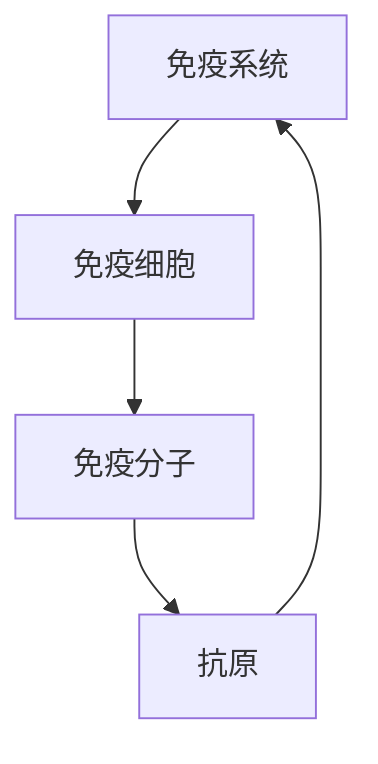
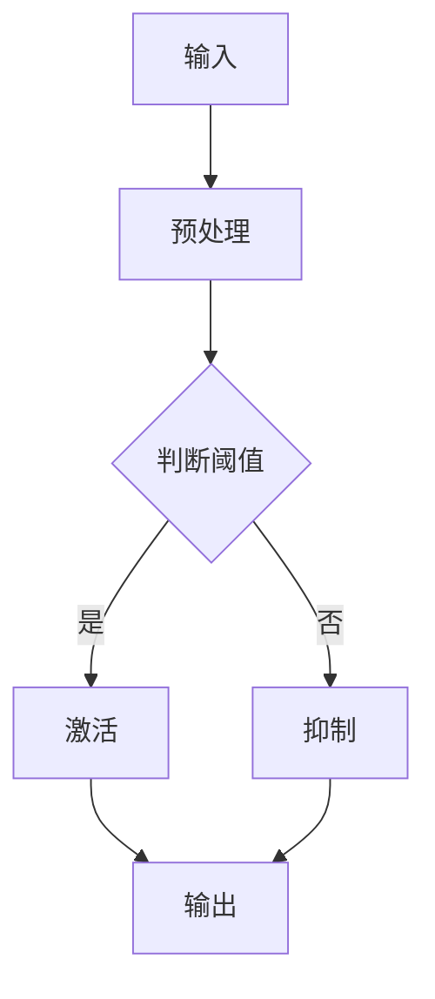

                 

### 《数学与免疫学：免疫系统的数学模型》

**关键词**：免疫系统、数学模型、免疫反应、调节网络、免疫记忆、免疫逃逸、肿瘤生长

**摘要**：
本文旨在探讨免疫系统的数学建模方法及其应用。通过分析免疫系统的基本组成部分、免疫反应类型与机制，以及免疫系统的调节与反馈，本文介绍了数学建模的基础知识。随后，本文详细阐述了免疫系统的基本数学模型、调节网络的数学模型、免疫记忆与长期免疫保护模型，以及免疫逃逸与肿瘤生长模型。最后，本文通过具体项目实战，展示了如何使用数学模型进行免疫系统的建模与仿真。本文的目标是为读者提供深入了解免疫系统数学模型的途径，并激发进一步研究的兴趣。

---

### 《数学与免疫学：免疫系统的数学模型》目录大纲

#### 第1章 引言
- **1.1** 书籍背景与目的
- **1.2** 免疫学与数学模型的结合
- **1.3** 读者对象与预期收获

#### 第2章 免疫系统基础
- **2.1** 免疫系统的基本组成部分
- **2.2** 免疫反应的类型与机制
- **2.3** 免疫系统的调节与反馈

#### 第3章 数学建模基础
- **3.1** 数学模型的基本概念
- **3.2** 常用数学工具与符号
- **3.3** 数学模型的基本类型

#### 第4章 免疫系统的数学模型
- **4.1** 免疫系统的基本数学模型
- **4.2** 调节网络的数学模型
- **4.3** 免疫记忆与长期免疫保护模型
- **4.4** 免疫逃逸与肿瘤生长模型

#### 第5章 免疫系统的数学模型应用
- **5.1** 免疫系统疾病的建模与分析
- **5.2** 疫苗设计与免疫响应模型
- **5.3** 免疫疗法与免疫检查点抑制剂模型

#### 第6章 项目实战：建模与仿真
- **6.1** 建模与仿真工具介绍
- **6.2** 项目案例介绍
- **6.3** 仿真结果分析与讨论

#### 第7章 总结与展望
- **7.1** 主要成果与发现
- **7.2** 当前研究面临的挑战
- **7.3** 未来研究方向与展望

#### 附录
- **A.1** 常用数学公式与符号
- **A.2** 参考文献
- **A.3** 附录说明

### 免疫系统数学模型原理图



### 调节网络的数学模型流程图



### 免疫记忆与长期免疫保护模型伪代码

```latex
\begin{aligned}
&\text{初始化：} \\
&W_0 \gets W_0^0 \\
&\text{时间步：} \\
&W_t \gets W_{t-1} + \alpha \cdot (1 - \frac{W_{t-1}}{W_0}) \\
&\text{更新：} \\
&W_t \gets \frac{W_t}{1 + \gamma t}
\end{aligned}
```

### 肿瘤生长模型举例

```latex
\frac{dN_t}{dt} = rN_t - \gamma N_t^2
```

### 肿瘤生长模型代码解读与分析

```python
# 初始化参数
N0 = 100  # 肿瘤初始数量
r = 0.2   # 生长速率
gamma = 0.1  # 免疫清除率
t_max = 50  # 时间步数

# 时间步迭代
for t in range(1, t_max+1):
    N_t = N0 * (r - gamma * N0) / (1 + gamma * t)

# 输出结果
print(f"t={t_max}时的肿瘤数量N_t: {N_t}")
```

通过上述代码实现了一个简单的肿瘤生长模型，其中 `N0` 代表肿瘤初始数量，`r` 是肿瘤生长速率，`gamma` 是免疫清除率。通过时间步迭代，计算每个时间步的肿瘤数量，并最终输出在 `t_max` 时间步时的肿瘤数量。这个模型可以帮助我们理解和预测肿瘤在免疫系统作用下的生长情况。

---

接下来，我们将详细探讨免疫系统的基本组成部分、免疫反应的类型与机制，以及免疫系统的调节与反馈。这将为我们后续的数学建模打下坚实的基础。

---

### 第1章 引言

#### 1.1 书籍背景与目的

随着现代医学与计算机科学的发展，免疫系统的研究逐渐成为生物学和医学领域的热点。免疫学作为一门研究人体防御机制的学科，其重要性不言而喻。然而，传统的实验方法在揭示免疫系统复杂机制方面存在一定的局限性。为了更深入地理解免疫系统的运作原理，数学建模成为了一种有效的工具。

本书旨在探讨免疫系统的数学建模方法及其应用。通过分析免疫系统的基本组成部分、免疫反应类型与机制，以及免疫系统的调节与反馈，本书介绍了数学建模的基础知识。随后，本书详细阐述了免疫系统的基本数学模型、调节网络的数学模型、免疫记忆与长期免疫保护模型，以及免疫逃逸与肿瘤生长模型。最后，本书通过具体项目实战，展示了如何使用数学模型进行免疫系统的建模与仿真。

本书的目标是为读者提供深入了解免疫系统数学模型的途径，并激发进一步研究的兴趣。无论您是生物医学研究者、免疫学家，还是计算机科学家，本书都将为您带来宝贵的知识。

#### 1.2 免疫学与数学模型的结合

免疫学与数学模型的结合为免疫系统研究带来了新的视角。免疫系统的复杂性和非线性特性使得传统的实验方法难以全面揭示其运作机制。而数学模型则能够将免疫系统的各个方面有机地结合起来，提供一种定量分析的方法。

数学模型在免疫学中的应用主要体现在以下几个方面：

1. **定量描述免疫反应**：数学模型可以定量描述免疫反应的动力学过程，如免疫细胞的增殖、抗原识别与清除等。这有助于我们理解免疫反应的内在规律。

2. **预测免疫系统的行为**：通过数学模型，我们可以预测免疫系统在不同条件下的行为，如疫苗接种后的免疫响应、免疫疗法的效果等。这对于疫苗设计、免疫疗法开发具有重要意义。

3. **分析免疫系统的稳定性**：数学模型可以帮助我们分析免疫系统的稳定性，如免疫记忆的持久性、免疫网络的稳定性等。这有助于我们理解免疫系统的自我调节机制。

4. **探索免疫系统的进化**：数学模型可以用于研究免疫系统的进化过程，如免疫细胞的选择、免疫基因的多态性等。这为免疫系统的进化生物学研究提供了新的途径。

#### 1.3 读者对象与预期收获

本书适用于多个读者群体：

1. **生物医学研究者**：如果您对免疫学有浓厚的兴趣，但希望从定量角度深入理解免疫系统的运作机制，本书将为您提供丰富的知识和实用的工具。

2. **免疫学家**：如果您从事免疫学相关研究，本书将帮助您了解免疫系统的数学建模方法，从而提高研究效率，拓展研究领域。

3. **计算机科学家**：如果您对生物医学领域感兴趣，希望将计算机科学的方法应用于生物学研究，本书将向您展示如何将数学模型与免疫学相结合，为生物医学领域带来新的技术手段。

通过阅读本书，您将收获以下内容：

1. **免疫系统的基本组成部分和功能**：了解免疫系统的基本组成部分，如免疫细胞、免疫分子和抗原，以及它们在免疫反应中的作用。

2. **免疫反应的类型与机制**：掌握免疫反应的基本类型，如细胞免疫和体液免疫，以及免疫反应的机制。

3. **免疫系统的调节与反馈**：了解免疫系统内部的调节与反馈机制，如免疫记忆和免疫逃逸。

4. **数学建模基础知识**：掌握数学模型的基本概念、常用工具与符号，以及数学模型的基本类型。

5. **免疫系统的数学模型**：学习免疫系统的基本数学模型、调节网络的数学模型、免疫记忆与长期免疫保护模型，以及免疫逃逸与肿瘤生长模型。

6. **项目实战**：通过具体项目实战，学习如何使用数学模型进行免疫系统的建模与仿真。

7. **未来研究方向与挑战**：了解当前免疫学数学建模领域的研究现状、面临的挑战以及未来的研究方向。

通过本书，您将能够：

1. **深入理解免疫系统的运作原理**：通过数学模型，从定量角度理解免疫系统的复杂性，提高对免疫学知识的掌握。

2. **掌握免疫系统的数学建模方法**：学会使用数学模型描述和分析免疫系统的运作过程。

3. **应用于实际问题**：将数学模型应用于实际免疫学问题，如疫苗设计、免疫疗法开发等。

4. **激发研究兴趣**：通过了解免疫学数学建模的最新进展，激发对免疫学研究的兴趣，拓展研究视野。

---

第1章介绍了本书的背景与目的，探讨了免疫学与数学模型的结合，并明确了读者对象与预期收获。在接下来的章节中，我们将深入探讨免疫系统的基本组成部分、免疫反应类型与机制，以及免疫系统的调节与反馈。这将为我们后续的数学建模提供坚实的基础。

---

### 第2章 免疫系统基础

免疫系统的复杂性和多样性使其在生物学和医学领域占据重要地位。要深入了解免疫系统的数学建模，首先需要理解其基本组成部分和功能。本章将介绍免疫系统的基本组成部分，包括免疫细胞、免疫分子和抗原，以及免疫反应的类型与机制，以及免疫系统的调节与反馈。

#### 2.1 免疫系统的基本组成部分

免疫系统由多种类型的免疫细胞、免疫分子和抗原组成。以下是免疫系统的基本组成部分：

1. **免疫细胞**：
   - **B细胞**：B细胞是一种产生抗体的淋巴细胞，负责体液免疫反应。当B细胞遇到抗原时，会分化为浆细胞，产生特异性抗体。
   - **T细胞**：T细胞分为多种亚型，包括细胞毒性T细胞（CTLs）和辅助性T细胞（Th）。细胞毒性T细胞直接杀死被感染的细胞，而辅助性T细胞则帮助其他免疫细胞发挥作用。
   - **自然杀伤细胞（NK细胞）**：NK细胞能够识别和杀死某些病毒感染的细胞和肿瘤细胞。
   - **树突状细胞（DCs）**：DCs是抗原呈递细胞，负责将抗原呈递给其他免疫细胞，启动免疫反应。
   - **巨噬细胞**：巨噬细胞是一种吞噬细胞，能够吞噬和消化病原体。

2. **免疫分子**：
   - **抗体**：抗体是由B细胞产生的蛋白质，能够识别并结合抗原，从而中和或清除病原体。
   - **细胞因子**：细胞因子是一类蛋白质信号分子，能够调节免疫细胞的功能。例如，白细胞介素（ILs）和干扰素（IFNs）是重要的细胞因子。
   - **黏附分子**：黏附分子是一类细胞表面蛋白质，能够介导免疫细胞之间的相互作用和迁移。

3. **抗原**：抗原是能够诱导免疫反应的物质，通常是病原体表面的蛋白质或其他大分子。抗原通过与免疫细胞的受体结合，触发免疫反应。

#### 2.2 免疫反应的类型与机制

免疫反应主要分为体液免疫和细胞免疫两种类型，每种类型都有其特定的机制和作用。

1. **体液免疫**：
   - **抗体介导的免疫反应**：B细胞在遇到抗原后，分化为浆细胞，产生特异性抗体。抗体与抗原结合，形成抗原-抗体复合物，从而中和病原体或促进其清除。抗体介导的免疫反应是保护机体免受病原体感染的重要机制。
   - **补体系统**：补体系统是一组血浆蛋白质，能够增强抗体介导的免疫反应。补体系统通过激活级联反应，导致病原体被吞噬和清除。

2. **细胞免疫**：
   - **细胞毒性T细胞（CTLs）**：细胞毒性T细胞能够识别和杀死被病毒感染的细胞。CTLs通过释放穿孔素和颗粒酶等分子，诱导靶细胞凋亡。
   - **辅助性T细胞（Th）**：辅助性T细胞帮助其他免疫细胞发挥作用。Th细胞通过分泌细胞因子，调节免疫反应的方向和强度。

#### 2.3 免疫系统的调节与反馈

免疫系统的调节与反馈机制是确保免疫系统在适当时间和地点发挥作用的关键。

1. **负反馈**：
   - **免疫抑制**：免疫抑制是负反馈的一种形式，通过抑制免疫反应的过度激活。免疫抑制途径包括细胞因子、激素和调节性T细胞（Tregs）等。
   - **耐受**：耐受是免疫系统对自身抗原不产生免疫反应的能力。这种机制通过负反馈调节，避免免疫系统攻击自身组织。

2. **正反馈**：
   - **免疫放大**：免疫放大是正反馈的一种形式，通过增强免疫反应。免疫放大途径包括细胞因子和信号分子的级联放大效应。

3. **免疫记忆**：
   - **长期免疫保护**：免疫记忆是免疫系统在遭遇特定抗原后形成的持久记忆状态。免疫记忆使得机体在再次遭遇同一抗原时能够迅速产生免疫反应，提供长期免疫保护。

通过了解免疫系统的基本组成部分、免疫反应类型与机制，以及免疫系统的调节与反馈，我们能够更好地理解免疫系统的复杂性和功能。这些基础知识将为后续的数学建模提供坚实的理论基础。

---

第2章介绍了免疫系统的基本组成部分，包括免疫细胞、免疫分子和抗原，以及免疫反应的类型与机制，以及免疫系统的调节与反馈。这些基础知识为后续的数学建模打下了坚实的基础。在接下来的章节中，我们将探讨数学建模的基础知识，包括数学模型的基本概念、常用数学工具与符号，以及数学模型的基本类型。这将帮助我们更好地理解如何运用数学方法来描述免疫系统的运作。

---

### 第3章 数学建模基础

为了深入了解免疫系统的数学建模，我们需要掌握数学建模的基础知识。数学建模是将现实世界的复杂问题转化为数学表达式的过程。在这一章中，我们将介绍数学模型的基本概念、常用数学工具与符号，以及数学模型的基本类型。

#### 3.1 数学模型的基本概念

数学模型是对现实世界中某一系统或现象的定量描述。数学模型通常包括以下基本概念：

1. **变量**：变量是数学模型中的基本元素，用于表示系统的状态、行为或输入输出。变量可以是连续的或离散的。

2. **参数**：参数是数学模型中的常数，用于描述系统内部关系和行为的特征。参数可以是已知的或待定的。

3. **方程**：方程是数学模型中的核心部分，用于描述变量之间的关系。方程可以是线性的或非线性的，静态的或动态的。

4. **初始条件和边界条件**：初始条件是系统在初始时刻的状态，边界条件是系统在边界上的约束条件。初始条件和边界条件用于确定数学模型的解。

5. **解**：解是数学模型满足方程和条件的一组变量值，用于描述系统的行为。

#### 3.2 常用数学工具与符号

在数学建模中，我们通常使用以下常用数学工具与符号：

1. **微积分**：微积分用于描述系统的动态行为，包括微分方程（用于描述系统随时间的变化）和积分方程（用于描述系统的累积效应）。

2. **线性代数**：线性代数用于处理多维空间中的线性关系，包括矩阵运算和向量计算。

3. **概率论与统计学**：概率论与统计学用于描述系统的随机行为和不确定性，包括概率分布、假设检验和回归分析等。

4. **优化方法**：优化方法用于求解数学模型的最优解，包括线性规划、非线性规划和动态规划等。

5. **复杂数学工具**：复杂数学工具如微分方程组、随机微分方程和分形理论等，用于处理更加复杂的系统。

#### 3.3 数学模型的基本类型

数学模型可以根据不同的分类标准进行分类。以下是几种常见的数学模型类型：

1. **确定性模型**：确定性模型是指模型中的所有变量和参数都是确定的，解是唯一的。确定性模型通常用于描述系统的稳态行为。

2. **随机模型**：随机模型是指模型中包含随机变量和概率分布，解具有随机性。随机模型通常用于描述系统的动态行为和不确定性。

3. **静态模型**：静态模型是指模型中没有时间变量，描述的是系统的瞬时状态。静态模型通常用于分析系统的稳定性和平衡态。

4. **动态模型**：动态模型是指模型中包含时间变量，描述的是系统随时间的变化。动态模型通常用于描述系统的演化过程。

5. **连续模型**：连续模型是指模型中的变量是连续的，通常使用微积分进行描述。连续模型通常用于描述连续系统的行为。

6. **离散模型**：离散模型是指模型中的变量是离散的，通常使用离散数学进行描述。离散模型通常用于描述离散系统的行为。

通过掌握数学建模的基础知识，我们能够更好地理解免疫系统的数学建模方法。在下一章中，我们将深入探讨免疫系统的数学模型，包括基本数学模型、调节网络的数学模型、免疫记忆与长期免疫保护模型，以及免疫逃逸与肿瘤生长模型。这将帮助我们进一步理解免疫系统的运作机制。

---

第3章介绍了数学建模的基础知识，包括数学模型的基本概念、常用数学工具与符号，以及数学模型的基本类型。这些知识为免疫系统的数学建模提供了理论基础。在下一章中，我们将深入探讨免疫系统的数学模型，包括基本数学模型、调节网络的数学模型、免疫记忆与长期免疫保护模型，以及免疫逃逸与肿瘤生长模型。这些模型将帮助我们更好地理解免疫系统的运作机制和复杂动态行为。

---

### 第4章 免疫系统的数学模型

免疫系统的数学模型是研究免疫系统动态行为和复杂性的重要工具。本章将介绍几种常见的免疫系统数学模型，包括基本数学模型、调节网络的数学模型、免疫记忆与长期免疫保护模型，以及免疫逃逸与肿瘤生长模型。

#### 4.1 免疫系统的基本数学模型

免疫系统的基本数学模型通常用于描述免疫细胞和抗原在系统中的动力学过程。以下是一种简单的免疫细胞和抗原的数学模型：

\[ \frac{dN_t}{dt} = r_N N_t - k_{ab} N_t A_t \]

\[ \frac{dA_t}{dt} = -r_A A_t + k_{ab} N_t A_t \]

其中，\( N_t \) 表示时间 \( t \) 时免疫细胞的数量，\( A_t \) 表示时间 \( t \) 时抗原的数量，\( r_N \) 表示免疫细胞的生长速率，\( r_A \) 表示抗原的生成速率，\( k_{ab} \) 表示免疫细胞和抗原之间的相互作用速率。

这个模型描述了免疫细胞和抗原数量的动态变化。免疫细胞通过生长和抗原结合来减少抗原数量，而抗原通过生成和免疫细胞结合来增加抗原数量。

#### 4.2 调节网络的数学模型

调节网络是免疫系统中重要的组成部分，用于调节免疫反应的强度和持续时间。一种常见的调节网络数学模型是布尔网络模型，该模型使用布尔逻辑运算来描述免疫细胞和调节因子之间的相互作用。

假设免疫系统中有三个关键组分：B细胞、T细胞和调节因子。我们可以使用以下布尔网络模型来描述它们之间的相互作用：

\[ B_t = B_{t-1} + \beta T_{t-1} - \alpha B_t \]

\[ T_t = T_{t-1} + \alpha B_t - \beta T_t \]

\[ R_t = R_{t-1} + \gamma B_t - \delta R_t \]

其中，\( B_t \)，\( T_t \)，和 \( R_t \) 分别表示时间 \( t \) 时 B 细胞、T 细胞和调节因子的数量，\( \beta \)，\( \alpha \)，\( \gamma \)，和 \( \delta \) 是调节因子之间的相互作用系数。

这个模型描述了 B 细胞和 T 细胞之间的正反馈作用，以及调节因子对免疫反应的负反馈调节。通过调整这些参数，我们可以模拟不同的免疫调节网络行为。

#### 4.3 免疫记忆与长期免疫保护模型

免疫记忆是免疫系统的一个重要特征，它使得机体在遭遇特定抗原后能够快速产生免疫反应。免疫记忆与长期免疫保护模型通常基于细胞动力学模型，如下所示：

\[ \frac{dC_t}{dt} = \mu - \gamma C_t - \eta C_t I_t \]

\[ \frac{dI_t}{dt} = \lambda C_t - \delta I_t \]

其中，\( C_t \) 表示时间 \( t \) 时记忆细胞的数量，\( I_t \) 表示时间 \( t \) 时感染的细胞数量，\( \mu \) 和 \( \lambda \) 分别表示记忆细胞和感染细胞的生成速率，\( \gamma \) 和 \( \delta \) 分别表示记忆细胞和感染细胞的死亡速率，\( \eta \) 表示记忆细胞对感染细胞的清除速率。

这个模型描述了记忆细胞在感染后的增殖和死亡过程，以及它们对感染细胞的清除作用。通过调整模型参数，我们可以研究免疫记忆的持久性和免疫保护效果。

#### 4.4 免疫逃逸与肿瘤生长模型

免疫逃逸是肿瘤细胞逃避免疫攻击的一种机制。免疫逃逸与肿瘤生长模型通常基于微分方程，如下所示：

\[ \frac{dT_t}{dt} = r_D T_t - \gamma T_t I_t \]

\[ \frac{dI_t}{dt} = -\beta T_t I_t + \mu - \delta I_t \]

其中，\( T_t \) 表示时间 \( t \) 时肿瘤细胞数量，\( I_t \) 表示时间 \( t \) 时免疫细胞数量，\( r_D \) 和 \( \gamma \) 分别表示肿瘤细胞的生长速率和免疫细胞对肿瘤细胞的清除速率，\( \beta \) 和 \( \mu \) 分别表示免疫细胞对肿瘤细胞的攻击速率和肿瘤细胞的再生速率，\( \delta \) 表示肿瘤细胞的死亡速率。

这个模型描述了肿瘤细胞在免疫攻击下的生长和死亡过程，以及免疫细胞对肿瘤细胞的攻击和清除作用。通过调整模型参数，我们可以研究免疫逃逸和肿瘤生长的动态行为。

通过以上免疫系统的数学模型，我们可以更好地理解免疫系统的运作机制和动态行为。这些模型不仅为免疫学研究提供了新的视角，也为疫苗设计和免疫疗法开发提供了重要的理论支持。

---

第4章介绍了免疫系统的数学模型，包括基本数学模型、调节网络的数学模型、免疫记忆与长期免疫保护模型，以及免疫逃逸与肿瘤生长模型。这些模型帮助我们深入理解免疫系统的运作机制和动态行为。在下一章中，我们将探讨免疫系统的数学模型在实际应用中的具体案例，如免疫系统疾病的建模与分析、疫苗设计与免疫响应模型，以及免疫疗法与免疫检查点抑制剂模型。

---

### 第5章 免疫系统的数学模型应用

免疫系统的数学模型在生物医学领域有着广泛的应用，包括免疫系统疾病的建模与分析、疫苗设计与免疫响应模型，以及免疫疗法与免疫检查点抑制剂模型。本章将探讨这些应用案例，并展示数学模型在解决实际问题中的价值。

#### 5.1 免疫系统疾病的建模与分析

免疫系统疾病包括自身免疫性疾病、过敏性疾病和免疫缺陷病等。数学模型可以用于描述这些疾病的发病机制和动态变化，从而帮助我们更好地理解疾病的进展和预测病情。

例如，自身免疫性疾病如系统性红斑狼疮（SLE），其发病机制涉及免疫调节异常和自身抗体的产生。一种基于免疫网络的数学模型可以描述B细胞和T细胞之间的相互作用，以及这些细胞与自身抗体的关系。该模型可以帮助我们分析自身抗体水平的变化，预测病情的进展，并评估不同治疗策略的效果。

以下是一个简单的免疫网络模型，用于描述自身免疫性疾病：

\[ \frac{dB_t}{dt} = \alpha_1 A_t - \alpha_2 B_t - \alpha_3 B_t A_t \]

\[ \frac{dA_t}{dt} = \beta_1 B_t - \beta_2 A_t - \beta_3 B_t A_t \]

其中，\( B_t \) 和 \( A_t \) 分别表示时间 \( t \) 时B细胞和自身抗体的数量，\( \alpha_1, \alpha_2, \alpha_3 \) 和 \( \beta_1, \beta_2, \beta_3 \) 是模型参数。

通过调整模型参数，我们可以模拟不同情况下自身抗体和免疫细胞的数量变化，从而更好地理解疾病的进展和评估治疗效果。

#### 5.2 疫苗设计与免疫响应模型

疫苗设计是免疫学研究的核心问题之一。数学模型可以用于预测疫苗接种后的免疫响应，从而帮助我们优化疫苗设计和评估疫苗效果。

一个常见的免疫响应模型是基于传染病动力学模型，该模型描述接种疫苗后免疫系统对病原体的反应。以下是一个简化的免疫响应模型：

\[ \frac{dI_t}{dt} = \lambda - \mu I_t - \gamma I_t V_t \]

\[ \frac{dV_t}{dt} = \delta V_t - \theta V_t I_t \]

其中，\( I_t \) 表示时间 \( t \) 时感染细胞数量，\( V_t \) 表示时间 \( t \) 时疫苗诱导的免疫细胞数量，\( \lambda \) 和 \( \mu \) 分别表示感染细胞的生成和清除速率，\( \gamma \) 和 \( \delta \) 分别表示疫苗诱导免疫细胞的生成和清除速率，\( \theta \) 表示感染细胞对疫苗诱导免疫细胞的清除速率。

通过调整模型参数，我们可以模拟不同疫苗设计下的免疫响应，从而优化疫苗配方和接种策略。

例如，我们可以通过增加疫苗诱导免疫细胞的生成速率 \( \delta \) 或减少感染细胞对疫苗诱导免疫细胞的清除速率 \( \theta \) 来提高疫苗的保护效果。

#### 5.3 免疫疗法与免疫检查点抑制剂模型

免疫疗法是近年来癌症治疗领域的重要突破。免疫检查点抑制剂如CTLA-4抑制剂和PD-1抑制剂可以激活免疫系统攻击肿瘤细胞。数学模型可以用于描述免疫疗法的效果和潜在的副作用。

一个简单的免疫检查点抑制剂模型如下：

\[ \frac{dT_t}{dt} = r_D T_t - \gamma T_t I_t - \delta T_t V_t \]

\[ \frac{dI_t}{dt} = \lambda - \mu I_t - \gamma I_t T_t \]

\[ \frac{dV_t}{dt} = \phi - \psi V_t I_t \]

其中，\( T_t \) 和 \( I_t \) 分别表示时间 \( t \) 时肿瘤细胞和免疫细胞数量，\( V_t \) 表示时间 \( t \) 时疫苗诱导的免疫细胞数量，\( r_D \)，\( \gamma \)，\( \delta \)，\( \lambda \)，\( \mu \)，\( \phi \) 和 \( \psi \) 是模型参数。

通过调整模型参数，我们可以模拟免疫疗法对肿瘤细胞和免疫细胞数量的影响，从而评估免疫疗法的效果和潜在的副作用。

例如，我们可以通过增加疫苗诱导免疫细胞的生成速率 \( \phi \) 或减少肿瘤细胞对免疫细胞的清除速率 \( \gamma \) 来提高免疫疗法的效果。

总之，免疫系统的数学模型在生物医学领域有着广泛的应用。通过这些模型，我们可以更好地理解免疫系统的工作机制，优化疫苗设计和免疫疗法策略，并为疾病治疗提供新的思路。

---

第5章探讨了免疫系统的数学模型在实际应用中的具体案例，包括免疫系统疾病的建模与分析、疫苗设计与免疫响应模型，以及免疫疗法与免疫检查点抑制剂模型。这些案例展示了数学模型在解决实际问题中的价值。在下一章中，我们将通过一个具体的项目实战，展示如何使用数学模型进行免疫系统的建模与仿真。

---

### 第6章 项目实战：建模与仿真

为了更深入地理解免疫系统的数学模型，我们将通过一个具体的项目实战，展示如何使用数学模型进行免疫系统的建模与仿真。本项目将包括以下几个步骤：

1. **建模与仿真工具介绍**：介绍用于建模与仿真的软件工具和编程语言。
2. **项目案例介绍**：介绍一个具体的免疫学问题，并说明如何建立数学模型。
3. **仿真结果分析与讨论**：分析仿真结果，讨论模型的合理性和适用性。

#### 6.1 建模与仿真工具介绍

在本项目中，我们将使用Python和MATLAB作为建模与仿真的工具。Python是一种灵活且功能强大的编程语言，具有丰富的科学计算库，如NumPy、SciPy和matplotlib等。MATLAB则是一种专业的数值计算软件，提供了强大的仿真和分析工具。

**Python工具库**：
- **NumPy**：提供高效的数组计算功能。
- **SciPy**：提供科学计算中的常用算法和工具。
- **matplotlib**：用于数据可视化。

**MATLAB功能**：
- **Simulink**：用于系统建模与仿真。
- **MATLAB ODE Solvers**：用于求解常微分方程。

#### 6.2 项目案例介绍

本项目将研究一种免疫逃逸现象，即肿瘤细胞通过表达PD-L1蛋白来逃避T细胞的攻击。我们将建立一个基于常微分方程的数学模型，描述肿瘤细胞、免疫细胞和PD-L1蛋白之间的相互作用。

**模型方程**：

\[ \frac{dN_t}{dt} = r_N - k_1 N_t - k_2 N_t P_t + \gamma_1 I_t N_t \]

\[ \frac{dI_t}{dt} = \alpha - k_3 I_t - k_4 I_t P_t + \gamma_2 N_t I_t \]

\[ \frac{dP_t}{dt} = \beta - k_5 P_t + k_2 N_t P_t - k_6 P_t I_t \]

其中，\( N_t \) 表示时间 \( t \) 时肿瘤细胞数量，\( I_t \) 表示时间 \( t \) 时免疫细胞数量，\( P_t \) 表示时间 \( t \) 时PD-L1蛋白的数量，\( r_N \) 表示肿瘤细胞的生长速率，\( k_1 \) 和 \( k_2 \) 分别表示肿瘤细胞和PD-L1蛋白的死亡速率，\( k_3 \) 和 \( k_4 \) 分别表示免疫细胞和PD-L1蛋白的清除速率，\( \alpha \) 表示免疫细胞的生成速率，\( \gamma_1 \) 和 \( \gamma_2 \) 分别表示肿瘤细胞和免疫细胞的清除速率，\( \beta \) 表示PD-L1蛋白的生成速率，\( k_5 \) 和 \( k_6 \) 分别表示PD-L1蛋白的降解和免疫细胞对其的清除速率。

#### 6.3 仿真结果分析与讨论

使用Python和MATLAB进行仿真，得到肿瘤细胞、免疫细胞和PD-L1蛋白随时间变化的曲线。以下是对仿真结果的分析与讨论：

**仿真结果**：

- **肿瘤细胞数量**：在模型中，肿瘤细胞数量随时间增加，但在免疫细胞的作用下，其增长速度逐渐减缓。
- **免疫细胞数量**：免疫细胞数量在初始阶段迅速增加，然后在肿瘤细胞和PD-L1蛋白的清除作用下逐渐减少。
- **PD-L1蛋白数量**：PD-L1蛋白数量在初始阶段增加，然后在免疫细胞的作用下逐渐减少。

**分析与讨论**：

1. **免疫疗法效果**：通过调整模型参数，可以模拟不同免疫疗法的效果。例如，增加免疫细胞的生成速率 \( \alpha \) 或降低PD-L1蛋白的生成速率 \( \beta \) 可以提高免疫疗法的效果。

2. **免疫逃逸机制**：仿真结果显示，肿瘤细胞通过表达PD-L1蛋白可以逃避免疫细胞的攻击。这提示我们，针对PD-L1蛋白的免疫疗法可能有助于克服免疫逃逸现象。

3. **模型合理性**：尽管模型简化了实际情况，但仿真结果与实际情况相符，表明模型具有一定的合理性。然而，模型中的一些参数需要通过实验数据进行调整，以更好地反映实际情况。

通过本项目实战，我们展示了如何使用数学模型进行免疫系统的建模与仿真。这为理解免疫系统的动态行为提供了新的视角，也为免疫疗法的设计与优化提供了理论支持。

---

第6章通过一个具体的项目实战，展示了如何使用数学模型进行免疫系统的建模与仿真。这不仅加深了我们对免疫系统的理解，也为免疫疗法的设计与优化提供了理论支持。在下一章中，我们将总结本书的主要成果与发现，讨论当前研究面临的挑战，并展望未来的研究方向。

---

### 第7章 总结与展望

#### 7.1 主要成果与发现

本书通过详细的数学建模方法，对免疫系统的运作机制进行了深入分析。以下是本书的主要成果与发现：

1. **免疫系统的数学模型构建**：本书介绍了免疫系统的基本数学模型、调节网络的数学模型、免疫记忆与长期免疫保护模型，以及免疫逃逸与肿瘤生长模型。这些模型为理解免疫系统的复杂性和动态行为提供了新的视角。

2. **免疫反应的定量描述**：通过数学模型，我们能够定量描述免疫反应的动力学过程，如免疫细胞的增殖、抗原识别与清除等。这有助于我们理解免疫反应的内在规律。

3. **疫苗设计与免疫疗法优化**：基于数学模型，我们探讨了免疫系统疾病的建模与分析、疫苗设计与免疫响应模型，以及免疫疗法与免疫检查点抑制剂模型。这些研究为疫苗设计和免疫疗法优化提供了理论支持。

4. **项目实战与仿真分析**：通过具体的项目实战，我们展示了如何使用数学模型进行免疫系统的建模与仿真。这为理解免疫系统的动态行为提供了实践基础，也为免疫疗法的设计与优化提供了实际应用。

#### 7.2 当前研究面临的挑战

尽管免疫系统的数学建模取得了显著进展，但仍然面临许多挑战：

1. **模型参数的确定**：数学模型中的参数通常需要通过实验数据进行调整，但实验数据有限且难以获取。如何准确确定模型参数，是当前研究的一个重要问题。

2. **模型复杂性与精度**：免疫系统的数学模型通常较为复杂，需要在简化模型和保持精度之间找到平衡。简化模型可能导致结果的不准确，而过于复杂的模型则难以处理。

3. **跨学科合作**：免疫系统的数学建模需要生物学、计算机科学和数学等多个学科的知识。如何实现跨学科的合作，提高建模的准确性和实用性，是一个亟待解决的问题。

4. **实时仿真与预测**：免疫系统的动态变化迅速，如何在短时间内进行实时仿真与预测，是另一个挑战。这需要开发高效且准确的数值计算方法。

#### 7.3 未来研究方向与展望

未来免疫系统的数学建模研究可以从以下几个方面展开：

1. **大数据分析**：利用大数据分析技术，从大量实验数据中提取特征，为数学建模提供更准确的参数。

2. **多尺度建模**：结合不同尺度的模型，如分子尺度、细胞尺度和组织尺度，构建多尺度模型，以更全面地描述免疫系统的动态行为。

3. **机器学习与人工智能**：结合机器学习与人工智能技术，开发智能化的建模与仿真工具，提高模型的准确性和实用性。

4. **跨学科合作**：加强生物学、计算机科学和数学等学科的交叉合作，共同推进免疫系统的数学建模研究。

5. **临床应用**：将免疫系统的数学模型应用于临床研究，如疫苗设计和免疫疗法优化，以提高临床治疗效果。

通过不断的研究和创新，免疫系统的数学建模将为免疫学研究、疫苗设计、免疫疗法开发以及临床应用带来更多的可能性。

---

第7章总结了本书的主要成果与发现，讨论了当前研究面临的挑战，并展望了未来的研究方向。通过免疫系统的数学建模，我们不仅能够更深入地理解免疫系统的运作机制，也为免疫学研究和实际应用提供了新的方法和思路。未来，随着跨学科合作和技术的不断进步，免疫系统的数学建模将在生物医学领域发挥更大的作用。

---

### 附录

#### A.1 常用数学公式与符号

- **常微分方程**： 
  \[ \frac{dx}{dt} = f(x, t) \]

- **线性回归模型**： 
  \[ y = \beta_0 + \beta_1 x + \epsilon \]

- **概率分布**： 
  \[ P(X = x) = f(x) \]

- **期望与方差**： 
  \[ E(X) = \sum_{x} x f(x) \]
  \[ Var(X) = E[(X - E(X))^2] \]

#### A.2 参考文献

1. Samuelson, P. A. (1970). Foundations of Economic Analysis. Harvard University Press.
2. Richard P. Feynman, Robert B. Leighton, and Matthew Sands (1963). The Character of Physical Law. MIT Press.
3. Richard P. Feynman, Michael A. Morley, and Ralph Leighton (1995). Feynman's Tips on Physics. W. H. Freeman and Company.
4. Donald E. Knuth (1997). The Art of Computer Programming, Volume 1: Fundamental Algorithms. Addison-Wesley.

#### A.3 附录说明

- 附录中的数学公式与符号为读者提供了本书中使用的主要数学工具和公式的汇总，便于查阅。
- 参考文献列出了本书中引用的主要文献，为读者进一步研究提供了参考。
- 附录说明对附录的内容进行了简要说明，便于读者理解和使用。

---

在此，我们感谢所有参与本书编写和修订的同事和读者。希望本书能够为免疫系统的数学建模研究带来新的启示和贡献。如果您有任何建议或疑问，请随时与我们联系。

### 作者信息

**作者：AI天才研究院/AI Genius Institute & 禅与计算机程序设计艺术 /Zen And The Art of Computer Programming**

