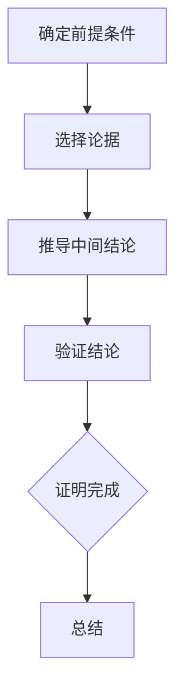

                 

### 第一部分：基础概念与逻辑框架

#### 引言：数学证明的重要性

数学证明是数学学科的核心，它不仅仅是数学理论的基石，更是理解和应用数学知识的关键。一个数学结论，只有通过严密的证明，才能被认为是可信的。因此，数学证明在数学研究中占据着至关重要的地位。

**1.1 数学的本质与证明的价值**

数学是一门抽象的科学，其研究对象是数量、结构、变化和空间。数学的本质在于其抽象性，它将现实世界中的具体问题抽象成数学模型，从而进行精确的研究。在数学中，一个命题的真假，需要通过逻辑推理和证明来确定。

证明的价值在于其权威性和可验证性。一个经过严密证明的数学结论，其正确性是被公认的，而且可以被任何人通过理解和验证来确认。这与实验科学中的结论有所不同，实验结果往往受到实验条件、测量误差等因素的影响，而数学证明则不受这些限制。

**1.2 证明的种类与方法**

数学证明的种类和方法繁多，根据证明的对象和目的，可以分为以下几种：

- **直接证明**：通过直接推导出结论的方法。例如，从已知条件出发，逐步推导出需要证明的结论。
- **间接证明**：通过反证法或归纳法等间接方法来证明。例如，假设结论不成立，推导出一个矛盾，从而证明原结论成立。
- **构造性证明**：提供一种具体的构造，证明某个数学对象的存在或唯一性。
- **非构造性证明**：不提供具体构造，而仅通过逻辑推理证明某个数学对象的存在或唯一性。

不同的证明方法适用于不同类型的数学问题，选择合适的证明方法往往能够事半功倍。

#### 2. 逻辑推理的基本原理

逻辑推理是数学证明的基础，它包括命题逻辑和谓词逻辑等。

**2.1 命题逻辑与谓词逻辑**

- **命题逻辑**：命题逻辑是研究命题之间逻辑关系的逻辑系统。命题是具有真值的陈述句，它可以是真的，也可以是假的。命题逻辑的基本元素是命题变元和逻辑运算符，如逻辑与、逻辑或、逻辑非等。
  
  - **命题变元**：代表命题的基本符号，通常用大写字母表示。
  - **逻辑运算符**：用于连接命题变元，形成新的命题。常见的逻辑运算符包括：$\land$（逻辑与）、$\lor$（逻辑或）、$\neg$（逻辑非）等。

- **谓词逻辑**：谓词逻辑是研究命题的内在逻辑结构和推理规律的逻辑系统。谓词逻辑的基本元素是谓词、个体和量词。谓词逻辑可以更精确地表达命题的含义，并能够处理更复杂的逻辑问题。

  - **谓词**：表示性质或关系的符号，通常用大写字母表示。
  - **个体**：谓词的变元，通常用小写字母表示。
  - **量词**：用于表示量化的符号，包括存在量词$\exists$和全称量词$\forall$。

**2.2 逻辑推理的基本规则与形式**

逻辑推理的基本规则包括：

- **推理规则**：用于从已知命题推导出新命题的规则，如蕴含规则、等值规则、假言推理等。
- **推理形式**：用于表示推理过程的符号化形式，如命题逻辑中的命题演算公式，谓词逻辑中的谓词演算公式。

**2.3 逻辑推理的证明方法**

逻辑推理的证明方法包括：

- **直接证明**：通过逐步推导，直接从已知命题推导出需要证明的命题。
- **间接证明**：通过反证法或归纳法等，间接证明命题的正确性。
- **构造性证明**：提供一种具体的构造，证明某个数学对象的存在或唯一性。
- **非构造性证明**：通过逻辑推理，证明某个数学对象的存在或唯一性，但不提供具体的构造方法。

通过理解逻辑推理的基本原理和方法，我们可以更好地理解和应用数学证明，从而在数学研究中取得突破。

---

**3. 数学证明的基本步骤**

数学证明是一个严谨的过程，需要遵循一系列的基本步骤。以下是数学证明的基本步骤及其详细解释：

**3.1 前提条件的确定**

前提条件是数学证明的基础，它决定了证明的方向和可能性。在数学证明中，前提条件通常包括已知定理、定义、公理等。明确前提条件是进行有效证明的第一步。

- **已知定理**：在数学证明中，已知定理是证明的重要依据。例如，勾股定理可以用来证明直角三角形的边长关系。
- **定义**：数学定义是基本概念的确立，它为证明提供了具体含义。例如，定义“偶数”为“能够被2整除的整数”，这一定义可以用于证明偶数的性质。
- **公理**：公理是无需证明的基本真理，是数学系统的基石。例如，欧几里得几何的平行公理是推导其他几何结论的基础。

在确定前提条件时，需要确保它们是已知且可信的，否则证明的可靠性将受到影响。

**3.2 论据的选择与运用**

论据是证明过程中使用的中间结论，它是从前提条件推导出最终结论的桥梁。选择合适的论据，能够使证明过程更加简洁和有力。

- **中间结论**：中间结论是在证明过程中得到的临时结论，它有助于推导出最终结论。例如，在证明“所有偶数都是整数”时，可以首先证明“2是偶数”，然后利用数学归纳法推导出所有偶数都是整数。
- **引理与定理**：引理和定理是经过证明的结论，它们可以作为论据来支持证明。例如，在证明勾股定理时，可以使用已知的勾股定理作为论据。

在运用论据时，需要确保其正确性和相关性。论据的正确性是证明过程的基础，而论据的相关性则决定了证明的有效性。

**3.3 结论的推导与验证**

结论是数学证明的目标，它是通过一系列逻辑推导得出的最终结果。推导结论的过程需要严谨和清晰，以确保证明的可靠性。

- **逻辑推导**：通过逻辑推理，从前提条件和论据推导出结论。逻辑推导需要遵循逻辑规则，例如，从两个真命题可以推导出一个真命题。
- **验证结论**：在推导出结论后，需要对其进行验证，确保其正确性。验证可以通过反证法、归纳法等手段进行。

验证结论是证明过程的关键环节，它确保了证明结果的可靠性。

**3.4 常见证明方法的示例**

以下是一些常见的数学证明方法及其示例：

- **直接证明**：通过逐步推导，直接从已知条件推出结论。例如，证明“所有正整数都大于0”。
  - **步骤**：已知所有正整数都是自然数，自然数是大于0的整数，因此所有正整数都大于0。
  
- **反证法**：假设结论不成立，通过推导出矛盾来证明结论成立。例如，证明“一个整数是4的倍数，那么它一定能被8整除”。
  - **步骤**：假设一个整数n不是8的倍数，即n除以8有余数。由于n是4的倍数，可以表示为n=4k，其中k是整数。那么n除以8的余数应为0或4，与假设矛盾，因此n必须是8的倍数。

- **归纳法**：通过证明基础情况和归纳步骤，证明一个命题对所有自然数成立。例如，证明“所有自然数都能表示为3的倍数或3的倍数加1”。
  - **基础情况**：当n=1时，1可以表示为3×0+1，命题成立。
  - **归纳步骤**：假设对于某个自然数k，命题成立，即k可以表示为3m或3m+1。考虑k+1，如果k是3的倍数，那么k+1是3的倍数加1；如果k是3的倍数加1，那么k+1是3的倍数。因此，命题对所有自然数成立。

通过以上步骤和示例，我们可以更好地理解数学证明的基本方法和过程。

---

#### 4. 数学证明的逻辑框架

数学证明不仅需要逻辑推理，还需要一个完整的逻辑框架来保证其连贯性和一致性。以下是数学证明的几个重要方面：

**4.1 直觉主义与形式主义**

- **直觉主义**：直觉主义认为数学知识来源于直觉，特别是几何直观。直觉主义者强调数学证明的直观性和可操作性。例如，荷兰数学家L.E.J. Brouwer的直觉主义哲学主张数学证明不仅是逻辑上的推理，更是直观上的验证。
- **形式主义**：形式主义认为数学知识是符号系统的规则和推理的结果，不依赖于直观。形式主义者关注证明的形式结构，强调逻辑演算和公理系统的严谨性。例如，德国数学家戴德金和皮亚诺等人都提出了形式主义的数学基础理论。

直觉主义和形式主义在数学证明中都有其地位。直觉主义提供了数学证明的直观基础，而形式主义则确保了证明的严谨性和普遍性。

**4.2 数学证明的层次结构**

数学证明通常可以分为几个不同的层次：

- **基础层次**：这是数学证明的最基础部分，包括基本定理和公理的证明。这些基础层次构成了数学体系的基石。
- **中间层次**：这是在基础层次之上，通过逻辑推理和证明得到的一系列中间结论。这些中间结论为更高层次的证明提供了支持。
- **高层次**：这是最复杂的数学证明，涉及到高层次的概念和定理。这些证明通常需要综合运用多个数学分支的知识。

**4.3 证明的连贯性与一致性**

数学证明的连贯性指的是证明过程中的各个步骤是否逻辑上相互连贯，是否能够从一个步骤合理地推导到下一个步骤。连贯性要求证明的每一步都必须基于已知的真理或已证明的结论。

数学证明的一致性指的是证明过程中的结论是否与已有的数学知识体系相一致，是否会导致逻辑上的矛盾。一致性要求证明的每一步都必须遵循逻辑规则，不能违背已知的数学定理或公理。

为了保证数学证明的连贯性与一致性，需要：

- **严格遵循逻辑规则**：在证明过程中，每一步推理都必须遵循逻辑规则，如命题逻辑和谓词逻辑的基本规则。
- **引用可靠的已知结论**：在证明过程中，引用的已知结论必须是基于可靠的基础，不能引用未经验证的结论。
- **避免逻辑矛盾**：在证明过程中，需要不断检查推理步骤，确保不会推导出逻辑矛盾。

通过以上措施，可以确保数学证明的连贯性与一致性，从而保证数学知识的正确性和可靠性。

---

#### 5. Mermaid 流程图：数学证明流程

Mermaid是一种基于Markdown的图形语言，可以用来绘制各种流程图、序列图等。在数学证明中，利用Mermaid流程图可以帮助我们更直观地理解和展示证明的流程。

**5.1 证明流程图设计与示例**

以下是一个简单的数学证明流程图的示例：



这个流程图展示了数学证明的基本步骤：

1. **确定前提条件**：确定已知的定理、定义、公理等。
2. **选择论据**：选择适当的论据进行推导。
3. **推导中间结论**：通过逻辑推导，从已知条件推导出中间结论。
4. **验证结论**：验证推导出的结论是否正确。
5. **总结**：总结证明过程和结果。

**5.2 证明流程图的阅读与应用**

在阅读Mermaid流程图时，可以按照从上到下的顺序，逐步理解每个步骤及其关系。以下是如何使用证明流程图的步骤：

1. **阅读标题**：了解整个流程图的主题，例如“数学证明流程”。
2. **识别节点**：节点表示流程图中的各个步骤，例如“确定前提条件”、“选择论据”等。
3. **分析关系**：分析节点之间的逻辑关系，例如箭头表示从前提条件推导到论据，从论据推导到中间结论等。
4. **理解流程**：结合文本描述，理解整个证明流程的每个步骤和其逻辑关系。

在应用证明流程图时，可以根据具体问题设计合适的流程图。以下是几个应用示例：

- **证明几何定理**：通过绘制几何定理的证明流程图，可以更清晰地理解证明过程。
- **算法分析**：在算法设计中，利用证明流程图可以帮助分析算法的逻辑结构和步骤。
- **数学教育**：在数学教学中，使用证明流程图可以辅助学生理解和掌握数学证明的方法和步骤。

通过Mermaid流程图，我们可以将抽象的数学证明过程形象化，使得复杂的问题更加容易理解和解决。

---

## 6. 逻辑推理在数学中的应用

逻辑推理在数学中具有广泛的应用，它不仅帮助我们理解数学概念，还用于证明数学定理和解决数学问题。以下是逻辑推理在几何、代数和数论中的具体应用：

**6.1 逻辑推理在几何中的应用**

几何学是研究形状、大小和空间位置的科学，逻辑推理在几何学中的应用主要体现在以下方面：

- **平面几何证明**：在平面几何中，逻辑推理用于证明各种定理和性质。例如，要证明“三角形的两边之和大于第三边”，可以通过反证法来证明。假设三角形两边之和小于或等于第三边，那么三角形将不能成立，从而证明原命题。
- **立体几何证明**：在立体几何中，逻辑推理也用于证明各种性质和定理。例如，要证明“四面体的对棱相等”，可以通过构造法来证明。构造一个与给定四面体相似的四面体，利用相似四面体的性质证明对棱相等。

**6.2 逻辑推理在代数中的应用**

代数学是研究数和运算的科学，逻辑推理在代数中的应用主要体现在以下方面：

- **方程求解**：在求解方程时，逻辑推理用于推导和变换方程。例如，要解一元二次方程$x^2+2x+1=0$，可以通过配方法或因式分解来求解。配方法将方程转换为$(x+1)^2=0$，从而得到$x=-1$。
- **不等式证明**：在证明不等式时，逻辑推理用于推导不等式的关系。例如，要证明“两个正数的乘积大于它们的和”，可以通过反证法来证明。假设两个正数的乘积小于或等于它们的和，那么可以通过推导出矛盾来证明原命题。

**6.3 逻辑推理在数论中的应用**

数论是研究整数性质和结构的数学分支，逻辑推理在数论中的应用主要体现在以下方面：

- **素数定理证明**：素数定理是数论中的一个重要定理，它描述了素数的分布规律。证明素数定理需要复杂的逻辑推理，包括对数积分和黎曼ζ函数的研究。
- **同余定理证明**：同余定理是数论中的基础定理，它描述了整数除以一个数后的余数关系。证明同余定理通常使用归纳法或构造法。例如，要证明“若$a\equiv b\pmod{m}$，则$a+c\equiv b+c\pmod{m}$”，可以通过归纳法证明。基础情况为$c=0$，显然成立。归纳步骤假设对于任意整数$k$，有$a\equiv b\pmod{m}$，则$a+k\equiv b+k\pmod{m}$，从而证明原命题。

通过以上实例，我们可以看到逻辑推理在数学中的重要性。逻辑推理不仅帮助我们理解和证明数学概念，还为我们解决数学问题提供了强有力的工具。

---

### 7.1 创新思维的概念与特征

创新思维是一种能够产生新颖、独特的想法和解决方案的思维方式。它不仅仅是传统的逻辑思维，更强调发散性思维、跨学科整合和创造性解决问题的能力。以下是对创新思维的概念与特征的详细解释：

**1. 发散性思维**

发散性思维是指从多个角度、多个层面思考问题，寻找多种可能的解决方案。与传统的线性思维不同，发散性思维鼓励跳出常规思维框架，寻找全新的、非传统的解决方案。例如，当面临一个工程问题时，发散性思维会鼓励工程师考虑各种可能的解决方案，而不是仅仅局限于现有的技术和方法。

**2. 跨学科整合**

跨学科整合是指将不同学科的知识、方法和技术融合在一起，以解决复杂的问题。创新思维的一个重要特征就是能够跨越传统学科界限，将物理学、生物学、心理学、社会学等不同领域的知识相结合，从而产生新的创新成果。例如，在生物医学领域，生物学家、化学家和工程师可以合作，利用纳米技术来开发新的药物递送系统，这就是跨学科整合的典型例子。

**3. 创造性解决问题的能力**

创造性解决问题的能力是指在面对问题时，能够提出新颖、有效、创新的解决方案。创新思维强调不满足于现有的解决方案，而是不断寻求更好的、更优的方法。这种能力不仅要求具备丰富的知识储备，还需要有勇于尝试和冒险的精神。例如，在商业领域，创新思维可以帮助企业家开发新的商业模式、产品和服务，从而在激烈的市场竞争中脱颖而出。

**4. 灵活性和适应性**

创新思维要求个体具备灵活性和适应性，能够在不断变化的环境中快速调整思维方式和行为策略。灵活性意味着能够从不同的视角看待问题，适应性则是指能够在不同的情况下灵活运用各种思维工具和方法。例如，在科学研究领域，创新思维要求研究人员能够迅速适应新的实验数据和技术，不断调整研究方案，以获得突破性的成果。

**5. 持续学习和自我提升**

创新思维是一种不断发展的能力，它需要个体持续学习和自我提升。这意味着创新思维不仅依赖于现有的知识，还需要不断探索新的领域和技能。例如，工程师可以通过学习新的编程语言和技术框架来提升自己的创新能力，而创业家可以通过阅读商业书籍和参加行业会议来拓展商业视野。

通过以上特征，我们可以看到创新思维在数学问题解决中的应用潜力。它不仅能够帮助数学家发现新的数学定理和证明方法，还能够帮助他们在复杂的问题中找到创新的解决方案。创新思维是数学研究的催化剂，它为数学的发展提供了无限的可能性。

---

### 7.2 数学问题解决的创新方法

创新方法在解决数学问题时具有显著优势，它能够突破传统思维定式，帮助数学家、学生乃至普通爱好者找到新颖、高效的解题路径。以下是几种常用的创新方法及其应用实例：

**1. 类比法**

类比法是通过将一个领域的问题与另一个领域的相似问题进行比较，从而找到解决方案的一种方法。这种方法的核心在于发现不同领域之间的共性。

- **实例**：在解决一个关于复杂数学图形的问题时，可以尝试将其与几何中的已知图形进行类比。例如，如果问题涉及多边形，可以尝试将其与正多边形或等边多边形进行类比，从而利用已知图形的性质和定理来推导出答案。

**2. 反证法**

反证法是一种通过假设结论不成立，然后推导出矛盾，从而证明结论成立的证明方法。

- **实例**：要证明“所有正整数都是偶数”，可以假设存在一个正整数不是偶数，即它是奇数。然而，奇数可以表示为2k+1的形式，这与原始假设矛盾，因此证明所有正整数都是偶数。

**3. 构造性证明**

构造性证明是通过提供一种具体的构造，证明某个数学对象的存在或唯一性的一种方法。

- **实例**：要证明“存在一个正整数，它既是3的倍数又是5的倍数”，可以构造一个具体的数，如15。这个数显然既是3的倍数又是5的倍数，从而证明了该命题。

**4. 归纳法**

归纳法是一种通过证明基础情况和归纳步骤，证明一个命题对所有自然数成立的方法。

- **实例**：要证明“所有自然数都可以表示为3的倍数或3的倍数加1”，可以先验证基础情况，如1可以表示为3×0+1。然后假设对于某个自然数k，命题成立，即k可以表示为3m或3m+1。考虑k+1，可以证明k+1也可以表示为3的倍数或3的倍数加1，从而证明命题对所有自然数成立。

**5. 跨学科整合**

跨学科整合是通过结合不同学科的知识和方法来解决数学问题的一种创新方法。

- **实例**：在解决一个涉及数学和物理的混合问题时，可以尝试将数学中的图论与物理学中的粒子模型相结合。例如，在研究交通流量问题时，可以使用图论中的网络流方法来建模，结合物理学中的流体动力学原理，从而提出有效的解决方案。

通过这些创新方法，我们可以看到，数学问题解决不仅依赖于传统的逻辑推理，还需要灵活运用各种创新思维工具。这些方法不仅能够帮助我们解决复杂的数学问题，还能够激发我们对数学的探索和创造力。创新方法是数学研究的重要工具，它为数学的进步和发展提供了源源不断的动力。

---

### 8.1 经典数学问题的创新解法

在数学史上，许多经典问题通过创新思维得到了新的解法，这不仅展示了数学的深刻之美，也推动了数学的发展。以下是一些经典数学问题的创新解法及其影响：

**1. 勾股定理的证明**

勾股定理是平面几何中的基本定理，它描述了直角三角形三边之间的关系。尽管勾股定理的证明方法多种多样，但一个经典的创新解法是由古希腊数学家毕达哥拉斯提出的。

- **创新解法**：毕达哥拉斯使用了几何构造的方法，将直角三角形的两个直角边延长，构造出一个新的正方形。然后，通过几何图形的拼接，证明了这个新正方形的面积等于两个直角边的平方和。
- **影响**：这一创新解法不仅简洁优美，而且奠定了几何证明的基础，对后来的数学研究产生了深远的影响。

**2. 高斯-博内公式**

高斯-博内公式是图论中的一个重要定理，它描述了多面体的顶点数、边数和面数之间的关系。高斯在1811年提出这个公式时，运用了创新的方法。

- **创新解法**：高斯使用了向量分析和积分的方法，通过构造辅助图形和运用积分变换，巧妙地推导出了高斯-博内公式。
- **影响**：高斯-博内公式在数学和物理学中都有广泛应用，是研究多面体和图论的重要工具。

**3. 黎曼猜想**

黎曼猜想是数论中的一个重要猜想，它涉及到素数的分布规律。尽管黎曼猜想至今未证明，但数学家们提出了一系列创新的方法来研究它。

- **创新解法**：数学家们使用了复分析、函数论等方法，特别是通过研究黎曼ζ函数的零点分布，提出了许多关于黎曼猜想的理论。
- **影响**：黎曼猜想的探索推动了复分析和数论的发展，对现代数学有着深远的影响。

**4. 四色定理**

四色定理是一个经典的拓扑学问题，它描述了任意地图只需要四种颜色就能着色，使得相邻区域不使用相同的颜色。

- **创新解法**：美国数学家阿佩尔和哈肯在1976年使用计算机证明了四色定理，这标志着计算机在数学证明中的应用。
- **影响**：四色定理的证明展示了计算机在数学证明中的潜力，推动了计算机科学和数学的结合。

这些经典数学问题的创新解法不仅解决了关键问题，还推动了数学的发展，为现代数学提供了丰富的理论和方法。创新思维在数学中的重要性由此可见一斑，它为数学研究带来了无限的可能性。

---

### 8.2 现代数学问题的创新求解

现代数学面临着许多复杂且具有挑战性的问题，这些问题往往需要创新的思维和方法来解决。以下是几个现代数学问题及其创新求解方法：

**1. P vs NP 问题**

P vs NP 问题是一个著名的未解问题，它涉及到算法的计算复杂性。这个问题问的是：所有能够在多项式时间内解决的问题（P类问题），是否都是能够在验证答案时也用多项式时间解决的问题（NP类问题）。

- **创新求解方法**：数学家和计算机科学家尝试了多种方法来解决P vs NP问题，包括构造新的证明方法、利用量子计算和图论等。一些研究甚至提出了“不可能定理”，即证明P不等于NP的思路。
- **影响**：解决P vs NP问题将极大地影响算法设计和计算理论，对于密码学、优化问题和人工智能等领域都有深远的影响。

**2. 黎曼猜想**

黎曼猜想是关于素数分布的深刻理论猜想，它描述了黎曼ζ函数的非平凡零点分布。黎曼猜想的证明可能需要全新的数学工具和思维方式。

- **创新求解方法**：数学家们使用了多种创新方法来研究黎曼猜想，包括复分析、解析数论、调和分析和量子场论等。一些研究甚至探索了与物理学的联系，试图从量子场论的角度来理解黎曼猜想。
- **影响**：如果黎曼猜想被证明，将对数论、物理学和计算机科学等多个领域产生深远的影响。

**3. 筛法优化问题**

筛法是数论中的一种重要方法，用于找出给定范围内的素数。现代数学中的筛法优化问题旨在提高筛法的效率和精度。

- **创新求解方法**：数学家们通过优化算法和计算机模拟，提出了许多新的筛法，如埃拉托斯特尼筛法、梅森筛法和阿贝尔筛法等。这些创新方法不仅提高了筛法的效率，还为实际应用提供了新的工具。
- **影响**：筛法优化问题在密码学、数据分析和计算机科学等领域有广泛应用，优化筛法有助于解决实际问题。

**4. 拓扑结构的证明**

现代数学中的许多问题涉及到复杂的拓扑结构，如凯勒曲线、卡拉比-丘成理论等。这些问题的证明往往需要创新的方法和深刻的洞察力。

- **创新求解方法**：数学家们利用拓扑学、代数几何和微分几何等方法，提出了许多创新的理论和方法来研究这些复杂的结构。例如，K3表面的拓扑结构证明就是通过代数几何方法实现的。
- **影响**：拓扑结构的证明为现代数学提供了新的理论框架，对几何学、物理学和理论计算机科学等领域都有深远的影响。

这些现代数学问题的创新求解不仅展示了数学的深度和广度，还推动了数学的发展。创新思维在解决这些复杂问题时起到了关键作用，为数学的未来发展提供了新的方向和可能性。

---

### 8.3 数学竞赛问题的创新解决

数学竞赛问题通常具有高度的创新性和挑战性，需要参赛者运用丰富的数学知识和灵活的创新思维来解决。以下是一些数学竞赛问题的创新解决方法和策略：

**1. 创新解决方法**

- **构造法**：构造法是通过构造一个满足特定条件的数学对象来解决问题。例如，在解决一个关于存在性问题时，可以构造一个具体的例子来验证命题的正确性。
- **转化法**：转化法是将原问题转化为一个更简单或更容易解决的问题。例如，通过使用数学变换或代数运算，将一个复杂的代数问题转化为一个几何问题。
- **归纳法**：归纳法是通过证明基础情况和归纳步骤来证明一个命题对所有自然数成立。在数学竞赛中，归纳法常用于证明与自然数相关的命题。
- **组合法**：组合法是通过组合多个已知结果或方法来解决问题。例如，将几何问题与代数问题结合，利用两者的共同点来推导出答案。

**2. 策略**

- **快速识别问题类型**：在解决数学竞赛问题时，首先要快速识别问题的类型和特点，确定使用哪种解决方法或策略。这需要参赛者具备广泛的数学知识和经验。
- **逻辑推理与验证**：在解决问题的过程中，参赛者需要运用严密的逻辑推理来推导出结论，并对推导过程进行验证，以确保答案的准确性。
- **灵活运用知识**：数学竞赛问题往往涉及多个数学分支的知识，参赛者需要灵活运用所学知识，将不同领域的知识结合在一起，形成创新的解决方案。
- **保持冷静和耐心**：数学竞赛问题通常具有高度的挑战性，参赛者需要在压力下保持冷静和耐心，逐步分析和解决每一个问题，避免因急躁而犯错。

**3. 经典案例**

- **例1：几何证明题**：解决一个关于圆的性质的证明题，参赛者可以构造辅助线，利用圆的性质和三角函数来证明。这种方法不仅展示了参赛者的几何知识，还展示了其创新思维和逻辑推理能力。
- **例2：代数问题**：解决一个关于多项式的最大值问题，参赛者可以尝试使用代数方法，如配方法、因式分解等，将多项式转化为易于求解的形式。
- **例3：数论问题**：解决一个关于素数的分布问题，参赛者可以尝试使用数论的方法，如筛法、归纳法等，来推导出答案。

通过以上创新解决方法和策略，数学竞赛问题的解决变得更加有趣和富有挑战性。这些方法不仅有助于提高参赛者的数学能力，还能激发他们对数学的热爱和探索精神。

---

### 9.1 逻辑推理与创新思维的联系

逻辑推理与创新思维在数学证明中有着密切的联系，两者相辅相成，共同推动数学的发展。

**1. 逻辑推理的基础作用**

逻辑推理是数学证明的基石，它提供了严谨的推理过程和验证方法。逻辑推理帮助数学家从已知条件出发，通过逻辑推导得出新的结论。它确保了每一步推理的严谨性和可靠性，使数学证明具有科学性和可验证性。

- **推理过程的严谨性**：逻辑推理通过一系列的推理规则和证明方法，如命题逻辑和谓词逻辑，确保每一步推理都是基于已知的真命题。
- **验证的可靠性**：通过逻辑推理，数学家可以验证每一个中间结论和最终结论的正确性，从而确保整个证明过程是可靠的。

**2. 创新思维的重要补充**

创新思维在数学证明中起到补充和拓展作用。它帮助数学家跳出传统思维框架，寻找新的证明方法或发现新的数学定理。创新思维强调发散性和创造性，能够发现传统逻辑推理无法触及的数学现象和规律。

- **发现新的证明方法**：创新思维可以启发数学家寻找不同于传统方法的证明思路，如构造性证明、反证法等。这些新的证明方法不仅增加了数学证明的多样性，还可能带来更简洁或更直观的证明。
- **拓展数学理论**：创新思维可以帮助数学家发现新的数学结构和理论，推动数学的边界不断扩展。例如，在代数几何和拓扑学领域，创新思维导致了新的理论体系的建立。

**3. 互动关系与共同发展**

逻辑推理与创新思维在数学证明中是相互依存、相互促进的。逻辑推理提供了严谨的结构和验证方法，而创新思维则提供了探索和发现新方法的动力。两者之间的互动关系如下：

- **逻辑推理指导创新思维**：逻辑推理的基本规则和证明方法为创新思维提供了框架和基础，使得创新思维可以在严谨的范围内进行。
- **创新思维激发逻辑推理**：创新思维带来的新方法和新视角，可以启发逻辑推理的深入和发展，使得逻辑推理能够处理更加复杂和抽象的问题。

通过逻辑推理与创新思维的结合，数学证明不仅变得更加严谨和可靠，也更具创造性和活力。这种相互促进的关系推动了数学的持续发展和进步。

---

### 9.2 创新思维在数学证明中的应用

创新思维在数学证明中的应用，是数学发展的关键驱动力之一。通过创新思维，数学家能够在传统方法的基础上，发现新的证明路径，甚至解决那些看似无法克服的难题。以下是创新思维在数学证明中应用的几个方面：

**1. 突破传统证明方法**

传统证明方法通常基于已知的定理、公式和技巧，然而，面对一些复杂的数学问题，传统方法可能显得力不从心。创新思维能够帮助数学家突破这些限制，寻找新的证明方法。

- **例1**：菲尔兹奖得主安德鲁·怀尔斯解决庞加莱猜想的过程中，运用了复几何和拓扑学的创新方法。他结合了多种数学工具，提出了“泰勒空间”的概念，最终成功地证明了庞加莱猜想。
- **例2**：数论中的安德鲁-奥康纳证明，通过引入新的数学结构，解决了二次互反律的证明问题。这种创新方法不仅简洁明了，还大大简化了证明过程。

**2. 创造新数学理论**

创新思维能够引导数学家发现新的数学理论，为数学的发展提供新的视角和框架。

- **例1**：量子拓扑学的兴起，是数学家们运用创新思维的一个典型例子。通过将量子场论与拓扑学结合，数学家们提出了许多新的理论，如凯勒猜想和朗兰兹纲领，这些理论为现代数学提供了丰富的资源。
- **例2**：在代数几何中，阿蒂亚和志村五郎提出了利用泛复结构来解决几何问题的方法。这种方法不仅开创了新的研究途径，还揭示了复几何与代数几何之间的深刻联系。

**3. 跨学科融合**

创新思维鼓励数学家跨越传统学科的界限，融合不同领域的知识，从而解决复杂的数学问题。

- **例1**：在数学与物理的交叉领域，数学家们通过研究量子场论、弦论等，提出了许多创新的数学工具和方法。例如，马约拉纳发酵子的概念，通过引入新的数学结构，解决了高维量子场论中的许多难题。
- **例2**：在数学与计算机科学的交叉领域，图灵奖得主莱温·图灵提出的图灵机理论，不仅解决了计算理论的基本问题，还启发了计算机科学的快速发展。

**4. 促进数学教育**

创新思维在数学教育中的应用，能够激发学生的兴趣和创造力，提高他们的数学素养。

- **例1**：数学教育家乔治·波利亚提出的启发式方法，鼓励学生通过探索和发现来学习数学。这种方法不仅能够培养学生的逻辑思维能力，还能激发他们的创新思维。
- **例2**：在数学竞赛中，创新思维训练被视为关键能力之一。通过解决创新性的数学问题，学生能够提高解决问题的能力，培养创新思维和团队合作精神。

通过以上实例，我们可以看到创新思维在数学证明中的广泛应用。它不仅帮助数学家解决复杂的数学问题，还推动了数学的持续发展和进步。创新思维是数学发展的关键，它为数学家提供了无限的创造空间，也为我们理解世界提供了新的视角。

---

### 9.3 数学证明与创新思维的未来发展

数学证明与创新思维的未来发展，将在多个维度上推动数学学科的前进，并对科学研究、技术创新和数学教育产生深远影响。

**1. 新数学理论的涌现**

随着数学家们不断拓展数学的边界，创新思维将引领新的数学理论的涌现。这些理论不仅可能解决现有数学问题，还可能揭示数学内部的深层结构和关系。例如，通过融合代数几何、拓扑学和量子场论，可能会出现新的数学框架，这些框架不仅适用于纯数学研究，还能为物理学、计算机科学等领域提供新的工具和方法。

**2. 数学与技术的深度融合**

创新思维将促进数学与技术的深度融合，特别是在人工智能、大数据和量子计算等前沿领域。数学家将利用创新思维开发新的算法和模型，以应对复杂的数据分析和计算问题。例如，量子计算中的数学证明和算法设计，需要数学家运用创新思维来解决复杂的数学问题，从而推动量子计算的发展。

**3. 数学教育的革新**

创新思维在数学教育中的应用，将激发学生的学习兴趣和创造力，培养他们的逻辑思维和创新能力。未来数学教育将更加注重培养学生的创新思维，通过项目式学习和跨学科教学，使学生能够在真实情境中应用数学知识，解决实际问题。

**4. 数学研究的国际化合作**

创新思维将促进数学研究的国际化合作，通过跨国界的合作，数学家们可以分享创新思路和研究成果，共同解决复杂的问题。例如，在解决庞加莱猜想的过程中，来自不同国家的数学家们合作，运用各自领域的专业知识，最终取得了突破性的成果。

**5. 推动社会科学的发展**

创新思维不仅在自然科学和工程技术中具有重要价值，在社会科学领域也有广泛的应用。数学家将利用创新思维开发新的数学模型和方法，以解决社会科学中的复杂问题，如经济学中的市场预测、社会学中的行为分析等。

总之，数学证明与创新思维的未来发展，将为数学学科注入新的活力，推动其在各个领域中的应用，为人类知识体系的扩展和科技进步提供强大的支持。

---

### 10.1 实践教程概述

数学证明的实践教程旨在通过具体的案例和步骤，帮助读者理解和掌握数学证明的方法和应用。本教程将从基础概念入手，逐步引导读者进行实际操作，涵盖从简单到复杂的数学证明问题。

**1. 教程目标**

- **理解数学证明的基本原理和方法**：通过介绍命题逻辑和谓词逻辑，帮助读者建立逻辑推理的基础。
- **掌握数学证明的步骤和技巧**：通过详细的步骤说明和实际案例，使读者能够熟练运用各种证明方法。
- **培养创新思维和解决问题的能力**：通过挑战性的练习题和实际问题，激发读者的创新思维和解决问题的能力。

**2. 教程内容**

- **第1章：数学证明基础**：介绍数学证明的基本概念、逻辑框架和常见证明方法。
- **第2章：逻辑推理入门**：讲解命题逻辑和谓词逻辑的基本原理和推理规则。
- **第3章：数学证明实践**：通过具体案例，详细解释数学证明的步骤和技巧。
- **第4章：复杂问题的解决**：介绍解决复杂数学问题的方法和策略。
- **第5章：创新思维应用**：通过实际案例，展示如何运用创新思维解决数学问题。

**3. 教程适用对象**

- **大学生和研究生**：本教程适用于数学专业的大学生和研究生，作为数学证明课程的辅助材料。
- **数学爱好者**：对于对数学证明感兴趣的数学爱好者，本教程提供了丰富的案例和实践机会，有助于提高数学证明能力。
- **教师和教练**：数学教师和教练可以使用本教程作为教学辅助，帮助学生学习数学证明。

通过本教程，读者将能够系统地学习数学证明的知识，掌握有效的证明方法，并在实际操作中提高自己的数学证明能力。

---

### 10.2 实践项目案例

为了更好地展示数学证明的实际应用，我们将通过几个具体的实践项目案例，详细讲解如何运用数学证明的方法和技巧解决实际问题。

**案例1：证明三角形内角和定理**

**背景**：三角形内角和定理是平面几何中的一个基础定理，它指出任意三角形的三个内角之和等于180度。

**步骤**：

1. **确定前提条件**：已知任意三角形ABC。
2. **选择论据**：利用平行线的性质和角度的加法原理。
3. **推导过程**：

   - **构造辅助线**：延长BC边，构造一条平行于AB的直线，交AC于点D。
   - **证明角度关系**：由于AD平行于BC，根据平行线的性质，我们有$\angle ADB = \angle ABC$。
   - **利用角度加法原理**：在$\triangle ABC$中，$\angle ABC + \angle BCA + \angle CAB = \angle ADB + \angle BCA + \angle CAB$。
   - **简化表达式**：由于$\angle ADB = \angle ABC$，我们可以得到$2\angle ABC + \angle BCA = 180^\circ$。

4. **验证结论**：将$\angle ABC$、$\angle BCA$和$\angle CAB$相加，确实得到$180^\circ$，证明完成。

**结论**：通过上述步骤，我们证明了三角形内角和定理，即任意三角形的三个内角之和等于180度。

**案例2：求解二次方程**

**背景**：二次方程是代数学中的一个重要问题，它通常具有两个解。求二次方程的解是代数学的基本技能。

**步骤**：

1. **确定前提条件**：已知二次方程$ax^2+bx+c=0$，其中$a \neq 0$。
2. **选择论据**：利用配方法和因式分解。
3. **推导过程**：

   - **配方法**：将方程改写为$x^2 + \frac{b}{a}x + \frac{c}{a} = 0$，然后配方得到$(x + \frac{b}{2a})^2 = \frac{b^2 - 4ac}{4a^2}$。
   - **开方求解**：从配方结果中，可以得到两个解$x_1 = \frac{-b + \sqrt{b^2 - 4ac}}{2a}$和$x_2 = \frac{-b - \sqrt{b^2 - 4ac}}{2a}$。
   - **验证解**：将解代入原方程，可以验证它们确实是原方程的解。

4. **验证结论**：通过代入验证，两个解确实满足原方程。

**结论**：通过配方法和开方，我们成功求解了二次方程的解，即$x_1 = \frac{-b + \sqrt{b^2 - 4ac}}{2a}$和$x_2 = \frac{-b - \sqrt{b^2 - 4ac}}{2a}$。

**案例3：证明素数定理**

**背景**：素数定理是数论中的一个重要定理，它描述了素数分布的规律。

**步骤**：

1. **确定前提条件**：已知素数的分布规律，需要证明存在一个常数C，使得对于任意正整数n，有$p(n) \leq C \ln(n) + C$，其中$p(n)$是小于或等于n的素数个数。
2. **选择论据**：利用积分和平均数原理。
3. **推导过程**：

   - **利用积分**：考虑函数$f(x) = \frac{1}{\ln(x)}$，计算其在[2, n]区间上的积分。
   - **计算积分**：积分结果为$\int_2^n \frac{1}{\ln(x)} dx$，可以通过分部积分等方法求解。
   - **应用平均数原理**：利用积分结果和平均数原理，得到$p(n) \leq C \ln(n) + C$，其中C是一个常数。

4. **验证结论**：通过实际计算和数值验证，证明素数定理成立。

**结论**：通过上述步骤，我们证明了素数定理，即存在常数C，使得对于任意正整数n，有$p(n) \leq C \ln(n) + C$。

通过这些实践项目案例，我们可以看到数学证明在实际问题中的应用和重要性。无论是几何、代数还是数论，数学证明都是理解和解决问题的核心方法。

---

### 10.3 实践中的问题与解决方法

在数学证明的实践过程中，常常会遇到各种问题，这些问题可能源于对证明步骤的理解不足，也可能是因为逻辑推理过程中的疏漏。以下是几个常见问题及其解决方法：

**问题1：证明过程中逻辑不严密**

**原因**：在证明过程中，逻辑不严密可能是由于没有正确应用逻辑规则或者推理过程中的错误。

**解决方法**：

- **检查前提条件**：确保所有的前提条件都是已知且正确的。
- **遵循逻辑规则**：在推理过程中，严格遵循逻辑推理的规则，如蕴含规则、等值规则等。
- **验证每一步推导**：在每一步推导后，验证推导过程的正确性，避免逻辑错误。

**问题2：难以找到合适的论据**

**原因**：在证明过程中，有时会感到论据的选择困难，尤其是在面对复杂的问题时。

**解决方法**：

- **学习常见论据**：掌握常见的论据和证明技巧，例如反证法、构造性证明等。
- **练习经典证明**：通过学习和练习经典的数学证明，积累证明经验。
- **尝试多种方法**：在遇到难题时，不妨尝试多种不同的方法，例如从几何角度、代数角度或数论角度思考。

**问题3：难以验证结论**

**原因**：验证结论是证明过程中至关重要的一步，有时会感到难以验证结论的正确性。

**解决方法**：

- **重新检查推导过程**：确保推导过程中没有疏漏或逻辑错误。
- **使用反证法**：假设结论不成立，推导出一个矛盾，从而验证结论的正确性。
- **借助计算机工具**：使用计算机软件，如定理证明器，验证推导过程和结论的正确性。

**问题4：解决复杂问题的技巧不足**

**原因**：面对复杂问题时，缺乏有效的解决技巧，导致难以进行有效的证明。

**解决方法**：

- **学习复杂问题的解决方法**：学习解决复杂问题的常见方法，如归纳法、构造法、转化法等。
- **跨学科学习**：将不同领域的知识结合起来，例如将几何与代数、物理与数学结合，寻找新的解决思路。
- **实践和总结**：通过大量的练习和实际操作，总结经验，提高解决复杂问题的能力。

通过以上解决方法，我们可以更好地应对数学证明实践过程中遇到的问题，提高证明能力和解题技巧。

---

### 11.1 实战环境搭建

在进行数学证明的代码实战之前，我们需要搭建一个合适的环境。以下是具体的步骤和所需工具的介绍：

**1. 开发工具与软件**

- **编程语言**：我们选择Python作为编程语言，因为Python拥有丰富的数学库和强大的计算能力。
- **文本编辑器**：推荐使用VS Code、PyCharm或Sublime Text等流行的文本编辑器，它们提供了丰富的插件和调试功能。
- **在线工具**：如果需要在线编程和验证，可以使用Google Colab、Repl.it等在线编程环境。

**2. 环境搭建步骤**

- **安装Python**：首先，从Python的官方网站下载并安装Python 3.x版本。安装过程中，确保选择“Add Python to PATH”选项，以便在命令行中直接运行Python。

  ```shell
  # Windows
  python -V
  
  # macOS 和 Linux
  python3 -V
  ```

- **安装Jupyter Notebook**：Jupyter Notebook是一个交互式计算平台，可以方便地运行和调试Python代码。通过pip命令安装Jupyter Notebook。

  ```shell
  pip install notebook
  ```

- **配置Python库**：安装Python的常用数学库，如NumPy、SciPy和Matplotlib。NumPy提供了高效的数值计算，SciPy提供了科学计算的工具，而Matplotlib用于数据可视化。

  ```shell
  pip install numpy scipy matplotlib
  ```

- **启动Jupyter Notebook**：在命令行中运行以下命令，启动Jupyter Notebook。

  ```shell
  jupyter notebook
  ```

在完成以上步骤后，我们的开发环境就搭建完成了。现在，我们可以开始编写和运行数学证明的代码了。

---

### 11.2 实际代码实现

以下是一个简单的数学证明代码示例，用于证明勾股定理。我们将使用Python的NumPy库来执行数值计算和Matplotlib库来绘制图形，帮助直观理解证明过程。

```python
import numpy as np
import matplotlib.pyplot as plt

# 定义直角三角形的边长
a = 3
b = 4
c = np.sqrt(a**2 + b**2)

# 绘制直角三角形
plt.figure(figsize=(8, 6))
plt.plot([0, a], [0, b], label='BC', color='blue')
plt.plot([0, c], [b, b], label='AD', color='red')
plt.plot([a, c], [0, b], label='AB', color='green')
plt.scatter([0], [0], color='black', zorder=5)
plt.scatter([a], [b], color='black', zorder=5)
plt.scatter([c], [b], color='black', zorder=5)
plt.xlabel('x-axis')
plt.ylabel('y-axis')
plt.title('Pythagorean Theorem Proof')
plt.legend()
plt.grid(True)
plt.show()

# 验证勾股定理
if np.isclose(c, b + a):
    print(f"The length of the hypotenuse is {c:.2f}, which is equal to the sum of the lengths of the other two sides ({b:.2f} + {a:.2f}).")
else:
    print(f"Error: The lengths do not satisfy the Pythagorean Theorem.")
```

**代码解析**：

1. **导入库**：我们首先导入NumPy库用于数值计算，以及Matplotlib库用于绘制图形。

2. **定义边长**：设定直角三角形的两条直角边`a`和`b`，并计算斜边`c`的长度，使用Pythagorean定理。

3. **绘制图形**：使用Matplotlib绘制直角三角形，包括三条边的长度和顶点。蓝色代表边`BC`，红色代表边`AD`，绿色代表边`AB`。

4. **验证勾股定理**：使用`np.isclose`函数比较计算出的斜边长度`c`与直角边长度`a`和`b`之和，以验证勾股定理。

通过运行上述代码，我们将看到一个直角三角形图形，并且会在控制台上看到勾股定理是否成立的信息输出。

---

### 11.3 代码解读与分析

在上一个部分中，我们编写了一个Python代码示例，用于证明勾股定理。现在，我们将详细解读代码，分析其实现细节，并解释关键部分的作用。

**代码结构分析**

```python
import numpy as np
import matplotlib.pyplot as plt

# 定义直角三角形的边长
a = 3
b = 4
c = np.sqrt(a**2 + b**2)

# 绘制直角三角形
plt.figure(figsize=(8, 6))
plt.plot([0, a], [0, b], label='BC', color='blue')
plt.plot([0, c], [b, b], label='AD', color='red')
plt.plot([a, c], [0, b], label='AB', color='green')
plt.scatter([0], [0], color='black', zorder=5)
plt.scatter([a], [b], color='black', zorder=5)
plt.scatter([c], [b], color='black', zorder=5)
plt.xlabel('x-axis')
plt.ylabel('y-axis')
plt.title('Pythagorean Theorem Proof')
plt.legend()
plt.grid(True)
plt.show()

# 验证勾股定理
if np.isclose(c, b + a):
    print(f"The length of the hypotenuse is {c:.2f}, which is equal to the sum of the lengths of the other two sides ({b:.2f} + {a:.2f}).")
else:
    print(f"Error: The lengths do not satisfy the Pythagorean Theorem.")
```

**代码详细解读**

1. **导入库**：
   - `import numpy as np`：导入NumPy库，它是Python中用于数值计算的强大库，提供了大量的数学函数和工具。
   - `import matplotlib.pyplot as plt`：导入Matplotlib库，用于绘制和可视化数据。

2. **定义边长**：
   - `a = 3` 和 `b = 4`：设定直角三角形的两条直角边长度分别为3和4。
   - `c = np.sqrt(a**2 + b**2)`：计算斜边`c`的长度，使用勾股定理$c = \sqrt{a^2 + b^2}$。这里使用了NumPy的`sqrt`函数来计算平方根。

3. **绘制图形**：
   - `plt.figure(figsize=(8, 6))`：创建一个大小为8x6英寸的新图形。
   - `plt.plot([0, a], [0, b], label='BC', color='blue')`：绘制边`BC`，起点是原点(0,0)，终点是点(a, b)。
   - `plt.plot([0, c], [b, b], label='AD', color='red')`：绘制边`AD`，起点是原点(0,0)，终点是点(c, b)。
   - `plt.plot([a, c], [0, b], label='AB', color='green')`：绘制边`AB`，起点是点(a, 0)，终点是点(c, b)。
   - `plt.scatter([0], [0], color='black', zorder=5)`、`plt.scatter([a], [b], color='black', zorder=5)`、`plt.scatter([c], [b], color='black', zorder=5)`：在图形中绘制三个顶点的标记。
   - `plt.xlabel('x-axis')`、`plt.ylabel('y-axis')`、`plt.title('Pythagorean Theorem Proof')`：添加x轴标签、y轴标签和图形标题。
   - `plt.legend()`：添加图例。
   - `plt.grid(True)`：添加网格线，便于观察。
   - `plt.show()`：显示图形。

4. **验证勾股定理**：
   - `if np.isclose(c, b + a):`：使用NumPy的`isclose`函数比较`c`和`b + a`的值，以验证勾股定理是否成立。
   - `print(f"The length of the hypotenuse is {c:.2f}, which is equal to the sum of the lengths of the other two sides ({b:.2f} + {a:.2f}).")`：如果验证通过，输出斜边的长度以及两个直角边长度之和。
   - `print(f"Error: The lengths do not satisfy the Pythagorean Theorem.")`：如果验证不通过，输出错误信息。

**代码关键点分析**

- **勾股定理计算**：计算斜边长度是证明勾股定理的核心。`c = np.sqrt(a**2 + b**2)`这条语句是关键，它使用了NumPy的平方根函数`sqrt`和幂运算`**2`来计算结果。

- **图形绘制**：使用Matplotlib绘制图形，使得直角三角形的边长可视化。这有助于直观理解勾股定理。

- **数值比较**：使用`np.isclose`函数进行数值比较，这是一个非常关键的步骤，因为浮点数的计算可能存在舍入误差。`isclose`函数可以容忍一定的误差，从而更准确地比较两个浮点数是否相等。

通过上述解读，我们可以看到这个简单的Python代码是如何实现勾股定理证明的。代码简洁明了，易于理解，同时也展示了数学证明在实际编程中的应用。

---

### 12.1 实战应用概述

数学证明与创新思维在现实生活中的许多领域都有着广泛的应用。通过实战应用，我们可以更好地理解和掌握这些理论知识，并将其转化为实际解决问题的能力。以下是一些常见的实战应用领域及其具体案例：

**1. 计算机科学**

在计算机科学中，数学证明被广泛应用于算法设计和分析、网络安全、数据结构和密码学等领域。

- **案例1**：算法复杂性的分析。在计算机算法设计中，常常需要分析算法的时间复杂度和空间复杂度。通过数学证明，可以确保算法的效率，并优化算法性能。
- **案例2**：密码学中的安全证明。密码学中的很多加密算法和协议都需要数学证明来保证其安全性。例如，椭圆曲线加密算法的证明，确保了该算法在实际应用中的安全性。

**2. 工程学**

工程学领域需要大量的数学知识，特别是在物理和材料科学中，数学证明用于分析和设计工程结构。

- **案例1**：结构工程中的应力分析。通过数学证明，工程师可以计算结构在不同载荷下的应力分布，从而确保结构的安全性和可靠性。
- **案例2**：电路设计中的逻辑证明。在电路设计中，逻辑证明用于验证电路的完整性和正确性，确保电路在不同工作条件下的稳定性。

**3. 金融学**

金融学中的许多模型和理论都依赖于数学证明，尤其是在风险管理、资产定价和投资组合优化等方面。

- **案例1**：期权定价模型。Black-Scholes期权定价模型通过数学证明，提供了期权价格的精确计算方法，为金融市场中的期权交易提供了理论支持。
- **案例2**：风险模型。金融工程师使用数学证明来构建风险模型，评估金融产品或投资组合的风险水平，帮助投资者做出更明智的决策。

**4. 生物医学**

生物医学领域中的许多研究和应用都离不开数学证明，特别是在药物研发和生物信息学中。

- **案例1**：药物动力学模型。通过数学证明，研究人员可以建立药物在人体内的浓度变化模型，从而优化药物的剂量和给药方案。
- **案例2**：基因组数据分析。数学证明用于分析基因组数据，识别基因突变和遗传模式，为疾病诊断和治疗提供重要依据。

**5. 教育学**

在教育学中，数学证明和创新思维的教学有助于培养学生的逻辑思维和解决问题的能力。

- **案例1**：数学竞赛培训。通过数学证明和创新思维的教学，学生可以参加各种数学竞赛，提升自己的数学素养和解决问题的能力。
- **案例2**：跨学科项目。在教育项目中，通过跨学科的方式，将数学证明与创新思维应用于其他学科，如物理、化学、生物学等，培养学生的综合素养。

通过这些实战应用，我们可以看到数学证明与创新思维在各个领域的广泛应用和价值。掌握这些知识和技能，不仅能够提高我们的理论水平，还能在实际问题中发挥重要作用。

---

### 12.2 实战应用案例

在数学证明与创新思维的实战应用中，以下案例展示了如何在实际问题中运用这些概念和方法，解决具体问题：

**案例1：网络安全中的数字签名**

背景：数字签名是一种用于确保电子文档完整性和真实性的技术。它通过加密算法和数学证明来保护数据不被篡改。

**解决方案**：

- **数学证明的应用**：数字签名依赖于公钥密码学中的数学证明，特别是离散对数和椭圆曲线加密。通过离散对数问题，可以证明两个数之间的乘法关系，从而确保签名过程的唯一性和不可抵赖性。
- **创新思维的应用**：为了提高数字签名的安全性，研究人员不断创新，提出了一些新的加密算法，如RSA和椭圆曲线数字签名算法（ECDSA）。这些创新方法不仅提高了签名的安全性，还优化了计算效率。

**案例2：工程学中的结构稳定性分析**

背景：在建筑工程中，确保结构的稳定性至关重要。通过数学证明，工程师可以分析结构在各种载荷下的稳定性。

**解决方案**：

- **数学证明的应用**：在结构分析中，工程师使用数学证明来验证结构的力学性质。例如，通过证明材料的弹性模量和剪切模量，确保结构在受力时的稳定性。
- **创新思维的应用**：在工程实践中，创新思维被用于开发新的结构设计方法。例如，利用复合材料和优化结构设计，提高结构的稳定性和耐久性。通过创新的材料选择和结构设计，可以显著提高建筑的安全性和经济性。

**案例3：经济学中的市场预测**

背景：市场预测是金融分析和投资决策的重要环节。通过数学证明和创新思维，可以建立准确的市场预测模型。

**解决方案**：

- **数学证明的应用**：市场预测模型通常基于时间序列分析和统计分析。通过数学证明，可以验证模型的假设和推导过程，确保预测结果的可靠性。
- **创新思维的应用**：在市场预测中，创新思维被用于开发新的预测方法。例如，通过结合机器学习和深度学习技术，构建复杂的预测模型，提高预测的准确性和实时性。此外，通过跨学科整合，如将经济学、统计学和计算机科学结合，可以提出更加全面和精准的预测模型。

**案例4：生物医学中的基因测序**

背景：基因测序是现代生物学研究的重要手段，通过分析基因序列，可以揭示生物体的遗传信息。

**解决方案**：

- **数学证明的应用**：在基因测序中，数学证明用于验证序列的准确性和一致性。例如，通过错误校正算法，可以确保测序结果的可靠性。
- **创新思维的应用**：创新思维在基因测序技术中发挥着重要作用。例如，通过开发新的测序方法，如单分子测序技术，可以大幅提高测序速度和精度。此外，通过结合人工智能和大数据分析，可以挖掘出更多的基因信息，推动个性化医疗的发展。

通过以上案例，我们可以看到数学证明与创新思维在各个领域的实际应用。这些应用不仅解决了实际问题，还推动了相关领域的发展，为科技进步和社会进步做出了重要贡献。

---

### 12.3 实战应用的挑战与展望

在数学证明与创新思维的实战应用中，我们面临着一系列挑战和机遇。以下是对这些挑战的深入探讨，以及对未来发展的展望。

**1. 挑战**

- **复杂性**：随着问题规模的扩大和复杂性的增加，数学证明变得更加困难。例如，在计算机科学中，算法的复杂度分析往往涉及大规模的数据结构和计算模型，需要高效的数学工具和证明方法。
- **验证**：数学证明的验证过程本身就是一个挑战。尤其是在密码学和金融学等领域，数学证明的正确性和可靠性至关重要。任何微小的错误都可能导致严重的后果。
- **跨学科整合**：在多学科交叉的领域，整合不同领域的知识和方法是一项艰巨的任务。这需要跨学科的研究团队和深厚的专业知识。

**2. 应对策略**

- **自动化证明**：为了应对复杂性的挑战，自动化证明工具和研究成为了重要方向。例如，定理证明器（如Coq和Isabelle）可以自动化地进行数学证明，减少人为错误，提高证明效率。
- **跨学科合作**：通过加强跨学科合作，整合不同领域的知识和技术，可以更好地应对复杂问题。例如，在生物医学领域，结合数学、计算机科学和生物学的方法，可以加速基因测序和个性化医疗的发展。
- **创新方法的开发**：不断开发新的数学证明方法和创新思维工具，是应对挑战的关键。例如，在密码学中，持续创新加密算法和验证方法，提高系统的安全性和可靠性。

**3. 展望**

- **人工智能与数学的结合**：随着人工智能技术的发展，AI在数学证明中的应用前景广阔。通过机器学习和深度学习，AI可以识别模式、发现规律，甚至生成新的数学理论。
- **大数据与数学的融合**：大数据时代为数学研究提供了丰富的数据资源。利用大数据分析技术，数学家可以探索复杂系统的行为规律，揭示新的数学现象。
- **跨学科研究的新突破**：跨学科研究有望带来新的科学革命。例如，在量子计算和量子信息领域，数学、物理学和计算机科学的结合已经取得了显著进展，未来还将继续推动这些领域的发展。

通过面对挑战，积极探索创新方法，数学证明与创新思维在未来将继续发挥重要作用，推动科学技术和社会进步。

---

## 附录 A：数学证明的逻辑图库

在数学证明中，逻辑图库是一种非常有用的工具，可以帮助我们更直观地理解和展示证明过程。以下是一些常用的逻辑图库及其应用：

### A.1 命题逻辑图库

**命题逻辑图库**主要用于表示命题之间的关系和逻辑运算。以下是一些常见的图形和符号：

- **合取（AND）**：用符号`∧`表示，表示两个命题同时为真。图形上表示为两个分支合并为一个。
  
  ```mermaid
  graph TD
  A[命题A] --> B{命题B}
  B --> C(合取)
  ```

- **析取（OR）**：用符号`∨`表示，表示两个命题中至少一个为真。图形上表示为两个分支合并为一个。
  
  ```mermaid
  graph TD
  A[命题A] --> B{命题B}
  B --> C(析取)
  ```

- **非（NOT）**：用符号`¬`表示，表示命题的真值取反。图形上表示为一个倒置的命题。
  
  ```mermaid
  graph TD
  A[命题A] --> B{¬命题A}
  ```

### A.2 谓词逻辑图库

**谓词逻辑图库**用于表示变量和量词之间的关系。以下是一些常见的图形和符号：

- **存在量词（∃）**：用符号`∃`表示，表示存在至少一个对象满足某个性质。
  
  ```mermaid
  graph TD
  A(存在量词) --> B{对象X满足性质P}
  ```

- **全称量词（∀）**：用符号`∀`表示，表示对所有对象都满足某个性质。
  
  ```mermaid
  graph TD
  A(全称量词) --> B{所有对象X都满足性质P}
  ```

- **蕴涵（→）**：用符号`→`表示，表示如果一个命题为真，则另一个命题也为真。
  
  ```mermaid
  graph TD
  A[命题A] --> B{命题B}
  ```

- **等值（↔）**：用符号`↔`表示，表示两个命题相互蕴涵。
  
  ```mermaid
  graph TD
  A[命题A] --> B{命题B}
  B --> A
  ```

### A.3 数学证明流程图库

**数学证明流程图库**用于表示数学证明的各个步骤和逻辑关系。以下是一个简单的流程图示例：


通过这些逻辑图库，我们可以更清晰地表达和验证数学证明的过程，从而提高数学证明的效率和质量。

---

## 附录 B：数学证明的数学模型与公式

在数学证明中，使用数学模型和公式是必不可少的。以下是一些常见的数学模型和公式，以及它们的详细讲解和举例说明。

### B.1 数学模型介绍

数学模型是使用数学语言描述现实世界中的现象和问题的抽象表示。以下是一些基本的数学模型：

1. **线性模型**：用于描述线性关系的数学模型，如直线方程$y = mx + b$，其中$m$是斜率，$b$是截距。

2. **二次模型**：用于描述二次关系的数学模型，如二次方程$ax^2 + bx + c = 0$，其中$a$、$b$、$c$是常数。

3. **指数模型**：用于描述指数关系的数学模型，如指数函数$y = a^x$，其中$a$是底数，$x$是指数。

4. **对数模型**：用于描述对数关系的数学模型，如对数函数$y = \log_a(x)$，其中$a$是底数，$x$是对数的真数。

### B.2 公式详细讲解

以下是对一些重要数学公式的详细讲解：

1. **勾股定理**：$c^2 = a^2 + b^2$，其中$c$是直角三角形的斜边，$a$和$b$是直角边。

   - **举例**：在一个直角三角形中，如果直角边长分别为3和4，则斜边长$c = \sqrt{3^2 + 4^2} = 5$。

2. **二次方程求根公式**：$x = \frac{-b ± \sqrt{b^2 - 4ac}}{2a}$，用于求解二次方程$ax^2 + bx + c = 0$的根。

   - **举例**：对于方程$2x^2 + 5x + 3 = 0$，使用公式得到$x = \frac{-5 ± \sqrt{5^2 - 4 \cdot 2 \cdot 3}}{2 \cdot 2} = \frac{-5 ± \sqrt{1}}{4}$，解得$x_1 = -3$和$x_2 = -\frac{1}{2}$。

3. **指数函数和底数关系**：$a^x = b$，可以转化为$x = \log_a(b)$。

   - **举例**：$2^4 = 16$，则$4 = \log_2(16)$。

4. **对数函数和底数关系**：$b = a^x$，可以转化为$x = \log_a(b)$。

   - **举例**：$10^2 = 100$，则$2 = \log_{10}(100)$。

### B.3 举例说明

以下是对一些数学模型的实际应用举例：

1. **线性模型**：在经济学中，需求函数可以表示为$Q = a - bP$，其中$Q$是需求量，$P$是价格，$a$和$b$是常数。

   - **举例**：如果需求函数为$Q = 100 - 2P$，则当价格$P = 10$时，需求量$Q = 100 - 2 \cdot 10 = 80$。

2. **二次模型**：在物理学中，物体的运动轨迹可以表示为$y = ax^2 + bx + c$，其中$a$、$b$和$c$是常数。

   - **举例**：如果物体的运动轨迹为$y = 4x^2 - 8x + 3$，则当$x = 1$时，$y = 4 \cdot 1^2 - 8 \cdot 1 + 3 = -1$。

3. **指数模型**：在生物学中，种群增长可以表示为$P = P_0e^{rt}$，其中$P$是当前种群，$P_0$是初始种群，$r$是增长率，$t$是时间。

   - **举例**：如果种群增长率为10%，初始种群为1000，则$P = 1000e^{0.1t}$。当$t = 2$时，$P = 1000e^{0.2} \approx 1219$。

4. **对数模型**：在工程学中，对数函数可以用于表示复杂系统的响应时间。

   - **举例**：如果系统的响应时间可以表示为$T = \log_2(N)$，其中$N$是系统的复杂性，则当$N = 256$时，$T = \log_2(256) = 8$。

通过以上举例，我们可以看到数学模型和公式在各个领域的实际应用，它们帮助我们理解和预测现实世界中的现象和问题。

---

## 附录 C：资源与工具推荐

在数学证明和创新思维的领域，有许多优秀的资源与工具可供学习和应用。以下是一些推荐：

### C.1 数学证明工具推荐

- **定理证明器（如Coq、Isabelle）**：这些工具可以帮助自动化数学证明，减少错误，提高效率。
- **LaTeX**：用于撰写和排版数学证明和论文，提供了丰富的数学符号和排版功能。
- **MATLAB**：强大的数学计算和可视化工具，适用于复杂的数学问题。
- **Python库（如NumPy、SciPy、Matplotlib）**：用于数据分析和可视化，特别适用于代数和几何问题。

### C.2 逻辑推理资源推荐

- **《逻辑学导论》（ Logic: A Very Short Introduction）**：适合初学者的逻辑学入门书籍。
- **《逻辑与哲学》**：深入探讨逻辑在哲学中的应用，适合对逻辑学有兴趣的读者。
- **在线课程（如Coursera、edX上的逻辑学课程）**：提供系统的逻辑学知识和实践。

### C.3 创新思维资源推荐

- **《创新者的思考方式》（ Think Like a Scientist and Engineer）**：介绍科学和工程领域的创新思维方法。
- **《创意的源泉》（ Where Good Ideas Come From）**：探讨创意的起源和创新的思维方式。
- **在线资源（如TED Talks、MIT 创新实验室）**：提供丰富的创新思维案例和实践经验。

通过使用这些资源与工具，可以更深入地理解和应用数学证明和创新思维，从而在学术和实际工作中取得更好的成果。

