                 

### 《数据伦理委员会：软件2.0企业的新标配》

#### 关键词：
- 数据伦理
- 软件2.0企业
- 数据隐私
- 算法偏见
- 数据安全
- 数据合规

#### 摘要：

随着软件2.0企业的崛起，数据成为其核心资产。然而，数据的大量收集和处理也带来了隐私泄露、算法偏见和数据滥用等伦理问题。为了解决这些问题，数据伦理委员会成为软件2.0企业的必要配置。本文将探讨数据伦理的重要性，介绍数据伦理委员会的基础知识、建立与运作、核心职责，并通过案例分析软件2.0企业的数据伦理实践。此外，还将探讨数据伦理与AI的发展趋势，提出数据伦理委员会的实践与建议。通过本文，读者将了解数据伦理委员会在软件2.0企业中的关键角色，以及如何有效地建立和运作数据伦理委员会。

### 第1章 引言与背景

#### 1.1 数据伦理的重要性

数据伦理是指在数据处理过程中，遵循一定的道德原则和规范，确保数据的安全、隐私和公正性。随着大数据和人工智能技术的快速发展，数据伦理的重要性日益凸显。

**核心概念与联系：**

数据伦理的核心概念包括数据隐私、数据安全、数据公正和数据透明度。这些概念相互关联，共同构成数据伦理的基本框架。

- **数据隐私**：指保护个人隐私，确保个人数据不被未经授权的第三方访问或泄露。
- **数据安全**：指保护数据免受未经授权的访问、篡改、破坏或泄露。
- **数据公正**：指确保数据处理过程中，对所有人公平、无歧视。
- **数据透明度**：指数据处理过程公开透明，便于监督和审查。

**Mermaid 流程图：**

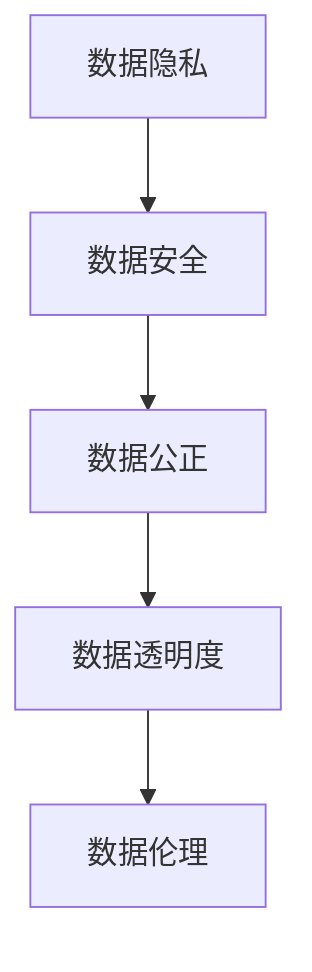

**核心算法原理讲解：**

在数据伦理中，核心算法原理涉及如何保护个人隐私和数据安全。以下是一个简单的伪代码示例，用于描述数据加密和匿名化的基本原理。

```python
# 数据加密
def encrypt_data(data, key):
    # 使用对称加密算法，如AES，对数据进行加密
    encrypted_data = AES_encrypt(data, key)
    return encrypted_data

# 数据匿名化
def anonymize_data(data):
    # 将个人身份信息替换为匿名标识符
    anonymized_data = replace_personal_info_with_anon_id(data)
    return anonymized_data
```

#### 1.2 软件2.0企业的崛起

软件2.0企业是指以数据为核心，通过大数据、人工智能等技术手段实现业务智能化、自动化和优化的企业。软件2.0企业的崛起对数据伦理提出了新的要求。

**核心概念与联系：**

软件2.0企业涉及的核心概念包括数据驱动、业务智能化和自动化。这些概念共同构成了软件2.0企业的基本架构。

- **数据驱动**：企业通过收集、分析和利用数据来指导业务决策。
- **业务智能化**：企业利用人工智能技术，如机器学习、自然语言处理等，实现业务流程的自动化和优化。
- **自动化**：通过自动化工具和平台，实现业务流程的无缝连接和高效运作。

**Mermaid 流程图：**

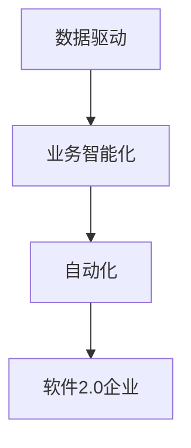

**核心算法原理讲解：**

在软件2.0企业中，核心算法原理涉及如何利用机器学习技术进行数据分析和预测。以下是一个简单的伪代码示例，用于描述机器学习模型的基本原理。

```python
# 数据预处理
def preprocess_data(data):
    # 清洗数据，处理缺失值和异常值
    cleaned_data = clean_data(data)
    return cleaned_data

# 特征工程
def feature_engineering(data):
    # 提取特征，如统计特征、文本特征等
    features = extract_features(data)
    return features

# 模型训练
def train_model(features, labels):
    # 使用机器学习算法，如决策树、神经网络等，训练模型
    model = train_machine_learning_model(features, labels)
    return model

# 模型预测
def predict(model, new_data):
    # 使用训练好的模型对新数据进行预测
    predictions = model.predict(new_data)
    return predictions
```

#### 1.3 数据伦理委员会的角色与作用

数据伦理委员会是一种专门负责数据伦理审查和监管的机构，其角色和作用在软件2.0企业中尤为重要。

**核心概念与联系：**

数据伦理委员会的核心概念包括审查、监管、培训和咨询。这些概念共同构成了数据伦理委员会的基本职能。

- **审查**：数据伦理委员会对企业的数据使用行为进行审查，确保其符合伦理原则。
- **监管**：数据伦理委员会监督企业的数据使用情况，确保数据安全、隐私和合规。
- **培训**：数据伦理委员会对员工进行数据伦理培训，提高其伦理意识和能力。
- **咨询**：数据伦理委员会为企业提供数据伦理方面的咨询服务，帮助企业解决数据伦理问题。

**Mermaid 流程图：**

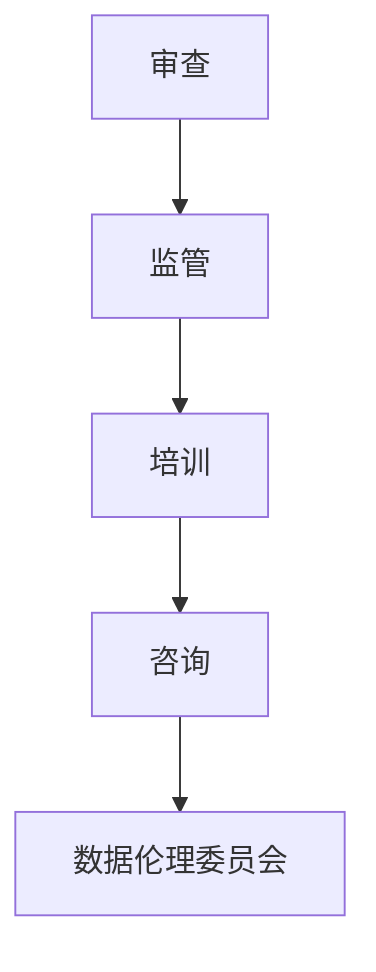

**核心算法原理讲解：**

在数据伦理委员会中，核心算法原理涉及如何进行数据伦理审查和风险评估。以下是一个简单的伪代码示例，用于描述数据伦理审查的基本原理。

```python
# 数据伦理审查
def data_ethics_review(data_usage_plan):
    # 检查数据使用计划是否符合伦理原则和法律法规
    if not is_data_usage_plan_ethical(data_usage_plan):
        raise EthicalViolationException()
    return "Data usage plan is ethical."

# 风险评估
def risk_assessment(data_usage_plan):
    # 评估数据使用计划的风险等级
    risk_level = assess_risk_level(data_usage_plan)
    return risk_level
```

### 第2章 数据伦理委员会的基础知识

#### 2.1 数据伦理的基本概念

数据伦理是指在数据处理过程中，遵循一定的道德原则和规范，确保数据的安全、隐私和公正性。数据伦理的基本概念包括数据隐私、数据安全、数据公正和数据透明度。

**核心概念与联系：**

- **数据隐私**：指保护个人隐私，确保个人数据不被未经授权的第三方访问或泄露。
- **数据安全**：指保护数据免受未经授权的访问、篡改、破坏或泄露。
- **数据公正**：指确保数据处理过程中，对所有人公平、无歧视。
- **数据透明度**：指数据处理过程公开透明，便于监督和审查。

**Mermaid 流程图：**

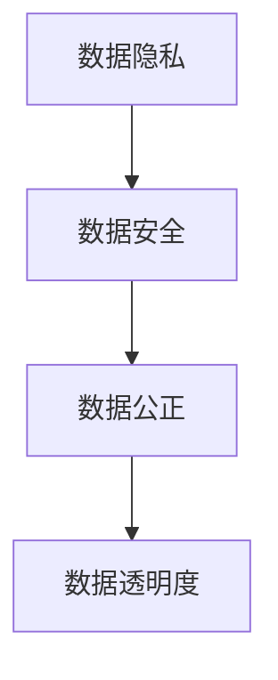

**核心算法原理讲解：**

在数据伦理中，核心算法原理涉及如何保护数据隐私和安全。以下是一个简单的伪代码示例，用于描述数据加密和匿名化的基本原理。

```python
# 数据加密
def encrypt_data(data, key):
    # 使用对称加密算法，如AES，对数据进行加密
    encrypted_data = AES_encrypt(data, key)
    return encrypted_data

# 数据匿名化
def anonymize_data(data):
    # 将个人身份信息替换为匿名标识符
    anonymized_data = replace_personal_info_with_anon_id(data)
    return anonymized_data
```

#### 2.2 数据伦理委员会的定义与职责

数据伦理委员会是一种专门负责数据伦理审查和监管的机构，其定义和职责在数据伦理管理中至关重要。

**核心概念与联系：**

数据伦理委员会的核心概念包括审查、监管、培训和咨询。这些概念共同构成了数据伦理委员会的基本职能。

- **审查**：数据伦理委员会对企业的数据使用行为进行审查，确保其符合伦理原则。
- **监管**：数据伦理委员会监督企业的数据使用情况，确保数据安全、隐私和合规。
- **培训**：数据伦理委员会对员工进行数据伦理培训，提高其伦理意识和能力。
- **咨询**：数据伦理委员会为企业提供数据伦理方面的咨询服务，帮助企业解决数据伦理问题。

**Mermaid 流程图：**


**核心算法原理讲解：**

在数据伦理委员会中，核心算法原理涉及如何进行数据伦理审查和风险评估。以下是一个简单的伪代码示例，用于描述数据伦理审查的基本原理。

```python
# 数据伦理审查
def data_ethics_review(data_usage_plan):
    # 检查数据使用计划是否符合伦理原则和法律法规
    if not is_data_usage_plan_ethical(data_usage_plan):
        raise EthicalViolationException()
    return "Data usage plan is ethical."

# 风险评估
def risk_assessment(data_usage_plan):
    # 评估数据使用计划的风险等级
    risk_level = assess_risk_level(data_usage_plan)
    return risk_level
```

#### 2.3 数据伦理的相关法规与标准

数据伦理的相关法规与标准是确保数据伦理实践合规的重要依据。不同国家和地区制定了相应的法规和标准，以规范数据处理行为。

**核心概念与联系：**

- **法规**：指国家和地区的法律和规章，如《中华人民共和国网络安全法》、《中华人民共和国个人信息保护法》等。
- **标准**：指国际和行业组织的规范，如ISO/IEC 27001信息安全管理体系标准、GDPR等。

**Mermaid 流程图：**

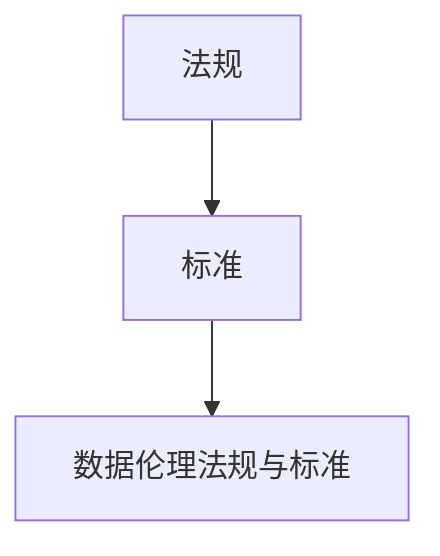

**核心算法原理讲解：**

在数据伦理法规与标准中，核心算法原理涉及如何进行合规性检查。以下是一个简单的伪代码示例，用于描述合规性检查的基本原理。

```python
# 合规性检查
def compliance_check(data_usage_plan):
    # 检查数据使用计划是否符合相关法规和标准
    if not is_data_usage_plan_compliant(data_usage_plan):
        raise ComplianceViolationException()
    return "Data usage plan is compliant."
```

### 第3章 数据伦理委员会的建立与运作

#### 3.1 建立数据伦理委员会的步骤

建立数据伦理委员会是确保企业数据伦理实践合规的重要步骤。以下是一般建立数据伦理委员会的步骤：

**核心概念与联系：**

- **确定职责与目标**：明确数据伦理委员会的职责和目标，确保其能够有效发挥作用。
- **组建委员会成员**：根据职责和目标，组建数据伦理委员会成员，确保成员具备相关领域专业知识和经验。
- **制定章程和规则**：制定数据伦理委员会章程和规则，明确委员会的运作机制和权限。
- **建立审查机制**：建立数据伦理审查机制，确保数据使用行为符合伦理原则和法律法规。

**Mermaid 流程图：**

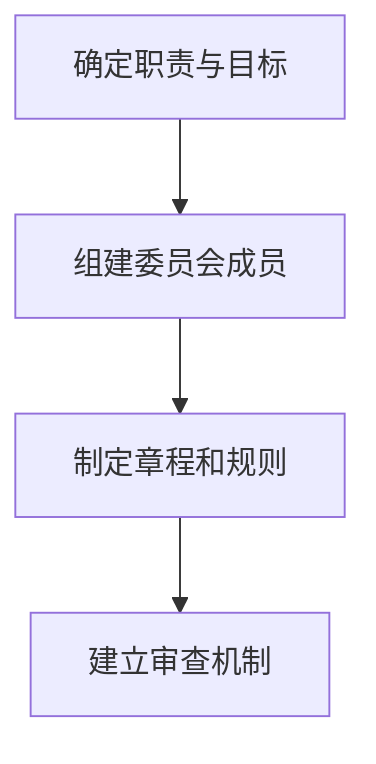

**核心算法原理讲解：**

在建立数据伦理委员会的过程中，核心算法原理涉及如何进行风险评估和决策。以下是一个简单的伪代码示例，用于描述风险评估和决策的基本原理。

```python
# 风险评估
def risk_assessment(data_usage_plan):
    # 评估数据使用计划的风险等级
    risk_level = assess_risk_level(data_usage_plan)
    return risk_level

# 决策
def make_decision(risk_level):
    # 根据风险等级做出决策
    if risk_level == "High":
        return "Reject data usage plan."
    elif risk_level == "Medium":
        return "Modify data usage plan."
    else:
        return "Accept data usage plan."
```

#### 3.2 数据伦理委员会的运作机制

数据伦理委员会的运作机制是确保其有效发挥作用的关键。以下是一般数据伦理委员会的运作机制：

**核心概念与联系：**

- **审查流程**：数据伦理委员会对企业的数据使用计划进行审查，确保其符合伦理原则和法律法规。
- **会议机制**：数据伦理委员会定期召开会议，讨论数据伦理相关问题，制定决策。
- **反馈机制**：数据伦理委员会对数据使用计划的审查结果进行反馈，指导企业改进数据伦理实践。

**Mermaid 流�程图：**

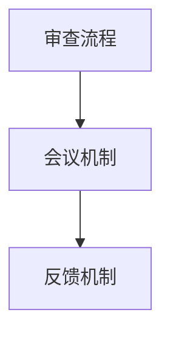

**核心算法原理讲解：**

在数据伦理委员会的运作机制中，核心算法原理涉及如何进行伦理审查和决策。以下是一个简单的伪代码示例，用于描述伦理审查和决策的基本原理。

```python
# 伦理审查
def ethical_review(data_usage_plan):
    # 检查数据使用计划是否符合伦理原则
    if not is_data_usage_plan_ethical(data_usage_plan):
        return "Data usage plan is unethical."
    else:
        return "Data usage plan is ethical."

# 决策
def make_decision(ethical_review_result):
    # 根据伦理审查结果做出决策
    if ethical_review_result == "Unethical":
        return "Reject data usage plan."
    else:
        return "Accept data usage plan."
```

#### 3.3 数据伦理委员会的工作流程

数据伦理委员会的工作流程是确保其有效发挥作用的重要环节。以下是一般数据伦理委员会的工作流程：

**核心概念与联系：**

- **数据收集**：数据伦理委员会收集企业的数据使用计划和相关材料。
- **审查**：数据伦理委员会对数据使用计划进行审查，评估其是否符合伦理原则和法律法规。
- **反馈**：数据伦理委员会将审查结果反馈给企业，指导企业改进数据伦理实践。
- **监督**：数据伦理委员会对企业的数据伦理实践进行持续监督，确保其符合伦理原则和法律法规。

**Mermaid 流程图：**

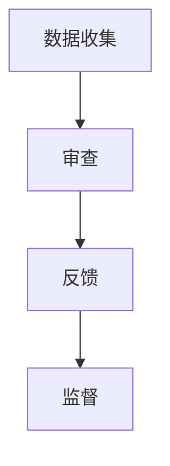

**核心算法原理讲解：**

在数据伦理委员会的工作流程中，核心算法原理涉及如何进行数据分析和决策。以下是一个简单的伪代码示例，用于描述数据分析和决策的基本原理。

```python
# 数据分析
def data_analysis(data_usage_plan):
    # 对数据使用计划进行分析
    analysis_result = analyze_data_usage_plan(data_usage_plan)
    return analysis_result

# 决策
def make_decision(analysis_result):
    # 根据数据分析结果做出决策
    if analysis_result == "Unethical":
        return "Reject data usage plan."
    else:
        return "Accept data usage plan."
```

### 第4章 数据伦理委员会的核心职责

#### 4.1 数据隐私保护

数据隐私保护是数据伦理委员会的核心职责之一。以下数据隐私保护的核心内容：

**核心概念与联系：**

- **隐私保护原则**：包括最小化原则、明确目的原则、合法使用原则、安全存储原则和用户知情原则。
- **隐私保护措施**：包括数据加密、数据匿名化、隐私政策制定和隐私审计等。

**Mermaid 流程图：**

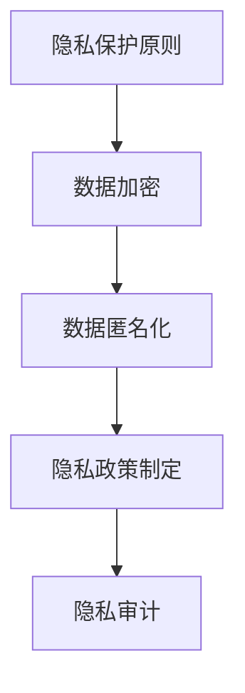

**核心算法原理讲解：**

在数据隐私保护中，核心算法原理涉及如何实现数据加密和数据匿名化。以下是一个简单的伪代码示例，用于描述数据加密和数据匿名化的基本原理。

```python
# 数据加密
def encrypt_data(data, key):
    # 使用对称加密算法，如AES，对数据进行加密
    encrypted_data = AES_encrypt(data, key)
    return encrypted_data

# 数据匿名化
def anonymize_data(data):
    # 将个人身份信息替换为匿名标识符
    anonymized_data = replace_personal_info_with_anon_id(data)
    return anonymized_data
```

**数学模型和公式 & 详细讲解 & 举例说明：**

在数据隐私保护中，常用的数学模型和公式包括加密算法的加密函数和解密函数。

**加密函数（Encrypted Function）：**

$$
E_K(D) = C
$$

其中，$E_K(D)$ 表示使用密钥 $K$ 对数据 $D$ 进行加密，$C$ 表示加密后的数据。

**解密函数（Decrypted Function）：**

$$
D_K(C) = D
$$

其中，$D_K(C)$ 表示使用密钥 $K$ 对加密数据 $C$ 进行解密，$D$ 表示解密后的数据。

**举例说明：**

假设有一个数据 $D = "Hello, World!"$，密钥 $K = "mysecretkey123"$。使用AES加密算法进行加密和解密。

**加密过程：**

1. 将数据 $D$ 转换为字节序列。
2. 使用AES加密算法和密钥 $K$ 对数据进行加密。
3. 得到加密后的数据 $C$。

**解密过程：**

1. 使用AES加密算法和密钥 $K$ 对加密数据 $C$ 进行解密。
2. 得到解密后的数据 $D$。

#### 4.2 数据安全与合规

数据安全与合规是数据伦理委员会的另一项核心职责。以下数据安全与合规的核心内容：

**核心概念与联系：**

- **数据安全原则**：包括安全性原则、完整性原则、可用性原则和保密性原则。
- **合规性措施**：包括安全审计、合规性检查和合规性培训等。

**Mermaid 流程图：**

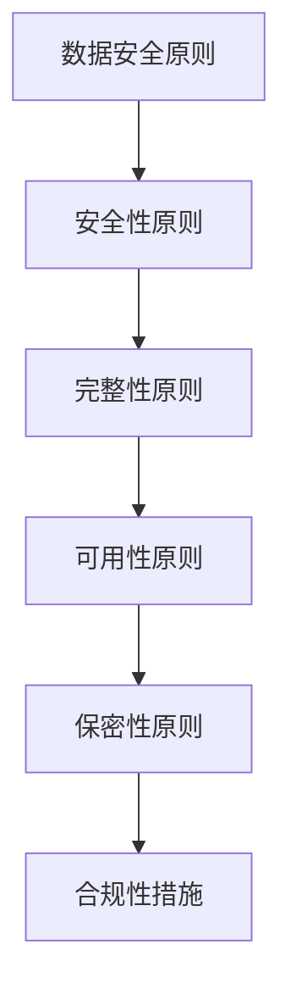

**核心算法原理讲解：**

在数据安全与合规中，核心算法原理涉及如何进行安全审计和合规性检查。以下是一个简单的伪代码示例，用于描述安全审计和合规性检查的基本原理。

```python
# 安全审计
def security_audit(data_usage_plan):
    # 对数据使用计划进行安全审计
    audit_result = perform_security_audit(data_usage_plan)
    return audit_result

# 合规性检查
def compliance_check(data_usage_plan):
    # 对数据使用计划进行合规性检查
    check_result = perform_compliance_check(data_usage_plan)
    return check_result
```

**数学模型和公式 & 详细讲解 & 举例说明：**

在数据安全与合规中，常用的数学模型和公式包括安全审计的审计逻辑和合规性检查的检查逻辑。

**安全审计逻辑（Audit Logic）：**

$$
\text{SecurityAudit}(\text{DataUsagePlan}) = \begin{cases}
\text{True}, & \text{if } \text{DataUsagePlan} \text{ follows security policies} \\
\text{False}, & \text{otherwise}
\end{cases}
$$

**合规性检查逻辑（ComplianceCheck Logic）：**

$$
\text{ComplianceCheck}(\text{DataUsagePlan}) = \begin{cases}
\text{True}, & \text{if } \text{DataUsagePlan} \text{ follows legal regulations} \\
\text{False}, & \text{otherwise}
\end{cases}
$$

**举例说明：**

假设有一个数据使用计划 $DataUsagePlan$，包含以下信息：

- 数据集大小：$100MB$
- 加密算法：AES-256
- 数据存储期限：5年

**安全审计过程：**

1. 检查数据使用计划是否遵循安全政策。
2. 检查加密算法是否为AES-256。
3. 检查数据存储期限是否符合要求。

**合规性检查过程：**

1. 检查数据使用计划是否遵循相关法律法规。
2. 检查加密算法是否为AES-256。
3. 检查数据存储期限是否符合要求。

#### 4.3 数据使用的伦理审查

数据使用的伦理审查是数据伦理委员会的核心职责之一。以下数据使用伦理审查的核心内容：

**核心概念与联系：**

- **伦理审查原则**：包括尊重隐私原则、公正性原则、透明度原则和责任性原则。
- **伦理审查流程**：包括提交申请、审查、反馈和整改等环节。

**Mermaid 流程图：**

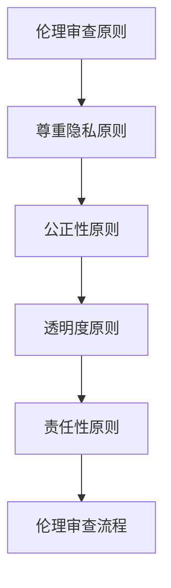

**核心算法原理讲解：**

在数据使用的伦理审查中，核心算法原理涉及如何进行伦理审查和决策。以下是一个简单的伪代码示例，用于描述伦理审查和决策的基本原理。

```python
# 伦理审查
def ethical_review(data_usage_plan):
    # 对数据使用计划进行伦理审查
    review_result = perform_ethical_review(data_usage_plan)
    return review_result

# 决策
def make_decision(review_result):
    # 根据伦理审查结果做出决策
    if review_result == "Unethical":
        return "Reject data usage plan."
    else:
        return "Accept data usage plan."
```

**数学模型和公式 & 详细讲解 & 举例说明：**

在数据使用的伦理审查中，常用的数学模型和公式包括伦理审查的逻辑和决策逻辑。

**伦理审查逻辑（EthicalReview Logic）：**

$$
\text{EthicalReview}(\text{DataUsagePlan}) = \begin{cases}
\text{True}, & \text{if } \text{DataUsagePlan} \text{ follows ethical principles} \\
\text{False}, & \text{otherwise}
\end{cases}
$$

**决策逻辑（Decision Logic）：**

$$
\text{Decision}(\text{ReviewResult}) = \begin{cases}
\text{"Reject data usage plan."}, & \text{if } \text{ReviewResult} \text{ is } \text{False} \\
\text{"Accept data usage plan."}, & \text{if } \text{ReviewResult} \text{ is } \text{True}
\end{cases}
$$

**举例说明：**

假设有一个数据使用计划 $DataUsagePlan$，包含以下信息：

- 数据收集目的：市场调研
- 数据收集范围：用户行为数据
- 数据使用期限：3个月

**伦理审查过程：**

1. 检查数据收集目的是否符合伦理原则。
2. 检查数据收集范围是否符合伦理原则。
3. 检查数据使用期限是否符合伦理原则。

**决策过程：**

1. 根据伦理审查结果，决定是否接受数据使用计划。

### 第5章 数据伦理案例分析

#### 5.1 案例一：数据泄露事件

**背景：**

某知名互联网公司因一次网络攻击导致大量用户数据泄露。攻击者通过入侵公司的服务器，获取了用户的个人信息，如姓名、地址、电话号码和电子邮件等。

**原因分析：**

1. **安全漏洞**：公司服务器存在安全漏洞，未及时更新和修补，导致攻击者入侵。
2. **内部泄露**：公司员工可能滥用权限，将用户数据泄露给外部人员。
3. **人为失误**：公司员工操作不当，如未加密存储用户数据，导致数据泄露。

**后果：**

1. **经济损失**：公司可能面临巨额赔偿和罚款。
2. **声誉损害**：公司的信誉和品牌形象受到严重损害。
3. **法律风险**：公司可能面临法律诉讼和刑事处罚。

**防范措施：**

1. **加强网络安全**：通过防火墙、入侵检测系统等手段提高网络安全。
2. **数据加密**：对敏感数据进行加密存储和传输。
3. **权限管理**：严格权限管理，防止内部人员滥用权限。
4. **员工培训**：提高员工的数据安全意识和操作规范。

#### 5.2 案例二：算法偏见与歧视

**背景：**

某金融公司在信用评分系统中使用了人工智能算法，但该算法在评估女性客户的信用时存在偏见，导致女性客户的信用评分普遍较低。

**原因分析：**

1. **数据偏见**：训练数据中可能存在性别偏见，导致算法在评估女性客户时产生偏见。
2. **算法设计**：算法设计者可能未充分考虑性别因素，导致算法在评估女性客户时产生偏见。

**后果：**

1. **社会不公**：加剧性别歧视，损害女性客户的利益。
2. **法律风险**：违反反歧视法律，面临法律诉讼和处罚。
3. **声誉损害**：公司的声誉和品牌形象受到损害。

**防范措施：**

1. **数据清洗**：清洗训练数据，消除偏见。
2. **算法审计**：对算法进行审计，确保算法的公平性和透明性。
3. **算法透明度**：提高算法的透明度，便于公众监督。
4. **多元化团队**：组建多元化团队，减少偏见和歧视。

#### 5.3 案例三：数据伦理争议与解决

**背景：**

某互联网公司因在用户数据收集和使用过程中存在争议，引发公众关注和质疑。公司被指责在未经用户同意的情况下收集和使用用户数据，并用于商业目的。

**原因分析：**

1. **隐私侵犯**：公司未充分保护用户隐私，未取得用户明确同意。
2. **数据滥用**：公司滥用用户数据，用于其他商业目的。

**后果：**

1. **声誉损害**：公司的信誉和品牌形象受到严重损害。
2. **法律风险**：公司可能面临法律诉讼和处罚。
3. **用户流失**：用户对公司的信任度降低，可能导致用户流失。

**解决措施：**

1. **公开道歉**：公司公开道歉，承认错误。
2. **整改措施**：公司采取整改措施，确保数据使用符合伦理原则。
3. **赔偿与补偿**：对受影响用户进行赔偿与补偿。
4. **法律诉讼**：通过法律途径解决争议。

### 第6章 软件2.0企业的数据伦理实践

#### 6.1 数据伦理培训与教育

**核心内容：**

数据伦理培训与教育是提高员工数据伦理意识和能力的重要手段。以下数据伦理培训与教育的主要内容和实施方法：

1. **培训内容：**
   - 数据伦理原则和法律法规；
   - 数据收集、处理、存储、共享和使用的伦理问题；
   - 算法偏见和歧视的防范措施；
   - 数据隐私保护和数据安全措施。

2. **实施方法：**
   - 制定培训计划，明确培训目标、内容、方式等；
   - 准备培训教材和案例，提高培训效果；
   - 定期评估培训效果，持续改进培训方案。

**数学模型和公式 & 详细讲解 & 举例说明：**

在数据伦理培训与教育中，常用的数学模型和公式包括评估培训效果的评估指标和培训反馈模型。

**评估指标（Evaluation Metrics）：**

$$
\text{TrainingEffectiveness} = \frac{\text{CorrectAnswers}}{\text{TotalQuestions}}
$$

其中，$\text{TrainingEffectiveness}$ 表示培训效果，$\text{CorrectAnswers}$ 表示正确回答的问题数量，$\text{TotalQuestions}$ 表示总问题数量。

**培训反馈模型（FeedbackModel）：**

$$
\text{Feedback} = \text{TrainingEffectiveness} \times \text{UserSatisfaction}
$$

其中，$\text{Feedback}$ 表示培训反馈，$\text{TrainingEffectiveness}$ 表示培训效果，$\text{UserSatisfaction}$ 表示用户满意度。

**举例说明：**

假设有一个数据伦理培训，共有10个问题，用户正确回答了8个问题，用户满意度为90%。

**评估指标计算：**

$$
\text{TrainingEffectiveness} = \frac{8}{10} = 0.8
$$

**培训反馈计算：**

$$
\text{Feedback} = 0.8 \times 0.9 = 0.72
$$

#### 6.2 数据伦理风险管理

**核心内容：**

数据伦理风险管理是确保企业数据伦理实践合规的重要措施。以下数据伦理风险管理的主要内容和实施方法：

1. **风险管理内容：**
   - 数据隐私风险识别和评估；
   - 数据安全风险识别和评估；
   - 数据使用伦理风险识别和评估；
   - 数据伦理风险应对策略。

2. **实施方法：**
   - 制定数据伦理风险管理计划，明确风险管理目标和流程；
   - 建立数据伦理风险管理团队，负责风险管理的工作；
   - 定期进行数据伦理风险审计，确保风险管理措施的有效性。

**数学模型和公式 & 详细讲解 & 举例说明：**

在数据伦理风险管理中，常用的数学模型和公式包括风险评估指标和风险应对策略。

**风险评估指标（RiskAssessmentMetrics）：**

$$
\text{RiskScore} = \text{Probability} \times \text{Impact}
$$

其中，$\text{RiskScore}$ 表示风险得分，$\text{Probability}$ 表示风险发生的概率，$\text{Impact}$ 表示风险发生的影响。

**风险应对策略（RiskMitigationStrategy）：**

$$
\text{RiskMitigationStrategy} = \begin{cases}
\text{"Avoid"}, & \text{if } \text{RiskScore} < \text{Threshold} \\
\text{"Mitigate"}, & \text{if } \text{RiskScore} \ge \text{Threshold} \\
\text{"Transfer"}, & \text{if } \text{RiskScore} \ge \text{Threshold} \text{ and can be transferred} \\
\text{"Accept"}, & \text{if } \text{RiskScore} \ge \text{Threshold} \text{ and cannot be transferred}
\end{cases}
$$

其中，$\text{RiskMitigationStrategy}$ 表示风险应对策略，$\text{Threshold}$ 表示风险阈值。

**举例说明：**

假设有一个数据隐私风险，风险发生的概率为0.5，风险发生的影响为重大。

**风险评估计算：**

$$
\text{RiskScore} = 0.5 \times 重大 = 重大
$$

**风险应对策略：**

由于$\text{RiskScore}$为重大，因此选择风险应对策略为“Mitigate”。

#### 6.3 数据伦理委员会在软件2.0企业中的实际应用

**核心内容：**

数据伦理委员会在软件2.0企业中的实际应用是确保企业数据伦理实践合规的重要手段。以下数据伦理委员会在软件2.0企业中的实际应用：

1. **定位与作用：**
   - 负责数据伦理审查和监管；
   - 制定数据伦理政策和指导原则；
   - 对员工进行数据伦理培训；
   - 提供数据伦理咨询服务。

2. **工作内容：**
   - 审查数据使用计划；
   - 监督数据伦理实践；
   - 解决数据伦理争议；
   - 指导数据伦理风险管理。

**数学模型和公式 & 详细讲解 & 举例说明：**

在数据伦理委员会的实际应用中，常用的数学模型和公式包括伦理审查指标和争议解决模型。

**伦理审查指标（EthicalReviewMetrics）：**

$$
\text{ReviewScore} = \text{EthicalPrinciples} \times \text{LegalRegulations}
$$

其中，$\text{ReviewScore}$ 表示审查得分，$\text{EthicalPrinciples}$ 表示伦理原则得分，$\text{LegalRegulations}$ 表示法律法规得分。

**争议解决模型（DisputeResolutionModel）：**

$$
\text{Resolution} = \begin{cases}
\text{"Accept"}, & \text{if } \text{ReviewScore} \ge \text{Threshold} \\
\text{"Reject"}, & \text{if } \text{ReviewScore} < \text{Threshold} \\
\text{"Negotiate"}, & \text{if } \text{ReviewScore} \ge \text{Threshold} \text{ and } \text{ConflictLevel} \text{ is high}
\end{cases}
$$

其中，$\text{Resolution}$ 表示争议解决结果，$\text{Threshold}$ 表示审查得分阈值，$\text{ConflictLevel}$ 表示争议程度。

**举例说明：**

假设有一个数据使用计划，审查得分为80分，法律法规得分为90分，争议程度较高。

**审查得分计算：**

$$
\text{ReviewScore} = 80 \times 90 = 7200
$$

**争议解决结果：**

由于$\text{ReviewScore}$为7200，大于审查得分阈值，因此选择争议解决结果为“Accept”。

### 第7章 数据伦理与AI的发展趋势

#### 7.1 AI与数据伦理的关系

**核心内容：**

人工智能（AI）技术的快速发展对数据伦理提出了新的挑战。以下AI与数据伦理关系的主要内容和影响：

1. **AI与数据伦理的关系：**
   - AI技术的发展可能侵犯个人隐私；
   - AI算法可能存在偏见和歧视；
   - AI技术的应用需要遵守数据伦理原则。

2. **影响：**
   - 数据隐私保护面临新的挑战；
   - 算法偏见和歧视可能导致社会不公；
   - 数据伦理监管需要适应AI技术的发展。

**数学模型和公式 & 详细讲解 & 举例说明：**

在AI与数据伦理的关系中，常用的数学模型和公式包括隐私保护指标和算法偏见评估指标。

**隐私保护指标（PrivacyProtectionMetrics）：**

$$
\text{PrivacyScore} = \text{DataPrivacy} \times \text{Security}
$$

其中，$\text{PrivacyScore}$ 表示隐私保护得分，$\text{DataPrivacy}$ 表示数据隐私保护程度，$\text{Security}$ 表示数据安全保护程度。

**算法偏见评估指标（AlgorithmBiasMetrics）：**

$$
\text{BiasScore} = \text{Bias} \times \text{Impact}
$$

其中，$\text{BiasScore}$ 表示偏见得分，$\text{Bias}$ 表示偏见程度，$\text{Impact}$ 表示偏见的影响。

**举例说明：**

假设有一个AI系统，数据隐私保护程度为90%，数据安全保护程度为95%，算法偏见程度为0.1，偏见的影响为重大。

**隐私保护得分计算：**

$$
\text{PrivacyScore} = 0.9 \times 0.95 = 0.855
$$

**算法偏见得分计算：**

$$
\text{BiasScore} = 0.1 \times 重大 = 重大
$$

#### 7.2 数据伦理委员会在AI领域的未来角色

**核心内容：**

数据伦理委员会在AI领域的未来角色将变得更加重要，以下数据伦理委员会在AI领域的未来角色和职责：

1. **未来角色：**
   - 负责AI技术的伦理审查和监管；
   - 制定AI技术的伦理政策和指导原则；
   - 对AI从业者进行伦理培训；
   - 提供AI伦理咨询服务。

2. **职责：**
   - 审查AI技术的应用场景和算法设计；
   - 监督AI技术的数据隐私保护和安全；
   - 解决AI技术引发的伦理争议；
   - 推动全球AI伦理规范的建设。

**数学模型和公式 & 详细讲解 & 举例说明：**

在数据伦理委员会在AI领域的未来角色中，常用的数学模型和公式包括伦理审查指标和争议解决模型。

**伦理审查指标（EthicalReviewMetrics）：**

$$
\text{ReviewScore} = \text{EthicalPrinciples} \times \text{LegalRegulations}
$$

其中，$\text{ReviewScore}$ 表示审查得分，$\text{EthicalPrinciples}$ 表示伦理原则得分，$\text{LegalRegulations}$ 表示法律法规得分。

**争议解决模型（DisputeResolutionModel）：**

$$
\text{Resolution} = \begin{cases}
\text{"Accept"}, & \text{if } \text{ReviewScore} \ge \text{Threshold} \\
\text{"Reject"}, & \text{if } \text{ReviewScore} < \text{Threshold} \\
\text{"Negotiate"}, & \text{if } \text{ReviewScore} \ge \text{Threshold} \text{ and } \text{ConflictLevel} \text{ is high}
\end{cases}
$$

其中，$\text{Resolution}$ 表示争议解决结果，$\text{Threshold}$ 表示审查得分阈值，$\text{ConflictLevel}$ 表示争议程度。

**举例说明：**

假设有一个AI技术应用场景，伦理原则得分为80分，法律法规得分为90分，争议程度较高。

**审查得分计算：**

$$
\text{ReviewScore} = 80 \times 90 = 7200
$$

**争议解决结果：**

由于$\text{ReviewScore}$为7200，大于审查得分阈值，因此选择争议解决结果为“Accept”。

#### 7.3 数据伦理委员会的发展趋势与挑战

**核心内容：**

数据伦理委员会的发展趋势和挑战是确保其有效性和适应性的关键。以下数据伦理委员会的发展趋势和挑战：

1. **发展趋势：**
   - 规范化：数据伦理委员会将在全球范围内得到规范化发展，制定统一的数据伦理标准和规范；
   - 智能化：数据伦理委员会将运用AI技术进行伦理审查和风险评估，提高审查效率和准确性；
   - 全球化：数据伦理委员会将加强与国际组织和跨国企业的合作，推动全球数据伦理规范的建设。

2. **挑战：**
   - 技术复杂性：随着AI技术的发展，数据伦理委员会需要不断更新知识和技能，提高审查能力；
   - 伦理争议：数据伦理委员会在处理伦理争议时，可能面临法律、社会和道德的多重压力；
   - 资源限制：数据伦理委员会可能面临人力资源、资金和技术的限制，影响其工作效果。

**数学模型和公式 & 详细讲解 & 举例说明：**

在数据伦理委员会的发展趋势和挑战中，常用的数学模型和公式包括发展趋势评估指标和挑战应对模型。

**发展趋势评估指标（TrendAssessmentMetrics）：**

$$
\text{TrendScore} = \text{Norm

