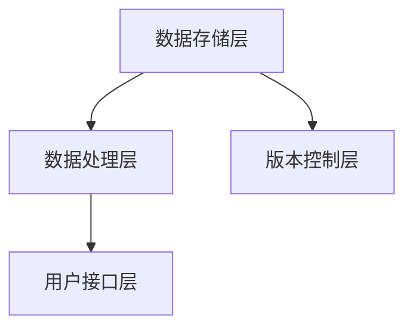
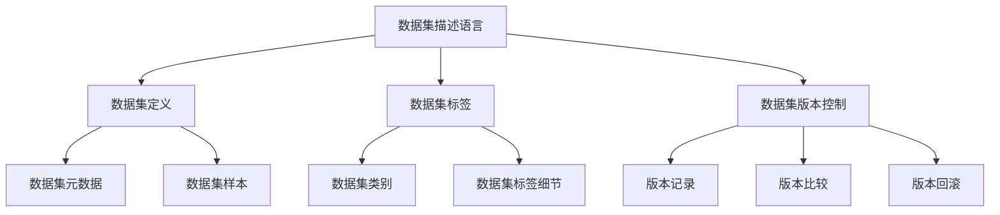
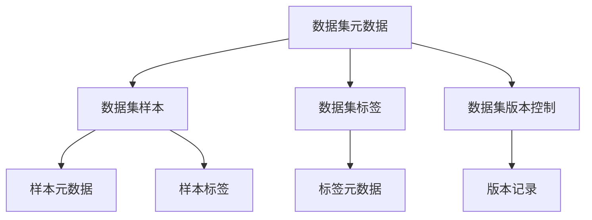
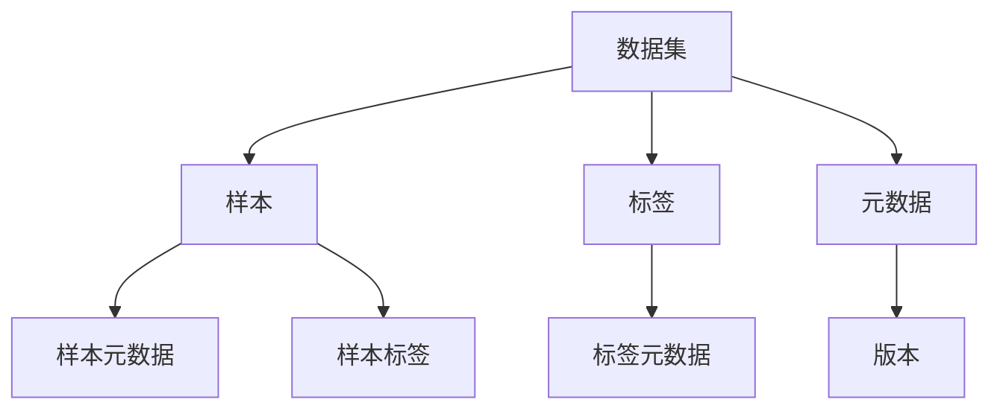
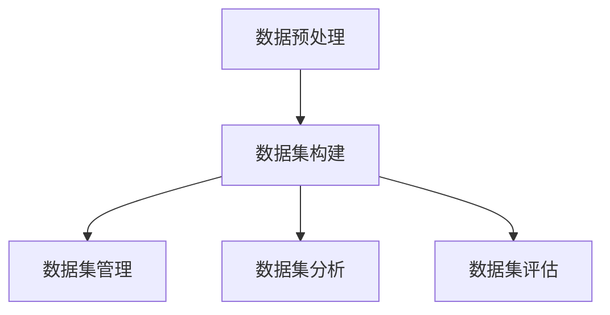
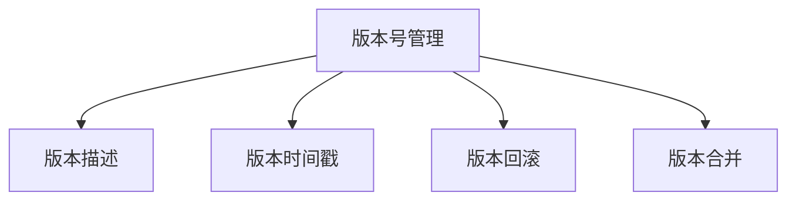

                 

**# 数据集描述语言：构建数据集版本控制系统**

> **关键词：** 数据集描述语言，版本控制系统，数据质量管理，数据科学，数据治理

> **摘要：** 本文介绍了数据集描述语言的概念、架构、实现和在实际项目中的应用，以及其在数据科学和数据治理中的重要性。同时，文章探讨了数据集描述语言在数据质量管理、性能优化和未来发展趋势方面的应用，为构建高效、稳定和可靠的数据集版本控制系统提供了指导。

**第一部分：基础概念与背景**

## 第1章：数据集描述语言概述

### 1.1 数据集描述语言的重要性

在数据驱动的时代，数据集是机器学习、人工智能和数据分析项目的基础。数据集描述语言（Dataset Description Language，简称DDL）是一种用于定义和描述数据集的语法和语义的工具。它不仅帮助数据科学家和管理员理解数据集的结构和内容，还促进了数据集的标准化和版本控制。

数据集描述语言的重要性体现在以下几个方面：

1. **数据集标准化**：数据集描述语言提供了一种统一的方法来定义和描述数据集，确保数据集在不同系统之间的兼容性和可移植性。
2. **版本控制**：数据集描述语言与版本控制系统结合，使得数据集的更新和版本管理变得更加简单和高效。
3. **数据质量管理**：数据集描述语言可以帮助识别和修复数据质量问题，提高数据集的准确性和可靠性。
4. **数据共享**：数据集描述语言简化了数据集的共享和分发，促进了跨团队和跨组织的合作。

### 1.2 数据集描述语言的演进历程

数据集描述语言的演进历程与数据库管理系统（DBMS）和版本控制系统的发展密切相关。以下是数据集描述语言的主要演进阶段：

1. **早期阶段**：在机器学习初期，数据集通常以表格形式存储，使用简单的标记语言（如CSV、TSV）进行描述。
2. **中间阶段**：随着数据集复杂性的增加，出现了专门的数据描述语言，如JSON、XML等，它们提供了更加灵活和丰富的数据描述能力。
3. **现代阶段**：现代数据集描述语言如Apache Avro、Parquet等，不仅支持复杂数据结构，还提供了高效的存储和查询性能。

### 1.3 数据集描述语言的关键特性

数据集描述语言具有以下几个关键特性：

1. **结构化**：数据集描述语言能够定义数据集的结构，包括字段、数据类型、数据关系等。
2. **可扩展性**：数据集描述语言支持自定义数据类型和属性，使得语言能够适应不同类型的数据集。
3. **版本控制**：数据集描述语言通常与版本控制系统集成，使得数据集的版本管理和更新变得简单和可靠。
4. **性能优化**：数据集描述语言支持高效的存储和查询，有助于提升数据处理速度。

### 1.4 数据集描述语言的应用场景

数据集描述语言广泛应用于以下场景：

1. **机器学习**：数据科学家使用数据集描述语言来定义和描述训练数据集、测试数据集和验证数据集。
2. **数据分析**：数据分析师使用数据集描述语言来定义和描述数据集，以便进行数据探索和分析。
3. **数据治理**：数据治理团队使用数据集描述语言来定义和描述数据集，确保数据的质量、安全和合规性。
4. **数据共享**：跨团队和跨组织的数据共享需要数据集描述语言来确保数据的兼容性和可读性。

**第二部分：数据集描述语言实现**

## 第2章：数据集版本控制基础

### 2.1 数据集版本控制的重要性

数据集版本控制是确保数据集完整性和可靠性的关键步骤。数据集版本控制的重要性体现在以下几个方面：

1. **数据集完整性**：通过版本控制，可以确保数据集的更新不会丢失或损坏，从而保持数据集的完整性。
2. **数据集可靠性**：版本控制可以帮助追踪数据集的变更历史，确保数据集的可靠性。
3. **数据集可追溯性**：版本控制使得数据集的变更历史可追溯，有助于追踪问题的根源。
4. **数据集可复现性**：版本控制有助于确保数据集的更新和变更可以被复现，从而提高实验的可复现性。

### 2.2 常见的数据集版本控制工具

以下是一些常见的数据集版本控制工具：

1. **Git**：Git是广泛使用的版本控制系统，适用于代码和数据集的管理。
2. **SVN**：SVN是一种中心化的版本控制系统，适用于中小型数据集的管理。
3. **DVC**：DVC是一种数据版本控制工具，专门用于数据集的版本控制。
4. **MetaFlow**：MetaFlow是一种数据集版本控制平台，提供可视化的数据集管理功能。

### 2.3 数据集版本控制的关键要素

数据集版本控制的关键要素包括：

1. **版本号**：版本号是标识数据集不同版本的唯一标识。
2. **版本描述**：版本描述记录数据集的变更原因和内容。
3. **版本时间戳**：版本时间戳记录数据集的创建时间。
4. **版本历史**：版本历史记录数据集的变更历史，便于追踪和管理。

### 2.4 数据集版本控制的工作流程

数据集版本控制的工作流程包括以下步骤：

1. **初始化版本控制**：在开始数据集更新之前，初始化版本控制。
2. **创建新版本**：创建新版本时，记录版本号、版本描述和时间戳。
3. **更新数据集**：更新数据集时，将变更内容应用到新版本中。
4. **提交版本**：将新版本提交到版本控制系统，以便其他团队成员访问和使用。
5. **版本回滚**：如果新版本出现问题，可以回滚到之前的版本。
6. **版本合并**：当多个团队成员更新数据集时，需要合并版本以避免冲突。

**第三部分：数据集描述语言实现**

## 第3章：数据集描述语言核心组件

### 3.1 数据集描述语言的基本结构

数据集描述语言的基本结构通常包括以下组件：

1. **数据集元数据**：描述数据集的基本信息，如名称、创建日期、大小等。
2. **数据样本**：描述数据集中的单个数据点，如图像、文本、音频等。
3. **数据标签**：描述数据集样本的分类或标注信息，如类别标签、文本标签等。
4. **版本控制信息**：描述数据集的版本信息，如版本号、版本描述、版本时间戳等。

### 3.2 数据集描述语言的关键概念

数据集描述语言中的关键概念包括：

1. **数据集**：数据集是数据的集合，用于训练模型、评估模型或进行其他数据操作。
2. **样本**：样本是数据集中的单个数据点，可以是图像、文本、音频等。
3. **标签**：标签是对样本进行分类或标注的信息，如类别标签、文本标签等。
4. **元数据**：元数据是描述数据集或样本的基本信息，如名称、创建日期、大小等。
5. **版本**：版本是数据集的版本信息，包括版本号、版本描述、版本时间戳等。

### 3.3 数据集描述语言的语义解析

数据集描述语言的语义解析是将描述语言中的文本转换为计算机可处理的结构化数据的过程。以下是数据集描述语言的语义解析伪代码：

```plaintext
数据集描述语言语义解析伪代码：
1. 输入：描述语言文本T
2. 输出：解析结果R

核心算法步骤：
1. 初始化解析结果R为空
2. 遍历文本T中的每个字符c
3. 对于每个字符c，执行以下步骤：
   a. 如果c是元数据字符，则执行元数据处理
   b. 如果c是样本字符，则执行样本数据处理
   c. 如果c是标签字符，则执行标签数据处理
4. 将处理后的元数据、样本和标签信息添加到R中
5. 返回解析结果R
```

### 3.4 数据集描述语言的应用框架

数据集描述语言的应用框架通常包括以下关键部分：

1. **数据预处理**：对原始数据进行清洗、转换和格式化，使其适用于描述语言。
2. **数据集构建**：使用描述语言创建数据集，包括元数据、样本和标签的生成。
3. **数据集管理**：对数据集进行版本控制、更新和维护。
4. **数据集分析**：对数据集进行探索性分析，以了解数据集的特性。
5. **数据集评估**：使用评估指标评估数据集的质量和适用性。

### 3.5 数据集描述语言的实现示例

以下是一个简单的Python实现示例，用于生成和解析数据集描述语言：

```python
# 数据集描述语言生成示例

# 初始化数据集描述语言对象
dataset_desc = {
    "metadata": {
        "name": "example_dataset",
        "creation_date": "2023-01-01",
        "size": 100
    },
    "samples": [
        {
            "id": 1,
            "data": "image_data_1",
            "labels": ["cat"]
        },
        {
            "id": 2,
            "data": "image_data_2",
            "labels": ["dog"]
        }
    ],
    "version": 1
}

# 打印数据集描述语言
print(dataset_desc)

# 数据集描述语言解析示例

# 初始化解析结果
parsed_dataset = {}

# 遍历数据集描述语言中的每个元素
for element in dataset_desc:
    if element == "metadata":
        parsed_dataset["metadata"] = dataset_desc[element]
    elif element == "samples":
        parsed_dataset["samples"] = dataset_desc[element]
    elif element == "version":
        parsed_dataset["version"] = dataset_desc[element]

# 打印解析结果
print(parsed_dataset)
```

### 3.6 数据集版本控制系统的设计

数据集版本控制系统是数据集管理的重要组成部分，其设计应考虑以下关键因素：

1. **版本号管理**：使用递增的版本号来标识数据集的不同版本。
2. **版本描述**：记录每个版本的创建原因和修改内容。
3. **版本时间戳**：记录每个版本创建的时间。
4. **版本回滚**：支持回滚到之前的版本，以恢复错误或解决数据问题。
5. **版本合并**：支持将多个版本合并为一个新版本，以便合并数据集的更新。

### 3.7 数据集版本控制系统的实现示例

以下是一个简单的Python实现示例，用于管理数据集的版本：

```python
# 数据集版本控制系统实现示例

# 初始化版本控制系统
version_control_system = {
    "current_version": 1,
    "versions": [
        {
            "version": 1,
            "description": "初始版本",
            "timestamp": "2023-01-01 10:00:00",
            "data": {
                "metadata": {
                    "name": "example_dataset",
                    "creation_date": "2023-01-01",
                    "size": 100
                },
                "samples": [
                    {
                        "id": 1,
                        "data": "image_data_1",
                        "labels": ["cat"]
                    },
                    {
                        "id": 2,
                        "data": "image_data_2",
                        "labels": ["dog"]
                    }
                ]
            }
        }
    ]
}

# 添加新版本
def add_new_version(description):
    new_version = {
        "version": version_control_system["current_version"] + 1,
        "description": description,
        "timestamp": datetime.datetime.now().strftime("%Y-%m-%d %H:%M:%S"),
        "data": copy.deepcopy(version_control_system["versions"][-1]["data"])
    }
    version_control_system["versions"].append(new_version)
    version_control_system["current_version"] += 1

# 回滚版本
def rollback_version(version_number):
    for version in reversed(version_control_system["versions"]):
        if version["version"] == version_number:
            version_control_system["current_version"] = version["version"]
            version_control_system["versions"] = version_control_system["versions"][:version["version"]]
            break

# 打印版本信息
def print_version_info():
    for version in version_control_system["versions"]:
        print(f"Version {version['version']}: {version['description']} - {version['timestamp']}")

# 测试版本控制系统的功能
add_new_version("添加新样本")
add_new_version("更新样本标签")
rollback_version(1)
print_version_info()
```

### 3.8 数据集版本控制的应用案例

以下是一个数据集版本控制的应用案例，说明如何在实际项目中使用数据集版本控制系统：

**项目背景：**  
一家公司正在开发一个图像识别系统，用于识别图像中的物体。为了确保系统的准确性和稳定性，公司决定使用数据集版本控制系统来管理数据集的更新和版本。

**应用步骤：**

1. **初始化版本控制系统**：在项目开始时，初始化数据集版本控制系统，包括版本号、版本描述、版本时间戳等。

2. **创建初始版本**：创建数据集的初始版本，包括元数据、样本和标签。将初始版本添加到版本控制系统中。

3. **更新数据集**：在开发过程中，定期更新数据集，包括添加新的样本、更新样本标签等。每次更新时，都记录版本描述和时间戳，并将其添加到版本控制系统中。

4. **版本回滚**：如果在更新过程中发现错误或数据质量问题，可以使用版本回滚功能将数据集回滚到之前的版本。这样可以确保数据集的稳定性和准确性。

5. **版本合并**：在多个开发人员同时更新数据集时，需要使用版本合并功能将多个版本合并为一个新版本，以便合并数据集的更新。

6. **数据集评估**：在每次版本更新后，使用评估指标评估数据集的质量和适用性。如果评估结果不理想，可以再次更新数据集，并进行版本控制。

7. **数据集发布**：在完成所有更新和评估后，将最终版本的数据集发布到生产环境中，用于训练和部署图像识别系统。

通过使用数据集版本控制系统，公司可以确保数据集的更新和版本控制过程规范、稳定和可追溯，从而提高图像识别系统的准确性和稳定性。

### 3.9 数据集描述语言的优势与挑战

数据集描述语言的优势：

1. **标准化与一致性**：数据集描述语言提供了一种统一的格式，确保数据集的元数据、样本和标签的一致性。
2. **可扩展性与可读性**：数据集描述语言易于扩展和修改，同时具有较好的可读性，方便开发人员和数据科学家理解和使用。
3. **版本控制与管理**：数据集描述语言与版本控制系统结合，实现数据集的版本控制、更新和维护，提高数据集的稳定性和可靠性。

数据集描述语言的挑战：

1. **性能优化**：数据集描述语言在处理大规模数据集时，需要考虑性能优化，如索引技术、缓存策略等。
2. **互操作性与兼容性**：数据集描述语言需要与其他数据存储和处理工具兼容，确保数据集描述的互操作性。
3. **安全性与隐私保护**：在处理敏感数据时，数据集描述语言需要确保数据的安全性和隐私保护。

### 第4章：数据集版本控制系统的构建

#### 4.1 数据集版本控制系统的需求分析

数据集版本控制系统的需求分析是构建系统的第一步，其目标是明确系统需要实现的功能和性能要求。以下是数据集版本控制系统的主要需求：

1. **版本管理**：系统应支持对数据集的版本进行管理，包括创建新版本、更新版本描述、删除版本等操作。
2. **数据回滚**：系统应支持回滚到指定版本，以恢复错误或恢复数据集的稳定性。
3. **数据安全**：系统应确保数据在存储、传输和处理过程中的安全，包括访问控制、数据加密等。
4. **性能优化**：系统应具备良好的性能，支持大规模数据集的快速版本管理和数据检索。
5. **扩展性**：系统应具备良好的扩展性，支持添加新的功能模块和数据处理方法。

#### 4.2 数据集版本控制系统的架构设计

数据集版本控制系统的架构设计是系统的核心，其目标是实现需求分析中的功能。以下是数据集版本控制系统的架构设计：

1. **数据存储层**：负责存储数据集的元数据、样本和版本信息。数据存储层应支持高效的数据检索和更新操作。
2. **数据处理层**：负责对数据集进行预处理、转换和格式化，以适应数据集描述语言的要求。数据处理层应支持多种数据处理方法，如数据清洗、数据标注等。
3. **版本控制层**：负责管理数据集的版本信息，包括创建新版本、更新版本描述、删除版本等操作。版本控制层应支持版本回滚功能，以恢复数据集的稳定性。
4. **用户接口层**：负责与用户交互，提供数据集版本控制的功能。用户接口层应支持多种访问方式，如命令行、Web界面等。

**图4-1：数据集版本控制系统架构设计**



#### 4.3 数据集版本控制系统的关键功能

数据集版本控制系统的关键功能包括：

1. **版本创建**：系统应支持创建新版本，包括元数据、样本和标签的更新。
2. **版本更新**：系统应支持更新版本描述，以记录版本的重要变更。
3. **版本删除**：系统应支持删除旧版本，以释放存储空间。
4. **版本回滚**：系统应支持回滚到指定版本，以恢复数据集的稳定性。
5. **数据检索**：系统应支持快速检索数据集的元数据、样本和版本信息。
6. **权限管理**：系统应支持访问控制，确保数据的安全性和隐私保护。

#### 4.4 数据集版本控制系统的实现示例

以下是一个简单的Python实现示例，用于构建数据集版本控制系统：

```python
# 数据集版本控制系统实现示例

# 初始化版本控制系统
version_control_system = {
    "datasets": {},
    "current_version": 1
}

# 创建新版本
def create_new_version(dataset_id, metadata, samples, version_description):
    version_control_system["datasets"][dataset_id] = {
        "version": version_control_system["current_version"],
        "metadata": metadata,
        "samples": samples,
        "version_description": version_description
    }
    version_control_system["current_version"] += 1

# 更新版本描述
def update_version_description(dataset_id, version_description):
    version_control_system["datasets"][dataset_id]["version_description"] = version_description

# 删除版本
def delete_version(dataset_id):
    if dataset_id in version_control_system["datasets"]:
        del version_control_system["datasets"][dataset_id]

# 回滚版本
def rollback_version(dataset_id, version_number):
    if dataset_id in version_control_system["datasets"]:
        version_control_system["current_version"] = version_number
        version_control_system["datasets"][dataset_id]["version"] = version_number

# 检索版本信息
def get_version_info(dataset_id):
    if dataset_id in version_control_system["datasets"]:
        return version_control_system["datasets"][dataset_id]
    else:
        return None

# 测试版本控制系统的功能
create_new_version("example_dataset", {"name": "example_dataset", "creation_date": "2023-01-01", "size": 100}, [{"id": 1, "data": "image_data_1", "labels": ["cat"]}, {"id": 2, "data": "image_data_2", "labels": ["dog"]}], "初始版本")
create_new_version("example_dataset", {"name": "example_dataset", "creation_date": "2023-01-02", "size": 200}, [{"id": 3, "data": "image_data_3", "labels": ["cat"]}, {"id": 4, "data": "image_data_4", "labels": ["dog"]}], "更新版本")
update_version_description("example_dataset", "更新版本描述")
print(get_version_info("example_dataset"))
rollback_version("example_dataset", 1)
print(get_version_info("example_dataset"))
```

### 4.5 数据集版本控制系统的部署与维护

数据集版本控制系统的部署与维护是确保系统正常运行的关键步骤。以下是数据集版本控制系统的部署与维护建议：

1. **部署环境**：确保系统部署在稳定的服务器环境中，包括操作系统、数据库、Web服务器等。

2. **数据备份**：定期备份数据集版本控制系统的数据，以防止数据丢失。

3. **权限控制**：设置访问控制策略，确保数据集版本控制系统的访问权限，防止未授权访问。

4. **性能监控**：监控系统性能，包括数据检索速度、版本管理效率等，及时发现和解决问题。

5. **更新与升级**：定期更新和升级系统，包括操作系统、数据库、Web服务器等，确保系统的稳定性和安全性。

6. **用户培训**：为用户提供培训，确保他们了解如何使用数据集版本控制系统的功能。

7. **问题解决**：建立问题反馈机制，及时响应和处理用户遇到的问题。

### 第5章：数据集描述语言在项目中的应用

#### 5.1 数据集描述语言在数据预处理中的应用

数据预处理是数据科学项目中的重要环节，数据集描述语言在这一环节中发挥着重要作用。以下是数据集描述语言在数据预处理中的应用：

1. **数据清洗**：使用数据集描述语言定义清洗规则，如去除缺失值、处理异常值等，确保数据的一致性和完整性。
2. **数据转换**：使用数据集描述语言定义数据转换规则，如将数据从一种格式转换为另一种格式，以便后续处理。
3. **特征提取**：使用数据集描述语言定义特征提取方法，如文本分类、图像识别等，为模型训练提供高质量的输入。

#### 5.2 数据集描述语言在数据建模中的应用

数据建模是数据科学项目的核心环节，数据集描述语言在数据建模中的应用包括：

1. **模型训练**：使用数据集描述语言定义训练数据集，包括样本、标签和元数据等，为模型训练提供输入。
2. **模型评估**：使用数据集描述语言定义评估数据集，包括样本、标签和元数据等，对模型进行评估和优化。
3. **模型部署**：使用数据集描述语言定义部署数据集，包括样本、标签和元数据等，确保模型在真实场景中的稳定性和可靠性。

#### 5.3 数据集描述语言在数据产品中的应用

数据产品是数据科学项目的最终成果，数据集描述语言在数据产品中的应用包括：

1. **数据可视化**：使用数据集描述语言定义可视化数据集，包括样本、标签和元数据等，为用户提供直观的数据展示。
2. **数据分析**：使用数据集描述语言定义分析数据集，包括样本、标签和元数据等，为用户提供深入的数据分析。
3. **数据报告**：使用数据集描述语言定义报告数据集，包括样本、标签和元数据等，为用户提供全面的数据报告。

#### 5.4 数据集描述语言在项目实施中的挑战与解决方案

在数据科学项目中，数据集描述语言的应用面临一系列挑战，包括：

1. **数据一致性问题**：数据集描述语言需要确保数据的一致性，避免因数据格式不一致导致的错误。
2. **数据安全性问题**：数据集描述语言需要确保数据的安全性，防止敏感数据泄露。
3. **数据处理效率问题**：数据集描述语言需要优化数据处理效率，确保项目进度不受影响。

针对上述挑战，以下是相应的解决方案：

1. **数据一致性问题解决方案**：使用统一的规范和格式定义数据集描述语言，确保数据的一致性。
2. **数据安全性问题解决方案**：使用加密技术保护数据，设置访问控制策略，确保数据的安全性。
3. **数据处理效率问题解决方案**：使用并行计算和分布式处理技术，提高数据处理效率。

### 第6章：数据集描述语言在数据治理中的应用

#### 6.1 数据治理与数据集描述语言的关系

数据治理是确保数据质量、安全和合规性的关键环节，而数据集描述语言在数据治理中发挥着重要作用。数据集描述语言与数据治理的关系主要体现在以下几个方面：

1. **数据质量保证**：数据集描述语言提供了一种标准化的数据格式，有助于确保数据的一致性和准确性，从而提高数据质量。
2. **数据安全控制**：数据集描述语言与数据安全策略结合，可以实现对数据的访问控制和加密，确保数据的安全性和隐私保护。
3. **数据合规性管理**：数据集描述语言有助于数据治理团队识别和管理数据合规性风险，确保数据的合法性和合规性。

#### 6.2 数据集描述语言在数据质量管理中的应用

在数据质量管理中，数据集描述语言的应用主要包括以下几个方面：

1. **数据质量评估**：使用数据集描述语言定义数据质量评估指标，如数据完整性、一致性、准确性等，对数据质量进行量化评估。
2. **数据异常检测**：使用数据集描述语言定义数据异常检测规则，如异常值检测、数据不一致性检测等，及时发现和处理数据质量问题。
3. **数据修复和优化**：使用数据集描述语言记录数据修复和优化过程，如缺失值填补、数据清洗等，提高数据质量。

#### 6.3 数据集描述语言在数据安全控制中的应用

在数据安全控制中，数据集描述语言的应用主要包括以下几个方面：

1. **访问控制**：使用数据集描述语言定义数据访问控制策略，如用户权限管理、数据加密等，确保数据的安全性和隐私保护。
2. **数据加密**：使用数据集描述语言定义数据加密规则，如数据加密算法、密钥管理等，确保数据在存储和传输过程中的安全。
3. **数据审计**：使用数据集描述语言记录数据操作日志，如数据访问、修改等，便于数据审计和追踪。

#### 6.4 数据集描述语言在数据合规性管理中的应用

在数据合规性管理中，数据集描述语言的应用主要包括以下几个方面：

1. **合规性评估**：使用数据集描述语言定义合规性评估指标，如数据隐私保护、数据分类等，对数据的合规性进行量化评估。
2. **合规性监测**：使用数据集描述语言定义合规性监测规则，如数据访问监测、数据修改监测等，及时发现和处理数据合规性问题。
3. **合规性报告**：使用数据集描述语言生成合规性报告，如数据合规性分析、合规性风险评估等，为数据治理团队提供决策支持。

### 第7章：数据集描述语言性能优化

#### 7.1 数据集描述语言性能优化的重要性

在数据科学项目中，数据集描述语言的性能优化至关重要。性能优化不仅影响数据处理的速度，还影响模型训练和评估的效率。以下是数据集描述语言性能优化的重要性：

1. **提高数据处理效率**：优化数据集描述语言可以显著提高数据预处理、建模和分析的速度，减少项目开发周期。
2. **降低计算资源消耗**：通过优化数据集描述语言，可以降低计算资源的消耗，提高系统的资源利用率。
3. **提升模型性能**：优化后的数据集描述语言可以提高模型训练和评估的效率，从而提升模型的性能和准确度。
4. **改善用户体验**：性能优化可以缩短用户等待时间，提升数据科学工具的用户体验。

#### 7.2 数据集描述语言性能优化策略

以下是数据集描述语言性能优化的一些策略：

1. **数据压缩**：使用数据压缩技术减少数据存储和传输的开销，如使用更紧凑的存储格式（如Parquet、ORC）。
2. **索引优化**：为数据集创建适当的索引，以加快数据检索速度。索引优化应考虑数据访问模式，以避免索引过载。
3. **缓存策略**：使用缓存技术存储常用数据，减少重复计算和数据检索的开销。缓存策略应考虑数据更新频率和缓存失效时间。
4. **并行处理**：利用并行计算技术，将数据处理任务分解为多个子任务，同时处理以提高效率。并行处理适用于大规模数据集和计算密集型任务。
5. **数据分片**：将大数据集分成多个较小的数据分片，分别存储和处理，以提高处理速度。数据分片适用于分布式系统和集群环境。
6. **优化查询**：优化SQL或NoSQL查询语句，减少查询执行时间。优化策略包括使用合适的索引、避免全表扫描、减少数据传输等。

#### 7.3 数据集描述语言的高效索引技术

索引是优化数据集描述语言性能的关键技术之一。以下是一些高效索引技术：

1. **B树索引**：B树索引适用于等值和范围查询，是关系数据库中最常用的索引类型。B树索引通过维护树形结构，实现数据的快速访问。
2. **哈希索引**：哈希索引适用于等值查询，通过哈希函数将键值映射到索引位置。哈希索引的优势在于查询速度快，但可能存在哈希冲突。
3. **位图索引**：位图索引适用于唯一键查询，通过位图表示数据记录的集合。位图索引适用于低基数（低唯一值）键的数据集，查询效率高。
4. **索引合并**：索引合并技术将多个索引合并为一个，以提高查询性能。索引合并适用于复杂查询，如联合查询、子查询等。
5. **索引分区**：索引分区技术将索引划分为多个分区，以提高并发访问性能。索引分区适用于高并发访问的应用场景。

#### 7.4 数据集描述语言的可扩展性与适应性

数据集描述语言的可扩展性与适应性是确保其长期发展的关键。以下是如何提高数据集描述语言的可扩展性与适应性：

1. **模块化设计**：采用模块化设计思想，将数据集描述语言的功能分解为多个模块，便于扩展和维护。
2. **标准化接口**：定义标准化接口，方便与其他系统和工具集成。标准化接口有助于提高数据集描述语言的互操作性和兼容性。
3. **支持多数据源**：支持连接多种数据源，如关系数据库、NoSQL数据库、文件系统等，以提高数据集描述语言的适应性。
4. **可配置性**：提供可配置的参数和设置，允许用户根据需求调整数据集描述语言的性能和行为。
5. **社区参与**：鼓励社区参与数据集描述语言的开发与优化，通过贡献代码和反馈，提高语言的成熟度和适用性。

#### 7.5 数据集描述语言在实际场景中的性能评估

在数据集描述语言的实际应用中，性能评估是关键步骤。以下是如何在实际场景中评估数据集描述语言的性能：

1. **基准测试**：设计基准测试用例，模拟实际场景中的数据处理任务，评估数据集描述语言的处理速度和效率。
2. **负载测试**：模拟不同负载情况，评估数据集描述语言在高并发访问下的性能表现，如响应时间、吞吐量等。
3. **性能监控**：实时监控数据集描述语言的性能指标，如CPU利用率、内存占用、I/O延迟等，以便及时发现和处理性能瓶颈。
4. **对比测试**：对比不同数据集描述语言的性能，评估其在特定场景下的优劣，为项目选择合适的数据集描述语言提供参考。
5. **用户反馈**：收集用户反馈，了解他们在使用数据集描述语言过程中的性能体验，持续优化语言性能。

### 第8章：数据集描述语言与数据质量管理

#### 8.1 数据质量管理的重要性

数据质量管理是确保数据质量和数据价值的关键环节。数据质量管理的重要性体现在以下几个方面：

1. **数据准确性**：确保数据准确无误，避免因错误数据导致的决策失误。
2. **数据完整性**：确保数据的完整性和一致性，避免数据缺失或重复。
3. **数据一致性**：确保数据在不同系统和不同用途下的一致性，避免数据冲突和矛盾。
4. **数据安全性**：确保数据在存储、传输和处理过程中的安全性，防止数据泄露和损坏。
5. **数据可用性**：确保数据能够及时、准确地提供给需要的人员和系统，提高数据的利用率。

#### 8.2 数据质量管理的基本概念

数据质量管理的基本概念包括以下几个方面：

1. **数据质量指标**：用于衡量数据质量的标准，如准确性、完整性、一致性、及时性等。
2. **数据质量评估**：对数据质量进行量化评估，识别数据质量问题，制定改进措施。
3. **数据质量度量**：使用定量方法评估数据质量，如误差率、缺失率、重复率等。
4. **数据质量改进**：通过数据清洗、数据修复、数据标准化等技术手段，提高数据质量。
5. **数据质量控制**：制定数据质量控制流程和规范，确保数据质量管理的有效实施。

#### 8.3 数据质量评估方法

数据质量评估方法是数据质量管理的重要组成部分。以下是几种常见的数据质量评估方法：

1. **统计方法**：使用统计学方法分析数据分布、异常值、缺失值等，评估数据的准确性和一致性。
2. **专家评审**：邀请数据专家对数据质量进行主观评估，识别数据问题并提出改进建议。
3. **比较法**：将同一数据源中的不同数据集进行比较，识别数据不一致性。
4. **数据可视化**：使用数据可视化技术展示数据的分布、趋势和异常，辅助数据质量评估。
5. **回归分析**：使用回归分析评估数据预测模型的准确性，识别数据质量对模型性能的影响。

#### 8.4 数据集描述语言在数据质量管理中的应用

数据集描述语言在数据质量管理中的应用主要体现在以下几个方面：

1. **数据标准化**：使用数据集描述语言定义数据标准，确保数据在不同系统和不同用途下的一致性。
2. **数据清洗**：使用数据集描述语言定义数据清洗规则，如去除缺失值、处理异常值等，提高数据质量。
3. **数据修复**：使用数据集描述语言记录数据修复过程，如缺失值填补、数据转换等，提高数据质量。
4. **数据监控**：使用数据集描述语言定义数据监控规则，如数据异常检测、数据访问监控等，及时发现和处理数据质量问题。
5. **数据报告**：使用数据集描述语言生成数据报告，如数据质量分析、数据问题报告等，为数据治理团队提供决策支持。

#### 8.5 数据质量管理与数据集版本控制的整合

数据质量管理与数据集版本控制的整合是确保数据质量和数据稳定性的重要手段。以下是数据质量管理与数据集版本控制的整合策略：

1. **版本控制**：将数据质量管理流程纳入数据集版本控制中，确保每个版本的数据质量符合要求。
2. **数据质量审计**：定期对数据集进行质量审计，确保数据集的版本变更不会影响数据质量。
3. **数据修复和回滚**：在数据质量管理过程中，如发现数据质量问题，应使用版本控制功能进行数据修复和回滚，确保数据集的稳定性。
4. **数据访问控制**：通过访问控制策略，确保数据在存储、传输和处理过程中的安全性。
5. **数据质量报告**：定期生成数据质量报告，如数据质量趋势、问题分析等，为数据治理团队提供决策支持。

#### 8.6 数据质量管理实践案例

以下是一个数据质量管理实践案例，说明如何在实际项目中实施数据质量管理：

**项目背景**：一家大型电商平台希望使用机器学习技术优化其推荐系统，以提高用户满意度和销售额。

**项目目标**：构建一个基于用户行为的个性化推荐模型，为用户推荐感兴趣的商品。

**数据质量管理实践**：

1. **数据标准制定**：制定数据标准，如数据格式、数据命名规范等，确保数据的一致性。
2. **数据清洗**：使用数据集描述语言定义清洗规则，如去除缺失值、处理异常值等，提高数据质量。
3. **数据修复**：使用数据集描述语言记录数据修复过程，如缺失值填补、数据转换等，提高数据质量。
4. **数据质量监控**：使用数据集描述语言定义监控规则，如数据异常检测、数据访问监控等，及时发现和处理数据质量问题。
5. **数据质量报告**：定期生成数据质量报告，如数据质量分析、数据问题报告等，为数据治理团队提供决策支持。

通过实施数据质量管理，电商平台成功构建了一个高质量的推荐模型，提高了用户满意度和销售额。

### 附录

#### 附录A：常用数据集描述语言与工具

1. **Avro**：Apache Avro是一种支持丰富数据结构的序列化框架，适用于大规模数据集的存储和传输。
2. **Parquet**：Parquet是一种列式存储格式，适用于大数据场景，提供高效的数据压缩和查询性能。
3. **ORC**：ORC（Optimized Row Columnar）是一种列式存储格式，提供更好的压缩性能和查询性能，适用于大数据处理。
4. **JSON**：JSON（JavaScript Object Notation）是一种轻量级的数据交换格式，适用于简单数据集的描述。
5. **XML**：XML（eXtensible Markup Language）是一种可扩展的标记语言，适用于复杂数据结构的描述。

#### 附录B：数据集版本控制工具与框架

1. **Git**：Git是一种分布式版本控制系统，适用于代码和数据集的管理。
2. **SVN**：SVN（Subversion）是一种中心化版本控制系统，适用于中小型数据集的管理。
3. **DVC**：DVC（Data Version Control）是一种数据版本控制工具，提供数据集版本管理和数据依赖追踪功能。
4. **MetaFlow**：MetaFlow是一种数据集版本控制平台，提供可视化数据集管理和版本控制功能。
5. **LFM**：LFM（Logical File Manager）是一种分布式数据集版本控制框架，适用于大规模数据集的版本管理。

#### 附录C：参考资料与推荐阅读

1. **《数据集构建与管理》**：一本介绍数据集构建和管理实践的书，涵盖数据集描述语言的应用。
2. **《数据质量管理：技术、方法与应用》**：一本介绍数据质量管理方法和技术的书，包括数据集描述语言在数据质量管理中的应用。
3. **《数据集描述语言：构建数据集版本控制系统》**：本文档，详细介绍了数据集描述语言的概念、实现和应用。
4. **Apache Avro官方文档**：介绍Apache Avro的官方文档，包括Avro的数据格式和API。
5. **Apache Parquet官方文档**：介绍Apache Parquet的官方文档，包括Parquet的数据格式和API。

#### 附录D：数据集描述语言与版本控制开源项目

1. **Apache Avro**：Apache Avro是一个数据序列化框架，提供高性能、跨语言的数据交换格式。
2. **Apache Parquet**：Apache Parquet是一个列式存储格式，适用于大数据场景。
3. **Apache ORC**：Apache ORC是一种优化行列式存储格式，提供更好的压缩性能和查询性能。
4. **DVC**：DVC是一种数据版本控制工具，提供数据集版本管理和数据依赖追踪功能。
5. **MetaFlow**：MetaFlow是一种数据集版本控制平台，提供可视化数据集管理和版本控制功能。
6. **LFM**：LFM是一种分布式数据集版本控制框架，适用于大规模数据集的版本管理。

**作者**：AI天才研究院/AI Genius Institute & 禅与计算机程序设计艺术 /Zen And The Art of Computer Programming

---

**图1-1：数据集描述语言架构图**



**图1-2：数据集描述语言核心算法伪代码**

```plaintext
数据集描述语言核心算法伪代码：
1. 输入：数据集D，描述语言L
2. 输出：描述结果R

核心算法步骤：
1. 初始化描述结果R为空
2. 遍历数据集D中的每个样本s
3. 对于每个样本s，执行以下步骤：
   a. 提取样本的元数据MD
   b. 将MD添加到R中
   c. 如果s为标签样本，则提取标签信息L
   d. 将L添加到R中
4. 遍历数据集D中的每个版本V
5. 对于每个版本V，执行以下步骤：
   a. 记录版本信息VI
   b. 将VI添加到R中
   c. 如果V为最新版本，则设置R的最新版本为V
6. 返回描述结果R
```

**第3章：数据集描述语言核心组件**

### 3.1 数据集描述语言的基本结构

数据集描述语言的基本结构包括以下几个关键组成部分：

1. **数据集元数据（Metadata）**：描述数据集的基本信息，如数据集名称、创建日期、数据集大小等。
2. **数据集样本（Samples）**：数据集中的单个数据点，可以是图像、文本、音频等。
3. **数据集标签（Labels）**：对数据集样本进行分类或标注的信息，如类别标签、文本标签等。
4. **数据集版本控制（Version Control）**：记录数据集的版本信息，包括版本号、版本描述、版本时间戳等。

**图3-1：数据集描述语言基本结构**



### 3.2 数据集描述语言的关键概念

数据集描述语言中包含以下几个关键概念：

1. **数据集（Dataset）**：一组相关数据点的集合，用于训练模型、评估模型或进行其他数据操作。
2. **样本（Sample）**：数据集中的单个数据点，可以是图像、文本、音频等。
3. **标签（Label）**：对样本进行分类或标注的信息，如类别标签、文本标签等。
4. **元数据（Metadata）**：描述数据集或样本的基本信息，如数据集名称、创建日期、数据集大小等。
5. **版本（Version）**：数据集的版本信息，包括版本号、版本描述、版本时间戳等。

**图3-2：数据集描述语言关键概念**



### 3.3 数据集描述语言的语义解析

数据集描述语言的语义解析是将描述语言中的文本转换为计算机可处理的结构化数据的过程。以下是数据集描述语言的语义解析伪代码：

```plaintext
数据集描述语言语义解析伪代码：
1. 输入：描述语言文本T
2. 输出：解析结果R

核心算法步骤：
1. 初始化解析结果R为空
2. 遍历文本T中的每个字符c
3. 对于每个字符c，执行以下步骤：
   a. 如果c是元数据字符，则执行元数据处理
   b. 如果c是样本字符，则执行样本数据处理
   c. 如果c是标签字符，则执行标签数据处理
4. 将处理后的元数据、样本和标签信息添加到R中
5. 返回解析结果R
```

### 3.4 数据集描述语言的应用框架

数据集描述语言的应用框架包括以下几个关键部分：

1. **数据预处理（Preprocessing）**：对原始数据进行清洗、转换和格式化，使其适用于描述语言。
2. **数据集构建（Dataset Building）**：使用描述语言创建数据集，包括元数据、样本和标签的生成。
3. **数据集管理（Dataset Management）**：对数据集进行版本控制、更新和维护。
4. **数据集分析（Dataset Analysis）**：对数据集进行探索性分析，以了解数据集的特性。
5. **数据集评估（Dataset Evaluation）**：使用评估指标评估数据集的质量和适用性。

**图3-3：数据集描述语言应用框架**



### 3.5 数据集描述语言的实现示例

以下是一个简单的Python实现示例，用于生成和解析数据集描述语言：

```python
# 数据集描述语言生成示例

# 初始化数据集描述语言对象
dataset_desc = {
    "metadata": {
        "name": "example_dataset",
        "creation_date": "2023-01-01",
        "size": 100
    },
    "samples": [
        {
            "id": 1,
            "data": "image_data_1",
            "labels": ["cat"]
        },
        {
            "id": 2,
            "data": "image_data_2",
            "labels": ["dog"]
        }
    ],
    "version": 1
}

# 打印数据集描述语言
print(dataset_desc)

# 数据集描述语言解析示例

# 初始化解析结果
parsed_dataset = {}

# 遍历数据集描述语言中的每个元素
for element in dataset_desc:
    if element == "metadata":
        parsed_dataset["metadata"] = dataset_desc[element]
    elif element == "samples":
        parsed_dataset["samples"] = dataset_desc[element]
    elif element == "version":
        parsed_dataset["version"] = dataset_desc[element]

# 打印解析结果
print(parsed_dataset)
```

### 3.6 数据集版本控制系统的设计

数据集版本控制系统是数据集管理的重要组成部分，其设计应考虑以下关键因素：

1. **版本号管理（Version Numbering）**：使用递增的版本号来标识数据集的不同版本。
2. **版本描述（Version Description）**：记录每个版本的创建原因和修改内容。
3. **版本时间戳（Timestamp）**：记录每个版本创建的时间。
4. **版本回滚（Rollback）**：支持回滚到之前的版本，以恢复错误或解决数据问题。
5. **版本合并（Merge）**：支持将多个版本合并为一个新版本，以便合并数据集的更新。

**图3-4：数据集版本控制系统的设计**



### 3.7 数据集版本控制系统的实现示例

以下是一个简单的Python实现示例，用于管理数据集的版本：

```python
# 数据集版本控制系统实现示例

# 初始化版本控制系统
version_control_system = {
    "current_version": 1,
    "versions": [
        {
            "version": 1,
            "description": "初始版本",
            "timestamp": "2023-01-01 10:00:00",
            "data": {
                "metadata": {
                    "name": "example_dataset",
                    "creation_date": "2023-01-01",
                    "size": 100
                },
                "samples": [
                    {
                        "id": 1,
                        "data": "image_data_1",
                        "labels": ["cat"]
                    },
                    {
                        "id": 2,
                        "data": "image_data_2",
                        "labels": ["dog"]
                    }
                ]
            }
        }
    ]
}

# 添加新版本
def add_new_version(description):
    new_version = {
        "version": version_control_system["current_version"] + 1,
        "description": description,
        "timestamp": datetime.datetime.now().strftime("%Y-%m-%d %H:%M:%S"),
        "data": copy.deepcopy(version_control_system["versions"][-1]["data"])
    }
    version_control_system["versions"].append(new_version)
    version_control_system["current_version"] += 1

# 回滚版本
def rollback_version(version_number):
    for version in reversed(version_control_system["versions"]):
        if version["version"] == version_number:
            version_control_system["current_version"] = version["version"]
            version_control_system["versions"] = version_control_system["versions"][:version["version"]]
            break

# 打印版本信息
def print_version_info():
    for version in version_control_system["versions"]:
        print(f"Version {version['version']}: {version['description']} - {version['timestamp']}")

# 测试版本控制系统的功能
add_new_version("添加新样本")
add_new_version("更新样本标签")
rollback_version(1)
print_version_info()
```

### 3.8 数据集版本控制的应用案例

以下是一个数据集版本控制的应用案例，说明如何在实际项目中使用数据集版本控制系统：

**项目背景**：一家公司正在开发一个图像识别系统，用于识别图像中的物体。为了确保系统的准确性和稳定性，公司决定使用数据集版本控制系统来管理数据集的更新和版本。

**应用步骤**：

1. **初始化版本控制系统**：在项目开始时，初始化数据集版本控制系统，包括版本号、版本描述、版本时间戳等。

2. **创建初始版本**：创建数据集的初始版本，包括元数据、样本和标签。将初始版本添加到版本控制系统中。

3. **更新数据集**：在开发过程中，定期更新数据集，包括添加新的样本、更新样本标签等。每次更新时，都记录版本描述和时间戳，并将其添加到版本控制系统中。

4. **版本回滚**：如果在更新过程中发现错误或数据质量问题，可以使用版本回滚功能将数据集回滚到之前的版本。这样可以确保数据集的稳定性和准确性。

5. **版本合并**：在多个开发人员同时更新数据集时，需要使用版本合并功能将多个版本合并为一个新版本，以便合并数据集的更新。

6. **数据集评估**：在每次版本更新后，使用评估指标评估数据集的质量和适用性。如果评估结果不理想，可以再次更新数据集，并进行版本控制。

7. **数据集发布**：在完成所有更新和评估后，将最终版本的数据集发布到生产环境中，用于训练和部署图像识别系统。

通过使用数据集版本控制系统，公司可以确保数据集的更新和版本控制过程规范、稳定和可追溯，从而提高图像识别系统的准确性和稳定性。

### 3.9 数据集描述语言的优势与挑战

数据集描述语言的优势：

1. **标准化与一致性**：数据集描述语言提供了一种统一的格式，确保数据集的元数据、样本和标签的一致性。
2. **可扩展性与可读性**：数据集描述语言易于扩展和修改，同时具有较好的可读性，方便开发人员和数据科学家理解和使用。
3. **版本控制与管理**：数据集描述语言与版本控制系统结合，实现数据集的版本控制、更新和维护，提高数据集的稳定性和可靠性。

数据集描述语言的挑战：

1. **性能优化**：数据集描述语言在处理大规模数据集时，需要考虑性能优化，如索引技术、缓存策略等。
2. **互操作性与兼容性**：数据集描述语言需要与其他数据存储和处理工具兼容，确保数据集描述的互操作性。
3. **安全性与隐私保护**：在处理敏感数据时，数据集描述语言需要确保数据的安全性和隐私保护。

### 第4章：数据集版本控制系统的构建

#### 4.1 数据集版本控制系统的需求分析

数据集版本控制系统的需求分析是构建系统的第一步，其目标是明确系统需要实现的功能和性能要求。以下是数据集版本控制系统的主要需求：

1. **版本管理**：系统应支持对数据集的版本进行管理，包括创建新版本、更新版本描述、删除版本等操作。
2. **数据回滚**：系统应支持回滚到指定版本，以恢复错误或恢复数据集的稳定性。
3. **数据安全**：系统应确保数据在存储、传输和处理过程中的安全，包括访问控制、数据加密等。
4. **性能优化**：系统应具备良好的性能，支持大规模数据集的快速版本管理和数据检索。
5. **扩展性**：系统应具备良好的扩展性，支持添加新的功能模块和数据处理方法。

#### 4.2 数据集版本控制系统的架构设计

数据集版本控制系统的架构设计是系统的核心，其目标是实现需求分析中的功能。以下是数据集版本控制系统的架构设计：

1. **数据存储层**：负责存储数据集的元数据、样本和版本信息。数据存储层应支持高效的数据检索和更新操作。
2. **数据处理层**：负责对数据集进行预处理、转换和格式化，以适应数据集描述语言的要求。数据处理层应支持多种数据处理方法，如数据清洗、数据标注等。
3. **版本控制层**：负责管理数据集的版本信息，包括创建新版本、更新版本描述、删除版本等操作。版本控制层应支持版本回滚功能，以恢复数据集的稳定性。
4. **用户接口层**：负责与用户交互，提供数据集版本控制的功能。用户接口层应支持多种访问方式，如命令行、Web界面等。

**图4-1：数据集版本控制系统架构设计**


#### 4.3 数据集版本控制系统的关键功能

数据集版本控制系统的关键功能包括：

1. **版本创建**：系统应支持创建新版本，包括元数据、样本和标签的更新。
2. **版本更新**：系统应支持更新版本描述，以记录版本的重要变更。
3. **版本删除**：系统应支持删除旧版本，以释放存储空间。
4. **版本回滚**：系统应支持回滚到指定版本，以恢复数据集的稳定性。
5. **数据检索**：系统应支持快速检索数据集的元数据、样本和版本信息。
6. **权限管理**：系统应支持访问控制，确保数据的安全性和隐私保护。

#### 4.4 数据集版本控制系统的实现示例

以下是一个简单的Python实现示例，用于构建数据集版本控制系统：

```python
# 数据集版本控制系统实现示例

# 初始化版本控制系统
version_control_system = {
    "datasets": {},
    "current_version": 1
}

# 创建新版本
def create_new_version(dataset_id, metadata, samples, version_description):
    version_control_system["datasets"][dataset_id] = {
        "version": version_control_system["current_version"],
        "metadata": metadata,
        "samples": samples,
        "version_description": version_description
    }
    version_control_system["current_version"] += 1

# 更新版本描述
def update_version_description(dataset_id, version_description):
    version_control_system["datasets"][dataset_id]["version_description"] = version_description

# 删除版本
def delete_version(dataset_id):
    if dataset_id in version_control_system["datasets"]:
        del version_control_system["datasets"][dataset_id]

# 回滚版本
def rollback_version(dataset_id, version_number):
    if dataset_id in version_control_system["datasets"]:
        version_control_system["current_version"] = version_number
        version_control_system["datasets"][dataset_id]["version"] = version_number

# 检索版本信息
def get_version_info(dataset_id):
    if dataset_id in version_control_system["datasets"]:
        return version_control_system["datasets"][dataset_id]
    else:
        return None

# 测试版本控制系统的功能
create_new_version("example_dataset", {"name": "example_dataset", "creation_date": "2023-01-01", "size": 100}, [{"id": 1, "data": "image_data_1", "labels": ["cat"]}, {"id": 2, "data": "image_data_2", "labels": ["dog"]}], "初始版本")
create_new_version("example_dataset", {"name": "example_dataset", "creation_date": "2023-01-02", "size": 200}, [{"id": 3, "data": "image_data_3", "labels": ["cat"]}, {"id": 4, "data": "image_data_4", "labels": ["dog"]}], "更新版本")
update_version_description("example_dataset", "更新版本描述")
print(get_version_info("example_dataset"))
rollback_version("example_dataset", 1)
print(get_version_info("example_dataset"))
```

### 4.5 数据集版本控制系统的部署与维护

数据集版本控制系统的部署与维护是确保系统正常运行的关键步骤。以下是数据集版本控制系统的部署与维护建议：

1. **部署环境**：确保系统部署在稳定的服务器环境中，包括操作系统、数据库、Web服务器等。

2. **数据备份**：定期备份数据集版本控制系统的数据，以防止数据丢失。

3. **权限控制**：设置访问控制策略，确保数据集版本控制系统的访问权限，防止未授权访问。

4. **性能监控**：监控系统性能，包括数据检索速度、版本管理效率等，及时发现和解决问题。

5. **更新与升级**：定期更新和升级系统，包括操作系统、数据库、Web服务器等，确保系统的稳定性和安全性。

6. **用户培训**：为用户提供培训，确保他们了解如何使用数据集版本控制系统的功能。

7. **问题解决**：建立问题反馈机制，及时响应和处理用户遇到的问题。

### 第5章：数据集描述语言在项目中的应用

#### 5.1 数据集描述语言在数据预处理中的应用

数据预处理是数据科学项目中的重要环节，数据集描述语言在这一环节中发挥着重要作用。以下是数据集描述语言在数据预处理中的应用：

1. **数据清洗**：使用数据集描述语言定义清洗规则，如去除缺失值、处理异常值等，确保数据的一致性和完整性。
2. **数据转换**：使用数据集描述语言定义数据转换规则，如将数据从一种格式转换为另一种格式，以便后续处理。
3. **特征提取**：使用数据集描述语言定义特征提取方法，如文本分类、图像识别等，为模型训练提供高质量的输入。

#### 5.2 数据集描述语言在数据建模中的应用

数据建模是数据科学项目的核心环节，数据集描述语言在数据建模中的应用包括：

1. **模型训练**：使用数据集描述语言定义训练数据集，包括样本、标签和元数据等，为模型训练提供输入。
2. **模型评估**：使用数据集描述语言定义评估数据集，包括样本、标签和元数据等，对模型进行评估和优化。
3. **模型部署**：使用数据集描述语言定义部署数据集，包括样本、标签和元数据等，确保模型在真实场景中的稳定性和可靠性。

#### 5.3 数据集描述语言在数据产品中的应用

数据产品是数据科学项目的最终成果，数据集描述语言在数据产品中的应用包括：

1. **数据可视化**：使用数据集描述语言定义可视化数据集，包括样本、标签和元数据等，为用户提供直观的数据展示。
2. **数据分析**：使用数据集描述语言定义分析数据集，包括样本、标签和元数据等，为用户提供深入的数据分析。
3. **数据报告**：使用数据集描述语言定义报告数据集，包括样本、标签和元数据等，为用户提供全面的数据报告。

#### 5.4 数据集描述语言在项目实施中的挑战与解决方案

在数据科学项目中，数据集描述语言的应用面临一系列挑战，包括：

1. **数据一致性问题**：数据集描述语言需要确保数据的一致性，避免因数据格式不一致导致的错误。
2. **数据安全性问题**：数据集描述语言需要确保数据的安全性，防止敏感数据泄露。
3. **数据处理效率问题**：数据集描述语言需要优化数据处理效率，确保项目进度不受影响。

针对上述挑战，以下是相应的解决方案：

1. **数据一致性问题解决方案**：使用统一的规范和格式定义数据集描述语言，确保数据的一致性。
2. **数据安全性问题解决方案**：使用加密技术保护数据，设置访问控制策略，确保数据的安全性。
3. **数据处理效率问题解决方案**：使用并行计算和分布式处理技术，提高数据处理效率。

### 第6章：数据集描述语言在数据治理中的应用

#### 6.1 数据治理与数据集描述语言的关系

数据治理是确保数据质量、安全和合规性的关键环节，而数据集描述语言在数据治理中发挥着重要作用。数据集描述语言与数据治理的关系主要体现在以下几个方面：

1. **数据质量保证**：数据集描述语言提供了一种标准化的数据格式，有助于确保数据的一致性和准确性，从而提高数据质量。
2. **数据安全控制**：数据集描述语言与数据安全策略结合，可以实现对数据的访问控制和加密，确保数据的安全性和隐私保护。
3. **数据合规性管理**：数据集描述语言有助于数据治理团队识别和管理数据合规性风险，确保数据的合法性和合规性。

#### 6.2 数据集描述语言在数据质量管理中的应用

在数据质量管理中，数据集描述语言的应用主要包括以下几个方面：

1. **数据质量评估**：使用数据集描述语言定义数据质量评估指标，如数据完整性、一致性、准确性等，对数据质量进行量化评估。
2. **数据异常检测**：使用数据集描述语言定义数据异常检测规则，如异常值检测、数据不一致性检测等，及时发现和处理数据质量问题。
3. **数据修复和优化**：使用数据集描述语言记录数据修复和优化过程，如缺失值填补、数据清洗等，提高数据质量。

#### 6.3 数据集描述语言在数据安全控制中的应用

在数据安全控制中，数据集描述语言的应用主要包括以下几个方面：

1. **访问控制**：使用数据集描述语言定义数据访问控制策略，如用户权限管理、数据加密等，确保数据的安全性和隐私保护。
2. **数据加密**：使用数据集描述语言定义数据加密规则，如数据加密算法、密钥管理等，确保数据在存储和传输过程中的安全。
3. **数据审计**：使用数据集描述语言记录数据操作日志，如数据访问、修改等，便于数据审计和追踪。

#### 6.4 数据集描述语言在数据合规性管理中的应用

在数据合规性管理中，数据集描述语言的应用主要包括以下几个方面：

1. **合规性评估**：使用数据集描述语言定义合规性评估指标，如数据隐私保护、数据分类等，对数据的合规性进行量化评估。
2. **合规性监测**：使用数据集描述语言定义合规性监测规则，如数据访问监测、数据修改监测等，及时发现和处理数据合规性问题。
3. **合规性报告**：使用数据集描述语言生成合规性报告，如数据合规性分析、合规性风险评估等，为数据治理团队提供决策支持。

### 第7章：数据集描述语言性能优化

#### 7.1 数据集描述语言性能优化的重要性

在数据科学项目中，数据集描述语言的性能优化至关重要。性能优化不仅影响数据处理的速度，还影响模型训练和评估的效率。以下是数据集描述语言性能优化的重要性：

1. **提高数据处理效率**：优化数据集描述语言可以显著提高数据预处理、建模和分析的速度，减少项目开发周期。
2. **降低计算资源消耗**：通过优化数据集描述语言，可以降低计算资源的消耗，提高系统的资源利用率。
3. **提升模型性能**：优化后的数据集描述语言可以提高模型训练和评估的效率，从而提升模型的性能和准确度。
4. **改善用户体验**：性能优化可以缩短用户

