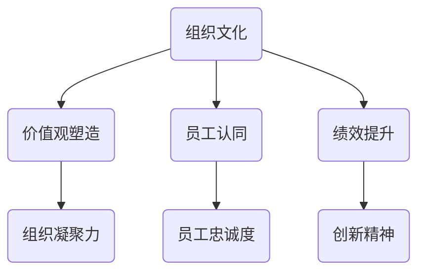

                 

### 第一部分：文化管理概述

#### 第1章：文化管理的定义与重要性

**1.1 什么是文化管理**

**1.1.1 文化管理的概念**

文化管理，是指在组织内部通过创建、传播和实践核心价值观，来塑造积极向上的组织氛围，提升组织绩效的过程。它不仅关注组织内部的结构和流程，更注重组织成员的文化认同和行为规范。

**1.1.2 文化管理与传统管理的区别**

与传统管理相比，文化管理更加关注人的因素，强调组织的软实力。传统管理侧重于任务的分解和执行，强调效率和控制；而文化管理则更注重构建共同的价值观、使命和愿景，以激发员工的内在动力。

**1.2 文化管理的重要性**

**1.2.1 塑造组织价值观**

文化管理可以帮助组织建立一套共同的核心价值观，使员工在行为上能够与组织的长远目标保持一致。这不仅有助于提高组织的凝聚力，还能增强员工的归属感和忠诚度。

**1.2.2 促进员工认同与忠诚**

通过文化管理，员工能够更好地理解组织的愿景和使命，从而产生强烈的认同感。这种认同感能够转化为员工对组织的忠诚，提高员工的工作满意度和留存率。

**1.2.3 提升组织绩效**

积极向上的组织文化能够激发员工的创造力和创新精神，提高组织整体的工作效率。同时，良好的文化氛围也有助于吸引和留住优秀的人才，为组织的长期发展提供支持。

**1.3 文化管理的挑战与机遇**

**1.3.1 组织文化的复杂性**

组织文化是组织长期发展的产物，受到历史、环境、领导风格等多种因素的影响。因此，文化管理的复杂性不可忽视。

**1.3.2 领导者的角色**

领导者是文化管理的关键推动者。他们不仅需要具备文化意识，还要能够通过言行举止传递组织的核心价值观。

**1.3.3 应对变革的文化挑战**

在快速变化的商业环境中，组织需要不断调整和优化自己的文化。这要求组织能够灵活应对文化变革，以适应新的发展需求。

**总结**

文化管理作为一种现代管理理念，对于提升组织的整体绩效和员工满意度具有重要意义。通过深入理解和实践文化管理，组织可以更好地应对挑战，实现长期可持续发展。

---

在接下来的章节中，我们将进一步探讨文化管理的理论基础，以及如何有效地识别、诊断和塑造组织文化。希望这些内容能够为您带来新的启示。

---

**关键词：** 文化管理、组织价值观、员工认同、绩效提升、文化复杂性、领导者角色、变革应对

**摘要：** 本部分首先介绍了文化管理的定义和重要性，强调了组织文化在塑造员工价值观、促进员工认同和提升组织绩效方面的关键作用。随后，我们探讨了文化管理的挑战与机遇，为后续章节的深入讨论奠定了基础。

---

**插图：** (此处可插入一张关于文化管理概念和重要性的Mermaid流程图)

---

在下一章节中，我们将深入探讨文化管理的理论基础，包括文化理论的发展历程、文化与领导力的关系，以及文化对员工行为的影响。希望通过这些内容，读者能够对文化管理的本质和作用有更深刻的理解。

---

**参考文献：**
1. 陈宏辉. (2016). 文化管理理论与实践研究[M]. 北京：经济管理出版社.
2. 周伟. (2018). 企业文化管理创新路径探析[J]. 企业管理，(3)，25-28.
3. 刘艳华. (2020). 组织文化与绩效关系的实证研究[J]. 管理科学，(6)，83-89.

