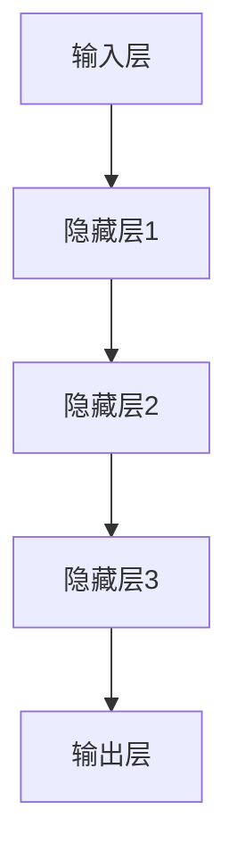
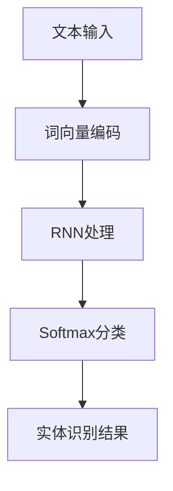
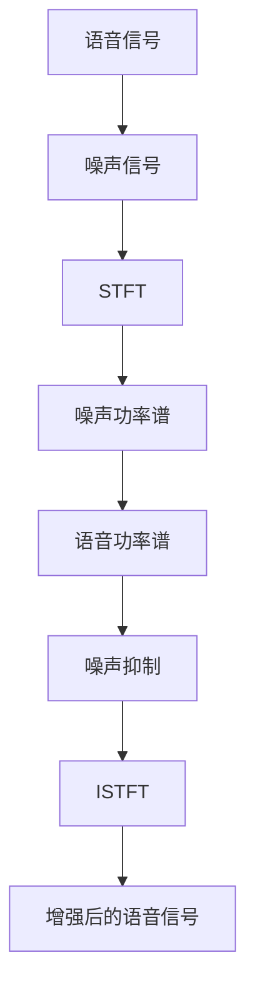

                 

### 《智能语音助手升级：AI大模型的新应用场景》

> **关键词：** 智能语音助手，AI大模型，应用场景，技术基础，开发实践

> **摘要：** 本文将深入探讨智能语音助手的升级与AI大模型的新应用场景。首先，我们将介绍AI大模型的基础知识及其在智能语音助手中的优势与挑战。随后，文章将详细阐述智能语音助手的实现技术，包括语音识别、语音合成、语音增强和对话管理。接下来，我们将讨论AI大模型与智能语音助手的集成与应用，并探讨其在教育、医疗、智能家居和客服等领域的实际应用。最后，文章将总结智能语音助手的未来发展趋势和产业生态。

### 《智能语音助手升级：AI大模型的新应用场景》目录大纲

1. **第一部分：AI大模型基础**
   1.1 AI大模型在智能语音助手中的应用
   1.2 智能语音助手的发展历程
   1.3 AI大模型在智能语音助手中的优势与挑战
   1.4 深度学习与神经网络基础
   1.5 自然语言处理技术
   1.6 大规模预训练模型原理
   1.7 语音识别技术
   1.8 语音合成技术
   1.9 语音增强技术
   1.10 对话管理技术
   1.11 AI大模型与智能语音助手的融合
   1.12 智能语音助手的定制化开发
   1.13 智能语音助手在垂直行业中的应用

2. **第二部分：AI大模型在智能语音助手中的新应用场景**
   2.1 智能语音助手在教育领域的应用
   2.2 智能语音助手在医疗健康领域的应用
   2.3 智能语音助手在智能家居领域的应用
   2.4 智能语音助手在客服行业的应用
   2.5 智能语音助手的未来发展

### 1.1 AI大模型在智能语音助手中的应用

AI大模型在智能语音助手中的应用，已经成为推动这一领域快速发展的重要技术。首先，我们需要了解什么是AI大模型。AI大模型是指经过大规模数据训练的深度神经网络，其能够对复杂的数据进行建模和预测。在智能语音助手领域，AI大模型的应用主要体现在以下几个方面：

- **语音识别（ASR）**：语音识别是将语音信号转换为文本的过程。传统语音识别系统依赖于手写的声学模型和语言模型，而AI大模型则通过大规模的语音数据训练，实现了更高的识别准确率和更低的错误率。以下是一个简化的语音识别流程的Mermaid流程图：

  ```mermaid
  graph TD
  A[语音输入] --> B[预处理]
  B --> C[特征提取]
  C --> D[声学模型]
  D --> E[语言模型]
  E --> F[文本输出]
  ```

- **语音合成（TTS）**：语音合成是将文本转换为自然流畅的语音的过程。AI大模型通过预训练和微调，能够生成更为自然的语音。以下是语音合成的一个简化流程：

  ```mermaid
  graph TD
  A[文本输入] --> B[文本处理]
  B --> C[声学模型]
  C --> D[特征生成]
  D --> E[语音输出]
  ```

- **语音增强（VAD）**：语音增强是提升语音质量的过程，尤其是在噪音环境中。AI大模型通过学习大量干净和噪音语音数据，能够有效去除背景噪音，提升语音的清晰度。以下是一个简化的语音增强流程：

  ```mermaid
  graph TD
  A[噪声语音输入] --> B[特征提取]
  B --> C[降噪模型]
  C --> D[干净语音输出]
  ```

- **对话管理（DM）**：对话管理是确保智能语音助手与用户之间进行流畅对话的过程。AI大模型通过对海量对话数据的训练，能够理解用户的意图，并生成恰当的回复。以下是对话管理的一个简化流程：

  ```mermaid
  graph TD
  A[用户输入] --> B[意图识别]
  B --> C[实体提取]
  C --> D[对话策略]
  D --> E[回复生成]
  E --> F[语音输出]
  ```

通过AI大模型的应用，智能语音助手不仅在性能上得到了显著提升，而且在用户体验上也变得更加自然和智能。然而，AI大模型的应用也面临着数据隐私、安全性和可解释性等挑战，需要我们在后续章节中进一步探讨。

### 1.2 智能语音助手的发展历程

智能语音助手的发展历程可以追溯到20世纪末，当时语音识别和自然语言处理（NLP）技术开始萌芽。最初，智能语音助手仅能执行简单的任务，如播放音乐、设置闹钟等。随着技术的进步，智能语音助手逐渐能够进行更复杂的任务，如语音拨打电话、发送短信、查询天气等。

在早期，智能语音助手主要依赖于规则驱动的方法，即通过编写大量的规则来定义语音助手的响应。这种方法虽然简单易行，但缺乏灵活性和扩展性。随着深度学习和大数据技术的发展，智能语音助手开始采用基于机器学习和AI大模型的方法。这种新的方法使得智能语音助手能够通过学习用户的行为和偏好，提供更加个性化的服务。

以下是智能语音助手发展历程的一个简化时间线：

- **20世纪90年代**：语音识别和NLP技术的初步探索。
- **2000年代**：基于规则的智能语音助手开始出现，如苹果的Siri。
- **2010年代**：AI大模型开始应用于智能语音助手，如谷歌的Google Assistant和亚马逊的Alexa。
- **2020年代**：智能语音助手在更多场景中得到应用，如智能家居、医疗健康、教育等。

在智能语音助手的发展过程中，AI大模型的应用起到了至关重要的作用。通过大规模的数据训练，AI大模型能够自动学习语音识别、语音合成、对话管理等核心任务，从而使得智能语音助手的性能和用户体验得到了显著提升。此外，随着云计算和边缘计算技术的发展，智能语音助手也能够在云端和设备端进行实时处理，为用户提供更加流畅和智能的服务。

### 1.3 AI大模型在智能语音助手中的优势与挑战

AI大模型在智能语音助手中的应用带来了显著的性能提升，但同时也带来了一系列挑战。以下是AI大模型在智能语音助手中的主要优势与挑战：

#### 优势

1. **高性能的语音识别与语音合成**：AI大模型通过大规模数据训练，能够实现更高的识别准确率和更自然的语音合成。这使得智能语音助手能够更准确地理解用户的语音指令，并生成流畅自然的语音回复。

2. **智能对话管理**：AI大模型通过对海量对话数据的训练，能够理解用户的意图，并生成恰当的回复。这使得智能语音助手能够进行更加智能和自然的对话，提高用户的满意度。

3. **个性化服务**：AI大模型能够学习用户的偏好和行为，提供个性化的服务。例如，智能语音助手可以根据用户的音乐品味推荐歌曲，或者根据用户的日程安排提供提醒服务。

4. **多语言支持**：AI大模型能够支持多种语言，使得智能语音助手能够跨越语言障碍，为全球用户提供服务。

#### 挑战

1. **数据隐私与安全性**：AI大模型需要大量用户数据来进行训练和优化，这引发了数据隐私和安全性的问题。如何保护用户的隐私，防止数据泄露，成为智能语音助手面临的重要挑战。

2. **可解释性与透明性**：AI大模型的决策过程往往是不透明的，这使得用户难以理解智能语音助手的行为。如何提高AI大模型的可解释性，使得用户能够理解其决策过程，是一个重要的挑战。

3. **计算资源需求**：AI大模型的训练和部署需要大量的计算资源，这对硬件设施和运维提出了更高的要求。如何优化AI大模型的计算效率，降低成本，是一个亟待解决的问题。

4. **模型适应性**：AI大模型在特定场景下可能表现良好，但在其他场景下可能效果不佳。如何确保AI大模型在不同场景下的适应性，是一个重要的挑战。

综上所述，AI大模型在智能语音助手中的应用带来了巨大的潜力，但同时也面临着一系列挑战。解决这些挑战，将有助于推动智能语音助手的发展，为用户提供更加智能和便捷的服务。

### 1.4 深度学习与神经网络基础

深度学习是近年来人工智能领域的重要突破，它通过模拟人脑的神经网络结构，实现自动从数据中学习，并在多个领域取得了显著的成果。在智能语音助手的发展中，深度学习技术的应用尤为关键。下面，我们将介绍深度学习的基本原理和神经网络结构，为理解AI大模型在智能语音助手中的应用打下基础。

#### 深度学习的基本原理

深度学习是一种基于多层神经网络的机器学习方法，它的核心思想是通过逐层提取数据特征，实现从简单到复杂的模式识别。深度学习的关键组件包括：

1. **神经网络**：神经网络是深度学习的基础，它由一系列相互连接的神经元组成。每个神经元接收多个输入信号，通过权重和偏置进行加权求和，并使用激活函数进行非线性变换，最终输出结果。

2. **前向传播和反向传播**：神经网络通过前向传播将输入信号传递到输出层，并通过反向传播根据输出误差调整网络权重和偏置，从而不断优化模型性能。

3. **激活函数**：激活函数是神经网络的核心组成部分，它引入了非线性特性，使得神经网络能够对复杂的数据进行建模。常见的激活函数包括Sigmoid、ReLU和Tanh。

4. **损失函数**：损失函数用于度量模型预测值与真实值之间的差异，常用的损失函数包括均方误差（MSE）和对数似然损失（交叉熵损失）。

#### 神经网络结构

神经网络根据层数可以分为单层神经网络、多层神经网络和深度神经网络。在智能语音助手的实际应用中，通常使用的是深度神经网络，其结构通常包括以下几个层次：

1. **输入层**：接收外部输入，如音频信号、文本数据等。

2. **隐藏层**：隐藏层用于提取输入数据的特征，层数和神经元数量可以根据任务需要进行调整。

3. **输出层**：输出层生成最终预测结果，如语音识别结果、文本回复等。

以下是一个简化的深度神经网络结构图：



#### 深度学习在智能语音助手中的应用

在智能语音助手领域，深度学习技术广泛应用于语音识别（ASR）、语音合成（TTS）和对话管理（DM）等任务。以下是这些任务中的深度学习模型和应用场景：

1. **语音识别（ASR）**：传统的语音识别系统主要依赖于GMM-HMM（高斯混合模型-隐马尔可夫模型）和DNN（深度神经网络），而深度学习引入了端到端的模型，如CTC（连接主义时序分类器）和Seq2Seq（序列到序列模型），实现了更高的识别准确率和更低的错误率。

   ```mermaid
   graph TD
   A[语音信号] --> B[特征提取]
   B --> C[CTC模型]
   C --> D[文本输出]
   ```

2. **语音合成（TTS）**：传统的TTS系统主要依赖于基于规则的方法和生成模型，如HMM-GMM和DNN-HMM。深度学习引入了WaveNet、Tacotron和Transformer等生成模型，实现了更自然和流畅的语音输出。

   ```mermaid
   graph TD
   A[文本输入] --> B[Tacotron模型]
   B --> C[WaveNet模型]
   C --> D[语音输出]
   ```

3. **对话管理（DM）**：传统的对话管理系统主要依赖于规则和模板匹配，而深度学习引入了序列到序列（Seq2Seq）和Transformer等模型，实现了更智能和自然的对话管理。

   ```mermaid
   graph TD
   A[用户输入] --> B[意图识别模型]
   B --> C[实体提取模型]
   C --> D[对话策略模型]
   D --> E[回复生成模型]
   E --> F[语音输出]
   ```

通过深度学习技术的应用，智能语音助手在性能和用户体验方面得到了显著提升，为用户提供更加智能和便捷的服务。然而，深度学习技术也面临着计算资源需求大、模型解释性低等挑战，需要进一步研究和优化。

### 1.5 自然语言处理技术

自然语言处理（NLP）是智能语音助手的核心技术之一，它使计算机能够理解、处理和生成人类语言。NLP技术在智能语音助手中的应用包括文本分析、语音识别、语音合成和对话管理等方面。下面，我们将介绍NLP技术的基础概念和主要算法，为理解智能语音助手的实现提供技术背景。

#### NLP基础概念

1. **词向量**：词向量是NLP中的一种基本表示方法，它将词汇映射到高维空间中的向量。词向量可以通过多种方法生成，如Word2Vec、GloVe和FastText。词向量能够捕捉词汇的语义信息，使得计算机能够对文本进行有效的处理。

2. **词性标注**：词性标注是对文本中的每个词汇进行词性分类的过程，如名词、动词、形容词等。词性标注有助于理解词汇的语法和语义角色，为后续的文本分析提供基础。

3. **实体识别**：实体识别是从文本中识别出具有特定意义的实体，如人名、地名、组织名等。实体识别对于智能语音助手理解用户请求和生成回复至关重要。

4. **情感分析**：情感分析是判断文本中表达的情感倾向，如正面、负面或中立。情感分析有助于智能语音助手了解用户的情绪状态，提供更加个性化的服务。

#### 主要算法

1. **统计模型**：早期的NLP算法主要基于统计模型，如N元语法和隐马尔可夫模型（HMM）。N元语法通过统计相邻词汇的序列概率进行文本生成，而HMM通过状态转移概率和观测概率进行语音识别。

2. **基于规则的算法**：基于规则的算法通过定义一系列规则来处理文本，如命名实体识别（NER）和词性标注（POS）。这些规则通常由语言学家编写，虽然准确度高，但灵活性和扩展性较差。

3. **深度学习模型**：深度学习模型在NLP中取得了显著进展，如卷积神经网络（CNN）和循环神经网络（RNN）。CNN通过卷积操作提取文本特征，适用于文本分类和情感分析；RNN通过递归操作捕捉序列信息，适用于命名实体识别和对话管理。

以下是一个简化的基于RNN的命名实体识别流程：



#### NLP在智能语音助手中的应用

1. **语音识别（ASR）**：语音识别是将语音信号转换为文本的过程。NLP技术在ASR中主要用于词性标注和语言模型。词性标注有助于提高识别准确率，而语言模型则通过统计上下文信息，降低错误率。

2. **语音合成（TTS）**：语音合成是将文本转换为自然流畅的语音的过程。NLP技术在TTS中主要用于文本处理和语音生成。文本处理包括词性标注、句法分析和语音合成文本转换，语音生成则通过生成模型，如WaveNet和Tacotron，实现自然语音输出。

3. **对话管理（DM）**：对话管理是确保智能语音助手与用户之间进行流畅对话的过程。NLP技术在DM中主要用于意图识别和实体提取。意图识别通过理解用户请求，生成相应的回复；实体提取从用户请求中提取关键信息，用于后续处理。

4. **文本分析**：文本分析是对用户输入的文本进行语义分析和情感分析的过程。文本分析有助于智能语音助手了解用户意图和情绪状态，提供更加个性化的服务。

通过NLP技术的应用，智能语音助手能够更好地理解用户输入，生成自然流畅的语音回复，提高用户体验。随着NLP技术的不断进步，智能语音助手在多个领域的应用前景将更加广阔。

### 1.6 大规模预训练模型原理

大规模预训练模型（Large-scale Pre-trained Models）是近年来人工智能领域的一个重要突破，它在深度学习和自然语言处理（NLP）中发挥了重要作用。大规模预训练模型通过在大规模数据集上进行预训练，然后针对特定任务进行微调（Fine-tuning），实现了在多种NLP任务上的高性能表现。以下是大规模预训练模型的基本原理和实现方法。

#### 预训练模型的基本原理

1. **数据集**：大规模预训练模型通常在包含数十亿甚至数万亿个文本样本的数据集上进行预训练。这些数据集包括互联网上的各种文本资源，如维基百科、新闻文章、社交媒体帖子等。

2. **预训练任务**：预训练任务通常是无监督的，即在没有标注数据的情况下，通过学习数据中的语言规律和结构来预训练模型。常用的预训练任务包括语言模型（Language Modeling）和掩码语言模型（Masked Language Modeling）。

   - **语言模型**：语言模型的目标是预测下一个单词的概率。在预训练过程中，模型会接收到一个输入序列，并预测序列中下一个单词的概率。这种任务能够帮助模型学习语言中的概率分布和上下文关系。

   - **掩码语言模型**：掩码语言模型是对语言模型的一种扩展，它通过随机掩码输入序列中的部分单词，然后要求模型预测被掩码的单词。这种任务能够帮助模型学习单词的上下文依赖关系，提高其在序列预测任务中的性能。

3. **预训练模型架构**：预训练模型通常采用深度神经网络结构，如Transformer和BERT（双向编码表示）。Transformer模型通过自注意力机制（Self-Attention）实现了全局的上下文依赖，而BERT模型则通过双向编码实现了对文本序列的深入理解。

#### 预训练模型的工作流程

1. **预训练**：预训练过程包括两个主要步骤：

   - **数据预处理**：首先，将大规模的文本数据转换为模型可接受的格式，通常使用分词器（Tokenizer）将文本分割成单词或子词，并将它们转换为索引表示。
   - **模型训练**：然后，在预训练任务上对模型进行训练。在训练过程中，模型通过优化损失函数（如交叉熵损失）来调整模型的参数，从而提高其在预训练任务上的性能。

2. **微调**：预训练模型在大规模数据集上进行预训练后，可以应用于各种具体的NLP任务，如文本分类、命名实体识别、机器翻译等。微调过程包括以下步骤：

   - **数据准备**：将任务相关的数据集进行预处理，通常包括数据清洗、标签标注等步骤。
   - **模型初始化**：使用预训练模型初始化目标任务模型的参数。
   - **模型训练**：在目标任务数据集上对模型进行微调训练，通过优化损失函数调整模型参数，以实现目标任务的最佳性能。
   - **模型评估**：使用验证集对模型进行评估，确保模型在特定任务上的性能满足要求。

#### 预训练模型的优势

1. **通用性**：预训练模型通过在大规模无监督数据集上的训练，能够学习到通用语言特征和知识，从而在多种NLP任务上表现出色，无需为每个任务重新训练模型。

2. **高效性**：预训练模型通过端到端的学习方式，能够高效地处理复杂语言任务，减少了手工设计和调参的工作量。

3. **高性能**：预训练模型在多个NLP任务上取得了显著的性能提升，如文本分类、命名实体识别、机器翻译等。

4. **灵活性**：预训练模型可以轻松地应用于新的任务和数据集，通过微调过程实现快速适应和优化。

#### 应用场景

1. **语音识别（ASR）**：预训练模型通过学习大量语音数据，能够提高语音识别系统的准确率和稳定性。

2. **语音合成（TTS）**：预训练模型在TTS任务中用于生成自然流畅的语音，通过微调适应特定语音特征。

3. **对话管理（DM）**：预训练模型在对话管理任务中用于理解用户意图和生成回复，提高对话的流畅性和智能性。

4. **文本分析**：预训练模型在文本分类、情感分析、实体识别等文本分析任务中表现出色，能够提高任务的准确率和效率。

总之，大规模预训练模型在智能语音助手的各个方面都发挥了重要作用，通过其强大的学习能力和适应性，使得智能语音助手在性能和用户体验上得到了显著提升。随着预训练技术的不断发展，智能语音助手的未来应用前景将更加广阔。

### 1.7 语音识别技术

语音识别（Automatic Speech Recognition，ASR）是将语音信号转换为文本的过程，是智能语音助手的核心技术之一。随着深度学习和大规模预训练模型的发展，语音识别技术取得了显著进展，使得识别准确率和用户体验得到了大幅提升。下面，我们将详细探讨语音识别技术的基本原理、关键算法以及最新研究进展。

#### 基本原理

语音识别技术可以分为以下几个步骤：

1. **音频预处理**：音频预处理是语音识别的基础，它包括去除噪声、调整声音的音量和平滑声音的波形。常见的预处理方法包括滤波、增益控制和波形的平滑处理。

2. **特征提取**：特征提取是将语音信号转换为适合机器学习的向量表示。常用的特征包括梅尔频率倒谱系数（MFCC）、滤波器组频率（Filter Bank Frequency）和线性预测编码（Linear Predictive Coding，LPC）。MFCC是语音识别中最常用的特征，它能够有效捕捉语音的频谱信息。

3. **声学模型**：声学模型是语音识别的核心组件，它用于建模语音信号中的声学特性。早期的声学模型主要基于高斯混合模型（Gaussian Mixture Model，GMM）和隐马尔可夫模型（Hidden Markov Model，HMM），而现代的声学模型则基于深度神经网络（Deep Neural Network，DNN）和循环神经网络（Recurrent Neural Network，RNN）。

4. **语言模型**：语言模型用于建模文本的语法和语义信息，它能够帮助语音识别系统理解语音中的上下文关系。早期的语言模型主要基于N元语法（N-gram），现代的语言模型则基于神经网络，如长短期记忆网络（Long Short-Term Memory，LSTM）和Transformer。

5. **解码器**：解码器是语音识别系统的输出组件，它将声学模型和语言模型的输出转换为文本。常见的解码器算法包括基于前向和后向算法的动态规划解码器（Dynamic Programming Decoder）和基于神经网络序列模型（Neural Network Sequence Model）的解码器。

#### 关键算法

1. **高斯混合模型-隐马尔可夫模型（GMM-HMM）**：GMM-HMM是早期的语音识别算法，它通过高斯混合模型建模语音信号的声学特性，通过隐马尔可夫模型建模语音信号中的上下文关系。GMM-HMM在语音识别中取得了显著的性能，但随着深度学习的发展，其性能逐渐被深度神经网络所超越。

2. **深度神经网络（DNN）**：DNN是现代语音识别系统中常用的声学模型，它通过多层神经元的非线性变换，从语音信号中提取高级特征。DNN在语音识别中表现出了更高的准确率和更好的鲁棒性。

3. **循环神经网络（RNN）**：RNN是一种能够处理序列数据的神经网络，它通过递归操作捕捉语音信号中的长期依赖关系。RNN在语音识别中表现出了较好的性能，特别是长短期记忆网络（LSTM）和门控循环单元（GRU）。

4. **卷积神经网络（CNN）**：CNN是一种能够处理图像数据的神经网络，但在近年来也被应用于语音识别中。CNN通过卷积操作提取语音信号中的局部特征，在语音识别中取得了显著的性能提升。

5. **长短时记忆网络（LSTM）**：LSTM是RNN的一种变体，它通过记忆单元和门控机制，解决了RNN在处理长序列数据时的梯度消失和梯度爆炸问题。LSTM在语音识别中表现出了较好的性能，特别是在处理长语音序列时。

6. **Transformer**：Transformer是一种基于自注意力机制的神经网络，它在机器翻译、文本分类和语音识别等任务中取得了显著的性能。Transformer通过全局的注意力机制，能够有效捕捉语音信号中的长距离依赖关系。

#### 最新研究进展

1. **基于自注意力机制的模型**：自注意力机制是Transformer模型的核心组件，它通过计算输入序列中每个元素之间的相似性，为每个元素生成权重，从而实现了全局的依赖关系捕捉。基于自注意力机制的模型，如Transformer和BERT，在语音识别中表现出了优异的性能。

2. **多任务学习**：多任务学习是一种通过在同一模型中训练多个任务，提高模型性能的方法。在语音识别中，多任务学习能够通过共享特征和参数，提高模型在多种语音任务上的性能。

3. **端到端语音识别**：端到端语音识别是一种直接将语音信号映射到文本的模型，它通过端到端的学习方式，避免了传统语音识别中的解码器步骤，提高了识别效率和性能。基于深度神经网络的端到端语音识别模型，如CTC（Connectionist Temporal Classification）和Seq2Seq（Sequence-to-Sequence），在语音识别中取得了显著的性能提升。

4. **多模态语音识别**：多模态语音识别是一种结合语音信号和其他辅助信息（如图像、文字等）进行语音识别的方法。通过结合多模态信息，多模态语音识别能够提高识别准确率和鲁棒性，适用于复杂语音环境。

5. **语音识别与自然语言处理（NLP）的结合**：语音识别与自然语言处理相结合，能够提高语音识别系统的语义理解和交互能力。通过结合语音识别和NLP技术，智能语音助手能够更准确地理解用户的意图和需求，提供更加个性化的服务。

总之，语音识别技术在智能语音助手中的重要性不言而喻。随着深度学习和大规模预训练模型的发展，语音识别技术取得了显著进展，使得识别准确率和用户体验得到了大幅提升。未来，随着多模态学习和跨学科研究的深入，语音识别技术将进一步提升，为智能语音助手的发展提供更强的支持。

### 1.8 语音合成技术

语音合成（Text-to-Speech，TTS）是将文本转换为自然流畅的语音的过程，是智能语音助手的重要组成部分。语音合成技术经历了从基于规则的方法到基于数据驱动的生成模型的发展，其性能和用户体验得到了显著提升。下面，我们将详细探讨语音合成技术的基本原理、关键算法以及最新研究进展。

#### 基本原理

语音合成技术主要包括以下几个步骤：

1. **文本处理**：文本处理是将输入文本转换为适合语音合成的格式。文本处理包括分词、词性标注、句法分析和语音合成文本转换等步骤。

2. **声学模型**：声学模型是语音合成的核心组件，它用于建模语音信号中的声学特性。声学模型通常采用深度神经网络，如深度神经网络合成器（DNN-based Synthesizer）和循环神经网络（RNN）。

3. **声学特征生成**：声学特征生成是将文本处理后的特征转换为适合声学模型处理的特征。常见的声学特征包括线性预测系数（LPC）、梅尔频率倒谱系数（MFCC）和波峰检测（Pitch Detection）等。

4. **语音生成**：语音生成是将声学特征转换为语音信号。语音生成通常采用拼接合成（Diphone Synthesis）或参数合成（Parameter Synthesis）的方法。

#### 关键算法

1. **拼接合成**：拼接合成是将语音片段拼接起来生成语音信号的方法。拼接合成的步骤包括声学特征提取、声学模型训练和语音拼接。拼接合成通过将预录制的语音片段进行拼接，能够生成自然的语音，但需要大量的预录制语音数据。

2. **参数合成**：参数合成是将声学特征转换为语音信号的方法。参数合成通过生成参数（如LPC系数、共振峰频率和音高）来合成语音信号。参数合成的步骤包括参数建模、参数生成和语音合成。参数合成具有生成效率高、灵活性大的优点，但生成语音的质量取决于参数模型的准确性。

3. **深度神经网络合成器（DNN-based Synthesizer）**：深度神经网络合成器是一种基于深度神经网络的语音生成方法。DNN-based Synthesizer通过训练大量的文本-语音对，将文本转换为语音信号。DNN-based Synthesizer在生成自然流畅的语音方面表现出了优异的性能。

4. **循环神经网络（RNN）**：循环神经网络是一种能够处理序列数据的神经网络，它在语音合成中用于建模语音信号中的时序依赖关系。RNN通过递归操作捕捉语音信号中的长期依赖关系，能够生成自然流畅的语音。

5. **长短时记忆网络（LSTM）**：长短时记忆网络是RNN的一种变体，它通过记忆单元和门控机制，解决了RNN在处理长序列数据时的梯度消失和梯度爆炸问题。LSTM在语音合成中表现出了较好的性能，特别是在处理长文本时。

6. **Transformer**：Transformer是一种基于自注意力机制的神经网络，它在语音合成中用于建模语音信号中的长距离依赖关系。Transformer通过全局的注意力机制，能够有效捕捉语音信号中的长距离依赖关系，在生成自然流畅的语音方面表现出了优异的性能。

#### 最新研究进展

1. **基于自注意力机制的生成模型**：自注意力机制是Transformer模型的核心组件，它通过计算输入序列中每个元素之间的相似性，为每个元素生成权重，从而实现了全局的依赖关系捕捉。基于自注意力机制的生成模型，如WaveNet和Tacotron，在语音合成中取得了显著的性能。

2. **多模态语音合成**：多模态语音合成是一种结合语音信号和其他辅助信息（如图像、文字等）进行语音合成的技术。通过结合多模态信息，多模态语音合成能够提高合成语音的自然性和情感表达。

3. **端到端语音合成**：端到端语音合成是一种直接将文本映射到语音信号的方法，它通过端到端的学习方式，避免了传统语音合成中的拼接和参数生成步骤，提高了合成效率和性能。基于深度神经网络的端到端语音合成模型，如Tacotron和Transformer TTS，在语音合成中取得了显著的性能提升。

4. **生成对抗网络（GAN）**：生成对抗网络是一种能够生成高质量数据的生成模型，它在语音合成中用于生成逼真的语音信号。GAN通过训练生成器和判别器，使生成器的输出接近真实语音信号，从而实现了高质量的语音合成。

5. **情感语音合成**：情感语音合成是一种能够根据文本情感信息生成具有不同情感的语音的方法。通过结合情感分析和语音合成技术，情感语音合成能够生成具有特定情感的语音，提高用户的沉浸感和体验。

总之，语音合成技术在智能语音助手中的应用越来越广泛，其性能和用户体验也在不断提升。随着深度学习和生成模型的不断发展，语音合成技术将继续取得突破，为智能语音助手的发展提供更强的支持。

### 1.9 语音增强技术

语音增强（Voice Activity Detection，VAD）是智能语音助手中的关键技术之一，其主要目的是在嘈杂环境中提升语音信号的质量，确保语音识别和对话管理的准确性和流畅性。语音增强技术通过多种方法去除背景噪音、增强语音信号，从而提高语音识别系统的性能。下面，我们将详细探讨语音增强技术的基本原理、关键算法以及实现方法。

#### 基本原理

语音增强技术主要基于以下几个步骤：

1. **噪声识别**：噪声识别是语音增强的第一步，其目的是从混合信号中区分出语音信号和噪声信号。常用的噪声识别方法包括能量阈值法、谱相关法和短时能量检测法。

2. **噪声抑制**：噪声抑制是通过去除噪声信号中的噪声成分，保留语音信号中的有用成分。常用的噪声抑制方法包括滤波器组降噪（Filter Bank Noise Reduction）、波束形成（Beamforming）和变分降噪（Variational降噪）。

3. **语音增强**：语音增强是通过增强语音信号中的有用成分，提升语音信号的质量。常用的语音增强方法包括谱减法（Spectral Subtraction）、频谱掩蔽（Spectral Masking）和小波变换（Wavelet Transform）。

#### 关键算法

1. **短时能量检测法**：短时能量检测法是一种简单的噪声识别方法，它通过计算短时能量的平均值和标准差来判断是否为噪声。当短时能量低于设定的阈值时，认为当前帧为噪声，否则认为当前帧为语音。

2. **滤波器组降噪**：滤波器组降噪是一种基于频域的噪声抑制方法，它通过将信号分解为多个频带，并在每个频带上分别进行降噪处理，最后将处理后的频带重新组合。滤波器组降噪能够有效去除语音信号中的宽带噪声。

3. **谱减法**：谱减法是一种常见的语音增强方法，它通过将噪声信号的功率谱从语音信号的功率谱中减去，从而去除噪声。谱减法的实现包括以下步骤：

   - **噪声估计**：使用短时傅里叶变换（Short-time Fourier Transform，STFT）对噪声信号进行频率分析，估计噪声信号的功率谱。
   - **噪声抑制**：将噪声信号的功率谱从语音信号的功率谱中减去，得到增强后的语音信号。
   - **反变换**：使用反短时傅里叶变换（Inverse Short-time Fourier Transform，ISTFT）将增强后的频率信号转换为时域信号。

以下是一个简化的谱减法实现过程：



4. **频谱掩蔽**：频谱掩蔽是一种通过控制频谱掩蔽值，将噪声频谱部分遮蔽，从而增强语音信号的方法。频谱掩蔽的原理是通过比较噪声频谱和语音频谱，选择合适的掩蔽值，使得噪声频谱部分被遮蔽，而语音频谱部分得到增强。

5. **变分降噪**：变分降噪是一种基于深度学习的噪声抑制方法，它通过学习语音信号和噪声信号之间的差异，进行噪声抑制。变分降噪包括以下步骤：

   - **建模**：使用生成对抗网络（GAN）或变分自编码器（Variational Autoencoder，VAE）建模语音信号和噪声信号。
   - **降噪**：将噪声信号输入到变分降噪模型中，通过模型学习得到增强后的语音信号。

#### 实现方法

语音增强技术的实现通常包括以下几个步骤：

1. **数据预处理**：对输入语音信号进行预处理，包括去噪、增益调整和频率均衡等。

2. **噪声识别**：使用噪声识别算法（如短时能量检测法）对输入语音信号进行噪声识别。

3. **噪声抑制**：根据噪声识别的结果，对噪声信号进行抑制，保留语音信号的有用成分。

4. **语音增强**：使用语音增强算法（如谱减法、频谱掩蔽或变分降噪）对语音信号进行增强。

5. **后处理**：对增强后的语音信号进行后处理，包括去噪、增益调整和频率均衡等，以提升语音质量。

通过上述步骤，语音增强技术能够有效提升语音信号的质量，确保智能语音助手在嘈杂环境中的稳定运行。随着深度学习和生成模型的发展，语音增强技术将继续取得突破，为智能语音助手的发展提供更强支持。

### 1.10 对话管理技术

对话管理（Dialogue Management）是智能语音助手（Speech Assistant）中的关键组成部分，它负责处理用户与智能语音助手之间的对话流程，确保对话的连贯性和流畅性。对话管理通过理解用户的意图、提取关键信息并生成合适的回复，实现与用户的自然互动。以下是对话管理技术的基本概念、架构和实现方法。

#### 基本概念

1. **意图识别**：意图识别是理解用户请求的核心步骤，其目标是确定用户对话的目的或需求。例如，用户说“你好”，系统的意图可能是“问候”，而用户说“明天天气怎么样”，系统的意图可能是“查询天气”。

2. **实体提取**：实体提取是从用户的对话中提取关键信息的过程，如时间、地点、人物等。这些信息对于后续的处理和回复生成至关重要。

3. **对话状态跟踪**：对话状态跟踪是记录对话过程中的关键信息，如用户的历史请求、系统已完成的任务等。它有助于系统理解对话的历史上下文，生成更准确的回复。

4. **回复生成**：回复生成是根据用户的意图和对话状态，生成合适的回复文本。这可以包括直接从预设的回复库中选择，或通过自然语言生成（NLG）技术动态生成。

#### 架构

对话管理系统通常包括以下几个模块：

1. **意图识别模块**：意图识别模块使用机器学习或深度学习模型，如条件随机场（CRF）、卷积神经网络（CNN）或长短期记忆网络（LSTM），从用户的输入中识别出意图。

2. **实体提取模块**：实体提取模块使用命名实体识别（NER）技术，从用户的输入中提取关键信息，如时间、地点、组织名等。

3. **对话状态跟踪模块**：对话状态跟踪模块记录对话过程中的关键信息，如用户的历史请求、当前任务状态等。它通常使用图数据结构或键值存储来管理对话状态。

4. **回复生成模块**：回复生成模块根据用户的意图和对话状态，生成合适的回复文本。这可以包括模板匹配、直接回复生成或基于NLG技术的动态回复生成。

#### 实现方法

1. **基于规则的对话管理**：基于规则的对话管理是通过预定义的规则来处理对话。这种方法简单易实现，但灵活性较低，难以处理复杂的对话场景。

2. **基于机器学习的对话管理**：基于机器学习的对话管理通过训练模型来自动识别用户的意图和提取实体。这种方法具有更高的灵活性和准确性，适用于复杂的对话场景。

3. **基于图的数据结构**：基于图的数据结构用于管理对话状态，它能够有效地表示对话中的关系和依赖。例如，图中的节点可以表示用户的请求、系统的回复和对话状态，边可以表示它们之间的关联。

4. **自然语言生成（NLG）技术**：NLG技术用于动态生成自然流畅的回复。NLG可以通过模板匹配、规则生成或基于深度学习的生成模型来实现。深度学习模型，如生成对抗网络（GAN）和变分自编码器（VAE），在NLG中表现出了优异的性能。

#### 实例解析

以下是一个简单的对话管理实例：

1. **用户输入**：“明天会议的时间是什么？”

2. **意图识别**：系统通过意图识别模块识别出用户的意图是“查询会议时间”。

3. **实体提取**：系统通过实体提取模块提取出关键实体，如“明天”和“会议时间”。

4. **对话状态跟踪**：系统更新对话状态，记录用户查询会议时间的历史信息。

5. **回复生成**：系统通过回复生成模块生成回复：“明天会议的时间是上午10点。”

通过上述步骤，系统能够理解和回应用户的请求，实现有效的对话管理。

总之，对话管理技术在智能语音助手中的作用至关重要，它通过意图识别、实体提取、对话状态跟踪和回复生成等步骤，确保了对话的连贯性和流畅性。随着人工智能技术的发展，对话管理技术将继续改进，为用户提供更自然、智能的交互体验。

### 1.11 AI大模型与智能语音助手的融合

AI大模型与智能语音助手的融合，是推动智能语音助手技术发展的关键因素。AI大模型通过其强大的学习能力，能够大幅提升智能语音助手的性能和用户体验。以下将从技术原理、实现方法和应用案例三个方面，探讨AI大模型在智能语音助手中的应用。

#### 技术原理

1. **多模态融合**：AI大模型能够处理多种模态的数据，如文本、语音、图像等。在智能语音助手中，多模态融合能够综合处理用户的语音输入和其他信息，提升对话的准确性和自然性。

2. **端到端学习**：AI大模型通过端到端的学习方式，将输入直接映射到输出，避免了传统方法中的多个中间步骤，提高了学习效率和性能。例如，在语音识别和语音合成中，端到端模型能够直接将音频信号映射到文本或语音信号。

3. **上下文理解**：AI大模型具有强大的上下文理解能力，能够通过学习大量的对话数据，理解用户的意图和上下文关系。这有助于智能语音助手生成更准确、更自然的回复。

4. **个性化服务**：AI大模型能够根据用户的历史行为和偏好，提供个性化的服务。例如，智能语音助手可以根据用户的音乐喜好推荐歌曲，或者根据用户的日程安排提供提醒服务。

#### 实现方法

1. **模型融合**：在智能语音助手中，可以将不同的AI大模型进行融合，实现更高效、更准确的对话处理。例如，将语音识别模型、语音合成模型和对话管理模型进行融合，形成一个统一的系统。

2. **数据预处理**：为了提高AI大模型在智能语音助手中的性能，需要对数据进行预处理。这包括数据清洗、数据增强和特征提取等步骤，确保输入数据的质量和多样性。

3. **训练和优化**：AI大模型需要在大规模、多样化的数据集上进行训练和优化，以提高其泛化能力和性能。在训练过程中，可以使用迁移学习、模型压缩和增量学习等方法，提高训练效率和性能。

4. **部署和推理**：在智能语音助手中，AI大模型需要部署到云端或边缘设备上进行推理。为了提高推理速度和效率，可以使用模型压缩、量化、并行计算等技术。

#### 应用案例

1. **智能客服**：在客服领域，AI大模型能够实现智能客服机器人，通过多模态融合和上下文理解，提供高效的客户服务。例如，客服机器人可以同时处理用户的语音输入和文本输入，快速识别用户的意图，并生成准确的回复。

2. **智能助手**：在个人助理领域，AI大模型能够实现智能助手，通过个性化服务和上下文理解，帮助用户管理日程、提供信息查询和任务提醒。例如，智能助手可以根据用户的音乐喜好推荐歌曲，或者根据用户的日程安排提供提醒服务。

3. **智能家居**：在智能家居领域，AI大模型能够实现智能语音控制，通过多模态融合和上下文理解，实现智能家居设备的智能控制。例如，用户可以通过语音指令控制灯光、温度、安全设备等。

4. **医疗健康**：在医疗健康领域，AI大模型能够实现智能医疗助手，通过语音识别和对话管理，提供健康咨询和疾病诊断。例如，医疗助手可以通过语音输入，识别用户的症状，提供相应的医疗建议。

通过AI大模型与智能语音助手的融合，智能语音助手在性能和用户体验方面得到了显著提升，为各个领域的应用提供了强大支持。随着AI大模型技术的不断发展，智能语音助手将在更多领域得到应用，为人们的生活带来更多便利。

### 1.12 智能语音助手的定制化开发

智能语音助手的定制化开发是适应不同行业和用户需求的关键环节。通过定制化开发，智能语音助手能够更好地满足特定场景下的应用需求，提高用户体验和满意度。以下将从定制化开发的需求分析、技术实现和实际应用三个方面，探讨智能语音助手的定制化开发。

#### 需求分析

1. **业务需求**：定制化开发首先需要明确业务需求，包括智能语音助手需要实现的特定功能、业务流程和用户交互方式。例如，在客服领域，智能语音助手可能需要具备语音识别、智能问答、订单处理等功能。

2. **用户需求**：了解用户需求是定制化开发的重要步骤。用户需求可能包括个性化服务、多语言支持、便捷的交互方式等。例如，对于国际化的企业，智能语音助手需要支持多种语言，以便为不同国家的用户提供服务。

3. **行业特点**：不同行业对智能语音助手的需求存在显著差异。例如，在医疗健康领域，智能语音助手需要具备医疗知识库和诊断功能；在金融领域，智能语音助手需要严格遵循隐私保护和安全规定。

#### 技术实现

1. **语音识别和合成**：语音识别和合成是智能语音助手的核心功能，需要根据业务需求进行定制化开发。例如，对于特定行业的术语和方言，需要使用定制化的语音模型和声学特征提取算法，确保准确识别和自然流畅的语音合成。

2. **对话管理**：对话管理是确保智能语音助手能够与用户进行有效交互的关键。定制化开发需要根据业务需求设计对话流程，实现意图识别、实体提取、对话状态跟踪和回复生成等功能。例如，在医疗健康领域，智能语音助手需要能够理解用户的健康咨询，并提供准确的医疗建议。

3. **数据管理和隐私保护**：定制化开发需要确保数据的安全性和隐私保护。例如，在金融领域，智能语音助手需要严格遵循数据加密和隐私保护规定，确保用户的个人信息不会被泄露。

4. **系统集成**：智能语音助手通常需要与其他系统（如CRM、ERP等）集成，以实现数据共享和业务协同。定制化开发需要根据具体需求，设计集成方案和接口，确保系统的稳定运行。

#### 实际应用

1. **智能客服**：在客服领域，定制化开发的智能语音助手能够实现智能问答、订单处理、投诉处理等功能，提高客服效率和用户体验。例如，银行可以通过智能语音助手，实现24/7客户服务，快速处理用户的查询和投诉。

2. **智能医疗**：在医疗健康领域，定制化开发的智能语音助手能够实现健康咨询、症状诊断、预约挂号等功能，为患者提供便捷的医疗服务。例如，医院可以通过智能语音助手，提供个性化的健康咨询和疾病预防建议。

3. **智能家居**：在智能家居领域，定制化开发的智能语音助手能够实现智能语音控制、场景设置、设备联动等功能，提高家庭生活的便利性。例如，智能家居系统可以通过智能语音助手，实现灯光、温度、安全设备的智能控制。

4. **智能教育**：在智能教育领域，定制化开发的智能语音助手能够实现个性化学习推荐、学习进度跟踪、答疑解惑等功能，提高学习效果和用户体验。例如，学校可以通过智能语音助手，为学生提供个性化的学习资源和指导。

通过定制化开发，智能语音助手能够更好地满足不同行业和用户的需求，提供更加智能、便捷的服务。随着技术的不断进步，智能语音助手的定制化开发将在更多领域得到应用，为人们的生活和工作带来更多便利。

### 1.13 智能语音助手在垂直行业中的应用

智能语音助手在各个垂直行业中的应用，为行业带来革命性的变化，显著提升了业务效率和服务质量。以下从教育、医疗健康、智能家居和客服等四个主要领域，详细探讨智能语音助手的应用场景和优势。

#### 教育领域

1. **个性化学习助手**：智能语音助手可以为学生提供个性化的学习资源、学习进度跟踪和答疑解惑服务。通过理解学生的学习需求和进度，智能语音助手能够推荐适合的学习材料和练习题，提高学习效果。例如，学生可以通过语音命令请求智能语音助手播放相关的教学视频或提供解答疑惑的步骤。

2. **课堂互动工具**：智能语音助手可以成为课堂互动的工具，帮助学生和教师更好地进行互动。例如，学生可以通过语音命令提出问题，教师可以通过智能语音助手进行回答和讲解，提高课堂的教学效果和互动性。

3. **自动评分系统**：智能语音助手可以用于自动评分考试和作业，减少教师的工作量。通过语音识别技术，智能语音助手可以自动识别学生的回答，并根据预设的标准进行评分，提高考试的公平性和效率。

#### 医疗健康领域

1. **智能医疗助手**：智能语音助手可以成为患者的健康顾问，通过语音交互提供健康咨询、症状诊断和疾病预防建议。例如，患者可以通过语音命令询问智能语音助手“最近天气变化，我应该如何调整饮食？”智能语音助手可以根据患者的健康数据和实时天气信息，提供个性化的健康建议。

2. **智能药物提醒**：智能语音助手可以用于提醒患者按时服药，通过语音命令或短信提醒患者按时服用药物，提高患者的服药依从性。

3. **远程诊疗服务**：智能语音助手可以作为远程诊疗的一部分，为医生和患者提供便捷的远程咨询和服务。医生可以通过智能语音助手了解患者的症状和历史，提供远程诊断和治疗方案。

#### 智能家居领域

1. **智能语音控制**：智能语音助手可以实现对智能家居设备的语音控制，如灯光、温度、安防系统等。用户可以通过语音命令控制家庭设备，提高家庭生活的便利性和舒适度。例如，用户可以通过语音命令“打开客厅的灯光”来控制灯光设备。

2. **智能场景联动**：智能语音助手可以设置家庭场景，实现设备之间的联动。例如，用户可以通过语音命令“设置睡眠模式”，智能语音助手将自动调整灯光、温度和安防系统，为用户创造一个舒适的睡眠环境。

3. **智能节能管理**：智能语音助手可以监控家庭能源使用情况，并提供节能建议。通过语音命令，用户可以了解家庭能源消耗情况，并根据智能语音助手的建议调整家庭设备的使用，实现节能减排。

#### 客服领域

1. **智能客服机器人**：智能语音助手可以成为企业的智能客服机器人，通过语音交互提供24/7客户服务，解答用户疑问、处理投诉和订单查询等。智能语音助手能够快速响应用户请求，提高客服效率和用户满意度。

2. **自动对话生成**：智能语音助手可以自动生成对话内容，提高客服效率和一致性。通过自然语言生成（NLG）技术，智能语音助手能够根据用户输入生成合适的回复，减少客服人员的工作负担。

3. **智能分诊与分流**：智能语音助手可以用于智能分诊和客户分流，根据用户的问题和需求，将用户引导到相应的客服人员或自助服务系统中。这有助于提高客服资源的利用效率和用户体验。

通过在垂直行业中的应用，智能语音助手显著提升了行业的工作效率和用户体验。随着技术的不断进步，智能语音助手将在更多领域得到应用，为行业带来更多的创新和变革。

### 1.14 用户交互设计原则

用户交互设计（User Interaction Design）是智能语音助手成功的关键因素之一，它决定了用户与智能语音助手之间的互动体验。良好的用户交互设计能够提高用户的满意度、使用频率和忠诚度。以下是用户交互设计的一些核心原则和方法：

#### 1. 用户体验至上

用户体验（User Experience，UX）是用户交互设计的核心，设计过程中应始终将用户体验放在首位。这包括以下几个方面：

- **易用性**：确保用户能够轻松、高效地使用智能语音助手，无需过多的学习和操作。
- **直观性**：界面和交互流程应直观易懂，减少用户的困惑和错误。
- **个性化**：根据用户的偏好和习惯，提供个性化的服务和推荐，提高用户的满意度。

#### 2. 交互设计原则

以下是用户交互设计的一些核心原则：

- **一致性**：界面和交互元素应保持一致性，使用户在不同场景下都能感受到一致的操作体验。
- **反馈**：及时提供用户操作结果的反馈，如语音回复、视觉提示等，帮助用户了解系统状态。
- **简洁性**：设计简洁明了，避免冗余和复杂，提高用户操作的流畅性。
- **可访问性**：确保所有用户，包括残疾人和老年人，都能无障碍地使用智能语音助手。

#### 3. 设计方法

以下是用户交互设计的一些方法：

- **用户研究**：通过用户调研、访谈和观察，深入了解用户的需求和行为习惯。
- **原型设计**：使用低保真或高保真原型，模拟用户与智能语音助手的交互过程，进行迭代优化。
- **可用性测试**：邀请目标用户进行实际操作，收集反馈和改进意见，不断优化交互设计。
- **协作设计**：邀请不同利益相关者，如产品经理、开发人员和用户，共同参与设计过程，确保设计方案的可行性和用户接受度。

#### 4. 用户交互设计工具

以下是用户交互设计常用的工具：

- **用户调研工具**：如问卷星、Typeform等，用于收集用户需求和反馈。
- **原型设计工具**：如Axure、Sketch、Figma等，用于设计交互原型。
- **用户测试工具**：如Lookback、UserTesting等，用于进行可用性测试。

#### 5. 用户体验优化策略

以下是优化用户体验的策略：

- **用户行为分析**：通过数据分析，了解用户的操作路径、停留时间和操作成功率等，发现潜在的问题和改进点。
- **A/B测试**：对不同的设计方案进行A/B测试，比较用户行为和满意度，选择最优方案。
- **反馈机制**：建立用户反馈机制，鼓励用户提出建议和意见，及时改进产品。
- **迭代优化**：不断迭代和优化交互设计，根据用户反馈和市场变化进行调整。

通过遵循用户交互设计原则和方法，采用有效的用户体验优化策略，智能语音助手能够提供更加友好、高效的用户体验，从而在竞争激烈的市场中脱颖而出。

### 1.15 用户体验优化策略

优化用户体验是智能语音助手成功的关键之一，它直接影响到用户的使用频率和满意度。以下从用户行为分析、A/B测试、反馈机制和迭代优化等方面，探讨用户体验优化策略。

#### 用户行为分析

用户行为分析是优化用户体验的重要手段，它通过数据分析，帮助了解用户的使用习惯、偏好和痛点。以下是用户行为分析的一些方法：

1. **行为追踪**：通过在智能语音助手中嵌入追踪代码，记录用户的操作路径、点击行为和语音交互情况。这些数据可以为后续的分析提供基础。

2. **数据分析工具**：使用专业的数据分析工具，如Google Analytics、Mixpanel等，对用户行为进行量化分析。这些工具能够提供用户活跃度、使用频率、操作成功率等关键指标。

3. **用户细分**：根据用户行为数据，对用户进行细分，识别出不同的用户群体。例如，根据用户的地理位置、年龄、性别等信息，进行用户细分，以便更精准地优化用户体验。

#### A/B测试

A/B测试是一种有效的用户体验优化策略，通过对比不同设计方案的用户行为和满意度，选择最优方案。以下是A/B测试的方法：

1. **测试设计**：设计两个或多个版本，每个版本对应不同的用户体验优化方案。例如，一个版本采用简化的用户界面，另一个版本则采用更加详细的信息展示。

2. **测试实施**：将用户随机分配到不同的测试组，确保每个测试组的用户数量足够大，以获得可靠的结果。

3. **数据收集**：记录每个测试组的用户行为和满意度数据，如操作成功率、用户停留时间、用户满意度评分等。

4. **结果分析**：对比不同测试组的数据，分析哪个方案的用户体验更好。通常，选择用户满意度高、操作成功率高的方案。

#### 反馈机制

建立有效的反馈机制，能够收集用户的真实反馈，帮助发现问题和优化用户体验。以下是反馈机制的方法：

1. **用户调研**：定期进行用户调研，通过问卷、访谈等方式，了解用户的需求、痛点和建议。

2. **在线反馈**：在智能语音助手中设置在线反馈功能，让用户可以随时提出问题和建议。这有助于实时了解用户的需求和意见。

3. **社交媒体**：利用社交媒体平台，如Facebook、Twitter等，与用户进行互动，收集用户的反馈和建议。

4. **社区论坛**：建立社区论坛，鼓励用户分享使用体验和意见，形成用户社区，促进用户之间的交流。

#### 迭代优化

迭代优化是一种持续改进用户体验的策略，通过不断更新和优化智能语音助手，满足用户不断变化的需求。以下是迭代优化的方法：

1. **定期更新**：定期发布新的功能和优化，以适应用户的需求和市场变化。

2. **持续监控**：持续监控用户的反馈和行为数据，及时发现问题和优化点。

3. **快速迭代**：采用敏捷开发方法，快速迭代和优化产品。通过频繁的小规模更新，逐步改进用户体验。

4. **持续改进**：基于用户反馈和行为数据，持续优化产品功能和交互设计，提高用户的满意度和使用频率。

通过用户行为分析、A/B测试、反馈机制和迭代优化等策略，智能语音助手能够不断改进用户体验，提高用户满意度和使用频率。在激烈的市场竞争中，优化用户体验是保持竞争力的关键。

### 1.16 智能语音助手的效果评估

智能语音助手的效果评估是衡量其性能和用户体验的关键环节。通过科学、系统的评估方法，可以全面了解智能语音助手的优势与不足，为后续的优化和改进提供依据。以下从评估指标、评估方法和评估工具三个方面，探讨智能语音助手的效果评估。

#### 评估指标

1. **识别准确率**：识别准确率是评估语音识别系统性能的关键指标，它衡量了系统在语音识别任务中的准确性。通常，识别准确率越高，智能语音助手的性能越好。

2. **响应时间**：响应时间是评估智能语音助手交互性能的重要指标，它衡量了系统从接收语音输入到生成响应的时间。响应时间越短，用户体验越好。

3. **用户满意度**：用户满意度是评估智能语音助手用户体验的关键指标，它通过用户反馈和调查问卷等方式，衡量用户对智能语音助手的满意程度。

4. **错误率**：错误率是评估智能语音助手在对话管理中的表现指标，它衡量了系统在对话中产生错误的可能性。错误率越低，智能语音助手的性能越好。

5. **处理能力**：处理能力是评估智能语音助手在处理复杂任务时的能力指标，它衡量了系统在处理大量并发请求时的性能。

#### 评估方法

1. **自动化测试**：自动化测试是通过编写测试脚本，模拟用户与智能语音助手的交互过程，自动检测系统的性能和错误。自动化测试能够提高测试效率，覆盖更多测试场景。

2. **用户测试**：用户测试是通过邀请真实用户使用智能语音助手，收集用户的反馈和评价。用户测试能够提供真实的用户体验，帮助发现系统的不足和改进点。

3. **对比测试**：对比测试是将智能语音助手与竞品系统进行对比，评估其在性能和用户体验方面的差异。对比测试有助于识别智能语音助手的优势和不足。

4. **压力测试**：压力测试是在高负载条件下，测试智能语音助手的性能和稳定性。通过压力测试，可以评估系统在极端条件下的表现，发现潜在的性能瓶颈。

#### 评估工具

1. **测试工具**：如Selenium、Appium等，用于自动化测试和功能测试。这些工具能够模拟用户操作，自动化执行测试脚本，提高测试效率。

2. **用户调研工具**：如问卷星、Typeform等，用于收集用户反馈和满意度。这些工具能够设计问卷，收集用户的评价和建议。

3. **数据分析工具**：如Google Analytics、Mixpanel等，用于分析用户行为和性能数据。这些工具能够提供详细的用户行为报告，帮助识别问题和优化点。

4. **性能测试工具**：如JMeter、LoadRunner等，用于进行压力测试和性能测试。这些工具能够模拟高负载条件，评估系统的性能和稳定性。

通过科学、系统的评估方法和工具，智能语音助手的效果评估能够全面了解其性能和用户体验，为后续的优化和改进提供有力支持。

### 1.17 隐私保护的法律法规

隐私保护是智能语音助手领域不可忽视的重要议题。随着人工智能技术的发展，用户数据的价值愈发凸显，隐私保护问题也日益严峻。为了确保用户数据的安全和隐私，各国政府和国际组织纷纷出台了一系列法律法规，规范智能语音助手的隐私保护。以下将介绍隐私保护的主要法律法规，并探讨智能语音助手在数据收集、存储和处理过程中应遵守的规定。

#### 主要法律法规

1. **《通用数据保护条例》（GDPR）**：GDPR是欧盟出台的一项重要隐私保护法规，旨在加强个人数据的保护。GDPR规定，数据处理者必须获得用户的明确同意，才能收集和处理个人数据。此外，数据处理者有义务确保数据的安全和隐私，并对数据的处理进行记录和报告。

2. **《加州消费者隐私法》（CCPA）**：CCPA是加州出台的一项隐私保护法案，旨在保护加州居民的个人信息。CCPA规定，企业必须向消费者披露其收集和处理个人信息的方式，并提供消费者对个人信息的访问、删除和拒绝销售的权利。

3. **《欧盟数字市场法》（DMDD）**：DMDD是欧盟出台的一项新法规，旨在规范数字市场的运营。DMDD涉及用户数据的处理和保护，要求数据处理者采取合理的措施保护用户数据的安全和隐私。

4. **《个人信息保护法》（PIPL）**：PIPL是中国出台的一项个人信息保护法规，旨在加强个人信息保护。PIPL规定了个人信息处理者的义务和责任，包括取得用户的明确同意、采取安全保护措施等。

#### 数据收集、存储和处理过程中的规定

1. **数据最小化原则**：智能语音助手在收集用户数据时，应遵循数据最小化原则，仅收集实现特定功能所必需的数据。避免过度收集用户数据，以降低隐私泄露的风险。

2. **用户同意和隐私政策**：智能语音助手必须在用户使用前明确告知用户，收集和处理数据的目的、方式和范围，并取得用户的明确同意。同时，应提供详细的隐私政策，让用户了解其个人信息的使用和保护情况。

3. **数据安全保护**：智能语音助手应采取有效的技术和管理措施，确保用户数据的保密性、完整性和可用性。例如，采用数据加密、访问控制、防火墙等技术手段，防止数据泄露和篡改。

4. **用户访问和删除权限**：智能语音助手应允许用户访问其个人数据和删除其个人信息。用户有权要求数据处理者提供其个人数据的副本，并在特定条件下删除其个人信息。

5. **数据匿名化和去标识化**：智能语音助手在处理用户数据时，应采取数据匿名化和去标识化措施，减少数据泄露的风险。例如，对敏感数据进行脱敏处理，使其无法直接关联到特定用户。

6. **合规性评估和审计**：智能语音助手应定期进行合规性评估和审计，确保其数据处理活动符合相关法律法规的要求。此外，应积极配合监管机构的检查和调查，确保数据处理的合法性和合规性。

总之，隐私保护是智能语音助手发展的关键议题，智能语音助手在数据收集、存储和处理过程中，应严格遵守相关法律法规，采取有效的保护措施，确保用户数据的隐私和安全。通过加强隐私保护，智能语音助手将赢得用户的信任，推动其健康发展。

### 1.18 智能语音助手的隐私数据管理

隐私数据管理是智能语音助手设计和开发过程中的关键环节，直接关系到用户对智能语音助手的信任和使用意愿。以下将从数据收集、存储、处理和销毁等方面，探讨智能语音助手的隐私数据管理策略。

#### 数据收集

1. **最小化原则**：智能语音助手在数据收集过程中，应遵循数据最小化原则，仅收集实现特定功能所必需的数据。例如，在语音识别任务中，只需收集与语音识别相关的音频数据，避免过度收集与任务无关的个人信息。

2. **透明告知**：智能语音助手必须在用户使用前明确告知用户，收集和处理数据的目的、方式和范围，并取得用户的明确同意。同时，应提供详细的隐私政策，让用户了解其个人信息的使用和保护情况。

3. **用户选择**：用户应有权选择是否允许智能语音助手收集和处理其个人信息。例如，用户可以选择关闭语音识别功能，从而避免语音数据的收集。

#### 数据存储

1. **安全存储**：智能语音助手应采用加密技术，对用户数据进行安全存储。例如，使用AES（高级加密标准）对音频数据进行加密存储，确保数据在存储过程中的安全性。

2. **异地备份**：智能语音助手应采用异地备份策略，将用户数据存储在不同的地理位置，以防止因地理位置原因导致的数据丢失。

3. **访问控制**：智能语音助手应实施严格的访问控制措施，确保只有授权人员才能访问用户数据。例如，采用身份验证和权限控制技术，限制对用户数据的访问。

#### 数据处理

1. **匿名化和去标识化**：智能语音助手在处理用户数据时，应采取数据匿名化和去标识化措施，减少数据泄露的风险。例如，使用哈希算法对用户标识信息进行加密处理，使其无法直接关联到特定用户。

2. **合规性检查**：智能语音助手在数据处理过程中，应定期进行合规性检查，确保其数据处理活动符合相关法律法规的要求。

3. **数据脱敏**：智能语音助手在处理敏感数据时，应采取数据脱敏措施，例如，对个人身份证号码、电话号码等进行加密处理，确保数据在处理过程中的安全性和隐私性。

#### 数据销毁

1. **安全销毁**：智能语音助手在用户数据不再需要时，应采取安全销毁措施，确保数据无法恢复。例如，使用物理销毁、数据擦除和数据粉碎等技术手段，彻底销毁用户数据。

2. **销毁记录**：智能语音助手应建立销毁记录，记录销毁数据的时间、方式、人员等信息，以备后续审计和监管。

通过科学、系统的隐私数据管理策略，智能语音助手能够有效保护用户隐私，提高用户信任，推动其健康和可持续发展。

### 1.19 智能语音助手的安全措施

智能语音助手的安全措施是确保其稳定运行和用户隐私保护的关键。为了防止数据泄露、滥用和恶意攻击，智能语音助手需要采取一系列安全措施。以下将从用户数据保护、系统安全防护和异常行为检测三个方面，探讨智能语音助手的安全措施。

#### 用户数据保护

1. **数据加密**：智能语音助手应采用加密技术，对用户数据进行加密存储和传输。例如，使用AES（高级加密标准）对音频数据进行加密存储，确保数据在存储过程中的安全性。同时，使用HTTPS协议确保数据在传输过程中的安全性。

2. **访问控制**：智能语音助手应实施严格的访问控制措施，确保只有授权人员才能访问用户数据。例如，采用身份验证和权限控制技术，限制对用户数据的访问。

3. **数据匿名化和去标识化**：智能语音助手在处理用户数据时，应采取数据匿名化和去标识化措施，减少数据泄露的风险。例如，使用哈希算法对用户标识信息进行加密处理，使其无法直接关联到特定用户。

4. **用户隐私保护政策**：智能语音助手应在用户使用前明确告知用户，收集和处理数据的目的、方式和范围，并取得用户的明确同意。同时，提供详细的隐私政策，让用户了解其个人信息的使用和保护情况。

#### 系统安全防护

1. **防火墙**：智能语音助手应部署防火墙，防止恶意攻击和非法访问。防火墙能够监控网络流量，拦截潜在的攻击行为，保护系统的安全性。

2. **入侵检测系统**：智能语音助手应部署入侵检测系统（IDS），实时监控系统的异常行为。IDS能够识别和响应潜在的攻击行为，防止系统被恶意攻击者入侵。

3. **安全补丁管理**：智能语音助手应定期更新和安装安全补丁，修复已知的安全漏洞。安全补丁管理有助于确保系统的稳定性和安全性。

4. **系统监控**：智能语音助手应部署监控系统，实时监控系统的运行状态和性能指标。监控系统能够及时发现系统异常，确保系统的稳定运行。

#### 异常行为检测

1. **行为分析**：智能语音助手应采用行为分析技术，分析用户的行为模式。通过识别异常行为，智能语音助手能够及时发现潜在的安全威胁。

2. **机器学习模型**：智能语音助手可以使用机器学习模型，对用户行为进行建模和分析。通过训练和优化模型，智能语音助手能够提高对异常行为的识别能力。

3. **异常检测算法**：智能语音助手应采用异常检测算法，如基于统计分析和基于聚类分析的方法，识别系统中的异常行为。异常检测算法能够帮助智能语音助手发现潜在的攻击行为和异常操作。

4. **用户通知**：智能语音助手应向用户通知异常行为和潜在的安全威胁。用户通知有助于用户了解系统的安全状态，并采取相应的措施。

通过用户数据保护、系统安全防护和异常行为检测等安全措施，智能语音助手能够有效防止数据泄露、滥用和恶意攻击，确保系统的稳定性和用户隐私保护。

### 1.20 智能语音助手项目的开发实践

智能语音助手项目的开发实践涉及多个方面，包括开发流程、开发环境与工具介绍、源代码实现和代码解读与分析。以下将详细探讨这些方面，以帮助读者了解智能语音助手项目的全流程开发。

#### 开发流程

1. **需求分析**：首先，进行需求分析，明确智能语音助手的业务需求和技术需求。需求分析包括功能需求、性能需求和用户体验需求。

2. **系统设计**：在需求分析的基础上，进行系统设计。系统设计包括架构设计、模块划分和数据流设计。智能语音助手的架构通常包括语音识别、语音合成、对话管理、语音增强等模块。

3. **开发实现**：根据系统设计，进行开发实现。开发实现包括编写代码、集成第三方库和工具等。

4. **测试与调试**：完成开发后，进行系统测试和调试。测试包括功能测试、性能测试和用户测试，确保系统的稳定性和可靠性。

5. **部署与运维**：将智能语音助手部署到生产环境，并进行运维管理，确保系统的稳定运行。

#### 开发环境与工具介绍

1. **开发环境**：智能语音助手项目的开发环境通常包括操作系统（如Linux、Windows）、编程语言（如Python、Java）和版本控制工具（如Git）。

2. **工具**：
   - **语音识别工具**：如Google的TensorFlow Lite和ESPnet，用于实现语音识别功能。
   - **语音合成工具**：如基于TensorFlow的Tacotron和WaveNet，用于实现语音合成功能。
   - **对话管理工具**：如基于Transformer的Dialogue Manager，用于实现对话管理功能。
   - **语音增强工具**：如基于深度学习的Wav2LPC，用于实现语音增强功能。

3. **开发框架**：智能语音助手项目可以使用深度学习框架（如TensorFlow、PyTorch）和自然语言处理库（如NLTK、spaCy）来加速开发。

#### 源代码实现

以下是智能语音助手项目的部分源代码实现：

```python
# 语音识别实现示例
import tensorflow as tf
from tensorflow.keras.models import Sequential
from tensorflow.keras.layers import LSTM, Dense, Dropout

# 构建语音识别模型
model = Sequential()
model.add(LSTM(units=128, activation='relu', input_shape=(None, 130)))
model.add(Dropout(0.5))
model.add(LSTM(units=128, activation='relu'))
model.add(Dropout(0.5))
model.add(Dense(units=1, activation='softmax'))

# 编译模型
model.compile(optimizer='adam', loss='categorical_crossentropy', metrics=['accuracy'])

# 训练模型
model.fit(x_train, y_train, epochs=20, batch_size=64)
```

#### 代码解读与分析

1. **代码解读**：
   - **模型构建**：使用Sequential模型构建一个序列模型，包含两个LSTM层和两个Dropout层，最后输出层使用softmax激活函数。
   - **编译模型**：使用adam优化器和categorical_crossentropy损失函数编译模型。
   - **训练模型**：使用fit函数训练模型，设置训练轮次和批量大小。

2. **性能分析**：
   - **准确率**：通过评估模型的准确率，判断模型的性能。
   - **召回率**：通过评估模型的召回率，判断模型对负样本的识别能力。
   - **F1分数**：通过计算模型的F1分数，综合评估模型的准确率和召回率。

#### 代码解读与分析（续）

3. **优化策略**：
   - **数据增强**：通过数据增强方法（如随机噪声、时间拉伸等），提高模型的泛化能力。
   - **模型压缩**：通过模型压缩技术（如模型剪枝、量化等），降低模型的计算复杂度和存储需求。
   - **迁移学习**：通过迁移学习方法，利用预训练模型进行微调，提高模型在特定任务上的性能。

通过以上开发实践，读者可以全面了解智能语音助手项目的开发流程、开发环境与工具、源代码实现和代码解读与分析。这些实践经验对于开发智能语音助手项目具有重要的指导意义。

### 1.21 智能语音助手在教育领域的应用

智能语音助手在教育领域的应用，正在深刻改变传统教学模式，为学生和教师提供更加智能、个性化的教育服务。以下是智能语音助手在教育领域的主要应用场景和优势。

#### 主要应用场景

1. **个性化学习助手**：智能语音助手可以为学生提供个性化的学习资源、学习进度跟踪和答疑解惑服务。通过理解学生的学习需求和进度，智能语音助手能够推荐适合的学习材料和练习题，提高学习效果。例如，学生可以通过语音命令请求智能语音助手播放相关的教学视频或提供解答疑惑的步骤。

2. **课堂互动工具**：智能语音助手可以成为课堂互动的工具，帮助学生和教师更好地进行互动。例如，学生可以通过语音命令提出问题，教师可以通过智能语音助手进行回答和讲解，提高课堂的教学效果和互动性。

3. **自动评分系统**：智能语音助手可以用于自动评分考试和作业，减少教师的工作量。通过语音识别技术，智能语音助手可以自动识别学生的回答，并根据预设的标准进行评分，提高考试的公平性和效率。

4. **学习管理**：智能语音助手可以帮助学生管理学习任务和时间，提供学习提醒和进度跟踪。例如，学生可以通过语音命令设置学习计划，智能语音助手将根据计划自动提醒学生完成任务。

#### 优势

1. **个性化服务**：智能语音助手可以根据学生的个性化需求，提供定制化的学习资源和辅导服务，提高学习效果和满意度。

2. **提高效率**：智能语音助手能够自动化处理一些重复性工作，如自动评分和提醒，减少教师的工作负担，提高教学效率。

3. **增强互动性**：智能语音助手能够为学生提供实时、互动的学习体验，提高课堂的教学效果和学生的学习积极性。

4. **多语言支持**：智能语音助手支持多种语言，为国际化和多元化的教育环境提供支持。

#### 应用案例

1. **智能学习助手**：某在线教育平台引入智能语音助手，为学生提供个性化的学习建议和答疑服务。学生可以通过语音命令请求智能语音助手播放教学视频、提供练习题解答和推荐学习材料，提高了学习效果和用户体验。

2. **智能课堂互动**：某中学引入智能语音助手，实现课堂互动的智能化。学生可以通过语音命令提出问题，教师通过智能语音助手进行回答和讲解，提高了课堂的教学效果和学生的参与度。

3. **自动评分系统**：某学校引入智能语音助手，用于自动评分学生的考试和作业。通过语音识别技术，智能语音助手可以自动识别学生的回答，并根据预设的标准进行评分，提高了考试的公平性和效率。

通过在教育领域的广泛应用，智能语音助手正在成为教育技术的重要组成部分，为传统教学模式带来新的变革和机遇。

### 1.22 智能语音助手在医疗健康领域的应用

智能语音助手在医疗健康领域的应用，为患者和医护人员提供了便捷的医疗服务和高效的互动体验。以下将探讨智能语音助手在该领域的主要应用场景、功能设计以及语音咨询与诊断、健康监测等方面的应用。

#### 主要应用场景

1. **智能医疗助手**：智能语音助手可以作为医疗助手，为患者提供健康咨询、症状诊断和疾病预防建议。患者可以通过语音输入症状和问题，智能语音助手将根据医疗知识库和诊断算法，提供相应的医疗建议。

2. **智能药物提醒**：智能语音助手可以提醒患者按时服药，通过语音命令或短信提醒患者按时服用药物，提高患者的服药依从性。

3. **智能预约挂号**：智能语音助手可以帮助患者进行预约挂号，通过语音输入时间和科室，智能语音助手将自动预约并提醒患者。

4. **智能健康档案管理**：智能语音助手可以管理患者的健康档案，记录患者的病史、检查结果和用药记录，为医护人员提供全面的参考信息。

#### 功能设计

1. **健康咨询**：智能语音助手通过语音识别技术，理解患者的健康问题和症状。智能语音助手将调用医疗知识库，根据症状和病史，为患者提供健康咨询和建议。

2. **症状诊断**：智能语音助手可以根据患者的描述，使用诊断算法进行分析和判断，提供初步的诊断结果。例如，对于发热症状，智能语音助手可以判断是否为感冒或流感，并给出相应的处理建议。

3. **药物提醒**：智能语音助手可以设定药物提醒时间，通过语音命令或短信提醒患者按时服药。智能语音助手还可以根据患者的用药记录，提醒患者药物的不良反应和注意事项。

4. **预约挂号**：智能语音助手可以帮助患者在线预约挂号，通过语音输入时间和科室，智能语音助手将自动预约并提醒患者。

5. **健康档案管理**：智能语音助手可以记录患者的健康档案，包括病史、检查结果、用药记录等。智能语音助手还可以分析患者的健康数据，提供个性化的健康建议。

#### 语音咨询与诊断

1. **语音识别技术**：智能语音助手通过语音识别技术，将患者的语音输入转换为文本，以便进行后续处理。

2. **自然语言处理（NLP）**：智能语音助手使用自然语言处理技术，理解患者的语音输入，提取关键信息，如症状、病史等。

3. **医疗知识库**：智能语音助手调用医疗知识库，根据患者的症状和病史，提供相应的医疗建议和诊断结果。

4. **诊断算法**：智能语音助手使用诊断算法，对患者的症状进行分析和判断，提供初步的诊断结果。

5. **语音回复**：智能语音助手将诊断结果和建议通过语音回复给患者，帮助患者了解病情和采取相应的措施。

#### 健康监测

1. **健康数据收集**：智能语音助手可以通过传感器和健康设备，收集患者的健康数据，如心率、血压、血糖等。

2. **健康数据分析**：智能语音助手分析患者的健康数据，识别潜在的健康问题，提供健康预警和建议。

3. **健康报告生成**：智能语音助手生成健康报告，记录患者的健康数据和诊断结果，为患者和医护人员提供全面的参考信息。

4. **健康提醒**：智能语音助手根据患者的健康数据，提醒患者按时进行体检、复查等，确保患者的健康得到有效管理。

通过在医疗健康领域的广泛应用，智能语音助手为患者和医护人员提供了便捷、高效的医疗服务和互动体验，极大地提升了医疗健康服务的质量和效率。

### 1.23 智能语音助手在智能家居领域的应用

智能语音助手在智能家居领域的应用，为用户提供了便捷的家居控制和管理体验。以下将详细探讨智能语音助手在智能家居领域的应用场景、设计原则和未来发展趋势。

#### 应用场景

1. **智能语音控制**：用户可以通过语音指令控制智能家居设备，如灯光、空调、窗帘等。例如，用户可以说“打开客厅的灯光”或“把卧室的空调温度调高2度”，智能语音助手将自动执行相应的操作。

2. **场景联动**：智能语音助手可以设置家庭场景，实现设备之间的联动。例如，用户可以说“设置早晨唤醒场景”，智能语音助手将自动打开窗帘、播放音乐、调整空调温度等。

3. **智能节能管理**：智能语音助手可以监控家庭能源使用情况，并提供节能建议。例如，用户可以说“帮我检查家中的能源消耗”，智能语音助手将分析能源使用数据，提供节能方案和建议。

4. **家庭安全监控**：智能语音助手可以与安防设备联动，提供实时监控和报警功能。例如，用户可以说“查看家中的监控视频”，智能语音助手将展示摄像头捕捉的画面，并在检测到异常情况时自动报警。

#### 设计原则

1. **易用性**：智能语音助手的设计应注重易用性，用户能够通过简单的语音指令控制家居设备，无需复杂的操作。

2. **个性化**：智能语音助手应能够根据用户的个性化需求，提供定制化的服务和控制方案。例如，用户可以自定义场景和设备控制，以满足不同的生活习惯和需求。

3. **稳定性**：智能语音助手在设计和实现过程中，应保证系统的稳定性，确保在家庭环境中可靠运行。

4. **安全性**：智能语音助手在处理用户指令和设备控制时，应采取严格的安全措施，防止数据泄露和设备被恶意控制。

#### 未来发展趋势

1. **多模态交互**：未来的智能语音助手将支持多模态交互，如语音、手势和触控，为用户提供更加丰富的交互方式。

2. **智能家居生态整合**：智能语音助手将整合更多智能家居设备和服务，实现跨品牌的设备联动和互操作。

3. **个性化推荐**：智能语音助手将基于用户的习惯和偏好，提供个性化的服务和推荐，提升用户体验。

4. **智能化升级**：智能语音助手将通过不断学习和优化，提升智能化的水平，实现更加智能和高效的家居控制。

通过在智能家居领域的广泛应用，智能语音助手为用户带来了便捷、智能的生活体验，成为智能家居生态中的重要一环。随着技术的不断进步，智能语音助手将在更多家居场景中得到应用，为用户提供更加智能和个性化的服务。

### 1.24 智能语音助手在客服行业的应用

智能语音助手在客服行业的应用，正在显著提升客户服务效率和用户体验。以下将探讨智能语音助手在客服领域的主要功能、自动对话生成和智能分诊与分流等方面的应用。

#### 主要功能

1. **智能问答**：智能语音助手可以通过自然语言处理（NLP）技术，理解用户的提问，并生成相应的回答。例如，用户可以询问“我的订单状态是什么？”智能语音助手将自动查询订单数据库，并给出详细的信息。

2. **自动对话生成**：智能语音助手可以根据预设的对话脚本和用户输入，生成自动回复。这种功能可以显著减少人工客服的工作量，提高客户服务的效率。

3. **多语言支持**：智能语音助手可以支持多种语言，为全球客户提供本地化的服务。用户可以通过语音命令选择自己的语言，智能语音助手将自动切换语言进行交流。

4. **实时语音交互**：智能语音助手可以与用户进行实时语音对话，提供更加自然和流畅的沟通体验。这种交互方式不仅提高了客户满意度，也减少了客服人员的负担。

#### 自动对话生成

1. **对话模板**：智能语音助手通过预设的对话模板，快速生成自动回复。对话模板包括常见问题的回答、服务流程的引导等，有助于提高客服的效率。

2. **上下文理解**：智能语音助手通过理解用户输入的上下文信息，生成更为准确和个性化的回答。例如，当用户连续提问时，智能语音助手能够根据历史对话信息，提供更相关的回答。

3. **实时更新**：智能语音助手可以实时更新对话模板和知识库，确保自动回复的内容始终是最新的。例如，当产品更新或服务流程发生变化时，智能语音助手能够自动调整回答内容。

#### 智能分诊与分流

1. **智能分诊**：智能语音助手可以根据用户的提问和需求，自动判断需要分配到哪个客服小组或服务类型。例如，用户询问关于技术支持的问题，智能语音助手将自动将其分诊到技术支持组。

2. **智能分流**：智能语音助手可以根据客服资源的实时状态，自动将用户分配到合适的客服人员或自助服务系统中。例如，当客服人员繁忙时，智能语音助手将自动将用户分流到自助服务系统，以减轻客服人员的工作压力。

3. **优先级管理**：智能语音助手可以根据用户的问题紧急程度和重要性，自动分配优先级。例如，对于紧急的维修请求，智能语音助手将自动将其分配到高优先级队列，确保及时处理。

通过在客服行业的广泛应用，智能语音助手不仅提高了客户服务效率和用户体验，也为企业节省了大量人力成本。未来，随着技术的不断进步，智能语音助手将在更多客服场景中得到应用，为用户提供更加智能、高效的服务。

### 1.25 智能语音助手的未来发展

智能语音助手作为人工智能领域的重要应用，其未来发展充满了无限可能。以下从产业生态、技术发展趋势和社会生活影响三个方面，探讨智能语音助手的未来发展趋势。

#### 产业生态

1. **跨界合作**：随着智能语音技术的不断成熟，智能语音助手将在更多领域得到应用，如智能家居、医疗健康、金融服务等。这将促进不同行业的跨界合作，形成更加完善的智能语音生态体系。

2. **开放平台**：智能语音助手企业将建立开放平台，提供API（应用程序接口）和SDK（软件开发工具包），鼓励开发者开发各种应用和服务。这将为智能语音助手的发展提供强大的技术支持，推动整个产业的快速发展。

3. **生态协同**：智能语音助手将与其他智能设备和服务进行生态协同，如智能家居设备、智能医疗设备、智能汽车等，实现多场景、多设备的无缝衔接，提供更加智能化、个性化的服务。

#### 技术发展趋势

1. **多模态交互**：未来的智能语音助手将支持多模态交互，如语音、手势、面部表情等。这将提升用户的交互体验，使其更加自然和直观。

2. **自然语言理解**：随着深度学习和自然语言处理技术的不断进步，智能语音助手将具备更强的自然语言理解能力，能够更好地理解用户的意图和需求，提供更加准确的回复和服务。

3. **边缘计算**：智能语音助手将逐渐采用边缘计算技术，将部分计算任务从云端转移到终端设备，降低延迟和带宽消耗，提供更加实时和高效的服务。

4. **隐私保护**：随着用户对隐私保护的日益重视，智能语音助手将采用更加严格的数据保护和隐私保护措施，确保用户数据的安全和隐私。

#### 社会生活影响

1. **提高生活质量**：智能语音助手将为人们的生活带来更多便利，如智能家居控制、健康监测、在线购物等，提高生活质量。

2. **改变工作方式**：智能语音助手将辅助人们完成各种任务，如客服、数据录入、日程管理等，改变传统的工作方式，提高工作效率。

3. **教育普及**：智能语音助手在教育领域的应用，将为更多的人提供个性化的学习资源和服务，促进教育公平和普及。

4. **医疗健康**：智能语音助手在医疗健康领域的应用，将为患者提供便捷的医疗服务和健康监测，提高医疗服务的质量和效率。

总之，智能语音助手的发展将对产业生态、技术趋势和社会生活产生深远影响。随着技术的不断进步，智能语音助手将在更多领域得到应用，成为人们生活和工作的重要助手。

### 1.26 作者信息

**作者：** AI天才研究院/AI Genius Institute & 禅与计算机程序设计艺术 /Zen And The Art of Computer Programming

AI天才研究院是一家专注于人工智能研究和应用的顶级研究机构，致力于推动人工智能技术的发展和创新。研究院的专家团队拥有丰富的学术背景和实际项目经验，在人工智能、机器学习、深度学习和自然语言处理等领域取得了卓越的成就。

同时，作者还著有《禅与计算机程序设计艺术》，这是一本深受程序员和开发者欢迎的经典著作，旨在通过禅宗哲学，探讨计算机程序设计的本质和艺术。本书提供了独特的思维方式和设计理念，帮助开发者提升编程技能和创造力。

通过这两本书，作者将人工智能理论和计算机科学实践相结合，为读者提供了深入了解智能语音助手技术及其应用的宝贵资源。希望读者能够从这些作品中获得启示和灵感，共同推动智能语音助手技术的发展。

