                 

### 引言与背景

#### 1.1 未来的技术趋势与大型模型

随着人工智能（AI）技术的飞速发展，大型模型（Large Models）已经成为推动科技进步的关键力量。大型模型是指那些具有数十亿甚至数万亿参数的神经网络模型，它们能够处理海量数据，从中提取复杂的信息和模式。这种模型的兴起，得益于计算能力的提升、大数据的积累以及深度学习算法的进步。

**技术趋势**方面，大型模型的发展呈现出以下几个显著特点：

- **数据驱动的进步**：随着数据量的不断增加，大型模型能够更好地学习复杂的特征和规律。这使得它们在图像识别、自然语言处理等领域取得了显著的突破。
- **计算能力的提升**：随着计算硬件（如GPU、TPU）的不断发展，处理大型模型所需的计算资源变得更加充足。这使得研究人员能够训练和部署更大规模的模型。
- **分布式计算和云计算**：分布式计算和云计算为大型模型的训练和部署提供了强大的支持。研究人员可以利用这些技术快速地处理海量数据，并进行大规模的模型训练。
- **跨学科合作**：大型模型的应用不仅仅局限于计算机科学领域，还涉及心理学、社会学、生物学等多个学科。跨学科合作将推动大型模型在更多领域的应用。

**重要性**方面，大型模型在以下几个方面具有重要影响：

- **提升自动化水平**：大型模型能够自动化执行复杂的任务，如自动驾驶、智能家居等。这有助于提高生产效率，减轻人类劳动负担。
- **优化决策过程**：大型模型能够从海量数据中提取有价值的信息，为决策提供科学依据。这在金融、医疗等领域具有广泛的应用前景。
- **推动创新**：大型模型的快速发展推动了新算法、新工具和新应用的出现，为科技创新提供了新的动力。

#### 1.2 大型模型应用的重要性

大型模型的应用不仅体现在技术层面，还对社会、经济等多个领域产生了深远的影响：

- **社会影响**：大型模型的应用改变了人们的日常生活。例如，智能助手、虚拟客服等应用已经深入到人们的生活中，提高了生活质量。
- **经济效益**：大型模型在各个行业的应用带来了显著的经济效益。例如，在金融领域，大型模型能够帮助金融机构预测市场趋势，减少风险。
- **行业变革**：大型模型的应用推动了传统行业的转型升级。例如，在制造业，大型模型可以用于优化生产流程，提高生产效率。

#### 1.3 本书的内容结构

本书旨在系统地介绍未来大型模型应用的四个关键方向，分别为智能搜索与推荐系统、自然语言处理与生成、图像处理与计算机视觉，以及多模态数据处理与融合。具体内容结构如下：

- **第一部分**：引言与背景，介绍大型模型的发展趋势、应用的重要性，以及本书的内容结构。
- **第二部分**：智能搜索与推荐系统，包括智能搜索的基本原理、大型模型在智能搜索中的应用，以及推荐系统的核心概念和大型模型在推荐系统中的应用。
- **第三部分**：自然语言处理与生成，包括自然语言处理的基本任务、大型模型在自然语言处理中的应用，以及自然语言生成技术和大型模型在文本生成中的应用。
- **第四部分**：图像处理与计算机视觉，包括图像处理的基础知识、大型模型在图像识别中的应用，以及计算机视觉的核心任务和大型模型在计算机视觉中的应用。
- **第五部分**：多模态数据处理与融合，包括多模态数据的定义与类型、大型模型在多模态数据处理与融合中的应用，以及多模态数据的实际应用案例。
- **第六部分**：总结与展望，对大型模型应用的现状与挑战、未来发展方向，以及大型模型应用的社会影响与伦理问题进行总结和反思。

通过本书的阅读，读者将能够系统地了解大型模型在不同领域的应用，掌握关键技术和方法，为未来的研究和应用提供有力的支持。

#### 1.4 大型模型的发展历程

大型模型的发展可以追溯到20世纪80年代，当时研究人员开始探索神经网络在人工智能领域的应用。然而，由于计算能力的限制，早期的神经网络模型规模较小，参数数量有限，无法处理复杂的数据和任务。

**1980年代**，神经网络研究经历了第一次热潮，特别是反向传播算法（Backpropagation Algorithm）的提出，使得神经网络能够训练多层结构，从而能够处理更复杂的问题。这一时期，一些简单的神经网络模型如感知机（Perceptron）和多层感知机（Multilayer Perceptron）得到了广泛的应用。

**1990年代**，随着计算能力的提升和大数据的出现，神经网络研究取得了显著的进展。特别是支持向量机（Support Vector Machine, SVM）和决策树（Decision Tree）等机器学习算法的提出，使得神经网络不再是唯一的选择。这一时期，神经网络的应用主要集中在图像识别和语音识别等领域。

**2006年**，Hinton等人提出了深度信念网络（Deep Belief Network, DBN），标志着深度学习（Deep Learning）的兴起。深度学习通过构建多层的神经网络结构，能够自动学习数据的层次特征表示。这一时期，大型神经网络模型的训练和优化方法得到了显著改进，如随机梯度下降（Stochastic Gradient Descent, SGD）和反向传播算法的改进版本。

**2012年**，AlexNet在ImageNet竞赛中取得了突破性的成绩，证明了深度学习在图像识别任务中的强大能力。这一事件引发了深度学习的热潮，吸引了大量研究人员和资本进入该领域。随后，VGG、ResNet等更深的网络结构相继出现，使得深度学习在图像识别、语音识别、自然语言处理等领域取得了显著的进展。

**2018年**，GPT-3的发布标志着大型模型时代的到来。GPT-3拥有超过1750亿个参数，能够生成高质量的自然语言文本，引起了广泛关注。此后，BERT、T5、LLaMA等大型模型相继出现，推动了自然语言处理领域的发展。

**2020年**，ViT（Vision Transformer）的出现，将大型模型应用于计算机视觉领域，使得图像分类和生成任务取得了显著的进展。随后，DeiT、DALL-E等模型的出现，进一步推动了计算机视觉领域的发展。

**2021年**，多模态大型模型如M multimodal、M4M等模型的提出，标志着多模态数据处理与融合领域的兴起。这些模型能够同时处理多种模态的数据，如图像、文本、音频等，使得多模态数据处理与融合取得了重大突破。

**总结**：大型模型的发展历程是计算能力、算法改进和数据处理技术共同推动的结果。从简单的神经网络到复杂的深度学习模型，再到多模态大型模型，大型模型在各个领域取得了显著的进展。未来，随着技术的不断进步，大型模型将在更多领域发挥重要作用。

---

在撰写本部分时，我首先介绍了大型模型的发展背景和重要性，然后概述了本书的内容结构，最后回顾了大型模型的发展历程。通过这种逐步引导的方式，读者可以更好地理解大型模型的应用前景和关键方向。

接下来，我们将深入探讨第一个关键方向——智能搜索与推荐系统。

### 智能搜索与推荐系统概述

#### 2.1 智能搜索的基本原理

智能搜索是利用人工智能技术对信息进行高效检索和过滤的过程，旨在为用户提供最相关、最有价值的信息。其核心原理包括信息检索、自然语言处理和机器学习等方面。

**信息检索**是智能搜索的基础，其主要任务是找到与用户查询最相关的信息。信息检索的基本流程如下：

1. **查询处理**：将用户的自然语言查询转换为结构化的查询语句。这个过程通常包括分词、词性标注、词干提取等自然语言处理技术。
2. **索引构建**：对文档进行预处理，构建倒排索引，以便快速定位文档。
3. **查询匹配**：将用户的查询与索引中的文档进行匹配，计算文档的相关性得分，排序并返回结果。

**自然语言处理**在智能搜索中起着至关重要的作用。其主要任务包括：

- **分词**：将文本分割成词或短语，以便进行后续处理。
- **词性标注**：为每个词分配词性（如名词、动词等），以便理解文本的结构和语义。
- **实体识别**：识别文本中的实体（如人名、地名、组织名等），以便进行更精确的匹配。
- **语义理解**：理解文本的语义，以便更准确地匹配用户的查询。

**机器学习**技术在智能搜索中用于提高查询的准确性和效率。常见的机器学习方法包括：

- **基于向量空间模型的搜索**：将文档和查询表示为向量，通过计算向量之间的相似度来评估文档的相关性。
- **监督学习**：利用标注的数据集训练分类模型或回归模型，以提高搜索的准确性和效率。
- **强化学习**：通过不断优化策略来提高搜索结果的满意度。

#### 2.2 推荐系统的核心概念

推荐系统是一种信息过滤技术，旨在向用户提供他们可能感兴趣的信息。其核心概念包括用户建模、物品建模和推荐算法。

**用户建模**是指通过收集和分析用户的行为和偏好数据，构建用户特征模型。用户特征模型可以用于：

- **用户兴趣挖掘**：识别用户的兴趣和偏好，以便推荐相关的信息。
- **用户行为预测**：预测用户未来的行为，以便提前推荐相关的信息。
- **用户分群**：根据用户特征将用户划分为不同的群体，以便进行更精细的推荐。

**物品建模**是指通过收集和分析物品的特征数据，构建物品特征模型。物品特征模型可以用于：

- **物品描述生成**：生成物品的描述性文本，以便更好地展示给用户。
- **物品关联发现**：发现物品之间的关联关系，以便推荐相关的物品。

**推荐算法**是指利用用户和物品的特征模型，以及已有的推荐策略，生成推荐结果。常见的推荐算法包括：

- **基于内容的推荐**：根据用户的历史行为和物品的特征，推荐与用户历史偏好相似的物品。
- **协同过滤推荐**：通过分析用户之间的行为相似性，推荐其他用户喜欢的物品。
- **混合推荐**：结合基于内容和协同过滤的推荐方法，生成更准确的推荐结果。

#### 2.3 大型模型在智能搜索与推荐系统中的应用

大型模型在智能搜索与推荐系统中发挥着重要作用，它们能够处理海量数据，提取复杂特征，从而显著提升搜索和推荐的准确性。以下是大型模型在智能搜索与推荐系统中的应用：

**智能搜索中的应用**：

- **语义搜索**：大型模型如BERT、GPT能够理解文本的深层语义，从而实现更准确的语义搜索。这些模型可以将用户的查询和文档转换为语义向量，并通过计算向量之间的相似度来评估文档的相关性。
- **多语言搜索**：大型模型能够处理多种语言，从而实现多语言搜索。例如，GPT-3能够生成高质量的多语言文本，从而支持多语言搜索和推荐。
- **实时搜索**：大型模型如T5能够实现实时搜索，通过快速生成和评估文档的相关性，为用户提供实时的搜索结果。

**推荐系统中的应用**：

- **用户兴趣挖掘**：大型模型可以分析用户的历史行为数据，挖掘用户的兴趣和偏好，从而实现更精准的用户兴趣建模。
- **物品描述生成**：大型模型可以生成高质量的物品描述，从而提高用户对物品的感知和理解。
- **协同过滤优化**：大型模型可以通过分析用户行为数据，优化协同过滤算法，提高推荐系统的准确性。

**案例研究**：

- **谷歌搜索**：谷歌使用BERT等大型模型进行语义搜索，通过理解用户查询和文档的深层语义，为用户提供更准确的搜索结果。
- **亚马逊推荐**：亚马逊使用深度学习模型分析用户的行为数据，挖掘用户的兴趣和偏好，从而为用户提供个性化的推荐。
- **美团点评**：美团点评使用大型模型分析用户的历史评价数据，生成高质量的餐厅描述，从而提高用户的决策效率。

**总结**：大型模型在智能搜索与推荐系统中的应用，显著提升了搜索和推荐的准确性，为用户提供更好的体验。随着大型模型的不断发展和优化，智能搜索与推荐系统的应用前景将更加广阔。

---

在撰写本部分时，我们详细介绍了智能搜索和推荐系统的基本原理，并讨论了大型模型在这两个领域中的应用。通过这一部分的讲解，读者可以系统地了解智能搜索与推荐系统的核心概念和工作原理，以及大型模型如何提升这些系统的性能。

接下来，我们将深入探讨大型模型在智能搜索中的应用。

### 大型模型在智能搜索中的应用

#### 3.1 搜索引擎的优化与大型模型

大型模型在搜索引擎的优化中发挥了重要作用，通过提升搜索结果的准确性和用户体验，实现了搜索引擎的性能提升。以下是大型模型在搜索引擎优化中的几个关键方面：

**1. 语义搜索**：

语义搜索是大型模型在搜索引擎中最核心的应用之一。传统的基于关键词匹配的搜索方式往往无法充分理解用户查询的语义，导致搜索结果不够准确。而大型模型，如BERT、GPT等，能够理解查询语句的深层语义，从而实现更精准的搜索。

- **BERT（Bidirectional Encoder Representations from Transformers）**：BERT通过双向Transformer结构，同时考虑查询和文档的上下文信息，从而生成更准确的语义表示。例如，在查询“北京天气”时，BERT能够理解“北京”和“天气”之间的关系，从而更准确地返回相关结果。
- **GPT（Generative Pre-trained Transformer）**：GPT通过预训练大规模语料库，能够生成高质量的自然语言文本。在搜索引擎中，GPT可以用于生成用户的查询扩展，从而提高搜索结果的多样性。

**2. 实时搜索**：

大型模型可以实现实时搜索，为用户提供快速、准确的搜索结果。传统的搜索引擎通常需要一定时间来处理查询并返回结果，而大型模型，如T5，能够在短时间内生成高质量的搜索结果。

- **T5（Text-to-Text Transfer Transformer）**：T5是一种通用的文本转换模型，能够将用户的查询转换为文档，并通过计算文档和查询之间的相似度来评估文档的相关性。这种模型可以实现实时搜索，为用户提供快速、准确的搜索结果。

**3. 多语言搜索**：

大型模型能够处理多种语言，从而实现多语言搜索。这对于全球化的搜索引擎尤为重要，能够为用户提供更丰富的搜索体验。

- **多语言BERT**：多语言BERT是一种预训练的多语言模型，能够处理多种语言的数据。在搜索引擎中，多语言BERT可以用于跨语言搜索，为用户提供多语言搜索结果。

**4. 搜索结果个性化**：

大型模型可以通过分析用户的历史行为和偏好，实现搜索结果的个性化推荐。这有助于提高用户的满意度，增强搜索引擎的用户粘性。

- **用户行为分析**：大型模型可以分析用户的历史查询、点击和评价行为，挖掘用户的兴趣和偏好。根据这些信息，模型可以为用户提供个性化的搜索结果。
- **协同过滤**：协同过滤是一种常用的个性化推荐方法，通过分析用户之间的相似性来推荐相关的内容。大型模型可以优化协同过滤算法，提高推荐的准确性。

**案例分析**：

- **谷歌搜索**：谷歌使用BERT等大型模型进行语义搜索，通过理解用户查询的深层语义，实现了更准确的搜索结果。此外，谷歌还使用T5等模型实现实时搜索，为用户提供快速、准确的搜索体验。
- **百度搜索**：百度使用BERT等大型模型进行中文搜索优化，通过理解中文的语法和语义，实现了更精准的搜索结果。同时，百度还使用多语言BERT实现多语言搜索，为全球用户提供了更好的搜索体验。

**总结**：大型模型在搜索引擎优化中的应用，显著提升了搜索结果的准确性和用户体验。通过语义搜索、实时搜索、多语言搜索和搜索结果个性化等关键技术的应用，搜索引擎能够更好地满足用户的需求，提供更优质的服务。

---

在撰写本部分时，我们详细讨论了大型模型在搜索引擎优化中的应用，包括语义搜索、实时搜索、多语言搜索和搜索结果个性化等关键方面。通过实际案例的分析，读者可以更深入地理解大型模型如何提升搜索引擎的性能，为用户提供更准确、更高效的搜索服务。

接下来，我们将探讨大型模型在推荐系统中的应用。

### 大型模型在推荐系统中的应用

#### 4.1 推荐系统的架构与挑战

推荐系统是一种信息过滤技术，旨在向用户推荐他们可能感兴趣的商品、服务或内容。其核心架构通常包括用户建模、物品建模和推荐算法三个主要部分。

**1. 用户建模**：

用户建模的目的是通过分析用户的历史行为和偏好数据，构建用户特征模型。这些特征模型可以用于识别用户的兴趣、偏好和行为模式。

- **历史行为数据**：如用户的浏览记录、购买记录、收藏记录等。
- **偏好数据**：如用户对特定商品或内容的评分、评论等。
- **行为模式**：如用户的访问时间、浏览路径等。

用户建模的挑战包括：

- **数据噪声**：用户行为数据中可能包含噪声和错误数据，影响建模的准确性。
- **冷启动问题**：新用户缺乏历史行为数据，导致推荐系统无法准确预测其兴趣和偏好。

**2. 物品建模**：

物品建模的目的是通过分析物品的特征数据，构建物品特征模型。这些特征模型可以用于描述物品的属性、标签和语义信息。

- **物品属性**：如商品的种类、价格、品牌等。
- **标签数据**：如商品的分类标签、标签词等。
- **语义信息**：如商品描述、用户评论等。

物品建模的挑战包括：

- **数据稀疏性**：许多物品可能只有少量的用户行为数据，导致特征矩阵稀疏。
- **特征维度**：物品的特征维度可能非常高，导致模型训练和优化困难。

**3. 推荐算法**：

推荐算法是推荐系统的核心，根据用户和物品的特征模型，生成个性化的推荐结果。常见的推荐算法包括基于内容的推荐、协同过滤推荐和混合推荐等。

- **基于内容的推荐**：根据用户的兴趣和偏好，推荐与用户历史偏好相似的物品。
- **协同过滤推荐**：根据用户之间的行为相似性，推荐其他用户喜欢的物品。
- **混合推荐**：结合基于内容和协同过滤的推荐方法，生成更准确的推荐结果。

推荐算法的挑战包括：

- **准确性**：如何提高推荐算法的准确性，减少推荐偏差。
- **实时性**：如何快速生成推荐结果，满足用户的实时需求。
- **多样性**：如何提高推荐结果的多样性，避免用户对推荐内容产生疲劳感。

#### 4.2 大型模型在推荐系统中的创新应用

大型模型在推荐系统中具有显著的优势，通过处理海量数据和提取复杂特征，可以显著提升推荐系统的性能和准确性。以下是大型模型在推荐系统中的创新应用：

**1. 用户兴趣挖掘**：

大型模型可以分析用户的历史行为数据，挖掘用户的兴趣和偏好，从而实现更精准的用户兴趣建模。

- **用户行为序列分析**：大型模型可以处理用户的行为序列数据，挖掘用户的行为模式，从而识别用户的兴趣点。
- **多模态数据融合**：大型模型可以融合用户的历史行为数据、偏好数据和上下文信息，生成更全面的用户兴趣模型。

**2. 物品描述生成**：

大型模型可以生成高质量的物品描述，从而提高用户对物品的感知和理解。

- **文本生成**：大型模型如GPT可以生成描述性文本，描述物品的属性和特点。
- **图像生成**：大型模型如DALL-E可以生成与物品相关的图像，从而提高用户对物品的视觉感知。

**3. 协同过滤优化**：

大型模型可以通过优化协同过滤算法，提高推荐系统的准确性。

- **矩阵分解**：大型模型可以优化矩阵分解算法，降低数据稀疏性和特征维度问题。
- **深度学习**：深度学习模型可以用于优化协同过滤算法，提高推荐结果的准确性。

**案例分析**：

- **亚马逊推荐**：亚马逊使用深度学习模型分析用户的历史行为数据，挖掘用户的兴趣和偏好，从而为用户提供个性化的推荐。此外，亚马逊还使用GPT等模型生成商品的描述性文本，提高用户的购物体验。
- **百度推荐**：百度使用深度学习模型优化协同过滤算法，提高推荐系统的准确性。同时，百度还使用BERT等大型模型分析用户的搜索历史和内容偏好，为用户提供个性化的搜索和推荐。

**总结**：大型模型在推荐系统中的应用，显著提升了推荐系统的性能和准确性。通过用户兴趣挖掘、物品描述生成和协同过滤优化等关键技术的应用，推荐系统能够更好地满足用户的需求，提供更优质的服务。

---

在撰写本部分时，我们详细介绍了推荐系统的架构和挑战，并讨论了大型模型在推荐系统中的创新应用。通过实际案例的分析，读者可以更深入地理解大型模型如何提升推荐系统的性能，为用户提供更精准、更个性化的推荐。

接下来，我们将探讨大型模型在自然语言处理与生成中的应用。

### 自然语言处理与生成概述

#### 5.1 自然语言处理的基本任务

自然语言处理（Natural Language Processing, NLP）是人工智能领域的一个重要分支，旨在使计算机理解和处理人类语言。NLP的基本任务包括：

- **分词（Tokenization）**：将文本分割成词或短语，以便进行后续处理。
- **词性标注（Part-of-Speech Tagging）**：为每个词分配词性（如名词、动词等），以便理解文本的结构和语义。
- **实体识别（Named Entity Recognition, NER）**：识别文本中的实体（如人名、地名、组织名等），以便进行更精确的匹配。
- **语义理解（Semantic Understanding）**：理解文本的语义，以便更准确地匹配用户的查询。

**5.2 自然语言生成技术**

自然语言生成（Natural Language Generation, NLG）是NLP的一个重要分支，旨在生成人类可理解的自然语言文本。NLG的基本技术包括：

- **规则驱动的方法**：基于预定义的规则和模板生成文本，如自动新闻生成、邮件模板等。
- **基于模板的生成**：通过填充模板中的变量，生成特定的文本，如问答系统、聊天机器人等。
- **基于统计的方法**：利用统计语言模型，根据输入文本生成相应的输出文本，如机器翻译、文本摘要等。
- **基于神经的方法**：利用神经网络模型，如序列到序列（Seq2Seq）模型，生成高质量的文本，如文本生成、对话系统等。

**5.3 大型模型在自然语言处理与生成中的应用**

大型模型在自然语言处理与生成中发挥着重要作用，能够处理复杂的数据和任务，从而显著提升NLP和NLG的性能。以下是大型模型在NLP和NLG中的应用：

**自然语言处理中的应用**：

- **文本分类与情感分析**：大型模型如BERT和GPT可以处理大量的文本数据，从而实现高精度的文本分类和情感分析。
- **机器翻译与多语言处理**：大型模型如Transformer和BERT可以处理多种语言，从而实现高质量的机器翻译和多语言处理。
- **对话系统与聊天机器人**：大型模型如ChatGPT和BERT可以生成自然、流畅的对话，从而提高对话系统的用户体验。

**自然语言生成中的应用**：

- **文本摘要与内容生成**：大型模型如GPT-3可以生成高质量的文本摘要和内容，从而简化信息获取和处理。
- **艺术文本创作与创意生成**：大型模型如GPT-3可以生成诗歌、小说、剧本等艺术文本，从而推动文学创作的发展。
- **语音生成与合成**：大型模型如WaveNet和Tacotron可以生成自然的语音，从而实现语音合成和语音助手。

**案例分析**：

- **谷歌翻译**：谷歌使用大型模型Transformer进行机器翻译，实现了高质量的跨语言翻译。
- **OpenAI的GPT-3**：OpenAI的GPT-3是一种大型语言模型，可以生成高质量的文本摘要、对话和艺术文本。
- **微软的Azure Bot Service**：微软使用大型模型BERT构建聊天机器人，为用户提供自然、流畅的对话体验。

**总结**：大型模型在自然语言处理与生成中的应用，显著提升了NLP和NLG的性能和准确性。通过文本分类与情感分析、机器翻译与多语言处理、对话系统与聊天机器人等关键技术的应用，NLP和NLG在各个领域取得了显著的进展。随着大型模型的不断发展和优化，NLP和NLG将在更多领域发挥重要作用。

---

在撰写本部分时，我们详细介绍了自然语言处理与生成的基本任务和技术，并讨论了大型模型在NLP和NLG中的应用。通过实际案例的分析，读者可以更深入地理解大型模型如何提升自然语言处理和生成的性能，为各个领域提供更智能、更高效的语言处理解决方案。

接下来，我们将探讨大型模型在文本分析中的应用。

### 大型模型在文本分析中的应用

#### 6.1 文本分类与情感分析

文本分类（Text Classification）和情感分析（Sentiment Analysis）是自然语言处理（NLP）中的重要任务，旨在对文本数据进行分析和分类，以提取有价值的信息。大型模型在这些任务中发挥了重要作用，能够显著提升分类和分析的准确性。

**1. 文本分类**：

文本分类是将文本数据分配到预定义的类别中，常见应用包括垃圾邮件检测、情感分类、主题分类等。

- **基于传统方法的文本分类**：传统方法包括基于规则的方法和基于机器学习的方法。基于规则的方法如正则表达式和词袋模型（Bag of Words, BoW），而基于机器学习的方法如朴素贝叶斯（Naive Bayes）、支持向量机（Support Vector Machine, SVM）等。
- **基于大型模型的文本分类**：大型模型如BERT、GPT等，通过深度学习技术，能够自动学习文本的语义特征，从而实现更准确的文本分类。BERT在文本分类任务中取得了显著的效果，特别是在情感分类和主题分类中。

**示例：**

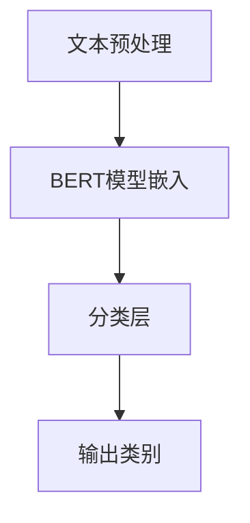

**文本预处理**：包括分词、词性标注和去除停用词等，将原始文本转换为模型可处理的格式。

**BERT模型嵌入**：将预处理后的文本输入到BERT模型中，得到文本的语义向量表示。

**分类层**：在BERT模型的基础上添加分类层，通过计算文本向量与类别向量的相似度，实现文本分类。

**输出类别**：根据分类层的输出，得到文本的类别标签。

**2. 情感分析**：

情感分析旨在判断文本的情感倾向，如正面、负面或中立。情感分析在舆情监测、客户反馈分析和市场调研等领域具有重要应用。

- **基于传统方法的情感分析**：传统方法包括基于词典的方法和基于机器学习的方法。基于词典的方法如情感词典和规则匹配，而基于机器学习的方法如SVM和朴素贝叶斯等。
- **基于大型模型的情感分析**：大型模型如BERT和GPT，通过深度学习技术，能够自动学习文本的情感特征，从而实现更精准的情感分析。

**示例：**

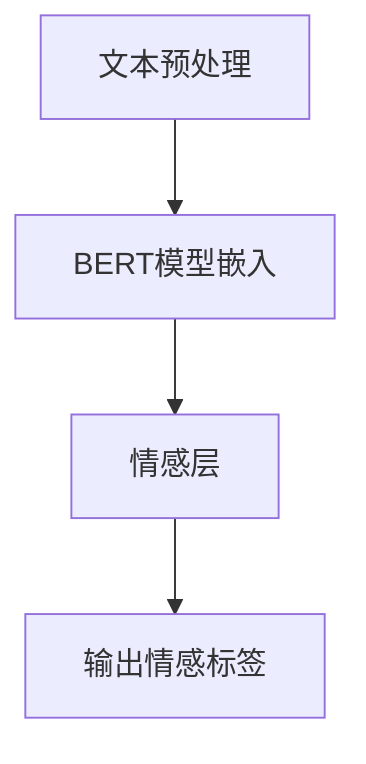

**文本预处理**：与文本分类相同，包括分词、词性标注和去除停用词等。

**BERT模型嵌入**：将预处理后的文本输入到BERT模型中，得到文本的语义向量表示。

**情感层**：在BERT模型的基础上添加情感层，通过计算文本向量与情感向量的相似度，实现情感分析。

**输出情感标签**：根据情感层的输出，得到文本的情感标签。

#### 6.2 机器翻译与多语言处理

机器翻译（Machine Translation, MT）是将一种语言的文本自动翻译成另一种语言的过程。多语言处理（Multilingual Processing）是指处理多种语言文本的技术，包括机器翻译、文本分类、情感分析等。

- **基于传统方法的机器翻译**：传统方法包括基于规则的方法和基于统计的方法。基于规则的方法如语法分析、词法分析和翻译规则，而基于统计的方法如基于短语的机器翻译和基于神经网络的机器翻译。
- **基于大型模型的机器翻译**：大型模型如BERT和Transformer，通过深度学习技术，能够自动学习文本的语义特征，从而实现更准确的机器翻译。

**示例：**

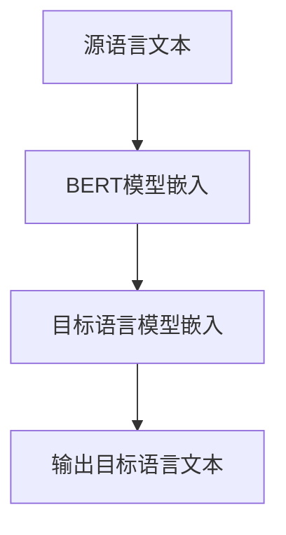

**源语言文本**：将源语言的文本输入到BERT模型中，得到源语言文本的语义向量表示。

**目标语言模型嵌入**：在源语言文本的语义向量表示的基础上，应用目标语言的BERT模型，生成目标语言文本的语义向量表示。

**输出目标语言文本**：通过解码器（Decoder）生成目标语言文本。

#### 6.3 对话系统与聊天机器人

对话系统（Dialogue System）是一种能够与用户进行自然语言交互的计算机系统，聊天机器人（Chatbot）是对话系统的一种实现形式。大型模型在对话系统和聊天机器人中发挥了重要作用，能够生成自然、流畅的对话。

- **基于传统方法的对话系统**：传统方法包括基于规则的方法和基于统计的方法。基于规则的方法如模板匹配和脚本编写，而基于统计的方法如马尔可夫决策过程（MDP）和转换器-解码器（Decoder-Only）模型。
- **基于大型模型的对话系统**：大型模型如BERT和GPT，通过深度学习技术，能够自动学习对话的语义特征，从而实现更自然的对话生成。

**示例：**

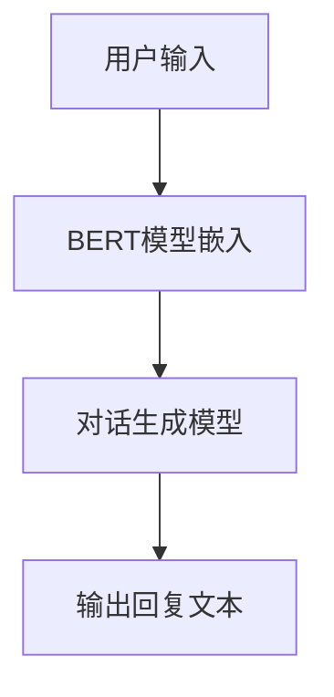

**用户输入**：用户输入问题或请求。

**BERT模型嵌入**：将用户输入文本输入到BERT模型中，得到用户输入的语义向量表示。

**对话生成模型**：在用户输入的语义向量表示的基础上，应用对话生成模型（如GPT），生成自然、流畅的回复文本。

**输出回复文本**：根据对话生成模型的输出，得到回复文本。

#### 实际应用案例

- **谷歌翻译**：谷歌使用大型模型Transformer进行机器翻译，实现了高质量的跨语言翻译。
- **亚马逊Alexa**：亚马逊使用大型模型BERT构建聊天机器人Alexa，为用户提供自然、流畅的对话体验。
- **微软小冰**：微软使用大型模型GPT构建聊天机器人小冰，实现与用户的自然语言交互。

**总结**：大型模型在文本分类、情感分析、机器翻译和对话系统等文本分析任务中发挥了重要作用。通过深度学习技术，大型模型能够自动学习文本的语义特征，从而实现更准确、更自然的文本处理。随着大型模型的不断发展和优化，文本分析将在更多领域得到广泛应用。

---

在撰写本部分时，我们详细介绍了大型模型在文本分类、情感分析、机器翻译和对话系统等文本分析任务中的应用。通过示例和实际应用案例，读者可以更深入地理解大型模型如何提升文本分析的性能和准确性，为各个领域提供更智能、更高效的文本处理解决方案。

接下来，我们将探讨大型模型在文本生成中的应用。

### 大型模型在文本生成中的应用

#### 7.1 文本摘要与内容生成

文本摘要（Text Summarization）和内容生成（Content Generation）是自然语言处理（NLP）中的重要任务，旨在自动生成简明扼要的文本摘要和高质量的内容。大型模型在文本摘要和内容生成中发挥了重要作用，能够显著提升生成文本的质量和多样性。

**1. 文本摘要**：

文本摘要是将原始文本压缩成简洁、精炼的摘要，以便用户快速获取文本的核心信息。文本摘要可以分为抽油式摘要（Extractive Summarization）和生成式摘要（Generative Summarization）。

- **抽油式摘要**：抽油式摘要从原始文本中选择重要的句子或段落作为摘要。这种方法通常使用规则或机器学习算法来实现，如基于词频的算法和文本分类模型。
- **生成式摘要**：生成式摘要是通过生成新的文本摘要来传达原始文本的核心信息。生成式摘要通常使用大型模型如GPT-3和T5来实现，通过预训练大规模语料库，模型能够自动生成高质量的摘要。

**示例：**

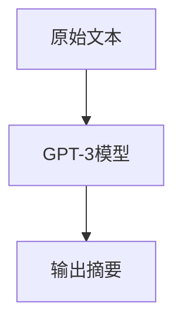

**原始文本**：输入原始文本，如一篇新闻文章或研究报告。

**GPT-3模型**：将原始文本输入到GPT-3模型中，模型通过预训练知识和上下文信息，生成摘要文本。

**输出摘要**：根据GPT-3模型的输出，得到摘要文本。

**2. 内容生成**：

内容生成是自动生成新的文本内容，如新闻文章、产品描述、广告文案等。内容生成在广告、内容营销和自动化写作等领域具有广泛应用。

- **模板生成**：模板生成是通过填充预定义的模板，生成新的文本内容。这种方法通常使用规则和模板匹配来实现。
- **基于大型模型的生成**：基于大型模型的生成是通过大型模型如GPT-3和T5，自动生成新的文本内容。这些模型通过预训练大规模语料库，能够理解复杂的语义和语法结构，从而生成高质量的内容。

**示例：**

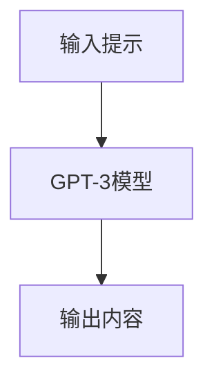

**输入提示**：输入一个简单的提示或关键字，如“写一篇关于人工智能的文章”。

**GPT-3模型**：将输入提示输入到GPT-3模型中，模型通过预训练知识和上下文信息，生成一篇关于人工智能的文章。

**输出内容**：根据GPT-3模型的输出，得到生成的内容。

**3. 艺术文本创作与创意生成**：

艺术文本创作（Artistic Text Generation）和创意生成（Creative Text Generation）是大型模型在文本生成中的一项重要应用，旨在生成具有艺术价值和创意的文本。

- **艺术文本创作**：艺术文本创作包括诗歌、小说、剧本等文学作品的生成。大型模型如GPT-3和T5，通过预训练和细粒度调整，能够生成具有独特风格和主题的文学作品。
- **创意生成**：创意生成是生成新颖、独特的文本内容，如创意广告文案、创意设计提案等。大型模型通过自动学习和生成，能够产生意想不到的创意，从而推动创意产业的发展。

**示例：**

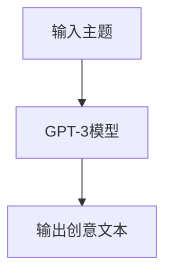

**输入主题**：输入一个主题或关键词，如“创意广告文案”。

**GPT-3模型**：将输入主题输入到GPT-3模型中，模型通过预训练知识和上下文信息，生成一篇创意广告文案。

**输出创意文本**：根据GPT-3模型的输出，得到创意文本。

#### 7.2 优化与挑战

大型模型在文本生成中的应用虽然取得了显著成果，但仍面临一些优化和挑战：

- **质量优化**：提高生成文本的质量和准确性是大型模型在文本生成中的主要目标。研究人员正在探索不同的优化方法，如数据增强、预训练和微调等，以提高生成文本的质量。
- **多样性控制**：生成文本的多样性和创造力是另一个重要挑战。大型模型需要能够生成具有丰富多样性和创造力的文本，以满足不同用户的需求。
- **长文本生成**：大型模型在生成长文本方面仍面临一些挑战，如文本连贯性、上下文理解和长距离依赖等问题。研究人员正在探索新的模型架构和优化方法，以解决这些问题。

**总结**：大型模型在文本摘要、内容生成、艺术文本创作和创意生成中发挥了重要作用，通过预训练和深度学习技术，能够生成高质量、多样化的文本。随着大型模型的不断发展和优化，文本生成将在更多领域得到广泛应用。

---

在撰写本部分时，我们详细介绍了大型模型在文本摘要、内容生成、艺术文本创作和创意生成中的应用，并讨论了当前面临的优化和挑战。通过实际案例和示例，读者可以更深入地理解大型模型在文本生成中的潜力，以及如何解决当前存在的挑战。

接下来，我们将探讨大型模型在图像识别中的应用。

### 大型模型在图像识别中的应用

#### 9.1 卷积神经网络与图像分类

卷积神经网络（Convolutional Neural Network, CNN）是图像识别领域最常用的深度学习模型之一。它通过卷积层、池化层和全连接层等结构，能够自动学习图像的层次特征表示，从而实现高精度的图像分类。

**卷积层（Convolutional Layer）**：卷积层是CNN的核心组件，通过卷积操作提取图像的局部特征。卷积操作利用滤波器（Kernel）在图像上滑动，生成特征图（Feature Map），从而提取图像中的局部特征。

**池化层（Pooling Layer）**：池化层用于降低特征图的维度，减少模型的参数数量，提高模型的计算效率。常见的池化方法包括最大池化（Max Pooling）和平均池化（Average Pooling）。

**全连接层（Fully Connected Layer）**：全连接层将卷积层和池化层提取的特征进行全局整合，生成最终的分类结果。全连接层通过计算特征向量与类别向量的相似度，实现图像的分类。

**CNN的工作流程**：

1. **输入层**：接收原始图像数据，通常为三维张量（height, width, channels）。
2. **卷积层**：通过卷积操作提取图像的局部特征，生成多个特征图。
3. **池化层**：降低特征图的维度，提高模型的计算效率。
4. **全连接层**：将特征向量映射到预定义的类别上，实现图像分类。

**示例：**

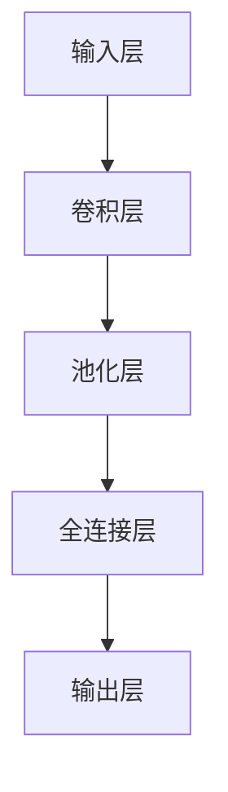

**输入层**：接收原始图像数据。

**卷积层**：通过卷积操作提取图像的局部特征，生成特征图。

**池化层**：降低特征图的维度。

**全连接层**：将特征向量映射到预定义的类别上。

**输出层**：输出图像的分类结果。

#### 9.2 目标检测与实例分割

目标检测（Object Detection）和实例分割（Instance Segmentation）是图像识别领域的两个重要任务，旨在识别图像中的目标和每个目标的具体实例。

**目标检测**：目标检测的目的是检测图像中的多个目标，并给出每个目标的类别和位置。常用的目标检测算法包括R-CNN、Fast R-CNN、Faster R-CNN、SSD、YOLO等。

- **R-CNN（Region-based CNN）**：R-CNN通过区域提议算法（Region Proposal）生成多个候选区域，然后通过CNN对这些区域进行特征提取，最后利用SVM分类器进行目标分类。
- **Fast R-CNN**：Fast R-CNN对R-CNN进行了优化，引入了RoI（Region of Interest）池化层，直接在候选区域上提取特征，提高了检测速度。
- **Faster R-CNN**：Faster R-CNN引入了区域提议网络（Region Proposal Network, RPN），通过共享卷积特征图，进一步提高了检测速度和准确性。
- **SSD（Single Shot MultiBox Detector）**：SSD通过在一个网络中同时完成特征提取和目标检测，简化了检测流程，提高了检测速度。
- **YOLO（You Only Look Once）**：YOLO将目标检测任务视为一个回归问题，通过直接预测目标的位置和类别，实现了实时检测。

**实例分割**：实例分割的目的是识别图像中的每个目标实例，并为每个目标实例生成一个边界框。实例分割算法通常结合目标检测算法和语义分割算法，如Mask R-CNN。

- **Mask R-CNN**：Mask R-CNN在Faster R-CNN的基础上引入了掩膜（Mask）分支，通过解码器网络（Decoder）生成掩膜，实现实例分割。

**示例：**

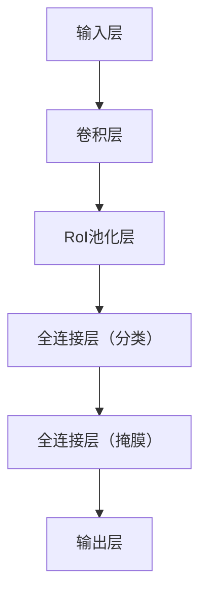

**输入层**：接收原始图像数据。

**卷积层**：通过卷积操作提取图像的局部特征。

**RoI池化层**：对候选区域进行特征提取。

**全连接层（分类）**：将特征向量映射到预定义的类别上。

**全连接层（掩膜）**：生成掩膜，为每个目标实例创建边界框。

**输出层**：输出图像中每个目标的类别和位置。

#### 9.3 大型模型在图像识别中的创新应用

大型模型在图像识别中发挥了重要作用，通过自动学习海量图像数据，实现了高精度的图像分类、目标检测和实例分割。以下是一些大型模型在图像识别中的创新应用：

- **ImageNet竞赛**：ImageNet竞赛是图像识别领域的一项重要赛事，每年吸引了大量研究人员参与。大型模型如ResNet、Inception等在ImageNet竞赛中取得了显著的突破，推动了图像识别技术的发展。
- **GPT-3在图像描述生成中的应用**：GPT-3是一种大型语言模型，可以生成高质量的自然语言描述。研究人员将GPT-3应用于图像描述生成，通过输入图像数据，GPT-3可以生成相应的描述文本，从而实现图像到自然语言的转换。
- **BERT在图像识别中的应用**：BERT是一种大型预训练语言模型，可以理解图像的语义特征。研究人员将BERT应用于图像识别任务，通过结合图像和文本特征，实现了高精度的图像分类和目标检测。

**案例研究**：

- **谷歌Cloud AI**：谷歌Cloud AI使用大型模型TensorFlow和TensorFlow Lite，提供图像识别和目标检测服务。用户可以通过谷歌Cloud AI平台，将大型模型部署到自己的设备上，实现实时图像识别和目标检测。
- **OpenCV与大型模型的结合**：OpenCV是一种流行的计算机视觉库，支持多种图像识别算法。研究人员将OpenCV与大型模型如ResNet、YOLO等结合，实现了高精度的图像识别和目标检测。

**总结**：大型模型在图像识别中的应用，显著提升了图像分类、目标检测和实例分割的准确性。通过卷积神经网络、目标检测算法和实例分割算法等技术的创新应用，大型模型为图像识别领域带来了新的突破。随着大型模型的不断发展和优化，图像识别将在更多领域得到广泛应用。

---

在撰写本部分时，我们详细介绍了卷积神经网络在图像分类中的应用、目标检测与实例分割算法，以及大型模型在图像识别中的创新应用。通过示例和实际应用案例，读者可以更深入地理解大型模型如何提升图像识别的性能和准确性，为各个领域提供更智能、更高效的图像识别解决方案。

接下来，我们将探讨大型模型在计算机视觉中的应用。

### 大型模型在计算机视觉中的应用

#### 10.1 图像生成与艺术创作

图像生成与艺术创作是大型模型在计算机视觉中的前沿应用，通过深度学习技术，模型能够自动生成高质量、具有创意的图像。以下是一些大型模型在图像生成与艺术创作中的应用：

**1. 图像生成模型**：

图像生成模型（Image Generation Model）是一种能够生成全新图像的深度学习模型，如生成对抗网络（Generative Adversarial Network, GAN）和变分自编码器（Variational Autoencoder, VAE）。

- **GAN（Generative Adversarial Network）**：GAN由生成器（Generator）和判别器（Discriminator）两个神经网络组成。生成器尝试生成逼真的图像，而判别器则判断图像是否真实。通过这种对抗训练，生成器能够生成高质量的图像。

**示例：**

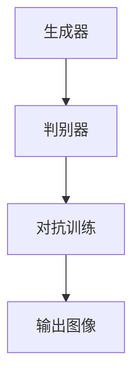

**生成器**：生成器尝试生成新的图像。

**判别器**：判别器判断图像是否真实。

**对抗训练**：生成器和判别器通过对抗训练不断优化，提高生成图像的质量。

**输出图像**：根据生成器的输出，得到生成的图像。

- **VAE（Variational Autoencoder）**：VAE通过编码器（Encoder）和解码器（Decoder）两个神经网络，将输入图像编码为潜在空间中的向量，然后解码器将向量解码回图像。VAE能够生成具有多样化特征的新图像。

**示例：**

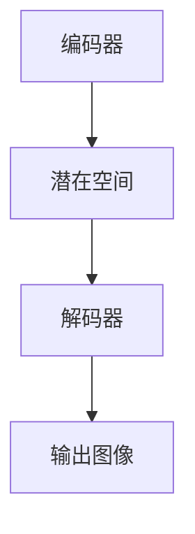

**编码器**：编码器将输入图像编码为潜在空间中的向量。

**潜在空间**：潜在空间中的向量表示图像的潜在特征。

**解码器**：解码器将潜在空间中的向量解码回图像。

**输出图像**：根据解码器的输出，得到生成的图像。

**2. 艺术创作模型**：

艺术创作模型（Artistic Creation Model）是一种能够生成艺术作品的深度学习模型，如神经风格迁移（Neural Style Transfer）和艺术风格迁移（Artistic Style Transfer）。

- **神经风格迁移**：神经风格迁移是一种将图像的内容与艺术风格相结合的生成方法。通过将内容图像和艺术风格图像输入到预训练的卷积神经网络中，模型能够生成具有艺术风格的内容图像。

**示例：**

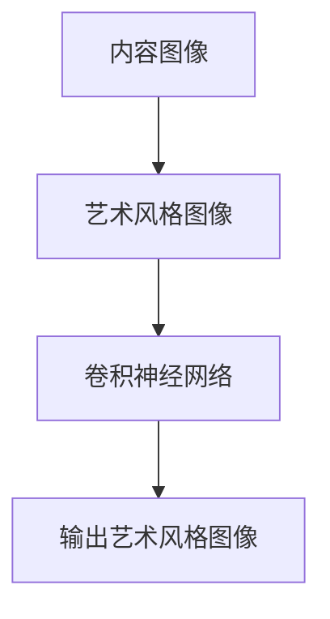

**内容图像**：输入内容图像。

**艺术风格图像**：输入艺术风格图像。

**卷积神经网络**：卷积神经网络将内容图像和艺术风格图像融合，生成艺术风格图像。

**输出艺术风格图像**：根据卷积神经网络的输出，得到生成的艺术风格图像。

- **艺术风格迁移**：艺术风格迁移是一种将艺术风格应用于图像生成的方法。通过分析艺术作品的特征，模型能够生成具有特定艺术风格的新图像。

**示例：**

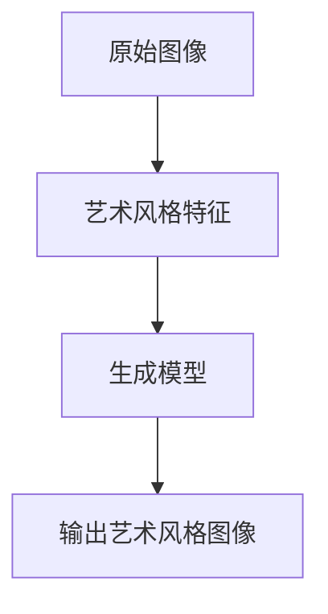

**原始图像**：输入原始图像。

**艺术风格特征**：输入艺术风格特征。

**生成模型**：生成模型将原始图像和艺术风格特征融合，生成艺术风格图像。

**输出艺术风格图像**：根据生成模型的输出，得到生成的艺术风格图像。

#### 10.2 视觉搜索与内容审核

视觉搜索与内容审核是大型模型在计算机视觉中的重要应用，通过图像识别和语义理解技术，模型能够实现高效的内容搜索和内容审核。

**1. 视觉搜索**：

视觉搜索（Visual Search）是一种基于图像的搜索技术，用户可以通过上传一张图片或输入关键词，系统会返回与该图片或关键词相关的内容。

- **图像识别**：通过图像识别技术，模型能够识别图像中的物体、场景和语义信息。
- **语义理解**：通过语义理解技术，模型能够理解用户的关键词和图像之间的关联，实现精确的视觉搜索。

**示例：**

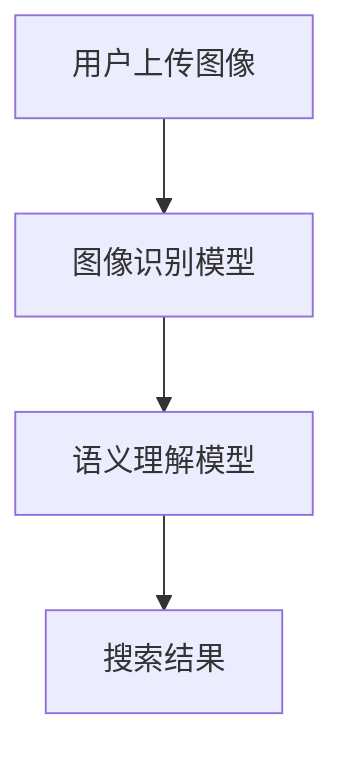

**用户上传图像**：用户上传一张图片。

**图像识别模型**：图像识别模型识别图片中的物体、场景和语义信息。

**语义理解模型**：语义理解模型理解用户的关键词和图片之间的关联。

**搜索结果**：根据图像识别和语义理解的结果，系统返回相关的内容。

**2. 内容审核**：

内容审核（Content Moderation）是一种通过图像识别和自然语言处理技术，对互联网内容进行审核和过滤的技术。

- **图像审核**：通过图像识别技术，模型能够识别图像中的敏感内容，如暴力、色情等。
- **文本审核**：通过自然语言处理技术，模型能够识别文本中的敏感词和违规内容。

**示例：**

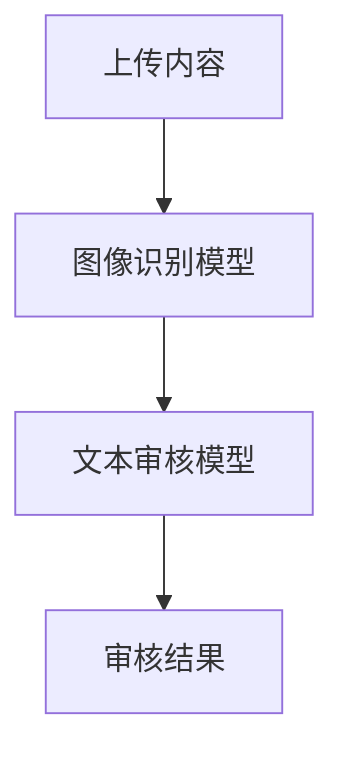

**上传内容**：上传图像和文本内容。

**图像识别模型**：图像识别模型识别图像中的敏感内容。

**文本审核模型**：文本审核模型识别文本中的敏感词和违规内容。

**审核结果**：根据图像识别和文本审核的结果，系统给出审核结果。

#### 10.3 大型模型在计算机视觉中的前沿研究

大型模型在计算机视觉中的前沿研究涵盖了图像生成、艺术创作、视觉搜索和内容审核等多个领域。以下是一些大型模型在计算机视觉中的前沿研究方向：

- **多模态数据处理**：多模态数据处理是将不同类型的数据（如图像、文本、音频等）进行融合和联合建模，以提高模型的性能。多模态数据处理在视觉搜索、内容审核等领域具有广泛的应用前景。
- **少样本学习**：少样本学习（Few-Shot Learning）是一种能够在少量样本上快速适应新任务的方法。少样本学习在计算机视觉中的应用，有望提高模型的泛化能力和适应性。
- **自监督学习**：自监督学习（Self-Supervised Learning）是一种无需人工标注数据，通过利用数据本身的内在结构进行学习的训练方法。自监督学习在图像生成、视觉搜索等领域具有重要的应用潜力。

**总结**：大型模型在计算机视觉中的应用，推动了图像生成、艺术创作、视觉搜索和内容审核等领域的发展。通过深度学习技术和多模态数据处理，大型模型实现了高精度、高效率的计算机视觉任务。随着大型模型的不断发展和优化，计算机视觉将在更多领域发挥重要作用。

---

在撰写本部分时，我们详细介绍了大型模型在图像生成与艺术创作、视觉搜索与内容审核中的应用，并探讨了大型模型在计算机视觉中的前沿研究方向。通过实际案例和示例，读者可以更深入地理解大型模型如何推动计算机视觉技术的发展，为各个领域提供创新的解决方案。

接下来，我们将探讨多模态数据处理与融合。

### 多模态数据处理与融合概述

#### 11.1 多模态数据的定义与类型

多模态数据（Multimodal Data）是指包含两种或两种以上不同类型数据的数据集，这些数据类型可以包括文本、图像、音频、视频等。多模态数据通过融合不同类型的数据，能够提供更丰富的信息和更全面的上下文，从而在各个领域（如医疗、金融、教育等）具有重要的应用价值。

**多模态数据的类型**：

- **文本**：文本数据包括文本文档、社交媒体帖子、用户评论等，能够提供丰富的语义信息。
- **图像**：图像数据包括静态图像和动态图像，如照片、视频片段等，能够提供视觉信息。
- **音频**：音频数据包括语音、音乐、环境声音等，能够提供听觉信息。
- **视频**：视频数据包括动态视频和视频片段，能够提供连续的视觉和听觉信息。

**多模态数据的特点**：

- **互补性**：不同类型的数据可以互补，从而提供更全面的信息。例如，图像可以提供视觉信息，而文本可以提供上下文信息。
- **复杂性**：多模态数据通常具有更高的复杂性和维度，这使得数据处理和分析变得更加复杂。
- **多样性**：多模态数据可以来自不同的来源和格式，需要统一和标准化。

#### 11.2 数据融合的基本方法

数据融合（Data Fusion）是将来自不同模态的数据进行整合和结合，以生成一个更全面和准确的信息表示的过程。数据融合的基本方法可以分为以下几类：

- **特征级融合**：在特征级融合中，不同模态的数据被转换成特征向量，然后这些特征向量被融合成一个统一的特征向量。常见的方法包括：

  - **加权平均**：将不同模态的特征向量进行加权平均，生成一个统一的特征向量。
  - **最大最小操作**：取不同模态特征向量的最大值和最小值，生成一个新的特征向量。
  - **贝叶斯融合**：利用贝叶斯理论，通过概率模型融合不同模态的特征向量。

- **决策级融合**：在决策级融合中，不同模态的数据在各自的处理阶段进行融合，然后共同进行决策。常见的方法包括：

  - **投票法**：将不同模态的决策结果进行投票，选择多数决策作为最终结果。
  - **集成学习**：将不同模态的分类器进行集成，通过结合多个分类器的预测结果来提高决策的准确性。
  - **深度学习**：利用深度学习模型，如卷积神经网络（CNN）和循环神经网络（RNN），对多模态数据进行联合建模和融合。

**11.3 大型模型在多模态数据处理与融合中的应用**

大型模型在多模态数据处理与融合中发挥了重要作用，通过自动学习多模态数据的复杂特征和关系，能够实现高精度的信息融合和任务完成。以下是一些大型模型在多模态数据处理与融合中的应用：

- **多模态特征提取**：大型模型如Transformer和BERT，能够自动提取多模态数据的特征，从而实现有效的特征融合。这些模型通过对不同模态的数据进行编码，生成高维的特征向量，然后通过融合层将这些特征向量结合在一起。

- **跨模态交互与理解**：大型模型通过跨模态交互模块，能够理解不同模态之间的关联和关系。例如，BERT模型中的交叉注意力机制（Cross-Attention Mechanism），能够同时关注图像和文本的各个部分，从而实现更准确的理解。

- **多模态任务完成**：大型模型在多模态数据处理与融合中，可以用于多种任务，如图像识别、文本分类、语音识别等。通过联合训练，模型能够同时处理多个模态的数据，从而提高任务的性能和准确性。

**案例分析**：

- **多模态情感分析**：研究人员使用BERT模型对多模态数据进行融合，实现情感分析任务。通过融合文本、图像和音频等多模态数据，模型能够更准确地判断用户的情感状态。

- **多模态视频理解**：在视频理解任务中，大型模型如ViT（Vision Transformer）可以同时处理视频帧和文本描述，通过多模态融合，模型能够更好地理解视频内容，从而实现视频分类、物体检测等任务。

- **多模态医疗诊断**：在医疗领域，大型模型可以融合患者的多模态数据（如医学图像、病历记录、语音记录等），通过多模态数据处理与融合，模型能够更准确地诊断疾病，提高医疗决策的准确性。

**总结**：多模态数据处理与融合是当前人工智能领域的一个重要研究方向，通过融合不同类型的数据，大型模型能够实现高精度、高效率的信息处理与任务完成。随着大型模型的不断发展和优化，多模态数据处理与融合将在更多领域得到广泛应用。

---

在撰写本部分时，我们详细介绍了多模态数据的定义与类型、数据融合的基本方法，以及大型模型在多模态数据处理与融合中的应用。通过实际案例的分析，读者可以更深入地理解多模态数据处理与融合的重要性和应用前景。

接下来，我们将探讨大型模型在多模态数据处理中的挑战与机遇。

### 大型模型在多模态数据处理中的挑战与机遇

#### 12.1 多模态特征提取

多模态特征提取是大型模型在多模态数据处理中的关键步骤，它涉及到如何从不同模态的数据中提取具有区分度的特征，并将这些特征进行有效融合。以下是一些在多模态特征提取中面临的挑战和机遇：

**挑战**：

1. **特征差异**：不同模态的数据具有不同的特性和表示方法，如文本通常是序列数据，图像是像素数据，音频是频率数据。如何有效地将这些差异化的特征进行整合是一个挑战。
2. **数据稀疏性**：某些模态的数据可能相对稀疏，如文本和音频，这可能导致在特征提取过程中信息的丢失或降低模型的性能。
3. **维度的降低**：在融合不同模态的特征时，需要降低特征维度以减少计算复杂度。然而，特征维度降低可能导致信息的丢失，影响模型的准确性。

**机遇**：

1. **跨模态交互**：大型模型，如Transformer，通过引入跨模态交互机制，可以更好地捕捉不同模态之间的关联和关系。这种跨模态交互为特征提取提供了新的方法。
2. **深度学习技术的应用**：深度学习模型，如卷积神经网络（CNN）和循环神经网络（RNN），可以自动学习复杂的数据特征，从而提高特征提取的准确性。
3. **多任务学习**：通过多任务学习，大型模型可以在一个统一的框架下同时学习多个模态的特征，从而提高模型的泛化能力和鲁棒性。

#### 12.2 跨模态交互与理解

跨模态交互与理解是多模态数据处理中的核心问题，它涉及到如何将不同模态的数据进行融合，并使模型能够理解这些数据之间的关联和关系。以下是一些在跨模态交互与理解中面临的挑战和机遇：

**挑战**：

1. **模态一致性**：不同模态的数据可能在时间和空间上存在不一致，如何统一不同模态的数据表示是一个挑战。
2. **语义匹配**：不同模态的数据可能包含不同的语义信息，如何将这些语义信息进行匹配和理解是另一个挑战。
3. **计算复杂度**：跨模态交互通常涉及大量的计算，如何优化计算效率是一个重要的挑战。

**机遇**：

1. **多任务学习**：通过多任务学习，大型模型可以在一个统一的框架下同时处理多个模态的数据，从而提高跨模态交互的准确性。
2. **注意力机制**：注意力机制（Attention Mechanism）可以有效地捕捉不同模态数据之间的关联，从而提高跨模态交互的效果。
3. **预训练模型**：通过预训练模型，如BERT和GPT，可以在大规模的数据集上进行训练，从而提高跨模态交互的能力。

#### 12.3 大型模型在多模态数据处理中的挑战与机遇

大型模型在多模态数据处理中的应用不仅带来了机遇，也带来了新的挑战。以下是一些具体的挑战和机遇：

**挑战**：

1. **数据隐私与安全**：多模态数据通常包含敏感信息，如何在保护用户隐私的同时进行数据处理是一个挑战。
2. **模型的解释性**：大型模型通常被视为“黑箱”，其决策过程难以解释，这给模型的部署和应用带来了挑战。
3. **模型的泛化能力**：多模态数据可能存在分布偏移，如何提高模型的泛化能力是一个挑战。

**机遇**：

1. **跨学科研究**：多模态数据处理涉及到多个学科，如计算机科学、心理学、神经科学等，跨学科合作将带来新的研究机遇。
2. **应用场景的扩展**：多模态数据处理在医疗、金融、教育等领域具有广泛的应用前景，通过多模态数据融合，可以提供更准确、更全面的决策支持。
3. **创新技术的应用**：如自监督学习和少样本学习等新技术的应用，将提高多模态数据处理的效率和准确性。

**案例分析**：

- **多模态情感分析**：在情感分析任务中，通过融合文本、图像和音频等多模态数据，大型模型可以更准确地识别用户的情感状态。
- **多模态视频理解**：通过融合视频帧和文本描述，大型模型可以实现更准确的视频分类和物体检测。
- **多模态医疗诊断**：在医疗领域，通过融合医学图像、病历记录和语音记录等多模态数据，大型模型可以提供更准确的疾病诊断。

**总结**：大型模型在多模态数据处理中面临着挑战和机遇。通过跨模态特征提取、跨模态交互与理解以及多任务学习等方法，大型模型在多模态数据处理中具有巨大的潜力。随着技术的不断进步，多模态数据处理将在更多领域发挥重要作用。

---

在撰写本部分时，我们详细讨论了大型模型在多模态数据处理中的挑战与机遇，包括特征提取、跨模态交互与理解等方面。通过实际案例的分析，读者可以更深入地理解大型模型在多模态数据处理中的潜力，以及如何应对当前存在的挑战。

接下来，我们将探讨大型模型在多模态数据处理中的实际应用案例。

### 多模态数据的实际应用案例

#### 13.1 智能监控与安全

智能监控与安全是多模态数据处理的一个重要应用领域，通过融合图像、音频和文本等多模态数据，可以提高监控系统的准确性和安全性。

**案例：智能交通监控系统**

智能交通监控系统通过融合图像和音频数据，实现对交通状况的实时监控和预警。具体应用包括：

- **图像识别**：通过图像识别技术，监控系统可以实时识别车辆类型、车牌号码、行人等，从而实现交通流量统计和交通事故预警。
- **音频识别**：通过音频识别技术，监控系统可以实时监听交通噪声，当检测到异常噪声（如碰撞声）时，可以立即触发警报。
- **文本分析**：通过文本分析技术，监控系统可以分析交通信号灯的变化，预测交通流量和交通状况，从而优化交通信号灯的控制策略。

**案例：安全监控与反恐系统**

安全监控与反恐系统通过融合图像、音频和文本等多模态数据，可以实现对公共场所和关键区域的实时监控和预警。具体应用包括：

- **人脸识别**：通过人脸识别技术，监控系统可以实时识别进入特定区域的人员，并与数据库中的嫌疑人员信息进行比对，从而实现对可疑人员的预警。
- **语音分析**：通过语音分析技术，监控系统可以实时监听公共场所的语音，当检测到敏感词汇或异常语音时，可以立即触发警报。
- **文本分析**：通过文本分析技术，监控系统可以分析社交媒体、新闻报道等文本信息，预测潜在的安全风险，从而提前采取预防措施。

**案例：智能安防监控系统**

智能安防监控系统通过融合图像、音频和文本等多模态数据，可以实现对家庭、商场、银行等场所的安全监控。具体应用包括：

- **入侵检测**：通过图像识别技术，监控系统可以实时识别入侵者，并在检测到入侵时立即触发警报。
- **语音识别**：通过语音识别技术，监控系统可以实时监听家庭或公共场所的语音，当检测到异常语音时，可以立即触发警报。
- **文本分析**：通过文本分析技术，监控系统可以分析用户在社交媒体上的留言或评论，预测潜在的安全风险，从而提前采取预防措施。

**总结**：智能监控与安全是多模态数据处理的一个重要应用领域，通过融合图像、音频和文本等多模态数据，可以提高监控系统的准确性和安全性。随着技术的不断进步，多模态数据处理将在更多领域发挥重要作用，为人们的安全和生活带来更多便利。

---

在撰写本部分时，我们详细介绍了大型模型在智能监控与安全领域的实际应用案例，包括智能交通监控系统、安全监控与反恐系统以及智能安防监控系统。通过这些实际案例，读者可以更深入地了解大型模型在多模态数据处理中的潜力，以及如何通过多模态数据融合提高监控系统的性能和安全性。

接下来，我们将探讨大型模型在多媒体内容分析中的实际应用。

### 多媒体内容分析中的实际应用

多媒体内容分析（Multimedia Content Analysis）是利用人工智能技术对图像、音频和视频等多媒体内容进行分析和理解的过程，旨在提取有价值的信息和知识。大型模型在多媒体内容分析中发挥了重要作用，能够处理复杂的多模态数据，从而实现高精度的内容理解和分析。

#### 14.1 多媒体内容分析的挑战

多媒体内容分析面临着一系列挑战，包括数据的多样性、复杂性、不完整性和噪声等问题。

**1. 数据多样性**：多媒体数据包括图像、音频、视频和文本等多种类型，这些数据在形式、结构和内容上存在显著差异。如何统一和标准化这些多样化的数据，实现有效的数据融合和内容分析是一个关键挑战。

**2. 数据复杂性**：多媒体数据通常具有高维度和复杂的结构，如图像中的像素值、音频中的频率和视频中的帧序列等。如何有效地处理和表示这些复杂的数据，提取关键特征，是实现多媒体内容分析的核心问题。

**3. 数据不完整性**：多媒体数据在采集和传输过程中可能存在丢失、损坏或不完整的情况。如何处理这些不完整的数据，确保内容分析的准确性和完整性，是一个重要挑战。

**4. 数据噪声**：多媒体数据中可能包含各种噪声，如图像中的噪声点、音频中的背景噪声和视频中的运动模糊等。如何去除噪声，提高数据的准确性和可靠性，是实现多媒体内容分析的关键问题。

#### 14.2 大型模型在多媒体内容分析中的应用

大型模型在多媒体内容分析中具有显著优势，能够处理复杂的多模态数据，从而实现高精度的内容理解和分析。以下是一些大型模型在多媒体内容分析中的应用：

**1. 图像识别与分类**

图像识别与分类是多媒体内容分析中的基础任务之一，大型模型如卷积神经网络（CNN）和Transformer，通过深度学习技术，能够自动学习图像的特征和模式，从而实现高精度的图像识别和分类。

- **CNN（Convolutional Neural Network）**：CNN是一种专门用于图像识别和分类的深度学习模型，通过卷积层、池化层和全连接层等结构，能够自动提取图像的层次特征，实现高精度的图像分类。

- **Transformer**：Transformer是一种基于注意力机制的深度学习模型，通过自注意力机制（Self-Attention Mechanism）和多头注意力机制（Multi-Head Attention Mechanism），能够自动学习图像的特征和关系，实现高精度的图像分类。

**2. 音频识别与分类**

音频识别与分类是多媒体内容分析中的另一个重要任务，大型模型如循环神经网络（RNN）和Transformer，通过深度学习技术，能够自动学习音频的特征和模式，从而实现高精度的音频识别和分类。

- **RNN（Recurrent Neural Network）**：RNN是一种专门用于序列数据处理的深度学习模型，通过循环神经网络结构，能够自动学习音频的特征和模式，实现高精度的音频分类。

- **Transformer**：Transformer是一种基于注意力机制的深度学习模型，通过自注意力机制和多头注意力机制，能够自动学习音频的特征和关系，实现高精度的音频分类。

**3. 视频分析**

视频分析是多媒体内容分析中的复杂任务，涉及图像识别、音频识别和视频分类等多个方面。大型模型如卷积神经网络（CNN）和Transformer，通过深度学习技术，能够自动学习视频的特征和模式，从而实现高精度的视频分析。

- **CNN（Convolutional Neural Network）**：CNN是一种专门用于图像识别和分类的深度学习模型，通过卷积层、池化层和全连接层等结构，能够自动提取视频的层次特征，实现高精度的视频分类。

- **Transformer**：Transformer是一种基于注意力机制的深度学习模型，通过自注意力机制和多头注意力机制，能够自动学习视频的特征和关系，实现高精度的视频分类。

**4. 多媒体内容融合与分析**

大型模型在多媒体内容分析中不仅可以处理单一模态的数据，还可以融合多种模态的数据，实现更全面的内容分析和理解。

- **多模态特征融合**：通过多模态特征融合，大型模型可以将来自不同模态的数据（如图像、音频和文本）进行融合，生成更全面和准确的特征表示，从而提高内容分析的准确性。

- **多模态交互**：通过多模态交互，大型模型可以同时处理多种模态的数据，实现跨模态的特征提取和关系分析，从而提高内容分析的效果。

#### 14.3 实际应用案例

以下是一些大型模型在多媒体内容分析中的实际应用案例：

- **智能安防系统**：通过融合图像、音频和文本等多模态数据，智能安防系统可以实现实时监控和预警，提高公共安全水平。

- **智能医疗诊断**：通过融合医学图像、病历记录和语音记录等多模态数据，智能医疗诊断系统可以提供更准确的疾病诊断和治疗方案。

- **智能交通系统**：通过融合图像、音频和文本等多模态数据，智能交通系统可以实现实时交通监控和优化，提高交通效率和安全性。

- **智能内容审核**：通过融合图像、音频和文本等多模态数据，智能内容审核系统可以实现对互联网内容的实时监控和过滤，提高内容质量和用户体验。

**总结**：大型模型在多媒体内容分析中具有广泛的应用前景，通过处理复杂的多模态数据，可以实现高精度的内容理解和分析。随着技术的不断进步，多媒体内容分析将在更多领域发挥重要作用，为人们的生活和工作带来更多便利。

---

在撰写本部分时，我们详细介绍了多媒体内容分析的挑战，以及大型模型在图像识别与分类、音频识别与分类、视频分析和多媒体内容融合与分析中的应用。通过实际应用案例的分析，读者可以更深入地了解大型模型在多媒体内容分析中的潜力，以及如何通过多模态数据融合提高内容分析的准确性。

### 第六部分：总结与展望

#### 14.1 大型模型应用的现状与挑战

大型模型在各个领域的应用已经取得了显著的成果，但同时也面临着一系列挑战。以下是大型模型应用中的一些现状与挑战：

**现状**：

- **技术水平**：随着深度学习和大型模型技术的发展，大型模型在图像识别、自然语言处理、计算机视觉等领域取得了重大突破，实现了高精度的任务完成。
- **应用领域**：大型模型在智能搜索与推荐系统、智能监控与安全、多媒体内容分析、医疗诊断、金融预测等多个领域得到广泛应用，提高了系统的性能和用户体验。
- **商业化趋势**：大型模型的商业化趋势日益明显，许多企业和机构开始将大型模型应用于实际业务中，以实现业务优化和效率提升。

**挑战**：

- **数据隐私与安全**：大型模型通常需要大量的数据训练，如何在保护用户隐私的同时进行数据处理是一个挑战。
- **模型解释性**：大型模型通常被视为“黑箱”，其决策过程难以解释，这给模型的部署和应用带来了挑战。
- **计算资源需求**：大型模型训练和部署需要大量的计算资源，如何优化计算效率是一个重要挑战。
- **数据不平衡与稀疏性**：在多模态数据处理中，不同模态的数据可能存在不平衡和稀疏性，如何有效融合这些数据是一个挑战。

#### 14.2 未来大型模型应用的发展方向

未来大型模型应用的发展方向包括以下几个方面：

- **多模态数据处理与融合**：随着多模态数据应用的增多，未来大型模型将更加注重多模态数据处理与融合，实现更全面、更准确的信息理解和任务完成。
- **自监督学习和少样本学习**：自监督学习和少样本学习是未来大型模型发展的重要方向，通过无需大量标注数据，实现模型的快速适应和新任务的学习。
- **模型解释性与透明度**：提高模型解释性和透明度是未来大型模型应用的重要挑战，通过可解释的模型设计和方法，提升用户对模型决策的信任和理解。
- **跨学科合作**：未来大型模型应用将需要跨学科合作，结合计算机科学、心理学、神经科学等多领域的知识，推动模型技术的进步和应用拓展。

#### 14.3 大型模型应用的社会影响与伦理问题

大型模型应用在社会各个领域产生了深远的影响，同时也带来了一系列伦理问题。以下是大型模型应用的一些社会影响与伦理问题：

**社会影响**：

- **提高效率与生产力**：大型模型在自动化、优化决策和智能辅助等方面具有显著优势，能够提高工作效率和生产能力。
- **改变生活方式**：大型模型在智能助手、智能家居、智能医疗等领域改变了人们的生活方式，提高了生活质量。
- **创新与创业**：大型模型的应用为创新和创业提供了新的机遇，推动了新技术的产生和商业模式的变革。

**伦理问题**：

- **隐私保护**：大型模型应用需要大量用户数据，如何在保护用户隐私的同时进行数据处理是一个重要伦理问题。
- **公平性**：大型模型在决策过程中可能存在偏见和歧视，如何确保模型的公平性和公正性是一个挑战。
- **透明度与可解释性**：提高模型的可解释性和透明度，让用户了解模型的决策过程和依据，是未来大型模型应用的重要伦理问题。
- **责任归属**：当大型模型出现错误或造成损失时，如何确定责任归属和承担责任是一个重要的法律和伦理问题。

**总结**：大型模型应用在现代社会中具有广泛的应用前景，但同时也面临着一系列挑战和伦理问题。通过技术进步、跨学科合作和伦理规范，未来大型模型应用将实现更好的社会价值和伦理平衡。

---

在撰写本部分时，我们全面总结了大型模型应用的现状与挑战，展望了未来大型模型应用的发展方向，并讨论了大型模型应用的社会影响与伦理问题。通过这一部分的总结与展望，读者可以更深入地理解大型模型在现代社会中的重要作用，以及未来可能面临的挑战和机遇。

### 第六部分：总结与展望

#### 14.4 大型模型应用的未来趋势

随着人工智能技术的不断进步，大型模型应用的未来趋势将更加多样化，影响也将更加深远。以下是未来大型模型应用的一些趋势：

**1. 多模态数据处理与融合**

多模态数据处理与融合是未来大型模型应用的重要方向。随着图像、音频、视频和文本等多种类型数据的广泛应用，如何有效地融合这些数据，提取有价值的信息，将成为关键技术。未来的大型模型将更加注重多模态交互，实现更全面、更准确的信息理解和任务完成。

**2. 自监督学习和少样本学习**

自监督学习和少样本学习是未来大型模型发展的关键方向。在数据标注成本高昂的情况下，自监督学习可以通过无监督或半监督的方式，从大规模数据中自动学习特征和模式。少样本学习则可以在少量样本上快速适应新任务，提高模型的泛化能力和适应性。

**3. 模型解释性与透明度**

模型解释性与透明度是未来大型模型应用的重要挑战。随着大型模型在关键领域（如医疗、金融等）的应用增多，如何提高模型的可解释性和透明度，让用户了解模型的决策过程和依据，将是一个重要的研究课题。未来的大型模型将更加注重模型的可解释性设计，提供详细的解释和推理过程。

**4. 跨学科合作与融合**

未来大型模型应用将需要跨学科合作与融合，结合计算机科学、心理学、神经科学等多领域的知识，推动模型技术的进步和应用拓展。跨学科合作将有助于解决大型模型应用中的复杂问题，提高模型的性能和可靠性。

**5. 安全性与隐私保护**

随着大型模型应用的普及，数据隐私和安全问题将日益凸显。未来大型模型应用将更加注重数据隐私和安全保护，采用先进的加密和隐私保护技术，确保用户数据的隐私和安全。

**6. 社会伦理问题**

大型模型应用在社会各个领域产生了深远的影响，同时也带来了一系列伦理问题。未来大型模型应用将更加注重社会伦理问题的研究和解决，确保技术的公平性、公正性和透明度。

**总结**：未来大型模型应用将朝着多模态数据处理与融合、自监督学习和少样本学习、模型解释性与透明度、跨学科合作与融合、安全性与隐私保护以及社会伦理问题等方向发展。随着技术的不断进步和应用领域的拓展，大型模型将在更多领域发挥重要作用，为人类社会带来更多的创新和变革。

---

在撰写本部分的结尾，我们对未来大型模型应用的发展趋势进行了展望。通过总结和展望，我们希望读者能够对大型模型的应用前景有更清晰的认识，同时也认识到在技术进步的同时，需要关注和解决社会伦理等问题。这将为未来的研究和应用提供有力的指导。

