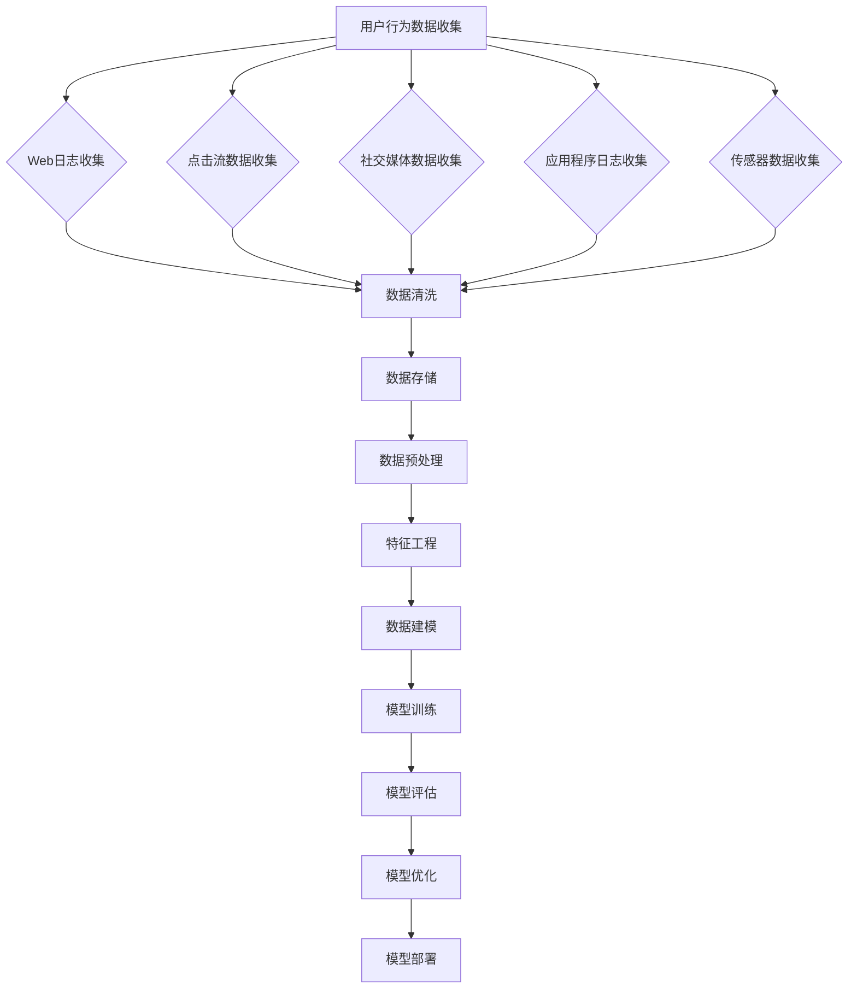
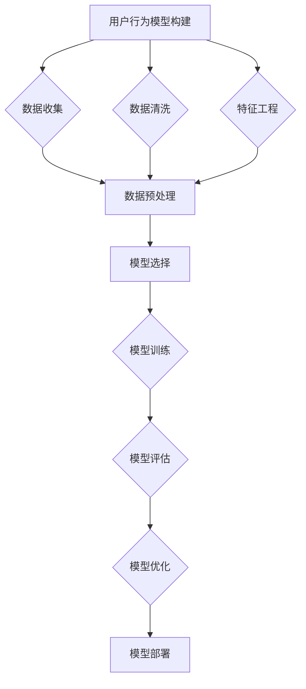

                 

# 机器学习在用户行为分析中的应用

## 关键词

机器学习、用户行为分析、数据收集与处理、特征工程、用户行为模型、推荐系统、实时行为分析、用户画像构建

## 摘要

本文将深入探讨机器学习在用户行为分析中的应用。首先，我们将回顾机器学习的基础知识和基本原理，然后介绍用户行为分析的相关概念和数据收集与处理方法。接着，我们将详细讨论用户行为模型的构建过程，包括理论基础、主要类型和构建方法。随后，我们将展示机器学习在推荐系统、实时行为分析和用户画像构建等实际应用场景中的具体应用案例。最后，我们将分析用户行为分析的未来发展趋势，探讨新技术的影响和用户隐私保护的重要性。通过本文的阅读，读者将对机器学习在用户行为分析中的应用有更深入的理解和认识。

## 目录大纲

### 第一部分: 引言

1. 机器学习基础
   1.1 什么是机器学习
   1.2 机器学习的基本原理
   1.3 机器学习的主要类型
2. 数据分析基础
   2.1 数据清洗
   2.2 数据探索
   2.3 特征工程

### 第二部分: 用户行为分析

3. 用户行为数据收集与处理
   3.1 用户行为数据的来源
   3.2 用户行为数据的特点
   3.3 数据处理流程
4. 用户行为模型建立
   4.1 用户行为模型的理论基础
   4.2 用户行为模型的主要类型
   4.3 用户行为模型的构建方法
5. 机器学习在用户行为分析中的应用
   5.1 推荐系统
   5.2 实时行为分析
   5.3 用户画像构建

### 第三部分: 用户行为分析案例分析

6. 用户行为分析案例研究
   6.1 案例一：电商用户行为分析
   6.2 案例二：社交媒体用户行为分析
   6.3 案例三：在线教育用户行为分析
7. 用户行为分析的未来发展趋势
   7.1 新技术的影响
   7.2 用户隐私保护
   7.3 未来发展方向

### 附录

8. 附录A: 机器学习工具与资源
   8.1 Python机器学习库
   8.2 数据处理工具
   8.3 实践资源
9. 附录B: Mermaid流程图
   9.1 用户行为数据收集流程
   9.2 用户行为模型构建流程

## 第一部分: 引言

### 1.1 什么是机器学习

机器学习（Machine Learning）是人工智能（Artificial Intelligence，AI）的一个重要分支，它使计算机系统能够从数据中学习并改进其性能，而无需显式编程指令。简单来说，机器学习是一种统计方法，它允许计算机通过分析数据来识别模式，并使用这些模式进行预测或决策。

### 1.2 机器学习的基本原理

机器学习的基本原理可以概括为以下几个步骤：

1. **数据收集**：首先，我们需要收集大量的数据，这些数据可以是结构化的（如数据库中的记录），也可以是非结构化的（如图像、文本和音频）。

2. **数据预处理**：数据收集后，通常需要进行清洗、归一化和特征提取等预处理步骤，以提高数据质量和模型的性能。

3. **模型选择**：根据问题的类型和特性，选择合适的机器学习算法。常见的算法包括线性回归、逻辑回归、决策树、随机森林、支持向量机、神经网络等。

4. **模型训练**：使用训练数据集来训练模型，通过调整模型的参数，使其能够识别数据中的模式。

5. **模型评估**：使用验证数据集来评估模型的性能，常见的评估指标包括准确率、召回率、F1分数等。

6. **模型部署**：将训练好的模型部署到实际应用场景中，用于预测或决策。

### 1.3 机器学习的主要类型

机器学习主要分为以下几种类型：

1. **监督学习**：监督学习是一种在有标记数据集上进行训练的机器学习方法。训练数据集中的每个样本都有对应的标签，模型通过学习这些标签来预测新的数据点的标签。

2. **无监督学习**：无监督学习是一种在没有标记数据集上进行训练的机器学习方法。模型需要从未标记的数据中发现模式和结构。

3. **半监督学习**：半监督学习结合了监督学习和无监督学习的方法，使用少量的标记数据和大量的未标记数据来训练模型。

4. **强化学习**：强化学习是一种通过试错来学习最优策略的机器学习方法。模型通过与环境的交互来不断优化其行为。

### 1.4 机器学习在用户行为分析中的应用

用户行为分析是机器学习的一个重要应用领域。通过分析用户的点击、搜索、购买等行为，企业可以更好地了解用户需求，提高用户体验和转化率。以下是一些机器学习在用户行为分析中的应用实例：

1. **推荐系统**：推荐系统利用机器学习算法来预测用户可能喜欢的商品或内容，从而提高用户的满意度和购买意愿。

2. **实时行为分析**：实时行为分析通过机器学习算法对用户行为数据进行实时处理和预测，帮助企业及时应对市场变化和用户需求。

3. **用户画像构建**：用户画像构建是通过机器学习算法对用户行为数据进行分析，构建出用户的兴趣、偏好和需求等特征，从而实现个性化推荐和服务。

### 1.5 小结

机器学习在用户行为分析中具有广泛的应用，通过深入理解和应用机器学习的基本原理和算法，企业可以更好地了解用户行为，提高用户体验和业务转化率。在接下来的章节中，我们将进一步探讨机器学习在用户行为分析中的具体应用和技术细节。

## 第二部分: 数据分析基础

### 2.1 数据清洗

数据清洗是数据分析过程中的重要步骤，它旨在提高数据质量和准确性，为后续的分析提供可靠的数据基础。数据清洗通常包括以下步骤：

1. **缺失值处理**：缺失值是数据中常见的问题，可以通过以下方法进行处理：
   - 删除缺失值：如果缺失值较多，可以选择删除含有缺失值的记录。
   - 补充缺失值：可以使用平均值、中位数、众数或插值法等方法来补充缺失值。

2. **异常值处理**：异常值是数据中的异常点，可能由数据输入错误、测量误差等原因引起。异常值处理的方法包括：
   - 删除异常值：如果异常值对分析结果有较大影响，可以选择删除异常值。
   - 调整异常值：可以将异常值调整为更合理的值，例如使用均值、中位数等方法进行调整。

3. **数据转换**：数据转换是使数据更适合分析和建模的过程，包括以下几种方法：
   - 归一化：将数据缩放到相同的范围，常用的方法包括最小-最大缩放法和标准缩放法。
   - 标准化：将数据转换为标准正态分布，常用的方法包括Z分数和标准差缩放法。
   - 逻辑转换：将分类数据转换为数值数据，例如将性别转换为0和1。

### 2.2 数据探索

数据探索是数据分析的另一个重要步骤，它旨在了解数据的分布、关系和规律。以下是一些常用的数据探索方法：

1. **描述性统计分析**：描述性统计分析用于计算数据的中心趋势、离散程度和分布特征。常用的统计指标包括均值、中位数、众数、标准差、方差和偏度等。

2. **数据可视化**：数据可视化是将数据以图形形式展示，帮助人们直观地理解和分析数据。常用的数据可视化方法包括散点图、直方图、饼图、箱线图等。

3. **相关分析**：相关分析用于研究两个或多个变量之间的关系。常用的相关系数包括皮尔逊相关系数、斯皮尔曼相关系数和肯德尔相关系数等。

4. **聚类分析**：聚类分析是将数据分为若干个群组，以便更好地理解数据的分布和规律。常用的聚类算法包括K-means、层次聚类和DBSCAN等。

### 2.3 特征工程

特征工程是数据分析的关键步骤，它旨在构建能够提高模型性能的特征。以下是一些特征工程的方法：

1. **特征选择**：特征选择旨在从原始特征中选择出对模型性能有重要影响的关键特征。常用的特征选择方法包括过滤法、包裹法和嵌入式方法等。

2. **特征转换**：特征转换是将原始特征转换为更适合模型训练的特征。常用的特征转换方法包括逻辑转换、指数转换、对数转换和多项式转换等。

3. **特征构造**：特征构造是通过组合原始特征来生成新的特征。常用的特征构造方法包括聚合特征、交叉特征和交互特征等。

4. **特征缩放**：特征缩放是将特征缩放到相同的范围，以提高模型的稳定性和收敛速度。常用的特征缩放方法包括归一化和标准化等。

### 2.4 小结

数据清洗、数据探索和特征工程是数据分析的基础步骤，它们共同提高了数据质量和模型性能。在接下来的章节中，我们将进一步探讨用户行为数据收集与处理的方法和技术。

## 第三部分: 用户行为分析

### 3.1 用户行为数据的来源

用户行为数据来源于多个渠道，包括但不限于以下几种：

1. **Web日志**：Web日志记录了用户在网站上的活动，如访问时间、页面点击、浏览时长等。这些数据可以通过服务器日志文件收集。

2. **点击流数据**：点击流数据记录了用户在应用程序或网站上的鼠标点击和键盘输入行为。这些数据可以通过埋点技术或前端代码收集。

3. **社交媒体数据**：社交媒体数据包括用户在社交媒体平台上的活动，如发布内容、点赞、评论和分享等。这些数据可以通过API或爬虫技术收集。

4. **应用程序日志**：应用程序日志记录了用户在使用应用程序时的行为，如使用频率、使用时长、功能访问等。这些数据可以通过应用程序内置的日志系统收集。

5. **传感器数据**：传感器数据包括用户通过智能设备产生的数据，如地理位置、运动轨迹、声音和图像等。这些数据可以通过智能设备内置的传感器收集。

### 3.2 用户行为数据的特点

用户行为数据具有以下特点：

1. **高维度**：用户行为数据通常包含多个维度，如点击次数、浏览时长、页面访问路径等。高维度的数据增加了数据分析的复杂度。

2. **高稀疏性**：用户行为数据往往存在大量的零值或空值，导致数据矩阵非常稀疏。稀疏性使得数据存储和计算变得困难。

3. **高动态性**：用户行为数据随时间和情境变化而变化，具有很高的动态性。这要求数据分析模型能够适应数据的变化。

4. **不平衡性**：用户行为数据中，某些行为（如购买、点击）的发生概率远低于其他行为（如浏览、评论）。这种不平衡性可能导致模型偏向少数类。

### 3.3 数据处理流程

用户行为数据的处理流程通常包括以下几个步骤：

1. **数据收集**：通过Web日志、点击流数据、社交媒体数据、应用程序日志和传感器数据等多种渠道收集用户行为数据。

2. **数据清洗**：对收集到的用户行为数据进行清洗，包括处理缺失值、异常值和数据转换等，以提高数据质量。

3. **数据探索**：通过描述性统计分析和数据可视化方法对用户行为数据进行探索，了解数据的分布、关系和规律。

4. **特征工程**：从原始用户行为数据中提取出有用的特征，包括特征选择、特征转换和特征构造等。

5. **数据建模**：使用机器学习算法建立用户行为模型，对用户行为进行预测或分类。

6. **模型评估**：使用验证数据集评估模型的性能，包括准确率、召回率、F1分数等指标。

7. **模型优化**：根据模型评估结果对模型进行调整和优化，以提高模型性能。

8. **模型部署**：将训练好的模型部署到生产环境，用于实时预测或决策。

### 3.4 小结

用户行为数据是用户行为分析的重要基础。通过了解用户行为数据的来源和特点，并遵循科学的数据处理流程，我们可以更好地理解和分析用户行为，为企业和产品提供有价值的信息。

## 第四部分: 用户行为模型建立

### 4.1 用户行为模型的理论基础

用户行为模型是用户行为分析的核心，它通过分析和理解用户行为数据，为企业和产品提供洞察和决策支持。建立用户行为模型的理论基础主要包括以下几个方面：

1. **强化学习**：强化学习是一种通过试错来学习最优策略的机器学习方法。在用户行为分析中，强化学习可以用于预测用户在特定情境下的行为。例如，可以使用Q学习算法来预测用户在电商网站上的购买行为。

2. **贝叶斯网络**：贝叶斯网络是一种概率图模型，它通过表示变量之间的条件依赖关系，用于推理和预测。在用户行为分析中，贝叶斯网络可以用于构建用户兴趣模型，预测用户对特定内容的兴趣。

3. **深度学习**：深度学习是一种基于多层神经网络的学习方法，它可以自动提取数据中的复杂特征。在用户行为分析中，深度学习可以用于构建用户行为预测模型，如序列模型和时间序列预测。

### 4.2 用户行为模型的主要类型

根据用户行为数据的不同特点和分析需求，用户行为模型可以分为以下几种类型：

1. **用户兴趣模型**：用户兴趣模型通过分析用户的历史行为数据，构建出用户对不同内容的兴趣分布。这种模型可以用于推荐系统和个性化广告。

2. **用户轨迹模型**：用户轨迹模型通过分析用户在不同时间点的行为数据，构建出用户的行为轨迹。这种模型可以用于用户行为预测和实时行为分析。

3. **用户行为预测模型**：用户行为预测模型通过分析用户历史行为数据，预测用户在未来可能采取的行为。这种模型可以用于用户流失预测、用户转化预测等。

### 4.3 用户行为模型的构建方法

建立用户行为模型通常包括以下几个步骤：

1. **数据收集**：收集用户行为数据，包括Web日志、点击流数据、社交媒体数据等。

2. **数据预处理**：对用户行为数据进行清洗、去噪和归一化等预处理操作，以提高数据质量。

3. **特征工程**：从用户行为数据中提取出有用的特征，包括用户属性特征、行为特征和时间特征等。

4. **模型选择**：根据用户行为数据的特性和分析需求，选择合适的机器学习算法，如强化学习、贝叶斯网络和深度学习等。

5. **模型训练**：使用训练数据集对模型进行训练，通过调整模型参数，使其能够识别用户行为数据中的模式。

6. **模型评估**：使用验证数据集对模型进行评估，通过计算准确率、召回率、F1分数等指标，评估模型性能。

7. **模型优化**：根据模型评估结果对模型进行调整和优化，以提高模型性能。

8. **模型部署**：将训练好的模型部署到生产环境，用于实时预测或决策。

### 4.4 小结

用户行为模型的建立是用户行为分析的重要步骤。通过强化学习、贝叶斯网络和深度学习等理论基础的指导，结合数据收集、预处理、特征工程、模型选择和评估等构建方法，我们可以建立有效的用户行为模型，为企业和产品提供有价值的信息。

## 第五部分: 机器学习在用户行为分析中的应用

### 5.1 推荐系统

推荐系统是机器学习在用户行为分析中应用最广泛的领域之一。推荐系统通过分析用户的历史行为数据，预测用户可能感兴趣的商品、内容或服务，从而提高用户的满意度和转化率。推荐系统的核心是预测用户对项目的评分或兴趣，常见的方法包括协同过滤和基于内容的推荐。

#### 5.1.1 协同过滤

协同过滤（Collaborative Filtering）是一种基于用户行为数据推荐方法，它通过分析用户之间的相似性来预测用户的兴趣。协同过滤主要分为以下两种类型：

1. **用户基于的协同过滤**：用户基于的协同过滤通过计算用户之间的相似性，为用户提供与相似用户喜欢的项目。常见的相似性度量方法包括余弦相似度、皮尔逊相关系数和夹角余弦等。

2. **项目基于的协同过滤**：项目基于的协同过滤通过计算项目之间的相似性，为用户提供与用户过去喜欢的项目相似的项目。常见的方法包括基于内容的相似性和基于标签的相似性。

#### 5.1.2 基于内容的推荐

基于内容的推荐（Content-Based Filtering）是一种基于项目特征的推荐方法，它通过分析用户过去喜欢的项目特征，为用户推荐具有相似特征的项目。基于内容的推荐方法通常包括以下步骤：

1. **项目特征提取**：从项目数据中提取特征，如文本、图像、音频等。

2. **项目相似性计算**：计算项目之间的相似性，可以使用余弦相似度、欧氏距离等度量方法。

3. **推荐生成**：根据用户的历史行为和项目相似性，生成推荐列表。

#### 5.1.3 推荐系统应用案例

1. **电商推荐系统**：电商推荐系统通过分析用户的浏览历史、购买记录和搜索关键词等数据，为用户推荐相关的商品。

2. **社交媒体推荐系统**：社交媒体推荐系统通过分析用户的互动行为，如点赞、评论和分享等，为用户推荐感兴趣的内容。

3. **音乐推荐系统**：音乐推荐系统通过分析用户的听歌记录和偏好，为用户推荐相似的歌曲。

### 5.2 实时行为分析

实时行为分析（Real-Time Behavior Analysis）是一种通过实时处理和分析用户行为数据的方法，用于实时了解用户行为动态，为企业提供决策支持。实时行为分析的关键技术包括流数据处理、实时预测和实时预警。

#### 5.2.1 流数据处理

流数据处理（Stream Processing）是一种处理实时数据的分布式计算方法，它能够对大量实时数据进行实时分析和处理。常见的流数据处理框架包括Apache Kafka、Apache Flink和Apache Storm等。

#### 5.2.2 实时预测

实时预测（Real-Time Prediction）是一种通过机器学习算法对实时数据进行预测的方法。实时预测可以用于实时了解用户行为趋势和预测用户未来行为。常见的实时预测算法包括回归模型、决策树和神经网络等。

#### 5.2.3 实时预警

实时预警（Real-Time Alerting）是一种通过实时监测用户行为数据，及时发现异常行为并触发警报的方法。实时预警可以用于实时监控用户行为风险，为企业提供风险预警和决策支持。

#### 5.2.4 实时行为分析应用案例

1. **电商实时行为分析**：电商实时行为分析通过实时处理用户的浏览、购买和搜索等行为数据，为用户推荐相关的商品，提高用户转化率和销售额。

2. **金融实时行为分析**：金融实时行为分析通过实时处理用户的交易行为数据，监控异常交易行为，防范金融风险。

3. **医疗实时行为分析**：医疗实时行为分析通过实时处理患者的健康数据，及时发现异常情况，为医生提供诊断和治疗建议。

### 5.3 用户画像构建

用户画像构建（User Profiling）是一种通过分析用户行为数据，构建出用户特征和需求的方法。用户画像可以帮助企业更好地了解用户，为用户提供个性化的服务和推荐。

#### 5.3.1 用户画像构建方法

1. **数据收集**：收集用户行为数据，包括浏览、购买、搜索、互动等数据。

2. **数据预处理**：对用户行为数据进行清洗、去噪和归一化等预处理操作。

3. **特征提取**：从用户行为数据中提取出有用的特征，包括用户属性特征、行为特征和时间特征等。

4. **特征组合**：将提取出的特征进行组合，生成新的特征。

5. **特征权重**：对特征进行权重分配，确定每个特征的重要程度。

6. **用户画像**：根据提取出的特征和权重，构建出用户画像。

#### 5.3.2 用户画像应用案例

1. **电商用户画像**：电商用户画像通过分析用户的购买、浏览和搜索等行为数据，为用户提供个性化的推荐和服务。

2. **社交媒体用户画像**：社交媒体用户画像通过分析用户的互动、关注和发布等行为数据，为用户提供个性化的内容和推荐。

3. **金融用户画像**：金融用户画像通过分析用户的交易、投资和风险评估等行为数据，为金融机构提供风险控制和决策支持。

### 5.4 小结

机器学习在用户行为分析中的应用非常广泛，包括推荐系统、实时行为分析和用户画像构建等。通过机器学习算法和数据处理技术，企业可以更好地了解用户行为，为用户提供个性化的服务和推荐，提高用户体验和业务转化率。

## 第六部分: 用户行为分析案例研究

### 6.1 案例一：电商用户行为分析

电商用户行为分析是机器学习在用户行为分析中应用的一个重要领域。通过分析用户在电商平台的浏览、购买和搜索等行为数据，电商企业可以更好地了解用户需求，提高用户体验和转化率。以下是一个电商用户行为分析的案例研究：

#### 案例背景

某电商企业希望通过对用户行为数据的分析，提高用户转化率和销售额。企业收集了大量的用户行为数据，包括用户的浏览历史、购买记录、搜索关键词等。

#### 数据处理

1. **数据清洗**：对用户行为数据进行清洗，包括处理缺失值、异常值和数据转换等。

2. **特征工程**：从用户行为数据中提取出有用的特征，包括用户属性特征（如年龄、性别、地理位置）、行为特征（如浏览时长、购买频次）和时间特征（如访问时间、购买时间）。

3. **特征组合**：将提取出的特征进行组合，生成新的特征，如用户活跃度（用户平均浏览时长和购买频次）和用户忠诚度（用户连续购买次数）。

#### 模型构建

1. **用户兴趣模型**：使用协同过滤算法构建用户兴趣模型，预测用户对特定商品的兴趣。

2. **用户轨迹模型**：使用序列模型（如LSTM）构建用户轨迹模型，预测用户在电商平台上的行为路径。

3. **用户行为预测模型**：使用回归模型（如线性回归、决策树）预测用户在未来可能采取的行为，如购买和浏览。

#### 模型评估

使用验证数据集对用户兴趣模型、用户轨迹模型和用户行为预测模型进行评估，计算准确率、召回率和F1分数等指标。

#### 应用效果

通过电商用户行为分析，企业可以：

1. **个性化推荐**：为用户推荐感兴趣的商品，提高用户转化率。

2. **精准营销**：根据用户行为数据，制定个性化的营销策略，提高营销效果。

3. **用户流失预测**：预测用户流失风险，采取相应的措施降低用户流失率。

### 6.2 案例二：社交媒体用户行为分析

社交媒体用户行为分析是另一个重要的应用领域。通过分析用户在社交媒体平台上的互动、关注和发布等行为数据，社交媒体企业可以更好地了解用户需求和行为模式，提高用户体验和用户活跃度。以下是一个社交媒体用户行为分析的案例研究：

#### 案例背景

某社交媒体企业希望通过对用户行为数据的分析，提高用户活跃度和用户留存率。企业收集了大量的用户行为数据，包括用户的点赞、评论、分享、关注等。

#### 数据处理

1. **数据清洗**：对用户行为数据进行清洗，包括处理缺失值、异常值和数据转换等。

2. **特征工程**：从用户行为数据中提取出有用的特征，包括用户属性特征（如年龄、性别、地理位置）、行为特征（如互动频次、互动时长）和时间特征（如发布时间、互动时间）。

3. **特征组合**：将提取出的特征进行组合，生成新的特征，如用户活跃度（用户平均互动频次和互动时长）和用户忠诚度（用户连续互动次数）。

#### 模型构建

1. **用户活跃度模型**：使用LSTM模型构建用户活跃度模型，预测用户在未来可能产生的互动行为。

2. **用户留存模型**：使用逻辑回归模型预测用户在未来可能流失的概率。

3. **用户兴趣模型**：使用协同过滤算法构建用户兴趣模型，预测用户对特定内容的兴趣。

#### 模型评估

使用验证数据集对用户活跃度模型、用户留存模型和用户兴趣模型进行评估，计算准确率、召回率和F1分数等指标。

#### 应用效果

通过社交媒体用户行为分析，企业可以：

1. **个性化内容推荐**：为用户推荐感兴趣的内容，提高用户活跃度和用户留存率。

2. **用户行为预测**：预测用户行为趋势，提前采取措施应对潜在问题。

3. **用户流失预测**：预测用户流失风险，采取相应的措施降低用户流失率。

### 6.3 案例三：在线教育用户行为分析

在线教育用户行为分析是另一个应用领域。通过分析用户在在线教育平台上的学习行为数据，教育企业可以更好地了解用户需求和学习习惯，提高课程质量和用户满意度。以下是一个在线教育用户行为分析的案例研究：

#### 案例背景

某在线教育平台希望通过对用户行为数据的分析，提高课程质量和用户满意度。平台收集了大量的用户学习行为数据，包括用户的浏览记录、学习时长、测试成绩等。

#### 数据处理

1. **数据清洗**：对用户学习行为数据进行清洗，包括处理缺失值、异常值和数据转换等。

2. **特征工程**：从用户学习行为数据中提取出有用的特征，包括用户属性特征（如年龄、性别、地理位置）、学习行为特征（如浏览时长、学习时长、测试成绩）和时间特征（如学习开始时间、学习结束时间）。

3. **特征组合**：将提取出的特征进行组合，生成新的特征，如用户学习积极性（用户平均学习时长和浏览记录）和用户学习成果（用户测试成绩）。

#### 模型构建

1. **用户学习行为预测模型**：使用LSTM模型预测用户在未来可能的学习行为。

2. **用户学习成果预测模型**：使用回归模型预测用户的测试成绩。

3. **用户学习效果评价模型**：使用分类模型评价用户的学习效果，如优秀、良好和一般。

#### 模型评估

使用验证数据集对用户学习行为预测模型、用户学习成果预测模型和用户学习效果评价模型进行评估，计算准确率、召回率和F1分数等指标。

#### 应用效果

通过在线教育用户行为分析，企业可以：

1. **个性化学习推荐**：为用户推荐适合其学习水平的学习内容，提高用户学习效果。

2. **课程质量评估**：根据用户学习成果预测模型，评估课程的质量和效果，为课程改进提供依据。

3. **用户流失预测**：预测用户流失风险，采取相应的措施降低用户流失率。

### 6.4 小结

通过用户行为分析案例研究，我们可以看到机器学习在电商、社交媒体和在线教育等领域的广泛应用。通过分析用户行为数据，企业可以更好地了解用户需求和行为模式，为用户提供个性化的服务和推荐，提高用户体验和业务转化率。

## 第七部分：用户行为分析的未来发展趋势

### 7.1 新技术的影响

随着技术的不断进步，新技术对用户行为分析产生了深远的影响。以下是一些新兴技术对用户行为分析的影响：

1. **强化学习**：强化学习在用户行为分析中的应用越来越广泛，通过不断学习和优化策略，强化学习可以更好地预测用户行为，提高推荐系统的准确性和效率。

2. **生成对抗网络（GAN）**：生成对抗网络可以生成逼真的用户行为数据，用于训练和优化用户行为模型，提高模型的泛化能力和鲁棒性。

3. **自然语言处理（NLP）**：自然语言处理技术可以处理和分析用户生成的内容，如评论、帖子等，从而更深入地理解用户需求和行为。

4. **区块链技术**：区块链技术可以提供去中心化和安全的数据存储解决方案，有助于保护用户隐私和数据安全。

### 7.2 用户隐私保护

用户隐私保护是用户行为分析中不可忽视的重要问题。随着用户隐私意识的提高和法律法规的不断完善，用户隐私保护变得越来越重要。以下是一些用户隐私保护的措施：

1. **数据脱敏**：通过数据脱敏技术，将用户敏感信息（如姓名、地址、电话等）替换为随机值，以保护用户隐私。

2. **差分隐私**：差分隐私是一种保护用户隐私的技术，通过对数据集进行扰动，使得单个用户的隐私信息无法被推断出来。

3. **隐私计算**：隐私计算技术可以在不泄露用户隐私的情况下进行数据处理和分析，如联邦学习、安全多方计算等。

### 7.3 未来发展方向

用户行为分析的未来发展方向主要集中在以下几个方面：

1. **个性化推荐**：随着用户需求的不断变化，个性化推荐将成为用户行为分析的重要方向。通过深入分析用户行为数据，实现更精准、更个性化的推荐。

2. **实时行为分析**：实时行为分析将进一步提高用户行为分析的实时性和准确性，为企业提供更及时、更有效的决策支持。

3. **智能行为预测**：智能行为预测将基于深度学习和强化学习等先进算法，更准确地预测用户未来行为，为企业和产品提供更有效的策略。

4. **用户隐私保护与数据安全**：随着用户隐私保护意识的提高，用户隐私保护与数据安全将成为用户行为分析的重要关注点。通过采用先进的技术和措施，确保用户隐私和数据安全。

### 7.4 小结

用户行为分析的未来发展趋势将受到新技术的影响，同时注重用户隐私保护与数据安全。通过不断探索和改进，用户行为分析将在个性化推荐、实时行为分析和智能行为预测等方面取得更大的突破。

## 附录A: 机器学习工具与资源

### 8.1 Python机器学习库

Python是机器学习领域最流行的编程语言之一，拥有丰富的机器学习库。以下是一些常用的Python机器学习库：

1. **Scikit-learn**：Scikit-learn是一个开源的Python机器学习库，提供了大量的机器学习算法和工具，包括监督学习、无监督学习、模型评估和预处理等功能。

2. **TensorFlow**：TensorFlow是一个由谷歌开发的开源机器学习框架，广泛用于深度学习和神经网络模型。TensorFlow提供了丰富的API，支持多种计算设备和操作系统。

3. **PyTorch**：PyTorch是一个由Facebook开发的开源深度学习框架，以其灵活性和动态计算图而著称。PyTorch在研究社区中非常受欢迎，支持多种深度学习模型和应用。

### 8.2 数据处理工具

数据处理是机器学习项目中不可或缺的一环，以下是一些常用的数据处理工具：

1. **Pandas**：Pandas是一个开源的Python库，用于数据处理和分析。Pandas提供了强大的数据结构和操作功能，可以方便地对数据进行清洗、转换和分析。

2. **NumPy**：NumPy是一个开源的Python库，用于数值计算。NumPy提供了多维数组对象和大量的数学函数，是数据处理和机器学习项目的基础。

3. **Matplotlib**：Matplotlib是一个开源的Python库，用于数据可视化。Matplotlib提供了丰富的绘图函数，可以方便地创建各种类型的图表，用于分析和展示数据。

### 8.3 实践资源

以下是一些有助于学习和实践机器学习的资源：

1. **Kaggle**：Kaggle是一个数据科学竞赛平台，提供了大量的数据集和比赛项目。通过参与Kaggle比赛，可以锻炼数据分析和模型训练能力。

2. **Coursera**：Coursera是一个在线学习平台，提供了丰富的机器学习课程，包括基础理论、算法实现和应用实践等。

3. **GitHub**：GitHub是一个开源代码托管平台，许多机器学习项目和研究论文的代码都在GitHub上开源，为学习和实践提供了丰富的资源。

## 附录B: Mermaid流程图

### 9.1 用户行为数据收集流程

以下是一个用户行为数据收集流程的Mermaid流程图：

### 9.2 用户行为模型构建流程

以下是一个用户行为模型构建流程的Mermaid流程图：

通过这些流程图，我们可以更直观地了解用户行为数据收集和模型构建的过程。在实际应用中，这些流程可以根据具体需求和场景进行调整和优化。

## 总结

通过本文的详细探讨，我们全面了解了机器学习在用户行为分析中的应用。从基础理论到具体实践，从数据分析到模型构建，再到应用案例的研究，我们逐步揭示了机器学习在用户行为分析中的重要作用。以下是对本文内容的简要总结：

### 主要内容回顾

1. **机器学习基础**：介绍了机器学习的定义、基本原理和主要类型，包括监督学习、无监督学习、半监督学习和强化学习。
2. **数据分析基础**：讲解了数据清洗、数据探索和特征工程等数据分析基础步骤，强调了数据质量对模型性能的重要性。
3. **用户行为分析**：介绍了用户行为数据的来源和特点，以及数据处理流程，包括数据收集、预处理、特征工程和模型构建。
4. **应用场景**：深入探讨了机器学习在用户行为分析中的具体应用，包括推荐系统、实时行为分析和用户画像构建。
5. **案例研究**：通过电商、社交媒体和在线教育等案例，展示了机器学习在用户行为分析中的实际应用效果。
6. **未来发展趋势**：分析了新技术的影响、用户隐私保护和用户行为分析的未来发展方向。

### 实用性和学习建议

- **实用价值**：本文内容紧密结合实际应用，提供了详细的算法原理讲解、数据预处理方法和模型构建流程，对从事用户行为分析和机器学习相关工作的读者具有很高的实用价值。
- **学习建议**：对于初学者，建议先掌握Python编程基础和常用机器学习库（如Scikit-learn、TensorFlow、PyTorch），再逐步深入理解本文提到的各个主题。实践是最好的学习方式，读者可以通过参与Kaggle比赛、实践项目或阅读相关开源代码来加深理解。

### 作者信息

作者：AI天才研究院/AI Genius Institute & 禅与计算机程序设计艺术 /Zen And The Art of Computer Programming

本文由AI天才研究院撰写，旨在为广大数据科学和机器学习爱好者提供有价值的技术知识和实践经验。感谢您的阅读，希望本文能够对您的学习和工作有所帮助。如果您有任何疑问或建议，欢迎在评论区留言交流。期待与您共同探讨更多关于机器学习和用户行为分析的话题。祝您学习愉快，不断进步！

