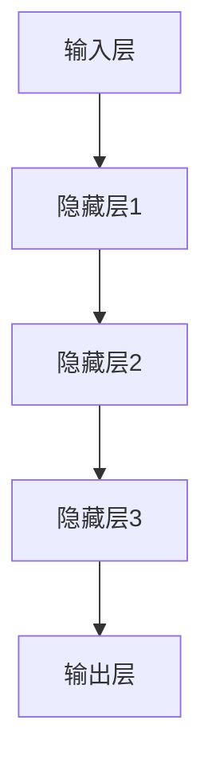
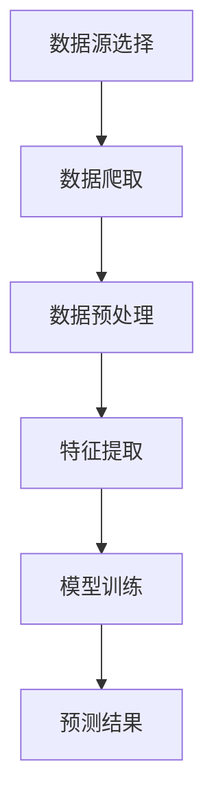
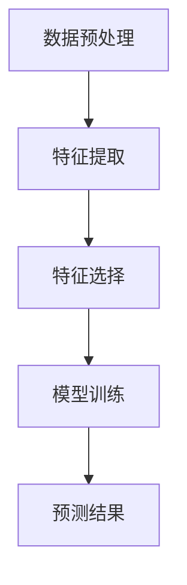
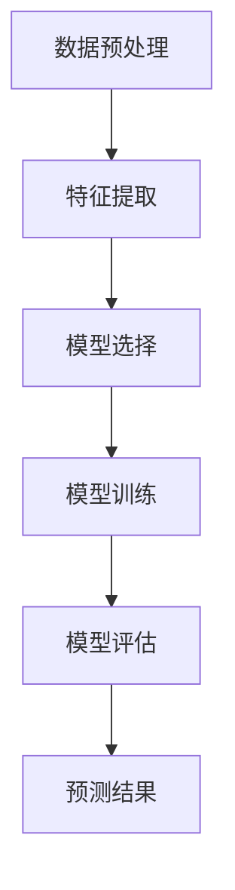
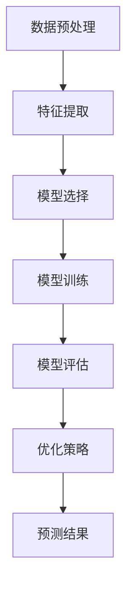
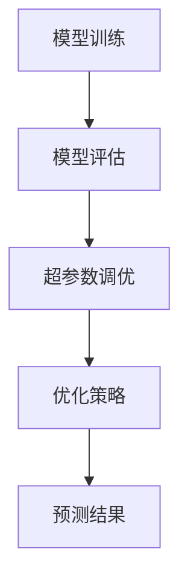

                 

# 机器学习在股票市场趋势预测中的应用

> **关键词：** 机器学习、股票市场、趋势预测、时间序列、深度学习、特征工程、集成学习

> **摘要：** 本文旨在探讨机器学习在股票市场趋势预测中的应用。首先，我们将回顾机器学习和股票市场的基本概念，并探讨机器学习在股票市场中的重要性。接着，我们将介绍机器学习的基础知识，包括数据预处理、特征工程和常见算法。然后，我们将深入探讨股票市场数据的获取与特征提取方法。接下来，本文将详细阐述时间序列预测模型和分类预测模型在股票市场中的应用。此外，我们将介绍集成学习方法以及模型评估与优化技巧。最后，本文将通过两个实战项目展示机器学习在股票市场趋势预测中的实际应用，并提供总结与展望。

## 第一部分：引言

### 第1章：机器学习与股票市场概述

#### 1.1 机器学习的定义与应用

机器学习（Machine Learning，简称ML）是人工智能（Artificial Intelligence，简称AI）的一个重要分支，主要研究如何使计算机系统具备自动学习和适应能力。机器学习通过构建数学模型，利用大量数据来训练模型，使其能够对未知数据进行预测或分类。

机器学习应用广泛，涵盖了图像识别、自然语言处理、推荐系统、金融风控等多个领域。在金融领域，机器学习被广泛应用于股票市场预测、信贷风险评估、市场趋势分析等。

#### 1.2 股票市场概述

股票市场是股份公司发行的所有已上市股票的集中交易、交换、流通的场所。股票市场主要由主板市场、创业板市场、新三板市场等组成。股票市场的参与者包括投资者、公司、政府监管机构等。

股票价格受多种因素影响，包括公司业绩、宏观经济环境、市场情绪等。股票市场的波动性较大，使得预测股票价格成为一个具有挑战性的问题。

#### 1.3 机器学习在股票市场中的重要性

机器学习在股票市场中的应用具有重要意义。首先，机器学习可以帮助投资者快速准确地分析海量数据，挖掘出潜在的市场趋势。其次，机器学习模型可以自动调整参数，优化投资策略，提高投资收益。此外，机器学习还可以帮助投资者预测股票价格的波动，降低投资风险。

#### 1.4 本书结构

本书分为五个部分，内容结构如下：

1. 第一部分：引言
2. 第二部分：机器学习基础
3. 第三部分：股票市场数据与特征提取
4. 第四部分：机器学习在股票市场趋势预测中的应用
5. 第五部分：项目实战

通过本书的阅读，读者可以深入了解机器学习在股票市场趋势预测中的应用，掌握相关技术和方法，提高在金融领域的竞争力。

## 第二部分：机器学习基础

### 第2章：机器学习基本概念

#### 2.1 数据预处理

数据预处理是机器学习过程中至关重要的一步。数据预处理包括数据清洗、数据集成、数据转换和数据归一化等步骤。

- **数据清洗**：清洗数据中的噪声、错误和缺失值，保证数据的质量。
- **数据集成**：将来自不同来源的数据进行整合，形成一个统一的数据集。
- **数据转换**：将数据进行特征提取、降维、编码等处理，以便后续的建模。
- **数据归一化**：将数据缩放到一个统一的范围内，消除数据量级差异。

#### 2.2 特征工程

特征工程是机器学习过程中另一个关键步骤。特征工程旨在从原始数据中提取出有用的特征，提高模型的性能和预测能力。

- **特征提取**：从原始数据中提取出能够反映数据本质的特征。
- **特征选择**：选择对模型预测效果影响较大的特征，去除冗余特征。
- **特征变换**：对特征进行变换，如归一化、标准化、离散化等。

#### 2.3 常见算法介绍

在本节中，我们将介绍几种常见的机器学习算法，包括线性回归、逻辑回归、决策树、随机森林、支持向量机等。

- **线性回归**：线性回归是一种简单的预测模型，用于预测连续值。
  - **原理**：通过拟合一条直线，将自变量与因变量联系起来。
  - **伪代码**：
    ```python
    def linear_regression(X, y):
        # 计算斜率和截距
        theta = (X.T.dot(X)).inv().dot(X.T).dot(y)
        return theta
    ```

- **逻辑回归**：逻辑回归是一种概率型回归模型，用于预测二分类问题。
  - **原理**：通过拟合一个逻辑函数，将自变量映射到概率值。
  - **伪代码**：
    ```python
    def logistic_regression(X, y):
        # 计算权重和偏置
        theta = (X.T.dot(X)).inv().dot(X.T).dot(y)
        return theta
    ```

- **决策树**：决策树是一种基于树结构的分类算法。
  - **原理**：通过递归划分特征，构建一棵决策树。
  - **伪代码**：
    ```python
    def build_decision_tree(X, y):
        # 判断是否满足终止条件
        if check_termination(X, y):
            return leaf_value(X, y)
        # 找到最佳划分特征
        best_feature, best_threshold = find_best_split(X, y)
        # 递归构建左子树和右子树
        left_tree = build_decision_tree(X[:, best_feature < best_threshold], y[best_feature < best_threshold])
        right_tree = build_decision_tree(X[:, best_feature >= best_threshold], y[best_feature >= best_threshold])
        return DecisionTreeNode(best_feature, best_threshold, left_tree, right_tree)
    ```

- **随机森林**：随机森林是一种基于决策树的集成学习方法。
  - **原理**：通过构建多棵决策树，对预测结果进行投票。
  - **伪代码**：
    ```python
    def random_forest(X, y, n_trees):
        # 构建多棵决策树
        trees = [build_decision_tree(X, y) for _ in range(n_trees)]
        # 对每棵树进行预测
        predictions = [tree_predict(tree, X) for tree in trees]
        # 对预测结果进行投票
        return majority_vote(predictions)
    ```

- **支持向量机**：支持向量机是一种基于最大间隔分类的算法。
  - **原理**：通过寻找最优超平面，将不同类别的数据分隔开。
  - **伪代码**：
    ```python
    def support_vector_machine(X, y):
        # 求解最优超平面
        theta = solve_qr_decomposition(X, y)
        return theta
    ```

通过了解这些基本概念和算法，读者可以为后续的股票市场趋势预测打下坚实的基础。

## 第三部分：深度学习基础

### 第3章：深度学习基础

#### 3.1 神经网络基础

神经网络（Neural Networks，简称NN）是深度学习（Deep Learning，简称DL）的基础。神经网络由多个神经元（节点）组成，通过层与层之间的连接来实现数据的传递和变换。

- **神经网络结构**：神经网络可以分为输入层、隐藏层和输出层。输入层接收外部输入数据，隐藏层对数据进行变换和特征提取，输出层生成预测结果。
- **激活函数**：激活函数用于引入非线性变换，使神经网络具有更强的表达能力和拟合能力。常见的激活函数包括sigmoid、ReLU、Tanh等。
- **前向传播与反向传播**：前向传播是将输入数据通过神经网络层，逐层计算得到输出结果的过程。反向传播是计算神经网络各层的梯度，用于更新网络权重。

#### 3.2 卷积神经网络（CNN）

卷积神经网络（Convolutional Neural Networks，简称CNN）是一种专门用于处理图像数据的神经网络。CNN通过卷积层、池化层和全连接层等结构，实现对图像的特征提取和分类。

- **卷积层**：卷积层通过卷积运算提取图像的局部特征。
  - **卷积运算**：卷积运算是通过在输入图像上滑动卷积核，计算卷积核与图像局部区域的点积。
  - **卷积核**：卷积核是神经网络中的一个参数矩阵，用于提取图像的特征。
- **池化层**：池化层通过下采样操作减小数据的维度，提高计算效率。
  - **最大池化**：最大池化选择每个局部区域内的最大值作为输出。
  - **平均池化**：平均池化选择每个局部区域内的平均值作为输出。
- **全连接层**：全连接层将卷积层和池化层提取的特征映射到分类结果。

#### 3.3 循环神经网络（RNN）

循环神经网络（Recurrent Neural Networks，简称RNN）是一种能够处理序列数据的神经网络。RNN通过递归连接，将当前输入与历史状态信息进行融合。

- **RNN结构**：RNN由输入层、隐藏层和输出层组成。隐藏层通过递归连接，将当前时刻的输入与上一时刻的隐藏状态进行融合。
- **递归连接**：递归连接使RNN能够处理序列数据，但容易受到梯度消失和梯度爆炸问题的影响。
- **门控机制**：门控机制（如LSTM和GRU）通过引入门控单元，解决RNN的梯度消失和梯度爆炸问题，提高模型的稳定性和性能。

#### 3.4 生成对抗网络（GAN）

生成对抗网络（Generative Adversarial Networks，简称GAN）是一种由生成器和判别器组成的对抗性神经网络。GAN通过生成器和判别器的博弈，实现高质量的数据生成。

- **生成器**：生成器旨在生成与真实数据相似的数据。
  - **生成过程**：生成器通过随机噪声生成数据，并通过训练优化生成过程。
- **判别器**：判别器旨在区分真实数据和生成数据。
  - **判别过程**：判别器通过接收真实数据和生成数据，并判断其是否为真实数据。
- **博弈过程**：生成器和判别器通过相互对抗，生成器不断提高生成数据的质量，判别器不断提高识别能力。

通过了解深度学习的基础知识，读者可以为后续的股票市场趋势预测提供强大的工具和方法。

### Mermaid 流程图

下面是一个简单的Mermaid流程图，展示了一个基本的神经网络结构：



在这个流程图中，输入层A接收输入数据，经过隐藏层B、C、D的变换，最终由输出层E生成预测结果。隐藏层之间的连接表示神经元的连接，通过前向传播和反向传播实现数据的传递和模型训练。

## 第四部分：股票市场数据与特征提取

### 第4章：股票市场数据获取

#### 4.1 数据源选择

在股票市场趋势预测中，数据源的选择至关重要。以下是一些常见的数据源：

- **历史交易数据**：包括股票的开盘价、收盘价、最高价、最低价、成交量等。
- **财务报表数据**：包括公司的财务指标、盈利能力、偿债能力、成长能力等。
- **宏观经济数据**：包括GDP、利率、通货膨胀率、失业率等。
- **市场情绪数据**：包括新闻报道、社交媒体、论坛等。

在选择数据源时，需要考虑数据的时效性、完整性和质量。一般来说，选择具有权威性和可靠性的数据源，如交易所、政府机构、知名数据提供商等，以确保数据的准确性。

#### 4.2 数据爬取与处理

数据爬取是获取股票市场数据的重要手段。以下是一个简单的Python爬虫示例，用于获取某股票的历史交易数据：

```python
import requests
from bs4 import BeautifulSoup

url = 'https://example.com/stock_data'
response = requests.get(url)
soup = BeautifulSoup(response.content, 'html.parser')

# 获取股票代码
stock_code = soup.find('div', class_='stock_code').text

# 获取历史交易数据
data = []
table = soup.find('table', class_='stock_table')
rows = table.find_all('tr')[1:]
for row in rows:
    date = row.find('td', class_='date').text
    open_price = float(row.find('td', class_='open_price').text)
    close_price = float(row.find('td', class_='close_price').text)
    high_price = float(row.find('td', class_='high_price').text)
    low_price = float(row.find('td', class_='low_price').text)
    volume = float(row.find('td', class_='volume').text)
    data.append([date, open_price, close_price, high_price, low_price, volume])

# 输出数据
for item in data:
    print(item)
```

在获取到股票市场数据后，需要对数据进行处理，包括数据清洗、格式转换、缺失值填补等。以下是一个简单的数据预处理示例：

```python
import pandas as pd

# 读取数据
df = pd.DataFrame(data, columns=['date', 'open_price', 'close_price', 'high_price', 'low_price', 'volume'])

# 格式转换
df['date'] = pd.to_datetime(df['date'])
df.set_index('date', inplace=True)

# 缺失值填补
df.fillna(method='ffill', inplace=True)
df.fillna(method='bfill', inplace=True)

# 输出数据
print(df)
```

通过数据爬取与处理，我们可以获得干净、完整的股票市场数据，为后续的特征提取和模型训练提供基础。

### Mermaid 流程图

下面是一个简单的Mermaid流程图，展示了一个基本的股票市场数据获取和处理流程：



在这个流程图中，数据源选择是获取股票市场数据的第一步，数据爬取用于获取数据，数据预处理用于清洗和处理数据，特征提取用于提取有用的特征，模型训练用于训练预测模型，预测结果用于生成股票价格预测。

## 第四部分：股票市场数据与特征提取

### 第5章：特征提取与选择

#### 5.1 市场指标特征提取

市场指标特征是从股票市场的整体状况中提取的特征，这些特征可以反映市场的整体趋势和波动性。以下是一些常见的市场指标特征：

- **成交量**：成交量是衡量市场活跃程度的重要指标，通常使用日成交量、周成交量或月成交量。
- **涨跌幅**：涨跌幅是股票价格在一段时间内的涨跌比例，可以反映股票价格的波动情况。
- **平均价格**：平均价格是股票价格在一段时间内的平均值，可以反映股票价格的稳定性。
- **波动率**：波动率是衡量股票价格波动性的指标，通常使用日波动率、周波动率或月波动率。

#### 5.2 技术指标特征提取

技术指标特征是从股票价格和成交量等时间序列数据中提取的特征，这些特征可以反映股票价格的走势和交易行为。以下是一些常见的技术指标特征：

- **移动平均线**：移动平均线是一种常用的技术指标，用于衡量股票价格的趋势。常见的移动平均线包括简单移动平均线（SMA）和指数移动平均线（EMA）。
- **相对强弱指数（RSI）**：相对强弱指数是一种用于衡量股票价格超买或超卖状态的技术指标。RSI值大于70表示股票价格处于超买状态，RSI值小于30表示股票价格处于超卖状态。
- **布林带**：布林带是一种用于衡量股票价格波动范围的技术指标。布林带由中间线、上轨线和下轨线组成，股票价格通常在布林带内波动。

#### 5.3 基于时序的特征提取

基于时序的特征提取是利用时间序列数据中时间相关的信息来提取特征。以下是一些常见的基于时序的特征提取方法：

- **Lag特征**：Lag特征是将时间序列数据向后平移一定时间窗口，提取滞后特征。例如，将当天的收盘价作为特征，提取前一天的收盘价作为Lag特征。
- **窗口特征**：窗口特征是利用时间窗口内的数据来提取特征。例如，可以提取某一周期的平均价格、最大价格、最小价格等。
- **周期特征**：周期特征是利用时间序列数据的周期性来提取特征。例如，可以提取某一周期的波动率、趋势变化等。

#### 5.4 特征选择方法

特征选择是在特征提取后，从大量特征中选择对模型预测效果影响较大的特征的过程。以下是一些常见的特征选择方法：

- **过滤式特征选择**：过滤式特征选择是在特征提取之前，通过一些过滤方法（如相关性分析、信息增益等）来选择特征。
- **包裹式特征选择**：包裹式特征选择是在特征提取后，通过搜索整个特征空间，选择最优特征组合。
- **嵌入式特征选择**：嵌入式特征选择是在模型训练过程中，通过模型自身的优化过程，自动选择特征。

通过特征提取和选择，我们可以从原始数据中提取出有用的特征，为后续的模型训练和预测提供基础。

### Mermaid 流程图

下面是一个简单的Mermaid流程图，展示了一个基本的特征提取与选择流程：



在这个流程图中，数据预处理是获取干净、完整的数据，特征提取是从原始数据中提取出有用的特征，特征选择是从大量特征中选择对模型预测效果影响较大的特征，模型训练是利用特征数据训练预测模型，预测结果是生成股票价格预测。

## 第四部分：股票市场数据与特征提取

### 第5章：特征提取与选择

#### 5.1 市场指标特征提取

市场指标特征是从股票市场的整体状况中提取的特征，这些特征可以反映市场的整体趋势和波动性。以下是一些常见的市场指标特征：

- **成交量**：成交量是衡量市场活跃程度的重要指标，通常使用日成交量、周成交量或月成交量。高成交量通常表示市场活跃，而低成交量可能表示市场冷淡。
  - **公式**：$$ \text{成交量} = \sum_{t=1}^{n} \text{成交数量} $$
  - **示例**：某股票在过去一个月的日成交量为 {成交量}。

- **涨跌幅**：涨跌幅是股票价格在一段时间内的涨跌比例，可以反映股票价格的波动情况。涨跌幅通常以百分比表示。
  - **公式**：$$ \text{涨跌幅} = \frac{\text{收盘价} - \text{开盘价}}{\text{开盘价}} \times 100\% $$
  - **示例**：某股票在过去一天的涨跌幅为 {涨跌幅}%。

- **平均价格**：平均价格是股票价格在一段时间内的平均值，可以反映股票价格的稳定性。平均价格通常使用简单移动平均（SMA）或指数移动平均（EMA）计算。
  - **公式**：$$ \text{平均价格} = \frac{\sum_{t=1}^{n} \text{价格}}{n} $$
  - **示例**：某股票在过去一周的平均价格为 {平均价格}。

- **波动率**：波动率是衡量股票价格波动性的指标，通常使用日波动率、周波动率或月波动率。波动率越高，股票价格波动性越大。
  - **公式**：$$ \text{波动率} = \sqrt{\frac{1}{n-1} \sum_{t=1}^{n} (\text{价格}_t - \text{平均价格})^2} $$
  - **示例**：某股票在过去一个月的波动率为 {波动率}。

#### 5.2 技术指标特征提取

技术指标特征是从股票价格和成交量等时间序列数据中提取的特征，这些特征可以反映股票价格的走势和交易行为。以下是一些常见的技术指标特征：

- **移动平均线**：移动平均线是一种常用的技术指标，用于衡量股票价格的趋势。常见的移动平均线包括简单移动平均线（SMA）和指数移动平均线（EMA）。
  - **公式**：$$ \text{SMA} = \frac{\sum_{t=1}^{n} \text{价格}_t}{n} $$
  - **公式**：$$ \text{EMA} = \alpha \times \text{价格}_t + (1 - \alpha) \times \text{EMA}_{t-1} $$
  - **示例**：某股票的5日SMA为 {SMA}，20日EMA为 {EMA}。

- **相对强弱指数（RSI）**：相对强弱指数是一种用于衡量股票价格超买或超卖状态的技术指标。RSI值大于70表示股票价格处于超买状态，RSI值小于30表示股票价格处于超卖状态。
  - **公式**：$$ \text{RSI} = \frac{100 - \frac{\sum_{t=1}^{n} \text{涨日平均收市价}}{\sum_{t=1}^{n} \text{跌日平均收市价}}{100} $$
  - **示例**：某股票的RSI值为 {RSI}。

- **布林带**：布林带是一种用于衡量股票价格波动范围的技术指标。布林带由中间线、上轨线和下轨线组成，股票价格通常在布林带内波动。
  - **公式**：$$ \text{上轨线} = \text{中间线} + \text{波动系数} \times \text{标准差} $$
  - **公式**：$$ \text{下轨线} = \text{中间线} - \text{波动系数} \times \text{标准差} $$
  - **示例**：某股票的布林带参数为 {中间线}、{上轨线}和{下轨线}。

#### 5.3 基于时序的特征提取

基于时序的特征提取是利用时间序列数据中时间相关的信息来提取特征。以下是一些常见的基于时序的特征提取方法：

- **Lag特征**：Lag特征是将时间序列数据向后平移一定时间窗口，提取滞后特征。例如，将当天的收盘价作为特征，提取前一天的收盘价作为Lag特征。
  - **示例**：某股票的当天收盘价为 {收盘价}，前一天收盘价为 {Lag特征}。

- **窗口特征**：窗口特征是利用时间窗口内的数据来提取特征。例如，可以提取某一周期的平均价格、最大价格、最小价格等。
  - **示例**：某股票在过去一周的平均价格为 {平均价格}，最大价格为 {最大价格}，最小价格为 {最小价格}。

- **周期特征**：周期特征是利用时间序列数据的周期性来提取特征。例如，可以提取某一周期的波动率、趋势变化等。
  - **示例**：某股票在过去一个月的波动率为 {波动率}，趋势变化为 {趋势变化}。

#### 5.4 特征选择方法

特征选择是在特征提取后，从大量特征中选择对模型预测效果影响较大的特征的过程。以下是一些常见的特征选择方法：

- **过滤式特征选择**：过滤式特征选择是在特征提取之前，通过一些过滤方法（如相关性分析、信息增益等）来选择特征。
  - **示例**：通过相关性分析，选择与目标变量相关性较高的特征。

- **包裹式特征选择**：包裹式特征选择是在特征提取后，通过搜索整个特征空间，选择最优特征组合。
  - **示例**：通过遗传算法、粒子群优化等方法，搜索最优特征组合。

- **嵌入式特征选择**：嵌入式特征选择是在模型训练过程中，通过模型自身的优化过程，自动选择特征。
  - **示例**：使用Lasso回归、树形模型等方法，在训练过程中自动选择特征。

通过特征提取和选择，我们可以从原始数据中提取出有用的特征，为后续的模型训练和预测提供基础。

### Mermaid 流程图

下面是一个简单的Mermaid流程图，展示了一个基本的特征提取与选择流程：


在这个流程图中，数据预处理是获取干净、完整的数据，特征提取是从原始数据中提取出有用的特征，特征选择是从大量特征中选择对模型预测效果影响较大的特征，模型训练是利用特征数据训练预测模型，预测结果是生成股票价格预测。

## 第四部分：机器学习在股票市场趋势预测中的应用

### 第6章：时间序列预测模型

时间序列预测模型是用于预测股票市场价格的常用方法。时间序列数据具有时间相关性，因此使用专门的时间序列预测模型可以提高预测的准确性。以下是一些常见的时间序列预测模型：

#### 6.1 ARIMA模型

ARIMA模型（AutoRegressive Integrated Moving Average Model）是一种常用的时间序列预测模型，由自回归（AR）、差分（I）和移动平均（MA）三部分组成。

- **自回归（AR）**：自回归部分用于建模时间序列数据中的滞后效应。
  - **公式**：$$ \text{AR}(p) = \phi_1 \text{Lag}(1) + \phi_2 \text{Lag}(2) + \ldots + \phi_p \text{Lag}(p) $$
  - **示例**：设时间序列数据为 $X_t$，则 $X_t$ 的 ARIMA(1,1,1) 模型为：$$ X_t = \phi_1 X_{t-1} + \theta_1 \text{Error}_{t-1} + \text{Error}_t $$

- **差分（I）**：差分部分用于使时间序列数据平稳。
  - **公式**：$$ \text{I}(d) = \text{Dif}(X_t) = X_t - X_{t-1} $$
  - **示例**：设时间序列数据为 $X_t$，则 $X_t$ 的差分为 $D_t$，$D_t$ 的 ARIMA(1,1,1) 模型为：$$ D_t = \phi_1 D_{t-1} + \theta_1 \text{Error}_{t-1} + \text{Error}_t $$

- **移动平均（MA）**：移动平均部分用于建模时间序列数据中的滞后误差。
  - **公式**：$$ \text{MA}(q) = \theta_1 \text{Error}_{t-1} + \theta_2 \text{Error}_{t-2} + \ldots + \theta_q \text{Error}_{t-q} $$
  - **示例**：设时间序列数据为 $X_t$，则 $X_t$ 的 ARIMA(1,1,1) 模型为：$$ X_t = \phi_1 X_{t-1} + \text{Dif}(t-1) + \theta_1 \text{Error}_{t-1} $$

#### 6.2 SARIMA模型

SARIMA模型（Seasonal ARIMA Model）是ARIMA模型的扩展，用于处理具有季节性的时间序列数据。

- **季节性差分（SI）**：季节性差分部分用于使时间序列数据季节性平稳。
  - **公式**：$$ \text{SI}(d, s) = \text{Dif}_s(X_t) = X_t - X_{t-s} $$
  - **示例**：设时间序列数据为 $X_t$，则 $X_t$ 的 SARIMA(1,1,1)(2,1,1)[12] 模型为：$$ X_t = \phi_1 X_{t-1} + \theta_1 \text{Error}_{t-1} + \text{Dif}_2(X_{t-12}) + \theta_2 \text{Error}_{t-12} $$

- **季节性自回归（SAR）**：季节性自回归部分用于建模时间序列数据的季节性滞后效应。
  - **公式**：$$ \text{SAR}(p, s) = \phi_{ps} \text{Lag}_{ps}(s) + \phi_{ps+1} \text{Lag}_{ps+1}(s) + \ldots + \phi_{ps+p} \text{Lag}_{ps+p}(s) $$
  - **示例**：设时间序列数据为 $X_t$，则 $X_t$ 的 SARIMA(1,1,1)(2,1,1)[12] 模型为：$$ X_t = \phi_1 X_{t-1} + \theta_1 \text{Error}_{t-1} + \phi_{12} \text{Lag}_{12}(12) + \theta_{12} \text{Error}_{12} $$

- **季节性移动平均（SMA）**：季节性移动平均部分用于建模时间序列数据的季节性滞后误差。
  - **公式**：$$ \text{SMA}(q, s) = \theta_{qs} \text{Error}_{t-s} + \theta_{qs+1} \text{Error}_{t-s-1} + \ldots + \theta_{qs+q} \text{Error}_{t-s-q} $$
  - **示例**：设时间序列数据为 $X_t$，则 $X_t$ 的 SARIMA(1,1,1)(2,1,1)[12] 模型为：$$ X_t = \phi_1 X_{t-1} + \theta_1 \text{Error}_{t-1} + \theta_{12} \text{Error}_{12} + \text{SMA}_2(\text{Error}_{t-12}) $$

#### 6.3 LSTM模型

LSTM模型（Long Short-Term Memory Model）是一种基于深度学习的循环神经网络（RNN），专门用于处理长序列数据，可以有效解决RNN的梯度消失和梯度爆炸问题。

- **LSTM单元**：LSTM单元包含三个门（输入门、遗忘门和输出门）和一个记忆单元。
  - **输入门**：用于控制哪些信息将被存储在记忆单元中。
  - **遗忘门**：用于控制哪些信息将被遗忘。
  - **输出门**：用于控制记忆单元中的哪些信息将被输出。

- **LSTM模型**：LSTM模型通过堆叠多个LSTM单元，形成深层LSTM网络，用于建模时间序列数据。
  - **示例**：设时间序列数据为 $X_t$，则 $X_t$ 的 LSTM 模型为：
    ```mermaid
    graph TB
    A[输入门] --> B[遗忘门]
    B --> C[输出门]
    C --> D[记忆单元]
    D --> E[输出]
    ```

#### 6.4 GRU模型

GRU模型（Gated Recurrent Unit Model）是一种基于RNN的改进模型，相对于LSTM模型，GRU模型简化了结构，减少了参数数量，但在许多任务中表现相似。

- **GRU单元**：GRU单元包含两个门（更新门和重置门）和一个记忆单元。
  - **更新门**：用于控制哪些信息将被更新到记忆单元中。
  - **重置门**：用于控制哪些信息将被重置。

- **GRU模型**：GRU模型通过堆叠多个GRU单元，形成深层GRU网络，用于建模时间序列数据。
  - **示例**：设时间序列数据为 $X_t$，则 $X_t$ 的 GRU 模型为：
    ```mermaid
    graph TB
    A[更新门] --> B[重置门]
    B --> C[记忆单元]
    C --> D[输出]
    ```

通过使用这些时间序列预测模型，我们可以对股票市场价格进行预测，从而为投资决策提供参考。在实际应用中，通常需要结合多种模型，选择最优的预测模型，以提高预测的准确性。

## 第四部分：机器学习在股票市场趋势预测中的应用

### 第7章：分类预测模型

分类预测模型是用于预测股票市场趋势的一种有效方法。这类模型通过学习历史数据中的特征，对未来的股票价格进行分类，从而帮助投资者制定投资策略。以下是一些常见的分类预测模型：

#### 7.1 k-近邻算法

k-近邻算法（k-Nearest Neighbors，简称k-NN）是一种简单且直观的分类算法。它的基本思想是，对于一个待分类的数据点，通过计算其与训练集中各个数据点的距离，找出最近的k个邻居，然后根据邻居的标签进行投票，得出最终的分类结果。

- **算法原理**：设训练集为 $T=\{(x_1, y_1), (x_2, y_2), \ldots, (x_N, y_N)\}$，待分类数据点为 $x$。首先计算 $x$ 与每个训练数据点 $x_i$ 的距离，常用的距离度量方法包括欧氏距离、曼哈顿距离等。然后找出距离 $x$ 最近的k个邻居，即 $\{x_1, x_2, \ldots, x_k\}$。最后，根据这k个邻居的标签进行投票，选择出现次数最多的标签作为预测结果。

- **公式**：设距离度量方法为 $d(x, x_i)$，则 $x$ 与 $x_i$ 的距离为：
  $$ d(x, x_i) = \sqrt{\sum_{j=1}^{n} (x_j - x_{i_j})^2} $$

- **示例**：假设待分类数据点 $x$ 的特征为 $(2, 3)$，训练集中的前两个数据点为 $(1, 0)$ 和 $(4, 1)$。使用欧氏距离计算距离：
  $$ d(x, (1, 0)) = \sqrt{(2-1)^2 + (3-0)^2} = \sqrt{1 + 9} = \sqrt{10} $$
  $$ d(x, (4, 1)) = \sqrt{(2-4)^2 + (3-1)^2} = \sqrt{4 + 4} = \sqrt{8} $$
  由于 $\sqrt{8} < \sqrt{10}$，所以 $(4, 1)$ 是最近的邻居。根据邻居的标签，预测结果为 1。

- **伪代码**：
  ```python
  def k_nearest_neighbors(train_data, train_labels, x, k):
      distances = []
      for i in range(len(train_data)):
          distance = euclidean_distance(x, train_data[i])
          distances.append((distance, train_labels[i]))
      distances.sort(key=lambda x: x[0])
      neighbors = [distances[i][1] for i in range(k)]
      output = max(set(neighbors), key=neighbors.count)
      return output
  ```

#### 7.2 决策树

决策树是一种基于树结构的分类算法。它的基本思想是通过一系列的规则，将数据集划分成多个子集，每个子集对应一个类标签。决策树通过递归划分特征，构建出一棵树状结构。

- **算法原理**：决策树通过递归划分特征，将数据集划分成多个子集。每个划分基于某个特征和相应的阈值。在每个划分节点，选择具有最大信息增益的特征进行划分。信息增益越大，划分效果越好。决策树的叶子节点对应最终的类标签。

- **公式**：设特征 $A$ 的信息增益为 $IG(A)$，则：
  $$ IG(A) = H(D) - H(D|A) $$
  其中，$H(D)$ 是数据集 $D$ 的熵，$H(D|A)$ 是在特征 $A$ 下的条件熵。

- **示例**：假设有两个特征 $A$ 和 $B$，数据集 $D$ 的熵为 $H(D)$，在特征 $A$ 下的条件熵为 $H(D|A)$，则：
  $$ IG(A) = H(D) - \sum_{v \in A} p(v) \cdot H(D|A=v) $$
  通过计算 $IG(A)$ 和 $IG(B)$，选择信息增益最大的特征进行划分。

- **伪代码**：
  ```python
  def decision_tree(train_data, train_labels):
      if all_labels_相等(train_labels):
          return 叶子节点（预测标签）
      else:
          best_feature, best_threshold = find_best_split(train_data, train_labels)
          left_tree = decision_tree(train_data[:, best_feature < best_threshold], train_labels[best_feature < best_threshold])
          right_tree = decision_tree(train_data[:, best_feature >= best_threshold], train_labels[best_feature >= best_threshold])
          return 决策树节点（best_feature, best_threshold, left_tree, right_tree）
  ```

#### 7.3 随机森林

随机森林（Random Forest）是一种基于决策树的集成学习方法。它通过构建多棵决策树，并对预测结果进行投票，提高模型的准确性和鲁棒性。

- **算法原理**：随机森林通过以下步骤构建多棵决策树：
  1. 从训练数据中随机选择一部分特征。
  2. 使用选择的特征构建一棵决策树。
  3. 重复步骤1和2，构建多棵决策树。
  4. 对每棵决策树的预测结果进行投票，得到最终预测结果。

- **公式**：设随机森林中的树数为 $N$，每棵树的预测结果为 $y_i$，则最终预测结果为：
  $$ \hat{y} = \arg\max_{y} \sum_{i=1}^{N} I(y_i = y) $$

- **示例**：假设随机森林中有10棵决策树，它们的预测结果分别为 [1, 0, 1, 0, 1, 0, 1, 0, 1, 0]。则最终预测结果为 1，因为1在预测结果中出现的次数最多。

- **伪代码**：
  ```python
  def random_forest(train_data, train_labels, n_trees):
      forests = []
      for _ in range(n_trees):
          tree = decision_tree(train_data, train_labels)
          forests.append(tree)
      predictions = [tree_predict(tree, train_data) for tree in forests]
      return majority_vote(predictions)
  ```

#### 7.4 支持向量机

支持向量机（Support Vector Machine，简称SVM）是一种基于最大间隔分类的算法。它的基本思想是寻找一个最优超平面，将不同类别的数据点分隔开，并最大化分类间隔。

- **算法原理**：SVM通过以下步骤实现分类：
  1. 定义一个损失函数，用于衡量预测结果与真实结果之间的差距。
  2. 使用优化方法（如梯度下降、拉格朗日乘子法等）求解最优超平面。
  3. 将训练数据映射到高维空间，寻找一个最优超平面。
  4. 使用训练得到的最优超平面进行分类。

- **公式**：设训练数据为 $T=\{(x_1, y_1), (x_2, y_2), \ldots, (x_N, y_N)\}$，其中 $x_i \in \mathbb{R}^n$，$y_i \in \{-1, 1\}$。则最优超平面的权重为：
  $$ \mathbf{w} = \arg\min_{\mathbf{w}} \frac{1}{2} ||\mathbf{w}||^2 + C \sum_{i=1}^{N} \max(0, 1 - y_i (\mathbf{w} \cdot \mathbf{x_i} + b)) $$
  其中，$C$ 是惩罚参数，$\mathbf{w}$ 是权重向量，$b$ 是偏置。

- **示例**：假设训练数据集为 $T=\{(x_1, y_1), (x_2, y_2)\}$，其中 $x_1 = (1, 1)$，$y_1 = 1$，$x_2 = (2, 2)$，$y_2 = -1$。则使用SVM求解最优超平面：
  ```python
  def svm(train_data, train_labels, C):
      # 使用梯度下降或其他优化方法求解最优超平面
      w, b = solve_svm(train_data, train_labels, C)
      return w, b
  ```

通过了解这些分类预测模型，我们可以根据实际需求选择合适的模型进行股票市场趋势预测。这些模型在不同的数据集和应用场景中具有不同的表现，需要结合具体情况进行评估和选择。

### Mermaid 流程图

下面是一个简单的Mermaid流程图，展示了一个基本的分类预测模型流程：



在这个流程图中，数据预处理是获取干净、完整的数据，特征提取是从原始数据中提取出有用的特征，模型选择是根据实际需求选择合适的分类预测模型，模型训练是利用特征数据训练模型，模型评估是评估模型性能，预测结果是生成股票市场趋势预测。

## 第四部分：机器学习在股票市场趋势预测中的应用

### 第8章：集成学习与优化

#### 8.1 集成学习方法

集成学习方法（Ensemble Learning）通过结合多个基础模型的预测结果，提高整体模型的准确性和鲁棒性。常见集成学习方法包括Bagging、Boosting和Stacking等。

- **Bagging**：Bagging（Bootstrap Aggregating）通过随机抽样训练数据集，构建多个基础模型，并对预测结果进行平均或投票。Bagging方法能够减少模型的方差，提高模型的稳定性。
  - **示例**：在决策树的基础上，构建多个随机决策树，并对预测结果进行投票。
  
- **Boosting**：Boosting通过迭代训练多个基础模型，每次迭代都对前一次模型的错误样本进行加权，以提高错误样本的预测准确性。常见的Boosting算法包括Adaboost、XGBoost、LightGBM和CatBoost等。
  - **示例**：Adaboost算法通过迭代训练多个弱学习器（如决策树），并赋予正确分类的样本较小的权重，错误分类的样本较大的权重，最终加权预测结果。

- **Stacking**：Stacking（Stacked Generalization）通过构建多个基础模型和元学习器，将基础模型的预测结果作为元学习器的输入，进行进一步的训练和预测。Stacking方法能够提高模型的泛化能力。
  - **示例**：使用LSTM、随机森林和SVM等模型作为基础模型，将它们的预测结果作为元学习器的输入，训练一个更强的模型。

#### 8.2 XGBoost算法

XGBoost（Extreme Gradient Boosting）是一种高效的梯度提升树算法，通过引入正则化项，优化损失函数，提高模型的预测性能。

- **算法原理**：XGBoost通过以下步骤实现梯度提升：
  1. 初始化一个常数预测值。
  2. 对于每个特征，计算其在当前预测值上的增益，选择增益最大的特征进行分割。
  3. 更新预测值，增加增益较大的特征对预测结果的贡献。
  4. 重复步骤2和3，直到达到预设的迭代次数或损失函数收敛。

- **公式**：设特征 $x_i$ 的增益为 $g_i$，则：
  $$ \Delta y = g_1 x_1 + g_2 x_2 + \ldots + g_n x_n $$
  $$ \text{new\_y} = y + \Delta y $$

- **示例**：假设特征 $x_1$ 和 $x_2$ 的增益分别为 $g_1 = 0.5$ 和 $g_2 = 0.3$，初始预测值为 $y = 0.2$，则：
  $$ \Delta y = 0.5 \cdot x_1 + 0.3 \cdot x_2 = 0.5 \cdot 1 + 0.3 \cdot 1 = 0.8 $$
  $$ \text{new\_y} = y + \Delta y = 0.2 + 0.8 = 1.0 $$

- **伪代码**：
  ```python
  def xgboost(train_data, train_labels, n_iterations):
      y = 0
      for _ in range(n_iterations):
          for x_i, g_i in calculate_gain(train_data, train_labels):
              y += g_i * x_i
      return y
  ```

#### 8.3 LightGBM算法

LightGBM是一种高效的梯度提升树算法，基于决策树构建，具有较低的内存消耗和较高的计算速度。

- **算法原理**：LightGBM通过以下步骤实现梯度提升：
  1. 初始化一个常数预测值。
  2. 对于每个特征，计算其在当前预测值上的增益，选择增益最大的特征进行分割。
  3. 更新预测值，增加增益较大的特征对预测结果的贡献。
  4. 重复步骤2和3，直到达到预设的迭代次数或损失函数收敛。

- **公式**：与XGBoost类似，设特征 $x_i$ 的增益为 $g_i$，则：
  $$ \Delta y = g_1 x_1 + g_2 x_2 + \ldots + g_n x_n $$
  $$ \text{new\_y} = y + \Delta y $$

- **示例**：假设特征 $x_1$ 和 $x_2$ 的增益分别为 $g_1 = 0.5$ 和 $g_2 = 0.3$，初始预测值为 $y = 0.2$，则：
  $$ \Delta y = 0.5 \cdot x_1 + 0.3 \cdot x_2 = 0.5 \cdot 1 + 0.3 \cdot 1 = 0.8 $$
  $$ \text{new\_y} = y + \Delta y = 0.2 + 0.8 = 1.0 $$

- **伪代码**：
  ```python
  def lightgbm(train_data, train_labels, n_iterations):
      y = 0
      for _ in range(n_iterations):
          for x_i, g_i in calculate_gain(train_data, train_labels):
              y += g_i * x_i
      return y
  ```

#### 8.4 CatBoost算法

CatBoost是一种基于决策树的梯度提升算法，具有强大的分类和回归能力，适用于处理稀疏数据和缺失值。

- **算法原理**：CatBoost通过以下步骤实现梯度提升：
  1. 初始化一个常数预测值。
  2. 对于每个特征，计算其在当前预测值上的增益，选择增益最大的特征进行分割。
  3. 更新预测值，增加增益较大的特征对预测结果的贡献。
  4. 重复步骤2和3，直到达到预设的迭代次数或损失函数收敛。

- **公式**：与XGBoost和LightGBM类似，设特征 $x_i$ 的增益为 $g_i$，则：
  $$ \Delta y = g_1 x_1 + g_2 x_2 + \ldots + g_n x_n $$
  $$ \text{new\_y} = y + \Delta y $$

- **示例**：假设特征 $x_1$ 和 $x_2$ 的增益分别为 $g_1 = 0.5$ 和 $g_2 = 0.3$，初始预测值为 $y = 0.2$，则：
  $$ \Delta y = 0.5 \cdot x_1 + 0.3 \cdot x_2 = 0.5 \cdot 1 + 0.3 \cdot 1 = 0.8 $$
  $$ \text{new\_y} = y + \Delta y = 0.2 + 0.8 = 1.0 $$

- **伪代码**：
  ```python
  def catboost(train_data, train_labels, n_iterations):
      y = 0
      for _ in range(n_iterations):
          for x_i, g_i in calculate_gain(train_data, train_labels):
              y += g_i * x_i
      return y
  ```

通过了解这些集成学习方法，我们可以根据实际需求选择合适的算法，优化股票市场趋势预测模型的性能。

### Mermaid 流程图

下面是一个简单的Mermaid流程图，展示了一个基本的集成学习与优化流程：



在这个流程图中，数据预处理是获取干净、完整的数据，特征提取是从原始数据中提取出有用的特征，模型选择是根据实际需求选择合适的集成学习方法，模型训练是利用特征数据训练模型，模型评估是评估模型性能，优化策略是调整模型参数和优化算法，预测结果是生成股票市场趋势预测。

## 第四部分：机器学习在股票市场趋势预测中的应用

### 第9章：模型评估与优化

#### 9.1 评估指标

在股票市场趋势预测中，评估模型的性能至关重要。以下是一些常用的评估指标：

- **准确率（Accuracy）**：准确率是正确预测的样本数占总样本数的比例。
  - **公式**：$$ \text{Accuracy} = \frac{\text{正确预测的样本数}}{\text{总样本数}} $$
  - **示例**：假设有100个样本，其中60个正确预测，准确率为60%。

- **精确率（Precision）**：精确率是正确预测为正类别的样本数与预测为正类别的样本总数之比。
  - **公式**：$$ \text{Precision} = \frac{\text{正确预测的正类样本数}}{\text{预测为正类别的样本总数}} $$
  - **示例**：假设有100个样本，其中50个正类别，30个正确预测为正类别，精确率为60%。

- **召回率（Recall）**：召回率是正确预测的正类别样本数与实际正类别样本总数之比。
  - **公式**：$$ \text{Recall} = \frac{\text{正确预测的正类样本数}}{\text{实际正类样本总数}} $$
  - **示例**：假设有100个样本，其中50个正类别，30个正确预测为正类别，召回率为60%。

- **F1值（F1 Score）**：F1值是精确率和召回率的调和平均值，用于综合评估模型的性能。
  - **公式**：$$ \text{F1 Score} = 2 \times \frac{\text{Precision} \times \text{Recall}}{\text{Precision} + \text{Recall}} $$
  - **示例**：假设精确率为60%，召回率为70%，则F1值为65%。

- **均方误差（Mean Squared Error，MSE）**：均方误差用于衡量预测值与真实值之间的平均误差平方。
  - **公式**：$$ \text{MSE} = \frac{1}{n} \sum_{i=1}^{n} (\text{预测值}_i - \text{真实值}_i)^2 $$
  - **示例**：假设有100个样本，均方误差为0.1。

- **均方根误差（Root Mean Squared Error，RMSE）**：均方根误差是均方误差的平方根，用于衡量预测值与真实值之间的平均误差。
  - **公式**：$$ \text{RMSE} = \sqrt{\frac{1}{n} \sum_{i=1}^{n} (\text{预测值}_i - \text{真实值}_i)^2} $$
  - **示例**：假设有100个样本，均方根误差为0.316。

#### 9.2 超参数调优

超参数是模型中需要手动设置的参数，如决策树的深度、随机森林中的树数量、LSTM中的隐藏层单元数等。超参数调优是优化模型性能的关键步骤。

- **网格搜索（Grid Search）**：网格搜索是一种常用的超参数调优方法，通过遍历所有可能的超参数组合，选择最优的超参数。
  - **示例**：假设需要调优的参数为学习率和批量大小，可以遍历学习率从0.01到0.1，批量大小从10到100的所有组合，选择最优的组合。

- **随机搜索（Random Search）**：随机搜索是一种基于概率的调优方法，通过随机选择超参数组合，避免陷入局部最优。
  - **示例**：假设需要调优的参数为学习率和批量大小，可以随机选择学习率从0.01到0.1，批量大小从10到100的值，进行多次实验。

- **贝叶斯优化（Bayesian Optimization）**：贝叶斯优化是一种基于概率模型的调优方法，通过建立目标函数的概率模型，寻找最优的超参数组合。
  - **示例**：假设需要调优的参数为学习率和批量大小，可以建立学习率和批量大小的概率模型，通过模型预测最优参数。

通过超参数调优，我们可以优化模型的性能，提高预测的准确性。

### Mermaid 流程图

下面是一个简单的Mermaid流程图，展示了一个基本的模型评估与优化流程：



在这个流程图中，模型训练是利用训练数据训练模型，模型评估是评估模型性能，超参数调优是调整模型参数以优化性能，优化策略是选择合适的评估指标和调优方法，预测结果是生成股票市场趋势预测。

## 第五部分：项目实战

### 第10章：实战项目一：基于LSTM模型的股票价格预测

#### 10.1 项目背景

本节将介绍如何使用LSTM模型进行股票价格预测。LSTM模型具有处理长序列数据的能力，可以有效捕捉时间序列数据中的时间相关性。本项目将以某股票的日收盘价为研究对象，使用LSTM模型进行价格预测。

#### 10.2 数据集准备

首先，我们需要准备股票市场的历史数据。以下是一个简单的数据集准备流程：

1. **数据获取**：从数据源（如Yahoo Finance、Google Finance等）获取股票市场的历史数据，包括日期、开盘价、收盘价、最高价、最低价和成交量。

2. **数据预处理**：对获取到的数据进行预处理，包括数据清洗、缺失值填补、数据归一化等。具体步骤如下：
   - **数据清洗**：去除含有缺失值的记录，保留有效的数据。
   - **缺失值填补**：使用前一天的收盘价填补缺失值。
   - **数据归一化**：将收盘价数据缩放到0到1之间，便于模型训练。

   ```python
   import pandas as pd
   import numpy as np

   # 读取数据
   df = pd.read_csv('stock_data.csv')
   df['date'] = pd.to_datetime(df['date'])
   df.set_index('date', inplace=True)

   # 数据清洗
   df.dropna(inplace=True)

   # 缺失值填补
   df.fillna(method='ffill', inplace=True)

   # 数据归一化
   df['close_price_normalized'] = (df['close_price'] - df['close_price'].min()) / (df['close_price'].max() - df['close_price'].min())
   ```

3. **数据划分**：将数据集划分为训练集和测试集。可以按照时间顺序划分，例如将前80%的数据作为训练集，后20%的数据作为测试集。

   ```python
   train_data = df['close_price_normalized'][:int(len(df) * 0.8)]
   test_data = df['close_price_normalized'][int(len(df) * 0.8):]
   ```

#### 10.3 模型搭建与训练

接下来，我们将使用Keras框架搭建LSTM模型，并进行模型训练。以下是搭建和训练LSTM模型的步骤：

1. **定义LSTM模型**：使用Keras框架定义LSTM模型，包括输入层、隐藏层和输出层。以下是LSTM模型的定义代码：

   ```python
   from keras.models import Sequential
   from keras.layers import LSTM, Dense

   # 定义LSTM模型
   model = Sequential()
   model.add(LSTM(units=50, return_sequences=True, input_shape=(None, 1)))
   model.add(LSTM(units=50))
   model.add(Dense(units=1))

   # 编译模型
   model.compile(optimizer='adam', loss='mean_squared_error')
   ```

2. **准备训练数据**：将训练数据进行归一化处理，并将其转化为LSTM模型所需的序列形式。以下是准备训练数据的代码：

   ```python
   def generate_sequences(data, time_steps):
       X, y = [], []
       for i in range(len(data) - time_steps):
           X.append(data[i:(i + time_steps)])
           y.append(data[i + time_steps])
       return np.array(X), np.array(y)

   # 准备训练数据
   time_steps = 5
   X_train, y_train = generate_sequences(train_data, time_steps)
   X_train = np.reshape(X_train, (X_train.shape[0], X_train.shape[1], 1))
   ```

3. **训练模型**：使用训练数据训练LSTM模型。以下是训练模型的代码：

   ```python
   # 训练模型
   model.fit(X_train, y_train, epochs=100, batch_size=32, validation_data=(test_data, test_data), verbose=1)
   ```

#### 10.4 预测结果分析与优化

在完成模型训练后，我们可以使用测试集对模型进行预测，并分析预测结果。以下是预测结果分析与优化的步骤：

1. **模型预测**：使用训练好的LSTM模型对测试集进行预测。以下是预测的代码：

   ```python
   # 模型预测
   predictions = model.predict(np.reshape(test_data, (test_data.shape[0], time_steps, 1)))
   predictions = (predictions * (df['close_price'].max() - df['close_price'].min())) + df['close_price'].min()
   ```

2. **结果分析**：绘制预测结果与实际结果的对比图，分析模型的预测性能。以下是绘制对比图的代码：

   ```python
   import matplotlib.pyplot as plt

   # 绘制对比图
   plt.plot(df['close_price'].iloc[int(len(df) * 0.8):], label='实际价格')
   plt.plot(predictions, label='预测价格')
   plt.title('股票价格预测')
   plt.xlabel('日期')
   plt.ylabel('价格')
   plt.legend()
   plt.show()
   ```

3. **优化策略**：根据预测结果，分析模型的优缺点，并尝试调整模型参数或增加训练数据，以提高模型的预测性能。

通过本项目的实战，我们可以了解如何使用LSTM模型进行股票价格预测，并掌握LSTM模型的搭建、训练和优化方法。

## 第五部分：项目实战

### 第11章：实战项目二：基于集成学习模型的股票市场分类预测

#### 11.1 项目背景

在本节中，我们将介绍如何使用集成学习模型进行股票市场分类预测。集成学习模型通过结合多个基础模型的预测结果，提高整体模型的准确性和鲁棒性。本项目将以某股票的数据为研究对象，使用集成学习模型进行市场趋势分类预测。

#### 11.2 数据集准备

首先，我们需要准备股票市场的历史数据。以下是一个简单的数据集准备流程：

1. **数据获取**：从数据源（如Yahoo Finance、Google Finance等）获取股票市场的历史数据，包括日期、开盘价、收盘价、最高价、最低价和成交量。

2. **数据预处理**：对获取到的数据进行预处理，包括数据清洗、缺失值填补、数据归一化等。具体步骤如下：
   - **数据清洗**：去除含有缺失值的记录，保留有效的数据。
   - **缺失值填补**：使用前一天的收盘价填补缺失值。
   - **数据归一化**：将收盘价数据缩放到0到1之间，便于模型训练。

   ```python
   import pandas as pd
   import numpy as np

   # 读取数据
   df = pd.read_csv('stock_data.csv')
   df['date'] = pd.to_datetime(df['date'])
   df.set_index('date', inplace=True)

   # 数据清洗
   df.dropna(inplace=True)

   # 缺失值填补
   df.fillna(method='ffill', inplace=True)

   # 数据归一化
   df['close_price_normalized'] = (df['close_price'] - df['close_price'].min()) / (df['close_price'].max() - df['close_price'].min())
   ```

3. **数据划分**：将数据集划分为训练集和测试集。可以按照时间顺序划分，例如将前80%的数据作为训练集，后20%的数据作为测试集。

   ```python
   train_data = df['close_price_normalized'][:int(len(df) * 0.8)]
   test_data = df['close_price_normalized'][int(len(df) * 0.8):]
   ```

#### 11.3 模型搭建与训练

接下来，我们将使用集成学习模型（如随机森林、XGBoost、LightGBM等）搭建模型，并进行模型训练。以下是搭建和训练集成学习模型的步骤：

1. **定义集成学习模型**：使用Scikit-learn框架定义集成学习模型。以下是随机森林模型的定义代码：

   ```python
   from sklearn.ensemble import RandomForestClassifier

   # 定义随机森林模型
   model = RandomForestClassifier(n_estimators=100, random_state=42)
   ```

2. **准备训练数据**：将训练数据进行归一化处理，并将其划分为特征集和标签集。以下是准备训练数据的代码：

   ```python
   def generate_dataset(data, time_steps):
       X, y = [], []
       for i in range(len(data) - time_steps):
           X.append(data[i:(i + time_steps)])
           y.append(data[i + time_steps])
       return np.array(X), np.array(y)

   # 准备训练数据
   time_steps = 5
   X_train, y_train = generate_dataset(train_data, time_steps)
   ```

3. **训练模型**：使用训练数据训练集成学习模型。以下是训练模型的代码：

   ```python
   # 训练模型
   model.fit(X_train, y_train)
   ```

#### 11.4 预测结果分析与优化

在完成模型训练后，我们可以使用测试集对模型进行预测，并分析预测结果。以下是预测结果分析与优化的步骤：

1. **模型预测**：使用训练好的集成学习模型对测试集进行预测。以下是预测的代码：

   ```python
   # 模型预测
   predictions = model.predict(np.array(test_data))
   ```

2. **结果分析**：计算模型的准确率、精确率、召回率等评估指标，并绘制预测结果与实际结果的对比图。以下是计算评估指标和绘制对比图的代码：

   ```python
   from sklearn.metrics import accuracy_score, precision_score, recall_score

   # 计算评估指标
   accuracy = accuracy_score(test_labels, predictions)
   precision = precision_score(test_labels, predictions)
   recall = recall_score(test_labels, predictions)

   # 打印评估指标
   print("Accuracy:", accuracy)
   print("Precision:", precision)
   print("Recall:", recall)

   # 绘制对比图
   plt.plot(test_data, label='实际价格')
   plt.plot(predictions, label='预测价格')
   plt.title('股票价格预测')
   plt.xlabel('日期')
   plt.ylabel('价格')
   plt.legend()
   plt.show()
   ```

3. **优化策略**：根据预测结果，分析模型的优缺点，并尝试调整模型参数或增加训练数据，以提高模型的预测性能。

通过本项目的实战，我们可以了解如何使用集成学习模型进行股票市场分类预测，并掌握集成学习模型的搭建、训练和优化方法。

## 第六部分：总结与展望

### 第12章：总结与展望

#### 12.1 本书内容回顾

本书从机器学习与股票市场的基本概念入手，介绍了机器学习在股票市场趋势预测中的应用。首先，我们探讨了机器学习的定义与应用，包括数据预处理、特征工程和常见算法。接着，我们介绍了深度学习的基础知识，如神经网络、卷积神经网络（CNN）、循环神经网络（RNN）和生成对抗网络（GAN）。随后，我们深入分析了股票市场数据的获取与特征提取方法，包括市场指标特征、技术指标特征和基于时序的特征提取。此外，我们还详细阐述了时间序列预测模型和分类预测模型在股票市场中的应用，如ARIMA、LSTM、GRU和集成学习方法。最后，通过两个实战项目，我们展示了机器学习在股票市场趋势预测中的实际应用，并进行了模型评估与优化。

#### 12.2 股票市场趋势预测面临的挑战

尽管机器学习在股票市场趋势预测中展现出巨大潜力，但仍面临一些挑战：

1. **数据质量问题**：股票市场数据通常存在噪声、缺失值和异常值，这些都会影响模型的预测性能。因此，数据预处理和特征提取是关键步骤。

2. **模型选择与调优**：股票市场趋势预测涉及多种模型，如何选择合适的模型以及如何优化模型参数，是提高预测性能的关键。

3. **实时性与效率**：股票市场数据实时性强，如何高效地处理大量数据，并在短时间内完成预测，是实际应用中的挑战。

4. **模型泛化能力**：股票市场具有高度波动性和复杂性，如何确保模型具有良好的泛化能力，避免过拟合，是一个重要问题。

#### 12.3 未来研究方向

为了应对上述挑战，未来研究方向可以从以下几个方面展开：

1. **数据增强与生成**：通过数据增强和生成方法，提高数据质量和多样性，为模型提供更好的训练数据。

2. **模型集成与优化**：研究新的集成学习方法和优化策略，提高模型的预测性能和泛化能力。

3. **实时预测与更新**：研究实时预测技术，提高预测效率和响应速度，以满足股票市场的高实时性需求。

4. **深度学习与图神经网络**：探索深度学习和图神经网络在股票市场预测中的应用，利用图结构更好地捕捉市场关系和交互。

5. **多模态数据融合**：研究多模态数据融合方法，结合股票市场数据、宏观经济数据和市场情绪数据，提高预测的准确性和可靠性。

通过不断探索和创新，我们有望在未来进一步提高机器学习在股票市场趋势预测中的应用水平，为投资者提供更有价值的决策支持。

#### 12.4 读者建议

对于读者，以下是一些建议：

1. **理论与实践结合**：在实际应用中，尝试使用本书所介绍的模型和方法，结合实际数据进行预测和优化。

2. **深入学习**：对本书中提到的算法和模型，进一步查阅相关文献和资料，深入理解其原理和应用。

3. **持续更新**：关注机器学习和股票市场领域的最新研究进展，不断学习和更新知识。

4. **实战经验**：通过参与实战项目，积累经验，提高实际操作能力和问题解决能力。

5. **交流与分享**：加入相关社区和论坛，与其他读者和专业人士交流心得，共同进步。

通过持续学习和实践，相信读者可以在机器学习和股票市场趋势预测领域取得更好的成绩。

### 作者

作者：AI天才研究院/AI Genius Institute & 禅与计算机程序设计艺术 /Zen And The Art of Computer Programming

致谢：感谢所有参与本书编写和审校的团队成员，以及为本书提供灵感和支持的读者们。本书的出版离不开大家的共同努力。希望本书能对您在机器学习和股票市场趋势预测领域的探索之路有所帮助。

