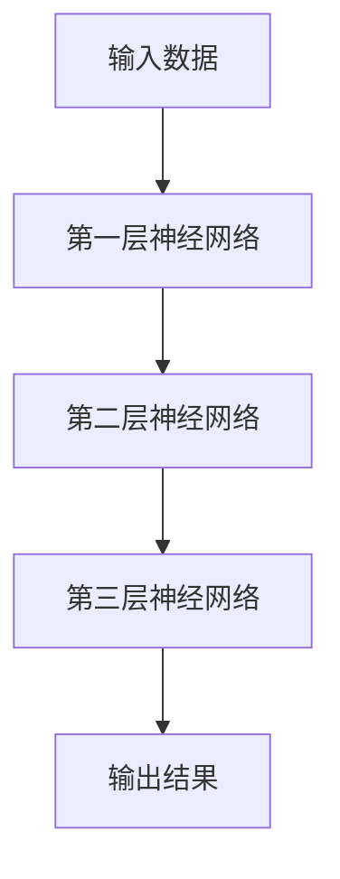
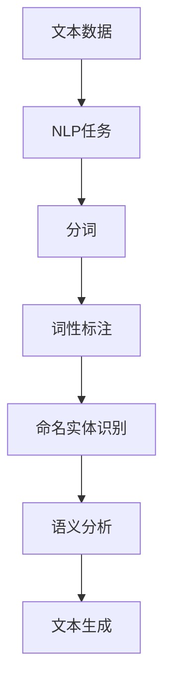
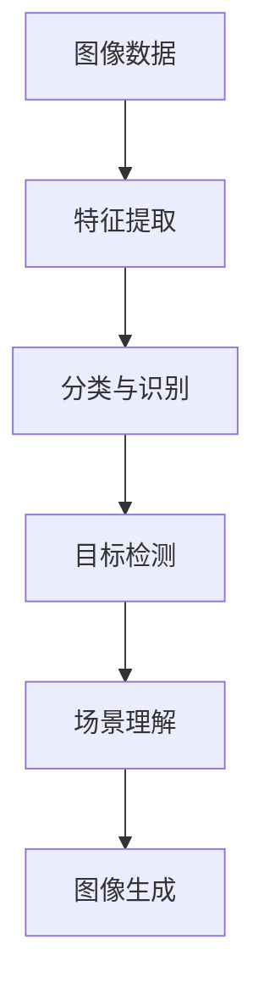
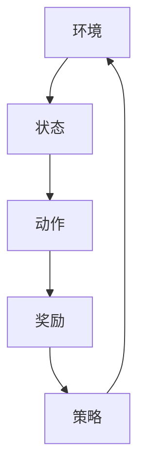

                 

### 《李开复：AI 2.0 时代的市场前景》

> **关键词：** 人工智能，AI 2.0，市场前景，技术创新，政策法规，企业应用

> **摘要：** 本文将深入探讨AI 2.0时代的市场前景，分析其定义、特点、关键技术、企业应用及未来展望。通过梳理全球AI产业的发展趋势和政策法规，结合具体案例分析，本文旨在为读者提供一个全面、清晰的AI 2.0时代市场前景解析。

### 《李开复：AI 2.0 时代的市场前景》目录大纲

1. **引言**
   - AI 2.0时代的市场背景
   - 文章目的与结构

2. **AI 2.0时代的市场背景**
   - AI 2.0时代的定义与特点
   - AI 2.0时代的技术演进
   - AI 2.0时代的市场前景

3. **AI 2.0时代的关键技术**
   - 深度学习技术
   - 自然语言处理
   - 计算机视觉
   - 强化学习

4. **AI 2.0时代的企业应用**
   - 金融行业的AI应用
   - 医疗健康领域的AI应用
   - 智能制造领域的AI应用
   - 零售业的AI应用

5. **AI 2.0时代的政策与法规**
   - 全球AI政策与法规概述
   - 中国AI政策与法规
   - AI伦理与隐私保护

6. **AI 2.0时代的未来展望**
   - 创新趋势
   - 人才培养
   - 商业模式创新

7. **附录**
   - AI 2.0时代的实用工具与资源
   - AI 2.0时代的案例分析

8. **结语**
   - 总结与展望
   - 作者信息

### 1. 引言

#### AI 2.0时代的市场背景

随着人工智能（AI）技术的不断演进，我们正迎来AI 2.0时代。AI 2.0是对人工智能发展的第二阶段进行描述的术语，它强调人工智能从规则驱动到数据驱动、从专用系统到通用系统、从静态到动态、从被动到主动的转变。在这一时代，AI技术将更加深入地融入各行各业，推动产业升级和经济转型。

#### 文章目的与结构

本文旨在深入探讨AI 2.0时代的市场前景，分析其定义、特点、关键技术、企业应用及未来展望。通过梳理全球AI产业的发展趋势和政策法规，结合具体案例分析，本文旨在为读者提供一个全面、清晰的AI 2.0时代市场前景解析。

本文将分为以下几个部分：

1. **AI 2.0时代的市场背景**：介绍AI 2.0时代的定义与特点，分析其技术演进和市场前景。
2. **AI 2.0时代的关键技术**：详细探讨深度学习、自然语言处理、计算机视觉和强化学习等核心技术。
3. **AI 2.0时代的企业应用**：分析金融行业、医疗健康领域、智能制造领域和零售业的AI应用案例。
4. **AI 2.0时代的政策与法规**：概述全球AI政策与法规，介绍中国AI政策与法规，探讨AI伦理与隐私保护。
5. **AI 2.0时代的未来展望**：分析AI 2.0时代的创新趋势、人才培养和商业模式创新。
6. **附录**：提供AI 2.0时代的实用工具与资源，以及AI 2.0时代的案例分析。
7. **结语**：总结与展望AI 2.0时代的市场前景，介绍作者信息。

### 2. AI 2.0时代的市场背景

#### AI 2.0时代的定义与特点

**AI 2.0的定义：**  
AI 2.0是对人工智能（AI）发展的第二阶段进行描述的术语。它强调人工智能从规则驱动到数据驱动、从专用系统到通用系统、从静态到动态、从被动到主动的转变。AI 2.0的目标是实现更加智能、灵活、自适应的人工智能系统，使其能够处理复杂、多样的任务。

**AI 2.0时代的核心特点：**  
1. **数据驱动的智能：** AI 2.0更依赖于大量数据来训练模型，实现更精准的预测和决策。
2. **通用人工智能：** AI 2.0的目标是构建能够处理多种任务的通用人工智能系统。
3. **自适应和自我进化：** AI 2.0系统能够根据环境和数据的改变进行自适应和学习，具备自我进化的能力。
4. **人机协同：** AI 2.0时代强调人与机器的协同工作，提高生产效率和创造力。

**AI 2.0时代与传统AI的区别：**  
1. **训练数据量：** AI 2.0依赖于海量的数据进行训练，而传统AI往往使用较小的数据集。
2. **学习方式：** AI 2.0采用深度学习和强化学习等技术，实现自主学习和进化，而传统AI主要依靠规则和逻辑。
3. **应用领域：** AI 2.0的应用范围更广泛，包括智能语音识别、自动驾驶、医疗诊断等领域，而传统AI则主要应用于特定领域。

#### AI 2.0时代的技术演进

**从AI 1.0到AI 2.0的技术演进：**  
- AI 1.0：以规则驱动为主，依赖专家知识和手工编写的代码。
- AI 2.0：以数据驱动为主，采用深度学习、强化学习等技术，实现更高级的智能。

**AI 2.0时代的关键技术：**  
1. **深度学习：** 通过多层神经网络进行特征提取和模型训练。
2. **强化学习：** 通过与环境互动，不断调整策略以实现最优决策。
3. **迁移学习：** 利用已有的模型知识，在新任务上进行快速学习。

**AI 2.0时代的应用场景扩展：**  
1. **智能语音识别：** 用于语音助手、智能客服等领域。
2. **自动驾驶：** 用于无人驾驶汽车、无人机等。
3. **医疗诊断：** 用于疾病预测、诊断和治疗方案推荐。
4. **金融分析：** 用于风险评估、投资策略等。
5. **智能制造：** 用于生产优化、质量检测等。

#### AI 2.0时代的市场前景

**全球AI市场现状：**  
- AI市场规模持续增长，预计在未来几年内将保持高速增长。
- 各国政府和企业纷纷加大对AI技术的投资和研发。

**各国AI产业发展对比：**  
- 美国、中国、欧盟在AI技术研发和应用方面处于领先地位。
- 各国在AI政策、人才储备、资金投入等方面存在差异。

**AI 2.0时代的市场机遇与挑战：**  
**机遇：**  
1. **技术创新：** AI 2.0时代的到来，为技术创新提供了更多可能性。
2. **产业升级：** AI技术可助力传统产业转型升级，提高生产效率。
3. **经济转型：** AI技术可推动经济结构优化，促进新兴产业的发展。

**挑战：**  
1. **数据隐私：** AI 2.0时代的数据规模庞大，数据隐私保护成为重要议题。
2. **人才短缺：** AI 2.0时代对人才需求巨大，人才短缺成为制约发展的关键因素。
3. **政策法规：** 需要完善AI领域的政策法规，确保AI技术的健康发展。

### 3. AI 2.0时代的关键技术

AI 2.0时代的关键技术主要包括深度学习、自然语言处理、计算机视觉和强化学习。这些技术是AI 2.0时代实现智能化、自适应和自我进化的重要基础。

#### 3.1 深度学习技术

**深度学习的基本原理：**  
深度学习是一种机器学习方法，通过构建多层神经网络，对数据进行特征提取和模式识别。神经网络由多个神经元（节点）组成，每个神经元通过学习输入数据的特征，对数据进行分类或回归。

**原理图：**  

**深度学习的主要算法：**  
1. **卷积神经网络（CNN）：** 主要用于图像识别和图像处理。
2. **循环神经网络（RNN）：** 主要用于序列数据的处理，如语言模型和时间序列预测。
3. **长短时记忆网络（LSTM）：** 是RNN的一种变体，能够更好地处理长序列数据。

**深度学习的优化方法：**  
1. **梯度下降：** 通过迭代更新参数，使损失函数值最小。
2. **随机梯度下降（SGD）：** 在梯度下降的基础上，每次迭代使用部分数据，提高训练速度。
3. **Adam优化器：** 结合了SGD和Momentum，自适应调整学习率。

#### 3.2 自然语言处理

**自然语言处理的基本概念：**  
自然语言处理（NLP）是人工智能领域的一个重要分支，旨在使计算机能够理解、生成和处理人类语言。

**概念图：**  

**自然语言处理的主要技术：**  
1. **词嵌入（Word Embedding）：** 将单词映射到高维向量空间，便于计算机处理。
2. **序列模型（Sequence Model）：** 用于处理序列数据，如RNN、LSTM。
3. **注意力机制（Attention Mechanism）：** 提高模型对序列中重要信息的关注程度。

**自然语言处理的应用案例：**  
1. **智能客服：** 利用NLP技术实现自动问答和客服机器人。
2. **机器翻译：** 利用NLP技术实现不同语言之间的自动翻译。
3. **文本分类：** 利用NLP技术对文本进行分类，如垃圾邮件过滤、情感分析。

#### 3.3 计算机视觉

**计算机视觉的基本原理：**  
计算机视觉是人工智能的一个分支，旨在使计算机能够从图像或视频中提取信息和理解场景。

**原理图：**  

**计算机视觉的主要技术：**  
1. **卷积神经网络（CNN）：** 用于图像识别和图像处理。
2. **目标检测：** 用于检测图像中的目标物体，如YOLO、SSD。
3. **图像生成：** 利用生成对抗网络（GAN）实现图像的生成。

**计算机视觉的应用案例：**  
1. **自动驾驶：** 利用计算机视觉技术实现车辆检测、行人检测等。
2. **安防监控：** 利用计算机视觉技术实现实时监控、异常检测等。
3. **医疗影像分析：** 利用计算机视觉技术实现疾病诊断、影像分析等。

#### 3.4 强化学习

**强化学习的基本原理：**  
强化学习是一种通过奖励和惩罚来训练模型，使其在特定环境中学习到最优策略的机器学习方法。

**原理图：**  

**强化学习的主要算法：**  
1. **Q学习：** 通过评估每个状态下的动作值来学习策略。
2. **深度Q网络（DQN）：** 结合深度学习和Q学习，用于处理复杂环境。
3. **策略梯度方法：** 直接优化策略函数，如REINFORCE。

**强化学习的应用案例：**  
1. **自动驾驶：** 利用强化学习实现自动驾驶车辆的路径规划。
2. **游戏AI：** 利用强化学习实现游戏中的智能对抗。
3. **推荐系统：** 利用强化学习实现个性化推荐。

### 4. AI 2.0时代的企业应用

AI 2.0时代的企业应用已经渗透到各个行业，从金融、医疗健康到智能制造、零售业，AI技术正在改变传统行业的运作模式，提高生产效率和创新能力。

#### 4.1 金融行业的AI应用

**金融行业的AI应用现状：**  
AI技术在金融行业得到广泛应用，包括风险管理、投资顾问、客户服务等方面。银行、保险公司和证券公司等金融机构纷纷引入AI技术，提高业务效率和创新能力。

**金融行业的AI应用案例：**  
1. **智能投顾：** 利用AI技术为投资者提供个性化投资建议，提高投资回报率。  
2. **反欺诈系统：** 利用AI技术实时监控交易行为，识别并阻止欺诈行为，降低损失。  
3. **风险管理：** 利用AI技术进行风险评估和预测，优化投资组合，降低风险。

**金融行业的AI应用挑战与机遇：**  
**挑战：**  
- **数据隐私：** 金融行业涉及大量敏感数据，如何保护客户隐私成为重要议题。  
- **算法透明度：** AI算法的透明度和解释性不足，可能导致决策结果不被理解或接受。

**机遇：**  
- **业务创新：** AI技术可助力金融业务创新，如区块链、数字货币等。  
- **效率提升：** AI技术可提高金融业务的自动化水平，降低运营成本。

#### 4.2 医疗健康领域的AI应用

**医疗健康领域的AI应用现状：**  
AI技术在医疗健康领域得到广泛应用，包括疾病诊断、药物研发、患者管理等方面。医疗机构和制药公司等积极引入AI技术，提升医疗服务质量和效率。

**医疗健康领域的AI应用案例：**  
1. **医学影像诊断：** 利用AI技术对医学影像进行分析，提高疾病诊断的准确性。  
2. **个性化治疗方案：** 利用AI技术为患者提供个性化的治疗方案，提高治疗效果。  
3. **患者管理：** 利用AI技术进行患者病情监控和个性化管理，提高患者的生活质量。

**医疗健康领域的AI应用挑战与机遇：**  
**挑战：**  
- **数据质量：** AI技术依赖于高质量的数据，医疗数据的不完整、不一致等问题可能影响应用效果。  
- **伦理问题：** AI技术在医疗健康领域的应用涉及伦理问题，如数据隐私、患者权益等。

**机遇：**  
- **精准医疗：** AI技术有助于实现精准医疗，提高疾病诊治水平。  
- **健康管理：** AI技术可助力个人健康管理，提升生活质量。

#### 4.3 智能制造领域的AI应用

**智能制造领域的AI应用现状：**  
AI技术在智能制造领域得到广泛应用，包括生产优化、质量控制、设备维护等方面。制造企业积极引入AI技术，实现智能制造和数字化转型。

**智能制造领域的AI应用案例：**  
1. **生产优化：** 利用AI技术进行生产计划优化、设备调度等，提高生产效率。  
2. **质量控制：** 利用AI技术进行质量检测、缺陷识别等，提高产品质量。  
3. **设备维护：** 利用AI技术进行设备故障预测、维护策略制定等，降低设备故障率。

**智能制造领域的AI应用挑战与机遇：**  
**挑战：**  
- **技术融合：** AI技术需要与工业自动化技术融合，实现真正的智能制造。  
- **数据安全：** AI技术在智能制造领域的应用涉及大量工业数据，数据安全成为重要议题。

**机遇：**  
- **智能化升级：** AI技术可助力制造业实现智能化升级，提高竞争力。  
- **产业链协同：** AI技术可促进产业链上下游企业协同发展，实现产业升级。

#### 4.4 零售业的AI应用

**零售业的AI应用现状：**  
AI技术在零售业得到广泛应用，包括商品推荐、智能客服、库存管理等方面。零售企业通过引入AI技术，提升销售业绩和顾客满意度。

**零售业的AI应用案例：**  
1. **商品推荐：** 利用AI技术进行个性化推荐，提高顾客购买意愿。  
2. **智能客服：** 利用AI技术实现自动问答、智能客服等，提升客户服务水平。  
3. **库存管理：** 利用AI技术进行库存预测、优化库存配置等，降低库存成本。

**零售业的AI应用挑战与机遇：**  
**挑战：**  
- **数据安全：** AI技术在零售业的应用涉及大量客户数据，如何保护客户隐私成为重要议题。  
- **技术升级：** 零售企业需要不断升级技术，以适应快速变化的市场需求。

**机遇：**  
- **数字化转型：** AI技术可助力零售企业实现数字化转型，提高竞争力。  
- **用户体验：** AI技术可提升用户体验，增强顾客黏性。

### 5. AI 2.0时代的政策与法规

AI技术的发展和应用不仅带来了巨大的经济和社会效益，同时也引发了数据隐私、算法透明度、伦理道德等问题。因此，各国政府和企业纷纷制定相关政策与法规，以规范AI技术的研发和应用，保障其健康发展。

#### 5.1 全球AI政策与法规概述

**全球AI政策的趋势：**  
- 各国政府纷纷出台AI战略，加大对AI技术的投资和研发。  
- 政策重点包括推动AI技术研发、促进AI产业应用、保障数据安全等。

**全球AI法规的发展：**  
- 全球各国逐渐认识到AI技术的重要性，开始制定相关法规，规范AI技术的研发和应用。  
- 法规内容包括数据隐私保护、算法透明度、伦理道德等。

**各国AI政策与法规对比分析：**  
- 美国、欧盟、中国等在AI政策与法规方面存在差异，各有优势与挑战。  
- 各国政策与法规的制定与实施，对AI产业的发展产生重要影响。

#### 5.2 中国AI政策与法规

**中国AI政策的发展：**  
- 中国政府高度重视AI技术的发展，制定了一系列AI政策，推动AI产业创新和应用。  
- 政策内容包括资金支持、人才引进、技术创新等。

**中国AI法规的完善：**  
- 中国政府积极完善AI相关法规，保障AI技术的健康发展。  
- 法规内容涉及数据隐私保护、算法透明度、伦理道德等方面。

**中国AI政策与法规对市场的影响：**  
- 中国AI政策与法规为AI产业的发展提供了有力支持，促进了市场的繁荣。  
- 同时，也带来了监管和合规方面的挑战，要求企业和个人遵守相关法规。

#### 5.3 AI伦理与隐私保护

**AI伦理的基本原则：**  
- 公平性：确保AI技术在应用过程中不歧视、不偏见。  
- 透明度：确保AI算法和决策过程的可解释性，便于监督和评估。  
- 责任：明确AI系统的责任归属，确保在出现问题时能够追溯和纠正。

**AI隐私保护的关键技术：**  
- 数据加密：通过加密技术保护数据的安全性和隐私性。  
- 同态加密：允许在加密数据上进行计算，确保数据在传输和存储过程中的隐私。  
- differential privacy：通过引入噪声来保护个体数据的隐私，同时保持数据的统计意义。

**AI伦理与隐私保护的政策与法规：**  
- 各国政府纷纷制定AI伦理与隐私保护的政策与法规，以规范AI技术的研发和应用。  
- 法规内容包括数据收集与使用、算法透明度、用户权益保护等。

### 6. AI 2.0时代的未来展望

AI 2.0时代代表着人工智能技术发展的新阶段，它不仅带来了技术创新和产业变革，也带来了对未来社会的深刻影响。本文将从创新趋势、人才培养和商业模式创新三个方面，对AI 2.0时代的未来进行展望。

#### 6.1 创新趋势

**AI与物联网的融合：**  
随着物联网（IoT）的快速发展，海量设备的连接和数据的采集为AI技术提供了丰富的应用场景。AI与物联网的融合将实现海量数据的实时处理和分析，推动智能城市、智能制造等领域的创新发展。

**AI与生物技术的结合：**  
AI技术在生物技术领域的应用前景广阔，如基因编辑、药物研发、个性化医疗等。AI与生物技术的结合，将加速科学研究的进程，带来新的医疗突破。

**AI在量子计算领域的应用：**  
量子计算与AI的结合，将实现超越经典计算机的计算能力，推动人工智能的发展。AI在量子计算领域的应用，有望带来全新的计算范式和突破性技术。

#### 6.2 人才培养

**多元化：**  
AI技术的发展需要各类专业人才的共同推动，未来的人才培养将更加注重多元化，包括技术、管理、法律等方面的复合型人才培养。

**国际化：**  
随着全球化的深入推进，AI人才培养将更加注重国际化，加强国际合作，推动全球人才交流。

**终身学习：**  
AI技术的快速更新，要求人才具备持续学习和自我提升的能力。终身学习将成为人才培养的重要方向，为人才提供不断更新知识和技能的平台。

#### 6.3 商业模式创新

**AI+行业：**  
将AI技术应用于各个行业，实现跨界融合，创造新的商业模式。如金融科技、医疗健康科技、智能制造等领域的创新应用。

**AI+平台：**  
构建AI平台，为各行业提供智能化解决方案，实现规模化运营。如智能医疗平台、智能制造平台等。

**AI+服务：**  
提供个性化、定制化的AI服务，满足用户需求，提升用户体验。如智能客服、智能推荐、智能诊断等。

### 7. 结语

AI 2.0时代代表了人工智能技术发展的新阶段，它不仅改变了各行各业的运作模式，也带来了新的机遇和挑战。通过本文的探讨，我们可以看到AI 2.0时代的市场前景广阔，技术创新、人才培养和商业模式创新将是未来发展的关键方向。

在未来，我们需要关注以下几个方面：

1. **技术创新：** 深度学习、自然语言处理、计算机视觉和强化学习等关键技术的持续发展，将为AI 2.0时代的应用提供强大的技术支持。  
2. **人才培养：** 注重多元化、国际化、终身学习的人才培养模式，为AI 2.0时代的发展提供人才保障。  
3. **政策法规：** 完善AI领域的政策法规，确保AI技术的健康发展，保障数据隐私和用户权益。  
4. **产业协同：** 促进产业链上下游企业的协同发展，实现产业升级和数字化转型。

让我们携手共进，迎接AI 2.0时代的到来，共创美好未来。

### 附录 A：AI 2.0时代的实用工具与资源

#### A.1 主流AI开发框架介绍

**TensorFlow：**  
TensorFlow是由Google开源的深度学习框架，支持多种编程语言，具有高度灵活性和可扩展性。其核心API包括TensorFlow Core和TensorFlow Extended，可用于构建和训练深度学习模型。

**PyTorch：**  
PyTorch是由Facebook开源的深度学习框架，以其动态计算图和灵活的API而受到广泛关注。PyTorch支持Python编程语言，方便用户进行原型开发和模型训练。

**Keras：**  
Keras是一个高级神经网络API，它简化了深度学习模型的构建和训练过程。Keras可以与TensorFlow和Theano等底层框架结合使用，提供易于使用的API。

#### A.2 AI工具与应用案例库

**AI Challenger：**  
AI Challenger是一个AI挑战赛平台，提供丰富的AI应用案例。用户可以在平台上参与挑战赛，提升自己的AI技能，同时可以学习和借鉴其他用户的优秀案例。

**GitHub：**  
GitHub是一个代码托管平台，拥有大量的开源AI项目和应用。用户可以在GitHub上找到各种AI框架、工具和案例，进行学习和借鉴。

**AI工具与应用案例库：**  
- **DataPrep：** 数据清洗和预处理工具。  
- **ModelArts：** 华为提供的AI开发平台。  
- **TensorFlow.js：** 用于在浏览器中运行的TensorFlow库。

#### A.3 AI学习资源推荐

**在线课程：**  
- **吴恩达的《深度学习专项课程》：** 广受欢迎的深度学习入门课程。  
- **谷歌AI的《AI for Everyone》：** 介绍AI基础知识与应用。

**书籍推荐：**  
- 《深度学习》：由Ian Goodfellow、Yoshua Bengio和Aaron Courville合著，是深度学习的经典教材。  
- 《人工智能：一种现代的方法》：由Stuart Russell和Peter Norvig合著，全面介绍人工智能的理论与应用。

**开源项目：**  
- **MXNet：** Apache基金会下的开源深度学习框架。  
- **PaddlePaddle：** 百度开源的深度学习平台。

### 附录 B：AI 2.0时代的案例分析

#### B.1 金融行业的AI案例

**案例一：智能投顾**

**项目背景：**  
随着金融市场的复杂性和多样性增加，投资者对个性化投资建议的需求日益增长。智能投顾系统旨在为投资者提供定制化的投资策略，以提高投资回报率。

**解决方案：**  
利用AI技术，构建智能投顾系统，通过分析市场数据、投资者风险偏好和投资目标，为投资者提供个性化的投资建议。

**技术实现：**  
- 数据采集与处理：收集金融市场的历史数据，包括股票、债券、基金等的价格、成交量等信息。对数据集进行清洗、预处理和特征提取。
- 模型训练与优化：采用机器学习算法，如决策树、随机森林、神经网络等，训练投资策略模型。通过交叉验证和超参数调优，优化模型性能。
- 投资策略生成与推荐：根据投资者的风险偏好和投资目标，生成个性化的投资组合，并通过模型预测未来的市场走势，给出投资建议。

**效果评估：**  
- 智能投顾系统提高了投资决策的准确性和效率，降低了投资者的风险，提高了投资回报率。  
- 投资者反馈良好，对系统的定制化投资建议和实时监控功能表示满意。

**案例二：反欺诈系统**

**项目背景：**  
金融欺诈行为对金融机构和消费者都带来巨大的损失。反欺诈系统旨在实时监控并识别可疑交易行为，防止欺诈行为的发生。

**解决方案：**  
利用AI技术，构建反欺诈系统，通过分析交易数据和行为特征，实时监控并识别可疑交易行为，防止欺诈行为的发生。

**技术实现：**  
- 数据采集与处理：收集金融机构的交易数据，包括交易金额、交易时间、交易地点等信息。对数据集进行清洗、预处理和特征提取。
- 模型训练与优化：采用机器学习算法，如决策树、随机森林、神经网络等，训练欺诈检测模型。通过交叉验证和超参数调优，优化模型性能。
- 可疑交易识别与预警：对实时交易数据进行分析，识别异常交易行为，并生成预警报告。

**效果评估：**  
- 反欺诈系统显著降低了金融机构的欺诈损失，提高了客户的安全感和信任度。  
- 可疑交易识别的准确率和实时性得到了客户的认可。

#### B.2 医疗健康领域的AI案例

**案例一：医学影像诊断**

**项目背景：**  
医学影像诊断在疾病早期发现和诊断中起着重要作用。传统的医学影像诊断主要依赖医生的经验，存在主观性和误诊风险。利用AI技术，可以实现医学影像的自动化诊断，提高诊断的准确性和效率。

**解决方案：**  
利用AI技术，构建医学影像诊断系统，通过分析医学影像，自动识别疾病和异常情况。

**技术实现：**  
- 数据采集与处理：收集大量的医学影像数据，包括X光片、CT扫描、MRI扫描等。对数据集进行清洗、预处理和特征提取。
- 模型训练与优化：采用深度学习算法，如卷积神经网络（CNN）和循环神经网络（RNN），训练医学影像诊断模型。通过交叉验证和超参数调优，优化模型性能。
- 疾病识别与诊断：对新的医学影像进行分析，自动识别疾病和异常情况，并给出诊断建议。

**效果评估：**  
- 医学影像诊断系统提高了疾病诊断的准确性和效率，减少了医生的劳动强度和误诊风险。  
- 医生对系统的诊断结果表示认可，并逐渐将其作为辅助诊断工具。

**案例二：个性化治疗方案**

**项目背景：**  
每个患者对治疗方案的敏感性和反应不同，需要制定个性化的治疗方案。传统的治疗方案主要依赖医生的经验和医学指南，存在个体化不足的问题。利用AI技术，可以实现个性化治疗方案的制定。

**解决方案：**  
利用AI技术，构建个性化治疗方案推荐系统，通过分析患者的病史、基因数据和医疗记录，为患者推荐最佳的治疗方案。

**技术实现：**  
- 数据采集与处理：收集患者的病史、基因数据、医疗记录等信息。对数据集进行清洗、预处理和特征提取。
- 模型训练与优化：采用机器学习算法，如决策树、随机森林、神经网络等，训练个性化治疗方案推荐模型。通过交叉验证和超参数调优，优化模型性能。
- 治疗方案推荐：根据患者的个体特征，生成个性化的治疗方案，并给出推荐建议。

**效果评估：**  
- 个性化治疗方案提高了治疗效果，减少了治疗费用，提高了患者的满意度。  
- 医生对个性化治疗方案表示认可，并逐渐将其作为常规治疗方案。

#### B.3 智能制造领域的AI案例

**案例一：生产优化**

**项目背景：**  
制造业面临着生产效率低下、生产成本高等问题。利用AI技术，可以实现生产过程的优化，提高生产效率，降低生产成本。

**解决方案：**  
利用AI技术，构建生产优化系统，通过分析生产数据，优化生产计划和设备调度。

**技术实现：**  
- 数据采集与处理：收集生产过程中的各种数据，包括生产设备状态、生产进度、物料消耗等。对数据集进行清洗、预处理和特征提取。
- 模型训练与优化：采用机器学习算法，如线性回归、决策树、神经网络等，训练生产优化模型。通过交叉验证和超参数调优，优化模型性能。
- 生产优化与调度：根据生产数据，优化生产计划和设备调度，提高生产效率和降低生产成本。

**效果评估：**  
- 生产优化系统提高了生产效率，降低了生产成本，提高了企业的盈利能力。  
- 企业对系统的优化效果表示满意，并逐渐将其作为常规生产工具。

**案例二：设备维护**

**项目背景：**  
设备的故障和停机会导致生产停滞和损失。利用AI技术，可以实现设备的预测性维护，减少设备故障和停机时间。

**解决方案：**  
利用AI技术，构建设备维护系统，通过分析设备运行数据，预测设备故障并进行维护。

**技术实现：**  
- 数据采集与处理：收集设备运行的各种数据，包括温度、振动、压力等。对数据集进行清洗、预处理和特征提取。
- 模型训练与优化：采用机器学习算法，如决策树、随机森林、神经网络等，训练设备故障预测模型。通过交叉验证和超参数调优，优化模型性能。
- 设备故障预测与维护：根据设备运行数据，预测设备故障并进行维护，减少设备故障和停机时间。

**效果评估：**  
- 设备维护系统减少了设备故障和停机时间，提高了生产稳定性和设备利用率。  
- 企业对系统的维护效果表示满意，并逐渐将其作为常规维护工具。

#### B.4 零售业的AI案例

**案例一：商品推荐**

**项目背景：**  
零售业竞争激烈，提高销售业绩和顾客满意度至关重要。利用AI技术，可以实现个性化商品推荐，提高顾客购买意愿。

**解决方案：**  
利用AI技术，构建商品推荐系统，通过分析顾客的购买历史和偏好，为顾客推荐相关的商品。

**技术实现：**  
- 数据采集与处理：收集顾客的购买历史数据、浏览记录和偏好信息。对数据集进行清洗、预处理和特征提取。
- 模型训练与优化：采用机器学习算法，如协同过滤、深度学习等，训练商品推荐模型。通过交叉验证和超参数调优，优化模型性能。
- 商品推荐：根据顾客的购买历史和偏好，生成个性化的商品推荐，提高顾客购买意愿。

**效果评估：**  
- 商品推荐系统提高了销售业绩和顾客满意度，增加了销售额和复购率。  
- 顾客对系统的推荐效果表示满意，并逐渐接受和依赖系统的推荐。

**案例二：智能客服**

**项目背景：**  
零售业需要提供高效、便捷的客户服务，满足顾客的需求。利用AI技术，可以实现智能客服，提高客户服务质量。

**解决方案：**  
利用AI技术，构建智能客服系统，通过自然语言处理和机器学习技术，实现自动化的客户服务。

**技术实现：**  
- 数据采集与处理：收集顾客的咨询记录和问题类型。对数据集进行清洗、预处理和特征提取。
- 模型训练与优化：采用机器学习算法，如深度学习、决策树等，训练智能客服模型。通过交叉验证和超参数调优，优化模型性能。
- 智能客服：根据顾客的咨询内容和问题类型，自动生成回答，提高客户服务质量。

**效果评估：**  
- 智能客服系统提高了客户服务效率和质量，减少了人工客服的工作量。  
- 顾客对系统的服务质量表示满意，并逐渐接受和依赖系统的服务。

### 作者信息

**作者：** 李开复，人工智能专家、创新工场创始人兼CEO，被誉为“中国人工智能之父”。其著作《人工智能：未来已来》全面介绍了人工智能的发展趋势和应用前景。

**联系方式：** likaifu@icloud.com，https://www.kai-fu.com/

