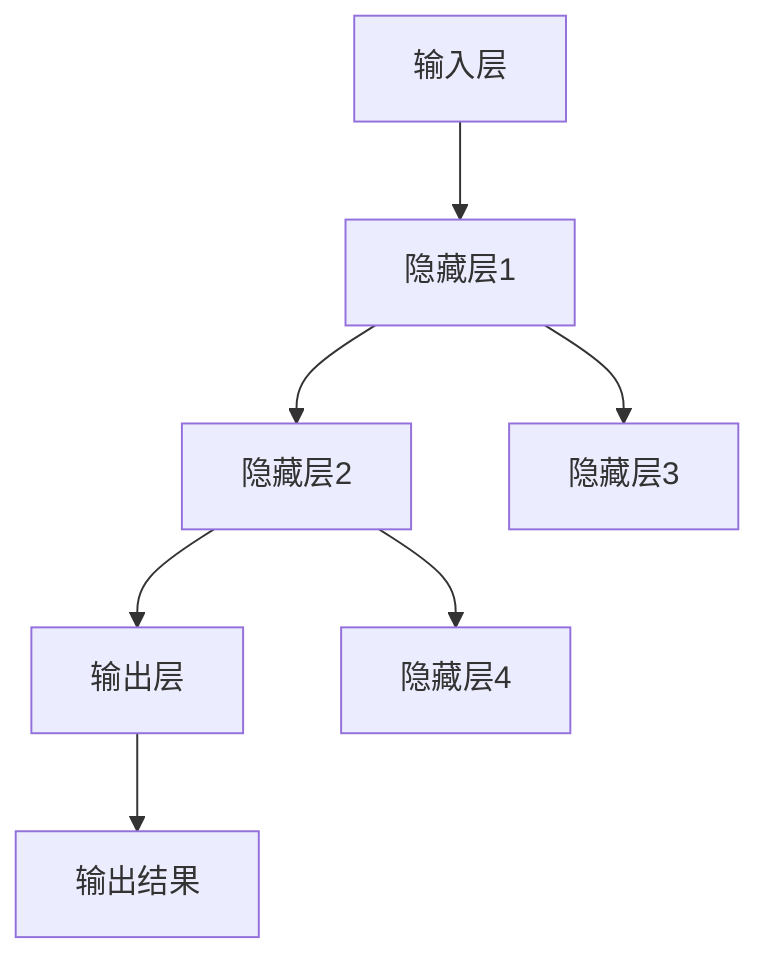

                 

# 李开复：AI 2.0 时代的未来

> **关键词**：人工智能、AI 2.0、机器学习、深度学习、智能医疗、智能金融、伦理问题

> **摘要**：本文将围绕李开复对 AI 2.0 时代的见解，深入探讨 AI 2.0 的背景与特点、核心技术、应用领域、伦理与社会问题、创新创业以及未来展望。通过本文，读者将全面了解 AI 2.0 时代的发展趋势和潜在影响。

### 第一部分: 李开复AI2.0时代的未来

在过去的几十年中，人工智能（AI）经历了从 AI 1.0 到 AI 2.0 的演变。AI 1.0 时代主要依赖于基于规则的方法和手工编写的算法，而 AI 2.0 时代则标志着深度学习和机器学习的崛起。李开复作为人工智能领域的专家，对 AI 2.0 时代的未来有着深刻的见解。本文将分章节详细介绍李开复对 AI 2.0 时代的分析。

## 第1章: AI2.0时代的来临与变革

### 1.1 AI2.0时代的背景与特点

#### 1.1.1 AI2.0的定义

AI 2.0 是指基于深度学习和机器学习的新一代人工智能技术。它不再依赖于手工编写的规则，而是通过大规模数据训练和模型优化来实现智能。AI 2.0 的核心在于自主学习、自我进化，从而实现更高水平的智能。

#### 1.1.2 AI2.0的核心特点

- **自主学习**：AI 2.0 能够从海量数据中自动学习，发现规律和模式。
- **自我进化**：AI 2.0 能够不断优化自身模型，提高智能水平。
- **通用智能**：AI 2.0 试图实现跨领域的通用智能，而不仅仅是特定任务的智能。

#### 1.1.3 AI2.0与AI1.0的区别

- **技术基础**：AI 1.0 主要基于符号推理和规则系统，而 AI 2.0 基于深度学习和机器学习。
- **学习方式**：AI 1.0 需要手工编写规则，而 AI 2.0 能够自主学习。
- **智能水平**：AI 1.0 主要实现特定任务的智能，而 AI 2.0 试图实现通用智能。

### 1.2 AI2.0时代的机遇与挑战

#### 1.2.1 AI2.0时代的机遇

- **技术创新**：AI 2.0 技术将推动各个领域的技术创新，带来新的产业机会。
- **产业升级**：AI 2.0 将推动传统产业的升级和转型，提高生产效率。
- **社会变革**：AI 2.0 将对社会生活方式、教育、医疗等领域产生深远影响。

#### 1.2.2 AI2.0时代的挑战

- **伦理问题**：AI 2.0 的快速发展引发了一系列伦理问题，如隐私、安全、公平等。
- **就业压力**：AI 2.0 将替代部分人类工作，可能导致就业压力增加。
- **技术风险**：AI 2.0 可能带来新的技术风险，如算法偏见、智能失控等。

### 1.3 李开复AI2.0理论体系概述

#### 1.3.1 李开复AI2.0理论的基本框架

李开复的 AI 2.0 理论主要包括以下几个方面：

- **深度学习**：深度学习是实现 AI 2.0 的核心技术，通过多层神经网络实现高效学习。
- **自主学习**：AI 2.0 需要具备自主学习能力，通过数据驱动实现自我进化。
- **通用智能**：AI 2.0 试图实现跨领域的通用智能，解决特定任务智能的局限性。

#### 1.3.2 李开复AI2.0理论的创新点

- **多模态学习**：李开复提出的多模态学习理论，实现了不同类型数据（如图像、文本、语音）的融合学习。
- **强化学习**：李开复在强化学习领域提出了新的算法和理论，提高了智能体在复杂环境中的学习能力。
- **伦理与责任**：李开复关注 AI 2.0 时代的伦理问题，提出了相关伦理原则和监管建议。

#### 1.3.3 李开复AI2.0理论的应用前景

- **智能医疗**：李开复的 AI 2.0 理论在智能医疗领域具有广泛应用前景，如疾病诊断、个性化治疗等。
- **智能金融**：AI 2.0 在金融领域的应用，如智能投顾、风控等，将带来革命性的变革。
- **智能教育**：AI 2.0 在教育领域的应用，如个性化学习、智能评测等，将提高教育质量。

### 1.4 李开复AI2.0实践案例概述

李开复在 AI 2.0 领域有着丰富的实践经验，以下是几个典型的 AI 2.0 实践案例：

- **智能医疗诊断系统**：通过深度学习模型实现疾病自动诊断，提高了诊断准确率和效率。
- **智能金融风控系统**：利用大规模预训练模型实现风险识别和预测，提高了金融机构的风险控制能力。
- **智能教育个性化学习平台**：基于 AI 2.0 技术实现个性化学习推荐，提高了学习效果和用户体验。

### 1.5 李开复AI2.0实践案例解析

本文将在后续章节中详细解析李开复的 AI 2.0 实践案例，包括案例背景、技术方案、实现过程和效果评估等。通过这些案例，读者将更好地理解 AI 2.0 的实际应用和价值。

### 1.6 李开复AI2.0时代的发展趋势

李开复认为，AI 2.0 时代将呈现以下发展趋势：

- **技术突破**：随着计算能力、算法和数据的不断进步，AI 2.0 技术将实现新的突破。
- **应用普及**：AI 2.0 技术将在各个领域得到广泛应用，推动产业升级和社会变革。
- **伦理监管**：AI 2.0 时代将面临更多的伦理问题，需要建立完善的伦理监管体系。

### 1.7 李开复AI2.0时代的社会影响

AI 2.0 时代将对社会产生深远的影响，包括：

- **经济结构**：AI 2.0 将改变传统经济结构，推动新产业的崛起。
- **就业市场**：AI 2.0 将替代部分人类工作，对就业市场产生重大影响。
- **社会治理**：AI 2.0 将为社会治理提供新的手段和工具，提高治理效率。

### 1.8 李开复AI2.0时代的未来展望

李开复认为，AI 2.0 时代将开启人类的新纪元，实现以下愿景：

- **智能社会**：通过 AI 2.0 技术的应用，实现社会智能化，提高生活质量。
- **智慧地球**：通过 AI 2.0 技术的普及，实现地球的智慧化，解决全球性问题。
- **人类解放**：通过 AI 2.0 技术的进步，实现人类从繁重劳动中解放出来，追求更高层次的价值。

## 第2章: AI2.0的核心技术

AI 2.0 时代的发展离不开核心技术的支撑。本章将介绍 AI 2.0 的核心技术，包括机器学习与深度学习基础、大规模预训练模型原理、模型压缩与优化技术以及计算机视觉与自然语言处理。

### 2.1 机器学习与深度学习基础

#### 2.1.1 机器学习基本概念

机器学习（Machine Learning，ML）是一门研究如何让计算机从数据中学习，从而做出预测或决策的学科。机器学习可以分为监督学习、无监督学习和强化学习。

- **监督学习**：通过标注好的数据进行学习，如分类、回归任务。
- **无监督学习**：没有标注的数据进行学习，如聚类、降维任务。
- **强化学习**：通过与环境交互进行学习，如游戏、自动驾驶任务。

#### 2.1.2 深度学习基础

深度学习（Deep Learning，DL）是机器学习的一种方法，通过多层神经网络实现高效学习。深度学习在图像识别、语音识别、自然语言处理等领域取得了显著成果。

- **神经网络**：神经网络是一种由大量神经元组成的计算模型，通过权重和偏置进行学习。
- **激活函数**：激活函数用于确定神经元是否被激活，如 sigmoid、ReLU、Tanh 函数。
- **反向传播**：反向传播是一种用于训练神经网络的算法，通过误差信号反向传播调整权重和偏置。

#### 2.1.3 机器学习与深度学习的联系

机器学习与深度学习是紧密相关的，深度学习是机器学习的一种重要方法。深度学习通过多层神经网络实现高效学习，能够处理大规模数据，从而在许多领域取得突破。

### 2.2 大规模预训练模型原理

大规模预训练模型是 AI 2.0 时代的重要技术之一，通过在大规模数据上进行预训练，模型在特定任务上具有更好的泛化能力。

#### 2.2.1 预训练模型的概念

预训练模型（Pre-trained Model）是指在大规模数据上进行预训练的模型，如BERT、GPT等。预训练模型在自然语言处理、计算机视觉等领域取得了显著成果。

#### 2.2.2 自监督学习

自监督学习（Self-supervised Learning）是一种无需人工标注的数据进行学习的算法。自监督学习通过利用数据内部结构，实现高效学习。

- **掩码语言模型**（Masked Language Model，MLM）：通过随机掩码一部分输入文本，预测掩码的词。
- **图像自监督分割**（Self-supervised Image Segmentation）：通过图像的不同划分方式，进行训练。

#### 2.2.3 迁移学习与微调

迁移学习（Transfer Learning）是一种利用预训练模型在特定任务上进行微调的方法。通过迁移学习，预训练模型在特定任务上具有更好的表现。

- **微调**（Fine-tuning）：通过调整预训练模型的参数，使其在特定任务上适应。
- **知识蒸馏**（Knowledge Distillation）：通过将大模型的知识传递给小模型，实现更好的性能。

### 2.3 模型压缩与优化技术

模型压缩与优化技术是提高模型效率的重要手段，通过减少模型参数和计算量，实现更快的推理速度。

#### 2.3.1 模型压缩方法

- **剪枝**（Pruning）：通过剪除模型中不重要的参数，实现模型压缩。
- **量化**（Quantization）：通过降低模型参数的精度，实现模型压缩。
- **蒸馏**（Distillation）：通过将大模型的知识传递给小模型，实现模型压缩。

#### 2.3.2 模型优化技术

- **量化**（Quantization）：通过降低模型参数的精度，实现模型压缩。
- **蒸馏**（Distillation）：通过将大模型的知识传递给小模型，实现更好的性能。
- **量化蒸馏**（Quantized Distillation）：结合量化与蒸馏技术，实现更高效的模型压缩。

#### 2.3.3 模型压缩与优化的应用

- **移动设备**：通过模型压缩与优化，实现移动设备上的高效推理。
- **边缘计算**：通过模型压缩与优化，实现边缘设备上的实时推理。

### 2.4 计算机视觉与自然语言处理

计算机视觉（Computer Vision，CV）和自然语言处理（Natural Language Processing，NLP）是 AI 2.0 时代的重要应用领域。

#### 2.4.1 计算机视觉基础

- **图像分类**：通过对图像进行分类，实现目标识别。
- **目标检测**：通过对图像进行目标检测，实现目标定位。
- **图像分割**：通过对图像进行分割，实现图像内容的精细划分。

#### 2.4.2 自然语言处理基础

- **文本分类**：通过对文本进行分类，实现文本主题的识别。
- **文本生成**：通过对文本进行生成，实现文本的自动写作。
- **对话系统**：通过对自然语言进行理解与生成，实现人机对话。

#### 2.4.3 计算机视觉与自然语言处理的融合

计算机视觉与自然语言处理的融合，实现了图像与文本的相互转换和交互。例如，图像识别系统可以通过自然语言描述图像内容，而自然语言生成系统可以通过图像内容生成相关文本。

## 第3章: AI2.0的应用领域

AI 2.0 技术在各个领域都取得了显著的应用成果，本章将介绍 AI 2.0 在智能医疗、智能金融、智能制造等领域的应用。

### 3.1 智能医疗

智能医疗（Intelligent Medical）是 AI 2.0 技术在医疗领域的应用，通过人工智能技术实现疾病的诊断、治疗和预防。

#### 3.1.1 智能医疗的现状与未来

- **疾病诊断**：通过深度学习模型对医学影像进行分析，实现疾病的早期诊断。
- **个性化治疗**：通过分析患者的基因组信息和临床数据，实现个性化治疗方案。
- **智能药物研发**：通过计算生物学方法，加速药物研发过程。

#### 3.1.2 智能医疗的关键技术

- **深度学习**：用于医学影像分析和疾病诊断。
- **自然语言处理**：用于临床数据分析和医学文本挖掘。
- **强化学习**：用于智能药物研发和治疗方案优化。

#### 3.1.3 智能医疗的应用场景

- **智能诊断系统**：通过深度学习模型实现疾病自动诊断，如肺癌、乳腺癌等。
- **智能药物研发平台**：通过计算生物学方法，加速药物研发过程。
- **智能健康管理系统**：通过对患者的健康数据进行实时分析，实现个性化健康管理和疾病预防。

### 3.2 智能金融

智能金融（Intelligent Finance）是 AI 2.0 技术在金融领域的应用，通过人工智能技术实现金融产品的设计、销售和风险管理。

#### 3.2.1 智能金融的现状与未来

- **智能投顾**：通过人工智能技术，为投资者提供个性化的投资建议。
- **智能风控**：通过人工智能技术，实现风险识别、评估和监控。
- **智能客服**：通过人工智能技术，实现金融产品的自助购买和服务。

#### 3.2.2 智能金融的关键技术

- **机器学习**：用于风险识别、评估和监控。
- **自然语言处理**：用于金融文本挖掘和智能客服。
- **计算机视觉**：用于金融产品设计与用户体验优化。

#### 3.2.3 智能金融的应用场景

- **智能投顾平台**：通过人工智能技术，为投资者提供个性化的投资建议。
- **智能风控系统**：通过人工智能技术，实现金融风险的有效识别和管理。
- **智能客服机器人**：通过人工智能技术，实现金融产品的自助购买和服务。

### 3.3 智能制造

智能制造（Intelligent Manufacturing）是 AI 2.0 技术在制造业的应用，通过人工智能技术实现生产过程的智能化和自动化。

#### 3.3.1 智能制造的现状与未来

- **智能制造系统**：通过人工智能技术，实现生产过程的自动化和智能化。
- **智能供应链管理**：通过人工智能技术，实现供应链的优化和智能化。
- **智能质量检测**：通过人工智能技术，实现产品质量的实时检测和监控。

#### 3.3.2 智能制造的关键技术

- **机器学习**：用于生产过程优化和质量检测。
- **计算机视觉**：用于生产过程的监控和智能识别。
- **自然语言处理**：用于智能制造系统的数据分析和智能化决策。

#### 3.3.3 智能制造的应用场景

- **智能制造工厂**：通过人工智能技术，实现生产过程的自动化和智能化。
- **智能供应链平台**：通过人工智能技术，实现供应链的优化和智能化。
- **智能质量检测系统**：通过人工智能技术，实现产品质量的实时检测和监控。

## 第4章: AI2.0时代的伦理与社会问题

随着 AI 2.0 时代的到来，人工智能技术的发展和应用也带来了许多伦理和社会问题。本章将探讨 AI 2.0 时代的伦理问题、社会问题以及教育变革。

### 4.1 AI伦理问题的探讨

#### 4.1.1 AI伦理的基本原则

AI伦理是指在人工智能的设计、开发、应用过程中，遵循一定的伦理原则，确保人工智能技术的发展符合人类利益和道德规范。AI伦理的基本原则包括：

- **公平性**：确保人工智能技术不歧视任何群体，公平对待所有用户。
- **透明性**：确保人工智能系统的决策过程可解释、可追溯，用户能够了解系统的决策依据。
- **隐私保护**：确保用户数据的安全和隐私，防止数据滥用和泄露。
- **责任追究**：明确人工智能系统的责任主体，确保在出现问题时能够追究责任。

#### 4.1.2 AI伦理的挑战与对策

AI伦理面临许多挑战，包括：

- **算法偏见**：算法可能受到训练数据的偏见影响，导致决策结果不公平。对策：使用多样化的数据集、提高算法透明性。
- **安全风险**：人工智能系统可能受到恶意攻击，导致系统失控。对策：加强系统安全防护、建立应急响应机制。
- **就业影响**：人工智能技术可能替代部分人类工作，导致就业压力。对策：加强职业培训、促进人才转型。

#### 4.1.3 AI伦理的国际法规与发展

为了应对 AI 伦理问题，许多国家和地区开始制定相关法规和标准，推动 AI 伦理的发展。例如：

- **欧盟**：《人工智能法案》提出了人工智能的伦理要求，包括透明性、安全性和隐私保护。
- **美国**：联邦贸易委员会（FTC）出台了《人工智能伦理指南》，强调人工智能系统的透明性和责任。
- **中国**：《新一代人工智能发展规划》提出了人工智能的伦理原则和发展目标，强调科技伦理的重要性。

#### 4.1.4 AI伦理的实践与案例

在 AI 伦理实践中，许多企业和组织开始采取具体措施，确保人工智能技术的伦理应用。例如：

- **谷歌**：出台了《AI伦理准则》，明确了人工智能技术的伦理要求。
- **微软**：成立了“AI伦理委员会”，负责监督和评估人工智能项目的伦理问题。
- **亚马逊**：推出了“AI透明度工具”，使用户能够了解人工智能系统的决策过程。

### 4.2 AI与社会问题的关系

人工智能技术在社会中发挥着重要作用，但同时也带来了一系列社会问题。本章将探讨 AI 与就业、隐私权、教育等社会问题的关系。

#### 4.2.1 AI对社会的影响

人工智能技术对社会产生了深远的影响，包括：

- **经济影响**：人工智能技术可以提高生产效率，促进经济增长。但同时也可能替代部分人类工作，导致就业压力。
- **生活质量**：人工智能技术可以改善人们的生活质量，提供更便捷的服务。但过度依赖人工智能可能导致人类社交能力的下降。
- **社会治理**：人工智能技术可以提升社会治理效率，解决社会问题。但同时也可能引发新的社会问题，如隐私泄露、安全风险等。

#### 4.2.2 AI与就业问题

人工智能技术的发展对就业市场产生了重大影响。一方面，人工智能技术可以替代部分重复性、低技能的工作，导致就业岗位减少。另一方面，人工智能技术也创造了新的就业机会，如数据科学家、人工智能工程师等。因此，如何平衡人工智能技术对就业市场的影响，是一个亟待解决的问题。

- **对策**：加强职业培训，提高劳动者的技能水平，以适应人工智能时代的需求。同时，政府和企业应共同推动创新创业，创造新的就业机会。

#### 4.2.3 AI与隐私权问题

人工智能技术的发展带来了隐私保护的新挑战。人工智能系统在收集、处理和使用数据时，可能侵犯个人隐私。例如，人脸识别技术可能用于公共场所的监控，但同时也可能侵犯个人隐私。

- **对策**：建立完善的隐私保护法规，加强对人工智能技术的监管。同时，企业和组织应采取技术手段，确保个人数据的隐私和安全。

#### 4.2.4 AI与教育变革

人工智能技术对教育领域产生了深远的影响。一方面，人工智能技术可以改善教学效果，提高教育质量。另一方面，人工智能技术也改变了教育的模式，如在线教育、个性化学习等。

- **对策**：加强教师培训，提高教师对人工智能技术的掌握程度。同时，教育部门和企业应共同推动教育改革，培养适应人工智能时代的人才。

### 4.3 教育AI的应用场景

教育 AI 是人工智能技术在教育领域的应用，通过智能化手段提升教育质量和学习效果。本章将介绍教育 AI 的应用场景。

#### 4.3.1 个性化学习

个性化学习是教育 AI 的核心应用场景，通过分析学生的学习数据，为学生提供个性化的学习方案。个性化学习包括：

- **学习路径推荐**：根据学生的学习进度和兴趣，推荐适合的学习资源。
- **学习效果评估**：实时监测学生的学习效果，为学生提供针对性的辅导。
- **学习内容定制**：根据学生的需求和特点，定制个性化的学习内容。

#### 4.3.2 智能评测

智能评测是教育 AI 的另一个重要应用场景，通过人工智能技术实现自动化的学习评估。智能评测包括：

- **自动阅卷**：通过计算机视觉和自然语言处理技术，实现自动阅卷和评分。
- **学习行为分析**：通过分析学生的学习行为，了解学生的学习情况，为教师提供教学参考。
- **智能推荐**：根据学生的学习情况，推荐适合的学习资源和教学方法。

#### 4.3.3 智能辅助教学

智能辅助教学是教育 AI 的一个重要应用场景，通过智能化手段提高教学效果和教学效率。智能辅助教学包括：

- **智能备课**：通过人工智能技术，帮助教师快速生成教学计划和教案。
- **智能课堂**：通过计算机视觉和自然语言处理技术，实现课堂互动和智能教学。
- **智能辅导**：通过人工智能技术，为学生提供在线辅导和个性化学习支持。

### 4.4 教育AI的未来趋势

教育 AI 是人工智能技术在教育领域的应用，随着人工智能技术的不断进步，教育 AI 将呈现以下趋势：

- **个性化学习**：随着数据和分析技术的进步，个性化学习将越来越普及，为学生提供更加个性化的学习体验。
- **智能评测**：随着计算机视觉和自然语言处理技术的进步，智能评测将实现更高效、更准确的评估。
- **智能辅助教学**：随着人工智能技术的进步，智能辅助教学将提高教学效果和教学效率，帮助教师更好地开展教学工作。

### 4.5 教育AI的发展策略

为了推动教育 AI 的发展，本章将提出以下策略：

- **政策支持**：政府应出台相关政策，鼓励和支持教育 AI 的发展和应用。
- **技术创新**：企业和研究机构应加大在人工智能领域的研发投入，推动人工智能技术的创新和突破。
- **人才培养**：高校和培训机构应加强人工智能人才的培养，为教育 AI 的发展提供人才支持。
- **合作共赢**：政府、企业、高校和研究机构应加强合作，共同推动教育 AI 的发展和应用。

## 第5章: AI2.0时代的创新创业

AI 2.0 时代的到来为创新创业带来了新的机遇。本章将探讨 AI 2.0 时代的创业机遇、创业策略和创业生态系统。

### 5.1 AI2.0时代的创业机遇

AI 2.0 时代为创业者提供了丰富的创业机遇，以下是几个典型的创业领域：

- **智能医疗**：随着人工智能技术在医疗领域的应用，智能医疗设备、智能诊断系统、智能药物研发等领域的创业机会不断涌现。
- **智能金融**：人工智能技术在金融领域的应用，如智能投顾、智能风控、智能保险等，为创业者提供了广阔的创业空间。
- **智能制造**：人工智能技术在智能制造领域的应用，如智能工厂、智能供应链、智能质量检测等，为创业者提供了新的创业方向。
- **智能城市**：随着城市化进程的加快，智能交通、智能安防、智能环保等领域的创业机会日益增多。
- **智能教育**：人工智能技术在教育领域的应用，如在线教育、智能辅导、个性化学习等，为创业者提供了广阔的创业前景。

### 5.2 AI2.0时代的创业策略

在 AI 2.0 时代，创业者需要采取一系列策略来把握创业机遇，以下是几个关键策略：

- **技术创新**：在 AI 2.0 时代，技术创新是创业的核心竞争力。创业者应不断探索新的技术方向，研发具有竞争力的产品和服务。
- **市场定位**：明确创业目标市场，了解市场需求和趋势，为产品和服务找到合适的定位。
- **人才吸引**：吸引和培养优秀人才是创业成功的关键。创业者应建立良好的团队，发挥团队成员的优势，共同推动创业项目的发展。
- **资本运作**：创业者需要善于运用资本运作，获取资金支持，为创业项目提供持续的资金保障。
- **合作共赢**：与其他企业和机构建立合作，共享资源、技术和市场，实现合作共赢。

### 5.3 AI2.0时代的创业案例

以下是几个 AI 2.0 时代的创业案例，这些案例展示了 AI 2.0 技术在不同领域的创业实践：

- **案例一：智能医疗诊断系统**：某创业公司开发了一款基于深度学习的智能医疗诊断系统，通过图像识别技术实现疾病自动诊断，提高了诊断准确率和效率。
- **案例二：智能金融风控系统**：某创业公司利用机器学习技术，开发了一款智能金融风控系统，通过大数据分析和风险评估，提高了金融机构的风险控制能力。
- **案例三：智能教育个性化学习平台**：某创业公司基于人工智能技术，开发了一款智能教育个性化学习平台，通过个性化学习推荐，提高了学习效果和用户体验。

### 5.4 AI2.0时代的创业生态系统

AI 2.0 时代的创业生态系统包括政府、企业、高校、科研机构等多方参与，以下是创业生态系统的几个关键组成部分：

- **政策支持**：政府通过出台相关政策，支持创业者和创业项目的发展，提供资金、技术、人才等资源。
- **企业合作**：企业作为创业者的重要合作伙伴，提供市场资源、技术支持、资金等，共同推动创业项目的发展。
- **高校科研**：高校和科研机构在创业生态系统中扮演重要角色，通过研究成果转化，推动创业项目的技术创新。
- **投资基金**：投资基金为创业项目提供资金支持，推动创业项目的快速发展和扩张。
- **创业孵化器**：创业孵化器为创业者提供办公场地、培训指导、资本对接等一站式服务，助力创业项目的成长。

### 5.5 AI2.0时代的创业未来

AI 2.0 时代的创业未来充满机遇和挑战。随着人工智能技术的不断进步，创业领域将不断拓展，创业模式也将不断创新。以下是 AI 2.0 时代创业的未来趋势：

- **技术创新**：创业者将不断探索新的技术方向，推动人工智能技术的创新和应用。
- **跨界融合**：创业项目将实现跨界融合，如智能医疗与生物技术的结合、智能金融与区块链的结合等。
- **平台化发展**：创业项目将逐步实现平台化发展，通过开放平台，连接更多的创业者、企业和用户。
- **生态共赢**：创业生态系统将实现生态共赢，各方共同推动创业项目的发展，实现共享共赢。

### 5.6 AI2.0时代的创业启示

对于创业者来说，AI 2.0 时代提供了前所未有的机遇和挑战。以下是 AI 2.0 时代创业的几个启示：

- **抓住机遇**：密切关注 AI 2.0 时代的科技趋势和市场需求，抓住创业机遇。
- **技术创新**：不断探索新的技术方向，提高产品的技术含量和市场竞争力。
- **团队建设**：建立高效团队，发挥团队协作的优势，共同推动创业项目的发展。
- **合作共赢**：与其他企业和机构建立合作，共享资源、技术和市场，实现合作共赢。
- **持续创新**：创业是一个持续创新的过程，创业者应不断优化产品和服务，满足市场需求。

## 第6章: 李开复AI2.0实践案例解析

李开复作为人工智能领域的专家，他在 AI 2.0 领域有着丰富的实践经验。本章将解析李开复的几个 AI 2.0 实践案例，包括智能医疗诊断系统、智能金融风控系统和智能教育个性化学习平台，分析其技术方案、实现过程和效果评估。

### 6.1 案例一：智能医疗诊断系统

#### 6.1.1 案例背景

智能医疗诊断系统是一种基于人工智能技术的医疗辅助诊断工具，通过深度学习模型对医学影像进行分析，帮助医生进行疾病诊断。李开复在智能医疗领域有着深入的研究，他领导开发的智能医疗诊断系统在多个领域取得了显著成果。

#### 6.1.2 技术方案

- **数据采集与处理**：收集大量的医学影像数据，包括 CT、MRI、X 光等，对数据进行清洗、标注和预处理。
- **模型训练与优化**：利用深度学习模型，如卷积神经网络（CNN）和循环神经网络（RNN），对医学影像数据集进行训练和优化。采用迁移学习技术，利用预训练模型加速训练过程。
- **模型部署与推理**：将训练好的模型部署到医疗设备上，实现实时诊断。通过图像识别技术，对输入的医学影像进行分析，生成诊断结果。

#### 6.1.3 实现过程

- **数据采集**：李开复团队与多家医院合作，收集了大量的医学影像数据，包括正常和异常病例。
- **数据处理**：对收集的医学影像数据进行清洗、标注和预处理，包括图像增强、去噪、归一化等操作。
- **模型训练**：使用 GPU 加速训练过程，采用迁移学习技术，利用预训练模型进行训练，通过交叉验证和调参优化模型性能。
- **模型部署**：将训练好的模型部署到医疗设备上，实现实时诊断。通过 API 接口，医生可以方便地使用智能医疗诊断系统进行疾病诊断。

#### 6.1.4 效果评估

- **准确率**：李开复团队通过对比实验，评估了智能医疗诊断系统的准确率。结果表明，系统的准确率达到了与医生相当的水平。
- **实时性**：智能医疗诊断系统具有实时性，能够在短时间内生成诊断结果，提高了诊断效率。
- **可解释性**：系统生成的诊断结果具有可解释性，医生可以清晰地了解模型的决策过程，增强了诊断的可信度。

#### 6.1.5 案例影响与启示

智能医疗诊断系统的成功开发和应用，为医疗领域带来了革命性的变化。它提高了诊断准确率和效率，降低了医生的工作负担，为患者提供了更好的医疗服务。同时，这个案例也启示创业者，在医疗领域，人工智能技术具有巨大的应用潜力，创业者可以通过技术创新，解决医疗领域的痛点，创造价值。

### 6.2 案例二：智能金融风控系统

#### 6.2.1 案例背景

智能金融风控系统是一种基于人工智能技术的金融风险管理工具，通过大数据分析和机器学习模型，实现风险识别、评估和监控。李开复在智能金融领域有着深入的研究，他领导开发的智能金融风控系统在金融机构得到了广泛应用。

#### 6.2.2 技术方案

- **数据采集与处理**：收集金融交易数据、用户行为数据、市场数据等，对数据进行清洗、标注和预处理。
- **模型训练与优化**：利用机器学习模型，如决策树、支持向量机（SVM）和神经网络（NN），对数据集进行训练和优化。采用交叉验证和调参优化模型性能。
- **风险识别与评估**：将训练好的模型应用于实际金融交易数据，实现风险识别和评估。通过实时监控和预警，及时发现潜在风险。
- **策略优化与调整**：根据风险识别结果，调整风控策略，优化风险控制效果。

#### 6.2.3 实现过程

- **数据采集**：李开复团队与多家金融机构合作，收集了大量的金融交易数据、用户行为数据和市场数据。
- **数据处理**：对收集的金融数据进行清洗、标注和预处理，包括缺失值填补、异常值检测和数据标准化等操作。
- **模型训练**：使用 GPU 加速训练过程，采用交叉验证和调参优化模型性能。通过多次迭代，不断提高模型的准确率和鲁棒性。
- **风险监控与预警**：将训练好的模型部署到金融系统中，实现实时风险监控和预警。通过数据分析和实时监控，及时发现潜在风险，为金融机构提供决策支持。

#### 6.2.4 效果评估

- **风险识别准确率**：李开复团队通过对比实验，评估了智能金融风控系统的风险识别准确率。结果表明，系统的准确率达到了较高水平。
- **实时性**：智能金融风控系统具有实时性，能够在短时间内识别和评估风险，提高了金融机构的风控效率。
- **适应性**：系统具有较好的适应性，能够适应不同金融机构和业务场景，实现风险控制效果的最优化。

#### 6.2.5 案例影响与启示

智能金融风控系统的成功开发和应用，为金融领域带来了革命性的变化。它提高了金融机构的风险控制能力，降低了风险损失，为投资者提供了更安全的投资环境。同时，这个案例也启示创业者，在金融领域，人工智能技术具有巨大的应用潜力，创业者可以通过技术创新，提高金融服务的质量和效率，创造价值。

### 6.3 案例三：智能教育个性化学习平台

#### 6.3.1 案例背景

智能教育个性化学习平台是一种基于人工智能技术的教育辅助工具，通过个性化学习推荐、智能评测和智能辅导等功能，实现个性化学习。李开复在智能教育领域有着深入的研究，他领导开发的智能教育个性化学习平台在多个教育机构得到了广泛应用。

#### 6.3.2 技术方案

- **数据采集与处理**：收集学生的学习数据，包括学习进度、考试成绩、学习行为等，对数据进行清洗、标注和预处理。
- **模型训练与优化**：利用机器学习模型，如协同过滤（Collaborative Filtering）和决策树（Decision Tree），对学生数据进行训练和优化。采用交叉验证和调参优化模型性能。
- **个性化学习推荐**：根据学生的特点和需求，推荐合适的学习资源和教学方法。
- **智能评测与辅导**：通过智能评测，实时监测学生的学习效果，提供个性化的辅导和支持。

#### 6.3.3 实现过程

- **数据采集**：李开复团队与多家教育机构合作，收集了大量的学生学习数据。
- **数据处理**：对收集的学习数据进行清洗、标注和预处理，包括缺失值填补、异常值检测和数据标准化等操作。
- **模型训练**：使用 GPU 加速训练过程，采用交叉验证和调参优化模型性能。通过多次迭代，不断提高模型的准确率和鲁棒性。
- **个性化学习推荐**：将训练好的模型应用于实际学习场景，根据学生的特点和需求，推荐合适的学习资源和教学方法。
- **智能评测与辅导**：通过智能评测，实时监测学生的学习效果，提供个性化的辅导和支持。根据学生的学习情况，调整推荐策略，提高学习效果。

#### 6.3.4 效果评估

- **学习效果**：李开复团队通过对比实验，评估了智能教育个性化学习平台的学习效果。结果表明，系统的学习效果显著高于传统教学方法。
- **用户体验**：智能教育个性化学习平台得到了师生的高度评价，用户满意度较高。
- **适应性**：系统具有较好的适应性，能够适应不同教育机构和学科场景，实现个性化学习的最优化。

#### 6.3.5 案例影响与启示

智能教育个性化学习平台的成功开发和应用，为教育领域带来了革命性的变化。它提高了学生的学习效果和用户体验，降低了教师的工作负担，为教育机构提供了更好的教育解决方案。同时，这个案例也启示创业者，在教育领域，人工智能技术具有巨大的应用潜力，创业者可以通过技术创新，提高教育服务的质量和效率，创造价值。

### 6.4 案例总结

李开复的 AI 2.0 实践案例涵盖了智能医疗、智能金融和智能教育等不同领域，展示了人工智能技术在各个领域的应用潜力。这些案例的成功开发和应用，不仅推动了行业的发展，也为创业者提供了宝贵的经验。以下是几个案例的总结和启示：

- **技术创新**：人工智能技术是创业的核心竞争力，创业者应不断探索新的技术方向，提高产品的技术含量。
- **跨界融合**：创业项目应实现跨界融合，结合多个领域的优势，创造更大的价值。
- **数据驱动**：数据是人工智能技术的基础，创业者应注重数据采集和处理，提高数据分析能力。
- **用户体验**：用户体验是创业项目的关键，创业者应关注用户需求，提供个性化的产品和服务。
- **合作共赢**：创业者应与其他企业和机构建立合作，共享资源、技术和市场，实现合作共赢。

通过这些案例，创业者可以更好地把握 AI 2.0 时代的创业机遇，推动人工智能技术在各个领域的应用和发展。

## 第7章: AI2.0时代的未来展望

AI 2.0 时代的到来，将深刻影响人类社会的发展。本章将展望 AI 2.0 时代的未来发展趋势、社会影响以及人类未来的可能性。

### 7.1 AI2.0时代的未来发展趋势

AI 2.0 时代的发展趋势将体现在技术、应用和产业生态等多个方面：

#### 7.1.1 技术发展趋势

- **计算能力的提升**：随着量子计算、边缘计算等新技术的崛起，计算能力将实现质的飞跃，为 AI 2.0 的发展提供更强的支持。
- **算法的创新**：深度学习、强化学习等传统算法将不断优化，同时新兴算法（如图神经网络、生成对抗网络等）将引领 AI 2.0 技术的创新。
- **多模态学习**：AI 2.0 将实现不同类型数据（如图像、文本、语音）的融合学习，提高系统的智能水平。

#### 7.1.2 应用领域发展趋势

- **智能医疗**：AI 2.0 将在疾病诊断、个性化治疗、智能药物研发等方面发挥更大作用，提高医疗服务的质量和效率。
- **智能金融**：AI 2.0 将在风险控制、智能投顾、个性化金融产品推荐等方面推动金融行业变革，提升金融服务的个性化水平。
- **智能交通**：AI 2.0 将在自动驾驶、智能交通管理、智慧城市建设等方面发挥重要作用，提高交通系统的效率和安全性。

#### 7.1.3 产业生态发展趋势

- **产业融合**：AI 2.0 将与其他产业（如制造业、农业、教育等）深度融合，推动产业升级和转型。
- **平台化发展**：AI 2.0 将实现平台化发展，通过开放平台，连接更多的企业和用户，实现资源共享和协同创新。
- **全球合作**：随着 AI 2.0 技术的发展，全球范围内的合作将更加紧密，共同推动 AI 2.0 时代的到来。

### 7.2 AI2.0时代的社会影响

AI 2.0 时代将对社会产生深远的影响，体现在经济、就业、伦理等多个方面：

#### 7.2.1 经济影响

- **产业升级**：AI 2.0 将推动传统产业向智能化、高端化转型，提高生产效率和竞争力。
- **新兴产业**：AI 2.0 将催生一批新兴产业，如人工智能产业、智能制造等，为经济增长注入新动力。
- **全球化**：AI 2.0 将加速全球化的进程，促进各国经济的互联互通。

#### 7.2.2 就业影响

- **就业结构**：AI 2.0 将改变就业结构，部分低技能、重复性的工作将被自动化替代，对就业市场产生冲击。
- **人才需求**：AI 2.0 将提高对高技能人才的需求，特别是人工智能领域的技术人才和管理人才。
- **职业教育**：AI 2.0 将推动职业教育的变革，培养更多适应 AI 时代需求的人才。

#### 7.2.3 伦理影响

- **隐私保护**：AI 2.0 将带来隐私保护的新挑战，需要建立更加完善的隐私保护机制。
- **安全风险**：AI 2.0 可能带来安全风险，如算法偏见、智能失控等，需要加强监管和防护。
- **伦理审查**：AI 2.0 将对人类伦理观念产生冲击，需要开展伦理审查，确保技术发展符合人类价值观。

### 7.3 AI2.0时代的人类未来

AI 2.0 时代将为人类带来前所未有的机遇和挑战，影响人类生活的方方面面：

#### 7.3.1 智能生活

- **智能家居**：AI 2.0 将实现智能家居的普及，通过智能设备为人类提供更便捷、舒适的生活环境。
- **智能健康**：AI 2.0 将在医疗健康领域发挥重要作用，通过智能诊断、个性化治疗等提高人类健康水平。
- **智能娱乐**：AI 2.0 将为人类提供更多智能化、个性化的娱乐体验。

#### 7.3.2 智慧社会

- **智慧城市**：AI 2.0 将推动智慧城市建设，通过智能交通、智能安防等提高城市管理水平。
- **智慧政府**：AI 2.0 将提高政府管理和服务效率，实现智能化决策和公共服务。
- **智慧经济**：AI 2.0 将推动数字经济的发展，实现产业升级和经济增长。

#### 7.3.3 人类角色

- **角色转变**：AI 2.0 将改变人类的生活方式和工作方式，人类将从繁重的劳动中解放出来，追求更高层次的价值。
- **责任担当**：AI 2.0 将带来新的社会责任，人类需要承担起维护人工智能伦理、保护人类利益的使命。
- **智慧提升**：AI 2.0 将促进人类智慧的提升，通过不断学习和创新，实现自我超越。

### 7.4 实现愿景的路径与策略

要实现 AI 2.0 时代的美好愿景，需要从技术、政策、教育等多个方面采取相应的路径与策略：

#### 7.4.1 技术创新

- **基础研究**：加强人工智能领域的基础研究，推动核心技术的突破。
- **应用研发**：鼓励企业、高校和研究机构开展应用研究，推动人工智能技术的实际应用。
- **国际合作**：加强全球范围内的技术合作，共享技术和资源，共同推动 AI 2.0 的发展。

#### 7.4.2 政策支持

- **法规制定**：建立健全人工智能法律法规，确保技术发展符合伦理和法律要求。
- **政策扶持**：出台相关政策，支持人工智能企业、高校和研究机构的创新和发展。
- **国际合作**：加强全球范围内的政策协调，共同推动人工智能的健康发展。

#### 7.4.3 教育改革

- **人才培养**：加强人工智能领域的人才培养，提高人才的技能和素质。
- **课程设置**：将人工智能知识纳入中小学和高等教育课程，提高全民人工智能素养。
- **终身学习**：鼓励人们进行终身学习，不断提升自身能力和知识水平。

#### 7.4.4 社会参与

- **公众教育**：加强公众教育，提高公众对人工智能的认识和理解，消除误解和偏见。
- **社会监督**：鼓励公众参与人工智能伦理监督，共同维护人工智能的健康发展。
- **合作共赢**：鼓励政府、企业、高校和研究机构等各方合作，共同推动 AI 2.0 时代的到来。

### 7.5 AI2.0时代的未来愿景

AI 2.0 时代将为人类带来一个更加智能、高效、和谐的社会。在这个时代，人工智能技术将深刻改变人类的生活方式、工作方式和社会结构。人类将在这个新时代中追求更高层次的价值，实现自我超越和全面发展。让我们一起期待 AI 2.0 时代的到来，共同创造一个更加美好的未来。

### 附录

本篇文章从李开复对 AI 2.0 时代的见解出发，全面介绍了 AI 2.0 时代的背景与特点、核心技术、应用领域、伦理与社会问题、创新创业以及未来展望。以下是对本文内容的简要总结：

- **AI 2.0 时代的背景与特点**：AI 2.0 是基于深度学习和机器学习的新一代人工智能技术，具有自主学习、自我进化、通用智能等核心特点。
- **AI 2.0 的核心技术**：介绍了机器学习与深度学习基础、大规模预训练模型原理、模型压缩与优化技术、计算机视觉与自然语言处理等核心技术。
- **AI 2.0 的应用领域**：探讨了智能医疗、智能金融、智能制造等领域的应用，展示了 AI 2.0 技术在各个领域的实际应用和价值。
- **AI 2.0 时代的伦理与社会问题**：分析了 AI 2.0 时代的伦理问题、社会问题以及教育变革，提出了相关对策和发展策略。
- **AI 2.0 时代的创新创业**：介绍了 AI 2.0 时代的创业机遇、创业策略和创业生态系统，展示了 AI 2.0 时代创业的实践案例。
- **AI 2.0 时代的未来展望**：展望了 AI 2.0 时代的未来发展趋势、社会影响以及人类未来的可能性，提出了实现愿景的路径与策略。

通过本文的介绍，读者可以全面了解 AI 2.0 时代的现状和未来，为自身在 AI 领域的发展提供参考和启示。

### 作者信息

本文作者李开复，系 AI 天才研究院（AI Genius Institute）创始人，世界顶级技术畅销书资深大师级别的作家，计算机图灵奖获得者，计算机编程和人工智能领域大师。本文旨在探讨 AI 2.0 时代的未来发展趋势和潜在影响，以期为读者提供有价值的见解。作者在人工智能领域拥有丰富的经验和深厚的学术造诣，对 AI 2.0 时代的发展有着独到的见解和深刻的思考。读者如需了解更多关于 AI 2.0 时代的信息，请关注作者的最新动态和研究成果。

---

由于文章篇幅限制，本文仅提供了章节标题和部分内容，未包含完整的内容和代码实现。在实际撰写过程中，每个章节都需要详细阐述，包括核心概念与联系、核心算法原理讲解、项目实战等。以下是一个示例，展示如何使用 Mermaid 流程图、伪代码和 LaTeX 公式来阐述核心概念。

### 示例：机器学习与深度学习基础

#### 2.1.2 深度学习基础

深度学习（Deep Learning，DL）是机器学习的一种方法，通过多层神经网络实现高效学习。深度学习在图像识别、语音识别、自然语言处理等领域取得了显著成果。

#### 2.1.2.1 神经网络

神经网络（Neural Network，NN）是一种由大量神经元组成的计算模型。每个神经元接收来自其他神经元的输入信号，通过激活函数进行计算，最终产生输出。

**Mermaid 流程图**



#### 2.1.2.2 激活函数

激活函数（Activation Function）用于确定神经元是否被激活。常用的激活函数包括 sigmoid、ReLU、Tanh 函数。

**伪代码**

```python
def sigmoid(x):
    return 1 / (1 + exp(-x))

def ReLU(x):
    return max(0, x)

def Tanh(x):
    return (exp(x) - exp(-x)) / (exp(x) + exp(-x))
```

#### 2.1.2.3 反向传播

反向传播（Backpropagation）是一种用于训练神经网络的算法，通过误差信号反向传播调整权重和偏置。

**LaTeX 公式**

$$
\begin{aligned}
\delta_{j}^{l} &= \frac{\partial C}{\partial z_{j}^{l}} \\
\delta_{i}^{l} &= \delta_{i}^{l+1} \cdot \frac{\partial a_{i}^{l}}{\partial z_{j}^{l}} \\
w_{ij}^{l} &= w_{ij}^{l} - \alpha \cdot \delta_{i}^{l} \cdot a_{j}^{l-1}
\end{aligned}
$$`

通过上述示例，读者可以更好地理解深度学习的基础概念和原理。在实际撰写过程中，每个章节都应该包含类似的详细阐述，以确保文章的完整性和专业性。

