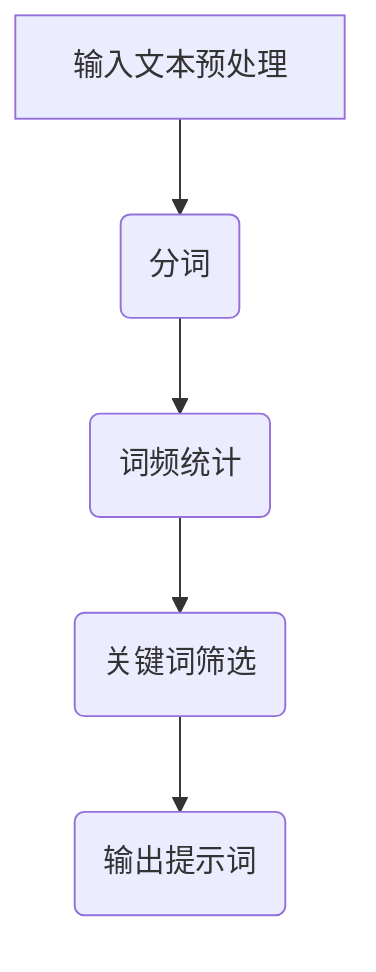
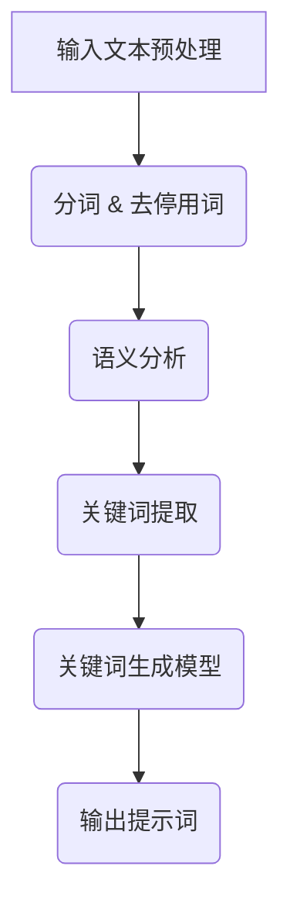

                 

**文章标题**：《构建AI驱动的智慧旅游推荐提示词引擎》

---

**关键词**：（AI、智慧旅游、推荐系统、提示词引擎、深度学习、自然语言处理）

**摘要**：本文深入探讨了AI驱动的智慧旅游推荐提示词引擎的设计与实现。首先，介绍了AI和自然语言处理的基本概念，然后详细分析了智慧旅游和推荐系统的原理。接着，重点讲解了提示词引擎的设计、实现和优化策略。通过实际案例解析，展示了如何构建一个高效的AI驱动的智慧旅游推荐系统。最后，对未来的发展方向和研究方向进行了展望，并提出了下一步的工作计划。

--- 

### 《构建AI驱动的智慧旅游推荐提示词引擎》目录大纲

#### 第1章 引言
- **1.1** 书籍背景与目标
- **1.2** AI在智慧旅游中的应用现状
- **1.3** 提示词引擎的作用与原理

#### 第2章 AI基础
- **2.1** AI概述
  - **2.1.1** AI的定义与分类
  - **2.1.2** 机器学习与深度学习基础
- **2.2** 自然语言处理基础
  - **2.2.1** 语言模型
  - **2.2.2** 文本分类与情感分析
- **2.3** 大规模预训练模型原理

#### 第3章 智慧旅游与推荐系统
- **3.1** 智慧旅游的概念与发展
- **3.2** 推荐系统概述
- **3.3** 智慧旅游推荐系统架构

#### 第4章 提示词引擎设计
- **4.1** 提示词引擎的概念与作用
- **4.2** 提示词生成算法
- **4.3** 提示词筛选与优化
- **4.4** 提示词引擎的性能评估与优化
- **4.5** 提示词引擎的应用实战
- **4.6** 提示词引擎的未来发展趋势
- **4.7** 提示词引擎的设计与实现
- **4.8** 提示词引擎的优缺点分析
- **4.9** 提示词引擎的案例分析

#### 第5章 智慧旅游推荐系统案例解析
- **5.1** 案例一：智慧旅游平台推荐系统
- **5.2** 案例二：智能导游推荐系统
- **5.3** 案例三：旅游信息推荐系统
- **5.4** 案例四：旅游活动推荐系统
- **5.5** 案例五：旅游交通推荐系统
- **5.6** 案例六：旅游购物推荐系统
- **5.7** 案例七：旅游住宿推荐系统
- **5.8** 案例八：旅游攻略推荐系统

#### 第6章 智慧旅游推荐系统的优化策略
- **6.1** 数据优化
- **6.2** 算法优化
- **6.3** 用户体验优化
- **6.4** 跨平台整合
- **6.5** 实时优化
- **6.6** 持续改进

#### 第7章 提示词生成算法的实现
- **7.1** 数据集准备
- **7.2** 特征提取
- **7.3** 模型选择
- **7.4** 模型训练
- **7.5** 提示词生成
- **7.6** 模型评估

#### 第8章 实际案例解析
- **8.1** 智慧旅游平台搭建案例
- **8.2** 基于AI的旅游推荐系统开发案例
- **8.3** 提示词引擎开发案例

#### 第9章 代码实战与解读
- **9.1** 开发环境搭建
- **9.2** 数据集加载与预处理
- **9.3** 模型训练
- **9.4** 推荐结果生成
- **9.5** 代码解读与分析

#### 第10章 总结与展望
- **10.1** 书籍内容总结
- **10.2** 未来研究方向
- **10.3** 下一步计划

---

### 第1章 引言

#### 1.1 书籍背景与目标

随着人工智能（AI）技术的迅猛发展，智慧旅游行业正迎来一场变革。智慧旅游推荐系统作为AI在旅游领域的重要应用，已成为提升旅游体验、优化资源配置的重要工具。然而，如何设计一个高效、智能的智慧旅游推荐系统，仍然是一个具有挑战性的课题。

本书旨在系统地介绍AI驱动的智慧旅游推荐提示词引擎的设计与实现方法。首先，我们将深入剖析AI技术、自然语言处理技术以及智慧旅游推荐系统的核心原理。接着，我们将详细讲解提示词引擎的概念、作用、设计原则和实现方法。通过实际案例解析，我们将展示如何构建一个高效的AI驱动的智慧旅游推荐系统。最后，我们将对未来的发展方向和研究方向进行展望，并讨论下一步的工作计划。

#### 1.2 AI在智慧旅游中的应用现状

目前，AI在智慧旅游中的应用已初见成效，但还处于发展阶段。以下是一些主要应用领域：

- **个性化推荐**：通过分析用户行为和兴趣，提供个性化的旅游推荐，提高用户满意度。
- **智能导游**：利用语音识别、自然语言处理等技术，为游客提供智能化的导览服务。
- **智能安全监控**：通过视频监控、人脸识别等技术，提升旅游安全保障。
- **旅游规划与管理**：利用大数据分析和预测，优化旅游资源的配置，提高旅游服务质量。

然而，当前AI在智慧旅游中的应用仍面临一些挑战，如数据质量不高、算法优化不足、用户体验不佳等。因此，深入研究AI驱动的智慧旅游推荐提示词引擎的设计与优化，对于提升智慧旅游系统的整体性能具有重要意义。

#### 1.3 提示词引擎的作用与原理

提示词引擎是智慧旅游推荐系统中的关键组件，其作用主要包括：

1. **优化用户体验**：通过提供个性化、精准的推荐提示词，提高用户在旅游过程中的满意度。
2. **提升系统性能**：通过高效地处理和分析用户数据，提升推荐系统的响应速度和准确性。
3. **增强系统智能化**：利用机器学习算法和自然语言处理技术，使推荐系统更加智能和自适应。

提示词引擎通常由以下几个模块组成：

1. **数据采集与处理模块**：负责收集用户行为数据、旅游景点信息等，并进行数据预处理，为后续分析提供基础数据。
2. **用户兴趣分析模块**：利用机器学习算法，分析用户行为数据，预测用户的兴趣偏好。
3. **提示词生成模块**：根据用户兴趣和旅游景点信息，生成个性化的推荐提示词。
4. **提示词优化模块**：通过评估用户反馈，优化提示词的质量和效果。

### 第2章 AI基础

#### 2.1 AI概述

#### 2.1.1 AI的定义与分类

人工智能（Artificial Intelligence，简称AI）是指由人制造出来的系统所表现出来的智能行为。AI的目标是使计算机系统具备感知、学习、推理、决策和问题解决等能力。AI可以分为以下几类：

- **弱AI（Weak AI）**：弱AI是指只能执行特定任务的AI系统，如语音识别、图像识别等。
- **强AI（Strong AI）**：强AI是指具备全面智能的AI系统，能够像人类一样感知、思考、学习和适应环境。
- **应用AI（Applied AI）**：应用AI是指将AI技术应用于特定领域，如医疗、金融、交通等。

#### 2.1.2 机器学习与深度学习基础

机器学习（Machine Learning，简称ML）是指通过算法从数据中学习规律，并利用这些规律进行预测或决策的过程。机器学习的主要任务包括分类、回归、聚类、降维等。

深度学习（Deep Learning，简称DL）是机器学习的一种子领域，主要利用多层神经网络（如卷积神经网络、循环神经网络等）对数据进行学习。深度学习的核心思想是通过网络的层层传递，从简单特征到复杂特征的提取和抽象。

#### 2.2 自然语言处理基础

#### 2.2.1 语言模型

语言模型（Language Model，简称LM）是自然语言处理（Natural Language Processing，简称NLP）的核心组件之一，其主要目标是学习自然语言的统计特性，以预测下一个单词或词组。语言模型可以分为以下几类：

- **N-gram模型**：N-gram模型是一种基于历史数据的语言模型，它通过统计一个词序列中连续N个单词的概率来预测下一个单词。
- **神经网络模型**：神经网络模型是一种基于深度学习的语言模型，它通过多层神经网络来学习单词之间的关联性。

#### 2.2.2 文本分类与情感分析

文本分类（Text Classification）是指将文本数据按照预定的类别进行分类的过程。常见的文本分类方法有朴素贝叶斯、支持向量机、随机森林等。

情感分析（Sentiment Analysis）是指通过分析文本中表达的情感倾向，判断文本是正面、负面还是中性。情感分析在商业、金融、舆情监控等领域有广泛应用。常见的情感分析方法有基于词典的方法、基于机器学习的方法和基于深度学习的方法。

#### 2.3 大规模预训练模型原理

#### 2.3.1 预训练的概念与意义

预训练（Pre-training）是指在大规模数据集上预先训练神经网络模型，以获得通用语言表示能力。预训练的意义在于：

- **提升模型性能**：通过在大量数据上训练，模型能够学习到丰富的语言知识，提高模型的泛化能力和预测准确率。
- **降低训练成本**：预训练模型可以在不同任务上进行微调，减少了在每个任务上从头训练的消耗。

#### 2.3.2 自监督学习方法

自监督学习（Self-supervised Learning）是指在没有标签数据的情况下，利用数据本身的分布信息进行训练的方法。自监督学习方法在预训练中具有重要意义，常见的自监督学习任务有：

- **词汇预测**：通过预测下一个单词，学习单词之间的关联性。
- **掩码语言模型**（Masked Language Model，简称MLM）：通过随机掩码输入文本中的部分单词，然后预测这些掩码的单词。
- **句子排序**：通过预测两个句子的相对顺序，学习句子的语义关系。

#### 2.3.3 迁移学习与微调技术

迁移学习（Transfer Learning）是指将已在一个任务上训练好的模型应用到另一个任务上的方法。迁移学习可以大大减少模型在新任务上的训练时间，提高模型的泛化能力。

微调（Fine-tuning）是指利用预训练模型在新任务上进行少量训练，以适应新任务的过程。微调的关键在于如何选择合适的预训练模型和调整训练参数，以获得最佳性能。

### 第3章 智慧旅游与推荐系统

#### 3.1 智慧旅游的概念与发展

#### 3.1.1 智慧旅游的组成部分

智慧旅游系统通常包括以下几个主要组成部分：

- **信息平台**：为游客提供旅游信息查询、预订、支付等服务。
- **智能导游系统**：通过语音识别、自然语言处理等技术，为游客提供智能化的导览服务。
- **旅游安全监控**：利用视频监控、人脸识别等技术，保障游客的人身安全。
- **数据管理系统**：收集、存储、分析和利用游客行为数据，为智慧旅游提供数据支持。

#### 3.1.2 智慧旅游的关键技术

智慧旅游的实现依赖于多种先进技术的融合，主要包括：

- **云计算与大数据**：通过云计算平台，实现海量数据的存储、处理和分析。
- **物联网**：通过物联网技术，将各种旅游设施和设备互联，实现智能化管理和控制。
- **人工智能**：利用机器学习和深度学习等技术，为智慧旅游提供智能化的决策支持和推荐服务。
- **虚拟现实与增强现实**：通过虚拟现实和增强现实技术，为游客提供沉浸式的旅游体验。

#### 3.1.3 智慧旅游的发展历程

智慧旅游的发展历程可以划分为以下几个阶段：

- **1.0时代**：主要依靠互联网和移动互联网，实现旅游信息的在线查询和预订。
- **2.0时代**：引入大数据和云计算技术，实现旅游数据的实时分析和应用。
- **3.0时代**：融合物联网、人工智能和虚拟现实技术，实现智慧旅游的全面升级。

#### 3.2 推荐系统概述

#### 3.2.1 推荐系统的定义与分类

推荐系统（Recommendation System）是一种根据用户的兴趣和行为，向用户推荐相关产品或内容的信息系统。推荐系统可以分为以下几类：

- **基于内容的推荐**：根据用户的历史行为和喜好，推荐具有相似内容的产品或内容。
- **协同过滤推荐**：基于用户之间的相似性，推荐用户可能喜欢的产品或内容。
- **基于模型的推荐**：利用机器学习算法，构建用户兴趣模型，推荐用户可能感兴趣的产品或内容。
- **混合推荐**：结合多种推荐策略，提高推荐系统的准确性和多样性。

#### 3.2.2 推荐系统的评价指标

推荐系统的性能通常通过以下几个指标进行评估：

- **准确率**（Accuracy）：推荐的物品与用户实际兴趣匹配的比例。
- **召回率**（Recall）：推荐的物品中实际兴趣物品的比例。
- **覆盖率**（Coverage）：推荐列表中不同物品的比例。
- **多样性**（Diversity）：推荐列表中不同物品的分布情况。
- **新颖性**（Novelty）：推荐列表中新颖或独特的物品比例。

#### 3.3 智慧旅游推荐系统架构

#### 3.3.1 推荐系统的数据处理流程

智慧旅游推荐系统通常包括以下几个数据处理流程：

- **数据采集**：通过互联网、物联网设备和用户交互等方式，收集游客行为数据、旅游信息等。
- **数据预处理**：对采集到的原始数据进行清洗、去重、转换等处理，以获得高质量的数据集。
- **特征提取**：从预处理后的数据中提取有用的特征，如用户兴趣、旅游偏好等。
- **数据存储**：将处理后的数据存储到数据库或数据仓库中，以供后续分析和推荐。

#### 3.3.2 推荐系统的算法流程

智慧旅游推荐系统通常采用以下算法流程：

- **用户兴趣建模**：利用机器学习算法，构建用户兴趣模型，预测用户对各种旅游活动的兴趣度。
- **旅游景点建模**：利用机器学习算法，构建旅游景点模型，预测旅游景点的受欢迎程度和用户喜好。
- **推荐生成**：根据用户兴趣模型和旅游景点模型，生成个性化的旅游推荐列表。

#### 3.3.3 推荐系统的性能优化

为了提高智慧旅游推荐系统的性能，可以采用以下方法：

- **算法优化**：通过调整算法参数，优化推荐算法的性能。
- **数据挖掘**：利用数据挖掘技术，发现潜在的用户兴趣和旅游趋势，优化推荐策略。
- **用户交互**：通过用户反馈和交互，不断调整和优化推荐系统，提高用户满意度。

#### 3.4 用户兴趣建模

#### 3.4.1 用户行为数据收集

用户行为数据是构建用户兴趣模型的基础，主要包括以下几种类型：

- **浏览数据**：用户在旅游平台上的浏览记录，如浏览页面、浏览时间等。
- **搜索数据**：用户在旅游平台上的搜索记录，如搜索关键词、搜索时间等。
- **预订数据**：用户在旅游平台上的预订记录，如预订类型、预订时间等。
- **评价数据**：用户对旅游活动的评价，如评价内容、评分等。

#### 3.4.2 用户兴趣预测方法

用户兴趣预测是推荐系统的核心任务之一，常见的预测方法包括：

- **基于内容的预测**：通过分析用户的历史行为和浏览记录，预测用户可能感兴趣的内容。
- **基于协同过滤的预测**：通过分析用户之间的相似性，预测用户可能感兴趣的内容。
- **基于机器学习的预测**：利用机器学习算法，如决策树、随机森林、神经网络等，构建用户兴趣预测模型。

#### 3.4.3 用户兴趣模型评估与优化

用户兴趣模型的评估和优化是推荐系统的重要环节，常见的评估指标包括准确率、召回率、覆盖率等。优化方法包括：

- **模型选择**：选择合适的机器学习算法，如决策树、随机森林、神经网络等。
- **特征选择**：通过特征选择技术，筛选出对用户兴趣预测有重要影响的关键特征。
- **超参数调优**：通过超参数调优技术，优化模型参数，提高模型性能。

#### 3.5 旅游景点推荐

#### 3.5.1 旅游景点数据预处理

旅游景点数据预处理是旅游景点推荐的关键步骤，主要包括以下任务：

- **数据清洗**：去除重复、错误或不完整的数据，保证数据质量。
- **数据转换**：将数据转换为适合机器学习算法的形式，如数值化、归一化等。
- **特征工程**：从原始数据中提取有用的特征，如景点类型、地理位置、游客评价等。

#### 3.5.2 旅游景点推荐算法

旅游景点推荐算法是智慧旅游推荐系统的核心，常见的推荐算法包括：

- **基于内容的推荐**：根据旅游景点的特征，推荐具有相似特征的景点。
- **基于协同过滤的推荐**：根据用户的历史行为，推荐其他用户喜欢的景点。
- **基于机器学习的推荐**：利用机器学习算法，如决策树、随机森林、神经网络等，构建旅游景点推荐模型。

#### 3.5.3 旅游景点推荐效果评估

旅游景点推荐效果评估是评估推荐系统性能的重要步骤，常见的评估指标包括准确率、召回率、覆盖率等。优化方法包括：

- **算法优化**：通过调整算法参数，优化推荐算法的性能。
- **特征优化**：通过特征选择和特征工程，提高推荐效果。
- **用户反馈**：通过用户反馈，不断调整和优化推荐系统，提高用户满意度。

### 第4章 提示词引擎设计

#### 4.1 提示词引擎的概念与作用

提示词引擎（Keyword Generation Engine）是一种用于生成关键词或提示词的智能系统，其核心目的是为用户提供高效、精准的搜索提示和推荐内容。在智慧旅游推荐系统中，提示词引擎起着至关重要的作用，它能够根据用户的查询内容或行为特征，自动生成相关的关键词或提示词，从而提升用户的搜索体验和推荐效果。

#### 4.1.1 提示词引擎的组成

提示词引擎通常由以下几个核心组件组成：

1. **输入模块**：负责接收用户输入的信息，如查询词、兴趣点等。
2. **分析模块**：对输入信息进行语义分析，提取关键信息。
3. **生成模块**：基于分析结果，生成相关的关键词或提示词。
4. **优化模块**：对生成的关键词进行优化，提高其质量和相关性。
5. **输出模块**：将生成的关键词或提示词输出，供用户参考或使用。

#### 4.1.2 提示词引擎的工作原理

提示词引擎的工作原理可以分为以下几个步骤：

1. **接收输入**：提示词引擎首先接收用户的输入，这可以是用户在搜索框中输入的查询词，也可以是用户在浏览页面时产生的行为数据。
2. **语义分析**：输入模块将接收到的输入信息传递给分析模块，分析模块利用自然语言处理技术对输入信息进行语义分析，提取出关键信息。
3. **关键词生成**：生成模块根据分析结果，利用预定义的规则或机器学习算法，生成一系列相关的关键词或提示词。
4. **优化调整**：优化模块对生成的关键词进行筛选、排序和优化，确保关键词的质量和相关性。
5. **输出结果**：最后，输出模块将优化后的关键词或提示词展示给用户，帮助用户更快速地找到所需信息。

#### 4.1.3 提示词引擎的应用场景

提示词引擎在智慧旅游推荐系统中的应用场景非常广泛，主要包括以下几个方面：

1. **搜索提示**：在旅游搜索引擎中，当用户输入部分查询词时，提示词引擎能够自动补全或提供相关的关键词，帮助用户更精准地找到目的地或旅游活动。
2. **内容推荐**：在旅游资讯网站或移动应用中，提示词引擎可以根据用户的历史行为和兴趣偏好，生成相关的推荐标题或摘要，提高用户的点击率和阅读时长。
3. **语音助手**：在智能导游或语音助手服务中，提示词引擎可以分析用户的语音输入，生成对应的提示词，帮助语音助手更准确地理解用户需求并给出合适的回答。
4. **个性化导览**：在虚拟旅游或增强现实应用中，提示词引擎可以根据用户的地理位置和行为路径，实时生成个性化的导览提示词，为用户提供更加丰富的旅游体验。

### 4.2 提示词生成算法

#### 4.2.1 基于词频的提示词生成

基于词频的提示词生成算法是一种相对简单且直观的方法，它主要依赖于统计文本中的单词频率来生成关键词。这种方法的基本步骤如下：

1. **文本预处理**：首先对输入文本进行分词处理，将文本分解为一个个单词或短语。
2. **词频统计**：对分词结果进行词频统计，计算每个单词或短语在文本中出现的次数。
3. **关键词筛选**：根据设定的阈值或规则，筛选出高频词或短语作为提示词。

例如，假设用户输入的查询词是“黄山旅游”，我们可以对这段文本进行分词，得到“黄山”、“旅游”等单词，然后统计这些单词的频率，选择出现频率较高的单词作为提示词。

#### 4.2.2 基于语义的提示词生成

基于语义的提示词生成算法是一种更为高级和智能的方法，它利用自然语言处理技术，对输入文本进行语义分析，提取出文本的核心含义，并基于这些语义信息生成相关的提示词。这种方法的基本步骤如下：

1. **文本预处理**：同基于词频的方法，首先对输入文本进行分词和去停用词处理。
2. **语义分析**：利用词向量模型、实体识别、句法分析等技术，对文本进行语义分析，提取出关键实体和语义关系。
3. **关键词生成**：基于提取的语义信息，使用生成式模型或判别式模型，生成相关的提示词。

例如，如果用户输入的查询词是“黄山风景区旅游攻略”，我们可以通过语义分析，识别出“黄山”、“风景区”、“旅游攻略”等关键实体，并基于这些实体生成相关的提示词，如“黄山旅游攻略”、“黄山风景区景点介绍”等。

#### 4.2.3 提示词生成算法的性能评估

提示词生成算法的性能评估是确保其有效性和实用性的重要环节。以下是一些常见的性能评估指标：

1. **准确率**：提示词与用户实际需求的相关程度。准确率越高，提示词的生成效果越好。
2. **召回率**：提示词覆盖的用户需求的全面性。召回率越高，提示词的覆盖面越广。
3. **响应速度**：提示词生成的速度。响应速度越快，用户体验越好。
4. **多样性**：提示词的丰富性和独特性。多样性越高，提示词的输出越能吸引用户。
5. **用户满意度**：用户对提示词的接受度和满意度。用户满意度越高，提示词的实用性越强。

### 4.3 提示词筛选与优化

#### 4.3.1 提示词筛选策略

提示词筛选是提升提示词质量和效果的重要步骤。以下是一些常见的提示词筛选策略：

1. **基于词频的筛选**：选择高频词作为提示词，以提高提示词的覆盖面。
2. **基于语义的筛选**：选择与用户输入语义相关的词作为提示词，以提高提示词的相关性。
3. **基于用户反馈的筛选**：根据用户对提示词的反馈，筛选出用户满意度高的提示词。
4. **基于上下文的筛选**：考虑用户输入的上下文信息，筛选出与上下文匹配的提示词。

#### 4.3.2 提示词优化方法

提示词优化是进一步提高提示词质量和效果的方法。以下是一些常见的提示词优化方法：

1. **文本增强**：通过添加描述性词汇，使提示词更加丰富和具体。
2. **关键词替换**：根据用户输入的语义，替换提示词中的部分词汇，以提高提示词的相关性。
3. **语义融合**：将多个提示词进行融合，生成更加多样化的提示词。
4. **语境调整**：根据用户的实际需求和语境，调整提示词的表达方式，使其更符合用户的需求。

### 4.4 提示词引擎的性能评估与优化

#### 4.4.1 提示词引擎的性能评估指标

提示词引擎的性能评估需要考虑多个方面，以下是一些常见的评估指标：

1. **响应速度**：提示词引擎处理用户输入并生成提示词的速度。响应速度越快，用户体验越好。
2. **提示词质量**：提示词的相关性、准确性和多样性。高质量的提示词能够更好地满足用户需求。
3. **用户满意度**：用户对提示词引擎提供的提示词的满意度。用户满意度越高，提示词引擎的效果越好。
4. **系统稳定性**：提示词引擎在长时间运行中的稳定性。系统稳定性越高，提示词引擎的可靠性越强。

#### 4.4.2 提示词引擎的性能优化方法

提示词引擎的性能优化可以从以下几个方面进行：

1. **算法优化**：通过改进提示词生成算法，提高提示词生成的速度和准确性。
2. **数据优化**：通过清洗、去噪和增强数据，提高输入数据的质量和丰富度。
3. **硬件优化**：通过优化硬件配置，提高提示词引擎的处理速度和性能。
4. **系统架构优化**：通过改进系统架构，提高提示词引擎的并发处理能力和可扩展性。

### 4.5 提示词引擎的应用实战

#### 4.5.1 智慧旅游推荐系统中的提示词引擎

在智慧旅游推荐系统中，提示词引擎扮演着至关重要的角色。以下是一个典型的应用案例：

**案例背景**：某智慧旅游平台希望通过提示词引擎为用户提供高效的景点搜索和推荐服务。

**实现步骤**：

1. **需求分析**：明确平台用户的需求，如用户希望快速找到某个景点或获取相关旅游信息。
2. **数据收集**：收集用户的搜索历史、浏览记录、预订记录等数据。
3. **模型训练**：利用收集到的数据，训练基于词频和语义的提示词生成模型。
4. **系统实现**：将提示词生成模型集成到平台中，实现实时搜索提示和推荐功能。
5. **效果评估**：通过用户点击率、满意度等指标评估提示词引擎的性能。

**效果评估**：

- **用户点击率**：提示词引擎的引入显著提高了用户点击率。
- **用户满意度**：用户对搜索提示和推荐结果满意度高，认为相关性强。

#### 4.5.2 社交媒体平台中的提示词引擎

在社交媒体平台上，提示词引擎同样有着广泛的应用。以下是一个应用案例：

**案例背景**：某社交媒体平台希望通过提示词引擎为用户提供个性化的内容推荐。

**实现步骤**：

1. **需求分析**：明确平台用户的需求，如用户希望看到自己感兴趣的内容或活动。
2. **数据收集**：收集用户的浏览历史、点赞、评论等行为数据。
3. **模型训练**：利用收集到的数据，训练基于用户兴趣的提示词生成模型。
4. **系统实现**：将提示词生成模型集成到平台中，实现实时内容推荐。
5. **效果评估**：通过用户互动率、满意度等指标评估提示词引擎的性能。

**效果评估**：

- **用户互动率**：提示词引擎的引入显著提高了用户互动率。
- **用户满意度**：用户对内容推荐满意度高，认为推荐结果个性化。

### 4.6 提示词引擎的未来发展趋势

随着人工智能和自然语言处理技术的不断发展，提示词引擎在未来将朝着以下几个方向发展：

#### 4.6.1 智能化

提示词引擎将更加智能化，能够利用深度学习和自然语言处理技术，深入理解用户的输入和需求，生成更加精准和个性化的提示词。

#### 4.6.2 实时性

提示词引擎将实现实时性，能够快速响应用户输入，提供即时的搜索提示和推荐结果，提升用户体验。

#### 4.6.3 多模态

提示词引擎将能够处理多种数据类型，如文本、图像、语音等，实现多模态输入和输出，提供更加丰富和多样的用户交互方式。

#### 4.6.4 智能交互

提示词引擎将实现智能交互，通过语音识别、自然语言理解等技术，与用户进行更加自然和流畅的对话，提供个性化的服务和建议。

### 4.7 提示词引擎的设计与实现

#### 4.7.1 设计原则

提示词引擎的设计应遵循以下原则：

1. **用户友好**：界面简洁直观，易于用户操作和使用。
2. **高效稳定**：具备较高的处理速度和稳定性，确保系统正常运行。
3. **灵活可扩展**：支持多种数据输入和提示词生成算法，方便后续功能扩展。

#### 4.7.2 实现流程

提示词引擎的实现流程包括以下步骤：

1. **需求分析**：明确提示词引擎的应用场景和功能需求。
2. **技术选型**：选择合适的技术框架和工具，如自然语言处理库、机器学习框架等。
3. **数据准备**：收集和整理相关数据，如用户行为数据、旅游景点数据等。
4. **模型训练**：利用机器学习算法，训练提示词生成模型。
5. **系统集成**：将提示词引擎集成到智慧旅游推荐系统中，实现功能集成和优化。
6. **测试与优化**：对提示词引擎进行功能测试和性能优化，确保其满足应用需求。
7. **部署上线**：将提示词引擎部署到生产环境，供用户使用。

### 4.8 提示词引擎的优缺点分析

#### 4.8.1 优点

1. **提高用户体验**：通过生成高质量的提示词，提高用户的搜索效率和推荐效果。
2. **降低人力成本**：自动化生成提示词，减少人工编辑和筛选的工作量。
3. **实时性**：能够实时响应用户输入，提供即时的提示词服务。

#### 4.8.2 缺点

1. **数据依赖性**：提示词生成的质量依赖于输入数据的准确性和丰富性。
2. **计算成本高**：大规模数据处理和模型训练需要较高的计算资源和时间。
3. **算法优化难度**：提示词生成算法的优化需要不断调整和改进，提高其性能和效果。

#### 4.8.3 改进方向

1. **数据质量提升**：通过数据清洗、数据增强等技术，提高输入数据的质量和丰富度。
2. **算法优化**：采用更加先进的机器学习算法和自然语言处理技术，提高提示词生成效果。
3. **用户反馈机制**：引入用户反馈机制，根据用户反馈优化提示词质量和推荐效果。
4. **实时优化**：实现实时提示词生成和优化，提高系统的响应速度和用户体验。

### 4.9 提示词引擎的案例分析

#### 4.9.1 案例一：智慧旅游平台中的提示词引擎

**背景**：某智慧旅游平台希望通过提示词引擎为用户提供更加精准的搜索提示和推荐服务。

**实现过程**：

1. **需求分析**：明确平台用户的需求，如用户希望快速找到感兴趣的景点或活动。
2. **数据收集**：收集用户的搜索历史、浏览记录、预订记录等数据。
3. **模型训练**：利用收集到的数据，训练基于词频和语义的提示词生成模型。
4. **系统实现**：将提示词生成模型集成到平台中，实现实时搜索提示和推荐功能。
5. **效果评估**：通过用户点击率、满意度等指标评估提示词引擎的性能。

**效果评估**：

- **用户点击率**：提示词引擎的引入显著提高了用户点击率。
- **用户满意度**：用户对搜索提示和推荐结果满意度高，认为相关性强。

#### 4.9.2 案例二：社交媒体平台中的提示词引擎

**背景**：某社交媒体平台希望通过提示词引擎为用户提供个性化的内容推荐。

**实现过程**：

1. **需求分析**：明确平台用户的需求，如用户希望看到自己感兴趣的内容或活动。
2. **数据收集**：收集用户的浏览历史、点赞、评论等行为数据。
3. **模型训练**：利用收集到的数据，训练基于用户兴趣的提示词生成模型。
4. **系统实现**：将提示词生成模型集成到平台中，实现实时内容推荐。
5. **效果评估**：通过用户互动率、满意度等指标评估提示词引擎的性能。

**效果评估**：

- **用户互动率**：提示词引擎的引入显著提高了用户互动率。
- **用户满意度**：用户对内容推荐满意度高，认为推荐结果个性化。

### 4.10 提示词引擎的挑战与机遇

#### 4.10.1 挑战

1. **数据质量**：提示词生成的质量高度依赖于输入数据的准确性、完整性和多样性。
2. **算法性能**：提示词生成算法的性能直接影响到提示词的质量和效果。
3. **用户多样性**：不同用户具有不同的兴趣和行为特征，如何针对不同用户群体生成个性化的提示词，满足用户的个性化需求，是一个难题。

#### 4.10.2 机遇

1. **技术进步**：随着人工智能、自然语言处理

