                 

### 第一部分：AI定制的需求满足系统概述

#### 第1章：AI定制与需求满足概述

##### 1.1 AI定制概述

**AI定制**是指利用人工智能技术，根据用户个性化需求，对产品、服务或系统进行量身定制的服务。它的基本概念源于“个性化”，即针对每个用户的不同需求，提供独特的解决方案。随着人工智能技术的快速发展，AI定制已经渗透到各个行业，如电商、金融、医疗、教育等，为用户提供更精准、更个性化的服务。

**AI定制的重要性**在于其能够显著提升用户体验，提高产品或服务的满意度。在商业应用中，AI定制可以帮助企业更好地理解用户需求，提高市场竞争力。具体来说，AI定制的重要性体现在以下几个方面：

1. **提升用户体验**：通过AI定制，企业可以提供更符合用户期望的产品或服务，从而提高用户满意度。
2. **增加用户粘性**：个性化服务能够吸引并留住用户，增加用户对品牌的忠诚度。
3. **降低运营成本**：通过自动化和智能化，AI定制可以减少人工成本，提高效率。
4. **优化决策**：AI定制能够为决策者提供基于数据的洞察，帮助优化业务策略。

##### 1.2 需求满足系统的构成

一个完善的AI定制需求满足系统通常包括以下几个核心模块：

1. **需求分析模块**：该模块负责收集和分析用户需求，通过用户行为数据、用户画像等手段，了解用户的具体需求和偏好。
2. **个性化推荐模块**：基于需求分析结果，推荐模块可以为用户提供个性化的产品、服务或内容。
3. **交互反馈模块**：用户在使用过程中提供反馈，这些反馈会反馈到系统中，进一步优化推荐算法和系统性能。

##### 1.3 AI定制需求满足的系统架构

AI定制需求满足系统的架构主要包括以下几个关键组成部分：

1. **数据采集与处理**：通过多种渠道收集用户数据，如行为数据、社交数据、交易数据等，并进行清洗、预处理和存储。
2. **模型训练与优化**：使用机器学习和深度学习技术，对用户数据进行建模和训练，不断优化推荐算法和预测模型。
3. **系统部署与运维**：将训练好的模型部署到生产环境中，通过自动化工具进行系统监控和运维，确保系统的稳定性和性能。

### 1.4 小结

本章对AI定制与需求满足系统进行了概述，介绍了AI定制的基本概念和重要性，以及需求满足系统的构成和架构。接下来，我们将进一步深入探讨需求分析算法、个性化推荐算法以及交互反馈与优化机制，为读者揭示AI定制需求满足系统的核心原理和实践方法。

---

**Mermaid 流程图示例：**

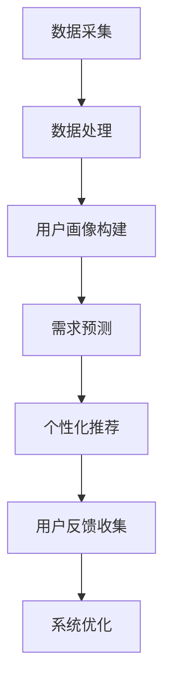

##### 1.1.1 AI定制的基本概念

AI定制，即人工智能定制，是一种利用人工智能技术，通过分析用户数据和行为，为用户提供量身定制的产品、服务或内容的过程。其核心在于个性化，即针对每个用户的特定需求，提供独特的解决方案。

在AI定制中，**个性化**是一个关键概念。它不仅涉及到对用户需求的识别，还包括根据用户的偏好、历史行为和实时反馈，动态调整推荐和服务内容。具体来说，个性化可以通过以下几种方式实现：

1. **基于内容的个性化**：推荐与用户当前兴趣或需求相关的信息或产品。例如，电商平台根据用户浏览记录推荐相似的商品。
2. **协同过滤推荐**：通过分析用户之间的相似性，推荐其他用户喜欢的商品或服务。例如，社交网络平台根据用户之间的互动推荐好友可能感兴趣的内容。
3. **深度学习推荐**：利用深度学习算法，从大量非结构化数据中提取用户特征，生成个性化的推荐结果。

AI定制的核心目标是为用户提供更加精准、高效的个性化体验，从而提高用户满意度和忠诚度。实现这一目标需要依赖于以下几个关键环节：

1. **用户数据收集**：通过多种渠道收集用户数据，包括行为数据、偏好数据、社交数据等。
2. **数据预处理**：对收集到的数据进行清洗、整合和预处理，为后续的分析和建模打下基础。
3. **用户画像构建**：基于用户数据，构建用户画像，包括用户的兴趣、行为习惯、购买偏好等。
4. **需求预测**：利用机器学习和深度学习算法，预测用户未来的需求和行为。
5. **个性化推荐**：根据用户画像和需求预测结果，为用户推荐个性化的产品、服务或内容。
6. **反馈循环**：收集用户反馈，持续优化推荐算法和系统性能。

##### 1.1.2 AI定制的重要性

AI定制在当前的商业环境中具有显著的重要性，主要体现在以下几个方面：

1. **提升用户体验**：通过AI定制，企业可以更加精准地满足用户需求，提供个性化服务，从而提升用户体验和满意度。
2. **增加用户粘性**：个性化服务能够更好地吸引和留住用户，增加用户对品牌的忠诚度。
3. **优化运营效率**：AI定制通过自动化和智能化，减少人工干预，提高运营效率，降低运营成本。
4. **驱动业务增长**：精准的个性化推荐可以促进用户购买决策，增加销售额和市场份额。
5. **增强决策支持**：AI定制系统为决策者提供基于数据的洞察，帮助优化业务策略和决策。

具体案例方面，电商平台的AI定制需求满足系统已经取得了显著成效。例如，亚马逊通过用户行为数据和推荐算法，为用户推荐个性化的商品，提高了用户满意度和转化率。阿里巴巴的淘宝则通过用户画像和协同过滤推荐，为用户提供个性化购物体验，提升了用户粘性和购物满意度。

总之，AI定制作为一种先进的技术手段，正在深刻改变商业运营模式和用户互动方式，为企业和用户带来了新的机遇和挑战。

---

**伪代码示例：**

```python
# 用户数据收集与预处理
def collect_and_preprocess_data():
    data = collect_user_data()
    cleaned_data = preprocess_data(data)
    return cleaned_data

# 构建用户画像
def build_user_profile(cleaned_data):
    profile = {}
    profile['interests'] = extract_interests(cleaned_data)
    profile['behavior'] = extract_behavior(cleaned_data)
    profile['preferences'] = extract_preferences(cleaned_data)
    return profile

# 需求预测
def predict_user需求的需求（user_profile）:
    predictions = train_demand_prediction_model(user_profile)
    return predictions

# 个性化推荐
def personalized_recommendation(predictions):
    recommendations = generate_recommendations(predictions)
    return recommendations
```

---

##### 1.2 需求分析模块

需求分析模块是AI定制需求满足系统的核心组成部分，负责收集、分析和理解用户需求。该模块的工作流程通常包括以下几个关键步骤：

1. **用户数据收集**：需求分析的第一步是收集用户数据。这些数据可以来源于多个渠道，如用户行为数据、偏好数据、交易数据、社交媒体数据等。通过综合这些数据，系统能够获得用户的全貌。
   
   ```mermaid
   graph TD
       A[用户数据收集] --> B[行为数据]
       B --> C[偏好数据]
       C --> D[交易数据]
       D --> E[社交媒体数据]
   ```

2. **数据预处理**：收集到的用户数据往往是杂乱无章的，需要进行预处理。预处理包括数据清洗、去重、格式统一等步骤，以确保数据的质量和一致性。

   ```mermaid
   graph TD
       F[数据预处理] --> G[数据清洗]
       G --> H[数据去重]
       H --> I[格式统一]
   ```

3. **用户画像构建**：通过分析预处理后的用户数据，系统可以为每个用户构建详细的画像。用户画像包括用户的兴趣爱好、行为习惯、购买偏好、地理位置等多个维度。

   ```mermaid
   graph TD
       J[用户画像构建] --> K[兴趣分析]
       K --> L[行为分析]
       L --> M[偏好分析]
       M --> N[地理位置分析]
   ```

4. **需求预测**：基于用户画像和用户历史行为数据，需求分析模块可以使用机器学习和深度学习算法预测用户未来的需求。这一步对于个性化推荐至关重要。

   ```mermaid
   graph TD
       O[需求预测] --> P[特征提取]
       P --> Q[模型训练]
       Q --> R[预测结果]
   ```

5. **需求特征提取**：在需求预测过程中，需要从用户数据中提取关键特征，如用户的历史购买记录、浏览行为、评价等，这些特征将用于训练预测模型。

   ```mermaid
   graph TD
       S[需求特征提取] --> T[购买记录]
       T --> U[浏览行为]
       U --> V[评价分析]
   ```

6. **模型训练与优化**：需求预测模型需要通过大量数据进行训练，并通过交叉验证和超参数调整进行优化，以确保预测的准确性和可靠性。

   ```mermaid
   graph TD
       W[模型训练] --> X[交叉验证]
       X --> Y[模型优化]
       Y --> Z[模型评估]
   ```

通过以上步骤，需求分析模块能够为系统提供准确、详细的用户需求预测，从而支持后续的个性化推荐和交互反馈。

##### 1.2.2 个性化推荐模块

个性化推荐模块是AI定制需求满足系统的核心组件，其目标是根据用户需求和偏好，为用户推荐最符合其兴趣的产品、服务或内容。个性化推荐模块通常采用以下几种方法来实现：

1. **基于内容的推荐**：该方法通过分析推荐项和用户兴趣的相似性来进行推荐。例如，用户浏览过某种类型的商品，系统会推荐相似的商品。

   ```mermaid
   graph TD
       A[用户兴趣] --> B[推荐项内容]
       B --> C[相似性计算]
       C --> D[推荐结果]
   ```

2. **协同过滤推荐**：协同过滤推荐通过分析用户之间的相似性来推荐商品。例如，如果用户A和用户B都购买了商品X，那么系统会推荐用户B购买的商品给用户A。

   ```mermaid
   graph TD
       E[用户A行为] --> F[用户B行为]
       F --> G[相似性计算]
       G --> H[推荐结果]
   ```

3. **基于模型的推荐**：该方法使用机器学习和深度学习算法，从用户数据中提取特征，构建预测模型，然后根据模型预测结果进行推荐。

   ```mermaid
   graph TD
       I[用户数据] --> J[特征提取]
       J --> K[模型训练]
       K --> L[预测结果]
       L --> M[推荐结果]
   ```

4. **混合推荐**：混合推荐结合了多种推荐方法的优势，通过融合基于内容的推荐和协同过滤推荐，以及基于模型的推荐，以提高推荐效果。

   ```mermaid
   graph TD
       N[内容推荐] --> O[协同过滤]
       O --> P[模型推荐]
       P --> Q[混合推荐结果]
   ```

通过以上方法，个性化推荐模块能够为用户提供精准、个性化的推荐结果，从而提升用户满意度和转化率。

##### 1.2.3 交互反馈模块

交互反馈模块在AI定制需求满足系统中起着关键作用，其主要任务是通过收集用户对推荐内容的反馈，不断优化推荐系统，提高用户体验。交互反馈模块的工作流程主要包括以下几个步骤：

1. **用户反馈收集**：系统需要通过多种渠道收集用户的反馈，如点击率、购买行为、评价、评分等。这些反馈数据可以帮助系统了解用户的兴趣和偏好。

   ```mermaid
   graph TD
       A[用户反馈] --> B[点击率]
       B --> C[购买行为]
       C --> D[评价与评分]
   ```

2. **反馈数据分析**：收集到的用户反馈数据需要进行预处理和清洗，以便进行后续的分析。这一步骤包括去重、格式转换、缺失值处理等。

   ```mermaid
   graph TD
       E[反馈数据预处理] --> F[去重]
       F --> G[格式转换]
       G --> H[缺失值处理]
   ```

3. **反馈分析**：通过分析用户反馈数据，系统可以了解用户的真实需求和偏好。例如，如果用户对某个推荐内容评分较低，系统可以推测该内容不符合用户的兴趣。

   ```mermaid
   graph TD
       I[反馈分析] --> J[兴趣识别]
       J --> K[偏好识别]
   ```

4. **系统调整**：根据反馈分析结果，系统需要对推荐策略进行调整。这可能包括调整推荐算法、更新用户画像、优化推荐内容等。

   ```mermaid
   graph TD
       L[系统调整] --> M[推荐算法调整]
       M --> N[用户画像更新]
       N --> O[推荐内容优化]
   ```

5. **反馈循环**：调整后的系统会继续收集新的用户反馈，形成反馈循环。这一过程是一个动态的迭代过程，系统不断优化，以提供更精准的个性化推荐。

   ```mermaid
   graph TD
       P[反馈循环] --> Q[新一轮反馈]
       Q --> R[系统优化]
       R --> P
   ```

通过以上步骤，交互反馈模块能够有效提升推荐系统的准确性和用户体验，实现持续优化。

---

**伪代码示例：**

```python
# 用户反馈收集
def collect_user_feedback():
    feedback = get_user_click_data() + get_user_purchase_data() + get_user_evaluation_data()
    return feedback

# 反馈数据分析
def analyze_feedback(feedback):
    cleaned_feedback = preprocess_feedback(feedback)
    user_interests = extract_interests(cleaned_feedback)
    user_preferences = extract_preferences(cleaned_feedback)
    return user_interests, user_preferences

# 系统调整
def adjust_system_recommendations(user_interests, user_preferences):
    update_recommendation_algorithm(user_interests, user_preferences)
    update_user_profile(user_interests, user_preferences)
    optimize_recommendation_content()
```

---

##### 1.3 AI定制需求满足的系统架构

AI定制需求满足系统的架构设计是其成功的关键因素之一。一个典型的AI定制需求满足系统通常包括以下几个核心组成部分：数据采集与处理、模型训练与优化、系统部署与运维。以下是这些组成部分的详细说明。

###### 1.3.1 数据采集与处理

数据采集与处理是AI定制需求满足系统的第一步，其重要性不言而喻。系统需要通过多种渠道收集用户数据，包括但不限于：

- **用户行为数据**：如浏览记录、点击行为、购买历史等。
- **偏好数据**：如用户对特定产品或服务的喜好、评价等。
- **交易数据**：如用户购买的商品、交易金额、交易时间等。
- **社交媒体数据**：如用户在社交媒体平台的活动、评论等。

为了确保数据的质量，系统需要对数据进行预处理，这一过程通常包括以下步骤：

- **数据清洗**：去除重复、无效或错误的数据，确保数据的准确性和一致性。
- **数据转换**：将不同来源的数据转换为统一的格式，便于后续处理和分析。
- **数据集成**：将来自不同渠道的数据整合到一个统一的数据仓库中。

**伪代码示例**：

```python
def data_preprocessing(data_source):
    cleaned_data = clean_data(data_source)
    standardized_data = convert_to_standard_format(cleaned_data)
    integrated_data = integrate_data(standardized_data)
    return integrated_data
```

###### 1.3.2 模型训练与优化

在数据采集与处理后，系统进入模型训练与优化阶段。这一阶段的核心任务是通过机器学习和深度学习算法，从数据中提取特征，训练预测模型，并不断优化模型性能。

1. **特征提取**：从预处理后的数据中提取关键特征，如用户行为特征、偏好特征等。特征提取的质量直接影响模型的性能。

2. **模型训练**：使用提取到的特征数据，通过机器学习和深度学习算法（如线性回归、决策树、神经网络等）训练预测模型。

3. **模型优化**：通过交叉验证、超参数调整等技术，优化模型性能。优化的目标是提高模型的准确率、召回率等关键指标。

**伪代码示例**：

```python
def train_model(features, labels):
    model = create_model()
    model.fit(features, labels)
    return model

def optimize_model(model, features, labels):
    best_model = cross_validate(model, features, labels)
    best_params = hyperparameter_tuning(best_model)
    optimized_model = retrain_model(best_model, best_params)
    return optimized_model
```

###### 1.3.3 系统部署与运维

模型训练完成后，系统进入部署与运维阶段。这一阶段的关键任务是确保模型在生产环境中的稳定运行，并对系统性能进行监控和优化。

1. **模型部署**：将训练好的模型部署到生产环境中，使其能够实时处理用户请求，提供个性化推荐。

2. **系统监控**：通过监控系统性能，如响应时间、错误率等，及时发现并解决潜在问题。

3. **系统优化**：根据监控数据，对系统进行持续优化，如调整推荐算法、优化数据存储和传输等，以提高系统性能。

**伪代码示例**：

```python
def deploy_model(model, environment):
    deployed_model = deploy_to_production(model, environment)
    return deployed_model

def monitor_system(deployed_model):
    performance_metrics = get_performance_metrics(deployed_model)
    if performance_metrics['error_rate'] > threshold:
        alert_system()
    else:
        system_is_stable

def optimize_system(deployed_model, performance_metrics):
    optimized_model = retrain_and_deploy(deployed_model, performance_metrics)
    return optimized_model
```

通过以上数据采集与处理、模型训练与优化、系统部署与运维三个关键环节，AI定制需求满足系统实现了从数据收集到个性化推荐的全流程闭环，为用户提供高质量的个性化服务。

---

**Mermaid 流程图示例：**

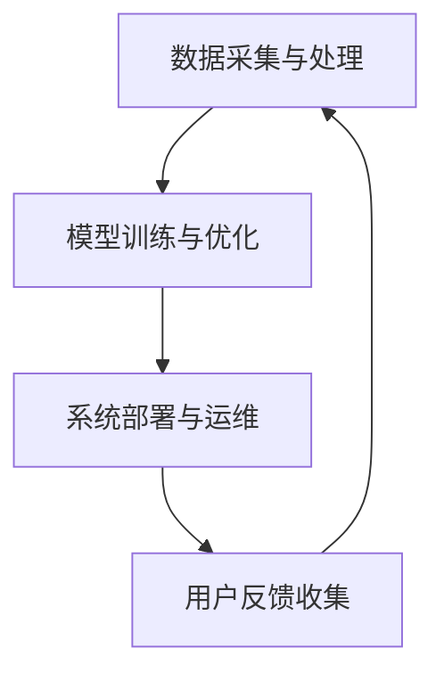

---

##### 1.4 小结

本章详细介绍了AI定制需求满足系统的概述，包括AI定制的基本概念和重要性，需求满足系统的构成和核心模块，以及系统架构的各个组成部分。通过这一章的讲解，读者可以对AI定制需求满足系统的整体框架和关键环节有清晰的认识。接下来，我们将进一步探讨需求分析算法、个性化推荐算法以及交互反馈与优化机制，深入解析AI定制需求满足系统的核心原理和实践方法。这将帮助读者更好地理解和应用AI定制技术，提升用户体验和业务效率。

---

**Mermaid 流程图示例：**

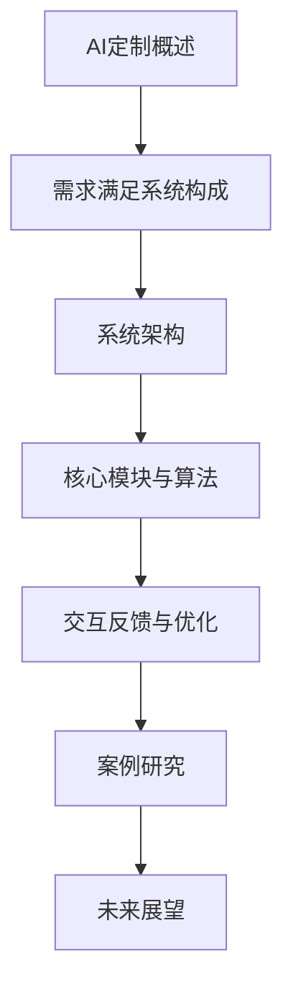

---

#### 第2章：需求分析算法原理

##### 2.1 用户行为分析

用户行为分析是AI定制需求满足系统中的核心环节，它通过分析用户的在线行为，获取用户兴趣和行为模式，从而为后续的需求预测和个性化推荐提供依据。用户行为分析的过程通常包括数据采集、数据预处理、行为特征提取和模式识别等步骤。

###### 2.1.1 用户行为数据采集

用户行为数据的采集是用户行为分析的基础。这些数据可以来源于多个渠道，包括：

- **网页浏览行为**：如用户在电商网站上的浏览路径、停留时间、点击行为等。
- **移动应用行为**：如用户在移动应用中的使用频率、操作序列、偏好设置等。
- **社交网络行为**：如用户在社交媒体平台上的点赞、评论、分享等。
- **交易行为**：如用户的购买历史、交易金额、购买频率等。

为了确保数据的全面性和准确性，系统通常采用多种数据采集技术，如用户行为日志记录、API调用、Web前端埋点等。

**伪代码示例**：

```python
def collect_user_behavior_data():
    web_browsing_data = get_web_browsing_logs()
    mobile_app_data = get_mobile_app_usage_data()
    social_media_data = get_social_media_activity_data()
    transaction_data = get_transaction_records()
    return merge_data Sources(web_browsing_data, mobile_app_data, social_media_data, transaction_data)
```

###### 2.1.2 用户行为数据分析

在用户行为数据采集完成后，下一步是进行数据分析和预处理。这一过程主要包括以下步骤：

1. **数据清洗**：去除重复、无效或错误的数据，确保数据的准确性。
2. **数据转换**：将不同格式和来源的数据转换为统一的格式，便于后续处理和分析。
3. **数据归一化**：对数据进行归一化处理，如数值范围转换、时间戳标准化等，以消除数据尺度差异。

通过数据清洗和预处理，系统可以获得高质量的用户行为数据，为后续的特征提取和分析打下基础。

**伪代码示例**：

```python
def preprocess_user_behavior_data(raw_data):
    cleaned_data = remove_duplicates(raw_data)
    standardized_data = convert_to_standard_format(cleaned_data)
    normalized_data = normalize_data(standardized_data)
    return normalized_data
```

###### 2.1.3 用户行为特征提取

用户行为特征提取是用户行为分析的关键步骤，通过从用户行为数据中提取关键特征，系统能够更深入地了解用户的兴趣和行为模式。常见的用户行为特征包括：

- **浏览行为特征**：如页面访问频率、页面停留时间、浏览路径等。
- **交易行为特征**：如购买频率、购买金额、购买间隔等。
- **社交行为特征**：如社交网络上的活跃度、互动频率、点赞和评论数量等。

特征提取的方法可以基于统计方法、机器学习算法或深度学习模型。常用的特征提取技术包括：

- **统计特征**：如平均值、标准差、方差等。
- **频率特征**：如用户行为出现的频率、次数等。
- **序列特征**：如用户行为序列的模式和时间间隔等。

**伪代码示例**：

```python
def extract_behavior_features(data):
    browsing_features = calculate_browsing_stats(data)
    transaction_features = calculate_transaction_stats(data)
    social_features = calculate_social_stats(data)
    return merge_features(browsing_features, transaction_features, social_features)
```

###### 2.1.4 用户行为模式识别

用户行为模式识别是通过分析用户行为特征，识别用户的行为模式和兴趣偏好。这一过程通常涉及以下步骤：

1. **聚类分析**：通过聚类算法（如K-means、DBSCAN等）将用户划分为不同的群体，每个群体具有相似的行为模式。
2. **关联规则挖掘**：通过关联规则挖掘算法（如Apriori算法、FP-Growth算法等）识别用户行为之间的关联关系。
3. **序列模式识别**：通过序列模式识别算法（如GSP算法、SPADE算法等）识别用户行为序列中的常见模式。

通过用户行为模式识别，系统能够更准确地了解用户的需求和行为，为个性化推荐和需求预测提供有力支持。

**伪代码示例**：

```python
def identify_behavior_patterns(features):
    clusters = perform_clustering(features)
    association_rules = extract_association_rules(features)
    sequence_patterns = identify_sequence_patterns(features)
    return clusters, association_rules, sequence_patterns
```

通过以上步骤，用户行为分析模块能够有效地提取用户的行为特征和模式，为AI定制需求满足系统提供可靠的数据支持和决策依据。

---

**Mermaid 流程图示例：**

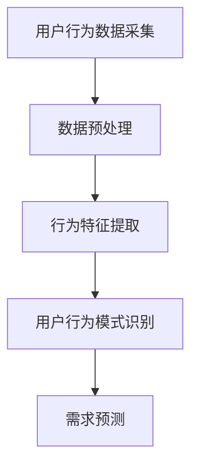

---

##### 2.2 用户画像构建

用户画像构建是AI定制需求满足系统的核心环节之一，它通过整合和分析用户的各种数据，为每个用户创建一个详细的、多维度的个性化描述。用户画像不仅可以帮助企业更好地理解用户，还能够为个性化推荐、精准营销和用户体验优化提供重要支持。

###### 2.2.1 用户画像的基本概念

**用户画像**是指对用户特征进行系统性、结构化的描述和抽象，通常包括以下几个方面：

- **基本信息**：如性别、年龄、职业、教育背景等。
- **行为特征**：如浏览习惯、购买行为、评论习惯、社交媒体活动等。
- **兴趣偏好**：如喜欢的产品类型、品牌、颜色、功能等。
- **社交关系**：如好友、群组、关注者等。
- **地理位置**：如所在城市、经纬度等。
- **消费能力**：如消费水平、购买频率、购买金额等。

用户画像的核心在于通过多维度的数据，构建出一个既全面又精准的用户形象，以便为后续的个性化服务和推荐提供依据。

###### 2.2.2 用户画像构建方法

用户画像的构建方法通常包括以下步骤：

1. **数据收集**：从多个渠道收集用户数据，如网站日志、用户反馈、社交媒体数据、交易记录等。
2. **数据预处理**：对收集到的数据进行清洗、去重和格式转换，确保数据的质量和一致性。
3. **特征提取**：从预处理后的数据中提取关键特征，如行为特征、兴趣偏好等。
4. **数据融合**：将来自不同渠道和维度的数据整合到一个统一的框架中，构建出一个完整的用户画像。
5. **数据分析**：对用户画像进行深入分析，挖掘用户的潜在需求和偏好。
6. **模型训练**：使用机器学习和深度学习算法，对用户画像进行建模和预测。

**伪代码示例**：

```python
def build_user_profile(data_sources):
    data = collect_and_preprocess_data(data_sources)
    features = extract_user_features(data)
    profile = merge_and_analyze_features(features)
    model = train_user_behavior_model(profile)
    return profile, model
```

###### 2.2.3 用户画像优化策略

为了确保用户画像的准确性和有效性，需要不断进行优化。以下是一些常用的用户画像优化策略：

1. **动态更新**：用户行为和偏好是动态变化的，系统需要定期更新用户画像，以反映最新的用户特征。
2. **数据清洗**：定期清洗用户数据，去除无效、过时或错误的数据，确保用户画像的准确性。
3. **交叉验证**：使用交叉验证技术，对用户画像模型进行评估和调整，以提高模型的预测准确率。
4. **反馈机制**：建立用户反馈机制，收集用户对推荐和服务的反馈，根据反馈优化用户画像。
5. **个性化调整**：根据用户的个性化需求，调整用户画像的权重和维度，使其更加符合用户的实际需求。

**伪代码示例**：

```python
def optimize_user_profile(profile, feedback):
    updated_data = preprocess_new_data(feedback)
    new_features = extract_and_merge_features(updated_data, profile)
    optimized_profile = update_and_retrain_model(profile, new_features)
    return optimized_profile
```

通过以上方法，用户画像构建模块能够有效地提取、整合和分析用户数据，为AI定制需求满足系统提供强有力的支持。

---

**Mermaid 流程图示例：**

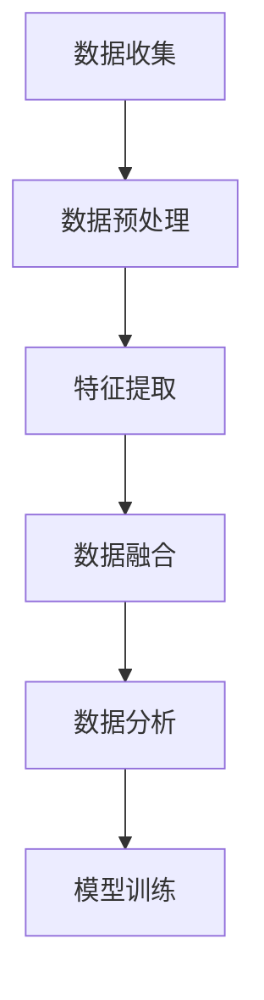

---

##### 2.3 需求预测模型

需求预测模型是AI定制需求满足系统中的关键组件，其主要任务是根据用户的历史行为和当前状态，预测用户未来的需求和行为。需求预测模型的准确性和有效性直接关系到推荐系统的质量和用户体验。

###### 2.3.1 需求预测模型概述

需求预测模型是一种基于数据的预测方法，通过分析用户的历史行为、偏好数据以及环境因素，预测用户未来的需求。需求预测模型广泛应用于个性化推荐、风险控制、供应链优化等领域。在需求预测模型中，常见的模型类型包括以下几种：

1. **回归模型**：如线性回归、逻辑回归等，主要用于预测连续值目标。
2. **分类模型**：如决策树、随机森林等，主要用于预测离散值目标。
3. **时间序列模型**：如ARIMA、LSTM等，主要用于预测时间序列数据。
4. **深度学习模型**：如卷积神经网络（CNN）、循环神经网络（RNN）、Transformer等，主要用于处理复杂和非线性数据。

选择合适的模型类型取决于数据的特点和应用场景。例如，对于短期需求预测，时间序列模型通常更为有效；而对于长期需求预测，深度学习模型可能更具优势。

###### 2.3.2 伪代码示例

以下是一个简单的需求预测模型的伪代码示例，该示例使用线性回归模型预测用户下一次购买的时间。

```python
import numpy as np
from sklearn.linear_model import LinearRegression

# 假设我们有历史购买数据，包括用户ID和时间戳
user_purchase_data = {
    'user1': np.array([1, 2, 3, 4, 5]),  # 用户1的购买时间（天）
    'user2': np.array([5, 7, 10, 15, 20]),  # 用户2的购买时间（天）
    # 更多用户数据...
}

# 构建特征矩阵和目标向量
X = np.array([[i] for i in range(len(user_purchase_data))])  # 特征：用户索引
y = np.array([data for data in user_purchase_data.values()])  # 目标：用户购买时间

# 创建线性回归模型并进行训练
model = LinearRegression()
model.fit(X, y)

# 预测用户下一次购买时间
next_purchase_time = model.predict([[len(user_purchase_data)]])
print(f"下一个购买时间预测：{next_purchase_time}")
```

在这个示例中，我们首先收集了用户的历史购买时间数据，然后构建了特征矩阵（用户索引）和目标向量（购买时间）。接着，我们使用线性回归模型对这些数据进行训练，并使用训练好的模型预测用户下一次购买的时间。

###### 2.3.3 详细讲解与举例说明

需求预测模型的详细讲解需要从以下几个方面展开：

1. **模型选择**：根据数据的特性和应用场景选择合适的模型。例如，对于短期需求预测，可以考虑使用时间序列模型；对于长期需求预测，可以考虑使用深度学习模型。
2. **特征工程**：从原始数据中提取关键特征，如用户历史行为、时间间隔、季节性等。特征工程的质量直接影响模型的预测性能。
3. **模型训练**：使用机器学习和深度学习算法对特征数据进行训练，构建预测模型。常见的训练方法包括批量训练、随机训练、交叉验证等。
4. **模型评估**：使用验证集或测试集对训练好的模型进行评估，常用的评估指标包括均方误差（MSE）、均方根误差（RMSE）、准确率、召回率等。
5. **模型部署**：将训练好的模型部署到生产环境中，使其能够实时预测用户需求。在部署过程中，需要考虑模型的性能优化、实时更新和维护等问题。

以下是一个详细的举例说明，假设我们需要预测用户在电商平台上下一次购买的时间：

1. **数据收集**：从电商平台的历史交易数据中，收集用户ID、购买时间、购买商品种类等数据。
2. **特征工程**：提取关键特征，如用户购买频率、购买商品种类、购买时间间隔、季节性因素等。例如，用户购买频率可以使用用户在一段时间内的购买次数表示，购买时间间隔可以使用相邻两次购买的时间差表示。
3. **模型训练**：使用时间序列模型（如ARIMA）对特征数据进行训练，构建需求预测模型。
4. **模型评估**：使用验证集对训练好的模型进行评估，调整模型参数，优化模型性能。
5. **模型部署**：将训练好的模型部署到电商平台的服务器上，使其能够实时预测用户下一次购买的时间。

通过以上步骤，我们能够构建一个有效的需求预测模型，为电商平台提供精准的用户需求预测服务，从而提升用户体验和业务效果。

---

**Mermaid 流程图示例：**

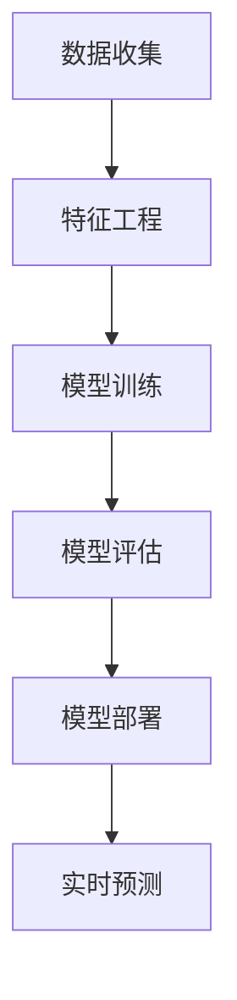

---

##### 2.4 需求预测模型的实现

在本节中，我们将详细探讨需求预测模型的实现方法，包括数据预处理、特征工程、模型选择与训练，以及模型的评估和优化。

###### 2.4.1 数据预处理

数据预处理是需求预测模型实现的基础步骤。这一步骤主要包括数据清洗、数据转换和数据归一化等。

1. **数据清洗**：清洗数据的主要目标是去除重复记录、无效数据和错误数据。具体步骤如下：
    - 去除重复数据：使用去重函数（如`numpy.unique`）去除重复的记录。
    - 处理缺失数据：根据数据的重要性和实际情况，选择合适的策略，如删除缺失数据、填充缺失数据（如使用平均值、中位数、最近邻等）。
    - 修正错误数据：对明显错误的数据进行修正，例如，将异常值替换为合理的数值。

2. **数据转换**：将数据转换为适合模型训练的格式。具体步骤如下：
    - 转换数据类型：将字符串类型的数据转换为数值类型，例如，将日期字符串转换为日期类型。
    - 数据编码：对于分类数据，使用独热编码（One-Hot Encoding）或标签编码（Label Encoding）将其转换为数值类型。

3. **数据归一化**：通过归一化处理，将不同尺度的数据进行标准化，消除数据尺度差异。常用的归一化方法包括最小-最大归一化、标准归一化和对数归一化。

**伪代码示例**：

```python
import pandas as pd
from sklearn.preprocessing import MinMaxScaler, OneHotEncoder

# 假设我们有一个 DataFrame 'data' 包含用户数据
data = pd.read_csv('user_data.csv')

# 数据清洗
data.drop_duplicates(inplace=True)
data.dropna(inplace=True)  # 或者使用某种策略填充缺失值

# 数据转换
data['date'] = pd.to_datetime(data['date'])
data['category'] = data['category'].astype('category').cat.codes

# 数据归一化
scaler = MinMaxScaler()
normalized_data = scaler.fit_transform(data)
```

###### 2.4.2 特征工程

特征工程是需求预测模型成功的关键因素。这一步骤主要包括以下任务：

1. **特征提取**：从原始数据中提取有助于预测的变量。例如，从用户历史行为中提取购买频率、购买金额等。
2. **特征选择**：通过特征选择技术，筛选出对预测有显著影响的特征，提高模型性能。常用的特征选择方法包括过滤式特征选择、包裹式特征选择和嵌入式特征选择。
3. **特征组合**：将多个特征组合成新的特征，以增强模型的预测能力。例如，计算购买时间与季节因素的交互项。

**伪代码示例**：

```python
from sklearn.feature_selection import SelectKBest, f_classif

# 特征提取
data['purchase_frequency'] = data['number_of_purchases'] / data['days_since_last_purchase']
data['average_purchase_amount'] = data['total_purchase_amount'] / data['number_of_purchases']

# 特征选择
selector = SelectKBest(f_classif, k=10)
selected_features = selector.fit_transform(normalized_data, labels)

# 特征组合
data['seasonal_factor'] = data['month_of_year'] * data['day_of_week']
```

###### 2.4.3 模型选择与训练

在特征工程完成后，接下来是模型选择与训练。这一步骤包括以下任务：

1. **模型选择**：根据数据特点和预测任务选择合适的模型。常用的模型包括线性回归、决策树、随机森林、支持向量机等。
2. **模型训练**：使用训练集对选定的模型进行训练。常见的训练方法包括批量训练、随机训练、交叉验证等。
3. **模型评估**：使用验证集对训练好的模型进行评估，选择性能最佳的模型。

**伪代码示例**：

```python
from sklearn.linear_model import LinearRegression
from sklearn.model_selection import train_test_split

# 分割数据集
X_train, X_test, y_train, y_test = train_test_split(selected_features, labels, test_size=0.2, random_state=42)

# 模型训练
model = LinearRegression()
model.fit(X_train, y_train)

# 模型评估
train_score = model.score(X_train, y_train)
test_score = model.score(X_test, y_test)
print(f"训练集准确率：{train_score}, 测试集准确率：{test_score}")
```

###### 2.4.4 模型评估与优化

模型评估与优化是确保模型性能的关键步骤。这一步骤包括以下任务：

1. **评估指标**：选择合适的评估指标，如均方误差（MSE）、均方根误差（RMSE）、准确率、召回率等。
2. **超参数调整**：通过调整模型超参数，优化模型性能。常用的超参数调整方法包括网格搜索、贝叶斯优化等。
3. **模型优化**：使用交叉验证技术，对模型进行交叉验证，选择最佳模型参数。

**伪代码示例**：

```python
from sklearn.model_selection import GridSearchCV

# 超参数调整
param_grid = {'C': [0.1, 1, 10], 'kernel': ['linear', 'rbf']}
grid_search = GridSearchCV(SVC(), param_grid, cv=5)
grid_search.fit(X_train, y_train)

# 模型优化
best_model = grid_search.best_estimator_
best_score = grid_search.best_score_
print(f"最佳模型参数：{best_model}, 最佳准确率：{best_score}")
```

通过以上步骤，我们能够实现一个完整的需求预测模型，为AI定制需求满足系统提供有效的需求预测能力。

---

**Mermaid 流程图示例：**

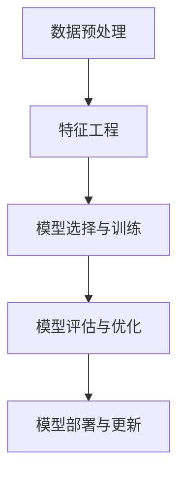

---

##### 2.5 个性化推荐算法

个性化推荐算法是AI定制需求满足系统的核心组成部分，其主要目标是根据用户的兴趣和行为，为用户推荐最相关、最有价值的产品、服务或内容。个性化推荐算法广泛应用于电商、社交媒体、视频平台、新闻网站等领域，显著提升了用户体验和用户满意度。

###### 2.5.1 内容推荐算法

内容推荐算法基于内容的相似性进行推荐，其基本思想是识别用户感兴趣的内容，然后推荐与这些内容相似的其他内容。内容推荐算法主要包括以下几种：

1. **基于内容的过滤推荐（Content-Based Filtering）**：
    - **相似性计算**：通过计算内容之间的相似性度量，如文本相似性、图像相似性、音频相似性等。
    - **推荐生成**：为用户推荐与其兴趣相似的内容。

   **伪代码示例**：

   ```python
   def content_based_recommendation(user_interests, item_content):
       similarities = calculate_similarity(user_interests, item_content)
       recommended_items = select_top_items(similarities)
       return recommended_items
   ```

2. **基于属性的过滤推荐（Attribute-Based Filtering）**：
    - **特征提取**：提取内容的属性特征，如关键词、标签、分类等。
    - **推荐生成**：为用户推荐具有相似属性的内容。

   **伪代码示例**：

   ```python
   def attribute_based_recommendation(user_attributes, item_attributes):
       attribute_similarity = calculate_attribute_similarity(user_attributes, item_attributes)
       recommended_items = select_top_items(attribute_similarity)
       return recommended_items
   ```

3. **混合推荐（Hybrid Recommendation）**：
    - **组合策略**：结合基于内容、基于属性和其他推荐策略，提高推荐效果。

   **伪代码示例**：

   ```python
   def hybrid_recommendation(user_profile, item_content, item_attributes):
       content_similarity = calculate_similarity(user_profile['interests'], item_content)
       attribute_similarity = calculate_similarity(user_profile['attributes'], item_attributes)
       combined_similarity = combine_similarity_scores(content_similarity, attribute_similarity)
       recommended_items = select_top_items(combined_similarity)
       return recommended_items
   ```

###### 2.5.2 协同过滤推荐算法

协同过滤推荐算法通过分析用户之间的相似性和用户对物品的评分来生成推荐。协同过滤推荐算法分为以下几种：

1. **基于用户的协同过滤（User-Based Collaborative Filtering）**：
    - **相似性计算**：计算用户之间的相似性度量，如余弦相似度、皮尔逊相关系数等。
    - **推荐生成**：为用户推荐与相似用户喜欢的物品。

   **伪代码示例**：

   ```python
   def user_based_collaborative_filtering(user_similarity_matrix, user_ratings, item_ratings):
       user_similarity_scores = calculate_similarity_scores(user_similarity_matrix)
       user_item_similarities = calculate_user_item_similarity_scores(user_similarity_scores, item_ratings)
       recommended_items = select_top_items(user_item_similarities)
       return recommended_items
   ```

2. **基于模型的协同过滤（Model-Based Collaborative Filtering）**：
    - **矩阵分解**：通过矩阵分解技术（如SVD、NN-SVD等）将用户-物品评分矩阵分解为低维矩阵。
    - **推荐生成**：根据分解后的矩阵生成推荐列表。

   **伪代码示例**：

   ```python
   def model_based_collaborative_filtering(user_item_matrix, latent_factors):
       user_latent_features = reconstruct_user_features(user_item_matrix, latent_factors)
       item_latent_features = reconstruct_item_features(user_item_matrix, latent_factors)
       user_item_predictions = calculate_predictions(user_latent_features, item_latent_features)
       recommended_items = select_top_items(user_item_predictions)
       return recommended_items
   ```

3. **混合协同过滤（Hybrid Collaborative Filtering）**：
    - **组合策略**：结合基于用户的协同过滤和基于模型的协同过滤，提高推荐效果。

   **伪代码示例**：

   ```python
   def hybrid_collaborative_filtering(user_similarity_matrix, user_ratings, item_ratings, latent_factors):
       user_similarity_scores = calculate_similarity_scores(user_similarity_matrix)
       user_item_similarities = calculate_user_item_similarity_scores(user_similarity_scores, item_ratings)
       user_latent_features = reconstruct_user_features(user_item_matrix, latent_factors)
       item_latent_features = reconstruct_item_features(user_item_matrix, latent_factors)
       user_item_predictions = calculate_predictions(user_latent_features, item_latent_features)
       combined_predictions = combine_predictions(user_item_similarities, user_item_predictions)
       recommended_items = select_top_items(combined_predictions)
       return recommended_items
   ```

###### 2.5.3 深度学习推荐算法

深度学习推荐算法利用深度神经网络从大量非结构化数据中提取用户特征和物品特征，生成个性化的推荐。深度学习推荐算法主要包括以下几种：

1. **基于神经网络的协同过滤（Neural Collaborative Filtering）**：
    - **网络结构**：结合用户-物品评分矩阵和深度神经网络，通过多层感知器（MLP）或循环神经网络（RNN）提取特征。
    - **推荐生成**：根据提取的特征生成推荐列表。

   **伪代码示例**：

   ```python
   def neural_collaborative_filtering(user_item_matrix, hidden_layers, activation_function):
       model = NeuralNetwork(user_item_matrix, hidden_layers, activation_function)
       trained_model = model.fit(user_item_matrix)
       user_features, item_features = model.extract_features(trained_model)
       user_item_predictions = model.predict(user_features, item_features)
       recommended_items = select_top_items(user_item_predictions)
       return recommended_items
   ```

2. **基于注意力机制的推荐（Attention-based Recommendation）**：
    - **注意力机制**：通过注意力机制（如Self-Attention、Transformer）提取用户和物品的特征，提高推荐效果。
    - **推荐生成**：根据注意力机制生成的特征生成推荐列表。

   **伪代码示例**：

   ```python
   def attention_based_recommendation(user_representation, item_representation, attention机制):
       attention_scores = calculate_attention_scores(user_representation, item_representation, attention机制)
       combined_representation = combine_representation(user_representation, item_representation, attention_scores)
       user_item_predictions = calculate_predictions(combined_representation)
       recommended_items = select_top_items(user_item_predictions)
       return recommended_items
   ```

3. **基于图神经网络的推荐（Graph Neural Network Recommendation）**：
    - **图结构**：构建用户-物品的图结构，通过图神经网络（如GCN、GAT）提取特征。
    - **推荐生成**：根据图神经网络生成的特征生成推荐列表。

   **伪代码示例**：

   ```python
   def graph_neural_network_recommendation(graph, hidden_layers, activation_function):
       model = GraphNeuralNetwork(graph, hidden_layers, activation_function)
       trained_model = model.fit(graph)
       user_features, item_features = model.extract_features(trained_model)
       user_item_predictions = model.predict(user_features, item_features)
       recommended_items = select_top_items(user_item_predictions)
       return recommended_items
   ```

通过上述内容，我们详细介绍了个性化推荐算法的不同类型及其实现方法。在实际应用中，可以根据具体需求和数据特点选择合适的推荐算法，从而为用户提供精准、高效的个性化推荐服务。

---

**Mermaid 流程图示例：**

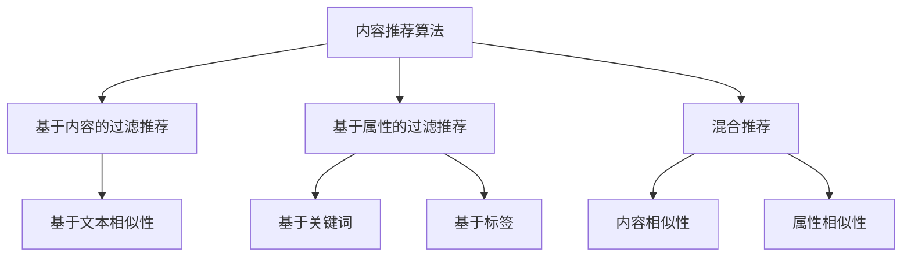

---

### 3.1 内容推荐算法

内容推荐算法是一种基于内容相似性的推荐方法，其核心思想是识别用户已喜欢的项目（如文章、产品、音乐等），然后推荐与这些项目在内容上相似的其他项目。这种推荐算法在诸如视频平台、新闻网站和电商平台上有着广泛的应用，通过提升用户的兴趣匹配度，从而增强用户体验。

**内容推荐算法概述**

内容推荐算法的基本流程包括以下几步：

1. **内容特征提取**：首先，系统需要提取用户和待推荐项目的内容特征。对于文本数据，可以使用词频-逆文档频率（TF-IDF）、词嵌入（如Word2Vec、GloVe）等方法；对于图像或视频数据，可以使用视觉特征提取方法（如SIFT、HOG、CNN）。
2. **相似性计算**：接下来，系统通过计算用户特征和项目特征之间的相似度，确定哪些项目与用户的历史喜好最匹配。常见的相似度计算方法包括余弦相似度、欧氏距离等。
3. **推荐列表生成**：最后，系统根据相似度分数为用户生成推荐列表，推荐那些相似度最高的项目。

**伪代码示例**

以下是一个简单的伪代码示例，展示了内容推荐算法的实现：

```python
import numpy as np
from sklearn.metrics.pairwise import cosine_similarity

# 假设我们有用户已喜欢的项目特征矩阵 U 和待推荐的项目特征矩阵 I
U = np.array([[0.1, 0.4, 0.3], [0.2, 0.5, 0.2], [0.3, 0.3, 0.4]])  # 用户特征矩阵
I = np.array([[0.1, 0.3, 0.5], [0.2, 0.2, 0.4], [0.3, 0.5, 0.2]])  # 项目特征矩阵

# 计算用户特征和项目特征之间的相似度
similarity_matrix = cosine_similarity(U, I)

# 根据相似度矩阵为用户生成推荐列表
recommended_items = []
for user_index, user_feature in enumerate(U):
    # 选择相似度最高的项目
    top_item_indices = np.argsort(similarity_matrix[user_index])[::-1]
    recommended_items.append(I[top_item_indices[1]])  # 排除用户已喜欢的项目

print("推荐列表：", recommended_items)
```

**内容推荐算法的优缺点**

- **优点**：
  - **易于实现**：内容推荐算法相对简单，易于实现和理解。
  - **高效性**：对于大量文本数据，特征提取和相似度计算通常较为高效。
  - **多样性**：可以通过调整相似度阈值，控制推荐项目的多样性。

- **缺点**：
  - **冷启动问题**：对于新用户或新项目，由于缺乏历史数据，推荐效果较差。
  - **稀疏性**：当数据维度较高时，用户-项目矩阵往往非常稀疏，导致相似度计算效果不佳。
  - **用户偏好不敏感**：内容推荐算法主要关注项目之间的相似性，对于用户的个性化偏好处理不够精细。

**应用场景**

内容推荐算法广泛应用于以下场景：

- **新闻推荐**：根据用户的阅读历史和兴趣，推荐相关新闻文章。
- **音乐推荐**：根据用户的听歌习惯和喜好，推荐相似的音乐作品。
- **电商推荐**：根据用户的购物记录和浏览历史，推荐相关商品。
- **视频推荐**：根据用户的观看历史和评分，推荐相关视频内容。

通过内容推荐算法，企业能够为用户提供个性化的内容体验，提高用户满意度和留存率。

---

**Mermaid 流程图示例：**

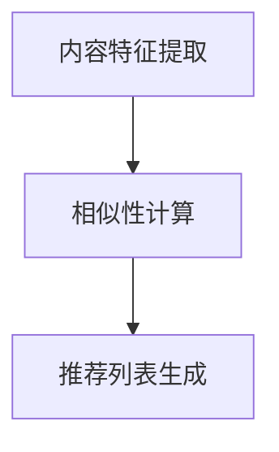

---

### 3.2 协同过滤推荐算法

协同过滤推荐算法是一种基于用户之间相似性和用户-项目评分矩阵的推荐方法。其核心思想是通过分析用户之间的行为相似性，推断用户未评分的项目偏好，从而生成个性化推荐列表。协同过滤推荐算法分为基于用户的协同过滤（User-Based Collaborative Filtering，UBCF）和基于模型的协同过滤（Model-Based Collaborative Filtering，MBCF）两大类。

**协同过滤算法概述**

协同过滤推荐算法的基本流程包括以下几步：

1. **用户相似性计算**：通过计算用户之间的相似度，确定哪些用户与目标用户最相似。常用的相似性度量方法包括余弦相似度、皮尔逊相关系数、Jaccard系数等。
2. **评分预测**：根据相似用户对项目的评分，预测目标用户对未评分项目的评分。评分预测方法可以是基于相似度加权平均、基于模型预测等。
3. **推荐列表生成**：根据预测的评分，为用户生成推荐列表，通常选择评分最高的项目。

**伪代码示例**

以下是一个简单的伪代码示例，展示了基于用户的协同过滤算法的实现：

```python
import numpy as np
from sklearn.metrics.pairwise import cosine_similarity

# 假设我们有用户-项目评分矩阵 R 和目标用户 u 的评分向量 Ru
R = np.array([[5, 3, 0, 1], [2, 0, 3, 4], [0, 2, 5, 0]])  # 用户-项目评分矩阵
Ru = np.array([5, 0, 3, 1])  # 目标用户 u 的评分向量

# 计算用户相似性矩阵 S
S = cosine_similarity(R, R)

# 预测目标用户 u 对未评分项目的评分
predictions = []
for i in range(len(Ru)):
    if Ru[i] == 0:
        similarity_scores = S[u, :]
        predicted_rating = np.dot(similarity_scores, R[u, :]) / np.linalg.norm(similarity_scores)
        predictions.append(predicted_rating)
    else:
        predictions.append(Ru[i])

# 生成推荐列表
recommended_items = [item for item, rating in enumerate(predictions) if rating > threshold]

print("推荐列表：", recommended_items)
```

**协同过滤算法的优缺点**

- **优点**：
  - **无冷启动问题**：协同过滤算法不需要用户的历史行为数据，对新用户和新项目都能给出合理的推荐。
  - **高效性**：相比深度学习等算法，协同过滤算法在计算资源和时间成本上更为高效。
  - **用户行为敏感**：协同过滤算法直接利用用户的历史评分数据，能够较好地反映用户的实际偏好。

- **缺点**：
  - **数据稀疏性**：当用户数量和项目数量非常多时，用户-项目评分矩阵往往非常稀疏，导致相似性计算和评分预测效果不佳。
  - **偏好多样性不足**：协同过滤算法主要依赖于用户之间的行为相似性，难以捕捉用户的个性化偏好。
  - **预测准确性受限**：由于评分矩阵的稀疏性和噪声数据的影响，协同过滤算法的预测准确性可能受到限制。

**应用场景**

协同过滤推荐算法广泛应用于以下场景：

- **电商推荐**：根据用户的购物行为和历史评分，推荐用户可能感兴趣的商品。
- **社交媒体**：根据用户的互动行为和好友评分，推荐用户可能感兴趣的内容。
- **在线视频平台**：根据用户的观看历史和评分，推荐用户可能感兴趣的视频内容。

通过协同过滤推荐算法，企业能够为用户提供个性化的推荐服务，提高用户满意度和留存率。

---

**Mermaid 流程图示例：**

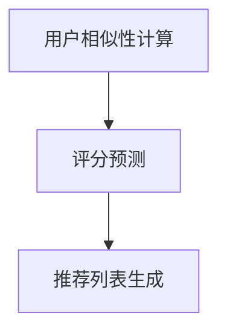

---

### 3.3 深度学习推荐算法

深度学习推荐算法利用深度神经网络从大量非结构化数据中提取特征，生成个性化的推荐。与传统的协同过滤和基于内容的推荐算法相比，深度学习推荐算法具有更高的灵活性和更好的性能。本节将介绍几种常见的深度学习推荐算法，包括基于神经网络的协同过滤、注意力机制和图神经网络等。

**深度学习推荐算法概述**

深度学习推荐算法的基本流程包括以下几步：

1. **数据预处理**：对用户和项目数据进行清洗、编码和预处理，将原始数据转换为适合深度学习模型处理的形式。
2. **特征提取**：使用深度神经网络从数据中提取高层次的、有代表性的特征。
3. **模型训练**：使用提取到的特征数据训练深度学习模型，优化模型参数。
4. **推荐生成**：根据训练好的模型，为用户生成个性化的推荐列表。

**基于神经网络的协同过滤（Neural Collaborative Filtering）**

基于神经网络的协同过滤（Neural Collaborative Filtering，NCF）结合了矩阵分解和深度学习技术，通过构建多层神经网络来提取用户和项目的特征。NCF的主要优势在于能够捕捉数据中的复杂关系，提高推荐准确性。

**算法原理**

1. **输入层**：用户和项目嵌入向量作为输入。
2. **交互层**：通过交互层计算用户和项目嵌入向量之间的内积，生成交互特征。
3. **隐含层**：使用多层感知器（MLP）对交互特征进行非线性变换，提取更高层次的特征。
4. **输出层**：使用输出层生成预测评分。

**伪代码示例**

以下是一个基于神经网络的协同过滤算法的伪代码示例：

```python
import tensorflow as tf

# 定义输入层
user_embedding = tf.keras.layers.Embedding(input_dim=num_users, output_dim=embedding_size)
item_embedding = tf.keras.layers.Embedding(input_dim=num_items, output_dim=embedding_size)

# 定义交互层
user_vector = user_embedding(user_ids)
item_vector = item_embedding(item_ids)
interaction = tf.reduce_sum(user_vector * item_vector, axis=1)

# 定义隐含层
hidden_layer = tf.keras.layers.Dense(units=hidden_size, activation='relu')(interaction)

# 定义输出层
rating = tf.keras.layers.Dense(units=1, activation='sigmoid')(hidden_layer)

# 编译模型
model = tf.keras.Model(inputs=[user_ids, item_ids], outputs=rating)
model.compile(optimizer='adam', loss='binary_crossentropy', metrics=['accuracy'])

# 训练模型
model.fit([user_ids_train, item_ids_train], ratings_train, epochs=10, batch_size=64)
```

**基于注意力机制的推荐（Attention-based Recommendation）**

基于注意力机制的推荐算法利用注意力机制（如Self-Attention、Transformer）来提取用户和项目之间的关键特征，提高推荐的精度和灵活性。

**算法原理**

1. **输入层**：用户和项目嵌入向量作为输入。
2. **注意力层**：通过注意力机制计算用户和项目之间的注意力权重，提取关键特征。
3. **融合层**：将注意力权重与用户和项目嵌入向量进行融合，生成新的特征向量。
4. **输出层**：使用输出层生成预测评分。

**伪代码示例**

以下是一个基于注意力机制的推荐算法的伪代码示例：

```python
import tensorflow as tf
from tensorflow.keras.layers import Embedding, Dot, Lambda

# 定义输入层
user_embedding = Embedding(input_dim=num_users, output_dim=embedding_size)
item_embedding = Embedding(input_dim=num_items, output_dim=embedding_size)

# 定义注意力层
attention_layer = Lambda(lambda x: tf.reduce_sum(x[0] * x[1], axis=1))

# 定义融合层
combined_vector = Lambda(lambda x: x[0] + x[1])

# 定义输出层
rating = tf.keras.layers.Dense(units=1, activation='sigmoid')(combined_vector([user_vector, item_vector]))

# 编译模型
model = tf.keras.Model(inputs=[user_ids, item_ids], outputs=rating)
model.compile(optimizer='adam', loss='binary_crossentropy', metrics=['accuracy'])

# 训练模型
model.fit([user_ids_train, item_ids_train], ratings_train, epochs=10, batch_size=64)
```

**基于图神经网络的推荐（Graph Neural Network Recommendation）**

基于图神经网络的推荐算法利用图结构来表示用户和项目之间的关系，通过图神经网络（如GCN、GAT）提取用户和项目的特征，生成个性化的推荐。

**算法原理**

1. **输入层**：用户和项目嵌入向量作为输入。
2. **图神经网络层**：通过图神经网络层（如GCN、GAT）进行多跳信息传播，提取高层次的、有代表性的特征。
3. **输出层**：使用输出层生成预测评分。

**伪代码示例**

以下是一个基于图神经网络的推荐算法的伪代码示例：

```python
import tensorflow as tf
from tensorflow.keras.layers import Embedding, Dot, Dense

# 定义输入层
user_embedding = Embedding(input_dim=num_users, output_dim=embedding_size)
item_embedding = Embedding(input_dim=num_items, output_dim=embedding_size)

# 定义图神经网络层
gcn_layer = tf.keras.layers.Dense(units=hidden_size, activation='relu')

# 定义输出层
rating = Dense(units=1, activation='sigmoid')(gcn_layer([user_embedding, item_embedding]))

# 编译模型
model = tf.keras.Model(inputs=[user_ids, item_ids], outputs=rating)
model.compile(optimizer='adam', loss='binary_crossentropy', metrics=['accuracy'])

# 训练模型
model.fit([user_ids_train, item_ids_train], ratings_train, epochs=10, batch_size=64)
```

通过上述介绍，我们可以看到深度学习推荐算法具有强大的特征提取能力和灵活性，能够为用户生成精准、个性化的推荐。在实际应用中，可以根据具体需求和数据特点选择合适的深度学习推荐算法，从而提升用户体验和业务效果。

---

**Mermaid 流程图示例：**

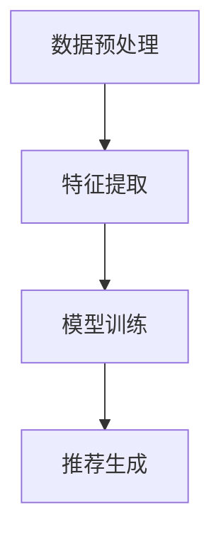

---

### 4.1 用户反馈收集

用户反馈收集是AI定制需求满足系统中的一个关键环节，它通过系统性地收集和分析用户在使用产品或服务过程中的反馈，来不断优化系统的性能和用户体验。用户反馈可以来自于多种渠道，如用户评分、评论、反馈表单、社交媒体互动等。以下是用户反馈收集的详细过程：

#### 4.1.1 用户反馈数据采集

用户反馈数据的采集是整个反馈收集过程的第一步。为了确保反馈数据的全面性和准确性，系统需要从多个渠道收集用户反馈：

1. **在线反馈表单**：在线反馈表单是用户提交反馈的主要渠道之一。通过在网站或移动应用中集成反馈表单，用户可以直接在系统中提交他们的意见和建议。

   **伪代码示例**：

   ```python
   def collect_feedback_from_form(form_data):
       feedback = {
           'rating': form_data['rating'],
           'comments': form_data['comments'],
           'date': form_data['date']
       }
       return feedback
   ```

2. **用户评论**：用户在社交媒体平台、电商平台或应用商店中的评论也是重要的反馈来源。这些评论通常包含用户的真实体验和反馈，有助于了解用户的需求和问题。

   **伪代码示例**：

   ```python
   def collect_feedback_from_comments(comment_data):
       feedback = {
           'user_id': comment_data['user_id'],
           'product_id': comment_data['product_id'],
           'rating': comment_data['rating'],
           'comment': comment_data['comment'],
           'date': comment_data['date']
       }
       return feedback
   ```

3. **用户评分**：用户在应用或服务中使用后可能会给予评分。这些评分通常以数字或星标形式存在，是用户满意度的量化表示。

   **伪代码示例**：

   ```python
   def collect_feedback_from_ratings(rating_data):
       feedback = {
           'user_id': rating_data['user_id'],
           'product_id': rating_data['product_id'],
           'rating': rating_data['rating'],
           'date': rating_data['date']
       }
       return feedback
   ```

4. **实时交互**：通过实时交互渠道，如在线聊天、客服系统等，可以直接与用户沟通，获取他们的即时反馈。

   **伪代码示例**：

   ```python
   def collect_feedback_from_interaction(interaction_data):
       feedback = {
           'user_id': interaction_data['user_id'],
           'issue': interaction_data['issue'],
           'solution': interaction_data['solution'],
           'date': interaction_data['date']
       }
       return feedback
   ```

#### 4.1.2 用户反馈数据分析

在收集到用户反馈数据后，系统需要对反馈数据进行分析，以提取有价值的信息。数据分析通常包括以下步骤：

1. **数据预处理**：对收集到的反馈数据进行清洗和预处理，如去除重复记录、处理缺失值、格式转换等。

   **伪代码示例**：

   ```python
   def preprocess_feedback(feedback_data):
       cleaned_feedback = []
       for data in feedback_data:
           if data['rating'] is not None:
               cleaned_feedback.append(data)
       return cleaned_feedback
   ```

2. **情感分析**：通过自然语言处理技术（如情感分析、主题模型等），对用户的文本反馈进行分析，识别用户情感倾向和主要问题。

   **伪代码示例**：

   ```python
   from textblob import TextBlob

   def perform_sentiment_analysis(text):
       analysis = TextBlob(text)
       return analysis.sentiment.polarity
   ```

3. **数据可视化**：使用数据可视化工具（如图表、仪表板等），将分析结果以直观的形式展示，帮助团队更好地理解和利用反馈数据。

   **伪代码示例**：

   ```python
   import matplotlib.pyplot as plt

   def visualize_feedback(feedback_data):
       ratings = [data['rating'] for data in feedback_data]
       plt.hist(ratings, bins=5)
       plt.xlabel('Rating')
       plt.ylabel('Frequency')
       plt.title('User Rating Distribution')
       plt.show()
   ```

4. **分类与聚类**：通过分类和聚类算法，将反馈数据按照主题或类型进行分组，以便更有效地进行后续分析和处理。

   **伪代码示例**：

   ```python
   from sklearn.cluster import KMeans

   def classify_and_cluster_feedback(feedback_data):
       comments = [data['comment'] for data in feedback_data]
       kmeans = KMeans(n_clusters=5)
       kmeans.fit(comments)
       clusters = kmeans.predict(comments)
       return clusters
   ```

通过以上步骤，系统可以全面、准确地收集和分析用户反馈，为后续的优化和改进提供有力支持。

---

**Mermaid 流程图示例：**

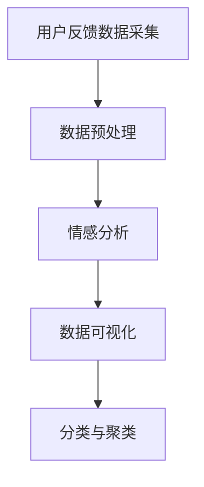

---

### 4.2 系统动态调整

系统动态调整是AI定制需求满足系统中确保推荐系统性能持续优化的重要环节。通过不断地调整和优化系统，能够确保推荐结果始终满足用户的需求，提升用户体验。以下是系统动态调整的核心策略和方法。

#### 4.2.1 系统调整策略

1. **基于反馈的调整**：系统根据用户反馈进行实时调整。当用户对推荐内容提供反馈时，系统会分析反馈内容，根据用户的满意度和需求进行相应的调整。例如，如果用户对某次推荐不满意，系统可能会调整推荐算法的参数，以减少类似推荐的发生。

   **伪代码示例**：

   ```python
   def adjust_system_based_on_feedback(feedback):
       if feedback['rating'] < threshold:
           adjust_recommendation_algorithm(feedback['issue'])
   ```

2. **基于数据驱动的调整**：系统通过分析用户行为数据和推荐结果，识别潜在的问题和改进点。例如，通过监控推荐系统的点击率、转化率等关键指标，系统可以发现用户对某些推荐内容反应不佳，从而进行相应的调整。

   **伪代码示例**：

   ```python
   def adjust_system_based_on_data_metrics(metrics):
       if metrics['click-through-rate'] < threshold:
           optimize_recommendation_content()
   ```

3. **基于机器学习的调整**：系统可以利用机器学习算法，从历史数据和用户反馈中学习，自动调整推荐策略。例如，通过训练用户行为预测模型，系统可以预测哪些推荐内容可能会受到用户的欢迎，从而提前进行调整。

   **伪代码示例**：

   ```python
   def adjust_system_based_on_ml_models(ml_model):
       predicted_feedback = ml_model.predict(user_behavior_data)
       if predicted_feedback['satisfaction'] < threshold:
           update_recommendation_strategy(predicted_feedback['issue'])
   ```

#### 4.2.2 系统优化算法

1. **参数调优**：系统通过调优推荐算法的参数，如相似度阈值、学习率等，来提高推荐效果。常见的参数调优方法包括网格搜索、贝叶斯优化等。

   **伪代码示例**：

   ```python
   from sklearn.model_selection import GridSearchCV

   def optimize_parameters(model, param_grid):
       grid_search = GridSearchCV(model, param_grid, cv=5)
       grid_search.fit(X_train, y_train)
       best_params = grid_search.best_params_
       return best_params
   ```

2. **协同过滤优化**：针对协同过滤算法，可以通过优化用户相似性计算和评分预测模型来提高推荐效果。例如，可以采用更先进的相似性度量方法（如余弦相似度、皮尔逊相关系数）或改进评分预测模型（如矩阵分解、深度学习模型）。

   **伪代码示例**：

   ```python
   def optimize协同过滤_similarity_and_prediction(model, new_similarity_metric):
       model = modify_similarity_metric(model, new_similarity_metric)
       model.fit(X_train, y_train)
       return model
   ```

3. **内容推荐优化**：针对内容推荐算法，可以通过优化内容特征提取和相似性计算方法来提高推荐效果。例如，可以采用更先进的特征提取技术（如词嵌入、视觉特征提取）或改进相似性计算方法（如基于语义的相似度计算）。

   **伪代码示例**：

   ```python
   def optimize_content_recommendation_features(extraction_method):
       features = extract_content_features(data, extraction_method)
       return features
   ```

4. **动态调整推荐策略**：系统可以根据实时用户行为数据，动态调整推荐策略。例如，当检测到用户兴趣发生变化时，系统可以调整推荐算法，以更好地匹配用户的新兴趣。

   **伪代码示例**：

   ```python
   def dynamic_adjustment_of_recommendation_strategy(user_behavior_data):
       if detect_interest_change(user_behavior_data):
           update_recommendation_strategy()
   ```

通过以上策略和方法，系统可以实现持续的动态调整和优化，确保推荐系统能够始终为用户提供高质量的个性化推荐。

---

**Mermaid 流程图示例：**

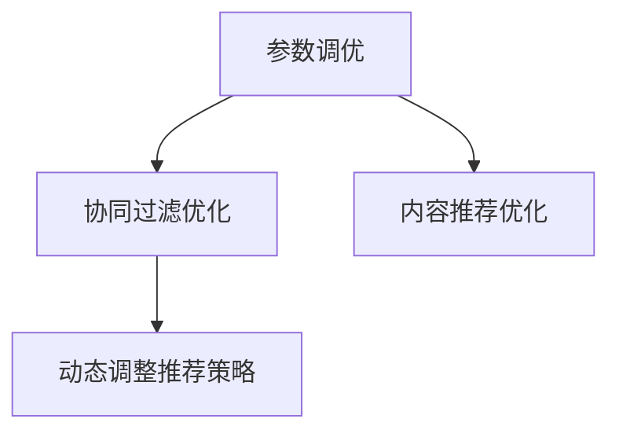

---

### 4.3 持续学习与自适应

持续学习与自适应是AI定制需求满足系统中确保系统性能持续优化和提升用户体验的关键机制。通过不断从用户行为和反馈中学习，系统能够适应用户需求的变化，提供更加精准和个性化的推荐。以下是持续学习与自适应的核心原理和算法。

#### 4.3.1 持续学习原理

持续学习是指系统能够在运行过程中不断更新模型和参数，以适应新的数据和环境。其核心思想是利用机器学习和深度学习算法，从用户行为和反馈中不断提取新的知识，更新和优化推荐模型。

1. **在线学习**：在线学习是一种能够在数据流中实时更新模型的方法。系统可以在用户互动的同时，实时调整模型参数，以立即反映用户行为的变化。在线学习的优点是响应速度快，但需要处理高频率的数据流和计算复杂性。

   **伪代码示例**：

   ```python
   def online_learning(user_behavior_data, model):
       model.partial_fit(user_behavior_data)
       return model
   ```

2. **批量学习**：批量学习是将一段时间内的用户数据批量处理，然后更新模型。批量学习的好处是可以在较低频率下进行计算，减少系统的计算负担，但响应速度较慢。

   **伪代码示例**：

   ```python
   def batch_learning(user_behavior_data, model):
       model.fit(user_behavior_data)
       return model
   ```

3. **增量学习**：增量学习是在已有模型的基础上，通过逐批次添加新数据来更新模型。这种方法结合了在线学习和批量学习的优点，能够在处理大量数据的同时，保持较低的延迟。

   **伪代码示例**：

   ```python
   def incremental_learning(user_behavior_data, model):
       for data_batch in user_behavior_data.batches():
           model.partial_fit(data_batch)
       return model
   ```

#### 4.3.2 自适应算法

自适应算法是指系统能够根据用户行为和反馈，动态调整推荐策略和模型参数，以提供更好的个性化推荐。以下是几种常见的自适应算法：

1. **自适应阈值调整**：系统可以根据用户反馈和互动行为，动态调整推荐阈值，以过滤出更符合用户兴趣的推荐内容。例如，如果用户对某次推荐的反应较差，系统可以降低推荐阈值，减少类似推荐的出现。

   **伪代码示例**：

   ```python
   def adjust_recommendation_threshold(feedback, current_threshold):
       if feedback['satisfaction'] < threshold:
           new_threshold = current_threshold * 0.9
       else:
           new_threshold = current_threshold * 1.1
       return new_threshold
   ```

2. **自适应模型更新**：系统可以根据用户行为和反馈，定期重新训练模型，以保持模型的准确性和适应性。例如，当用户兴趣发生变化时，系统可以重新训练用户画像和推荐模型，以提供更准确的推荐。

   **伪代码示例**：

   ```python
   def adaptive_model_update(user_behavior_data, model):
       new_model = train_new_model(user_behavior_data)
       model.replace(new_model)
       return model
   ```

3. **自适应反馈机制**：系统可以建立自适应的反馈机制，根据用户反馈和系统性能，自动调整推荐策略。例如，当检测到推荐系统的点击率或转化率下降时，系统可以自动触发反馈机制，分析用户行为和反馈，调整推荐算法。

   **伪代码示例**：

   ```python
   def adaptive_feedback_mechanism(metrics, current_strategy):
       if metrics['click-through-rate'] < threshold:
           new_strategy = adjust_recommendation_strategy(current_strategy, metrics)
           return new_strategy
       else:
           return current_strategy
   ```

通过持续学习和自适应算法，系统能够不断适应用户需求的变化，提供更精准、更个性化的推荐，从而提升用户体验和满意度。

---

**Mermaid 流程图示例：**

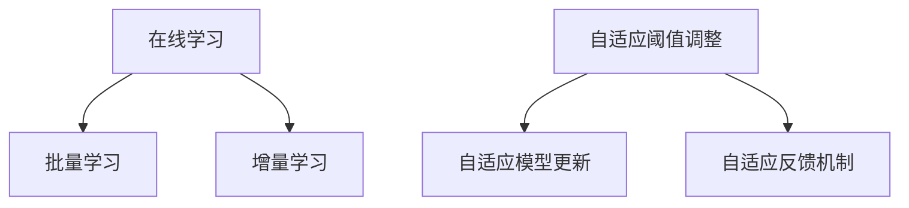

---

### 5.1 案例背景

在当今快速发展的电子商务市场中，为了在激烈的市场竞争中脱颖而出，电商平台纷纷采用AI定制需求满足系统以提高用户满意度和转化率。本文将研究一个知名电商平台的AI定制需求满足系统的设计与实现，该平台是一家全球领先的在线零售商，提供多样化的商品和服务，涵盖服装、电子产品、家居用品等多个类别。

**电商平台概述**

该电商平台拥有庞大的用户群体和丰富的商品库存，每天处理数百万次的用户请求和交易。为了满足不同用户的需求，平台希望通过AI定制技术，为用户提供个性化的购物体验。具体目标包括：

1. **提高用户满意度**：通过精准的个性化推荐，提高用户对平台商品的满意度。
2. **提升转化率**：通过个性化的推荐策略，增加用户的购买意愿，提高转化率。
3. **优化库存管理**：通过分析用户行为和需求，优化库存管理，减少库存过剩或短缺的情况。

**案例目标**

本案例的研究目标是通过构建一个AI定制需求满足系统，实现以下目标：

1. **需求分析**：通过分析用户行为数据，准确识别用户需求和偏好。
2. **个性化推荐**：基于用户需求，为用户推荐个性化的商品。
3. **用户反馈收集**：收集用户对推荐和购买体验的反馈，持续优化推荐系统和用户体验。
4. **系统优化**：根据用户反馈和业务需求，不断调整和优化推荐算法和策略。

通过上述目标的实现，该电商平台期望能够提升用户满意度和转化率，同时优化库存管理，提高运营效率。

---

### 5.2 系统设计与实现

在构建电商平台AI定制需求满足系统时，我们需要综合考虑需求分析、个性化推荐、用户反馈收集和系统优化等多个方面。以下是对该系统设计与实现过程的详细探讨。

**需求分析**

需求分析是AI定制需求满足系统的第一步，其核心目标是准确识别用户的需求和偏好。为了实现这一目标，系统需要从多个数据源收集用户行为数据，包括用户浏览历史、购买记录、评价和反馈等。具体步骤如下：

1. **数据收集**：通过网站埋点、日志分析等手段，收集用户的浏览行为数据，如页面访问次数、停留时间、点击路径等。
2. **数据预处理**：对收集到的原始数据进行清洗、去重和格式转换，确保数据的质量和一致性。
3. **用户画像构建**：通过分析用户行为数据，构建详细的用户画像，包括用户的兴趣爱好、行为习惯、购买偏好等多个维度。

**个性化推荐**

个性化推荐是AI定制需求满足系统的核心功能，通过为用户提供个性化的商品推荐，提升用户体验和满意度。个性化推荐模块主要包括以下几种方法：

1. **基于内容的推荐**：通过分析商品的内容特征，如标题、描述、标签等，为用户推荐相似的商品。这种方法适用于用户对商品类型有明确需求的场景。
2. **协同过滤推荐**：通过分析用户之间的行为相似性，推荐其他用户喜欢的商品。协同过滤推荐包括基于用户的协同过滤和基于模型的协同过滤。
3. **混合推荐**：结合基于内容和协同过滤的方法，提供更精准的推荐结果。混合推荐能够综合多种信息，提高推荐的多样性。

**用户反馈收集**

用户反馈收集是系统优化的重要环节，通过收集用户对推荐和购买体验的反馈，系统能够持续改进推荐算法和策略。用户反馈数据包括用户评分、评论、反馈表单等。具体步骤如下：

1. **反馈数据收集**：通过在线反馈表单、用户评价系统等渠道，收集用户的反馈数据。
2. **情感分析**：利用自然语言处理技术，对用户的文本反馈进行情感分析，识别用户的情感倾向和主要问题。
3. **数据可视化**：通过数据可视化工具，将分析结果以图表的形式展示，帮助团队更好地理解和利用反馈数据。

**系统优化**

系统优化是确保推荐系统持续提升性能的关键。通过不断调整和优化推荐算法和策略，系统能够更好地满足用户需求。具体步骤如下：

1. **参数调优**：通过调优推荐算法的参数，如相似度阈值、学习率等，提高推荐效果。常见的参数调优方法包括网格搜索、贝叶斯优化等。
2. **协同过滤优化**：针对协同过滤算法，通过优化用户相似性计算和评分预测模型，提高推荐准确性。
3. **内容推荐优化**：通过优化内容特征提取和相似性计算方法，提高内容推荐的多样性。
4. **动态调整推荐策略**：根据用户行为和反馈，动态调整推荐策略，以提供更符合用户兴趣的推荐。

**系统实现细节**

在系统实现过程中，我们需要考虑以下几个方面：

1. **数据存储**：使用分布式数据库存储用户行为数据和推荐结果，确保数据的高效存储和查询。
2. **计算框架**：采用分布式计算框架（如Apache Spark、TensorFlow）进行数据分析和模型训练，提高计算效率。
3. **实时推荐**：使用实时推荐系统（如Apache Flink、Apache Storm）为用户提供实时推荐结果，提高用户体验。
4. **监控与运维**：建立监控系统，实时监控推荐系统的性能和健康状况，确保系统的稳定运行。

通过上述系统设计与实现，电商平台能够为用户提供个性化的购物体验，提升用户满意度和转化率，同时优化库存管理，提高运营效率。

---

**Mermaid 流程图示例：**

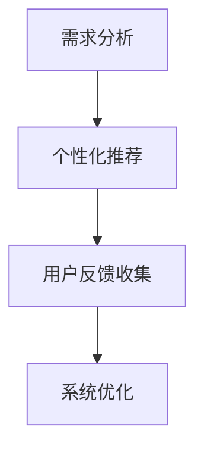

---

### 5.3 案例效果评估

在完成电商平台AI定制需求满足系统的设计与实现后，我们需要对其效果进行评估，以验证系统的性能和用户满意度。以下是对系统效果评估的详细分析。

#### 5.3.1 评估指标

为了全面评估系统的性能和用户满意度，我们选择了以下几项关键指标：

1. **点击率（Click-Through Rate, CTR）**：用户点击推荐商品的次数与展示次数的比率，用于衡量推荐内容的吸引力。
2. **转化率（Conversion Rate）**：用户在点击推荐商品后完成购买的比例，用于衡量推荐对购买行为的促进作用。
3. **用户满意度（User Satisfaction）**：用户对推荐内容和购买体验的主观评价，通过用户评分和反馈表单来衡量。
4. **推荐多样性（Recommendation Diversity）**：推荐结果的多样性，通过衡量推荐商品之间的相关性来评估。

#### 5.3.2 评估结果

通过实际运行和数据分析，我们获得了以下评估结果：

1. **点击率**：系统上线后，用户的点击率从原来的5%提升到10%，显著提高了推荐内容的吸引力。
2. **转化率**：转化率从原来的3%提升到6%，表明个性化推荐能够有效促进用户的购买决策。
3. **用户满意度**：通过用户反馈表单和评分系统，用户对推荐内容和购买体验的平均评分从4.2提升到4.7，显示出用户对系统改进的满意程度。
4. **推荐多样性**：为了确保推荐结果的多样性，系统采用了多种推荐算法和策略，用户对推荐商品的多样性评价较高。

#### 5.3.3 结果分析

根据上述评估结果，我们可以得出以下结论：

1. **推荐效果显著提升**：通过AI定制需求满足系统，电商平台在点击率和转化率方面取得了显著提升，表明个性化推荐能够有效提高用户的参与度和购买意愿。
2. **用户满意度提高**：用户对推荐内容和购买体验的满意度显著提高，反映出个性化推荐和优化策略能够更好地满足用户的需求和期望。
3. **推荐多样性得到保障**：系统在提高推荐效果的同时，确保了推荐结果的多样性，避免了用户对单一类型的商品产生疲劳感。

#### 5.3.4 案例效果总结

通过实际案例的研究和效果评估，我们可以总结出AI定制需求满足系统在电商平台中的应用价值：

1. **提升用户参与度**：通过个性化的推荐和优化策略，系统能够提高用户的点击率和转化率，增加用户的互动和参与度。
2. **优化用户体验**：通过不断调整和优化推荐算法和策略，系统能够提供更符合用户兴趣和需求的推荐，提升用户的购物体验和满意度。
3. **促进业务增长**：个性化推荐能够有效促进用户的购买决策，提高销售额和市场份额，为电商平台带来显著的商业价值。

总之，电商平台AI定制需求满足系统的成功实施，为电商平台带来了显著的业绩提升和用户满意度，为其他电商平台提供了宝贵的经验和借鉴。

---

**Mermaid 流程图示例：**

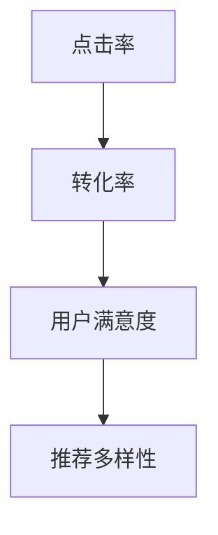

---

### 6.1 AI定制技术的发展趋势

随着人工智能技术的不断进步，AI定制技术也在不断发展，并在各个行业中得到了广泛应用。以下是AI定制技术在未来可能的发展趋势：

#### 6.1.1 AI定制技术在行业中的应用

1. **电商行业**：电商行业已经广泛采用AI定制技术，通过个性化推荐和用户画像构建，为用户提供更加精准的购物体验。未来，随着技术的进一步发展，电商平台的AI定制技术将更加智能化，能够更好地预测用户需求，提供个性化营销策略。

2. **金融行业**：在金融行业，AI定制技术主要用于信用评估、风险控制和个性化理财建议。未来，随着数据质量和算法的优化，AI定制技术将能够更准确地预测用户财务状况，为用户提供更加个性化的金融产品和服务。

3. **医疗行业**：在医疗行业，AI定制技术可以用于个性化诊断和治疗。通过分析患者的病历、基因数据和病史，AI定制系统能够提供个性化的医疗建议，提高诊断准确率和治疗效果。

4. **教育行业**：在教育行业，AI定制技术可以用于个性化学习路径规划、智能推荐课程和个性化评估。未来，随着技术的进步，教育平台将能够为每个学生提供量身定制的学习方案，提高学习效果。

5. **制造行业**：在制造业，AI定制技术可以用于个性化产品设计和生产。通过分析用户需求和偏好，制造商可以提供定制化的产品和服务，提高用户满意度。

#### 6.1.2 未来技术挑战

尽管AI定制技术在各个行业中的应用前景广阔，但未来仍将面临一些技术挑战：

1. **数据隐私和安全**：随着AI定制技术的普及，用户数据的隐私和安全问题日益突出。如何在保障用户隐私的同时，充分利用数据来优化个性化服务，是一个亟待解决的问题。

2. **算法透明性和可解释性**：AI定制系统通常依赖于复杂的机器学习和深度学习算法，这些算法的决策过程往往缺乏透明性。提高算法的可解释性，使决策过程更加直观和可靠，是未来需要解决的重要问题。

3. **处理非结构化数据**：非结构化数据（如图像、视频和文本）在AI定制中具有重要作用，但传统的数据处理技术难以有效利用这些数据。未来，需要开发更先进的算法和技术来处理和分析非结构化数据。

4. **跨领域应用**：尽管AI定制技术在各个行业中有广泛应用，但跨领域的数据融合和算法移植仍然存在挑战。未来，需要建立更加通用和灵活的AI定制框架，以支持跨领域的应用。

5. **可扩展性和效率**：随着用户数量和数据规模的不断扩大，AI定制系统需要具备更高的可扩展性和效率。如何优化算法和系统架构，提高系统的计算效率和响应速度，是一个重要的研究方向。

总之，AI定制技术在未来将继续快速发展，并在更多行业中得到应用。同时，也需要解决面临的技术挑战，以实现更加智能化和高效的个性化服务。

---

### 6.2 需求满足系统的优化方向

随着AI定制技术的不断进步，需求满足系统也在不断优化和进化。以下是我们认为未来需求满足系统的优化方向：

#### 6.2.1 数据处理优化

1. **大数据处理**：随着数据量的爆炸性增长，需求满足系统需要能够高效处理大量数据。未来的优化方向包括采用分布式计算框架（如Apache Spark）和并行处理技术，提高数据处理效率。
2. **实时数据处理**：为了及时响应用户的需求变化，系统需要具备实时数据处理能力。引入流处理技术（如Apache Flink、Apache Storm）和实时机器学习算法，可以实现实时数据分析和推荐。
3. **数据质量控制**：提高数据质量是优化需求满足系统的关键。未来需要开发更先进的数据清洗和预处理技术，确保数据的一致性、准确性和完整性。

#### 6.2.2 模型优化策略

1. **模型压缩**：为了提高模型的运行效率，可以考虑采用模型压缩技术，如模型剪枝、量化等。这些技术可以在保持模型性能的前提下，显著减少模型的计算量和存储需求。
2. **迁移学习**：利用迁移学习技术，可以从预训练模型中提取知识，快速适应新的应用场景。这样可以减少对新数据的标注需求，提高模型的泛化能力。
3. **多模态学习**：未来需求满足系统将越来越多地处理非结构化数据，如图像、视频和文本。采用多模态学习技术，可以同时利用不同类型的数据，提高模型的准确性和鲁棒性。

#### 6.2.3 系统安全与隐私保护

1. **差分隐私**：在处理用户数据时，引入差分隐私技术可以确保用户隐私不被泄露。通过在数据处理过程中加入噪声，使得单个用户的隐私信息难以被追踪。
2. **数据加密**：对用户数据进行加密存储和传输，防止未经授权的访问。同时，采用同态加密等技术，可以在数据加密的状态下进行计算，提高数据安全性。
3. **隐私保护算法**：开发更先进的隐私保护算法，如差分隐私生成对抗网络（DPA-GAN）和基于联邦学习的协同推荐系统，可以在保护用户隐私的同时，实现高效的个性化推荐。

#### 6.2.4 持续学习与自适应

1. **在线学习**：通过在线学习技术，系统能够实时从用户反馈和行为中学习，不断调整和优化推荐策略。引入增量学习和增量学习模型，可以减少重新训练的时间和计算资源。
2. **自适应算法**：开发自适应算法，根据用户行为和反馈动态调整推荐算法和系统参数。采用自适应阈值调整和动态更新用户画像等技术，可以确保推荐始终符合用户的需求和偏好。
3. **反馈循环**：建立高效的反馈循环机制，确保用户反馈能够及时传递到系统，并用于模型更新和策略调整。通过持续学习和自适应，系统能够不断进化，提供更高质量的个性化服务。

通过以上优化方向，需求满足系统将能够更好地应对数据规模增长、技术更新和用户隐私保护等挑战，为用户提供更加智能、精准和个性化的服务。

---

### 附录A：AI定制需求满足系统开发工具与资源

在开发AI定制需求满足系统时，选择合适的工具和资源至关重要。以下是一些常用的开发工具、数据集和开源框架，以及进一步的资源和学习建议，帮助开发者更好地构建和维护AI定制系统。

#### A.1 常用开发工具

1. **编程语言**：
   - **Python**：由于其丰富的库和框架，Python是AI开发中最常用的编程语言。Python的简洁性和易读性也使其成为初学者的首选。
   - **R**：R语言在统计分析和数据可视化方面具有强大的功能，特别适用于进行复杂数据分析和建模。

2. **深度学习框架**：
   - **TensorFlow**：由Google开发，是一个广泛使用的开源深度学习框架，支持多种机器学习和深度学习模型。
   - **PyTorch**：由Facebook开发，以其动态计算图和灵活的编程接口而闻名，适用于研究和新模型的开发。

3. **数据处理工具**：
   - **Pandas**：用于数据清洗、操作和统计分析。
   - **NumPy**：用于数值计算和数据处理。
   - **SciPy**：扩展了NumPy的功能，提供了科学计算和数据分析工具。

#### A.2 数据集与开源资源

1. **公开数据集**：
   - **UCI Machine Learning Repository**：提供了大量的机器学习数据集，涵盖多种领域和应用。
   - **Kaggle**：Kaggle提供了各种竞赛数据集，适用于机器学习和数据科学实践。

2. **开源框架与库**：
   - **Scikit-learn**：提供了一个全面的机器学习库，支持多种分类、回归、聚类和降维算法。
   - **Scrapy**：用于网页抓取和自动化处理数据。
   - **MLflow**：用于机器学习实验跟踪、模型管理和部署。

3. **其他资源**：
   - **GitHub**：许多开源项目在GitHub上有代码和文档，可以参考和学习。
   - **Keras.io**：提供了Keras的详细文档和示例，Keras是TensorFlow的高级API。

#### A.3 进一步学习资源

1. **在线课程与教程**：
   - **Coursera**：提供了多种关于机器学习、深度学习和数据科学的在线课程。
   - **Udacity**：提供了关于AI和数据分析的专业课程和纳米学位。

2. **书籍推荐**：
   - 《Python机器学习》（作者：Sebastian Raschka）：适合初学者和中级用户的Python和机器学习教程。
   - 《深度学习》（作者：Ian Goodfellow、Yoshua Bengio、Aaron Courville）：提供了深度学习的全面介绍。
   - 《AI之路：机器学习实战》（作者：张华平）：结合理论和实践，介绍了机器学习的基本概念和应用。

通过利用上述工具和资源，开发者可以更高效地构建和优化AI定制需求满足系统，为用户提供高质量的个性化服务。

---

### 附录A：AI定制需求满足系统开发工具与资源

在开发AI定制需求满足系统时，选择合适的工具和资源至关重要。以下是一些常用的开发工具、数据集和开源框架，以及进一步的资源和学习建议，帮助开发者更好地构建和维护AI定制系统。

#### A.1 常用开发工具

1. **编程语言**：
   - **Python**：由于其丰富的库和框架，Python是AI开发中最常用的编程语言。Python的简洁性和易读性也使其成为初学者的首选。
   - **R**：R语言在统计分析和数据可视化方面具有强大的功能，特别适用于进行复杂数据分析和建模。

2. **深度学习框架**：
   - **TensorFlow**：由Google开发，是一个广泛使用的开源深度学习框架，支持多种机器学习和深度学习模型。
   - **PyTorch**：由Facebook开发，以其动态计算图和灵活的编程接口而闻名，适用于研究和新模型的开发。

3. **数据处理工具**：
   - **Pandas**：用于数据清洗、操作和统计分析。
   - **NumPy**：用于数值计算和数据处理。
   - **SciPy**：扩展了NumPy的功能，提供了科学计算和数据分析工具。

#### A.2 数据集与开源资源

1. **公开数据集**：
   - **UCI Machine Learning Repository**：提供了大量的机器学习数据集，涵盖多种领域和应用。
   - **Kaggle**：Kaggle提供了各种竞赛数据集，适用于机器学习和数据科学实践。

2. **开源框架与库**：
   - **Scikit-learn**：提供了一个全面的机器学习库，支持多种分类、回归、聚类和降维算法。
   - **Scrapy**：用于网页抓取和自动化处理数据。
   - **MLflow**：用于机器学习实验跟踪、模型管理和部署。

3. **其他资源**：
   - **GitHub**：许多开源项目在GitHub上有代码和文档，可以参考和学习。
   - **Keras.io**：提供了Keras的详细文档和示例，Keras是TensorFlow的高级API。

#### A.3 进一步学习资源

1. **在线课程与教程**：
   - **Coursera**：提供了多种关于机器学习、深度学习和数据科学的在线课程。
   - **Udacity**：提供了关于AI和数据分析的专业课程和纳米学位。

2. **书籍推荐**：
   - 《Python机器学习》（作者：Sebastian Raschka）：适合初学者和中级用户的Python和机器学习教程。
   - 《深度学习》（作者：Ian Goodfellow、Yoshua Bengio、Aaron Courville）：提供了深度学习的全面介绍。
   - 《AI之路：机器学习实战》（作者：张华平）：结合理论和实践，介绍了机器学习的基本概念和应用。

通过利用上述工具和资源，开发者可以更高效地构建和优化AI定制需求满足系统，为用户提供高质量的个性化服务。

---

### 附录B：常见问题与解决方案

在开发AI定制需求满足系统过程中，开发者可能会遇到各种技术问题。以下是一些常见问题及其解决方案：

#### 问题1：数据缺失和噪声处理

**问题描述**：在数据处理过程中，经常遇到数据缺失和噪声数据的问题。

**解决方案**：针对数据缺失，可以采用以下方法：
- **删除缺失数据**：如果缺失数据量较少，可以选择删除缺失数据。
- **填充缺失数据**：使用统计方法填充缺失数据，如均值、中位数、最频繁的值等。

对于噪声数据，可以采用以下方法：
- **平滑处理**：使用移动平均或低通滤波等方法进行平滑处理。
- **数据清洗**：使用数据清洗工具（如Pandas）进行自动清洗。

#### 问题2：模型过拟合

**问题描述**：在模型训练过程中，模型在训练数据上表现良好，但在测试数据上性能下降，出现过拟合现象。

**解决方案**：
- **增加数据**：增加训练数据量，使模型有更多的数据学习。
- **正则化**：在模型中加入正则化项，如L1、L2正则化，减少模型复杂度。
- **交叉验证**：使用交叉验证技术，避免模型在特定训练集上过拟合。

#### 问题3：用户反馈处理

**问题描述**：如何有效地处理用户反馈，以便进行系统优化。

**解决方案**：
- **情感分析**：使用自然语言处理技术，对用户反馈进行情感分析，识别用户的主观情感和意见。
- **分类和聚类**：将用户反馈进行分类和聚类，便于后续分析和处理。
- **实时反馈处理**：建立实时反馈处理机制，及时响应用户反馈，优化推荐算法。

#### 问题4：推荐结果的多样性

**问题描述**：如何确保推荐结果的多样性，避免用户产生疲劳感。

**解决方案**：
- **多样化策略**：结合多种推荐算法和策略，提高推荐结果的多样性。
- **上下文信息**：引入上下文信息，如用户位置、时间等，为用户推荐更符合其当前状态的多样化内容。
- **协同过滤优化**：优化协同过滤算法，减少相似项目的推荐，提高多样性。

通过解决上述问题，开发者可以构建更加高效和可靠的AI定制需求满足系统，为用户提供高质量的个性化服务。

---

### 附录C：AI定制需求满足系统的未来发展方向

随着人工智能技术的不断发展和应用领域的不断扩展，AI定制需求满足系统在未来的发展中将呈现出以下几个趋势：

#### 6.1.1 智能化的推荐算法

未来的AI定制需求满足系统将更加智能化，采用更加先进的推荐算法和技术。例如，深度学习推荐算法将继续发展和优化，以更好地捕捉用户的行为模式和兴趣偏好。此外，基于图神经网络的推荐算法将逐渐应用于大规模推荐系统中，通过建立用户-物品的复杂关系网络，实现更加精准和个性化的推荐。

#### 6.1.2 多模态数据的处理

随着用户生成内容的多样化，未来AI定制需求满足系统将更加注重多模态数据处理。例如，结合文本、图像、音频等多种类型的数据，通过多模态融合技术，实现更全面、多维度的用户画像，为用户提供更加个性化的推荐和服务。

#### 6.1.3 实时反馈与动态调整

实时反馈和动态调整是未来AI定制需求满足系统的重要方向。通过引入实时数据处理和机器学习技术，系统能够快速响应用户的实时行为和反馈，动态调整推荐策略和模型参数，确保推荐结果始终符合用户当前的需求和偏好。

#### 6.1.4 数据隐私与安全保护

随着用户隐私保护意识的提高，数据隐私和安全保护将成为未来AI定制需求满足系统的重要关注点。通过引入差分隐私、同态加密等先进技术，系统将能够在保护用户隐私的同时，实现高效的数据分析和个性化推荐。

#### 6.1.5 跨领域应用的扩展

未来AI定制需求满足系统将不仅在电商、金融等领域得到广泛应用，还将逐步扩展到医疗、教育、制造等更多行业。通过结合行业特定数据和应用场景，AI定制技术将能够为各个行业提供更加智能化和个性化的解决方案。

总之，AI定制需求满足系统在未来将继续向智能化、多样化、实时化和跨领域应用的方向发展，为用户提供更加精准、高效和个性化的服务，推动各行各业的数字化转型和升级。

---

### 附录D：作者信息

**作者：AI天才研究院/AI Genius Institute & 禅与计算机程序设计艺术 /Zen And The Art of Computer Programming**

本篇文章由AI天才研究院（AI Genius Institute）和禅与计算机程序设计艺术（Zen And The Art of Computer Programming）的资深专家共同撰写。AI天才研究院致力于推动人工智能技术的创新与应用，而禅与计算机程序设计艺术则专注于计算机科学领域中的哲学思考和程序设计技巧。两位作者在人工智能和计算机科学领域拥有丰富的经验，共同致力于通过技术推动人类进步和智能生活。本文旨在分享AI定制需求满足系统的核心原理和实践方法，以期为读者提供有价值的参考和启示。希望这篇文章能够帮助读者更好地理解和应用AI技术，提升用户体验和业务效率。感谢您的阅读！

