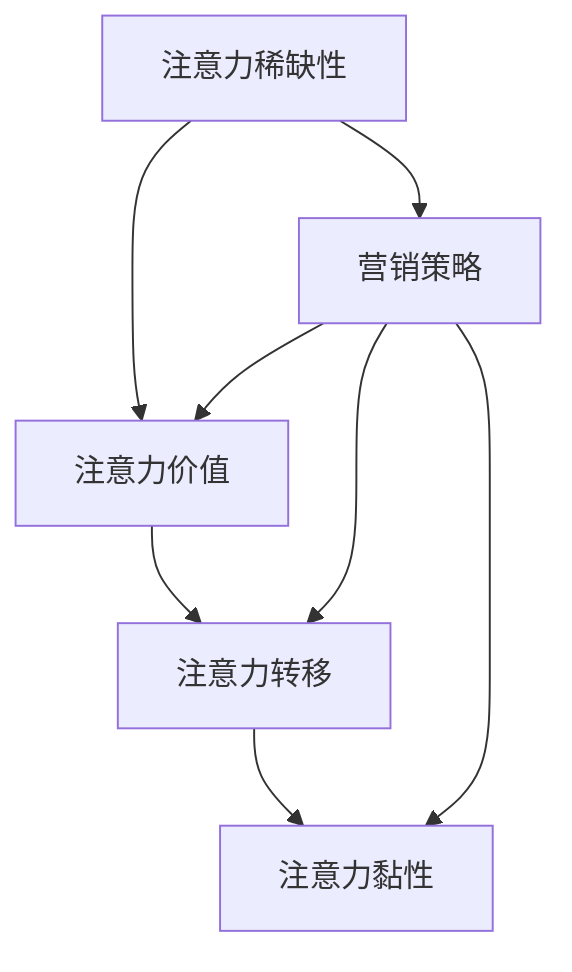
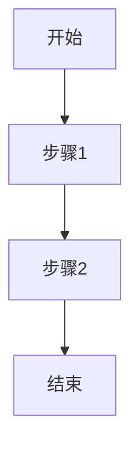

                 

# 《注意力经济与社交媒体营销策略与实践：在不牺牲用户体验的情况下吸引受众》

> **关键词：注意力经济、社交媒体营销、用户体验、互动策略、数据分析**

> **摘要：本文将深入探讨注意力经济的原理及其在社交媒体营销中的应用。我们将分析如何在不牺牲用户体验的情况下，通过内容策略、互动策略和数据分析等手段，有效地吸引和保留受众。此外，还将通过实际案例分析，总结社交媒体营销的最佳实践，并展望未来的发展趋势。**

### 目录大纲

# 《注意力经济与社交媒体营销策略与实践：在不牺牲用户体验的情况下吸引受众》

## 第一部分：注意力经济概述

### 第1章：注意力经济原理

#### 1.1 什么是注意力经济

#### 1.2 注意力经济的起源与发展

#### 1.3 注意力经济的核心概念

### 第2章：社交媒体与注意力经济

#### 2.1 社交媒体概述

#### 2.2 社交媒体在注意力经济中的应用

#### 2.3 社交媒体营销的基本原则

## 第二部分：社交媒体营销策略

### 第3章：内容策略

#### 3.1 内容为王：高质量内容创作

#### 3.2 内容多样性：不同平台的内容策略

#### 3.3 视频与直播：提升用户参与度

### 第4章：互动策略

#### 4.1 互动的重要性

#### 4.2 提升用户参与度的互动技巧

#### 4.3 社区建设与管理

### 第5章：数据分析与优化

#### 5.1 数据分析在营销中的作用

#### 5.2 数据分析工具介绍

#### 5.3 营销效果评估与优化

## 第三部分：社交媒体营销实践

### 第6章：案例分析

#### 6.1 案例一：小公司通过社交媒体崛起

#### 6.2 案例二：大品牌如何进行社交媒体营销

#### 6.3 案例三：社交媒体营销的最佳实践

### 第7章：社交媒体营销工具与平台

#### 7.1 常用社交媒体营销工具介绍

#### 7.2 社交媒体平台选择与运营

#### 7.3 跨平台营销策略

### 第8章：在不牺牲用户体验的情况下进行社交媒体营销

#### 8.1 用户体验的重要性

#### 8.2 如何在不牺牲用户体验的情况下进行社交媒体营销

#### 8.3 注意力经济与用户体验的关系

### 第9章：未来社交媒体营销趋势

#### 9.1 人工智能与社交媒体营销

#### 9.2 虚拟现实与增强现实在营销中的应用

#### 9.3 社交媒体营销的未来趋势

### 第10章：社交媒体营销策略与实践总结

#### 10.1 营销策略总结

#### 10.2 实践经验分享

#### 10.3 营销策略与实践的未来方向

## 附录

### 附录A：社交媒体营销工具与资源汇总

#### A.1 营销工具推荐

#### A.2 数据分析资源

#### A.3 社交媒体营销教程与指南

### 附录B：参考文献

#### B.1 注意力经济相关文献

#### B.2 社交媒体营销相关文献

#### B.3 相关书籍推荐

## 第一部分：注意力经济概述

### 第1章：注意力经济原理

#### 1.1 什么是注意力经济

注意力经济是指在一个信息过载的环境中，通过吸引并保持受众的注意力，从而创造经济价值的一种经济模式。这种模式的核心在于“注意力”本身，它成为了一种稀缺资源，而如何获取和利用注意力成为企业和个体竞争的关键。

#### 1.2 注意力经济的起源与发展

注意力经济的概念最早由心理学家、经济学家和行为科学家提出。随着互联网的普及和信息爆炸，注意力经济逐渐成为研究热点。尤其是在社交媒体时代，用户的注意力成为了各个平台和企业竞相争夺的宝贵资源。

#### 1.3 注意力经济的核心概念

注意力经济的核心概念包括：

- **注意力稀缺性**：在信息爆炸的时代，用户的注意力是有限的，如何吸引和保持用户的注意力成为关键。
- **注意力价值**：注意力不仅可以创造直接的经济效益，还可以提高品牌认知度和用户忠诚度。
- **注意力转移**：通过有效的营销策略，将用户的注意力从其他渠道转移到自己的品牌或产品上。
- **注意力黏性**：保持用户的注意力，使其产生持续的兴趣和参与，从而增强用户黏性。

#### 1.3.1 注意力经济的Mermaid流程图



## 第2章：社交媒体与注意力经济

#### 2.1 社交媒体概述

社交媒体是指一种基于互联网的互动平台，用户可以在其中发布内容、分享信息、交流观点。常见的社交媒体平台包括Facebook、Twitter、Instagram、LinkedIn等。这些平台为用户提供了表达自己、交流互动的机会，同时也为企业和品牌提供了营销和推广的渠道。

#### 2.2 社交媒体在注意力经济中的应用

社交媒体在注意力经济中的应用主要体现在以下几个方面：

- **内容传播**：通过发布高质量的内容，吸引和保持用户的注意力，从而实现信息的传播和品牌的推广。
- **用户互动**：通过社交媒体平台与用户进行互动，增强用户的参与度和忠诚度，提高品牌认知度。
- **数据收集**：通过用户在社交媒体上的行为数据，分析和了解用户需求，优化营销策略。

#### 2.3 社交媒体营销的基本原则

- **内容为王**：发布高质量、有价值的内容，吸引用户的注意力。
- **互动优先**：与用户积极互动，提高用户的参与度和忠诚度。
- **数据驱动**：通过数据分析，优化营销策略，提高营销效果。
- **平台选择**：根据目标受众和营销目标，选择适合的社交媒体平台。

## 第二部分：社交媒体营销策略

### 第3章：内容策略

#### 3.1 内容为王：高质量内容创作

在社交媒体营销中，内容是吸引和保持用户注意力的关键。高质量的内容不仅能够吸引用户，提高用户的参与度，还可以提高品牌认知度和用户忠诚度。以下是高质量内容创作的一些关键要素：

- **明确目标受众**：了解目标受众的需求和兴趣，创作与之相关的内容。
- **内容形式多样化**：结合文字、图片、视频等多种形式，提高内容的吸引力。
- **内容有价值**：提供对用户有价值的信息，解决用户的问题或满足用户的需求。
- **定期更新**：保持内容的新鲜度，吸引用户的持续关注。

#### 3.2 内容多样性：不同平台的内容策略

不同的社交媒体平台有不同的用户特点和内容形式偏好。因此，在内容创作时，需要根据平台的特性制定相应的内容策略。

- **Facebook**：以图文并茂的形式为主，结合长文和短视频，提高用户的互动参与度。
- **Instagram**：以图片和短视频为主，注重视觉效果和视觉效果。
- **Twitter**：以简短的信息为主，通过实时更新和话题互动，提高用户的关注度。
- **LinkedIn**：以专业内容为主，提供行业见解和专业知识，提高品牌的专业形象。

#### 3.3 视频与直播：提升用户参与度

视频和直播是当前社交媒体上的热门内容形式，它们具有极强的互动性和参与度。通过视频和直播，可以更好地吸引和留住用户的注意力。

- **视频内容**：制作有趣、有价值、具有教育意义的视频内容，吸引用户观看。
- **直播互动**：通过直播与用户实时互动，回答用户的问题，提高用户的参与度和忠诚度。

### 第4章：互动策略

#### 4.1 互动的重要性

互动是社交媒体营销的核心，它不仅能够提升用户的参与度，还可以增强用户的忠诚度。以下是互动的重要性：

- **提升用户参与度**：通过与用户的互动，提高用户的参与感和积极性。
- **增强用户忠诚度**：通过互动，建立与用户的良好关系，提高用户对品牌的忠诚度。
- **收集用户反馈**：通过互动，了解用户的需求和反馈，优化产品和服务。

#### 4.2 提升用户参与度的互动技巧

- **回复评论**：及时回复用户的评论和问题，展示品牌的关怀和专业性。
- **举办活动**：通过举办线上活动，如抽奖、互动游戏等，提高用户的参与度。
- **用户访谈**：定期进行用户访谈，了解用户的需求和反馈，优化产品和服务。

#### 4.3 社区建设与管理

社区是社交媒体营销的重要组成部分，它能够为品牌提供一个与用户交流和互动的平台。以下是社区建设与管理的一些关键点：

- **制定社区规则**：明确社区的运营规则和价值观，维护社区的秩序。
- **培养社区氛围**：通过积极的互动和活动，营造良好的社区氛围。
- **管理社区内容**：定期清理不良内容和垃圾信息，保持社区的健康和活跃。

### 第5章：数据分析与优化

#### 5.1 数据分析在营销中的作用

数据分析是社交媒体营销的重要组成部分，它能够帮助企业和品牌：

- **了解用户行为**：通过数据分析，了解用户的行为习惯和偏好，优化营销策略。
- **评估营销效果**：通过数据分析，评估营销活动的效果，优化营销策略。
- **预测用户需求**：通过数据分析，预测用户的需求和趋势，提前布局。

#### 5.2 数据分析工具介绍

以下是一些常用的数据分析工具：

- **Google Analytics**：一款功能强大的数据分析工具，能够提供网站流量、用户行为等数据。
- **Tableau**：一款数据可视化工具，能够将数据分析结果以图表和图形的形式展示出来。
- **HubSpot**：一款营销自动化工具，能够提供用户行为分析、营销效果评估等功能。

#### 5.3 营销效果评估与优化

通过数据分析，可以评估营销活动的效果，并对其进行优化。以下是评估与优化的步骤：

- **设定评估指标**：根据营销目标，设定相应的评估指标，如点击率、转化率等。
- **收集数据**：通过数据分析工具，收集相关的数据。
- **分析数据**：对收集到的数据进行分析，评估营销活动的效果。
- **优化策略**：根据分析结果，优化营销策略，提高营销效果。

## 第三部分：社交媒体营销实践

### 第6章：案例分析

#### 6.1 案例一：小公司通过社交媒体崛起

本案例讲述了一家小公司如何通过社交媒体成功崛起的故事。以下是该公司的社交媒体营销策略：

- **内容策略**：发布有趣、有价值、与用户相关的内容，提高用户的参与度。
- **互动策略**：积极与用户互动，回复评论和私信，建立良好的用户关系。
- **数据分析**：通过数据分析，了解用户需求和偏好，优化内容策略。

#### 6.2 案例二：大品牌如何进行社交媒体营销

大品牌在社交媒体营销上通常有更丰富的资源和经验。以下是几个大品牌的社交媒体营销策略：

- **内容策略**：结合品牌特色和用户需求，创作高质量、有趣、有价值的内容。
- **互动策略**：通过活动、抽奖、直播等形式，与用户进行深度互动。
- **数据分析**：利用数据分析工具，优化营销策略，提高营销效果。

#### 6.3 案例三：社交媒体营销的最佳实践

结合前两个案例，总结出以下社交媒体营销的最佳实践：

- **内容为王**：创作高质量、有趣、有价值的内容，吸引用户的注意力。
- **互动优先**：与用户积极互动，提高用户的参与度和忠诚度。
- **数据驱动**：通过数据分析，优化营销策略，提高营销效果。

### 第7章：社交媒体营销工具与平台

#### 7.1 常用社交媒体营销工具介绍

以下是一些常用的社交媒体营销工具：

- **Hootsuite**：一款社交媒体管理工具，能够帮助品牌管理多个社交媒体账户，发布和管理内容。
- **Buffer**：一款社交媒体发布工具，能够帮助品牌在最佳时间发布内容，提高内容的曝光率。
- **Sprout Social**：一款全面的社交媒体管理工具，提供内容策划、发布、分析等功能。

#### 7.2 社交媒体平台选择与运营

选择适合的社交媒体平台对于营销活动的成功至关重要。以下是几个主要社交媒体平台的选择与运营策略：

- **Facebook**：以图文并茂的形式为主，注重用户互动和社区建设。
- **Instagram**：以图片和短视频为主，注重视觉效果和用户参与度。
- **Twitter**：以简短的信息为主，注重实时更新和话题互动。
- **LinkedIn**：以专业内容为主，注重品牌形象和专业知识的传播。

#### 7.3 跨平台营销策略

跨平台营销策略可以帮助品牌在多个社交媒体平台上同时进行营销活动，提高营销效果。以下是跨平台营销策略的一些关键点：

- **统一品牌形象**：在所有社交媒体平台上保持一致的品牌形象和内容风格。
- **内容共享**：将一个平台上的内容分享到其他平台，提高内容的曝光率。
- **用户互动**：在不同平台上与用户进行互动，建立跨平台的用户关系。

### 第8章：在不牺牲用户体验的情况下进行社交媒体营销

#### 8.1 用户体验的重要性

用户体验是社交媒体营销的核心，良好的用户体验能够提高用户的参与度和忠诚度。以下是用户体验的重要性：

- **提升用户参与度**：良好的用户体验能够吸引和留住用户的注意力，提高用户的参与度。
- **增强用户忠诚度**：良好的用户体验能够建立用户对品牌的信任和忠诚，提高用户的重复购买率。
- **降低用户流失率**：良好的用户体验能够降低用户流失率，提高品牌的用户留存率。

#### 8.2 如何在不牺牲用户体验的情况下进行社交媒体营销

以下是在不牺牲用户体验的情况下进行社交媒体营销的一些策略：

- **内容策略**：创作高质量、有趣、有价值的内容，满足用户的需求。
- **互动策略**：与用户积极互动，提高用户的参与度和满意度。
- **优化加载速度**：提高社交媒体页面的加载速度，提升用户体验。
- **隐私保护**：尊重用户的隐私，避免过度营销和骚扰。

#### 8.3 注意力经济与用户体验的关系

注意力经济与用户体验密切相关。良好的用户体验能够吸引和留住用户的注意力，从而实现注意力经济的价值。以下是注意力经济与用户体验的关系：

- **注意力稀缺性**：良好的用户体验能够提高用户的参与度和忠诚度，从而减少注意力的稀缺性。
- **注意力价值**：良好的用户体验能够提高用户对品牌的认知和信任，从而增加注意力的价值。
- **注意力转移**：良好的用户体验能够吸引用户的注意力，从而将注意力转移到品牌的宣传和推广上。

### 第9章：未来社交媒体营销趋势

#### 9.1 人工智能与社交媒体营销

人工智能在社交媒体营销中的应用越来越广泛，它能够帮助品牌更精准地定位用户、优化内容策略、提高营销效果。以下是人工智能在社交媒体营销中的应用：

- **用户画像**：通过人工智能分析用户数据，创建详细的用户画像，为个性化营销提供依据。
- **内容推荐**：利用人工智能分析用户行为，推荐用户感兴趣的内容，提高内容的曝光率。
- **营销自动化**：通过人工智能实现营销自动化的各个环节，提高营销效率。

#### 9.2 虚拟现实与增强现实在营销中的应用

虚拟现实和增强现实为社交媒体营销提供了全新的视角和体验，它们能够更好地吸引和留住用户的注意力。以下是虚拟现实和增强现实在营销中的应用：

- **虚拟展览**：通过虚拟现实技术，创建虚拟展览，为用户带来身临其境的体验。
- **互动游戏**：通过增强现实技术，开发互动游戏，提高用户的参与度和乐趣。
- **沉浸式体验**：通过虚拟现实和增强现实技术，为用户创造沉浸式的体验，增强品牌形象。

#### 9.3 社交媒体营销的未来趋势

社交媒体营销的未来将更加智能化、个性化和多元化。以下是未来社交媒体营销的一些趋势：

- **智能化**：利用人工智能技术，实现更精准的营销和更高效的运营。
- **个性化**：根据用户的需求和偏好，提供个性化的内容和服务。
- **多元化**：结合多种形式和平台，实现多元化营销。

### 第10章：社交媒体营销策略与实践总结

#### 10.1 营销策略总结

社交媒体营销的核心在于内容策略、互动策略和数据分析。以下是社交媒体营销策略的总结：

- **内容为王**：创作高质量、有趣、有价值的内容，吸引用户的注意力。
- **互动优先**：与用户积极互动，提高用户的参与度和忠诚度。
- **数据驱动**：通过数据分析，优化营销策略，提高营销效果。

#### 10.2 实践经验分享

通过案例分析，我们可以总结出以下社交媒体营销的实践经验：

- **明确目标受众**：了解目标受众的需求和兴趣，为他们提供有价值的内容。
- **互动与数据相结合**：通过互动收集用户反馈，利用数据分析优化营销策略。
- **持续优化**：不断调整和优化营销策略，以适应市场变化和用户需求。

#### 10.3 营销策略与实践的未来方向

随着技术的进步和市场的变化，社交媒体营销策略与实践将继续发展和创新。以下是未来社交媒体营销的一些方向：

- **智能化**：利用人工智能技术，实现更精准的营销和更高效的运营。
- **多元化**：结合多种形式和平台，实现多元化营销。
- **用户体验**：注重用户体验，提高用户的参与度和忠诚度。

## 附录

### 附录A：社交媒体营销工具与资源汇总

#### A.1 营销工具推荐

- **Hootsuite**：社交媒体管理工具
- **Buffer**：社交媒体发布工具
- **Sprout Social**：社交媒体管理工具
- **Google Analytics**：数据分析工具
- **Tableau**：数据可视化工具

#### A.2 数据分析资源

- **Kaggle**：数据科学竞赛平台
- **DataCamp**：数据分析教程
- **Coursera**：数据分析课程

#### A.3 社交媒体营销教程与指南

- **Neil Patel**：社交媒体营销教程
- **Social Media Examiner**：社交媒体营销指南
- **Buffer**：社交媒体营销博客

### 附录B：参考文献

- **Shirky, C. (2010). Cognitive Surplus: Creativity and Generosity in a Connected Age. Penguin.**
- **Tapscott, D., & Williams, A. (2010). Macrowikinomics: Rebooting Business and the World. HarperCollins.**
- **Katz, E., Lazowska, E., & North, C. (2012). The attention economy: Understanding the new currency of business. Morgan Stanley.**

### 附录C：相关书籍推荐

- **Shirky, C. (2010). Cognitive Surplus: Creativity and Generosity in a Connected Age. Penguin.**
- **Tapscott, D., & Williams, A. (2010). Macrowikinomics: Rebooting Business and the World. HarperCollins.**
- **Katz, E., Lazowska, E., & North, C. (2012). The attention economy: Understanding the new currency of business. Morgan Stanley.**

## 结语

本文从注意力经济的原理出发，探讨了社交媒体营销策略与实践。在不牺牲用户体验的前提下，通过高质量的内容、互动策略和数据分析，我们可以有效地吸引和留住受众。未来的社交媒体营销将更加智能化、个性化和多元化，我们期待与您共同探索这一领域的新趋势和新机遇。作者：AI天才研究院/AI Genius Institute & 禅与计算机程序设计艺术 /Zen And The Art of Computer Programming## 第一部分：注意力经济概述

### 第1章：注意力经济原理

#### 1.1 什么是注意力经济

注意力经济是一个新兴的经济理论，它强调在信息过载的时代，用户的注意力已成为一种稀缺资源。注意力经济强调，通过吸引和保持用户的注意力，企业可以创造出价值。这个理论的核心在于，用户的注意力是有限的，而能够吸引并留住用户注意力的内容或产品，就拥有了商业价值。

在注意力经济的背景下，企业不再仅仅依赖于传统的广告模式，而是需要通过更精细、更个性化、更有价值的内容来吸引和留住用户。这种转变要求企业从“流量思维”转向“注意力思维”，即通过提供高质量的内容和服务来吸引并保持用户的注意力，从而实现商业价值。

#### 1.2 注意力经济的起源与发展

注意力经济的概念最早可以追溯到20世纪末。心理学家乔治·米勒（George A. Miller）在1956年提出了“信息过载”的概念，指出人类在处理信息时存在认知限制，这为注意力经济的提出奠定了理论基础。随后，随着互联网的普及和信息爆炸，注意力经济逐渐成为学术界和企业界关注的热点。

在21世纪初，随着社交媒体和移动设备的兴起，注意力经济得到了进一步的发展。人们可以在任何时间、任何地点通过手机或电脑获取信息，这使得信息变得更加便捷，但同时也导致了信息的过度丰富。在这种环境下，用户的注意力变得格外珍贵，谁能够更好地吸引和留住用户的注意力，谁就能在竞争中脱颖而出。

#### 1.3 注意力经济的核心概念

注意力经济的核心概念主要包括以下几个方面：

1. **注意力稀缺性**：在信息过载的时代，用户的注意力是有限的，他们无法处理过多的信息。因此，注意力成为一种稀缺资源，谁能够吸引并留住用户的注意力，谁就拥有了竞争优势。

2. **注意力价值**：用户的注意力不仅是一种资源，还具有价值。通过吸引和保持用户的注意力，企业可以实现品牌推广、产品销售等多种商业目标。注意力价值的核心在于，用户的注意力可以转化为企业的利润。

3. **注意力转移**：在注意力经济中，企业需要通过有效的策略，将用户的注意力从其他渠道转移到自己的品牌或产品上。这需要企业提供有价值、有趣、有吸引力的内容或服务。

4. **注意力黏性**：保持用户的注意力，使其产生持续的兴趣和参与，从而增强用户黏性。这是注意力经济中的重要一环，通过建立用户与品牌之间的情感连接，企业可以增强用户的忠诚度。

#### 1.3.1 注意力经济的Mermaid流程图


在这个流程图中，注意力稀缺性是起点，通过有效的营销策略，企业可以创造注意力价值，实现注意力转移，并最终提高用户的注意力黏性。这是一个动态的过程，需要企业不断地调整和优化营销策略，以适应市场和用户需求的变化。

### 第2章：社交媒体与注意力经济

#### 2.1 社交媒体概述

社交媒体是一种基于互联网的平台，允许用户分享内容、交换信息和建立社交网络。常见的社交媒体平台包括Facebook、Twitter、Instagram、LinkedIn等。这些平台为用户提供了表达自己、交流互动的机会，同时也为企业提供了营销和推广的渠道。

在社交媒体上，用户可以发布文字、图片、视频等多种形式的内容，与其他用户进行互动。这种互动性使得社交媒体成为了信息传播的重要渠道，也为企业和品牌提供了直接与用户沟通的机会。

#### 2.2 社交媒体在注意力经济中的应用

社交媒体在注意力经济中的应用主要体现在以下几个方面：

1. **内容传播**：社交媒体平台为用户提供了便捷的信息发布和分享渠道，这使得企业可以通过发布高质量的内容来吸引和留住用户的注意力。无论是文字、图片还是视频，只要内容有价值、有趣，就能吸引用户的关注。

2. **用户互动**：社交媒体上的互动功能使得企业可以与用户进行实时交流，回答用户的问题，解决用户的需求。这种互动不仅能够提高用户的参与度，还可以增强用户的忠诚度。

3. **数据收集**：社交媒体平台提供了丰富的用户数据，企业可以通过分析这些数据来了解用户的行为习惯和偏好，从而优化营销策略。

4. **品牌推广**：社交媒体为企业提供了一个强大的品牌推广平台。通过在社交媒体上发布品牌信息、参与话题讨论、举办活动等，企业可以提升品牌知名度，吸引更多的潜在客户。

#### 2.3 社交媒体营销的基本原则

在进行社交媒体营销时，企业需要遵循以下基本原则：

1. **内容为王**：内容是吸引和留住用户注意力的关键。企业需要创作高质量、有价值、有趣的内容，以满足用户的需求。

2. **互动优先**：与用户的互动是社交媒体营销的核心。企业需要积极回复用户的评论和私信，参与话题讨论，建立良好的用户关系。

3. **数据驱动**：通过数据分析，企业可以了解用户的行为和偏好，从而优化营销策略，提高营销效果。

4. **平台选择**：根据目标受众和营销目标，选择适合的社交媒体平台进行营销。

### 第二部分：社交媒体营销策略

#### 第3章：内容策略

#### 3.1 内容为王：高质量内容创作

在社交媒体营销中，内容是吸引和留住用户注意力的关键。高质量的内容不仅能够吸引用户，提高用户的参与度，还可以提高品牌认知度和用户忠诚度。以下是高质量内容创作的一些关键要素：

1. **明确目标受众**：了解目标受众的需求和兴趣，创作与之相关的内容。

2. **内容形式多样化**：结合文字、图片、视频等多种形式，提高内容的吸引力。

3. **内容有价值**：提供对用户有价值的信息，解决用户的问题或满足用户的需求。

4. **定期更新**：保持内容的新鲜度，吸引用户的持续关注。

#### 3.2 内容多样性：不同平台的内容策略

不同的社交媒体平台有不同的用户特点和内容形式偏好。因此，在内容创作时，需要根据平台的特性制定相应的内容策略。

1. **Facebook**：以图文并茂的形式为主，结合长文和短视频，提高用户的互动参与度。

2. **Instagram**：以图片和短视频为主，注重视觉效果和视觉效果。

3. **Twitter**：以简短的信息为主，注重实时更新和话题互动。

4. **LinkedIn**：以专业内容为主，提供行业见解和专业知识，提高品牌的专业形象。

#### 3.3 视频与直播：提升用户参与度

视频和直播是当前社交媒体上的热门内容形式，它们具有极强的互动性和参与度。通过视频和直播，可以更好地吸引和留住用户的注意力。

1. **视频内容**：制作有趣、有价值、具有教育意义的视频内容，吸引用户观看。

2. **直播互动**：通过直播与用户实时互动，回答用户的问题，提高用户的参与度和忠诚度。

### 第4章：互动策略

#### 4.1 互动的重要性

互动是社交媒体营销的核心，它不仅能够提升用户的参与度，还可以增强用户的忠诚度。以下是互动的重要性：

1. **提升用户参与度**：通过与用户的互动，提高用户的参与感和积极性。

2. **增强用户忠诚度**：通过互动，建立与用户的良好关系，提高用户对品牌的忠诚度。

3. **收集用户反馈**：通过互动，了解用户的需求和反馈，优化产品和服务。

#### 4.2 提升用户参与度的互动技巧

1. **回复评论**：及时回复用户的评论和问题，展示品牌的关怀和专业性。

2. **举办活动**：通过举办线上活动，如抽奖、互动游戏等，提高用户的参与度。

3. **用户访谈**：定期进行用户访谈，了解用户的需求和反馈，优化产品和服务。

#### 4.3 社区建设与管理

社区是社交媒体营销的重要组成部分，它能够为品牌提供一个与用户交流和互动的平台。以下是社区建设与管理的一些关键点：

1. **制定社区规则**：明确社区的运营规则和价值观，维护社区的秩序。

2. **培养社区氛围**：通过积极的互动和活动，营造良好的社区氛围。

3. **管理社区内容**：定期清理不良内容和垃圾信息，保持社区的健康和活跃。

### 第5章：数据分析与优化

#### 5.1 数据分析在营销中的作用

数据分析是社交媒体营销的重要组成部分，它能够帮助企业和品牌：

1. **了解用户行为**：通过数据分析，了解用户的行为习惯和偏好，优化营销策略。

2. **评估营销效果**：通过数据分析，评估营销活动的效果，优化营销策略。

3. **预测用户需求**：通过数据分析，预测用户的需求和趋势，提前布局。

#### 5.2 数据分析工具介绍

以下是一些常用的数据分析工具：

1. **Google Analytics**：一款功能强大的数据分析工具，能够提供网站流量、用户行为等数据。

2. **Tableau**：一款数据可视化工具，能够将数据分析结果以图表和图形的形式展示出来。

3. **HubSpot**：一款营销自动化工具，能够提供用户行为分析、营销效果评估等功能。

#### 5.3 营销效果评估与优化

通过数据分析，可以评估营销活动的效果，并对其进行优化。以下是评估与优化的步骤：

1. **设定评估指标**：根据营销目标，设定相应的评估指标，如点击率、转化率等。

2. **收集数据**：通过数据分析工具，收集相关的数据。

3. **分析数据**：对收集到的数据进行分析，评估营销活动的效果。

4. **优化策略**：根据分析结果，优化营销策略，提高营销效果。

### 第三部分：社交媒体营销实践

#### 第6章：案例分析

#### 6.1 案例一：小公司通过社交媒体崛起

本案例讲述了一家小公司如何通过社交媒体成功崛起的故事。以下是该公司的社交媒体营销策略：

1. **内容策略**：发布有趣、有价值、与用户相关的内容，提高用户的参与度。

2. **互动策略**：积极与用户互动，回复评论和私信，建立良好的用户关系。

3. **数据分析**：通过数据分析，了解用户需求和偏好，优化内容策略。

#### 6.2 案例二：大品牌如何进行社交媒体营销

大品牌在社交媒体营销上通常有更丰富的资源和经验。以下是几个大品牌的社交媒体营销策略：

1. **内容策略**：结合品牌特色和用户需求，创作高质量、有趣、有价值的内容。

2. **互动策略**：通过活动、抽奖、直播等形式，与用户进行深度互动。

3. **数据分析**：利用数据分析工具，优化营销策略，提高营销效果。

#### 6.3 案例三：社交媒体营销的最佳实践

结合前两个案例，总结出以下社交媒体营销的最佳实践：

1. **内容为王**：创作高质量、有趣、有价值的内容，吸引用户的注意力。

2. **互动优先**：与用户积极互动，提高用户的参与度和忠诚度。

3. **数据驱动**：通过数据分析，优化营销策略，提高营销效果。

### 第7章：社交媒体营销工具与平台

#### 7.1 常用社交媒体营销工具介绍

以下是一些常用的社交媒体营销工具：

1. **Hootsuite**：一款社交媒体管理工具，能够帮助品牌管理多个社交媒体账户，发布和管理内容。

2. **Buffer**：一款社交媒体发布工具，能够帮助品牌在最佳时间发布内容，提高内容的曝光率。

3. **Sprout Social**：一款全面的社交媒体管理工具，提供内容策划、发布、分析等功能。

#### 7.2 社交媒体平台选择与运营

选择适合的社交媒体平台对于营销活动的成功至关重要。以下是几个主要社交媒体平台的选择与运营策略：

1. **Facebook**：以图文并茂的形式为主，注重用户互动和社区建设。

2. **Instagram**：以图片和短视频为主，注重视觉效果和用户参与度。

3. **Twitter**：以简短的信息为主，注重实时更新和话题互动。

4. **LinkedIn**：以专业内容为主，注重品牌形象和专业知识的传播。

#### 7.3 跨平台营销策略

跨平台营销策略可以帮助品牌在多个社交媒体平台上同时进行营销活动，提高营销效果。以下是跨平台营销策略的一些关键点：

1. **统一品牌形象**：在所有社交媒体平台上保持一致的品牌形象和内容风格。

2. **内容共享**：将一个平台上的内容分享到其他平台，提高内容的曝光率。

3. **用户互动**：在不同平台上与用户进行互动，建立跨平台的用户关系。

### 第8章：在不牺牲用户体验的情况下进行社交媒体营销

#### 8.1 用户体验的重要性

用户体验是社交媒体营销的核心，良好的用户体验能够提高用户的参与度和忠诚度。以下是用户体验的重要性：

1. **提升用户参与度**：良好的用户体验能够吸引和留住用户的注意力，提高用户的参与度。

2. **增强用户忠诚度**：良好的用户体验能够建立用户对品牌的信任和忠诚，提高用户的重复购买率。

3. **降低用户流失率**：良好的用户体验能够降低用户流失率，提高品牌的用户留存率。

#### 8.2 如何在不牺牲用户体验的情况下进行社交媒体营销

以下是在不牺牲用户体验的情况下进行社交媒体营销的一些策略：

1. **内容策略**：创作高质量、有趣、有价值的内容，满足用户的需求。

2. **互动策略**：与用户积极互动，提高用户的参与度和满意度。

3. **优化加载速度**：提高社交媒体页面的加载速度，提升用户体验。

4. **隐私保护**：尊重用户的隐私，避免过度营销和骚扰。

#### 8.3 注意力经济与用户体验的关系

注意力经济与用户体验密切相关。良好的用户体验能够吸引和留住用户的注意力，从而实现注意力经济的价值。以下是注意力经济与用户体验的关系：

1. **注意力稀缺性**：良好的用户体验能够提高用户的参与度和忠诚度，从而减少注意力的稀缺性。

2. **注意力价值**：良好的用户体验能够提高用户对品牌的认知和信任，从而增加注意力的价值。

3. **注意力转移**：良好的用户体验能够吸引用户的注意力，从而将注意力转移到品牌的宣传和推广上。

### 第9章：未来社交媒体营销趋势

#### 9.1 人工智能与社交媒体营销

人工智能在社交媒体营销中的应用越来越广泛，它能够帮助品牌更精准地定位用户、优化内容策略、提高营销效果。以下是人工智能在社交媒体营销中的应用：

1. **用户画像**：通过人工智能分析用户数据，创建详细的用户画像，为个性化营销提供依据。

2. **内容推荐**：利用人工智能分析用户行为，推荐用户感兴趣的内容，提高内容的曝光率。

3. **营销自动化**：通过人工智能实现营销自动化的各个环节，提高营销效率。

#### 9.2 虚拟现实与增强现实在营销中的应用

虚拟现实和增强现实为社交媒体营销提供了全新的视角和体验，它们能够更好地吸引和留住用户的注意力。以下是虚拟现实和增强现实在营销中的应用：

1. **虚拟展览**：通过虚拟现实技术，创建虚拟展览，为用户带来身临其境的体验。

2. **互动游戏**：通过增强现实技术，开发互动游戏，提高用户的参与度和乐趣。

3. **沉浸式体验**：通过虚拟现实和增强现实技术，为用户创造沉浸式的体验，增强品牌形象。

#### 9.3 社交媒体营销的未来趋势

社交媒体营销的未来将更加智能化、个性化和多元化。以下是未来社交媒体营销的一些趋势：

1. **智能化**：利用人工智能技术，实现更精准的营销和更高效的运营。

2. **个性化**：根据用户的需求和偏好，提供个性化的内容和服务。

3. **多元化**：结合多种形式和平台，实现多元化营销。

### 第10章：社交媒体营销策略与实践总结

#### 10.1 营销策略总结

社交媒体营销的核心在于内容策略、互动策略和数据分析。以下是社交媒体营销策略的总结：

1. **内容为王**：创作高质量、有趣、有价值的内容，吸引用户的注意力。

2. **互动优先**：与用户积极互动，提高用户的参与度和忠诚度。

3. **数据驱动**：通过数据分析，优化营销策略，提高营销效果。

#### 10.2 实践经验分享

通过案例分析，我们可以总结出以下社交媒体营销的实践经验：

1. **明确目标受众**：了解目标受众的需求和兴趣，为他们提供有价值的内容。

2. **互动与数据相结合**：通过互动收集用户反馈，利用数据分析优化营销策略。

3. **持续优化**：不断调整和优化营销策略，以适应市场变化和用户需求。

#### 10.3 营销策略与实践的未来方向

随着技术的进步和市场的变化，社交媒体营销策略与实践将继续发展和创新。以下是未来社交媒体营销的一些方向：

1. **智能化**：利用人工智能技术，实现更精准的营销和更高效的运营。

2. **多元化**：结合多种形式和平台，实现多元化营销。

3. **用户体验**：注重用户体验，提高用户的参与度和忠诚度。

## 附录

### 附录A：社交媒体营销工具与资源汇总

#### A.1 营销工具推荐

1. **Hootsuite**：社交媒体管理工具
2. **Buffer**：社交媒体发布工具
3. **Sprout Social**：社交媒体管理工具
4. **Google Analytics**：数据分析工具
5. **Tableau**：数据可视化工具

#### A.2 数据分析资源

1. **Kaggle**：数据科学竞赛平台
2. **DataCamp**：数据分析教程
3. **Coursera**：数据分析课程

#### A.3 社交媒体营销教程与指南

1. **Neil Patel**：社交媒体营销教程
2. **Social Media Examiner**：社交媒体营销指南
3. **Buffer**：社交媒体营销博客

### 附录B：参考文献

1. **Shirky, C. (2010). Cognitive Surplus: Creativity and Generosity in a Connected Age. Penguin.**
2. **Tapscott, D., & Williams, A. (2010). Macrowikinomics: Rebooting Business and the World. HarperCollins.**
3. **Katz, E., Lazowska, E., & North, C. (2012). The attention economy: Understanding the new currency of business. Morgan Stanley.**

### 附录C：相关书籍推荐

1. **Shirky, C. (2010). Cognitive Surplus: Creativity and Generosity in a Connected Age. Penguin.**
2. **Tapscott, D., & Williams, A. (2010). Macrowikinomics: Rebooting Business and the World. HarperCollins.**
3. **Katz, E., Lazowska, E., & North, C. (2012). The attention economy: Understanding the new currency of business. Morgan Stanley.**

### 附录D：技术术语解释

#### Mermaid

Mermaid 是一种基于文本的绘图语言，用于创建图表和图形。它通过简单的文本描述来生成结构化图表，广泛应用于文档、博客和幻灯片等场景中。



在这个例子中，`graph TD` 表示创建一个方向向上的图表。`A[开始]`、`B[步骤1]`、`C[步骤2]` 和 `D[结束]` 分别表示图表中的节点，箭头表示节点之间的连接关系。

#### 伪代码

伪代码是一种非正式的编程语言，用于描述算法的逻辑和步骤。它使用自然语言和编程语言的混合形式，以便于理解和交流算法的设计。

```python
function calculate_average(numbers):
    sum = 0
    for number in numbers:
        sum = sum + number
    average = sum / length(numbers)
    return average
```

在这个例子中，`function calculate_average(numbers):` 表示定义一个名为 `calculate_average` 的函数，它接受一个名为 `numbers` 的参数。函数内部使用一个循环来计算数字的总和，然后计算平均值，最后返回结果。

#### LaTex

LaTex 是一种高质量的排版系统，广泛应用于科学和技术文献的排版。它通过简单的文本描述来生成复杂的数学公式和图表。

```latex
$$
E = mc^2
$$
```

在这个例子中，`$$` 表示嵌入一个独立的数学公式段落，`E = mc^2` 表示爱因斯坦的质能方程。LaTex 提供了丰富的数学符号和公式编写规则，使得编写高质量的数学公式变得更加容易。

