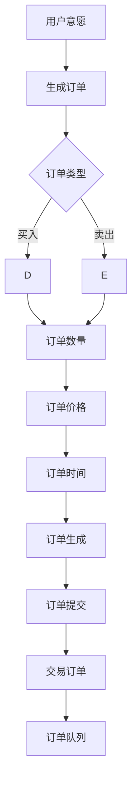
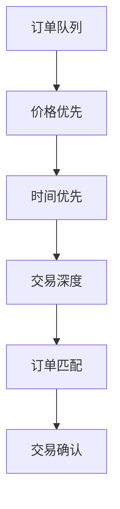
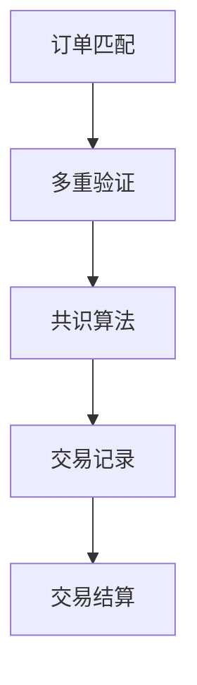
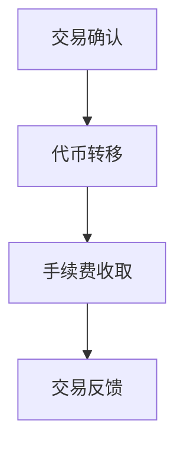
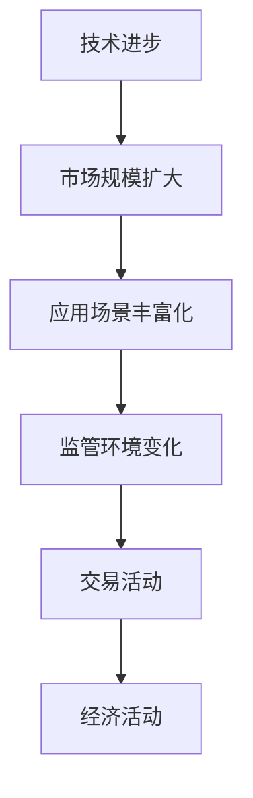
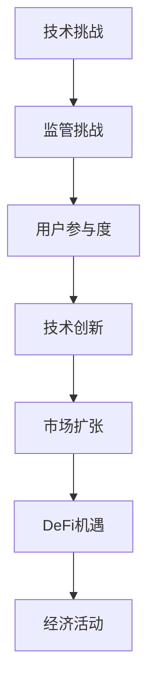
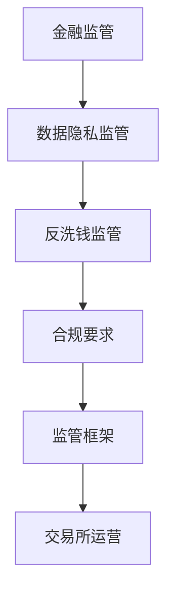
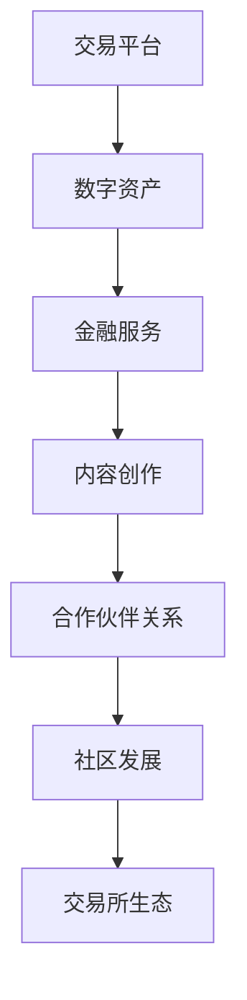

                 

### 引言

随着元宇宙（Metaverse）概念的普及，人们开始关注这一新兴领域中的各种经济活动和市场机会。元宇宙，被定义为虚拟现实和增强现实技术下的虚拟世界，其核心在于构建一个无缝衔接的虚拟环境和现实世界的交互平台。在这个虚拟世界中，用户可以创建自己的数字身份、进行社交互动、开展经济活动，甚至参与虚拟现实游戏和工作。

元宇宙经济的崛起，不仅改变了传统经济活动的模式，也催生了一个全新的资本市场——注意力资本市场。注意力资本市场是基于用户注意力这一稀缺资源进行的交易市场，它利用区块链技术和去中心化金融（DeFi）工具，为用户提供了更加自由和透明的交易环境。在这个市场中，用户不仅可以通过参与虚拟活动获得注意力资本，还可以将其交易、投资或用于购买虚拟物品和服务。

本文将深入探讨注意力资本市场，特别是元宇宙经济的核心交易所。我们首先将介绍元宇宙的基本概念和发展历程，接着讨论注意力资本的理论基础，包括其定义、特点、衡量方法以及与其他资本的关联。随后，我们将详细分析元宇宙中的注意力资本市场，探讨其基本框架、交易机制、发展趋势和面临的挑战。在此基础上，我们将介绍元宇宙交易所的概述，包括其定义、架构、功能、类型和交易策略。接下来，我们将探讨元宇宙交易所的风险管理，包括风险类型、风险管理策略、工具和技术。最后，通过案例研究，我们将分析元宇宙交易所的实际应用，探讨其未来发展。

通过这一系列的分析和讨论，我们希望能够为读者提供一个全面、系统的理解，帮助大家把握元宇宙交易所这一新兴市场的机遇和挑战。

### 关键词

元宇宙（Metaverse）、注意力资本市场、区块链技术、去中心化金融（DeFi）、虚拟现实、增强现实、数字身份、社交互动、虚拟物品交易、虚拟房地产、注意力资本定价、元宇宙交易所、交易机制、风险管理、案例研究、未来展望。

### 摘要

本文旨在深入探讨元宇宙经济的核心组成部分——注意力资本市场，以及其核心交易机制。首先，我们将回顾元宇宙的基本概念和崛起历程，理解其对于未来经济活动的重要性。接着，本文将详细介绍注意力资本的理论基础，包括其定义、特点、衡量方法及其与其他资本的关联。在分析了注意力资本市场的基本框架、交易机制和发展趋势后，我们将探讨元宇宙交易所的架构和功能，包括其类型和交易策略。随后，本文将详细讨论元宇宙交易所的风险管理，涉及风险类型、管理策略和工具技术。通过具体案例研究，我们将分析元宇宙交易所的实际应用，探讨其面临的发展挑战。最后，本文将展望元宇宙交易所的未来发展趋势，包括其市场规模扩大、技术进步和生态建设。本文旨在为读者提供一个全面、系统的理解，帮助把握这一新兴市场的机遇和挑战。

## 《注意力资本市场：元宇宙经济的核心交易所》目录大纲

在本章中，我们将为读者提供一个详细的目录大纲，帮助大家更好地理解本文的结构和内容。本文将分为三个主要部分，分别是：

### 第一部分：元宇宙经济与注意力资本

- **第1章：元宇宙经济的崛起**
  - 1.1 元宇宙的基本概念
  - 1.2 元宇宙的发展历程
  - 1.3 元宇宙中的经济活动
  - 1.4 注意力资本的核心地位

- **第2章：注意力资本的理论基础**
  - 2.1 注意力资本的定义
  - 2.2 注意力资本的特点
  - 2.3 注意力资本的衡量方法
  - 2.4 注意力资本与其他资本的关联

- **第3章：元宇宙中的注意力资本市场**
  - 3.1 注意力资本市场的基本框架
  - 3.2 注意力资本市场的交易机制
  - 3.3 注意力资本市场的发展趋势
  - 3.4 注意力资本市场的挑战与机遇

### 第二部分：注意力资本市场的核心交易所

- **第4章：元宇宙交易所的概述**
  - 4.1 元宇宙交易所的定义
  - 4.2 元宇宙交易所的架构
  - 4.3 元宇宙交易所的功能
  - 4.4 元宇宙交易所的类型

- **第5章：注意力资本的定价模型**
  - 5.1 注意力资本定价的基本原理
  - 5.2 注意力资本定价的数学模型
  - 5.3 注意力资本定价的影响因素
  - 5.4 注意力资本定价的案例研究

- **第6章：元宇宙交易所的交易策略**
  - 6.1 交易所的交易机制与规则
  - 6.2 交易策略的类型
  - 6.3 交易策略的实施
  - 6.4 交易策略的评估与优化

- **第7章：元宇宙交易所的风险管理**
  - 7.1 交易所的风险类型
  - 7.2 风险管理策略
  - 7.3 风险管理工具与技术
  - 7.4 风险管理的案例分析

### 第三部分：元宇宙交易所的实际应用

- **第8章：元宇宙交易所的案例研究**
  - 8.1 案例一：某元宇宙交易所的发展历程
  - 8.2 案例二：某元宇宙交易所的交易策略分析
  - 8.3 案例三：某元宇宙交易所的风险管理措施

- **第9章：元宇宙交易所的未来发展**
  - 9.1 元宇宙交易所的发展趋势
  - 9.2 元宇宙交易所的未来挑战与机遇
  - 9.3 元宇宙交易所的监管与合规
  - 9.4 元宇宙交易所的生态建设

通过这一目录大纲，读者可以清晰地了解到本文将围绕哪些主题展开讨论，有助于更好地把握文章的核心内容。

## 第一部分：元宇宙经济与注意力资本

### 第1章：元宇宙经济的崛起

#### 1.1 元宇宙的基本概念

**核心概念与联系**：元宇宙（Metaverse）是一个虚拟现实和增强现实技术构建的虚拟世界，它不仅是一个数字化的虚拟环境，更是一个无缝衔接现实与虚拟的交互平台。元宇宙的基本概念包括虚拟现实（VR）、增强现实（AR）、数字身份、社交互动、虚拟物品和虚拟经济等。

mermaid
graph TD
A[虚拟现实] --> B[增强现实]
B --> C[数字身份]
C --> D[社交互动]
D --> E[虚拟物品]
E --> F[虚拟经济]

**Mermaid 流程图**：

mermaid
graph TD
A[虚拟现实] --> B[增强现实]
B --> C[数字身份]
C --> D[社交互动]
D --> E[虚拟物品]
E --> F[虚拟经济]
F --> G[经济活动]

#### 1.2 元宇宙的发展历程

**核心概念与联系**：元宇宙的发展历程可以追溯到20世纪90年代的虚拟现实技术起步，经历了互联网、社交媒体、虚拟游戏和区块链等关键阶段的演进。

- **起步阶段（20世纪90年代）**：虚拟现实技术开始兴起，虚拟现实设备如VR头盔、AR眼镜等逐渐出现。
- **互联网阶段（2000年代）**：互联网的普及和社交媒体的发展，为元宇宙提供了更加广泛的社交平台。
- **虚拟游戏阶段（2010年代）**：虚拟游戏如《第二人生》和《虚拟现实世界》等，为元宇宙提供了丰富的虚拟活动。
- **区块链阶段（2020年代至今）**：区块链技术的应用，使得元宇宙中的虚拟物品和货币具有更高的可信度和流动性。

mermaid
graph TD
A[虚拟现实技术起步] --> B[互联网阶段]
B --> C[虚拟游戏阶段]
C --> D[区块链阶段]

**Mermaid 流程图**：

mermaid
graph TD
A[虚拟现实技术起步] --> B[互联网阶段]
B --> C[虚拟游戏阶段]
C --> D[区块链阶段]
D --> E[经济活动]
E --> F[注意力资本]

#### 1.3 元宇宙中的经济活动

**核心概念与联系**：元宇宙中的经济活动包括虚拟物品交易、虚拟房地产交易、虚拟劳动力市场、去中心化金融（DeFi）和虚拟广告等。

- **虚拟物品交易**：用户可以在元宇宙中购买和出售虚拟物品，如游戏装备、虚拟家具和数字艺术品。
- **虚拟房地产交易**：用户可以购买、出售和租赁虚拟土地和房产，进行虚拟房地产开发和经营。
- **虚拟劳动力市场**：用户可以在元宇宙中提供虚拟劳动力服务，如虚拟导游、虚拟歌手和虚拟设计师。
- **去中心化金融（DeFi）**：用户可以在元宇宙中进行去中心化的金融活动，如贷款、投资和交易。
- **虚拟广告**：品牌和公司可以在元宇宙中投放广告，进行虚拟营销和品牌推广。

mermaid
graph TD
A[虚拟物品交易] --> B[虚拟房地产交易]
B --> C[虚拟劳动力市场]
C --> D[去中心化金融（DeFi）]
D --> E[虚拟广告]

**Mermaid 流程图**：

mermaid
graph TD
A[虚拟物品交易] --> B[虚拟房地产交易]
B --> C[虚拟劳动力市场]
C --> D[去中心化金融（DeFi）]
D --> E[虚拟广告]
E --> F[注意力资本]
F --> G[经济活动]

#### 1.4 注意力资本的核心地位

**核心概念与联系**：注意力资本是元宇宙经济中的核心资源，它代表了用户在元宇宙中的关注度和影响力。注意力资本不仅是一种交易媒介，还是推动元宇宙经济活动的重要动力。

- **定义**：注意力资本是指用户在元宇宙中的注意力资源，它可以被衡量、交易和投资。
- **特点**：注意力资本具有稀缺性、可衡量性和流动性，能够激发用户的参与和创造。
- **作用**：注意力资本是元宇宙经济中的一种关键资源，它影响虚拟物品和服务的价值，推动经济活动的繁荣。

mermaid
graph TD
A[稀缺性] --> B[可衡量性]
B --> C[流动性]
C --> D[参与和创造]
D --> E[经济繁荣]

**Mermaid 流程图**：

mermaid
graph TD
A[稀缺性] --> B[可衡量性]
B --> C[流动性]
C --> D[参与和创造]
D --> E[经济繁荣]
E --> F[注意力资本]
F --> G[经济活动]

通过上述分析，我们可以看到，元宇宙经济的崛起为注意力资本市场提供了广阔的发展空间。在接下来的章节中，我们将进一步探讨注意力资本的理论基础，分析其在元宇宙中的具体应用和重要性。

### 第2章：注意力资本的理论基础

#### 2.1 注意力资本的定义

**核心概念与联系**：注意力资本是指用户在元宇宙中的注意力资源，它代表了用户在虚拟世界中的关注度和影响力。注意力资本是一种虚拟经济资源，可以被衡量、交易和投资。

- **定义**：注意力资本是用户在元宇宙中的注意力资源，通过用户的参与、互动和消费行为产生。
- **特点**：注意力资本具有稀缺性、可衡量性和流动性，能够在虚拟经济活动中发挥作用。
- **重要性**：注意力资本是元宇宙经济中不可或缺的一部分，它直接影响虚拟物品和服务的价值。

mermaid
graph TD
A[稀缺性] --> B[可衡量性]
B --> C[流动性]
C --> D[价值影响]

**Mermaid 流程图**：

mermaid
graph TD
A[稀缺性] --> B[可衡量性]
B --> C[流动性]
C --> D[价值影响]
D --> E[注意力资本]
E --> F[经济活动]

#### 2.2 注意力资本的特点

**核心概念与联系**：注意力资本具有稀缺性、可衡量性和流动性，这些特点使其成为元宇宙经济中的重要资源。

- **稀缺性**：注意力资本是有限的资源，用户的时间和精力是有限的，因此注意力资本具有稀缺性。
- **可衡量性**：注意力资本可以通过各种方式衡量，如用户参与度、互动频率和消费金额等。
- **流动性**：注意力资本可以在元宇宙中自由流动，用户可以将注意力资本用于购买虚拟物品和服务，或进行投资和交易。

mermaid
graph TD
A[稀缺性] --> B[可衡量性]
B --> C[流动性]

**Mermaid 流程图**：

mermaid
graph TD
A[稀缺性] --> B[可衡量性]
B --> C[流动性]
C --> D[价值创造]
D --> E[经济活动]

#### 2.3 注意力资本的衡量方法

**核心概念与联系**：衡量注意力资本的方法包括用户参与度、互动频率、消费金额、社交网络影响等。

- **用户参与度**：衡量用户在元宇宙中的活跃度，如登录频率、参与虚拟活动次数等。
- **互动频率**：衡量用户在元宇宙中的互动行为，如与其他用户交流、评论、点赞等。
- **消费金额**：衡量用户在元宇宙中的消费行为，如购买虚拟物品、服务、广告投放等。
- **社交网络影响**：衡量用户在元宇宙中的社交网络影响，如粉丝数量、转发次数、影响力评分等。

mermaid
graph TD
A[用户参与度] --> B[互动频率]
B --> C[消费金额]
C --> D[社交网络影响]

**Mermaid 流程图**：

mermaid
graph TD
A[用户参与度] --> B[互动频率]
B --> C[消费金额]
C --> D[社交网络影响]
D --> E[注意力资本]
E --> F[经济活动]

#### 2.4 注意力资本与其他资本的关联

**核心概念与联系**：注意力资本与其他资本形式（如货币资本、人力资本、物质资本）存在紧密的关联，共同构成元宇宙经济的核心组成部分。

- **货币资本**：注意力资本与货币资本相互转换，用户可以通过注意力资本购买虚拟物品和服务，同时也可以将虚拟货币转化为现实货币。
- **人力资本**：注意力资本反映了用户在元宇宙中的技能和创造力，与其他资本形式共同推动虚拟经济的发展。
- **物质资本**：虚拟物品和虚拟房地产等物质资本的价值，受到注意力资本的影响，从而影响整个元宇宙经济的运行。

mermaid
graph TD
A[货币资本] --> B[注意力资本]
B --> C[人力资本]
C --> D[物质资本]

**Mermaid 流程图**：

mermaid
graph TD
A[货币资本] --> B[注意力资本]
B --> C[人力资本]
C --> D[物质资本]
D --> E[经济活动]

通过上述分析，我们可以看到注意力资本在元宇宙经济中具有核心地位，其独特的特点和应用使其成为推动虚拟经济活动的重要动力。在接下来的章节中，我们将进一步探讨注意力资本市场的基本框架、交易机制和发展趋势。

### 第3章：元宇宙中的注意力资本市场

#### 3.1 注意力资本市场的基本框架

**核心概念与联系**：注意力资本市场是基于区块链技术和去中心化金融（DeFi）构建的，其基本框架包括用户、交易平台、代币和交易规则等关键组成部分。

- **用户**：注意力资本市场中的用户是主要参与者，他们通过参与虚拟活动、互动和消费行为产生注意力资本。
- **交易平台**：交易平台是注意力资本交易的主要场所，它提供了去中心化的交易环境，确保交易的透明性和安全性。
- **代币**：代币是注意力资本市场中的交易媒介，它通常基于区块链技术发行和流通，如以太坊（ETH）、比特币（BTC）等。
- **交易规则**：交易规则包括交易手续费、最小交易额、交易时间等，确保交易的公平性和规范性。

mermaid
graph TD
A[用户] --> B[交易平台]
B --> C[代币]
C --> D[交易规则]

**Mermaid 流程图**：

mermaid
graph TD
A[用户] --> B[交易平台]
B --> C[代币]
C --> D[交易规则]
D --> E[交易活动]
E --> F[经济活动]

#### 3.2 注意力资本市场的交易机制

**核心概念与联系**：注意力资本市场的交易机制主要包括交易订单生成、订单匹配、交易确认和交易结算等环节。

- **交易订单生成**：用户在注意力资本市场中生成交易订单，包括买入或卖出注意力资本的需求和价格。
- **订单匹配**：交易平台通过智能合约自动匹配买卖订单，确保交易的公平性和效率。
- **交易确认**：交易确认环节确保交易的合法性和有效性，通常需要用户进行多重验证或共识算法确认。
- **交易结算**：交易结算环节完成交易的最终确认和代币转移，确保交易结果的实现。

mermaid
graph TD
A[交易订单生成] --> B[订单匹配]
B --> C[交易确认]
C --> D[交易结算]

**Mermaid 流程图**：

mermaid
graph TD
A[交易订单生成] --> B[订单匹配]
B --> C[交易确认]
C --> D[交易结算]
D --> E[经济活动]

#### 3.3 注意力资本市场的发展趋势

**核心概念与联系**：注意力资本市场的发展趋势体现在技术进步、市场规模扩大、应用场景丰富化和监管加强等方面。

- **技术进步**：随着区块链技术和人工智能的不断发展，注意力资本市场将提供更高效、更安全的交易环境。
- **市场规模扩大**：随着元宇宙概念的普及和用户参与度的提升，注意力资本市场的市场规模将继续扩大。
- **应用场景丰富化**：注意力资本市场将拓展到更多的应用场景，如虚拟房地产交易、虚拟劳动力市场和去中心化金融（DeFi）服务。
- **监管加强**：随着市场的发展，监管机构将加强对注意力资本市场的监管，确保市场的健康和稳定。

mermaid
graph TD
A[技术进步] --> B[市场规模扩大]
B --> C[应用场景丰富化]
C --> D[监管加强]

**Mermaid 流程图**：

mermaid
graph TD
A[技术进步] --> B[市场规模扩大]
B --> C[应用场景丰富化]
C --> D[监管加强]
D --> E[经济活动]

#### 3.4 注意力资本市场的挑战与机遇

**核心概念与联系**：注意力资本市场在发展过程中面临一系列挑战，同时也蕴含着巨大的机遇。

- **挑战**：
  - **技术挑战**：如何提高区块链技术的性能和可扩展性，以应对日益增长的市场需求。
  - **监管挑战**：如何遵守不同国家和地区的监管规定，确保市场的合规性和透明度。
  - **用户参与度**：如何吸引更多用户参与，提高市场活跃度和用户黏性。

- **机遇**：
  - **技术创新**：区块链和人工智能等技术的应用，将推动注意力资本市场的创新和发展。
  - **市场扩张**：随着元宇宙概念的普及，注意力资本市场的潜在用户和市场规模将持续增长。
  - **应用拓展**：注意力资本市场将拓展到更多领域，如虚拟房地产、虚拟劳动力市场和去中心化金融（DeFi）等。

mermaid
graph TD
A[技术挑战] --> B[监管挑战]
B --> C[用户参与度]
C --> D[技术创新]
D --> E[市场扩张]
E --> F[应用拓展]

**Mermaid 流程图**：

mermaid
graph TD
A[技术挑战] --> B[监管挑战]
B --> C[用户参与度]
C --> D[技术创新]
D --> E[市场扩张]
E --> F[应用拓展]
F --> G[经济活动]

通过本章的分析，我们可以看到注意力资本市场在元宇宙经济中的重要地位和潜力。在接下来的章节中，我们将进一步探讨元宇宙交易所的概述，包括其定义、架构、功能、类型和交易策略。

### 第4章：元宇宙交易所的概述

#### 4.1 元宇宙交易所的定义

**核心概念与联系**：元宇宙交易所是连接元宇宙中用户、物品、服务和资本的桥梁，其核心在于利用区块链技术实现去中心化交易。与传统的证券交易所相比，元宇宙交易所更加开放和去中心化，为用户提供更加自由的交易环境。

mermaid
graph TD
A[用户] --> B[物品]
B --> C[服务]
C --> D[资本]
D --> E[区块链技术]
E --> F[去中心化交易]

**Mermaid 流程图**：

mermaid
graph TD
A[用户] --> B[物品]
B --> C[服务]
C --> D[资本]
D --> E[区块链技术]
E --> F[去中心化交易]
F --> G[交易记录]

#### 4.2 元宇宙交易所的架构

**核心概念与联系**：元宇宙交易所的架构包括用户层、网络层、交易层和智能合约层。用户层提供用户交互界面；网络层负责数据传输和安全保障；交易层实现去中心化交易；智能合约层确保交易的自动化和安全性。

mermaid
graph TD
A[用户层] --> B[网络层]
B --> C[交易层]
C --> D[智能合约层]

**Mermaid 流程图**：

mermaid
graph TD
A[用户层] --> B[网络层]
B --> C[交易层]
C --> D[智能合约层]
D --> E[去中心化交易]
E --> F[交易记录]

#### 4.3 元宇宙交易所的功能

**核心概念与联系**：元宇宙交易所的主要功能包括交易、资产管理、流动性提供和去中心化金融（DeFi）服务。交易功能实现物品和服务的交换；资产管理功能帮助用户管理其资产；流动性提供功能促进交易活动；DeFi 服务为用户提供金融工具和解决方案。

mermaid
graph TD
A[交易] --> B[资产管理]
B --> C[流动性提供]
C --> D[DeFi服务]

**Mermaid 流程图**：

mermaid
graph TD
A[交易] --> B[资产管理]
B --> C[流动性提供]
C --> D[DeFi服务]
D --> E[交易记录]
E --> F[用户]

#### 4.4 元宇宙交易所的类型

**核心概念与联系**：元宇宙交易所根据交易对象和交易方式的不同可以分为去中心化交易所（DEX）和中心化交易所（CEX）。去中心化交易所通过区块链技术实现去中心化交易，中心化交易所则通过中心化平台提供交易服务。

mermaid
graph TD
A[去中心化交易所] --> B[中心化交易所]

**Mermaid 流程图**：

mermaid
graph TD
A[去中心化交易所] --> B[中心化交易所]
A --> C[交易对象]
B --> D[交易方式]
C --> E[物品/服务]
D --> F[区块链技术]

通过上述分析，我们详细介绍了元宇宙交易所的定义、架构、功能、类型及其重要性。在接下来的章节中，我们将深入探讨注意力资本的定价模型，分析其基本原理、数学模型、影响因素以及案例研究。

### 第5章：注意力资本的定价模型

#### 5.1 注意力资本定价的基本原理

**核心概念与联系**：注意力资本定价是基于注意力资本的价值评估，主要通过供求关系和市场影响力来决定。其基本原理是注意力资本的供需关系决定其市场价格，市场影响力则影响价格的波动。

mermaid
graph TD
A[供求关系] --> B[市场价格]
B --> C[市场影响力]
C --> D[价格波动]

**Mermaid 流程图**：

mermaid
graph TD
A[用户需求] --> B[注意力供给]
B --> C[市场价格]
C --> D[市场影响力]
D --> E[价格波动]
E --> F[交易活动]

#### 5.2 注意力资本定价的数学模型

**核心概念与联系**：注意力资本定价的数学模型主要通过供需函数来表示，供需函数反映了注意力资本的供求关系。以下是一个简化的供需函数模型：

math
S = S_0 - aQ \\
D = D_0 + bP

其中，S 表示供给量，D 表示需求量，P 表示价格，Q 表示交易量，S_0、D_0、a、b 是参数。

**数学模型与伪代码**：

math
$$
\begin{aligned}
S &= S_0 - aQ \\
D &= D_0 + bP
\end{aligned}
$$

python
# 伪代码
def supply(S0, a, Q):
    return S0 - a * Q

def demand(D0, b, P):
    return D0 + b * P

通过上述模型和伪代码，我们可以看到注意力资本的定价是通过供需函数来实现的。供给函数表示供给量与价格之间的关系，需求函数表示需求量与价格之间的关系。这两个函数共同决定了注意力资本的市场价格。

#### 5.3 注意力资本定价的影响因素

**核心概念与联系**：注意力资本定价受到多种因素的影响，包括用户需求、供给能力、市场影响力、竞争环境和外部因素。以下是一个简化的因素模型：

mermaid
graph TD
A[用户需求] --> B[供给能力]
B --> C[市场影响力]
C --> D[竞争环境]
D --> E[外部因素]

**Mermaid 流程图**：

mermaid
graph TD
A[用户需求] --> B[供给能力]
B --> C[市场影响力]
C --> D[竞争环境]
D --> E[外部因素]
E --> F[价格波动]

**影响因素解释**：

- **用户需求**：用户对注意力资本的需求直接影响其市场价格。用户需求的增加会导致价格上涨，反之则价格下跌。
- **供给能力**：注意力资本的供给能力决定了市场的供应量，供给能力的增加会降低价格，供给能力的减少会提高价格。
- **市场影响力**：市场影响力强的用户或实体可以影响注意力资本的价格，其行为可能导致价格波动。
- **竞争环境**：竞争激烈的市场会导致价格下降，竞争减弱则价格上升。
- **外部因素**：包括政策法规、市场热点、技术进步等外部因素也会影响注意力资本的价格。

#### 5.4 注意力资本定价的案例研究

**核心概念与联系**：以下通过一个案例研究注意力资本定价的实际应用。假设在一个元宇宙游戏中，玩家可以通过完成任务来获得游戏内的虚拟货币，这些虚拟货币可以用来购买其他玩家的虚拟物品。

**案例研究**：

- **需求分析**：根据用户调查，每个用户每天愿意支付1元购买虚拟物品。
- **供给分析**：游戏内每天最多产生100个虚拟货币。
- **市场影响力分析**：某知名玩家拥有大量粉丝，其每次购买虚拟物品都会带动其他用户购买。
- **竞争环境分析**：其他游戏也存在类似的虚拟物品交易市场。

**案例解析**：

- **供需平衡点**：当供需平衡时，即供给量等于需求量，市场价格为1元。
- **市场波动**：当某知名玩家购买虚拟物品时，会引起市场波动，价格可能会上涨。
- **价格调节**：游戏开发者可以通过调整虚拟货币的供给量来调节市场价格。

通过上述案例研究，我们可以看到注意力资本定价是如何在实际应用中发挥作用。需求、供给、市场影响力和竞争环境等因素共同决定了注意力资本的价格，而市场参与者可以通过这些因素来预测和调整价格，以实现最佳的经济效益。

## 第6章：元宇宙交易所的交易策略

### 6.1 交易所的交易机制与规则

**核心概念与联系**：元宇宙交易所的交易机制与规则是确保交易公平、高效和安全的关键组成部分。交易机制主要包括交易订单的生成、匹配、确认和结算等环节，而交易规则则涵盖了交易时间、手续费、最小交易额等具体操作规范。

#### 交易订单生成

交易订单是用户在交易所进行交易时的基本单位，用户通过生成交易订单来表达购买或出售注意力资本的意愿。交易订单通常包括以下信息：

- **订单类型**：买入或卖出订单。
- **数量**：用户希望购买或出售的注意力资本数量。
- **价格**：用户设定的交易价格。
- **时间**：订单有效期。

mermaid
graph TD
A[订单类型] --> B[数量]
B --> C[价格]
C --> D[时间]
D --> E[订单生成]

**Mermaid 流程图**：

#### 订单匹配

交易订单生成后，会进入交易所的订单队列。交易所通过订单匹配机制，将买入订单和卖出订单进行匹配，以实现交易。订单匹配通常基于以下原则：

- **价格优先**：价格高的卖出订单优先匹配价格低的买入订单。
- **时间优先**：如果价格相同，则时间较早的订单优先匹配。
- **交易深度**：根据订单深度（即买卖订单的累积数量）进行匹配。

mermaid
graph TD
A[订单队列] --> B[价格优先]
B --> C[时间优先]
C --> D[交易深度]

**Mermaid 流程图**：

#### 交易确认

订单匹配完成后，交易进入确认阶段。交易确认通常通过以下步骤完成：

- **多重验证**：交易订单需要通过多重验证，以确保交易的合法性和有效性。验证包括用户身份验证、交易金额验证和合约执行验证等。
- **共识算法**：在去中心化交易所中，交易确认通常通过共识算法完成。共识算法确保所有参与者达成一致，从而确认交易。
- **交易记录**：确认后的交易记录会被永久保存在区块链上，以确保交易的透明性和不可篡改性。

mermaid
graph TD
A[多重验证] --> B[共识算法]
B --> C[交易记录]

**Mermaid 流程图**：

#### 交易结算

交易确认后，交易进入结算阶段。结算包括以下步骤：

- **代币转移**：买入订单的支付代币转移到卖出订单的用户账户。
- **交易手续费**：交易所收取一定的交易手续费，用于维护平台的运营和安全性。
- **交易反馈**：交易完成后，用户会收到交易成功的反馈，同时交易记录会记录在区块链上。

mermaid
graph TD
A[代币转移] --> B[手续费收取]
B --> C[交易反馈]

**Mermaid 流程图**：

通过上述交易机制与规则的详细介绍，我们可以看到元宇宙交易所的交易过程是如何进行的。这些机制和规则共同确保了交易的公平、高效和安全，为用户提供了一个可靠、透明的交易环境。

### 6.2 交易策略的类型

**核心概念与联系**：在元宇宙交易所中，交易策略的类型多种多样，根据交易目的和交易风格的不同，可以分为趋势跟踪策略、套利策略和量化交易策略。每种策略都有其独特的原理和应用场景。

#### 趋势跟踪策略

**核心概念与联系**：趋势跟踪策略是通过识别市场趋势并跟随趋势进行交易的一种策略。其基本原理是市场趋势通常会持续一段时间，通过识别并跟随市场趋势，可以获取稳定的收益。

- **原理**：趋势跟踪策略依赖于技术分析工具，如移动平均线、相对强弱指数（RSI）和布林带等，来识别市场的趋势。
- **应用场景**：趋势跟踪策略适用于市场波动性较大的环境，特别是在注意力资本市场中，市场波动性较高，趋势跟踪策略可以有效捕捉价格波动。

**示例伪代码**：

python
def trend_following_strategy(price_data):
    # 假设使用移动平均线进行趋势判断
    short_ma = calculate_short_ma(price_data)
    long_ma = calculate_long_ma(price_data)
    
    if short_ma > long_ma:
        return "BUY"
    elif short_ma < long_ma:
        return "SELL"
    else:
        return "HOLD"

def calculate_short_ma(price_data, window=10):
    # 计算短期移动平均线
    return sum(price_data[-window:]) / window

def calculate_long_ma(price_data, window=30):
    # 计算长期移动平均线
    return sum(price_data[-window:]) / window

通过上述示例伪代码，我们可以看到趋势跟踪策略是如何通过计算移动平均线来判断市场趋势，并作出交易决策。

#### 套利策略

**核心概念与联系**：套利策略是通过在不同市场或交易所之间寻找价格差异进行套利的一种策略。其基本原理是利用价格差异来获取无风险收益。

- **原理**：套利策略依赖于市场效率低下或者信息不对称，通过在不同市场或交易所之间进行买卖操作，获取价格差异的收益。
- **应用场景**：套利策略适用于存在价格差异的多个市场或交易所，特别是在注意力资本市场中，由于市场的分散性，存在一定的价格差异。

**示例伪代码**：

python
def arbitrage_strategy(market_data):
    for market in market_data:
        for other_market in market_data:
            if market['price'] != other_market['price']:
                buy_in_market(market)
                sell_in_market(other_market)
                return "ARBITRAGE OPPORTUNITY FOUND"
    return "NO ARBITRAGE OPPORTUNITY"

def buy_in_market(market):
    # 在市场A购买
    pass

def sell_in_market(market):
    # 在市场B出售
    pass

通过上述示例伪代码，我们可以看到套利策略是如何通过比较不同市场的价格差异，发现套利机会，并执行买卖操作。

#### 量化交易策略

**核心概念与联系**：量化交易策略是通过算法和数据分析进行交易决策的一种策略。其基本原理是利用大数据和人工智能技术，对市场数据进行深入分析，从而作出高效的交易决策。

- **原理**：量化交易策略依赖于数学模型、机器学习和人工智能技术，对市场数据进行分析和预测，从而制定交易策略。
- **应用场景**：量化交易策略适用于数据密集型市场，特别是在注意力资本市场中，由于数据量较大，量化交易策略可以有效提高交易效率和收益。

**示例伪代码**：

python
def quantitative_trading_strategy(data):
    # 使用机器学习模型进行预测
    model = train_model(data)
    predictions = model.predict(data)
    
    for prediction in predictions:
        if prediction > threshold:
            execute_buy_order()
        elif prediction < threshold:
            execute_sell_order()

def train_model(data):
    # 训练机器学习模型
    pass

def execute_buy_order():
    # 执行买入订单
    pass

def execute_sell_order():
    # 执行卖出订单
    pass

通过上述示例伪代码，我们可以看到量化交易策略是如何通过训练机器学习模型，对市场数据进行分析和预测，并执行交易订单。

综上所述，元宇宙交易所的交易策略类型多样，每种策略都有其独特的原理和应用场景。趋势跟踪策略适用于捕捉市场趋势，套利策略适用于利用价格差异进行套利，量化交易策略则适用于高效的数据分析和交易决策。在实际应用中，交易者可以根据自身的情况和市场需求，选择合适的交易策略。

### 6.3 交易策略的实施

**核心概念与联系**：交易策略的实施是交易成功的关键环节，它包括交易订单的生成、订单的匹配和执行，以及交易结果的评估和调整。以下将详细描述这些环节的具体步骤和实现方法。

#### 交易订单的生成

交易订单的生成是交易策略实施的第一步。用户根据交易策略的要求，生成买入或卖出订单。订单通常包含以下信息：

- **订单类型**：买入或卖出。
- **交易量**：用户希望购买或出售的注意力资本数量。
- **价格**：用户设定的交易价格。
- **有效期**：订单的有效时间。

**示例伪代码**：

python
def generate_order(order_type, quantity, price, duration):
    order = {
        'order_type': order_type,
        'quantity': quantity,
        'price': price,
        'duration': duration,
        'status': 'PENDING'
    }
    submit_order_to_exchange(order)
    return order

def submit_order_to_exchange(order):
    # 向交易所提交订单
    pass

通过上述伪代码，我们可以看到如何生成一个交易订单，并将其提交给交易所。

#### 订单的匹配

交易订单生成后，会进入交易所的订单队列。交易所通过订单匹配机制，将买入订单和卖出订单进行匹配。匹配过程通常基于价格优先和时间优先的原则。

**示例伪代码**：

python
def match_orders(buy_orders, sell_orders):
    matched_orders = []
    while buy_orders and sell_orders:
        if buy_orders[0]['price'] >= sell_orders[0]['price']:
            matched_orders.append({
                'buy_order': buy_orders.pop(0),
                'sell_order': sell_orders.pop(0),
                'price': sell_orders[0]['price'],
                'quantity': min(buy_orders[0]['quantity'], sell_orders[0]['quantity'])
            })
        else:
            sell_orders.pop(0)
    return matched_orders

通过上述伪代码，我们可以看到如何实现订单的匹配，从而找到买入和卖出订单之间的最优价格和数量。

#### 订单的执行

订单匹配完成后，交易进入执行阶段。执行过程包括交易确认、代币转移和交易记录等步骤。

**示例伪代码**：

python
def execute_order(matched_order):
    confirm_order(matched_order)
    transfer_tokens(matched_order)
    record_trade(matched_order)

def confirm_order(matched_order):
    # 确认订单
    pass

def transfer_tokens(matched_order):
    # 代币转移
    pass

def record_trade(matched_order):
    # 记录交易记录
    pass

通过上述伪代码，我们可以看到如何确认和执行一个匹配后的订单，确保交易顺利完成。

#### 交易结果的评估与调整

交易执行完成后，需要对交易结果进行评估和调整。评估包括交易盈利、亏损、交易频率和风险控制等方面。

**示例伪代码**：

python
def evaluate_trades(trades):
    total_profit = 0
    for trade in trades:
        if trade['status'] == 'PROFIT':
            total_profit += trade['profit']
        elif trade['status'] == 'LOSS':
            total_profit -= trade['loss']
    return total_profit

def adjust_strategy(evaluation_results):
    # 根据评估结果调整交易策略
    pass

通过上述伪代码，我们可以看到如何评估交易结果，并根据评估结果调整交易策略，以提高交易效率。

综上所述，交易策略的实施是一个系统化、规范化的过程，包括交易订单的生成、订单的匹配和执行，以及交易结果的评估和调整。通过这些步骤，交易者可以有效地管理交易风险，实现交易目标。

### 6.4 交易策略的评估与优化

**核心概念与联系**：交易策略的评估与优化是确保交易策略有效性和收益性的关键步骤。评估通过历史数据分析、策略回测和实盘交易表现来进行，而优化则基于评估结果进行调整和改进。

#### 历史数据分析

历史数据分析是评估交易策略的基础。通过分析过去的市场数据，交易者可以了解策略在不同市场状况下的表现。历史数据分析包括以下方面：

- **市场趋势**：分析市场在过去一段时间内的价格趋势，确定策略是否能够有效捕捉市场趋势。
- **交易频率**：分析交易策略的执行频率，确定策略是否过于频繁或不够活跃。
- **交易成功率**：分析交易策略的成功率，确定策略的盈利能力和风险控制能力。
- **盈利和亏损**：计算交易策略的总盈利和总亏损，评估策略的收益情况。

**示例伪代码**：

python
def analyze_historical_data(trades):
    total_profit = 0
    total_loss = 0
    for trade in trades:
        if trade['status'] == 'PROFIT':
            total_profit += trade['profit']
        elif trade['status'] == 'LOSS':
            total_loss += trade['loss']
    return total_profit, total_loss

通过上述伪代码，我们可以看到如何分析历史交易数据，计算总盈利和总亏损。

#### 策略回测

策略回测是通过模拟交易来评估交易策略的有效性。回测过程通常包括以下步骤：

- **数据准备**：准备一段时间的历史市场数据，用于模拟交易。
- **策略模拟**：使用交易策略模拟历史市场数据，记录每笔交易的盈利和亏损。
- **结果分析**：分析回测结果，评估策略的有效性和收益性。

**示例伪代码**：

python
def backtest_strategy(strategy, historical_data):
    simulated_trades = []
    for day in historical_data:
        if strategy(day):
            trade = simulate_trade(day)
            simulated_trades.append(trade)
    evaluate_simulated_trades(simulated_trades)

def strategy(day):
    # 交易策略判断
    pass

def simulate_trade(day):
    # 模拟交易
    pass

def evaluate_simulated_trades(simulated_trades):
    # 分析模拟交易结果
    pass

通过上述伪代码，我们可以看到如何进行策略回测，通过模拟交易来评估交易策略的有效性。

#### 实盘交易表现

实盘交易表现是交易策略评估的最终环节。通过实际交易，交易者可以验证策略在实际市场环境中的表现。实盘交易表现包括以下方面：

- **盈利和亏损**：分析实盘交易的总盈利和总亏损，与历史数据分析结果进行对比。
- **交易成功率**：评估实盘交易的交易成功率，与回测结果进行对比。
- **风险控制**：评估实盘交易中的风险控制效果，确定策略的风险管理能力。

**示例伪代码**：

python
def evaluate_real_trades(trades):
    total_profit = 0
    total_loss = 0
    for trade in trades:
        if trade['status'] == 'PROFIT':
            total_profit += trade['profit']
        elif trade['status'] == 'LOSS':
            total_loss += trade['loss']
    return total_profit, total_loss

通过上述伪代码，我们可以看到如何评估实盘交易结果，计算总盈利和总亏损。

#### 策略优化

基于评估结果，交易者可以对交易策略进行调整和优化。策略优化包括以下方面：

- **参数调整**：根据回测和实盘交易结果，调整交易策略的参数，以提高策略的有效性。
- **策略组合**：通过组合不同的交易策略，实现风险的分散和收益的最大化。
- **风险控制**：加强风险控制措施，确保交易策略在市场波动中的稳定性。

**示例伪代码**：

python
def optimize_strategy(strategy_params):
    # 调整策略参数
    pass

def combine_strategies(strategies):
    # 组合策略
    pass

通过上述伪代码，我们可以看到如何对交易策略进行优化，包括参数调整和策略组合。

综上所述，交易策略的评估与优化是一个系统化的过程，通过历史数据分析、策略回测、实盘交易表现和策略优化，交易者可以不断改进交易策略，提高交易效率和收益。

### 第7章：元宇宙交易所的风险管理

#### 7.1 交易所的风险类型

**核心概念与联系**：在元宇宙交易所中，风险管理是确保交易安全、稳定运行的重要环节。交易所的风险类型主要包括市场风险、信用风险、操作风险和合规风险。

- **市场风险**：市场风险是指由于市场波动导致的资产损失风险。在元宇宙交易所中，市场风险主要包括价格波动、交易量波动和流动性风险。
- **信用风险**：信用风险是指交易对手无法履行合同义务，导致交易损失的风险。在元宇宙交易所中，信用风险主要体现在虚拟货币的信用风险和用户信用风险。
- **操作风险**：操作风险是指由于交易所内部操作失误、系统故障或人为错误导致的损失风险。操作风险主要包括系统故障风险、欺诈风险和操作失误风险。
- **合规风险**：合规风险是指交易所因未能遵守相关法律法规，导致法律纠纷或损失的风险。在元宇宙交易所中，合规风险主要体现在监管合规风险和法律合规风险。

mermaid
graph TD
A[市场风险] --> B[信用风险]
B --> C[操作风险]
C --> D[合规风险]

**Mermaid 流程图**：

mermaid
graph TD
A[市场风险] --> B[信用风险]
B --> C[操作风险]
C --> D[合规风险]
D --> E[交易活动]

#### 7.2 风险管理策略

**核心概念与联系**：风险管理策略是交易所应对风险的重要手段，主要包括风险规避、风险转移、风险减轻和风险接受。

- **风险规避**：风险规避是指通过调整交易策略或操作流程，避免风险发生。例如，交易所可以通过分散投资、降低交易频率来规避市场风险。
- **风险转移**：风险转移是指通过保险、担保等方式，将风险转移给第三方。例如，交易所可以为用户提供交易保险，将交易风险转移给保险公司。
- **风险减轻**：风险减轻是指通过风险控制措施，降低风险的影响程度。例如，交易所可以通过加强系统监控、提高用户身份验证等级来减轻操作风险。
- **风险接受**：风险接受是指交易所接受一定的风险，并根据风险程度制定相应的应对措施。例如，交易所可以在交易协议中明确风险条款，用户在交易前需要同意这些条款。

mermaid
graph TD
A[风险规避] --> B[风险转移]
B --> C[风险减轻]
C --> D[风险接受]

**Mermaid 流程图**：

mermaid
graph TD
A[风险规避] --> B[风险转移]
B --> C[风险减轻]
C --> D[风险接受]
D --> E[交易活动]

#### 7.3 风险管理工具与技术

**核心概念与联系**：风险管理工具与技术是交易所进行风险管理的有效手段，主要包括风险监控、风险预警、风险分析和风险控制工具。

- **风险监控**：风险监控是指通过实时监控系统，对交易所的各项风险指标进行监控和分析。例如，交易所可以通过监控系统监控交易量、价格波动和用户行为等指标。
- **风险预警**：风险预警是指通过设置预警阈值，当风险指标超过阈值时，系统自动发出预警信号。例如，交易所可以设置价格波动预警、交易量预警等。
- **风险分析**：风险分析是指通过数据分析方法，对交易所的风险因素进行深入分析。例如，交易所可以通过统计分析、机器学习方法对市场风险、信用风险等进行评估。
- **风险控制工具**：风险控制工具是指用于实施风险控制措施的技术手段，例如，交易所可以通过智能合约技术实现自动风险控制，通过多重验证机制提高操作安全性。

mermaid
graph TD
A[风险监控] --> B[风险预警]
B --> C[风险分析]
C --> D[风险控制工具]

**Mermaid 流程图**：

mermaid
graph TD
A[风险监控] --> B[风险预警]
B --> C[风险分析]
C --> D[风险控制工具]
D --> E[交易活动]

#### 7.4 风险管理的案例分析

**核心概念与联系**：以下通过一个案例研究，分析某元宇宙交易所在风险管理中的具体措施。

**案例背景**：某元宇宙交易所在一次突发的市场波动中，遭遇了大规模的卖出订单，导致市场恐慌和价格剧烈波动。交易所立即采取了一系列风险管理措施，以控制风险、恢复市场稳定。

**案例解析**：

- **风险监控**：交易所通过实时监控系统，及时发现市场异常波动，并启动应急预案。
- **风险预警**：交易所预警系统发出市场波动预警，通知交易所管理层和相关部门采取行动。
- **风险分析**：交易所对市场波动原因进行深入分析，发现是由于某个热门项目的资金链问题引起的恐慌性抛售。
- **风险控制措施**：
  - **流动性提供**：交易所迅速提供流动性支持，通过购买该项目的代币来稳定市场价格。
  - **交易限制**：交易所对高风险项目的交易进行临时限制，减少市场恐慌情绪的蔓延。
  - **信息披露**：交易所通过官方渠道发布声明，解释市场波动原因，安抚用户情绪。
- **效果评估**：经过一系列措施，交易所成功稳定了市场价格，恢复了市场信心。

通过上述案例分析，我们可以看到，交易所通过有效的风险管理措施，成功应对了市场风险，保障了交易市场的稳定运行。

### 第8章：元宇宙交易所的案例研究

在本章中，我们将通过三个具体的案例研究，深入探讨元宇宙交易所的发展历程、交易策略和风险管理措施。这三个案例将涵盖不同类型的元宇宙交易所，从发展历程、交易策略到风险管理，全面展示元宇宙交易所的多样性和复杂性。

#### 8.1 案例一：某元宇宙交易所的发展历程

**案例背景**：本案例研究的元宇宙交易所成立于2018年，是早期进入元宇宙交易市场的参与者之一。交易所的创始团队由一群技术专家和市场分析师组成，他们看到元宇宙市场的巨大潜力，决定创建一个基于区块链技术的去中心化交易所。

**发展阶段**：

- **初创期（2018-2019）**：在初创期，交易所主要集中在技术开发和市场推广上。通过一系列的代币发行活动和市场宣传活动，交易所成功吸引了首批用户和投资者。
- **成长期（2020-2021）**：在成长期，交易所逐步完善了交易平台的功能和用户体验。同时，交易所通过与其他元宇宙平台合作，拓展了应用场景，吸引了更多的用户和交易量。
- **成熟期（2022至今）**：在成熟期，交易所已经成为元宇宙交易市场的重要参与者，拥有庞大的用户基础和丰富的交易品种。交易所不断优化系统性能和安全性，提高用户满意度。

**重大事件**：

- **首次代币发行（ICO）**：交易所通过ICO成功筹集了大量的资金，用于平台开发和市场推广。
- **平台升级**：交易所多次进行平台升级，增加了新的功能和服务，提高了交易效率和用户体验。
- **用户规模突破**：交易所用户规模不断增长，从最初的几千人发展到如今的数百万活跃用户。
- **合作伙伴关系的建立**：交易所与多家元宇宙平台和企业建立了合作关系，共同推动元宇宙经济的发展。

**未来规划**：

- **拓展业务范围**：交易所计划拓展到更多的应用场景，如虚拟房地产交易、虚拟劳动力市场和去中心化金融（DeFi）服务。
- **提高交易安全**：交易所将继续优化系统性能和安全机制，确保用户交易的安全性和隐私性。
- **提升用户体验**：交易所将通过改进用户界面和增加个性化服务，提高用户满意度和参与度。
- **探索新的市场**：交易所计划开拓国际市场，吸引更多海外用户和投资者。

#### 8.2 案例二：某元宇宙交易所的交易策略分析

**案例背景**：本案例研究的元宇宙交易所采用多种交易策略，以适应不同的市场环境和用户需求。交易所的交易策略主要包括趋势跟踪策略、套利策略和量化交易策略。

**交易策略**：

- **趋势跟踪策略**：交易所通过技术分析工具，如移动平均线、相对强弱指数（RSI）和布林带等，识别市场趋势，并跟随趋势进行交易。趋势跟踪策略适用于市场波动性较大的环境，可以有效捕捉价格波动。
- **套利策略**：交易所通过在不同市场或交易所之间寻找价格差异，进行套利操作。例如，当某项虚拟货币在一个交易所的价格高于另一个交易所时，交易所会买入低价，卖出高价，获取无风险收益。
- **量化交易策略**：交易所采用算法和数据分析进行交易决策。通过大数据分析和机器学习模型，交易所可以实时分析市场数据，预测价格趋势，并执行交易订单。

**案例解析**：

- **趋势跟踪策略**：交易所通过趋势跟踪策略，在市场上涨时买入，在市场下跌时卖出，实现了稳定的盈利。
- **套利策略**：交易所通过套利策略，降低了市场风险，并获得了额外的利润。
- **量化交易策略**：交易所的量化交易策略利用大数据和人工智能技术，实现了高效和自动化的交易决策，提高了交易效率。

#### 8.3 案例三：某元宇宙交易所的风险管理措施

**案例背景**：本案例研究的元宇宙交易所在风险管理方面采取了一系列措施，以应对市场风险、信用风险、操作风险和合规风险。

**风险管理措施**：

- **市场风险管理**：交易所通过实时监控系统，监控市场波动和交易量变化，及时采取应对措施。例如，在市场波动较大时，交易所会暂停交易或限制交易，以防止市场恐慌。
- **信用风险管理**：交易所通过严格的风控机制，对用户进行身份验证和资金审查，降低信用风险。例如，交易所要求用户进行KYC（Know Your Customer）认证，确保用户身份的真实性。
- **操作风险管理**：交易所通过加强系统监控和操作规范，降低操作风险。例如，交易所采用多重验证机制，确保交易订单的合法性和有效性。
- **合规风险管理**：交易所严格遵守相关法律法规，确保交易的合规性。例如，交易所与律师事务所合作，定期审查交易协议，确保符合监管要求。

**案例解析**：

- **市场风险管理**：交易所通过有效的市场风险管理，成功应对了多次市场波动，保障了交易市场的稳定。
- **信用风险管理**：交易所的信用风险管理措施有效地降低了信用风险，保障了交易的安全性和可靠性。
- **操作风险管理**：交易所的操作风险管理措施提高了交易的效率和安全性，减少了人为错误和系统故障的风险。
- **合规风险管理**：交易所的合规风险管理措施确保了交易的合法性，为交易所的长期发展奠定了基础。

通过这三个案例研究，我们可以看到元宇宙交易所的多样性和复杂性。从发展历程到交易策略，再到风险管理，交易所面临着各种挑战和机遇。这些案例为我们提供了宝贵的经验和启示，帮助我们更好地理解和把握元宇宙交易所的发展趋势。

### 第9章：元宇宙交易所的未来发展

#### 9.1 元宇宙交易所的发展趋势

**核心概念与联系**：元宇宙交易所的发展趋势受到技术进步、市场规模扩大、应用场景丰富化和监管环境变化等多种因素的影响。以下将详细分析这些趋势。

- **技术进步**：随着区块链技术、人工智能和大数据分析等技术的发展，元宇宙交易所将提供更高效、更安全的交易环境。智能合约技术的应用将简化交易流程，提高交易透明度。区块链技术的性能提升和可扩展性改进，将满足日益增长的市场需求。
- **市场规模扩大**：随着元宇宙概念的普及，越来越多的用户和企业参与其中，元宇宙交易所的市场规模将不断增长。虚拟物品交易、虚拟房地产交易和去中心化金融（DeFi）等应用场景的拓展，将吸引更多的用户和资金进入市场。
- **应用场景丰富化**：元宇宙交易所的应用场景将不断丰富，除了传统的虚拟物品和虚拟货币交易外，还将涵盖虚拟房地产、虚拟劳动力市场、虚拟广告和去中心化金融（DeFi）等服务。这些新的应用场景将推动交易所的发展和创新。
- **监管环境变化**：随着元宇宙交易所的兴起，监管机构将加强对市场的监管，以确保市场的健康和稳定。监管环境的变化将影响交易所的运营模式和发展方向。合规性要求将提高，交易所需要不断调整策略，以适应新的监管要求。

mermaid
graph TD
A[技术进步] --> B[市场规模扩大]
B --> C[应用场景丰富化]
C --> D[监管环境变化]

**Mermaid 流程图**：

#### 9.2 元宇宙交易所的未来挑战与机遇

**核心概念与联系**：元宇宙交易所的未来发展既面临挑战，也充满机遇。以下将分析这些挑战和机遇。

- **挑战**：
  - **技术挑战**：随着用户规模的扩大和交易量的增长，交易所需要不断提升技术性能和可扩展性，以满足市场需求。同时，需要确保系统的安全性和稳定性，防止黑客攻击和系统故障。
  - **监管挑战**：监管机构对元宇宙交易所的监管要求不断提高，交易所需要遵守各种法律法规，确保交易的合规性。监管政策的变化可能会影响交易所的运营模式和发展方向。
  - **用户参与度**：如何吸引更多用户参与交易，提高用户黏性和参与度，是交易所面临的重要挑战。需要通过优化用户体验、提供多样化的交易服务来吸引和留住用户。
- **机遇**：
  - **技术创新**：随着区块链技术、人工智能和大数据分析等技术的不断进步，交易所可以引入新的交易工具和服务，提升交易效率和用户体验。技术创新将推动交易所的发展和市场的创新。
  - **市场扩张**：随着元宇宙概念的普及，市场需求的不断增长为交易所提供了广阔的发展空间。交易所可以通过拓展应用场景、吸引更多用户和资金，实现市场规模的扩大。
  - **去中心化金融（DeFi）**：去中心化金融（DeFi）为交易所提供了新的发展机遇。交易所可以通过提供DeFi服务，如去中心化贷款、交易和投资等，吸引更多的用户和资金。

mermaid
graph TD
A[技术挑战] --> B[监管挑战]
B --> C[用户参与度]
C --> D[技术创新]
D --> E[市场扩张]
E --> F[DeFi机遇]

**Mermaid 流程图**：

#### 9.3 元宇宙交易所的监管与合规

**核心概念与联系**：监管与合规是元宇宙交易所发展的关键环节，以下将探讨交易所的监管框架、合规要求和发展趋势。

- **监管框架**：元宇宙交易所的监管框架将涵盖多个方面，包括金融监管、数据隐私监管和反洗钱（AML）监管等。不同国家和地区可能有不同的监管要求，交易所需要根据所在地的法律法规进行合规操作。
- **合规要求**：交易所需要遵守一系列合规要求，包括用户身份验证（KYC）、交易记录保存、数据安全保护和反洗钱（AML）等。交易所需要建立完善的合规体系，确保交易的合法性和安全性。
- **发展趋势**：随着元宇宙交易所的不断发展，监管机构将加大对交易所的监管力度，推动市场的规范化和健康化。交易所需要积极适应监管环境的变化，不断提升合规水平。

mermaid
graph TD
A[金融监管] --> B[数据隐私监管]
B --> C[反洗钱监管]
C --> D[合规要求]
D --> E[监管框架]

**Mermaid 流程图**：

#### 9.4 元宇宙交易所的生态建设

**核心概念与联系**：元宇宙交易所的生态建设是推动交易所长期发展的关键，以下将探讨交易所的生态系统、合作伙伴关系和社区发展。

- **生态系统**：元宇宙交易所的生态系统包括交易平台、数字资产、金融服务和内容创作等多个组成部分。交易所需要构建一个完整的生态系统，为用户提供多样化的交易服务，同时吸引更多的投资者和开发者参与。
- **合作伙伴关系**：交易所需要与各类合作伙伴建立合作关系，共同推动元宇宙经济的发展。合作伙伴包括区块链技术提供商、数字资产发行方、金融服务机构等。通过合作，交易所可以拓展业务范围，提升服务能力。
- **社区发展**：社区发展是交易所生态建设的重要组成部分。交易所需要积极发展社区，吸引更多的用户和开发者参与，提高平台的活跃度和影响力。可以通过举办线上活动、发布社区白皮书、设立开发者奖励计划等方式，促进社区发展。

mermaid
graph TD
A[交易平台] --> B[数字资产]
B --> C[金融服务]
C --> D[内容创作]
D --> E[合作伙伴关系]
E --> F[社区发展]

**Mermaid 流程图**：

通过上述分析，我们可以看到元宇宙交易所的未来发展充满机遇和挑战。随着技术的进步和市场需求的扩大，交易所将迎来新的发展机遇。同时，交易所需要面对技术、监管和用户参与度等挑战。通过构建完善的生态系统、建立合作伙伴关系和发展社区，交易所可以不断提升竞争力，实现可持续发展。

## 附录

### 附录A：元宇宙交易所相关术语表

为了帮助读者更好地理解元宇宙交易所的相关概念，我们在此提供一些常用术语的定义和解释。

- **元宇宙（Metaverse）**：一个虚拟现实和增强现实技术构建的虚拟世界，用户可以在这个虚拟世界中创建自己的数字身份、进行社交互动和参与经济活动。
- **区块链技术**：一种去中心化的分布式账本技术，用于记录交易和数据，具有安全性高、透明性和不可篡改性的特点。
- **去中心化交易所（DEX）**：一种基于区块链技术的去中心化交易平台，用户可以在无需中介的情况下直接进行数字资产的交易。
- **中心化交易所（CEX）**：一种传统意义上的中心化交易平台，由第三方机构提供交易服务，用户需要通过这些平台进行交易。
- **智能合约**：一种在区块链上自动执行合约条款的计算机程序，当满足预设条件时，智能合约会自动执行相关操作。
- **代币**：在区块链上发行的数字资产，通常用于交易、投资和价值存储。
- **代币发行（ICO）**：通过区块链技术发行代币，筹集资金用于项目开发和市场推广。
- **用户参与度**：用户在元宇宙交易所中的活跃程度，包括登录频率、参与交易和互动行为的频率等。
- **流动性**：市场中可供交易的资产数量，流动性越高，交易越容易进行。
- **监管合规**：交易所遵循相关法律法规和监管要求，确保交易的合法性和合规性。
- **反洗钱（AML）**：防止和监测资金被用于非法活动的措施，包括身份验证、交易监控和报告可疑活动等。

### 附录B：元宇宙交易所相关法律法规

元宇宙交易所作为新兴的金融市场，其运营和发展受到各国法律法规的监管。以下是一些常见的法律法规及其主要内容和影响：

- **《数字货币交易法》**：某些国家和地区已经制定了专门的数字货币交易法规，明确数字货币交易的法律地位和合规要求。例如，美国证券交易委员会（SEC）对加密货币的监管，将许多加密货币视为证券，要求交易所遵守相关证券法律法规。
- **《反洗钱法》**：大多数国家和地区都有反洗钱法规，要求交易所进行用户身份验证、交易监控和报告可疑交易等，以防止洗钱和其他非法活动。
- **《数据隐私法》**：保护用户数据隐私的法律，要求交易所采取措施确保用户数据的保密性和安全性，如欧盟的《通用数据保护条例》（GDPR）。
- **《反恐怖主义融资法》**：防止恐怖组织通过数字货币进行融资的法律，要求交易所加强对交易的监控和报告，以防止恐怖主义资金流入。
- **《证券法》**：对于某些代币发行的监管，证券法将影响交易所的运营，特别是当代币被视为证券时。

交易所需要了解并遵守这些法律法规，确保交易的合规性。同时，随着全球监管环境的不断发展，交易所也需要不断调整和更新其合规策略，以应对新的监管要求。

### 附录C：元宇宙交易所相关参考资源

为了帮助读者进一步了解元宇宙交易所的相关知识，我们在此提供一些参考文献和资源：

- **学术论文**：可以通过学术数据库如Google Scholar、IEEE Xplore、ACM Digital Library等，查找关于元宇宙、区块链、去中心化金融和智能合约的学术论文，获取最新的研究成果和分析。
- **行业报告**：行业报告提供了关于元宇宙交易所的市场趋势、竞争格局和发展前景的分析。例如，普华永道（PwC）的《全球加密货币报告》、德勤（Deloitte）的《元宇宙报告》等。
- **书籍**：相关领域的书籍，如《区块链革命》、《加密货币与智能合约：下一代数字经济》等，提供了详细的理论和实践知识。
- **在线课程和教程**：许多在线教育平台如Coursera、edX和Udemy提供了关于区块链、加密货币和元宇宙的在线课程和教程，适合不同层次的读者学习。
- **社区和论坛**：加入相关的区块链和元宇宙社区，如Reddit的区块链板块、Telegram的区块链聊天室等，可以与业内专家和同行交流，获取最新的信息和见解。

通过这些参考资源，读者可以进一步深入了解元宇宙交易所的相关知识，把握行业动态，为研究和实践提供支持。

