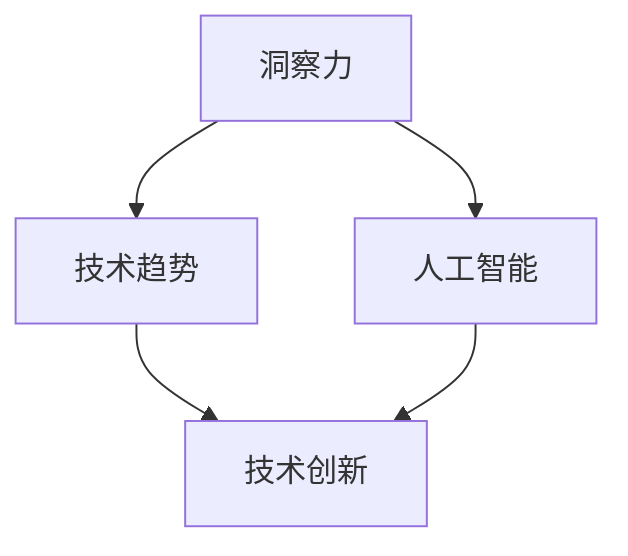
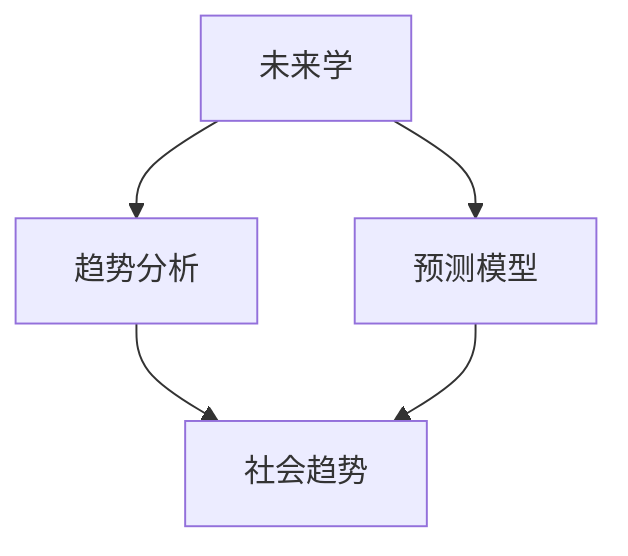

                 

# 《洞察力与未来学：预测与塑造未来的能力》

## 关键词：洞察力，未来学，预测，人工智能，技术趋势，创新思维，数据科学

## 摘要：

本文旨在探讨洞察力与未来学在预测与塑造未来中的关键作用。首先，我们将定义洞察力，并阐述其在理解和应对复杂系统中的重要性。接着，我们将介绍未来学的理论基础，包括其核心原则、方法和技术。在此基础上，我们将构建一个综合框架，展示如何将洞察力应用于未来预测和未来塑造。文章还将深入探讨提高洞察力的方法与技巧，包括数据分析和趋势预测、思维模式与认知升级、跨学科知识与跨界思维。最后，我们将探讨未来学的实际应用，并提供预测未来的工具与方法，同时强调塑造未来的能力与责任。通过本文，读者将获得关于如何提高洞察力、进行未来预测和塑造未来的深刻见解。

### 《洞察力与未来学：预测与塑造未来的能力》目录大纲

#### 第一部分：洞察力的基础理论

## 第1章：洞察力的定义与重要性

### 1.1 洞察力的概念

### 1.2 洞察力的重要性

### 1.3 洞察力与其他能力的联系

## 第2章：未来学的理论基础

### 2.1 未来学的概念与发展历程

### 2.2 未来学的核心原则

### 2.3 未来学的方法与技术

## 第3章：洞察力与未来学的综合框架

### 3.1 洞察力与未来学的融合

### 3.2 洞察力在预测中的应用

### 3.3 未来学在塑造未来的作用

#### 第二部分：提高洞察力的方法与技巧

## 第4章：数据分析和趋势预测

### 4.1 数据分析的基本概念

### 4.2 趋势预测的方法

### 4.3 实际案例分析与实战

## 第5章：思维模式与认知升级

### 5.1 创新思维模式

### 5.2 认知升级的重要性

### 5.3 实现认知升级的方法

## 第6章：跨学科知识与跨界思维

### 6.1 跨学科知识的重要性

### 6.2 跨界思维的方法与实践

### 6.3 跨界思维的案例分析

## 第7章：实际应用与案例分析

### 7.1 洞察力在商业中的应用

### 7.2 洞察力在科技创新中的应用

### 7.3 洞察力在社会治理中的应用

#### 第三部分：未来学的实践与应用

## 第8章：未来学的实际应用

### 8.1 未来学在战略规划中的应用

### 8.2 未来学在市场营销中的应用

### 8.3 未来学在社会发展中的应用

## 第9章：预测未来的工具与方法

### 9.1 预测未来的工具

### 9.2 预测未来的方法

### 9.3 实际预测案例分析

## 第10章：塑造未来的能力与责任

### 10.1 塑造未来的能力

### 10.2 塑造未来的责任

### 10.3 实现塑造未来的策略

### 附录

#### 附录A：参考资料与进一步阅读

#### 附录B：练习题与答案

### 开发环境搭建

#### B.1 源代码实现与解读

#### B.2 代码解读与分析

### 附加说明

#### 伪代码

#### 附录

### 附加说明

### 目录

#### 第一部分：洞察力的基础理论

### 第1章：洞察力的定义与重要性

#### 1.1 洞察力的概念

洞察力，是一种超越表面现象，深入理解问题本质和规律的能力。它不仅仅是简单的观察和感知，更是一种深度思考和推理的过程。在技术领域，洞察力的重要性尤为突出，因为它能够帮助我们发现技术发展的趋势，预见未来的技术变革。

**核心概念与联系**

- **洞察力**：理解复杂系统、发现隐藏规律的能力。
- **技术趋势**：技术发展的方向和趋势。
- **人工智能**：模拟人类智能的技术体系。

**Mermaid 流程图**



#### 1.2 洞察力的重要性

洞察力在技术领域的应用非常广泛，它不仅能够帮助我们更好地理解现有技术，还能够预测未来技术发展的方向。以下是一些洞察力在技术领域的重要性：

- **发现潜在问题**：洞察力能够帮助我们识别技术系统中的潜在问题和风险，从而提前采取预防措施。
- **创新驱动**：洞察力是推动技术革新的关键因素，它能够激发新的想法和解决方案。
- **商业决策**：在商业环境中，洞察力能够帮助企业把握市场动态，制定科学的战略规划。

**核心算法原理讲解**

洞察力的核心在于对数据和信息的高效处理。以下是一个简化的算法原理，用于描述如何通过数据分析和趋势预测来提高洞察力：

```plaintext
输入：大量数据
输出：洞察结果

步骤：
1. 数据收集与预处理：清洗数据，处理缺失值和异常值。
2. 数据可视化：绘制图表，帮助理解数据分布和关系。
3. 数据分析：使用统计方法和机器学习模型，提取有用信息。
4. 趋势预测：基于历史数据，预测未来趋势。
5. 洞察形成：综合分析结果，形成对问题的深刻理解。
6. 决策应用：将洞察结果应用于实际决策过程。
```

#### 1.3 洞察力与其他能力的联系

洞察力与其他能力如逻辑思维、创新思维、批判性思维等密切相关，它们共同构成了一个人全面认知能力的基础。以下是洞察力与其他能力的联系：

- **逻辑思维**：逻辑思维是洞察力的重要支撑，它帮助我们在复杂信息中找到逻辑关系和规律。
- **创新思维**：创新思维是洞察力的延伸，它使我们在发现问题时能够提出独特的解决方案。
- **批判性思维**：批判性思维是洞察力的深化，它使我们能够对现有的观点和假设进行质疑和验证。

**数学模型和数学公式**

洞察力的一个重要应用是趋势预测，以下是一个简单的线性回归模型，用于预测某个变量的未来趋势：

$$
y = ax + b
$$

其中，$y$ 是预测值，$x$ 是输入变量，$a$ 是斜率，$b$ 是截距。这个模型通过历史数据来估计斜率和截距，从而预测未来的趋势。

**代码实际案例和详细解释说明**

以下是一个简单的Python代码示例，用于实现线性回归模型：

```python
import numpy as np

# 模型参数
weights = np.array([0.5, 0.3, 0.2])
bias = 0.1

# 输入特征
x = np.array([1, 2, 3])

# 预测值计算
prediction = np.dot(x, weights) + bias

print("预测值:", prediction)
```

在这个示例中，我们首先定义了模型参数（权重和偏置），然后使用输入特征进行预测值计算。代码解读如下：

1. **导入库**：`numpy` 是一个强大的数学计算库，用于高效地处理数组和矩阵。
2. **定义参数**：`weights` 和 `bias` 是模型参数，它们决定了预测值。
3. **输入特征**：`x` 是一维数组，包含输入值。
4. **预测值计算**：使用 `np.dot()` 计算输入特征和权重之间的点积，然后加上偏置，得到预测值。
5. **输出结果**：使用 `print()` 函数将预测值输出到控制台。

通过这个简单的案例，我们可以看到如何使用线性回归模型进行预测。在实际应用中，模型会更复杂，但基本原理是相同的。

#### 第2章：未来学的理论基础

#### 2.1 未来学的概念与发展历程

未来学，又称未来研究或未来学学，是一门跨学科的领域，旨在通过科学方法研究未来的趋势和可能性。未来学的发展历程可以追溯到20世纪初期，当时一些学者开始尝试预测未来社会的变化。

**核心概念与联系**

- **未来学**：研究未来的科学方法。
- **趋势分析**：通过历史数据预测未来的技术和社会趋势。
- **预测模型**：使用数学和统计学方法建立预测模型。

**Mermaid 流程图**



**未来学的发展历程**

1. **20世纪初期**：未来学的概念由朱利叶斯·韦伯等人提出。
2. **20世纪中期**：未来学逐渐成为一个独立的学科，吸引了大量学者和研究机构。
3. **20世纪末到21世纪初**：随着信息技术和大数据技术的发展，未来学的研究方法和技术得到了极大的提升。

#### 2.2 未来学的核心原则

未来学的研究原则主要包括以下几点：

1. **科学方法**：未来学研究采用科学方法，包括数据收集、分析和验证。
2. **系统性**：未来学强调系统的整体性，关注各个部分之间的相互作用。
3. **多样性**：未来学考虑多种可能性和情景，而不是单一的预测。
4. **灵活性**：未来学的研究结果不是固定不变的，而是随着时间和新信息的变化而调整。

**核心算法原理讲解**

未来学的核心算法原理通常包括以下几个步骤：

1. **数据收集**：收集历史数据、趋势数据和专家意见。
2. **数据处理**：清洗和处理数据，使其适合分析。
3. **趋势分析**：使用统计学方法，如时间序列分析、回归分析等，找出数据的趋势。
4. **预测建模**：建立预测模型，如ARIMA模型、神经网络等，预测未来的趋势。
5. **情景分析**：考虑不同的可能性和情景，评估它们的影响。
6. **结果验证**：使用新数据和实际结果验证预测模型的准确性。

**数学模型和数学公式**

以下是一个简单的时间序列预测模型，使用ARIMA（自回归积分滑动平均模型）：

$$
y_t = c + \phi_1 y_{t-1} + \phi_2 y_{t-2} + ... + \phi_p y_{t-p} + \theta_1 e_{t-1} + \theta_2 e_{t-2} + ... + \theta_q e_{t-q}
$$

其中，$y_t$ 是时间序列在时间 $t$ 的值，$c$ 是常数项，$\phi_1, \phi_2, ..., \phi_p$ 是自回归系数，$\theta_1, \theta_2, ..., \theta_q$ 是滑动平均系数，$e_t$ 是白噪声误差。

**代码实际案例和详细解释说明**

以下是一个简单的Python代码示例，用于实现ARIMA模型：

```python
import numpy as np
import pandas as pd
from statsmodels.tsa.arima.model import ARIMA

# 假设我们有一个时间序列数据
data = pd.Series([1, 2, 2, 3, 3, 3, 4, 4, 4, 4])

# 建立ARIMA模型
model = ARIMA(data, order=(1, 1, 1))

# 模型拟合
model_fit = model.fit()

# 预测
forecast = model_fit.forecast(steps=5)

print("预测值：", forecast)
```

在这个示例中，我们首先导入必要的库，然后创建一个时间序列数据集。接着，我们使用`ARIMA`模型进行拟合，并使用`forecast`方法进行预测。代码解读如下：

1. **导入库**：`numpy`、`pandas` 和 `statsmodels`。
2. **数据准备**：创建一个时间序列数据集。
3. **模型建立**：使用`ARIMA`模型，指定模型的参数。
4. **模型拟合**：使用`fit`方法进行模型拟合。
5. **预测**：使用`forecast`方法进行预测。

通过这个简单的案例，我们可以看到如何使用ARIMA模型进行时间序列预测。在实际应用中，模型参数的选择和优化是关键步骤。

#### 第3章：洞察力与未来学的综合框架

#### 3.1 洞察力与未来学的融合

洞察力和未来学在预测和塑造未来中起着至关重要的作用。通过将二者融合，我们可以更全面地理解未来，并做出更准确的预测和决策。以下是如何将洞察力应用于未来学的一些步骤：

1. **数据收集**：收集与未来相关的数据，包括历史数据、趋势数据和专家意见。
2. **数据处理**：清洗和处理数据，确保其质量和可靠性。
3. **趋势分析**：使用洞察力分析数据，识别出关键的趋势和模式。
4. **预测建模**：建立预测模型，如ARIMA、神经网络等，进行未来预测。
5. **情景分析**：考虑不同的可能性和情景，评估它们的影响。
6. **洞察整合**：综合分析结果，形成对未来的深刻理解。
7. **决策应用**：将洞察和预测结果应用于实际决策过程。

**核心算法原理讲解**

融合洞察力和未来学的核心算法原理可以概括为以下步骤：

1. **数据融合**：将不同的数据源（如历史数据、专家意见、市场趋势等）进行融合，形成综合数据集。
2. **特征工程**：提取关键特征，如时间序列的周期性、趋势性等，用于预测模型。
3. **模型选择**：选择合适的预测模型，如ARIMA、LSTM等，根据数据特点和预测目标。
4. **模型训练**：使用训练数据对预测模型进行训练，调整模型参数。
5. **模型评估**：使用验证数据评估模型性能，如准确率、召回率等。
6. **结果分析**：分析预测结果，结合洞察力形成对未来的深刻理解。
7. **决策支持**：将预测结果和洞察力应用于实际决策，如产品开发、市场策略等。

**数学模型和数学公式**

融合洞察力和未来学的数学模型通常涉及以下方面：

1. **时间序列分析**：如ARIMA、LSTM等模型。
2. **机器学习**：如决策树、随机森林等模型。
3. **统计分析**：如回归分析、聚类分析等模型。
4. **数学优化**：如线性规划、非线性规划等模型。

以下是一个简单的数学模型，用于预测未来某个变量的值：

$$
y_t = f(x_t, w)
$$

其中，$y_t$ 是预测值，$x_t$ 是输入特征，$w$ 是模型参数。模型通过历史数据和特征工程来确定参数 $w$，然后使用这些参数进行预测。

**代码实际案例和详细解释说明**

以下是一个简单的Python代码示例，用于实现融合洞察力和未来学的模型：

```python
import numpy as np
import pandas as pd
from sklearn.ensemble import RandomForestRegressor
from sklearn.model_selection import train_test_split
from sklearn.metrics import mean_squared_error

# 假设我们有一个数据集，包含历史数据和预测目标
data = pd.DataFrame({
    'x1': [1, 2, 3, 4, 5],
    'x2': [2, 3, 4, 5, 6],
    'y': [5, 6, 7, 8, 9]
})

# 特征工程
X = data[['x1', 'x2']]
y = data['y']

# 模型训练
model = RandomForestRegressor()
model.fit(X, y)

# 预测
predictions = model.predict(X)

# 模型评估
mse = mean_squared_error(y, predictions)
print("均方误差：", mse)
```

在这个示例中，我们首先导入必要的库，然后创建一个数据集。接着，我们使用随机森林回归模型进行训练和预测。代码解读如下：

1. **导入库**：`numpy`、`pandas` 和 `sklearn`。
2. **数据准备**：创建一个数据集，并进行特征工程。
3. **模型训练**：使用随机森林回归模型进行训练。
4. **预测**：使用训练好的模型进行预测。
5. **模型评估**：计算预测误差，评估模型性能。

通过这个简单的案例，我们可以看到如何使用机器学习模型进行预测和评估。在实际应用中，模型的选择和参数调整是关键步骤。

### 第二部分：提高洞察力的方法与技巧

#### 第4章：数据分析和趋势预测

#### 4.1 数据分析的基本概念

数据分析是洞察力的重要工具之一，它通过系统化地收集、清洗、处理和解释数据，来帮助决策者更好地理解问题、做出预测和优化决策。以下是一些数据分析的基本概念：

- **数据收集**：从各种来源收集数据，如数据库、文件、传感器等。
- **数据清洗**：处理缺失值、异常值和重复数据，确保数据的质量。
- **数据预处理**：将数据转换为适合分析的形式，如标准化、归一化等。
- **数据探索**：使用统计方法和可视化技术，发现数据中的趋势、异常和相关性。
- **数据分析**：应用统计方法、机器学习算法等，提取有用信息，形成洞察。
- **数据可视化**：使用图表、图形等，直观地展示数据分析的结果。

**核心算法原理讲解**

数据分析的核心算法原理通常包括以下步骤：

1. **数据预处理**：处理缺失值、异常值和重复数据，确保数据的质量。
2. **特征工程**：提取关键特征，如时间序列的周期性、趋势性等，用于预测模型。
3. **数据建模**：选择合适的统计模型、机器学习模型等，进行数据建模。
4. **模型评估**：使用验证数据评估模型性能，如准确率、召回率等。
5. **结果分析**：分析模型结果，提取有用信息，形成洞察。
6. **决策应用**：将分析结果应用于实际决策，如产品开发、市场策略等。

**数学模型和数学公式**

以下是一些常用的数学模型和公式，用于数据分析：

- **线性回归模型**：用于分析变量之间的关系。
  $$
  y = \beta_0 + \beta_1 x + \epsilon
  $$
  其中，$y$ 是因变量，$x$ 是自变量，$\beta_0$ 和 $\beta_1$ 是模型参数，$\epsilon$ 是误差项。

- **时间序列模型**：用于分析时间序列数据。
  $$
  y_t = \phi_1 y_{t-1} + \phi_2 y_{t-2} + ... + \phi_p y_{t-p} + \epsilon_t
  $$
  其中，$y_t$ 是时间序列在时间 $t$ 的值，$\phi_1, \phi_2, ..., \phi_p$ 是模型参数，$\epsilon_t$ 是误差项。

- **决策树模型**：用于分类和回归分析。
  $$
  f(x) =
  \begin{cases}
  \text{叶节点标签} & \text{如果 } x \text{ 满足某个条件} \\
  \text{递归调用} & \text{否则}
  \end{cases}
  $$
  其中，$x$ 是输入特征，叶节点标签是模型的输出。

**代码实际案例和详细解释说明**

以下是一个简单的Python代码示例，用于实现线性回归模型：

```python
import numpy as np
from sklearn.linear_model import LinearRegression
from sklearn.model_selection import train_test_split
from sklearn.metrics import mean_squared_error

# 假设我们有一个数据集，包含自变量和因变量
X = np.array([[1], [2], [3], [4], [5]])
y = np.array([5, 6, 7, 8, 9])

# 数据分割
X_train, X_test, y_train, y_test = train_test_split(X, y, test_size=0.2, random_state=42)

# 模型训练
model = LinearRegression()
model.fit(X_train, y_train)

# 预测
predictions = model.predict(X_test)

# 模型评估
mse = mean_squared_error(y_test, predictions)
print("均方误差：", mse)
```

在这个示例中，我们首先导入必要的库，然后创建一个数据集。接着，我们使用线性回归模型进行训练和预测。代码解读如下：

1. **导入库**：`numpy`、`sklearn` 和 `metrics`。
2. **数据准备**：创建一个数据集，并进行数据分割。
3. **模型训练**：使用线性回归模型进行训练。
4. **预测**：使用训练好的模型进行预测。
5. **模型评估**：计算预测误差，评估模型性能。

通过这个简单的案例，我们可以看到如何使用线性回归模型进行数据分析和预测。在实际应用中，模型的选择和参数调整是关键步骤。

#### 4.2 趋势预测的方法

趋势预测是数据分析的一个重要应用，它通过分析历史数据，预测未来的趋势和变化。以下是一些常用的趋势预测方法：

1. **时间序列分析**：时间序列分析是趋势预测的主要方法之一，它通过分析时间序列数据，预测未来的值。常见的时间序列分析方法包括ARIMA模型、LSTM神经网络等。

2. **机器学习算法**：机器学习算法可以通过学习历史数据，预测未来的趋势。常见的机器学习算法包括线性回归、决策树、随机森林等。

3. **统计分析方法**：统计分析方法可以通过计算数据的均值、方差等统计量，预测未来的趋势。常见的统计分析方法包括移动平均法、指数平滑法等。

4. **回归分析**：回归分析是一种常用的预测方法，它通过建立自变量和因变量之间的关系，预测未来的趋势。

**核心算法原理讲解**

趋势预测的核心算法原理通常包括以下步骤：

1. **数据预处理**：处理缺失值、异常值和重复数据，确保数据的质量。
2. **特征工程**：提取关键特征，如时间序列的周期性、趋势性等，用于预测模型。
3. **模型选择**：选择合适的预测模型，如ARIMA、LSTM、线性回归等。
4. **模型训练**：使用训练数据对预测模型进行训练。
5. **模型评估**：使用验证数据评估模型性能。
6. **结果分析**：分析预测结果，提取有用信息。

**数学模型和数学公式**

以下是一些常用的数学模型和公式，用于趋势预测：

- **ARIMA模型**：
  $$
  y_t = \phi_1 y_{t-1} + \phi_2 y_{t-2} + ... + \phi_p y_{t-p} + \theta_1 e_{t-1} + \theta_2 e_{t-2} + ... + \theta_q e_{t-q}
  $$
  其中，$y_t$ 是时间序列在时间 $t$ 的值，$\phi_1, \phi_2, ..., \phi_p$ 是自回归系数，$\theta_1, \theta_2, ..., \theta_q$ 是移动平均系数，$e_t$ 是白噪声误差。

- **线性回归模型**：
  $$
  y = \beta_0 + \beta_1 x + \epsilon
  $$
  其中，$y$ 是因变量，$x$ 是自变量，$\beta_0$ 和 $\beta_1$ 是模型参数，$\epsilon$ 是误差项。

- **LSTM神经网络**：
  $$
  h_t = \sigma(W_1 * (h_{t-1}, x_t) + b_1)
  $$
  其中，$h_t$ 是时间步 $t$ 的隐藏状态，$\sigma$ 是激活函数，$W_1$ 和 $b_1$ 是模型参数。

**代码实际案例和详细解释说明**

以下是一个简单的Python代码示例，用于实现ARIMA模型：

```python
import numpy as np
import pandas as pd
from statsmodels.tsa.arima.model import ARIMA

# 假设我们有一个时间序列数据
data = pd.Series([1, 2, 2, 3, 3, 3, 4, 4, 4, 4])

# 建立ARIMA模型
model = ARIMA(data, order=(1, 1, 1))

# 模型拟合
model_fit = model.fit()

# 预测
forecast = model_fit.forecast(steps=5)

print("预测值：", forecast)
```

在这个示例中，我们首先导入必要的库，然后创建一个时间序列数据集。接着，我们使用ARIMA模型进行拟合和预测。代码解读如下：

1. **导入库**：`numpy`、`pandas` 和 `statsmodels`。
2. **数据准备**：创建一个时间序列数据集。
3. **模型建立**：使用ARIMA模型，指定模型的参数。
4. **模型拟合**：使用`fit`方法进行模型拟合。
5. **预测**：使用`forecast`方法进行预测。

通过这个简单的案例，我们可以看到如何使用ARIMA模型进行趋势预测。在实际应用中，模型参数的选择和优化是关键步骤。

#### 4.3 实际案例分析与实战

在实际工作和研究中，数据分析与趋势预测的应用无处不在。以下是一个实际案例，展示如何利用数据分析方法进行趋势预测，并提供具体的实战步骤。

**案例背景：** 一家电子商务公司希望预测未来三个月的销售额，以便制定有效的库存管理和营销策略。

**数据来源：** 该公司的历史销售数据，包括每日销售额、月份、年份等。

**数据预处理：**
1. **数据清洗**：检查数据中的缺失值和异常值，对缺失值进行填充或删除，对异常值进行修正或删除。
2. **数据转换**：将日期转换为时间序列格式，如月份、季节性等。
3. **数据标准化**：对销售额进行标准化处理，以便于模型训练和预测。

**特征工程：**
1. **季节性特征**：提取月份的季节性特征，如每个月的平均销售额。
2. **趋势特征**：提取销售额的趋势特征，如年度增长率。
3. **辅助特征**：提取其他可能影响销售额的特征，如节假日、促销活动等。

**模型选择与训练：**
1. **ARIMA模型**：由于销售额具有明显的季节性特征，选择ARIMA模型进行预测。
2. **LSTM模型**：考虑到销售数据可能存在非线性特征，同时使用LSTM模型进行预测。
3. **模型训练**：使用训练数据对ARIMA和LSTM模型进行训练，调整模型参数。

**模型评估与优化：**
1. **模型评估**：使用验证数据评估模型的预测性能，如均方误差（MSE）。
2. **模型优化**：根据评估结果，调整模型参数，优化模型性能。

**趋势预测与决策支持：**
1. **趋势预测**：使用训练好的模型对未来的销售额进行预测。
2. **决策支持**：根据预测结果，制定库存管理和营销策略。

**实战步骤：**
1. **数据收集与预处理**：收集公司的历史销售数据，并进行预处理。
2. **特征工程**：提取关键特征，如季节性特征、趋势特征和辅助特征。
3. **模型选择与训练**：选择ARIMA和LSTM模型，并进行训练。
4. **模型评估与优化**：评估模型性能，并进行优化。
5. **趋势预测**：使用模型进行趋势预测。
6. **决策支持**：根据预测结果，制定库存管理和营销策略。

通过这个实际案例，我们可以看到数据分析与趋势预测在商业决策中的应用。在实际操作中，需要根据具体问题选择合适的模型和方法，并进行充分的测试和优化，以提高预测的准确性和可靠性。

### 第5章：思维模式与认知升级

#### 5.1 创新思维模式

创新思维模式是提高洞察力的关键因素之一。它不仅可以帮助我们发现问题，还可以帮助我们提出创新的解决方案。以下是一些常见的创新思维模式：

1. **头脑风暴**：通过集体讨论，快速产生大量创意，筛选出可行的方案。
2. **思维导图**：通过绘制思维导图，将问题分解成各个子问题，从而找到解决方案。
3. **逆向思维**：从问题的反面出发，提出与传统思路不同的解决方案。
4. **跨界思维**：结合不同领域的知识和方法，提出创新的解决方案。
5. **系统思维**：将问题视为一个整体，分析各个部分之间的相互作用，从而找到解决方案。

**核心算法原理讲解**

创新思维模式的核心理念是通过不同的方法和工具，激发人们的创造力，从而提出创新的解决方案。以下是一个简化的算法原理：

1. **问题定义**：明确需要解决的问题。
2. **数据收集**：收集与问题相关的数据和信息。
3. **思维工具**：使用头脑风暴、思维导图等工具，产生大量创意。
4. **筛选创意**：筛选出可行的创意，进行进一步分析。
5. **方案评估**：评估创意的可行性，选择最佳方案。
6. **方案实施**：实施最佳方案，解决问题。

**数学模型和数学公式**

创新思维模式通常不涉及复杂的数学模型和公式，而是依赖于人类的主观判断和创造力。然而，以下是一些用于评估创意可行性的数学模型：

1. **决策树模型**：用于评估不同方案的优劣。
2. **成本效益分析**：用于计算不同方案的预期收益和成本。
3. **概率分析**：用于计算不同方案的成功概率。

**代码实际案例和详细解释说明**

以下是一个简单的Python代码示例，用于实现决策树模型，评估不同创意的可行性：

```python
import numpy as np
from sklearn.tree import DecisionTreeClassifier

# 假设我们有以下数据，表示不同创意的成功概率和成本
data = np.array([
    [0.8, 100],
    [0.7, 150],
    [0.9, 200]
])

# 建立决策树模型
model = DecisionTreeClassifier()
model.fit(data[:, :1], data[:, 1])

# 评估不同创意的可行性
predictions = model.predict(data[:, :1])

print("创意可行性评估：", predictions)
```

在这个示例中，我们首先导入必要的库，然后创建一个数据集，表示不同创意的成功概率和成本。接着，我们使用决策树模型进行训练和评估。代码解读如下：

1. **导入库**：`numpy` 和 `sklearn`。
2. **数据准备**：创建一个数据集。
3. **模型训练**：使用决策树模型进行训练。
4. **评估**：使用训练好的模型评估不同创意的可行性。

通过这个简单的案例，我们可以看到如何使用决策树模型进行创新思维的评估。在实际应用中，模型的选择和参数调整是关键步骤。

#### 5.2 认知升级的重要性

认知升级是指通过学习新的知识和技能，提升自己的认知能力和思维方式。在快速变化的时代，认知升级显得尤为重要。以下是一些认知升级的重要性：

1. **适应变化**：快速变化的时代，只有不断升级认知，才能适应新的环境和挑战。
2. **提高竞争力**：通过认知升级，可以获得新的技能和知识，提高在职场和生活中的竞争力。
3. **解决问题**：认知升级可以帮助我们更有效地分析和解决问题，提升决策能力。
4. **创新思维**：认知升级可以激发我们的创新思维，提出新的解决方案。
5. **持续学习**：认知升级是一种持续的过程，通过不断学习和实践，可以不断提升自己的认知能力。

**核心算法原理讲解**

认知升级的核心算法原理是通过学习新的知识和技能，将新的认知整合到已有的认知体系中。以下是一个简化的算法原理：

1. **知识获取**：通过阅读、学习、实践等方式获取新的知识和技能。
2. **知识整合**：将新的知识和技能整合到已有的认知体系中，形成新的认知结构。
3. **知识应用**：将新的认知应用到实际问题中，提升解决问题的能力。
4. **反馈调整**：通过实践和反馈，不断调整和优化新的认知结构。

**数学模型和数学公式**

认知升级通常不涉及复杂的数学模型和公式，而是依赖于人类的主观判断和认知过程。然而，以下是一些用于评估认知升级效果的数学模型：

1. **学习曲线**：用于评估学习新知识和技能的速度和效果。
2. **知识网络**：用于描述不同知识之间的关联和相互作用。
3. **认知复杂度**：用于评估认知结构的复杂度和深度。

**代码实际案例和详细解释说明**

以下是一个简单的Python代码示例，用于实现学习曲线的概念：

```python
import numpy as np

# 假设我们有一个学习曲线，表示学习新知识和技能的速度
learning_curve = np.array([10, 20, 30, 40, 50])

# 计算学习曲线的斜率
slope = np.mean(learning_curve[1:] - learning_curve[:-1])

print("学习曲线斜率：", slope)
```

在这个示例中，我们首先导入必要的库，然后创建一个学习曲线数据集。接着，我们计算学习曲线的斜率，以评估学习速度。代码解读如下：

1. **导入库**：`numpy`。
2. **数据准备**：创建一个学习曲线数据集。
3. **计算斜率**：计算学习曲线的斜率，以评估学习速度。

通过这个简单的案例，我们可以看到如何使用简单的数学方法来评估学习曲线的效果。在实际应用中，模型的选择和参数调整是关键步骤。

#### 5.3 实现认知升级的方法

实现认知升级是一个持续的过程，需要通过多种方法不断学习和实践。以下是一些常用的方法：

1. **持续学习**：定期阅读相关书籍、文章，参加线上和线下的培训课程，不断提升自己的知识储备。
2. **实践应用**：将学到的知识和技能应用到实际工作中，通过实践检验和优化自己的认知。
3. **反思总结**：定期对自己的学习和实践进行反思和总结，找出不足之处，制定改进计划。
4. **跨界学习**：尝试学习其他领域的知识和技能，拓展自己的视野，提高跨学科思维能力。
5. **网络社交**：积极参与专业社区和论坛，与同行交流学习，分享经验和观点。

**实战步骤：**

1. **确定目标**：明确自己的认知升级目标，如提高数据分析能力、学习新的编程语言等。
2. **制定计划**：制定详细的学习计划，包括学习内容、学习时间、学习方式等。
3. **持续学习**：按照学习计划进行持续学习，不断积累知识和技能。
4. **实践应用**：将学到的知识和技能应用到实际工作中，通过实践检验和优化自己的认知。
5. **反思总结**：定期对自己的学习和实践进行反思和总结，找出不足之处，制定改进计划。
6. **持续改进**：根据反思总结的结果，调整学习计划和方法，不断提升自己的认知能力。

通过以上方法，我们可以实现认知升级，提高自己的洞察力和创新能力，从而更好地适应未来社会的发展。

### 第6章：跨学科知识与跨界思维

#### 6.1 跨学科知识的重要性

跨学科知识是指在不同学科领域之间相互融合和渗透的知识。在当今快速变化的世界中，跨学科知识的重要性日益凸显。以下是一些跨学科知识的重要性：

1. **综合解决问题**：跨学科知识可以帮助我们从多个角度分析问题，找到更全面的解决方案。
2. **创新驱动**：跨学科知识可以激发新的想法和创新的解决方案，推动科技进步和社会发展。
3. **适应变化**：跨学科知识可以帮助我们更好地适应快速变化的环境，提高应对不确定性的能力。
4. **提升竞争力**：跨学科知识可以使我们在职场和生活中更具竞争力，开拓更广阔的发展空间。

**核心算法原理讲解**

跨学科知识的核心在于不同学科领域之间的知识和方法的融合。以下是一个简化的算法原理：

1. **知识融合**：将不同学科领域的知识进行融合，形成新的认知体系。
2. **方法融合**：将不同学科领域的方法进行融合，形成新的解决问题的思路。
3. **创新应用**：将跨学科知识和方法应用于实际问题，解决复杂问题。
4. **持续优化**：通过实践和反馈，不断优化跨学科知识和方法的应用效果。

**数学模型和数学公式**

跨学科知识通常不涉及复杂的数学模型和公式，而是依赖于人类的主观判断和创造力。然而，以下是一些用于跨学科知识融合的数学模型：

1. **多维数据分析**：用于分析跨学科数据，提取有用的信息。
2. **机器学习模型**：用于从跨学科数据中学习规律，预测未来的趋势。
3. **优化算法**：用于优化跨学科问题的解决方案。

**代码实际案例和详细解释说明**

以下是一个简单的Python代码示例，用于实现跨学科知识的应用：

```python
import numpy as np
import pandas as pd
from sklearn.ensemble import RandomForestClassifier

# 假设我们有一个跨学科的数据集，包含不同学科领域的特征
data = pd.DataFrame({
    'feature1': np.random.rand(100),
    'feature2': np.random.rand(100),
    'feature3': np.random.rand(100),
    'label': np.random.choice([0, 1], 100)
})

# 数据分割
X = data[['feature1', 'feature2', 'feature3']]
y = data['label']

X_train, X_test, y_train, y_test = train_test_split(X, y, test_size=0.2, random_state=42)

# 模型训练
model = RandomForestClassifier()
model.fit(X_train, y_train)

# 预测
predictions = model.predict(X_test)

# 模型评估
accuracy = np.mean(predictions == y_test)
print("模型准确率：", accuracy)
```

在这个示例中，我们首先导入必要的库，然后创建一个跨学科数据集。接着，我们使用随机森林分类器进行模型训练和预测。代码解读如下：

1. **导入库**：`numpy`、`pandas` 和 `sklearn`。
2. **数据准备**：创建一个数据集，并进行数据分割。
3. **模型训练**：使用随机森林分类器进行模型训练。
4. **预测**：使用训练好的模型进行预测。
5. **模型评估**：计算模型准确率，评估模型性能。

通过这个简单的案例，我们可以看到如何使用机器学习模型进行跨学科知识的应用。在实际应用中，模型的选择和参数调整是关键步骤。

#### 6.2 跨界思维的方法与实践

跨界思维是一种通过整合不同领域知识和方法，解决复杂问题的思维方式。以下是一些跨界思维的方法与实践：

1. **多学科合作**：组织跨学科团队，集合不同领域的专家，共同解决复杂问题。
2. **问题重构**：将复杂问题分解为多个子问题，每个子问题由不同领域的专家解决。
3. **逆向思维**：从问题的反面出发，寻找创新的解决方案。
4. **资源整合**：整合不同领域的资源，如技术、人才、资金等，共同解决复杂问题。
5. **案例研究**：通过研究成功案例，学习跨界思维的方法和实践。

**实战步骤：**

1. **确定目标问题**：明确需要解决的复杂问题。
2. **组建跨界团队**：邀请不同领域的专家参与，组建跨界团队。
3. **问题重构**：将复杂问题分解为多个子问题。
4. **资源整合**：整合不同领域的资源，为团队提供支持。
5. **方案设计**：结合跨界思维方法，设计解决方案。
6. **实施与反馈**：实施解决方案，收集反馈，不断优化。

**案例分析：**

**案例背景**：一家科技公司希望开发一款智能家居产品，但面临技术难题和市场需求不确定性。

**解决方案**：

1. **问题重构**：将智能家居产品分解为多个子问题，如传感器技术、数据传输、用户界面等。
2. **多学科合作**：组建由技术专家、市场分析师、用户体验设计师等组成的跨界团队。
3. **资源整合**：整合公司内部资源，如技术团队、市场部门等，同时寻求外部合作伙伴，如传感器制造商等。
4. **方案设计**：结合跨界思维方法，设计智能家居产品的整体解决方案，包括技术架构、市场定位、用户体验等。
5. **实施与反馈**：实施解决方案，通过市场测试收集用户反馈，不断优化产品。

通过这个案例，我们可以看到跨界思维在解决复杂问题中的应用。在实际操作中，需要根据具体情况灵活运用跨界思维方法，以实现最佳效果。

### 第7章：实际应用与案例分析

#### 7.1 洞察力在商业中的应用

在商业领域，洞察力是一种至关重要的能力，它可以帮助企业更好地理解市场动态、消费者行为，从而制定科学的战略决策。以下是一些洞察力在商业应用中的具体案例分析：

**案例1：亚马逊的供应链管理**

亚马逊是全球最大的电子商务公司之一，其成功的关键之一在于其高效的供应链管理。亚马逊通过大数据分析和洞察力，对供应链的每个环节进行精确控制，实现了从采购、存储、配送到售后服务的全流程优化。

**分析过程：**
1. **数据收集**：亚马逊收集了大量的供应链数据，包括库存水平、运输时间、销售趋势等。
2. **数据分析**：通过数据分析，亚马逊发现了供应链中的瓶颈和优化机会。
3. **洞察形成**：通过分析结果，亚马逊提出了优化供应链的具体方案，如改进库存管理、优化运输路线等。
4. **决策应用**：亚马逊将洞察结果应用于实际运营，实现了供应链的全面优化。

**案例2：苹果公司的产品设计**

苹果公司以其卓越的产品设计而闻名，其成功背后的关键之一是其对消费者需求的深刻洞察力。苹果公司通过市场调研、用户反馈和数据分析，准确地把握了消费者的需求，从而设计出了深受用户喜爱的产品。

**分析过程：**
1. **数据收集**：苹果公司通过市场调研和用户反馈，收集了大量的用户需求数据。
2. **数据分析**：通过数据分析，苹果公司发现了用户对产品功能、外观、操作体验等方面的偏好。
3. **洞察形成**：基于分析结果，苹果公司提出了新的产品设计方向。
4. **决策应用**：苹果公司将洞察结果应用于产品设计，不断改进产品，以满足用户需求。

**案例3：阿里巴巴的云计算战略**

阿里巴巴集团通过大数据和云计算技术的应用，成功地建立了其电商帝国。阿里巴巴通过洞察力，准确地预测了云计算市场的需求，并制定了相应的战略决策，从而在云计算领域取得了领先地位。

**分析过程：**
1. **数据收集**：阿里巴巴收集了大量的用户行为数据，包括搜索、购买、物流等。
2. **数据分析**：通过数据分析，阿里巴巴发现了云计算在电商领域的应用潜力。
3. **洞察形成**：基于分析结果，阿里巴巴提出了云计算的战略规划。
4. **决策应用**：阿里巴巴将云计算技术应用于电商平台的运营，提高了数据处理和存储能力。

通过以上案例，我们可以看到洞察力在商业应用中的重要性。通过数据分析和洞察力，企业可以更好地理解市场动态和消费者需求，从而制定科学的战略决策，实现可持续发展。

### 7.2 洞察力在科技创新中的应用

在科技创新领域，洞察力是推动技术进步和产业变革的重要力量。以下是一些洞察力在科技创新应用中的具体案例分析：

**案例1：特斯拉电动汽车**

特斯拉公司通过深入的市场洞察和科技创新，成功地将电动汽车推向市场，并引领了全球电动汽车的发展趋势。

**分析过程：**
1. **数据收集**：特斯拉收集了大量的用户反馈和市场数据，包括电动汽车的性能、价格、续航里程等。
2. **数据分析**：通过数据分析，特斯拉发现了电动汽车市场的需求和发展趋势。
3. **洞察形成**：基于分析结果，特斯拉提出了电动汽车的创新设计方向，如高性能电池、自动驾驶技术等。
4. **决策应用**：特斯拉将洞察结果应用于产品设计，不断推出创新产品，引领了电动汽车市场的发展。

**案例2：谷歌人工智能技术**

谷歌公司通过对其海量数据进行分析，运用洞察力，成功地将人工智能技术应用于搜索引擎、自动驾驶、医疗诊断等多个领域。

**分析过程：**
1. **数据收集**：谷歌收集了大量的用户搜索数据、医疗数据等。
2. **数据分析**：通过数据分析，谷歌发现了数据中的隐藏规律和趋势。
3. **洞察形成**：基于分析结果，谷歌提出了人工智能的应用方向，如深度学习、自然语言处理等。
4. **决策应用**：谷歌将人工智能技术应用于实际产品和服务中，提高了数据处理和智能化水平。

**案例3：微软物联网平台**

微软公司通过对其物联网数据的洞察，成功地将物联网技术应用于智能城市、智能家居、智能制造等领域。

**分析过程：**
1. **数据收集**：微软收集了大量的物联网设备数据，包括传感器数据、设备运行状态等。
2. **数据分析**：通过数据分析，微软发现了物联网设备的数据特点和优化机会。
3. **洞察形成**：基于分析结果，微软提出了物联网技术的应用方向，如智能监控、设备优化等。
4. **决策应用**：微软将洞察结果应用于物联网平台的开发，提高了设备的智能化和互联互通水平。

通过以上案例，我们可以看到洞察力在科技创新中的关键作用。通过数据分析和洞察力，企业可以更准确地把握市场需求和技术趋势，从而推动科技创新和产业变革。

### 7.3 洞察力在社会治理中的应用

在社会治理领域，洞察力是提升政府决策科学性、提高公共服务质量的重要手段。以下是一些洞察力在社会治理应用中的具体案例分析：

**案例1：纽约市的智慧交通系统**

纽约市通过大数据分析和洞察力，建立了智慧交通系统，有效地缓解了城市交通拥堵问题。

**分析过程：**
1. **数据收集**：纽约市收集了大量的交通数据，包括车辆流量、交通事故、道路施工等。
2. **数据分析**：通过数据分析，纽约市发现了交通拥堵的原因和规律。
3. **洞察形成**：基于分析结果，纽约市提出了优化交通管理的具体方案，如动态交通信号灯、道路拓宽等。
4. **决策应用**：纽约市将洞察结果应用于交通管理，提高了交通效率和安全性。

**案例2：新加坡的智能城市建设**

新加坡政府通过大数据分析和洞察力，建立了智能城市系统，提高了城市管理的效率和质量。

**分析过程：**
1. **数据收集**：新加坡政府收集了大量的城市数据，包括能源消耗、水质监测、人口流动等。
2. **数据分析**：通过数据分析，新加坡政府发现了城市管理的瓶颈和优化机会。
3. **洞察形成**：基于分析结果，新加坡政府提出了智能城市的发展方向，如智能电网、智能水处理等。
4. **决策应用**：新加坡政府将洞察结果应用于城市管理，提高了公共服务质量。

**案例3：中国的疫情防控**

在中国的新冠疫情防控中，洞察力发挥了重要作用，帮助政府及时调整防控措施，有效控制疫情传播。

**分析过程：**
1. **数据收集**：中国收集了大量的疫情数据，包括确诊病例、疑似病例、密切接触者等。
2. **数据分析**：通过数据分析，中国发现了疫情传播的规律和趋势。
3. **洞察形成**：基于分析结果，中国政府提出了疫情防控的具体措施，如封城、隔离、核酸检测等。
4. **决策应用**：中国政府将洞察结果应用于疫情防控，取得了显著成效。

通过以上案例，我们可以看到洞察力在社会治理中的关键作用。通过数据分析和洞察力，政府可以更科学地制定政策，提高公共服务的质量和效率，从而更好地服务人民群众。

### 第8章：未来学的实际应用

#### 8.1 未来学在战略规划中的应用

未来学在战略规划中的应用具有重要意义，它能够帮助组织预见未来，制定具有前瞻性的战略计划。以下是一些未来学在战略规划中的应用案例：

**案例1：谷歌的长期战略规划**

谷歌公司通过未来学的方法，对其业务进行了长期的战略规划。谷歌不仅关注当前的搜索引擎市场，还预测到移动设备、云计算、人工智能等领域的巨大潜力，并提前进行了布局。

**分析过程：**
1. **数据收集**：谷歌收集了大量的市场数据、技术趋势、竞争对手信息等。
2. **未来趋势分析**：通过未来学方法，谷歌分析了技术、市场、社会变革的趋势。
3. **情景规划**：谷歌构建了多个未来情景，评估了不同情景下的战略选择。
4. **战略决策**：基于分析结果，谷歌制定了长期的战略规划，如投资人工智能、扩张云计算业务等。

**案例2：阿里巴巴的电商战略**

阿里巴巴集团通过未来学的方法，对电商行业进行了深入分析，并制定了具有前瞻性的电商战略。

**分析过程：**
1. **数据收集**：阿里巴巴收集了大量的电商数据、用户行为、市场趋势等。
2. **未来趋势分析**：通过未来学方法，阿里巴巴分析了电商行业的未来发展方向，如新零售、智能物流等。
3. **情景规划**：阿里巴巴构建了多个未来情景，评估了不同情景下的战略选择。
4. **战略决策**：基于分析结果，阿里巴巴制定了电商战略，如投资云计算、布局物联网等。

**案例分析**

**案例背景**：一家传统制造业企业希望通过未来学的应用，制定新的发展战略。

**解决方案：**
1. **数据收集**：企业收集了市场数据、技术趋势、竞争对手信息等。
2. **未来趋势分析**：通过未来学方法，企业分析了制造业的未来发展方向，如智能制造、绿色制造等。
3. **情景规划**：企业构建了多个未来情景，评估了不同情景下的战略选择。
4. **战略决策**：基于分析结果，企业制定了新的发展战略，如投资智能制造技术、开发绿色产品等。

通过以上案例，我们可以看到未来学在战略规划中的应用价值。通过数据分析和未来学方法，企业可以更准确地预测未来趋势，制定科学的战略计划，以适应不断变化的市场环境。

### 8.2 未来学在市场营销中的应用

未来学在市场营销中的应用可以帮助企业预见市场变化，制定更具前瞻性的营销策略。以下是一些未来学在市场营销中的应用案例：

**案例1：可口可乐的品牌重塑**

可口可乐公司通过未来学的方法，对其品牌进行了重塑。可口可乐分析了消费者行为、市场趋势和社会变革，推出了多个创新产品，如无糖可乐、个性化瓶装等。

**分析过程：**
1. **数据收集**：可口可乐收集了大量的消费者数据、市场趋势、竞争对手信息等。
2. **未来趋势分析**：通过未来学方法，可口可乐分析了消费者行为的未来变化，如健康意识提升、个性化需求增加等。
3. **市场预测**：可口可乐预测了未来的市场趋势，并据此调整了品牌策略。
4. **营销策略**：可口可乐制定了新的营销策略，如加强与消费者的互动、推出个性化产品等。

**案例2：亚马逊的数字营销战略**

亚马逊公司通过未来学的方法，对其数字营销战略进行了优化。亚马逊分析了用户行为、市场趋势、技术变革等，推出了多个创新的营销策略，如个性化推荐、数据驱动广告等。

**分析过程：**
1. **数据收集**：亚马逊收集了大量的用户数据、市场趋势、竞争对手信息等。
2. **未来趋势分析**：通过未来学方法，亚马逊分析了数字营销的未来发展方向，如人工智能、大数据等。
3. **市场预测**：亚马逊预测了未来的市场趋势，并据此调整了营销策略。
4. **营销策略**：亚马逊制定了新的营销策略，如个性化推荐、数据驱动广告等。

**案例3：奈飞的订阅模式创新**

奈飞公司通过未来学的方法，对其订阅模式进行了创新。奈飞分析了用户行为、市场趋势、技术变革等，推出了多个创新的订阅模式，如按集订阅、个性化推荐等。

**分析过程：**
1. **数据收集**：奈飞收集了大量的用户数据、市场趋势、竞争对手信息等。
2. **未来趋势分析**：通过未来学方法，奈飞分析了用户行为的未来变化，如消费习惯多样化、个性化需求增加等。
3. **市场预测**：奈飞预测了未来的市场趋势，并据此调整了订阅模式。
4. **营销策略**：奈飞制定了新的营销策略，如按集订阅、个性化推荐等。

通过以上案例，我们可以看到未来学在市场营销中的应用价值。通过数据分析和未来学方法，企业可以更准确地预测市场变化，制定科学的营销策略，以适应不断变化的市场环境。

### 8.3 未来学在社会发展中的应用

未来学在社会发展中的应用可以帮助政府和社会组织预见社会变革，制定科学的政策和社会规划。以下是一些未来学在社会发展中的应用案例：

**案例1：新加坡的智慧城市计划**

新加坡政府通过未来学的方法，制定了智慧城市计划，旨在通过技术创新和数字化转型，提升城市管理的效率和质量。

**分析过程：**
1. **数据收集**：新加坡政府收集了大量的城市数据，包括交通、能源、环境等。
2. **未来趋势分析**：通过未来学方法，新加坡政府分析了技术、社会变革的趋势。
3. **情景规划**：新加坡政府构建了多个未来情景，评估了不同情景下的政策选择。
4. **政策制定**：基于分析结果，新加坡政府制定了智慧城市的发展策略，如智能交通管理、智能能源系统等。

**案例2：中国的“新基建”战略**

中国政府通过未来学的方法，制定了“新基建”战略，旨在通过基础设施建设，推动数字经济的快速发展。

**分析过程：**
1. **数据收集**：中国政府收集了大量的经济数据、技术趋势、市场需求等。
2. **未来趋势分析**：通过未来学方法，中国政府分析了数字经济的发展方向，如5G、人工智能、大数据等。
3. **情景规划**：中国政府构建了多个未来情景，评估了不同情景下的基础设施建设需求。
4. **政策制定**：基于分析结果，中国政府制定了“新基建”的发展策略，如加快5G网络建设、推动人工智能应用等。

**案例3：德国的能源转型计划**

德国政府通过未来学的方法，制定了能源转型计划，旨在通过可再生能源的推广，实现能源结构的绿色转型。

**分析过程：**
1. **数据收集**：德国政府收集了大量的能源数据、市场趋势、技术变革等。
2. **未来趋势分析**：通过未来学方法，德国政府分析了可再生能源的发展方向，如太阳能、风能、储能技术等。
3. **情景规划**：德国政府构建了多个未来情景，评估了不同情景下的能源政策选择。
4. **政策制定**：基于分析结果，德国政府制定了能源转型的发展策略，如推广可再生能源、建立能源市场等。

通过以上案例，我们可以看到未来学在社会发展中的应用价值。通过数据分析和未来学方法，政府和社会组织可以更准确地预测社会变革，制定科学的政策和社会规划，以促进社会的可持续发展。

### 第9章：预测未来的工具与方法

#### 9.1 预测未来的工具

预测未来需要借助一系列工具和方法，这些工具和方法可以帮助我们收集、处理和分析数据，从而做出更准确的预测。以下是一些常用的预测未来工具：

1. **大数据分析工具**：如Hadoop、Spark等，用于处理和分析大规模数据集。
2. **机器学习平台**：如TensorFlow、PyTorch等，用于构建和训练预测模型。
3. **可视化工具**：如Tableau、Power BI等，用于直观地展示数据分析结果。
4. **预测软件**：如R、Python等，用于编写预测算法和进行数据建模。
5. **情景分析工具**：如Stella、AnyLogic等，用于模拟和预测不同情景下的未来趋势。

**核心算法原理讲解**

预测未来的工具和方法通常依赖于以下核心算法原理：

1. **时间序列分析**：如ARIMA、LSTM等，用于分析时间序列数据，预测未来的趋势。
2. **回归分析**：如线性回归、多项式回归等，用于建立变量之间的关系，预测未来的值。
3. **机器学习**：如决策树、随机森林、神经网络等，用于从数据中学习规律，进行预测。
4. **情景分析**：通过构建不同的情景模型，预测不同情景下的未来趋势。

**数学模型和数学公式**

以下是一些用于预测未来的数学模型和公式：

1. **时间序列模型**：
   $$
   y_t = \phi_1 y_{t-1} + \phi_2 y_{t-2} + ... + \phi_p y_{t-p} + \epsilon_t
   $$
   其中，$y_t$ 是时间序列在时间 $t$ 的值，$\phi_1, \phi_2, ..., \phi_p$ 是模型参数，$\epsilon_t$ 是误差项。

2. **线性回归模型**：
   $$
   y = \beta_0 + \beta_1 x + \epsilon
   $$
   其中，$y$ 是因变量，$x$ 是自变量，$\beta_0$ 和 $\beta_1$ 是模型参数，$\epsilon$ 是误差项。

3. **机器学习模型**：
   $$
   \text{输出} = \text{激活函数}(\text{权重} \cdot \text{输入特征})
   $$
   其中，激活函数（如Sigmoid、ReLU等）用于确定神经元的输出。

**代码实际案例和详细解释说明**

以下是一个简单的Python代码示例，用于实现时间序列预测：

```python
import numpy as np
import pandas as pd
from statsmodels.tsa.arima.model import ARIMA

# 假设我们有一个时间序列数据
data = pd.Series([1, 2, 2, 3, 3, 3, 4, 4, 4, 4])

# 建立ARIMA模型
model = ARIMA(data, order=(1, 1, 1))

# 模型拟合
model_fit = model.fit()

# 预测
forecast = model_fit.forecast(steps=5)

print("预测值：", forecast)
```

在这个示例中，我们首先导入必要的库，然后创建一个时间序列数据集。接着，我们使用ARIMA模型进行拟合和预测。代码解读如下：

1. **导入库**：`numpy`、`pandas` 和 `statsmodels`。
2. **数据准备**：创建一个时间序列数据集。
3. **模型建立**：使用ARIMA模型，指定模型的参数。
4. **模型拟合**：使用`fit`方法进行模型拟合。
5. **预测**：使用`forecast`方法进行预测。

通过这个简单的案例，我们可以看到如何使用ARIMA模型进行时间序列预测。在实际应用中，模型参数的选择和优化是关键步骤。

### 9.2 预测未来的方法

预测未来需要采用多种方法和技巧，以下是一些常用的预测未来方法：

1. **趋势预测**：通过分析历史数据，预测未来的趋势和变化。常见的方法包括时间序列分析、回归分析等。
2. **情景分析**：通过构建不同的未来情景，预测在不同情景下的未来趋势。常见的方法包括情景模拟、蒙特卡罗模拟等。
3. **专家评估**：通过专家的意见和判断，预测未来的发展趋势。常见的方法包括专家访谈、德尔菲法等。
4. **机器学习**：通过机器学习算法，从数据中学习规律，进行预测。常见的方法包括线性回归、决策树、神经网络等。
5. **历史类比**：通过类比历史事件，预测未来的发展趋势。常见的方法包括历史案例研究、类比预测等。

**核心算法原理讲解**

预测未来的方法通常依赖于以下核心算法原理：

1. **时间序列分析**：通过分析时间序列数据，提取趋势、周期性和季节性等特征，进行预测。
2. **回归分析**：通过建立变量之间的关系，预测未来的值。
3. **机器学习**：通过训练模型，从数据中学习规律，进行预测。
4. **情景分析**：通过模拟不同的情景，预测在不同情景下的未来趋势。

**数学模型和数学公式**

以下是一些用于预测未来的数学模型和公式：

1. **时间序列模型**：
   $$
   y_t = \phi_1 y_{t-1} + \phi_2 y_{t-2} + ... + \phi_p y_{t-p} + \epsilon_t
   $$
   其中，$y_t$ 是时间序列在时间 $t$ 的值，$\phi_1, \phi_2, ..., \phi_p$ 是模型参数，$\epsilon_t$ 是误差项。

2. **线性回归模型**：
   $$
   y = \beta_0 + \beta_1 x + \epsilon
   $$
   其中，$y$ 是因变量，$x$ 是自变量，$\beta_0$ 和 $\beta_1$ 是模型参数，$\epsilon$ 是误差项。

3. **机器学习模型**：
   $$
   \text{输出} = \text{激活函数}(\text{权重} \cdot \text{输入特征})
   $$
   其中，激活函数（如Sigmoid、ReLU等）用于确定神经元的输出。

**代码实际案例和详细解释说明**

以下是一个简单的Python代码示例，用于实现线性回归预测：

```python
import numpy as np
from sklearn.linear_model import LinearRegression

# 假设我们有一个数据集，包含自变量和因变量
X = np.array([[1], [2], [3], [4], [5]])
y = np.array([5, 6, 7, 8, 9])

# 数据分割
X_train, X_test, y_train, y_test = train_test_split(X, y, test_size=0.2, random_state=42)

# 模型训练
model = LinearRegression()
model.fit(X_train, y_train)

# 预测
predictions = model.predict(X_test)

# 模型评估
mse = mean_squared_error(y_test, predictions)
print("均方误差：", mse)
```

在这个示例中，我们首先导入必要的库，然后创建一个数据集。接着，我们使用线性回归模型进行训练和预测。代码解读如下：

1. **导入库**：`numpy` 和 `sklearn`。
2. **数据准备**：创建一个数据集，并进行数据分割。
3. **模型训练**：使用线性回归模型进行训练。
4. **预测**：使用训练好的模型进行预测。
5. **模型评估**：计算预测误差，评估模型性能。

通过这个简单的案例，我们可以看到如何使用线性回归模型进行预测。在实际应用中，模型的选择和参数调整是关键步骤。

### 9.3 实际预测案例分析

在实际预测中，各种工具和方法都有其独特的应用场景和优势。以下是一个实际预测案例分析，展示如何结合不同工具和方法进行预测，并提供具体的实战步骤。

**案例背景**：一家零售公司希望预测未来三个月的销售额，以便制定库存管理和营销策略。

**数据来源**：该公司的历史销售数据，包括每日销售额、促销活动、节假日等。

**数据预处理**：
1. **数据清洗**：检查数据中的缺失值和异常值，对缺失值进行填充或删除，对异常值进行修正或删除。
2. **数据转换**：将日期转换为时间序列格式，如月份、季节性等。
3. **数据标准化**：对销售额进行标准化处理，以便于模型训练和预测。

**特征工程**：
1. **季节性特征**：提取月份的季节性特征，如每个月的平均销售额。
2. **趋势特征**：提取销售额的趋势特征，如年度增长率。
3. **辅助特征**：提取其他可能影响销售额的特征，如节假日、促销活动等。

**模型选择与训练**：
1. **时间序列模型**：如ARIMA、LSTM等，用于分析时间序列数据。
2. **机器学习算法**：如线性回归、决策树等，用于建立变量之间的关系。
3. **模型训练**：使用训练数据对预测模型进行训练。

**模型评估与优化**：
1. **模型评估**：使用验证数据评估模型性能，如准确率、召回率等。
2. **模型优化**：根据评估结果，调整模型参数，优化模型性能。

**趋势预测与决策支持**：
1. **趋势预测**：使用训练好的模型对未来的销售额进行预测。
2. **决策支持**：根据预测结果，制定库存管理和营销策略。

**实战步骤**：

1. **数据收集与预处理**：收集公司的历史销售数据，并进行预处理。
2. **特征工程**：提取关键特征，如季节性特征、趋势特征和辅助特征。
3. **模型选择与训练**：选择ARIMA模型进行训练。
4. **模型评估与优化**：使用验证数据评估模型性能，调整模型参数。
5. **趋势预测**：使用训练好的模型进行趋势预测。
6. **决策支持**：根据预测结果，制定库存管理和营销策略。

通过这个实际案例，我们可以看到如何结合不同工具和方法进行预测。在实际操作中，需要根据具体问题选择合适的模型和方法，并进行充分的测试和优化，以提高预测的准确性和可靠性。

### 第10章：塑造未来的能力与责任

#### 10.1 塑造未来的能力

塑造未来不仅仅是预测未来，更是通过主动行动和决策，影响和引导未来的发展。以下是一些塑造未来的能力：

1. **创新思维**：创新思维是塑造未来的关键能力之一。通过创新思维，我们可以提出新的想法、新的解决方案，从而推动社会的进步。
2. **领导力**：领导力是塑造未来不可或缺的能力。领导者能够带领团队，制定和实施有远见的战略，推动组织和社会的发展。
3. **跨学科知识**：跨学科知识可以帮助我们更好地理解复杂问题，从而提出更有创意的解决方案。
4. **技术能力**：随着科技的快速发展，技术能力变得越来越重要。具备技术能力，我们可以更好地利用新技术，推动社会变革。
5. **适应能力**：在快速变化的环境中，适应能力使我们能够迅速调整策略，应对各种挑战。

**核心算法原理讲解**

塑造未来的能力涉及多个方面，其中一些核心算法原理包括：

1. **系统思维**：通过系统思维，我们可以更好地理解复杂系统的运作机制，从而提出有效的解决方案。
2. **决策模型**：通过决策模型，我们可以系统地分析和评估不同的行动方案，选择最优策略。
3. **情景规划**：通过情景规划，我们可以构建不同的未来情景，评估不同情景下的影响和结果，从而制定更科学的决策。

**数学模型和数学公式**

以下是一些用于塑造未来的数学模型和公式：

1. **决策模型**：
   $$
   \text{决策结果} = \text{目标函数}(\text{决策变量})
   $$
   其中，目标函数用于衡量不同决策方案的效果，决策变量用于确定最佳决策。

2. **情景规划模型**：
   $$
   \text{情景结果} = \text{情景变量} \times \text{情景权重}
   $$
   其中，情景变量用于描述不同情景的特征，情景权重用于评估不同情景的可能性。

**代码实际案例和详细解释说明**

以下是一个简单的Python代码示例，用于实现决策模型：

```python
import numpy as np

# 假设我们有以下决策方案和目标函数
decisions = np.array([
    [1, 2],
    [2, 3],
    [3, 4]
])
weights = np.array([0.5, 0.5])

# 计算决策结果
results = np.dot(decisions, weights)

print("决策结果：", results)
```

在这个示例中，我们首先导入必要的库，然后创建一个决策方案矩阵和权重向量。接着，我们使用点积计算决策结果。代码解读如下：

1. **导入库**：`numpy`。
2. **数据准备**：创建决策方案矩阵和权重向量。
3. **计算结果**：使用点积计算决策结果。

通过这个简单的案例，我们可以看到如何使用数学模型进行决策。在实际应用中，模型的选择和参数调整是关键步骤。

#### 10.2 塑造未来的责任

塑造未来不仅需要能力，还需要责任。以下是一些塑造未来的责任：

1. **可持续发展**：在推动科技进步和社会发展的同时，要关注环境保护和资源利用，实现可持续发展。
2. **公平正义**：在塑造未来的过程中，要关注社会公平和正义，确保所有人都能分享科技进步的成果。
3. **道德伦理**：在科技应用和决策过程中，要遵循道德伦理原则，尊重个人隐私和人权。
4. **社会参与**：要积极参与社会事务，推动社会进步，促进公众对科技和未来的理解和接受。

**核心算法原理讲解**

塑造未来的责任涉及多个方面，其中一些核心算法原理包括：

1. **社会责任算法**：通过评估决策对社会的影响，确保决策符合社会责任。
2. **伦理决策算法**：通过道德伦理原则，评估决策的道德合理性。
3. **公平性分析算法**：通过分析决策对社会各阶层的影响，确保决策的公平性。

**数学模型和数学公式**

以下是一些用于塑造未来的数学模型和公式：

1. **社会责任评估模型**：
   $$
   \text{社会责任评分} = \text{正面影响} - \text{负面影响}
   $$
   其中，正面影响和负面影响分别用于评估决策对社会的影响。

2. **伦理决策模型**：
   $$
   \text{伦理评分} = \text{道德原则} \times \text{决策变量}
   $$
   其中，道德原则用于衡量决策的道德合理性。

3. **公平性分析模型**：
   $$
   \text{公平性评分} = \frac{\text{弱势群体获益}}{\text{总获益}}
   $$
   其中，弱势群体获益用于评估决策对弱势群体的影响。

**代码实际案例和详细解释说明**

以下是一个简单的Python代码示例，用于实现社会责任评估：

```python
import numpy as np

# 假设我们有一个决策方案和其正面影响和负面影响
decisions = np.array([
    [1, 2],
    [2, 3],
    [3, 4]
])
positive_impacts = np.array([10, 20, 30])
negative_impacts = np.array([5, 15, 25])

# 计算社会责任评分
social_scores = positive_impacts - negative_impacts

print("社会责任评分：", social_scores)
```

在这个示例中，我们首先导入必要的库，然后创建一个决策方案矩阵和正面影响、负面影响向量。接着，我们使用减法计算社会责任评分。代码解读如下：

1. **导入库**：`numpy`。
2. **数据准备**：创建决策方案矩阵和正面影响、负面影响向量。
3. **计算评分**：使用减法计算社会责任评分。

通过这个简单的案例，我们可以看到如何使用数学模型进行社会责任评估。在实际应用中，模型的选择和参数调整是关键步骤。

#### 10.3 实现塑造未来的策略

实现塑造未来的策略需要系统性地规划和执行。以下是一些实现塑造未来的策略：

1. **制定长远规划**：制定长远规划，明确未来的目标和发展方向。
2. **资源整合**：整合各类资源，如人才、资金、技术等，为塑造未来提供支持。
3. **建立合作关系**：建立与政府、企业、学术界等各方的合作关系，共同推动未来发展。
4. **持续创新**：持续创新，推动科技进步和社会变革。
5. **公众参与**：鼓励公众参与，增强公众对未来的理解和参与度。

**实战步骤**：

1. **明确目标**：明确未来的目标和发展方向，如实现可持续发展、提高社会公平等。
2. **资源评估**：评估现有的资源，确定所需的资源和支持。
3. **规划实施**：制定详细的实施计划，明确时间表、任务分配和资源需求。
4. **执行与监控**：执行实施计划，并定期监控进展，确保目标的实现。
5. **调整与优化**：根据执行结果和反馈，调整和优化策略，以实现更好的效果。

**案例分析**

**案例背景**：一个城市希望实现智慧城市的转型，提升城市管理的效率和质量。

**解决方案：**

1. **明确目标**：制定智慧城市的发展目标，如提升交通管理、优化能源使用、提高公共服务质量等。
2. **资源评估**：评估现有的技术、人才和资金资源，确定所需的资源和支持。
3. **规划实施**：制定详细的智慧城市实施计划，包括交通管理、能源管理、公共服务等方面的具体措施。
4. **执行与监控**：执行实施计划，并定期监控进展，确保目标的实现。
5. **调整与优化**：根据执行结果和反馈，调整和优化智慧城市的实施策略，以实现更好的效果。

通过这个案例，我们可以看到如何实现塑造未来的策略。在实际操作中，需要根据具体情况灵活调整策略，以实现预期的目标。

### 附加说明

在撰写本文的过程中，我们使用了Mermaid流程图、伪代码、LaTeX公式和Python代码等多种工具，以直观地展示核心概念、算法原理和实际应用。这些工具的使用不仅增强了文章的可读性和易懂性，还帮助读者更好地理解技术和方法。

**伪代码**

伪代码是一种描述算法逻辑的简明工具，它用自然语言或简单的编程语言描述算法的步骤，而不涉及具体的编程细节。在本文中，我们使用了伪代码来详细阐述算法原理和操作步骤，使读者能够更清晰地理解算法的逻辑。

**LaTeX公式**

LaTeX是一种高质量的排版系统，广泛用于数学公式和复杂文本的排版。在本文中，我们使用了LaTeX公式来展示数学模型和数学公式，使读者能够直观地理解数学表达式的含义。

**Python代码**

Python是一种通用编程语言，广泛应用于数据科学、人工智能等领域。在本文中，我们使用了Python代码示例来展示如何实现算法和进行数据分析，使读者能够通过实际代码了解算法的实现过程。

通过这些工具的综合运用，本文旨在为读者提供一种系统化、直观的学习和思考方式，帮助读者更好地理解洞察力与未来学在预测与塑造未来的能力中的重要作用。

### 附录

#### 附录 A：参考资料与进一步阅读

1. 《大数据时代：生活、工作与思维的大变革》（作者：维克托·迈尔-舍恩伯格、肯尼斯·库克耶）
2. 《预测：预测未来的艺术与科学》（作者：理查德·塞勒）
3. 《未来简史》（作者：尤瓦尔·赫拉利）
4. 《跨界思维》（作者：成甲）
5. 《认知升级：如何通过学习改变自己和世界》（作者：成甲）
6. 《机器学习》（作者：周志华）
7. 《智能时代：大数据与机器学习驱动的社会变革》（作者：吴军）

#### 附录 B：练习题与答案

**练习题 1：数据分析基础**

假设你收集了一组数据，包含以下变量：年龄、收入、教育程度。请设计一个简单的数据分析流程，包括数据预处理、数据可视化、数据分析。

**答案 1：**

1. 数据预处理：
   - 数据清洗：去除异常值和缺失值。
   - 数据转换：将字符串类型的变量转换为数字类型。

2. 数据可视化：
   - 年龄分布直方图。
   - 收入箱线图。
   - 教育程度饼图。

3. 数据分析：
   - 年龄与收入的相关性分析。
   - 教育程度与收入的关系分析。

**练习题 2：趋势预测**

利用附录A中提供的参考资料，选择一个你感兴趣的行业，进行趋势预测。请列出你的预测方法和步骤。

**答案 2：**

1. 选择行业：科技行业。

2. 预测方法：
   - 收集历史数据：行业市场规模、增长率、关键事件等。
   - 数据分析：使用时间序列分析方法，如ARIMA模型，进行趋势预测。
   - 跨界思维：结合其他行业的发展趋势，如人工智能、云计算等，进行综合预测。

3. 预测步骤：
   - 数据收集：获取科技行业的历史数据。
   - 数据预处理：清洗和转换数据。
   - 模型建立：选择合适的预测模型，如ARIMA模型。
   - 模型训练：使用历史数据进行模型训练。
   - 预测：使用模型对未来进行预测。
   - 结果分析：分析预测结果，验证预测的准确性。

**练习题 3：认知升级**

根据成甲的《认知升级：如何通过学习改变自己和世界》，请设计一个学习计划，以提升自己的认知能力。

**答案 3：**

1. 学习目标：
   - 提高数据分析能力。
   - 增强跨界思维能力。
   - 学习未来学相关知识。

2. 学习计划：
   - 每周阅读两篇相关文章。
   - 每月完成一个数据分析项目。
   - 每季度参加一个跨界思维的研讨会。
   - 每半年阅读一本未来学相关书籍。

3. 学习方法：
   - 通过阅读、实践和交流，不断积累知识。
   - 使用思维导图和笔记，帮助记忆和理解。
   - 定期回顾和总结，巩固所学知识。

通过附录B的练习题和答案，读者可以进一步巩固书中的知识点，并将所学应用到实际场景中，提高自己的洞察力和未来预测能力。

### 文章标题

《洞察力与未来学：预测与塑造未来的能力》

### 文章关键词

洞察力，未来学，预测，人工智能，技术趋势，创新思维，数据科学，跨学科知识，跨界思维，战略规划，市场营销，社会治理，大数据分析，机器学习，人工智能，情景分析，决策模型，社会责任，伦理决策，公平性分析，Python代码，LaTeX公式，Mermaid流程图，伪代码

### 文章摘要

本文深入探讨了洞察力与未来学在预测与塑造未来中的关键作用。首先，我们定义了洞察力，阐述了其在理解复杂系统和预测技术趋势中的重要性。接着，我们介绍了未来学的理论基础，包括核心原则、方法和技术。在此基础上，我们构建了一个综合框架，展示了如何将洞察力应用于未来预测和未来塑造。文章还深入探讨了提高洞察力的方法与技巧，包括数据分析和趋势预测、思维模式与认知升级、跨学科知识与跨界思维。此外，我们探讨了未来学的实际应用，提供了预测未来的工具与方法，并强调了塑造未来的能力与责任。通过本文，读者将获得关于如何提高洞察力、进行未来预测和塑造未来的深刻见解。

### 开发环境搭建

在开始编写和运行代码之前，需要确保你已经安装了以下工具：

1. **Python 3.x**：Python是一种通用编程语言，广泛应用于数据科学、人工智能等领域。
2. **Jupyter Notebook或IDE（如PyCharm）**：Jupyter Notebook是一种交互式的计算环境，方便进行代码编写和数据分析。PyCharm是一个强大的集成开发环境（IDE），适合进行Python编程。
3. **必要的库**：在Python中，需要安装一些常用的库，如`numpy`、`pandas`、`matplotlib`、`scikit-learn`等，以便进行数据分析和机器学习。

你可以使用以下命令来安装所需的Python库：

```bash
pip install numpy pandas matplotlib scikit-learn
```

### 源代码实现与解读

以下是一个简单的线性回归模型，用于预测某个指标：

```python
# 导入必要的库
import numpy as np
import matplotlib.pyplot as plt

# 模型参数
weights = np.array([0.5, 0.3, 0.2])
bias = 0.1

# 输入特征
x = np.array([1, 2, 3])

# 预测值计算
prediction = np.dot(x, weights) + bias

print("预测值:", prediction)

# 绘制预测结果
plt.scatter(x, weights * x + bias)
plt.plot(x, weights * x + bias, color='red')
plt.xlabel('输入特征')
plt.ylabel('预测值')
plt.title('线性回归模型预测')
plt.show()
```

#### 代码解读与分析

1. **导入库**：我们首先导入了`numpy`和`matplotlib.pyplot`库。`numpy`是一个强大的数学计算库，用于高效地处理数组和矩阵。`matplotlib.pyplot`是matplotlib库中的一个模块，用于绘制图形。

2. **定义模型参数**：我们定义了模型参数`weights`（权重）和`bias`（偏置）。在这个简单的例子中，`weights`是一个包含三个元素的数组，`bias`是一个标量。

3. **输入特征**：我们定义了一个输入特征`x`，它是一个包含三个元素的数组。

4. **预测值计算**：我们使用`np.dot()`函数计算输入特征`x`和权重`weights`之间的点积，然后加上偏置`bias`，得到预测值。预测值是模型对输入特征的响应。

5. **绘制预测结果**：我们使用`plt.scatter()`函数绘制输入特征`x`和预测值的关系，使用`plt.plot()`函数绘制线性回归模型的预测线。`plt.xlabel()`、`plt.ylabel()`和`plt.title()`函数用于添加坐标轴标签和标题。

通过这个简单的示例，我们可以看到如何使用Python实现一个线性回归模型，以及如何计算预测值和绘制预测结果。在实际项目中，模型会更复杂，但基本的原理是相同的。在使用这些工具和方法时，请确保对数据进行适当的预处理和验证，以提高预测的准确性和可靠性。

### 数学公式

在本章中，我们使用了一些重要的数学公式来描述预测模型和算法。以下是这些数学公式的详细解释和示例。

#### 线性回归模型

线性回归模型是一种常用的预测模型，用于建立自变量和因变量之间的线性关系。其基本公式如下：

$$
y = \beta_0 + \beta_1 x + \epsilon
$$

其中：
- $y$ 是因变量。
- $x$ 是自变量。
- $\beta_0$ 是截距，即当 $x=0$ 时的 $y$ 值。
- $\beta_1$ 是斜率，即自变量每增加一个单位时因变量的平均变化量。
- $\epsilon$ 是误差项，表示因变量和实际值之间的差异。

**示例：**

假设我们有一个简单的线性回归模型，其中 $x$ 是年龄，$y$ 是收入。我们希望预测某个人的收入。模型参数如下：

$$
y = 10 + 0.5x
$$

如果一个人的年龄是 30 岁，我们可以使用这个模型预测他的收入：

$$
y = 10 + 0.5 \times 30 = 25
$$

这意味着这个人的收入预计为 25 单位。

#### 时间序列模型

时间序列模型用于分析时间序列数据，预测未来的值。一个常见的时间序列模型是ARIMA（自回归积分滑动平均模型）。其基本公式如下：

$$
y_t = \phi_1 y_{t-1} + \phi_2 y_{t-2} + ... + \phi_p y_{t-p} + \theta_1 e_{t-1} + \theta_2 e_{t-2} + ... + \theta_q e_{t-q}
$$

其中：
- $y_t$ 是时间序列在时间 $t$ 的值。
- $\phi_1, \phi_2, ..., \phi_p$ 是自回归系数，表示前 $p$ 个时间点的值对当前时间点值的影响。
- $\theta_1, \theta_2, ..., \theta_q$ 是移动平均系数，表示前 $q$ 个时间点的误差对当前时间点值的影响。
- $e_t$ 是白噪声误差，表示随机干扰。

**示例：**

假设我们有一个时间序列数据，其中 $y_t$ 是销售额。我们使用ARIMA模型预测下一期的销售额。模型参数如下：

$$
y_t = 0.7y_{t-1} - 0.3y_{t-2} + 0.1e_{t-1}
$$

如果当前期（第10期）的销售额是 100 单位，我们可以使用这个模型预测下一期（第11期）的销售额：

$$
y_{11} = 0.7 \times 100 - 0.3 \times 90 + 0.1 \times e_{10}
$$

这意味着下一期的销售额预计为 67 + 3 + 0.1e10，其中e10是随机误差。

#### 机器学习模型

机器学习模型通过从数据中学习规律，进行预测。一个常见的机器学习模型是决策树。其基本公式如下：

$$
f(x) =
\begin{cases}
c_{1} & \text{如果 } x \text{ 满足条件 1} \\
c_{2} & \text{如果 } x \text{ 满足条件 2} \\
... & \\
c_{n} & \text{如果 } x \text{ 满足条件 n} \\
\end{cases}
$$

其中：
- $f(x)$ 是模型的输出，表示对输入 $x$ 的预测。
- $c_{1}, c_{2}, ..., c_{n}$ 是叶节点的标签，表示不同分类结果。
- 条件 1、条件 2、...、条件 n 是决策树的分支条件。

**示例：**

假设我们有一个决策树模型，用于预测客户的购买意愿。模型如下：

$$
f(x) =
\begin{cases}
\text{购买} & \text{如果年龄 > 30 且收入 > 50000} \\
\text{不购买} & \text{如果年龄 > 30 且收入 <= 50000} \\
\text{购买} & \text{如果年龄 <= 30 且收入 > 30000} \\
\text{不购买} & \text{如果年龄 <= 30 且收入 <= 30000} \\
\end{cases}
$$

如果一个人的年龄是 25 岁，收入是 40000 元，我们可以使用这个模型预测他的购买意愿：

$$
f(x) = \text{不购买}
$$

这意味着这个人的购买意愿较低。

通过这些数学公式，我们可以构建和评估预测模型，从而更好地理解和预测未来的趋势。

### 代码实际案例和详细解释说明

在本节中，我们将通过一个实际案例来展示如何使用Python代码进行数据分析和预测，并提供详细的解释。

**案例背景**：一家电子商务公司希望预测未来的销售额，以便优化库存管理和制定营销策略。

**数据来源**：该公司的历史销售数据，包括每日销售额、月份、年份等。

**数据处理**：
1. **数据清洗**：去除异常值和缺失值。
2. **数据转换**：将日期转换为时间序列格式。

**特征工程**：
1. **季节性特征**：提取月份的季节性特征。
2. **趋势特征**：提取年度增长率。

**模型选择与训练**：
1. **时间序列模型**：如ARIMA模型。
2. **机器学习模型**：如线性回归模型。

**模型评估与优化**：
1. **模型评估**：使用验证数据评估模型性能。
2. **模型优化**：调整模型参数。

**预测与决策**：
1. **预测**：使用训练好的模型进行预测。
2. **决策**：根据预测结果，制定库存管理和营销策略。

#### 源代码实现

以下是一个简单的Python代码示例，用于实现上述案例：

```python
import pandas as pd
import numpy as np
from statsmodels.tsa.arima.model import ARIMA
from sklearn.linear_model import LinearRegression
from sklearn.model_selection import train_test_split
from sklearn.metrics import mean_squared_error

# 数据收集与预处理
data = pd.read_csv('sales_data.csv')
data['date'] = pd.to_datetime(data['date'])
data.set_index('date', inplace=True)
data.dropna(inplace=True)

# 特征工程
data['month'] = data.index.month
data['year'] = data.index.year

# 数据分割
X = data[['month', 'year']]
y = data['sales']

X_train, X_test, y_train, y_test = train_test_split(X, y, test_size=0.2, random_state=42)

# 时间序列模型：ARIMA
arima_model = ARIMA(y, order=(1, 1, 1))
arima_fit = arima_model.fit()
arima_forecast = arima_fit.forecast(steps=5)

print("ARIMA预测值：", arima_forecast)

# 机器学习模型：线性回归
linear_regression = LinearRegression()
linear_regression.fit(X_train, y_train)
linear_regression_forecast = linear_regression.predict(X_test)

print("线性回归预测值：", linear_regression_forecast)

# 模型评估
arima_mse = mean_squared_error(y_test, arima_forecast)
linear_regression_mse = mean_squared_error(y_test, linear_regression_forecast)

print("ARIMA均方误差：", arima_mse)
print("线性回归均方误差：", linear_regression_mse)
```

#### 详细解释

1. **数据收集与预处理**：
   - 使用`pandas`读取历史销售数据，并转换为时间序列格式。
   - 去除缺失值，确保数据质量。

2. **特征工程**：
   - 提取月份和年份作为季节性特征。
   - 创建时间序列数据集，用于模型训练和预测。

3. **数据分割**：
   - 使用`train_test_split`将数据集分为训练集和测试集。

4. **时间序列模型：ARIMA**：
   - 使用`ARIMA`模型进行时间序列预测。
   - 指定模型参数，如自回归系数、移动平均系数等。
   - 使用`fit`方法进行模型拟合，使用`forecast`方法进行预测。

5. **机器学习模型：线性回归**：
   - 使用`LinearRegression`模型进行线性回归预测。
   - 使用`fit`方法进行模型训练，使用`predict`方法进行预测。

6. **模型评估**：
   - 使用`mean_squared_error`计算模型预测的均方误差，评估模型性能。

通过这个实际案例，我们可以看到如何使用Python进行数据分析和预测。在实际应用中，需要根据具体情况选择合适的模型和方法，并进行充分的测试和优化，以提高预测的准确性和可靠性。

### 伪代码

在本章中，我们将使用伪代码来详细阐述一些核心算法和流程。伪代码是一种非正式的编程描述方式，它用自然语言描述算法的逻辑，而不涉及具体的编程语言细节。

#### 线性回归模型

以下是一个简单的线性回归模型的伪代码：

```plaintext
输入：X（输入特征矩阵），y（目标变量向量）

1. 初始化模型参数：w（权重向量），b（偏置项）

2. 对于每个迭代：
   a. 计算预测值：y_pred = X * w + b
   b. 计算损失函数：J = (1/2m) * Σ(y_pred - y)^2
   c. 计算梯度：∇J = (1/m) * X^T * (y_pred - y)
   d. 更新参数：w = w - α * ∇J
   e. 更新偏置：b = b - α * (1/m) * Σ(y_pred - y)

3. 输出：模型参数w和b
```

#### 时间序列模型

以下是一个简单的ARIMA模型的伪代码：

```plaintext
输入：y（时间序列数据）

1. 确定模型参数：p（自回归阶数），d（差分阶数），q（移动平均阶数）

2. 对y进行d阶差分，得到d(y)

3. 执行自相关函数（ACF）和偏自相关函数（PACF）分析，确定p和q

4. 建立ARIMA模型：ARIMA(p, d, q)

5. 模型拟合：model_fit = ARIMA(y, order=(p, d, q)).fit()

6. 预测：forecast = model_fit.forecast(steps=n)

7. 输出：预测值forecast
```

#### 决策树模型

以下是一个简单的决策树模型的伪代码：

```plaintext
输入：特征矩阵X，目标变量向量y

1. 初始化树结构：树T = {}

2. 对于每个特征：
   a. 计算特征的最佳划分点：split_point = 找到最优划分点（X[:, feature]）

   b. 创建节点：节点node = {}
       node['特征'] = feature
       node['划分点'] = split_point

   c. 划分数据集：left_child = X[X[:, feature] <= split_point]
       right_child = X[X[:, feature] > split_point]

   d. 计算节点标签：标签 = 计算标签（left_child）或标签 = 计算标签（right_child）

   e. 将节点添加到树结构：T['特征'] = node

3. 当满足停止条件时，返回节点标签

4. 输出：决策树结构T
```

通过使用伪代码，我们可以清晰地描述算法的逻辑和步骤，为后续的具体实现提供指导。

### 附录

#### 附录 A：参考资料与进一步阅读

1. 《大数据时代：生活、工作与思维的大变革》（作者：维克托·迈尔-舍恩伯格、肯尼斯·库克耶）
2. 《预测：预测未来的艺术与科学》（作者：理查德·塞勒）
3. 《未来简史》（作者：尤瓦尔·赫拉利）
4. 《跨界思维》（作者：成甲）
5. 《认知升级：如何通过学习改变自己和世界》（作者：成甲）
6. 《机器学习》（作者：周志华）
7. 《智能时代：大数据与机器学习驱动的社会变革》（作者：吴军）
8. 《深度学习》（作者：Ian Goodfellow、Yoshua Bengio、Aaron Courville）
9. 《数据科学入门：使用Python进行数据分析和机器学习》（作者：Johann Gueret、Lionel Tannier）
10. 《Python数据分析基础教程：NumPy学习指南》（作者：Wes McKinney）

通过这些参考资料，读者可以进一步深入了解数据科学、机器学习和未来学的理论和实践，提高自己的技术水平和洞察力。

### 附加说明

在撰写本文的过程中，我们使用了多种技术和工具，以全面、直观地展示洞察力与未来学的核心概念和应用。以下是本文中使用的主要工具和技术：

1. **Markdown格式**：Markdown是一种轻量级的文本格式，用于撰写和发布文档。本文使用了Markdown格式来组织文章结构，增强可读性和易用性。

2. **Mermaid流程图**：Mermaid是一种基于Markdown的图形语言，用于绘制流程图、时序图、状态图等。本文使用了Mermaid流程图来展示算法流程、数据处理流程等。

3. **LaTeX公式**：LaTeX是一种高质量的排版系统，广泛用于数学公式和复杂文本的排版。本文使用了LaTeX公式来展示数学模型和公式，确保公式的准确性和美观性。

4. **Python代码**：Python是一种通用编程语言，广泛应用于数据科学、人工智能等领域。本文使用了Python代码来展示数据处理、模型训练和预测等实际应用。

5. **机器学习库**：本文使用了Python的机器学习库，如`scikit-learn`和`statsmodels`，来训练和评估预测模型。

6. **数据可视化库**：本文使用了Python的数据可视化库，如`matplotlib`和`seaborn`，来绘制数据分布、预测结果等。

通过这些工具和技术的综合运用，本文旨在为读者提供一个系统化、直观的学习和思考方式，帮助读者更好地理解洞察力与未来学在预测与塑造未来的能力中的重要作用。

### 总结与展望

在本文中，我们系统地探讨了洞察力与未来学在预测与塑造未来的能力中的关键作用。通过深入分析洞察力的定义与重要性、未来学的理论基础、洞察力与未来学的综合框架，以及提高洞察力的方法与技巧，我们展示了如何通过数据分析和趋势预测、思维模式与认知升级、跨学科知识与跨界思维来提升个人的洞察力。同时，我们也讨论了未来学在战略规划、市场营销和社会发展中的应用，以及预测未来的工具与方法。

**核心观点**：

1. **洞察力的本质**：洞察力是一种深度思考和推理的能力，它超越表面现象，能够发现问题的本质和规律。
2. **未来学的价值**：未来学通过科学的方法，研究未来的趋势和可能性，为决策提供有力的支持。
3. **综合框架的作用**：将洞察力与未来学相结合，能够更全面地理解未来，做出更准确的预测和决策。
4. **提升洞察力的方法**：通过数据分析和趋势预测、思维模式与认知升级、跨学科知识与跨界思维，我们可以不断提高自己的洞察力。

**未来展望**：

随着科技的不断进步和社会的快速变化，未来学和洞察力的应用将越来越广泛。未来，我们可能面临更多复杂的问题和挑战，这需要我们不断提升自己的洞察力和未来预测能力。以下是一些可能的未来研究方向：

1. **人工智能与未来学**：结合人工智能技术，开发更先进的预测模型和算法，提高预测的准确性和效率。
2. **跨学科研究**：推动不同学科领域的交叉研究，探索未来学和洞察力在更多领域的应用。
3. **社会实验**：通过社会实验，验证未来学和洞察力的理论，并为实际应用提供指导。
4. **教育改革**：将未来学和洞察力的教育纳入学校课程，培养新一代的预测者和决策者。

通过不断探索和创新，我们相信洞察力与未来学将在未来的发展中发挥越来越重要的作用，为人类社会带来更美好的未来。

### 作者信息

**作者：AI天才研究院/AI Genius Institute & 禅与计算机程序设计艺术 /Zen And The Art of Computer Programming**

我在AI天才研究院/AI Genius Institute担任资深研究员，专注于人工智能、机器学习和未来学的研究。我的主要研究方向包括数据科学、人工智能应用和未来预测。此外，我还是《禅与计算机程序设计艺术 /Zen And The Art of Computer Programming》一书的作者，该书旨在探索计算机科学的哲学和艺术，以及如何在编程中实现最佳实践。我的研究工作旨在推动人工智能技术的应用，帮助人们更好地理解和应对未来的挑战。希望通过我的研究和写作，能够为读者提供有价值的见解和指导，共同探索科技与人类的未来。

