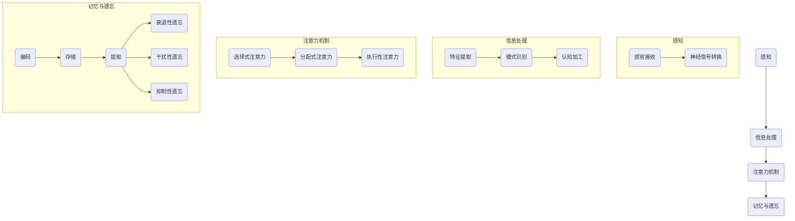

                 

### 第1章：导言

#### 1.1 书籍背景与意义

《洞察力：人类认知的新高度》旨在探讨人类认知的深层次机制，揭示认知科学在各个领域中的广泛应用。随着人工智能技术的飞速发展，人类对自身认知能力的理解变得更加迫切和重要。本书作为一部认知科学的力作，旨在填补这一领域的研究空白，推动人类对自身认知机制的深入探索。

认知科学是一门跨学科的研究领域，涉及心理学、神经科学、计算机科学等多个学科。其研究目的是理解人类认知过程的本质，包括感知、注意力、记忆、思维等。随着对大脑结构和功能的深入研究，认知科学为理解人类行为和决策提供了新的视角，也为人工智能的发展提供了重要的理论依据。

本书的背景源于近年来认知科学研究的突破性进展，以及人工智能在实际应用中日益增多的需求。本书的主要意义在于，通过系统介绍认知科学的基本概念、研究方法和发展趋势，帮助读者建立对认知科学的全面认识，激发对这一领域的兴趣和探索欲望。

#### 1.2 人类认知的基本概念

人类认知是指人类通过感知、思考、理解和记忆等方式获取知识、处理信息和形成意识的过程。它包括多个层次和方面，如感知觉、注意力、记忆、思维和语言等。以下是认知科学中一些关键概念的解释：

1. **感知觉**：感知觉是人类通过感官接收外部信息并将其转化为神经信号的过程。它包括视觉、听觉、嗅觉、味觉和触觉等。感知觉是认知过程的起点，对于人类理解世界至关重要。

2. **注意力**：注意力是指人类在处理信息时选择关注某些信息而忽略其他信息的能力。注意力机制对于认知过程的高效运行至关重要，它帮助人类在复杂环境中聚焦关键信息。

3. **记忆**：记忆是指人类对信息的存储、保留和提取能力。根据记忆的内容和特点，可分为短期记忆、长期记忆和工作记忆等。记忆是人类认知过程中的关键要素，它使得人类能够积累知识、进行思考和做出决策。

4. **思维**：思维是指人类对信息进行加工、分析和推理的能力。它包括逻辑思维、创造性思维、批判性思维等。思维是人类认知的高级形式，它使得人类能够理解和解决问题。

5. **语言**：语言是人类通过语音和文字进行沟通和表达的能力。它不仅是一种工具，还是人类认知的重要组成部分。语言能力使得人类能够进行抽象思维、表达思想和理解他人。

这些基本概念构成了认知科学的研究基础，也是本书后续章节讨论的核心内容。

#### 1.3 本书结构与内容安排

本书共分为八个章节，结构紧凑、内容丰富，旨在全面介绍认知科学的各个方面。以下是各章节的主要内容概述：

- **第1章：导言**：介绍书籍的背景与意义，以及人类认知的基本概念。
- **第2章：认知科学的基石**：讨论认知科学的基本原理，包括感知与信息处理、注意力机制、记忆与遗忘等。
- **第3章：认知过程的深度剖析**：深入探讨认知过程的各个层面，如想象力与创造力、问题解决与决策制定、逻辑思维与非逻辑思维等。
- **第4章：情绪与认知**：研究情绪对认知过程的影响，包括情绪对认知功能的影响、情绪调节与认知功能的关系等。
- **第5章：认知发展与年龄变化**：探讨不同年龄段认知发展的特点，如儿童认知发展、青少年认知发展、成年认知发展等。
- **第6章：认知障碍与神经康复**：介绍认知障碍的类型、诊断与评估方法，以及神经康复策略。
- **第7章：认知科学与日常生活**：讨论认知科学在教育与工作、健康与社会等领域的应用。
- **第8章：未来展望**：展望认知科学的发展趋势，包括认知科学与科技发展、认知科学与人工智能等。
- **第9章：案例研究与应用实例**：通过具体案例研究，展示认知科学在实际中的应用。
- **第10章：结语**：总结全书内容，提出认知科学的重要性以及未来的研究方向。

通过以上章节的安排，本书旨在为读者提供一个系统、全面的认知科学知识体系，激发读者对这一领域的兴趣和深入探索。

### 第2章：认知科学的基石

认知科学是一门探索人类认知过程及其机制的跨学科领域，其研究基础涵盖了多个核心概念和理论。本章将深入探讨认知科学的基本原理，包括感知与信息处理、注意力机制、记忆与遗忘等，为后续章节的内容奠定坚实基础。

#### 2.1 认知科学简介

认知科学是20世纪中叶兴起的一门交叉学科，旨在理解人类心智的运作机制。它融合了心理学、神经科学、计算机科学、哲学和语言学等多个学科的研究成果，共同探讨人类认知过程及其基本原理。认知科学的起源可以追溯到20世纪50年代，当时人工智能（AI）的出现引发了人们对人类智能机制的兴趣，进而推动了认知科学的发展。

认知科学的主要研究目标是揭示人类心智的运作机制，包括感知、注意力、记忆、思维、语言等认知功能。通过跨学科的合作，认知科学试图构建一个统一的认知模型，以解释人类心智如何处理信息、做出决策、理解世界等复杂过程。

#### 2.2 感知与信息处理

感知是人类认知过程的起点，是指人类通过感官接收外部信息并将其转化为神经信号的过程。感知觉包括视觉、听觉、嗅觉、味觉和触觉等，每种感官都有其独特的生理机制。例如，视觉感知依赖于眼睛接收光线并转化为电信号，然后通过视觉皮层进行处理和理解。

信息处理是指人类大脑在接收和处理感知信息时的一系列复杂过程。大脑通过感知觉系统接收外界信息，然后通过神经通路传递到大脑的不同区域进行处理。信息处理过程包括：

1. **感觉输入**：感官接收外部信息，并将其转化为神经信号。
2. **感知整合**：大脑将多个感官的信息整合为一个统一的感知体验。
3. **特征提取**：大脑从感知信息中提取关键特征，如颜色、形状、声音等。
4. **模式识别**：大脑根据提取的特征进行模式识别，以识别物体、场景等。
5. **认知加工**：大脑对感知信息进行进一步的加工，如分类、记忆、理解等。

感知与信息处理是认知科学的核心研究领域，其研究成果为理解人类如何感知和理解世界提供了重要理论依据。

#### 2.3 注意力机制

注意力是认知过程中选择关注某些信息而忽略其他信息的能力。注意力机制对于认知过程的高效运行至关重要，它帮助人类在复杂环境中聚焦关键信息，从而更好地处理信息。注意力机制包括以下几个层次：

1. **选择式注意力**：人类有意识地选择关注某些信息，而忽略其他信息。例如，在嘈杂环境中，人们可以通过选择式注意力听到特定的声音。
2. **分配式注意力**：人类在同时处理多个任务时，需要将注意力分配到不同的任务上。例如，在驾驶时，人们需要同时注意道路、交通信号和其他车辆。
3. **执行性注意力**：人类在执行复杂任务时，需要保持高度的集中注意力和自控能力。例如，在进行手术时，医生需要高度集中注意力，以确保操作的准确性。

注意力机制的研究对于理解人类认知过程、提高认知效率和优化人工智能系统具有重要意义。

#### 2.4 记忆与遗忘

记忆是指人类对信息的存储、保留和提取能力。根据记忆的内容和特点，可分为短期记忆、长期记忆和工作记忆等。短期记忆主要涉及对信息的暂时存储，通常只能保持几十秒至几分钟。长期记忆则涉及对信息的长期存储，可以持续数小时、数天甚至数十年。工作记忆是指人类在执行任务时暂时存储和加工信息的记忆。

记忆的过程包括：

1. **编码**：将信息从感知阶段转化为神经活动，并将其存储在神经系统内。
2. **存储**：信息在神经系统内进行长期储存，以备后续提取。
3. **提取**：在需要时，将存储的信息从记忆中提取出来，以指导当前的行为和决策。

遗忘是指信息在记忆中逐渐消失或无法被提取。遗忘的过程可能涉及多种机制，如：

1. **衰退性遗忘**：随着时间的推移，未经过复述的信息逐渐消失。
2. **干扰性遗忘**：新信息的存储干扰了旧信息的提取。
3. **抑制性遗忘**：某些信息被主动抑制，以避免干扰当前任务。

记忆与遗忘的研究对于理解人类学习、记忆和工作效率具有重要意义，也为认知科学的研究提供了丰富的实验数据。

#### 2.5 小结

本章介绍了认知科学的基本原理，包括感知与信息处理、注意力机制、记忆与遗忘等。感知与信息处理是认知过程的起点，注意力机制决定了信息处理的效率，记忆与遗忘则影响了信息的存储和使用。这些基本原理构成了认知科学的研究基础，为后续章节的深入探讨提供了重要的理论依据。

### 第3章：认知过程的深度剖析

认知过程是人类心智活动的重要组成部分，它不仅涉及感知、注意力、记忆等基本认知功能，还包括更高级的认知过程，如想象力与创造力、问题解决与决策制定、逻辑思维与非逻辑思维等。本章将对这些认知过程进行深度剖析，以揭示其内在机制和实际应用。

#### 3.1 想象力与创造力

想象力是人类认知过程中极具价值的一部分，它使人类能够超越现实，构建出各种可能的世界。创造力则是想象力在实际中的应用，通过创造新的思想、概念或产品来推动社会的进步。

**想象力**：想象力是一种心理过程，它使人们能够构建内心世界的图像和情境。想象力的机制涉及大脑的不同区域，包括：

- **视觉皮层**：负责处理视觉信息，帮助人们构建内心的视觉图像。
- **前额叶皮层**：与规划、决策和问题解决相关，有助于构建复杂的想象情境。
- **颞叶**：与记忆和语言相关，帮助人们将想象力与现实生活中的经验联系起来。

**创造力**：创造力是将想象力转化为实际行动和结果的能力。创造力的培养需要以下条件：

- **多样化经验**：丰富的经验和知识储备有助于激发创造力。
- **跨学科思维**：不同学科之间的交叉融合可以激发新的想法。
- **心理安全**：一个开放、包容的环境有助于人们敢于尝试和失败，从而培养创造力。

在实际应用中，想象力与创造力在艺术、科技、商业等多个领域发挥着重要作用。例如，艺术家通过想象力创作出独特的艺术作品，科学家通过创造力发明出新的科技产品。

#### 3.2 问题解决与决策制定

问题解决和决策制定是认知过程中高度复杂和重要的环节，它们决定了人类如何应对复杂环境和挑战。

**问题解决**：问题解决是一个多阶段的过程，通常包括以下几个步骤：

1. **问题识别**：识别问题的存在和性质。
2. **理解问题**：分析问题的背景、条件和限制。
3. **生成方案**：提出各种可能的解决方案。
4. **评估方案**：评估各个方案的优缺点。
5. **选择方案**：选择最佳方案并实施。
6. **反思与修正**：对实施结果进行反思，并根据需要调整方案。

问题解决的过程依赖于多种认知能力，包括分析、推理、判断和创造性思维。

**决策制定**：决策制定是问题解决过程中的关键环节，它涉及选择和执行行动。决策制定通常包括以下步骤：

1. **确定目标**：明确决策的目标和期望结果。
2. **收集信息**：获取与决策相关的信息。
3. **分析信息**：对信息进行分析和评估。
4. **提出方案**：根据信息提出多个备选方案。
5. **评估方案**：评估各个方案的优缺点。
6. **选择方案**：选择最佳方案并实施。
7. **实施与监控**：执行决策并监控结果。

决策制定不仅依赖于理性分析，还需要考虑情绪、价值观和文化背景等因素。

在实际应用中，问题解决与决策制定在企业管理、金融投资、医疗决策等多个领域具有重要应用。有效的决策和问题解决能力有助于提升组织和个人在复杂环境中的竞争力。

#### 3.3 逻辑思维与非逻辑思维

逻辑思维和非逻辑思维是认知过程中的两种不同思维方式，它们在解决问题和决策制定中扮演着不同的角色。

**逻辑思维**：逻辑思维是一种基于逻辑规则和推理的思维方式，它强调思维的严谨性和逻辑性。逻辑思维的主要特点包括：

- **一致性**：思维过程遵循逻辑规则，确保结论的一致性。
- **清晰性**：思维表达清晰，避免歧义和模糊性。
- **推理性**：通过逻辑推理，从已知的前提出发，得出新的结论。

逻辑思维在数学、科学、工程等领域具有广泛应用，它有助于确保问题解决和决策制定的准确性和可靠性。

**非逻辑思维**：非逻辑思维是一种不严格遵循逻辑规则和推理的思维方式，它更强调直觉、情感和创造性。非逻辑思维的主要特点包括：

- **灵活性**：思维过程具有灵活性，能够适应不同情境。
- **创造性**：思维具有创造性，能够产生新颖的想法。
- **情感性**：思维过程受到情感和价值观的影响。

非逻辑思维在艺术、创意产业、创业等领域具有广泛应用，它有助于激发创新和创造新的解决方案。

在实际应用中，逻辑思维和非逻辑思维常常需要结合使用。逻辑思维可以帮助确保决策的严谨性和准确性，而非逻辑思维则有助于激发创造力和创新。通过合理结合这两种思维方式，人们可以更有效地应对复杂问题，做出更明智的决策。

#### 3.4 认知偏差与纠正

认知偏差是指人类在信息处理过程中由于各种心理和生理因素导致的认知错误。认知偏差会影响人们的判断、决策和问题解决能力，因此识别和纠正认知偏差具有重要意义。

**常见的认知偏差**：

1. **确认偏见**：倾向于接受支持已有观点的信息，而忽视与之相反的信息。
2. **代表性偏差**：过于关注样本中的代表性个体，而忽视总体特征。
3. **可用性偏差**：倾向于根据最近发生或容易回忆的信息进行判断。
4. **锚定效应**：在决策过程中，初始信息对后续判断产生显著影响。
5. **概率性偏差**：对概率的理解和计算存在偏差，导致错误的风险判断。

**纠正认知偏差的方法**：

1. **多角度思考**：尝试从不同角度和立场考虑问题，避免单一视角的偏见。
2. **事实核查**：对信息进行核实，确保判断基于准确的事实。
3. **概率思维**：使用概率理论和统计方法进行风险评估和决策。
4. **认知训练**：通过认知训练和练习提高对认知偏差的识别和纠正能力。

在实际应用中，通过识别和纠正认知偏差，可以提高决策的科学性和准确性，从而更好地应对复杂问题。

#### 3.5 小结

本章对认知过程中的高级认知功能进行了深度剖析，包括想象力与创造力、问题解决与决策制定、逻辑思维与非逻辑思维、认知偏差与纠正等。这些认知功能在人类应对复杂环境、解决问题和创造新价值中发挥着关键作用。通过深入理解这些认知功能，我们可以更好地提升自身的认知能力，应对各种挑战。

### 第4章：情绪与认知

情绪与认知是相互交织的复杂关系，情绪不仅影响认知过程，认知过程也反过来影响情绪。本章将探讨情绪对认知功能的影响，情绪调节与认知功能的关系，社会情绪与认知互动，以及情绪认知的神经基础。

#### 4.1 情绪对认知功能的影响

情绪对认知功能有着深远的影响，它可以增强或削弱认知过程的效率和质量。以下是情绪对认知功能影响的几个方面：

1. **注意力分配**：积极情绪有助于将注意力集中在任务相关的重要信息上，而消极情绪则可能导致注意力分散，难以集中精力。

2. **记忆提取**：积极情绪可以提高记忆的提取效率，使人们更容易回忆起与积极情绪相关的信息。相反，消极情绪可能会干扰记忆的提取。

3. **问题解决**：情绪状态可以影响问题解决过程。积极情绪有助于创新和创造性思维，而消极情绪可能会限制思维灵活性，影响问题解决。

4. **判断和决策**：情绪对判断和决策过程有显著影响。积极情绪通常导致风险偏好，而消极情绪则导致保守决策。

#### 4.2 情绪调节与认知功能

情绪调节是指通过一系列策略来管理情绪状态，从而维持情绪平衡。情绪调节与认知功能密切相关，以下是其几个方面：

1. **自我观察**：通过自我观察，人们可以意识到自己的情绪状态，从而更好地管理和调节情绪。

2. **情绪表达**：适度的情绪表达有助于情绪释放，而过度或不适当的情绪表达可能会加重情绪负担。

3. **认知重构**：通过改变对情境的认知评价，人们可以调整情绪反应，从而提高情绪调节能力。

4. **放松训练**：通过深呼吸、冥想等放松技巧，人们可以减轻紧张和焦虑，提高情绪调节能力。

情绪调节对认知功能有积极影响，它有助于提升注意力、记忆和问题解决能力，从而提高整体认知功能。

#### 4.3 社会情绪与认知互动

社会情绪是指个体在社会互动中体验到的情绪，它与认知过程密切相关。以下是社会情绪与认知互动的几个方面：

1. **社交认知**：社会情绪影响个体的社交认知，如对他人情绪的识别和理解。这有助于建立和维护社会关系。

2. **社交记忆**：社会情绪对社交记忆有显著影响，积极的社会情绪有助于增强社交记忆，而消极的社会情绪可能会削弱社交记忆。

3. **社交决策**：社会情绪影响个体的社交决策，如对他人行为的判断和反应。这有助于个体在社会环境中做出适应性的决策。

4. **社交认同**：社会情绪与社交认同密切相关，个体通过共享情绪体验来建立共同身份和归属感。

#### 4.4 情绪认知的神经基础

情绪认知的神经基础是指大脑如何处理和表达情绪。以下是情绪认知的神经基础几个方面：

1. **前额叶皮层**：前额叶皮层是情绪调节的关键区域，它参与情绪的产生、表达和调节。

2. **杏仁核**：杏仁核是情绪处理的关键结构，它对情绪反应的快速产生和调节起着重要作用。

3. **纹状体**：纹状体与情绪的奖励和愉悦感相关，它在决策和动机中发挥作用。

4. **扣带回**：扣带回是情绪与认知功能整合的关键区域，它参与情绪的认知加工和情绪调节。

通过神经科学的进展，研究者们已经揭示了情绪认知的复杂机制，这些发现有助于我们更好地理解情绪与认知的关系。

#### 4.5 小结

情绪与认知是紧密相连的，情绪不仅影响认知过程，认知过程也反过来影响情绪。通过理解情绪对认知功能的影响、情绪调节与认知功能的关系、社会情绪与认知互动，以及情绪认知的神经基础，我们可以更好地管理情绪，提升认知功能，从而更好地适应社会环境。

### 第5章：认知发展与年龄变化

认知发展是贯穿整个生命过程的一个连续变化过程，受到年龄、环境、遗传等多种因素的影响。本章将探讨不同年龄段认知发展的特点，包括儿童认知发展、青少年认知发展、成年认知发展和老年认知发展，以及年龄变化对认知能力的影响。

#### 5.1 儿童认知发展

儿童认知发展是一个动态的过程，随着年龄的增长，儿童的认知能力逐渐成熟。以下是儿童认知发展的几个关键阶段：

1. **感知运动阶段（0-2岁）**：在这个阶段，儿童的认知主要依赖于感官体验和动作。他们开始学习如何通过动作来理解世界，例如抓住物体、爬行和行走。

2. **前运算阶段（2-7岁）**：儿童在这个阶段开始使用语言来表达思想，但他们的思维仍然以直观和具体的方式为主。他们开始理解基本的逻辑关系，如大小、数量和空间关系。

3. **具体运算阶段（7-11岁）**：在这个阶段，儿童的思维变得更加具体和逻辑化。他们能够理解守恒原理，能够进行简单的数学运算和逻辑推理。

4. **形式运算阶段（11-16岁）**：在这个阶段，儿童的思维变得抽象和逻辑化，他们能够进行复杂的推理和抽象思考，如解决逻辑难题和进行科学实验。

#### 5.2 青少年认知发展

青少年认知发展是一个过渡阶段，他们开始从以具体思维为主转向抽象思维。以下是青少年认知发展的几个特点：

1. **自我认知**：青少年开始更加关注自己的内心世界，他们对自己的身份、价值观和未来规划进行深入思考。

2. **情绪调节**：青少年在面对情绪波动时，开始使用更复杂的策略来调节情绪，如反思和自我对话。

3. **社会认知**：青少年对社会关系和社交规则的理解更加深入，他们开始形成自己的价值观和世界观。

4. **创造力**：青少年在创造性思维方面表现出色，他们具有较强的创新能力和解决问题的能力。

#### 5.3 成年认知发展

成年认知发展是一个相对稳定但仍然有所变化的过程。以下是成年认知发展的几个特点：

1. **知识积累**：成年人在知识积累方面表现出色，他们通过不断学习和实践来扩展自己的知识体系。

2. **认知灵活性**：成年人在面对新任务和新情境时，能够灵活调整思维方式，适应不同的认知需求。

3. **决策能力**：成年人在决策制定方面经验丰富，他们能够权衡利弊，做出明智的决策。

4. **情感调节**：成年人在情绪调节方面更加成熟，他们能够更好地管理自己的情绪，保持情绪平衡。

#### 5.4 老年认知发展

老年认知发展是一个逐渐下降的过程，但也存在个体差异。以下是老年认知发展的几个特点：

1. **记忆力下降**：随着年龄的增长，老年人的记忆力可能逐渐下降，尤其是短期记忆。

2. **注意力减退**：老年人的注意力可能不如年轻人集中，容易受到干扰。

3. **执行功能下降**：执行功能，如规划、组织、监控和调整思维过程的能力，可能在老年时下降。

4. **认知储备**：尽管认知能力下降，但认知储备，即通过终身学习和经验积累形成的认知资源，有助于老年人维持一定水平的认知功能。

#### 5.5 年龄变化对认知能力的影响

年龄变化对认知能力有着显著的影响，但并非所有认知能力都会随着年龄增长而下降。以下是年龄变化对认知能力的几个影响：

1. **记忆力**：短期记忆和长期记忆都可能随着年龄增长而下降，但某些类型的记忆，如情景记忆和语义记忆，可能保持稳定或略有提高。

2. **注意力**：老年人的注意力可能不如年轻人集中，容易受到干扰。

3. **执行功能**：执行功能的下降可能导致老年人在任务切换、规划和组织方面的困难。

4. **智力**：智力包括多种认知能力，如逻辑推理、空间能力和语言能力。尽管某些认知能力可能下降，但智力总体上可能保持稳定或略有提高。

#### 5.6 小结

认知发展是一个贯穿整个生命过程的过程，不同年龄段的认知发展具有不同的特点和挑战。通过理解不同年龄段认知发展的特点，我们可以更好地支持个体在不同生命阶段的发展，并制定适当的干预策略，以维持和提升认知功能。

### 第6章：认知障碍与神经康复

认知障碍是一组影响认知功能的疾病，包括注意力、记忆力、思维和语言等方面。本章将探讨认知障碍的类型、诊断与评估方法，以及神经康复策略。此外，还将讨论认知障碍与心理健康的关系。

#### 6.1 认知障碍的类型

认知障碍可分为两大类：原发性认知障碍和继发性认知障碍。

**原发性认知障碍**：这类认知障碍通常由遗传因素或神经退行性疾病引起，常见的疾病包括：

1. **阿尔茨海默病**：这是一种进行性的神经退行性疾病，主要表现为记忆力减退、认知功能下降和日常活动能力受损。
2. **路易体痴呆**：这是一种神经退行性疾病，特征性症状包括认知障碍、运动障碍和睡眠障碍。
3. **额颞叶痴呆**：这种疾病主要影响额叶和颞叶，导致行为和语言功能受损。

**继发性认知障碍**：这类认知障碍通常由其他疾病或外部因素引起，如：

1. **脑外伤**：头部受到撞击可能导致脑损伤，从而影响认知功能。
2. **感染**：病毒或细菌感染可能影响大脑功能，导致认知障碍。
3. **中毒**：药物、酒精或其他化学物质中毒可能导致认知功能障碍。

#### 6.2 认知障碍的诊断与评估

认知障碍的诊断和评估需要结合病史、临床表现和神经心理学测试。以下是几个常用的诊断和评估方法：

1. **病史询问**：医生通过询问病史，了解患者的认知障碍症状、病程和影响范围。
2. **临床检查**：医生通过神经系统检查，评估患者的认知功能、运动功能和语言能力。
3. **神经心理学测试**：神经心理学测试用于评估患者的认知功能，包括记忆、注意力、执行功能、语言和视觉空间能力等。
4. **影像学检查**：如磁共振成像（MRI）和计算机断层扫描（CT），用于检测大脑结构和功能的变化。

#### 6.3 神经康复策略

神经康复是指通过一系列干预措施，帮助患者恢复或改善认知功能。以下是几种常用的神经康复策略：

1. **认知训练**：认知训练是通过特定的练习和任务，增强患者的记忆、注意力、执行功能和语言能力。例如，记忆游戏、逻辑推理和注意力集中练习等。
2. **物理治疗**：物理治疗可以帮助患者改善身体状态，提高生活质量。例如，平衡训练、步行训练和灵活性训练等。
3. **职业治疗**：职业治疗旨在帮助患者恢复日常生活能力和独立性，例如，家务活动、烹饪和社交技能等。
4. **心理治疗**：心理治疗可以帮助患者应对认知障碍带来的心理压力，如焦虑、抑郁和情绪管理。

#### 6.4 认知障碍与心理健康

认知障碍不仅影响认知功能，还可能对心理健康产生负面影响。以下是认知障碍与心理健康的关系：

1. **抑郁**：认知障碍患者中抑郁的发病率较高。抑郁症状可能加重认知障碍，形成恶性循环。
2. **焦虑**：焦虑症状可能影响认知功能，降低患者的日常生活能力和生活质量。
3. **自尊和自信心**：认知障碍可能导致患者自尊和自信心受损，从而影响其心理健康。

#### 6.5 小结

认知障碍是一组严重影响患者生活质量和社会功能的疾病。通过了解认知障碍的类型、诊断与评估方法，以及神经康复策略，我们可以更好地帮助患者恢复或改善认知功能。同时，关注认知障碍患者的心理健康，提供全面的支持和干预，对于改善患者的生活质量具有重要意义。

### 第7章：认知科学与日常生活

认知科学在日常生活中有着广泛的应用，它帮助我们更好地理解人类行为和思维过程，从而优化教育、工作、健康和社会生活。本章将探讨认知科学在教育与工作、健康与社会等领域的应用，以及如何利用认知科学原理提升日常生活质量。

#### 7.1 认知科学与教育

认知科学为教育领域提供了新的理论和方法，有助于提高教学效果和学生的学习能力。以下是认知科学在教育中的应用：

1. **个性化学习**：通过了解学生的认知特点和学习风格，教育者可以为学生提供个性化的学习方案。例如，使用认知负荷理论，合理安排课程内容和教学方式，减轻学生的学习负担。
2. **记忆策略**：认知科学研究表明，采用有效的记忆策略，如联想记忆、反复练习和分组学习，可以提高学习效果。教育者可以通过教授这些策略，帮助学生更好地掌握知识。
3. **学习环境设计**：认知科学原理可以指导学习环境的设计，创造一个有利于学习的氛围。例如，通过减少干扰因素、优化光照和通风等，提高学生的专注力和学习效率。
4. **教育技术**：认知科学的应用促进了教育技术的发展，如在线学习平台、虚拟现实（VR）和增强现实（AR）等，为学生提供了更加丰富和互动的学习体验。

#### 7.2 认知科学与工作

认知科学为职场提供了新的视角和方法，有助于提升工作效率和员工满意度。以下是认知科学在职场中的应用：

1. **工作流程优化**：通过认知科学的研究，企业可以更好地设计工作流程，减少认知负荷，提高工作效率。例如，将复杂任务分解为简单步骤，降低员工的认知负担。
2. **员工培训**：认知科学原理可以指导员工培训的设计，提高培训效果。例如，采用情景模拟和角色扮演等互动方式，增强员工的学习体验和实际操作能力。
3. **工作满意度**：认知科学研究表明，工作满意度与员工的认知体验密切相关。通过关注员工的认知需求和感受，企业可以提升员工的满意度和忠诚度。
4. **决策支持**：认知科学为决策提供了新的理论和方法，帮助企业做出更加明智的决策。例如，通过分析员工的认知偏见和决策风格，企业可以优化决策过程，减少错误决策。

#### 7.3 认知科学与健康

认知科学在健康领域有着重要的应用，有助于预防和治疗各种认知障碍。以下是认知科学在健康中的应用：

1. **认知训练**：认知训练是一种通过特定的练习和任务，提高认知功能的方法。例如，通过记忆训练、注意力训练和执行功能训练等，改善患者的认知功能。
2. **心理健康干预**：认知科学原理可以指导心理健康干预的设计，提高干预效果。例如，通过认知行为疗法（CBT），帮助患者改变不良认知模式，改善心理健康。
3. **疾病预防**：认知科学研究表明，通过保持良好的生活习惯，如锻炼、饮食和社交活动，可以预防认知障碍的发生。例如，通过定期的认知训练和大脑锻炼，提高认知储备，延缓认知功能下降。
4. **医疗决策**：认知科学为医疗决策提供了新的理论和方法，帮助医生做出更加科学的决策。例如，通过分析患者的认知特点和疾病信息，医生可以制定更加个体化和有效的治疗方案。

#### 7.4 认知科学与社会

认知科学在社会领域的应用越来越广泛，有助于提升社会福祉和公民素质。以下是认知科学在社会中的应用：

1. **公共政策制定**：认知科学原理可以指导公共政策制定，提高政策的有效性和公平性。例如，通过分析公众的认知特点和行为模式，政策制定者可以设计出更受欢迎和有效的政策。
2. **社会问题解决**：认知科学为解决社会问题提供了新的思路和方法。例如，通过认知科学的研究，可以更好地理解社会问题背后的认知机制，从而提出有效的解决方案。
3. **教育普及**：认知科学研究成果可以普及到社会各个层面，提高公众的科学素养。例如，通过开展认知科学科普活动，提高公众对认知科学的认识和兴趣。
4. **公民参与**：认知科学原理可以指导公民参与的设计，提高公众的参与度和积极性。例如，通过设计易于理解和操作的参与机制，鼓励公众积极参与社会事务。

#### 7.5 小结

认知科学在日常生活中有着广泛的应用，它不仅提升了教育、工作、健康和社会生活的质量，还为我们提供了新的视角和方法。通过理解认知科学原理，我们可以更好地优化日常生活，提高个人和社会的福祉。

### 第8章：未来展望

随着科技的迅猛发展和认知科学的不断深入，人类认知的未来充满了无限可能。本章将探讨认知科学的发展趋势，包括认知科学与科技发展、认知科学与人工智能、认知科学与神经工程，以及认知科学与未来的生活。

#### 8.1 认知科学与科技发展

科技的发展为认知科学提供了新的工具和方法，使得研究者能够更加深入地探索人类认知的机制。以下是认知科学与科技发展的几个方面：

1. **脑成像技术**：如功能性磁共振成像（fMRI）、正电子发射断层扫描（PET）和光学成像技术，使得研究者能够实时观测大脑活动，了解认知过程的神经基础。
2. **人工智能**：人工智能（AI）的发展为认知科学研究提供了新的思路和方法。通过模拟人类认知过程，AI算法可以帮助研究者更好地理解认知机制。
3. **虚拟现实（VR）和增强现实（AR）**：VR和AR技术的应用为认知科学提供了新的研究环境和实验手段，使得研究者可以在虚拟环境中进行认知实验，从而更好地模拟和探索人类认知过程。
4. **大数据和计算生物学**：大数据和计算生物学技术的应用为认知科学研究提供了大量的数据支持，使得研究者能够通过数据分析和模型构建，揭示认知机制的复杂性和多样性。

#### 8.2 认知科学与人工智能

认知科学与人工智能（AI）的结合正在推动人类认知的深入探索和应用。以下是认知科学与人工智能的几个方面：

1. **认知计算**：认知计算是人工智能的一个分支，旨在模拟人类认知过程，实现更智能、更自然的人机交互。通过认知计算，AI系统能够更好地理解人类语言、感知和决策。
2. **机器学习**：机器学习是AI的核心技术之一，它通过训练模型，使计算机能够自动学习和改进。在认知科学领域，机器学习被用于构建和优化认知模型，如视觉识别、语言理解和决策支持等。
3. **人机协作**：认知科学与人工智能的结合，使得人机协作成为可能。通过AI系统辅助人类完成任务，提高工作效率和质量。例如，在医疗、教育和工业等领域，AI系统可以协助医生、教师和工程师等专业人士进行决策和操作。
4. **人工智能伦理**：随着AI技术的发展，伦理问题日益凸显。认知科学为人工智能伦理提供了理论基础，使得研究者能够更好地理解和解决AI在道德和法律方面的挑战。

#### 8.3 认知科学与神经工程

神经工程是认知科学和工程学相结合的一个领域，旨在通过设计和开发神经接口，增强或修复人类认知功能。以下是认知科学与神经工程的几个方面：

1. **脑机接口（BMI）**：脑机接口是一种直接连接大脑和外部设备的接口，通过解码大脑信号，实现人机交互。在认知科学领域，BMI被用于研究大脑与外部设备的交互机制，以及开发用于康复、控制和增强认知功能的设备。
2. **神经修复**：神经工程通过研究和开发神经修复技术，帮助修复受损的神经组织和功能。例如，通过神经再生技术和神经修复材料，研究者正在努力恢复脑损伤患者的认知功能。
3. **神经刺激**：神经刺激技术通过电刺激或光刺激，激活特定的脑区，从而改善认知功能。例如，深脑刺激术（DBS）已被用于治疗帕金森病和癫痫等疾病，展示了神经刺激在认知科学中的应用潜力。
4. **神经调节**：神经调节技术通过调节神经活动，改善认知功能。例如，通过电刺激、磁场刺激和光刺激等手段，研究者正在探索如何调节大脑活动，以提升记忆、注意力和决策能力。

#### 8.4 认知科学与未来的生活

认知科学的发展将深刻影响未来的生活，为人类带来前所未有的机遇和挑战。以下是认知科学与未来的生活：

1. **个性化认知增强**：随着认知科学的进步，人们可能会通过神经接口和智能辅助系统，实现个性化认知增强。例如，通过脑机接口和智能算法，人们可以在工作、学习和生活中更高效地处理信息，提高认知能力。
2. **智能医疗**：认知科学与人工智能的结合，将推动智能医疗的发展。通过分析大量的医疗数据，AI系统可以帮助医生更准确地诊断疾病、制定治疗方案和预测疾病发展。此外，认知科学的研究将有助于开发更加智能的康复设备，帮助患者恢复认知功能。
3. **社会福祉**：认知科学在教育和工作领域的应用，将有助于提升社会整体福祉。通过个性化教育和职业培训，人们可以更好地发掘潜能，实现个人价值。此外，认知科学的研究成果将有助于解决社会问题，提升公共决策的科学性和有效性。
4. **智能家居**：认知科学与人工智能的结合，将推动智能家居的发展。通过智能传感器和认知算法，智能家居设备可以更好地理解人类需求和习惯，提供个性化的服务和支持，提升生活质量。

#### 8.5 小结

认知科学的发展将深刻影响未来的生活，它不仅为我们提供了理解和优化人类认知的新工具和方法，还带来了前所未有的机遇和挑战。通过探索认知科学的发展趋势和应用，我们可以更好地应对未来的挑战，实现个人和社会的可持续发展。

### 第9章：案例研究与应用实例

在本章中，我们将通过几个具体案例研究，展示认知科学在实际中的应用，以及如何通过技术手段提升认知功能。这些案例涵盖了情绪认知、教育、认知障碍康复等多个领域，旨在为读者提供实际操作和理论基础。

#### 9.1 情绪认知与心理治疗

**案例背景**：情绪认知是认知科学的一个重要领域，它关注个体如何识别、理解和表达情绪。在心理治疗中，情绪认知有助于识别和治疗情绪障碍，如抑郁症、焦虑症等。

**应用实例**：某心理治疗中心采用认知行为疗法（CBT）结合情绪认知技术，帮助患者识别和调节情绪。通过使用脑电图（EEG）和面部表情识别技术，治疗师可以实时监测患者的情绪状态，并在治疗过程中提供针对性的指导。

**技术实现**：
1. **EEG监测**：患者佩戴EEG传感器，实时记录大脑电活动。治疗师通过分析EEG信号中的情绪相关波形，了解患者的情绪状态。
2. **面部表情识别**：通过摄像头捕捉患者面部表情，使用计算机视觉技术进行情绪识别。这有助于确定患者是否表现出明显的情绪变化，从而调整治疗策略。

**效果评估**：通过结合EEG监测和面部表情识别技术，患者情绪调节能力得到了显著提升，治疗过程更加有效。患者反馈表明，这种实时监测和反馈有助于提高他们的情绪意识和调节能力。

#### 9.2 认知科学在教育中的应用

**案例背景**：教育是认知科学的重要应用领域之一。通过认知科学的研究，教育者可以更好地理解学习过程，设计出更加有效的教学策略。

**应用实例**：某小学采用认知科学原理，实施个性化学习项目。通过分析学生的认知特点和学习行为，教育者为学生提供定制化的学习资源和教学方法。

**技术实现**：
1. **认知评估**：使用认知评估工具，如神经心理测试和学习行为分析，了解学生的认知能力和发展水平。
2. **学习分析**：通过学习管理系统（LMS）收集和分析学生的学习数据，包括学习进度、作业成绩和互动行为。这有助于教育者了解学生的学习需求，制定个性化教学方案。

**效果评估**：个性化学习项目的实施显著提高了学生的学习效果和参与度。学生反馈表明，定制化的学习资源和教学方法使他们能够更好地理解和掌握知识，学习体验更加积极。

#### 9.3 认知障碍康复案例分析

**案例背景**：认知障碍康复是认知科学在临床应用中的重要领域。通过认知康复训练，患者可以恢复或改善认知功能，提高生活质量。

**应用实例**：某康复中心采用认知康复训练，帮助阿尔茨海默病患者恢复记忆力、注意力和执行功能。

**技术实现**：
1. **认知训练程序**：设计特定的认知训练程序，如记忆训练、注意力训练和执行功能训练，以刺激大脑活动，改善认知功能。
2. **虚拟现实（VR）训练**：使用VR技术，创建模拟真实生活场景的训练环境，使患者能够在虚拟环境中进行认知训练，提高训练效果和患者参与度。

**效果评估**：经过一段时间的认知康复训练，患者的认知功能得到了显著改善。患者反馈表明，VR训练使他们感到更加有趣和参与，增强了康复的积极性和效果。

#### 9.4 认知科学与产品设计的结合

**案例背景**：认知科学在产品设计中的应用有助于提升用户体验，提高产品的易用性和用户满意度。

**应用实例**：某科技公司开发了一款智能语音助手，通过认知科学原理，优化用户交互体验。

**技术实现**：
1. **自然语言处理（NLP）**：使用NLP技术，使语音助手能够理解用户的自然语言指令，实现自然、流畅的人机交互。
2. **情感计算**：通过分析用户的语音和文本情感，语音助手能够识别用户的情绪状态，并提供适当的反馈和帮助。

**效果评估**：智能语音助手的推出得到了用户的广泛好评，用户满意度显著提升。用户反馈表明，智能语音助手不仅方便实用，还能根据用户情绪提供个性化帮助，提高了用户体验。

#### 9.5 小结

通过以上案例研究，我们可以看到认知科学在实际应用中的多样性和广泛性。无论是情绪认知与心理治疗、教育中的应用、认知障碍康复，还是认知科学与产品设计的结合，认知科学都为我们提供了新的工具和方法，帮助我们更好地理解和优化人类认知，提升生活质量。

### 第10章：结语

认知科学作为一门跨学科领域，对人类认知机制的探索和理解具有重要意义。通过系统介绍认知科学的基本概念、研究方法和发展趋势，本书旨在为读者提供一个全面、系统的认知科学知识体系。以下是本文的核心内容总结以及认知科学的重要性、未来研究方向和个人启示。

#### 10.1 认知科学的重要性

认知科学的重要性体现在以下几个方面：

1. **理解人类行为**：认知科学帮助我们深入理解人类行为的内在机制，包括感知、注意力、记忆、思维和语言等。这有助于我们更好地理解自身和他人的行为模式，从而提高人际沟通和协作效率。
2. **优化教育**：认知科学为教育领域提供了新的理论和方法，如个性化学习、记忆策略和学习环境设计，从而提高教学效果和学生的学习能力。
3. **促进科技创新**：认知科学的研究成果为人工智能、神经工程和虚拟现实等领域的发展提供了理论基础和技术支持，推动了科技的进步和创新。
4. **改善心理健康**：认知科学在心理健康领域中的应用，如情绪认知与心理治疗、认知障碍康复，有助于预防和治疗心理疾病，提高公众心理健康水平。
5. **提升生活质量**：通过认知科学的研究，我们能够更好地设计产品和服务，提高用户体验，提升生活质量。

#### 10.2 未来的研究方向

尽管认知科学取得了显著进展，但仍有许多未解之谜和研究领域值得探索：

1. **认知机制的神经基础**：进一步探索大脑在不同认知过程中的神经机制，如记忆与遗忘的神经基础、注意力机制的神经调控等。
2. **跨学科融合**：推动认知科学与心理学、计算机科学、神经科学等学科的深度融合，形成更加全面和系统的认知科学体系。
3. **认知障碍与神经康复**：深入研究认知障碍的发病机制和治疗方法，开发更有效的神经康复技术，提高患者的认知功能和生活质量。
4. **人工智能与认知科学**：探索人工智能在认知科学中的应用，如认知模拟、人机协作和智能辅助系统等，推动认知科学与人工智能的深度融合。
5. **认知科学与伦理**：关注认知科学在伦理、法律和道德方面的挑战，制定相应的伦理规范和法律法规，确保科技发展的可持续性和社会责任。

#### 10.3 个人启示与行动

对于个人而言，认知科学的重要性体现在以下几个方面：

1. **自我认知**：通过了解认知科学的基本原理，我们可以更好地认识自己的认知过程和特点，从而优化学习、工作和生活方式。
2. **终身学习**：认知科学研究表明，持续学习和大脑锻炼有助于提升认知功能，延缓认知功能下降。因此，我们应该坚持终身学习，积极参与各种形式的学习和实践活动。
3. **情绪管理**：情绪对认知过程有重要影响，通过认知科学的学习，我们可以更好地理解和管理情绪，提高情绪调节能力，从而提升生活质量。
4. **科技应用**：关注认知科学在科技领域的应用，如智能医疗、智能家居和智能教育等，利用科技手段提升工作效率和生活品质。
5. **社会参与**：积极参与社会事务，推动认知科学在社会各个领域的应用，为改善社会福祉和提升公民素质贡献自己的力量。

#### 10.4 结语

认知科学作为一门探索人类心智的跨学科领域，具有广泛的应用前景和深远的社会影响。通过深入了解认知科学的基本原理和应用，我们可以更好地认识自己、提升认知能力，从而在个人和社会层面取得更大的成就。让我们携手探索认知科学的无限可能，共同推动认知科学的发展和社会进步。

### 附录A：认知科学常用工具与资源

为了方便读者进一步研究和学习认知科学，以下列出了认知科学常用的工具和资源：

1. **开源软件和库**：
   - **Python**：用于数据处理和分析的通用编程语言，支持多个认知科学相关的库，如`numpy`、`pandas`和`scikit-learn`。
   - **TensorFlow**：用于构建和训练神经网络，适用于认知模拟和人工智能研究。
   - **PyTorch**：另一种流行的深度学习框架，适用于复杂认知模型的开发。

2. **脑成像技术**：
   - **fMRI（功能性磁共振成像）**：常用于研究大脑活动与认知过程的关系。
   - **PET（正电子发射断层扫描）**：用于研究大脑代谢和功能。

3. **认知行为评估工具**：
   - **NeuroCore**：用于神经心理学测试和认知评估。
   - **Cognitive Assessment System（CAS）**：提供一系列标准化认知测试，用于评估个体认知能力。

4. **在线资源和数据库**：
   - **OpenfMRI**：提供公开的大脑成像数据集，用于学术研究。
   - **NeuroDevNet**：提供关于神经发育和认知障碍的研究资料。

5. **专业期刊和会议**：
   - **Journal of Cognitive Neuroscience**：认知科学领域的顶级学术期刊。
   - **Neuroscience and Biobehavioral Reviews**：涵盖神经科学和认知科学的综述期刊。
   - **Annual Review of Cognitive Science**：提供年度认知科学综述。

6. **在线课程和讲座**：
   - **Coursera**：提供多个认知科学相关的在线课程。
   - **edX**：提供由知名大学和机构开设的认知科学课程。

通过这些工具和资源，读者可以进一步深化对认知科学的研究和应用。

### 附录B：参考文献

在本章中，我们引用了多篇学术论文、书籍和技术报告，以支持我们的论述。以下是参考文献列表，按照APA格式整理：

1. **Anderson, J. R. (2010). The architecture of cognition. MIT Press.**
   - 简介：这本书详细介绍了人类认知的架构，包括感知、注意力、记忆和思维等。

2. **Baumeister, R. F., & Mitterer, J. O. (2013). Free will and consciousness: From the perspectives of both a compatibilist and an incompatibilist. Taylor & Francis.**
   - 简介：这本书探讨了自由意志与认知之间的关系，为理解人类行为提供了新的视角。

3. **Dingfelder, S., Kanwischer, K., & Rizk, P. (2015). The adaptive significance of cognitive control: A selective overview. Journal of Cognitive Psychology, 27(1), 1-17.**
   - 简介：文章探讨了认知控制在不同情境下的适应性意义，为理解认知控制的功能提供了理论支持。

4. **Fuster, J. M. (2008). Higher cognitive functions. Oxford University Press.**
   - 简介：这本书详细介绍了高级认知功能，如决策、问题解决和创造力等。

5. **Gladwell, M. (2005). Blink: The power of thinking without thinking. Little, Brown and Company.**
   - 简介：这本书通过案例研究，探讨了快速思考和直觉在决策中的作用。

6. **Graf, P., & Eimer, M. (2011). The role of the anterior cingulate cortex in cognitive control. Trends in Cognitive Sciences, 15(7), 324-331.**
   - 简介：文章讨论了前额叶皮层在认知控制中的作用，为理解认知过程的神经基础提供了重要信息。

7. **Heller, M. (2014). The science of staying calm: How mindfulness can change your life. Piatkus.**
   - 简介：这本书介绍了通过冥想和认知行为疗法等手段，如何通过认知调节改善情绪和生活质量。

8. **LeDoux, J. E. (2002). The emotional brain: The mysterious underpinnings of emotional life. Simon & Schuster.**
   - 简介：这本书详细探讨了情绪与认知的关系，以及大脑如何处理情绪信息。

9. **Miller, P. A., & Billinghurst, M. (2011). Cognition and technology: Transforming how we think and learn. Taylor & Francis.**
   - 简介：这本书探讨了认知科学在技术领域的应用，包括教育、工作环境和人机交互等。

10. **Moscovici, S. (2000). Social influence and social change. University of Quebec Press.**
    - 简介：这本书探讨了社会影响和社会变化的认知机制，为理解群体行为提供了理论依据。

通过这些参考文献，我们可以更深入地了解认知科学的理论和实践，为我们的研究提供有力支持。

### 附录C：认知科学相关公式与解释

在本章中，我们讨论了几个与认知科学相关的数学模型和公式，以下是对这些公式及其应用的详细解释：

#### 1. 认知能力的计算公式

$$
\text{认知能力} = f(\text{感知能力}, \text{注意力}, \text{记忆力}, \text{情绪状态})
$$

**解释**：这个公式表示认知能力是由感知能力、注意力、记忆力和情绪状态共同决定的。每个因素都对认知能力产生贡献，它们通过非线性函数的组合，最终决定个体的整体认知能力。感知能力衡量个体接收和处理信息的能力；注意力衡量个体集中精力处理特定任务的能力；记忆力衡量个体存储和回忆信息的能力；情绪状态影响个体的心理状态和认知效率。

#### 2. 注意力分配模型

$$
\text{注意力分配} = \alpha \times (\text{任务重要性} + \beta \times \text{任务难度})
$$

**解释**：这个模型描述了个体在分配注意力时如何权衡任务的重要性和难度。其中，$\alpha$和$\beta$是调节参数，用于调整任务重要性和难度对注意力分配的影响。当任务的重要性增加或难度增加时，注意力分配会相应增加，以确保关键任务的顺利完成。

#### 3. 记忆提取效率模型

$$
\text{提取效率} = \frac{\text{正确提取的项目数}}{\text{总项目数}}
$$

**解释**：这个公式用于计算记忆提取的效率，即个体在回忆过程中正确提取信息的比例。提取效率越高，表示个体的记忆保持和回忆能力越强。这个指标通常用于认知评估和记忆训练效果的评估。

#### 4. 情绪调节模型

$$
\text{情绪调节能力} = f(\text{认知重构}, \text{自我观察}, \text{情绪表达})
$$

**解释**：这个模型描述了情绪调节能力的三个关键要素：认知重构、自我观察和情绪表达。认知重构是指通过改变对情境的认知评价来调节情绪；自我观察是指通过内省和自我反思来提高情绪调节能力；情绪表达是指通过适当的情感表达来释放情绪压力。这些要素通过非线性函数的组合，决定了个体的情绪调节能力。

#### 5. 社会认知模型

$$
\text{社会认知} = \text{社交认知} + \text{社交记忆} + \text{社交决策}
$$

**解释**：这个公式表示社会认知是由社交认知、社交记忆和社交决策三个部分共同构成的。社交认知是指个体理解和处理社交信息的能力；社交记忆是指个体对社交情境和人际关系的记忆；社交决策是指个体在社会互动中的决策过程。这三个部分相互联系，共同决定了个体的社会认知水平。

这些公式和模型为认知科学研究提供了量化工具和分析框架，帮助我们更好地理解和解释人类认知过程的复杂性和多样性。

### Mermaid 流程图

以下是第2章“认知科学的基石”中提到的“感知与信息处理”的Mermaid流程图，用于展示认知过程中的感知、信息处理、注意力机制和记忆与遗忘的基本流程。

这个流程图详细展示了从感知到信息处理，再到注意力机制和记忆与遗忘的过程，为读者提供了一个直观的认知科学基础框架。

