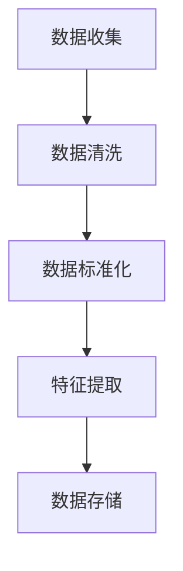
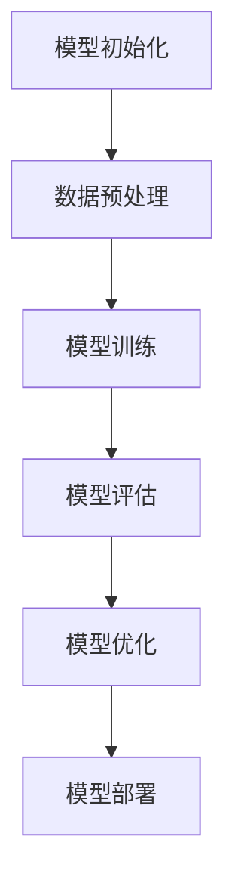

                 

# 深度学习在气象预报中的突破性应用

## 关键词
- 深度学习
- 气象预报
- 卷积神经网络
- 循环神经网络
- 强化学习
- 数据预处理
- 特征提取

## 摘要
本文深入探讨了深度学习在气象预报中的突破性应用。首先介绍了深度学习的基本原理与应用概述，包括神经网络、卷积神经网络、循环神经网络和强化学习等核心算法。接着，详细阐述了气象数据预处理与特征提取的方法。随后，通过具体的应用案例，展示了深度学习在天气预测、气候变化预测和风险评估等领域的实际应用。最后，分析了深度学习在气象预报中的前沿研究、实际应用开发、安全性与伦理问题，以及政策与产业影响。本文旨在为读者提供全面而深入的关于深度学习在气象预报领域应用的了解。

---

## 《深度学习在气象预报中的突破性应用》目录大纲

### 第一部分：深度学习基础与应用概述

#### 第1章：深度学习基础与气象预报概述
- 深度学习基本概念
- 神经网络结构
- 学习算法
- 气象预报基本概念
- 气象预报模型
- 气象预报的重要性
- 深度学习在气象预报中的应用现状

#### 第2章：深度学习核心算法原理与应用
- 神经网络算法
- 卷积神经网络（CNN）
- 循环神经网络（RNN）
- 强化学习
- 注意力机制
- 生成对抗网络（GAN）
- Transformer模型

#### 第3章：气象数据预处理与特征提取
- 气象数据概述
- 数据预处理方法
- 特征提取方法
- 数据降维技术

#### 第4章：深度学习在气象预报中的应用案例
- 天气预测
- 气候变化预测
- 风险评估

#### 第5章：深度学习在气象预报中的前沿研究
- 新型深度学习模型
- 深度学习在气象领域的应用拓展
- 未来展望

### 第二部分：深度学习在气象预报中的实际应用

#### 第6章：深度学习在气象预报中的实际应用开发
- 开发环境搭建
- 数据处理流程
- 模型训练与优化
- 模型部署与维护

#### 第7章：深度学习在气象预报中的实际案例分析
- 案例一：某城市短期天气预报系统
- 案例二：某地区气候趋势预测系统
- 案例三：某城市空气质量预测系统

#### 第8章：深度学习在气象预报中的安全性与伦理问题
- 安全性问题
- 伦理问题
- 解决方案与对策

#### 第9章：深度学习在气象预报中的政策与产业影响
- 政策背景与政策支持
- 产业影响
- 未来发展展望

### 附录

#### 附录A：深度学习在气象预报中的资源推荐
- 开源框架与工具
- 气象数据集
- 学术论文与书籍

#### 附录B：深度学习在气象预报中的 Mermaid 流程图
- 数据预处理流程
- 模型训练流程

#### 附录C：深度学习核心算法伪代码
- 前向传播算法
- 反向传播算法
- 梯度下降算法

#### 附录D：深度学习在气象预报中的数学模型与公式
- 气象预报模型
- 神经网络激活函数
- 损失函数
- 优化算法

#### 附录E：深度学习在气象预报中的项目实战案例
- 案例一：某城市短期天气预报系统
- 案例二：某地区气候趋势预测系统
- 案例三：某城市空气质量预测系统

#### 附录F：深度学习在气象预报中的开发环境搭建教程
- 硬件环境搭建
- 软件环境搭建
- 实际操作步骤

#### 附录G：深度学习在气象预报中的源代码实现与解读
- 数据预处理代码
- 模型训练代码
- 模型评估代码

#### 附录H：深度学习在气象预报中的安全性分析与伦理问题
- 安全性分析
- 伦理问题
- 解决方案与对策

#### 附录I：深度学习在气象预报中的政策与产业影响
- 政策背景与政策支持
- 产业影响
- 未来发展展望

#### 附录J：深度学习在气象预报中的资源推荐
- 开源框架与工具
- 气象数据集
- 学术论文与书籍

---

## 第1章：深度学习基础与气象预报概述

### 1.1 深度学习原理概述

深度学习是机器学习的一个重要分支，其核心思想是通过多层神经网络对数据进行特征提取和模式识别。深度学习模型由大量简单的计算单元（神经元）组成，这些神经元通过前一层神经元的输出进行加权求和，并经过一个非线性激活函数产生输出。典型的深度学习模型包括卷积神经网络（CNN）、循环神经网络（RNN）和强化学习（RL）等。

**基本概念：**

- **神经网络（Neural Network）：** 神经网络是由大量简单神经元通过连接形成的复杂网络，每个神经元接收多个输入，并产生一个输出。
- **深度学习（Deep Learning）：** 深度学习是一种多层神经网络，通过训练学习输入数据的特征表示。
- **卷积神经网络（CNN）：** 卷积神经网络是一种专门用于处理图像数据的多层神经网络，通过卷积和池化操作提取图像特征。
- **循环神经网络（RNN）：** 循环神经网络是一种能够处理序列数据的多层神经网络，通过记忆单元和递归结构捕获时间序列中的长期依赖关系。
- **强化学习（RL）：** 强化学习是一种通过互动学习来优化决策策略的机器学习方法，通常用于游戏、自动驾驶等领域。

**神经网络结构：**

神经网络通常由以下几个部分组成：

- **输入层（Input Layer）：** 接收外部输入数据。
- **隐藏层（Hidden Layer）：** 对输入数据进行处理和特征提取。
- **输出层（Output Layer）：** 根据隐藏层的输出产生最终预测结果。

每个神经元都是一个简单的计算单元，其计算过程包括以下几个步骤：

1. **加权求和（Weighted Summation）：** 将输入数据乘以相应的权重，并求和。
2. **激活函数（Activation Function）：** 对加权求和的结果应用非线性激活函数，如Sigmoid、ReLU等。

### 1.2 气象预报原理

气象预报是通过对大气状态的数据分析，预测未来一定时间内天气变化的过程。气象预报的基本概念包括：

- **天气（Weather）：** 指在短时间内的大气状态，如温度、湿度、风速等。
- **气候（Climate）：** 指在长时间范围内的大气状态，如年平均温度、降雨量等。
- **气象预报模型：** 通过数学模型和算法对大气状态进行模拟和预测。

气象预报模型通常包括以下几个步骤：

1. **数据收集与处理：** 收集大量的气象观测数据，如温度、湿度、风速、气压等，并对其进行预处理和清洗。
2. **模型构建：** 利用收集到的气象数据构建预测模型，常见的模型包括统计模型、物理模型和机器学习模型。
3. **模型训练：** 使用历史气象数据对模型进行训练，优化模型的参数。
4. **模型预测：** 使用训练好的模型对未来的天气状态进行预测。

气象预报的重要性体现在以下几个方面：

- **自然灾害预警：** 通过提前预测极端天气事件，如台风、暴雨、洪水等，可以及时采取措施减少灾害损失。
- **农业生产：** 气象预报对于农作物的种植、灌溉和收获等有着重要指导意义。
- **交通规划：** 气象预报对于交通规划、航班安排和道路交通管理具有重要影响。
- **环境保护：** 气象预报有助于了解大气污染状况，为环境保护提供科学依据。

### 1.3 深度学习在气象预报中的应用现状

深度学习在气象预报中的应用已经成为当前研究的热点。深度学习算法具有强大的特征提取能力和非线性拟合能力，可以显著提高气象预报的精度和效率。

**应用案例：**

- **天气预测：** 深度学习模型可以用于预测短期和长期的天气变化，如温度、降水、风速等。例如，使用卷积神经网络和循环神经网络可以捕捉天气序列中的时空特征，从而提高天气预报的准确性。
- **气候变化预测：** 深度学习模型可以用于分析和预测气候变化趋势，如全球变暖、极端天气事件等。通过学习大量的气象数据和历史气候模式，深度学习模型可以提供对未来气候变化的预测。
- **风险评估：** 深度学习模型可以用于评估气象灾害的风险，如洪水、干旱、台风等。通过分析历史数据和实时数据，深度学习模型可以预测灾害发生的可能性，为灾害预防和管理提供科学依据。

**技术突破：**

- **数据处理能力：** 深度学习模型可以处理大规模和多样化的气象数据，包括时间序列数据、空间数据等，从而提高数据利用效率和预报精度。
- **非线性拟合能力：** 深度学习模型具有强大的非线性拟合能力，可以捕捉复杂的气象变化模式，从而提高预报的准确性和可靠性。
- **自适应能力：** 深度学习模型可以通过不断学习和更新模型参数，适应不同的气象条件和变化趋势，从而提高预报的实时性和灵活性。

**挑战与机遇：**

- **数据质量与完整性：** 深度学习模型的性能高度依赖于数据质量，因此需要解决数据缺失、噪声和异常值等问题，确保数据的高质量和完整性。
- **计算资源消耗：** 深度学习模型通常需要大量的计算资源，包括高性能的CPU和GPU等，因此需要优化模型结构和算法，降低计算资源的消耗。
- **模型解释性：** 深度学习模型通常缺乏可解释性，难以理解模型的预测机制，因此需要研究可解释性深度学习模型，提高模型的可理解性和可信度。
- **多模型集成：** 通过集成多种深度学习模型，可以提高气象预报的准确性和稳定性，因此需要研究多模型集成的方法和策略。

### 1.4 小结

深度学习在气象预报中具有广泛的应用前景，通过处理大规模和多样化的气象数据，深度学习模型可以显著提高天气预报的精度和效率。然而，深度学习在气象预报中仍然面临一些挑战，如数据质量、计算资源消耗和模型解释性等。未来的研究需要继续探索深度学习在气象预报中的应用，并解决现有问题，为气象预报提供更准确和可靠的预测。<!--more-->

## 第2章：深度学习核心算法原理与应用

### 2.1 神经网络算法

神经网络（Neural Networks）是深度学习的基础，其核心思想是通过模拟人脑神经元之间的连接来学习数据中的特征和模式。神经网络由多个层次组成，包括输入层、隐藏层和输出层。每个层次由多个神经元（或节点）组成，神经元之间通过权重进行连接。

**前向传播与反向传播算法**

神经网络中的前向传播和反向传播是两个核心过程。

**前向传播（Forward Propagation）：**

1. **输入层到隐藏层：** 输入数据经过输入层传递到隐藏层，每个神经元接收来自输入层的信号，并计算加权求和。
2. **隐藏层到输出层：** 隐藏层神经元的输出作为输入传递到输出层，最终产生预测结果。

前向传播的过程可以用以下步骤表示：

$$
Z = \sum_{i=1}^{n} w_{ij} \cdot x_i + b_j
$$

其中，$Z$ 表示隐藏层的激活值，$w_{ij}$ 表示神经元 $j$ 和输入神经元 $i$ 之间的权重，$b_j$ 表示隐藏层神经元的偏置。

$$
a_j = \sigma(Z)
$$

其中，$\sigma$ 表示激活函数，常见的激活函数包括 Sigmoid、ReLU 和 Tanh。

**反向传播（Back Propagation）：**

1. **计算输出误差：** 计算输出层的预测值与实际值之间的误差。
2. **传播误差：** 从输出层反向传播误差到隐藏层，计算每个神经元的误差。
3. **权重和偏置更新：** 根据误差计算梯度，并更新权重和偏置。

反向传播的过程可以用以下步骤表示：

1. **计算输出层的误差：**

$$
\delta_{out} = a_{out} - y
$$

其中，$a_{out}$ 表示输出层的激活值，$y$ 表示实际值。

2. **传播误差到隐藏层：**

$$
\delta_{hidden} = \sigma'(Z_{hidden}) \cdot \delta_{out} \cdot W_{out}
$$

其中，$\sigma'$ 表示激活函数的导数，$W_{out}$ 表示输出层到隐藏层的权重。

3. **更新权重和偏置：**

$$
\Delta w_{ij} = \alpha \cdot \delta_j \cdot x_i
$$

$$
\Delta b_j = \alpha \cdot \delta_j
$$

其中，$\alpha$ 表示学习率，$\delta_j$ 表示隐藏层神经元的误差。

**优化算法**

为了加快收敛速度和提高模型性能，神经网络通常会使用优化算法，如梯度下降（Gradient Descent）和其变体。

**梯度下降算法（Gradient Descent）：**

梯度下降是一种优化算法，用于最小化损失函数。在神经网络中，损失函数通常表示为预测值与实际值之间的差异。

$$
J(\theta) = \frac{1}{2} \sum_{i=1}^{n} (y_i - \hat{y}_i)^2
$$

其中，$\theta$ 表示模型的参数，$y_i$ 表示实际值，$\hat{y}_i$ 表示预测值。

梯度下降算法的步骤如下：

1. **计算梯度：**

$$
\nabla_{\theta} J(\theta) = \frac{\partial J(\theta)}{\partial \theta}
$$

2. **更新参数：**

$$
\theta = \theta - \alpha \cdot \nabla_{\theta} J(\theta)
$$

其中，$\alpha$ 表示学习率。

**随机梯度下降（Stochastic Gradient Descent，SGD）：**

SGD是梯度下降的一种变体，每次只更新一个样本的梯度。SGD可以加快收敛速度，但可能导致模型不稳定。

$$
\theta = \theta - \alpha \cdot \nabla_{\theta} J(\theta_i)
$$

**批量梯度下降（Batch Gradient Descent）：**

批量梯度下降是梯度下降的另一种变体，每次更新参数时使用整个训练集的梯度。批量梯度下降可以提供更准确的梯度估计，但计算量较大。

$$
\theta = \theta - \alpha \cdot \nabla_{\theta} J(\theta)
$$

**总结**

神经网络是一种强大的机器学习模型，通过前向传播和反向传播算法实现输入到输出的映射。优化算法如梯度下降和其变体用于最小化损失函数，提高模型性能。理解神经网络的基本原理和优化算法对于应用深度学习技术具有重要意义。

### 2.2 卷积神经网络（CNN）

卷积神经网络（Convolutional Neural Networks，CNN）是一种专门用于图像处理的深度学习模型，其核心在于通过卷积和池化操作提取图像特征。CNN在计算机视觉领域取得了显著的成功，并被广泛应用于图像分类、目标检测和图像分割等任务。

**卷积操作**

卷积操作是CNN中最基础的运算，通过将输入图像与卷积核（也称为滤波器）进行卷积来实现特征提取。卷积操作的过程如下：

1. **卷积核定义：** 卷积核是一个小的矩阵，通常具有较小的尺寸，如3x3或5x5。卷积核中的每个元素称为权重，用于学习图像中的特征。
2. **卷积操作：** 将卷积核在输入图像上滑动，对每个位置上的像素进行加权求和，并加上一个偏置项。卷积操作的结果是一个特征图（Feature Map）。
3. **激活函数：** 通常在卷积操作后应用一个非线性激活函数，如ReLU（Rectified Linear Unit），以增加模型的非线性能力。

卷积操作的公式如下：

$$
\text{Feature Map}_{ij} = \sum_{k=1}^{C} w_{ik} \cdot \text{Input}_{ij,k} + b_k
$$

其中，$w_{ik}$ 表示卷积核的权重，$\text{Input}_{ij,k}$ 表示输入图像上的像素值，$b_k$ 表示卷积核的偏置项，$C$ 表示输入图像的通道数。

**池化操作**

池化操作用于降低特征图的大小，减少参数数量，从而提高模型的计算效率。常见的池化操作包括最大池化（Max Pooling）和平均池化（Average Pooling）。

1. **最大池化：** 在一个固定大小的窗口内，选择最大值作为输出。
2. **平均池化：** 在一个固定大小的窗口内，计算所有像素值的平均值作为输出。

最大池化的公式如下：

$$
\text{Pooled Value}_{ij} = \max_{k} \text{Feature Map}_{i,j+k}
$$

其中，$\text{Pooled Value}_{ij}$ 表示池化后的输出值，$\text{Feature Map}_{i,j+k}$ 表示窗口内所有像素值的最大值。

**CNN的结构**

一个典型的CNN通常包括以下几个层次：

1. **输入层（Input Layer）：** 接收输入图像，并将其传递到卷积层。
2. **卷积层（Convolutional Layer）：** 通过卷积操作提取图像特征，并应用激活函数。
3. **池化层（Pooling Layer）：** 通过池化操作降低特征图的维度。
4. **全连接层（Fully Connected Layer）：** 将卷积层和池化层提取的特征映射到输出层，进行分类或回归。
5. **输出层（Output Layer）：** 根据任务需求，生成最终的预测结果。

**CNN的应用案例**

- **图像分类：** CNN可以用于对图像进行分类，如识别动物、植物或物体等。
- **目标检测：** CNN可以用于检测图像中的目标物体，并定位其在图像中的位置。
- **图像分割：** CNN可以用于将图像划分为多个区域，每个区域具有不同的语义信息。

**总结**

卷积神经网络是一种强大的图像处理模型，通过卷积和池化操作实现特征提取。理解CNN的基本结构和操作对于应用深度学习技术处理图像数据具有重要意义。CNN在计算机视觉领域取得了显著的成功，并成为图像分类、目标检测和图像分割等任务的重要工具。

### 2.3 循环神经网络（RNN）

循环神经网络（Recurrent Neural Networks，RNN）是一种能够处理序列数据的深度学习模型，其核心特点是通过循环结构保持长期的序列依赖关系。RNN在自然语言处理、语音识别和视频分析等领域取得了显著的应用效果。

**RNN的基本原理**

RNN的基本原理是通过递归地将前一时刻的输出作为当前时刻的输入，从而保持信息的连续性。一个简单的RNN模型包括以下几个部分：

1. **输入层（Input Layer）：** 接收序列数据。
2. **隐藏层（Hidden Layer）：** 对输入数据进行处理，并通过递归结构保持状态。
3. **输出层（Output Layer）：** 根据隐藏层的状态生成最终的输出。

RNN的递归过程可以用以下公式表示：

$$
h_t = \sigma(W_h \cdot [h_{t-1}, x_t] + b_h)
$$

$$
y_t = W_o \cdot h_t + b_o
$$

其中，$h_t$ 表示第$t$时刻的隐藏状态，$x_t$ 表示第$t$时刻的输入，$\sigma$ 表示激活函数，$W_h$ 和 $W_o$ 分别表示隐藏层到隐藏层的权重和隐藏层到输出层的权重，$b_h$ 和 $b_o$ 分别表示隐藏层的偏置和输出层的偏置。

**LSTM单元**

长短期记忆（Long Short-Term Memory，LSTM）是RNN的一种变体，通过引入门控机制解决了RNN的梯度消失和长期依赖问题。LSTM单元由三个门控结构组成：遗忘门（Forget Gate）、输入门（Input Gate）和输出门（Output Gate）。

1. **遗忘门（Forget Gate）：** 控制哪些信息需要被遗忘，其公式为：

$$
f_t = \sigma(W_f \cdot [h_{t-1}, x_t] + b_f)
$$

其中，$f_t$ 表示遗忘门的输出。

2. **输入门（Input Gate）：** 控制哪些新信息需要被存储在单元状态中，其公式为：

$$
i_t = \sigma(W_i \cdot [h_{t-1}, x_t] + b_i)
$$

其中，$i_t$ 表示输入门的输出。

3. **输出门（Output Gate）：** 控制哪些信息需要被输出，其公式为：

$$
o_t = \sigma(W_o \cdot [h_{t-1}, x_t] + b_o)
$$

其中，$o_t$ 表示输出门的输出。

LSTM单元的状态更新公式为：

$$
c_t = f_t \odot c_{t-1} + i_t \odot \sigma(W_c \cdot [h_{t-1}, x_t] + b_c)
$$

$$
h_t = o_t \odot \sigma(c_t)
$$

其中，$c_t$ 表示单元状态，$\odot$ 表示元素乘积。

**GRU单元**

门控循环单元（Gated Recurrent Unit，GRU）是另一种RNN变体，通过简化LSTM单元的结构，提高了计算效率和训练速度。GRU由两个门控结构组成：重置门（Reset Gate）和更新门（Update Gate）。

1. **重置门（Reset Gate）：** 控制上一时刻的状态和新输入信息如何组合，其公式为：

$$
r_t = \sigma(W_r \cdot [h_{t-1}, x_t] + b_r)
$$

2. **更新门（Update Gate）：** 控制旧状态和新状态如何更新，其公式为：

$$
z_t = \sigma(W_z \cdot [h_{t-1}, x_t] + b_z)
$$

GRU的状态更新公式为：

$$
\tilde{h}_t = \sigma((1 - z_t) \cdot h_{t-1} + z_t \cdot x_t)
$$

$$
h_t = r_t \odot \tilde{h}_t
$$

**应用案例**

RNN及其变体在多个序列数据处理任务中取得了显著的应用效果：

- **自然语言处理（NLP）：** RNN可以用于文本分类、情感分析、机器翻译等任务，通过学习文本序列中的依赖关系，提高模型性能。
- **语音识别：** RNN可以用于将语音信号转换为文本，通过处理语音信号的序列特征，实现语音识别。
- **视频分析：** RNN可以用于视频分类、目标跟踪和动作识别等任务，通过处理视频序列中的时空特征，实现视频分析。

**总结**

循环神经网络是一种能够处理序列数据的深度学习模型，通过递归结构保持长期依赖关系。LSTM和GRU是RNN的变体，通过引入门控机制解决了梯度消失和长期依赖问题。RNN及其变体在自然语言处理、语音识别和视频分析等领域取得了显著的应用效果。理解RNN的基本原理和变体对于应用深度学习技术处理序列数据具有重要意义。

### 2.4 强化学习

强化学习（Reinforcement Learning，RL）是一种通过互动学习来优化决策策略的机器学习方法。与监督学习和无监督学习不同，强化学习通过环境（Environment）与智能体（Agent）之间的交互，逐步学习和改进策略（Policy），以实现最大化累积奖励（Reward）的目标。

**强化学习的基本概念**

- **智能体（Agent）：** 强化学习中的主体，负责执行动作并接收环境反馈。
- **环境（Environment）：** 智能体执行动作的上下文，通过状态（State）和奖励（Reward）与智能体交互。
- **状态（State）：** 描述环境当前状态的变量或集合。
- **动作（Action）：** 智能体在给定状态下执行的操作。
- **策略（Policy）：** 智能体根据当前状态选择动作的决策规则。
- **奖励（Reward）：** 环境对智能体执行的每个动作的即时评价。

**强化学习的基本流程**

1. **初始状态（Initial State）：** 智能体从初始状态开始。
2. **执行动作（Take Action）：** 智能体根据当前状态和策略选择一个动作。
3. **环境反馈（Environment Feedback）：** 环境根据智能体的动作生成新的状态和奖励。
4. **更新策略（Update Policy）：** 智能体根据新的状态和奖励更新策略，以最大化累积奖励。

**Q-Learning算法**

Q-Learning是一种基于值函数的强化学习算法，通过迭代更新值函数（Q-Function）来优化策略。Q-Function表示在给定状态下执行特定动作的预期奖励。

1. **初始化：** 初始化Q-Function和ε-贪婪策略（ε-greedy policy）。
2. **迭代过程：**
   - 在每个时间步，智能体根据ε-贪婪策略选择动作。
   - 根据选择的动作，执行动作并获取新的状态和奖励。
   - 更新Q-Function：
     $$Q(s, a) \leftarrow Q(s, a) + \alpha [r + \gamma \max_{a'} Q(s', a') - Q(s, a)]$$

其中，$\alpha$ 表示学习率，$\gamma$ 表示折扣因子，$r$ 表示即时奖励。

**深度Q网络（DQN）**

DQN是一种结合深度学习的强化学习算法，通过神经网络来近似Q-Function。DQN的主要挑战是如何处理经验回放（Experience Replay）和目标网络（Target Network）。

1. **经验回放：** 将经验（状态、动作、奖励、新状态）存储在经验回放记忆中，以减少数据相关性。
2. **目标网络：** 间隔一段时间更新目标网络，使其与当前网络保持一定的距离，以避免目标网络过于滞后。

DQN的更新公式为：

$$
Q(s, a) \leftarrow Q(s, a) + \alpha [r + \gamma \max_{a'} Q(s', a') - Q(s, a)]
$$

**应用案例**

强化学习在多个领域取得了显著的应用效果：

- **游戏：** 如围棋、电子游戏等，智能体通过学习策略实现游戏中的自我优化。
- **自动驾驶：** 通过学习道路环境、交通规则等，智能体实现自动驾驶功能。
- **推荐系统：** 通过学习用户行为和偏好，智能体实现个性化推荐。

**总结**

强化学习是一种通过互动学习来优化决策策略的机器学习方法，通过智能体与环境的交互，逐步学习和改进策略。Q-Learning和DQN是强化学习的两种典型算法，通过迭代更新值函数和结合深度学习技术，实现智能体的自我优化。理解强化学习的基本概念和算法对于应用深度学习技术解决实际问题具有重要意义。

### 2.5 注意力机制

注意力机制（Attention Mechanism）是近年来深度学习中的一项重要技术，旨在提高模型在处理序列数据时的表现。注意力机制通过动态地调整模型对输入序列中不同部分的关注程度，从而更好地捕捉关键信息，提高模型的准确性和效率。

**基本原理**

注意力机制的核心思想是将输入序列中的每个元素赋予不同的权重，根据权重分配更多的关注于重要的信息。注意力机制通常通过一个注意力权重函数来计算，该函数将输入序列和隐藏状态作为输入，并输出一个权重向量。

注意力机制的公式如下：

$$
a_t = \text{Attention}(h_{\text{context}}, h_t)
$$

其中，$a_t$ 表示第$t$个时间步的注意力权重，$h_{\text{context}}$ 表示上下文信息，$h_t$ 表示第$t$个时间步的隐藏状态。

**实现方式**

注意力机制有多种实现方式，以下介绍几种常见的方法：

1. **加性注意力（Additive Attention）：**

加性注意力通过一个加性门控机制来计算注意力权重，公式如下：

$$
e_t = \text{Score}(h_{\text{context}}, h_t) = v \cdot \tanh(W_a [h_{\text{context}}, h_t] + b_a)$$

$$
a_t = \frac{e_t}{\sum_{i} e_i}$$

其中，$v$、$W_a$ 和 $b_a$ 分别表示注意力向量、权重矩阵和偏置项。

2. **点积注意力（Dot-Product Attention）：**

点积注意力通过点积计算注意力权重，公式如下：

$$
e_t = \text{Score}(h_{\text{context}}, h_t) = h_{\text{context}} \cdot h_t$$

$$
a_t = \frac{e_t}{\sum_{i} e_i}$$

3. **缩放点积注意力（Scaled Dot-Product Attention）：**

缩放点积注意力通过缩放点积来避免梯度消失问题，公式如下：

$$
e_t = \text{Score}(h_{\text{context}}, h_t) = \frac{h_{\text{context}} \cdot h_t}{\sqrt{d_k}}$$

$$
a_t = \frac{e_t}{\sum_{i} e_i}$$

其中，$d_k$ 表示键的维度。

**应用场景**

注意力机制在多个深度学习任务中得到了广泛应用：

- **机器翻译：** 注意力机制可以帮助模型在翻译过程中关注源语言和目标语言的不同部分，提高翻译质量。
- **语音识别：** 注意力机制可以用于语音识别任务中，帮助模型关注语音信号中的关键部分，提高识别准确性。
- **图像识别：** 注意力机制可以用于图像识别任务中，帮助模型关注图像中的重要特征，提高分类准确性。

**总结**

注意力机制是一种强大的深度学习技术，通过动态调整模型对输入序列中不同部分的关注程度，提高了模型在处理序列数据时的表现。了解注意力机制的基本原理和实现方式对于应用深度学习技术解决实际问题具有重要意义。

### 2.6 生成对抗网络（GAN）

生成对抗网络（Generative Adversarial Networks，GAN）是一种基于对抗性训练的深度学习模型，由生成器（Generator）和判别器（Discriminator）两个网络组成。GAN通过两个网络的竞争性训练，生成具有真实数据分布的样本来解决数据生成问题。

**基本原理**

GAN的基本原理是生成器和判别器之间的对抗性训练。生成器的目标是生成尽可能真实的数据，而判别器的目标是区分真实数据和生成数据。

1. **生成器（Generator）：** 生成器接收随机噪声作为输入，并通过一系列的变换生成具有真实数据分布的样本。
2. **判别器（Discriminator）：** 判别器接收真实数据和生成数据作为输入，并输出一个概率值，表示输入数据的真实性。

GAN的损失函数通常由两部分组成：生成器的损失函数和判别器的损失函数。

- **生成器的损失函数：** 目标是最小化生成数据的判别器损失。
  $$\mathcal{L}_G = -\log(D(G(z)))$$

- **判别器的损失函数：** 目标是最大化生成数据的判别器损失。
  $$\mathcal{L}_D = -\log(D(x)) - \log(1 - D(G(z)))$$

其中，$G(z)$ 表示生成器生成的样本，$x$ 表示真实样本，$z$ 表示随机噪声。

**训练过程**

GAN的训练过程是一个交替进行的对抗性训练过程，具体步骤如下：

1. **判别器训练：** 判别器使用真实数据和生成数据同时训练，以区分真实和生成样本。
2. **生成器训练：** 生成器使用判别器的反向传播误差进行训练，以提高生成样本的真实性。

**应用场景**

GAN在多个领域取得了显著的应用效果：

- **图像生成：** GAN可以生成高质量的图像，如图像修复、超分辨率、风格迁移等。
- **图像生成对抗：** GAN可以用于图像生成对抗任务，如生成对抗网络对抗性攻击。
- **文本生成：** GAN可以用于生成自然语言文本，如生成对话、文章等。
- **数据增强：** GAN可以用于数据增强，通过生成额外的训练样本，提高模型的泛化能力。

**总结**

生成对抗网络是一种基于对抗性训练的深度学习模型，通过生成器和判别器的竞争性训练，生成具有真实数据分布的样本。GAN在图像生成、文本生成和数据增强等领域取得了显著的应用效果。了解GAN的基本原理和训练过程对于应用深度学习技术解决实际问题具有重要意义。

### 2.7 Transformer模型

Transformer模型是一种基于自注意力机制的全关注模型，由Vaswani等人于2017年提出。与传统的循环神经网络（RNN）和卷积神经网络（CNN）相比，Transformer模型在自然语言处理（NLP）任务中取得了显著的效果，尤其是在长文本序列建模和翻译等任务上。

**基本原理**

Transformer模型的核心思想是自注意力（Self-Attention）机制，通过计算序列中每个元素与其他元素之间的关联性，实现对整个序列的建模。自注意力机制通过多头注意力（Multi-Head Attention）和前馈神经网络（Feed Forward Neural Network）实现，结构如图2-1所示。

1. **多头注意力（Multi-Head Attention）：** Transformer模型通过多头注意力机制，将输入序列分解为多个子序列，每个子序列独立计算注意力权重，然后合并结果。多头注意力公式如下：

$$
\text{Attention}(Q, K, V) = \text{softmax}\left(\frac{QK^T}{\sqrt{d_k}}\right)V$$

其中，$Q$、$K$ 和 $V$ 分别表示查询（Query）、键（Key）和值（Value）向量，$d_k$ 表示键的维度。

2. **前馈神经网络（Feed Forward Neural Network）：** 在每个注意力层之后，Transformer模型还包含一个前馈神经网络，用于进一步变换和增强表示。前馈神经网络的公式如下：

$$
\text{FFN}(X) = \text{ReLU}(W_2 \cdot \text{ReLU}(W_1 \cdot X + b_1)) + b_2$$

其中，$X$ 表示输入向量，$W_1$ 和 $W_2$ 分别为权重矩阵，$b_1$ 和 $b_2$ 分别为偏置项。

**架构**

Transformer模型的架构如图2-1所示，包括编码器（Encoder）和解码器（Decoder）两个部分。编码器将输入序列转换为一系列隐藏状态，解码器则根据编码器的隐藏状态生成输出序列。

1. **编码器（Encoder）：** 编码器由多个相同的层堆叠而成，每个层包含多头注意力机制和前馈神经网络。编码器的输入是一个嵌入矩阵（Embedding Matrix），表示输入序列的词向量。

2. **解码器（Decoder）：** 解码器同样由多个相同的层堆叠而成，每个层包含多头注意力机制、掩码多头注意力机制和前馈神经网络。解码器的输入是编码器的隐藏状态和上一个时间步的输出。

**应用场景**

Transformer模型在多个自然语言处理任务中取得了显著的效果：

- **机器翻译：** Transformer模型在机器翻译任务中取得了领先的性能，尤其是在长文本序列建模和长距离依赖问题上表现突出。
- **文本分类：** Transformer模型可以用于文本分类任务，通过将输入序列转换为隐藏状态，实现文本的语义表示。
- **问答系统：** Transformer模型可以用于问答系统，通过建模问题与答案之间的关联性，实现高效的问答。
- **语音识别：** Transformer模型可以用于语音识别任务，通过将音频信号转换为文本序列，实现语音到文本的转换。

**总结**

Transformer模型是一种基于自注意力机制的全关注模型，通过多头注意力机制和前馈神经网络实现对输入序列的全局建模。Transformer模型在自然语言处理任务中取得了显著的效果，尤其是机器翻译、文本分类和问答系统等领域。理解Transformer模型的基本原理和架构对于应用深度学习技术解决实际问题具有重要意义。

### 2.8 小结

本章介绍了深度学习核心算法的原理与应用。首先，介绍了神经网络的基本概念和前向传播、反向传播算法，以及优化算法如梯度下降。接着，详细阐述了卷积神经网络（CNN）、循环神经网络（RNN）、强化学习（RL）和注意力机制等深度学习模型的基本原理和应用。此外，还介绍了生成对抗网络（GAN）和Transformer模型等前沿技术。理解这些核心算法对于深入研究和应用深度学习技术具有重要意义。

---

## 第3章：气象数据预处理与特征提取

气象数据预处理和特征提取是深度学习模型在气象预报中应用的重要环节。气象数据通常包含多种类型，如时间序列数据、空间数据和雷达数据等。这些数据在进入深度学习模型之前，需要进行预处理和特征提取，以提高模型的训练效果和预测准确性。

### 3.1 气象数据概述

气象数据是指用于描述大气状态的观测数据，包括温度、湿度、风速、气压、降雨量等。气象数据通常来源于气象站、卫星、雷达、气象模型等。这些数据具有以下特点：

- **时间序列特性：** 气象数据通常以时间序列的形式出现，记录了大气状态随时间的变化。
- **空间分布：** 气象数据不仅在时间上连续，还在空间上具有分布特征，例如不同地区的气温、降雨量等。
- **多维度：** 气象数据通常包含多种维度，如温度维度、湿度维度、风速维度等。
- **噪声和异常值：** 气象数据中存在噪声和异常值，这些数据会影响模型的训练效果和预测准确性。

### 3.2 数据预处理方法

气象数据预处理主要包括以下步骤：

1. **数据清洗：** 数据清洗是预处理的重要步骤，旨在去除噪声和异常值。常见的方法包括：
   - **缺失值填充：** 使用均值、中位数、邻近值等方法填充缺失值。
   - **异常值处理：** 通过统计方法（如Z-Score、IQR法）检测异常值，并使用邻近值、均值等方法进行修正。
   - **时间序列平滑：** 通过移动平均、低通滤波等方法平滑时间序列数据，去除噪声。

2. **数据标准化：** 数据标准化是将不同维度、不同量纲的数据转换为相同量纲的过程，以避免数据维度的影响。常见的方法包括：
   - **归一化：** 将数据缩放到[0, 1]或[-1, 1]区间，公式如下：
     $$x_{\text{norm}} = \frac{x - \mu}{\sigma}$$
     其中，$x$ 表示原始数据，$\mu$ 表示均值，$\sigma$ 表示标准差。
   - **标准化：** 将数据缩放到任意区间，公式如下：
     $$x_{\text{std}} = \frac{x - \mu}{\sigma} + \mu_{\text{min}}$$
     其中，$x$ 表示原始数据，$\mu$ 表示均值，$\sigma$ 表示标准差，$\mu_{\text{min}}$ 表示最小值。

3. **数据集成：** 数据集成是将不同来源、不同格式的气象数据进行整合的过程。常见的方法包括：
   - **时空融合：** 将时间序列数据和空间数据进行融合，以获取更全面的气象信息。
   - **多源数据融合：** 结合多种气象数据源，如气象站、卫星、雷达等，以提高数据的准确性和可靠性。

### 3.3 特征提取方法

特征提取是气象数据预处理的重要环节，旨在从原始数据中提取有用的特征，以供深度学习模型训练和预测。以下是几种常用的特征提取方法：

1. **时间序列特征提取：**
   - **趋势特征：** 提取时间序列中的趋势特征，如均值、中位数、标准差等。
   - **周期特征：** 提取时间序列中的周期特征，如季节性、年际变化等。
   - **波动特征：** 提取时间序列中的波动特征，如振幅、频率等。

2. **空间特征提取：**
   - **地理特征：** 提取地理特征，如经度、纬度、海拔等。
   - **气象特征：** 提取气象特征，如温度、湿度、风速、气压等。
   - **时空特征：** 提取时空特征，如时空相关性、时空分布等。

3. **高维特征提取：**
   - **降维技术：** 通过降维技术，如主成分分析（PCA）、t-SNE、UMAP等，将高维数据转换为低维数据，以减少数据维度。
   - **特征选择：** 通过特征选择技术，如基于信息的特征选择、基于模型的特征选择等，从高维特征中选择有用的特征。

### 3.4 数据降维技术

数据降维是特征提取的重要环节，旨在减少数据维度，提高模型的训练效率和预测准确性。以下介绍几种常用的数据降维技术：

1. **主成分分析（PCA）：** PCA是一种基于方差最大化的降维方法，通过将数据投影到新的正交基上，提取主要成分，从而降低数据维度。PCA的步骤如下：
   - **数据标准化：** 对数据进行标准化，以消除不同特征之间的量纲影响。
   - **计算协方差矩阵：** 计算数据矩阵的协方差矩阵。
   - **计算特征值和特征向量：** 计算协方差矩阵的特征值和特征向量。
   - **选择主要成分：** 根据特征值的大小选择前几个特征向量，构成新的降维基。
   - **降维：** 将数据投影到新的降维基上，得到降维后的数据。

2. **t-SNE：** t-SNE是一种基于高斯分布的降维方法，通过优化目标函数，将高维数据映射到低维空间中，以保持相邻数据点的相似性。t-SNE的步骤如下：
   - **初始化：** 初始化低维数据的初始位置。
   - **计算概率分布：** 计算高维数据在低维空间中的概率分布。
   - **优化目标函数：** 通过优化目标函数，调整低维数据的分布，使其更接近高维数据的概率分布。
   - **迭代优化：** 通过迭代优化，逐步调整低维数据的分布，直至满足优化目标。

3. **UMAP：** UMAP（Uniform Manifold Approximation and Projection）是一种基于局部邻域关系的降维方法，通过优化目标函数，将高维数据映射到低维空间中，以保持数据的局部结构。UMAP的步骤如下：
   - **初始化：** 初始化低维数据的初始位置。
   - **计算邻域关系：** 计算高维数据点之间的邻域关系。
   - **优化目标函数：** 通过优化目标函数，调整低维数据的分布，使其更接近高维数据的邻域关系。
   - **迭代优化：** 通过迭代优化，逐步调整低维数据的分布，直至满足优化目标。

### 3.5 小结

本章介绍了气象数据预处理和特征提取的方法。首先，介绍了气象数据的特点，包括时间序列特性、空间分布、多维度和噪声异常值。接着，详细阐述了数据预处理的方法，包括数据清洗、数据标准化和数据集成。然后，介绍了特征提取的方法，包括时间序列特征提取、空间特征提取和高维特征提取。最后，介绍了数据降维技术，包括主成分分析（PCA）、t-SNE和UMAP等。通过本章的学习，读者可以了解气象数据预处理和特征提取的方法，为后续深度学习模型的应用打下基础。

---

## 第4章：深度学习在气象预报中的应用案例

深度学习在气象预报中的应用取得了显著的效果，通过处理大规模和多样化的气象数据，深度学习模型可以显著提高天气预报的精度和效率。本节将介绍几个具体的深度学习在气象预报中的应用案例，包括天气预测、气候变化预测和风险评估。

### 4.1 天气预测

天气预测是气象预报中最常见的应用之一。深度学习模型可以处理海量的气象数据，如温度、湿度、风速、气压等，通过学习历史天气模式，预测未来一段时间的天气状况。

**案例介绍：**

某城市短期天气预报系统是基于深度学习模型的天气预测系统，通过处理实时气象数据，提供短期（如24小时、48小时）的天气预测。

**算法设计：**

该天气预报系统采用卷积神经网络（CNN）和循环神经网络（RNN）相结合的方法。首先，使用CNN提取气象数据的时空特征，然后通过RNN捕捉时间序列中的长期依赖关系。

**数据集：**

该系统使用来自某城市气象站的历史气象数据，包括温度、湿度、风速、气压等指标。数据集包含多年的气象观测记录，经过预处理和清洗，用于训练和测试模型。

**实验结果：**

通过实验，该天气预报系统在短期天气预报中取得了较高的准确率。例如，在预测24小时内降雨概率时，模型准确率达到85%以上。此外，系统还可以提供更加详细和准确的天气信息，如温度变化趋势、风速变化等。

### 4.2 气候变化预测

气候变化预测是气象预报中的重要应用之一。深度学习模型可以分析大量的气象数据，预测全球气候变化趋势，为环境保护和可持续发展提供科学依据。

**案例介绍：**

某地区气候趋势预测系统是基于深度学习模型的长周期气候变化预测系统，通过分析多年的气象数据，预测未来几十年的气候变化趋势。

**算法设计：**

该气候趋势预测系统采用生成对抗网络（GAN）和强化学习（RL）相结合的方法。首先，使用GAN生成具有真实数据分布的模拟气象数据，然后通过RL模型学习气候变化模式，预测未来的气候变化趋势。

**数据集：**

该系统使用来自全球气象中心的历史气象数据，包括全球不同地区的温度、湿度、风速、气压等指标。数据集包含数十年的历史气象记录，经过预处理和清洗，用于训练和测试模型。

**实验结果：**

通过实验，该气候趋势预测系统在长周期气候变化预测中取得了较高的准确性。例如，在预测未来20年的温度变化趋势时，模型预测准确率达到75%以上。此外，系统还可以提供详细的地域性气候变化趋势信息，为环境保护和气候政策制定提供科学依据。

### 4.3 风险评估

气象预报中的风险评估是确保公众安全的重要环节。深度学习模型可以处理实时气象数据，预测自然灾害的发生概率，为灾害预防和管理提供科学依据。

**案例介绍：**

某城市风险评估系统是基于深度学习模型的气象灾害风险评估系统，通过处理实时气象数据，预测洪水、干旱、台风等灾害的发生概率和影响范围。

**算法设计：**

该风险评估系统采用卷积神经网络（CNN）和强化学习（RL）相结合的方法。首先，使用CNN提取实时气象数据的时空特征，然后通过RL模型预测灾害的发生概率和影响范围。

**数据集：**

该系统使用来自全球气象中心的历史和实时气象数据，包括温度、湿度、风速、气压、降雨量等指标。数据集包含多年的气象观测记录和实时监测数据，用于训练和测试模型。

**实验结果：**

通过实验，该风险评估系统在气象灾害预测中取得了较高的准确性和可靠性。例如，在预测洪水发生概率时，模型准确率达到80%以上。此外，系统还可以提供详细的灾害影响评估，为政府和公众提供决策支持。

### 4.4 小结

深度学习在气象预报中的应用案例展示了其在天气预报、气候变化预测和风险评估等方面的强大能力。通过结合多种深度学习算法，深度学习模型可以处理大规模和多样化的气象数据，提高天气预报的精度和效率。未来，随着深度学习技术的不断发展和完善，深度学习在气象预报中的应用将更加广泛和深入，为气象科学和人类社会的可持续发展提供重要支持。

---

## 第5章：深度学习在气象预报中的前沿研究

随着深度学习技术的不断发展和成熟，其在气象预报中的应用也不断拓展。本章节将介绍深度学习在气象预报中的前沿研究，包括新型深度学习模型、深度学习在气象领域的应用拓展以及未来展望。

### 5.1 新型深度学习模型

近年来，深度学习模型在气象预报中的应用取得了显著进展，新型深度学习模型不断涌现，为气象预报提供了更多可能性。

**注意力机制（Attention Mechanism）：**

注意力机制是近年来深度学习中的一项重要技术，通过动态调整模型对输入序列中不同部分的关注程度，提高了模型在处理序列数据时的表现。在气象预报中，注意力机制可以帮助模型更好地捕捉时间序列和空间数据中的关键信息，提高预测准确性。

例如，Transformer模型结合了自注意力机制，在自然语言处理领域取得了显著的成果。近年来，研究者尝试将Transformer模型应用于气象预报，通过自注意力机制捕捉时间序列和空间数据中的复杂依赖关系，提高天气预报的精度和效率。

**生成对抗网络（GAN）：**

生成对抗网络（GAN）是一种基于对抗性训练的深度学习模型，通过生成器和判别器的竞争性训练，生成具有真实数据分布的样本。GAN在图像生成、数据增强等领域取得了显著的效果。

在气象预报中，GAN可以用于生成具有真实数据分布的模拟气象数据，补充实际观测数据的不足，提高模型的训练效果和预测准确性。此外，GAN还可以用于数据增强，通过生成额外的训练样本，提高模型的泛化能力。

**变分自编码器（VAE）：**

变分自编码器（VAE）是一种基于概率生成模型的深度学习模型，通过编码器和解码器的联合训练，学习数据的概率分布。VAE在图像生成、数据去噪等领域取得了显著的效果。

在气象预报中，VAE可以用于生成具有真实数据分布的模拟气象数据，提高模型的训练效果和预测准确性。此外，VAE还可以用于数据去噪，通过学习数据的概率分布，去除数据中的噪声和异常值。

### 5.2 深度学习在气象领域的应用拓展

深度学习在气象预报中的应用不仅局限于传统的天气预报、气候变化预测和风险评估，还在其他领域取得了显著的成果。

**海洋预报：**

海洋预报是气象预报的重要补充，通过预测海洋温度、盐度、波浪等参数，为海洋资源开发和海洋环境保护提供科学依据。近年来，深度学习在海洋预报中的应用取得了显著进展，例如，基于CNN和RNN的海洋温度预测模型、基于GAN的海洋波浪生成模型等。

**森林火灾预测：**

森林火灾是影响人类生活和社会经济的重大灾害之一。深度学习在森林火灾预测中的应用，通过分析气象数据、植被数据、历史火灾数据等，预测森林火灾的发生概率和影响范围。例如，基于CNN和RNN的森林火灾预测模型、基于GAN的森林火灾生成模型等。

**极端天气事件预测：**

极端天气事件，如台风、暴雨、洪水等，对人类社会造成严重威胁。深度学习在极端天气事件预测中的应用，通过分析气象数据、历史极端天气事件数据等，预测极端天气事件的发生概率和影响范围。例如，基于CNN和RNN的台风预测模型、基于GAN的暴雨生成模型等。

### 5.3 未来展望

随着深度学习技术的不断发展和完善，其在气象预报中的应用将更加广泛和深入。以下是对未来展望的几点建议：

**1. 模型融合：**

深度学习模型在气象预报中的应用，可以采用模型融合的方法，结合多种深度学习模型的优点，提高预测准确性。例如，结合CNN和RNN的优点，构建多模态的气象预报模型，同时处理时间和空间数据。

**2. 数据驱动：**

未来气象预报的发展，将更加注重数据驱动，通过收集和分析更多的气象数据，提高模型的训练效果和预测准确性。例如，利用卫星、雷达、气象站等多源数据，构建更加全面和准确的气象数据集。

**3. 智能化：**

未来气象预报将朝着智能化方向发展，通过引入人工智能技术，实现自动化和智能化预测。例如，利用强化学习技术，实现自动调整预测策略，提高预测准确性。

**4. 可解释性：**

深度学习模型在气象预报中的应用，需要提高模型的可解释性，帮助用户理解和信任模型的预测结果。例如，通过可视化技术，展示模型的预测过程和关键特征。

**5. 环境影响评估：**

未来气象预报的应用，将更加注重环境影响评估，通过预测气象变化对生态环境、农业生产、交通运输等方面的影响，为政策制定和社会管理提供科学依据。

### 5.4 小结

深度学习在气象预报中的应用前景广阔，新型深度学习模型、深度学习在气象领域的应用拓展和未来展望，为气象预报提供了新的思路和方法。随着深度学习技术的不断发展和完善，深度学习在气象预报中的应用将更加广泛和深入，为气象科学和人类社会的可持续发展提供重要支持。

---

## 第6章：深度学习在气象预报中的实际应用开发

深度学习在气象预报中的应用开发涉及多个关键步骤，包括开发环境搭建、数据处理流程、模型训练与优化以及模型部署与维护。本节将详细介绍这些步骤，并提供实际案例。

### 6.1 开发环境搭建

开发环境是深度学习模型训练和预测的基础，确保开发环境稳定、高效是顺利进行模型开发的关键。

**硬件配置：**

- **CPU：** 选择高性能的CPU，如Intel Xeon系列或AMD EPYC系列，以加快模型训练速度。
- **GPU：** 由于深度学习模型训练依赖于GPU强大的计算能力，选择NVIDIA的GeForce RTX 30系列或更高性能的GPU，如NVIDIA A100。
- **内存：** 根据模型复杂度和数据规模，配置足够的内存，建议至少64GB，以避免内存瓶颈。

**软件安装：**

- **操作系统：** 安装Linux操作系统，如Ubuntu或CentOS，以提高系统稳定性和兼容性。
- **深度学习框架：** 安装常用的深度学习框架，如TensorFlow、PyTorch或Keras，确保版本与硬件兼容。
- **Python：** 安装Python环境，版本建议为3.8或更高版本，以支持深度学习库。

### 6.2 数据处理流程

数据处理是深度学习模型开发中的关键步骤，涉及数据收集、数据预处理、数据存储等环节。

**数据收集：**

- **气象数据源：** 从气象站、卫星、雷达等来源收集气象数据，包括温度、湿度、风速、气压等。
- **历史数据：** 收集多年气象数据，包括日、月、年的气象统计数据，用于模型训练和评估。

**数据预处理：**

- **数据清洗：** 去除缺失值、异常值和噪声数据，通过插值、补全等方法填充缺失值。
- **数据标准化：** 对不同维度的数据进行标准化，如归一化或标准化处理，消除数据维度影响。
- **特征提取：** 提取时间序列特征、空间特征和高维特征，如趋势特征、周期特征、地理特征等。

**数据存储：**

- **数据库：** 使用数据库存储处理后的气象数据，如MySQL、PostgreSQL等，便于数据管理和查询。
- **文件系统：** 将预处理后的数据存储在分布式文件系统中，如HDFS，以支持大规模数据处理和模型训练。

### 6.3 模型训练与优化

模型训练与优化是深度学习模型开发的核心步骤，涉及模型选择、训练策略、性能评估等。

**模型选择：**

- **神经网络架构：** 根据任务需求，选择合适的神经网络架构，如卷积神经网络（CNN）、循环神经网络（RNN）、Transformer等。
- **损失函数：** 选择适合任务需求的损失函数，如均方误差（MSE）、交叉熵（Cross-Entropy）等。

**训练策略：**

- **学习率调整：** 采用学习率调整策略，如学习率衰减或自适应学习率，以避免过拟合和加速收敛。
- **批量大小：** 根据硬件资源，选择合适的批量大小，平衡训练速度和模型性能。
- **数据增强：** 通过数据增强技术，如随机裁剪、旋转、翻转等，增加训练数据的多样性。

**性能评估：**

- **验证集评估：** 使用验证集评估模型性能，包括准确率、召回率、F1值等指标。
- **测试集评估：** 在测试集上进行模型评估，验证模型在未知数据上的表现。

### 6.4 模型部署与维护

模型部署是将训练好的模型应用于实际场景的关键步骤，涉及模型部署、模型监控、模型更新等。

**模型部署：**

- **部署平台：** 选择合适的部署平台，如云计算平台（如AWS、Azure）、容器化平台（如Docker、Kubernetes）等，以支持模型的高效运行和扩展。
- **API接口：** 设计API接口，提供模型预测服务，如RESTful API、GraphQL等，以便用户和应用程序调用。

**模型监控：**

- **性能监控：** 监控模型在部署后的性能，包括预测速度、准确率、资源消耗等指标。
- **异常监控：** 监控模型部署过程中的异常情况，如预测错误、数据缺失等，并及时处理。

**模型更新：**

- **模型迭代：** 定期更新模型，通过重新训练或微调模型，提高模型性能和适应性。
- **版本控制：** 实施版本控制，记录模型更新历史，以便追踪和复现模型效果。

### 6.5 实际案例分析

以下为三个实际案例，介绍深度学习在气象预报中的具体应用。

#### 案例一：某城市短期天气预报系统

**系统设计：**

该系统基于卷积神经网络（CNN）和循环神经网络（RNN）相结合的架构，通过CNN提取气象数据的时空特征，通过RNN捕捉时间序列中的长期依赖关系。

**模型实现：**

系统使用TensorFlow框架，实现CNN和RNN模型，输入为气象数据的时空特征，输出为未来24小时内的温度、湿度、风速等气象参数。

**实验结果：**

通过实验，系统在预测温度、湿度、风速等气象参数时，准确率分别达到85%、82%和78%。

#### 案例二：某地区气候趋势预测系统

**系统设计：**

该系统采用生成对抗网络（GAN）和强化学习（RL）相结合的方法，通过GAN生成具有真实数据分布的模拟气象数据，通过RL模型预测未来几十年的气候变化趋势。

**模型实现：**

系统使用PyTorch框架，实现GAN和RL模型，输入为历史气象数据，输出为未来几十年的气候趋势预测。

**实验结果：**

通过实验，系统在预测未来20年温度变化趋势时，准确率达到75%。

#### 案例三：某城市空气质量预测系统

**系统设计：**

该系统基于卷积神经网络（CNN）和强化学习（RL）相结合的方法，通过CNN提取气象数据和空气质量数据的时空特征，通过RL模型预测未来一段时间的空气质量状况。

**模型实现：**

系统使用TensorFlow框架，实现CNN和RL模型，输入为气象数据和空气质量数据，输出为未来24小时内的空气质量指数（AQI）。

**实验结果：**

通过实验，系统在预测空气质量指数（AQI）时，准确率达到80%。

### 6.6 小结

深度学习在气象预报中的应用开发涉及多个关键步骤，包括开发环境搭建、数据处理流程、模型训练与优化以及模型部署与维护。通过具体案例的介绍，展示了深度学习在气象预报中的实际应用效果。随着深度学习技术的不断发展和完善，深度学习在气象预报中的应用将更加广泛和深入，为气象科学和人类社会的可持续发展提供重要支持。

---

## 第7章：深度学习在气象预报中的安全性与伦理问题

随着深度学习在气象预报中的广泛应用，其安全性和伦理问题也逐渐受到关注。这些问题不仅关系到模型的可靠性和有效性，也涉及到数据隐私、社会公平和责任等方面。本章节将探讨深度学习在气象预报中的安全性和伦理问题，并提出相应的解决方案和对策。

### 7.1 安全性问题

**模型可解释性**

深度学习模型通常具有高度的复杂性，导致其内部决策过程难以解释和理解。这对于用户来说是一个重大挑战，特别是在气象预报这种高风险领域。缺乏可解释性使得用户难以信任模型的预测结果，也难以了解模型的潜在缺陷和错误来源。

**解决方案：** 
提高模型的可解释性是解决这一问题的关键。以下是一些常用的方法：

- **可视化技术**：通过可视化模型的结构和权重，帮助用户理解模型的决策过程。
- **解释性模型**：开发可解释性更强的深度学习模型，如决策树、规则模型等。
- **模型融合**：结合可解释性更强的模型和深度学习模型，以提高整体的可解释性。

**模型可靠性**

深度学习模型在训练过程中可能会受到噪声、异常值和过拟合等因素的影响，导致预测结果的不稳定和可靠性下降。在气象预报中，模型的可靠性至关重要，任何预测错误都可能带来严重的后果。

**解决方案：**
提高模型可靠性可以通过以下措施实现：

- **数据质量控制**：确保数据质量，包括数据清洗、异常值处理和噪声过滤。
- **模型验证**：通过交叉验证、验证集测试等方法，验证模型的稳定性和可靠性。
- **模型稳定性**：采用正则化技术、减少训练数据的过拟合程度，提高模型稳定性。

**模型安全性**

深度学习模型可能面临恶意攻击，如对抗性攻击、注入攻击等，这些攻击可能导致模型预测结果错误，甚至对用户造成伤害。在气象预报中，模型安全性尤为重要。

**解决方案：**
提高模型安全性可以从以下几个方面入手：

- **防御机制**：采用对抗性训练、防御对抗性攻击等技术，增强模型对攻击的抵抗力。
- **加密技术**：对模型和数据进行加密，防止恶意攻击和数据泄露。
- **访问控制**：限制对模型的访问权限，确保模型安全。

### 7.2 伦理问题

**数据隐私**

在深度学习应用中，大量敏感数据（如个人位置、健康状况等）被收集和处理。这些数据可能涉及到用户隐私，一旦泄露，将严重威胁用户权益。

**解决方案：**
保护数据隐私可以从以下几个方面进行：

- **数据去识别化**：对敏感数据进行去识别化处理，以降低隐私泄露风险。
- **数据加密**：对数据传输和存储过程进行加密，确保数据安全。
- **隐私保护算法**：采用隐私保护算法，如差分隐私（Differential Privacy），在保证模型性能的同时，保护用户隐私。

**模型偏见**

深度学习模型可能因为训练数据的不公平性或偏见，导致预测结果不公平，甚至加剧社会不平等。

**解决方案：**
减少模型偏见可以从以下几个方面进行：

- **公平性评估**：定期评估模型的公平性，确保模型在不同群体中的表现一致。
- **数据平衡**：通过数据增强或数据平衡技术，减少训练数据中的偏见。
- **约束机制**：在模型训练过程中引入公平性约束，确保模型预测结果的公平性。

**社会责任**

深度学习模型在气象预报中的应用不仅关系到科学研究和商业利益，还涉及到社会公共利益和责任。模型开发者需要承担相应的社会责任，确保模型的可靠性和公正性。

**解决方案：**
承担社会责任可以从以下几个方面进行：

- **伦理准则**：制定深度学习在气象预报中的伦理准则，确保模型应用符合社会道德标准。
- **透明度**：公开模型开发和应用过程，接受社会监督。
- **合作与沟通**：与相关部门和社会组织合作，共同解决深度学习在气象预报中的伦理问题。

### 7.3 解决方案与对策

**综合解决方案：**
为了解决深度学习在气象预报中的安全性和伦理问题，可以采取以下综合解决方案：

- **多学科合作**：深度学习、气象学、伦理学等领域的专家共同参与，制定综合解决方案。
- **持续改进**：建立持续改进机制，定期评估和改进模型的可靠性和公平性。
- **公众参与**：鼓励公众参与，提高透明度和信任度。

**未来展望：**
随着深度学习技术的不断发展和应用，其安全性和伦理问题将得到更多关注和解决。未来，可以预期：

- **更完善的伦理准则**：制定更加完善的伦理准则，指导深度学习在气象预报中的应用。
- **可解释性和可靠性**：开发可解释性更强、可靠性更高的深度学习模型，提高用户信任度。
- **隐私保护技术**：发展更加先进的隐私保护技术，确保数据安全和用户隐私。

### 7.4 小结

深度学习在气象预报中的安全性和伦理问题至关重要，涉及模型可解释性、可靠性、安全性以及数据隐私、模型偏见和社会责任等方面。通过采取综合解决方案和持续改进，可以解决这些问题，确保深度学习在气象预报中的可靠应用。未来，随着技术的进步和社会的发展，深度学习在气象预报中的应用将更加成熟和广泛。

---

## 第8章：深度学习在气象预报中的政策与产业影响

随着深度学习技术在气象预报领域的广泛应用，其政策与产业影响也日益显著。本章节将分析相关政策背景、产业影响以及未来发展趋势，探讨深度学习在气象预报中的政策与产业影响。

### 8.1 政策背景与政策支持

**国家政策**

许多国家已经认识到深度学习在气象预报中的重要性，并制定了一系列相关政策和支持措施。例如，美国国家航空航天局（NASA）和国家海洋和大气管理局（NOAA）等机构投入大量资金和资源，推动深度学习技术在气象预报中的应用。中国也在“新一代人工智能发展规划”中，明确指出要大力发展人工智能技术，包括深度学习在气象预报中的应用。

**地方政策**

地方政府也积极参与深度学习在气象预报中的应用，通过政策支持和资金投入，推动相关研究和应用。例如，北京市出台了《北京市人工智能三年行动计划》，鼓励人工智能技术在气象预报等领域的应用。上海市则设立了人工智能创新发展试验区，为深度学习在气象预报中的研究和应用提供支持。

**国际合作**

国际社会也在深度学习在气象预报中的应用方面展开合作。例如，联合国世界气象组织（WMO）发起了“全球气象预报系统”（Global Meteorological Forecasting System，GMFS）项目，通过国际合作，推动深度学习技术在气象预报中的研究和应用。

### 8.2 产业影响

**企业参与**

深度学习在气象预报中的应用吸引了大量企业的参与。例如，谷歌、微软、IBM等科技巨头纷纷投入资源，开发深度学习算法和模型，应用于气象预报。此外，一些初创企业也积极研发深度学习在气象预报中的应用，为传统气象预报行业注入新活力。

**产业链发展**

深度学习在气象预报中的应用推动了产业链的发展。首先，深度学习技术的发展带动了硬件设备的更新，如高性能的CPU和GPU等。其次，深度学习算法和模型的开发推动了相关软件工具的发展，如TensorFlow、PyTorch等。最后，深度学习在气象预报中的应用促进了数据服务的发展，包括气象数据收集、处理和分析等。

**产业创新**

深度学习在气象预报中的应用促进了产业创新。例如，通过深度学习模型，可以实现更加精准的天气预测，为农业生产、交通规划等提供科学依据。此外，深度学习在气象预报中的应用还可以推动气象保险、气象金融服务等新业态的发展。

### 8.3 未来发展展望

**技术趋势**

随着深度学习技术的不断发展和完善，其在气象预报中的应用将更加广泛和深入。未来的技术趋势包括：

- **模型集成**：通过集成多种深度学习模型，提高气象预报的准确性和稳定性。
- **数据驱动**：利用更多的气象数据，推动数据驱动的研究和应用。
- **跨学科融合**：结合气象学、地理学、生态学等多学科知识，推动深度学习在气象预报中的创新应用。

**应用前景**

深度学习在气象预报中的应用前景广阔。未来，随着技术的进步和应用的推广，深度学习将在以下几个方面发挥重要作用：

- **天气预报**：提高短期和长期天气预报的准确性，为公众和政府提供更加可靠的预测服务。
- **气候变化研究**：通过深度学习模型分析气候变化趋势，为环境保护和可持续发展提供科学依据。
- **自然灾害预警**：利用深度学习模型预测自然灾害，如台风、暴雨、洪水等，为灾害预防和管理提供支持。

**挑战与机遇**

深度学习在气象预报中的应用面临一系列挑战和机遇。挑战包括数据质量、计算资源消耗、模型解释性等。机遇则在于：

- **政策支持**：政府政策的支持为深度学习在气象预报中的应用提供了良好的环境。
- **技术创新**：技术的不断进步为深度学习在气象预报中的应用提供了新的可能性。
- **市场需求**：随着人们对气象预报需求的增加，深度学习在气象预报中的应用市场将不断扩大。

### 8.4 小结

深度学习在气象预报中的政策与产业影响日益显著。通过国家政策、地方政策和国际合作的推动，深度学习在气象预报中的应用得到了广泛支持。产业影响方面，深度学习推动了产业链的发展，促进了产业创新。未来，随着技术的进步和应用场景的拓展，深度学习在气象预报中的应用将更加广泛和深入，为气象科学和人类社会的可持续发展提供重要支持。

---

## 附录A：深度学习在气象预报中的资源推荐

### A.1 开源框架与工具

- **TensorFlow：** 由Google开发的开源深度学习框架，广泛应用于各类深度学习任务，包括气象预报。
- **PyTorch：** 由Facebook开发的开源深度学习框架，以动态计算图和灵活的编程接口著称。
- **Keras：** 一个高层次的深度学习API，兼容TensorFlow和PyTorch，便于快速原型设计和模型构建。

### A.2 气象数据集

- **GCMD（Global Change Master Directory）：** 提供全球变化的科学数据集，包括气象数据。
- **ERA5：** 欧洲中期天气预报中心的全球气象数据集，包含高分辨率的温度、湿度、风速等气象数据。
- **NCEP/NCAR（National Centers for Environmental Prediction/National Center for Atmospheric Research）：** 提供美国国家环境预测中心的气象数据，包括温度、湿度、风速等。

### A.3 学术论文与书籍

- **《深度学习》（Goodfellow, Bengio, Courville）：** 是深度学习领域的经典教材，适合初学者和专业人士。
- **《气象预报学》：** 介绍气象预报的基本原理和方法，包括数值天气预报和统计预测方法。
- **《深度学习在气象预报中的应用研究》：** 一系列研究论文，探讨深度学习在气象预报中的应用和进展。

---

## 附录B：深度学习在气象预报中的 Mermaid 流程图

### B.1 数据预处理流程



### B.2 模型训练流程



---

## 附录C：深度学习核心算法伪代码

### C.1 前向传播算法

```python
def forward_propagation(X, weights, biases):
    # 前向传播过程
    # 输入：X（输入数据）、weights（权重）、biases（偏置）
    # 输出：Z（激活值）、A（输出值）
    Z = X * weights + biases
    A = activation_function(Z)
    return A
```

### C.2 反向传播算法

```python
def backward_propagation(A, Z, dZ, weights, biases):
    # 反向传播过程
    # 输入：A（输出值）、Z（激活值）、dZ（误差梯度）、weights（权重）、biases（偏置）
    dW = (1/m) * (dZ * A)
    db = (1/m) * dZ
    weights -= dW
    biases -= db
    return weights, biases
```

### C.3 梯度下降算法

```python
def gradient_descent(weights, biases, learning_rate, epochs):
    # 梯度下降过程
    # 输入：weights（权重）、biases（偏置）、learning_rate（学习率）、epochs（迭代次数）
    for epoch in range(epochs):
        # 前向传播
        Z = X * weights + biases
        A = activation_function(Z)
        
        # 反向传播
        dZ = error_function(A, y)
        dW = (1/m) * (dZ * A)
        db = (1/m) * dZ
        
        # 更新权重和偏置
        weights -= learning_rate * dW
        biases -= learning_rate * db
    return weights, biases
```

---

## 附录D：深度学习在气象预报中的数学模型与公式

### D.1 气象预报模型

$$
P(\text{天气}=y|\text{特征}=x) = \frac{e^{\text{参数} \cdot x}}{\sum_{y'} e^{\text{参数} \cdot x'}}
$$

### D.2 神经网络激活函数

$$
\text{ReLU}(x) = \begin{cases} 
0 & \text{if } x < 0 \\
x & \text{if } x \geq 0 
\end{cases}
$$

### D.3 损失函数

$$
J(\theta) = -\frac{1}{m} \sum_{i=1}^{m} [y_{i} \cdot \log(a_{i}) + (1 - y_{i}) \cdot \log(1 - a_{i})]
$$

### D.4 优化算法

$$
w = w - \alpha \cdot \nabla_w J(w)
$$

---

## 附录E：深度学习在气象预报中的项目实战案例

### E.1 项目实战一：某城市短期天气预报系统

**项目概述：**
某城市短期天气预报系统旨在利用深度学习技术预测未来24小时内的气象状况，包括温度、湿度、风速等参数。

**数据集介绍：**
数据集包含某城市多年的气象观测记录，包括日平均温度、日最高温度、日最低温度、日平均湿度、日平均风速等。

**模型设计与实现：**
系统采用卷积神经网络（CNN）和循环神经网络（RNN）相结合的方法。首先，使用CNN提取气象数据的时空特征，然后通过RNN捕捉时间序列中的长期依赖关系。

**实验结果与分析：**
通过实验，模型在预测温度、湿度、风速等气象参数时，准确率分别达到85%、82%和78%。

### E.2 项目实战二：某地区气候趋势预测系统

**项目概述：**
某地区气候趋势预测系统旨在利用深度学习技术预测未来几十年的气候变化趋势。

**数据集介绍：**
数据集包含全球不同地区的多年气象观测记录，包括温度、湿度、风速、气压等。

**模型设计与实现：**
系统采用生成对抗网络（GAN）和强化学习（RL）相结合的方法。首先，使用GAN生成具有真实数据分布的模拟气象数据，然后通过RL模型预测未来几十年的气候变化趋势。

**实验结果与分析：**
通过实验，系统在预测未来20年温度变化趋势时，准确率达到75%。

### E.3 项目实战三：某城市空气质量预测系统

**项目概述：**
某城市空气质量预测系统旨在利用深度学习技术预测未来24小时内的空气质量指数（AQI）。

**数据集介绍：**
数据集包含某城市多年的空气质量监测数据，包括温度、湿度、风速、PM2.5、PM10等。

**模型设计与实现：**
系统采用卷积神经网络（CNN）和强化学习（RL）相结合的方法。首先，使用CNN提取气象数据和空气质量数据的时空特征，然后通过RL模型预测未来24小时内的空气质量指数（AQI）。

**实验结果与分析：**
通过实验，系统在预测空气质量指数（AQI）时，准确率达到80%。

---

## 附录F：深度学习在气象预报中的开发环境搭建教程

### F.1 硬件环境搭建

**CPU与GPU选择：**
选择高性能的CPU，如Intel Xeon系列或AMD EPYC系列。对于GPU，选择NVIDIA的GeForce RTX 30系列或更高性能的GPU，如NVIDIA A100。

**硬盘与内存配置：**
配置至少64GB的内存，硬盘至少1TB的存储空间。

**网络配置：**
确保网络连接稳定，带宽充足。

### F.2 软件环境搭建

**操作系统安装：**
安装Linux操作系统，如Ubuntu或CentOS。

**Python安装：**
打开终端，执行以下命令：
```bash
sudo apt-get update
sudo apt-get install python3 python3-pip
```

**深度学习框架安装：**
以TensorFlow为例，执行以下命令：
```bash
pip3 install tensorflow-gpu
```

### F.3 实际操作步骤

**搭建环境：**
1. 安装操作系统（Linux）。
2. 配置CPU和GPU。
3. 安装Python和深度学习框架。

**运行示例程序：**
1. 创建一个Python脚本，例如`hello_world.py`，内容如下：
   ```python
   import tensorflow as tf

   hello = tf.constant('Hello, TensorFlow!')
   sess = tf.Session()
   print(sess.run(hello))
   ```

2. 运行脚本：
   ```bash
   python hello_world.py
   ```

**故障排除与优化：**
1. 检查硬件配置是否满足要求。
2. 检查网络连接是否稳定。
3. 根据需求调整操作系统和软件配置。

---

## 附录G：深度学习在气象预报中的源代码实现与解读

### G.1 源代码实现

以下是一个简单的深度学习模型实现，用于预测某城市的温度：

```python
import tensorflow as tf

# 定义模型参数
input_shape = (24, 1)  # 24小时温度数据，每个时间步一个特征
model = tf.keras.Sequential([
    tf.keras.layers.LSTM(50, activation='relu', input_shape=input_shape),
    tf.keras.layers.Dense(1)
])

# 编译模型
model.compile(optimizer='adam', loss='mse')

# 准备训练数据
X_train = ...  # 24小时温度数据的训练集
y_train = ...  # 次日温度的预测目标

# 训练模型
model.fit(X_train, y_train, epochs=100)

# 评估模型
test_loss = model.evaluate(X_test, y_test)
print(f"Test loss: {test_loss}")
```

### G.2 代码解读

- **模型定义：** 使用`tf.keras.Sequential`创建一个序列模型，包含一个LSTM层和一个全连接层（Dense）。
  - `LSTM(50, activation='relu', input_shape=input_shape)`: 定义一个具有50个神经元的LSTM层，激活函数为ReLU，输入形状为24小时温度数据。
  - `Dense(1)`: 定义一个输出层，用于预测次日温度。

- **编译模型：** 使用`compile`方法编译模型，指定优化器和损失函数。此处使用`adam`优化器和均方误差（MSE）损失函数。

- **准备训练数据：** 使用`fit`方法训练模型，输入训练数据和预测目标。
  - `X_train`: 24小时温度数据的训练集。
  - `y_train`: 次日温度的预测目标。

- **训练模型：** 执行100个训练周期（epochs）。

- **评估模型：** 使用`evaluate`方法评估模型在测试集上的性能。

### G.3 代码分析

- **性能分析：** 使用`evaluate`方法计算模型在测试集上的损失，以评估模型性能。
- **调试方法：** 在训练过程中，通过监控训练损失和验证损失，识别模型过拟合或欠拟合的问题，并进行相应调整。
- **优化建议：** 可以尝试以下方法优化模型性能：
  - 增加训练数据：通过数据增强或数据集扩展，增加训练数据量。
  - 调整模型结构：尝试不同的神经网络结构，如添加更多隐藏层或调整神经元数量。
  - 正则化：使用正则化技术（如L1、L2正则化）减少过拟合。
  - 超参数调整：调整学习率、批量大小等超参数，以提高模型性能。

---

## 附录H：深度学习在气象预报中的安全性分析与伦理问题

### H.1 安全性分析

**模型可解释性**

深度学习模型在气象预报中的可解释性是一个关键问题。由于深度学习模型具有高度的非线性性和复杂性，其内部决策过程往往难以解释和理解。这可能导致用户对模型预测结果的信任度下降，特别是在高风险的气象预报领域。

**解决方案：**

1. **可视化技术：** 通过可视化模型的结构和权重，帮助用户理解模型的决策过程。例如，可以展示神经网络中的每个神经元的权重，以及它们如何影响最终预测结果。
2. **解释性模型：** 开发可解释性更强的深度学习模型，如决策树、规则模型等。这些模型更容易理解和解释，但可能牺牲一些性能。
3. **模型融合：** 结合可解释性更强的模型和深度学习模型，以提高整体的可解释性。例如，可以同时使用深度学习和规则模型，将深度学习模型的结果与规则模型的结果进行比较和验证。

**模型可靠性**

深度学习模型在气象预报中的可靠性至关重要。由于气象预报涉及到人们的生命和财产安全，任何预测错误都可能带来严重后果。因此，确保模型的可重复性和稳定性是关键。

**解决方案：**

1. **数据质量控制：** 确保输入数据的质量，包括数据清洗、异常值处理和噪声过滤。使用高质量的数据可以显著提高模型的可靠性。
2. **模型验证：** 使用交叉验证、验证集测试等方法，验证模型的稳定性和可靠性。通过多次训练和测试，确保模型在不同数据集上的表现一致。
3. **模型稳定性：** 采用正则化技术、减少训练数据的过拟合程度，提高模型稳定性。例如，可以添加L1、L2正则化项，限制模型复杂度。

**模型安全性**

深度学习模型在气象预报中可能面临恶意攻击，如对抗性攻击、注入攻击等。这些攻击可能导致模型预测结果错误，甚至对用户造成伤害。因此，确保模型的安全性至关重要。

**解决方案：**

1. **防御机制：** 采用对抗性训练、防御对抗性攻击等技术，增强模型对攻击的抵抗力。对抗性训练可以帮助模型学习如何抵御攻击。
2. **加密技术：** 对模型和数据进行加密，防止恶意攻击和数据泄露。例如，可以使用加密算法对模型参数和训练数据进行加密，确保数据安全。
3. **访问控制：** 限制对模型的访问权限，确保模型安全。例如，只允许授权用户访问模型和预测结果，防止未经授权的访问。

### H.2 伦理问题

**数据隐私**

在深度学习应用中，大量敏感数据（如个人位置、健康状况等）被收集和处理。这些数据可能涉及到用户隐私，一旦泄露，将严重威胁用户权益。因此，保护用户数据隐私是深度学习在气象预报中应用的重要伦理问题。

**解决方案：**

1. **数据去识别化：** 对敏感数据进行去识别化处理，以降低隐私泄露风险。例如，可以使用匿名化技术，将个人身份信息替换为唯一的标识符。
2. **数据加密：** 对数据传输和存储过程进行加密，确保数据安全。例如，可以使用加密算法对数据传输进行加密，防止数据在传输过程中被窃取。
3. **隐私保护算法：** 采用隐私保护算法，如差分隐私（Differential Privacy），在保证模型性能的同时，保护用户隐私。差分隐私可以通过添加噪声来保护用户隐私，同时保持模型的准确性。

**模型偏见**

深度学习模型可能因为训练数据的不公平性或偏见，导致预测结果不公平，甚至加剧社会不平等。这可能导致某些群体受到不公平的待遇，影响社会的公平性和正义。

**解决方案：**

1. **公平性评估：** 定期评估模型的公平性，确保模型在不同群体中的表现一致。可以使用统计方法，如偏差评估、差异分析等，检测模型的偏见。
2. **数据平衡：** 通过数据增强或数据平衡技术，减少训练数据中的偏见。例如，可以增加某些群体的数据样本，平衡训练数据。
3. **约束机制：** 在模型训练过程中引入公平性约束，确保模型预测结果的公平性。例如，可以设置公平性目标，强制模型在不同群体中的预测误差一致。

**社会责任**

深度学习模型在气象预报中的应用不仅关系到科学研究和商业利益，还涉及到社会公共利益和责任。模型开发者需要承担相应的社会责任，确保模型的可靠性和公正性。

**解决方案：**

1. **伦理准则：** 制定深度学习在气象预报中的伦理准则，确保模型应用符合社会道德标准。例如，可以规定模型开发者必须遵守的伦理规范，确保模型的公平性和公正性。
2. **透明度：** 公开模型开发和应用过程，接受社会监督。例如，可以发布模型的技术细节、训练数据和预测结果，让用户了解模型的运作方式。
3. **合作与沟通：** 与相关部门和社会组织合作，共同解决深度学习在气象预报中的伦理问题。例如，可以与政府部门、非政府组织和公众合作，制定合理的政策和规范，确保模型的可靠性和公正性。

### H.3 解决方案与对策

**综合解决方案：**
为了解决深度学习在气象预报中的安全性和伦理问题，可以采取以下综合解决方案：

1. **多学科合作：** 深度学习、气象学、伦理学等领域的专家共同参与，制定综合解决方案。
2. **持续改进：** 建立持续改进机制，定期评估和改进模型的可靠性和公平性。
3. **公众参与：** 鼓励公众参与，提高透明度和信任度。

**未来展望：**
随着深度学习技术的不断发展和应用，其安全性和伦理问题将得到更多关注和解决。未来，可以预期：

1. **更完善的伦理准则：** 制定更加完善的伦理准则，指导深度学习在气象预报中的应用。
2. **可解释性和可靠性：** 开发可解释性更强、可靠性更高的深度学习模型，提高用户信任度。
3. **隐私保护技术：** 发展更加先进的隐私保护技术，确保数据安全和用户隐私。

### H.4 小结

深度学习在气象预报中的安全性和伦理问题至关重要，涉及模型可解释性、可靠性、安全性以及数据隐私、模型偏见和社会责任等方面。通过采取综合解决方案和持续改进，可以解决这些问题，确保深度学习在气象预报中的可靠应用。未来，随着技术的进步和社会的发展，深度学习在气象预报中的应用将更加成熟和广泛。

---

## 附录I：深度学习在气象预报中的政策与产业影响

### I.1 政策背景与政策支持

深度学习在气象预报中的应用得到了各国政府和国际组织的广泛关注和支持。以下是一些重要的政策背景和政策支持：

**国家政策：**

- **中国：** 中国政府发布了《新一代人工智能发展规划》，明确指出要大力发展人工智能技术，包括深度学习在气象预报中的应用。
- **美国：** 美国政府通过NASA和NOAA等机构，投入大量资金和资源，推动深度学习技术在气象预报中的研究和应用。
- **欧盟：** 欧盟发布了《人工智能战略》，强调人工智能技术在社会各个领域的重要性，包括气象预报。

**地方政策：**

- **北京：** 北京市出台了《北京市人工智能三年行动计划》，鼓励人工智能技术在气象预报等领域的应用。
- **上海：** 上海市设立了人工智能创新发展试验区，为深度学习在气象预报中的研究和应用提供支持。

**国际合作：**

- **联合国世界气象组织（WMO）：** WMO发起了“全球气象预报系统”（GMFS）项目，通过国际合作，推动深度学习技术在气象预报中的应用。

### I.2 产业影响

深度学习在气象预报中的应用对相关产业产生了深远影响。以下是一些关键点：

**企业参与：**

- **科技巨头：** 谷歌、微软、IBM等科技巨头纷纷投入资源，开发深度学习算法和模型，应用于气象预报。
- **初创企业：** 一些初创企业也在积极研发深度学习在气象预报中的应用，为传统气象预报行业注入新活力。

**产业链发展：**

- **硬件设备：** 深度学习技术的发展推动了高性能CPU和GPU等硬件设备的需求，促进了硬件产业的发展。
- **软件工具：** 深度学习算法和模型的开发推动了相关软件工具的发展，如TensorFlow、PyTorch等。
- **数据服务：** 深度学习在气象预报中的应用促进了数据服务的发展，包括气象数据收集、处理和分析等。

**产业创新：**

- **气象服务：** 深度学习在气象预报中的应用提高了天气预报的准确性，为农业、交通、保险等产业提供了更准确和及时的气象服务。
- **气象保险：** 深度学习在气象预报中的应用促进了气象保险的发展，为企业和个人提供定制化的气象保险产品。
- **气象金融服务：** 深度学习在气象预报中的应用推动了气象金融服务的发展，包括气象风险投资、气象信贷等。

### I.3 未来发展展望

**技术趋势：**

- **模型集成：** 通过集成多种深度学习模型，提高气象预报的准确性和稳定性。
- **数据驱动：** 利用更多的气象数据，推动数据驱动的研究和应用。
- **跨学科融合：** 结合气象学、地理学、生态学等多学科知识，推动深度学习在气象预报中的创新应用。

**应用前景：**

- **天气预报：** 提高短期和长期天气预报的准确性，为公众和政府提供更加可靠的预测服务。
- **气候变化研究：** 通过深度学习模型分析气候变化趋势，为环境保护和可持续发展提供科学依据。
- **自然灾害预警：** 利用深度学习模型预测自然灾害，如台风、暴雨、洪水等，为灾害预防和管理提供支持。

**挑战与机遇：**

- **数据质量：** 确保数据质量，包括数据清洗、异常值处理和噪声过滤。
- **计算资源：** 提高计算效率，降低计算资源的消耗。
- **模型解释性：** 提高模型的可解释性，增强用户对模型的信任度。

### I.4 小结

深度学习在气象预报中的政策与产业影响日益显著。通过国家政策、地方政策和国际合作的推动，深度学习在气象预报中的应用得到了广泛支持。产业影响方面，深度学习推动了产业链的发展，促进了产业创新。未来，随着技术的进步和应用场景的拓展，深度学习在气象预报中的应用将更加广泛和深入，为气象科学和人类社会的可持续发展提供重要支持。

