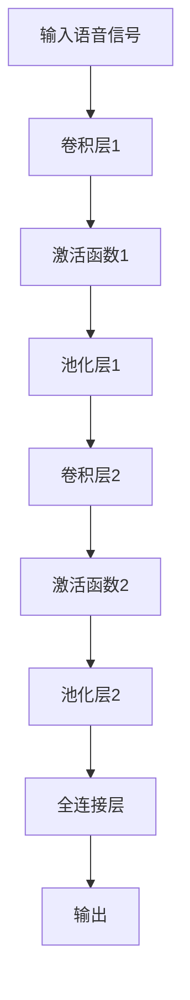
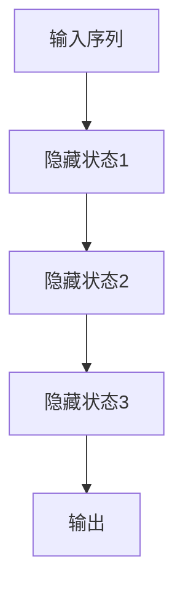
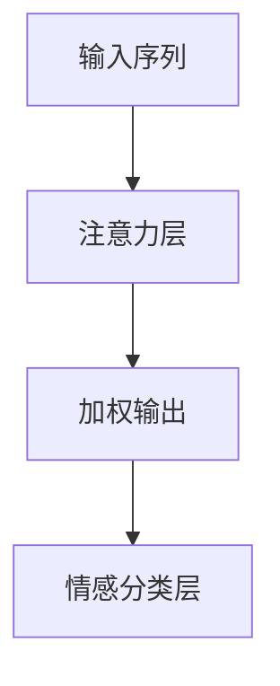

                 

# 深度学习在语音情感识别中的应用

关键词：深度学习、语音情感识别、神经网络、模型应用、项目实战

摘要：随着深度学习的迅速发展，语音情感识别技术得到了广泛关注和应用。本文将系统地探讨深度学习在语音情感识别中的应用，从基础理论到实际项目实战，全面解析这一领域的最新进展和挑战。

## 目录大纲

### 第一部分：深度学习基础

1. 第1章：深度学习概述
   1.1 深度学习的起源与发展
   1.2 神经网络基础
   1.3 深度学习框架

### 第二部分：语音情感识别基础

2. 第2章：语音情感识别概述
   2.1 语音情感识别的定义与意义
   2.2 语音信号处理
   2.3 情感分类与标注

### 第三部分：深度学习在语音情感识别中的应用

3. 第3章：深度学习模型在语音情感识别中的应用
   3.1 卷积神经网络（CNN）在语音情感识别中的应用
   3.2 循环神经网络（RNN）在语音情感识别中的应用
   3.3 注意力机制在语音情感识别中的应用
   3.4 跨语言情感识别

### 第四部分：语音情感识别项目实战

4. 第4章：构建一个语音情感识别系统
   4.1 项目背景与目标
   4.2 数据集选择与预处理
   4.3 模型设计与训练
   4.4 模型评估与部署

### 第五部分：未来展望

5. 第5章：深度学习在语音情感识别中的未来趋势
   5.1 未来技术展望
   5.2 挑战与解决方案
   5.3 社会影响与伦理问题

### 附录

6. 附录A：深度学习框架使用指南
7. 附录B：参考资源

### 文章正文

#### 第一部分：深度学习基础

### 第1章：深度学习概述

深度学习是机器学习中的一个重要分支，通过多层神经网络模拟人脑处理信息的方式，对大量数据进行自动特征学习和模式识别。深度学习的起源可以追溯到20世纪80年代，随着计算能力的提升和海量数据的出现，深度学习在21世纪得到了飞速发展。

**1.1 深度学习的基本概念**

深度学习的基本概念包括神经网络、多层感知机、反向传播算法等。神经网络由多个神经元组成，每个神经元都可以接收输入信号并产生输出。多层感知机是神经网络的一种形式，通过添加多个隐层实现对复杂数据的建模。反向传播算法是一种用于训练神经网络的优化方法，通过不断调整网络权重，使得网络输出更接近真实值。

**1.2 深度学习的优势和挑战**

深度学习的优势在于其强大的特征学习能力，能够自动提取数据中的有用特征，从而提高模型性能。此外，深度学习还具有高度的可扩展性，能够处理大规模数据。然而，深度学习也存在一些挑战，如训练过程复杂、对数据需求量大、模型解释性较差等。

#### 第二部分：语音情感识别基础

### 第2章：语音情感识别概述

语音情感识别是一种通过分析语音信号中的情感特征，判断说话者情感状态的技术。语音情感识别在智能语音助手、人机交互、心理健康监测等领域具有广泛的应用前景。

**2.1 语音情感识别的定义与意义**

语音情感识别的定义是指通过分析语音信号，识别出说话者所表达的情感状态。语音情感识别的意义在于能够提高人机交互的自然性和情感化，从而提升用户体验。

**2.2 语音信号处理**

语音信号处理是语音情感识别的基础，包括语音信号的采集、预处理和特征提取。语音信号的基本特性包括音高、音强、音长等。预处理包括去噪、归一化等步骤，特征提取则通过梅尔频率倒谱系数（MFCC）等方法提取语音信号的频率特征。

**2.3 情感分类与标注**

情感分类是语音情感识别的核心任务，通过分类算法将语音信号分类为不同的情感类别。情感标注则是在数据集构建过程中，对语音信号进行情感标注，以便于后续的模型训练和评估。

#### 第三部分：深度学习在语音情感识别中的应用

### 第3章：深度学习模型在语音情感识别中的应用

深度学习模型在语音情感识别中具有广泛的应用，包括卷积神经网络（CNN）、循环神经网络（RNN）和注意力机制等。这些模型通过不同方式对语音信号进行处理和情感分类。

**3.1 卷积神经网络（CNN）在语音情感识别中的应用**

卷积神经网络通过卷积操作提取语音信号的时空特征，从而实现情感识别。卷积神经网络的基本原理如图1所示：

**3.2 循环神经网络（RNN）在语音情感识别中的应用**

循环神经网络通过递归操作对语音信号进行时序建模，从而捕捉语音信号中的情感变化。RNN的基本原理如图2所示：

RNN的变体包括长短期记忆网络（LSTM）和门控循环单元（GRU），它们通过引入门控机制来避免梯度消失问题，从而提高模型的性能。

**3.3 注意力机制在语音情感识别中的应用**

注意力机制是一种用于捕捉语音信号中关键特征的方法，通过加权语音信号的各个部分，提高模型的情感识别能力。注意力机制的基本原理如图3所示：

**3.4 跨语言情感识别**

跨语言情感识别是指在不同语言之间进行情感识别的任务。由于不同语言的语音特征和情感表达方式存在差异，跨语言情感识别具有较大的挑战性。解决方法包括多语言数据集构建、语言模型迁移等。

#### 第四部分：语音情感识别项目实战

### 第4章：构建一个语音情感识别系统

**4.1 项目背景与目标**

本项目的目标是构建一个基于深度学习的语音情感识别系统，实现对人声情感状态的自动识别。项目背景包括智能语音助手、人机交互和心理健康监测等领域。

**4.2 数据集选择与预处理**

数据集选择是构建语音情感识别系统的重要步骤。本项目选择了一个包含多种情感类别的大型公开数据集，数据集包括语音信号、情感标签和文本内容。预处理步骤包括去噪、归一化和特征提取。

**4.3 模型设计与训练**

模型设计是语音情感识别系统的核心。本项目采用一个基于卷积神经网络和循环神经网络的混合模型，通过训练优化模型参数，提高情感识别的准确性。

**4.4 模型评估与部署**

模型评估是验证模型性能的重要手段。本项目采用多种评估指标，如准确率、召回率和F1值等，对模型进行评估。部署方面，模型可以通过API接口或其他方式集成到应用中。

#### 第五部分：未来展望

### 第5章：深度学习在语音情感识别中的未来趋势

未来，深度学习在语音情感识别中将继续发挥重要作用。一方面，深度学习算法将不断改进，提高情感识别的准确性和效率。另一方面，语音情感识别的应用领域将不断拓展，如智能语音助手、虚拟现实、智能机器人等。

**5.1 未来技术展望**

未来，深度学习算法的改进将集中在模型压缩、分布式训练和模型解释性等方面。此外，多模态情感识别技术将得到广泛应用，结合语音、文本和视觉信息，实现更准确的情感识别。

**5.2 挑战与解决方案**

语音情感识别面临的挑战包括数据集质量、模型解释性和伦理问题等。解决方法包括构建高质量的数据集、提高模型的可解释性和关注伦理问题。

**5.3 社会影响与伦理问题**

语音情感识别技术的发展对社会和伦理产生重要影响。隐私保护、情感歧视和偏见等问题需要引起广泛关注，并制定相应的规范和标准。

### 附录

**附录A：深度学习框架使用指南**

- TensorFlow使用指南
- PyTorch使用指南

**附录B：参考资源**

- 相关书籍推荐
- 学术论文推荐
- 在线课程与教程推荐
- 社区与论坛推荐

## 结束语

深度学习在语音情感识别中的应用为这一领域带来了巨大的发展潜力。通过本文的详细分析和探讨，我们看到了深度学习模型在语音情感识别中的广泛应用和强大能力。未来，随着技术的不断进步，深度学习在语音情感识别中的应用将更加广泛，为社会带来更多创新和便利。

### 作者信息

作者：AI天才研究院/AI Genius Institute & 禅与计算机程序设计艺术 /Zen And The Art of Computer Programming

本文由AI天才研究院撰写，旨在分享深度学习在语音情感识别中的应用经验和最新研究进展。感谢您的阅读。如果您有任何问题或建议，欢迎在评论区留言。我们期待与您共同探讨深度学习的未来发展。|>

