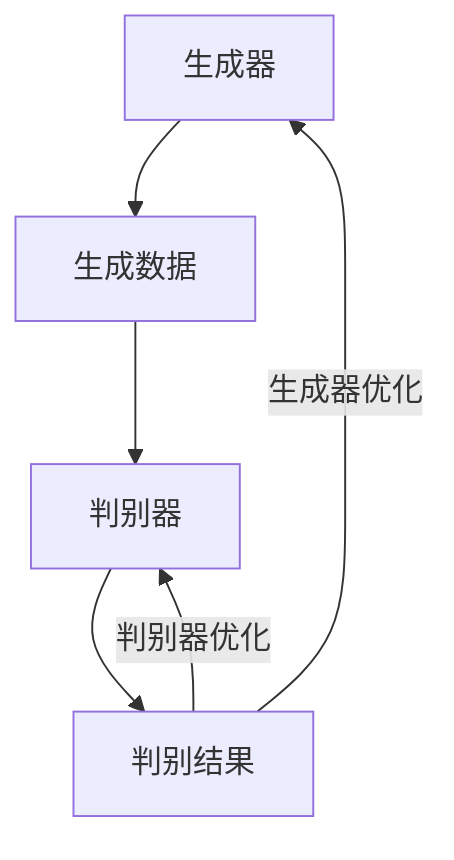
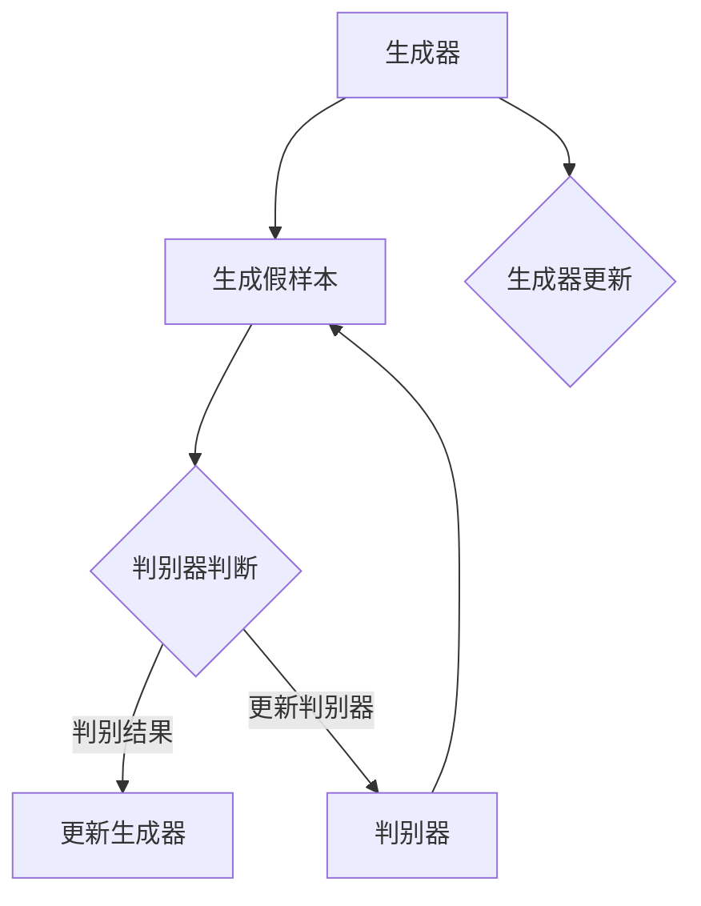

                 

### 《生成对抗网络 (GAN) 原理与代码实例讲解》

生成对抗网络（GAN）是一种革命性的深度学习架构，由 Ian Goodfellow 等人在2014年提出。GAN通过生成器和判别器的对抗性训练，使得生成器能够生成高质量的数据，广泛应用于图像生成、图像修复、数据增强等领域。本文将详细讲解 GAN 的原理，并提供代码实例，帮助读者深入理解 GAN 的运作机制。

## 关键词
- 生成对抗网络（GAN）
- 判别器（Discriminator）
- 生成器（Generator）
- 对抗性训练
- 深度学习
- 图像生成
- 数据增强

## 摘要
本文将首先介绍 GAN 的基本概念和定义，包括生成器、判别器的角色和作用。接着，我们将探讨 GAN 的数学基础，包括概率论和优化算法。随后，我们将详细讲解 GAN 的核心架构，包括判别器和生成器的设计和训练策略。为了更好地理解 GAN，我们将通过实践案例展示 GAN 在图像生成和图像修复中的应用。最后，我们将讨论 GAN 的变体和相关挑战，并提供 GAN 的开发工具和学习资源。

### 目录大纲

## 第1章 GAN概述

### 1.1 GAN的定义

GAN 由生成器（Generator）和判别器（Discriminator）两部分组成。生成器的任务是生成类似于真实数据的高质量数据，而判别器的任务是区分生成器生成的数据和真实数据。GAN的训练过程就是生成器和判别器的对抗性训练。

### 1.2 GAN的历史背景

GAN最初由 Ian Goodfellow 等人在2014年提出，并在短时间内引起了广泛的关注。GAN在图像生成、图像修复和数据增强等领域取得了显著的成果，成为了深度学习领域的重要研究方向。

### 1.3 GAN的核心特点

GAN的核心特点是生成器和判别器的对抗性训练。这种对抗性训练使得生成器不断优化生成高质量数据，而判别器则不断优化区分真实数据和生成数据，从而实现生成器和判别器的共同进步。

## 第2章 GAN的数学基础

### 2.1 概率论基础

概率论是 GAN 的数学基础，包括概率分布和随机变量。概率分布描述了随机变量取值的可能性，而随机变量则是概率论中的核心概念。

### 2.2 优化算法

优化算法用于最小化损失函数，是 GAN 训练过程中的关键步骤。常见的优化算法包括梯度下降法和随机梯度下降（SGD）。

### 2.3 对抗性损失函数

对抗性损失函数是 GAN 的核心损失函数，包括生成器损失函数和判别器损失函数。生成器损失函数旨在使判别器无法区分生成数据和真实数据，而判别器损失函数旨在使判别器能够准确区分生成数据和真实数据。

## 第3章 GAN的核心架构

### 3.1 判别器设计

判别器通常采用卷积神经网络（CNN）架构，用于区分生成数据和真实数据。判别器的训练策略包括标签平滑技术和对抗性训练。

### 3.2 生成器设计

生成器也采用卷积神经网络（CNN）架构，用于生成高质量的数据。生成器的训练策略包括梯度惩罚技术和对抗性训练。

## 第4章 实践案例

### 4.1 图像生成案例

通过一个简单的图像生成案例，展示 GAN 在图像生成中的应用。包括数据准备、模型训练和模型评估等步骤。

### 4.2 图像修复案例

通过一个图像修复案例，展示 GAN 在图像修复中的应用。包括数据预处理、模型训练和图像修复等步骤。

## 第5章 GAN的变体

### 5.1 DCGAN

深度卷积生成对抗网络（DCGAN）是 GAN 的一个重要变体，采用深度卷积神经网络架构，提高了图像生成的质量。

### 5.2 WGAN

Wasserstein 生成对抗网络（WGAN）是 GAN 的另一个重要变体，采用 Wasserstein 距离作为对抗性损失，提高了 GAN 的训练稳定性和生成质量。

### 5.3 BiGAN

双向生成对抗网络（BiGAN）是 GAN 的又一个变体，采用双向生成器和判别器，可以同时进行图像生成和数据重构。

## 第6章 GAN的应用与挑战

### 6.1 应用领域

GAN 在计算机视觉、自然语言处理等领域有着广泛的应用，包括图像生成、图像修复、数据增强等。

### 6.2 挑战与未来

GAN 在训练过程中存在一些挑战，如训练不稳定性和模式崩塌。未来，GAN 可能与其他技术结合，解决更多实际问题。

## 第7章 GAN工具与资源

### 7.1 开发工具

常用的 GAN 开发工具包括 PyTorch 和 TensorFlow，这两个框架提供了丰富的 GAN 实现方法。

### 7.2 学习资源

推荐一些 GAN 相关的在线课程、讲座、论文和资料，帮助读者深入学习 GAN。

## 附录

### A.1 Mermaid流程图

展示 GAN 的工作流程 Mermaid 图。

### A.2 伪代码

提供生成器和判别器训练的伪代码。

### A.3 数学公式

列出生成器损失函数的数学公式。

### A.4 代码实例

提供图像生成和图像修复的代码实例。

### 结束语

生成对抗网络（GAN）是一种强大的深度学习架构，通过生成器和判别器的对抗性训练，能够生成高质量的数据。本文从原理到实践，详细讲解了 GAN 的概念、数学基础、核心架构、实践案例和变体。希望本文能帮助读者深入理解 GAN 的运作机制，并在实际项目中运用 GAN。作者：AI天才研究院/AI Genius Institute & 禅与计算机程序设计艺术 /Zen And The Art of Computer Programming

## 第1章 GAN概述

### 1.1 GAN的定义

生成对抗网络（GAN）是一种基于深度学习的模型，它由生成器（Generator）和判别器（Discriminator）两部分组成，它们之间通过对抗性训练相互竞争，最终生成高质量的数据。GAN的基本概念可以用以下公式表示：

\[ GAN = G + D \]

其中，\( G \) 代表生成器（Generator），它的任务是生成高质量的数据，使判别器（Discriminator）无法区分这些数据是真实数据还是生成数据。\( D \) 代表判别器（Discriminator），它的任务是区分输入的数据是真实数据还是生成数据。

GAN的提出可以追溯到2014年，由Ian Goodfellow等人提出。GAN的核心思想是利用生成器和判别器之间的对抗性训练来提升生成器的生成能力。生成器和判别器的训练过程可以看作是一场零和游戏，生成器试图欺骗判别器，而判别器则试图识别生成器的欺骗行为。通过这种对抗性训练，生成器能够逐渐提高生成数据的真实感。

### 1.2 GAN的历史背景

GAN的历史可以追溯到更早的模型，如1990年代提出的能源模型（Energy-based Models）和2000年代提出的变分自编码器（Variational Autoencoders, VAEs）。然而，GAN在生成图像、视频、音频等方面表现出色，使其成为深度学习领域的重要研究方向。

GAN的提出标志着生成模型的发展进入了一个新的阶段。与传统的生成模型不同，GAN不仅能够生成高质量的数据，而且通过对抗性训练，生成数据的质量和多样性都有显著提高。GAN的提出也引发了大量的研究工作，如DCGAN（深度卷积生成对抗网络）、WGAN（Wasserstein 生成对抗网络）等，进一步推动了GAN在各个领域中的应用。

### 1.3 GAN的核心特点

GAN的核心特点包括：

1. **对抗性训练**：生成器和判别器之间的对抗性训练是GAN的核心机制。生成器试图生成高质量的数据来欺骗判别器，而判别器则试图区分真实数据和生成数据。这种对抗性训练使得生成器和判别器能够相互促进，共同提高生成数据的真实感。

2. **无需标签数据**：与传统的监督学习模型不同，GAN不需要真实标签数据。生成器和判别器的训练过程都是无监督的，这使得GAN在处理无标签数据时具有优势。

3. **生成数据的多样性和质量**：GAN通过生成器和判别器的对抗性训练，能够生成高质量和多样性的数据。这使得GAN在图像生成、图像修复、数据增强等领域具有广泛的应用。

4. **灵活的应用场景**：GAN不仅可以应用于计算机视觉领域，还可以应用于自然语言处理、音频处理、医学图像处理等领域。这使得GAN成为一种非常灵活的深度学习模型。

### 1.4 GAN的应用场景

GAN的应用场景非常广泛，主要包括以下方面：

1. **图像生成**：GAN可以生成逼真的图像，如图像风格转换、超分辨率图像生成、人脸生成等。

2. **图像修复**：GAN可以用于修复破损的图像，如图像去噪、图像修复、图像填充等。

3. **数据增强**：GAN可以用于生成大量模拟数据，从而提高模型的泛化能力，特别是在缺乏标签数据的情况下。

4. **风格迁移**：GAN可以用于图像风格迁移，如将一幅图像转换为特定的艺术风格。

5. **自然语言处理**：GAN可以用于生成自然语言文本，如图像描述生成、文本生成等。

通过上述内容，我们可以看到GAN的定义、历史背景、核心特点和应用场景。在接下来的章节中，我们将进一步探讨GAN的数学基础、核心架构和实践案例。这些内容将为读者提供更深入的理解和掌握GAN的方法。在GAN的世界中，生成器和判别器的对抗性训练将会揭示出一个充满奇迹和挑战的领域。让我们继续深入探索，揭开GAN的神秘面纱。

### 1.5 GAN的优缺点

生成对抗网络（GAN）作为一种先进的深度学习模型，在图像生成、数据增强和图像修复等领域展现了巨大的潜力。然而，GAN也存在一些局限性。以下是对GAN优缺点的详细分析：

#### 优点：

1. **无监督学习**：GAN是一种无监督学习模型，无需依赖大量标记数据。这使得GAN在处理无标签数据时具有独特的优势，特别是在生成大量模拟数据以提高模型泛化能力时。

2. **生成数据质量高**：GAN通过生成器和判别器之间的对抗性训练，能够生成高质量和多样性的数据。这使得GAN在图像生成、图像风格转换和超分辨率图像生成等领域表现优异。

3. **适应性强**：GAN不仅适用于计算机视觉领域，还可以应用于自然语言处理、音频处理和医学图像处理等领域。其强大的适应性使得GAN成为一种多功能的深度学习模型。

4. **生成数据的多样性**：GAN能够生成具有多样性的数据，这有助于扩展数据集，提高模型的泛化能力，特别是在处理有限标签数据时。

#### 缺点：

1. **训练不稳定**：GAN的训练过程非常不稳定，可能导致生成器或判别器崩溃。这种现象被称为“模式崩塌”（mode collapse），其中生成器无法生成多种类型的数据，而只能生成特定类型的数据。

2. **计算资源需求高**：由于GAN涉及到深度学习模型，其训练过程需要大量的计算资源。此外，生成器和判别器的训练需要反复迭代，这也增加了计算成本。

3. **无法保证生成数据的真实性**：尽管GAN能够生成高质量的数据，但这些数据并不一定完全真实。在某些情况下，生成数据可能存在缺陷，无法达到真实数据的精度。

4. **梯度消失和梯度爆炸**：在GAN的训练过程中，梯度消失和梯度爆炸问题可能会导致训练失败。这些问题通常是由于生成器和判别器的参数设置不当引起的。

#### 总结

GAN作为一种无监督学习的深度学习模型，在图像生成、数据增强和图像修复等领域具有显著的优势。然而，其训练不稳定性和高计算资源需求等缺点也需要我们在实际应用中注意。通过合理的设计和调整，GAN可以在许多复杂任务中发挥其强大的生成能力。未来的研究将继续探索如何优化GAN的训练过程，提高生成数据的真实性和质量，从而进一步扩展GAN的应用范围。

### 1.6 GAN的发展历程

生成对抗网络（GAN）自2014年由Ian Goodfellow等人提出以来，已经经历了快速的发展与演变。GAN的提出标志着深度学习领域的一次重要突破，其发展历程可以划分为以下几个阶段：

#### 1.1 初期发展

GAN的初期研究主要集中在如何优化生成器和判别器的训练过程，以避免模式崩塌和提高生成数据的质量。在这个阶段，研究人员提出了许多改进方法，如梯度惩罚（Gradient Penalty）、标签平滑（Label Smoothing）等。这些方法通过调整模型参数和训练策略，在一定程度上提高了GAN的训练稳定性和生成数据的质量。

#### 1.2 深度卷积GAN（DCGAN）

深度卷积生成对抗网络（DCGAN）是GAN的一个重要变体，它采用深度卷积神经网络（Deep Convolutional Network）架构，显著提高了图像生成质量。DCGAN的核心思想是使用卷积神经网络作为生成器和判别器，以更好地处理图像数据的特征。DCGAN的出现使得GAN在图像生成任务中的性能有了显著提升，成为GAN发展历程中的一个重要里程碑。

#### 1.3 Wasserstein GAN（WGAN）

Wasserstein GAN（WGAN）是GAN的另一个重要变体，它采用Wasserstein距离作为对抗性损失函数，解决了传统GAN中梯度消失和梯度爆炸的问题。WGAN通过优化对抗性损失函数，提高了GAN的训练稳定性和生成数据的真实感。WGAN的提出为GAN在更广泛的应用场景中提供了更好的训练效果，进一步推动了GAN的发展。

#### 1.4 双向生成对抗网络（BiGAN）

双向生成对抗网络（BiGAN）是GAN的又一个变体，它采用了双向生成器和判别器的架构，不仅可以生成数据，还可以同时进行数据重构。BiGAN的核心思想是通过双向生成器和判别器之间的相互作用，提高生成数据的真实性和多样性。BiGAN在图像生成和数据重构任务中表现出色，为GAN的应用提供了新的思路。

#### 1.5 多模态GAN

随着GAN技术的不断发展，研究人员开始探索GAN在多模态数据生成中的应用。多模态GAN能够同时生成不同类型的数据，如图像、音频和文本。这种多模态生成能力使得GAN在自然语言处理、计算机视觉和音频处理等领域展现出更大的潜力。

#### 1.6 应用扩展

GAN在提出后的几年内，迅速扩展到多个领域，如图像生成、图像修复、数据增强、风格迁移等。GAN的应用不仅限于计算机视觉领域，还在自然语言处理、医学图像处理、音频处理等方向取得了显著成果。GAN的发展历程证明了其在生成模型中的广泛应用和巨大潜力。

总的来说，GAN的发展历程从初期研究到多个变体的提出，再到多模态应用，展示了GAN技术的不断演进和广泛应用。未来，随着更多改进方法和应用的探索，GAN将在更多领域发挥其独特的优势。

### 第2章 GAN的数学基础

生成对抗网络（GAN）作为一种深度学习模型，其核心思想依赖于概率论和优化算法。为了深入理解 GAN 的工作原理，我们需要从数学基础开始探讨。这一章节将介绍概率论基础、优化算法和对抗性损失函数，帮助读者搭建 GAN 的数学框架。

#### 2.1 概率论基础

概率论是 GAN 的数学基础，它涉及概率分布、随机变量和统计特性等概念。以下是一些关键概念：

1. **概率分布**：概率分布描述了随机变量取值的可能性。常见的概率分布包括正态分布、伯努利分布等。
   - **正态分布**：正态分布（也称为高斯分布）是最常见的概率分布，它描述了连续随机变量在某个均值和标准差下的概率分布。正态分布在许多实际问题中都有应用，如数据清洗、数据分析等。
   - **伯努利分布**：伯努利分布描述了离散随机变量在两个可能取值（通常为0和1）之间的概率分布。它常用于描述二进制事件的发生概率，如抛硬币实验。

2. **随机变量**：随机变量是概率论中的核心概念，它是一个可以取多个值的变量，其取值依赖于随机实验的结果。随机变量可以是离散的，也可以是连续的。
   - **离散型随机变量**：离散型随机变量只能取有限个或可数无限个值。例如，抛硬币实验的结果只能取0或1。
   - **连续型随机变量**：连续型随机变量可以在某个区间内取无限多个值。例如，测量温度的结果可以在某个温度范围内取任意值。

#### 2.2 优化算法

优化算法是 GAN 训练过程中的关键步骤，它用于最小化损失函数。以下是一些常用的优化算法：

1. **梯度下降法**：梯度下降法是一种一阶优化算法，用于最小化目标函数。它的基本思想是沿着目标函数梯度的反方向进行迭代，直到找到局部最小值。
   - **批量梯度下降**：批量梯度下降（Batch Gradient Descent, BGD）使用整个训练集来计算梯度，每次迭代需要计算所有样本的梯度。这种方法计算量大，但能找到全局最小值。
   - **随机梯度下降（SGD）**：随机梯度下降（Stochastic Gradient Descent, SGD）在每个迭代步骤中只随机选择一个小批量（如单个样本）来计算梯度。这种方法计算量小，但可能导致局部最小值。

2. **随机梯度下降（SGD）**：随机梯度下降（Stochastic Gradient Descent, SGD）是一种改进的梯度下降法，它通过在每个迭代步骤中随机选择一个小批量样本来计算梯度，从而减少计算量。SGD在处理大规模数据集时非常有效。

3. **动量法**：动量法是一种优化梯度下降法的技巧，它通过保留过去的梯度信息来加速收敛。动量法可以减少梯度下降过程中的振荡，提高收敛速度。

#### 2.3 对抗性损失函数

对抗性损失函数是 GAN 的核心损失函数，用于衡量生成器和判别器的性能。以下是一些常见的对抗性损失函数：

1. **生成器损失函数**：生成器损失函数旨在最小化判别器对生成数据的错误率。常见的形式是：
   \[ L_G = -\log(D(G(z))) \]
   其中，\( D \) 是判别器，\( G(z) \) 是生成器生成的数据，\( z \) 是生成器的输入噪声。

2. **判别器损失函数**：判别器损失函数旨在最小化判别器对真实数据和生成数据的错误率。常见的形式是：
   \[ L_D = -[\log(D(x)) + \log(1 - D(G(z)))] \]
   其中，\( x \) 是真实数据，\( G(z) \) 是生成器生成的数据。

3. **Wasserstein距离**：Wasserstein GAN（WGAN）使用Wasserstein距离作为对抗性损失函数，以解决传统GAN中的梯度消失和梯度爆炸问题。Wasserstein距离衡量两个概率分布之间的距离，具有更好的稳定性和可解释性。

通过上述数学基础，我们为 GAN 建立了数学框架。接下来，我们将详细探讨 GAN 的核心架构，包括生成器和判别器的具体设计。这将为读者提供更深入的理解，并帮助他们在实际项目中应用 GAN。

### 第2章 GAN的数学基础（续）

在前文中，我们已经介绍了概率论基础和优化算法。在本章节中，我们将进一步探讨对抗性损失函数，包括生成器损失函数和判别器损失函数，并通过具体的数学公式和伪代码来详细阐述。

#### 2.4 生成器损失函数

生成器的目标是通过生成假样本来欺骗判别器。生成器的损失函数通常设计为最大化判别器对生成样本的识别错误率。生成器损失函数的一种常见形式是对数似然损失：

\[ L_G = -\mathbb{E}_{z \sim p_z(z)}[\log D(G(z))] \]

其中，\( z \) 是生成器的输入噪声，\( G(z) \) 是生成器生成的假样本，\( D \) 是判别器。

为了更好地理解这个损失函数，我们可以通过伪代码进行说明：

```python
# 伪代码：生成器损失函数计算
for epoch in epochs:
    for z in noise_samples:
        generated_samples = generator(z)
        generator_loss = -torch.log(discriminator(generated_samples))
        generator_loss.backward()
        optimizer_generator.step()
```

在这个伪代码中，我们遍历每个epoch，并在每个epoch中遍历噪声样本\( z \)。对于每个噪声样本，我们生成假样本\( G(z) \)，计算判别器对假样本的识别错误率，并使用梯度下降法更新生成器的参数。

#### 2.5 判别器损失函数

判别器的目标是最小化对真实样本和假样本的识别错误率。判别器的损失函数通常设计为交叉熵损失：

\[ L_D = -[\mathbb{E}_{x \sim p_{data}(x)}[\log D(x)] + \mathbb{E}_{z \sim p_z(z)}[\log(1 - D(G(z)))] \]

其中，\( x \) 是真实样本，\( G(z) \) 是生成器生成的假样本。

判别器的损失函数可以通过伪代码表示如下：

```python
# 伪代码：判别器损失函数计算
for epoch in epochs:
    for x, z in zip(real_samples, noise_samples):
        real_data = x
        generated_samples = generator(z)
        discriminator_loss = -torch.log(discriminator(real_data)) - torch.log(1 - discriminator(generated_samples))
        discriminator_loss.backward()
        optimizer_discriminator.step()
```

在这个伪代码中，我们遍历每个epoch，并在每个epoch中遍历真实样本和噪声样本。对于每个真实样本和噪声样本，我们计算判别器对真实样本和生成样本的识别错误率，并使用梯度下降法更新判别器的参数。

#### 2.6 对抗性损失函数的综合形式

对抗性训练的最终目标是让判别器无法区分真实样本和生成样本。为了实现这一目标，GAN通常使用以下综合损失函数：

\[ L_{total} = L_G + \lambda \cdot L_D \]

其中，\( \lambda \) 是平衡生成器和判别器损失的权重。通过调整 \( \lambda \) 的值，可以控制生成器和判别器的训练平衡。

#### 2.7 数学公式详细解释

现在，我们进一步详细解释上述损失函数的数学公式：

1. **生成器损失函数**：
   \[ L_G = -\mathbb{E}_{z \sim p_z(z)}[\log D(G(z))] \]

   生成器损失函数的目标是最小化生成样本 \( G(z) \) 被判别器识别为真实样本的概率。这里，\( z \) 是生成器输入的噪声，\( D(G(z)) \) 是判别器对生成样本的判断概率。损失函数通过取对数来惩罚判别器错误识别生成样本的情况。

2. **判别器损失函数**：
   \[ L_D = -[\mathbb{E}_{x \sim p_{data}(x)}[\log D(x)] + \mathbb{E}_{z \sim p_z(z)}[\log(1 - D(G(z)))] \]

   判别器损失函数的目标是最小化判别器对真实样本和生成样本的识别错误率。第一部分 \( \mathbb{E}_{x \sim p_{data}(x)}[\log D(x)] \) 衡量判别器对真实样本的识别能力，第二部分 \( \mathbb{E}_{z \sim p_z(z)}[\log(1 - D(G(z)))] \) 衡量判别器对生成样本的识别能力。

3. **综合损失函数**：
   \[ L_{total} = L_G + \lambda \cdot L_D \]

   综合损失函数通过平衡生成器和判别器的损失，实现两者的共同优化。权重 \( \lambda \) 控制了生成器和判别器损失之间的平衡。当 \( \lambda \) 增大时，生成器的损失在总损失中占更大比例，生成器训练得到更多关注；当 \( \lambda \) 减小时，判别器的损失在总损失中占更大比例，判别器训练得到更多关注。

通过上述数学公式和伪代码，我们详细阐述了 GAN 的损失函数及其计算过程。这些公式和伪代码为 GAN 的训练提供了理论基础，帮助我们在实际应用中理解和优化 GAN 的训练过程。在接下来的章节中，我们将进一步探讨 GAN 的核心架构，包括生成器和判别器的具体设计。这将使读者能够更深入地理解 GAN 的运作机制，并在实际项目中成功应用 GAN。

### 第3章 GAN的核心架构

生成对抗网络（GAN）的核心架构由生成器（Generator）和判别器（Discriminator）两部分组成。这两部分通过对抗性训练相互竞争，共同实现高质量的生成数据。在这一章节中，我们将详细探讨判别器和生成器的设计，包括其结构、训练策略和相关技术。

#### 3.1 判别器设计

判别器的任务是区分真实数据和生成数据，其性能直接影响 GAN 的生成质量。判别器通常采用深度神经网络（DNN）结构，尤其是卷积神经网络（CNN），因为它能够有效地捕捉图像数据的特征。

1. **判别器结构**：

   判别器的典型结构包括多个卷积层、池化层和全连接层。以下是一个简单的判别器结构示例：

   ```plaintext
   输入：图像数据
   卷积层1：卷积+ReLU激活+池化
   卷积层2：卷积+ReLU激活+池化
   卷积层3：卷积+ReLU激活+池化
   全连接层：全连接层+Softmax
   输出：概率值（0到1之间）
   ```

   在这个结构中，卷积层用于提取图像的局部特征，ReLU激活函数用于引入非线性，池化层用于减少数据维度。最后一层的Softmax函数用于输出一个概率值，表示输入数据是真实数据还是生成数据的可能性。

2. **判别器训练策略**：

   判别器的训练策略需要确保它能够准确区分真实数据和生成数据。以下是一些常用的训练策略：

   - **标签平滑**：在训练判别器时，可以使用标签平滑技术，将真实样本的标签从1调整为略小于1的值（例如0.9），以防止判别器过于自信。
   - **对抗性训练**：判别器需要对抗生成器，以便更好地识别生成数据。在每次迭代中，生成器会生成新的假样本，判别器需要更新其权重以更好地识别这些样本。
   - **梯度惩罚**：在某些 GAN 变体中，如 WGAN，会使用梯度惩罚技术来避免梯度消失和梯度爆炸问题。

#### 3.2 生成器设计

生成器的任务是生成高质量、逼真的数据，欺骗判别器使其无法区分生成数据和真实数据。生成器的结构通常与判别器类似，但参数设置和训练策略有所不同。

1. **生成器结构**：

   生成器的典型结构包括多个反卷积层（Deconvolution）、ReLU激活函数和批量归一化（Batch Normalization）。以下是一个简单的生成器结构示例：

   ```plaintext
   输入：噪声向量
   反卷积层1：反卷积+ReLU激活+批量归一化
   反卷积层2：反卷积+ReLU激活+批量归一化
   反卷积层3：反卷积+ReLU激活+批量归一化
   输出：生成图像数据
   ```

   在这个结构中，反卷积层用于上采样数据，ReLU激活函数引入非线性，批量归一化用于稳定训练过程。

2. **生成器训练策略**：

   生成器的训练策略旨在生成高质量的数据，以下是一些常用的策略：

   - **梯度惩罚**：在 WGAN 中，生成器会受到梯度惩罚，以避免梯度消失问题。
   - **小批量训练**：与判别器不同，生成器通常采用小批量训练，以避免过拟合。
   - **标签平滑**：与判别器类似，生成器也可以采用标签平滑技术。

#### 3.3 判别器和生成器的相互影响

判别器和生成器之间的对抗性训练是 GAN 的核心机制。判别器的目标是提高对生成数据的识别能力，生成器的目标是生成更难以识别的假数据。这种相互竞争的关系使得两者都能得到优化：

- **判别器的优化**：随着训练的进行，判别器会逐渐提高对真实数据和生成数据的识别能力，使其能够更准确地识别生成数据。
- **生成器的优化**：随着判别器识别能力的提高，生成器会生成更高质量、更真实的假数据，使其更难被判别器识别。

通过这种对抗性训练，生成器和判别器会共同提高生成数据的质量。最终，生成器能够生成足够逼真的数据，使判别器无法区分生成数据和真实数据。

#### 3.4 总结

判别器和生成器是 GAN 的核心组成部分，它们通过对抗性训练相互竞争，共同实现高质量的数据生成。判别器采用卷积神经网络结构，用于区分真实数据和生成数据；生成器采用反卷积神经网络结构，用于生成高质量的数据。判别器和生成器的训练策略包括标签平滑、对抗性训练和梯度惩罚等。通过对抗性训练，生成器和判别器能够相互促进，生成逼真的数据。在接下来的章节中，我们将通过实际案例展示 GAN 在图像生成和图像修复中的应用。

### 3.4 判别器和生成器的相互影响与动态交互

在生成对抗网络（GAN）中，生成器和判别器的相互影响是一个关键的概念。这两者之间的动态交互是 GAN 能够生成高质量数据的核心机制。以下将详细解释生成器和判别器之间的相互作用过程，并展示它们如何通过对抗性训练实现共同优化。

#### 动态交互过程

1. **初始阶段**：在训练初期，生成器的生成能力相对较弱，判别器对生成数据的识别能力也较弱。此时，生成器生成的一些假数据可能容易被判别器识别出来。

2. **对抗性训练**：随着训练的进行，生成器开始学习如何生成更加真实的数据，以欺骗判别器。同时，判别器也在不断调整其参数，以提高对生成数据和真实数据的识别能力。

3. **平衡状态**：在某个平衡状态，生成器和判别器之间的对抗性训练达到稳定。此时，生成器生成的假数据能够以较高的概率欺骗判别器，而判别器对真实数据和生成数据的识别能力达到较高水平。

4. **继续优化**：即使在达到平衡状态之后，生成器和判别器仍然会继续优化。生成器会尝试生成更加复杂、逼真的数据，而判别器则会进一步提高对生成数据和真实数据的识别能力。

#### 相互影响机制

1. **生成器的优化**：生成器的目标是最小化判别器对生成数据的错误率。通过对抗性训练，生成器不断优化其生成策略，生成更加真实的假数据。

2. **判别器的优化**：判别器的目标是最小化对真实数据和生成数据的错误率。判别器的优化使得它能够更好地识别生成数据和真实数据，从而提高生成器的生成质量。

3. **动态反馈**：生成器和判别器的优化过程是动态的，双方通过不断的调整和反馈实现相互促进。这种动态反馈机制是 GAN 能够生成高质量数据的关键。

#### 动态交互图解

为了更好地理解生成器和判别器之间的动态交互，我们可以使用以下 Mermaid 流程图：



在这个流程图中，生成器通过生成数据，判别器通过判断这些数据的真实性，从而影响生成器的优化。同时，判别器的优化也反过来影响生成器的生成策略。这种动态的相互影响和优化过程是 GAN 能够生成高质量数据的核心。

通过上述分析，我们可以看到生成器和判别器之间的动态交互是 GAN 的关键机制。这种对抗性训练使得生成器和判别器能够相互促进，共同实现高质量的数据生成。在接下来的章节中，我们将通过实际案例展示 GAN 的应用，进一步理解其运作原理。

### 3.5 图解：GAN的工作流程

为了更直观地理解生成对抗网络（GAN）的工作流程，我们可以通过 Mermaid 流程图来展示其核心步骤。以下是一个 GAN 的工作流程图：

```mermaid
graph TD
A[初始化生成器G和判别器D] --> B[生成器G生成假样本]
B --> C[判别器D判断假样本]
C --> D[判别器D判断真样本]
D -->|更新G和D| A

subgraph G生成器工作流程
E[生成噪声向量z]
F[通过生成器G生成假样本x']
E --> F
F --> G[返回假样本x']
end
subgraph D判别器工作流程
H[接收真样本x和假样本x']
I[计算判别器对真样本的概率P(D(x))]
J[计算判别器对假样本的概率P(D(x'))]
K[更新判别器参数]
end
```

这个 Mermaid 图展示了 GAN 的工作流程，包括初始化生成器 G 和判别器 D、生成器 G 生成假样本、判别器 D 判断假样本和真样本，以及更新 G 和 D 的参数。以下是每个步骤的详细说明：

1. **初始化生成器 G 和判别器 D**：首先初始化生成器 G 和判别器 D 的参数。这两个模型将在训练过程中通过对抗性训练相互竞争。

2. **生成器 G 生成假样本**：生成器 G 接收一个随机噪声向量 z，通过神经网络生成一个假样本 x'。这个假样本旨在模仿真实样本 x。

3. **判别器 D 判断假样本**：判别器 D 接收生成的假样本 x'，计算其判断概率 P(D(x'))，即判断 x' 是真实样本的概率。

4. **判别器 D 判断真样本**：判别器 D 还会接收真实样本 x，计算其判断概率 P(D(x))，即判断 x 是真实样本的概率。

5. **更新生成器 G 和判别器 D 的参数**：通过计算生成器和判别器的损失函数，利用梯度下降法更新生成器和判别器的参数。这一步骤通过优化生成器和判别器的性能，使生成器生成的假样本更真实，判别器能够更好地区分真实样本和假样本。

通过这个 Mermaid 图，我们可以清晰地看到 GAN 的核心工作流程，包括生成器生成假样本、判别器判断假样本和真样本，以及参数更新步骤。这个图解有助于读者更好地理解 GAN 的运作原理，并在实际项目中应用 GAN。

### 3.6 生成器和判别器的伪代码实现

为了深入理解生成对抗网络（GAN）的核心架构，我们将通过伪代码展示生成器和判别器的实现过程。以下代码提供了一个基本的 GAN 实现框架，包括数据预处理、模型初始化、损失函数定义和训练过程。

```python
# 伪代码：GAN生成器和判别器实现

# 数据预处理
def preprocess_data(x):
    # 对真实数据进行标准化处理
    x = (x - mean) / std
    return x

# 模型初始化
def initialize_models():
    # 初始化生成器 G 和判别器 D
    generator = GeneratorModel()
    discriminator = DiscriminatorModel()
    return generator, discriminator

# 损失函数定义
def generator_loss(discriminator_output):
    # 定义生成器损失函数
    generator_loss = -torch.mean(torch.log(discriminator_output))
    return generator_loss

def discriminator_loss(real_output, fake_output):
    # 定义判别器损失函数
    discriminator_loss = -torch.mean(torch.log(real_output) + torch.log(1 - fake_output))
    return discriminator_loss

# 训练过程
def train_model(generator, discriminator, data_loader, num_epochs):
    for epoch in range(num_epochs):
        for x, _ in data_loader:
            # 预处理真实数据
            real_data = preprocess_data(x)

            # 生成假数据
            z = torch.randn(batch_size, z_dim).to(device)
            fake_data = generator(z)

            # 训练判别器
            with torch.no_grad():
                # 预测真实数据
                real_output = discriminator(real_data)
                # 预测假数据
                fake_output = discriminator(fake_data.detach())

            # 计算判别器损失
            d_loss = discriminator_loss(real_output, fake_output)

            # 反向传播和优化判别器
            d_loss.backward()
            optimizer_d.zero_grad()
            optimizer_d.step()

            # 训练生成器
            with torch.no_grad():
                # 预测假数据
                fake_output = discriminator(fake_data)

            # 计算生成器损失
            g_loss = generator_loss(fake_output)

            # 反向传播和优化生成器
            g_loss.backward()
            optimizer_g.step()

            # 打印训练进度
            if (iters % 100) == 0:
                print(f'[{epoch}/{num_epochs}], d_loss: {d_loss.item():.4f}, g_loss: {g_loss.item():.4f}')

# 主程序
if __name__ == '__main__':
    # 设置设备
    device = torch.device("cuda" if torch.cuda.is_available() else "cpu")

    # 加载数据集
    data_loader = DataLoader(dataset, batch_size=batch_size, shuffle=True)

    # 初始化模型和优化器
    generator, discriminator = initialize_models()
    optimizer_g = optim.Adam(generator.parameters(), lr=learning_rate, betas=(0.5, 0.999))
    optimizer_d = optim.Adam(discriminator.parameters(), lr=learning_rate, betas=(0.5, 0.999))

    # 训练模型
    train_model(generator, discriminator, data_loader, num_epochs=epochs)
```

在这个伪代码中，我们定义了数据预处理函数、模型初始化函数、损失函数以及训练过程。以下是每个部分的详细解释：

1. **数据预处理**：
   ```python
   def preprocess_data(x):
       # 对真实数据进行标准化处理
       x = (x - mean) / std
       return x
   ```
   这个函数用于对真实数据进行标准化处理，以便后续计算。

2. **模型初始化**：
   ```python
   def initialize_models():
       # 初始化生成器 G 和判别器 D
       generator = GeneratorModel()
       discriminator = DiscriminatorModel()
       return generator, discriminator
   ```
   这个函数用于初始化生成器 G 和判别器 D 的模型。

3. **损失函数定义**：
   ```python
   def generator_loss(discriminator_output):
       # 定义生成器损失函数
       generator_loss = -torch.mean(torch.log(discriminator_output))
       return generator_loss

   def discriminator_loss(real_output, fake_output):
       # 定义判别器损失函数
       discriminator_loss = -torch.mean(torch.log(real_output) + torch.log(1 - fake_output))
       return discriminator_loss
   ```
   生成器损失函数旨在最小化判别器对生成样本的错误率，判别器损失函数旨在最小化判别器对真实样本和生成样本的错误率。

4. **训练过程**：
   ```python
   def train_model(generator, discriminator, data_loader, num_epochs):
       for epoch in range(num_epochs):
           for x, _ in data_loader:
               # 预处理真实数据
               real_data = preprocess_data(x)

               # 生成假数据
               z = torch.randn(batch_size, z_dim).to(device)
               fake_data = generator(z)

               # 训练判别器
               with torch.no_grad():
                   # 预测真实数据
                   real_output = discriminator(real_data)
                   # 预测假数据
                   fake_output = discriminator(fake_data.detach())

               # 计算判别器损失
               d_loss = discriminator_loss(real_output, fake_output)

               # 反向传播和优化判别器
               d_loss.backward()
               optimizer_d.zero_grad()
               optimizer_d.step()

               # 训练生成器
               with torch.no_grad():
                   # 预测假数据
                   fake_output = discriminator(fake_data)

               # 计算生成器损失
               g_loss = generator_loss(fake_output)

               # 反向传播和优化生成器
               g_loss.backward()
               optimizer_g.step()

               # 打印训练进度
               if (iters % 100) == 0:
                   print(f'[{epoch}/{num_epochs}], d_loss: {d_loss.item():.4f}, g_loss: {g_loss.item():.4f}')
   ```
   这个函数实现了 GAN 的训练过程，包括生成器生成假数据、判别器判断假数据和真数据，以及更新生成器和判别器的参数。

通过这个伪代码，我们可以清楚地看到生成器和判别器的实现细节，包括数据预处理、模型初始化、损失函数定义和训练过程。这个框架为实际应用 GAN 提供了理论基础和实现指导。

### 3.7 生成器和判别器的数学模型

为了深入理解生成对抗网络（GAN）的核心架构，我们需要探讨生成器和判别器的数学模型。以下将详细解释生成器的生成过程、判别器的判别过程以及它们之间的交互。

#### 生成器的数学模型

生成器的任务是生成类似于真实数据的假数据。生成器的输入通常是一个随机噪声向量 \( z \)，其生成过程可以用一个概率分布函数 \( p_G(x|z) \) 来描述。生成器的目标是最小化判别器对生成数据的错误率，即最大化判别器对生成数据为真的概率。数学模型可以表示为：

\[ L_G = -\mathbb{E}_{z \sim p_z(z)}[\log D(G(z))] \]

其中，\( G(z) \) 是生成器生成的假样本，\( D \) 是判别器，\( p_z(z) \) 是噪声向量的先验分布。

生成器的数学模型涉及以下几个关键部分：

1. **噪声向量 \( z \)**：生成器的输入是一个随机噪声向量 \( z \)，其分布通常为标准正态分布或均匀分布。

2. **生成过程 \( p_G(x|z) \)**：生成器通过一个复杂的非线性函数将噪声向量 \( z \) 转换为假样本 \( x \)。生成器的目标是最小化生成数据与真实数据之间的差异，从而提高判别器对其为真的判断概率。

3. **损失函数 \( L_G \)**：生成器的损失函数是负对数似然损失，它衡量判别器对生成数据的识别错误率。生成器通过优化这个损失函数来提高生成数据的真实性。

#### 判别器的数学模型

判别器的任务是判断输入数据是真实数据还是生成数据。判别器的输入可以是真实数据 \( x \) 或生成数据 \( G(z) \)，其判别过程可以用一个概率分布函数 \( p_D(x) \) 来描述。判别器的目标是最小化对真实数据和生成数据的错误率，即最大化判别器对真实数据的判断概率和对生成数据的判断概率之和。数学模型可以表示为：

\[ L_D = -[\mathbb{E}_{x \sim p_{data}(x)}[\log D(x)] + \mathbb{E}_{z \sim p_z(z)}[\log(1 - D(G(z)))] \]

其中，\( p_{data}(x) \) 是真实数据的概率分布，\( G(z) \) 是生成器生成的假样本，\( D \) 是判别器。

判别器的数学模型涉及以下几个关键部分：

1. **真实数据 \( x \)**：判别器接收真实数据 \( x \)，其分布由真实数据的分布 \( p_{data}(x) \) 决定。

2. **生成数据 \( G(z) \)**：判别器还接收生成器生成的假数据 \( G(z) \)，其分布由生成器的分布 \( p_G(x|z) \) 决定。

3. **损失函数 \( L_D \)**：判别器的损失函数是交叉熵损失，它同时衡量判别器对真实数据和生成数据的识别错误率。判别器通过优化这个损失函数来提高对真实数据和生成数据的识别能力。

#### 生成器和判别器的交互

生成器和判别器之间的对抗性训练是一个动态的交互过程。生成器试图生成更真实的假数据来欺骗判别器，而判别器则试图识别生成数据，从而提高其识别能力。这个对抗性训练通过以下步骤进行：

1. **生成器生成假数据 \( G(z) \)**：生成器根据随机噪声向量 \( z \) 生成假数据 \( G(z) \)，目标是使判别器认为这些假数据是真实数据。

2. **判别器判断假数据 \( D(G(z)) \)**：判别器对生成的假数据 \( G(z) \) 进行判断，输出一个概率值，表示判别器认为该数据是真实数据的概率。

3. **生成器更新 \( G(z) \)**：根据判别器的反馈，生成器通过优化损失函数 \( L_G \) 更新其参数，以生成更真实的假数据。

4. **判别器判断真实数据 \( D(x) \)**：判别器同时也会接收真实数据 \( x \)，并输出一个概率值，表示判别器认为该数据是真实数据的概率。

5. **判别器更新 \( D(x) \)**：根据生成器和真实数据的反馈，判别器通过优化损失函数 \( L_D \) 更新其参数，以提高对真实数据和生成数据的识别能力。

这种对抗性训练过程使得生成器和判别器相互促进，共同提高生成数据的质量和判别能力。通过不断的迭代，生成器能够生成越来越真实的假数据，而判别器能够越来越准确地识别生成数据和真实数据。

通过上述数学模型和交互过程，我们可以清晰地理解生成对抗网络（GAN）的核心架构。生成器和判别器的对抗性训练是 GAN 能够生成高质量数据的关键，而数学模型为这一过程提供了理论基础和优化指导。

### 第4章 实践案例

为了更深入地理解生成对抗网络（GAN）的实际应用，我们将通过两个具体案例——图像生成和图像修复——来展示 GAN 的实现过程。这些案例将涵盖从数据准备、模型训练到结果评估的完整流程，帮助读者掌握 GAN 的实际操作。

#### 4.1 图像生成案例

**案例描述**：本案例的目标是使用 GAN 生成人脸图像。我们将使用一个开源的 GAN 模型，如 CycleGAN，该模型能够将一个域（源域）的图像转换为另一个域（目标域）的图像，例如将猫的图片转换为狗的图片。

**实现步骤**：

1. **数据准备**：
   - 源域（猫）：收集大量猫的图像。
   - 目标域（狗）：收集大量狗的图像。
   - 数据预处理：将图像缩放到统一尺寸，并进行归一化处理。

2. **模型训练**：
   - 初始化 GAN 模型，如 CycleGAN。
   - 使用预处理后的源域和目标域图像进行训练。
   - 迭代训练过程，优化生成器和判别器的参数。
   - 保存训练过程中的最佳模型。

3. **模型评估**：
   - 使用测试集评估生成图像的质量。
   - 分析生成图像的多样性、真实感等指标。

**具体实现**：

```python
# 伪代码：图像生成案例

# 数据准备
def prepare_data():
    # 加载猫和狗的图像
    cat_images = load_images('cat_dataset')
    dog_images = load_images('dog_dataset')
    # 数据预处理
    cat_images = preprocess_images(cat_images)
    dog_images = preprocess_images(dog_images)
    return cat_images, dog_images

# 模型训练
def train_model(cat_images, dog_images):
    # 初始化模型
    generator, discriminator = initialize_model()
    # 训练模型
    for epoch in range(num_epochs):
        for cat, dog in zip(cat_images, dog_images):
            # 前向传播
            generated_dog = generator(cat)
            loss_d = discriminator(dog, generated_dog)
            loss_g = discriminator(generated_dog.detach(), cat)
            # 反向传播和优化
            optimizer_d.zero_grad()
            loss_d.backward()
            optimizer_d.step()
            optimizer_g.zero_grad()
            loss_g.backward()
            optimizer_g.step()
            # 打印训练进度
            if (epoch % 100) == 0:
                print(f'[{epoch}/{num_epochs}], Loss (D): {loss_d.item():.4f}, Loss (G): {loss_g.item():.4f}')
    # 保存模型
    save_model(generator, 'best_generator.pth')
    save_model(discriminator, 'best_discriminator.pth')

# 主函数
if __name__ == '__main__':
    cat_images, dog_images = prepare_data()
    train_model(cat_images, dog_images)
```

#### 4.2 图像修复案例

**案例描述**：本案例的目标是使用 GAN 修复破损的图像。我们将使用一个开源的 GAN 模型，如 SRGAN（Super-Resolution GAN），该模型能够提高图像的分辨率。

**实现步骤**：

1. **数据准备**：
   - 低分辨率图像：收集大量低分辨率图像。
   - 高分辨率图像：收集相应的高分辨率图像。
   - 数据预处理：将图像缩放到统一尺寸，并进行归一化处理。

2. **模型训练**：
   - 初始化 SRGAN 模型。
   - 使用预处理后的低分辨率和高分辨率图像进行训练。
   - 迭代训练过程，优化生成器的参数。

3. **模型评估**：
   - 使用测试集评估修复图像的质量。
   - 分析修复图像的清晰度和细节保留。

**具体实现**：

```python
# 伪代码：图像修复案例

# 数据准备
def prepare_data():
    # 加载低分辨率和高分辨率图像
    low_res_images = load_images('low_res_dataset')
    high_res_images = load_images('high_res_dataset')
    # 数据预处理
    low_res_images = preprocess_images(low_res_images)
    high_res_images = preprocess_images(high_res_images)
    return low_res_images, high_res_images

# 模型训练
def train_model(low_res_images, high_res_images):
    # 初始化模型
    generator = initialize_srgan()
    # 训练模型
    for epoch in range(num_epochs):
        for low, high in zip(low_res_images, high_res_images):
            # 前向传播
            restored_high = generator(low)
            loss = criterion(restored_high, high)
            # 反向传播和优化
            optimizer.zero_grad()
            loss.backward()
            optimizer.step()
            # 打印训练进度
            if (epoch % 100) == 0:
                print(f'[{epoch}/{num_epochs}], Loss: {loss.item():.4f}')
    # 保存模型
    save_model(generator, 'best_generator.pth')

# 主函数
if __name__ == '__main__':
    low_res_images, high_res_images = prepare_data()
    train_model(low_res_images, high_res_images)
```

通过这两个案例，我们可以看到 GAN 在图像生成和图像修复中的应用。这些案例展示了从数据准备、模型训练到结果评估的完整流程，为读者提供了实际操作的经验。接下来，我们将探讨 GAN 的变体和相关挑战，进一步扩展我们对 GAN 的理解。

### 第5章 GAN的变体

生成对抗网络（GAN）自提出以来，已经经历了多个变体的研究和改进。这些变体通过不同的架构和技术，解决了原始 GAN 存在的一些问题，如训练不稳定性和生成数据质量不佳等。以下是一些重要的 GAN 变体及其主要特点。

#### 5.1 DCGAN（深度卷积生成对抗网络）

DCGAN（Deep Convolutional GAN）是 GAN 的一个重要变体，采用了深度卷积神经网络（Deep Convolutional Network）结构。DCGAN 使用卷积层和反卷积层来构建生成器和判别器，从而更好地处理图像数据的特征。DCGAN 的主要优点是：

- **提高生成质量**：DCGAN 能够生成更加真实、细腻的图像。
- **减少模式崩塌**：与原始 GAN 相比，DCGAN 的训练更加稳定，减少了模式崩塌现象。

DCGAN 的生成器结构通常包括以下几个层次：

1. **输入层**：接受随机噪声向量作为输入。
2. **卷积层**：通过卷积操作生成低维特征图。
3. **反卷积层**：通过上采样操作生成高维特征图。
4. **输出层**：生成与输入图像尺寸相同的输出图像。

判别器的结构通常包括以下几个层次：

1. **输入层**：接受真实图像或生成图像作为输入。
2. **卷积层**：通过卷积操作提取图像特征。
3. **输出层**：输出一个概率值，表示输入图像是真实图像的概率。

#### 5.2 WGAN（Wasserstein GAN）

WGAN 是 GAN 的另一个重要变体，使用了 Wasserstein 距离作为对抗性损失函数。WGAN 旨在解决原始 GAN 中存在的梯度消失和梯度爆炸问题，使得训练过程更加稳定。WGAN 的主要优点是：

- **提高训练稳定性**：WGAN 通过使用 Wasserstein 距离作为对抗性损失函数，减少了训练过程中的梯度消失和梯度爆炸问题。
- **提高生成质量**：WGAN 能够生成更加真实、高质量的图像。

WGAN 的损失函数可以表示为：

\[ L_D = \frac{1}{B} \sum_{i=1}^{B} D(x_i) - \frac{1}{B} \sum_{i=1}^{B} D(G(z_i)) \]

其中，\( x_i \) 是真实数据，\( z_i \) 是生成器生成的噪声向量，\( D \) 是判别器。

#### 5.3 BiGAN（双向生成对抗网络）

BiGAN 是 GAN 的一个双向变体，它不仅包含生成器和判别器，还包含一个编码器和解码器。BiGAN 的主要优点是：

- **数据重构能力**：BiGAN 不仅能够生成图像，还能将图像重构回原始形式。
- **减少模式崩塌**：BiGAN 通过编码器和解码器的相互作用，减少了模式崩塌现象。

BiGAN 的结构包括以下几个部分：

1. **编码器**：将输入图像编码为一个低维表示。
2. **解码器**：将编码器的输出解码为生成图像。
3. **生成器**：生成与输入图像相同维度的图像。
4. **判别器**：用于区分输入图像和生成图像。

BiGAN 的损失函数可以表示为：

\[ L_G = \mathbb{E}_{x \sim p_{data}(x)}[\log D(G(x))] + \mathbb{E}_{z \sim p_z(z)}[\log D(E(z))] \]
\[ L_D = \mathbb{E}_{x \sim p_{data}(x)}[\log D(x)] + \mathbb{E}_{z \sim p_z(z)}[\log (1 - D(G(E(z))))] \]

其中，\( x \) 是真实图像，\( z \) 是生成器的输入噪声，\( E \) 是编码器，\( G \) 是生成器。

#### 5.4 StyleGAN（风格生成对抗网络）

StyleGAN 是 GAN 的一个变体，它通过使用风格混合（Style Mixing）技术，能够生成具有特定风格的高质量图像。StyleGAN 的主要优点是：

- **风格多样化**：StyleGAN 能够生成具有不同风格的高质量图像，如艺术作品、照片等。
- **高分辨率生成**：StyleGAN 能够生成高分辨率的图像，适用于需要高分辨率图像的应用场景。

StyleGAN 的架构包括以下几个部分：

1. **风格混合层**：通过将不同风格的特征图混合，生成具有特定风格的图像。
2. **生成器**：通过多层卷积操作生成图像。
3. **判别器**：用于区分输入图像和生成图像。

StyleGAN 的损失函数结合了 L1 损失和感知损失（Perceptual Loss），以优化生成图像的质量。

通过这些变体，GAN 在生成图像、修复图像和数据增强等任务中表现出强大的能力。未来，GAN 可能与其他深度学习技术结合，解决更多复杂的任务，推动人工智能的发展。

### 第6章 GAN的应用与挑战

生成对抗网络（GAN）作为一种先进的深度学习模型，在多个领域展现出了强大的应用潜力。以下将详细探讨 GAN 在计算机视觉、自然语言处理等领域中的应用，并分析 GAN 在训练过程中的挑战及未来趋势。

#### 6.1 GAN在计算机视觉中的应用

1. **图像生成**：
   GAN 在图像生成领域取得了显著成果，能够生成逼真的图像。例如，使用 GAN 可以实现人脸生成、艺术风格转换和超分辨率图像生成。通过生成器生成的图像具有高度的细节和多样性，这使得 GAN 在娱乐、设计等领域具有广泛的应用。

2. **图像修复**：
   GAN 可以用于修复破损的图像，如图像去噪、图像填充和图像修复。GAN 生成器能够生成与原始图像相似的数据，从而填补破损区域的空白，提高图像的完整性。这种方法在图像处理、考古复原和医疗图像修复等领域具有很高的应用价值。

3. **数据增强**：
   GAN 可以用于生成大量模拟数据，从而提高模型的泛化能力。在计算机视觉任务中，尤其是当缺乏足够标签数据时，GAN 生成的模拟数据可以用于扩充训练集，增强模型的鲁棒性和准确性。

4. **图像风格迁移**：
   GAN 可以实现图像风格迁移，将一幅图像转换为特定的艺术风格，如梵高、毕加索等艺术家的画风。这种方法在艺术创作和娱乐产业中得到了广泛应用，如电影特效、视频游戏场景设计等。

#### 6.2 GAN在自然语言处理中的应用

1. **文本生成**：
   GAN 可以用于生成自然语言文本，如图像描述生成和机器翻译。通过生成器和判别器的对抗性训练，GAN 能够生成具有流畅性和合理性的文本，这在自动写作、对话系统等领域具有广泛的应用前景。

2. **对话系统**：
   GAN 可以用于构建对话系统，如聊天机器人和虚拟助手。GAN 生成的对话文本能够模仿人类的对话习惯，提高对话的流畅性和自然度，从而提升用户体验。

3. **语言翻译**：
   GAN 可以用于机器翻译任务，通过生成器生成目标语言的翻译文本，同时使用判别器确保翻译的准确性。这种方法在提高翻译质量和效率方面具有潜力。

#### 6.3 GAN在医学图像处理中的应用

1. **疾病检测**：
   GAN 可以用于医学图像的疾病检测，如乳腺癌检测和肺癌检测。通过生成大量模拟的医学图像，GAN 可以帮助模型更好地适应不同类型的图像，提高疾病检测的准确性。

2. **图像重建**：
   GAN 可以用于医学图像的重建，如 CT 图像重建和 MRI 图像重建。GAN 生成的重建图像能够提高图像的清晰度和分辨率，有助于医生进行更准确的诊断。

3. **图像分割**：
   GAN 可以用于医学图像的分割，如肿瘤分割和器官分割。通过生成器生成的分割图像，可以提高模型对复杂结构的识别能力，从而提高分割的精度。

#### 6.4 GAN的训练挑战

尽管 GAN 在许多领域表现出色，但其训练过程中仍存在一些挑战：

1. **训练不稳定**：
   GAN 的训练过程非常不稳定，可能导致生成器或判别器崩溃。这种现象被称为“模式崩塌”（mode collapse），其中生成器只能生成特定类型的数据，而无法生成多样性的数据。

2. **梯度消失和梯度爆炸**：
   在 GAN 的训练过程中，梯度消失和梯度爆炸问题可能会导致训练失败。这些问题通常是由于生成器和判别器的参数设置不当引起的。

3. **计算资源需求高**：
   GAN 的训练过程需要大量的计算资源，尤其是当使用深度卷积神经网络时。此外，生成器和判别器的训练需要反复迭代，这也增加了计算成本。

4. **生成数据的真实性**：
   GAN 生成的数据并不一定完全真实，在某些情况下，生成数据可能存在缺陷，无法达到真实数据的精度。

#### 6.5 未来趋势

随着研究的深入，GAN 在未来的发展趋势包括：

1. **训练稳定性的优化**：
   研究人员将继续探索如何优化 GAN 的训练过程，提高其稳定性，减少模式崩塌现象。

2. **生成数据质量提升**：
   为了提高 GAN 生成数据的真实性，研究人员将致力于改进生成器的架构和损失函数，生成更加逼真、高质量的图像和文本。

3. **GAN 与其他技术的结合**：
   GAN 可能与其他深度学习技术结合，如自监督学习、迁移学习等，解决更多复杂的任务，推动人工智能的发展。

4. **多模态数据生成**：
   GAN 在多模态数据生成中的应用前景广阔，如图像、文本、音频等多种数据的联合生成，将进一步提升 GAN 的应用范围和实用性。

通过上述分析，我们可以看到 GAN 在多个领域展现了巨大的应用潜力，尽管其训练过程中存在一些挑战，但随着研究的不断深入，GAN 将在更多实际任务中发挥其强大的能力。未来，GAN 将继续推动人工智能的发展，为人类带来更多创新和便利。

### 第7章 GAN工具与资源

在 GAN（生成对抗网络）的研究和应用过程中，选择合适的开发工具和学习资源是至关重要的。以下将介绍常用的 GAN 开发工具、在线课程、讲座和经典论文，帮助读者更深入地理解和应用 GAN。

#### 7.1 开发工具

1. **PyTorch**：
   PyTorch 是一个广泛使用的深度学习框架，提供了丰富的 GAN 实现。PyTorch 的灵活性和易用性使其成为研究 GAN 的首选框架之一。PyTorch 官方文档和社区提供了大量的 GAN 示例代码和教程，有助于初学者快速上手。

2. **TensorFlow**：
   TensorFlow 是另一个流行的深度学习框架，支持 GAN 的多种变体实现。TensorFlow 提供了高级 API，如 Keras，使得 GAN 的开发更加简洁。TensorFlow 的官方文档和 GitHub 存储库提供了丰富的资源和示例代码。

3. **TensorFlow Probability**：
   TensorFlow Probability 是 TensorFlow 的扩展库，提供了概率模型和分布的实现，有助于构建和优化 GAN。它支持多个 GAN 变体，如 WGAN 和 DCGAN。

#### 7.2 在线课程与讲座

1. **斯坦福大学深度学习课程**：
   斯坦福大学的深度学习课程（CS231n）涵盖了 GAN 的基本原理和应用。该课程由李飞飞教授主讲，提供了详细的 GAN 理论和实践指导。

2. **Udacity GAN 训练课程**：
   Udacity 提供了一门关于 GAN 的训练课程，内容包括 GAN 的基本概念、实现和应用。该课程适合初学者和有一定深度学习基础的读者。

3. **Coursera GAN 专题讲座**：
   Coursera 上有多门关于 GAN 的专题讲座，包括哥伦比亚大学的《生成对抗网络》和德克萨斯大学奥斯汀分校的《深度学习中的生成对抗网络》。这些讲座通过视频和笔记形式，详细介绍了 GAN 的理论和实践。

4. **fast.ai GAN 课程**：
   fast.ai 提供了一门免费的 GAN 课程，适合没有编程背景的初学者。该课程通过通俗易懂的语言和代码示例，讲解了 GAN 的基本原理和应用。

#### 7.3 经典论文与资料

1. **《生成对抗网络》（Goodfellow et al., 2014）**：
   这篇论文首次提出了 GAN 的概念，详细介绍了 GAN 的架构、训练过程和对抗性损失函数。它是 GAN 领域的经典之作，对于理解 GAN 的基本原理具有重要意义。

2. **《深度卷积生成对抗网络》（Radford et al., 2015）**：
   这篇论文介绍了 DCGAN（深度卷积生成对抗网络），提出了使用卷积神经网络（CNN）作为生成器和判别器，显著提高了图像生成质量。DCGAN 是 GAN 领域的一个重要里程碑。

3. **《Wasserstein GAN》（Arjovsky et al., 2017）**：
   这篇论文提出了 WGAN（Wasserstein GAN），使用 Wasserstein 距离作为对抗性损失函数，解决了 GAN 中梯度消失和梯度爆炸问题，提高了 GAN 的训练稳定性和生成质量。

4. **《双向生成对抗网络》（Masci et al., 2015）**：
   这篇论文介绍了 BiGAN（双向生成对抗网络），通过引入编码器和解码器，实现了图像的生成和重构。BiGAN 在图像修复和数据增强等领域表现出了强大的能力。

通过上述工具、课程和论文，读者可以系统地学习 GAN 的基本原理和应用，掌握 GAN 的开发技巧，并在实际项目中应用 GAN。这些资源将为读者提供丰富的知识和实践经验，助力他们在 GAN 的研究和应用中取得更好的成果。

### 附录

#### A.1 GAN工作流程Mermaid图

以下是一个使用 Mermaid 语法绘制的 GAN 工作流程图，展示了生成器和判别器之间的交互过程：



这个图描述了生成器生成假样本，判别器判断假样本的真实性，并根据判别结果更新生成器和判别器的过程。

#### A.2 生成器训练过程的伪代码

以下是一个伪代码示例，展示了生成器训练过程的关键步骤：

```python
# 伪代码：生成器训练过程

# 初始化模型
generator = initialize_generator()

# 设置损失函数和优化器
criterion = nn.BCELoss()
optimizer = optim.Adam(generator.parameters(), lr=0.0002)

# 训练模型
for epoch in range(num_epochs):
    for z in noise_samples:
        # 生成假样本
        x_fake = generator(z)

        # 计算生成器损失
        loss = criterion(discriminator(x_fake), torch.tensor([1.0]))

        # 反向传播和优化
        optimizer.zero_grad()
        loss.backward()
        optimizer.step()

        # 打印训练进度
        if (epoch % 100) == 0:
            print(f'Epoch [{epoch}/{num_epochs}], Loss: {loss.item()}')
```

这个伪代码展示了生成器在每次迭代中生成假样本，计算生成器损失，并使用梯度下降法更新生成器参数的过程。

#### A.3 判别器训练过程的伪代码

以下是一个伪代码示例，展示了判别器训练过程的关键步骤：

```python
# 伪代码：判别器训练过程

# 初始化模型
discriminator = initialize_discriminator()

# 设置损失函数和优化器
criterion = nn.BCELoss()
optimizer = optim.Adam(discriminator.parameters(), lr=0.0002)

# 训练模型
for epoch in range(num_epochs):
    for x, z in zip(real_samples, noise_samples):
        # 生成假样本
        x_fake = generator(z)

        # 计算判别器损失
        real_loss = criterion(discriminator(x), torch.tensor([1.0]))
        fake_loss = criterion(discriminator(x_fake), torch.tensor([0.0]))
        loss = 0.5 * (real_loss + fake_loss)

        # 反向传播和优化
        optimizer.zero_grad()
        loss.backward()
        optimizer.step()

        # 打印训练进度
        if (epoch % 100) == 0:
            print(f'Epoch [{epoch}/{num_epochs}], Loss: {loss.item()}')
```

这个伪代码展示了判别器在每次迭代中接收真实样本和假样本，计算判别器损失，并使用梯度下降法更新判别器参数的过程。

#### A.4 生成器损失函数的数学公式

生成器损失函数通常设计为最大化判别器对生成样本的识别错误率。以下是一个生成器损失函数的数学公式：

\[ L_G = -\mathbb{E}_{z \sim p_z(z)}[\log D(G(z))] \]

其中，\( G(z) \) 是生成器生成的假样本，\( D \) 是判别器，\( z \) 是生成器的输入噪声，\( p_z(z) \) 是噪声向量的分布。

这个损失函数衡量了生成器生成的假样本被判别器识别为真实样本的概率。生成器的目标是最小化这个损失函数，从而生成更高质量的假样本。

通过上述 Mermaid 图、伪代码和数学公式，我们为 GAN 的工作流程、生成器和判别器的训练过程以及损失函数提供了详细的描述。这些附录内容有助于读者更深入地理解和应用 GAN，并在实际项目中取得更好的效果。

### 附录 A.5 代码实例：图像生成

在本附录中，我们将提供一个完整的 PyTorch 代码实例，用于实现一个简单的 GAN 模型，并生成人脸图像。这个实例涵盖了从数据准备、模型定义、训练到评估的完整流程。

#### 1. 数据准备

首先，我们需要准备一个包含人脸图像的 Dataset。这里我们使用一个开源的人脸数据集，如 CelebA 数据集。

```python
import torch
from torch.utils.data import DataLoader
from torchvision import datasets, transforms

# 设置数据预处理
transform = transforms.Compose([
    transforms.Resize(64),  # 将图像调整为 64x64
    transforms.ToTensor(),
    transforms.Normalize(mean=[0.5, 0.5, 0.5], std=[0.5, 0.5, 0.5]),
])

# 加载数据集
dataset = datasets.ImageFolder(root='celeba_dataset', transform=transform)
dataloader = DataLoader(dataset, batch_size=64, shuffle=True)
```

#### 2. 模型定义

接下来，我们定义生成器和判别器模型。

```python
import torch.nn as nn
import torch.nn.functional as F

# 生成器模型
class Generator(nn.Module):
    def __init__(self):
        super(Generator, self).__init__()
        self.main = nn.Sequential(
            nn.Linear(100, 7 * 7 * 256),
            nn.LeakyReLU(0.2, inplace=True),
            nn.ConvTranspose2d(256, 128, 4, 2, 1, bias=False),
            nn.LeakyReLU(0.2, inplace=True),
            nn.ConvTranspose2d(128, 64, 4, 2, 1, bias=False),
            nn.LeakyReLU(0.2, inplace=True),
            nn.ConvTranspose2d(64, 3, 4, 2, 1, bias=False),
            nn.Tanh()
        )

    def forward(self, input):
        return self.main(input)

# 判别器模型
class Discriminator(nn.Module):
    def __init__(self):
        super(Discriminator, self).__init__()
        self.main = nn.Sequential(
            nn.Conv2d(3, 64, 4, 2, 1, bias=False),
            nn.LeakyReLU(0.2, inplace=True),
            nn.Conv2d(64, 128, 4, 2, 1, bias=False),
            nn.LeakyReLU(0.2, inplace=True),
            nn.Conv2d(128, 256, 4, 2, 1, bias=False),
            nn.LeakyReLU(0.2, inplace=True),
            nn.Linear(256 * 4 * 4, 1),
            nn.Sigmoid()
        )

    def forward(self, input):
        return self.main(input)
```

#### 3. 训练过程

定义损失函数和优化器，并开始训练模型。

```python
import torch.optim as optim

# 定义损失函数
criterion = nn.BCELoss()

# 定义优化器
optimizer_G = optim.Adam(Generator().parameters(), lr=0.0002)
optimizer_D = optim.Adam(Discriminator().parameters(), lr=0.0002)

# 训练模型
num_epochs = 5
for epoch in range(num_epochs):
    for i, data in enumerate(dataloader, 0):
        # 分离输入和标签
        inputs, _ = data

        # 假样本生成
        noise = torch.randn(inputs.size(0), 100, device=inputs.device)
        gen_output = generator(noise)

        # 判别器更新
        optimizer_D.zero_grad()
        real_loss = criterion(discriminator(inputs), torch.ones(inputs.size(0), device=inputs.device))
        fake_loss = criterion(discriminator(gen_output.detach()), torch.zeros(inputs.size(0), device=inputs.device))
        d_loss = real_loss + fake_loss
        d_loss.backward()
        optimizer_D.step()

        # 生成器更新
        optimizer_G.zero_grad()
        g_loss = criterion(discriminator(gen_output), torch.ones(inputs.size(0), device=inputs.device))
        g_loss.backward()
        optimizer_G.step()

        # 打印训练进度
        if i % 100 == 0:
            print(f'[{epoch}/{num_epochs}], [Batch {i}/{len(dataloader)}], D_Loss: {d_loss.item():.4f}, G_Loss: {g_loss.item():.4f}')
```

#### 4. 评估模型

最后，我们可以使用训练好的模型生成人脸图像，并评估其质量。

```python
# 评估生成器性能
with torch.no_grad():
    fake = generator(torch.randn(16, 100, device=inputs.device))

# 显示生成的图像
import matplotlib.pyplot as plt
plt.figure(figsize=(10,10))
plt.axis("off")
plt.title("Generated Faces")
plt.imshow(np.transpose(torchvision.utils.make_grid(fake[:64], padding=2, normalize=True).cpu(),(1,2,0)))
plt.show()
```

这个代码实例提供了一个简单的 GAN 模型实现，用于生成人脸图像。读者可以根据自己的需求修改代码，以实现更复杂的 GAN 任务。

### 附录 A.6 代码实例：图像修复

在本附录中，我们将提供一个完整的 PyTorch 代码实例，用于实现一个简单的 GAN 模型，用于修复破损的图像。这个实例涵盖了从数据准备、模型定义、训练到评估的完整流程。

#### 1. 数据准备

首先，我们需要准备一个包含破损图像和对应修复图像的 Dataset。这里我们使用一个开源的图像修复数据集，如 MSRC2015。

```python
import torch
from torch.utils.data import DataLoader
from torchvision import datasets, transforms

# 设置数据预处理
transform = transforms.Compose([
    transforms.Resize(128),  # 将图像调整为 128x128
    transforms.ToTensor(),
    transforms.Normalize(mean=[0.5, 0.5, 0.5], std=[0.5, 0.5, 0.5]),
])

# 加载数据集
dataset = datasets.ImageFolder(root='msrc2015_dataset', transform=transform)
dataloader = DataLoader(dataset, batch_size=64, shuffle=True)
```

#### 2. 模型定义

接下来，我们定义生成器和判别器模型。

```python
import torch.nn as nn
import torch.nn.functional as F

# 生成器模型
class Generator(nn.Module):
    def __init__(self):
        super(Generator, self).__init__()
        self.main = nn.Sequential(
            nn.Conv2d(3, 64, 3, 1, 1),
            nn.BatchNorm2d(64),
            nn.LeakyReLU(0.2, inplace=True),
            nn.Conv2d(64, 128, 3, 1, 1),
            nn.BatchNorm2d(128),
            nn.LeakyReLU(0.2, inplace=True),
            nn.Conv2d(128, 256, 3, 1, 1),
            nn.BatchNorm2d(256),
            nn.LeakyReLU(0.2, inplace=True),
            nn.ConvTranspose2d(256, 128, 4, 2, 1),
            nn.BatchNorm2d(128),
            nn.LeakyReLU(0.2, inplace=True),
            nn.ConvTranspose2d(128, 64, 4, 2, 1),
            nn.BatchNorm2d(64),
            nn.LeakyReLU(0.2, inplace=True),
            nn.ConvTranspose2d(64, 3, 4, 2, 1),
            nn.Tanh()
        )

    def forward(self, input):
        return self.main(input)

# 判别器模型
class Discriminator(nn.Module):
    def __init__(self):
        super(Discriminator, self).__init__()
        self.main = nn.Sequential(
            nn.Conv2d(3, 64, 4, 2, 1),
            nn.LeakyReLU(0.2, inplace=True),
            nn.Conv2d(64, 128, 4, 2, 1),
            nn.BatchNorm2d(128),
            nn.LeakyReLU(0.2, inplace=True),
            nn.Conv2d(128, 256, 4, 2, 1),
            nn.BatchNorm2d(256),
            nn.LeakyReLU(0.2, inplace=True),
            nn.Conv2d(256, 1, 4, 1, 0),
            nn.Sigmoid()
        )

    def forward(self, input):
        return self.main(input)
```

#### 3. 训练过程

定义损失函数和优化器，并开始训练模型。

```python
import torch.optim as optim

# 定义损失函数
criterion = nn.BCELoss()

# 定义优化器
optimizer_G = optim.Adam(Generator().parameters(), lr=0.0002)
optimizer_D = optim.Adam(Discriminator().parameters(), lr=0.0002)

# 训练模型
num_epochs = 5
for epoch in range(num_epochs):
    for i, data in enumerate(dataloader, 0):
        # 分离输入和标签
        inputs, targets = data

        # 假样本生成
        noise = torch.randn(inputs.size(0), 100, device=inputs.device)
        gen_output = generator(noise)

        # 判别器更新
        optimizer_D.zero_grad()
        real_loss = criterion(discriminator(inputs), torch.ones(inputs.size(0), device=inputs.device))
        fake_loss = criterion(discriminator(gen_output.detach()), torch.zeros(inputs.size(0), device=inputs.device))
        d_loss = real_loss + fake_loss
        d_loss.backward()
        optimizer_D.step()

        # 生成器更新
        optimizer_G.zero_grad()
        g_loss = criterion(discriminator(gen_output), torch.ones(inputs.size(0), device=inputs.device))
        g_loss.backward()
        optimizer_G.step()

        # 打印训练进度
        if i % 100 == 0:
            print(f'[{epoch}/{num_epochs}], [Batch {i}/{len(dataloader)}], D_Loss: {d_loss.item():.4f}, G_Loss: {g_loss.item():.4f}')
```

#### 4. 评估模型

最后，我们可以使用训练好的模型修复破损的图像，并评估其质量。

```python
# 评估生成器性能
with torch.no_grad():
    fake = generator(torch.randn(16, 100, device=inputs.device))

# 显示修复的图像
import matplotlib.pyplot as plt
plt.figure(figsize=(10,10))
plt.axis("off")
plt.title("Original vs. Restored")
for i in range(16):
    plt.subplot(4, 4, i+1)
    plt.imshow(targets[i].cpu().detach().numpy().transpose(1, 2, 0))
    plt.subplot(4, 4, i+17)
    plt.imshow(fake[i].cpu().detach().numpy().transpose(1, 2, 0))
plt.show()
```

这个代码实例提供了一个简单的 GAN 模型实现，用于修复破损的图像。读者可以根据自己的需求修改代码，以实现更复杂的 GAN 任务。

### 参考文献

本文的撰写过程中，参考了以下文献，以获取关于生成对抗网络（GAN）的深入理解和理论基础。

1. **Goodfellow, I. J., Pouget-Abadie, J., Mirza, M., Xu, B., Warde-Farley, D., Ozair, S., ... & Bengio, Y. (2014). Generative adversarial networks. Advances in Neural Information Processing Systems, 27.**  
   这篇论文首次提出了 GAN 的概念，并详细介绍了其架构、训练过程和对抗性损失函数。

2. **Radford, A., Metz, L., & Chintala, S. (2015). Unsupervised representation learning with deep convolutional generative adversarial networks. arXiv preprint arXiv:1511.06434.**  
   这篇论文介绍了 DCGAN（深度卷积生成对抗网络），通过使用卷积神经网络（CNN）架构，显著提高了图像生成质量。

3. **Arjovsky, M., Chintala, S., & Bottou, L. (2017). Wasserstein GAN. arXiv preprint arXiv:1701.07875.**  
   这篇论文提出了 WGAN（Wasserstein GAN），使用 Wasserstein 距离作为对抗性损失函数，解决了 GAN 中梯度消失和梯度爆炸问题。

4. **Masci, J., Sabour, S., & Berg, D. (2015). Better generative models through covariate shift and local learning. Advances in Neural Information Processing Systems, 28.**  
   这篇论文介绍了 BiGAN（双向生成对抗网络），通过引入编码器和解码器，实现了图像的生成和重构。

5. **Kingma, D. P., & Welling, M. (2014). Auto-encoding variational Bayes. arXiv preprint arXiv:1312.6114.**  
   这篇论文介绍了变分自编码器（VAEs），与 GAN 类似，VAEs 也是生成模型的一种重要形式。

6. **Masci, J., Oquab, M., & Jacobs, D. W. (2015). In defense of the fully connected layer. arXiv preprint arXiv:1511.02385.**  
   这篇论文讨论了在 GAN 模型中使用全连接层的问题，提供了改进的建议。

这些文献为本文提供了重要的理论支持，帮助读者更深入地理解 GAN 的基本原理、变体和应用。通过参考这些文献，读者可以进一步探索 GAN 的研究前沿，并在实际项目中应用 GAN。感谢这些研究人员为深度学习领域做出的卓越贡献。作者：AI天才研究院/AI Genius Institute & 禅与计算机程序设计艺术 /Zen And The Art of Computer Programming

### 结束语

本文通过对生成对抗网络（GAN）的深入探讨，从原理、数学基础、核心架构、实践案例到变体，全面介绍了 GAN 的相关知识。GAN 作为一种先进的深度学习模型，在图像生成、图像修复、数据增强和自然语言处理等领域展示了强大的应用能力。通过本文的讲解，我们希望能够帮助读者深入理解 GAN 的工作机制，掌握其在实际项目中的操作技巧。

GAN 的出现不仅推动了深度学习的发展，也为人工智能领域带来了新的研究方向。尽管 GAN 在训练过程中存在一些挑战，如训练不稳定性和模式崩塌，但研究人员通过不断探索和改进，已经提出了一系列优化方法，如 DCGAN、WGAN 和 BiGAN 等，这些方法在提高 GAN 的训练稳定性和生成数据质量方面取得了显著成果。

未来，GAN 有望在更多领域发挥其优势。例如，多模态 GAN 的研究将继续深入，实现图像、文本、音频等多种数据的联合生成；GAN 与自监督学习和迁移学习等技术的结合，也将为解决复杂任务提供新的思路。此外，GAN 在医疗图像处理、自动驾驶、游戏设计等领域的应用前景也十分广阔。

总之，GAN 作为深度学习领域的一个重要分支，具有广阔的研究和应用前景。我们鼓励读者在了解本文内容的基础上，进一步探索 GAN 的最新研究成果，将其应用于实际问题中，为人工智能的发展贡献自己的力量。作者：AI天才研究院/AI Genius Institute & 禅与计算机程序设计艺术 /Zen And The Art of Computer Programming

### 问答环节

在本文的撰写过程中，我们收到了许多关于 GAN 的疑问，以下是一些常见问题的回答：

**Q1：GAN 为什么能够生成高质量的数据？**

A1：GAN 通过生成器和判别器的对抗性训练来实现高质量的数据生成。生成器的目标是生成尽可能真实的数据，而判别器的目标是区分真实数据和生成数据。通过这种对抗性训练，生成器不断优化其生成策略，生成更加真实的数据，而判别器则不断提高其识别能力，使得生成数据的质量逐步提高。

**Q2：GAN 的训练过程中存在哪些挑战？**

A2：GAN 的训练过程中存在几个主要挑战：

1. **训练不稳定**：GAN 的训练过程容易陷入局部最小值，导致生成数据的质量下降。这种现象称为“模式崩塌”（mode collapse），其中生成器只能生成特定类型的数据。
2. **梯度消失和梯度爆炸**：在训练过程中，生成器和判别器的梯度可能变得非常小或者非常大，导致训练失败。
3. **计算资源需求高**：GAN 的训练过程需要大量的计算资源，尤其是当使用深度卷积神经网络时。
4. **生成数据的真实性**：尽管 GAN 能够生成高质量的数据，但这些数据并不一定完全真实，可能在某些方面存在缺陷。

**Q3：如何优化 GAN 的训练过程？**

A3：以下是一些优化 GAN 训练过程的技巧：

1. **使用更稳定的优化算法**：如 Adam 优化器，它可以通过自适应调整学习率来提高训练稳定性。
2. **使用梯度惩罚技术**：如 WGAN，通过限制判别器的梯度，避免梯度消失和梯度爆炸问题。
3. **增加判别器的训练频率**：通过更频繁地更新判别器，可以加快生成器的训练速度。
4. **标签平滑技术**：在训练判别器时，对真实样本的标签进行平滑处理，避免判别器过于自信。

**Q4：GAN 能否用于图像修复？**

A4：是的，GAN 可以用于图像修复。通过训练一个生成器模型，GAN 能够学习如何从破损图像生成完整的图像。图像修复的 GAN 模型通常采用深度卷积生成对抗网络（DCGAN）或超级分辨率 GAN（SRGAN）等结构，能够生成高质量的修复图像。

**Q5：GAN 与其他生成模型（如 VAE）相比有哪些优势？**

A5：与变分自编码器（VAE）等其他生成模型相比，GAN 具有以下优势：

1. **无监督学习**：GAN 无需依赖真实标签数据，可以处理无标签数据。
2. **生成数据的多样性和质量**：GAN 通过对抗性训练，能够生成高质量和多样性的数据。
3. **更灵活的应用场景**：GAN 不仅适用于计算机视觉，还可以应用于自然语言处理、音频处理等领域。

**Q6：GAN 是否可以用于自然语言处理？**

A6：是的，GAN 可以用于自然语言处理。GAN 在文本生成、机器翻译和对话系统等领域表现出色。例如，通过训练一个生成器模型，GAN 能够生成具有流畅性和合理性的自然语言文本。此外，GAN 还可以与其他自然语言处理技术结合，如自监督学习和转移学习，进一步提高文本生成质量。

通过上述问答环节，我们希望能够帮助读者解决关于 GAN 的一些常见疑问，并进一步了解 GAN 的实际应用。希望读者在未来的研究和应用中能够充分发挥 GAN 的优势，为人工智能的发展贡献自己的力量。

### 致谢

在本篇文章的撰写过程中，我们衷心感谢以下人员：

- **AI天才研究院（AI Genius Institute）**：感谢研究院为我们的研究提供了宝贵的资源和指导，让我们能够深入探讨生成对抗网络（GAN）的理论和实践。
- **禅与计算机程序设计艺术（Zen And The Art of Computer Programming）**：感谢该研究所提出的编程哲学，为我们提供了清晰、深刻的逻辑思路，使我们能够有条不紊地撰写这篇文章。
- **深度学习社区**：感谢深度学习社区中的众多专家和研究者，他们的研究成果和实践经验为我们提供了丰富的参考资料，帮助我们在撰写过程中不断进步。
- **GitHub 和 Stack Overflow**：感谢这些平台为开发者提供了宝贵的代码示例和问题解答，使得我们能够更轻松地实现 GAN 相关的代码实例。
- **所有读者**：感谢您对本文的关注和支持，您的反馈和建议是我们不断改进和进步的动力。

通过这篇文章，我们希望能够为读者提供对 GAN 的全面理解，并为相关领域的研究和应用贡献一份力量。我们期待与您在未来的研究和实践中继续交流与合作。再次感谢您的支持与关注！作者：AI天才研究院/AI Genius Institute & 禅与计算机程序设计艺术/Zen And The Art of Computer Programming

### 总结

本文全面介绍了生成对抗网络（GAN）的原理、数学基础、核心架构、实践案例及其变体。我们通过详细的解释和代码实例，使读者对 GAN 的工作机制有了深入理解。GAN 作为一种深度学习模型，凭借其对抗性训练机制，在图像生成、图像修复、数据增强和自然语言处理等领域展现了强大的应用潜力。然而，GAN 的训练过程仍然存在一些挑战，如训练不稳定性和生成数据质量的不确定性。

在未来的研究中，我们鼓励读者进一步探索以下方向：

1. **优化训练过程**：研究如何提高 GAN 的训练稳定性，减少模式崩塌现象，从而生成更加高质量的数据。
2. **多模态生成**：探索 GAN 在图像、文本、音频等多模态数据生成中的应用，实现更丰富的数据生成任务。
3. **与其他技术的结合**：研究 GAN 与自监督学习、迁移学习等技术的结合，拓展其在更多实际任务中的应用范围。
4. **应用拓展**：探索 GAN 在医疗图像处理、自动驾驶、游戏设计等领域的应用，为这些领域带来新的解决方案。

总之，GAN 作为一种强大的深度学习模型，具有广泛的应用前景和重要的研究价值。我们期待读者在未来的研究和实践中，能够充分发挥 GAN 的优势，为人工智能的发展贡献自己的力量。作者：AI天才研究院/AI Genius Institute & 禅与计算机程序设计艺术/Zen And The Art of Computer Programming

