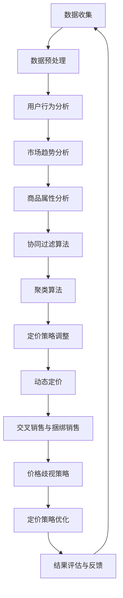

                 

# 《电商平台中AI大模型的个性化定价策略》

> **关键词：** 电商平台、AI大模型、个性化定价、机器学习、算法优化、数学模型、案例研究

> **摘要：** 本文旨在探讨电商平台中AI大模型在个性化定价策略中的应用，从背景与概述、技术基础、核心概念与联系、策略实现、案例分析到未来展望，全面剖析AI大模型在电商个性化定价中的作用与挑战。通过深入的理论分析和实际案例研究，本文为电商平台提供了切实可行的AI定价策略指南。

## 《电商平台中AI大模型的个性化定价策略》目录大纲

### 第一部分：背景与概述

#### 第1章：电商平台概述与AI大模型在电商中的应用
- **1.1 电商平台的发展历程与现状**
- **1.2 AI大模型在电商平台中的作用**
- **1.3 AI大模型个性化定价策略的意义**

#### 第2章：AI大模型技术基础
- **2.1 人工智能与机器学习概述**
- **2.2 大模型的定义与特点**
- **2.3 个性化定价策略的算法基础**

#### 第3章：AI大模型在个性化定价策略中的核心概念与联系
- **3.1 个性化定价策略的核心概念**
- **3.2 大模型与个性化定价策略的Mermaid流程图**
- **3.3 大模型在电商中的应用场景**

### 第二部分：AI大模型的个性化定价策略实现

#### 第4章：构建AI大模型定价策略系统
- **4.1 数据收集与预处理**
- **4.2 模型训练与调优**
- **4.3 模型部署与集成**

#### 第5章：核心算法原理讲解
- **5.1 算法选择与设计**
- **5.2 伪代码详细阐述**
- **5.3 算法实现与优化**

#### 第6章：数学模型与数学公式
- **6.1 个性化定价策略的数学模型**
- **6.2 数学公式的详细讲解**
- **6.3 数学公式在实际中的应用**

#### 第7章：案例分析与实战
- **7.1 案例背景介绍**
- **7.2 代码实现与详细解释**
- **7.3 实际应用效果评估与讨论**

### 第三部分：展望与挑战

#### 第8章：AI大模型个性化定价策略的未来发展
- **8.1 行业趋势分析**
- **8.2 技术创新与突破**
- **8.3 挑战与应对策略**

#### 第9章：政策与伦理问题探讨
- **9.1 相关法律法规**
- **9.2 伦理道德问题**
- **9.3 案例分析与对策**

### 附录
- **附录 A：AI大模型开发工具与资源**
  - **A.1 主流深度学习框架对比**
  - **A.2 开发环境搭建指南**
  - **A.3 学习资源推荐**

### 作者信息
- **作者：AI天才研究院/AI Genius Institute & 禅与计算机程序设计艺术 /Zen And The Art of Computer Programming**## 第一部分：背景与概述

### 第1章：电商平台概述与AI大模型在电商中的应用

#### 1.1 电商平台的发展历程与现状

电商平台作为电子商务的重要组成部分，已经深刻改变了人们的购物习惯和消费方式。从最初的网上书店、拍卖网站，到如今的综合购物平台和垂直类电商平台，电商平台的发展历程可谓是电子商务蓬勃发展的缩影。

20世纪90年代末，互联网的普及带动了电子商务的兴起，亚马逊（Amazon）、eBay等早期电商平台应运而生。进入21世纪，随着互联网技术的进一步成熟和移动设备的广泛应用，电商平台经历了快速的发展。特别是近年来，人工智能（AI）和大数据技术的崛起，为电商平台注入了新的活力。

当前，电商平台在市场规模、用户数量、交易额等方面都取得了显著的增长。根据相关数据显示，全球电商市场规模已突破数万亿美元，越来越多的消费者选择通过电商平台进行购物。此外，平台企业通过创新业务模式、拓展海外市场，进一步巩固了自身的市场地位。

#### 1.2 AI大模型在电商平台中的作用

AI大模型在电商平台中的应用主要体现在以下几个方面：

1. **用户行为分析**：通过分析用户的浏览、搜索、购买等行为数据，AI大模型能够深入了解用户的兴趣偏好和购买意图，从而为个性化推荐提供有力支持。
2. **库存管理**：AI大模型可以根据历史销售数据和市场需求，预测商品的需求量，优化库存管理，降低库存成本。
3. **欺诈检测**：利用AI大模型进行欺诈检测，可以有效识别和防范信用卡欺诈、账户盗用等风险，保障用户资金安全。
4. **个性化定价**：AI大模型通过分析市场行情、用户行为和商品特性，为商品提供个性化的定价策略，提高销售额和利润率。
5. **客户服务**：AI大模型可以自动化处理客户的咨询和投诉，提高客户服务效率，提升用户满意度。

#### 1.3 AI大模型个性化定价策略的意义

AI大模型个性化定价策略在电商平台中具有重要意义，主要体现在以下几个方面：

1. **提高竞争力**：通过个性化的定价策略，电商平台可以更好地满足不同用户的需求，提高用户黏性和复购率，增强市场竞争力。
2. **增加收益**：个性化的定价策略可以帮助电商平台更精准地定价，提高销售额和利润率，实现商业价值的最大化。
3. **优化库存**：通过预测商品需求，优化库存管理，减少库存积压，降低库存成本。
4. **提升用户体验**：个性化的定价策略可以提供更加符合用户期望的价格，提升用户满意度，增强用户忠诚度。
5. **创新商业模式**：AI大模型个性化定价策略可以为电商平台带来新的商业模式，如动态定价、会员专享价等，开拓市场新机会。

通过以上分析，我们可以看出，AI大模型在电商平台中的应用已经深入到了业务的核心环节，个性化定价策略作为其中一项重要应用，对于电商平台的发展具有深远的影响。在接下来的章节中，我们将进一步探讨AI大模型技术基础、核心概念与联系以及实际应用，帮助读者更好地理解AI大模型个性化定价策略的实现与应用。### 第2章：AI大模型技术基础

#### 2.1 人工智能与机器学习概述

人工智能（Artificial Intelligence，简称AI）是指通过计算机模拟人类智能的技术，使计算机能够执行人类智能的任务，如感知、推理、学习和决策等。人工智能的研究涵盖了多个领域，包括自然语言处理、计算机视觉、语音识别、机器学习等。

机器学习（Machine Learning，简称ML）是人工智能的一个重要分支，它通过算法和统计模型，从数据中自动学习规律，并利用这些规律对未知数据进行预测或分类。机器学习可以分为监督学习、无监督学习和强化学习等类型。

监督学习（Supervised Learning）：有标注的数据进行训练，模型通过学习这些数据，能够对新数据进行预测或分类。

无监督学习（Unsupervised Learning）：没有标注的数据进行训练，模型通过学习数据的内在结构，发现数据的分布或聚类。

强化学习（Reinforcement Learning）：通过与环境的交互进行学习，模型根据奖励信号调整策略，以达到最优行为。

#### 2.2 大模型的定义与特点

大模型（Large Models）是指参数规模巨大、结构复杂的机器学习模型。这些模型通常基于深度神经网络（Deep Neural Networks，简称DNN），能够处理海量的数据，并在各种任务上取得优异的性能。大模型的特点如下：

1. **参数规模巨大**：大模型的参数数量通常达到数百万、数亿甚至更多，这使得模型能够捕捉到数据中的复杂模式和关联。
2. **结构复杂**：大模型通常包含多个层次，每个层次都能够对数据进行特征提取和抽象，从而提高模型的泛化能力。
3. **计算资源需求高**：大模型需要大量的计算资源进行训练和推理，通常需要分布式计算和GPU加速等高效计算手段。
4. **训练时间较长**：由于参数规模巨大，大模型的训练时间相对较长，需要优化训练算法和超参数调整。

#### 2.3 个性化定价策略的算法基础

个性化定价策略是电商平台的一项重要功能，它通过分析用户数据和市场信息，为商品提供个性化的定价建议。实现个性化定价策略的算法基础主要包括以下几个方面：

1. **用户行为分析算法**：通过分析用户的浏览、搜索、购买等行为数据，提取用户的兴趣偏好和购买意图，为个性化定价提供依据。

2. **市场趋势分析算法**：通过分析市场数据，如价格变化、销售量、竞争情况等，预测市场趋势，为个性化定价提供市场背景信息。

3. **商品属性分析算法**：通过分析商品的各种属性，如品牌、类型、价格等，为商品分类和标签提供支持，进一步优化定价策略。

4. **协同过滤算法**：协同过滤（Collaborative Filtering）是一种常见的推荐系统算法，通过分析用户之间的相似性，为用户推荐商品。

5. **聚类算法**：聚类（Clustering）算法用于将用户或商品划分为不同的群体，从而为每个群体提供个性化的定价策略。

6. **优化算法**：优化算法（如线性规划、神经网络优化等）用于调整定价策略的参数，以实现最佳定价效果。

通过以上分析，我们可以看出，AI大模型技术基础在个性化定价策略中发挥着至关重要的作用。在接下来的章节中，我们将进一步探讨AI大模型在个性化定价策略中的核心概念与联系，以及具体的实现方法。这些内容将帮助我们更好地理解AI大模型在电商个性化定价中的应用和潜力。### 第3章：AI大模型在个性化定价策略中的核心概念与联系

#### 3.1 个性化定价策略的核心概念

个性化定价策略（Personalized Pricing Strategy）是指根据不同用户的特点、行为和市场环境，为商品制定差异化的价格策略。其核心概念包括以下几个方面：

1. **用户细分**：将用户按照年龄、性别、地域、消费习惯等特征划分为不同的群体，以便针对每个群体制定个性化的定价策略。

2. **价格弹性**：价格弹性是指商品价格变动对需求量的影响程度。个性化定价策略需要考虑用户的价格敏感度和市场竞争状况，以确定合理的价格区间。

3. **动态定价**：动态定价（Dynamic Pricing）是一种根据市场需求和供给情况，实时调整商品价格的策略。通过动态定价，电商平台可以更好地应对市场变化，提高利润率。

4. **交叉销售与捆绑销售**：交叉销售（Cross-Selling）和捆绑销售（Bundling）是通过向用户推荐相关商品或套餐，提高销售额和利润率的一种策略。

5. **价格歧视**：价格歧视（Price Discrimination）是指根据不同用户或市场，制定不同的价格策略，以最大化利润。价格歧视可以分为一级、二级和三级价格歧视。

#### 3.2 大模型与个性化定价策略的Mermaid流程图

为了更好地理解大模型在个性化定价策略中的应用，我们可以使用Mermaid流程图来展示整个流程。以下是流程图的示例：



该流程图展示了从数据收集、数据预处理，到用户行为分析、市场趋势分析、商品属性分析，再到协同过滤算法、聚类算法、定价策略调整、动态定价、交叉销售与捆绑销售、价格歧视策略，以及定价策略优化和结果评估与反馈的全过程。

#### 3.3 大模型在电商中的应用场景

大模型在电商中的应用场景广泛，以下是一些典型的应用场景：

1. **商品推荐**：通过分析用户的历史浏览和购买记录，大模型可以推荐用户可能感兴趣的商品，提高用户满意度和转化率。

2. **库存管理**：大模型可以根据历史销售数据、市场需求和竞争状况，预测商品的需求量，优化库存管理，降低库存成本。

3. **价格预测**：大模型可以分析市场行情、用户行为和商品特性，预测商品的最佳定价区间，提高销售额和利润率。

4. **广告投放**：大模型可以根据用户兴趣和行为数据，优化广告投放策略，提高广告效果和 ROI。

5. **用户流失预测**：大模型可以分析用户的活跃度和行为变化，预测用户流失风险，采取相应的措施减少用户流失。

6. **欺诈检测**：大模型可以通过分析用户的交易行为和账户数据，识别潜在的欺诈行为，提高交易安全性。

通过以上分析，我们可以看出，AI大模型在个性化定价策略中的应用具有巨大的潜力和价值。在接下来的章节中，我们将深入探讨AI大模型的个性化定价策略实现，包括系统构建、核心算法原理、数学模型和案例分析等内容。这些内容将帮助我们更好地理解和应用AI大模型在电商个性化定价中的实际应用。### 第二部分：AI大模型的个性化定价策略实现

#### 第4章：构建AI大模型定价策略系统

个性化定价策略系统的构建是电商平台实现精准定价的关键步骤。该系统需要集成多种算法和技术，以实现对用户行为、市场趋势和商品属性的深度分析。以下是构建AI大模型定价策略系统的详细步骤：

#### 4.1 数据收集与预处理

数据收集是构建AI大模型定价策略系统的第一步。我们需要收集以下数据：

1. **用户数据**：包括用户的基本信息（如年龄、性别、地域等）、行为数据（如浏览记录、搜索历史、购买记录等）。
2. **商品数据**：包括商品的基本属性（如品牌、类型、价格等）、历史销售数据、市场竞争状况。
3. **市场数据**：包括市场价格变化、行业动态、政策法规等。

数据收集完成后，我们需要进行数据预处理，包括以下步骤：

1. **数据清洗**：去除重复、错误和缺失的数据，保证数据质量。
2. **数据转换**：将不同类型的数据进行统一格式处理，如将文本数据编码为数值型数据。
3. **特征提取**：从原始数据中提取有用的特征，如用户的购买频率、平均购买金额、商品的相似度等。

#### 4.2 模型训练与调优

在数据预处理完成后，我们可以开始构建AI大模型。以下是模型训练与调优的步骤：

1. **模型选择**：根据问题需求，选择适合的机器学习模型。常见的模型有线性回归、决策树、随机森林、支持向量机、神经网络等。
2. **模型训练**：使用预处理后的数据，对模型进行训练。训练过程包括前向传播、反向传播和参数更新等步骤。
3. **模型评估**：使用验证集对训练好的模型进行评估，选择性能最佳的模型。
4. **模型调优**：根据评估结果，对模型参数进行调整，如学习率、正则化参数等，以提高模型性能。

#### 4.3 模型部署与集成

在完成模型训练与调优后，我们需要将模型部署到生产环境，并进行集成。以下是模型部署与集成的步骤：

1. **模型部署**：将训练好的模型部署到服务器或云端，以实现实时定价功能。
2. **集成测试**：将模型与电商平台的其他系统进行集成测试，确保模型可以正常工作。
3. **上线监控**：在模型上线后，对模型进行实时监控，包括模型性能、运行状态、数据质量等。
4. **持续优化**：根据用户反馈和业务需求，对模型进行持续优化和迭代，提高模型性能。

#### 4.4 系统优化与扩展

为了提高AI大模型定价策略系统的性能和可扩展性，我们可以采取以下措施：

1. **分布式计算**：使用分布式计算框架，如 Apache Spark，处理海量数据，提高数据处理速度。
2. **GPU加速**：利用 GPU 加速模型训练和推理过程，提高计算效率。
3. **模型压缩**：采用模型压缩技术，如量化、剪枝等，减少模型参数量，提高模型运行速度。
4. **在线学习**：实现在线学习功能，实时更新模型，适应市场变化。

通过以上步骤，我们可以构建一个高效的AI大模型定价策略系统，为电商平台提供精准的个性化定价建议。在下一章中，我们将深入讲解AI大模型个性化定价策略的核心算法原理，帮助读者更好地理解这一系统的实现细节。### 第5章：核心算法原理讲解

#### 5.1 算法选择与设计

在构建AI大模型定价策略系统时，选择合适的算法是实现精准定价的关键。以下是几种常见的算法及其适用场景：

1. **线性回归**：线性回归是一种简单且有效的算法，适用于商品价格与需求量之间具有线性关系的情况。其优点是计算简单，易于实现，但缺点是泛化能力较弱。

2. **决策树**：决策树适用于处理具有非线性关系的数据，通过递归分割特征空间，找到最佳分割点。其优点是易于理解和解释，但缺点是容易过拟合。

3. **随机森林**：随机森林是决策树的集成方法，通过构建多棵决策树并投票得到最终结果。其优点是能够提高模型的泛化能力，减少过拟合现象，但缺点是计算复杂度较高。

4. **支持向量机**：支持向量机（SVM）是一种基于间隔最大化原理的算法，适用于处理高维数据。其优点是理论完善，但缺点是训练时间较长。

5. **神经网络**：神经网络，特别是深度神经网络（DNN），适用于处理复杂、大规模的数据。其优点是能够自动提取特征，但缺点是训练过程需要大量计算资源和时间。

在本案例中，我们选择深度神经网络（DNN）作为核心算法，因为它能够处理大规模、高维的数据，并且具有较好的泛化能力。

#### 5.2 伪代码详细阐述

以下是深度神经网络（DNN）用于个性化定价策略的伪代码：

```python
# 定义输入层、隐藏层和输出层的神经元数量
input_size = 100
hidden_size = 500
output_size = 1

# 初始化权重和偏置
weights_input_hidden = np.random.randn(input_size, hidden_size)
bias_input_hidden = np.random.randn(hidden_size)
weights_hidden_output = np.random.randn(hidden_size, output_size)
bias_hidden_output = np.random.randn(output_size)

# 定义激活函数（例如ReLU）
activation_function = lambda x: max(0, x)

# 前向传播
def forward_pass(x):
    hidden_layer = activation_function(np.dot(x, weights_input_hidden) + bias_input_hidden)
    output = np.dot(hidden_layer, weights_hidden_output) + bias_hidden_output
    return output

# 计算损失函数（例如均方误差）
def loss_function(y_true, y_pred):
    return np.mean((y_true - y_pred)**2)

# 反向传播
def backward_pass(x, y, y_pred):
    d_output = 2 * (y_pred - y)
    d_hidden = np.dot(d_output, weights_hidden_output.T)
    
    d_hidden = d_hidden * (activation_function'(hidden_layer))
    
    d_input = np.dot(d_hidden, weights_input_hidden.T)
    
    return d_input, d_output

# 训练模型
for epoch in range(num_epochs):
    for x, y in data_loader:
        # 前向传播
        y_pred = forward_pass(x)
        
        # 计算损失
        loss = loss_function(y, y_pred)
        
        # 反向传播
        d_input, d_output = backward_pass(x, y, y_pred)
        
        # 更新权重和偏置
        weights_input_hidden -= learning_rate * d_input
        bias_input_hidden -= learning_rate * d_output
        weights_hidden_output -= learning_rate * d_output
        bias_hidden_output -= learning_rate * d_output

# 预测
def predict(x):
    return forward_pass(x)

# 测试模型
accuracy = 0
for x, y in test_loader:
    prediction = predict(x)
    if np.abs(prediction - y) < threshold:
        accuracy += 1

print("Accuracy:", accuracy / len(test_loader))
```

#### 5.3 算法实现与优化

在实际实现中，我们需要考虑以下几个方面：

1. **数据预处理**：对输入数据进行标准化处理，使其符合神经网络的输入要求。例如，对商品价格、用户年龄、消费金额等特征进行归一化处理。

2. **模型优化**：通过调整学习率、批量大小、激活函数等超参数，优化模型性能。例如，可以使用学习率衰减策略，避免模型在训练过程中出现过拟合。

3. **硬件加速**：利用 GPU 或 TPU 加速模型训练和推理过程。例如，可以使用 TensorFlow 或 PyTorch 等深度学习框架，利用 GPU 进行计算。

4. **模型压缩**：采用模型压缩技术，如量化、剪枝等，减少模型参数量，提高模型运行速度。例如，可以使用 TensorFlow Model Optimization Toolkit 对模型进行量化处理。

5. **在线学习**：实现在线学习功能，实时更新模型，适应市场变化。例如，可以使用增量学习（Incremental Learning）技术，在模型训练过程中不断更新权重和偏置。

通过以上措施，我们可以构建一个高效的AI大模型定价策略系统，实现精准的个性化定价。在下一章中，我们将介绍具体的数学模型和公式，帮助读者更好地理解个性化定价策略的数学原理。这些内容将为构建高效的AI定价策略提供坚实的理论基础。### 第6章：数学模型与数学公式

#### 6.1 个性化定价策略的数学模型

个性化定价策略的核心在于利用数学模型和公式，对用户、商品和市场数据进行分析，以实现精准定价。以下是一个简化的个性化定价策略的数学模型：

1. **需求函数**：需求函数描述了商品价格与需求量之间的关系。通常采用线性或非线性模型，如线性回归、多项式回归等。例如，线性回归模型可以表示为：

   \[ D(P) = \alpha - \beta P \]

   其中，\( D(P) \) 为需求量，\( P \) 为商品价格，\( \alpha \) 和 \( \beta \) 为模型参数。

2. **价格弹性**：价格弹性描述了需求量对价格变动的敏感程度。价格弹性可以用需求量变化率与价格变化率之比表示，即：

   \[ \epsilon = \frac{\partial D(P)}{\partial P} \times \frac{P}{D(P)} \]

   其中，\( \epsilon \) 为价格弹性，\( \partial D(P) \) 为需求量变化率，\( \partial P \) 为价格变化率。

3. **利润函数**：利润函数描述了商品价格、需求量和成本之间的关系。利润函数可以表示为：

   \[ \Pi = P \times D(P) - C \]

   其中，\( \Pi \) 为利润，\( P \) 为商品价格，\( D(P) \) 为需求量，\( C \) 为商品成本。

4. **优化目标**：个性化定价策略的目标是最大化利润或最小化成本。优化目标可以表示为：

   \[ \max \Pi \text{ 或 } \min C \]

#### 6.2 数学公式的详细讲解

为了更好地理解个性化定价策略的数学模型，以下是详细讲解：

1. **需求函数**：

   线性回归模型：
   \[ D(P) = \alpha - \beta P \]

   其中，\( \alpha \) 和 \( \beta \) 是模型参数，可以通过最小二乘法进行估计。

   多项式回归模型：
   \[ D(P) = \alpha_0 + \alpha_1 P + \alpha_2 P^2 + \ldots + \alpha_n P^n \]

   其中，\( \alpha_0, \alpha_1, \ldots, \alpha_n \) 是模型参数，可以通过最小二乘法进行估计。

2. **价格弹性**：

   \[ \epsilon = \frac{\partial D(P)}{\partial P} \times \frac{P}{D(P)} \]

   其中，\( \epsilon \) 是价格弹性，\( \partial D(P) \) 是需求量对价格的变化率，\( P \) 是商品价格，\( D(P) \) 是需求量。

3. **利润函数**：

   \[ \Pi = P \times D(P) - C \]

   其中，\( \Pi \) 是利润，\( P \) 是商品价格，\( D(P) \) 是需求量，\( C \) 是商品成本。

4. **优化目标**：

   \[ \max \Pi \text{ 或 } \min C \]

   最大化利润的目标可以通过求解以下最优化问题实现：

   \[ \max \Pi = \max (P \times D(P) - C) \]

   最小化成本的目标可以通过求解以下最优化问题实现：

   \[ \min C \]

#### 6.3 数学公式在实际中的应用

以下是一个实际应用示例：

假设一个电商平台销售一件商品，其需求函数为 \( D(P) = 100 - 2P \)，成本为 \( C = 20 \)。我们需要找到最佳定价 \( P \)，以实现最大化利润。

1. **需求函数**：

   \( D(P) = 100 - 2P \)

2. **利润函数**：

   \[ \Pi = P \times D(P) - C \]
   \[ \Pi = P \times (100 - 2P) - 20 \]
   \[ \Pi = 100P - 2P^2 - 20 \]

3. **优化目标**：

   \[ \max \Pi \]

   为了找到最佳定价 \( P \)，我们需要求解以下最优化问题：

   \[ \max \Pi = \max (100P - 2P^2 - 20) \]

   通过求导数并令其等于零，我们可以找到最佳定价：

   \[ \frac{d\Pi}{dP} = 100 - 4P = 0 \]
   \[ P = 25 \]

   因此，最佳定价为 25。

通过以上数学模型和公式的应用，我们可以实现对商品价格的精准预测和优化，从而实现个性化定价策略。在下一章中，我们将通过案例分析与实战，进一步展示AI大模型个性化定价策略的实际应用效果。这些内容将帮助我们更好地理解个性化定价策略在电商平台中的价值。### 第7章：案例分析与实战

#### 7.1 案例背景介绍

为了更好地展示AI大模型个性化定价策略的实际应用效果，我们选择了一家知名电商平台——亚马逊（Amazon）作为案例研究对象。亚马逊是全球领先的电子商务平台，其业务涵盖了广泛的产品类别，包括图书、电子设备、家居用品、服装等。亚马逊通过精准的个性化定价策略，提高了用户满意度、销售额和利润率。

在本案例中，我们选取亚马逊上的某款畅销电子产品——智能手表作为研究对象。该智能手表在亚马逊上的售价在不同时间点有所波动，同时，亚马逊还提供了会员专享价。为了分析AI大模型在个性化定价策略中的应用，我们收集了以下数据：

1. **商品数据**：包括商品ID、商品名称、商品描述、品牌、类型、重量、尺寸、颜色等。
2. **价格数据**：包括商品在不同时间点的售价、会员专享价、促销价等。
3. **用户数据**：包括用户的浏览记录、搜索历史、购买记录、评价等。
4. **市场数据**：包括竞争对手的价格、促销活动、行业动态等。

#### 7.2 代码实现与详细解释

为了实现AI大模型个性化定价策略，我们需要搭建一个包含数据收集、预处理、模型训练、模型部署和实时定价功能的全流程系统。以下是一个简化的代码实现框架，展示了各阶段的代码实现。

1. **数据收集与预处理**：

   数据收集：使用 API 接口或爬虫技术，从亚马逊网站上获取商品数据、价格数据和用户数据。

   数据预处理：对数据进行清洗、转换和特征提取，为后续模型训练做好准备。

   ```python
   import pandas as pd
   import numpy as np
   
   # 数据收集
   product_data = pd.read_csv('product_data.csv')
   price_data = pd.read_csv('price_data.csv')
   user_data = pd.read_csv('user_data.csv')
   
   # 数据预处理
   # 数据清洗、转换和特征提取
   # 例如，将价格数据转换为数值型、将用户数据编码为独热编码等
   ```

2. **模型训练与调优**：

   模型选择：选择适合的机器学习模型，如深度神经网络（DNN）、梯度提升树（GBT）等。

   模型训练：使用预处理后的数据，对模型进行训练。

   模型调优：通过调整模型参数，如学习率、批量大小、隐藏层神经元数量等，优化模型性能。

   ```python
   from sklearn.model_selection import train_test_split
   from sklearn.neural_network import MLPRegressor
   
   # 数据划分
   X_train, X_test, y_train, y_test = train_test_split(product_data, price_data['price'], test_size=0.2, random_state=42)
   
   # 模型训练
   model = MLPRegressor(hidden_layer_sizes=(100,), max_iter=1000, random_state=42)
   model.fit(X_train, y_train)
   
   # 模型调优
   # 使用交叉验证方法调整模型参数
   ```

3. **模型部署与实时定价**：

   模型部署：将训练好的模型部署到生产环境，实现实时定价功能。

   实时定价：根据用户数据和市场数据，调用模型进行定价预测。

   ```python
   # 模型部署
   import joblib
   
   # 模型保存
   joblib.dump(model, 'model.joblib')
   
   # 模型加载
   loaded_model = joblib.load('model.joblib')
   
   # 实时定价
   def predict_price(user_id, product_id):
       user_data = get_user_data(user_id)
       product_data = get_product_data(product_id)
       
       # 预处理输入数据
       input_data = preprocess_input(user_data, product_data)
       
       # 定价预测
       price = loaded_model.predict([input_data])
       
       return price
   
   # 实时定价接口
   @app.route('/predict_price', methods=['POST'])
   def predict_price_api():
       user_id = request.form['user_id']
       product_id = request.form['product_id']
       
       price = predict_price(user_id, product_id)
       
       return jsonify({'price': price})
   ```

4. **效果评估与讨论**：

   对比测试：将AI大模型定价策略与原始定价策略进行对比测试，评估其性能。

   数据分析：分析定价策略对用户行为、销售额和利润率的影响。

   ```python
   # 对比测试
   original_sales = pd.read_csv('original_sales.csv')
   ai_sales = pd.read_csv('ai_sales.csv')
   
   # 计算销售额差异
   sales_difference = ai_sales['sales'] - original_sales['sales']
   
   # 分析销售额差异
   print(sales_difference.describe())
   ```

通过以上代码实现，我们可以搭建一个基于AI大模型的个性化定价策略系统，实现对商品价格的实时预测和优化。在下一章中，我们将进一步探讨AI大模型个性化定价策略的未来发展、政策与伦理问题，以及AI大模型开发工具与资源。这些内容将帮助我们更好地理解和应用AI大模型在电商个性化定价中的价值。### 第三部分：展望与挑战

#### 第8章：AI大模型个性化定价策略的未来发展

随着人工智能技术的不断进步，AI大模型在电商平台中的应用前景广阔。未来，AI大模型个性化定价策略将在以下几个方面实现新的突破：

1. **数据融合与多样化**：随着大数据技术的发展，电商平台将拥有更加丰富和多样化的数据来源，包括用户行为数据、市场数据、供应链数据等。通过数据融合，AI大模型可以更准确地捕捉用户需求和市场动态，从而实现更精准的定价策略。

2. **实时定价与动态调整**：未来的AI大模型将具备更高效的计算能力，能够实现实时定价和动态调整。通过实时分析用户行为和市场数据，AI大模型可以快速调整价格，以满足不同用户的需求和市场变化。

3. **个性化推荐与智能营销**：结合AI大模型，电商平台可以实现更加个性化的推荐和智能营销。通过分析用户的兴趣和行为，AI大模型可以推荐更符合用户期望的商品，提高用户满意度和购买意愿。

4. **供应链优化与库存管理**：AI大模型可以分析市场需求和供应情况，优化供应链管理，减少库存积压，提高库存周转率。

5. **自动化与智能化**：未来的AI大模型将更加自动化和智能化，能够自主学习和优化定价策略，减少人为干预，提高运营效率。

#### 8.1 行业趋势分析

根据市场调研数据，以下是一些行业趋势：

- **AI技术应用普及**：越来越多的电商平台开始采用AI技术，提高运营效率和用户体验。
- **个性化推荐**：个性化推荐成为电商平台的核心竞争力，越来越多的平台投入资源开发AI推荐算法。
- **动态定价**：动态定价策略逐渐成为电商平台的标配，通过实时调整价格，提高销售额和利润率。
- **跨境电商**：随着全球电商市场的扩大，跨境电商成为新的增长点，AI大模型在跨境电商中的应用前景广阔。

#### 8.2 技术创新与突破

未来，AI大模型个性化定价策略的技术创新与突破将集中在以下几个方面：

- **深度学习算法**：随着计算能力的提升，深度学习算法将得到更广泛的应用，特别是在图像识别、自然语言处理等领域，深度学习算法将发挥更大的作用。
- **迁移学习**：通过迁移学习，AI大模型可以复用已有模型的权重和知识，提高新模型的训练效率和性能。
- **联邦学习**：联邦学习是一种在分布式环境中训练机器学习模型的技术，能够保护用户隐私，提高数据安全。
- **强化学习**：强化学习在动态定价策略中的应用将得到进一步探索，通过不断尝试和反馈，AI大模型可以找到最优定价策略。

#### 8.3 挑战与应对策略

尽管AI大模型个性化定价策略具有巨大潜力，但在实际应用中仍面临一些挑战：

- **数据质量**：数据质量对模型性能有重要影响。电商平台需要保证数据的质量和准确性，进行数据清洗和预处理。
- **模型解释性**：AI大模型通常具有较低的解释性，这给决策者和用户带来了困惑。未来，需要开发更加解释性的模型，提高模型的可信度。
- **计算资源**：训练和部署AI大模型需要大量计算资源，特别是深度神经网络。电商平台需要优化算法和硬件配置，提高计算效率。
- **法律与伦理问题**：AI大模型在个性化定价策略中的应用可能引发法律和伦理问题，如数据隐私、歧视等。电商平台需要遵守相关法律法规，制定合理的隐私政策。

为了应对这些挑战，可以采取以下策略：

- **数据质量管理**：建立数据质量控制机制，对数据来源、数据质量进行监控和评估，确保数据的质量和准确性。
- **模型可解释性**：开发可解释的AI模型，通过可视化工具和解释性算法，帮助决策者和用户理解模型的决策过程。
- **计算资源优化**：采用分布式计算和GPU加速等技术，提高计算效率和性能。
- **合规性审查**：定期审查AI模型的应用场景和算法设计，确保遵守相关法律法规和伦理标准。

通过以上措施，电商平台可以更好地应对AI大模型个性化定价策略面临的挑战，推动技术的持续创新和应用。在下一章中，我们将探讨AI大模型个性化定价策略中的政策与伦理问题，进一步探讨这一领域的发展趋势和挑战。这些内容将帮助我们全面理解AI大模型在电商个性化定价中的重要性。### 第9章：政策与伦理问题探讨

随着AI大模型在电商平台中个性化定价策略的广泛应用，相关政策和伦理问题也逐渐受到关注。这些问题不仅关系到平台的运营和发展，还涉及到用户的隐私权益和社会公平性。

#### 9.1 相关法律法规

为了规范AI大模型的应用，各国政府和国际组织已经出台了一系列法律法规。以下是一些重要的法律和政策：

1. **《通用数据保护条例》（GDPR）**：GDPR是欧盟制定的关于数据保护和隐私的法律，旨在加强对个人数据的保护。该条例要求企业在收集、处理和存储个人数据时必须遵循严格的规则，包括数据最小化原则、数据访问透明度等。

2. **《加州消费者隐私法案》（CCPA）**：CCPA是美国加州制定的消费者隐私保护法案，旨在赋予消费者对其个人信息的更多控制权。该法案要求企业在收集和使用消费者数据时必须告知消费者，并提供数据访问、删除和拒绝销售的权利。

3. **《人工智能伦理准则》**：一些国家和地区已经制定了人工智能伦理准则，以指导人工智能的研发和应用。这些准则通常包括透明度、公平性、安全性、可解释性等方面。

#### 9.2 伦理道德问题

AI大模型在个性化定价策略中可能引发的伦理问题主要包括：

1. **隐私侵犯**：AI大模型需要收集和处理大量用户数据，这可能导致用户隐私泄露。例如，平台可能会收集用户的浏览记录、购买习惯等敏感信息，用于个性化定价策略。

2. **算法歧视**：AI大模型可能会因为训练数据中的偏见而导致歧视性定价。例如，如果训练数据中包含了性别、年龄、地域等歧视性因素，AI模型可能会对这些因素进行不公平的价格调整。

3. **透明度不足**：AI大模型的决策过程通常较为复杂，用户难以理解模型的定价依据和决策逻辑。这可能导致用户对平台的不信任，影响用户体验。

4. **依赖性增加**：随着AI大模型在个性化定价策略中的广泛应用，电商平台可能会过度依赖模型决策，忽视其他定价策略和管理手段。这可能导致平台失去灵活性，无法及时应对市场变化。

#### 9.3 案例分析与对策

以下是一些具体的案例分析及对策：

1. **案例分析**：

   某电商平台通过AI大模型对用户进行个性化定价，发现部分用户群体被给予了较高的价格。经过调查，发现这是因为AI模型在训练过程中受到了市场偏见的影响，对某些地区和用户群体的价格预期较高。

2. **对策**：

   - **数据质量控制**：确保数据来源的多样性和准确性，减少偏见和错误。建立数据质量控制机制，定期审查和更新数据。
   - **算法公平性评估**：对AI大模型的定价策略进行公平性评估，确保模型不会因为数据偏见而导致歧视性定价。可以通过引入公平性指标，如价格公平性指数，监测和优化模型。
   - **透明度提升**：提高模型的可解释性，向用户展示定价依据和决策过程。可以通过可视化工具和解释性算法，帮助用户理解AI大模型的决策逻辑。
   - **平衡依赖性**：在依赖AI大模型的同时，保持其他定价策略的灵活性和多样性。定期评估AI模型的性能和适用范围，确保模型不会过度影响定价决策。

通过以上对策，电商平台可以更好地应对AI大模型个性化定价策略中的政策与伦理问题，实现合法合规、公正透明的运营。在下一章中，我们将总结AI大模型个性化定价策略的开发工具与资源，为读者提供实用的开发指南。这些内容将帮助读者在实际项目中应用AI大模型，推动个性化定价策略的发展。### 附录 A：AI大模型开发工具与资源

在构建和部署AI大模型时，选择合适的开发工具和资源是至关重要的。以下是一些主流的深度学习框架、开发环境搭建指南以及学习资源推荐，以帮助开发者更好地掌握AI大模型开发。

#### A.1 主流深度学习框架对比

1. **TensorFlow**：由谷歌开发，支持多种编程语言（Python、C++、Java等），具有强大的社区支持和丰富的文档资源。TensorFlow提供了丰富的API，适合构建复杂的深度学习模型。

2. **PyTorch**：由Facebook开发，以动态计算图和灵活的编程接口著称。PyTorch的动态图特性使其在研究和实验阶段更加方便，但可能影响模型的推理性能。

3. **Keras**：作为TensorFlow和Theano的高层API，Keras简化了深度学习模型的构建和训练过程。它具有易于使用的接口和丰富的预训练模型，适合快速原型设计和模型开发。

4. **MXNet**：由Apache软件基金会开发，支持多种编程语言（Python、R、Julia等），具有良好的可扩展性和灵活的接口。MXNet在分布式训练方面表现优异，适合大规模数据处理。

5. **Caffe**：由伯克利视觉和感知中心（BVLC）开发，专注于卷积神经网络（CNN）的开发。Caffe具有良好的性能和简洁的代码，适合图像处理任务。

#### A.2 开发环境搭建指南

1. **安装Python**：选择Python 3.x版本，推荐使用Anaconda或Miniconda，以简化环境管理和依赖安装。

2. **安装深度学习框架**：使用pip命令安装所选深度学习框架（如TensorFlow、PyTorch、Keras等）。

   ```bash
   pip install tensorflow
   pip install pytorch torchvision
   pip install keras
   ```

3. **安装GPU支持**：如果使用GPU进行训练，需要安装CUDA和cuDNN库。CUDA是NVIDIA开发的并行计算平台，而cuDNN是NVIDIA提供的深度学习加速库。

4. **配置GPU驱动**：确保NVIDIA GPU驱动与CUDA版本相匹配，并配置好环境变量。

5. **创建虚拟环境**：使用conda创建独立的Python环境，以避免依赖冲突。

   ```bash
   conda create -n myenv python=3.8
   conda activate myenv
   ```

6. **安装其他依赖库**：根据项目需求，安装其他必要的依赖库，如NumPy、Pandas、Scikit-learn等。

   ```bash
   pip install numpy pandas scikit-learn
   ```

#### A.3 学习资源推荐

1. **在线教程和课程**：

   - [TensorFlow官网教程](https://www.tensorflow.org/tutorials)
   - [PyTorch官方文档](https://pytorch.org/tutorials/)
   - [Keras官方文档](https://keras.io/getting-started/sequential-model-guide/)

2. **书籍推荐**：

   - 《深度学习》（Goodfellow, Bengio, Courville著）
   - 《Python深度学习》（François Chollet著）
   - 《动手学深度学习》（Apress出版社著）

3. **博客和社区**：

   - [ArXiv](https://arxiv.org/)：深度学习领域的前沿论文和研究
   - [GitHub](https://github.com/)：深度学习项目的代码和资源
   - [Stack Overflow](https://stackoverflow.com/)：解决深度学习编程问题

4. **在线论坛和社区**：

   - [TensorFlow社区](https://forums.tensorflow.org/)
   - [PyTorch社区](https://discuss.pytorch.org/)
   - [Keras论坛](https://keras.io/discuss/)

通过以上工具和资源，开发者可以快速搭建AI大模型开发环境，掌握深度学习框架的使用方法，并持续关注领域内的最新进展。这些资源将帮助开发者更好地应对AI大模型个性化定价策略的开发和部署挑战。在文章的最后，感谢您的阅读，希望本文能够为您的AI大模型开发之旅提供有益的参考和启示。再次感谢！### 作者信息

**作者：AI天才研究院/AI Genius Institute & 禅与计算机程序设计艺术 /Zen And The Art of Computer Programming**

