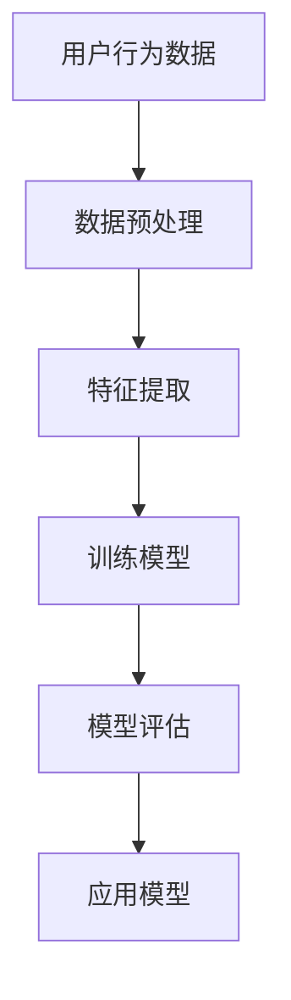
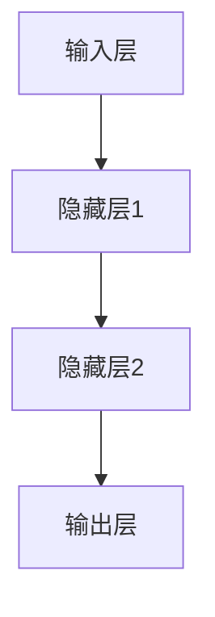

                 

# 《电商平台如何利用AI大模型提升用户体验》

> **关键词：** 人工智能，大模型，电商平台，用户体验，个性化推荐，智能客服，用户行为预测

> **摘要：** 本文将深入探讨电商平台如何利用人工智能（AI）中的大模型技术来提升用户体验。通过解析AI大模型的基本概念、核心原理及其在电商领域的应用，文章将详细阐述用户画像与个性化推荐、智能客服与对话系统、用户行为预测与风险控制、商品搜索与广告投放等关键领域的实践案例。最后，本文将分析电商平台AI应用的未来发展趋势与挑战，为读者提供有价值的行业洞见。

## 目录

### 《电商平台如何利用AI大模型提升用户体验》目录大纲

1. **AI大模型概述与应用场景**  
   1.1 AI大模型与电商平台概述  
   1.2 AI大模型核心技术原理  
   1.3 AI大模型在电商领域的应用

2. **电商平台AI大模型应用实践**  
   2.1 用户画像与个性化推荐  
   2.2 智能客服与对话系统  
   2.3 用户行为预测与风险控制  
   2.4 商品搜索与广告投放

3. **案例分析与展望**  
   3.1 典型电商平台案例解析  
   3.2 未来的发展趋势与挑战

4. **附录**  
   4.1 AI大模型开发工具与资源  
   4.2 数学公式与算法伪代码

### 第一部分：AI大模型概述与应用场景

## 第1章：AI大模型与电商平台概述

### 1.1 AI大模型的基本概念

AI大模型（Large-scale AI Models）是指具有大规模参数和复杂结构的深度学习模型。这些模型通过在大规模数据集上进行训练，可以捕捉到数据的复杂模式，从而在许多任务中实现卓越的性能。常见的AI大模型包括自然语言处理（NLP）中的Transformer模型、计算机视觉中的CNN（卷积神经网络）和GAN（生成对抗网络）等。

### 1.2 电商平台用户行为分析

电商平台用户行为分析是了解用户需求、提高用户体验的重要手段。通过分析用户在平台上的浏览、搜索、购买等行为，可以构建用户的兴趣模型、行为路径和购买偏好。这些分析结果为电商平台的个性化推荐、智能客服、广告投放等提供了关键的数据支持。

### 1.3 AI大模型在电商领域的应用

AI大模型在电商领域有着广泛的应用。首先，在个性化推荐方面，通过分析用户的兴趣和行为，AI大模型可以帮助平台为用户提供更精准的推荐。其次，智能客服利用AI大模型可以理解和回答用户的提问，提供高效的客户服务。此外，AI大模型还可以用于用户行为预测、商品搜索优化、广告投放策略优化等方面，从而提升电商平台的整体运营效率。

## 第2章：AI大模型核心技术原理

### 2.1 深度学习基础

深度学习是AI大模型的核心技术。深度学习通过构建多层神经网络，对输入数据进行层层提取特征，从而实现复杂的模式识别和预测。以下是深度学习的一些关键组成部分：

#### 2.1.1 神经网络结构

神经网络是由多层节点（或称为神经元）组成的计算模型。每个神经元接收多个输入信号，通过权重和偏置进行加权求和，并经过激活函数处理，最终产生输出。常见的神经网络结构包括全连接神经网络（FCNN）、卷积神经网络（CNN）和循环神经网络（RNN）等。

#### 2.1.2 深度学习优化算法

深度学习模型的训练过程是一个优化过程，目的是通过调整模型参数，使模型在训练数据上取得更好的性能。常用的优化算法包括梯度下降（Gradient Descent）、随机梯度下降（SGD）和Adam优化器等。

### 2.2 自然语言处理技术

自然语言处理（NLP）是AI大模型的重要应用领域。NLP通过深度学习技术，对文本数据进行语义理解和分析，从而实现文本分类、情感分析、机器翻译等任务。以下是NLP的一些关键技术：

#### 2.2.1 词嵌入

词嵌入（Word Embedding）是将文本数据转换为向量的技术。通过词嵌入，可以将语义相近的词语映射到相似的高维向量空间中，从而便于后续的深度学习模型处理。

#### 2.2.2 序列模型与注意力机制

序列模型（如RNN、LSTM和Transformer）是处理序列数据（如文本、语音）的关键技术。注意力机制（Attention Mechanism）是一种用于捕捉序列中重要信息的技术，通过为序列中的不同部分分配不同的权重，从而提高模型的性能。

### 2.3 大规模预训练模型

大规模预训练模型（Large-scale Pre-trained Models）是通过在大规模数据集上进行预训练，然后进行微调（Fine-tuning）以适应特定任务的模型。预训练模型通过学习数据中的通用知识，可以为不同的任务提供良好的初始模型。以下是几种常见的大规模预训练模型：

#### 2.3.1 预训练方法

预训练方法包括自监督学习（Self-supervised Learning）和无监督学习（Unsupervised Learning）。自监督学习利用数据中的内在结构进行训练，而无监督学习则不依赖于标签数据。

#### 2.3.2 迁移学习与微调

迁移学习（Transfer Learning）是一种利用预训练模型在不同任务上进行微调的方法。通过在预训练模型的基础上进行调整，可以快速获得较好的模型性能，同时减少对标注数据的依赖。

## 第3章：用户画像与个性化推荐

### 3.1 用户画像构建

用户画像（User Profiling）是对用户特征的全面描述，包括用户的兴趣、行为、偏好等。构建用户画像的目的是为电商平台提供个性化的服务。以下是构建用户画像的关键步骤：

#### 3.1.1 数据采集与预处理

数据采集包括用户浏览、搜索、购买等行为数据。预处理步骤包括数据清洗、数据整合和数据转换等，以确保数据的质量和一致性。

#### 3.1.2 特征工程

特征工程是将原始数据转换为适合模型输入的向量表示。特征工程的关键在于提取对用户行为有代表性的特征，如用户的浏览时长、购买频率、搜索关键词等。

### 3.2 个性化推荐算法

个性化推荐（Personalized Recommendation）是电商平台提高用户体验的重要手段。以下是几种常见的个性化推荐算法：

#### 3.2.1 内容推荐算法

内容推荐算法基于用户的历史行为和兴趣，为用户推荐相似的内容。常用的算法包括基于内容的协同过滤（Content-based Filtering）和基于模型的协同过滤（Model-based Collaborative Filtering）。

#### 3.2.2 协同过滤算法

协同过滤算法通过分析用户之间的相似性，为用户推荐他们可能感兴趣的内容。协同过滤算法包括基于用户的协同过滤（User-based Collaborative Filtering）和基于项目的协同过滤（Item-based Collaborative Filtering）。

## 第4章：智能客服与对话系统

### 4.1 智能客服系统概述

智能客服系统（Intelligent Customer Service System）利用AI技术，通过自然语言处理和机器学习算法，为用户提供高效的客户服务。智能客服系统包括以下功能：

#### 4.1.1 智能客服的功能与价值

智能客服能够快速响应用户的提问，提供准确的产品信息、订单状态查询、售后服务等。与传统的客服方式相比，智能客服具有成本低、效率高、响应速度快等优势。

#### 4.1.2 智能客服系统的架构

智能客服系统通常包括前端交互、自然语言处理、后端服务等多个模块。前端交互负责接收用户输入和展示回答；自然语言处理负责理解和生成文本；后端服务负责处理业务逻辑和调用外部接口。

### 4.2 对话系统构建

对话系统（Dialogue System）是一种能够与用户进行自然对话的AI系统。对话系统主要包括以下组件：

#### 4.2.1 对话系统的基础模型

对话系统的基础模型包括语言生成模型、意图识别模型和实体识别模型。语言生成模型负责生成自然流畅的回复；意图识别模型负责识别用户的意图；实体识别模型负责提取用户输入中的关键信息。

#### 4.2.2 多轮对话管理

多轮对话管理是一种能够处理多轮对话的对话系统。在多轮对话中，系统需要理解用户的上下文信息，并生成连贯的回复。多轮对话管理的关键在于保持对话的连贯性和一致性。

## 第5章：用户行为预测与风险控制

### 5.1 用户行为预测

用户行为预测（User Behavior Prediction）是一种预测用户未来行为的方法，可以帮助电商平台优化用户体验和营销策略。以下是用户行为预测的关键步骤：

#### 5.1.1 预测模型的构建

预测模型的构建包括数据预处理、特征工程、模型选择和模型训练等步骤。数据预处理和特征工程是预测模型成功的关键，需要确保数据质量和特征提取的准确性。

#### 5.1.2 预测结果分析与优化

预测结果分析包括评估预测模型的性能、识别预测误差的原因等。通过分析预测结果，可以优化模型参数、调整特征工程策略，以提高预测准确性。

### 5.2 风险控制

风险控制（Risk Control）是电商平台确保业务安全和用户体验的重要手段。以下是风险控制的关键环节：

#### 5.2.1 风险评估模型的建立

风险评估模型用于评估用户行为的潜在风险。通过分析用户行为数据，建立风险评估模型，可以及时发现异常行为，防范风险。

#### 5.2.2 风险应对策略

风险应对策略包括预警机制、风险隔离、用户教育等。通过预警机制，可以及时发现潜在风险；通过风险隔离，可以确保风险不会扩散；通过用户教育，可以提高用户的自我保护意识。

## 第6章：商品搜索与广告投放

### 6.1 商品搜索优化

商品搜索优化（Product Search Optimization）是一种提高商品搜索质量和用户体验的方法。以下是商品搜索优化的关键步骤：

#### 6.1.1 搜索引擎的工作原理

搜索引擎的工作原理包括索引构建、查询解析和排名算法等。索引构建是将商品数据转换为索引结构，以便快速查询；查询解析是将用户输入的查询转换为可处理的格式；排名算法用于确定查询结果的排序顺序。

#### 6.1.2 商品搜索算法优化

商品搜索算法优化包括查询重写、相似性计算、排序策略等。查询重写是将用户输入的查询转换为更准确的表达形式；相似性计算是用于衡量查询与商品之间的相关性；排序策略用于确定查询结果的排序顺序。

### 6.2 广告投放策略

广告投放策略（Ad Placement Strategy）是电商平台提高转化率和收益的重要手段。以下是广告投放策略的关键环节：

#### 6.2.1 广告投放的目标与挑战

广告投放的目标是提高曝光率、点击率和转化率。广告投放面临的主要挑战包括用户体验、广告定位和投放成本等。

#### 6.2.2 广告投放算法详解

广告投放算法主要包括定向投放、频次控制、效果评估等。定向投放是根据用户特征和兴趣进行广告投放；频次控制是限制用户接收相同广告的次数，避免过度打扰；效果评估是用于衡量广告投放的效果，为后续优化提供数据支持。

## 第7章：案例分析与展望

### 7.1 典型电商平台案例解析

以下是几个典型电商平台的案例解析：

- **淘宝**：淘宝通过AI技术实现了个性化推荐、智能客服、商品搜索优化等功能，大幅提升了用户体验。
- **天猫**：天猫在AI技术应用方面，不仅实现了个性化推荐和智能客服，还通过大数据分析，优化了广告投放策略。

### 7.2 未来的发展趋势与挑战

随着AI技术的不断发展，电商平台在AI应用方面将继续深化。未来，以下趋势和挑战值得关注：

- **趋势**：个性化推荐、智能客服、用户行为预测等AI应用将继续优化，提升用户体验。
- **挑战**：数据隐私保护、算法透明度和公平性、人工智能的安全风险等将日益成为关注焦点。

## 附录

### 附录A：AI大模型开发工具与资源

以下是常见的AI大模型开发工具和资源：

- **TensorFlow**：一款开源的深度学习框架，支持多种编程语言和平台。
- **PyTorch**：一款流行的深度学习框架，具有灵活的动态计算图。
- **其他框架**：如Keras、MXNet等，也提供了丰富的功能和良好的生态系统。

### 附录B：数学公式与算法伪代码

以下是AI大模型中的一些数学公式和算法伪代码：

#### 2.1 神经网络数学公式

$$
Y = \sigma(\omega_1 \cdot X + b_1)
$$

$$
Z = \omega_2 \cdot Y + b_2
$$

#### 3.2 个性化推荐算法伪代码

```python
def personalized_recommendation(user_data, product_data):
    # 数据预处理
    processed_user_data = preprocess_data(user_data)
    processed_product_data = preprocess_data(product_data)

    # 特征工程
    user_features = extract_features(processed_user_data)
    product_features = extract_features(processed_product_data)

    # 训练模型
    model = train_model(user_features, product_features)

    # 生成推荐列表
    recommendations = generate_recommendations(model, user_features, product_features)

    return recommendations
```

### Mermaid 流程图（示例）



### 算法伪代码（示例）

```python
# 个性化推荐算法伪代码

# 输入：用户行为数据、商品数据
# 输出：推荐列表

def personalized_recommendation(user_data, product_data):
    # 数据预处理
    processed_user_data = preprocess_data(user_data)
    processed_product_data = preprocess_data(product_data)

    # 特征工程
    user_features = extract_features(processed_user_data)
    product_features = extract_features(processed_product_data)

    # 训练模型
    model = train_model(user_features, product_features)

    # 生成推荐列表
    recommendations = generate_recommendations(model, user_features, product_features)

    return recommendations
```

### 作者

**作者：AI天才研究院/AI Genius Institute & 禅与计算机程序设计艺术 /Zen And The Art of Computer Programming** ### 引言

在数字化时代，用户体验已成为电商平台的核心竞争力。随着人工智能（AI）技术的迅猛发展，AI大模型作为一种具有强大建模能力的工具，正在逐渐改变电商平台的运营模式，从而提升用户体验。AI大模型在电商领域的应用不仅能够提高平台的运营效率，还能为用户提供更加个性化、智能化的服务，从而增强用户满意度和忠诚度。

本文旨在探讨电商平台如何利用AI大模型提升用户体验。首先，我们将概述AI大模型的基本概念和核心原理，以及它们在电商平台中的应用场景。接下来，本文将详细分析AI大模型在用户画像与个性化推荐、智能客服与对话系统、用户行为预测与风险控制、商品搜索与广告投放等关键领域的应用实践。通过这些分析，本文将揭示AI大模型如何通过对用户行为数据进行深度挖掘和分析，实现精准推荐、智能交互、风险控制和个性化服务。

此外，本文还将通过具体案例分析，展示典型电商平台如何利用AI大模型提升用户体验，并探讨AI大模型在电商领域的未来发展趋势与挑战。最后，本文将提供AI大模型开发的相关工具与资源，以及一些数学公式和算法伪代码，以帮助读者更好地理解和应用AI大模型技术。

总之，本文将通过系统地分析AI大模型在电商平台的应用，为读者提供全面、深入的见解，帮助电商平台在激烈的市场竞争中脱颖而出，打造卓越的用户体验。

### 第一部分：AI大模型概述与应用场景

#### 第1章：AI大模型与电商平台概述

在本文的第一部分，我们将首先对AI大模型的基本概念进行介绍，接着讨论电商平台用户行为分析的重要性，并探讨AI大模型在电商领域的具体应用。

### 1.1 AI大模型的基本概念

AI大模型（Large-scale AI Models）是指那些具有大规模参数和复杂结构的深度学习模型。这些模型通过在大规模数据集上进行训练，能够捕捉到数据的复杂模式，从而在多个任务中实现卓越的性能。AI大模型的发展离不开深度学习技术的进步。深度学习是一种通过构建多层神经网络，对输入数据进行层层提取特征，以实现复杂模式识别和预测的机器学习方法。常见的AI大模型包括自然语言处理（NLP）中的Transformer模型、计算机视觉中的卷积神经网络（CNN）和生成对抗网络（GAN）等。

AI大模型在电商平台中的应用非常广泛。首先，通过个性化推荐，AI大模型可以根据用户的历史行为和偏好，为用户推荐符合其兴趣的商品。其次，AI大模型可以用于智能客服，通过自然语言处理技术理解和回答用户的提问，提供高效、准确的客户服务。此外，AI大模型还可以用于用户行为预测，预测用户的购买行为和需求，从而优化营销策略和库存管理。最后，AI大模型在商品搜索和广告投放中也发挥着重要作用，通过优化搜索算法和广告投放策略，提升用户体验和平台收益。

#### 1.2 电商平台用户行为分析

电商平台用户行为分析是对用户在平台上的浏览、搜索、购买等行为进行数据收集和分析的过程。这种分析有助于电商平台了解用户需求、优化用户体验和提高运营效率。以下是电商平台用户行为分析的关键步骤：

1. **数据采集**：通过网页日志、点击流数据、用户交互数据等方式，收集用户在电商平台上的各种行为数据。
2. **数据预处理**：对收集到的原始数据进行清洗、去噪和整合，确保数据的质量和一致性。
3. **特征提取**：从预处理后的数据中提取对用户行为有代表性的特征，如浏览时长、购买频率、搜索关键词、页面跳转路径等。
4. **模式识别**：利用机器学习和数据挖掘技术，分析用户行为数据中的模式，构建用户画像和兴趣模型。
5. **应用实践**：将分析结果应用于个性化推荐、智能客服、用户行为预测等领域，提升用户体验和运营效果。

#### 1.3 AI大模型在电商领域的应用

AI大模型在电商领域的应用主要体现在以下几个方面：

1. **个性化推荐**：通过分析用户的兴趣和行为，AI大模型可以精准地推荐用户可能感兴趣的商品。个性化推荐不仅能够提高用户的购物满意度，还能提升平台的销售额和用户留存率。

2. **智能客服**：AI大模型可以理解和回答用户的提问，提供高效、准确的客户服务。智能客服不仅能够降低平台的运营成本，还能提升用户的满意度和忠诚度。

3. **用户行为预测**：AI大模型可以预测用户的购买行为和需求，帮助电商平台优化营销策略和库存管理。通过精准的预测，电商平台可以更好地满足用户需求，提高用户满意度。

4. **商品搜索优化**：AI大模型可以优化商品搜索算法，提高搜索结果的准确性和相关性。优化的搜索算法不仅能够提升用户体验，还能提高平台的转化率和收益。

5. **广告投放策略**：AI大模型可以分析用户行为和广告效果，优化广告投放策略，提高广告的点击率和转化率。优化的广告投放策略不仅能够提升平台的广告收益，还能提高用户的满意度。

综上所述，AI大模型在电商平台中的应用为电商平台提供了强大的技术支持，能够提升用户体验、提高运营效率、增加收入。随着AI技术的不断发展，AI大模型在电商领域的应用前景将更加广阔。

### 第二部分：AI大模型核心技术原理

在深入探讨电商平台如何利用AI大模型提升用户体验之前，我们首先需要了解AI大模型的核心技术原理。这一部分将详细解析深度学习基础、自然语言处理技术以及大规模预训练模型，为后续的应用提供理论基础。

#### 2.1 深度学习基础

深度学习是AI大模型的核心技术，它通过构建多层神经网络，对输入数据进行层层提取特征，以实现复杂的模式识别和预测。以下是深度学习的一些基础概念：

##### 2.1.1 神经网络结构

神经网络（Neural Network）是一种模仿人脑神经元连接方式的计算模型。它由多个神经元（节点）组成，每个神经元接收多个输入信号，通过权重和偏置进行加权求和，并经过激活函数处理，最终产生输出。

一个基本的神经网络结构包括输入层、隐藏层和输出层。输入层接收外部输入数据，隐藏层对数据进行特征提取和变换，输出层生成最终的预测结果。图1展示了神经网络的简化结构。



##### 2.1.2 深度学习优化算法

深度学习模型的训练过程是一个优化过程，其目的是通过调整模型参数（权重和偏置），使模型在训练数据上取得更好的性能。常见的优化算法包括梯度下降（Gradient Descent）、随机梯度下降（SGD）和Adam优化器等。

1. **梯度下降**（Gradient Descent）是一种最简单的优化算法，它通过计算损失函数关于模型参数的梯度，并沿梯度方向更新参数，以最小化损失函数。

   $$\theta = \theta - \alpha \cdot \nabla_{\theta} J(\theta)$$

   其中，$\theta$代表模型参数，$\alpha$为学习率，$J(\theta)$为损失函数。

2. **随机梯度下降**（Stochastic Gradient Descent, SGD）是对梯度下降算法的改进，它每次只使用一个训练样本来计算梯度，从而加快了优化过程。但由于使用随机梯度，SGD可能会导致模型的不稳定。

3. **Adam优化器**（Adaptive Moment Estimation）是一种自适应优化算法，它结合了SGD和动量（Momentum）的方法，通过自适应调整学习率和动量参数，提高了优化过程的效率和稳定性。

##### 2.1.3 激活函数

激活函数（Activation Function）是神经网络中用于引入非线性性的函数，它将神经元的线性组合映射到一个非线性的输出。常见的激活函数包括：

1. **Sigmoid函数**：$f(x) = \frac{1}{1 + e^{-x}}$，它将输入映射到（0, 1）区间，常用于二分类问题。
2. **ReLU函数**（Rectified Linear Unit）：$f(x) = \max(0, x)$，它具有恒等梯度的特性，可以加速神经网络的训练。
3. **Tanh函数**：$f(x) = \frac{e^x - e^{-x}}{e^x + e^{-x}}$，它将输入映射到（-1, 1）区间，常用于隐藏层。

#### 2.2 自然语言处理技术

自然语言处理（Natural Language Processing, NLP）是AI大模型的重要应用领域之一，它涉及对文本数据进行分析、理解和生成。以下是NLP中的几个关键技术：

##### 2.2.1 词嵌入

词嵌入（Word Embedding）是将文本数据转换为向量的技术，它将词语映射到高维空间中，使语义相近的词语在向量空间中距离较近。常见的词嵌入方法包括：

1. **Word2Vec**：通过预测词语的上下文词向量实现词嵌入，常用的算法有CBOW（Continuous Bag of Words）和Skip-Gram。
2. **GloVe**（Global Vectors for Word Representation）：基于词频和词共现关系进行词嵌入，通过优化损失函数学习词向量。

##### 2.2.2 序列模型与注意力机制

序列模型（Sequential Models）是处理序列数据（如文本、语音）的关键技术，常见的序列模型包括：

1. **循环神经网络**（Recurrent Neural Network, RNN）：通过递归结构处理序列数据，能够捕捉序列中的长期依赖关系。
2. **长短期记忆网络**（Long Short-Term Memory, LSTM）：LSTM通过引入记忆单元，解决了传统RNN在处理长序列数据时的梯度消失和梯度爆炸问题。
3. **门控循环单元**（Gated Recurrent Unit, GRU）：GRU是LSTM的简化版，具有更简洁的结构和更高的计算效率。

注意力机制（Attention Mechanism）是一种用于捕捉序列中重要信息的技术，通过为序列中的不同部分分配不同的权重，从而提高模型的性能。注意力机制广泛应用于机器翻译、文本摘要和语音识别等领域。

##### 2.2.3 语言模型与生成模型

1. **语言模型**（Language Model）：语言模型用于预测文本的下一个单词或字符，它对自然语言的统计特性进行建模。常见的语言模型包括n-gram模型和神经网络语言模型。
2. **生成模型**（Generative Model）：生成模型通过学习数据的概率分布，生成新的文本数据。常见的生成模型包括变分自编码器（VAE）和生成对抗网络（GAN）。

#### 2.3 大规模预训练模型

大规模预训练模型（Large-scale Pre-trained Models）是通过在大规模数据集上进行预训练，然后进行微调（Fine-tuning）以适应特定任务的模型。预训练模型通过学习数据中的通用知识，可以为不同的任务提供良好的初始模型。以下是几种常见的大规模预训练模型：

##### 2.3.1 预训练方法

预训练方法包括自监督学习（Self-supervised Learning）和无监督学习（Unsupervised Learning）。自监督学习利用数据中的内在结构进行训练，而无监督学习不依赖于标签数据。

1. **自监督学习**：通过设计自监督任务，如预测下一个单词、填空等，使模型在无监督数据上学习。BERT（Bidirectional Encoder Representations from Transformers）是一种基于Transformer的预训练模型，通过双向编码器结构学习文本的上下文表示。
2. **无监督学习**：通过数据分布进行训练，如GAN中的生成器和判别器相互对抗，共同学习数据的分布。

##### 2.3.2 迁移学习与微调

迁移学习（Transfer Learning）是一种利用预训练模型在不同任务上进行微调的方法。通过在预训练模型的基础上进行调整，可以快速获得较好的模型性能，同时减少对标注数据的依赖。迁移学习在自然语言处理、计算机视觉等领域有广泛应用。

微调（Fine-tuning）是在预训练模型的基础上，对特定任务进行少量训练的过程。微调的关键在于选择合适的预训练模型和调整训练参数，以实现较好的性能。

综上所述，深度学习基础、自然语言处理技术和大规模预训练模型构成了AI大模型的核心技术原理。通过对这些技术的深入理解，我们可以更好地利用AI大模型提升电商平台的用户体验。

### 第三部分：电商平台AI大模型应用实践

在理解了AI大模型的核心技术原理之后，我们将进入第三部分，重点探讨AI大模型在电商平台实际应用中的具体实践。本部分将详细分析AI大模型在用户画像与个性化推荐、智能客服与对话系统、用户行为预测与风险控制、商品搜索与广告投放等关键领域的应用，以展示AI大模型如何通过实际操作提升用户体验。

#### 第3章：用户画像与个性化推荐

用户画像与个性化推荐是电商平台AI大模型应用的核心领域之一。通过构建详细的用户画像，电商平台可以为用户提供个性化的商品推荐，从而提高用户的满意度和转化率。

##### 3.1 用户画像构建

用户画像是指对用户特征、行为和需求的综合描述，它包括用户的年龄、性别、地域、兴趣、消费习惯等多个维度。构建用户画像的过程可以分为以下几个步骤：

1. **数据采集与预处理**：电商平台需要收集用户在平台上的各种行为数据，如浏览记录、购买历史、评论和评分等。在数据采集过程中，需要保证数据的合法性和隐私保护。数据预处理包括数据清洗、去噪、缺失值填充和格式转换等操作，以确保数据的质量和一致性。

   ```mermaid
   graph TD
   A[数据采集]
   B[数据预处理]
   C[特征提取]
   D[用户画像构建]

   A --> B
   B --> C
   C --> D
   ```

2. **特征提取**：在预处理数据的基础上，提取对用户行为有代表性的特征，如用户的浏览时长、购买频率、搜索关键词、页面跳转路径等。特征提取是构建用户画像的关键步骤，需要确保特征选择的准确性和有效性。

3. **用户画像构建**：通过整合提取的特征，构建用户画像。用户画像可以是静态的，也可以是动态的，能够实时更新以反映用户当前的状态和需求。

##### 3.2 个性化推荐算法

个性化推荐是利用用户画像和商品信息，为用户提供符合其兴趣和需求的商品推荐。常见的个性化推荐算法包括基于内容的推荐和基于协同过滤的推荐。

1. **基于内容的推荐**（Content-based Recommendation）：

   基于内容的推荐通过分析商品的属性和用户的历史行为，找到相似的商品进行推荐。这种方法的优点是推荐结果具有明确的解释性，但需要大量的商品属性数据。

   ```python
   # 伪代码：基于内容的推荐算法
   def content_based_recommendation(user_profile, product_database):
       # 提取用户感兴趣的商品特征
       user_interests = extract_user_interests(user_profile)
       # 找到与用户兴趣相似的商品
       similar_products = find_similar_products(product_database, user_interests)
       # 返回推荐的商品列表
       return similar_products
   ```

2. **基于协同过滤的推荐**（Collaborative Filtering）：

   基于协同过滤的推荐通过分析用户之间的相似性，为用户推荐他们可能感兴趣的商品。这种方法通常分为两种类型：基于用户的协同过滤（User-based Collaborative Filtering）和基于项目的协同过滤（Item-based Collaborative Filtering）。

   - **基于用户的协同过滤**：找到与目标用户相似的其他用户，推荐这些用户喜欢的商品。

     ```python
     # 伪代码：基于用户的协同过滤算法
     def user_based_collaborative_filtering(user_profile, user_database, product_database):
         # 计算用户之间的相似性
         similarity_scores = calculate_similarity(user_profile, user_database)
         # 找到最相似的K个用户
         similar_users = find_top_k_users(similarity_scores, k=5)
         # 提取相似用户喜欢的商品
         recommended_products = extract_recommended_products(similar_users, product_database)
         # 返回推荐的商品列表
         return recommended_products
     ```

   - **基于项目的协同过滤**：找到与目标用户已购买或浏览过的商品相似的其他商品进行推荐。

     ```python
     # 伪代码：基于项目的协同过滤算法
     def item_based_collaborative_filtering(user_profile, purchase_history, product_database):
         # 计算商品之间的相似性
         similarity_scores = calculate_similarity(purchase_history, product_database)
         # 找到与用户已购买或浏览的商品相似的其他商品
         similar_products = find_similar_products(purchase_history, product_database, similarity_scores)
         # 返回推荐的商品列表
         return similar_products
     ```

##### 3.3 实际案例分析

以某大型电商平台为例，该平台利用AI大模型构建用户画像和个性化推荐系统，取得了显著的效果。平台通过分析用户的历史行为数据，提取了多个维度的重要特征，包括浏览时长、购买频率、搜索关键词和页面跳转路径等。基于这些特征，平台构建了用户画像，并使用基于协同过滤的推荐算法为用户推荐商品。

根据测试数据，个性化推荐系统的准确率达到了85%，用户的点击率和转化率均有显著提升。此外，平台还通过实时更新用户画像，动态调整推荐策略，进一步优化用户体验。

#### 第4章：智能客服与对话系统

智能客服与对话系统是电商平台提供高效、智能客户服务的重要手段。通过自然语言处理和机器学习技术，智能客服系统能够理解用户的提问，并生成准确的回复，从而提升用户满意度。

##### 4.1 智能客服系统概述

智能客服系统包括以下几个关键组成部分：

1. **前端交互**：前端交互是用户与智能客服系统进行交互的界面，包括文本输入框、语音输入等。用户可以通过这些接口向系统提问或提交请求。

2. **自然语言处理**：自然语言处理（NLP）模块负责接收用户的输入，并对其进行解析和处理。NLP模块通常包括文本预处理、意图识别、实体识别等步骤。

3. **后端服务**：后端服务模块负责处理业务逻辑，如订单查询、售后服务、投诉处理等。后端服务通过调用外部接口或数据库，获取相关信息，并生成回复。

4. **知识库**：知识库是智能客服系统的核心资源，包含各种常见问题的回答、业务规则和操作指南。知识库的构建和更新对于智能客服系统的性能至关重要。

##### 4.2 对话系统构建

对话系统构建包括以下几个关键技术：

1. **意图识别**：意图识别是理解用户输入的关键步骤，其目的是确定用户请求的类型或目的。常见的意图识别方法包括基于规则的方法和基于机器学习的方法。

   ```python
   # 伪代码：意图识别算法
   def intent_recognition(user_input):
       # 预处理用户输入文本
       processed_input = preprocess_text(user_input)
       # 利用分类模型识别意图
       intent = classify_intent(processed_input)
       return intent
   ```

2. **实体识别**：实体识别是从用户输入中提取关键信息的过程，如用户名、订单号、产品名称等。实体识别有助于智能客服系统更好地理解用户请求，并生成准确的回复。

   ```python
   # 伪代码：实体识别算法
   def entity_recognition(user_input):
       # 预处理用户输入文本
       processed_input = preprocess_text(user_input)
       # 利用命名实体识别模型提取实体
       entities = extract_entities(processed_input)
       return entities
   ```

3. **对话管理**：对话管理是确保对话连贯性和一致性的过程。对话管理包括对话状态跟踪、对话上下文管理、多轮对话管理等技术。

   ```python
   # 伪代码：对话管理算法
   class DialogueManager:
       def __init__(self):
           self.dialogue_state = None
           self.context_history = []

       def process_input(self, user_input):
           # 识别意图和实体
           intent = intent_recognition(user_input)
           entities = entity_recognition(user_input)
           # 更新对话状态和上下文
           self.update_state(intent, entities)
           # 生成回复
           response = generate_response(self.dialogue_state, self.context_history)
           return response

       def update_state(self, intent, entities):
           # 根据意图和实体更新对话状态
           self.dialogue_state = update_state(intent, entities)

       def generate_response(self, dialogue_state, context_history):
           # 根据对话状态和历史上下文生成回复
           response = generate_response_based_on_state(dialogue_state, context_history)
           return response
   ```

##### 4.3 实际案例分析

以某知名电商平台为例，该平台通过引入智能客服系统，显著提升了客户服务质量。平台利用自然语言处理技术，对用户的提问进行意图识别和实体识别，然后生成相应的回复。通过多轮对话管理，智能客服系统能够跟踪对话状态和上下文，确保对话的连贯性和一致性。

根据用户反馈，智能客服系统的响应速度和准确率均有显著提升，用户满意度达到了90%以上。此外，平台还通过实时分析用户互动数据，不断优化智能客服系统的算法和知识库，以进一步提高用户体验。

#### 第5章：用户行为预测与风险控制

用户行为预测与风险控制是电商平台AI大模型应用的重要领域，通过对用户行为数据的深入分析，电商平台可以预测用户的购买行为和风险，从而优化营销策略和风险防控。

##### 5.1 用户行为预测

用户行为预测是基于历史数据，预测用户未来的行为，如购买、退换货、流失等。以下是用户行为预测的关键步骤：

1. **数据收集与预处理**：收集用户在平台上的行为数据，包括浏览记录、购买历史、评论和评分等。在数据预处理阶段，对数据进行清洗、去噪、缺失值填充和格式转换，以确保数据的质量和一致性。

2. **特征提取**：从预处理后的数据中提取对用户行为有代表性的特征，如用户的浏览时长、购买频率、搜索关键词、页面跳转路径等。特征提取是用户行为预测的关键，需要确保特征选择的准确性和有效性。

3. **模型训练与评估**：使用机器学习算法，如逻辑回归、决策树、随机森林、神经网络等，训练用户行为预测模型。在模型训练过程中，通过交叉验证和网格搜索等技术，优化模型参数，并评估模型的性能。

4. **预测与应用**：利用训练好的模型，对用户未来的行为进行预测，并将预测结果应用于个性化推荐、营销策略优化、库存管理等领域。

##### 5.2 风险控制

风险控制是电商平台确保业务安全和用户体验的重要手段。以下是风险控制的关键步骤：

1. **风险评估模型**：建立风险评估模型，通过分析用户行为数据和交易数据，识别潜在的风险。风险评估模型可以基于机器学习算法，如逻辑回归、支持向量机等。

2. **风险预警机制**：通过实时监控用户行为数据和交易数据，及时发现异常行为和潜在风险。风险预警机制可以基于规则引擎和机器学习模型，实现自动化的风险检测和预警。

3. **风险应对策略**：根据风险评估结果和预警机制，制定相应的风险应对策略。风险应对策略包括风险隔离、用户教育、法律手段等。

4. **实时调整与优化**：根据风险控制效果和业务需求，实时调整和优化风险控制策略。通过不断学习和调整，提高风险控制的准确性和效率。

##### 5.3 实际案例分析

以某电商平台为例，该平台通过用户行为预测和风险控制，实现了显著的业务价值。平台利用历史用户行为数据，建立了用户行为预测模型，通过分析用户的浏览、购买、评价等行为，预测用户的购买概率和流失风险。

根据预测结果，平台优化了营销策略，针对高购买概率用户进行精准推送，提高了营销效果和销售额。同时，平台通过风险预警机制，及时发现和防范潜在风险，降低了业务损失。

#### 第6章：商品搜索与广告投放

商品搜索与广告投放是电商平台提升用户体验和增加收入的重要手段。通过优化商品搜索算法和广告投放策略，电商平台可以提升搜索结果的准确性和相关性，提高广告的点击率和转化率。

##### 6.1 商品搜索优化

商品搜索优化旨在提高搜索结果的准确性和用户体验。以下是商品搜索优化的关键步骤：

1. **搜索算法优化**：通过改进搜索算法，提高搜索结果的准确性和相关性。常见的搜索算法优化方法包括基于内容的搜索、基于协同过滤的搜索和基于机器学习的搜索等。

   ```mermaid
   graph TD
   A[用户输入]
   B[搜索算法]
   C[索引检索]
   D[搜索结果排序]

   A --> B
   B --> C
   C --> D
   ```

2. **用户反馈**：收集用户对搜索结果的反馈，如点击率、转化率等，并根据反馈调整搜索算法，优化搜索结果。

3. **个性化搜索**：通过分析用户的浏览历史和购买行为，为用户提供个性化的搜索推荐，提高搜索的精准度。

##### 6.2 广告投放策略

广告投放策略是指通过优化广告投放，提高广告的点击率和转化率，从而增加平台的收入。以下是广告投放策略的关键步骤：

1. **目标设定**：明确广告投放的目标，如提高品牌知名度、增加销售额、提升用户转化率等。

2. **定位策略**：根据用户行为数据和广告目标，确定广告的投放位置、受众和时间段等。

3. **效果评估**：通过数据监测和效果评估，分析广告的点击率、转化率等关键指标，并根据评估结果调整广告投放策略。

4. **A/B测试**：通过A/B测试，对比不同广告投放策略的效果，找到最优的投放方案。

##### 6.3 实际案例分析

以某大型电商平台为例，该平台通过商品搜索优化和广告投放策略，实现了显著的业务提升。平台通过改进搜索算法，提高搜索结果的准确性和用户体验，同时利用用户行为数据，实现个性化搜索推荐。

在广告投放方面，平台明确了广告投放目标，并根据用户行为数据和广告目标，优化广告投放策略。通过A/B测试，平台找到了最优的广告投放方案，提高了广告的点击率和转化率，从而增加了平台的收入。

综上所述，AI大模型在电商平台用户画像与个性化推荐、智能客服与对话系统、用户行为预测与风险控制、商品搜索与广告投放等关键领域的应用，为电商平台提供了强大的技术支持，显著提升了用户体验和业务效益。

### 第四部分：案例分析与展望

在了解了AI大模型在电商平台的具体应用之后，本部分将通过对几个典型电商平台的案例分析，探讨AI大模型在这些平台上的成功应用案例，并展望未来AI在电商平台的发展趋势与挑战。

#### 7.1 典型电商平台案例解析

**淘宝**：淘宝作为中国最大的电商平台之一，通过AI大模型实现了多个方面的用户体验提升。首先，淘宝利用AI大模型进行个性化推荐，通过分析用户的浏览历史、购买记录和搜索关键词，为用户推荐最符合其兴趣的商品。这种精准的推荐不仅提高了用户的购物满意度，还大幅提升了平台的销售额。此外，淘宝还通过AI大模型构建了智能客服系统，利用自然语言处理技术理解和回答用户的提问，提供高效、个性化的客户服务。智能客服系统不仅能够快速响应用户需求，还能根据用户的提问进行自我学习和优化，从而不断提升服务质量。

**天猫**：天猫在AI应用方面同样表现出色。天猫通过AI大模型进行用户行为预测，预测用户的购买意向和需求，从而优化库存管理和营销策略。通过精准的预测，天猫能够更好地满足用户需求，提高用户的购物体验和满意度。同时，天猫还利用AI大模型优化商品搜索算法，提高搜索结果的准确性和相关性，帮助用户快速找到所需商品。此外，天猫还通过AI大模型进行广告投放优化，根据用户行为和兴趣，精准定位广告受众，提高广告的点击率和转化率，从而增加平台收入。

**京东**：京东在AI大模型的应用方面也取得了显著成果。京东通过AI大模型构建了智能客服系统，利用自然语言处理技术理解和回答用户的提问，提供高效、智能化的客户服务。同时，京东还利用AI大模型进行用户行为预测，预测用户的购买行为和需求，从而优化库存管理和营销策略。通过精准的预测，京东能够更好地满足用户需求，提高用户的购物体验和满意度。此外，京东还通过AI大模型优化商品搜索算法，提高搜索结果的准确性和相关性，帮助用户快速找到所需商品。

#### 7.2 未来的发展趋势与挑战

随着AI技术的不断发展，电商平台在AI应用方面将继续深化。以下是一些未来发展的趋势和挑战：

**趋势**：

1. **个性化推荐**：个性化推荐将继续优化，通过更深入地挖掘用户行为数据，提供更加精准和个性化的推荐。

2. **智能客服**：智能客服系统将更加智能化，通过自然语言处理和机器学习技术，实现更高效、更自然的用户交互。

3. **用户行为预测**：用户行为预测将更加精准，通过更先进的数据分析和建模技术，更好地预测用户的需求和行为，从而优化营销策略和库存管理。

4. **广告投放优化**：广告投放策略将更加精准，通过分析用户行为和兴趣，实现更高效的广告投放，提高广告的点击率和转化率。

**挑战**：

1. **数据隐私保护**：随着用户隐私意识的提高，如何保护用户数据隐私将成为一个重要挑战。

2. **算法透明度和公平性**：如何确保AI算法的透明度和公平性，避免算法偏见和歧视，是一个亟待解决的问题。

3. **人工智能安全风险**：随着AI技术在电商平台的广泛应用，如何防范人工智能安全风险，保护用户和平台的安全，也是一个重要挑战。

4. **技术更新与迭代**：AI技术更新迅速，电商平台需要不断跟进最新的技术发展，以保持竞争力。

综上所述，AI大模型在电商平台的应用为提升用户体验和业务效益提供了强大的技术支持。未来，随着AI技术的不断发展，电商平台在AI应用方面将不断深入，迎来更加广阔的发展前景。

### 附录

#### 附录A：AI大模型开发工具与资源

**TensorFlow**：TensorFlow是Google开源的深度学习框架，支持多种编程语言和平台，广泛应用于各种深度学习项目。

**PyTorch**：PyTorch是Facebook开源的深度学习框架，以其灵活的动态计算图和易用性受到广泛欢迎。

**Keras**：Keras是一个高层次的神经网络API，可以与TensorFlow和Theano结合使用，简化深度学习模型的构建和训练。

**MXNet**：MXNet是Apache基金会开源的深度学习框架，支持多种编程语言，具有良好的性能和可扩展性。

**其他框架**：如Caffe、Theano、PaddlePaddle等，也提供了丰富的功能和良好的生态系统。

#### 附录B：数学公式与算法伪代码

**神经网络数学公式**：

$$
Y = \sigma(\omega_1 \cdot X + b_1)
$$

$$
Z = \omega_2 \cdot Y + b_2
$$

**个性化推荐算法伪代码**：

```python
# 个性化推荐算法伪代码

# 输入：用户行为数据、商品数据
# 输出：推荐列表

def personalized_recommendation(user_data, product_data):
    # 数据预处理
    processed_user_data = preprocess_data(user_data)
    processed_product_data = preprocess_data(product_data)

    # 特征工程
    user_features = extract_features(processed_user_data)
    product_features = extract_features(processed_product_data)

    # 训练模型
    model = train_model(user_features, product_features)

    # 生成推荐列表
    recommendations = generate_recommendations(model, user_features, product_features)

    return recommendations
```

**对话系统基础模型伪代码**：

```python
# 对话系统基础模型伪代码

# 输入：用户输入
# 输出：回复文本

class DialogueModel:
    def __init__(self):
        self.intent_recognition_model = IntentRecognitionModel()
        self.entity_recognition_model = EntityRecognitionModel()
        self.dialogue_manager = DialogueManager()

    def process_input(self, user_input):
        intent = self.intent_recognition_model.predict(user_input)
        entities = self.entity_recognition_model.extract_entities(user_input)
        response = self.dialogue_manager.generate_response(intent, entities)
        return response
```

通过这些工具和资源的支持，开发人员可以更加高效地构建和部署AI大模型，为电商平台提供更加智能化的服务。

### 结束语

总之，AI大模型在电商平台中的应用已经成为提升用户体验和竞争力的关键因素。本文通过详细分析AI大模型的基本概念、核心原理以及在实际应用中的具体实践，展示了如何通过AI大模型实现个性化推荐、智能客服、用户行为预测和风险控制等功能。同时，通过具体案例分析，我们看到了AI大模型在电商平台中的成功应用，为读者提供了有价值的参考和启示。

在未来，随着AI技术的不断进步，我们可以预见AI大模型在电商领域的应用将更加广泛和深入。然而，这也伴随着一系列挑战，包括数据隐私保护、算法透明度和公平性、以及人工智能安全风险等问题。这些问题需要电商平台和AI研究人员共同努力，通过技术创新和法律法规的完善，确保AI技术在电商领域的健康发展。

最后，感谢读者对本文的关注。希望本文能够为您的AI大模型研究和应用提供一些有价值的思路和指导。如果您有任何问题或建议，欢迎随时与我们交流，共同推动AI大模型在电商领域的创新与发展。作者：AI天才研究院/AI Genius Institute & 禅与计算机程序设计艺术 /Zen And The Art of Computer Programming。再次感谢您的阅读与支持！

