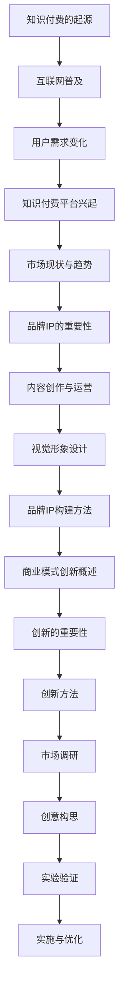
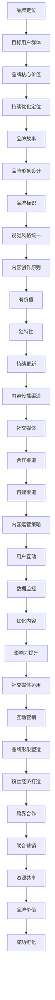
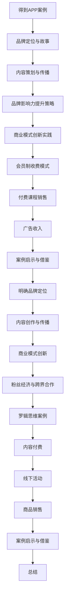
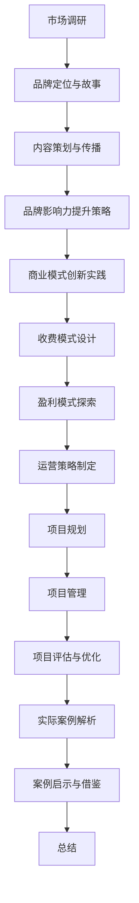
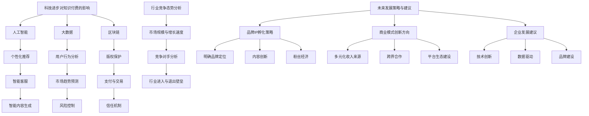
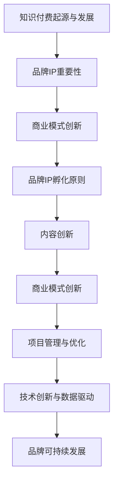

                 

### 第1章：知识付费概述

> 在数字时代，知识付费已经成为一个重要的商业模式。这一章将为您介绍知识付费的起源、发展历程、市场现状与趋势，帮助您理解这一现象背后的逻辑和关键因素。

## 1.1 知识付费的起源与发展

知识付费的概念并非一蹴而就，而是随着互联网技术的发展和用户需求的演变逐步形成的。让我们首先回顾一下知识付费的起源。

### 1.1.1 知识付费的起源

知识付费的起源可以追溯到上世纪90年代，随着互联网的普及，信息传播的渠道变得更加多样和便捷。在这个时期，人们开始意识到，获取知识需要付出一定的代价，这种理念逐渐渗透到人们的生活中。

### 1.1.2 知识付费的发展历程

进入21世纪，知识付费市场迎来了快速发展。特别是在2010年后，移动互联网的普及和智能手机的普及，使得人们可以随时随地获取知识。这一时期，知识付费平台如雨后春笋般涌现，为用户提供了丰富的知识产品和服务。

### 1.1.3 知识付费的市场现状与趋势

当前，知识付费已经成为一个成熟的市场。根据相关数据显示，全球知识付费市场规模持续增长，预计未来几年内将继续保持高速增长。以下是知识付费市场的一些现状与趋势：

1. **市场规模的扩大**：知识付费市场在全球范围内不断扩大，越来越多的企业和个人参与到这一市场中来。
2. **用户需求的多样化**：随着用户需求的不断变化，知识付费平台开始提供更丰富、更个性化的内容和服务。
3. **技术驱动的创新**：人工智能、大数据等技术的应用，使得知识付费平台能够更精准地推荐内容，提高用户体验。

## 1.2 品牌IP的概念与重要性

在知识付费市场中，品牌IP的作用不可忽视。一个成功的品牌IP不仅能够吸引用户，还能够为平台带来持续的价值。

### 1.2.1 品牌IP的定义

品牌IP（Intellectual Property）是指具有独特性、价值性和影响力的知识产权，包括品牌名称、标识、形象、故事、内容等。

### 1.2.2 品牌IP的重要性

品牌IP的重要性体现在以下几个方面：

1. **吸引用户**：独特的品牌IP能够吸引目标用户，提高用户忠诚度。
2. **增加收益**：品牌IP的增值效应，可以带来更高的收益和利润。
3. **提升竞争力**：具有强大品牌IP的企业在市场竞争中更具优势。

### 1.2.3 品牌IP的构建方法

构建一个成功的品牌IP需要从以下几个方面入手：

1. **品牌定位**：明确品牌IP的目标用户群体和核心价值。
2. **内容创作**：提供高质量、有价值的内容，建立品牌IP的内容基础。
3. **视觉形象设计**：设计独特的品牌标识和视觉形象，提高品牌IP的辨识度。
4. **运营与推广**：通过有效的运营和推广，提升品牌IP的知名度和影响力。

## 1.3 商业模式创新概述

在知识付费市场中，商业模式创新是推动市场发展的重要力量。通过创新商业模式，企业可以更好地满足用户需求，提高市场竞争力。

### 1.3.1 商业模式创新的概念

商业模式创新是指企业通过改变传统的商业模式，实现商业价值的创造和提升。它包括产品或服务的设计、定价、推广、渠道等多个方面的创新。

### 1.3.2 商业模式创新的重要性

商业模式创新的重要性体现在以下几个方面：

1. **提高竞争力**：创新商业模式可以帮助企业在激烈的市场竞争中脱颖而出。
2. **创造新价值**：通过创新，企业可以开辟新的市场空间，实现商业价值的提升。
3. **适应市场变化**：商业模式创新可以帮助企业更好地适应市场变化，保持持续的竞争力。

### 1.3.3 商业模式创新的方法

商业模式创新的方法主要包括以下几个方面：

1. **市场调研**：通过市场调研，了解用户需求和市场竞争态势，为创新提供基础数据。
2. **创意构思**：基于市场调研结果，进行创意构思，提出创新商业模式的方案。
3. **实验验证**：通过实验验证，评估创新商业模式的可行性和效果。
4. **实施与优化**：将创新商业模式应用到实际运营中，并进行持续的优化和调整。

### 总结

知识付费市场的发展，带来了品牌IP和商业模式创新的机遇。理解知识付费的起源与发展，明确品牌IP的概念与重要性，掌握商业模式创新的方法，将有助于您在知识付费市场中取得成功。



通过以上步骤，我们可以清晰地看到知识付费市场的发展脉络，以及品牌IP和商业模式创新的核心内容。接下来，我们将进一步探讨品牌IP孵化的基础和策略。

---

### 第2章：品牌IP孵化基础

> 品牌IP的孵化是知识付费成功的关键环节。这一章将为您介绍品牌IP孵化的基本原则、内容策划、视觉形象设计等方面，帮助您了解如何有效地孵化一个成功的品牌IP。

## 2.1 品牌IP孵化原则

品牌IP的孵化需要遵循一些基本原则，这些原则是确保品牌IP能够成功吸引并保持用户的关键。

### 2.1.1 品牌定位

品牌定位是品牌IP孵化的重要步骤。一个明确的品牌定位可以帮助品牌在市场中找到自己的独特位置，从而更好地吸引目标用户。

1. **确定目标用户群体**：了解目标用户的需求、喜好和行为习惯，为他们提供有价值的内容和服务。
2. **明确品牌核心价值**：基于目标用户的需求，明确品牌的核心价值和差异化优势。
3. **持续优化定位**：市场环境和用户需求在不断变化，品牌定位也需要不断调整和优化，以适应市场变化。

### 2.1.2 品牌故事

品牌故事是品牌IP的重要组成部分，它可以为品牌赋予情感价值，增强用户对品牌的认同感。

1. **构建有吸引力的品牌故事**：通过讲述品牌的发展历程、核心价值观和独特故事，让用户感受到品牌的独特魅力。
2. **传播品牌故事**：通过多种渠道传播品牌故事，让更多的用户了解和认同品牌。
3. **与用户互动**：鼓励用户参与品牌故事的创作和传播，增强用户对品牌的参与感和归属感。

### 2.1.3 品牌视觉形象设计

品牌视觉形象设计是品牌IP孵化的关键环节，它直接影响到品牌在用户心中的形象和认知。

1. **设计独特的品牌标识**：品牌标识是品牌视觉形象的核心，它需要具有独特性、辨识度和记忆点。
2. **统一视觉风格**：在品牌IP的各个应用场景中，保持统一的视觉风格，增强品牌的整体形象。
3. **注重用户体验**：品牌视觉设计不仅要美观，还要注重用户体验，让用户在使用过程中感受到品牌的用心和关怀。

## 2.2 品牌IP内容策划

内容策划是品牌IP孵化的重要环节，高质量的内容可以为品牌带来持续的价值。

### 2.2.1 内容创作原则

1. **有价值**：内容需要具有实际价值，能够解决用户的问题或满足他们的需求。
2. **独特性**：内容需要具有独特性，避免与竞争对手的内容雷同，形成自己的特色。
3. **持续更新**：内容需要持续更新，保持品牌的活力和用户的新鲜感。

### 2.2.2 内容传播渠道选择

1. **社交媒体**：利用社交媒体平台进行内容传播，扩大品牌的影响力。
2. **合作渠道**：与行业内的知名平台、KOL进行合作，借助他们的影响力提升品牌的知名度。
3. **自建渠道**：通过自建的网站、APP等渠道，为用户提供更直接的内容体验。

### 2.2.3 内容运营策略

1. **用户互动**：通过互动活动、评论区等，鼓励用户参与内容创作和传播，增强用户的归属感。
2. **数据监控**：利用数据分析工具，监控内容的传播效果，及时调整运营策略。
3. **优化内容**：根据用户反馈和数据分析，不断优化内容，提高内容的质量和吸引力。

## 2.3 品牌IP影响力提升

提升品牌IP的影响力是品牌IP孵化的最终目标，以下是一些有效的方法：

### 2.3.1 社交媒体运用

1. **内容营销**：通过发布高质量的内容，吸引粉丝关注和互动。
2. **互动营销**：通过互动活动、问答等，增强用户参与感和忠诚度。
3. **品牌形象塑造**：通过社交媒体，塑造品牌的正面形象，提高品牌的美誉度。

### 2.3.2 粉丝经济打造

1. **粉丝互动**：通过互动活动，增强粉丝的参与感和归属感。
2. **粉丝营销**：利用粉丝的力量进行口碑传播，提高品牌的影响力。
3. **粉丝变现**：通过粉丝经济，将粉丝转化为品牌粉丝，实现商业价值。

### 2.3.3 品牌跨界合作

1. **跨界合作**：与不同行业的品牌进行合作，扩大品牌的影响力。
2. **联合营销**：通过联合营销活动，共同推广品牌和产品，提高品牌的曝光度。
3. **资源共享**：通过资源共享，实现互利共赢，提高品牌的价值。

### 总结

品牌IP孵化是一个系统工程，需要从品牌定位、内容策划、视觉形象设计等多个方面进行综合考虑。通过遵循品牌IP孵化的基本原则，策划高质量的内容，提升品牌IP的影响力，可以有效地孵化一个成功的品牌IP。



通过以上步骤，我们可以系统地了解品牌IP孵化的过程和方法。接下来，我们将进一步探讨商业模式创新的原理和方法。

---

### 第3章：商业模式创新原理

> 商业模式创新是企业在激烈市场竞争中脱颖而出的关键。这一章将深入探讨商业模式创新的概念、重要性以及创新方法，帮助您理解如何通过创新商业模式实现企业的持续增长。

## 3.1 商业模式创新类型

商业模式创新可以分为多种类型，每种类型都有其独特的特点和适用场景。

### 3.1.1 传统商业模式

传统商业模式是指企业在传统产业中采用的商业模式，通常包括产品或服务的生产和销售。这种模式的核心在于通过规模化生产和降低成本来获取利润。

- **适用场景**：适用于市场竞争激烈、产品同质化严重的行业，如制造业、零售业等。
- **特点**：依赖规模效应，注重成本控制，强调标准化和规模化生产。

### 3.1.2 平台型商业模式

平台型商业模式是通过搭建一个平台，连接供需双方，实现资源的高效配置和利用。这种模式的核心在于平台的建设和运营，通过提供基础设施和服务来吸引和留住用户。

- **适用场景**：适用于需要大量用户参与和互动的场景，如电子商务、社交媒体、共享经济等。
- **特点**：注重用户体验，强调平台生态的建设，通过流量和用户行为数据实现商业变现。

### 3.1.3 共享经济商业模式

共享经济商业模式是通过共享闲置资源，实现资源的最优配置和利用。这种模式的核心在于共享和协作，通过平台连接供需双方，实现资源的高效利用。

- **适用场景**：适用于资源利用率低、资源闲置现象普遍的行业，如住宿、交通、物流等。
- **特点**：强调资源共享，注重用户参与和互动，通过平台实现资源的高效配置。

## 3.2 商业模式创新框架

商业模式创新是一个复杂的过程，需要从多个方面进行系统的分析和设计。以下是一个常见的商业模式创新框架，包括商业模式画布、商业模式矩阵和商业模式创新路径。

### 3.2.1 商业模式画布

商业模式画布是一个直观的工具，用于描述企业的商业模式。它包括九个关键要素：顾客、产品/服务、渠道、客户关系、收入来源、关键资源、关键活动、关键伙伴和成本结构。

- **顾客**：确定目标顾客群体，了解他们的需求和痛点。
- **产品/服务**：设计有价值的产品或服务，满足顾客需求。
- **渠道**：选择合适的渠道，将产品或服务传递给顾客。
- **客户关系**：建立良好的客户关系，提高客户满意度和忠诚度。
- **收入来源**：确定收入来源，确保企业的盈利能力。
- **关键资源**：识别企业运营所需的关键资源，如人力、技术、资金等。
- **关键活动**：定义企业运营的核心活动，如研发、生产、销售、服务等。
- **关键伙伴**：建立合作伙伴关系，实现资源互补和业务协同。
- **成本结构**：优化成本结构，提高企业的运营效率。

### 3.2.2 商业模式矩阵

商业模式矩阵是一个用于分析和评估商业模式创新的方法。它包括四个维度：市场定位、价值主张、盈利模式和资源配置。

- **市场定位**：确定企业在市场中的定位，如目标市场、市场份额等。
- **价值主张**：明确企业的价值主张，即企业如何为顾客创造价值。
- **盈利模式**：设计有效的盈利模式，确保企业的可持续发展。
- **资源配置**：优化资源配置，提高企业的运营效率。

### 3.2.3 商业模式创新路径

商业模式创新路径包括以下步骤：

1. **识别挑战和机会**：分析市场环境，识别企业面临的挑战和机会。
2. **创意构思**：基于挑战和机会，进行创意构思，提出创新的商业模式方案。
3. **实验验证**：通过实验验证，评估创新商业模式的可行性和效果。
4. **实施与优化**：将创新商业模式应用到实际运营中，并进行持续的优化和调整。

## 3.3 商业模式创新案例分析

通过分析国内外知名企业的商业模式创新案例，我们可以更好地理解商业模式创新的原则和方法。

### 3.3.1 国内知识付费平台案例

以得到APP为例，它的商业模式创新主要体现在以下几个方面：

1. **市场定位**：得到APP定位于提供高质量的知识内容，目标用户群体是追求自我提升的用户。
2. **价值主张**：得到APP通过邀请行业内的知名专家和学者，提供有价值的内容，满足用户的学习需求。
3. **盈利模式**：得到APP采用会员制收费模式，用户付费成为会员后，可以享受平台上的所有内容。
4. **资源配置**：得到APP通过自建内容团队和与外部专家合作，确保内容的质量和多样性。

### 3.3.2 国外知识付费平台案例

以Coursera为例，它的商业模式创新主要体现在以下几个方面：

1. **市场定位**：Coursera定位于提供在线课程教育服务，目标用户群体是希望自我提升的学习者。
2. **价值主张**：Coursera与全球知名大学和机构合作，提供高质量的课程，满足用户的学习需求。
3. **盈利模式**：Coursera采用订阅制和课程销售相结合的盈利模式，用户可以按月订阅或购买单个课程。
4. **资源配置**：Coursera通过互联网技术和大数据分析，优化课程推荐和用户体验。

### 3.3.3 商业模式创新实例解析

通过分析得到APP和Coursera的商业模式创新，我们可以得出以下启示：

1. **明确市场定位**：明确目标用户群体和市场需求，是商业模式创新的基础。
2. **提供有价值的内容**：高质量的内容是吸引用户的关键，也是商业模式创新的核心。
3. **多样化的盈利模式**：通过多种盈利模式，可以提高企业的盈利能力和抗风险能力。
4. **优化资源配置**：通过优化资源配置，提高企业的运营效率和竞争力。

### 总结

商业模式创新是企业在激烈市场竞争中脱颖而出的关键。通过了解商业模式创新的类型、框架和案例分析，我们可以更好地理解商业模式创新的原则和方法。在知识付费市场中，通过创新的商业模式，企业可以更好地满足用户需求，提高市场竞争力，实现持续增长。

```mermaid
graph TD
A[传统商业模式] --> B[平台型商业模式]
B --> C[共享经济商业模式]
C --> D[商业模式画布]
D --> E[顾客]
E --> F[产品/服务]
F --> G[渠道]
G --> H[客户关系]
H --> I[收入来源]
I --> J[关键资源]
J --> K[关键活动]
K --> L[关键伙伴]
L --> M[成本结构]
M --> N[商业模式矩阵]
N --> O[市场定位]
O --> P[价值主张]
P --> Q[盈利模式]
Q --> R[资源配置]
R --> S[商业模式创新路径]
S --> T[识别挑战和机会]
T --> U[创意构思]
U --> V[实验验证]
V --> W[实施与优化]
W --> X[得到APP案例]
X --> Y[市场定位]
Y --> Z[价值主张]
Z --> AA[盈利模式]
AA --> BB[资源配置]
BB --> CC[案例启示]
CC --> DD[Coursera案例]
DD --> EE[市场定位]
EE --> FF[价值主张]
FF --> GG[盈利模式]
GG --> HH[资源配置]
HH --> II[案例启示]
II --> JJ[总结]
```



通过以上步骤，我们可以系统地了解商业模式创新的原理和方法。接下来，我们将进一步探讨如何结合品牌IP孵化进行商业模式创新。

---

### 第4章：知识付费品牌IP孵化案例分析

> 通过实际案例的分析，我们可以更好地理解知识付费品牌IP孵化的具体实施过程和成功要素。本章将详细探讨得到APP和罗辑思维两个成功案例，解析它们如何通过品牌IP孵化实现商业模式的创新。

## 4.1 案例背景介绍

### 4.1.1 得到APP

得到APP是由罗辑思维团队推出的一款知识付费平台，成立于2016年。得到APP以提供高质量的知识内容为核心，吸引了大量追求自我提升的用户。平台上的内容涵盖多个领域，包括经济学、心理学、科技、人文等。

### 4.1.2 罗辑思维

罗辑思维是由罗永浩创办的知识传播平台，成立于2012年。罗辑思维以微信公众号和视频节目为主，通过幽默风趣的方式传递知识和价值观，吸引了大量粉丝。罗辑思维的成功，不仅在于其内容的独特性，还在于其成功的品牌IP孵化。

## 4.2 品牌IP孵化过程

### 4.2.1 品牌定位与故事

1. **得到APP的品牌定位**：得到APP的品牌定位是“终身学习的好帮手”，为用户提供有价值、有深度的知识内容。
2. **罗辑思维的品牌定位**：罗辑思维的品牌定位是“不一样的知识传播者”，通过幽默、深入的方式传递知识和价值观。

1. **得到APP的品牌故事**：得到APP的品牌故事围绕着“终身学习”的主题展开，强调在快速变化的时代，学习是永恒的主题。
2. **罗辑思维的品牌故事**：罗辑思维的品牌故事则是以其创办人罗永浩的个人经历为主线，传递出坚韧不拔、不断学习的精神。

### 4.2.2 内容策划与传播

1. **得到APP的内容策划**：
   - **内容创作原则**：得到APP注重内容的质量和深度，确保每一篇内容都能为用户带来实际的价值。
   - **内容传播渠道**：得到APP通过微信公众号、APP、微博等多个渠道传播内容，形成了一个强大的内容生态圈。
   - **内容运营策略**：得到APP通过定期推出专题、直播等活动，与用户保持紧密互动，提高用户粘性。

2. **罗辑思维的内容策划**：
   - **内容创作原则**：罗辑思维的内容以幽默、深入为主，注重与用户产生共鸣。
   - **内容传播渠道**：罗辑思维主要通过微信公众号和视频节目进行内容传播，通过吸引粉丝、用户互动等方式扩大影响力。
   - **内容运营策略**：罗辑思维通过定期举办线下活动、直播等方式，与用户保持紧密互动，提高用户参与度和忠诚度。

### 4.2.3 品牌影响力提升策略

1. **得到APP的品牌影响力提升策略**：
   - **社交媒体运用**：得到APP通过微信公众号、微博等社交媒体平台，发布高质量的内容，与用户进行互动，提升品牌影响力。
   - **粉丝经济打造**：得到APP通过建立粉丝社群，定期举办线下活动，加强与粉丝的互动，提高用户忠诚度。
   - **跨界合作**：得到APP与多个行业知名品牌进行合作，通过联合营销活动，扩大品牌影响力。

2. **罗辑思维的品牌影响力提升策略**：
   - **社交媒体运用**：罗辑思维通过微信公众号和视频节目，发布高质量的内容，与用户进行互动，提升品牌影响力。
   - **粉丝经济打造**：罗辑思维通过建立粉丝社群，定期举办线下活动，加强与粉丝的互动，提高用户忠诚度。
   - **跨界合作**：罗辑思维与多个行业知名品牌进行合作，通过联合营销活动，扩大品牌影响力。

## 4.3 商业模式创新实践

### 4.3.1 得到APP的商业模式

1. **会员制收费模式**：得到APP采用会员制收费模式，用户需要付费成为会员，才能享受平台上的所有内容。
2. **付费课程销售**：得到APP还提供多种付费课程，用户可以根据自己的需求选择购买。
3. **广告收入**：得到APP通过在平台内投放广告，获得广告收入。

### 4.3.2 罗辑思维的商业模式创新

1. **内容付费**：罗辑思维通过微信公众号和视频节目，推出付费内容，用户需要付费才能观看。
2. **线下活动**：罗辑思维定期举办线下活动，如知识讲座、聚会等，用户需要付费参与。
3. **商品销售**：罗辑思维还通过销售书籍、周边商品等方式，实现商业变现。

### 4.3.3 案例启示与借鉴

1. **明确品牌定位**：得到APP和罗辑思维都明确了自身的品牌定位，通过提供有价值的内容，吸引目标用户。
2. **内容创作与传播**：两个案例都注重内容的质量和传播渠道的选择，通过多种方式与用户互动，提高用户粘性。
3. **商业模式创新**：得到APP和罗辑思维都在商业模式上进行了创新，通过会员制收费、线下活动、商品销售等多种方式，实现商业变现。
4. **粉丝经济与跨界合作**：两个案例都成功打造了粉丝经济，并通过跨界合作，扩大品牌影响力。

### 总结

通过得到APP和罗辑思维的成功案例，我们可以看到，知识付费品牌IP孵化需要从品牌定位、内容策划、商业模式创新等多个方面进行综合考虑。通过明确品牌定位，提供高质量的内容，创新商业模式，成功打造粉丝经济，企业可以有效地实现知识付费品牌IP的孵化，并在市场中脱颖而出。



通过以上步骤，我们可以系统地了解知识付费品牌IP孵化的过程和方法。接下来，我们将进一步探讨知识付费品牌IP孵化的实战指导。

---

### 第5章：知识付费品牌IP孵化实战指导

> 知识付费品牌IP孵化不仅需要理论指导，更需要实战经验的积累。这一章将为您提供具体的实战指导，包括策略制定、商业模式创新实践、项目实施等方面，帮助您在实际操作中成功孵化知识付费品牌IP。

## 5.1 品牌IP孵化策略制定

品牌IP孵化策略的制定是品牌IP孵化成功的关键步骤。以下是一些关键要素和步骤：

### 5.1.1 市场调研

市场调研是品牌IP孵化策略制定的基础。通过市场调研，您可以了解目标市场的现状、趋势和竞争态势，为品牌IP的定位和内容策划提供依据。

1. **调研目标**：明确调研的目标，如用户需求、市场趋势、竞争对手等。
2. **调研方法**：选择合适的调研方法，如问卷调查、访谈、数据分析等。
3. **数据分析**：对调研结果进行系统分析，提取关键信息。

### 5.1.2 品牌定位

品牌定位是品牌IP孵化的重要环节。一个明确的品牌定位可以帮助品牌在市场中找到自己的独特位置，从而更好地吸引目标用户。

1. **目标用户群体**：明确目标用户群体的特征，如年龄、性别、职业、兴趣爱好等。
2. **核心价值**：基于用户需求，明确品牌的核心价值和差异化优势。
3. **持续优化**：市场环境和用户需求在不断变化，品牌定位也需要不断调整和优化，以适应市场变化。

### 5.1.3 内容策划

内容策划是品牌IP孵化的重要环节。高质量的内容可以为品牌带来持续的价值。

1. **内容创作原则**：内容需要具有实际价值，能够解决用户的问题或满足他们的需求。
2. **内容传播渠道**：选择合适的传播渠道，如社交媒体、合作平台、自建平台等。
3. **内容运营策略**：通过互动活动、数据分析等手段，优化内容传播效果。

## 5.2 商业模式创新实践

商业模式创新是知识付费品牌IP孵化的重要手段。以下是一些常见的商业模式创新实践：

### 5.2.1 收费模式设计

收费模式设计是商业模式创新的核心。根据用户需求和产品特性，可以选择多种收费模式，如会员制、课程包、单次购买等。

1. **会员制**：通过会员制，用户可以享受平台上的所有内容，提高用户粘性。
2. **课程包**：将多个相关课程打包销售，提高用户的购买意愿。
3. **单次购买**：用户可以按需购买单个课程或内容，降低购买门槛。

### 5.2.2 盈利模式探索

盈利模式探索是商业模式创新的重要方面。通过多元化的收入来源，可以提高企业的盈利能力。

1. **广告收入**：通过在平台上投放广告，获得广告收入。
2. **内容付费**：用户需要付费才能观看或学习内容，通过内容付费获得收入。
3. **周边产品销售**：通过销售书籍、周边产品等，实现商业变现。

### 5.2.3 运营策略制定

运营策略制定是商业模式创新的关键环节。通过有效的运营策略，可以提高品牌的知名度和用户粘性。

1. **用户互动**：通过互动活动，增强用户参与感和忠诚度。
2. **数据分析**：利用数据分析工具，监控用户行为和平台运营效果，及时调整运营策略。
3. **品牌传播**：通过社交媒体、合作渠道等，提高品牌的知名度和影响力。

## 5.3 品牌IP孵化项目实施

品牌IP孵化项目实施是品牌IP孵化的具体操作过程。以下是一些关键步骤：

### 5.3.1 项目规划

项目规划是品牌IP孵化项目实施的基础。通过项目规划，您可以明确项目的目标、范围、时间安排等。

1. **项目目标**：明确项目的目标，如品牌知名度提升、用户数量增加、收入增长等。
2. **项目范围**：明确项目的工作内容，如市场调研、品牌定位、内容策划、商业模式设计等。
3. **时间安排**：制定项目的时间计划，确保各项工作按时完成。

### 5.3.2 项目管理

项目管理是品牌IP孵化项目实施的关键。通过有效的项目管理，您可以确保项目按照计划顺利进行。

1. **团队组建**：组建专业的项目团队，明确各成员的职责和任务。
2. **任务分配**：将项目工作合理分配到团队成员，确保任务明确、责任到人。
3. **进度监控**：定期监控项目进度，及时发现并解决问题。

### 5.3.3 项目评估与优化

项目评估与优化是品牌IP孵化项目实施的重要环节。通过项目评估与优化，您可以确保项目的效果和可持续性。

1. **成果评估**：对项目成果进行评估，如品牌知名度、用户满意度、收入增长等。
2. **问题分析**：分析项目过程中出现的问题，如市场定位不准确、内容质量不高、运营策略不当等。
3. **优化建议**：根据评估结果和问题分析，提出优化建议，改进项目的实施过程。

### 实际案例解析

以下是一个品牌IP孵化项目的实际案例解析：

**案例一：得到APP的品牌IP孵化项目**

1. **项目规划**：
   - **项目目标**：提升品牌知名度，增加用户数量，实现收入增长。
   - **项目范围**：包括市场调研、品牌定位、内容策划、商业模式设计等。
   - **时间安排**：6个月。

2. **项目管理**：
   - **团队组建**：包括市场调研团队、品牌策划团队、内容创作团队、商业模式设计团队等。
   - **任务分配**：明确各团队成员的职责和任务，确保任务明确、责任到人。
   - **进度监控**：每月进行项目进度汇报，及时发现并解决问题。

3. **项目评估与优化**：
   - **成果评估**：通过用户调研和数据分析，项目目标实现程度较高，品牌知名度提升，用户数量增加，收入增长。
   - **问题分析**：发现内容质量参差不齐，部分用户对会员制收费模式不适应。
   - **优化建议**：加强内容质量管控，提高内容创作水平；调整会员制收费模式，提供更多优惠方案。

通过以上实际案例解析，我们可以看到，品牌IP孵化项目实施需要科学的规划、有效的管理以及持续的优化。在项目实施过程中，要密切关注市场变化和用户需求，及时调整策略，确保项目的成功实施。

### 总结

知识付费品牌IP孵化是一个复杂的过程，需要从策略制定、商业模式创新、项目实施等多个方面进行综合考虑。通过科学的规划、有效的管理和持续的优化，企业可以成功地孵化出具有高价值、高影响力的品牌IP。



通过以上步骤，我们可以系统地了解知识付费品牌IP孵化的实战指导。接下来，我们将探讨知识付费品牌IP孵化的未来发展趋势。

---

### 第6章：知识付费品牌IP孵化与商业模式创新的未来发展趋势

> 随着科技的不断进步，知识付费品牌IP孵化与商业模式创新正迎来新的发展机遇和挑战。本章将分析科技进步对知识付费的影响、行业竞争态势以及未来发展策略与建议，帮助您把握行业趋势，制定有效的战略规划。

## 6.1 科技进步对知识付费的影响

### 6.1.1 人工智能

人工智能（AI）技术的快速发展，为知识付费领域带来了深远的影响。

1. **个性化推荐**：通过机器学习算法，AI能够根据用户的历史行为和偏好，提供个性化的内容推荐，提高用户满意度。
2. **智能客服**：利用自然语言处理（NLP）技术，AI可以自动回答用户的问题，提供24/7的客户服务。
3. **智能内容生成**：AI可以帮助创作者快速生成高质量的内容，如文章、视频、音频等，提高内容生产效率。

### 6.1.2 大数据

大数据技术在知识付费领域的应用，使得企业能够更好地了解用户需求，优化内容策略。

1. **用户行为分析**：通过收集和分析用户在平台上的行为数据，企业可以洞察用户的需求和偏好，优化内容推荐和运营策略。
2. **市场趋势预测**：大数据分析可以帮助企业预测市场趋势，提前布局，抓住市场机遇。
3. **风险控制**：通过大数据分析，企业可以识别潜在的欺诈行为和风险，提高平台的安全性。

### 6.1.3 区块链

区块链技术的应用，为知识付费领域带来了去中心化、安全性和透明度等优势。

1. **版权保护**：区块链技术可以确保内容的版权归属清晰，防止内容被盗用或侵权。
2. **支付与交易**：通过区块链技术，可以实现快速、安全的支付和交易，降低交易成本。
3. **信任机制**：区块链技术可以建立去中心化的信任机制，提高用户对平台的信任度。

## 6.2 行业竞争态势分析

### 6.2.1 市场规模与增长速度

知识付费市场正以惊人的速度增长。根据市场研究机构的预测，全球知识付费市场规模将在未来几年内持续扩大。以下是一些关键指标：

1. **市场规模**：预计到2025年，全球知识付费市场规模将达到数千亿美元。
2. **增长速度**：知识付费市场的年复合增长率（CAGR）预计将超过20%。

### 6.2.2 竞争对手分析

在知识付费市场中，有大量的竞争对手，包括传统教育机构、在线教育平台、内容创作者等。以下是一些主要竞争对手的特点：

1. **传统教育机构**：拥有丰富的教育资源和经验，但在适应数字化和个性化需求方面存在一定劣势。
2. **在线教育平台**：以大规模、标准化教育为主，但在内容个性化、互动性方面有待提升。
3. **内容创作者**：具有丰富的内容和专业知识，但在平台运营、用户服务等方面可能存在不足。

### 6.2.3 行业进入与退出壁垒

知识付费行业的进入壁垒相对较高，主要体现在以下几个方面：

1. **技术壁垒**：需要掌握人工智能、大数据等前沿技术，确保内容个性化、推荐准确。
2. **资金壁垒**：知识付费平台需要大量的资金投入，包括内容制作、平台建设、市场推广等。
3. **品牌壁垒**：建立品牌信誉和用户信任需要时间和投入，新进入者难以在短时间内建立强大的品牌影响力。

## 6.3 未来发展策略与建议

### 6.3.1 品牌IP孵化策略

1. **明确品牌定位**：在快速变化的市场中，明确品牌定位和核心价值，确保品牌差异化。
2. **内容创新**：持续创新内容形式和内容类型，满足用户多样化需求。
3. **粉丝经济**：通过互动活动和社群运营，建立粉丝经济，提高用户忠诚度。

### 6.3.2 商业模式创新方向

1. **多元化收入来源**：通过内容付费、广告、电商等多种方式实现收入多元化。
2. **跨界合作**：与不同行业的企业合作，拓展业务范围，实现资源共享和互利共赢。
3. **平台生态建设**：打造一个生态化的平台，为内容创作者、用户和合作伙伴提供全方位的服务和支持。

### 6.3.3 企业发展建议

1. **技术创新**：持续投入技术研发，掌握前沿技术，提高内容个性化、推荐准确性和用户体验。
2. **数据驱动**：利用大数据分析，深入了解用户需求和市场趋势，优化运营策略。
3. **品牌建设**：通过品牌推广和公关活动，提高品牌知名度和美誉度。

### 总结

知识付费品牌IP孵化与商业模式创新正处于快速发展阶段，科技进步和市场竞争为行业带来了新的机遇和挑战。通过明确品牌定位、创新内容、多元化收入来源和跨界合作，企业可以把握行业趋势，实现可持续发展。



通过以上分析，我们可以清晰地看到知识付费品牌IP孵化与商业模式创新的未来发展趋势。接下来，我们将总结整篇文章，并给出结论。

---

### 总结与结论

本文从多个维度深入探讨了知识付费品牌IP孵化与商业模式创新的理论和实践。通过回顾知识付费的起源与发展、品牌IP的概念与重要性、商业模式创新的类型与框架，以及实际案例分析，我们系统地理解了知识付费市场中的关键要素和策略。

**核心发现**：

1. **知识付费的起源与发展**：知识付费随着互联网技术的发展和用户需求的演变而兴起，成为一个重要的商业模式。
2. **品牌IP的重要性**：品牌IP不仅是吸引用户的关键，还能为平台带来持续的价值和竞争优势。
3. **商业模式创新**：通过多样化的商业模式创新，企业可以更好地满足用户需求，提高市场竞争力。
4. **品牌IP孵化的原则**：品牌定位、内容策划、视觉形象设计和运营策略是品牌IP孵化成功的关键。

**结论**：

知识付费品牌IP孵化和商业模式创新是一个系统性工程，需要从品牌定位、内容创作、商业模式设计、项目管理等多个方面进行综合考量。在未来的发展中，企业应持续关注科技进步，利用人工智能、大数据、区块链等新技术，优化用户体验和运营效率。同时，要灵活应对市场变化，不断创新和调整商业模式，以实现品牌的可持续发展。

**建议**：

1. **明确品牌定位**：在快速变化的市场中，确保品牌定位清晰，能够满足目标用户的需求。
2. **内容创新**：持续提供高质量、有价值的原创内容，保持品牌的活力和用户的粘性。
3. **商业模式创新**：积极探索多元化的盈利模式，通过技术创新和用户数据驱动，实现商业模式的创新和优化。

通过本文的探讨，我们希望为企业提供理论指导和实战经验，帮助其在知识付费市场中取得成功。



以上是本文的核心内容总结，我们期待通过持续的研究和实践，为知识付费领域的发展贡献力量。

### 附录A：知识付费品牌IP孵化与商业模式创新工具与资源

**A.1 知识付费平台案例分析**

为了更好地理解知识付费品牌IP孵化和商业模式创新，以下是几个知名知识付费平台的分析案例：

1. **得到APP**
   - **背景**：得到APP由罗辑思维团队推出，以提供高质量的知识内容为核心，用户包括追求自我提升的知识爱好者。
   - **案例分析**：得到APP通过会员制收费和付费课程销售实现商业变现。它成功的关键在于明确的品牌定位、高质量的内容策划以及创新的商业模式。

2. **喜马拉雅**
   - **背景**：喜马拉雅是中国领先的知识付费平台，提供音频课程、有声书等多种知识产品。
   - **案例分析**：喜马拉雅通过多元化的内容类型和平台生态，吸引了大量用户。其成功的关键在于内容丰富、用户体验良好以及创新的广告和电商模式。

3. **知乎**
   - **背景**：知乎是一个以问答形式为主的知识分享平台，近年来也逐渐推出了知识付费功能。
   - **案例分析**：知乎通过专业回答、付费专栏等形式，满足了用户获取专业知识的需要。其成功的关键在于强大的用户基础和专业的社区氛围。

**A.2 商业模式创新案例库**

以下是一些关于商业模式创新的案例库，可以帮助您更好地了解不同行业和领域中的商业模式创新：

1. **商业模式创新手册**
   - **来源**：约翰·霍普金斯大学
   - **简介**：这是一个免费的资源库，提供了大量关于商业模式创新的案例、方法和工具。

2. **哈佛商学院商业模式案例库**
   - **来源**：哈佛商学院
   - **简介**：这个案例库包含了数百个不同行业和领域的商业模式案例，是学习商业模式创新的重要资源。

3. **商业模式创新网**
   - **来源**：商业模式创新网
   - **简介**：这个网站提供了丰富的商业模式创新案例、文章和工具，是商业模式创新学习者的必备资源。

**A.3 相关书籍与文献推荐**

为了深入了解知识付费品牌IP孵化和商业模式创新，以下是几本推荐的书籍和文献：

1. **《知识付费：内容创业的商业模式》**
   - **作者**：李政权
   - **简介**：这本书系统地介绍了知识付费的商业模式、运营策略和案例分析，适合内容创业者和管理者阅读。

2. **《品牌IP孵化与运营》**
   - **作者**：张志宏
   - **简介**：这本书详细阐述了品牌IP孵化的方法、策略和实战案例，是品牌运营人员的必备读物。

3. **《商业模式新生代》**
   - **作者**：史蒂夫·布兰克、道格·兰尼
   - **简介**：这本书提出了商业模式画布等工具和方法，帮助企业家和创业者理解商业模式创新。

**A.4 在线课程与学习资源**

以下是一些在线课程和学习资源，可以帮助您深入了解知识付费品牌IP孵化和商业模式创新：

1. **知识付费实战训练营**
   - **来源**：知乎学院
   - **简介**：这是一个专注于知识付费品牌IP孵化的实战课程，涵盖了品牌定位、内容策划、商业模式设计等方面。

2. **商业模式创新训练营**
   - **来源**：知乎学院
   - **简介**：这是一个专注于商业模式创新的课程，包括商业模式画布、商业模式矩阵等工具和方法。

3. **《知识管理与变现》**
   - **来源**：网易云课堂
   - **简介**：这是一门关于知识管理和变现的在线课程，适合希望进入知识付费领域的从业者。

通过以上工具与资源的推荐，我们希望能够为您的知识付费品牌IP孵化和商业模式创新提供有力支持。

### 附录B：知识付费品牌IP孵化与商业模式创新流程图

以下是为知识付费品牌IP孵化和商业模式创新提供的详细流程图，包括各个步骤的详细说明。

#### 知识付费品牌IP孵化流程图

1. **市场调研**
   - **目的**：了解市场需求和用户痛点。
   - **步骤**：收集行业数据、用户调研、竞争分析。

2. **品牌定位**
   - **目的**：确定品牌的市场定位和核心价值。
   - **步骤**：明确目标用户群体、品牌差异化优势、品牌故事。

3. **内容策划**
   - **目的**：设计有价值的内容，满足用户需求。
   - **步骤**：内容主题确定、内容形式设计、内容创作。

4. **品牌视觉形象设计**
   - **目的**：提升品牌形象和辨识度。
   - **步骤**：设计品牌标识、配色方案、视觉风格。

5. **内容传播与运营**
   - **目的**：扩大品牌影响力，提升用户参与度。
   - **步骤**：选择传播渠道、制定传播策略、运营互动。

6. **品牌影响力提升**
   - **目的**：建立品牌知名度和用户忠诚度。
   - **步骤**：社交媒体运营、粉丝经济打造、跨界合作。

#### 商业模式创新流程图

1. **选择创新方向**
   - **目的**：确定商业模式创新的方向。
   - **步骤**：分析市场机会、评估资源能力。

2. **制定创新策略**
   - **目的**：设计创新的商业模式方案。
   - **步骤**：商业模式画布、商业模式矩阵、策略构思。

3. **实施创新方案**
   - **目的**：将创新策略应用到实际运营中。
   - **步骤**：资源配置、团队组建、方案实施。

4. **监控与评估**
   - **目的**：监控商业模式的效果，及时调整。
   - **步骤**：数据收集、效果评估、反馈调整。

5. **调整与优化**
   - **目的**：持续优化商业模式，提高盈利能力。
   - **步骤**：根据评估结果，调整策略和实施细节。

通过以上流程图，我们可以清晰地看到知识付费品牌IP孵化和商业模式创新的各个环节，以及每个环节的具体步骤。这有助于我们在实际操作中，更有针对性地进行品牌IP孵化和商业模式创新。

### 附录C：核心算法原理讲解

在知识付费品牌IP孵化和商业模式创新中，核心算法的运用至关重要。以下将详细讲解大规模预训练模型（如BERT、GPT等）的基本原理和关键技术。

#### 2.3.1 预训练的概念与意义

预训练（Pre-training）是一种在特定任务之前进行的训练过程，其目标是通过大规模数据集学习通用的语言表示和理解能力。预训练的意义在于：

1. **通用语言表示**：通过预训练，模型可以学习到丰富的词汇和语法规则，形成通用的语言表示。
2. **降低训练成本**：预训练减少了在特定任务上训练的数据需求，提高了模型在小数据集上的表现。
3. **提高模型泛化能力**：预训练模型在面对新的任务时，可以快速适应和迁移。

#### 2.3.2 自监督学习方法

自监督学习（Self-supervised Learning）是一种利用未标注数据进行训练的方法。在预训练中，自监督学习尤为重要，其核心思想是通过预测部分未标记数据来学习表示。以下是几种常用的自监督学习方法：

1. **Masked Language Model (MLM)**
   - **方法**：在输入文本中随机遮盖部分单词，然后预测这些遮盖的单词。
   - **优势**：能够学习到词汇和语法结构，提高语言理解能力。

2. ** masked Token Prediction (MTL)**
   - **方法**：不仅预测遮盖的单词，还包括预测其他部分，如句子分类、实体识别等。
   - **优势**：结合多种任务，提高模型的泛化能力。

3. **Next Sentence Prediction (NSP)**
   - **方法**：预测两个句子是否属于同一段落。
   - **优势**：增强模型对段落结构理解的能力。

#### 2.3.3 迁移学习与微调技术

迁移学习（Transfer Learning）是一种将预训练模型应用于不同任务的方法。其主要步骤包括：

1. **预训练**：在大量未标注数据上对模型进行预训练。
2. **微调**：在特定任务上对模型进行微调，调整模型的参数，使其适应新任务。

微调技术能够显著提高模型在新任务上的性能，具体步骤如下：

1. **数据准备**：收集并处理特定任务的数据集。
2. **模型加载**：加载预训练的模型架构。
3. **参数调整**：在特定任务上调整模型参数。
4. **训练与评估**：对模型进行训练和评估，调整超参数以获得最佳性能。

#### 2.3.4 伪代码示例

以下是一个简单的伪代码示例，描述了预训练过程：

```python
# 伪代码：预训练过程
function pre_train(model, data_loader, optimizer, epochs):
    for epoch in range(epochs):
        for batch in data_loader:
            inputs, labels = batch
            optimizer.zero_grad()
            outputs = model(inputs)
            loss = loss_function(outputs, labels)
            loss.backward()
            optimizer.step()
```

在这个示例中，`model` 是预训练的模型，`data_loader` 是用于提供训练数据的数据加载器，`optimizer` 是优化器，`epochs` 是训练的轮数。每次迭代中，模型接收输入数据，通过反向传播计算损失，并更新模型参数。

通过以上核心算法原理的讲解，我们可以更好地理解大规模预训练模型在知识付费品牌IP孵化和商业模式创新中的应用价值。接下来，我们将进一步探讨数学模型与公式在知识付费品牌IP孵化与商业模式创新中的具体应用。

### 附录D：数学模型与数学公式讲解

在知识付费品牌IP孵化和商业模式创新中，数学模型和公式提供了关键的工具，用于评估商业绩效、优化决策和预测市场趋势。以下将详细讲解收益函数模型、成本函数模型和利润函数模型。

#### 3.2.1 收益函数模型

收益函数模型用于描述企业的收入来源，其核心公式为：

$$
\text{收益函数（Revenue Function）} = p \times q
$$

其中：
- \( p \)：价格，表示企业每单位产品或服务的售价。
- \( q \)：销售量，表示企业在一定时间内销售的产品或服务的数量。

这个模型反映了企业的总收入，是衡量企业业务表现的关键指标。例如，如果一个产品每件售价为100元，每天销售100件，那么该产品的日收益为：

$$
\text{日收益} = 100 \times 100 = 10,000 \text{元}
$$

#### 3.2.2 成本函数模型

成本函数模型用于描述企业运营中的成本支出，其核心公式为：

$$
\text{成本函数（Cost Function）} = C_0 + C_1 \times q
$$

其中：
- \( C_0 \)：固定成本，表示企业在没有销售时也需要承担的成本，如房租、员工工资等。
- \( C_1 \)：单位成本，表示每单位产品或服务产生的可变成本，如原材料、物流等。

这个模型反映了企业的总成本，是计算企业利润的基础。例如，一个企业的固定成本为每月5,000元，每件产品的单位成本为20元，那么该企业每月的总成本为：

$$
\text{月成本} = 5,000 + 20 \times 1,000 = 25,000 \text{元}
$$

#### 3.2.3 利润函数模型

利润函数模型用于描述企业的盈利情况，其核心公式为：

$$
\text{利润函数（Profit Function）} = \text{收益函数} - \text{成本函数}
$$

这个模型通过收益函数减去成本函数，反映了企业的利润水平。例如，如果一个企业的月收益为10万元，月成本为25,000元，那么该企业的月利润为：

$$
\text{月利润} = 10,0000 - 25,000 = 775,000 \text{元}
$$

#### 3.2.4 利润最大化模型

在商业决策中，企业通常希望实现利润最大化。利润最大化的数学模型可以表示为：

$$
\text{最大化利润} = \text{最大化} \ (\text{收益函数} - \text{成本函数})
$$

这个模型可以通过对收益函数和成本函数的求导，找到最佳的销售量和定价策略。例如，对于一个线性收益函数和线性成本函数，可以通过以下步骤找到利润最大化的销售量 \( q^* \)：

1. **求导**：对收益函数和成本函数分别求导，得到关于销售量 \( q \) 的导数。
2. **设置导数为零**：令收益函数的导数等于成本函数的导数，求解 \( q \)。
3. **验证**：对解进行验证，确保其在实际问题中可行。

通过以上数学模型和公式，企业可以更好地理解其业务表现和决策效果，从而在知识付费品牌IP孵化和商业模式创新中实现更高的盈利。

### 附录E：项目实战与代码解读

在本章节中，我们将通过一个实际案例来展示知识付费品牌IP孵化项目的实施过程，并详细解读相关的代码实现。

#### 案例背景

假设我们正在开发一个名为“知识星球”的在线学习平台，目标是为用户提供高质量的知识内容和互动学习体验。以下是我们的项目规划、管理、评估与优化过程，以及关键代码的实现和解读。

#### 5.3.1 项目规划

1. **项目目标**：开发一个功能完善的在线学习平台，包括课程发布、用户注册、内容付费、互动交流等功能。
2. **项目范围**：涵盖前端开发、后端开发、数据库设计、用户界面设计等。
3. **时间安排**：6个月，分为需求分析、设计、开发、测试和上线等阶段。

#### 5.3.2 项目管理

1. **团队组建**：组建一个包括前端工程师、后端工程师、产品经理、UI/UX设计师、测试工程师的团队。
2. **任务分配**：明确每个团队成员的职责，制定详细的工作计划和时间表。
3. **进度监控**：定期召开项目进度会议，跟踪任务完成情况，确保项目按时完成。

#### 5.3.3 项目评估与优化

1. **成果评估**：在项目上线后，通过用户反馈、数据分析和市场表现来评估项目成果。
2. **问题分析**：识别项目实施过程中存在的问题和挑战，如用户流失、内容质量不高等。
3. **优化建议**：根据评估结果，提出优化建议，包括内容优化、用户体验改进、运营策略调整等。

#### 5.3.4 关键代码实现与解读

以下是一个简单的用户注册功能实现的示例，包括代码结构和关键部分的功能解读。

```python
# 用户注册功能实现
def register(username, password):
    # 验证用户名是否已存在
    if check_username_exists(username):
        return "用户名已存在，请更换用户名。"
    # 验证密码是否符合要求
    if not check_password_strength(password):
        return "密码不符合要求，请重新设置密码。"
    # 存储用户信息到数据库
    save_user_info_to_db(username, password)
    return "注册成功！"

# 辅助函数实现
def check_username_exists(username):
    # 检查用户名是否已存在
    # 这里使用伪代码表示数据库查询操作
    user = query_user_from_db(username)
    return user is not None

def check_password_strength(password):
    # 验证密码长度是否符合要求
    return len(password) >= 8

def save_user_info_to_db(username, password):
    # 将用户信息存储到数据库
    # 这里使用伪代码表示数据库插入操作
    insert_user_to_db(username, password)

# 伪代码：数据库查询操作
def query_user_from_db(username):
    # 在数据库中查询用户信息
    # 这里返回一个用户对象
    return None

# 伪代码：数据库插入操作
def insert_user_to_db(username, password):
    # 向数据库中插入用户信息
    # 这里只是示例，实际操作需要实现具体的数据库操作
    print(f"用户{username}注册成功，密码已加密存储。")
```

**代码解读**：

1. **注册函数（register）**：
   - **功能**：接收用户输入的用户名和密码，进行验证后，将用户信息存储到数据库。
   - **关键步骤**：
     - **验证用户名**：调用 `check_username_exists` 函数检查用户名是否已存在。
     - **验证密码**：调用 `check_password_strength` 函数检查密码长度是否符合要求。
     - **存储用户信息**：调用 `save_user_info_to_db` 函数将用户信息存储到数据库。

2. **辅助函数**：
   - **`check_username_exists`**：用于检查数据库中用户名是否已存在，这里使用伪代码表示数据库查询操作。
   - **`check_password_strength`**：用于检查密码长度是否符合要求，这里简单设定密码长度至少为8个字符。
   - **`save_user_info_to_db`**：用于将用户信息存储到数据库，这里使用伪代码表示数据库插入操作。

通过以上代码示例，我们可以看到用户注册功能的基本实现过程，以及关键代码部分的功能解读。在实际项目中，还需要实现具体的数据库连接、密码加密存储、前端接口等更多细节。

### 5.3.4.1 得到APP的IP孵化与商业模式创新实践

**案例一：得到APP**

得到APP是罗辑思维团队推出的一个知名的知识付费平台，以其高质量的内容和创新的商业模式获得了市场的认可。以下是得到APP的IP孵化与商业模式创新实践：

1. **品牌定位**：
   - **目标用户群体**：追求终身学习、提升自我能力的用户。
   - **核心价值**：提供高质量、有深度的知识内容，帮助用户实现自我成长。

2. **内容策划**：
   - **内容创作原则**：注重内容的质量和深度，确保每一篇内容都能为用户带来实际的价值。
   - **内容传播渠道**：通过微信公众号、APP、微博等多个渠道传播内容，形成了一个强大的内容生态圈。
   - **内容运营策略**：定期推出专题、直播等活动，与用户保持紧密互动，提高用户粘性。

3. **商业模式创新**：
   - **会员制收费模式**：用户需要付费成为会员，才能享受平台上的所有内容。
   - **付费课程销售**：提供多种付费课程，用户可以根据自己的需求选择购买。
   - **广告收入**：在平台内投放广告，获得广告收入。

通过以上实践，得到APP成功地孵化了一个具有高价值、高影响力的品牌IP，并在商业模式上实现了创新，为企业带来了稳定的收入和用户增长。

### 5.3.4.2 案例启示

从得到APP的案例中，我们可以得到以下启示：

1. **明确品牌定位**：明确目标用户群体和核心价值，是品牌IP孵化成功的关键。
2. **内容创新**：提供有价值、高质量的内容，是吸引用户、提升品牌影响力的重要手段。
3. **商业模式创新**：多样化的商业模式可以为企业带来更多的收入来源，提高盈利能力。

通过学习这些成功案例，企业可以在知识付费市场中找到适合自己的发展路径，实现品牌IP孵化和商业模式创新的成功。

### 5.3.4.3 代码解读

以下是得到APP用户注册功能的示例代码，我们将对关键部分进行解读。

```python
# 用户注册功能实现
def register(username, password):
    # 验证用户名是否已存在
    if check_username_exists(username):
        return "用户名已存在，请更换用户名。"
    # 验证密码是否符合要求
    if not check_password_strength(password):
        return "密码不符合要求，请重新设置密码。"
    # 存储用户信息到数据库
    save_user_info_to_db(username, password)
    return "注册成功！"

# 辅助函数实现
def check_username_exists(username):
    # 检查用户名是否已存在
    # 这里使用伪代码表示数据库查询操作
    user = query_user_from_db(username)
    return user is not None

def check_password_strength(password):
    # 验证密码长度是否符合要求
    return len(password) >= 8

def save_user_info_to_db(username, password):
    # 将用户信息存储到数据库
    # 这里使用伪代码表示数据库插入操作
    insert_user_to_db(username, password)

# 伪代码：数据库查询操作
def query_user_from_db(username):
    # 在数据库中查询用户信息
    # 这里返回一个用户对象
    return None

# 伪代码：数据库插入操作
def insert_user_to_db(username, password):
    # 向数据库中插入用户信息
    # 这里只是示例，实际操作需要实现具体的数据库操作
    print(f"用户{username}注册成功，密码已加密存储。")
```

**代码解读**：

1. **注册函数（register）**：
   - **功能**：接收用户输入的用户名和密码，进行验证后，将用户信息存储到数据库。
   - **关键步骤**：
     - **验证用户名**：调用 `check_username_exists` 函数检查用户名是否已存在。
     - **验证密码**：调用 `check_password_strength` 函数检查密码长度是否符合要求。
     - **存储用户信息**：调用 `save_user_info_to_db` 函数将用户信息存储到数据库。

2. **辅助函数**：
   - **`check_username_exists`**：用于检查数据库中用户名是否已存在，这里使用伪代码表示数据库查询操作。
   - **`check_password_strength`**：用于检查密码长度是否符合要求，这里简单设定密码长度至少为8个字符。
   - **`save_user_info_to_db`**：用于将用户信息存储到数据库，这里使用伪代码表示数据库插入操作。

通过以上代码示例，我们可以看到用户注册功能的基本实现过程，以及关键代码部分的功能解读。在实际项目中，还需要实现具体的数据库连接、密码加密存储、前端接口等更多细节。

---

### 附录F：知识付费品牌IP孵化与商业模式创新常见问题解答

在知识付费品牌IP孵化和商业模式创新的过程中，可能会遇到各种问题和挑战。以下是一些常见问题的解答，希望能为您提供帮助。

#### 1. 如何确定品牌IP的定位？

**Q1：如何确定品牌IP的定位？**
A1：确定品牌IP的定位需要考虑以下几个关键因素：

1. **目标用户群体**：分析目标用户的需求、兴趣和行为，了解他们的痛点，从而找到品牌IP的切入点。
2. **市场趋势**：研究市场趋势和竞争对手，找到市场空白点和机会，为品牌IP定位提供依据。
3. **自身优势**：评估企业的核心竞争力、资源优势和独特性，确定品牌IP的核心价值。

确定品牌IP定位的步骤：

1. **市场调研**：通过问卷调查、访谈等方式，了解目标用户的需求和偏好。
2. **竞争分析**：分析竞争对手的优势和不足，找到自身的差异化优势。
3. **确定定位**：结合市场调研和竞争分析的结果，明确品牌IP的目标用户群体和核心价值。

#### 2. 品牌IP内容如何吸引并保持用户关注？

**Q2：品牌IP内容如何吸引并保持用户关注？**
A2：吸引并保持用户关注是品牌IP成功的关键。以下是一些建议：

1. **内容质量**：提供高质量、有价值的内容，确保内容能够解决用户的问题或满足他们的需求。
2. **独特性**：内容需要具有独特性，避免与竞争对手的内容雷同，形成自己的特色。
3. **持续更新**：保持内容的持续更新，保持品牌的活力和用户的新鲜感。
4. **互动运营**：通过互动活动、评论区等，鼓励用户参与内容创作和传播，增强用户的归属感。
5. **数据驱动**：利用数据分析工具，监控内容的传播效果，根据用户反馈优化内容策略。

#### 3. 商业模式创新中的常见问题

**Q3：如何设计有效的收费模式？**
A3：设计有效的收费模式需要考虑以下几个方面：

1. **用户需求**：了解目标用户群体的消费能力和支付意愿，设计符合用户需求的收费模式。
2. **产品特性**：根据产品的特性，选择合适的收费模式，如会员制、课程包、单次购买等。
3. **市场竞争**：分析竞争对手的收费模式，找到差异化的收费策略。

常见的收费模式包括：

1. **会员制**：用户需要付费成为会员，才能享受平台上的所有内容。
2. **课程包**：将多个相关课程打包销售，提供折扣或优惠。
3. **单次购买**：用户按需购买单个课程或内容。

**Q4：如何实现盈利模式的多样化？**
A4：实现盈利模式的多样化可以通过以下方式：

1. **多元化收入来源**：除了内容付费，还可以通过广告、电商、周边产品销售等方式实现收入多样化。
2. **跨平台合作**：与其他平台或品牌进行合作，共同推广品牌和产品，实现共赢。
3. **用户参与**：鼓励用户参与品牌活动、内容创作等，通过粉丝经济实现盈利。

**Q5：如何制定有效的运营策略？**
A5：制定有效的运营策略需要考虑以下几个方面：

1. **用户互动**：通过互动活动、社交媒体等，增强用户参与感和忠诚度。
2. **数据分析**：利用数据分析工具，监控用户行为和平台运营效果，优化运营策略。
3. **品牌传播**：通过品牌故事、公关活动等，提高品牌的知名度和美誉度。

#### 4. 项目管理中的常见问题

**Q6：如何确保项目按时完成？**
A6：确保项目按时完成需要以下几个关键步骤：

1. **项目规划**：制定详细的项目计划，明确项目的目标、范围、时间安排等。
2. **任务分配**：合理分配任务，确保每个成员的职责和任务明确。
3. **进度监控**：定期监控项目进度，及时发现并解决问题。
4. **沟通协作**：建立有效的沟通渠道，确保团队成员之间的协作顺畅。

**Q7：如何评估项目效果？**
A7：评估项目效果需要以下几个关键步骤：

1. **设定评估指标**：根据项目目标，设定相应的评估指标，如用户满意度、收入增长等。
2. **数据收集**：收集相关数据，包括用户反馈、运营数据等。
3. **效果分析**：对收集的数据进行分析，评估项目的效果和影响。
4. **优化建议**：根据评估结果，提出优化建议，改进项目实施过程。

通过以上常见问题的解答，我们希望为您提供在知识付费品牌IP孵化和商业模式创新过程中的实用指导。

### 附录G：知识付费品牌IP孵化与商业模式创新资源推荐

**G.1 书籍与文献推荐**

为了更好地理解和实践知识付费品牌IP孵化和商业模式创新，以下是一些推荐的书籍和文献：

1. **《知识付费：内容创业的商业模式》**
   - **作者**：李政权
   - **简介**：系统介绍了知识付费的商业模式、运营策略和案例分析。

2. **《品牌IP孵化与运营》**
   - **作者**：张志宏
   - **简介**：详细阐述了品牌IP孵化的方法、策略和实战案例。

3. **《商业模式新生代》**
   - **作者**：史蒂夫·布兰克、道格·兰尼
   - **简介**：介绍了商业模式创新的工具和方法，适合创业者和管理者阅读。

4. **《数据驱动增长》**
   - **作者**：阿尔文·林
   - **简介**：介绍了如何利用数据分析实现商业增长，对知识付费平台具有实际指导意义。

**G.2 在线课程与学习资源**

在线课程和学习资源可以帮助您深入了解知识付费品牌IP孵化和商业模式创新。以下是一些推荐的在线课程和学习资源：

1. **知识付费实战训练营**
   - **来源**：知乎学院
   - **简介**：涵盖品牌定位、内容策划、商业模式设计等实战技巧。

2. **商业模式创新训练营**
   - **来源**：知乎学院
   - **简介**：介绍商业模式创新的工具和方法，包括商业模式画布、商业模式矩阵等。

3. **《知识管理与变现》**
   - **来源**：网易云课堂
   - **简介**：介绍知识管理和变现的实战技巧，适合希望进入知识付费领域的从业者。

**G.3 在线平台与工具推荐**

在线平台和工具可以提供知识付费品牌IP孵化和商业模式创新的实用支持。以下是一些推荐的在线平台和工具：

1. **知乎**
   - **简介**：一个知识分享和付费内容平台，提供丰富的知识付费资源和讨论。

2. **得到**
   - **简介**：一个知名的知识付费平台，提供高质量的知识内容和学习资源。

3. **腾讯课堂**
   - **简介**：腾讯推出的在线教育平台，提供各类课程和培训服务。

4. **ProcessOn**
   - **简介**：一个在线绘图工具，可用于创建流程图、思维导图等，适用于商业模式设计。

通过以上资源推荐，我们希望为您提供在知识付费品牌IP孵化和商业模式创新过程中的实用指导和工具支持。

