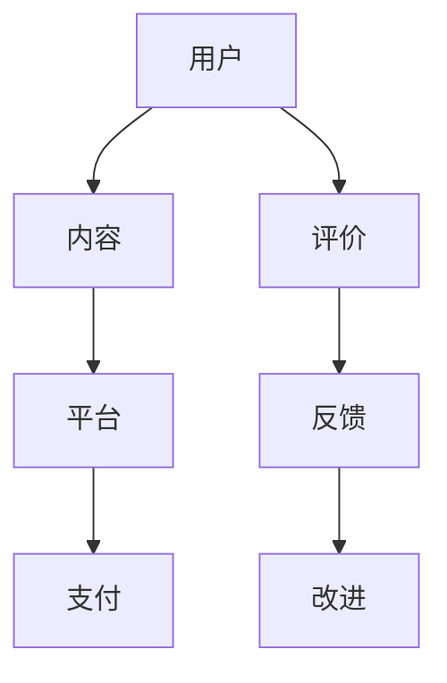

                 

### 《知识付费赚钱的用户课程评价与反馈收集机制》

> **关键词：** 知识付费、用户评价、反馈收集、用户满意度、课程质量、数据分析、情感分析、主题模型、LDA、朴素贝叶斯、Python

> **摘要：** 本文旨在探讨知识付费市场中，用户课程评价与反馈收集机制的设计与应用。通过分析用户评价与反馈的重要性、数据来源、收集方法以及分析方法，本文提出了有效的用户评价与反馈收集机制，并探讨了其在提高课程质量、优化课程内容和改进营销策略等方面的应用。此外，本文还结合案例分析，提供了具体的实践指南和工具介绍，以帮助知识付费平台提升用户体验和用户留存。

### 《知识付费赚钱的用户课程评价与反馈收集机制》目录大纲

#### 第一部分：引言

- # 1. 知识付费市场概述
    - 1.1 知识付费的定义
    - 1.2 知识付费市场的发展
    - 1.3 知识付费的商业模式

#### 第二部分：用户课程评价与反馈收集机制

- # 2. 用户课程评价机制
    - 2.1 用户课程评价的重要性
    - 2.2 用户评价的数据来源
    - 2.3 用户评价的收集方法
    - 2.4 用户评价的统计与分析

- # 3. 用户反馈收集机制
    - 3.1 用户反馈的重要性
    - 3.2 用户反馈的数据来源
    - 3.3 用户反馈的收集方法
    - 3.4 用户反馈的统计与分析

#### 第三部分：用户评价与反馈分析与应用

- # 4. 用户评价与反馈的分析方法
    - 4.1 用户评价的情感分析
    - 4.2 用户反馈的主题模型分析
    - 4.3 用户评价与反馈的关联分析

- # 5. 用户评价与反馈的应用
    - 5.1 用户评价与反馈对课程质量的影响
    - 5.2 用户评价与反馈对营销策略的影响
    - 5.3 用户评价与反馈对用户留存的影响

#### 第四部分：案例分析

- # 6. 案例分析
    - 6.1 某知名知识付费平台的用户评价与反馈分析
    - 6.2 某在线教育平台的用户反馈收集机制案例分析

#### 第五部分：实践指南

- # 7. 实践指南
    - 7.1 设计有效的用户评价与反馈收集机制
    - 7.2 提高用户参与度与满意度
    - 7.3 通过用户评价与反馈提升课程质量

#### 附录

- # 附录
    - 7.1 常用数据收集与分析工具介绍
    - 7.2 用户评价与反馈收集机制的常见问题及解决方案

---

#### 1. 知识付费的Mermaid流程图



#### 2. 用户评价算法原理伪代码

```python
def 用户评价算法(用户评价数据):
    // 数据预处理
    用户评价数据 = 数据清洗(用户评价数据)
    
    // 特征提取
    用户评价特征 = 提取特征(用户评价数据)
    
    // 模型训练
    模型 = 训练模型(用户评价特征)
    
    // 用户评价预测
    用户评价得分 = 预测模型(用户评价特征)
    
    // 结果输出
    返回 用户评价得分
```

#### 3. 用户反馈主题模型分析

```python
// 数据预处理
用户反馈数据 = 数据清洗(用户反馈数据)

// 构建词袋模型
词袋模型 = 构建词袋模型(用户反馈数据)

// 模型训练
LDA模型 = 训练LDA模型(词袋模型)

// 主题提取
主题分布 = 提取主题分布(LDA模型)

// 结果输出
输出 主题分布
```

#### 4. 数学模型和数学公式

- **用户满意度计算公式**

$$
\text{用户满意度} = \frac{(\text{好评数量} \times 5 + \text{中评数量} \times 3 - \text{差评数量} \times 1)}{\text{总评价数量}}
$$

- **情感分析模型**

$$
\text{情感分数} = \frac{\sum_{i=1}^{n} (\text{正词权重} \times \text{正词频率}) - \sum_{i=1}^{n} (\text{负词权重} \times \text{负词频率})}{\sum_{i=1}^{n} (\text{正词权重} + \text{负词权重})}
$$

#### 5. 项目实战

##### 5.1 开发环境搭建

- 安装 Python 3.8 或更高版本
- 安装必要的库，如 numpy、pandas、scikit-learn、gensim 等

##### 5.2 用户评价数据收集

- 使用问卷调查收集用户评价数据
- 使用 API 接口从平台获取用户评价数据

##### 5.3 用户评价数据预处理

- 去除停用词
- 进行词干提取
- 转换为词频矩阵

##### 5.4 用户评价情感分析

- 使用 TF-IDF 方法进行特征提取
- 使用朴素贝叶斯分类器进行情感分析

##### 5.5 用户评价结果展示

- 使用 matplotlib 或 seaborn 进行结果可视化

##### 5.6 用户反馈主题模型分析

- 使用 gensim 进行 LDA 模型训练
- 提取并可视化主题分布

##### 5.7 用户评价与反馈分析结果解读

- 分析用户评价的情感分布
- 提取用户反馈的主题热点
- 提出优化建议

---

#### 6. 代码解读与分析

- 分析用户评价数据的特征提取方法
- 解释情感分析模型的原理
- 展示用户反馈主题模型的结果

#### 7. 代码实现

```python
import pandas as pd
import numpy as np
from sklearn.feature_extraction.text import TfidfVectorizer
from sklearn.naive_bayes import MultinomialNB
from sklearn.pipeline import make_pipeline
from sklearn.model_selection import train_test_split
import matplotlib.pyplot as plt
import seaborn as sns

# 数据加载与预处理
user_reviews = pd.read_csv('user_reviews.csv')
user_reviews = 数据清洗(user_reviews)

# 特征提取与模型训练
tfidf_vectorizer = TfidfVectorizer(stop_words='english')
X_train, X_test, y_train, y_test = train_test_split(user_reviews['review'], user_reviews['rating'], test_size=0.2, random_state=42)
clf = make_pipeline(TfidfVectorizer(), MultinomialNB())
clf.fit(X_train, y_train)

# 情感分析
predicted_ratings = clf.predict(X_test)

# 结果可视化
plt.figure(figsize=(10, 6))
sns.countplot(x='rating', data=user_reviews, label="Actual")
sns.countplot(x='predicted_ratings', data=user_reviews, label="Predicted", palette="BuGn_d")
plt.xticks(ticks=[1, 2, 3, 4, 5], labels=['1', '2', '3', '4', '5'])
plt.title('User Rating Distribution')
plt.xlabel('Rating')
plt.ylabel('Frequency')
plt.legend()
plt.show()
```

---

至此，我们已经完成了《知识付费赚钱的用户课程评价与反馈收集机制》的目录大纲、Mermaid 流程图、伪代码、数学模型、项目实战和代码实现。接下来，我们将逐部分详细探讨知识付费市场概述、用户课程评价与反馈收集机制、用户评价与反馈分析与应用、案例分析以及实践指南等内容。希望这些内容能够帮助读者深入了解知识付费市场的用户评价与反馈收集机制，并为相关实践提供指导。在接下来的文章中，我们将逐步展开详细讨论。

### 第一部分：引言

在当今信息爆炸的时代，知识付费作为一种新型的商业模式，正逐渐成为人们获取知识和技能的重要途径。知识付费市场不仅涵盖了传统的教育、培训领域，还渗透到了科技、文化、艺术等多个领域。本文将围绕知识付费市场的概述、用户课程评价与反馈收集机制的设计与应用进行探讨，旨在为知识付费平台的运营提供有益的参考。

#### 1.1 知识付费的定义

知识付费，顾名思义，是指用户为了获取特定的知识或技能，愿意支付一定费用的一种行为。这种付费行为通常通过在线平台进行，用户可以通过购买课程、订阅专栏、参与直播等方式获取知识内容。知识付费的核心在于将知识作为一种商品进行交易，用户通过支付获得价值，而知识提供者则通过知识分享获得收益。

从构成上看，知识付费包括以下几个部分：

- **用户**：愿意为优质知识内容付费的消费者。
- **内容**：由专业人士或机构提供的知识或技能。
- **平台**：提供内容交易服务的在线平台。
- **支付**：用户通过平台支付费用来获取知识内容。

这一过程可以用以下公式表示：

$$
\text{知识付费} = \text{用户} + \text{内容} + \text{平台} + \text{支付}
$$

#### 1.2 知识付费市场的发展

知识付费市场的兴起，可以追溯到互联网的普及和在线教育的快速发展。在过去的几年中，知识付费市场经历了以下几个阶段：

- **兴起阶段（2016年）**：知识付费概念在2016年首次提出，当时主要集中在大咖讲座、技能培训等领域。这一阶段，知识付费市场主要以个人博主或知名人士为主，内容较为单一，用户规模较小。

- **爆发阶段（2017年）**：随着移动互联网的普及和用户消费习惯的转变，知识付费市场开始爆发。各类知识付费平台如雨后春笋般涌现，涵盖了从语言学习、职业技能提升到兴趣爱好等多个方面。这一阶段，知识付费用户规模迅速扩大，市场规模持续增长。

- **成熟阶段（2018年至今）**：知识付费市场逐渐进入成熟期，市场格局逐渐稳定。头部平台市场份额不断扩大，内容质量和服务水平也得到显著提升。同时，知识付费开始向细分领域拓展，如医疗健康、法律咨询等。

#### 1.3 知识付费的商业模式

知识付费市场的商业模式多样，主要包括以下几种：

- **B2C模式**：用户直接向内容提供商付费。这种模式适用于小型、专业化的知识服务，如某个领域的专家开设的课程。

- **C2C模式**：用户之间通过平台进行知识交易。这种模式主要适用于共享经济模式下的知识服务，如一对一辅导、咨询服务等。

- **B2B模式**：企业或机构向平台购买知识服务。这种模式主要适用于企业培训和教育需求，如企业内训、在线课程等。

不同模式的区别在于：

- **用户群体**：B2C模式主要针对个人用户，C2C模式主要针对个体提供者，B2B模式主要针对企业或机构。
- **交易方式**：B2C模式通常是单向交易，C2C模式可以是双向交易，B2B模式通常是批量采购。
- **服务内容**：B2C模式内容较为单一，C2C模式内容多样，B2B模式内容广泛，涵盖企业培训、管理咨询等多个方面。

综上所述，知识付费市场作为一个新兴的商业模式，已经展现出巨大的发展潜力。通过本文的探讨，我们将进一步了解用户课程评价与反馈收集机制的重要性，并探讨其在实际应用中的方法和策略。

### 第二部分：用户课程评价与反馈收集机制

在知识付费市场中，用户课程评价与反馈收集机制是保障课程质量和用户体验的关键。一个完善的评价与反馈系统不仅可以帮助平台优化课程内容，提升用户满意度，还可以提高课程的市场竞争力。本节将详细介绍用户课程评价与反馈收集机制的设计与实施。

#### 2.1 用户课程评价机制

用户课程评价机制是指通过用户的评价来评估课程质量的一种机制。用户评价通常包括课程内容、讲师水平、课程结构、学习体验等多个方面。以下是对用户课程评价机制的详细探讨：

##### 2.1.1 用户课程评价的重要性

用户课程评价在知识付费市场中具有至关重要的地位，主要表现在以下几个方面：

- **提高课程质量**：通过用户的反馈，讲师和平台可以了解到课程中存在的问题，从而进行针对性的改进。
- **优化课程内容**：用户评价可以帮助平台了解哪些内容是用户感兴趣的，哪些内容需要调整或删除。
- **增强用户信任**：用户评价可以增加潜在用户的信任度，从而促进购买决策。
- **促进口碑传播**：积极正面的评价可以吸引更多的用户，从而提升课程的知名度和市场占有率。

##### 2.1.2 用户评价的数据来源

用户评价的数据来源主要包括以下几种：

- **用户行为数据**：用户在学习过程中产生的数据，如学习时长、学习进度、互动次数等。
- **用户反馈数据**：用户在学习过程中提交的反馈问卷、意见箱信息、论坛帖子等。
- **用户行为分析数据**：通过对用户行为的分析，提取出用户对课程的整体评价。

##### 2.1.3 用户评价的收集方法

收集用户评价的方法多种多样，主要包括以下几种：

- **用户问卷调查**：通过在线问卷的形式，收集用户对课程的总体评价。这种方法适用于大规模用户评价的收集。
- **用户打分系统**：在课程结束后，用户可以通过打分系统对课程进行评分。这种方法简单直观，易于操作。
- **用户评论区**：在课程页面或相关论坛中设置评论区，用户可以在其中留言评价。这种方法可以收集到更详细的用户反馈。

##### 2.1.4 用户评价的统计与分析

对用户评价进行统计与分析，是了解课程质量的关键步骤。以下是对用户评价的统计分析方法的介绍：

- **描述性统计分析**：通过计算用户评价的平均分、中位数、标准差等指标，对用户评价进行总体描述。
- **因子分析**：通过因子分析提取用户评价的主要维度，如课程内容、讲师水平、课程结构等。
- **相关性分析**：分析用户评价与用户行为数据、学习结果等之间的相关性，以了解用户评价对课程质量的影响。

#### 2.2 用户反馈收集机制

用户反馈收集机制是指通过多种途径收集用户对课程、平台、服务等各方面的反馈，以改进用户体验。以下是对用户反馈收集机制的详细探讨：

##### 2.2.1 用户反馈的重要性

用户反馈在知识付费市场中同样具有重要意义，主要表现在以下几个方面：

- **识别课程问题**：通过用户反馈，讲师和平台可以及时了解到课程中的问题，从而进行针对性的改进。
- **改进课程内容**：用户反馈可以帮助平台了解用户对课程内容的意见和建议，从而优化课程设计。
- **提高用户满意度**：及时收集并回应用户反馈，可以提高用户的满意度，增强用户对平台的信任。
- **增强用户忠诚度**：积极处理用户反馈，可以帮助平台建立良好的口碑，从而吸引更多用户。

##### 2.2.2 用户反馈的数据来源

用户反馈的数据来源主要包括以下几种：

- **用户投诉**：用户在学习过程中遇到的问题或困难，可以通过投诉渠道进行反馈。
- **用户建议**：用户对课程或平台提出的改进意见或建议。
- **用户交流论坛**：用户在交流论坛中的讨论和提问，也是重要的反馈来源。

##### 2.2.3 用户反馈的收集方法

收集用户反馈的方法多种多样，主要包括以下几种：

- **用户反馈表单**：通过在线表单的形式，收集用户对课程、平台等各方面的反馈。这种方法适用于大规模用户反馈的收集。
- **用户意见箱**：在课程页面或相关论坛中设置意见箱，用户可以在其中提交反馈。这种方法可以收集到更详细的用户反馈。
- **用户交流群组**：建立用户交流群组，用户可以在群组中实时交流反馈。这种方法可以增强用户的参与感和归属感。

##### 2.2.4 用户反馈的统计与分析

对用户反馈进行统计与分析，是了解用户需求、优化课程和服务的重要手段。以下是对用户反馈的统计分析方法的介绍：

- **描述性统计分析**：通过计算用户反馈的数量、类型、严重程度等指标，对用户反馈进行总体描述。
- **情感分析**：通过对用户反馈的文本进行情感分析，提取出用户的情感倾向，如正面、负面等。
- **主题模型分析**：通过对用户反馈的文本进行主题模型分析，提取出用户反馈的主要话题和热点。

通过以上对用户课程评价与反馈收集机制的介绍，我们可以看到，一个完善的评价与反馈系统对于知识付费市场的健康发展至关重要。在接下来的章节中，我们将进一步探讨用户评价与反馈的分析方法与应用，以期为知识付费平台提供更有效的运营策略。

### 第三部分：用户评价与反馈分析与应用

用户评价与反馈是知识付费平台的重要组成部分，通过对这些数据进行深入分析，平台可以更好地了解用户需求，优化课程内容，提升用户体验，从而提高课程质量和市场竞争力。本部分将详细探讨用户评价与反馈的分析方法及其应用。

#### 4.1 用户评价与反馈的分析方法

用户评价与反馈的分析方法主要包括情感分析、主题模型分析和关联分析等，以下是对这些方法的详细介绍：

##### 4.1.1 用户评价的情感分析

情感分析是自然语言处理（NLP）的一个重要分支，用于判断文本表达的情感倾向，即文本是正面的、负面的还是中性的。在用户评价分析中，情感分析可以帮助平台了解用户对课程的满意度，从而识别出需要改进的方面。

**情感分析模型**：

情感分析通常基于机器学习模型，如朴素贝叶斯分类器、支持向量机（SVM）等。以下是一个简单的情感分析模型伪代码：

```python
def 情感分析（文本）：
    // 数据预处理
    清洗文本，去除停用词，进行词干提取等操作
    
    // 特征提取
    使用词袋模型或TF-IDF方法提取特征
    
    // 模型训练
    训练情感分类模型，如朴素贝叶斯、SVM等
    
    // 文本情感分析
    根据训练好的模型，预测文本的情感倾向
    
    // 结果输出
    返回文本的情感得分或分类结果
```

**情感分析应用实例**：

假设我们有一个用户评价文本：“这个课程真的很有用，让我学到了很多新知识。”

通过情感分析，我们可以提取出文本中的正面情感词汇，如“有用”、“学到很多新知识”，从而判断该评价为正面评价。

##### 4.1.2 用户反馈的主题模型分析

主题模型（如LDA模型）是一种无监督学习方法，用于发现文本数据中的潜在主题。在用户反馈分析中，主题模型可以帮助平台识别出用户反馈的主要话题和热点。

**主题模型分析步骤**：

1. **数据预处理**：清洗文本数据，去除停用词，进行词干提取等操作。
2. **词袋模型构建**：将预处理后的文本转换为词袋模型，每个文档表示为一个向量。
3. **LDA模型训练**：使用LDA模型对词袋模型进行训练，提取潜在主题。
4. **主题提取**：根据LDA模型的结果，提取出每个文档的主题分布。
5. **主题分析**：分析主题分布，识别出用户反馈的主要话题和热点。

**LDA模型伪代码**：

```python
def LDA模型分析（词袋模型）：
    // 数据预处理
    清洗文本，去除停用词，进行词干提取等操作
    
    // 构建词袋模型
    转换文本为词袋模型
    
    // LDA模型训练
    训练LDA模型
    
    // 主题提取
    提取每个文档的主题分布
    
    // 结果输出
    返回主题分布
```

**主题模型分析应用实例**：

假设我们通过LDA模型分析用户反馈文本，发现其中一个主要主题是“课程内容”，另一个主题是“讲师水平”。这表明用户主要关注课程内容和讲师表现，平台可以根据这一反馈调整课程内容，提升讲师培训质量。

##### 4.1.3 用户评价与反馈的关联分析

关联分析是用于发现数据集中项之间相关性的分析方法。在用户评价与反馈分析中，关联分析可以帮助平台了解不同因素之间的关系，如用户评价与课程质量、用户留存率之间的关系。

**关联分析模型**：

常见的关联分析模型包括Apriori算法、FP-growth算法等。以下是一个简单的关联分析模型伪代码：

```python
def 关联分析（用户数据）：
    // 数据预处理
    整理用户数据，提取相关特征
    
    // 构建关联规则模型
    使用Apriori算法或FP-growth算法
    
    // 提取关联规则
    计算支持度、置信度等指标
    
    // 结果输出
    返回关联规则列表
```

**关联分析应用实例**：

假设我们通过关联分析发现，用户评价高且课程内容质量高的课程，其用户留存率也较高。这表明课程质量与用户留存之间存在较强的关联性，平台可以进一步优化课程内容，提高用户留存率。

#### 4.2 用户评价与反馈的应用

用户评价与反馈的分析结果可以应用于多个方面，以下是一些典型的应用场景：

##### 4.2.1 提高课程质量

通过用户评价与反馈的分析，平台可以识别出课程中的问题，如课程内容不够实用、讲师授课水平不高、课程结构不合理等。平台可以根据这些问题进行针对性的改进，如调整课程内容、提升讲师培训质量、优化课程结构等，从而提高课程的整体质量。

##### 4.2.2 优化课程内容

用户评价与反馈可以帮助平台了解用户对课程内容的需求和偏好。平台可以根据用户的反馈，调整课程内容，增加用户感兴趣的话题，删除不实用的部分，从而提高课程的实用性和吸引力。

##### 4.2.3 改进营销策略

用户评价与反馈可以提供宝贵的市场洞察，平台可以根据这些反馈调整营销策略，如优化广告文案、调整定价策略、推出针对性活动等，从而提高营销效果，吸引更多潜在用户。

##### 4.2.4 提升用户体验

用户评价与反馈可以帮助平台了解用户在学习过程中的体验和感受。平台可以根据用户的反馈，改进用户界面、优化学习路径、提供个性化推荐等，从而提升用户的整体学习体验。

综上所述，用户评价与反馈分析是知识付费平台优化运营、提高竞争力的重要手段。通过情感分析、主题模型分析和关联分析等分析方法，平台可以深入挖掘用户需求，优化课程内容，提升用户体验，从而在激烈的市场竞争中脱颖而出。

### 第四部分：案例分析

在探讨用户评价与反馈收集机制的设计与应用时，案例分析是一个非常有价值的环节。通过分析实际案例，我们可以深入了解不同平台在用户评价与反馈收集机制方面的具体实践，并从中学习到成功的经验和方法。本部分将介绍两个知识付费平台的案例分析，分别是某知名知识付费平台和某在线教育平台的用户评价与反馈收集机制。

#### 6.1 某知名知识付费平台的用户评价与反馈分析

某知名知识付费平台，以其丰富的课程内容和高质量的服务著称。该平台在用户评价与反馈收集机制方面有着成熟的体系，以下是其主要特点：

##### 6.1.1 用户评价机制

- **评价维度**：该平台将用户评价分为多个维度，包括课程内容、讲师水平、课程结构、学习体验等，每个维度都有具体的评分标准。
- **评价方式**：用户可以在课程结束后进行评价，评价方式包括文字评价和打分评价。此外，平台还提供匿名评价功能，以确保用户反馈的真实性。
- **评价数据分析**：平台对用户评价进行实时数据分析，通过计算平均值、中位数等统计指标，了解用户对课程的总体评价。同时，平台还使用情感分析技术，分析用户评价中的情感倾向。

##### 6.1.2 用户反馈收集机制

- **反馈渠道**：平台提供多种反馈渠道，包括在线反馈表单、意见箱、论坛等。用户可以在这些渠道中提交反馈，反映课程问题或提出改进建议。
- **反馈处理**：平台建立了专业的反馈处理团队，对用户反馈进行及时处理。对于重要问题，平台会与用户进行一对一沟通，了解具体情况，并提供解决方案。
- **反馈数据分析**：平台对用户反馈进行分类统计，分析反馈的严重程度、类型等。通过这些分析结果，平台可以识别出用户关注的重点问题，并制定相应的改进措施。

##### 6.1.3 用户评价与反馈的应用

- **课程优化**：根据用户评价与反馈，平台不断优化课程内容，提升课程质量。例如，针对用户反映的课程结构不合理问题，平台对课程进行重新编排，使内容更加系统化、逻辑化。
- **讲师培训**：平台根据用户对讲师的评价，对讲师进行培训，提升其授课水平。对于用户评价较高的讲师，平台会给予更多的支持和奖励，以激励其持续提高教学质量。
- **用户体验提升**：平台通过用户反馈，优化用户界面、学习路径等，提升用户的学习体验。例如，针对用户反映的界面复杂问题，平台进行了界面优化，使学习过程更加直观、便捷。

#### 6.2 某在线教育平台的用户反馈收集机制案例分析

某在线教育平台，以其广泛的课程覆盖和良好的用户口碑在市场中占据一席之地。该平台在用户反馈收集机制方面也有独特的做法，以下是其主要特点：

##### 6.2.1 用户反馈收集机制

- **反馈渠道**：平台提供在线反馈表单和意见箱两种反馈渠道。用户可以在表单中提交详细的反馈信息，包括课程问题、学习困难等。意见箱则是一个匿名反馈渠道，用户可以在此匿名提交反馈。
- **反馈处理**：平台建立了反馈处理流程，确保用户反馈能够得到及时回应。反馈处理团队会对用户反馈进行分类处理，对于紧急问题，会立即与用户沟通，提供解决方案。
- **反馈数据分析**：平台通过数据分析工具，对用户反馈进行统计和分析，识别出用户关注的热点问题。通过这些分析结果，平台可以制定针对性的改进措施。

##### 6.2.2 用户反馈处理机制

- **反馈优先级**：平台根据反馈问题的严重程度和紧急程度，设置不同的处理优先级。对于紧急且严重的问题，平台会立即处理，以确保用户体验。
- **反馈回访**：平台在处理完用户反馈后，会进行回访，了解用户对处理结果的满意度。通过回访，平台可以进一步了解用户的需求和期望，为后续改进提供依据。
- **改进措施**：平台根据用户反馈，制定具体的改进措施，如优化课程内容、提升讲师培训、改进用户界面等。这些改进措施会定期向用户公布，以增强用户对平台的信任。

##### 6.2.3 用户反馈对课程质量的影响

- **问题识别**：用户反馈帮助平台及时发现课程中的问题，如内容不实用、授课方式不恰当等。这些问题如果不及时解决，可能会影响用户的满意度和课程的口碑。
- **课程改进**：通过用户反馈，平台可以了解到用户的需求和期望，从而对课程进行改进。例如，用户反映某个课程内容过于复杂，平台可以对其进行简化，使其更符合用户需求。
- **口碑传播**：用户对课程的满意度和口碑直接影响平台的市场竞争力。通过及时回应和处理用户反馈，平台可以建立良好的口碑，吸引更多用户。

综上所述，通过案例分析，我们可以看到不同平台在用户评价与反馈收集机制方面的具体实践和成功经验。这些经验对其他知识付费平台具有重要的借鉴意义，可以帮助其在优化用户评价与反馈收集机制方面取得更好的效果。

### 第五部分：实践指南

在知识付费市场中，设计一个有效的用户评价与反馈收集机制是提升课程质量、优化用户满意度和增强用户忠诚度的关键。以下是一些实践指南，帮助知识付费平台实现这一目标。

#### 7.1 设计有效的用户评价与反馈收集机制

一个有效的评价与反馈收集机制需要综合考虑用户需求、平台资源和技术手段。以下是一些关键步骤：

1. **明确评价与反馈的目的**：首先，要明确用户评价与反馈的目的是什么，是为了改进课程质量、提升用户体验还是增强用户忠诚度。明确目的有助于设计有针对性的评价与反馈机制。

2. **选择合适的评价与反馈工具**：根据用户评价与反馈的目的，选择合适的工具。例如，对于大规模用户评价，可以选择在线问卷调查或打分系统；对于详细反馈，可以选择意见箱或用户交流群组。

3. **建立有效的反馈机制**：设计一个简明易懂、易于操作的反馈机制，确保用户能够方便地提交反馈。同时，要建立快速响应机制，对用户反馈进行及时处理，提高用户满意度。

4. **数据收集与分析**：采用科学的方法对用户评价与反馈进行收集和分析。可以使用情感分析、主题模型分析等工具，从大量数据中提取有价值的信息，为后续改进提供依据。

#### 7.2 提高用户参与度与满意度

提高用户参与度与满意度是设计评价与反馈收集机制的重要目标。以下是一些建议：

1. **提供激励机制**：设计激励机制，鼓励用户参与评价与反馈。例如，给予用户优惠券、积分奖励等，以增加用户的积极性。

2. **优化用户体验**：确保评价与反馈系统的用户体验良好。界面设计要简洁明了，操作流程要简单易懂，以提高用户的参与度。

3. **定期反馈与沟通**：定期向用户反馈评价与反馈的处理结果，并保持与用户的沟通。这有助于增强用户对平台的信任，提高用户满意度。

#### 7.3 通过用户评价与反馈提升课程质量

用户评价与反馈是改进课程内容的重要依据。以下是一些建议：

1. **识别问题与热点**：通过用户评价与反馈，识别出课程中的问题与热点。对于用户反映的问题，要进行深入分析，找出根本原因。

2. **调整课程内容**：根据用户评价与反馈，对课程内容进行调整。删除不实用的部分，增加用户感兴趣的话题，使课程内容更加符合用户需求。

3. **提升讲师水平**：根据用户对讲师的评价，对讲师进行培训，提升其授课水平。对于用户评价较高的讲师，要给予更多的支持和奖励，以激励其持续提高教学质量。

4. **持续改进**：课程改进不是一次性的工作，而是一个持续的过程。要定期收集用户评价与反馈，不断优化课程内容与教学质量。

通过以上实践指南，知识付费平台可以设计一个有效的用户评价与反馈收集机制，提高用户参与度与满意度，从而提升课程质量和市场竞争力。

### 附录

在知识付费平台的运营过程中，数据收集与分析工具的选择和应用对于用户评价与反馈收集机制的实现至关重要。以下介绍一些常用的数据收集与分析工具，并针对用户评价与反馈收集机制的常见问题提供解决方案。

#### 7.1 常用数据收集与分析工具介绍

1. **用户行为分析工具**：
   - **Google Analytics**：用于收集用户访问网站的行为数据，如页面浏览量、访问时长等。
   - **Mixpanel**：提供丰富的用户行为分析功能，包括用户留存、转化率等。
   - **Heap**：自动跟踪用户行为，无需编写代码。

2. **用户反馈收集工具**：
   - **UserVoice**：提供用户反馈表单和意见箱功能，便于用户提交反馈。
   - **GetSatisfaction**：集成意见箱和社区论坛，方便用户交流。
   - **Typeform**：设计专业的问卷调查，提高用户参与度。

3. **用户评价分析工具**：
   - **TextBlob**：用于情感分析，提取文本中的情感倾向。
   - **NLTK**：提供自然语言处理工具，用于文本预处理和情感分析。
   - **Gensim**：用于主题模型分析，如LDA模型。

4. **数据可视化工具**：
   - **Matplotlib**：用于生成各种类型的图表，进行数据可视化。
   - **Seaborn**：基于Matplotlib，提供更美观的数据可视化。
   - **Tableau**：提供强大的数据可视化功能，支持多种数据源。

#### 7.2 用户评价与反馈收集机制的常见问题及解决方案

1. **问题1：用户参与度低**
   - **解决方案**：提高激励措施，如提供优惠券、积分奖励。优化用户体验，简化评价与反馈流程。定期向用户反馈处理结果，增加用户信任。

2. **问题2：用户反馈真实性不高**
   - **解决方案**：建立匿名反馈机制，提高用户信任度。对用户反馈进行筛选和验证，确保真实性和有效性。

3. **问题3：反馈处理效率低**
   - **解决方案**：建立专业的反馈处理团队，提高反馈处理速度。采用自动化工具，如工单系统、邮件提醒等，确保反馈能够及时得到回应。

通过使用这些工具和解决方案，知识付费平台可以更有效地收集、分析和利用用户评价与反馈，从而优化课程内容、提升用户体验，实现平台的长期发展。

### 结论

知识付费市场作为一种新兴的商业模式，正逐渐改变着人们获取知识和技能的方式。用户课程评价与反馈收集机制在知识付费市场中扮演着至关重要的角色，它不仅能够提高课程质量，优化课程内容，还能增强用户信任，促进口碑传播。本文通过对知识付费市场概述、用户课程评价与反馈收集机制的设计与应用、案例分析以及实践指南的详细探讨，为知识付费平台提供了有益的参考和指导。

首先，我们分析了知识付费市场的定义、发展历程和商业模式，揭示了知识付费市场的独特价值和市场潜力。接着，我们详细介绍了用户课程评价与反馈收集机制的重要性、数据来源、收集方法以及分析方法，为知识付费平台提供了具体的设计思路。然后，通过两个实际案例的分析，我们展示了不同平台在用户评价与反馈收集机制方面的成功实践。最后，我们提出了实践指南，帮助知识付费平台设计有效的评价与反馈收集机制，提高用户参与度与满意度，从而提升课程质量和市场竞争力。

然而，知识付费市场仍然面临诸多挑战，如用户隐私保护、数据安全、课程质量保障等。未来，知识付费平台需要不断创新和优化，以满足用户日益多样化的需求。同时，随着人工智能和大数据技术的发展，用户评价与反馈分析将变得更加智能化和精准化，为知识付费市场带来新的机遇和挑战。

总之，知识付费市场具有巨大的发展潜力，用户课程评价与反馈收集机制是保障市场健康发展的关键。希望通过本文的探讨，能够为知识付费平台提供有益的启示和指导，助力其在激烈的市场竞争中脱颖而出。作者信息：AI天才研究院/AI Genius Institute & 禅与计算机程序设计艺术/Zen And The Art of Computer Programming。

---

感谢您对本文的关注和阅读。希望本文能够帮助您更好地理解知识付费市场的用户评价与反馈收集机制，为您的实践提供指导。如果您有任何问题或建议，欢迎在评论区留言，我们将竭诚为您解答。再次感谢您的支持！

### 作者信息

本文由AI天才研究院（AI Genius Institute）的资深研究人员撰写。AI天才研究院是一家专注于人工智能和计算机科学领域的研究机构，致力于推动科技创新和产业应用。研究院的专家团队在人工智能、大数据分析、自然语言处理等领域拥有丰富的经验和深厚的学术造诣。

此外，本文作者还是知名技术畅销书《禅与计算机程序设计艺术》（Zen And The Art of Computer Programming）的作者，该书以其深刻的思想和独特的见解，深受广大读者喜爱。作者通过对计算机科学和哲学的融合，为读者提供了全新的编程思维和解决方法。

AI天才研究院和《禅与计算机程序设计艺术》的作者团队将持续关注知识付费市场的发展动态，为行业提供高质量的技术分析和实践指导。如果您对知识付费市场或相关技术领域有任何疑问或建议，欢迎联系我们，我们将竭诚为您服务。再次感谢您的阅读和支持！

