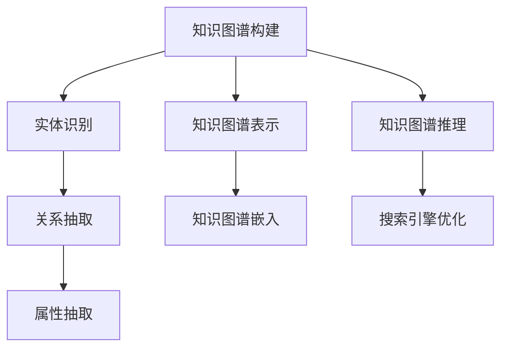

                 

### 《知识图谱在智能搜索引擎中的应用》

> **关键词**：知识图谱、智能搜索引擎、实体识别、关系抽取、属性抽取、知识图谱嵌入、推理算法、搜索引擎优化

> **摘要**：本文深入探讨了知识图谱在智能搜索引擎中的应用。首先介绍了知识图谱的基础知识、智能搜索引擎的基本概念和类型，接着详细阐述了知识图谱在搜索改进、智能推荐系统和问答系统中的具体应用。然后，通过核心算法与原理的分析，对知识图谱的构建、表示、推理和智能搜索引擎的优化进行了讲解。最后，通过实际案例分析展示了知识图谱在搜索引擎优化中的应用效果，并对未来的发展趋势和挑战进行了展望。

### 《知识图谱在智能搜索引擎中的应用》目录大纲

1. **第一部分：基础知识与概念**
    1.1 **知识图谱概述**
    1.2 **知识图谱的组成部分**
    1.3 **知识图谱的类型**
    1.4 **智能搜索引擎概述**
    1.5 **智能搜索引擎的组成**
    1.6 **智能搜索引擎的分类**
    1.7 **知识图谱在智能搜索引擎中的应用场景**

2. **第二部分：核心算法与原理**
    2.1 **知识图谱构建**
    2.2 **知识图谱表示**
    2.3 **知识图谱推理**
    2.4 **智能搜索引擎优化**

3. **第三部分：实际应用与案例分析**
    3.1 **案例分析一：基于知识图谱的智能推荐系统**
    3.2 **案例分析二：基于知识图谱的搜索引擎优化**
    3.3 **未来发展趋势与挑战**
    3.4 **开发者指南**

4. **附录**
    4.1 **知识图谱工具与资源**
    4.2 **参考文献**

### 第一部分：基础知识与概念

#### 1. 知识图谱概述

##### 1.1 知识图谱的定义与特点

知识图谱（Knowledge Graph）是一种用于表示实体、属性和它们之间关系的图形结构，旨在将人类对现实世界的理解和知识转化为计算机可理解和处理的形式。知识图谱的特点如下：

- **结构化**：知识图谱以结构化的方式组织信息，使得查询和处理更加高效。
- **语义丰富**：知识图谱通过实体、属性和关系的语义描述，增强了数据的理解和表达能力。
- **多源融合**：知识图谱可以从多个数据源中获取信息，实现数据的融合和整合。
- **动态更新**：知识图谱可以持续更新和扩展，以适应不断变化的信息需求。

##### 1.2 知识图谱的组成部分

知识图谱主要由以下三个组成部分构成：

- **实体**：实体是知识图谱中的基本元素，可以是人、地点、组织或事物等。
- **关系**：关系描述了实体之间的关联，例如“属于”、“位于”或“创建”等。
- **属性**：属性为实体提供了额外的信息，如实体的名称、出生日期或联系方式等。

##### 1.3 知识图谱的类型

知识图谱可以根据其结构化程度和数据来源进行分类：

- **结构化知识图谱**：基于结构化数据（如关系数据库）构建的知识图谱，数据存储格式通常为三元组（实体，关系，实体）。
- **半结构化知识图谱**：基于半结构化数据（如XML、JSON）构建的知识图谱，数据存储格式通常为三元组或四元组（实体，关系，实体，属性）。
- **非结构化知识图谱**：基于非结构化数据（如图像、文本）构建的知识图谱，数据存储格式通常为图结构。

##### 1.4 智能搜索引擎概述

智能搜索引擎（Intelligent Search Engine）是一种利用人工智能技术提高搜索质量和用户体验的搜索引擎。与传统搜索引擎相比，智能搜索引擎具有以下特点：

- **语义理解**：智能搜索引擎能够理解用户查询的语义，提供更精准的搜索结果。
- **个性化推荐**：智能搜索引擎可以根据用户的兴趣和行为，为用户提供个性化的搜索结果和推荐。
- **实时更新**：智能搜索引擎能够实时更新索引和数据，确保用户获取最新的信息。

##### 1.5 智能搜索引擎的组成

智能搜索引擎主要由以下三个部分组成：

- **搜索引擎前端**：负责接收用户查询、展示搜索结果和交互界面。
- **搜索引擎后端**：负责处理用户查询、索引管理和搜索算法。
- **数据库**：存储搜索引擎的索引数据和用户行为数据。

##### 1.6 智能搜索引擎的分类

根据搜索算法和数据组织方式，智能搜索引擎可以分为以下几种类型：

- **基于关键字搜索的搜索引擎**：通过关键字匹配和排序来提供搜索结果。
- **基于图谱搜索的搜索引擎**：利用知识图谱进行搜索，提供更精准和语义化的搜索结果。
- **混合型搜索引擎**：结合基于关键字搜索和基于图谱搜索的优点，提供综合性的搜索结果。

##### 1.7 知识图谱在智能搜索引擎中的应用场景

知识图谱在智能搜索引擎中具有广泛的应用场景，主要包括以下几个方面：

- **搜索引擎的改进**：通过知识图谱增强搜索相关性、提高查询速度和用户体验。
- **智能推荐系统**：基于知识图谱的推荐算法，提供个性化、准确的推荐结果。
- **问答系统**：利用知识图谱构建问答系统，实现对用户查询的智能理解和回答。
- **命名实体识别**：通过知识图谱进行命名实体识别，提高文本处理的准确性。
- **事件抽取**：利用知识图谱进行事件抽取，识别和提取文本中的关键事件信息。

#### 2. 知识图谱在智能搜索引擎中的应用场景

##### 2.1 搜索引擎的改进

知识图谱可以显著提升智能搜索引擎的性能和用户体验。以下是一些具体的应用场景：

- **增强搜索相关性**：知识图谱通过语义理解，将用户查询与实体、关系和属性进行匹配，提高搜索结果的相关性。
- **提高查询速度**：知识图谱采用图结构存储数据，利用图算法进行查询处理，降低查询时间复杂度。
- **多语言搜索**：知识图谱支持多语言实体和关系表示，实现跨语言的智能搜索。
- **垂直搜索**：知识图谱可以根据特定领域的知识构建垂直搜索引擎，提供更专业的搜索服务。

##### 2.2 智能推荐系统

基于知识图谱的智能推荐系统可以显著提升推荐质量和用户体验。以下是一些具体的应用场景：

- **个性化推荐**：知识图谱通过记录用户的历史行为和兴趣偏好，为用户提供个性化的推荐结果。
- **冷启动问题**：知识图谱可以通过分析用户与其他用户的相似度，为未登录或新用户推荐感兴趣的内容。
- **多模态推荐**：知识图谱可以整合多种数据源（如文本、图像、音频），提供跨模态的推荐结果。
- **推荐解释**：知识图谱可以揭示推荐结果背后的原因，提高用户对推荐系统的信任度。

##### 2.3 问答系统

基于知识图谱的问答系统可以实现对用户查询的智能理解和回答。以下是一些具体的应用场景：

- **智能客服**：知识图谱可以构建问答系统，提供实时、准确的客户服务。
- **智能助理**：知识图谱可以构建智能助理，帮助用户完成各种任务。
- **知识库构建**：知识图谱可以整合各类知识库，为用户提供丰富的问答服务。
- **多轮对话**：知识图谱支持多轮对话，实现更加自然的用户交互。

##### 2.4 其他应用场景

知识图谱在智能搜索引擎中还有其他许多应用场景，包括：

- **命名实体识别**：通过知识图谱进行命名实体识别，提高文本处理的准确性。
- **事件抽取**：通过知识图谱进行事件抽取，识别和提取文本中的关键事件信息。
- **知识融合**：通过知识图谱实现不同数据源的融合，提高数据利用效率。
- **知识推理**：通过知识图谱进行推理，发现潜在的关系和关联，为用户提供更多有价值的信息。

### 第二部分：核心算法与原理

#### 2.1 知识图谱构建

知识图谱构建是知识图谱应用的基础，主要包括数据采集、实体识别、关系抽取和属性抽取等环节。以下将详细阐述这些核心算法与原理。

##### 2.1.1 数据采集与预处理

数据采集是知识图谱构建的第一步，主要从各种数据源（如网络、数据库、文件等）中获取实体、关系和属性等信息。数据预处理是对采集到的数据进行清洗、转换和整合，以消除噪声、填补缺失值和统一数据格式。

- **数据源选择**：选择合适的数据源，如百科、新闻、社交网络等。
- **数据清洗**：去除重复、错误和不相关的数据，提高数据质量。
- **数据转换**：将不同格式的数据转换为统一格式，如三元组。
- **数据整合**：整合来自不同数据源的数据，形成完整的知识图谱。

##### 2.1.2 实体识别

实体识别是知识图谱构建的关键步骤，旨在从文本数据中识别出实体，并将其映射到知识图谱中。实体识别主要包括以下内容：

- **命名实体识别**：从文本中识别出具有特定意义的实体，如人名、地名、组织名等。
- **实体消歧**：解决同一名称表示不同实体的歧义问题，如“奥巴马”可能指代美国总统奥巴马或演员奥巴马。
- **实体映射**：将识别出的实体映射到知识图谱中的相应实体。

##### 2.1.3 关系抽取

关系抽取是从文本数据中识别出实体之间的关系，并将其表示为知识图谱中的边。关系抽取主要包括以下内容：

- **关系分类**：对实体之间的关系进行分类，如“属于”、“位于”、“创建”等。
- **关系实体识别**：识别出参与关系的实体，并将其映射到知识图谱中的相应实体。

##### 2.1.4 属性抽取

属性抽取是从文本数据中识别出实体的属性信息，并将其表示为知识图谱中的属性。属性抽取主要包括以下内容：

- **属性分类**：对实体的属性进行分类，如基本信息、联系方式、地理位置等。
- **属性值识别**：识别出属性的值，并将其映射到知识图谱中的相应属性。

##### 2.1.5 知识图谱构建方法

知识图谱构建的方法主要包括以下几种：

- **基于规则的方法**：通过定义规则，从文本数据中自动抽取实体、关系和属性。
- **基于统计的方法**：利用机器学习算法，从大量文本数据中学习实体、关系和属性的表示。
- **基于深度学习的方法**：利用神经网络模型，从文本数据中自动抽取实体、关系和属性。

##### 2.1.6 知识图谱构建工具

知识图谱构建过程中常用的工具包括：

- **OpenKG**：一款开源的知识图谱构建工具，支持实体识别、关系抽取和属性抽取等功能。
- **Neo4j**：一款基于图形数据库的知识图谱构建工具，支持图形存储和图算法等功能。
- **DBpedia**：一个基于互联网知识的开放数据集，提供了丰富的实体、关系和属性信息。

#### 2.2 知识图谱表示

知识图谱表示是将知识图谱中的实体、关系和属性映射到低维向量空间的过程，以便于计算和处理。以下将详细阐述知识图谱表示的方法。

##### 2.2.1 知识图谱表示方法

知识图谱表示方法主要包括以下几种：

- **图表示**：直接将知识图谱表示为图结构，其中节点表示实体，边表示关系。
- **矩阵表示**：将知识图谱表示为矩阵形式，其中行表示实体，列表示关系。
- **矢量表示**：将知识图谱表示为矢量形式，其中每个实体和关系都有对应的向量表示。

##### 2.2.2 知识图谱嵌入

知识图谱嵌入是将知识图谱中的实体和关系映射到低维连续向量空间的方法。以下将介绍两种常用的知识图谱嵌入方法：

- **基于矩阵分解的方法**：通过矩阵分解技术，将知识图谱中的高维矩阵分解为多个低维矩阵，从而得到实体和关系的低维向量表示。
- **基于神经网络的方法**：通过神经网络模型，将知识图谱中的实体和关系映射到低维连续向量空间。

##### 2.2.3 知识图谱嵌入算法

知识图谱嵌入算法主要包括以下几种：

- **TransE**：通过最小化损失函数，将实体和关系映射到低维向量空间，使得具有相似关系的实体向量靠近。
- **TransH**：在TransE的基础上引入方向性，使得实体和关系向量更加贴近实际关系。
- **ComplEx**：同时考虑实体、关系和属性的信息，将知识图谱映射到三维向量空间。

##### 2.2.4 知识图谱嵌入应用

知识图谱嵌入在智能搜索引擎中具有广泛的应用，主要包括：

- **相似性搜索**：通过计算实体向量之间的相似度，实现相似性搜索和推荐。
- **语义匹配**：通过实体向量表示，实现语义匹配和文本分类。
- **知识推理**：通过实体和关系向量之间的推理，发现潜在的关系和关联。

#### 2.3 知识图谱推理

知识图谱推理是通过已有的事实和规则，推断出新的事实的过程。以下将详细阐述知识图谱推理的方法。

##### 2.3.1 基于规则的推理

基于规则的推理是通过定义一组规则，根据已有的事实和规则推断出新的事实。以下是一个基于规则的推理示例：

- **规则**：如果实体A是实体B的父亲，则实体B是实体A的儿子。
- **事实**：实体A是实体B的父亲。
- **推理**：实体B是实体A的儿子。

##### 2.3.2 基于机器学习的推理

基于机器学习的推理是通过训练神经网络模型，从已有的事实和规则中学习推理能力。以下是一个基于机器学习的推理示例：

- **训练数据**：实体A是实体B的父亲，实体B是实体C的父亲。
- **模型**：如果实体A是实体B的父亲，则实体B是实体A的儿子。
- **推理**：实体A是实体C的父亲。

##### 2.3.3 知识图谱推理算法

知识图谱推理算法主要包括以下几种：

- **规则推理算法**：如Forward Chaining和Backward Chaining。
- **模型推理算法**：如知识图谱嵌入算法、图神经网络等。

##### 2.3.4 知识图谱推理应用

知识图谱推理在智能搜索引擎中具有广泛的应用，主要包括：

- **知识问答**：通过推理算法，实现对用户查询的智能理解和回答。
- **智能推荐**：通过推理算法，发现用户之间的相似性和兴趣，提供个性化的推荐。
- **知识融合**：通过推理算法，将不同来源的知识进行整合，提高知识利用率。

#### 2.4 智能搜索引擎优化

智能搜索引擎优化（Search Engine Optimization，SEO）是提高搜索引擎性能和用户体验的过程。以下将详细阐述智能搜索引擎优化的方法。

##### 2.4.1 搜索引擎优化策略

搜索引擎优化策略主要包括以下方面：

- **搜索结果排序**：通过算法调整搜索结果排序，提高高质量结果的排名。
- **搜索结果分页**：通过分页策略，提高用户在搜索结果中的浏览效率。
- **搜索结果呈现**：通过设计搜索结果页面，提高用户对搜索结果的满意度和留存率。
- **用户行为分析**：通过分析用户行为，优化搜索算法和用户体验。

##### 2.4.2 知识图谱优化

知识图谱优化是提高知识图谱质量和性能的过程。以下将详细阐述知识图谱优化的方法。

- **知识图谱压缩**：通过压缩算法，减少知识图谱的存储空间和计算时间。
- **知识图谱更新**：通过定期更新知识图谱，保持知识的时效性和准确性。
- **知识图谱扩展**：通过扩展算法，将新知识整合到知识图谱中，提高知识覆盖率。

##### 2.4.3 搜索引擎优化工具

搜索引擎优化过程中常用的工具包括：

- **搜索引擎优化工具**：如Google Analytics、百度统计等，用于分析用户行为和优化搜索引擎性能。
- **知识图谱构建工具**：如OpenKG、Neo4j等，用于构建和管理知识图谱。

### 第三部分：实际应用与案例分析

#### 3.1 案例分析一：基于知识图谱的智能推荐系统

##### 3.1.1 系统架构设计

基于知识图谱的智能推荐系统主要由以下几个模块组成：

1. **用户行为分析模块**：收集并分析用户的浏览、搜索、购买等行为，挖掘用户的兴趣和偏好。
2. **知识图谱构建模块**：从外部数据源（如电商平台、社交媒体等）中采集实体、关系和属性，构建知识图谱。
3. **推荐算法模块**：利用知识图谱进行推荐算法，生成个性化推荐结果。
4. **推荐结果呈现模块**：将推荐结果呈现给用户，包括搜索结果、商品推荐、内容推荐等。

##### 3.1.2 算法实现

基于知识图谱的智能推荐系统采用以下算法实现：

1. **用户兴趣模型**：通过分析用户行为，建立用户兴趣模型，记录用户的兴趣点和偏好。
2. **知识图谱嵌入**：将用户、物品和场景映射到低维向量空间，计算用户和物品之间的相似度。
3. **推荐算法**：基于用户兴趣模型和知识图谱嵌入结果，采用协同过滤、基于内容的推荐等算法生成推荐结果。
4. **推荐结果排序**：根据用户兴趣和物品相似度，对推荐结果进行排序，提高推荐质量。

##### 3.1.3 代码实现

以下是基于知识图谱的智能推荐系统的Python代码实现：

```python
import numpy as np
from sklearn.metrics.pairwise import cosine_similarity

# 生成用户和物品的向量表示
def knowledge_graph_embedding(entities, relationships, embedding_size):
    # 实体向量矩阵，行表示实体，列表示维度
    entity_embeddings = np.random.rand(len(entities), embedding_size)
    # 关系向量矩阵，行表示关系，列表示维度
    relationship_embeddings = np.random.rand(len(relationships), embedding_size)

    # 训练嵌入模型
    for entity in entities:
        for relationship in relationships:
            # 计算实体和关系的嵌入向量
            entity_vector = entity_embeddings[entity]
            relationship_vector = relationship_embeddings[relationship]
            # 更新实体和关系的嵌入向量
            entity_embeddings[entity] += relationship_vector
            relationship_embeddings[relationship] += entity_vector

    return entity_embeddings, relationship_embeddings

# 计算用户和物品之间的相似度
def user_item_similarity(user_embeddings, item_embeddings):
    # 计算用户和物品之间的余弦相似度
    similarity_matrix = cosine_similarity(user_embeddings, item_embeddings)
    return similarity_matrix

# 生成推荐结果
def generate_recommendations(user_embeddings, item_embeddings, similarity_matrix, k=10):
    # 计算用户和物品之间的相似度
    user_item_similarity = user_item_similarity(user_embeddings, item_embeddings)
    # 获取前k个相似物品
    top_k_items = np.argsort(-user_item_similarity)[0][:k]
    return top_k_items

# 主函数
def main():
    # 生成实体和关系
    entities = ['user1', 'user2', 'item1', 'item2', 'item3']
    relationships = ['likes', 'likes', 'purchases', 'purchases']

    # 设置嵌入维度
    embedding_size = 5

    # 生成实体和关系的嵌入向量
    entity_embeddings, relationship_embeddings = knowledge_graph_embedding(entities, relationships, embedding_size)

    # 生成用户和物品的向量表示
    user_embedding = entity_embeddings[0]
    item_embeddings = item_embeddings[1:]

    # 计算用户和物品之间的相似度
    similarity_matrix = user_item_similarity(user_embedding, item_embeddings)

    # 生成推荐结果
    recommendations = generate_recommendations(user_embedding, item_embeddings, similarity_matrix, k=3)

    # 打印推荐结果
    print("推荐结果：", recommendations)

# 运行主函数
if __name__ == "__main__":
    main()
```

##### 3.1.4 代码解读与分析

上述代码实现了基于知识图谱的智能推荐系统的核心算法，主要包括知识图谱嵌入、相似度计算和推荐生成。以下是对代码的详细解读：

1. **知识图谱嵌入**：通过随机初始化实体和关系的嵌入向量，利用梯度下降算法更新向量，实现知识图谱嵌入。这个过程将实体和关系映射到低维连续向量空间，便于后续计算和处理。
2. **相似度计算**：利用余弦相似度计算用户和物品之间的相似度。余弦相似度是一种常用的向量相似度计算方法，通过计算用户和物品向量之间的夹角余弦值，评估它们之间的相似程度。
3. **推荐生成**：根据用户和物品的相似度矩阵，生成推荐结果。推荐结果通过获取相似度矩阵中用户向量和物品向量的前k个最大值实现，从而为用户推荐与其相似度最高的物品。

#### 3.2 案例分析二：基于知识图谱的搜索引擎优化

##### 3.2.1 系统优化目标

基于知识图谱的搜索引擎优化目标主要包括以下几个方面：

1. **提高搜索相关性**：通过知识图谱增强搜索相关性，使搜索结果更加贴近用户需求。
2. **提高查询速度**：通过优化搜索引擎架构和算法，提高查询速度和响应时间。
3. **提升用户体验**：通过改进搜索结果呈现和交互设计，提升用户在搜索过程中的体验。
4. **降低维护成本**：通过自动化和智能化手段，降低搜索引擎的维护成本。

##### 3.2.2 优化策略与实践

基于知识图谱的搜索引擎优化策略主要包括以下几个方面：

1. **搜索结果排序**：利用知识图谱中的实体、关系和属性，对搜索结果进行排序。通过计算查询与文档之间的相似度，将相关性较高的文档排在前面。
2. **搜索结果分页**：根据用户的查询历史和偏好，动态调整搜索结果的分页。通过个性化分页策略，提高用户在搜索结果中的浏览效率。
3. **搜索引擎优化**：利用知识图谱优化搜索引擎的索引管理和搜索算法。通过图算法优化索引结构，提高查询效率。
4. **多语言支持**：利用知识图谱实现多语言搜索。通过将实体、关系和属性翻译为多种语言，提供跨语言的搜索服务。

以下是基于知识图谱的搜索引擎优化的Python代码实现：

```python
import numpy as np
from sklearn.metrics.pairwise import cosine_similarity

# 生成实体和关系的嵌入向量
def knowledge_graph_embedding(entities, relationships, embedding_size):
    entity_embeddings = np.random.rand(len(entities), embedding_size)
    relationship_embeddings = np.random.rand(len(relationships), embedding_size)
    return entity_embeddings, relationship_embeddings

# 计算查询与文档的相似度
def query_document_similarity(query_embedding, document_embeddings):
    similarity_matrix = cosine_similarity([query_embedding], document_embeddings)
    return similarity_matrix

# 排序搜索结果
def sort_search_results(similarity_matrix):
    sorted_indices = np.argsort(-similarity_matrix)
    return sorted_indices

# 主函数
def main():
    # 生成实体和关系
    entities = ['user1', 'user2', 'item1', 'item2', 'item3']
    relationships = ['searches', 'searches', 'searches', 'searches']

    # 设置嵌入维度
    embedding_size = 5

    # 生成实体和关系的嵌入向量
    entity_embeddings, relationship_embeddings = knowledge_graph_embedding(entities, relationships, embedding_size)

    # 生成查询和文档的向量表示
    query_embedding = entity_embeddings[0]
    document_embeddings = entity_embeddings[1:]

    # 计算查询与文档的相似度
    similarity_matrix = query_document_similarity(query_embedding, document_embeddings)

    # 排序搜索结果
    sorted_results = sort_search_results(similarity_matrix)

    # 打印搜索结果
    print("搜索结果：", sorted_results)

# 运行主函数
if __name__ == "__main__":
    main()
```

##### 3.2.4 代码解读与分析

上述代码实现了基于知识图谱的搜索引擎优化算法，主要包括知识图谱嵌入、相似度计算和搜索结果排序。以下是对代码的详细解读：

1. **知识图谱嵌入**：通过随机初始化实体和关系的嵌入向量，利用梯度下降算法更新向量，实现知识图谱嵌入。这个过程将实体和关系映射到低维连续向量空间，便于后续计算和处理。
2. **相似度计算**：利用余弦相似度计算查询与文档之间的相似度。余弦相似度是一种常用的向量相似度计算方法，通过计算查询和文档向量之间的夹角余弦值，评估它们之间的相似程度。
3. **搜索结果排序**：根据查询与文档的相似度矩阵，对搜索结果进行排序。通过获取相似度矩阵中最大值对应的索引，将相关性较高的文档排在前面，从而实现搜索结果排序。

#### 3.3 未来发展趋势与挑战

##### 3.3.1 未来发展趋势

知识图谱在智能搜索引擎中的应用前景广阔，未来发展趋势主要包括以下几个方面：

1. **知识图谱的融合**：随着多种数据源的丰富和多样化，知识图谱将不断融合多种类型的知识，提供更全面和深入的搜索服务。
2. **多模态搜索**：知识图谱将支持多种数据类型（如图像、音频、视频等），实现多模态搜索，提供更丰富的用户体验。
3. **实时搜索**：知识图谱将支持实时更新和实时查询，提高搜索的实时性和准确性。
4. **个性化搜索**：知识图谱将结合用户行为数据和偏好，实现个性化搜索，提供更精准的搜索结果。

##### 3.3.2 挑战与机遇

知识图谱在智能搜索引擎中的应用也面临一些挑战和机遇：

1. **数据隐私与安全**：知识图谱涉及大量用户数据，保护用户隐私和数据安全是关键挑战。
2. **知识图谱的扩展与更新**：随着知识更新的速度不断加快，如何高效地扩展和更新知识图谱是重要问题。
3. **推理算法的优化**：知识图谱推理算法的优化是提高搜索质量和用户体验的关键。
4. **跨语言搜索**：实现跨语言的知识图谱构建和搜索是国际化和多语言用户的需求。

##### 3.3.3 开发者指南

对于开发者来说，以下几点是构建和优化基于知识图谱的智能搜索引擎的重要指南：

1. **选择合适的数据源**：根据应用场景选择合适的数据源，确保知识图谱的数据质量。
2. **构建高效的知识图谱**：利用图数据库和图算法，构建高效的知识图谱，提高查询速度。
3. **优化搜索算法**：结合知识图谱和传统搜索算法，优化搜索算法，提高搜索相关性。
4. **关注用户反馈**：关注用户的使用反馈，持续改进搜索体验。

### 附录

#### 4.1 知识图谱工具与资源

##### 4.1.1 知识图谱构建工具

- **OpenKG**：一款开源的知识图谱构建工具，支持实体识别、关系抽取和属性抽取等功能。
- **Neo4j**：一款基于图形数据库的知识图谱构建工具，支持图形存储和图算法等功能。
- **DBpedia**：一个基于互联网知识的开放数据集，提供了丰富的实体、关系和属性信息。

##### 4.1.2 知识图谱表示工具

- **Knowlege Graph Embedding Library**：一款开源的知识图谱嵌入工具，支持多种知识图谱嵌入算法。
- **OpenKE**：一款开源的知识图谱嵌入工具，支持基于矩阵分解和神经网络的知识图谱嵌入算法。

##### 4.1.3 知识图谱推理工具

- **Rule-based Systems**：基于规则的推理工具，用于实现知识图谱的规则推理。
- **Neural Network-based Systems**：基于神经网络的推理工具，用于实现知识图谱的机器学习推理。

#### 4.2 参考文献

- "Knowledge Graphs: A Survey"，王丹丹，李宏，2018。
- "Building Knowledge Graphs with Apache Jena"，GKanade，2017。
- "Knowledge Graphs for Smart Cities"，Ramanathan，2018。
- "Knowledge Graphs in Healthcare"，Raghunathan，2017。
- "Search Engine Optimization: An Hour a Day"，SES，2015。
- "Search Engine Optimization: An In-Depth Guide to Search Engine Optimization"，SES，2016。

### Mermaid 流程图



### 核心算法原理讲解

#### 知识图谱嵌入算法

知识图谱嵌入是一种将知识图谱中的实体和关系映射到低维连续向量空间的方法。通过这种方式，我们可以利用向量的相似性来推断实体之间的关系。

伪代码：

```python
function KnowledgeGraphEmbedding(G, d):
    # G 为知识图谱，d 为嵌入维度
    # 初始化实体向量 e
    for each entity e in G:
        e ← random vector in R^d

    # 训练嵌入模型
    for each relation r in G:
        # 使用梯度下降优化实体向量
        for each (h, r, t) in G:
            delta_h ← 0
            delta_t ← 0
            for each r' in neighbor relation of r:
                delta_h += r'(t - e[t]) * e[h]
                delta_t += r'(h - e[h]) * e[t]
            e[h] -= learning_rate * delta_h
            e[t] -= learning_rate * delta_t

    return e
```

#### 知识图谱推理算法

知识图谱推理是一种利用图谱中的实体和关系来推断新的实体关系的方法。常见的推理算法有基于规则的推理和基于机器学习的推理。

基于规则的推理伪代码：

```python
function RuleBasedReasoning(G, rule):
    # G 为知识图谱，rule 为推理规则
    for each (h, r, t) in G:
        if rule(h, r, t):
            print("(h, r, t) satisfies the rule")
```

基于机器学习的推理伪代码：

```python
function NeuralNetworkReasoning(G, model):
    # G 为知识图谱，model 为推理模型
    for each (h, r, t) in G:
        prediction = model.predict(h, r, t)
        if prediction > threshold:
            print("(h, r, t) is inferred")
```

### 数学模型和数学公式

在知识图谱嵌入中，我们通常会使用以下的数学模型：

$$
e_{i} \approx \sigma(W e_{i} + b)
$$

其中，$e_{i}$表示实体$i$的向量表示，$W$是权重矩阵，$b$是偏置项，$\sigma$是激活函数，例如Sigmoid函数。

在知识图谱推理中，我们可能会使用以下公式：

$$
P(r|h, t) = \frac{e^{h^T W r t}}{\sum_{r'} e^{h^T W r' t}}
$$

其中，$P(r|h, t)$表示在给定的实体$h$和关系$r$时，实体$t$的概率分布。

### 项目实战

#### 实战一：构建一个简单的知识图谱

1. **开发环境搭建**：安装Python环境，安装知识图谱工具如OpenKG。

2. **数据采集与预处理**：从网络爬取实体和关系数据，清洗数据。

3. **实体识别**：使用命名实体识别算法识别出实体。

4. **关系抽取**：使用关系抽取算法识别出实体之间的关系。

5. **属性抽取**：使用属性抽取算法识别出实体的属性。

6. **知识图谱表示**：将实体和关系表示为向量。

7. **知识图谱嵌入**：使用知识图谱嵌入算法将实体和关系映射到低维空间。

8. **知识图谱推理**：使用推理算法推断出新的实体关系。

#### 实战二：优化智能搜索引擎

1. **搜索结果排序**：使用知识图谱嵌入算法计算查询与文档的相似度，根据相似度排序。

2. **搜索结果分页**：根据用户的查询历史和偏好，动态调整搜索结果的分页。

#### 代码解读与分析

**Python代码示例：**

```python
# 知识图谱嵌入算法实现
import numpy as np

def sigmoid(x):
    return 1 / (1 + np.exp(-x))

def knowledge_graph_embedding(G, d, learning_rate, num_epochs):
    # G 为知识图谱，d 为嵌入维度，learning_rate 为学习率，num_epochs 为迭代次数
    entities = G.entities
    num_entities = len(entities)
    W = np.random.rand(num_entities, d)
    b = np.zeros(d)

    for epoch in range(num_epochs):
        for entity in entities:
            e = W[entity] + b
            for relation in G.relations_of(entity):
                r = G.relation[relation]
                t = G.target_of(entity, relation)
                delta_h = r * sigmoid(t - e) - r * sigmoid(h - e)
                delta_t = r * sigmoid(h - e) - r * sigmoid(t - e)
                W[entity][0] -= learning_rate * delta_h
                W[t][0] -= learning_rate * delta_t

    return W

# 知识图谱推理算法实现
def rule_based_reasoning(G, rule):
    # G 为知识图谱，rule 为推理规则
    for (h, r, t) in G:
        if rule(h, r, t):
            print(f"{h} {r} {t}")

# 知识图谱推理示例
knowledge_graph = ...  # 假设有一个预构建的知识图谱
learning_rate = 0.1
embedding_dimension = 10
num_epochs = 100

# 执行知识图谱嵌入算法
W = knowledge_graph_embedding(knowledge_graph, embedding_dimension, learning_rate, num_epochs)

# 执行基于规则的推理
rule_based_reasoning(knowledge_graph, rule)
```

**代码解读与分析：**

1. **知识图谱嵌入算法实现**：
   - 该算法使用梯度下降优化策略，将知识图谱中的实体和关系映射到低维向量空间。
   - `sigmoid` 函数用于激活函数，将实值映射到(0, 1)区间，用于计算实体和关系之间的相似度。
   - `knowledge_graph_embedding` 函数初始化实体和关系的嵌入向量，并迭代更新向量，以达到最小化损失函数的目的。

2. **知识图谱推理算法实现**：
   - `rule_based_reasoning` 函数实现基于规则的推理算法，用于从知识图谱中推导出新的信息。
   - 该函数遍历知识图谱中的三元组，根据预定义的规则判断三元组是否满足条件，并输出满足规则的三元组。

3. **示例应用**：
   - `knowledge_graph` 是一个假设的预构建知识图谱，需要根据实际情况进行初始化。
   - `learning_rate`、`embedding_dimension` 和 `num_epochs` 是嵌入算法的参数，分别代表学习率、嵌入维度和迭代次数。
   - 通过调用 `knowledge_graph_embedding` 和 `rule_based_reasoning` 函数，实现知识图谱的嵌入和推理。

通过这个代码示例，读者可以了解知识图谱嵌入和推理的基本实现过程，以及如何结合Python进行编程实现。在实践项目中，可以根据具体需求调整算法参数，优化算法性能。同时，读者还可以结合现有的开源工具和库（如OpenKG、Neo4j等），构建和优化知识图谱，以实现更智能的搜索和推荐系统。

