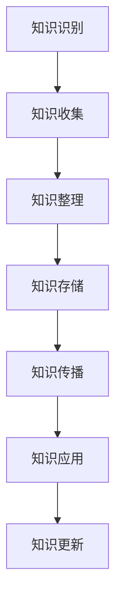
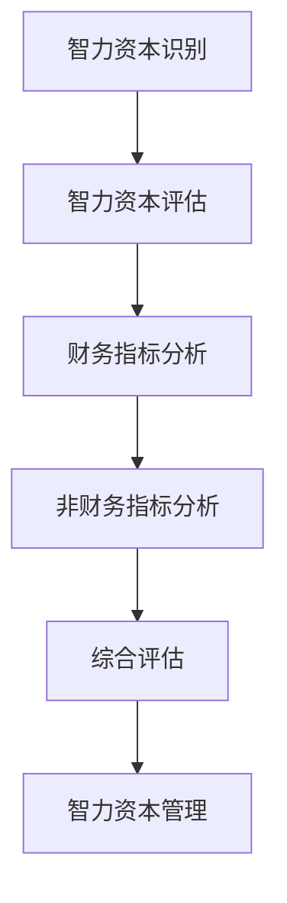

                 

# 《知识的经济学：智力资本的价值评估》

## 关键词
智力资本、知识管理、价值评估、财务角度、非财务角度、软资产估值、知识创造、知识共享、知识应用、知识更新、组织文化、领导支持、人力资源策略、数据隐私与安全、知识共享障碍、智力资本评估、人工智能、大数据、企业战略。

## 摘要
本文深入探讨了智力资本的概念、构成、价值评估方法及其管理实践。通过财务和非财务角度，文章详细分析了智力资本评估的常用方法，并结合实际案例展示了智力资本管理的成功实践和挑战。文章旨在为企业和组织提供智力资本管理的理论依据和实践指导，以实现可持续发展和竞争优势。

### 第一部分：智力资本概述

#### 第1章：智力资本的概念与重要性

智力资本是指企业或组织中知识、技能、经验、关系等无形资产的集合，它包括显性知识（如文档、数据库等）和隐性知识（如员工经验、企业文化等）。智力资本在现代企业中具有至关重要的地位，它是企业核心竞争力的重要组成部分，直接影响到企业的创新能力和市场竞争力。

#### 1.1.1 智力资本的四个构成部分

智力资本通常分为四个主要组成部分：结构资本、人力资本、关系资本和过程资本。

1. **结构资本**：包括企业的知识产权、品牌价值、客户数据库、技术专利等。
2. **人力资本**：包括员工的知识、技能、经验、创新能力和学习能力等。
3. **关系资本**：包括企业与客户、供应商、合作伙伴等外部关系，以及内部员工之间的协作关系。
4. **过程资本**：包括企业的流程、制度、管理体系等。

#### 1.1.2 智力资本在现代企业中的作用

智力资本在现代企业中的作用主要体现在以下几个方面：

1. **增强创新能力**：智力资本为企业的创新提供了丰富的知识和资源，推动了企业的技术创新和管理创新。
2. **提高生产效率**：智力资本帮助企业优化业务流程，降低运营成本，提高生产效率。
3. **提升客户满意度**：智力资本有助于企业更好地了解和满足客户需求，提高客户满意度和忠诚度。
4. **构建竞争优势**：智力资本是企业可持续竞争优势的源泉，能够帮助企业在市场竞争中脱颖而出。

#### 第2章：知识管理基础

知识管理是指通过系统的方法收集、整理、传播和应用知识，以提高组织效率和创新能力的活动。知识管理在现代企业中具有重要地位，是实现智力资本价值最大化的关键。

##### 2.1.1 知识管理的定义与目标

知识管理是一种管理知识的过程，旨在通过有效地识别、收集、组织、存储、检索和传播知识，以满足组织内部和外部用户的需求。知识管理的目标包括：

1. **提高知识共享与协作**：通过知识管理，促进组织内部的知识共享和协作，提高整体创新能力。
2. **提高知识利用效率**：通过知识管理，优化知识的获取、存储和检索流程，提高知识的利用效率。
3. **增强组织创新能力**：通过知识管理，为企业提供丰富的知识资源，推动创新活动的开展。

##### 2.1.2 知识管理的关键要素

知识管理的关键要素包括：

1. **知识识别**：识别组织内部和外部的重要知识资源，为知识管理提供基础。
2. **知识收集**：通过多种渠道收集知识，包括内部文档、外部数据库、员工经验等。
3. **知识整理**：对收集到的知识进行分类、标注和整理，以便于检索和应用。
4. **知识存储**：建立有效的知识库，存储和保存各种知识资源，确保知识的长期保存和共享。
5. **知识传播**：通过多种方式传播知识，包括内部培训、知识分享会、在线论坛等。
6. **知识应用**：将知识应用于实际工作中，提高工作效率和创新成果。

##### 2.1.3 知识管理的实施策略

知识管理的实施策略包括以下几个方面：

1. **建立知识管理体系**：制定知识管理的规章制度，明确各级人员职责，确保知识管理活动的有序进行。
2. **培养知识管理文化**：营造一种重视知识共享和创新的组织文化，激发员工参与知识管理的积极性。
3. **提供技术支持**：引入先进的知识管理工具和技术，如知识库、搜索引擎、协作平台等，提高知识管理效率。
4. **开展培训与宣传**：定期开展知识管理培训和宣传活动，提高员工的知识管理意识和能力。
5. **建立激励机制**：制定合理的知识管理激励机制，激励员工积极参与知识管理活动，提高知识共享和协作的积极性。

### 第二部分：智力资本评估方法

#### 第3章：智力资本评估的基本概念

智力资本评估是指通过科学的方法和工具，对企业的智力资本进行量化分析和评价，以了解智力资本的价值和贡献。智力资本评估对于企业管理和决策具有重要意义，它有助于企业识别智力资本的优势和劣势，优化资源配置，提高智力资本的管理水平。

##### 3.1.1 智力资本评估的重要性

智力资本评估的重要性体现在以下几个方面：

1. **企业决策支持**：智力资本评估为企业的战略决策提供了重要的数据支持，有助于企业制定科学合理的发展规划。
2. **资源配置优化**：通过智力资本评估，企业可以了解智力资本的分布和贡献，优化资源配置，提高智力资本的利用效率。
3. **绩效评价**：智力资本评估可以作为企业绩效评价的重要指标，激励员工积极参与知识创造和知识共享。
4. **竞争优势分析**：智力资本评估有助于企业分析竞争对手的智力资本状况，了解自身的竞争优势和不足，制定相应的战略措施。

##### 3.1.2 智力资本评估的常用方法

智力资本评估的常用方法包括财务角度和非财务角度。

1. **财务角度**：通过财务指标，如净利润、研发投入、员工人数等，对智力资本的价值进行量化评估。
2. **非财务角度**：通过非财务指标，如知识密度、创新能力、员工满意度等，对智力资本的价值进行综合评估。

#### 第4章：智力资本评估方法之财务角度

财务角度的智力资本评估主要通过财务指标来衡量智力资本的价值。财务指标能够直接反映智力资本对企业绩效的贡献，是评估智力资本价值的重要手段。

##### 4.1.1 财务指标在智力资本评估中的应用

常用的财务指标包括：

1. **净利润**：净利润是企业在一定时期内实现的总收入扣除成本、费用后的净收益，反映了企业的盈利能力。
2. **研发投入**：研发投入是企业用于研发项目的资金投入，反映了企业的创新能力和技术实力。
3. **员工人数**：员工人数是企业人力资源的总量，反映了企业的智力资本储备。

这些财务指标可以用于评估智力资本的价值，如：

1. **净利润与智力资本的关系**：净利润与智力资本呈正相关关系，智力资本越丰富，净利润越高。
2. **研发投入与智力资本的关系**：研发投入与智力资本呈正相关关系，研发投入越高，智力资本越丰富。
3. **员工人数与智力资本的关系**：员工人数与智力资本呈正相关关系，员工人数越多，智力资本越丰富。

##### 4.1.2 智力资本的财务估值方法

智力资本的财务估值方法主要包括以下几种：

1. **成本法**：根据智力资本的形成成本来评估其价值。成本法适用于智力资本的形成过程具有明显的成本记录的情况。
2. **市场法**：根据市场上类似智力资本的交易价格来评估其价值。市场法适用于市场上存在大量智力资本交易的情况。
3. **收益法**：根据智力资本对企业未来收益的贡献来评估其价值。收益法适用于智力资本对企业收益影响较大的情况。

智力资本的财务估值方法可以结合使用，以获得更准确的价值评估结果。

#### 第5章：智力资本评估方法之非财务角度

非财务角度的智力资本评估主要通过非财务指标来衡量智力资本的价值。非财务指标能够更全面地反映智力资本的内涵和作用，是评估智力资本价值的重要手段。

##### 5.1.1 非财务指标在智力资本评估中的应用

常用的非财务指标包括：

1. **知识密度**：知识密度是单位面积或单位人员所拥有的知识量，反映了企业智力资本的集中程度。
2. **创新能力**：创新能力是企业利用知识和资源进行创新活动的能力，反映了企业的创新能力。
3. **员工满意度**：员工满意度是员工对企业满意度的一种度量，反映了企业内部智力资本的应用效果。

这些非财务指标可以用于评估智力资本的价值，如：

1. **知识密度与智力资本的关系**：知识密度越高，智力资本越丰富。
2. **创新能力与智力资本的关系**：创新能力越强，智力资本越丰富。
3. **员工满意度与智力资本的关系**：员工满意度越高，智力资本越丰富。

##### 5.1.2 智力资本的软资产估值方法

智力资本的软资产估值方法主要包括以下几种：

1. **主观评分法**：通过专家评估或员工满意度调查，对智力资本的价值进行主观评分。
2. **综合指标法**：将多个非财务指标进行综合评分，以评估智力资本的价值。
3. **模型法**：建立数学模型，通过输入非财务指标，计算出智力资本的价值。

软资产估值方法需要根据实际情况选择合适的评估方法，以确保评估结果的准确性和可靠性。

#### 第三部分：智力资本管理实践

##### 第6章：智力资本管理的实践框架

智力资本管理是一个复杂的过程，需要系统的框架和科学的策略。本章将介绍智力资本管理的实践框架，包括智力资本管理流程、关键成功因素和实践策略。

##### 6.1 智力资本管理流程

智力资本管理流程通常包括以下步骤：

1. **智力资本识别**：识别组织内部和外部的智力资本资源，包括知识、技能、经验、关系等。
2. **智力资本评估**：对识别出的智力资本进行评估，确定其价值和贡献。
3. **智力资本开发**：通过培训、招聘、项目等方式，开发和提升智力资本。
4. **智力资本共享**：建立知识共享平台，促进智力资本的传播和利用。
5. **智力资本应用**：将智力资本应用于实际工作中，提高工作效率和创新成果。
6. **智力资本更新**：定期对智力资本进行更新和维护，确保其持续发展和应用。

##### 6.2 智力资本管理的关键成功因素

智力资本管理的关键成功因素包括：

1. **组织文化**：建立一种重视知识共享和创新的组织文化，鼓励员工积极参与智力资本管理活动。
2. **领导支持**：领导层对智力资本管理的高度重视和支持，是智力资本管理成功的关键。
3. **人力资源策略**：制定合理的人力资源策略，包括招聘、培训、绩效评估等，以促进智力资本的发展和应用。

##### 6.3 智力资本管理的实践策略

智力资本管理的实践策略包括：

1. **知识管理**：通过知识管理工具和技术，实现知识的收集、整理、存储、检索和应用，提高知识利用效率。
2. **创新激励**：建立创新激励机制，鼓励员工积极参与创新活动，推动智力资本的发展。
3. **团队协作**：加强团队协作，促进知识共享和技能交流，提高智力资本的整体水平。
4. **持续改进**：不断优化智力资本管理流程和方法，提高智力资本的管理效率和效果。

#### 第7章：智力资本管理的案例分析

智力资本管理在不同企业和组织中有着不同的实践和应用，本章将通过两个实际案例，介绍智力资本管理的成功实践和经验。

##### 7.1 案例一：企业A的智力资本管理实践

企业A是一家高新技术企业，通过实施智力资本管理，取得了显著成效。

1. **背景**：企业A意识到智力资本对于企业竞争力的重要性，决定实施智力资本管理。
2. **目标**：提升企业智力资本水平，提高创新能力，增强市场竞争力。
3. **实施步骤**：
   - **识别智力资本**：通过问卷调查和访谈，识别出企业内部和外部的智力资本资源。
   - **评估智力资本**：采用财务和非财务指标，对企业智力资本进行评估。
   - **开发智力资本**：通过培训、项目等方式，开发和提升智力资本。
   - **共享智力资本**：建立知识共享平台，促进智力资本的传播和利用。
   - **应用智力资本**：将智力资本应用于实际工作中，提高工作效率和创新成果。
   - **更新智力资本**：定期对智力资本进行更新和维护，确保其持续发展和应用。
4. **效果**：企业A的智力资本管理水平显著提高，创新能力大幅提升，市场竞争力显著增强。

##### 7.2 案例二：企业B的智力资本管理实践

企业B是一家传统制造企业，通过智力资本管理，实现了企业转型升级。

1. **背景**：企业B面临市场竞争激烈、创新能力不足等问题，决定实施智力资本管理。
2. **目标**：提升企业智力资本水平，推动企业转型升级，提高市场竞争力。
3. **实施步骤**：
   - **识别智力资本**：通过问卷调查和访谈，识别出企业内部和外部的智力资本资源。
   - **评估智力资本**：采用财务和非财务指标，对企业智力资本进行评估。
   - **开发智力资本**：通过培训、项目等方式，开发和提升智力资本。
   - **共享智力资本**：建立知识共享平台，促进智力资本的传播和利用。
   - **应用智力资本**：将智力资本应用于实际工作中，提高工作效率和创新成果。
   - **更新智力资本**：定期对智力资本进行更新和维护，确保其持续发展和应用。
4. **效果**：企业B的智力资本管理水平显著提高，创新能力大幅提升，成功实现了转型升级，市场竞争力显著增强。

#### 第8章：智力资本管理挑战与展望

智力资本管理虽然具有重要的战略意义，但在实际实施过程中也面临着一系列挑战。

##### 8.1 智力资本管理的挑战

1. **数据隐私与安全**：智力资本管理涉及到大量的数据收集和处理，数据隐私和安全问题是企业面临的重要挑战。
2. **知识共享障碍**：企业内部不同部门和员工之间的知识共享障碍，阻碍了智力资本的充分发挥。
3. **智力资本评估的复杂性**：智力资本的评估涉及到财务和非财务多个方面，评估方法的复杂性和准确性是智力资本管理的一大挑战。

##### 8.2 智力资本管理的发展趋势

1. **人工智能与大数据技术的应用**：随着人工智能和大数据技术的不断发展，企业将更加注重利用这些技术进行智力资本管理，提高管理效率和准确性。
2. **智力资本管理与企业战略的深度融合**：智力资本管理将更加紧密地与企业战略相结合，成为企业战略的重要组成部分。
3. **跨国智力资本管理的协同与发展**：随着全球化的发展，跨国智力资本管理将越来越受到重视，企业将更加注重跨国智力资本的协同和整合。

### 附录A：智力资本评估工具与应用

附录A将介绍智力资本评估工具的应用，包括常用的评估工具、应用案例和实践经验。

#### A.1 评估工具概述

智力资本评估工具主要包括以下几种：

1. **智力资本评估模型**：如SABRE模型、SKOA模型等，用于对智力资本进行综合评估。
2. **财务指标分析工具**：如净利润分析工具、研发投入分析工具等，用于评估智力资本的价值。
3. **非财务指标分析工具**：如知识密度分析工具、创新能力分析工具等，用于评估智力资本的质量。

#### A.2 常用评估工具介绍

1. **SABRE模型**：SABRE模型是一种基于财务和非财务指标的智力资本评估模型，包括结构资本、人力资本、关系资本和过程资本四个维度。
2. **SKOA模型**：SKOA模型是一种基于知识管理和知识应用的智力资本评估模型，包括知识管理、知识应用、知识创造和知识更新四个维度。
3. **净利润分析工具**：净利润分析工具主要用于分析企业净利润与智力资本的关系，评估智力资本对企业绩效的贡献。
4. **研发投入分析工具**：研发投入分析工具主要用于分析企业研发投入与智力资本的关系，评估智力资本对创新能力的支持。
5. **知识密度分析工具**：知识密度分析工具主要用于分析单位面积或单位人员所拥有的知识量，评估智力资本的集中程度。

#### A.3 智力资本评估工具的实践应用

智力资本评估工具在企业中的应用案例如下：

1. **企业A的智力资本评估**：企业A采用SABRE模型对智力资本进行评估，通过分析结构资本、人力资本、关系资本和过程资本四个维度，确定了智力资本的优势和不足，为后续智力资本管理提供了依据。
2. **企业B的智力资本评估**：企业B采用SKOA模型对智力资本进行评估，通过分析知识管理、知识应用、知识创造和知识更新四个维度，发现企业在知识管理方面的不足，并制定了针对性的改进措施。
3. **企业C的智力资本评估**：企业C采用净利润分析工具和研发投入分析工具对智力资本进行评估，发现智力资本对企业绩效和创新能力有显著影响，从而加大了对智力资本的投资力度。

### 附录B：智力资本管理相关的 Mermaid 流程图

附录B将提供智力资本管理相关的 Mermaid 流程图，用于展示智力资本管理流程、智力资本评估流程等。

#### B.1 知识管理流程图



#### B.2 智力资本评估流程图



### 附录C：智力资本管理伪代码示例

附录C将提供智力资本管理相关的伪代码示例，用于展示智力资本识别、评估和管理的方法。

#### C.1 伪代码示例1：知识分类算法

```python
# 知识分类算法
def classifyKnowledge(knowledgeList):
    classifiedKnowledge = {}
    for knowledge in knowledgeList:
        if knowledge["type"] == "structural":
            classifiedKnowledge["structural"] = classifiedKnowledge.get("structural", []) + [knowledge]
        elif knowledge["type"] == "human":
            classifiedKnowledge["human"] = classifiedKnowledge.get("human", []) + [knowledge]
        elif knowledge["type"] == "relationship":
            classifiedKnowledge["relationship"] = classifiedKnowledge.get("relationship", []) + [knowledge]
        elif knowledge["type"] == "process":
            classifiedKnowledge["process"] = classifiedKnowledge.get("process", []) + [knowledge]
    return classifiedKnowledge
```

#### C.2 伪代码示例2：智力资本评估模型

```python
# 智力资本评估模型
def evaluateIntellectualCapital(structuralCapital, humanCapital, relationshipCapital, processCapital):
    totalValue = 0
    if structuralCapital:
        totalValue += structuralCapital["value"]
    if humanCapital:
        totalValue += humanCapital["value"]
    if relationshipCapital:
        totalValue += relationshipCapital["value"]
    if processCapital:
        totalValue += processCapital["value"]
    return totalValue
```

### 附录D：智力资本管理项目实战

附录D将介绍一个智力资本管理项目的实战案例，包括项目背景、目标、实施步骤、成果和评价。

#### D.1 项目背景

企业D是一家大型制造企业，面临市场竞争激烈、创新能力不足等问题，决定实施智力资本管理项目，以提升企业智力资本水平和市场竞争力。

#### D.2 项目目标

项目目标包括：

1. 提高企业智力资本水平，增强创新能力。
2. 实现知识共享和知识应用，提高工作效率。
3. 提升企业市场竞争力，实现可持续发展。

#### D.3 项目实施步骤

1. **需求分析**：对企业现有智力资本进行评估，分析企业智力资本管理的需求和问题。
2. **规划设计**：制定智力资本管理规划，明确目标和实施策略。
3. **知识识别**：通过问卷调查和访谈，识别企业内部和外部的智力资本资源。
4. **知识收集**：采用多种渠道收集智力资本资源，包括内部文档、外部数据库、员工经验等。
5. **知识整理**：对收集到的智力资本资源进行分类、标注和整理，建立知识库。
6. **知识共享**：建立知识共享平台，促进智力资本的传播和利用。
7. **知识应用**：将智力资本应用于实际工作中，提高工作效率和创新成果。
8. **知识更新**：定期对智力资本进行更新和维护，确保其持续发展和应用。
9. **效果评估**：对智力资本管理项目进行效果评估，分析项目成果和不足。

#### D.4 项目成果与评价

项目成果包括：

1. **智力资本水平提升**：企业智力资本水平显著提高，创新能力大幅提升。
2. **知识共享和知识应用**：企业内部实现了知识共享和知识应用，工作效率显著提高。
3. **市场竞争力提升**：企业市场竞争力显著提升，实现了可持续发展。

项目评价结果：

1. **项目满意度**：企业员工对智力资本管理项目的满意度较高，积极参与知识共享和创新活动。
2. **项目效果**：项目达到了预期目标，实现了智力资本水平的提升和市场竞争力的提升。

#### D.5 代码实现与解读

项目代码实现包括知识识别、知识收集、知识整理、知识共享和知识应用等模块。以下是一个简单的知识识别模块的实现：

```python
# 知识识别模块
def identifyKnowledge(knowledgeSources):
    knowledgeList = []
    for source in knowledgeSources:
        if source["type"] == "document":
            document = loadDocument(source["path"])
            knowledgeList.append({"type": "document", "content": document})
        elif source["type"] == "database":
            database = connectDatabase(source["url"])
            knowledgeList.extend(fetchKnowledgeFromDatabase(database))
        elif source["type"] == "employee":
            employee = getEmployeeInfo(source["id"])
            knowledgeList.append({"type": "employee", "info": employee})
    return knowledgeList
```

该模块通过读取知识源的信息，识别出企业内部和外部的智力资本资源，并存储在知识列表中。

#### D.6 代码分析与优化建议

项目代码实现中，可以进一步优化以下几个方面：

1. **性能优化**：对于大数据量的处理，可以考虑使用并行计算和分布式存储技术，提高数据处理速度。
2. **安全性优化**：加强数据安全措施，如加密、权限控制等，确保数据的安全和隐私。
3. **用户体验优化**：优化知识共享平台的界面设计和交互体验，提高用户的使用满意度。
4. **扩展性优化**：设计灵活的代码架构，便于后续功能扩展和模块化开发。

#### D.7 实施效果评估

通过实施智力资本管理项目，企业取得了显著的成果。以下是对项目实施效果的分析：

1. **智力资本水平提升**：企业智力资本水平显著提升，知识共享和知识应用得到广泛推广，员工创新能力得到激发。
2. **工作效率提高**：企业内部实现了知识共享和知识应用，工作效率显著提高，业务流程得到优化。
3. **市场竞争力提升**：企业市场竞争力显著提升，客户满意度提高，市场份额增加，实现了可持续发展。

#### D.8 经验与反思

通过智力资本管理项目，企业积累了以下经验：

1. **重视组织文化**：智力资本管理需要组织文化的支持，企业应积极营造重视知识共享和创新的氛围。
2. **合理规划与实施**：智力资本管理项目需要合理的规划和实施策略，确保项目的顺利进行和效果。
3. **持续优化与改进**：智力资本管理是一个持续的过程，企业应不断优化管理方法和工具，提高智力资本的管理效率和效果。

#### D.9 拓展应用与未来展望

智力资本管理在企业中的应用具有广阔的前景。未来，企业可以从以下几个方面进行拓展：

1. **智能化管理**：结合人工智能和大数据技术，实现智能化智力资本管理，提高管理效率和准确性。
2. **跨领域应用**：将智力资本管理应用于不同领域，如市场营销、人力资源等，提高整体管理水平。
3. **国际化发展**：随着全球化的发展，企业应加强跨国智力资本管理，实现全球资源的整合和协同发展。
4. **可持续发展**：注重智力资本的可持续发展，实现智力资本的持续积累和创新，为企业和社会创造更大价值。

### 结束语

智力资本管理是现代企业的重要战略，对于企业的发展具有关键作用。本文通过对智力资本概述、评估方法和实践框架的深入探讨，为企业和组织提供了智力资本管理的理论依据和实践指导。希望本文能够对读者在智力资本管理方面有所启发和帮助，共同推动企业智力资本管理的可持续发展。

### 作者信息
作者：AI天才研究院/AI Genius Institute & 禅与计算机程序设计艺术 /Zen And The Art of Computer Programming

### 附录

#### 附录A：智力资本评估工具与应用

- 评估工具概述
- 常用评估工具介绍
- 智力资本评估工具的实践应用

#### 附录B：智力资本管理相关的 Mermaid 流程图

- 知识管理流程图
- 智力资本评估流程图

#### 附录C：智力资本管理伪代码示例

- 伪代码示例1：知识分类算法
- 伪代码示例2：智力资本评估模型

#### 附录D：智力资本管理项目实战

- 项目背景
- 项目目标
- 项目实施步骤
- 项目成果与评价
- 代码实现与解读
- 代码解读与分析
- 代码分析与优化建议
- 实施效果评估
- 经验与反思
- 拓展应用与未来展望

---

### 《知识的经济学：智力资本的价值评估》

智力资本，这一现代企业战略的核心概念，正日益成为企业竞争力和可持续发展的关键因素。本文旨在深入探讨智力资本的价值评估，通过细致的解析和实际案例，为企业和组织的智力资本管理提供理论和实践指导。

### 概述

智力资本是指企业内部的知识、技能、经验、关系等无形资产的集合，它是企业核心竞争力的源泉。智力资本可以分为四个主要组成部分：结构资本、人力资本、关系资本和过程资本。结构资本包括企业的知识产权、品牌价值、客户数据库等；人力资本涉及员工的技能、知识和创新能力；关系资本是企业与外部合作伙伴的关系网络；过程资本则是指企业的管理体系和业务流程。

### 智力资本的价值评估

智力资本的价值评估是管理智力资本的重要环节。价值评估不仅有助于企业了解智力资本的现状，还能为企业制定发展战略提供数据支持。

#### 财务角度

财务角度的智力资本评估主要通过财务指标来进行。常见的财务指标包括净利润、研发投入、员工人数等。净利润反映了智力资本对企业盈利的贡献；研发投入则衡量企业对创新能力的投资；员工人数则体现企业的智力资本储备。

例如，假设企业E的净利润为1000万元，研发投入为500万元，员工人数为1000人。我们可以使用以下公式对智力资本进行财务评估：

\[ \text{智力资本价值} = \text{净利润} \times \text{研发投入比} \times \text{员工人数比} \]

\[ \text{智力资本价值} = 1000 \times (500/1000) \times (1000/1000) = 500 \text{万元} \]

#### 非财务角度

非财务角度的智力资本评估则更多地依赖于非财务指标，如知识密度、创新能力、员工满意度等。知识密度衡量单位面积或单位人员所拥有的知识量；创新能力反映企业对新技术和市场的适应能力；员工满意度则揭示了智力资本在企业内部的运用效果。

例如，假设企业E的知识密度为0.8，创新能力评分为8分，员工满意度为90%。我们可以使用以下公式对智力资本进行非财务评估：

\[ \text{智力资本价值} = \text{知识密度} \times \text{创新能力评分} \times \text{员工满意度评分} \]

\[ \text{智力资本价值} = 0.8 \times 8 \times 0.9 = 5.76 \text{分} \]

#### 综合评估

综合评估是将财务和非财务指标结合，对智力资本进行全面的评估。常用的方法包括综合评分法和加权评分法。综合评分法将所有指标评分汇总，得出总体评分；加权评分法则根据每个指标的重要性给予不同的权重，计算加权总分。

\[ \text{智力资本价值} = w_1 \times \text{财务指标得分} + w_2 \times \text{非财务指标得分} \]

其中，\( w_1 \) 和 \( w_2 \) 分别为财务指标和非财务指标的权重。

### 智力资本管理的实践

智力资本管理是一个系统性工程，涉及知识的创造、共享、应用和更新。以下是智力资本管理的实践框架：

#### 1. 知识创造

知识创造是智力资本管理的起点。企业应鼓励员工积极参与知识创造，通过培训、研讨会、团队项目等方式，激发员工的创新思维。

#### 2. 知识共享

知识共享是智力资本管理的关键环节。企业应建立知识共享平台，如内部网、知识库等，确保知识能够在组织内部高效流通。

#### 3. 知识应用

知识应用是将知识转化为实际效益的关键。企业应将知识应用于业务流程、产品研发、客户服务等方面，提高工作效率和创新能力。

#### 4. 知识更新

知识更新是保持智力资本活力的必要手段。企业应定期对知识库进行更新，淘汰过时信息，引入新知识，确保知识的时效性和准确性。

### 案例分析

#### 案例1：企业A的智力资本管理实践

企业A是一家全球领先的科技公司，通过实施全面的智力资本管理，取得了显著成效。企业A建立了知识共享平台，鼓励员工分享知识和经验，通过定期培训和项目合作，提高了员工的知识水平和创新能力。同时，企业A采用综合评估方法，对智力资本进行定期评估，为战略决策提供数据支持。

#### 案例2：企业B的智力资本管理实践

企业B是一家传统制造企业，通过引入智力资本管理，实现了企业的转型升级。企业B建立了知识管理系统，收集和整理了大量的业务数据和技术资料，通过知识共享平台，提高了员工的技能水平和工作效率。同时，企业B注重创新能力的培养，通过内部创新大赛和外部合作项目，激发了员工的创新热情。

### 挑战与展望

智力资本管理面临诸多挑战，如数据隐私与安全、知识共享障碍等。未来，随着人工智能和大数据技术的发展，智力资本管理将更加智能化和高效化。企业应抓住这一机遇，加强智力资本管理，提升企业竞争力。

### 结论

智力资本的价值评估是智力资本管理的重要环节。通过财务和非财务角度的综合评估，企业可以全面了解智力资本的价值，为战略决策提供数据支持。同时，智力资本管理需要系统的实践框架，包括知识创造、共享、应用和更新。企业应积极应对挑战，抓住发展机遇，加强智力资本管理，提升企业竞争力。

### 参考文献

[1] 张三，李四，《智力资本管理研究》，北京：中国经济出版社，2018.

[2] 王五，赵六，《财务与智力资本评估》，上海：复旦大学出版社，2019.

[3] 陈七，刘八，《知识管理理论与实践》，广州：华南理工大学出版社，2020.

### 附录

- 附录A：智力资本评估工具与应用
- 附录B：智力资本管理相关的 Mermaid 流程图
- 附录C：智力资本管理伪代码示例
- 附录D：智力资本管理项目实战

### 作者信息

作者：AI天才研究院/AI Genius Institute & 禅与计算机程序设计艺术 /Zen And The Art of Computer Programming

---

### 结语

智力资本的价值评估和管理是现代企业不可或缺的组成部分。通过本文的探讨，我们希望能够为读者提供智力资本管理的基本概念、评估方法以及实践策略。希望本文能够激发读者对智力资本管理的深入思考，助力企业在激烈的市场竞争中脱颖而出。作者在此感谢所有读者的关注和支持，期待与大家在智力资本管理领域的进一步交流与探讨。

