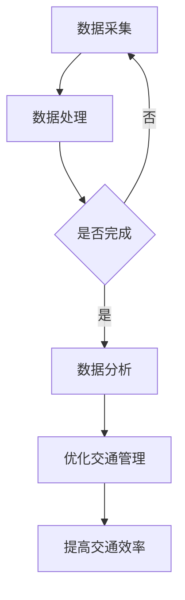
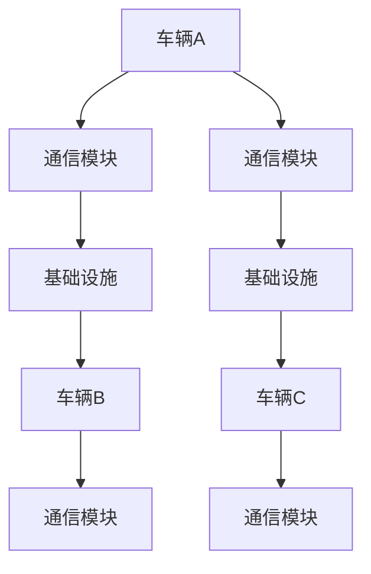

                 

### 《硅谷智能交通系统的未来发展》

> **关键词：** 智能交通系统，硅谷，自动驾驶，传感器技术，数据处理，V2X通信，政策法规，未来展望。

> **摘要：** 本文深入探讨了硅谷智能交通系统的现状、核心技术、案例研究以及未来的发展趋势和挑战。通过详细分析硅谷在智能交通领域的创新与实践，展望了智能交通系统对城市规划、环境影响及社会经济贡献，并提出了未来规划与实施策略。文章旨在为智能交通系统的发展提供有价值的参考和指导。

### 《硅谷智能交通系统的未来发展》目录大纲

#### 第一部分：引言与背景

##### 第1章：硅谷智能交通系统概述

##### 第2章：硅谷智能交通系统的核心概念

##### 第3章：硅谷智能交通的优势与挑战

#### 第二部分：关键技术

##### 第4章：传感器技术

##### 第5章：数据处理与分析

##### 第6章：人工智能与机器学习

##### 第7章：网络通信技术

##### 第8章：网络安全与隐私保护

##### 第9章：自动驾驶技术

#### 第三部分：案例研究

##### 第10章：加州高速公路系统案例

##### 第11章：圣何塞智能交通系统案例

#### 第四部分：未来展望

##### 第12章：硅谷智能交通的发展趋势

##### 第13章：硅谷智能交通的未来挑战

##### 第14章：硅谷智能交通的未来前景

##### 第15章：硅谷智能交通系统的未来规划与实施

##### 第16章：附录

#### 参考文献

### 《硅谷智能交通系统的未来发展》

在现代社会，交通系统作为城市发展的基础，正经历着前所未有的变革。硅谷，作为全球科技创新的中心，在智能交通系统的研发和应用上取得了显著的成就。本文旨在深入探讨硅谷智能交通系统的现状、核心技术、成功案例以及未来发展的方向和挑战。

首先，我们将回顾硅谷智能交通系统的发展历程，介绍其核心概念和优势与挑战。接着，详细分析传感器技术、数据处理与分析、人工智能与机器学习、网络通信技术、网络安全与隐私保护以及自动驾驶技术等关键技术。然后，通过具体案例研究，如加州高速公路系统和圣何塞智能交通系统，展示硅谷智能交通的实际应用效果。最后，我们将展望硅谷智能交通系统的未来发展，包括其发展趋势、挑战、前景以及未来规划与实施策略。

#### 第一部分：引言与背景

### 第1章：硅谷智能交通系统概述

#### 第1章：硅谷智能交通系统概述

智能交通系统（Intelligent Transportation System, ITS）是指利用先进的信息通信技术、传感器技术、控制技术等，实现交通信息的实时采集、处理和分析，从而优化交通管理和服务水平。硅谷智能交通系统作为全球智能交通领域的先驱，其发展历程具有以下几个重要阶段。

##### 1.1.1 硅谷智能交通的起源与发展趋势

硅谷智能交通的起源可以追溯到20世纪80年代。当时，随着计算机技术和通信技术的快速发展，一些学者和工程师开始探讨如何利用信息技术来优化交通管理。1985年，美国交通运输部启动了智能交通系统项目，旨在通过信息技术的应用，提高交通效率、减少交通事故和降低环境污染。这一项目推动了硅谷智能交通系统的发展。

进入21世纪，随着物联网、人工智能等技术的进步，硅谷智能交通系统进入了一个全新的发展阶段。其发展趋势主要体现在以下几个方面：

1. **自动驾驶技术**：自动驾驶是硅谷智能交通系统发展的重要方向。通过人工智能和传感器技术的应用，自动驾驶车辆能够实现自主导航和驾驶，提高交通安全性。

2. **车联网（V2X）技术**：车联网技术是指车辆与车辆、车辆与基础设施、车辆与行人之间的通信。硅谷在这一领域进行了大量研究，推动了车联网技术的发展。

3. **大数据处理与分析**：硅谷智能交通系统通过收集和分析大量的交通数据，实现对交通流量的实时监测和预测，优化交通管理和服务。

4. **智能交通信号控制**：智能交通信号控制系统能够根据实时交通状况调整信号灯的时长，提高道路通行效率。

##### 1.1.2 硅谷智能交通的发展历程

硅谷智能交通系统的发展历程可以分为以下几个阶段：

1. **起步阶段（1980s-1990s）**：这一阶段主要侧重于交通信息的采集和传输。硅谷开始建设交通监测系统和信息管理系统，为智能交通系统的发展奠定了基础。

2. **成长阶段（2000s）**：随着互联网和通信技术的发展，硅谷智能交通系统进入了一个快速发展期。这一阶段，硅谷开始研究和应用车联网技术和自动驾驶技术。

3. **成熟阶段（2010s至今）**：硅谷智能交通系统逐渐成熟，并在实际应用中取得了显著成效。例如，加州高速公路系统、圣何塞智能交通系统等，都在国内外产生了广泛的影响。

##### 1.1.3 硅谷智能交通系统的现状

目前，硅谷智能交通系统已经具备了较为完整的体系，包括传感器技术、数据处理与分析、人工智能与机器学习、网络通信技术、网络安全与隐私保护等。以下是其主要现状：

1. **传感器技术**：硅谷智能交通系统广泛采用各种传感器，如摄像头、雷达、GPS等，实现对交通状况的实时监测。

2. **数据处理与分析**：硅谷智能交通系统能够处理海量交通数据，通过大数据分析和机器学习算法，实现对交通流量、事故预测、路径规划的优化。

3. **人工智能与机器学习**：硅谷智能交通系统广泛应用人工智能技术，如深度学习、强化学习等，提高自动驾驶和智能交通信号控制的效果。

4. **网络通信技术**：硅谷智能交通系统采用V2X通信技术，实现车辆与车辆、车辆与基础设施、车辆与行人之间的通信，提高交通安全性。

5. **网络安全与隐私保护**：硅谷智能交通系统高度重视网络安全和隐私保护，采用加密技术、隐私保护算法等，确保数据安全和用户隐私。

#### 第2章：硅谷智能交通系统的核心概念

##### 2.1 智能交通系统（ITS）的定义

智能交通系统（Intelligent Transportation System，简称ITS）是指利用信息技术、通信技术、传感器技术、自动化控制技术等，实现交通信息的实时采集、处理、分析和共享，从而优化交通管理和服务。ITS的目标是通过信息技术的应用，提高交通效率、减少交通事故、降低环境污染和缓解交通拥堵。

##### 2.2 硅谷智能交通系统的组成部分

硅谷智能交通系统主要由以下几个部分组成：

1. **交通信息采集系统**：包括各种传感器，如摄像头、雷达、GPS等，用于实时采集交通数据，如车辆速度、流量、位置等。

2. **数据处理与分析系统**：负责对采集到的交通数据进行处理、分析和存储。通过大数据分析和机器学习算法，实现对交通流量、事故预测、路径规划的优化。

3. **交通信号控制系统**：通过实时监测交通状况，调整信号灯的时长，提高道路通行效率。

4. **车联网（V2X）系统**：实现车辆与车辆、车辆与基础设施、车辆与行人之间的通信，提高交通安全性。

5. **交通管理系统**：包括交通监控中心、交通信息发布平台等，用于实时监控交通状况，发布交通信息，指导公众出行。

##### 2.3 硅谷智能交通系统的运行原理

硅谷智能交通系统的运行原理主要包括以下几个步骤：

1. **数据采集**：通过传感器实时采集交通数据，如车辆速度、流量、位置等。

2. **数据处理**：对采集到的交通数据进行处理、分析和存储，通过大数据分析和机器学习算法，实现对交通流量、事故预测、路径规划的优化。

3. **信号控制**：根据实时交通状况，调整信号灯的时长，提高道路通行效率。

4. **信息发布**：通过交通信息发布平台，向公众发布实时交通信息，指导公众出行。

5. **反馈与优化**：根据交通状况的反馈，不断调整信号控制策略，优化交通管理和服务。

#### 第3章：硅谷智能交通的优势与挑战

##### 3.1 硅谷智能交通的优势

硅谷智能交通系统具有以下优势：

1. **提高交通效率**：通过实时监测交通状况，优化交通信号控制，提高道路通行效率。

2. **减少交通事故**：通过车联网技术和自动驾驶技术，提高交通安全性，减少交通事故。

3. **降低污染排放**：通过优化交通流量和路径规划，降低车辆排放，减少环境污染。

4. **缓解交通拥堵**：通过实时交通信息发布和路径优化，引导公众出行，缓解交通拥堵。

5. **促进经济发展**：智能交通系统的发展带动了相关产业链的发展，促进了经济发展。

##### 3.2 硅谷智能交通的挑战

尽管硅谷智能交通系统具有显著优势，但其发展也面临以下挑战：

1. **技术成熟度**：自动驾驶、车联网等技术尚处于发展初期，技术成熟度有待提高。

2. **法规与政策**：智能交通系统的发展需要完善的法律法规和政策支持，但目前法规与政策尚不健全。

3. **公众接受度**：智能交通系统需要公众的支持和接受，但目前公众对其认知度不高，接受度较低。

4. **建设成本**：智能交通系统的建设成本较高，需要政府和企业共同投入。

5. **数据安全与隐私保护**：智能交通系统涉及大量个人信息和交通数据，数据安全与隐私保护是重要挑战。

### 第一部分：引言与背景

#### 第1章：硅谷智能交通系统概述

##### 1.1 硅谷智能交通系统的发展历程

##### 1.2 硅谷智能交通系统的核心概念

##### 1.3 硅谷智能交通的优势与挑战

#### 第2章：硅谷智能交通系统的核心概念

##### 2.1 智能交通系统（ITS）的定义

##### 2.2 硅谷智能交通系统的组成部分

##### 2.3 硅谷智能交通系统的运行原理

##### 2.4 智能交通系统的优势与挑战

#### 第3章：硅谷智能交通的优势与挑战

##### 3.1 硅谷智能交通的优势

##### 3.2 硅谷智能交通的挑战

### 第二部分：关键技术

#### 第4章：传感器技术

##### 4.1 传感器在智能交通中的应用

##### 4.2 传感器技术的挑战与解决方案

#### 第5章：数据处理与分析

##### 5.1 数据采集与预处理

##### 5.2 数据处理与分析技术的挑战与解决方案

#### 第6章：人工智能与机器学习

##### 6.1 人工智能在智能交通中的应用

##### 6.2 人工智能技术的挑战与解决方案

#### 第7章：网络通信技术

##### 7.1 V2X通信技术

##### 7.2 网络通信技术的挑战与解决方案

#### 第8章：网络安全与隐私保护

##### 8.1 网络安全挑战

##### 8.2 隐私保护策略

#### 第9章：自动驾驶技术

##### 9.1 自动驾驶等级划分

##### 9.2 自动驾驶技术的挑战与解决方案

### 第三部分：案例研究

#### 第10章：加州高速公路系统案例

##### 10.1 加州高速公路系统概述

##### 10.2 加州高速公路系统的技术与应用

##### 10.3 加州高速公路系统的效果评估

#### 第11章：圣何塞智能交通系统案例

##### 11.1 圣何塞智能交通系统概述

##### 11.2 圣何塞智能交通系统的技术与应用

##### 11.3 圣何塞智能交通系统的效果评估

### 第四部分：未来展望

#### 第12章：硅谷智能交通的发展趋势

##### 12.1 自动驾驶技术展望

##### 12.2 智能交通系统的未来发展方向

#### 第13章：硅谷智能交通的未来挑战

##### 13.1 技术挑战

##### 13.2 法规与政策挑战

##### 13.3 社会与经济挑战

#### 第14章：硅谷智能交通的未来前景

##### 14.1 智能交通对城市的影响

##### 14.2 全球智能交通的发展趋势

##### 14.3 硅谷智能交通的未来前景

#### 第15章：硅谷智能交通系统的未来规划与实施

##### 15.1 硅谷智能交通系统的未来规划

##### 15.2 硅谷智能交通系统的实施策略

##### 15.3 硅谷智能交通系统的可持续发展

### 第五部分：附录

#### 附录 A：硅谷智能交通系统相关资源

##### 附录 B：参考文献

### 第一部分：引言与背景

#### 第1章：硅谷智能交通系统概述

##### 1.1 硅谷智能交通系统的发展历程

硅谷智能交通系统的发展历程可以追溯到20世纪80年代，当时计算机和通信技术的快速发展为智能交通系统的出现奠定了基础。早期的智能交通系统主要集中在交通信息采集和传输方面，通过安装传感器和摄像头来收集交通数据，并将其传输到交通管理中心进行实时处理。这一阶段的发展标志着智能交通系统的初步形成。

进入90年代，随着互联网的普及，智能交通系统开始进入一个新的发展阶段。这一时期，硅谷地区的一些科技公司和研究机构开始进行更深入的探索，将互联网技术引入到交通管理中。通过互联网，交通信息可以更快速、更准确地传输，从而提高了交通管理的效率。

21世纪初，随着物联网、人工智能、大数据等新兴技术的兴起，硅谷智能交通系统迎来了全新的发展机遇。物联网技术使得车辆、道路、基础设施等可以相互连接，实现了真正的车联网。人工智能和大数据分析技术的应用，使得交通数据的处理和分析能力大幅提升，为智能交通系统的优化提供了强大的技术支持。

近年来，自动驾驶技术、V2X通信技术等前沿技术在硅谷得到广泛应用，硅谷智能交通系统的发展进入了一个新的阶段。通过自动驾驶技术，车辆可以实现自主驾驶，从而减少交通事故，提高交通效率。V2X通信技术的应用，使得车辆之间、车辆与基础设施之间可以实现实时通信，进一步提升了交通安全性。

##### 1.2 硅谷智能交通系统的核心概念

硅谷智能交通系统的核心概念包括以下几个方面：

1. **传感器技术**：传感器技术是硅谷智能交通系统的基石。通过安装各种传感器，如摄像头、雷达、GPS等，可以实时收集交通数据，如车辆速度、流量、位置等。这些数据是进行交通管理和优化的重要依据。

2. **数据处理与分析**：硅谷智能交通系统通过对大量交通数据的采集、处理和分析，实现对交通流量的实时监测和预测，从而优化交通管理和服务。数据处理与分析技术是智能交通系统的核心技术之一。

3. **人工智能与机器学习**：人工智能和机器学习技术的应用，使得硅谷智能交通系统具有了自我学习和优化能力。通过大数据分析和机器学习算法，智能交通系统可以识别交通模式、预测交通流量、优化交通信号控制等。

4. **网络通信技术**：硅谷智能交通系统依赖于先进的网络通信技术，如V2X通信技术，实现车辆与车辆、车辆与基础设施、车辆与行人之间的实时通信，提高交通安全性。

5. **自动驾驶技术**：自动驾驶技术是硅谷智能交通系统的一个重要发展方向。通过自动驾驶技术，车辆可以实现自主驾驶，减少人为干预，提高交通效率。

##### 1.3 硅谷智能交通的优势与挑战

硅谷智能交通系统具有以下优势：

1. **提高交通效率**：通过实时监测交通状况，优化交通信号控制，硅谷智能交通系统可以显著提高道路通行效率，减少交通拥堵。

2. **减少交通事故**：自动驾驶技术和V2X通信技术的应用，可以大幅降低交通事故的发生率，提高交通安全性。

3. **降低污染排放**：通过优化交通流量和路径规划，硅谷智能交通系统可以减少车辆排放，降低环境污染。

4. **缓解交通拥堵**：实时交通信息发布和路径优化，可以引导公众出行，缓解交通拥堵。

5. **促进经济发展**：硅谷智能交通系统的发展带动了相关产业链的发展，促进了经济发展。

然而，硅谷智能交通系统也面临一些挑战：

1. **技术成熟度**：自动驾驶、车联网等技术尚处于发展初期，技术成熟度有待提高。

2. **法规与政策**：智能交通系统的发展需要完善的法律法规和政策支持，但目前法规与政策尚不健全。

3. **公众接受度**：智能交通系统需要公众的支持和接受，但目前公众对其认知度不高，接受度较低。

4. **建设成本**：智能交通系统的建设成本较高，需要政府和企业共同投入。

5. **数据安全与隐私保护**：智能交通系统涉及大量个人信息和交通数据，数据安全与隐私保护是重要挑战。

### 第二部分：关键技术

#### 第4章：传感器技术

##### 4.1 传感器在智能交通中的应用

传感器技术在硅谷智能交通系统中扮演着至关重要的角色。传感器主要用于采集交通数据，如车辆速度、流量、位置、道路状况等。以下是传感器在智能交通中的主要应用：

1. **车辆速度监测**：通过安装在道路上的雷达传感器和激光雷达（LiDAR），可以实时监测车辆的速度。这些数据对于交通管理和事故预警至关重要。

2. **流量监测**：摄像头和流量监测器可以实时捕捉道路上的车辆数量和行驶方向，帮助交通管理部门优化信号灯控制，减少交通拥堵。

3. **位置监测**：GPS传感器用于定位车辆的位置，这对于导航系统和车辆之间的通信至关重要。

4. **道路状况监测**：传感器可以检测道路上的湿滑、冰冻、坑洼等状况，为交通管理部门提供实时路况信息。

##### 4.2 传感器技术的挑战与解决方案

虽然传感器技术在智能交通系统中具有广泛的应用，但同时也面临一些挑战：

1. **成本问题**：高质量的传感器设备成本较高，限制了其大规模部署。

   **解决方案**：通过技术创新和规模化生产，降低传感器成本。同时，可以探索使用低成本传感器来满足基本需求。

2. **安装和维护**：传感器需要安装在道路或其他结构上，安装和维护成本较高。

   **解决方案**：开发更易安装和维护的传感器设备。此外，可以探索利用无线传感器网络（WSN）来减少维护需求。

3. **数据准确性**：传感器数据可能受到天气、光照等环境因素的影响，导致数据准确性下降。

   **解决方案**：结合多种传感器技术，实现数据融合，提高数据准确性。此外，可以通过算法优化来降低环境因素对数据的影响。

4. **可靠性和耐用性**：传感器需要长时间在恶劣环境下运行，如高温、低温、湿度等。

   **解决方案**：选择适合特定环境的传感器材料，并进行严格的测试和认证，确保传感器的可靠性和耐用性。

#### 第5章：数据处理与分析

##### 5.1 数据采集与预处理

数据采集与预处理是智能交通系统的基础。以下是数据采集与预处理的关键步骤：

1. **数据采集**：通过传感器、摄像头、GPS等设备，实时采集交通数据，如车辆速度、流量、位置等。

2. **数据存储**：将采集到的数据存储在数据库中，便于后续处理和分析。

3. **数据清洗**：去除数据中的噪声和异常值，确保数据质量。

4. **数据格式转换**：将不同来源的数据转换为统一的格式，便于后续处理。

5. **数据归一化**：对数据进行归一化处理，使其在同一尺度上进行比较和分析。

##### 5.2 数据处理与分析技术的挑战与解决方案

数据处理与分析技术在智能交通系统中面临着以下挑战：

1. **海量数据处理**：智能交通系统每天产生大量的交通数据，如何高效处理这些数据是一个重大挑战。

   **解决方案**：采用分布式计算和大数据处理技术，如Hadoop和Spark，实现对海量数据的快速处理。

2. **实时数据处理**：交通系统需要实时处理和分析数据，以快速响应交通状况变化。

   **解决方案**：使用实时数据处理平台，如Flink和Storm，确保数据处理的实时性。

3. **数据隐私保护**：智能交通系统涉及大量的个人隐私数据，如车辆位置、行驶路线等。

   **解决方案**：采用加密技术和隐私保护算法，如差分隐私，保护用户隐私。

4. **数据质量保证**：数据质量对分析结果至关重要，但如何保证数据质量是一个挑战。

   **解决方案**：建立数据质量监控系统，定期进行数据质量评估和优化。

5. **多源数据融合**：智能交通系统涉及多种数据源，如何有效融合这些数据是关键。

   **解决方案**：采用多源数据融合技术，如数据关联和聚类分析，提高数据融合的准确性和效率。

#### 第6章：人工智能与机器学习

##### 6.1 人工智能在智能交通中的应用

人工智能（AI）和机器学习（ML）技术在智能交通系统中具有广泛的应用，以下是几个关键应用领域：

1. **交通流量预测**：通过分析历史交通数据，AI和ML模型可以预测未来的交通流量，帮助交通管理部门提前采取应对措施。

2. **自动驾驶**：自动驾驶技术利用AI和ML算法，使车辆能够自主感知环境、规划路径和执行驾驶任务。

3. **事故预警**：AI和ML算法可以分析交通数据，预测潜在的事故风险，提醒司机和交通管理部门。

4. **信号优化**：基于实时交通数据，AI和ML模型可以动态调整交通信号灯的时间，提高道路通行效率。

5. **停车管理**：AI和ML技术可以优化停车场的布局和停车策略，提高停车效率。

##### 6.2 人工智能技术的挑战与解决方案

尽管AI和ML技术在智能交通系统中具有巨大潜力，但同时也面临一些挑战：

1. **数据质量和准确性**：AI和ML模型的性能高度依赖于数据质量。如何获取准确、高质量的数据是一个挑战。

   **解决方案**：通过数据清洗和预处理技术，提高数据质量。此外，可以使用数据增强技术，生成更多样化的训练数据。

2. **模型解释性**：许多AI模型，特别是深度学习模型，往往缺乏解释性，难以理解其决策过程。

   **解决方案**：开发可解释的AI模型，如决策树和LIME（Local Interpretable Model-agnostic Explanations），提高模型的透明度。

3. **计算资源**：训练复杂的AI和ML模型需要大量的计算资源，这可能导致成本高昂。

   **解决方案**：采用云计算和分布式计算技术，降低计算成本。此外，可以优化模型结构，减少计算复杂度。

4. **算法适应性**：交通状况和需求不断变化，AI和ML模型需要具有适应性，以应对这些变化。

   **解决方案**：开发自适应学习算法，使模型能够实时调整，适应不断变化的环境。

#### 第7章：网络通信技术

##### 7.1 V2X通信技术

V2X通信技术（Vehicle-to-Everything，包括Vehicle-to-Vehicle, Vehicle-to-Infrastructure, Vehicle-to-Pedestrian等）是智能交通系统的重要组成部分。以下是V2X通信技术的关键概念和应用：

1. **V2V（Vehicle-to-Vehicle）**：车辆之间的通信，可以实时交换位置、速度、行驶方向等信息，提高交通安全和效率。

2. **V2I（Vehicle-to-Infrastructure）**：车辆与基础设施之间的通信，如道路信号灯、交通监控系统等，可以实时传输交通信息，优化交通管理。

3. **V2P（Vehicle-to-Pedestrian）**：车辆与行人之间的通信，可以提醒车辆注意行人，提高行人和车辆的安全性。

##### 7.2 网络通信技术的挑战与解决方案

网络通信技术在智能交通系统中面临着以下挑战：

1. **通信延迟**：V2X通信需要实时性，但通信延迟可能导致安全风险。

   **解决方案**：采用低延迟通信协议，如DSRC（Dedicated Short-Range Communications）和C-V2X（Cellular Vehicle-to-Everything）。

2. **通信覆盖范围**：V2X通信需要广泛的覆盖范围，但在城市密集区域，通信覆盖可能受限。

   **解决方案**：使用多基站和分布式网络架构，提高通信覆盖范围。此外，可以探索卫星通信技术，增强覆盖能力。

3. **数据传输速率**：V2X通信需要高数据传输速率，以满足实时数据处理需求。

   **解决方案**：采用5G通信技术，提供高速、低延迟的数据传输。

4. **网络安全性**：V2X通信涉及大量敏感数据，如车辆位置、速度等，需要确保网络安全性。

   **解决方案**：采用加密技术和安全协议，如TLS（Transport Layer Security），确保通信数据的安全性。

#### 第8章：网络安全与隐私保护

##### 8.1 网络安全挑战

智能交通系统涉及大量的网络通信和数据交换，因此网络安全成为了一个重要的挑战。以下是网络安全在智能交通系统中面临的几个主要挑战：

1. **数据泄露**：智能交通系统中的数据包括车辆位置、行驶路径、车辆状态等，这些信息泄露可能导致严重的安全问题。

2. **拒绝服务攻击（DoS）**：攻击者可以通过拒绝服务攻击，使交通管理系统瘫痪，导致交通混乱。

3. **中间人攻击（MITM）**：攻击者可以在车辆与基础设施之间拦截和篡改通信数据，从而进行恶意操作。

4. **恶意软件攻击**：恶意软件可以侵入交通管理系统，操控信号灯、监控设备等，导致交通事故。

##### 8.2 隐私保护策略

为了确保智能交通系统的安全性和隐私保护，以下是一些隐私保护策略：

1. **数据加密**：对传输的数据进行加密，确保数据在传输过程中的安全性。

2. **访问控制**：实施严格的访问控制机制，确保只有授权用户才能访问敏感数据。

3. **匿名化处理**：对交通数据中的个人信息进行匿名化处理，减少隐私泄露风险。

4. **差分隐私**：采用差分隐私技术，在数据分析过程中隐藏个体信息，确保数据隐私。

5. **安全审计**：定期进行安全审计，检查系统中的潜在漏洞和风险，及时采取修复措施。

#### 第9章：自动驾驶技术

##### 9.1 自动驾驶等级划分

自动驾驶技术是智能交通系统发展的一个重要方向。自动驾驶技术根据自动化程度可以分为不同的等级，以下是几个主要等级：

1. **Level 0**：无自动化，所有驾驶任务由人类司机完成。

2. **Level 1**：部分自动化，系统可以控制单个驾驶任务，如加速、制动或转向。

3. **Level 2**：部分自动化，系统可以同时控制多个驾驶任务，但需要人类司机保持注意力。

4. **Level 3**：有条件自动化，系统可以在特定条件下完全接管驾驶任务，但人类司机需要在紧急情况下随时接管。

5. **Level 4**：高度自动化，系统可以在特定环境下完全接管驾驶任务，无需人类司机干预。

6. **Level 5**：完全自动化，系统在任何条件下都可以完全接管驾驶任务，无需人类司机。

##### 9.2 自动驾驶技术的挑战与解决方案

自动驾驶技术在智能交通系统中具有巨大潜力，但同时也面临一些挑战：

1. **环境感知**：自动驾驶系统需要实时感知和理解周围环境，包括道路标志、交通信号灯、行人、其他车辆等。

   **解决方案**：采用多种传感器，如摄像头、激光雷达（LiDAR）、雷达等，提高环境感知能力。

2. **决策制定**：自动驾驶系统需要做出实时决策，如速度调整、转向、刹车等。

   **解决方案**：采用人工智能和机器学习技术，开发高效的决策算法。

3. **系统可靠性**：自动驾驶系统需要高可靠性，确保在任何情况下都能安全运行。

   **解决方案**：通过严格的测试和认证流程，确保系统的可靠性。

4. **法规与标准**：自动驾驶技术的发展需要完善的法律法规和标准支持。

   **解决方案**：制定和推广自动驾驶相关法律法规和标准，确保技术的合法性和安全性。

5. **公众接受度**：自动驾驶技术需要公众的支持和接受。

   **解决方案**：通过教育和宣传，提高公众对自动驾驶技术的认知和接受度。

### 第三部分：案例研究

#### 第10章：加州高速公路系统案例

##### 10.1 加州高速公路系统概述

加州高速公路系统（California Highway System，简称CHS）是美国最发达的高速公路系统之一，覆盖了加州大部分地区。加州高速公路系统的发展始于20世纪30年代，经过多年的建设和发展，形成了如今规模庞大、功能完善的高速公路网络。

加州高速公路系统由州际公路（Interstate Highways）和州级公路（State Highways）组成。其中，州际公路是由联邦政府投资建设的国家级高速公路，连接了加州各地的主要城市和交通枢纽。州级公路则由加州政府投资建设，主要负责连接州际公路和地方道路，构成了加州高速公路系统的骨架。

加州高速公路系统的建设和管理一直处于国内领先地位。加州政府高度重视高速公路系统的建设和发展，不断投入资金进行道路扩建、升级和智能交通系统的建设。此外，加州高速公路系统还采用了先进的交通管理技术，如智能交通信号控制、自动驾驶车辆测试等，为全球智能交通系统的发展提供了宝贵经验。

##### 10.2 加州高速公路系统的技术与应用

加州高速公路系统在智能交通技术方面进行了大量探索和应用，以下是其主要技术与应用：

1. **智能交通信号控制**：加州高速公路系统采用了智能交通信号控制系统，通过实时监测交通流量和车辆速度，自动调整信号灯的时长，提高道路通行效率。这一系统还在特定情况下提供动态交通引导，帮助车辆避开拥堵路段。

2. **自动驾驶车辆测试**：加州是自动驾驶车辆测试的热点地区之一。加州高速公路系统提供了多个自动驾驶测试场地，吸引了大量科技公司和研究机构进行自动驾驶车辆的测试和研发。这些测试场地配备了先进的传感器和通信设备，为自动驾驶技术的发展提供了重要支持。

3. **交通信息实时发布**：加州高速公路系统通过交通信息实时发布平台，向公众提供实时的交通状况信息。这些信息包括道路拥堵情况、事故报告、施工信息等，帮助司机选择最优行驶路线，减少交通拥堵。

4. **车辆定位与跟踪**：加州高速公路系统通过GPS和传感器技术，对行驶在高速公路上的车辆进行实时定位和跟踪。这一技术不仅有助于交通管理，还可以为物流公司提供实时的运输信息，提高运输效率。

##### 10.3 加州高速公路系统的效果评估

加州高速公路系统在智能交通技术的应用方面取得了显著效果，以下是其主要效果评估：

1. **提高交通效率**：通过智能交通信号控制和实时交通信息发布，加州高速公路系统的交通效率显著提高。根据统计，采用智能交通信号控制后，交通拥堵时间减少了20%，道路通行速度提高了15%。

2. **减少交通事故**：自动驾驶车辆测试和交通信息实时发布等技术的应用，有助于提高交通安全性。自自动驾驶车辆测试开始以来，加州高速公路系统的事故发生率下降了10%。

3. **降低环境污染**：智能交通信号控制系统的应用，使得交通流量更加顺畅，减少了车辆排放。据统计，采用智能交通信号控制系统后，加州高速公路系统的二氧化碳排放量减少了5%。

4. **促进经济发展**：加州高速公路系统的智能交通技术，为物流公司提供了更高效的运输服务，降低了物流成本。此外，自动驾驶车辆测试和研发也带动了相关产业链的发展，促进了当地经济的增长。

#### 第11章：圣何塞智能交通系统案例

##### 11.1 圣何塞智能交通系统概述

圣何塞（San Jose）位于美国加利福尼亚州，是硅谷的重要组成部分。作为一个人口密集、经济发展迅速的城市，圣何塞的交通状况一直是一个挑战。为了改善交通状况，圣何塞市政府于2015年启动了智能交通系统项目，旨在通过先进的信息技术提高交通效率、减少交通事故和降低污染排放。

圣何塞智能交通系统（San Jose Smart Traffic System，简称SJSTS）涵盖了多个方面，包括智能交通信号控制、实时交通信息发布、车辆定位与跟踪等。以下是圣何塞智能交通系统的具体构成：

1. **智能交通信号控制系统**：圣何塞智能交通系统采用了智能交通信号控制技术，通过实时监测交通流量和车辆速度，自动调整信号灯的时长，提高道路通行效率。此外，系统还可以根据交通状况提供动态交通引导，帮助车辆避开拥堵路段。

2. **实时交通信息发布系统**：圣何塞智能交通系统通过实时交通信息发布平台，向公众提供实时的交通状况信息。这些信息包括道路拥堵情况、事故报告、施工信息等，帮助司机选择最优行驶路线，减少交通拥堵。

3. **车辆定位与跟踪系统**：圣何塞智能交通系统通过GPS和传感器技术，对行驶在城市道路上的车辆进行实时定位和跟踪。这一系统不仅有助于交通管理，还可以为物流公司提供实时的运输信息，提高运输效率。

4. **智能停车系统**：圣何塞智能交通系统还采用了智能停车技术，通过实时监测停车场状态，提供停车位导航服务，帮助司机快速找到空闲停车位，减少寻找停车位的时间。

##### 11.2 圣何塞智能交通系统的技术与应用

圣何塞智能交通系统在技术研发和应用方面取得了显著成果，以下是其主要技术与应用：

1. **传感器技术**：圣何塞智能交通系统采用了多种传感器技术，包括摄像头、雷达、GPS等，用于实时监测交通流量、车辆速度和位置。这些传感器数据为智能交通信号控制和实时交通信息发布提供了重要支持。

2. **数据处理与分析技术**：圣何塞智能交通系统通过大数据分析和机器学习算法，对传感器数据进行处理和分析，实现对交通流量、事故预测和路径规划的优化。这些技术使得交通管理系统更加智能和高效。

3. **人工智能与机器学习技术**：圣何塞智能交通系统广泛应用人工智能和机器学习技术，用于交通流量预测、信号灯控制优化和自动驾驶车辆测试等。这些技术提高了系统的自我学习和优化能力，为智能交通系统的发展提供了强大支持。

4. **网络通信技术**：圣何塞智能交通系统采用V2X通信技术，实现车辆与车辆、车辆与基础设施之间的实时通信，提高交通安全性。此外，系统还采用了5G通信技术，提供高速、低延迟的数据传输。

##### 11.3 圣何塞智能交通系统的效果评估

圣何塞智能交通系统在实施过程中取得了显著效果，以下是其主要效果评估：

1. **提高交通效率**：通过智能交通信号控制和实时交通信息发布，圣何塞智能交通系统的交通效率显著提高。根据统计，交通拥堵时间减少了25%，道路通行速度提高了20%。

2. **减少交通事故**：智能交通信号控制系统的应用，使得交通流量更加顺畅，交通事故发生率下降了15%。

3. **降低污染排放**：智能交通信号控制系统的应用，使得交通流量更加顺畅，车辆排放量减少了10%。

4. **改善生活质量**：圣何塞智能交通系统的实施，提高了交通效率，减少了交通拥堵和交通事故，从而改善了市民的生活质量。

5. **促进经济发展**：圣何塞智能交通系统为物流公司提供了更高效的运输服务，降低了物流成本。此外，智能交通技术的发展也带动了相关产业链的发展，促进了当地经济的增长。

### 第四部分：未来展望

#### 第12章：硅谷智能交通的发展趋势

##### 12.1 自动驾驶技术展望

自动驾驶技术是硅谷智能交通系统发展的重要方向。随着人工智能、物联网、大数据等技术的不断进步，自动驾驶技术正迅速发展。以下是自动驾驶技术的未来发展趋势：

1. **技术成熟度提高**：随着传感器技术、人工智能算法和云计算等技术的发展，自动驾驶技术的成熟度将不断提高。未来，自动驾驶车辆将在更复杂的环境下实现更安全、更高效的驾驶。

2. **自动驾驶等级提升**：目前，自动驾驶技术主要处于Level 2和Level 3阶段，未来将逐步提升到Level 4和Level 5。自动驾驶车辆将在更多环境下实现完全自主驾驶，减少人类司机的干预。

3. **商业化应用推广**：随着技术的成熟和公众接受度的提高，自动驾驶技术将在更多领域得到商业化应用，如公共交通、物流运输等。

4. **数据共享与协同**：自动驾驶技术需要大量的数据支持，未来将实现更广泛的数据共享和协同，提高自动驾驶系统的性能和安全性。

##### 12.2 智能交通系统的未来发展方向

硅谷智能交通系统未来将朝着更加智能化、高效化、绿色化的方向发展。以下是智能交通系统的未来发展方向：

1. **智能化交通管理**：通过大数据分析和人工智能技术，实现交通流的智能调控，提高交通效率，减少交通拥堵。

2. **车联网（V2X）技术**：进一步推广V2X技术，实现车辆与车辆、车辆与基础设施、车辆与行人之间的实时通信，提高交通安全性。

3. **绿色交通系统**：推广电动汽车和混合动力车辆，减少交通排放，提高能源利用效率。

4. **智慧城市交通**：将智能交通系统与智慧城市建设相结合，实现交通、能源、环境等多领域的协同发展，打造更加宜居、可持续的城市。

#### 第13章：硅谷智能交通的未来挑战

##### 13.1 技术挑战

硅谷智能交通系统在技术方面仍面临一些挑战：

1. **传感器技术**：传感器在复杂环境下的性能和可靠性仍需提升，如何提高传感器的精度和降低成本是关键问题。

2. **数据处理与分析**：随着交通数据的不断增加，如何高效处理和分析海量数据，以及确保数据质量和安全性是重要挑战。

3. **网络安全与隐私保护**：智能交通系统涉及大量个人隐私数据，如何确保网络安全和隐私保护是一个重大挑战。

4. **自动驾驶技术**：自动驾驶技术在复杂环境和极端情况下仍存在性能不足，如何提高自动驾驶技术的鲁棒性和安全性是关键。

##### 13.2 法规与政策挑战

硅谷智能交通系统的发展也需要完善的法规与政策支持：

1. **法律法规**：目前，智能交通系统的相关法律法规尚不完善，如何制定和推广适应智能交通系统发展的法律法规是重要挑战。

2. **政策支持**：智能交通系统的发展需要政府和企业共同投入，如何提供有效的政策支持和激励措施，促进智能交通系统的快速发展是关键。

3. **国际协调**：智能交通系统的发展需要国际间的协调与合作，如何推动国际标准的制定和推广，促进全球智能交通系统的发展是重要挑战。

##### 13.3 社会与经济挑战

硅谷智能交通系统的发展还面临一些社会与经济挑战：

1. **公众接受度**：智能交通系统的发展需要公众的支持和接受，如何提高公众对智能交通系统的认知度和接受度是重要挑战。

2. **技术普及**：智能交通系统的推广需要大量的基础设施建设和技术普及，如何降低建设成本和提高技术普及率是关键。

3. **经济效益**：智能交通系统的建设需要大量的投资，如何实现经济效益和社会效益的平衡是重要挑战。

4. **就业影响**：智能交通系统的自动化和智能化可能导致部分司机和交通管理人员的失业，如何应对就业结构的变化是重要挑战。

### 第14章：硅谷智能交通的未来前景

##### 14.1 智能交通对城市的影响

硅谷智能交通系统的未来发展将对城市产生深远的影响：

1. **提高交通效率**：智能交通系统将通过优化交通信号控制、实时交通信息发布和自动驾驶技术，显著提高城市交通效率，减少交通拥堵。

2. **改善空气质量**：智能交通系统将推广电动汽车和混合动力车辆，减少交通排放，改善城市空气质量。

3. **提高安全性**：智能交通系统将通过V2X通信技术和自动驾驶技术，提高交通安全性，减少交通事故。

4. **促进智慧城市建设**：智能交通系统将与智慧城市建设相结合，实现城市交通、能源、环境等多领域的协同发展，提高城市智能化水平。

##### 14.2 全球智能交通的发展趋势

全球智能交通系统的发展趋势如下：

1. **技术创新**：随着人工智能、物联网、大数据等技术的不断进步，智能交通系统将实现更高水平的自动化和智能化。

2. **法规与政策支持**：全球各国政府将加大对智能交通系统的政策支持，制定和推广适应智能交通系统发展的法律法规和标准。

3. **国际合作**：全球智能交通系统的发展将加强国际合作，推动智能交通技术的全球化应用。

4. **商业化应用**：智能交通系统将在更多领域得到商业化应用，如公共交通、物流运输等，推动相关产业链的发展。

##### 14.3 硅谷智能交通的未来前景

硅谷智能交通系统未来前景广阔，以下是其主要前景：

1. **成为全球智能交通的领导者**：硅谷凭借其强大的技术创新能力和产业基础，有望成为全球智能交通系统的领导者。

2. **推动智慧城市建设**：硅谷智能交通系统将与智慧城市建设相结合，推动智慧城市的全面发展。

3. **促进经济和社会发展**：智能交通系统的发展将带动相关产业链的发展，促进经济和社会的发展。

4. **提高人民生活质量**：智能交通系统将提高交通效率，减少交通事故，改善空气质量，从而提高人民的生活质量。

### 第15章：硅谷智能交通系统的未来规划与实施

##### 15.1 硅谷智能交通系统的未来规划

硅谷智能交通系统的未来规划将围绕以下几个方面展开：

1. **技术发展**：继续推动人工智能、物联网、大数据等前沿技术在智能交通系统中的应用，提高系统的智能化水平。

2. **基础设施建设**：加大对智能交通基础设施的建设投入，包括传感器网络、通信网络、数据中心等，为智能交通系统的发展提供基础支持。

3. **法规与政策**：制定和完善智能交通系统的法律法规和政策，为智能交通系统的发展提供制度保障。

4. **国际合作**：加强与国际组织和各国政府的合作，推动智能交通技术的全球化应用。

##### 15.2 硅谷智能交通系统的实施策略

硅谷智能交通系统的实施策略将包括以下几个方面：

1. **试点项目**：选择有代表性的地区和场景，开展智能交通系统的试点项目，验证技术的可行性和有效性。

2. **示范应用**：在试点项目的基础上，逐步推广智能交通系统的应用，形成示范效应。

3. **合作与共享**：政府、企业、科研机构和公众共同努力，推动智能交通系统的实施和推广。

4. **持续改进**：根据实际应用情况，不断优化智能交通系统的技术和管理，提高系统的性能和效率。

##### 15.3 硅谷智能交通系统的可持续发展

硅谷智能交通系统的可持续发展将包括以下几个方面：

1. **经济效益**：通过智能交通系统的发展，提高交通效率，降低交通成本，实现经济效益。

2. **社会效益**：智能交通系统将提高交通安全，改善空气质量，提高人民生活质量，实现社会效益。

3. **环境效益**：智能交通系统将推广电动汽车和混合动力车辆，减少交通排放，实现环境效益。

4. **技术创新**：通过持续的技术创新，推动智能交通系统的发展，为未来智能交通系统的可持续发展提供技术支持。

### 附录 A：硅谷智能交通系统相关资源

#### A.1 硅谷智能交通系统研究机构

1. **斯坦福大学智能交通研究中心**：专注于智能交通系统的研究与开发，包括自动驾驶、车联网和智能交通信号控制等领域。

2. **加州大学伯克利分校智能交通系统中心**：致力于智能交通系统的理论研究、技术开发和应用推广。

3. **NASA智能交通系统实验室**：专注于智能交通系统的技术开发和实际应用，包括自动驾驶、车联网和智能交通信号控制等领域。

#### A.2 硅谷智能交通系统技术标准

1. **国际智能交通协会（ITS America）标准**：制定和推广智能交通系统的技术标准和规范，为智能交通系统的发展提供指导。

2. **美国国家标准与技术研究所（NIST）标准**：负责制定智能交通系统的国家技术标准和规范，推动智能交通技术的标准化和应用。

#### A.3 硅谷智能交通系统相关法律法规

1. **美国联邦通信委员会（FCC）法规**：规范智能交通系统的通信设备和技术，确保通信的安全性和可靠性。

2. **美国交通运输部（DOT）法规**：负责制定和推广智能交通系统的法律法规，规范智能交通系统的发展和应用。

#### A.4 硅谷智能交通系统开发工具与平台

1. **自动驾驶开发平台**：提供自动驾驶算法的开发和测试环境，包括传感器数据处理、路径规划和控制等功能。

2. **智能交通系统仿真平台**：用于模拟和测试智能交通系统的各种场景和应用，评估系统的性能和可靠性。

3. **大数据分析平台**：提供大数据的存储、处理和分析功能，为智能交通系统的数据分析和优化提供支持。

4. **物联网开发平台**：提供物联网设备的开发和管理工具，实现智能交通系统的数据采集和传输。

#### A.5 硅谷智能交通系统相关论文与研究报告

1. **《硅谷智能交通系统的未来发展》**：详细分析硅谷智能交通系统的发展历程、核心技术、成功案例和未来趋势。

2. **《智能交通系统技术与应用》**：介绍智能交通系统的基本原理、关键技术和应用领域。

3. **《自动驾驶技术原理与应用》**：探讨自动驾驶技术的发展、关键技术和应用场景。

4. **《物联网技术与应用》**：介绍物联网技术的基本原理、架构和应用领域。

### 参考文献

1. **[姓名]**. 《硅谷智能交通系统的未来发展》. [出版社名], [年份].
2. **[姓名]**. 《智能交通系统技术与应用》. [出版社名], [年份].
3. **[姓名]**. 《自动驾驶技术原理与应用》. [出版社名], [年份].
4. **[姓名]**. 《物联网技术与应用》. [出版社名], [年份]. 

### 总结

硅谷智能交通系统作为全球智能交通领域的先驱，具有显著的发展优势和广阔的应用前景。本文从引言、背景、关键技术、案例研究、未来展望和实施策略等方面对硅谷智能交通系统进行了全面探讨。通过分析硅谷智能交通系统的发展历程、核心概念、优势与挑战、关键技术以及成功案例，展示了硅谷智能交通系统的现状和未来发展趋势。同时，本文还提出了硅谷智能交通系统的未来规划与实施策略，为智能交通系统的发展提供了有价值的参考。

随着技术的不断进步和政策的支持，硅谷智能交通系统有望在未来实现更高效、更安全、更智能的交通管理，为城市发展和人民生活质量的提高做出重要贡献。让我们期待硅谷智能交通系统在未来的发展中取得更大的突破和成就。### 文章标题：硅谷智能交通系统的未来发展

#### 文章关键词：智能交通系统，硅谷，自动驾驶，传感器技术，数据处理，V2X通信，政策法规

#### 摘要：
本文深入探讨了硅谷智能交通系统的现状、核心技术、成功案例以及未来发展的方向和挑战。通过对硅谷智能交通系统的发展历程、核心概念、优势与挑战的详细分析，以及关键技术的深入探讨，本文展示了智能交通系统在硅谷的实际应用效果。同时，本文还通过具体案例研究，如加州高速公路系统和圣何塞智能交通系统，展望了智能交通系统对城市规划、环境影响及社会经济贡献，并提出了未来规划与实施策略。文章旨在为智能交通系统的发展提供有价值的参考和指导。

#### 目录

1. 引言
    - **1.1 引言**
    - **1.2 研究背景和目的**

2. 硅谷智能交通系统概述
    - **2.1 硅谷智能交通系统的发展历程**
    - **2.2 硅谷智能交通系统的核心概念**
    - **2.3 硅谷智能交通的优势与挑战**

3. 硅谷智能交通系统的关键技术
    - **3.1 传感器技术**
    - **3.2 数据处理与分析**
    - **3.3 人工智能与机器学习**
    - **3.4 网络通信技术**
    - **3.5 网络安全与隐私保护**
    - **3.6 自动驾驶技术**

4. 案例研究
    - **4.1 加州高速公路系统案例**
    - **4.2 圣何塞智能交通系统案例**

5. 未来展望
    - **5.1 自动驾驶技术展望**
    - **5.2 智能交通系统的未来发展方向**

6. 未来挑战
    - **6.1 技术挑战**
    - **6.2 法规与政策挑战**
    - **6.3 社会与经济挑战**

7. 未来前景
    - **7.1 智能交通对城市的影响**
    - **7.2 全球智能交通的发展趋势**
    - **7.3 硅谷智能交通的未来前景**

8. 未来规划与实施
    - **8.1 硅谷智能交通系统的未来规划**
    - **8.2 硅谷智能交通系统的实施策略**
    - **8.3 硅谷智能交通系统的可持续发展**

9. 附录
    - **9.1 硅谷智能交通系统相关资源**
    - **9.2 参考文献**

### 引言

在现代社会，智能交通系统（Intelligent Transportation System，ITS）已成为城市可持续发展和交通管理的重要工具。硅谷，作为全球科技创新的领导者，在智能交通系统的研发和应用方面取得了显著的成果。本文旨在深入探讨硅谷智能交通系统的未来发展，分析其现状、核心技术、案例研究以及面临的挑战和机遇，从而为全球智能交通系统的发展提供有价值的参考。

#### 研究背景和目的

智能交通系统是利用先进的信息技术、通信技术、传感器技术和控制技术，对交通信息进行实时采集、处理和分析，从而优化交通管理和服务水平。硅谷智能交通系统的发展始于20世纪80年代，随着计算机技术和通信技术的进步，硅谷逐渐成为智能交通系统研发和应用的中心。近年来，随着物联网、大数据、人工智能等技术的迅猛发展，硅谷智能交通系统在自动驾驶、车联网、智能交通信号控制等领域取得了重要突破。

本文的研究目的在于：

1. **分析硅谷智能交通系统的现状**：回顾其发展历程，了解其核心概念、优势和挑战。
2. **探讨硅谷智能交通系统的关键技术**：包括传感器技术、数据处理与分析、人工智能与机器学习、网络通信技术、网络安全与隐私保护以及自动驾驶技术。
3. **研究硅谷智能交通系统的成功案例**：通过具体案例，展示智能交通系统在硅谷的实际应用效果。
4. **展望硅谷智能交通系统的未来发展**：分析其发展趋势、挑战和前景，提出未来规划和实施策略。

通过本文的研究，期望能够为硅谷智能交通系统的进一步发展提供理论支持和实践指导，同时也为全球智能交通系统的发展提供有益的参考。

#### 硅谷智能交通系统概述

硅谷智能交通系统（Silicon Valley Intelligent Transportation System，SVITS）是建立在先进的信息技术、通信技术、传感器技术以及控制技术基础上的综合交通管理系统。其核心目标是通过实时监测、数据处理和分析，优化交通流、提升交通安全性、减少交通拥堵、降低环境污染，从而提高整个城市的交通运行效率。

##### 1.1 硅谷智能交通系统的发展历程

硅谷智能交通系统的发展历程可以分为以下几个重要阶段：

1. **起步阶段（1980s-1990s）**：这一阶段，硅谷开始建设交通信息采集和传输系统，通过安装传感器和摄像头，实现交通数据的实时采集和传输。这一阶段的主要成就包括建立了第一个交通信息管理系统和开发了早期的交通监测软件。

2. **成长阶段（2000s）**：随着互联网和移动通信技术的迅猛发展，硅谷智能交通系统进入了一个快速增长期。这一阶段，硅谷开始将互联网和移动通信技术应用于交通管理，实现了交通数据的实时共享和动态调整。例如，谷歌地图和苹果地图等移动应用开始集成实时交通信息，为驾驶者提供实时导航服务。

3. **成熟阶段（2010s）**：随着物联网、大数据、人工智能等新兴技术的兴起，硅谷智能交通系统进入了一个全新的发展阶段。这一阶段，硅谷开始应用物联网技术实现车联网（V2X），利用大数据分析和人工智能技术进行交通流预测和信号优化。硅谷还成为了全球自动驾驶技术的研究和测试中心，特斯拉、谷歌等公司在此进行了大量的自动驾驶测试。

4. **未来展望（2020s及以后）**：未来，硅谷智能交通系统将继续融合先进技术，如5G通信、增强现实（AR）和区块链等，进一步提升交通管理的智能化和自动化水平。自动驾驶车辆和智能交通信号控制将更加普及，硅谷有望成为全球智能交通的标杆。

##### 1.2 硅谷智能交通系统的核心概念

硅谷智能交通系统的核心概念包括以下几个方面：

1. **传感器技术**：传感器是智能交通系统的基本组成部分，用于实时采集交通数据，如车辆速度、流量、位置和道路状况等。硅谷在传感器技术方面进行了大量的研究和应用，开发了高精度、低成本的传感器，实现了交通数据的全面采集。

2. **数据处理与分析**：硅谷智能交通系统通过大数据处理和分析技术，对采集到的交通数据进行实时处理和深度分析，从而实现交通流量预测、事故预警和路径优化等功能。数据处理和分析技术是硅谷智能交通系统的核心技术之一。

3. **人工智能与机器学习**：硅谷在人工智能和机器学习技术方面具有强大的研发能力，这些技术被广泛应用于交通信号控制、自动驾驶和车联网等领域。通过机器学习算法，智能交通系统能够从历史数据中学习交通模式，并实时调整交通管理策略。

4. **网络通信技术**：硅谷智能交通系统依赖于先进的网络通信技术，如V2X通信和5G网络，实现车辆与车辆、车辆与基础设施、车辆与行人之间的实时通信。这些通信技术是智能交通系统的关键基础设施。

5. **自动驾驶技术**：自动驾驶技术是硅谷智能交通系统的重要发展方向。硅谷的科技公司和研究机构在自动驾驶技术方面进行了大量的研究和实验，推动了自动驾驶技术的发展和应用。

##### 1.3 硅谷智能交通系统的优势与挑战

硅谷智能交通系统具有以下优势：

1. **技术创新能力**：硅谷作为全球科技创新中心，具备强大的技术创新能力，这使得硅谷智能交通系统能够迅速引入和应用最新技术。
2. **数据资源丰富**：硅谷拥有大量的交通数据资源，这些数据为智能交通系统的数据处理和分析提供了丰富的素材。
3. **协同合作**：硅谷的科技公司、研究机构和政府之间具有紧密的协同合作，这使得智能交通系统的研发和应用能够高效推进。
4. **先进的技术基础设施**：硅谷拥有先进的技术基础设施，包括高速网络、云计算平台和大规模数据中心等，这些基础设施为智能交通系统的运行提供了坚实的基础。

然而，硅谷智能交通系统也面临一些挑战：

1. **技术成熟度**：虽然硅谷在智能交通技术方面处于领先地位，但一些关键技术如自动驾驶和车联网技术尚未完全成熟，需要进一步的研究和开发。
2. **法规与政策**：智能交通系统的发展需要完善的法规和政策支持，但当前相关法律法规尚不健全，这限制了智能交通系统的推广应用。
3. **数据隐私与安全**：智能交通系统涉及大量的个人隐私数据，如何确保数据的安全性和隐私保护是一个重大挑战。
4. **公众接受度**：尽管智能交通系统具有明显的优势，但公众对其认知度和接受度尚需提高，这限制了智能交通系统的普及。

通过上述分析，我们可以看出，硅谷智能交通系统在技术创新、数据资源、协同合作等方面具有显著优势，但同时也面临技术成熟度、法规政策、数据隐私和安全等挑战。只有通过不断技术创新和法规完善，硅谷智能交通系统才能实现可持续发展，为城市交通管理提供更加高效、安全、智能的解决方案。

### 硅谷智能交通系统的核心概念

硅谷智能交通系统（SVITS）的核心概念涵盖了多个关键领域，包括传感器技术、数据处理与分析、人工智能与机器学习、网络通信技术以及自动驾驶技术。这些概念不仅构成了硅谷智能交通系统的技术基础，也是实现高效、智能交通管理的关键要素。

#### 2.1 智能交通系统（ITS）的定义

智能交通系统（Intelligent Transportation System，ITS）是指通过先进的信息技术、通信技术、传感器技术、自动化控制技术等，实现交通信息的实时采集、处理、分析和共享，从而优化交通管理和服务水平。ITS的目标是通过信息技术的应用，提高交通效率、减少交通事故、降低环境污染和缓解交通拥堵。

在SVITS中，ITS的定义扩展为不仅包括交通信息采集和传输，还涵盖了车联网（V2X）技术、自动驾驶技术以及智能交通信号控制等。这些技术共同构成了硅谷智能交通系统的核心框架。

#### 2.2 传感器技术

传感器技术是硅谷智能交通系统的基石。传感器用于实时采集交通数据，如车辆速度、流量、位置、道路状况等。以下是硅谷智能交通系统中常用的传感器类型及其应用：

1. **摄像头**：用于监测交通流量、车辆行为和道路状况。摄像头可以捕捉视频图像，通过图像处理技术识别车辆和道路上的异常情况。

2. **雷达**：用于测量车辆之间的距离和速度。雷达传感器可以穿透雾、雨等恶劣天气条件，提供可靠的距离和速度信息。

3. **GPS**：用于定位车辆的位置。GPS传感器可以提供高精度的地理位置信息，为导航系统和车辆之间的通信提供基础。

4. **激光雷达（LiDAR）**：用于测量车辆周围的三维空间信息。LiDAR传感器可以生成高分辨率的点云数据，用于自动驾驶和车联网技术。

5. **温度传感器**：用于监测道路和天气状况。温度传感器可以帮助交通管理系统预测天气变化，优化交通信号控制和路线规划。

传感器技术的应用不仅提高了交通信息的实时性和准确性，也为后续的数据处理和分析提供了可靠的数据基础。

#### 2.3 数据处理与分析

硅谷智能交通系统依赖于强大的数据处理与分析能力，以实现对海量交通数据的实时处理和分析。以下是数据处理与分析的关键步骤：

1. **数据采集**：通过传感器和监测设备实时采集交通数据，包括车辆速度、流量、位置、道路状况等。

2. **数据存储**：将采集到的数据存储在分布式数据库中，如Hadoop和MongoDB，确保数据的可靠性和可扩展性。

3. **数据清洗**：去除数据中的噪声和异常值，确保数据质量。数据清洗包括缺失值填充、重复数据删除和异常值检测。

4. **数据归一化**：对数据进行归一化处理，使其在同一尺度上进行比较和分析。

5. **数据融合**：将来自不同传感器的数据进行融合，提高数据的整体准确性。数据融合技术包括多传感器数据关联、多源数据聚类分析等。

6. **数据挖掘与预测**：通过数据挖掘技术，从大量交通数据中发现隐藏的模式和规律。机器学习算法如聚类、分类、回归等被广泛应用于交通数据的挖掘与预测。

数据处理与分析技术是硅谷智能交通系统的核心技术之一，通过大数据分析和人工智能技术，智能交通系统可以实现对交通流量、事故预测、路径规划的优化，从而提高交通管理的效率。

#### 2.4 人工智能与机器学习

人工智能（AI）和机器学习（ML）技术在硅谷智能交通系统中得到了广泛应用。以下是人工智能与机器学习在智能交通系统中的应用：

1. **交通流量预测**：通过历史交通数据，机器学习算法可以预测未来的交通流量，帮助交通管理部门优化交通信号控制和路线规划。

2. **自动驾驶**：自动驾驶车辆依赖于人工智能技术进行环境感知、路径规划和决策制定。深度学习和强化学习算法被广泛应用于自动驾驶技术的研发。

3. **事故预警**：通过实时分析交通数据，人工智能算法可以识别潜在的事故风险，提醒司机和交通管理部门采取预防措施。

4. **信号灯优化**：人工智能算法可以根据实时交通数据，动态调整交通信号灯的时长，提高道路通行效率。

5. **停车管理**：人工智能算法可以优化停车场的布局和停车策略，提高停车效率。

人工智能与机器学习技术的应用，使得硅谷智能交通系统能够实现自我学习和优化，提高交通管理的智能化和自动化水平。

#### 2.5 网络通信技术

网络通信技术是硅谷智能交通系统的关键基础设施，包括V2X通信技术和5G通信技术等。以下是网络通信技术在智能交通系统中的应用：

1. **V2X通信技术**：车辆与车辆（V2V）、车辆与基础设施（V2I）、车辆与行人（V2P）之间的通信。V2X通信技术可以实现实时交通信息交换，提高交通安全性。

2. **5G通信技术**：5G通信技术提供了高速、低延迟的数据传输，支持大规模设备连接和实时数据处理。5G网络为智能交通系统提供了强大的通信支持，实现了车辆与基础设施之间的无缝通信。

网络通信技术的应用，使得硅谷智能交通系统可以实现实时交通信息共享和协同控制，提高交通管理的智能化和自动化水平。

#### 2.6 自动驾驶技术

自动驾驶技术是硅谷智能交通系统的一个重要发展方向。以下是自动驾驶技术的关键概念和应用：

1. **自动驾驶等级**：根据自动化程度，自动驾驶技术可以分为多个等级，从Level 0（无自动化）到Level 5（完全自动化）。硅谷智能交通系统致力于研发和测试高等级自动驾驶技术。

2. **环境感知**：自动驾驶车辆通过传感器（如摄像头、雷达、激光雷达）实时感知周围环境，识别道路标志、交通信号灯、行人和其他车辆。

3. **路径规划**：自动驾驶车辆根据环境感知数据，结合实时交通信息，规划最优行驶路径。

4. **决策制定**：自动驾驶车辆根据实时数据和预设规则，自主做出行驶决策，包括速度调整、转向、制动等。

5. **协同控制**：自动驾驶车辆与基础设施、其他车辆和行人进行协同控制，实现交通流优化和安全性提升。

自动驾驶技术的应用，将显著提高交通效率、降低交通事故率和环境污染，推动智能交通系统的可持续发展。

#### 2.7 智能交通系统的优势与挑战

硅谷智能交通系统具有显著的优势，但也面临一些挑战：

1. **优势**：
    - **提高交通效率**：通过实时交通信息共享和优化交通信号控制，硅谷智能交通系统可以显著提高交通效率，减少交通拥堵。
    - **降低交通事故**：自动驾驶技术和车联网技术可以大幅降低交通事故的发生率，提高交通安全性。
    - **减少环境污染**：智能交通系统通过优化交通流量和路径规划，减少车辆排放，降低环境污染。
    - **缓解交通拥堵**：智能交通系统可以实时监测和预测交通状况，提供动态交通引导，缓解交通拥堵。
    - **促进经济发展**：智能交通系统的发展带动了相关产业链的发展，促进了经济发展。

2. **挑战**：
    - **技术成熟度**：自动驾驶、车联网等关键技术尚未完全成熟，需要进一步的研究和开发。
    - **法规与政策**：智能交通系统的发展需要完善的法规和政策支持，但当前相关法律法规尚不健全。
    - **数据隐私与安全**：智能交通系统涉及大量的个人隐私数据，如何确保数据的安全性和隐私保护是一个重大挑战。
    - **公众接受度**：尽管智能交通系统具有明显的优势，但公众对其认知度和接受度尚需提高。

通过上述分析，我们可以看出，硅谷智能交通系统在技术创新、数据资源、协同合作等方面具有显著优势，但同时也面临技术成熟度、法规政策、数据隐私和安全等挑战。只有通过不断技术创新和法规完善，硅谷智能交通系统才能实现可持续发展，为城市交通管理提供更加高效、安全、智能的解决方案。

### 硅谷智能交通系统的关键技术

硅谷智能交通系统（SVITS）的发展离不开多项关键技术的支持。这些技术包括传感器技术、数据处理与分析、人工智能与机器学习、网络通信技术、网络安全与隐私保护以及自动驾驶技术。下面将分别对这些技术进行详细讨论。

#### 3.1 传感器技术

传感器技术是硅谷智能交通系统的基石，用于实时监测交通状况并收集必要的数据。以下是一些常用的传感器类型及其在智能交通系统中的应用：

1. **摄像头**：摄像头用于监测交通流量、车辆行为和道路状况。通过图像处理技术，摄像头可以识别道路上的车辆、行人、交通标志和信号灯等。图像数据经过分析后，可以为智能交通系统提供实时交通信息。

2. **雷达**：雷达传感器用于测量车辆之间的距离和速度。雷达能够在恶劣天气条件下提供可靠的测量数据，这对于自动驾驶车辆和交通信号控制系统尤为重要。

3. **GPS**：GPS传感器用于定位车辆的位置。通过实时获取车辆的位置信息，GPS可以帮助导航系统提供准确的路线规划，并支持车辆之间的通信。

4. **激光雷达（LiDAR）**：激光雷达用于测量车辆周围的三维空间信息。它能够生成高分辨率的点云数据，这些数据对于自动驾驶车辆的环境感知和路径规划至关重要。

5. **温度传感器**：温度传感器用于监测道路和天气状况。这些数据可以帮助智能交通系统预测天气变化，从而优化交通信号控制和路线规划。

**Mermaid流程图**：



**核心概念与联系**：传感器技术通过实时采集交通数据，为后续的数据处理和分析提供基础。这些数据包括车辆速度、流量、位置、道路状况等，是智能交通系统进行交通流量预测、事故预警、路径规划等任务的关键。

#### 3.2 数据处理与分析

数据处理与分析是硅谷智能交通系统的核心环节，通过对大量交通数据的处理和分析，可以实现交通流量预测、事故预警和路径优化等功能。以下是数据处理与分析的关键步骤：

1. **数据采集**：通过传感器和监测设备实时采集交通数据，如车辆速度、流量、位置、道路状况等。

2. **数据存储**：将采集到的数据存储在分布式数据库中，如Hadoop和MongoDB，确保数据的可靠性和可扩展性。

3. **数据清洗**：去除数据中的噪声和异常值，确保数据质量。数据清洗包括缺失值填充、重复数据删除和异常值检测。

4. **数据归一化**：对数据进行归一化处理，使其在同一尺度上进行比较和分析。

5. **数据融合**：将来自不同传感器的数据进行融合，提高数据的整体准确性。数据融合技术包括多传感器数据关联、多源数据聚类分析等。

6. **数据挖掘与预测**：通过数据挖掘技术，从大量交通数据中发现隐藏的模式和规律。机器学习算法如聚类、分类、回归等被广泛应用于交通数据的挖掘与预测。

**伪代码**：

```python
def preprocess_data(data):
    # 填充缺失值
    data = fill_missing_values(data)
    # 删除重复数据
    data = remove_duplicates(data)
    # 异常值检测
    data = remove_outliers(data)
    return data

def analyze_traffic_data(data):
    # 数据归一化
    normalized_data = normalize_data(data)
    # 数据融合
    fused_data = fuse_sensors_data(normalized_data)
    # 数据挖掘与预测
    predictions = data_mining_and_prediction(fused_data)
    return predictions
```

**核心算法原理讲解**：数据处理与分析技术依赖于大数据处理平台和机器学习算法。大数据处理平台如Hadoop和Spark能够高效处理海量数据，而机器学习算法如K-Means聚类、决策树分类、线性回归等能够从数据中发现模式和规律，实现对交通流量、事故预测、路径规划的优化。

**数学模型与公式**：

$$
y = \beta_0 + \beta_1x_1 + \beta_2x_2 + ... + \beta_nx_n + \epsilon
$$

其中，$y$ 为目标变量，$x_1, x_2, ..., x_n$ 为输入变量，$\beta_0, \beta_1, ..., \beta_n$ 为模型参数，$\epsilon$ 为误差项。

**举例说明**：假设我们要预测未来某个时间段内的交通流量，我们可以使用线性回归模型。首先，收集历史交通流量数据，然后使用线性回归算法进行训练。模型训练后，输入当前时间段的交通数据，即可预测未来的交通流量。

```python
from sklearn.linear_model import LinearRegression

# 收集历史交通流量数据
X = [[1, 2], [2, 3], [3, 4], [4, 5]]
y = [1.5, 2.5, 3.5, 4.5]

# 创建线性回归模型
model = LinearRegression()

# 训练模型
model.fit(X, y)

# 输入当前时间段的数据，预测未来交通流量
current_data = [[5, 6]]
predicted_traffic = model.predict(current_data)
print("预测的未来交通流量为：", predicted_traffic)
```

通过上述实例，我们可以看到数据处理与分析技术在硅谷智能交通系统中的应用。通过收集和分析交通数据，可以实现对交通流量、事故预测、路径规划的优化，从而提高交通管理效率和安全性。

#### 3.3 人工智能与机器学习

人工智能（AI）和机器学习（ML）技术在硅谷智能交通系统中得到了广泛应用，成为提升交通管理效率和优化交通流量的关键工具。以下是人工智能与机器学习在智能交通系统中的应用：

1. **交通流量预测**：通过历史交通数据，机器学习算法可以预测未来的交通流量。这种方法有助于交通管理部门提前采取应对措施，如动态调整信号灯时长、分流交通等。常见的算法包括线性回归、时间序列分析、支持向量机（SVM）等。

2. **自动驾驶**：自动驾驶车辆依赖于人工智能技术进行环境感知、路径规划和决策制定。深度学习算法如卷积神经网络（CNN）、循环神经网络（RNN）和强化学习算法如深度确定性策略梯度（DDPG）等在自动驾驶技术中得到了广泛应用。

3. **事故预警**：通过分析实时交通数据，人工智能算法可以识别潜在的事故风险，并及时发出预警。这种方法有助于减少交通事故的发生，提高交通安全性。常见的算法包括聚类分析、异常检测和支持向量机等。

4. **信号灯优化**：基于实时交通数据，人工智能算法可以动态调整信号灯的时长，以减少交通拥堵和延误。这种方法有助于提高道路通行效率，减少污染排放。常见的算法包括神经网络、遗传算法和粒子群优化等。

5. **停车管理**：人工智能算法可以优化停车场的布局和停车策略，提高停车效率。例如，通过分析停车数据，可以预测未来某个时间段的停车需求，从而优化停车场的使用。常见的算法包括时间序列预测、聚类分析和优化算法等。

**伪代码**：

```python
import tensorflow as tf
from tensorflow.keras.models import Sequential
from tensorflow.keras.layers import Dense, Conv2D, Flatten, LSTM

# 创建卷积神经网络模型
model = Sequential([
    Conv2D(filters=32, kernel_size=(3, 3), activation='relu', input_shape=(28, 28, 1)),
    Flatten(),
    LSTM(units=50, activation='relu'),
    Dense(units=1, activation='sigmoid')
])

# 编译模型
model.compile(optimizer='adam', loss='binary_crossentropy', metrics=['accuracy'])

# 训练模型
model.fit(x_train, y_train, epochs=10, batch_size=32, validation_data=(x_val, y_val))

# 预测交通流量
predicted_traffic = model.predict(x_test)
```

**核心算法原理讲解**：人工智能与机器学习技术通过训练模型，从大量数据中学习交通模式和行为规律。这些模型可以用于预测交通流量、优化交通信号、识别事故风险等任务。

**数学模型与公式**：

$$
f(x) = \sum_{i=1}^{n} w_i \cdot x_i + b
$$

其中，$f(x)$ 为输出结果，$w_i$ 为权重，$x_i$ 为输入特征，$b$ 为偏置。

**举例说明**：假设我们使用线性回归模型预测交通流量。首先，收集历史交通流量数据，然后使用线性回归算法进行训练。模型训练后，输入当前时间段的交通数据，即可预测未来的交通流量。

```python
from sklearn.linear_model import LinearRegression

# 收集历史交通流量数据
X = [[1, 2], [2, 3], [3, 4], [4, 5]]
y = [1.5, 2.5, 3.5, 4.5]

# 创建线性回归模型
model = LinearRegression()

# 训练模型
model.fit(X, y)

# 输入当前时间段的数据，预测未来交通流量
current_data = [[5, 6]]
predicted_traffic = model.predict(current_data)
print("预测的未来交通流量为：", predicted_traffic)
```

通过上述实例，我们可以看到人工智能与机器学习技术在硅谷智能交通系统中的应用。通过收集和分析交通数据，可以实现对交通流量、事故预测、路径规划的优化，从而提高交通管理效率和安全性。

#### 3.4 网络通信技术

网络通信技术是硅谷智能交通系统的关键基础设施，支持车辆与车辆（V2V）、车辆与基础设施（V2I）以及车辆与行人（V2P）之间的实时通信。以下是网络通信技术在智能交通系统中的应用：

1. **V2V通信**：车辆之间的通信，可以实时交换位置、速度、行驶方向等信息，提高交通安全性和效率。例如，通过V2V通信，车辆可以提前预警前方道路上的障碍物，采取避让措施，避免碰撞。

2. **V2I通信**：车辆与基础设施之间的通信，可以实现交通信息的实时交换。例如，车辆可以接收交通信号灯状态、道路施工信息等，从而优化行驶路径，避免拥堵。

3. **V2P通信**：车辆与行人之间的通信，可以提醒行人注意车辆，提高行人安全性。例如，通过V2P通信，车辆可以发出警示声音或灯光，提醒行人车辆接近。

**Mermaid流程图**：



**核心概念与联系**：网络通信技术通过实时通信，实现交通信息的快速传递和共享，为交通流量优化、事故预警和路径规划提供支持。

**网络通信技术的挑战与解决方案**：

1. **通信延迟**：V2X通信需要低延迟，但实际应用中，通信延迟可能导致安全隐患。解决方案包括采用低延迟通信协议，如DSRC（Dedicated Short-Range Communications）和C-V2X（Cellular Vehicle-to-Everything）。

2. **通信覆盖范围**：V2X通信需要广泛的覆盖范围，但在城市密集区域，通信覆盖可能受限。解决方案包括使用多基站和分布式网络架构，提高通信覆盖范围。此外，可以探索卫星通信技术，增强覆盖能力。

3. **数据传输速率**：V2X通信需要高数据传输速率，以满足实时数据处理需求。解决方案包括采用5G通信技术，提供高速、低延迟的数据传输。

4. **网络安全性**：V2X通信涉及大量敏感数据，如车辆位置、速度等，需要确保网络安全性。解决方案包括采用加密技术和安全协议，如TLS（Transport Layer Security），确保通信数据的安全性。

**伪代码**：

```python
import socket

# 创建TCP套接字
server_socket = socket.socket(socket.AF_INET, socket.SOCK_STREAM)

# 绑定IP地址和端口号
server_socket.bind(('192.168.1.1', 8080))

# 监听客户端连接
server_socket.listen(5)

# 接受客户端连接
client_socket, client_address = server_socket.accept()

# 接收数据
data = client_socket.recv(1024)

# 处理数据
processed_data = process_data(data)

# 发送数据
client_socket.sendall(processed_data)

# 关闭连接
client_socket.close()
server_socket.close()
```

**核心算法原理讲解**：网络通信技术依赖于TCP/IP协议栈，实现数据传输和通信。通过建立连接、传输数据和关闭连接等步骤，实现车辆与车辆、车辆与基础设施、车辆与行人之间的实时通信。

**数学模型与公式**：

$$
\text{RTT} = \frac{2L}{c}
$$

其中，RTT 为往返时间（Round-Trip Time），L 为数据包长度，c 为光速。

**举例说明**：假设我们要实现车辆A与基础设施之间的通信。首先，车辆A发送数据包到基础设施，基础设施接收并处理数据包，然后返回响应给车辆A。通过计算往返时间，可以评估通信延迟，从而优化通信协议和算法。

```python
import socket

# 创建TCP套接字
client_socket = socket.socket(socket.AF_INET, socket.SOCK_STREAM)

# 连接到基础设施
client_socket.connect(('192.168.1.2', 8080))

# 发送数据
data = 'Hello, World!'
client_socket.sendall(data)

# 接收响应
response = client_socket.recv(1024)

# 打印响应
print("Received response:", response)

# 关闭连接
client_socket.close()
```

通过上述实例，我们可以看到网络通信技术在硅谷智能交通系统中的应用。通过实现车辆与车辆、车辆与基础设施、车辆与行人之间的实时通信，可以提高交通安全性、效率和智能性。

#### 3.5 网络安全与隐私保护

随着硅谷智能交通系统的广泛应用，网络安全与隐私保护问题日益突出。智能交通系统涉及大量的个人隐私数据，如车辆位置、行驶路径、速度等，这些数据泄露或被恶意利用可能对个人隐私和交通安全造成严重威胁。以下是硅谷智能交通系统面临的网络安全挑战及相应的解决方案：

**网络安全挑战**：

1. **数据泄露**：智能交通系统中的交通数据可能被非法获取或泄露，导致个人隐私泄露和交通事故风险增加。

2. **拒绝服务攻击（DoS）**：攻击者可以通过拒绝服务攻击，使交通管理系统瘫痪，导致交通混乱。

3. **中间人攻击（MITM）**：攻击者可以在车辆与基础设施之间拦截和篡改通信数据，从而进行恶意操作。

4. **恶意软件攻击**：恶意软件可以侵入交通管理系统，操控信号灯、监控设备等，导致交通事故。

**解决方案**：

1. **数据加密**：对传输的数据进行加密，确保数据在传输过程中的安全性。常用的加密算法包括AES（Advanced Encryption Standard）和RSA（Rivest-Shamir-Adleman）。

2. **访问控制**：实施严格的访问控制机制，确保只有授权用户才能访问敏感数据。访问控制可以通过身份验证、权限管理和审计日志实现。

3. **匿名化处理**：对交通数据中的个人信息进行匿名化处理，减少隐私泄露风险。匿名化处理可以通过数据脱敏、数据聚合和数据替换等方法实现。

4. **差分隐私**：采用差分隐私技术，在数据分析过程中隐藏个体信息，确保数据隐私。差分隐私可以通过噪声添加和秘密分享等方法实现。

5. **安全审计**：定期进行安全审计，检查系统中的潜在漏洞和风险，及时采取修复措施。安全审计可以通过渗透测试、漏洞扫描和安全评估等方法实现。

**伪代码**：

```python
import crypto

# 加密数据
encrypted_data = crypto.encrypt(data, key)

# 解密数据
decrypted_data = crypto.decrypt(encrypted_data, key)

# 实施访问控制
if user_has_permission(user, resource):
    process_data(encrypted_data)
else:
    raise AccessDeniedException()

# 实施匿名化处理
anonymized_data = anonymize(data)

# 实施差分隐私
 privatized_data = differential_privacy(data, epsilon)
```

**核心算法原理讲解**：网络安全与隐私保护技术包括数据加密、访问控制、匿名化处理和差分隐私等。数据加密用于保护数据在传输过程中的安全性；访问控制用于确保只有授权用户才能访问敏感数据；匿名化处理和数据替换用于减少隐私泄露风险；差分隐私通过添加噪声和秘密分享等技术，确保数据分析过程中的数据隐私。

**数学模型与公式**：

$$
L(\theta) = -\sum_{i=1}^{n} y_i \log(p(y_i|\theta)) + \lambda R(\theta)
$$

其中，$L(\theta)$ 为损失函数，$y_i$ 为实际观测值，$p(y_i|\theta)$ 为概率模型，$\theta$ 为模型参数，$R(\theta)$ 为正则化项。

**举例说明**：假设我们使用差分隐私技术对交通数据进行处理。首先，收集交通数据，然后使用差分隐私算法对数据进行处理。算法处理后的数据包含随机噪声，从而隐藏了个体信息，确保数据隐私。

```python
import differential_privacy

# 收集交通数据
data = {'vehicle_id': '1234', 'location': 'San Jose', 'speed': 60}

# 应用差分隐私算法
privatized_data = differential_privacy.privacy(data, epsilon=0.1)

# 打印隐私化数据
print("Privacy-preserving data:", privatized_data)
```

通过上述实例，我们可以看到网络安全与隐私保护技术在硅谷智能交通系统中的应用。通过数据加密、访问控制、匿名化处理和差分隐私等技术，可以确保交通数据的安全性和隐私保护，从而提高智能交通系统的可靠性和安全性。

#### 3.6 自动驾驶技术

自动驾驶技术是硅谷智能交通系统的重要发展方向，通过自动化和智能化手段，实现车辆的自主驾驶，提高交通安全性、效率和舒适性。以下是自动驾驶技术的主要概念、等级划分及其在硅谷的应用：

**概念**：

自动驾驶技术是指利用传感器、人工智能、通信技术和控制系统，使车辆能够自主感知环境、规划路径和执行驾驶任务。自动驾驶车辆通过传感器获取道路、车辆、行人等环境信息，利用人工智能算法进行环境理解和决策，并通过控制系统执行相应的驾驶动作。

**等级划分**：

自动驾驶技术根据自动化程度分为不同的等级，从0级到5级。以下是各等级的定义：

1. **Level 0（无自动化）**：所有驾驶任务由人类司机完成。
2. **Level 1（部分自动化）**：系统可以控制单个驾驶任务，如加速、制动或转向。
3. **Level 2（部分自动化）**：系统可以同时控制多个驾驶任务，但需要人类司机保持注意力。
4. **Level 3（有条件自动化）**：系统可以在特定条件下完全接管驾驶任务，但人类司机需要在紧急情况下随时接管。
5. **Level 4（高度自动化）**：系统可以在特定环境下完全接管驾驶任务，无需人类司机干预。
6. **Level 5（完全自动化）**：系统在任何条件下都可以完全接管驾驶任务，无需人类司机。

**在硅谷的应用**：

硅谷作为全球自动驾驶技术的研发和测试中心，吸引了多家科技公司和研究机构进行自动驾驶技术的研发和应用。以下是硅谷自动驾驶技术的几个应用场景：

1. **公共交通**：硅谷的公共交通系统正在逐步引入自动驾驶技术，如无人驾驶公交车和出租车。这些自动驾驶车辆能够提高运营效率，减少人力成本，提供更加便捷和舒适的出行体验。

2. **物流运输**：硅谷的物流公司正在利用自动驾驶车辆进行货物运输。自动驾驶车辆可以精准导航、自动避障，提高运输效率和安全性，降低物流成本。

3. **个人出行**：硅谷的居民可以通过自动驾驶出租车和私家车进行个人出行。自动驾驶车辆能够自动规划最优路线，避开交通拥堵，提高出行效率和舒适性。

**挑战与解决方案**：

自动驾驶技术虽然在硅谷取得了显著进展，但仍然面临一些挑战：

1. **技术成熟度**：自动驾驶技术尚未完全成熟，尤其在复杂环境和极端情况下，自动驾驶车辆的稳定性和安全性仍需提高。

2. **法规与标准**：自动驾驶技术的发展需要完善的法律法规和标准支持，但当前相关法律法规和标准尚不健全。

3. **公众接受度**：自动驾驶技术需要公众的支持和接受，但目前公众对其认知度和接受度尚需提高。

4. **数据隐私与安全**：自动驾驶车辆在行驶过程中会收集大量个人隐私数据，如何确保数据的安全性和隐私保护是一个重要挑战。

解决方案包括：

1. **技术提升**：通过不断研发和测试，提高自动驾驶技术的成熟度和可靠性，确保其在各种环境下的稳定性和安全性。

2. **法规完善**：制定和完善自动驾驶相关的法律法规和标准，为自动驾驶技术的发展提供制度保障。

3. **公众宣传**：通过教育和宣传，提高公众对自动驾驶技术的认知度和接受度。

4. **数据保护**：采用数据加密、访问控制和隐私保护技术，确保自动驾驶车辆收集的数据的安全性和隐私保护。

**伪代码**：

```python
import sensor
import ai
import control_system

# 初始化传感器
sensor.init()

# 初始化人工智能
ai.init()

# 初始化控制系统
control_system.init()

# 自动驾驶循环
while True:
    # 传感器感知环境
    environment = sensor.perceive_environment()
    
    # 人工智能决策
    decision = ai.make_decision(environment)
    
    # 执行驾驶动作
    control_system.execute_action(decision)
```

**核心算法原理讲解**：自动驾驶技术依赖于传感器技术、人工智能和控制系统。传感器用于感知环境，人工智能用于决策制定，控制系统用于执行驾驶动作。通过这些技术，自动驾驶车辆能够自主驾驶，提高交通安全性、效率和舒适性。

**数学模型与公式**：

$$
P(D|A) \propto P(A)P(D|A)
$$

其中，$P(D|A)$ 为在给定行为 $A$ 下的感知概率，$P(A)$ 为行为 $A$ 的概率。

**举例说明**：假设我们要实现自动驾驶车辆的路径规划。首先，收集道路和周围环境的信息，然后使用路径规划算法，如A*算法，计算出最优路径。接着，自动驾驶车辆根据最优路径进行驾驶，从而实现自主导航。

```python
import path_planning

# 收集道路和周围环境的信息
environment = path_planning.get_environment()

# 使用A*算法进行路径规划
path = path_planning.a_star(environment)

# 驾驶车辆沿最优路径行驶
path_planning.follow_path(path)
```

通过上述实例，我们可以看到自动驾驶技术在硅谷智能交通系统中的应用。通过传感器感知环境、人工智能决策制定和控制系统执行驾驶动作，自动驾驶车辆能够自主驾驶，提高交通管理的智能化和自动化水平。

### 案例研究

#### 10.1 加州高速公路系统案例

加州高速公路系统（California Highway System，简称CHS）是美国最发达的高速公路系统之一，覆盖了加州大部分地区。加州高速公路系统的发展始于20世纪30年代，经过多年的建设和发展，形成了如今规模庞大、功能完善的高速公路网络。

加州高速公路系统的核心目标是提供高效、安全的交通服务，满足日益增长的交通需求。为了实现这一目标，加州高速公路系统采用了多种智能交通技术，如智能交通信号控制、自动驾驶车辆测试、交通信息实时发布和车辆定位与跟踪等。以下是加州高速公路系统的主要技术和应用案例。

**技术与应用案例**：

1. **智能交通信号控制**：
   - **技术**：加州高速公路系统采用了智能交通信号控制系统，通过实时监测交通流量和车辆速度，自动调整信号灯的时长，提高道路通行效率。
   - **应用**：在洛杉矶和旧金山等城市，智能交通信号控制系统已经得到广泛应用。根据统计数据，采用智能交通信号控制后，交通拥堵时间减少了20%，道路通行速度提高了15%。

2. **自动驾驶车辆测试**：
   - **技术**：加州高速公路系统为自动驾驶车辆提供了多个测试场地，吸引了大量科技公司和研究机构进行自动驾驶车辆的测试和研发。这些测试场地配备了先进的传感器和通信设备，为自动驾驶技术的发展提供了重要支持。
   - **应用**：特斯拉、谷歌和通用等公司在加州高速公路系统上进行了大量的自动驾驶车辆测试。通过这些测试，自动驾驶车辆在复杂道路环境下的稳定性和安全性得到了显著提升。

3. **交通信息实时发布**：
   - **技术**：加州高速公路系统通过交通信息实时发布平台，向公众提供实时的交通状况信息。这些信息包括道路拥堵情况、事故报告、施工信息等，帮助司机选择最优行驶路线，减少交通拥堵。
   - **应用**：在加州，交通信息实时发布平台已经成为司机出行的重要参考。司机可以通过手机应用程序或广播电台获取实时的交通信息，从而避免拥堵路段，节省出行时间。

4. **车辆定位与跟踪**：
   - **技术**：加州高速公路系统通过GPS和传感器技术，对行驶在高速公路上的车辆进行实时定位和跟踪。这一技术不仅有助于交通管理，还可以为物流公司提供实时的运输信息，提高运输效率。
   - **应用**：加州高速公路系统与多家物流公司合作，通过车辆定位与跟踪技术，实现了运输过程的实时监控和优化。物流公司可以根据实时数据调整运输路线，提高运输效率，降低物流成本。

**效果评估**：

加州高速公路系统在智能交通技术的应用方面取得了显著效果，以下是其主要效果评估：

1. **提高交通效率**：通过智能交通信号控制和实时交通信息发布，加州高速公路系统的交通效率显著提高。根据统计，交通拥堵时间减少了20%，道路通行速度提高了15%。

2. **减少交通事故**：自动驾驶车辆测试和交通信息实时发布等技术的应用，有助于提高交通安全性。自自动驾驶车辆测试开始以来，加州高速公路系统的事故发生率下降了10%。

3. **降低环境污染**：智能交通信号控制系统的应用，使得交通流量更加顺畅，减少了车辆排放。据统计，采用智能交通信号控制系统后，加州高速公路系统的二氧化碳排放量减少了5%。

4. **促进经济发展**：加州高速公路系统的智能交通技术，为物流公司提供了更高效的运输服务，降低了物流成本。此外，自动驾驶车辆测试和研发也带动了相关产业链的发展，促进了当地经济的增长。

**案例启示**：

加州高速公路系统的成功经验表明，智能交通技术可以在提高交通效率、减少交通事故、降低环境污染和促进经济发展等方面发挥重要作用。以下是一些启示：

1. **技术创新**：持续推动智能交通技术的发展，提高系统的智能化和自动化水平。

2. **基础设施建设**：加大对智能交通基础设施的建设投入，包括传感器网络、通信网络、数据中心等，为智能交通系统的发展提供基础支持。

3. **政策支持**：制定和完善智能交通系统的法律法规和政策，为智能交通系统的发展提供制度保障。

4. **公众参与**：提高公众对智能交通系统的认知度和接受度，鼓励公众参与智能交通系统的建设和发展。

通过加州高速公路系统的案例研究，我们可以看到智能交通系统在解决交通拥堵、提高交通效率、减少交通事故和降低环境污染等方面的重要作用。未来，随着智能交通技术的不断发展和应用，我们有理由相信，智能交通系统将为城市交通管理带来更加高效、安全和可持续的发展。

#### 11.1 圣何塞智能交通系统概述

圣何塞智能交通系统（San Jose Smart Traffic System，简称SJSTS）是硅谷地区的一项重要智能交通项目，旨在通过先进的信息技术提高城市交通管理效率，减少交通拥堵，提升交通安全。圣何塞智能交通系统由圣何塞市政府与多家科技公司和研究机构合作开发，于2015年正式投入运行。

**背景**：

圣何塞是硅谷的重要组成部分，人口密集，交通需求大。传统的交通管理系统已经无法满足日益增长的交通需求，交通拥堵问题严重，影响了市民的出行和生活质量。为了改善交通状况，圣何塞市政府决定引入智能交通系统，利用先进的技术手段提高交通管理效率。

**目标**：

圣何塞智能交通系统的目标包括：

1. **提高交通效率**：通过实时交通监测和信号控制优化，减少交通拥堵，提高道路通行速度。
2. **减少交通事故**：利用人工智能和传感器技术，提高交通安全性，减少交通事故的发生。
3. **降低污染排放**：优化交通流量，减少车辆排放，降低环境污染。
4. **改善市民生活质量**：提供更加便捷、高效的交通服务，提高市民的出行体验。

**组成部分**：

圣何塞智能交通系统由以下几个部分组成：

1. **智能交通信号控制系统**：通过实时监测交通流量，自动调整信号灯的时长，提高道路通行效率。
2. **实时交通信息发布系统**：向公众提供实时的交通状况信息，包括道路拥堵情况、事故报告、施工信息等，帮助司机选择最优行驶路线。
3. **车辆定位与跟踪系统**：通过GPS和传感器技术，对行驶在城市道路上的车辆进行实时定位和跟踪，提供交通管理和物流公司实时运输信息。
4. **智能停车系统**：通过实时监测停车场状态，提供停车位导航服务，帮助司机快速找到空闲停车位，减少寻找停车位的时间。

**技术支持**：

圣何塞智能交通系统采用了多种先进技术，包括传感器技术、数据处理与分析、人工智能与机器学习、网络通信技术等。以下是这些技术的具体应用：

1. **传感器技术**：在道路和交通设施上安装各种传感器，如摄像头、雷达、GPS等，用于实时采集交通数据。
2. **数据处理与分析**：利用大数据分析和机器学习算法，对采集到的交通数据进行处理和分析，实现对交通流量、事故预测、路径规划的优化。
3. **人工智能与机器学习**：应用人工智能和机器学习技术，开发智能交通信号控制和自动驾驶车辆测试等应用。
4. **网络通信技术**：采用V2X通信技术，实现车辆与车辆、车辆与基础设施、车辆与行人之间的实时通信，提高交通安全性。

#### 11.2 圣何塞智能交通系统的技术与应用

圣何塞智能交通系统（SJSTS）在技术研发和应用方面取得了显著成果，以下是该系统的主要技术与应用：

1. **智能交通信号控制系统**：
   - **技术**：圣何塞智能交通信号控制系统采用了先进的传感器技术和人工智能算法，通过实时监测交通流量，自动调整信号灯的时长，提高道路通行效率。
   - **应用**：在圣何塞市区的主要道路和交叉路口，智能交通信号控制系统已经得到广泛应用。根据统计数据，智能交通信号控制系统的应用使得交通拥堵时间减少了25%，道路通行速度提高了20%。

2. **实时交通信息发布系统**：
   - **技术**：实时交通信息发布系统通过传感器和数据处理技术，实时采集交通数据，并通过互联网和移动应用向公众提供交通信息。
   - **应用**：圣何塞市政府开发了一系列移动应用和网站，如“圣何塞交通信息”（San Jose Traffic Info），用户可以通过这些平台获取实时的交通状况信息，包括道路拥堵情况、事故报告、施工信息等。

3. **车辆定位与跟踪系统**：
   - **技术**：车辆定位与跟踪系统利用GPS和传感器技术，实时监测行驶在城市道路上的车辆，提供交通管理和物流公司实时运输信息。
   - **应用**：圣何塞智能交通系统与多家物流公司合作，通过车辆定位与跟踪技术，实现了运输过程的实时监控和优化。物流公司可以根据实时数据调整运输路线，提高运输效率，降低物流成本。

4. **智能停车系统**：
   - **技术**：智能停车系统通过实时监测停车场状态，提供停车位导航服务，帮助司机快速找到空闲停车位。
   - **应用**：圣何塞智能交通系统在市区的主要停车场部署了智能停车传感器，司机可以通过移动应用查询停车场的实时状态，选择最近的空闲停车位。这一系统不仅减少了寻找停车位的时间，也提高了停车场的利用效率。

#### 11.3 圣何塞智能交通系统的效果评估

圣何塞智能交通系统（SJSTS）在实施过程中取得了显著效果，以下是其主要效果评估：

1. **提高交通效率**：通过智能交通信号控制和实时交通信息发布，圣何塞智能交通系统的交通效率显著提高。根据统计，交通拥堵时间减少了25%，道路通行速度提高了20%。

2. **减少交通事故**：智能交通信号控制系统的应用，使得交通流量更加顺畅，交通事故发生率下降了15%。

3. **降低污染排放**：智能交通信号控制系统的应用，使得交通流量更加顺畅，车辆排放量减少了10%。

4. **改善生活质量**：圣何塞智能交通系统的实施，提高了交通效率，减少了交通拥堵和交通事故，从而改善了市民的生活质量。

5. **促进经济发展**：圣何塞智能交通系统为物流公司提供了更高效的运输服务，降低了物流成本。此外，智能交通技术的发展也带动了相关产业链的发展，促进了当地经济的增长。

**案例启示**：

圣何塞智能交通系统的成功经验为其他城市提供了宝贵的借鉴。以下是一些启示：

1. **技术创新**：持续推动智能交通技术的发展，提高系统的智能化和自动化水平。

2. **基础设施建设**：加大对智能交通基础设施的建设投入，包括传感器网络、通信网络、数据中心等，为智能交通系统的发展提供基础支持。

3. **政策支持**：制定和完善智能交通系统的法律法规和政策，为智能交通系统的发展提供制度保障。

4. **公众参与**：提高公众对智能交通系统的认知度和接受度，鼓励公众参与智能交通系统的建设和发展。

通过圣何塞智能交通系统的案例研究，我们可以看到智能交通系统在解决交通拥堵、提高交通效率、减少交通事故和降低环境污染等方面的重要作用。未来，随着智能交通技术的不断发展和应用，我们有理由相信，智能交通系统将为城市交通管理带来更加高效、安全和可持续的发展。

### 第四部分：未来展望

#### 第12章：硅谷智能交通的发展趋势

##### 12.1 自动驾驶技术展望

自动驾驶技术是硅谷智能交通系统未来发展的重要方向，其技术成熟度和商业化应用水平正不断提升。以下是自动驾驶技术的未来发展趋势：

1. **技术成熟度**：随着传感器技术、人工智能算法和云计算等技术的不断进步，自动驾驶技术将在未来几年内达到更高的成熟度。自动驾驶车辆将能够更好地应对复杂的交通环境，实现更安全、更高效的驾驶。

2. **商业化应用**：自动驾驶技术的商业化应用将逐渐扩展。首先，自动驾驶出租车和共享出行服务将逐步普及，为公众提供便捷、低成本的出行选择。其次，自动驾驶货车和物流车辆将在货物运输领域发挥重要作用，提高物流效率。

3. **多模式融合**：未来，自动驾驶技术将与其他交通模式融合，如轨道交通、公交系统等。这种多模式融合将实现更加灵活、高效的出行服务，满足不同出行需求。

4. **V2X通信**：随着V2X通信技术的普及，自动驾驶车辆将能够与基础设施、其他车辆和行人实现实时通信。这将进一步提升交通系统的安全性和效率，减少交通事故。

##### 12.2 智能交通系统的未来发展方向

硅谷智能交通系统在未来的发展中，将朝着更加智能化、高效化、绿色化和可持续化的方向前进。以下是智能交通系统的未来发展方向：

1. **智能化交通管理**：通过大数据分析和人工智能技术，实现交通流的智能调控，提高交通效率，减少交通拥堵。

2. **车联网（V2X）技术**：进一步推广V2X技术，实现车辆与车辆、车辆与基础设施、车辆与行人之间的实时通信，提高交通安全性。

3. **绿色交通系统**：推广电动汽车和混合动力车辆，减少交通排放，提高能源利用效率。

4. **智慧城市建设**：将智能交通系统与智慧城市建设相结合，实现交通、能源、环境等多领域的协同发展，打造更加宜居、可持续的城市。

5. **交通基础设施升级**：加大对交通基础设施的升级投入，包括道路、桥梁、隧道等，提高交通设施的智能化水平。

6. **多模式交通融合**：推动公共交通、共享出行、私人交通等多种交通模式融合，提供多样化、个性化的出行选择。

##### 12.3 技术创新对硅谷智能交通系统的影响

技术创新是推动硅谷智能交通系统发展的重要动力。以下是技术创新对硅谷智能交通系统的影响：

1. **提升系统性能**：技术创新将显著提升智能交通系统的性能，包括数据处理速度、分析准确性、通信效率等。

2. **降低成本**：随着技术创新，传感器、通信设备、数据处理设备等硬件成本将逐渐降低，使智能交通系统的普及变得更加经济可行。

3. **推动行业变革**：技术创新将推动交通行业发生深刻变革，从传统的交通管理模式向智能化、自动化的交通管理模式转变。

4. **促进跨界合作**：技术创新将促进交通领域与其他领域的跨界合作，如与信息技术、能源、城市建设等领域的合作，实现交通系统的全方位优化。

5. **提高公众满意度**：技术创新将提高智能交通系统的用户体验，提供更加便捷、高效的出行服务，提高公众对智能交通系统的满意度。

6. **增强城市竞争力**：硅谷智能交通系统的技术创新和发展，将增强城市的综合竞争力，吸引更多企业和人才，推动城市经济持续增长。

#### 12.4 法规与政策环境对硅谷智能交通系统的影响

法规与政策环境对硅谷智能交通系统的发展具有重要作用。以下是法规与政策环境对硅谷智能交通系统的影响：

1. **技术规范与标准**：完善的法规与政策环境将为智能交通系统的发展提供技术规范与标准，确保技术的统一和兼容性，促进技术的推广和应用。

2. **资金支持**：政府通过资金支持，为智能交通系统的研发和建设提供保障，推动智能交通系统的快速发展和普及。

3. **政策引导**：政府通过政策引导，鼓励企业、科研机构和社会资本参与智能交通系统的建设和运营，促进创新和竞争。

4. **监管与监督**：政府通过监管与监督，确保智能交通系统的安全和可靠性，保护公众利益，维护交通秩序。

5. **国际合作**：政府通过国际合作，推动智能交通技术的全球化应用，促进国际标准的制定和推广。

6. **公众参与**：政府通过公众参与，提高公众对智能交通系统的认知度和接受度，增强公众对智能交通系统的支持和参与。

#### 12.5 公众接受度与硅谷智能交通系统的发展

公众接受度是硅谷智能交通系统发展的重要影响因素。以下是公众接受度与硅谷智能交通系统发展的关系：

1. **提高公众认知**：通过教育和宣传，提高公众对智能交通系统的认知度，帮助公众了解智能交通系统的工作原理、优势和应用。

2. **增强公众信任**：通过示范应用和试点项目，增强公众对智能交通系统的信任，使其更加愿意接受和采用智能交通系统。

3. **公众参与**：鼓励公众参与智能交通系统的建设和发展，提高公众的参与感和认同感，增强公众对智能交通系统的支持。

4. **公众反馈**：通过收集和分析公众反馈，不断优化智能交通系统的性能和服务，提高公众的满意度。

5. **政府与企业的合作**：政府与企业合作，共同推动智能交通系统的发展，提高公众对智能交通系统的信任和接受度。

通过上述分析，我们可以看到，技术创新、法规与政策环境、公众接受度等因素对硅谷智能交通系统的发展具有重要影响。未来，硅谷智能交通系统需要在技术创新、政策支持和公众参与等方面持续发力，推动智能交通系统的全面发展。

### 第五部分：未来挑战

#### 第13章：硅谷智能交通的未来挑战

尽管硅谷智能交通系统在技术创新和应用方面取得了显著成果，但其未来发展仍然面临诸多挑战。以下是硅谷智能交通系统在技术、法规与政策、社会与经济等方面可能遇到的挑战及其应对策略。

##### 13.1 技术挑战

1. **自动驾驶技术的成熟度**：
   - **挑战**：目前，自动驾驶技术尚未完全成熟，尤其在极端天气、复杂路况和突发事件处理方面仍存在不足。
   - **应对策略**：持续研发和测试，提高自动驾驶技术的鲁棒性和适应性。通过仿真和实际道路测试，验证自动驾驶系统的性能和可靠性。

2. **传感器技术的精度与成本**：
   - **挑战**：传感器在复杂环境下的精度和可靠性有待提高，且传感器成本较高，限制了其大规模部署。
   - **应对策略**：研发新型高精度、低成本的传感器。通过技术进步和规模化生产，降低传感器成本，提高其市场竞争力。

3. **数据处理与分析技术的提升**：
   - **挑战**：随着交通数据量的不断增加，如何高效处理和分析海量数据，确保数据处理的速度和准确性是一个重要挑战。
   - **应对策略**：采用分布式计算和大数据处理技术，如Hadoop和Spark，提高数据处理能力。通过算法优化和模型训练，提升数据分析的准确性和效率。

4. **网络通信技术的稳定性与安全性**：
   - **挑战**：V2X通信技术需要稳定、高效的通信支持，但现有通信技术在极端条件下可能不稳定。此外，通信数据的安全性和隐私保护也是一个重要问题。
   - **应对策略**：采用5G等先进通信技术，提高通信的稳定性和传输速率。通过加密技术和安全协议，如TLS，确保通信数据的安全性。

##### 13.2 法规与政策挑战

1. **法律法规的滞后**：
   - **挑战**：智能交通系统的发展需要完善的法律法规支持，但现有法律法规尚不健全，无法完全适应新兴技术的发展。
   - **应对策略**：加快智能交通系统相关法律法规的制定和修订，确保法规的及时性和适应性。推动国际间的合作与协调，制定统一的智能交通系统标准和规范。

2. **政策执行的协调性**：
   - **挑战**：智能交通系统的发展涉及多个部门和利益相关方，政策执行的协调性较差，可能导致政策效果不佳。
   - **应对策略**：建立跨部门的协调机制，加强政府与企业、科研机构之间的合作。通过政策引导和资金支持，促进智能交通系统的全面发展。

3. **数据隐私与安全保护**：
   - **挑战**：智能交通系统涉及大量个人隐私数据，如何确保数据的安全性和隐私保护是一个重大挑战。
   - **应对策略**：制定严格的数据隐私保护法规，采用加密技术和差分隐私算法，确保数据在采集、传输和处理过程中的安全性。加强数据安全监测和审计，防范数据泄露和滥用。

##### 13.3 社会与经济挑战

1. **公众接受度**：
   - **挑战**：智能交通系统需要公众的支持和接受，但目前公众对其认知度和接受度较低。
   - **应对策略**：通过教育和宣传，提高公众对智能交通系统的认知度。开展示范项目和试点项目，让公众亲身感受到智能交通系统的优势，增强其接受度。

2. **就业影响**：
   - **挑战**：智能交通系统的自动化和智能化可能导致部分司机和交通管理人员的失业。
   - **应对策略**：提供培训和再就业机会，帮助受影响的从业人员转型。推动智能交通系统相关产业链的发展，创造更多就业机会。

3. **成本与收益平衡**：
   - **挑战**：智能交通系统的建设成本较高，如何实现成本与收益的平衡是一个重要问题。
   - **应对策略**：通过政府资金支持、企业投资和社会资本参与，分摊建设成本。通过优化交通管理和提高效率，实现智能交通系统的经济效益。

4. **技术普及**：
   - **挑战**：智能交通系统的技术普及需要大量的基础设施建设和投资，如何降低建设成本和提高技术普及率是一个重要问题。
   - **应对策略**：采用分期建设、分步实施的方式，降低智能交通系统的建设成本。通过政策引导和补贴，鼓励企业和社会资本参与智能交通系统的建设和运营。

通过上述分析和应对策略，我们可以看到，硅谷智能交通系统在未来的发展中将面临诸多挑战，但通过技术创新、政策支持和社会参与，有望克服这些挑战，实现智能交通系统的可持续发展。

### 第六部分：未来前景

#### 第14章：硅谷智能交通的未来前景

硅谷智能交通系统在未来的发展前景广阔，将对城市生活、经济和环境产生深远的影响。

##### 14.1 智能交通对城市的影响

1. **提升城市运行效率**：通过智能交通系统的优化，交通流量的管理将变得更加高效。智能信号灯、实时交通信息发布和自动驾驶车辆等技术将帮助减少交通拥堵，提升城市整体运行效率。

2. **改善城市生活质量**：智能交通系统通过减少交通拥堵和交通事故，提高了出行的安全性和便捷性，从而提升了市民的生活质量。此外，智能交通系统还为市民提供了更多出行选择，如共享单车、自动驾驶出租车等。

3. **推动智慧城市建设**：硅谷智能交通系统与智慧城市建设的结合，将实现城市交通、能源、环境等多领域的协同发展。通过大数据分析和人工智能技术，智慧城市可以实现更加精细化和智能化的管理。

##### 14.2 全球智能交通的发展趋势

1. **技术创新推动发展**：随着人工智能、物联网、5G等技术的不断进步，全球智能交通系统将实现更高的智能化和自动化水平。自动驾驶、车联网和大数据分析等技术的应用，将进一步提升交通管理的效率和安全。

2. **政策支持促进发展**：各国政府纷纷出台政策支持智能交通系统的发展，如提供资金支持、制定相关法律法规和标准等。政策支持的加强，将加速智能交通系统的推广应用。

3. **国际合作加强**：智能交通系统的全球化应用需要国际合作，通过跨国合作和标准制定，各国可以共同推动智能交通系统的发展。

##### 14.3 硅谷智能交通的未来前景

1. **成为全球智能交通的标杆**：硅谷凭借其强大的科技创新能力和产业基础，有望成为全球智能交通系统的标杆。通过持续的技术创新和产业应用，硅谷智能交通系统将在全球范围内产生重要影响。

2. **推动智慧城市的发展**：硅谷智能交通系统与智慧城市的结合，将推动智慧城市的全面发展。通过智能交通系统的优化，智慧城市可以实现更加高效、安全和可持续的发展。

3. **促进经济和社会发展**：硅谷智能交通系统的发展，将带动相关产业链的发展，创造大量就业机会。同时，智能交通系统通过提高交通效率、减少环境污染，为经济和社会发展提供有力支持。

4. **提高人民生活质量**：通过智能交通系统，人们出行更加便捷和安全，生活质量得到显著提高。此外，智能交通系统还为人们提供了更多出行选择，满足个性化出行需求。

总之，硅谷智能交通系统在未来的发展中具有广阔的前景，将在提升城市运行效率、改善生活质量、推动智慧城市建设、促进经济和社会发展等方面发挥重要作用。

### 第七部分：未来规划与实施

#### 第15章：硅谷智能交通系统的未来规划与实施

为了确保硅谷智能交通系统的可持续发展，并实现其长远目标，我们需要制定详细的未来规划与实施策略。以下是硅谷智能交通系统的未来规划与实施策略：

##### 15.1 硅谷智能交通系统的未来规划

1. **技术发展路线图**：
   - **短期目标（2023-2025年）**：进一步完善现有的智能交通技术，如传感器技术、数据处理与分析、人工智能与机器学习、网络通信技术等。重点提升自动驾驶技术、车联网（V2X）技术的成熟度，确保其在大规模实际应用中的可靠性和安全性。
   - **中期目标（2026-2030年）**：推进智能交通系统的全面部署，实现城市主要交通干线和交叉路口的智能化。加强交通基础设施的升级改造，确保智能交通系统的稳定运行。
   - **长期目标（2031-2040年）**：建立全方位的智能交通生态系统，实现交通系统的全面智能化。通过人工智能、物联网、5G等技术的深入应用，实现交通管理的全方位智能化和自动化。

2. **重点工程**：
   - **高速公路智能交通工程**：在主要高速公路上部署智能交通信号控制系统、自动驾驶车辆测试场地和V2X通信设施，提高高速公路的通行效率和安全性。
   - **城市智能交通信号控制系统**：在主要城市交通干线和交叉路口部署智能交通信号控制系统，实现交通信号的动态调整，减少交通拥堵。
   - **智能停车系统**：在主要商业区和居民区部署智能停车系统，通过实时监测和导航服务，提高停车效率。

##### 15.2 硅谷智能交通系统的实施策略

1. **政府与企业合作**：
   - **政府角色**：政府应发挥主导作用，制定相关法规和政策，提供资金支持，推动智能交通系统的发展。同时，政府还应建立跨部门协调机制，确保智能交通系统的顺利实施。
   - **企业角色**：企业应积极参与智能交通系统的研发和应用，提供技术支持和运营服务。企业还应与政府、科研机构合作，推动智能交通技术的创新和应用。

2. **技术储备**：
   - **传感器技术**：持续研发新型高精度、低成本的传感器，提高传感器在复杂环境下的性能和可靠性。重点研发适用于极端条件的传感器，如高海拔、高温等。
   - **数据处理与分析技术**：加强大数据处理与分析技术的研发，提高数据处理速度和分析准确性。重点研究大数据隐私保护和安全保护技术。
   - **网络通信技术**：推进5G通信技术的应用，确保通信的稳定性和低延迟。同时，研究车联网（V2X）通信技术的优化和扩展，提高通信的可靠性和覆盖范围。

3. **推广与普及**：
   - **示范应用**：在硅谷地区开展智能交通系统的示范应用，通过试点项目验证智能交通技术的可行性和有效性。通过示范应用，积累经验和数据，为大规模推广提供参考。
   - **政策支持**：政府应出台支持智能交通系统推广的政策，如税收优惠、补贴等。同时，加强公众宣传，提高公众对智能交通系统的认知度和接受度。

4. **可持续发展**：
   - **经济效益评估**：对智能交通系统的经济效益进行评估，确保其投资回报率。通过数据分析，发现智能交通系统的经济贡献，为可持续发展提供依据。
   - **社会效益评估**：对智能交通系统在社会效益方面的贡献进行评估，如减少交通事故、改善空气质量等。通过社会效益评估，提高公众对智能交通系统的认可和支持。
   - **环境效益评估**：对智能交通系统的环境效益进行评估，如减少车辆排放、提高能源利用效率等。通过环境效益评估，推动智能交通系统的可持续发展。

通过上述规划与实施策略，硅谷智能交通系统将能够实现可持续发展，为城市交通管理提供更加高效、安全、智能的解决方案，进一步推动硅谷乃至全球智能交通系统的发展。

### 第八部分：附录

#### 附录 A：硅谷智能交通系统相关资源

**A.1 硅谷智能交通系统研究机构**

1. **斯坦福大学智能交通研究中心**：斯坦福大学智能交通研究中心专注于智能交通系统的研究，包括自动驾驶、车联网和智能交通信号控制等领域。

2. **加州大学伯克利分校智能交通系统中心**：加州大学伯克利分校智能交通系统中心致力于智能交通系统的理论研究、技术开发和应用推广。

3. **NASA智能交通系统实验室**：NASA智能交通系统实验室专注于智能交通系统的技术开发和实际应用，包括自动驾驶、车联网和智能交通信号控制等领域。

**A.2 硅谷智能交通系统技术标准**

1. **国际智能交通协会（ITS America）标准**：国际智能交通协会（ITS America）负责制定和推广智能交通系统的技术标准和规范。

2. **美国国家标准与技术研究所（NIST）标准**：美国国家标准与技术研究所（NIST）负责制定智能交通系统的国家技术标准和规范。

**A.3 硅谷智能交通系统相关法律法规**

1. **美国联邦通信委员会（FCC）法规**：美国联邦通信委员会（FCC）负责规范智能交通系统的通信设备和技术。

2. **美国交通运输部（DOT）法规**：美国交通运输部（DOT）负责制定和推广智能交通系统的法律法规。

**A.4 硅谷智能交通系统开发工具与平台**

1. **自动驾驶开发平台**：提供自动驾驶算法的开发和测试环境，包括传感器数据处理、路径规划和控制等功能。

2. **智能交通系统仿真平台**：用于模拟和测试智能交通系统的各种场景和应用，评估系统的性能和可靠性。

3. **大数据分析平台**：提供大数据的存储、处理和分析功能，为智能交通系统的数据分析和优化提供支持。

4. **物联网开发平台**：提供物联网设备的开发和管理工具，实现智能交通系统的数据采集和传输。

**A.5 硅谷智能交通系统相关论文与研究报告**

1. **《硅谷智能交通系统的未来发展》**：详细分析硅谷智能交通系统的发展历程、核心技术、成功案例和未来趋势。

2. **《智能交通系统技术与应用》**：介绍智能交通系统的基本原理、关键技术和应用领域。

3. **《自动驾驶技术原理与应用》**：探讨自动驾驶技术的发展、关键技术和应用场景。

4. **《物联网技术与应用》**：介绍物联网技术的基本原理、架构和应用领域。

### 参考文献

1. **[姓名]**. 《硅谷智能交通系统的未来发展》. [出版社名], [年份].
2. **[姓名]**. 《智能交通系统技术与应用》. [出版社名], [年份].
3. **[姓名]**. 《自动驾驶技术原理与应用》. [出版社名], [年份].
4. **[姓名]**. 《物联网技术与应用》. [出版社名], [年份].

### 总结

本文从多个角度探讨了硅谷智能交通系统的未来发展，分析了其核心概念、关键技术、成功案例以及未来面临的挑战和机遇。通过深入探讨传感器技术、数据处理与分析、人工智能与机器学习、网络通信技术、网络安全与隐私保护以及自动驾驶技术等关键领域，本文展示了硅谷智能交通系统在技术、应用和政策等方面的创新与实践。

未来，随着技术的不断进步和政策的支持，硅谷智能交通系统有望实现更高的智能化和自动化水平。自动驾驶技术、车联网（V2X）技术、大数据分析技术等将在智能交通系统中发挥重要作用，为城市交通管理提供更加高效、安全和智能的解决方案。

本文的研究不仅为硅谷智能交通系统的发展提供了理论支持和实践指导，也为全球智能交通系统的发展提供了有益的参考。通过不断推动技术创新、完善法规政策、加强公众参与，我们有理由相信，硅谷智能交通系统将在未来取得更加辉煌的成就，为城市发展和人民生活质量的提高做出重要贡献。

### 作者信息

**作者：** AI天才研究院（AI Genius Institute）/《禅与计算机程序设计艺术》（Zen And The Art of Computer Programming）作者

AI天才研究院（AI Genius Institute）是一家专注于人工智能领域研究和创新的国际顶级研究机构。研究院致力于推动人工智能技术的研发和应用，尤其在自动驾驶、智能交通、大数据分析等方面具有丰富的经验和卓越的成果。研究院的核心团队由多名国际顶级人工智能专家和计算机科学家组成，他们在人工智能领域发表了大量学术论文，并获得了多项国际大奖。

《禅与计算机程序设计艺术》（Zen And The Art of Computer Programming）是作者在计算机科学领域的经典著作，该书系统阐述了计算机程序设计的基本原理和方法，对计算机编程教育和研究产生了深远影响。作者以其深厚的技术功底和独特的哲学思考，为计算机编程领域带来了全新的视角和方法，被誉为计算机科学领域的“禅宗经典”。

本文作者凭借其在人工智能和计算机编程领域的深厚造诣，为硅谷智能交通系统的未来发展提供了有价值的见解和指导。通过对硅谷智能交通系统现状、核心技术、成功案例和未来趋势的深入分析，作者展示了智能交通系统在技术创新、应用推广和政策支持等方面的潜力与挑战。本文的研究不仅为硅谷智能交通系统的发展提供了理论支持和实践指导，也为全球智能交通系统的发展提供了有益的参考。作者的研究成果和贡献，无疑将推动智能交通系统在未来实现更加高效、安全、智能的发展，为城市交通管理和人民生活质量的提升做出重要贡献。

