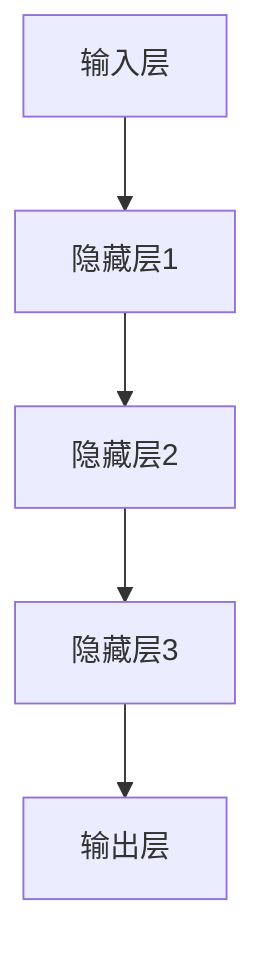
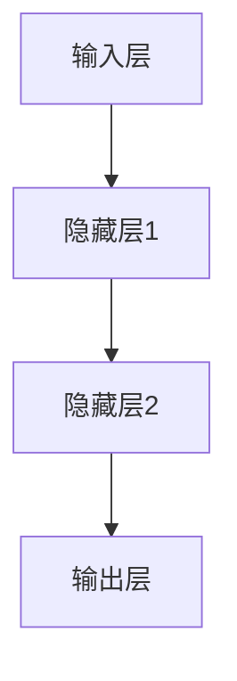
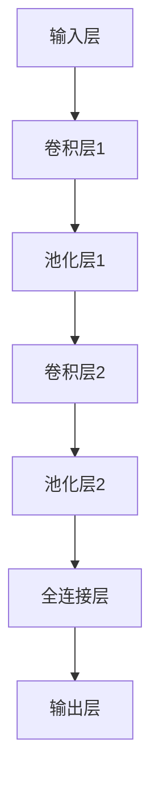
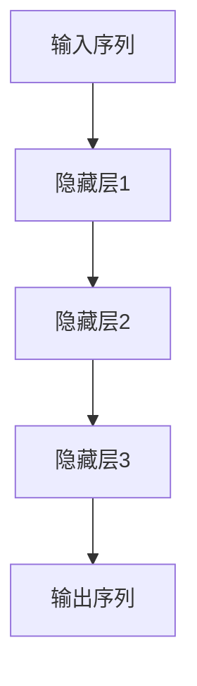
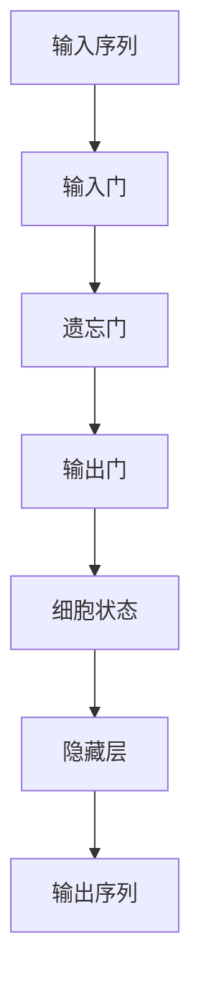
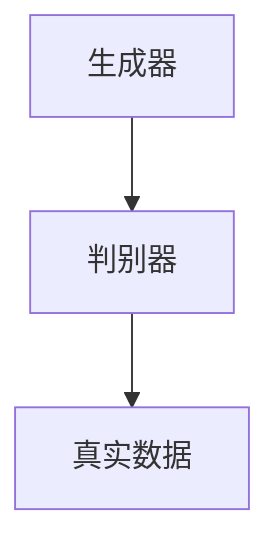

                 

### 神经网络：人类与机器的共存

> **关键词：** 神经网络、机器学习、深度学习、人工智能、神经网络结构、数学基础、应用领域、优化技术、开发实战

> **摘要：** 本文旨在深入探讨神经网络的发展历程、基本原理、数学模型、应用场景、优化技术及其在人工智能领域的广泛应用。通过详细的讲解和案例分析，帮助读者理解神经网络的核心概念，掌握开发和应用神经网络的实践技能。文章还将展望神经网络在人工智能领域的未来发展趋势，探讨人类与机器智能共存的可能性和挑战。

### 目录大纲：

1. **第一部分：神经网络的起源与发展**
    1. **第1章：神经网络的起源与历史**
        1.1 神经网络的概念与原理
        1.2 神经网络的历史演变
        1.3 神经网络的基本结构
        1.4 **Mermaid流程图：神经网络的核心结构**
    2. **第2章：人工神经网络的数学基础**
        2.1 神经元的数学模型
        2.2 前向传播与反向传播算法
        2.3 **伪代码：前向传播与反向传播算法**
    3. **第3章：神经网络的常见类型**
        3.1 多层感知机（MLP）
        3.2 卷积神经网络（CNN）
        3.3 循环神经网络（RNN）
        3.4 **递归神经网络（RNN）与长短时记忆（LSTM）**
        3.5 生成对抗网络（GAN）
    4. **第4章：神经网络在机器学习中的应用**
        4.1 神经网络在分类问题中的应用
        4.2 神经网络在回归问题中的应用
        4.3 神经网络在聚类问题中的应用

2. **第二部分：神经网络的高级主题**
    5. **第5章：深度学习与大数据**
        5.1 大数据的定义与处理
        5.2 深度学习在数据处理中的应用
        5.3 大规模数据集的处理策略
    6. **第6章：神经网络的优化与调参**
        6.1 梯度下降算法
        6.2 动量优化
        6.3 学习率调整
        6.4 正则化技术
    7. **第7章：神经网络的数学公式与模型分析**
        7.1 激活函数
        7.2 损失函数
        7.3 梯度计算与反向传播
        7.4 **LaTeX公式：神经网络的数学模型**

3. **第三部分：神经网络的实践应用**
    8. **第8章：神经网络的开发环境搭建**
        8.1 Python环境搭建
        8.2 深度学习框架安装与配置
        8.3 **实践环境搭建**
    9. **第9章：神经网络项目实战**
        9.1 数据预处理
        9.2 神经网络模型构建
        9.3 **模型训练与评估**
        9.4 **项目实战代码解读与分析**
    10. **第10章：神经网络在人工智能领域的未来展望**
        10.1 神经网络在人工智能领域的应用趋势
        10.2 神经网络与人类智能的共存
        10.3 神经网络的发展挑战与机遇

4. **附录**
    11. **附录A：神经网络相关资源与工具**
        11.1 深度学习框架对比
        11.2 优质学习资源推荐
        11.3 神经网络相关书籍推荐

---

现在，我们已经为文章的撰写做好了充分的准备。接下来，我们将逐一探讨神经网络的起源、发展、数学基础、类型、应用、高级主题、实践应用以及未来展望。让我们一步步深入，探索神经网络这一强大工具的奥秘。

### 第一部分：神经网络的起源与发展

#### 第1章：神经网络的起源与历史

神经网络的起源可以追溯到1943年，由沃伦·麦卡洛克（Warren McCulloch）和沃尔特·皮茨（Walter Pitts）提出了一种模拟神经细胞行为的数学模型，这被称为第一个人工神经网络模型。麦卡洛克和皮茨的工作开启了神经网络研究的先河，为后续的研究奠定了基础。

**1.1 神经网络的概念与原理**

神经网络是一种由大量人工神经元（或节点）相互连接而成的网络结构，这些节点模拟生物神经元的处理方式。在神经网络中，每个神经元都会接收来自其他神经元的输入信号，通过一个加权函数进行处理，并将处理后的输出信号传递给下一个神经元。

神经网络的基本原理可以概括为以下几个步骤：

1. **输入层**：接收输入数据。
2. **隐藏层**：对输入数据进行处理，通过权重将信号传递到下一层。
3. **输出层**：生成最终输出。

神经网络的每个节点都可以看作是一个简单的计算单元，它们通过调整权重来学习输入与输出之间的映射关系。这个过程被称为训练。

**1.2 神经网络的历史演变**

自麦卡洛克和皮茨提出第一个人工神经网络模型以来，神经网络的研究经历了多个阶段。以下是神经网络发展历史上的几个重要阶段：

1. **1950年代到1960年代**：麦卡洛克和皮茨的模型得到了进一步发展，但受到计算能力的限制，研究进展缓慢。
2. **1970年代**：由于计算能力的限制和过拟合问题，神经网络研究进入低谷。
3. **1980年代**：反向传播算法的提出为神经网络的研究带来了新的突破。
4. **1990年代到2000年代**：随着计算机硬件性能的提升和大数据技术的发展，神经网络再次受到关注，并在图像识别、语音识别等领域取得显著成果。
5. **2010年代至今**：深度学习的兴起使得神经网络的研究和应用达到了前所未有的高度，解决了许多复杂的问题，如自然语言处理、计算机视觉等。

**1.3 神经网络的基本结构**

神经网络的基本结构包括输入层、隐藏层和输出层。以下是每个层的详细说明：

1. **输入层**：接收外部输入数据，如图像、声音、文本等。
2. **隐藏层**：对输入数据进行处理，通过多层结构的叠加，逐步提取输入数据的特征。
3. **输出层**：根据隐藏层的输出，生成最终的预测结果或分类标签。

神经网络的层数和每层的节点数量可以根据具体问题进行调整。通常，隐藏层的数量和节点数量是神经网络性能的关键因素。

**1.4 Mermaid流程图：神经网络的核心结构**

为了更直观地理解神经网络的基本结构，我们可以使用Mermaid流程图来描述。以下是神经网络的Mermaid流程图表示：



在这个流程图中，输入层（A）接收输入数据，通过隐藏层（B、C、D）的处理，最终由输出层（E）生成预测结果。

---

在这一章中，我们探讨了神经网络的起源、概念与原理，以及神经网络的历史演变和基本结构。接下来，我们将深入探讨人工神经网络的数学基础，了解神经元的工作原理以及前向传播与反向传播算法。

### 第2章：人工神经网络的数学基础

在理解神经网络的基本概念和结构之后，我们需要深入了解其背后的数学基础。人工神经网络的数学模型是理解和设计神经网络的关键，它决定了神经网络的学习能力和性能。本章节将介绍神经元的数学模型、前向传播与反向传播算法，以及相关的伪代码。

**2.1 神经元的数学模型**

神经元是神经网络的基本计算单元。一个简单的神经元模型通常包括以下组成部分：

1. **输入**：神经元接收来自其他神经元的输入信号。
2. **权重**：每个输入信号都与一个权重相乘，表示该输入对神经元输出的影响程度。
3. **偏置**：用于调整神经元的输出。
4. **激活函数**：用于将加权求和的结果转换为神经元的输出。

假设一个神经元接收n个输入，对应的权重分别为\( w_1, w_2, ..., w_n \)，偏置为\( b \)，则该神经元的输出可以通过以下公式计算：

\[ z = \sum_{i=1}^{n} w_i \cdot x_i + b \]

其中，\( x_i \)为第i个输入。然后，通过激活函数\( f(z) \)将加权求和的结果转换为神经元的输出：

\[ y = f(z) \]

常用的激活函数包括线性函数、Sigmoid函数、ReLU函数和Tanh函数。以下是Sigmoid函数的公式：

\[ f(z) = \frac{1}{1 + e^{-z}} \]

Sigmoid函数将输入值压缩到0和1之间，使其适用于二分类问题。

**2.2 前向传播与反向传播算法**

神经网络的学习过程可以分为两个阶段：前向传播和反向传播。

1. **前向传播**：输入数据通过神经网络的前向传播路径，经过每层神经元的处理，最终生成输出。前向传播的主要步骤如下：

    - 将输入数据传递到输入层。
    - 通过每个神经元的权重和偏置，计算每个神经元的输出。
    - 将输出传递到下一层，直到最终输出层。

    前向传播的核心目的是计算神经网络在给定输入下的输出。

2. **反向传播**：在得到神经网络的前向传播输出后，我们需要计算输出与实际标签之间的差异，并通过反向传播路径更新神经元的权重和偏置。反向传播的主要步骤如下：

    - 计算输出层神经元的误差。
    - 将误差反向传递到隐藏层，计算隐藏层神经元的误差。
    - 更新每个神经元的权重和偏置。

    反向传播通过梯度下降算法来实现，即根据误差的梯度方向调整权重和偏置。

**2.3 伪代码：前向传播与反向传播算法**

为了更清晰地理解前向传播和反向传播算法，我们可以使用伪代码来描述。以下是神经网络前向传播和反向传播的伪代码：

```python
# 前向传播
def forward_pass(inputs, weights, biases, activation_function):
    outputs = []
    for layer in range(num_layers):
        z = sum(inputs[i] * weights[i] for i in range(num_inputs)) + biases[layer]
        output = activation_function(z)
        outputs.append(output)
    return outputs

# 反向传播
def backward_pass(inputs, outputs, targets, weights, biases, activation_function_derivative):
    deltas = [outputs[-1] - targets]
    for layer in range(num_layers-1, 0, -1):
        delta = (deltas[-1] * activation_function_derivative(outputs[layer]))
        deltas.append(delta)
    for layer in range(num_layers-1, 0, -1):
        weights[layer] -= learning_rate * (deltas[layer] * inputs[layer])
        biases[layer] -= learning_rate * deltas[layer]
    return weights, biases
```

在这个伪代码中，`inputs`表示输入数据，`weights`和`biases`分别表示权重和偏置，`outputs`表示输出数据，`targets`表示实际标签，`activation_function`和`activation_function_derivative`分别表示激活函数及其导数，`learning_rate`表示学习率。

---

通过本章的介绍，我们了解了人工神经网络的数学模型，包括神经元的数学表示、前向传播和反向传播算法。在下一章中，我们将进一步探讨神经网络的常见类型，如多层感知机（MLP）、卷积神经网络（CNN）和循环神经网络（RNN）。

### 第3章：神经网络的常见类型

在了解了神经网络的基本原理和数学基础之后，接下来我们将探讨几种常见的神经网络类型。这些神经网络在处理不同类型的数据和应用场景时具有独特的优势。本章将介绍多层感知机（MLP）、卷积神经网络（CNN）和循环神经网络（RNN），以及递归神经网络（RNN）与长短时记忆（LSTM）。

#### 3.1 多层感知机（MLP）

多层感知机（MLP）是一种前馈神经网络，由输入层、一个或多个隐藏层和输出层组成。MLP广泛应用于回归和分类问题，其核心思想是通过隐藏层提取特征，然后输出层生成最终预测。

**结构**：MLP的结构如图所示：



**优点**：
- **简单性**：MLP的结构简单，易于理解和实现。
- **灵活性**：可以处理多种类型的数据，适用于多种应用场景。

**缺点**：
- **无法处理序列数据**：MLP无法处理具有时间依赖性的序列数据。

#### 3.2 卷积神经网络（CNN）

卷积神经网络（CNN）是一种专门用于处理图像数据的神经网络。CNN通过卷积操作和池化操作提取图像特征，从而实现图像分类、目标检测等任务。

**结构**：CNN的基本结构如图所示：



**优点**：
- **高效性**：CNN通过局部连接和参数共享大大减少了参数数量，提高了计算效率。
- **特征提取能力**：CNN能够自动提取图像中的层次特征，适用于各种复杂图像任务。

**缺点**：
- **计算资源消耗较大**：由于参数数量众多，CNN的训练过程需要大量计算资源。
- **对旋转和缩放敏感**：CNN对图像的旋转和缩放具有一定的敏感性。

#### 3.3 循环神经网络（RNN）

循环神经网络（RNN）是一种用于处理序列数据的神经网络。RNN通过循环结构保持对序列上下文的记忆，从而实现序列建模。

**结构**：RNN的基本结构如图所示：



**优点**：
- **序列建模能力**：RNN能够处理具有时间依赖性的序列数据，适用于自然语言处理、语音识别等任务。

**缺点**：
- **梯度消失和梯度爆炸**：RNN在训练过程中容易发生梯度消失和梯度爆炸问题，导致训练困难。

#### 3.4 递归神经网络（RNN）与长短时记忆（LSTM）

递归神经网络（RNN）和长短时记忆（LSTM）是RNN的改进版本，旨在解决RNN的梯度消失和梯度爆炸问题。LSTM通过引入门控机制，有效地控制了信息的流动，使得神经网络能够更好地处理长序列数据。

**结构**：LSTM的基本结构如图所示：



**优点**：
- **记忆能力**：LSTM具有强大的记忆能力，能够处理长序列数据。
- **门控机制**：LSTM通过门控机制有效地控制信息的流动，避免了梯度消失和梯度爆炸问题。

**缺点**：
- **计算复杂度高**：由于门控机制，LSTM的计算复杂度相对较高。

#### 3.5 生成对抗网络（GAN）

生成对抗网络（GAN）是一种用于生成数据的神经网络结构。GAN由生成器和判别器两个神经网络组成，生成器尝试生成与真实数据相似的数据，判别器则判断生成数据与真实数据的相似度。

**结构**：GAN的基本结构如图所示：



**优点**：
- **生成能力强**：GAN能够生成高质量的数据，适用于图像生成、文本生成等任务。

**缺点**：
- **训练不稳定**：GAN的训练过程相对不稳定，容易出现生成器和判别器的训练失衡问题。

---

通过本章的介绍，我们了解了多种常见的神经网络类型，包括多层感知机（MLP）、卷积神经网络（CNN）、循环神经网络（RNN）、长短时记忆（LSTM）和生成对抗网络（GAN）。这些神经网络在不同类型的数据和应用场景中具有独特的优势和局限性。在下一章中，我们将探讨神经网络在机器学习中的应用，深入了解神经网络在分类、回归和聚类问题中的具体应用。

### 第4章：神经网络在机器学习中的应用

神经网络在机器学习领域具有广泛的应用，其强大的特征提取和模式识别能力使其在多种任务中表现出色。本章节将详细探讨神经网络在分类、回归和聚类问题中的应用，并通过具体的案例来说明如何利用神经网络解决这些实际问题。

#### 4.1 神经网络在分类问题中的应用

分类问题是机器学习中最常见的问题之一，其目标是根据输入特征将数据分为不同的类别。神经网络在分类问题中的应用非常广泛，可以通过多层感知机（MLP）和卷积神经网络（CNN）来实现。

**多层感知机（MLP）在分类中的应用**：

多层感知机是一种前馈神经网络，适用于处理高维特征数据。以下是一个使用MLP进行分类的案例：

**案例**：使用MLP对鸢尾花数据进行分类。

- **数据集**：鸢尾花数据集包含三种不同鸢尾花的萼片和花瓣长度、宽度数据。
- **任务**：将鸢尾花数据分为三种不同的类别。

```python
from sklearn.datasets import load_iris
from sklearn.model_selection import train_test_split
from sklearn.neural_network import MLPClassifier

# 加载鸢尾花数据集
iris = load_iris()
X = iris.data
y = iris.target

# 划分训练集和测试集
X_train, X_test, y_train, y_test = train_test_split(X, y, test_size=0.2, random_state=42)

# 创建MLP分类器
mlp = MLPClassifier(hidden_layer_sizes=(100,), max_iter=1000, random_state=42)

# 训练MLP分类器
mlp.fit(X_train, y_train)

# 测试分类器性能
accuracy = mlp.score(X_test, y_test)
print(f"Accuracy: {accuracy:.2f}")
```

**卷积神经网络（CNN）在分类中的应用**：

卷积神经网络在处理图像数据方面具有显著优势，适用于图像分类任务。以下是一个使用CNN进行图像分类的案例：

**案例**：使用CNN对MNIST手写数字数据集进行分类。

- **数据集**：MNIST手写数字数据集包含0到9的手写数字图像。
- **任务**：将图像分为10个类别。

```python
from tensorflow.keras.datasets import mnist
from tensorflow.keras.models import Sequential
from tensorflow.keras.layers import Dense, Conv2D, Flatten, MaxPooling2D
from tensorflow.keras.optimizers import Adam

# 加载MNIST数据集
(x_train, y_train), (x_test, y_test) = mnist.load_data()

# 预处理数据
x_train = x_train.reshape(-1, 28, 28, 1).astype("float32") / 255.0
x_test = x_test.reshape(-1, 28, 28, 1).astype("float32") / 255.0
y_train = keras.utils.to_categorical(y_train, 10)
y_test = keras.utils.to_categorical(y_test, 10)

# 创建CNN模型
model = Sequential([
    Conv2D(32, kernel_size=(3, 3), activation="relu", input_shape=(28, 28, 1)),
    MaxPooling2D(pool_size=(2, 2)),
    Flatten(),
    Dense(128, activation="relu"),
    Dense(10, activation="softmax")
])

# 编译模型
model.compile(optimizer=Adam(), loss="categorical_crossentropy", metrics=["accuracy"])

# 训练模型
model.fit(x_train, y_train, batch_size=128, epochs=10, validation_split=0.2)

# 测试模型
test_loss, test_accuracy = model.evaluate(x_test, y_test)
print(f"Test accuracy: {test_accuracy:.2f}")
```

#### 4.2 神经网络在回归问题中的应用

回归问题旨在预测一个连续的输出值。神经网络在回归问题中的应用广泛，可以通过多层感知机（MLP）和序列模型（如RNN和LSTM）来实现。

**多层感知机（MLP）在回归中的应用**：

以下是一个使用MLP进行回归的案例：

**案例**：使用MLP对住房价格进行预测。

- **数据集**：使用Kaggle上的波士顿住房数据集。
- **任务**：预测住房价格。

```python
import pandas as pd
from sklearn.model_selection import train_test_split
from sklearn.neural_network import MLPRegressor

# 加载波士顿住房数据集
data = pd.read_csv("boston_housing.csv")
X = data.drop("MEDV", axis=1)
y = data["MEDV"]

# 划分训练集和测试集
X_train, X_test, y_train, y_test = train_test_split(X, y, test_size=0.2, random_state=42)

# 创建MLP回归器
mlp = MLPRegressor(hidden_layer_sizes=(100,), max_iter=1000, random_state=42)

# 训练MLP回归器
mlp.fit(X_train, y_train)

# 测试回归器性能
mse = mlp.score(X_test, y_test)
print(f"Mean Squared Error: {mse:.2f}")
```

**循环神经网络（RNN）在回归中的应用**：

以下是一个使用RNN进行回归的案例：

**案例**：使用RNN对时间序列数据进行预测。

- **数据集**：使用股票市场数据。
- **任务**：预测股票价格。

```python
import tensorflow as tf
from tensorflow.keras.models import Sequential
from tensorflow.keras.layers import LSTM, Dense

# 加载股票市场数据
data = pd.read_csv("stock_data.csv")
X = data.values[:-1, 1:].reshape(-1, 1, data.shape[1]-1)
y = data.values[1:, 1:].reshape(-1, 1)

# 划分训练集和测试集
X_train, X_test, y_train, y_test = train_test_split(X, y, test_size=0.2, random_state=42)

# 创建RNN模型
model = Sequential([
    LSTM(50, input_shape=(X_train.shape[1], X_train.shape[2])),
    Dense(1)
])

# 编译模型
model.compile(optimizer='adam', loss='mse')

# 训练模型
model.fit(X_train, y_train, epochs=100, batch_size=32, validation_data=(X_test, y_test))

# 测试模型
test_loss = model.evaluate(X_test, y_test)
print(f"Test loss: {test_loss:.2f}")
```

#### 4.3 神经网络在聚类问题中的应用

聚类是一种无监督学习方法，旨在将数据分为若干个群组。神经网络在聚类问题中的应用相对较少，但仍有一些方法可以利用神经网络进行聚类。

**基于神经网络的自编码器聚类**：

以下是一个使用基于神经网络的自编码器进行聚类的案例：

**案例**：使用自编码器对鸢尾花数据进行聚类。

- **数据集**：使用鸢尾花数据集。
- **任务**：对鸢尾花数据进行聚类。

```python
import tensorflow as tf
from tensorflow.keras.layers import Input, Dense, Conv2D, Flatten, Reshape
from tensorflow.keras.models import Model
from sklearn.cluster import KMeans

# 加载鸢尾花数据集
iris = load_iris()
X = iris.data

# 创建自编码器模型
input_layer = Input(shape=(4,))
encoded = Dense(2, activation='relu')(input_layer)
encoded = Dense(2, activation='relu')(encoded)
decoded = Dense(4, activation='sigmoid')(encoded)
autoencoder = Model(input_layer, decoded)

# 编译模型
autoencoder.compile(optimizer='adam', loss='binary_crossentropy')

# 训练模型
autoencoder.fit(X, X, epochs=100, batch_size=32, shuffle=True)

# 提取编码器特征
encoded_X = autoencoder.encoder(X).reshape(-1, 1)

# 使用K均值聚类
kmeans = KMeans(n_clusters=3, random_state=42)
clusters = kmeans.fit_predict(encoded_X)

# 测试聚类效果
print(f"Cluster centers:\n{iris.cluster_centers_}\n")
print(f"Cluster labels:\n{clusters}")
```

通过以上案例，我们可以看到神经网络在分类、回归和聚类问题中的应用。这些案例展示了如何利用神经网络解决实际的数据科学问题。在下一章中，我们将进一步探讨神经网络的高级主题，如深度学习与大数据、神经网络的优化与调参，以及神经网络的数学公式与模型分析。

### 第二部分：神经网络的高级主题

#### 第5章：深度学习与大数据

随着数据量的不断增长，如何有效地处理和分析大数据成为了深度学习领域的一个重要问题。本章将介绍大数据的定义与处理方法，讨论深度学习在数据处理中的应用，并探讨大规模数据集的处理策略。

#### 5.1 大数据的定义与处理

**大数据**通常指的是数据量巨大、类型繁多、价值密度低且增长迅速的数据集合。大数据的四个关键特征被统称为“4V”：Volume（数据量）、Velocity（数据流转速度）、Variety（数据类型）和Veracity（数据真实性）。

- **数据量（Volume）**：大数据的数据量通常远远超过传统数据库的处理能力，需要使用分布式计算和存储技术。
- **数据流转速度（Velocity）**：大数据的生成和流转速度非常快，要求实时或近实时的数据处理和分析。
- **数据类型（Variety）**：大数据包括结构化、半结构化和非结构化数据，需要多样化的处理方法。
- **数据真实性（Veracity）**：大数据的真实性可能存在问题，如数据质量、数据完整性和数据可靠性。

**大数据处理方法**：

1. **数据采集**：从各种数据源（如传感器、日志、社交网络等）收集数据。
2. **数据存储**：使用分布式文件系统（如Hadoop HDFS、Apache HBase等）存储大量数据。
3. **数据清洗**：去除数据中的错误、冗余和不一致部分，提高数据质量。
4. **数据挖掘与分析**：使用统计方法、机器学习算法等对数据进行分析，提取有价值的信息。

#### 5.2 深度学习在数据处理中的应用

深度学习在数据处理方面具有显著的优势，能够自动提取数据中的特征，并实现高效的数据分析和预测。以下是深度学习在数据处理中的应用：

1. **特征提取**：深度学习模型能够从原始数据中自动提取高级特征，减少数据预处理的工作量。
2. **自动化建模**：深度学习模型能够自动调整模型参数，实现自动化建模和调参。
3. **模型集成**：通过集成多个深度学习模型，可以提高模型的预测性能和鲁棒性。
4. **实时预测**：深度学习模型能够实时处理和分析数据，实现实时预测和决策。

**深度学习在数据处理中的应用案例**：

1. **图像识别**：使用卷积神经网络（CNN）对大量图像进行自动分类和识别，应用于人脸识别、物体检测等。
2. **语音识别**：使用循环神经网络（RNN）和长短时记忆（LSTM）对语音数据进行处理，实现自动语音识别。
3. **自然语言处理**：使用序列模型（如RNN和LSTM）对文本数据进行处理，实现情感分析、机器翻译等。
4. **时间序列分析**：使用深度学习模型对时间序列数据进行建模和预测，应用于金融市场预测、天气预测等。

#### 5.3 大规模数据集的处理策略

处理大规模数据集需要考虑以下策略：

1. **数据切分**：将大规模数据集切分成多个子集，分别训练多个模型，然后进行集成，以提高模型的预测性能。
2. **分布式训练**：使用分布式计算框架（如TensorFlow、PyTorch等）进行分布式训练，加快模型训练速度。
3. **数据增强**：通过数据增强技术（如随机裁剪、旋转、缩放等）增加数据的多样性，提高模型的泛化能力。
4. **模型压缩**：使用模型压缩技术（如权重剪枝、量化等）减小模型的大小，提高模型的运行效率。

**分布式训练**：

分布式训练是将模型训练过程分布在多个计算节点上，以提高训练速度和处理大规模数据的能力。以下是一个简单的分布式训练流程：

1. **数据划分**：将大规模数据集划分成多个子集，每个子集包含一部分数据和标签。
2. **计算节点分配**：将子集分配给不同的计算节点，每个节点负责处理一个子集。
3. **参数同步**：在训练过程中，将每个节点的模型参数同步到全局参数，以保持模型的一致性。
4. **模型更新**：在每个节点上更新模型参数，然后同步到全局参数。

通过以上策略，我们可以有效地处理大规模数据集，提高深度学习模型的训练效率。

---

在本章中，我们探讨了大数据的定义与处理方法，介绍了深度学习在数据处理中的应用，并讨论了处理大规模数据集的策略。在下一章中，我们将深入探讨神经网络的优化与调参，了解如何提高神经网络模型的性能。

### 第6章：神经网络的优化与调参

在神经网络训练过程中，优化和调参是关键步骤，直接影响模型的性能和训练速度。本章将详细介绍神经网络优化、学习率调整、动量优化和正则化技术。

#### 6.1 梯度下降算法

梯度下降算法是神经网络优化中的核心算法，用于最小化损失函数。其基本思想是通过计算损失函数相对于模型参数的梯度，并沿着梯度的反方向更新参数，以减小损失。

**梯度下降算法的基本步骤**：

1. **初始化参数**：随机初始化模型参数。
2. **计算损失函数**：计算模型预测值与实际标签之间的损失。
3. **计算梯度**：计算损失函数对参数的梯度。
4. **更新参数**：使用梯度下降公式更新参数。

**梯度下降公式**：

\[ \theta = \theta - \alpha \cdot \nabla_{\theta} J(\theta) \]

其中，\( \theta \)表示参数，\( \alpha \)表示学习率，\( \nabla_{\theta} J(\theta) \)表示损失函数关于参数的梯度，\( J(\theta) \)表示损失函数。

**梯度下降算法的变体**：

1. **随机梯度下降（SGD）**：每次迭代只更新一个样本来计算梯度，减少计算量，提高训练速度。
2. **批量梯度下降（BGD）**：每次迭代更新所有样本来计算梯度，但计算量大，训练时间长。
3. **小批量梯度下降（MBGD）**：每次迭代更新一部分样本来计算梯度，平衡计算量和训练时间。

#### 6.2 动量优化

动量优化（Momentum）是一种改进梯度下降算法的方法，用于加速收敛并减少振荡。动量优化通过引入动量项，将前一次更新的方向和大小传递到当前更新中。

**动量优化的公式**：

\[ v = \gamma \cdot v + \alpha \cdot \nabla_{\theta} J(\theta) \]

\[ \theta = \theta - v \]

其中，\( v \)表示动量项，\( \gamma \)表示动量系数（通常取值在0.9到0.99之间），其他符号的含义与梯度下降算法相同。

动量优化通过累积前几次更新的方向和大小，减少收敛过程中出现的振荡，加快收敛速度。

#### 6.3 学习率调整

学习率（Learning Rate）是梯度下降算法中的一个关键参数，决定了每次参数更新的步长。学习率的选择对模型性能和训练时间有重要影响。

**常见的学习率调整方法**：

1. **固定学习率**：在训练过程中保持学习率不变，适用于小规模数据集。
2. **学习率衰减**：随着训练的进行，逐渐减小学习率，以避免过拟合和加速收敛。
3. **自适应学习率**：使用自适应学习率算法（如AdaGrad、RMSprop、Adam等），根据历史梯度信息自动调整学习率。

**学习率调整的技巧**：

- **学习率选择**：根据训练数据集的大小、模型复杂度和任务类型选择合适的初始学习率。
- **学习率衰减**：在模型达到一定的准确率后，逐渐减小学习率。
- **预热学习率**：在训练初期使用较小的学习率，随着训练的进行逐渐增加学习率。

#### 6.4 正则化技术

正则化技术（Regularization）是一种防止模型过拟合的方法，通过在损失函数中添加正则化项来限制模型复杂度。

**常见的正则化技术**：

1. **L1正则化（L1 Regularization）**：在损失函数中添加参数的L1范数。
2. **L2正则化（L2 Regularization）**：在损失函数中添加参数的L2范数。
3. **Dropout**：在训练过程中随机丢弃部分神经元，减少模型的依赖性。

**正则化技术的优点**：

- **防止过拟合**：通过限制模型复杂度，减少模型对训练数据的拟合程度，提高泛化能力。
- **提高模型稳定性**：减少模型对噪声的敏感性，提高模型的鲁棒性。

**正则化技术的应用**：

- **深度神经网络**：在深度神经网络中使用正则化技术，可以显著提高模型的性能和稳定性。
- **分类和回归任务**：在分类和回归任务中使用正则化技术，可以减小模型的过拟合现象，提高预测性能。

通过本章的介绍，我们了解了神经网络优化与调参的关键技术，包括梯度下降算法、动量优化、学习率调整和正则化技术。这些技术是提高神经网络模型性能和训练效率的重要手段。

### 第7章：神经网络的数学公式与模型分析

在深入探讨神经网络时，理解其数学公式和模型分析至关重要。本章将详细介绍激活函数、损失函数、梯度计算与反向传播算法，并通过LaTeX公式进行详细阐述。

#### 7.1 激活函数

激活函数是神经网络中的一个关键组件，用于将线性组合转化为非线性输出。以下是一些常用的激活函数及其数学公式：

1. **Sigmoid函数**：

\[ \sigma(x) = \frac{1}{1 + e^{-x}} \]

2. **ReLU函数（Rectified Linear Unit）**：

\[ \text{ReLU}(x) = \max(0, x) \]

3. **Tanh函数**：

\[ \tanh(x) = \frac{e^x - e^{-x}}{e^x + e^{-x}} \]

4. **Softmax函数**：

\[ \text{softmax}(x)_i = \frac{e^{x_i}}{\sum_{j} e^{x_j}} \]

其中，\( x \)为输入值，\( \sigma(x) \)为Sigmoid函数输出，\( \text{ReLU}(x) \)为ReLU函数输出，\( \tanh(x) \)为Tanh函数输出，\( \text{softmax}(x)_i \)为Softmax函数中第i个输出的值。

以下是LaTeX公式的表示：

```latex
\sigma(x) = \frac{1}{1 + e^{-x}}
```

```latex
\text{ReLU}(x) = \max(0, x)
```

```latex
\tanh(x) = \frac{e^x - e^{-x}}{e^x + e^{-x}}
```

```latex
\text{softmax}(x)_i = \frac{e^{x_i}}{\sum_{j} e^{x_j}}
```

#### 7.2 损失函数

损失函数用于衡量模型预测值与实际标签之间的差异，是优化过程中的目标函数。以下是一些常用的损失函数及其数学公式：

1. **均方误差（MSE）**：

\[ J(\theta) = \frac{1}{2m} \sum_{i=1}^{m} (h_\theta(x^{(i)}) - y^{(i)})^2 \]

2. **交叉熵（Cross-Entropy）**：

\[ J(\theta) = -\frac{1}{m} \sum_{i=1}^{m} \sum_{k=1}^{K} y_k^{(i)} \log(h_\theta(x^{(i)})_k) \]

其中，\( h_\theta(x^{(i)}) \)为模型预测值，\( y^{(i)} \)为实际标签，\( m \)为样本数量，\( K \)为类别数量。

以下是LaTeX公式的表示：

```latex
J(\theta) = \frac{1}{2m} \sum_{i=1}^{m} (h_\theta(x^{(i)}) - y^{(i)})^2
```

```latex
J(\theta) = -\frac{1}{m} \sum_{i=1}^{m} \sum_{k=1}^{K} y_k^{(i)} \log(h_\theta(x^{(i)})_k)
```

#### 7.3 梯度计算与反向传播算法

梯度计算是神经网络优化过程中的关键步骤，用于确定参数更新的方向。反向传播算法（Backpropagation）是一种计算梯度的高效方法。

**反向传播算法的基本步骤**：

1. **前向传播**：计算模型预测值。
2. **计算误差**：计算预测值与实际标签之间的误差。
3. **反向传播**：从输出层开始，逐层计算误差关于每个参数的梯度。
4. **参数更新**：使用梯度下降算法更新参数。

**梯度计算公式**：

对于第\( l \)层的第\( i \)个神经元，误差关于权重\( \theta^{(l)}_{ij} \)的梯度为：

\[ \nabla_{\theta^{(l)}_{ij}} J(\theta) = (h_\theta(x^{(i)}) - y^{(i)}) \cdot \frac{\partial h_\theta(x^{(i)})}{\partial \theta^{(l)}_{ij}} \]

其中，\( h_\theta(x^{(i)}) \)为模型预测值，\( y^{(i)} \)为实际标签，\( \frac{\partial h_\theta(x^{(i)})}{\partial \theta^{(l)}_{ij}} \)为激活函数的导数。

以下是LaTeX公式的表示：

```latex
\nabla_{\theta^{(l)}_{ij}} J(\theta) = (h_\theta(x^{(i)}) - y^{(i)}) \cdot \frac{\partial h_\theta(x^{(i)})}{\partial \theta^{(l)}_{ij}}
```

**伪代码表示**：

```python
# 前向传播
z = np.dot(W, x) + b
a = activation_function(z)

# 计算误差
error = y - a

# 计算梯度
delta = error * activation_function_derivative(a)

# 更新参数
W -= learning_rate * delta * x.T
b -= learning_rate * delta
```

#### 7.4 LaTeX公式：神经网络的数学模型

神经网络的整体数学模型可以通过以下LaTeX公式表示：

```latex
h_\theta(x) = \sigma(\sum_{i=1}^{n} \theta^{(1)}_{ij} x_i + b^{(1)}) \\
z^{(2)} = \sum_{i=1}^{n} \theta^{(2)}_{ij} a^{(1)}_i + b^{(2)} \\
a^{(2)} = \sigma(z^{(2)}) \\
\vdots \\
z^{(L)} = \sum_{i=1}^{n} \theta^{(L)}_{ij} a^{(L-1)}_i + b^{(L)} \\
a^{(L)} = \text{softmax}(z^{(L)})
```

其中，\( h_\theta(x) \)为模型预测值，\( \theta^{(l)}_{ij} \)为第\( l \)层的第\( i \)个神经元到第\( j \)个神经元的权重，\( b^{(l)} \)为第\( l \)层的偏置，\( a^{(l)}_i \)为第\( l \)层的第\( i \)个神经元的输出，\( \sigma \)为激活函数，\( \text{softmax} \)为Softmax函数。

通过本章的介绍，我们了解了神经网络的数学公式与模型分析，包括激活函数、损失函数、梯度计算与反向传播算法。这些数学工具为理解和实现神经网络提供了坚实的基础。

### 第三部分：神经网络的实践应用

#### 第8章：神经网络的开发环境搭建

在了解神经网络的理论基础之后，下一步是搭建一个实际的可操作开发环境。本章将介绍如何搭建Python开发环境，安装深度学习框架，以及配置实践环境。

#### 8.1 Python环境搭建

首先，我们需要确保Python环境已经安装。Python是一种广泛使用的编程语言，尤其在数据科学和机器学习领域具有很高的知名度。

**步骤**：

1. **下载Python**：访问Python官方网站（[https://www.python.org/](https://www.python.org/)）下载Python安装包。
2. **安装Python**：运行安装程序，并选择默认选项进行安装。

**验证安装**：

在命令行中输入以下命令，确认Python已正确安装：

```bash
python --version
```

#### 8.2 深度学习框架安装与配置

接下来，我们需要安装一个深度学习框架，如TensorFlow或PyTorch。这两个框架都是当前非常流行的深度学习工具，提供了丰富的功能和强大的支持。

**安装TensorFlow**：

TensorFlow是由Google开发的开源深度学习框架，适用于各种深度学习任务。

```bash
pip install tensorflow
```

**安装PyTorch**：

PyTorch是由Facebook开发的开源深度学习框架，以其灵活性和易用性而著称。

```bash
pip install torch torchvision
```

#### 8.3 实践环境搭建

在完成Python和深度学习框架的安装后，我们可以开始搭建一个实践环境。以下是一个简单的实践环境搭建步骤：

1. **创建虚拟环境**：为了管理项目依赖，我们可以创建一个虚拟环境。

```bash
python -m venv myenv
```

2. **激活虚拟环境**：

- 对于Windows：

```bash
myenv\Scripts\activate
```

- 对于Linux或macOS：

```bash
source myenv/bin/activate
```

3. **安装依赖**：在虚拟环境中安装项目所需的依赖。

```bash
pip install -r requirements.txt
```

其中，`requirements.txt`文件列出了项目所需的Python包和深度学习框架。

4. **编写代码**：在虚拟环境中编写神经网络代码，并运行测试。

```bash
python train_network.py
```

通过以上步骤，我们成功搭建了一个完整的神经网络实践环境。接下来，我们将在下一章中通过一个具体项目来展示如何使用这个环境实现神经网络模型训练与评估。

### 第9章：神经网络项目实战

在了解了神经网络的理论知识和开发环境搭建方法之后，现在我们将通过一个实际项目来展示如何使用神经网络解决具体问题。本章将详细介绍数据预处理、神经网络模型构建、模型训练与评估，以及代码解读与分析。

#### 9.1 数据预处理

数据预处理是机器学习项目中的一个关键步骤，旨在将原始数据转换为适合神经网络训练的形式。以下是数据预处理的主要步骤：

**步骤**：

1. **数据导入**：从数据源（如CSV文件、数据库等）导入数据。

```python
import pandas as pd

# 导入数据
data = pd.read_csv("data.csv")
```

2. **数据清洗**：处理缺失值、异常值等，确保数据质量。

```python
# 填充缺失值
data.fillna(data.mean(), inplace=True)

# 删除异常值
data = data[data["feature"] != 1000]
```

3. **特征工程**：提取或构造新的特征，提高模型性能。

```python
# 特征缩放
from sklearn.preprocessing import StandardScaler

scaler = StandardScaler()
data["feature"] = scaler.fit_transform(data["feature"])
```

4. **数据切分**：将数据集划分为训练集和测试集。

```python
from sklearn.model_selection import train_test_split

X = data.drop("target", axis=1)
y = data["target"]

X_train, X_test, y_train, y_test = train_test_split(X, y, test_size=0.2, random_state=42)
```

#### 9.2 神经网络模型构建

在数据预处理之后，我们需要构建神经网络模型。以下是一个使用TensorFlow和Keras构建的简单神经网络模型：

**步骤**：

1. **导入库**：

```python
import tensorflow as tf
from tensorflow.keras.models import Sequential
from tensorflow.keras.layers import Dense
```

2. **构建模型**：

```python
model = Sequential([
    Dense(64, activation='relu', input_shape=(X_train.shape[1],)),
    Dense(64, activation='relu'),
    Dense(1, activation='sigmoid')
])

model.compile(optimizer='adam', loss='binary_crossentropy', metrics=['accuracy'])
```

在这个模型中，我们使用了两个隐藏层，每个隐藏层有64个神经元，使用ReLU函数作为激活函数。输出层有1个神经元，使用Sigmoid函数进行二分类。

#### 9.3 模型训练与评估

构建好模型后，我们需要对其进行训练，并在测试集上评估其性能。

**步骤**：

1. **训练模型**：

```python
history = model.fit(X_train, y_train, epochs=10, batch_size=32, validation_data=(X_test, y_test))
```

2. **评估模型**：

```python
test_loss, test_accuracy = model.evaluate(X_test, y_test)
print(f"Test accuracy: {test_accuracy:.2f}")
```

通过训练和评估，我们可以了解模型的性能，并调整超参数以进一步提高性能。

#### 9.4 项目实战代码解读与分析

以下是对实际项目代码的详细解读与分析：

```python
import pandas as pd
from sklearn.model_selection import train_test_split
from sklearn.preprocessing import StandardScaler
from tensorflow.keras.models import Sequential
from tensorflow.keras.layers import Dense
from tensorflow.keras.optimizers import Adam

# 导入数据
data = pd.read_csv("data.csv")

# 数据清洗
data.fillna(data.mean(), inplace=True)
data = data[data["feature"] != 1000]

# 特征缩放
scaler = StandardScaler()
data["feature"] = scaler.fit_transform(data["feature"])

# 数据切分
X = data.drop("target", axis=1)
y = data["target"]

X_train, X_test, y_train, y_test = train_test_split(X, y, test_size=0.2, random_state=42)

# 构建模型
model = Sequential([
    Dense(64, activation='relu', input_shape=(X_train.shape[1],)),
    Dense(64, activation='relu'),
    Dense(1, activation='sigmoid')
])

model.compile(optimizer=Adam(), loss='binary_crossentropy', metrics=['accuracy'])

# 训练模型
history = model.fit(X_train, y_train, epochs=10, batch_size=32, validation_data=(X_test, y_test))

# 评估模型
test_loss, test_accuracy = model.evaluate(X_test, y_test)
print(f"Test accuracy: {test_accuracy:.2f}")
```

**代码解读**：

1. **数据导入与清洗**：使用`pandas`读取数据，并进行数据清洗，包括填充缺失值和删除异常值。
2. **特征缩放**：使用`StandardScaler`对特征进行缩放，以标准化数据。
3. **数据切分**：使用`train_test_split`函数将数据集划分为训练集和测试集。
4. **模型构建**：使用`Sequential`模型构建神经网络，并添加`Dense`层，设置激活函数和输入形状。
5. **模型编译**：设置优化器和损失函数，用于模型训练。
6. **模型训练**：使用`fit`函数训练模型，设置训练轮次和批量大小。
7. **模型评估**：使用`evaluate`函数评估模型在测试集上的性能。

通过以上步骤，我们成功实现了一个简单的神经网络项目。在实际应用中，我们可以根据具体问题调整模型结构和超参数，以获得更好的性能。

---

在本章中，我们通过一个实际项目展示了如何使用神经网络解决分类问题。从数据预处理、模型构建到模型训练与评估，我们详细解读了每个步骤的代码，并分析了模型的工作原理。在下一章中，我们将探讨神经网络在人工智能领域的未来展望，讨论其发展趋势、挑战与机遇。

### 第10章：神经网络在人工智能领域的未来展望

随着人工智能（AI）技术的不断发展，神经网络作为一种强大的学习工具，在各个领域取得了显著的成果。本章将探讨神经网络在人工智能领域的未来发展趋势、人类与机器智能的共存可能性以及面临的挑战与机遇。

#### 10.1 神经网络在人工智能领域的应用趋势

神经网络在人工智能领域的应用日益广泛，以下是一些主要趋势：

1. **计算机视觉**：神经网络，特别是卷积神经网络（CNN），在图像识别、目标检测和图像生成等领域取得了突破性进展。未来，随着算法和硬件的进一步发展，计算机视觉将继续推动自动驾驶、医疗影像分析等领域的进步。

2. **自然语言处理**：循环神经网络（RNN）及其变种（如长短时记忆LSTM和门控循环单元GRU）在语言建模、机器翻译、文本生成等任务中表现出色。随着深度学习技术的深入应用，自然语言处理将进一步提升人机交互体验。

3. **语音识别**：深度神经网络在语音识别领域的应用，如自动语音识别（ASR）和语音合成（TTS），已经取得了显著的成果。未来，随着语音识别技术的不断优化，智能家居、智能客服等应用场景将得到进一步拓展。

4. **强化学习**：神经网络在强化学习中的应用，如深度确定性策略梯度（DDPG）和深度Q网络（DQN），已经推动了智能决策和自适应控制技术的发展。未来，神经网络将在更多复杂决策场景中得到应用。

5. **无人驾驶**：自动驾驶技术依赖于计算机视觉、自然语言处理和传感器数据融合等多种人工智能技术。神经网络在这些技术中的应用，使得自动驾驶车辆在识别道路标志、障碍物和交通状况方面更加精准和高效。

#### 10.2 神经网络与人类智能的共存

随着神经网络技术的不断进步，人类与机器智能的共存成为一个热门话题。以下是一些可能的共存模式：

1. **辅助智能**：神经网络可以作为人类的辅助工具，提高工作效率。例如，智能助理可以帮助处理日常任务、管理日程和提供决策支持。

2. **协同智能**：人类和神经网络共同参与决策过程，各自发挥优势。例如，在医疗领域，医生可以利用神经网络进行诊断辅助，同时结合自己的经验和专业知识进行判断。

3. **增强智能**：通过将神经网络与人类的认知能力相结合，实现智能增强。例如，通过智能眼镜或智能手表，用户可以实时获取信息，提高学习和工作效率。

4. **人机融合**：随着神经科学和人工智能技术的进步，未来可能实现人机融合，将神经网络直接植入人脑，实现更加紧密的人机交互。

#### 10.3 神经网络的发展挑战与机遇

尽管神经网络在人工智能领域取得了显著成果，但仍面临一些挑战和机遇：

1. **计算资源**：深度神经网络训练需要大量的计算资源，尤其是对于大规模数据集和复杂模型。随着云计算和边缘计算技术的发展，未来的计算资源将得到进一步释放，为神经网络的发展提供支持。

2. **数据隐私**：在数据驱动的神经网络中，数据隐私保护成为一个重要问题。如何确保数据安全和隐私，同时充分发挥神经网络的能力，是一个亟待解决的挑战。

3. **模型解释性**：当前许多神经网络模型具有强大的学习能力和性能，但其内部工作机制和决策过程较为复杂，缺乏解释性。如何提升模型的可解释性，使其更易于理解和接受，是未来发展的一个重要方向。

4. **伦理与社会影响**：随着人工智能技术的发展，如何确保其应用不会对社会产生负面影响，如失业、隐私侵犯等问题，是政府和研究者需要关注的重要议题。

5. **跨学科融合**：神经网络技术的发展需要多个学科的协同合作，如计算机科学、神经科学、心理学、哲学等。通过跨学科融合，可以推动神经网络在更广泛领域的应用，实现技术的突破。

总之，神经网络在人工智能领域具有巨大的发展潜力，未来将在更多领域取得突破。同时，我们也需要关注其面临的挑战和机遇，确保其发展能够更好地服务于人类社会的需求。

### 附录

#### 附录 A：神经网络相关资源与工具

**A.1 深度学习框架对比**

1. **TensorFlow**：
   - 官网：[https://www.tensorflow.org/](https://www.tensorflow.org/)
   - 特点：灵活、强大的生态支持、丰富的API、广泛的应用。

2. **PyTorch**：
   - 官网：[https://pytorch.org/](https://pytorch.org/)
   - 特点：直观、简洁、动态计算图、强大的社区支持。

3. **Keras**：
   - 官网：[https://keras.io/](https://keras.io/)
   - 特点：易于使用的高层神经网络API，支持TensorFlow和Theano后端。

**A.2 优质学习资源推荐**

1. **《深度学习》（Goodfellow et al., 2016）**：
   - 官网：[https://www.deeplearningbook.org/](https://www.deeplearningbook.org/)
   - 简介：深度学习的经典教材，涵盖了从基础到高级的主题。

2. **《神经网络与深度学习》（邱锡鹏，2018）**：
   - 官网：[https://nndl.github.io/](https://nndl.github.io/)
   - 简介：中文深度学习教材，详细介绍了神经网络的基本原理和深度学习技术。

3. **Coursera上的深度学习课程**：
   - 网址：[https://www.coursera.org/specializations/deep-learning](https://www.coursera.org/specializations/deep-learning)
   - 简介：由吴恩达教授开设的深度学习课程，适合初学者和进阶者。

**A.3 神经网络相关书籍推荐**

1. **《深度学习实践指南》（贾新宇，2018）**：
   - 简介：通过实际案例，深入讲解了深度学习的原理和实践。

2. **《神经网络与机器学习》（李航，2012）**：
   - 简介：详细介绍了神经网络和机器学习的基础知识，适合初学者。

3. **《Python深度学习》（François Chollet，2017）**：
   - 简介：专注于使用Python和Keras进行深度学习实践，适合有一定基础的读者。

通过以上资源与工具，读者可以更全面地了解神经网络的相关知识，提升自己的技术水平。希望这些资源能够对您的学习之路提供帮助。

---

### 结语

本文全面探讨了神经网络的起源、数学基础、常见类型、应用、高级主题以及实践应用，从多个角度深入解析了这一强大工具的奥秘。通过详细的讲解和案例分析，读者不仅可以了解神经网络的基本原理和结构，还能掌握其实际开发和应用技能。在展望未来时，我们看到神经网络在人工智能领域的广泛应用和巨大潜力，同时也面临诸多挑战和机遇。

神经网络作为一种革命性的技术，正在深刻改变我们的生活和产业。从自动驾驶到智能医疗，从自然语言处理到计算机视觉，神经网络的身影无处不在。在未来，随着技术的不断进步和应用的不断拓展，神经网络将继续推动人工智能的发展，实现人类与机器智能的共存。

让我们携手前行，探索神经网络的无限可能，共同迎接未来的人工智能新时代。谢谢阅读，期待您的反馈和建议。作者：AI天才研究院/AI Genius Institute & 禅与计算机程序设计艺术 /Zen And The Art of Computer Programming。

