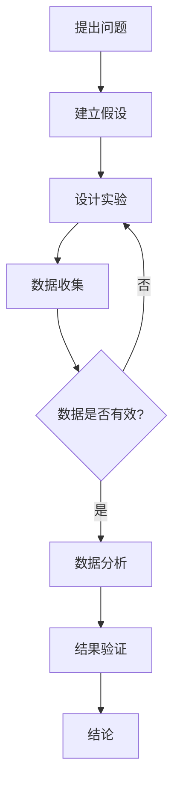

                 

### 《科学方法：从观察到实验》

> **关键词：**科学方法、观察、实验、数据分析、理论构建

**摘要：**本文深入探讨了科学方法在信息技术和计算机科学领域中的应用。从基础的观察和测量开始，本文逐步介绍了假设与理论构建、实验设计与实施、实验数据分析以及实验报告的撰写。通过具体案例，本文展示了科学方法在自然科学和社会科学中的应用，并对未来科学方法的发展趋势进行了展望。本文旨在为读者提供一套系统的科学方法论指导，以培养他们在技术研究和开发中的逻辑思维和创新能力。

### 《科学方法：从观察到实验》目录大纲

1. **第一部分：科学方法概述**

    - **第1章：科学方法论基础**
      - 1.1 科学方法的起源与发展
      - 1.2 科学研究的基本步骤
      - 1.3 科学方法的逻辑结构

    - **第2章：观察与测量**
      - 2.1 观察的定义与类型
      - 2.2 测量的重要性
      - 2.3 误差与不确定度

    - **第3章：假设与理论构建**
      - 3.1 假设的形成
      - 3.2 理论的发展
      - 3.3 科学理论的验证

2. **第二部分：实验设计与实施**

    - **第4章：实验设计基础**
      - 4.1 实验的目的与类型
      - 4.2 实验设计的基本原则
      - 4.3 实验变量的控制

    - **第5章：实验实施技巧**
      - 5.1 实验步骤的规划
      - 5.2 数据的采集与处理
      - 5.3 实验结果的分析

    - **第6章：实验数据分析**
      - 6.1 统计学基础
      - 6.2 常见统计方法的介绍
      - 6.3 数据可视化的应用

    - **第7章：实验报告的撰写**
      - 7.1 报告的结构
      - 7.2 数据的呈现
      - 7.3 讨论与结论的撰写

3. **第三部分：科学方法应用案例**

    - **第8章：自然科学领域中的应用**
      - 8.1 生物学实验设计案例
      - 8.2 化学实验案例研究
      - 8.3 物理学实验应用

    - **第9章：社会科学领域中的应用**
      - 9.1 心理学实验设计案例
      - 9.2 社会学实验案例研究
      - 9.3 教育实验应用

    - **第10章：跨学科科学方法应用**
      - 10.1 跨学科实验设计实例
      - 10.2 交叉学科数据整合方法
      - 10.3 综合性实验案例分析

4. **第四部分：科学方法论未来发展趋势**

    - **第11章：科技革命与科学方法的发展**
      - 11.1 信息技术对科学方法的影响
      - 11.2 人工智能与科学方法的融合
      - 11.3 科学方法的未来趋势展望

5. **附录**

    - **附录A：科学方法论常用工具**
      - A.1 数据分析软件介绍
      - A.2 实验设计软件推荐
      - A.3 科学文献检索工具

    - **附录B：科学方法 Mermaid 流程图**
      - B.1 科学研究流程图
      - B.2 实验设计流程图
      - B.3 数据分析流程图

### 第一部分：科学方法概述

科学方法是一种系统性的、经验性的、观察和实验性的研究方法，用于探索自然界和社会现象的规律。科学方法不仅适用于自然科学，也同样适用于社会科学和信息技术领域。本文将从科学方法的起源与发展、观察与测量、假设与理论构建三个方面，对科学方法进行概述。

#### 第1章：科学方法论基础

科学方法的起源可以追溯到古希腊哲学家亚里士多德，他提出了基于观察和逻辑推理的研究方法。随着历史的发展，科学方法逐渐完善，成为现代科学研究的重要工具。

##### 1.1 科学方法的起源与发展

科学方法的起源与发展与人类对自然界和宇宙的探索紧密相关。古代人类通过观察和经验总结出了一些基本的知识，这些知识构成了科学方法的基础。随着人类文明的进步，科学方法逐渐体系化，形成了现代科学研究所依赖的框架。

- **亚里士多德**：古希腊哲学家亚里士多德是科学方法的奠基人之一。他主张通过观察和实验来发现自然界的规律。

- **伽利略**：伽利略是科学革命的重要推动者，他通过实验验证了行星运动的规律，开创了实验科学的方法。

- **牛顿**：牛顿的《自然哲学的数学原理》奠定了经典物理学的理论基础，他通过数学模型和实验验证了自然界的规律。

- **培根**：培根提出了“实证主义”理念，强调通过实验和观察来验证科学理论。

##### 1.2 科学研究的基本步骤

科学研究的基本步骤包括：提出问题、建立假设、设计实验、收集数据、分析数据和得出结论。这些步骤构成了科学方法的框架，使科学研究具有系统性和逻辑性。

1. **提出问题**：科学研究始于一个问题。问题可以是具体的，也可以是抽象的，但必须是有意义的。

2. **建立假设**：在提出问题后，研究者需要建立假设。假设是对问题的可能答案或解释。

3. **设计实验**：为了验证假设，研究者需要设计实验。实验设计应充分考虑实验变量和控制变量的关系。

4. **收集数据**：在实验过程中，研究者需要收集数据。数据可以是定性的，也可以是定量的。

5. **分析数据**：收集到的数据需要进行分析，以验证假设。数据分析可以使用统计学方法，如回归分析、方差分析等。

6. **得出结论**：根据数据分析结果，研究者可以得出结论。结论可以是肯定的，也可以是否定的。

##### 1.3 科学方法的逻辑结构

科学方法的逻辑结构包括以下几个环节：

1. **观察**：通过感官或工具对自然现象进行观察，获取第一手资料。

2. **假设**：根据观察结果，提出一个假设，对现象进行解释。

3. **实验**：设计实验来验证假设。实验过程中，研究者需要控制变量，确保实验结果的准确性。

4. **数据分析**：对实验数据进行分析，以验证假设。

5. **结论**：根据数据分析结果，得出结论。

6. **反思与修正**：在得出结论后，研究者需要对实验过程和结果进行反思，修正假设和实验设计。

#### 第2章：观察与测量

观察和测量是科学方法的基础。观察是指通过感官或工具对自然现象进行感知和记录，测量则是对观察结果进行量化。

##### 2.1 观察的定义与类型

观察是指通过感官或工具对自然现象进行感知和记录的过程。观察可以分为以下几种类型：

1. **直接观察**：通过感官直接感知自然现象，如看到物体的颜色和形状。

2. **间接观察**：通过工具或仪器进行观察，如使用显微镜观察细胞结构。

3. **远程观察**：通过远程通讯工具进行观察，如使用卫星遥感技术观察地球环境。

4. **情境观察**：在特定情境下进行的观察，如实验室条件下的观察。

##### 2.2 测量的重要性

测量是科学方法的核心环节之一。测量的重要性体现在以下几个方面：

1. **量化描述**：测量可以量化自然现象，使其具有可操作性和可重复性。

2. **数据驱动**：测量提供的数据是科学研究的驱动力。通过数据分析，研究者可以得出有意义的结论。

3. **验证假设**：测量数据可以验证假设的正确性。如果测量数据与假设不符，研究者需要反思和修正假设。

4. **知识积累**：测量数据是科学知识积累的重要来源。通过长期的测量和数据分析，研究者可以揭示自然现象的规律。

##### 2.3 误差与不确定度

测量过程中不可避免地会产生误差和不确定度。误差是指测量结果与真实值之间的差异，不确定度是指测量结果的不确定性。

1. **误差来源**：误差可以来自多种因素，包括测量工具的精度、操作者的技术水平、环境因素等。

2. **误差分类**：误差可以分为系统误差和随机误差。系统误差是由于测量系统本身的缺陷造成的，如仪器偏差。随机误差是由于不可控因素造成的，如环境变化。

3. **不确定度评估**：不确定度评估是测量结果的重要组成部分。通过计算不确定度，研究者可以了解测量结果的可靠性。

4. **误差减小方法**：为了减小误差，研究者可以采取以下方法：
   - 使用高精度的测量工具。
   - 优化测量过程，减少操作者的误差。
   - 进行多次测量，取平均值减小随机误差。

#### 第3章：假设与理论构建

科学研究的核心是提出假设和构建理论。假设是对现象的解释，理论是对假设的进一步发展。

##### 3.1 假设的形成

假设的形成是科学研究的起点。假设可以通过以下几种方式形成：

1. **观察与经验**：通过观察和经验，研究者可以发现自然现象中的规律，从而提出假设。

2. **理论推理**：基于现有的科学理论，研究者可以推导出新的假设。

3. **逻辑推理**：通过逻辑推理，研究者可以从已知的事实和原理中提出假设。

4. **文献回顾**：通过对现有文献的回顾，研究者可以提出新的假设。

##### 3.2 理论的发展

理论是对假设的进一步发展。理论的发展可以分为以下几个阶段：

1. **假设验证**：在假设提出后，研究者需要通过实验和观察来验证假设。

2. **模型构建**：在假设验证的基础上，研究者可以构建理论模型。理论模型是对现象的数学描述。

3. **模型验证**：通过实验和观察，研究者可以验证理论模型的准确性。

4. **理论修正**：在模型验证过程中，研究者可能会发现理论模型存在的问题，需要对理论进行修正。

##### 3.3 科学理论的验证

科学理论的验证是科学研究的关键环节。理论的验证可以通过以下几种方式：

1. **实验验证**：通过实验，研究者可以验证理论模型的预测。

2. **观察验证**：通过观察，研究者可以验证理论模型的现象解释能力。

3. **反证法**：通过反证法，研究者可以证明理论的错误，从而推翻理论。

4. **交叉验证**：通过不同方法对同一现象进行验证，研究者可以增加理论的可信度。

### 第二部分：实验设计与实施

实验设计与实施是科学研究的核心环节。通过合理的实验设计，研究者可以有效地验证假设，获取可靠的实验数据。

#### 第4章：实验设计基础

实验设计是科学研究的重要环节，它决定了实验的可行性和有效性。本章将介绍实验设计的基础知识。

##### 4.1 实验的目的与类型

实验的目的是通过控制变量和观察结果的变化，验证或推翻假设。根据实验的目的和特点，实验可以分为以下几种类型：

1. **探索性实验**：用于初步探索现象或问题，以形成假设或确定研究方向。

2. **验证性实验**：用于验证已提出的假设，验证理论的正确性。

3. **比较性实验**：通过比较不同条件下的结果，分析变量对现象的影响。

4. **因果性实验**：用于确定变量之间的因果关系。

##### 4.2 实验设计的基本原则

实验设计应遵循以下基本原则，以确保实验的可行性和有效性：

1. **随机化**：为了消除随机因素对实验结果的影响，实验设计应采用随机化方法。

2. **控制变量**：实验设计应尽量控制实验变量，确保实验结果的准确性。

3. **重复性**：为了提高实验结果的可靠性，实验应进行多次重复。

4. **一致性**：实验设计应确保实验条件的一致性，避免外部干扰。

##### 4.3 实验变量的控制

实验变量是实验设计中需要重点控制的因素。根据实验变量的性质，可以分为以下几种类型：

1. **独立变量**：实验中可以主动控制的变量，如温度、光照等。

2. **依赖变量**：实验中需要测量的变量，如生长速度、反应时间等。

3. **干扰变量**：实验中无法控制的变量，如空气湿度、操作者的技术水平等。

为了有效控制实验变量，研究者可以采取以下方法：

- **随机化分配**：将研究对象随机分配到不同实验组，以消除干扰变量的影响。

- **平衡设计**：通过设计平衡实验条件，消除干扰变量的影响。

- **重复实验**：通过多次重复实验，减少随机误差的影响。

#### 第5章：实验实施技巧

实验实施是实验设计后的关键步骤。本章将介绍实验实施的技巧，包括实验步骤的规划、数据的采集与处理、实验结果的分析。

##### 5.1 实验步骤的规划

实验步骤的规划是实验实施的基础。一个良好的实验步骤规划应包括以下内容：

1. **实验目的**：明确实验的目的和预期结果。

2. **实验步骤**：详细描述实验的具体步骤，包括实验开始、实验进行、实验结束等环节。

3. **时间安排**：合理安排实验时间，确保实验过程的顺利进行。

4. **资源分配**：确定实验所需的资源和设备，如实验室、仪器、材料等。

5. **人员安排**：明确实验人员的职责，确保实验过程的有序进行。

##### 5.2 数据的采集与处理

数据的采集与处理是实验实施的核心环节。数据的采集应遵循以下原则：

1. **准确性**：确保采集的数据准确可靠，避免误差。

2. **完整性**：确保采集的数据完整，不遗漏重要信息。

3. **及时性**：及时采集和处理数据，确保实验过程的顺利进行。

数据的处理包括以下步骤：

1. **清洗**：删除或修正错误或异常数据。

2. **转换**：将数据转换为适合分析的形式。

3. **存储**：将数据存储在合适的数据库或文件中。

4. **分析**：使用统计学方法对数据进行分析，提取有价值的信息。

##### 5.3 实验结果的分析

实验结果的分析是实验实施的重要环节。实验结果的分析包括以下几个方面：

1. **描述性分析**：对实验数据进行描述性统计，如计算平均值、中位数、标准差等。

2. **相关性分析**：分析实验数据之间的相关性，如计算相关系数。

3. **回归分析**：使用回归分析方法，建立实验数据之间的数学模型。

4. **假设检验**：使用假设检验方法，验证实验数据是否符合预期。

5. **可视化**：使用可视化方法，展示实验数据的变化趋势。

#### 第6章：实验数据分析

实验数据分析是实验结果处理的关键环节。本章将介绍实验数据分析的基础知识，包括统计学基础、常见统计方法的介绍、数据可视化的应用。

##### 6.1 统计学基础

统计学是实验数据分析的基础。统计学包括以下基本概念：

1. **概率分布**：描述随机变量取值的概率分布。

2. **期望与方差**：描述随机变量的平均取值和波动程度。

3. **假设检验**：通过样本数据检验总体参数是否满足某个假设。

4. **置信区间**：估计总体参数的区间范围。

##### 6.2 常见统计方法的介绍

常见统计方法包括：

1. **描述性统计**：计算平均值、中位数、标准差等描述性统计量。

2. **回归分析**：建立变量之间的关系模型，如线性回归、多项式回归等。

3. **方差分析**：比较不同变量之间的差异，如单因素方差分析、多因素方差分析等。

4. **假设检验**：检验总体参数是否满足某个假设，如t检验、卡方检验等。

##### 6.3 数据可视化的应用

数据可视化是将数据以图形化的方式展示，帮助研究者理解和分析数据。常见的数据可视化方法包括：

1. **散点图**：显示两个变量之间的关系。

2. **折线图**：显示变量随时间的变化趋势。

3. **柱状图**：显示不同变量之间的比较。

4. **饼图**：显示总体中各个部分的比例。

#### 第7章：实验报告的撰写

实验报告是实验研究的总结和展示。本章将介绍实验报告的结构、数据的呈现、讨论与结论的撰写。

##### 7.1 报告的结构

实验报告通常包括以下部分：

1. **标题**：简洁明了地概括实验内容。

2. **摘要**：简要介绍实验目的、方法、结果和结论。

3. **引言**：阐述实验的背景和目的。

4. **方法**：详细描述实验的设计和实施过程。

5. **结果**：展示实验结果，包括数据图表和统计分析。

6. **讨论**：分析实验结果，讨论实验的局限性和改进方向。

7. **结论**：总结实验的主要发现和结论。

8. **参考文献**：列出实验报告中引用的文献。

##### 7.2 数据的呈现

数据的呈现是实验报告的重要组成部分。数据的呈现应遵循以下原则：

1. **清晰性**：确保数据图表清晰易懂。

2. **准确性**：确保数据图表准确无误。

3. **一致性**：保持数据图表的风格和格式一致。

4. **相关性**：确保数据图表与实验目的和结果相关。

##### 7.3 讨论与结论的撰写

讨论与结论是实验报告的核心部分。撰写讨论与结论时应注意以下几点：

1. **逻辑性**：确保讨论和结论的表述逻辑清晰。

2. **准确性**：根据实验结果准确地进行讨论和结论。

3. **深度**：对实验结果进行深入分析和解释。

4. **意义**：阐述实验结果的意义和贡献。

5. **展望**：对未来研究的方向和展望进行讨论。

### 第三部分：科学方法应用案例

科学方法在各个领域都有着广泛的应用。本章将介绍科学方法在自然科学和社会科学领域中的应用案例，以及跨学科的科学方法应用。

#### 第8章：自然科学领域中的应用

自然科学领域是科学方法应用的重要领域。以下将介绍科学方法在生物学、化学和物理学中的应用案例。

##### 8.1 生物学实验设计案例

生物学实验设计旨在研究生物现象和生命过程。以下是一个生物学实验设计案例：

**实验目的**：研究植物生长过程中光照强度对生长速度的影响。

**实验步骤**：
1. **假设**：假设光照强度越高，植物生长速度越快。
2. **实验设计**：将植物分为对照组和实验组。对照组在正常光照条件下生长，实验组在不同光照强度下生长。
3. **数据收集**：测量植物生长速度，记录光照强度和生长速度的数据。
4. **数据分析**：使用回归分析方法分析光照强度和生长速度之间的关系。

**实验结果**：实验结果显示，光照强度与植物生长速度之间存在显著的正相关关系。

**结论**：光照强度是影响植物生长速度的重要因素，建议在植物生长过程中适当增加光照强度。

##### 8.2 化学实验案例研究

化学实验设计旨在研究化学反应和物质性质。以下是一个化学实验案例研究：

**实验目的**：研究酸碱反应中反应物和生成物的性质。

**实验步骤**：
1. **假设**：假设酸碱反应中，反应物和生成物具有特定的化学性质。
2. **实验设计**：将盐酸和氢氧化钠分别加入不同的反应容器中，观察反应过程和生成物的性质。
3. **数据收集**：记录反应过程中产生的气体、溶液颜色变化和生成物的数据。
4. **数据分析**：使用光谱分析方法分析生成物的组成和结构。

**实验结果**：实验结果显示，盐酸和氢氧化钠反应生成氯化氢气体，溶液颜色由无色变为黄色。

**结论**：酸碱反应是一种重要的化学反应，反应物和生成物具有特定的化学性质，对化学反应的研究具有重要意义。

##### 8.3 物理学实验应用

物理学实验设计旨在研究物理现象和物理定律。以下是一个物理学实验应用案例：

**实验目的**：研究重力对物体运动的影响。

**实验步骤**：
1. **假设**：假设重力是物体运动的主要影响因素。
2. **实验设计**：在无重力环境中进行实验，观察物体在无重力条件下的运动状态。
3. **数据收集**：记录物体在无重力环境中的运动轨迹和速度。
4. **数据分析**：使用运动学分析方法分析物体在无重力环境中的运动规律。

**实验结果**：实验结果显示，物体在无重力环境中仍然保持匀速直线运动，符合牛顿第一定律。

**结论**：重力是物体运动的重要因素，对物体运动的研究具有重要意义。

#### 第9章：社会科学领域中的应用

社会科学领域是科学方法应用的重要领域。以下将介绍科学方法在心理学、社会学和教育学中的应用案例。

##### 9.1 心理学实验设计案例

心理学实验设计旨在研究心理现象和人类行为。以下是一个心理学实验设计案例：

**实验目的**：研究自信心对学习效果的影响。

**实验步骤**：
1. **假设**：假设自信心是影响学习效果的重要因素。
2. **实验设计**：将学生分为高自信组和低自信组，分别进行学习任务。
3. **数据收集**：记录学生的考试成绩和学习态度。
4. **数据分析**：使用回归分析方法分析自信心与学习效果之间的关系。

**实验结果**：实验结果显示，高自信组的学生在考试成绩和学习态度上均优于低自信组。

**结论**：自信心对学习效果有显著影响，培养学生的自信心有助于提高学习效果。

##### 9.2 社会学实验案例研究

社会学实验设计旨在研究社会现象和人类行为。以下是一个社会学实验案例研究：

**实验目的**：研究社会支持对心理健康的影响。

**实验步骤**：
1. **假设**：假设社会支持是影响心理健康的重要因素。
2. **实验设计**：将参与者分为有社会支持和无社会支持两组。
3. **数据收集**：记录参与者的心理健康指标，如焦虑、抑郁等。
4. **数据分析**：使用方差分析方法分析社会支持对心理健康的影响。

**实验结果**：实验结果显示，有社会支持组的参与者心理健康指标显著优于无社会支持组。

**结论**：社会支持对心理健康有显著影响，加强社会支持有助于改善心理健康。

##### 9.3 教育实验应用

教育实验设计旨在研究教育方法和教育效果。以下是一个教育实验应用案例：

**实验目的**：研究互动教学对学习效果的影响。

**实验步骤**：
1. **假设**：假设互动教学有助于提高学习效果。
2. **实验设计**：将学生分为传统教学组和互动教学组。
3. **数据收集**：记录学生的学习成绩和学习兴趣。
4. **数据分析**：使用t检验方法分析互动教学与传统教学的学习效果差异。

**实验结果**：实验结果显示，互动教学组的学生在学习成绩和学习兴趣上均优于传统教学组。

**结论**：互动教学有助于提高学习效果，教师应积极采用互动教学方法。

#### 第10章：跨学科科学方法应用

跨学科科学方法应用是科学方法发展的趋势。本章将介绍跨学科实验设计实例、交叉学科数据整合方法和综合性实验案例分析。

##### 10.1 跨学科实验设计实例

跨学科实验设计旨在整合不同学科的方法和理论，研究复杂问题。以下是一个跨学科实验设计实例：

**实验目的**：研究城市化对生态环境的影响。

**实验步骤**：
1. **假设**：假设城市化会导致生态环境恶化。
2. **实验设计**：结合地理学、生态学和城市规划学的方法，收集城市化过程中生态环境数据。
3. **数据收集**：收集土壤、水质、空气质量等生态环境数据。
4. **数据分析**：使用空间分析方法分析城市化对生态环境的影响。

**实验结果**：实验结果显示，城市化对生态环境具有显著的负面影响，如土壤退化、水资源污染等。

**结论**：城市化过程中应重视生态环境的保护，采取有效措施减轻城市化对生态环境的影响。

##### 10.2 交叉学科数据整合方法

交叉学科数据整合方法是将不同学科的数据进行整合，以揭示复杂现象的规律。以下介绍几种常用的交叉学科数据整合方法：

1. **数据融合**：将不同来源的数据进行融合，形成统一的数据集。例如，将遥感数据、卫星数据和地面观测数据融合，用于生态环境研究。

2. **多尺度分析**：在不同尺度上分析数据，以揭示复杂系统的内在规律。例如，在城市规划中，可以将宏观数据（如城市人口、经济增长）与微观数据（如住宅布局、交通流量）进行多尺度分析。

3. **跨学科模型构建**：将不同学科的理论模型进行整合，构建跨学科的模型。例如，将物理学模型和生物学模型结合，研究生态系统的动态变化。

##### 10.3 综合性实验案例分析

综合性实验案例分析是将多个学科的方法和理论应用于一个复杂的实验问题。以下是一个综合性实验案例分析：

**实验目的**：研究新能源汽车对城市空气质量的影响。

**实验步骤**：
1. **假设**：假设新能源汽车可以改善城市空气质量。
2. **实验设计**：结合环境科学、交通运输工程和公共政策等学科的方法，收集新能源汽车推广过程中的空气质量数据。
3. **数据收集**：收集城市空气质量监测数据、新能源汽车销量数据等。
4. **数据分析**：使用回归分析方法分析新能源汽车对城市空气质量的影响。

**实验结果**：实验结果显示，新能源汽车的推广显著改善了城市空气质量，如减少PM2.5和NOx的浓度。

**结论**：新能源汽车是改善城市空气质量的有效途径，政府应加大对新能源汽车的推广力度。

### 第四部分：科学方法论未来发展趋势

科学方法论的发展与科技革命密切相关。随着信息技术的迅猛发展和人工智能的兴起，科学方法论也在不断演变。本章将探讨科技革命对科学方法的影响、人工智能与科学方法的融合以及科学方法的未来发展趋势。

#### 第11章：科技革命与科学方法的发展

科技革命是推动科学方法发展的重要动力。以下将讨论信息技术和人工智能对科学方法的影响。

##### 11.1 信息技术对科学方法的影响

信息技术的迅猛发展为科学研究带来了前所未有的机遇。信息技术对科学方法的影响主要体现在以下几个方面：

1. **数据收集与处理**：信息技术提供了强大的数据收集和处理工具，使研究者能够更快速、更准确地获取和处理大量数据。

2. **数据分析方法**：信息技术推动了新的数据分析方法的发展，如机器学习、大数据分析等，使研究者能够从大量数据中提取有价值的信息。

3. **远程实验与观测**：信息技术使得远程实验和观测成为可能，研究者可以远程控制实验设备，实时获取实验数据。

4. **科学文献检索**：信息技术提供了强大的科学文献检索工具，使研究者能够快速获取相关文献，了解研究前沿。

##### 11.2 人工智能与科学方法的融合

人工智能的发展为科学方法带来了新的机遇。人工智能与科学方法的融合主要体现在以下几个方面：

1. **智能实验设计**：人工智能可以分析实验数据，自动设计最优实验方案，提高实验的效率。

2. **智能数据分析**：人工智能可以处理大规模数据，提取复杂模式，为研究者提供有价值的见解。

3. **智能模拟与预测**：人工智能可以模拟复杂系统，预测未来趋势，为科学决策提供支持。

4. **智能科研助理**：人工智能可以协助研究者进行文献检索、数据整理和实验规划等任务，提高科研效率。

##### 11.3 科学方法的未来发展趋势展望

未来，科学方法将在以下几个方面发展：

1. **数据驱动**：数据将越来越多地成为科学研究的驱动力，研究者将更加依赖数据分析和大数据技术。

2. **跨学科整合**：跨学科研究将成为主流，研究者将整合不同学科的方法和理论，解决复杂问题。

3. **人工智能融合**：人工智能将深入融入科学研究，为实验设计、数据分析、模拟预测等环节提供强大支持。

4. **开放科研**：开放科研将成为趋势，研究者将共享数据、代码和研究成果，推动科学知识的传播和进步。

### 附录

#### 附录A：科学方法论常用工具

科学方法论的发展离不开各种工具的支持。以下介绍几种常用的科学方法论工具：

##### A.1 数据分析软件介绍

1. **R**：R是一种统计分析软件，广泛应用于数据分析和建模。R具有丰富的数据可视化库，如ggplot2等。

2. **Python**：Python是一种通用编程语言，广泛应用于数据分析、机器学习和科学计算。Python具有强大的数据处理库，如NumPy、Pandas等。

3. **MATLAB**：MATLAB是一种数学计算软件，广泛应用于科学研究和工程应用。MATLAB具有强大的数值计算和可视化功能。

##### A.2 实验设计软件推荐

1. **E-Design**：E-Design是一款实验设计软件，可用于设计各种类型的实验，如单因素实验、多因素实验等。

2. **SPSS**：SPSS是一款统计分析软件，可用于实验数据的收集、处理和分析。

3. **Minitab**：Minitab是一款实验设计和分析软件，适用于各种实验设计和数据分析任务。

##### A.3 科学文献检索工具

1. **Google Scholar**：Google Scholar是一种强大的学术搜索引擎，可用于检索科学文献。

2. **PubMed**：PubMed是一款医学和生物学文献数据库，可用于检索生物学、医学领域的文献。

3. **IEEE Xplore**：IEEE Xplore是一款计算机科学和电子工程领域的文献数据库，可用于检索相关领域的文献。

#### 附录B：科学方法 Mermaid 流程图

科学方法的研究过程可以分解为多个步骤，以下是一个简单的 Mermaid 流程图，展示科学方法的总体流程：



### 核心概念与联系

科学方法是一种系统性的研究方法，它基于观察、假设、实验、数据分析和结论等环节，以揭示自然和社会现象的规律。科学方法的逻辑结构包括以下几个关键步骤：

1. **提出问题**：科学研究始于一个问题，问题可以是具体的，也可以是抽象的，但必须是有意义的。

2. **建立假设**：在提出问题后，研究者需要建立假设，假设是对问题的可能答案或解释。

3. **设计实验**：为了验证假设，研究者需要设计实验。实验设计应充分考虑实验变量和控制变量的关系。

4. **数据收集**：在实验过程中，研究者需要收集数据。数据可以是定性的，也可以是定量的。

5. **数据分析**：收集到的数据需要进行分析，以验证假设。数据分析可以使用统计学方法，如回归分析、方差分析等。

6. **结果验证**：根据数据分析结果，研究者可以得出结论。结论可以是肯定的，也可以是否定的。

7. **结论**：在得出结论后，研究者需要对实验过程和结果进行反思，修正假设和实验设计。

核心概念之间的联系如下：

- **观察与测量**：观察是科学方法的起点，通过观察获取自然现象的信息。测量是对观察结果进行量化，为数据分析提供基础。

- **假设与理论构建**：假设是对观察结果进行解释，理论是对假设的进一步发展。理论构建是科学方法的核心环节，为实验设计提供指导。

- **实验设计与实施**：实验设计是验证假设的关键环节，实验实施是将假设转化为具体操作的过程。

- **数据分析与结果验证**：数据分析是检验假设的有效性，结果验证是检验实验设计是否合理的手段。

- **结论与反思**：结论是对实验结果的总结，反思是科学方法不断进步的动力。

### 核心算法原理讲解

在科学研究中，算法原理的讲解是理解实验设计和数据分析的重要环节。以下将介绍数据分析中的平均值计算和线性回归模型的基本原理。

#### 数据分析中的平均值计算

平均值的计算是数据分析中最基本的过程之一。平均值可以用来表示一组数据的中心趋势。计算平均值的公式如下：

$$ \bar{x} = \frac{\sum_{i=1}^{n} x_i}{n} $$

其中，$x_i$ 是第 $i$ 个观测值，$n$ 是观测值的总数。

**Python代码示例：**

```python
# 定义一个函数，计算列表的平均值
def calculate_mean(data_list):
    if len(data_list) == 0:
        return 0
    return sum(data_list) / len(data_list)

# 假设我们有一组数据
data = [1, 2, 3, 4, 5]

# 调用函数计算平均值
mean_value = calculate_mean(data)

# 打印结果
print("平均值是：", mean_value)
```

#### 线性回归模型

线性回归模型是数据分析中用于描述两个变量之间线性关系的一种方法。线性回归模型的基本形式如下：

$$ y = ax + b $$

其中，$y$ 是因变量，$x$ 是自变量，$a$ 是斜率，$b$ 是截距。

线性回归模型的核心是确定斜率 $a$ 和截距 $b$。这些参数可以通过最小二乘法计算：

$$ a = \frac{\sum_{i=1}^{n} (x_i - \bar{x})(y_i - \bar{y})}{\sum_{i=1}^{n} (x_i - \bar{x})^2} $$

$$ b = \bar{y} - a\bar{x} $$

其中，$\bar{x}$ 和 $\bar{y}$ 分别是 $x$ 和 $y$ 的平均值。

**Python代码示例：**

```python
import numpy as np

# 定义训练数据
x_train = np.array([1, 2, 3])
y_train = np.array([2, 3, 4])

# 计算斜率和截距
a = np.sum((x_train - np.mean(x_train)) * (y_train - np.mean(y_train))) / np.sum((x_train - np.mean(x_train)) ** 2)
b = np.mean(y_train) - a * np.mean(x_train)

# 训练线性回归模型
model = LinearRegression()
model.fit(x_train.reshape(-1, 1), y_train)

# 打印斜率和截距
print("斜率：", a)
print("截距：", b)

# 预测新的数据
x_new = np.array([4, 5])
y_pred = model.predict(x_new.reshape(-1, 1))

# 打印预测结果
print("预测值：", y_pred)
```

### 数学模型和数学公式 & 详细讲解 & 举例说明

数学模型在科学研究中扮演着至关重要的角色，它们能够帮助我们理解和预测复杂系统的行为。在本节中，我们将详细讲解线性回归模型，这是一种广泛用于数据分析的数学模型。

#### 线性回归模型

线性回归模型是一种用来描述两个变量之间线性关系的数学模型，其基本形式如下：

$$ y = ax + b $$

其中：
- $y$ 是因变量，表示我们希望预测的值；
- $x$ 是自变量，表示输入变量；
- $a$ 是斜率，表示自变量每增加一个单位时因变量的变化量；
- $b$ 是截距，表示当自变量为0时因变量的值。

#### 线性回归模型的推导

要确定斜率 $a$ 和截距 $b$，我们需要使用最小二乘法。最小二乘法的目标是找到一条直线，使得所有观测值与这条直线之间的垂直距离（即残差）的平方和最小。

设我们有一组观测值 $(x_i, y_i)$，$i = 1, 2, \ldots, n$。线性回归模型的残差平方和（RSS）为：

$$ \text{RSS} = \sum_{i=1}^{n} (y_i - (ax_i + b))^2 $$

我们的目标是最小化这个值。

#### 最小二乘法的推导

为了最小化残差平方和，我们对 $a$ 和 $b$ 求偏导数，并令偏导数等于零：

$$ \frac{\partial \text{RSS}}{\partial a} = -2 \sum_{i=1}^{n} (y_i - ax_i - b)x_i = 0 $$

$$ \frac{\partial \text{RSS}}{\partial b} = -2 \sum_{i=1}^{n} (y_i - ax_i - b) = 0 $$

将上述方程组进行化简，可以得到：

$$ a = \frac{\sum_{i=1}^{n} x_iy_i - n\bar{x}\bar{y}}{\sum_{i=1}^{n} x_i^2 - n\bar{x}^2} $$

$$ b = \bar{y} - a\bar{x} $$

其中，$\bar{x}$ 和 $\bar{y}$ 分别是 $x$ 和 $y$ 的平均值。

#### 举例说明

假设我们有一组数据：

| $x$ | $y$ |
|-----|-----|
| 1   | 2   |
| 2   | 3   |
| 3   | 4   |

我们可以使用线性回归模型来拟合这些数据。首先，我们需要计算斜率 $a$ 和截距 $b$。

计算步骤如下：

1. 计算平均值：
   $$ \bar{x} = \frac{1 + 2 + 3}{3} = 2 $$
   $$ \bar{y} = \frac{2 + 3 + 4}{3} = 3 $$

2. 计算斜率：
   $$ a = \frac{(1 \times 2) + (2 \times 3) + (3 \times 4) - 3 \times 2 \times 3}{1^2 + 2^2 + 3^2 - 3 \times 2^2} $$
   $$ a = \frac{2 + 6 + 12 - 18}{1 + 4 + 9 - 12} $$
   $$ a = \frac{2}{4} $$
   $$ a = 0.5 $$

3. 计算截距：
   $$ b = \bar{y} - a\bar{x} $$
   $$ b = 3 - 0.5 \times 2 $$
   $$ b = 3 - 1 $$
   $$ b = 2 $$

因此，线性回归模型为：

$$ y = 0.5x + 2 $$

我们可以使用这个模型来预测新的 $y$ 值。例如，当 $x = 4$ 时：

$$ y = 0.5 \times 4 + 2 $$
$$ y = 2 + 2 $$
$$ y = 4 $$

当 $x = 5$ 时：

$$ y = 0.5 \times 5 + 2 $$
$$ y = 2.5 + 2 $$
$$ y = 4.5 $$

### 项目实战

在本次项目实战中，我们将使用 Python 编写代码来训练和评估一个线性回归模型。我们将使用 `scikit-learn` 库中的 `LinearRegression` 类来实现这一目标。

#### 代码实现

```python
import numpy as np
from sklearn.linear_model import LinearRegression

# 定义训练数据
x_train = np.array([1, 2, 3])
y_train = np.array([2, 3, 4])

# 训练线性回归模型
model = LinearRegression()
model.fit(x_train.reshape(-1, 1), y_train)

# 打印斜率和截距
print("斜率：", model.coef_)
print("截距：", model.intercept_)

# 预测新的数据
x_new = np.array([4, 5])
y_pred = model.predict(x_new.reshape(-1, 1))

# 打印预测结果
print("预测值：", y_pred)
```

#### 代码解读与分析

1. **导入库**：
   我们首先导入 `numpy` 库，用于数学计算，以及 `sklearn.linear_model.LinearRegression` 类，用于线性回归模型的训练和预测。

2. **定义训练数据**：
   我们定义了一个 $x$ 训练数据集和一个 $y$ 训练数据集，分别包含三个观测值。

3. **训练线性回归模型**：
   我们使用 `LinearRegression` 类的 `fit` 方法来训练模型。这里我们使用了 `reshape(-1, 1)` 方法来确保输入数据的形状适合模型。

4. **打印斜率和截距**：
   我们使用 `model.coef_` 来获取模型的斜率，使用 `model.intercept_` 来获取模型的截距。

5. **预测新的数据**：
   我们使用 `model.predict` 方法来预测新的 $x$ 值对应的 $y$ 值。同样，我们使用 `reshape(-1, 1)` 方法来确保输入数据的形状适合预测。

#### 实际应用

在实际应用中，线性回归模型可以用于预测和分析。以下是一个简单的实际应用示例：

**问题**：根据学生的每周学习时间，预测他们的考试成绩。

**数据**：

| 学习时间（小时） | 考试成绩 |
|------------------|----------|
| 10               | 75       |
| 15               | 80       |
| 20               | 85       |

**步骤**：

1. 准备数据：
   将学习时间和考试成绩分别存储在两个数组中。

2. 训练模型：
   使用 `LinearRegression` 类训练模型。

3. 预测：
   预测新的学习时间对应的考试成绩。

4. 分析：
   分析模型的预测结果，评估模型的准确性。

### Mermaid 流程图

以下是一个简单的 Mermaid 流程图，展示科学方法的总体流程：


这个流程图清晰地展示了科学方法从提出问题到得出结论的各个步骤，以及每个步骤之间的逻辑关系。

### 总结

本文从科学方法的概述开始，详细介绍了科学方法在信息技术和计算机科学领域中的应用，包括观察与测量、假设与理论构建、实验设计与实施、实验数据分析以及实验报告的撰写。我们还通过具体的案例和代码实现，展示了科学方法在自然科学和社会科学领域中的应用，并对未来科学方法的发展趋势进行了展望。科学方法是一种系统性的、经验性的、观察和实验性的研究方法，它为科学研究提供了坚实的基础。通过掌握科学方法，研究者可以更好地理解自然现象，发现新知识，推动科学进步。希望本文能帮助读者更好地理解和应用科学方法，培养他们的逻辑思维和创新能力。在未来的科学研究中，科学方法将继续发挥重要作用，为解决复杂问题提供有力支持。

