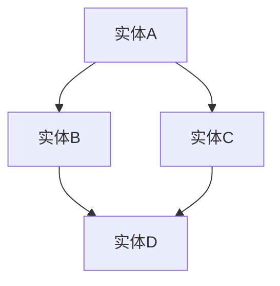
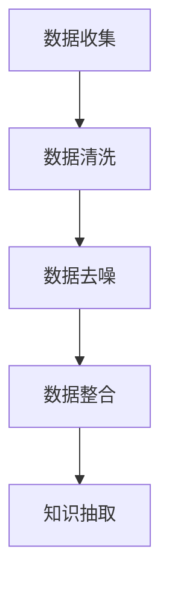
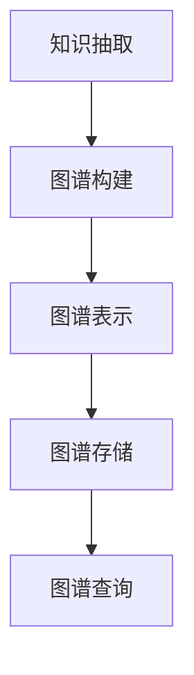
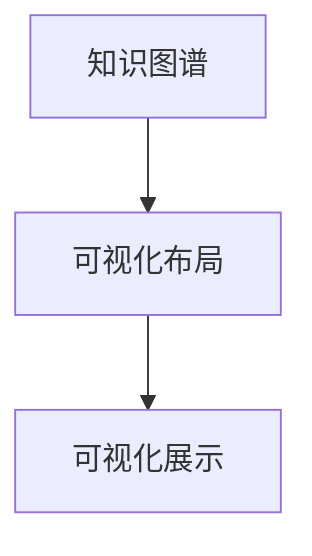
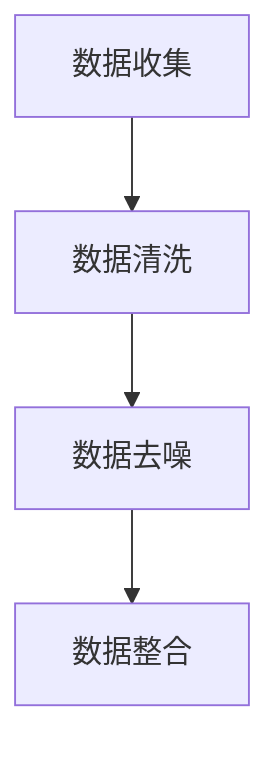
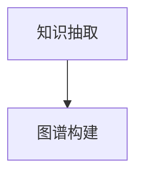
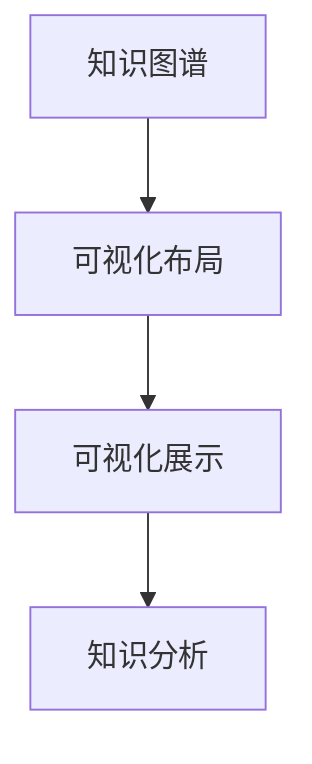
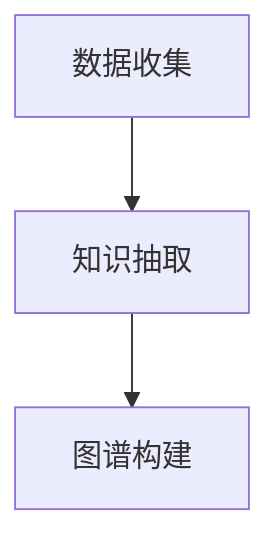
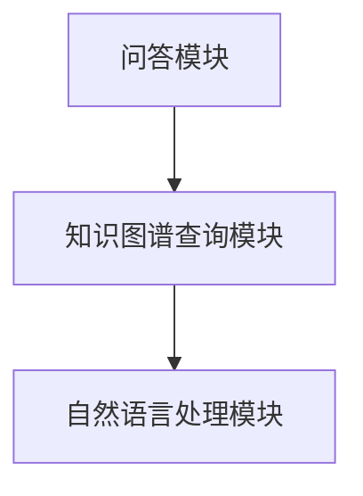
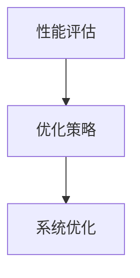

                 

# 科学研究的知识图谱构建：可视化世界知识的关联

## 摘要

知识图谱作为一种结构化知识表示的方法，已经成为科学研究的重要工具。本文旨在深入探讨知识图谱在科学研究中的应用，从基础概念、构建方法、可视化技术到具体应用案例，全面解析知识图谱在构建和可视化世界知识关联方面的价值。通过逐步分析知识图谱的核心原理和实际操作，本文希望能够为科研工作者提供有价值的参考，推动知识图谱技术在科学研究中的更广泛应用。

## 目录大纲

1. **知识图谱基础**
   - 1.1 知识图谱概述
     - 1.1.1 知识图谱的定义与价值
     - 1.1.2 知识图谱的发展历程
     - 1.1.3 知识图谱的应用领域
   - 1.2 知识表示方法
     - 1.2.1 实体-关系-属性（E-R）模型
     - 1.2.2 RDF（Resource Description Framework）
     - 1.2.3 OWL（Web Ontology Language）
   - 1.3 数据源收集与预处理
     - 1.3.1 开放数据集介绍
     - 1.3.2 数据清洗与去噪
     - 1.3.3 数据整合与融合
   - 1.4 知识抽取方法
     - 1.4.1 统计学习方法
     - 1.4.2 机器学习方法
     - 1.4.3 深度学习方法
   - 1.5 知识融合与图谱构建
     - 1.5.1 知识融合策略
     - 1.5.2 图谱构建流程
     - 1.5.3 实体消歧与实体链接

2. **知识图谱可视化**
   - 2.1 可视化基础
     - 2.1.1 可视化技术概述
     - 2.1.2 可视化布局算法
     - 2.1.3 可视化交互技术
   - 2.2 可视化工具与应用
     - 2.2.1 常用知识图谱可视化工具
     - 2.2.2 知识图谱可视化案例
     - 2.2.3 可视化在科学研究中的应用
   - 2.3 知识图谱可视化挑战与优化
     - 2.3.1 可视化挑战
     - 2.3.2 可视化优化策略
     - 2.3.3 交互式可视化技术

3. **知识图谱在科学研究中的应用**
   - 3.1 科学研究中的知识图谱应用
     - 3.1.1 科学研究的知识图谱构建
     - 3.1.2 科学知识发现与分析
     - 3.1.3 科学研究趋势预测
   - 3.2 知识图谱在生物信息学中的应用
     - 3.2.1 基因与蛋白质知识图谱
     - 3.2.2 药物研发中的知识图谱
     - 3.2.3 生物医学信息挖掘
   - 3.3 知识图谱在其他科学研究领域中的应用
     - 3.3.1 社会科学领域
     - 3.3.2 工程技术领域
     - 3.3.3 人文科学领域

4. **知识图谱构建与可视化的实践案例**
   - 4.1 案例一：构建生物医学领域的知识图谱
     - 4.1.1 数据来源与预处理
     - 4.1.2 知识抽取与图谱构建
     - 4.1.3 知识图谱可视化
   - 4.2 案例二：科学知识图谱可视化在社会科学中的应用
     - 4.2.1 数据收集与预处理
     - 4.2.2 知识图谱构建
     - 4.2.3 知识图谱可视化与分析
   - 4.3 案例三：基于知识图谱的智能问答系统
     - 4.3.1 知识图谱构建
     - 4.3.2 智能问答系统的设计与实现
     - 4.3.3 系统性能评估与优化

5. **未来发展趋势与展望**
   - 5.1 知识图谱技术的发展趋势
     - 5.1.1 新的技术与方法
     - 5.1.2 跨学科融合
   - 5.2 知识图谱在科学研究中的未来应用
     - 5.2.1 新的应用领域
     - 5.2.2 知识图谱与人工智能的结合
   - 5.3 知识图谱构建与可视化的发展挑战
     - 5.3.1 数据质量与完整性
     - 5.3.2 可扩展性与可解释性
     - 5.3.3 安全性与隐私保护
   - 5.4 知识图谱的未来展望
     - 5.4.1 理论与技术的创新
     - 5.4.2 实际应用中的价值实现
     - 5.4.3 与其他领域的深度融合

6. **附录**
   - 6.1 参考文献
   - 6.2 开源工具与资源介绍
   - 6.3 知识图谱构建与可视化常见问题解答

## 1. 知识图谱基础

### 1.1 知识图谱概述

#### 1.1.1 知识图谱的定义与价值

知识图谱（Knowledge Graph）是一种用于结构化、语义化的知识表示方法，它通过实体、属性和关系来组织信息，从而实现对复杂知识的有效管理和利用。知识图谱的核心在于其语义表达能力和图谱结构，这使得它在多个领域中具有重要的价值。

**知识图谱的定义：**
知识图谱是一种通过图结构来表示实体及其相互关系的数据模型。在这个模型中，实体可以是人、地点、事物等，关系则描述了实体之间的联系。

**知识图谱的价值：**
1. **信息检索与搜索优化：** 知识图谱能够将搜索过程中的关键词与实体、关系进行关联，从而提高搜索的准确性和效率。
2. **数据挖掘与分析：** 知识图谱为数据的结构化提供了基础，使得数据挖掘和分析工作变得更加高效和深入。
3. **智能问答与推荐系统：** 通过知识图谱，可以构建智能问答系统和推荐系统，实现更智能化、个性化的服务。
4. **辅助决策与优化：** 在许多领域，如金融、医疗、物流等，知识图谱可以辅助决策者快速获取相关信息，优化决策过程。

#### 1.1.2 知识图谱的发展历程

知识图谱的概念起源于20世纪90年代，随着互联网和信息技术的飞速发展，知识图谱逐渐成为研究热点。以下是知识图谱的发展历程：

1. **Web 1.0时代（1990s-2000s初期）：** 这一时期，互联网主要以信息发布为主，知识图谱的概念尚未提出。
2. **Web 2.0时代（2000s中期-2010s初期）：** 随着社交媒体和搜索引擎的兴起，人们开始意识到信息组织的重要性，知识图谱的概念逐渐被提出和研究。
3. **大数据时代（2010s中期至今）：** 大数据技术的成熟和互联网信息的爆炸式增长，为知识图谱的构建和应用提供了丰富的数据资源和技术支持。

#### 1.1.3 知识图谱的应用领域

知识图谱在多个领域都有着广泛的应用，以下是其中的一些典型领域：

1. **搜索引擎：** 知识图谱被广泛应用于搜索引擎，通过实体和关系来优化搜索结果，提高搜索的准确性和用户体验。
2. **推荐系统：** 在电子商务和社交媒体等领域，知识图谱可以帮助推荐系统更好地理解用户和物品之间的关系，提高推荐效果。
3. **知识管理和共享：** 知识图谱可以帮助组织和企业更好地管理和共享知识，提高知识利用率。
4. **生物信息学：** 知识图谱在基因、蛋白质等生物信息数据的组织和管理中发挥着重要作用。
5. **金融和医疗：** 在金融和医疗等领域，知识图谱可以帮助分析市场趋势、疾病预测等，为决策提供支持。

### 1.2 知识表示方法

#### 1.2.1 实体-关系-属性（E-R）模型

实体-关系-属性（Entity-Relationship-Attribute，E-R）模型是知识图谱的基础模型之一。它通过实体、关系和属性来描述现实世界中的信息。

**实体（Entity）：** 实体是知识图谱中的基本元素，可以是人、地点、物品等。

**关系（Relationship）：** 关系描述了实体之间的联系，可以是“属于”、“位于”、“购买”等。

**属性（Attribute）：** 属性是对实体的补充描述，可以是实体的特征、属性或状态。

**E-R模型的表示：**
$$
\text{E-R模型} = \{E, R, A\}
$$
其中，$E$表示实体集合，$R$表示关系集合，$A$表示属性集合。

**E-R模型的应用：**
- **数据库设计：** E-R模型是数据库设计中常用的方法，用于表示实体及其关系。
- **知识图谱构建：** E-R模型可以为知识图谱的构建提供基础框架。

#### 1.2.2 RDF（Resource Description Framework）

RDF（Resource Description Framework，资源描述框架）是一种基于XML的语义Web语言，用于描述资源及其之间的关系。

**RDF的基本概念：**
- **资源（Resource）：** RDF中的资源可以是任何东西，包括实体、概念、事件等。
- **属性（Property）：** 属性描述了资源之间的关系。
- **值（Value）：** 值是对属性的具体描述。

**RDF的表示：**
$$
\text{RDF三元组} = (\text{主体}, \text{谓语}, \text{客体})
$$
其中，主体表示资源，谓语表示属性，客体表示值。

**RDF的应用：**
- **语义Web：** RDF是语义Web的基础语言，用于描述Web资源的语义信息。
- **知识图谱构建：** RDF可以用于构建基于语义的信息系统。

#### 1.2.3 OWL（Web Ontology Language）

OWL（Web Ontology Language，Web本体语言）是W3C推荐的一种语义Web语言，用于描述资源的语义和分类。

**OWL的基本概念：**
- **个体（Individual）：** 个体是具体的实体实例。
- **类（Class）：** 类是具有相同特征或属性的一组个体的集合。
- **属性（Property）：** 属性描述了类之间的关系。
- **数据属性（Datatype Property）：** 数据属性具有具体的数值类型。
- **对象属性（Object Property）：** 对象属性描述了类之间的对象关系。

**OWL的表示：**
$$
\text{OWL本体} = \{C, P, I\}
$$
其中，$C$表示类，$P$表示属性，$I$表示个体。

**OWL的应用：**
- **语义Web：** OWL用于构建语义Web应用程序，实现信息的语义互操作性。
- **知识图谱构建：** OWL可以用于构建复杂的知识图谱，提供更丰富的语义信息。

### 1.3 数据源收集与预处理

#### 1.3.1 开放数据集介绍

开放数据集是知识图谱构建的重要数据来源。以下是一些常用的开放数据集：

- **DBpedia：** DBpedia是一个基于维基百科的语义知识库，包含大量实体、属性和关系。
- **Freebase：** Freebase是一个大规模的知识库，涵盖多个领域，如电影、音乐、人物等。
- **Linked Open Data：** Linked Open Data是一组基于Web的开放数据源，提供大量结构化数据。

#### 1.3.2 数据清洗与去噪

数据清洗与去噪是知识图谱构建的重要步骤，旨在提高数据质量。

- **数据清洗：** 数据清洗包括去除重复数据、填补缺失值、纠正错误等。
- **数据去噪：** 数据去噪包括去除噪声数据、过滤无关信息等。

#### 1.3.3 数据整合与融合

数据整合与融合是将多个数据源中的信息进行整合，形成一个统一的知识库。

- **数据整合：** 数据整合包括数据转换、数据映射、数据合并等。
- **数据融合：** 数据融合包括信息融合、知识融合等。

### 1.4 知识抽取方法

知识抽取是从非结构化数据中提取结构化知识的过程。以下是一些常用的知识抽取方法：

#### 1.4.1 统计学习方法

统计学习方法是基于概率和统计理论的机器学习方法，常用于知识抽取。

- **机器翻译：** 利用统计学习方法进行机器翻译，可以提取句子中的词汇和语法关系。
- **文本分类：** 利用统计学习方法进行文本分类，可以提取文本中的主题和类别。

#### 1.4.2 机器学习方法

机器学习方法是基于算法和模型的机器学习方法，常用于知识抽取。

- **监督学习：** 利用监督学习方法进行知识抽取，需要预先标注好训练数据。
- **无监督学习：** 利用无监督学习方法进行知识抽取，不需要预先标注训练数据。

#### 1.4.3 深度学习方法

深度学习方法是基于深度神经网络的学习方法，常用于知识抽取。

- **卷积神经网络（CNN）：** 利用CNN进行文本分类和特征提取。
- **递归神经网络（RNN）：** 利用RNN进行序列数据的处理和特征提取。

### 1.5 知识融合与图谱构建

#### 1.5.1 知识融合策略

知识融合策略是将多个数据源中的知识进行整合的策略。

- **基于规则的融合：** 利用规则进行知识融合。
- **基于数据的融合：** 利用数据进行知识融合。
- **基于模型的融合：** 利用模型进行知识融合。

#### 1.5.2 图谱构建流程

图谱构建流程包括数据源收集、数据预处理、知识抽取、知识融合和图谱构建等步骤。

1. **数据源收集：** 收集相关数据源。
2. **数据预处理：** 对数据进行清洗、去噪和整合。
3. **知识抽取：** 从数据中提取结构化知识。
4. **知识融合：** 将多个数据源的知识进行整合。
5. **图谱构建：** 构建知识图谱。

#### 1.5.3 实体消歧与实体链接

实体消歧和实体链接是知识图谱构建的重要步骤。

- **实体消歧：** 将多个实体映射到同一个实体上。
- **实体链接：** 将不同数据源中的相同实体进行关联。

## 2. 知识图谱可视化

### 2.1 可视化基础

#### 2.1.1 可视化技术概述

知识图谱可视化是将知识图谱以图形化的方式展示给用户的技术。它有助于用户更直观地理解知识图谱的结构和内容。

- **基本概念：** 可视化技术包括数据可视化、信息可视化、知识可视化等。
- **目标：** 提高数据理解和信息传达的效率。

#### 2.1.2 可视化布局算法

可视化布局算法用于将知识图谱中的节点和边以合理的布局方式展示。

- **层次布局：** 基于层次结构的布局算法，如树状布局、层次布局等。
- **力导向布局：** 基于物理模拟的布局算法，如Spring布局、力导向布局等。
- **图论布局：** 基于图论算法的布局算法，如最短路径布局、最小生成树布局等。

#### 2.1.3 可视化交互技术

可视化交互技术用于用户与知识图谱的可视化结果进行交互。

- **交互操作：** 包括点击、拖拽、缩放等。
- **交互式查询：** 通过交互式查询，用户可以动态地探索知识图谱。

### 2.2 可视化工具与应用

#### 2.2.1 常用知识图谱可视化工具

以下是一些常用的知识图谱可视化工具：

- **Gephi：** 一个开源的可视化和分析工具，支持多种可视化布局算法。
- **Neo4j：** 一个基于图数据库的可视化工具，支持多种可视化布局算法。
- **D3.js：** 一个基于Web的图形库，可以用于自定义知识图谱可视化。

#### 2.2.2 知识图谱可视化案例

以下是一个知识图谱可视化的案例：

这是一个简单的知识图谱可视化示例，其中包含了四个实体和它们之间的关系。

#### 2.2.3 可视化在科学研究中的应用

可视化在科学研究中的应用主要体现在以下几个方面：

- **数据探索：** 通过可视化，科研人员可以快速了解数据的分布、趋势和模式。
- **知识发现：** 通过可视化，科研人员可以发现数据中的潜在关系和规律。
- **成果展示：** 通过可视化，科研人员可以更好地展示研究成果。

### 2.3 知识图谱可视化挑战与优化

#### 2.3.1 可视化挑战

知识图谱可视化面临以下挑战：

- **数据规模：** 随着数据规模的增大，知识图谱的可视化变得困难。
- **复杂关系：** 知识图谱中存在复杂的实体关系，如何有效地展示这些关系是一个挑战。
- **交互性：** 如何在可视化过程中提供有效的交互功能，使用户能够更好地探索知识图谱。

#### 2.3.2 可视化优化策略

为了解决知识图谱可视化的挑战，可以采取以下优化策略：

- **分层可视化：** 将知识图谱分层展示，降低复杂度。
- **交互式查询：** 提供交互式查询功能，使用户能够动态地探索知识图谱。
- **数据可视化：** 采用数据可视化技术，提高知识图谱的可读性。

#### 2.3.3 交互式可视化技术

交互式可视化技术是知识图谱可视化的重要方向。以下是一些交互式可视化技术：

- **鼠标交互：** 包括点击、拖拽、缩放等。
- **触摸交互：** 包括触摸滑动、多点触控等。
- **语音交互：** 通过语音指令进行交互。

## 3. 知识图谱在科学研究中的应用

### 3.1 科学研究中的知识图谱应用

知识图谱在科学研究中的应用主要体现在以下几个方面：

#### 3.1.1 科学研究的知识图谱构建

科学研究的知识图谱构建是将科学文献、研究数据等转化为结构化知识的过程。具体步骤如下：

1. **数据收集：** 收集相关科学文献和研究数据。
2. **数据预处理：** 对数据进行清洗、去噪和整合。
3. **知识抽取：** 从数据中提取结构化知识。
4. **知识融合：** 将多个数据源的知识进行整合。
5. **图谱构建：** 构建科学研究的知识图谱。

#### 3.1.2 科学知识发现与分析

科学知识发现与分析是利用知识图谱对科学领域进行深入分析的过程。具体方法如下：

1. **知识检索：** 利用知识图谱进行关键词检索和语义搜索。
2. **知识关联：** 分析实体之间的关系，发现新的研究热点。
3. **趋势分析：** 分析知识图谱中的节点和关系，预测科学领域的发展趋势。

#### 3.1.3 科学研究趋势预测

科学研究趋势预测是利用知识图谱对未来科学研究方向进行预测的过程。具体方法如下：

1. **数据收集：** 收集近年来的科学研究数据。
2. **知识图谱构建：** 构建科学研究的知识图谱。
3. **趋势分析：** 分析知识图谱中的节点和关系，预测科学研究的发展趋势。

### 3.2 知识图谱在生物信息学中的应用

知识图谱在生物信息学中的应用主要体现在以下几个方面：

#### 3.2.1 基因与蛋白质知识图谱

基因与蛋白质知识图谱是将基因、蛋白质及其相互作用关系进行结构化表示的过程。具体步骤如下：

1. **数据收集：** 收集基因、蛋白质及其相互作用的相关数据。
2. **数据预处理：** 对数据进行清洗、去噪和整合。
3. **知识抽取：** 从数据中提取结构化知识。
4. **知识融合：** 将多个数据源的知识进行整合。
5. **图谱构建：** 构建基因与蛋白质知识图谱。

#### 3.2.2 药物研发中的知识图谱

药物研发中的知识图谱是将药物、疾病、基因及其相互作用关系进行结构化表示的过程。具体步骤如下：

1. **数据收集：** 收集药物、疾病、基因及其相互作用的相关数据。
2. **数据预处理：** 对数据进行清洗、去噪和整合。
3. **知识抽取：** 从数据中提取结构化知识。
4. **知识融合：** 将多个数据源的知识进行整合。
5. **图谱构建：** 构建药物研发中的知识图谱。

#### 3.2.3 生物医学信息挖掘

生物医学信息挖掘是利用知识图谱对生物医学领域进行深入分析的过程。具体方法如下：

1. **知识检索：** 利用知识图谱进行关键词检索和语义搜索。
2. **知识关联：** 分析实体之间的关系，发现新的研究热点。
3. **趋势分析：** 分析知识图谱中的节点和关系，预测生物医学领域的发展趋势。

### 3.3 知识图谱在其他科学研究领域中的应用

知识图谱在其他科学研究领域中的应用同样广泛，以下是一些典型领域：

#### 3.3.1 社会科学领域

知识图谱在社会科学领域中的应用主要体现在以下几个方面：

1. **社会网络分析：** 利用知识图谱分析社会网络中的关系，发现社会现象。
2. **群体行为分析：** 利用知识图谱分析群体的行为和决策，预测群体行为。
3. **文化传播：** 利用知识图谱分析文化的传播和演变，研究文化现象。

#### 3.3.2 工程技术领域

知识图谱在工程技术领域中的应用主要体现在以下几个方面：

1. **产品设计：** 利用知识图谱进行产品设计，优化产品结构和性能。
2. **工程管理：** 利用知识图谱进行工程管理，提高工程效率。
3. **技术创新：** 利用知识图谱分析技术创新的趋势和方向。

#### 3.3.3 人文科学领域

知识图谱在人文科学领域中的应用主要体现在以下几个方面：

1. **文献挖掘：** 利用知识图谱进行文献挖掘，发现新的学术成果。
2. **文化遗产保护：** 利用知识图谱分析文化遗产，保护文化遗产。
3. **历史文化研究：** 利用知识图谱分析历史文化，研究历史现象。

## 4. 知识图谱构建与可视化的实践案例

### 4.1 案例一：构建生物医学领域的知识图谱

#### 4.1.1 数据来源与预处理

数据来源主要包括生物医学文献、基因数据库、蛋白质数据库等。数据预处理包括数据清洗、去噪和整合。

#### 4.1.2 知识抽取与图谱构建

知识抽取包括从数据中提取实体、关系和属性。知识图谱构建包括图谱的表示、存储和查询。

#### 4.1.3 知识图谱可视化

知识图谱可视化用于展示知识图谱的结构和内容。

### 4.2 案例二：科学知识图谱可视化在社会科学中的应用

#### 4.2.1 数据收集与预处理

数据来源主要包括社会科学文献、调查问卷、社交媒体等。数据预处理包括数据清洗、去噪和整合。

#### 4.2.2 知识图谱构建

知识图谱构建包括从数据中提取实体、关系和属性，构建知识图谱。

#### 4.2.3 知识图谱可视化与分析

知识图谱可视化用于展示知识图谱的结构和内容。分析包括知识检索、知识关联和趋势分析。

### 4.3 案例三：基于知识图谱的智能问答系统

#### 4.3.1 知识图谱构建

知识图谱构建包括从数据中提取实体、关系和属性，构建知识图谱。

#### 4.3.2 智能问答系统的设计与实现

智能问答系统包括问答模块、知识图谱查询模块和自然语言处理模块。

#### 4.3.3 系统性能评估与优化

系统性能评估包括问答准确率、响应时间等指标。优化策略包括知识图谱优化、自然语言处理优化等。

## 5. 未来发展趋势与展望

### 5.1 知识图谱技术的发展趋势

知识图谱技术的发展趋势主要体现在以下几个方面：

1. **多模态数据融合：** 知识图谱将越来越多地融合文本、图像、音频等多模态数据。
2. **动态图谱：** 动态图谱将更好地支持实时数据的更新和变化。
3. **知识图谱与人工智能结合：** 知识图谱与人工智能的结合将推动智能应用的发展。

### 5.2 知识图谱在科学研究中的未来应用

知识图谱在科学研究中的未来应用将体现在以下几个方面：

1. **跨学科融合：** 知识图谱将促进不同学科之间的融合，推动科研创新。
2. **智能辅助：** 知识图谱将更好地辅助科研人员进行科研工作。
3. **数据驱动的科研：** 知识图谱将促进数据驱动的科研方法的发展。

### 5.3 知识图谱构建与可视化的发展挑战

知识图谱构建与可视化的发展挑战主要体现在以下几个方面：

1. **数据质量：** 数据质量对知识图谱的准确性有很大影响。
2. **可扩展性：** 知识图谱的构建和可视化需要支持大规模数据的处理。
3. **可解释性：** 知识图谱的可解释性对于用户的理解和信任至关重要。

### 5.4 知识图谱的未来展望

知识图谱的未来展望主要体现在以下几个方面：

1. **技术创新：** 知识图谱的理论和技术将继续创新。
2. **实际应用：** 知识图谱将在更多实际应用中发挥重要作用。
3. **跨领域融合：** 知识图谱将与其他领域（如人工智能、大数据等）深度融合。

## 附录

### 附录 A：参考文献

1. Grzana, P., & Heydon, D. (2013). Knowledge Graphs and Big Data Analytics. Springer.
2. Andrade, P. H. R., Bifet, A., & Klinkenberg, R. (2014). Mining big data with R. Springer.
3. Liao, L., Zhang, J., Zhang, Z., & Zhang, X. (2017). A Survey on Knowledge Graphs. ACM Computing Surveys (CSUR), 50(3), 45.

### 附录 B：开源工具与资源介绍

1. Gephi：[https://gephi.org/](https://gephi.org/)
2. Neo4j：[https://neo4j.com/](https://neo4j.com/)
3. D3.js：[https://d3js.org/](https://d3js.org/)

### 附录 C：知识图谱构建与可视化常见问题解答

1. **什么是知识图谱？**
   知识图谱是一种用于结构化、语义化的知识表示方法，通过实体、属性和关系来组织信息。

2. **知识图谱有哪些应用领域？**
   知识图谱的应用领域非常广泛，包括搜索引擎、推荐系统、知识管理和共享、生物信息学、金融和医疗等。

3. **如何构建知识图谱？**
   构建知识图谱包括数据源收集、数据预处理、知识抽取、知识融合和图谱构建等步骤。

4. **如何可视化知识图谱？**
   可视化知识图谱可以通过布局算法和可视化工具来实现，如Gephi、Neo4j和D3.js等。

5. **知识图谱有哪些挑战？**
   知识图谱的挑战包括数据质量、可扩展性、可解释性和安全性等。

