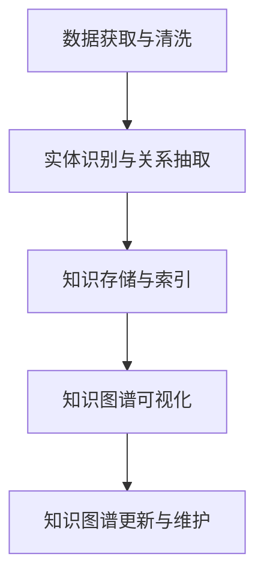

                 

# 《科学研究的知识图谱：可视化世界可理解性》

> **关键词：** 知识图谱、可视化、科学研究、数据整合、跨学科研究、实体识别、关系抽取、图数据库、人工智能、多模态知识图谱、数据隐私、伦理问题。

> **摘要：** 本文深入探讨了知识图谱在科学研究中的应用及其重要性。首先，我们介绍了知识图谱的基本概念、重要性及其在科学研究中的作用。接着，详细阐述了知识图谱构建的技术方法，包括数据来源、实体识别与关系抽取、知识图谱的存储与索引以及更新与维护。随后，我们探讨了知识图谱的可视化技术，包括可视化设计原则、常见可视化方法以及相关工具与平台。最后，我们通过多个实际应用案例展示了知识图谱在生物信息学、社会科学、信息检索及其他领域的研究成果。文章最后对未来知识图谱与可视化技术的发展趋势及挑战进行了展望。

### 第一部分：导论

#### 1. 知识图谱的基本概念与重要性

##### 1.1 知识图谱的定义与起源

知识图谱（Knowledge Graph）是一种用于表示实体（如人、地点、组织等）及其之间关系的图形结构。它将各种数据源中的信息进行整合，形成一个语义丰富的知识库。知识图谱的概念最早由Google提出，用于优化其搜索引擎的搜索结果。Google通过构建一个大规模的知识图谱，将网页中的实体与实体之间的关系进行关联，从而提供更加准确和相关的搜索结果。

知识图谱的起源可以追溯到语义网（Semantic Web）的概念。语义网是由World Wide Web Consortium（W3C）提出的，旨在通过引入语义信息，使得Web上的信息更加结构化和机器可读。知识图谱是语义网的一个重要组成部分，它通过将数据源中的信息进行语义关联，使得信息更加丰富和有用。

##### 1.2 知识图谱在科学研究中的作用

知识图谱在科学研究中的作用日益凸显，主要体现在以下几个方面：

1. **数据整合与关联**：知识图谱通过将不同来源的数据进行整合和关联，形成一个统一的视图，使得研究人员可以更方便地访问和使用这些数据。这对于跨学科研究尤为重要，因为它能够消除学科之间的壁垒，促进知识的整合和共享。

2. **提高研究效率**：知识图谱能够提供实时的、语义丰富的数据查询服务，使得研究人员可以快速获取所需的信息。这种高效的查询能力有助于加速科学研究的进程，提高研究效率。

3. **促进跨学科研究**：知识图谱通过整合不同学科领域的知识，为跨学科研究提供了有力的支持。它能够揭示不同学科领域之间的关联，促进学科的交叉与融合，从而推动科学的发展。

4. **辅助科学决策**：知识图谱能够提供丰富的背景知识和相关信息，帮助科学家做出更科学的决策。例如，在药物研发过程中，知识图谱可以帮助研究人员快速了解某种药物的副作用、适应症等信息，从而做出更合理的决策。

##### 1.3 可视化在知识图谱中的作用

可视化是知识图谱的重要组成部分，它能够将抽象的图形结构转化为直观的图像，使得研究人员能够更轻松地理解和分析知识图谱。可视化在知识图谱中的作用主要包括以下几个方面：

1. **提高可理解性**：通过可视化，研究人员可以直观地看到实体之间的关系，从而更好地理解知识图谱的结构和内容。

2. **发现新知识**：可视化有助于研究人员发现知识图谱中潜在的关联和规律，从而推动新的科学发现。

3. **支持决策**：可视化能够将复杂的知识图谱信息转化为易于理解的形式，为科学决策提供支持。

4. **促进知识传播**：通过可视化，研究人员可以更轻松地将知识图谱分享给非专业人士，促进知识的传播和普及。

### 第二部分：知识图谱构建技术

#### 2. 知识图谱构建技术

知识图谱的构建是一个复杂的过程，涉及多个技术环节。下面我们将详细探讨知识图谱构建的关键技术，包括数据来源、实体识别与关系抽取、知识图谱的存储与索引以及更新与维护。

##### 2.1 知识图谱数据来源

知识图谱的数据来源可以分为结构化数据、半结构化数据和非结构化数据。常见的知识图谱数据来源包括：

1. **结构化数据**：如关系数据库、表格数据等。这些数据通常具有固定的数据格式和结构，便于处理和整合。

2. **半结构化数据**：如XML、JSON等格式。这类数据具有部分结构化特性，但与结构化数据相比，其结构较为灵活。

3. **非结构化数据**：如图像、文本、音频、视频等。这类数据通常没有固定的结构，需要通过特定的算法进行提取和处理。

在构建知识图谱时，首先需要收集和整合这些数据源，形成一个统一的数据集。接下来，对这些数据进行清洗、预处理，以确保数据质量。

##### 2.2 实体识别与关系抽取

实体识别（Entity Recognition）和关系抽取（Relationship Extraction）是知识图谱构建的核心步骤。实体识别旨在识别文本中的实体，如人名、地名、组织名等；关系抽取则旨在识别实体之间的关系，如“张三工作是程序员”、“清华大学位于北京”等。

1. **实体识别算法**：常见的实体识别算法包括基于规则的方法、基于统计的方法和基于深度学习的方法。基于规则的方法通过预定义的规则进行实体识别，适用于规则明确、实体数量有限的场景。基于统计的方法通过统计文本特征进行实体识别，适用于大规模文本数据。基于深度学习的方法，如卷积神经网络（CNN）、递归神经网络（RNN）等，具有更高的识别精度和泛化能力。

2. **关系抽取算法**：关系抽取算法通常分为基于规则的方法和基于监督学习的方法。基于规则的方法通过预定义的规则进行关系抽取，适用于规则明确、关系数量有限的场景。基于监督学习的方法通过大量标注数据进行训练，能够自动识别文本中的关系。

##### 2.3 知识图谱的存储与索引

知识图谱的存储与索引是知识图谱构建的重要环节。常见的知识图谱存储技术包括图数据库和关系数据库。图数据库（如Neo4j、Titan等）具有高效、灵活的存储和查询能力，适用于大规模、复杂的知识图谱。关系数据库（如MySQL、PostgreSQL等）则适用于结构化数据存储。

1. **图数据库的选择**：在选择图数据库时，需要考虑以下几个方面：数据规模、查询性能、扩展性、社区支持等。

2. **索引结构的设计与优化**：为了提高知识图谱的查询效率，需要对知识图谱进行索引。常见的索引结构包括B+树、哈希索引、全文索引等。在索引设计时，需要考虑查询需求、数据规模和存储空间等因素。

##### 2.4 知识图谱的更新与维护

知识图谱的更新与维护是知识图谱长期运行的关键。在知识图谱的使用过程中，数据会不断更新和变化，需要定期进行数据清洗、关系更新和实体合并等操作。

1. **更新策略**：知识图谱的更新策略包括增量更新和全量更新。增量更新只对发生变更的部分进行更新，适用于实时性要求较高的场景。全量更新则对整个知识图谱进行重新构建，适用于数据更新不频繁的场景。

2. **维护方法**：知识图谱的维护方法包括手动维护和自动化维护。手动维护适用于数据量较小、变化较快的场景。自动化维护通过构建相应的维护系统，实现数据的自动化更新和清洗，适用于大规模、复杂的知识图谱。

### 第三部分：知识图谱可视化技术

#### 3. 知识图谱可视化技术

知识图谱可视化是将抽象的知识图谱转化为直观的图像，帮助研究人员更好地理解和分析知识图谱。下面我们将讨论知识图谱可视化技术，包括可视化设计原则、常见可视化方法以及相关工具与平台。

##### 3.1 可视化设计原则

知识图谱可视化设计需要遵循以下原则：

1. **可理解性**：可视化设计应确保用户能够轻松理解知识图谱的结构和内容。

2. **可访问性**：可视化设计应考虑到不同用户的能力和设备，确保所有人都能访问和理解知识图谱。

3. **交互性**：可视化设计应提供交互功能，如放大、缩小、过滤等，以帮助用户更深入地分析知识图谱。

4. **美观性**：可视化设计应注重视觉效果，以提升用户体验。

##### 3.2 常见可视化方法

常见的知识图谱可视化方法包括：

1. **图形表示**：通过节点和边来表示实体和关系，是知识图谱可视化的基本方法。

2. **网格布局**：将实体按照一定的网格布局排列，适用于实体数量较多的场景。

3. **矩阵表示**：通过矩阵形式展示实体之间的关系，适用于关系密集的知识图谱。

##### 3.3 可视化工具与平台

知识图谱可视化工具与平台众多，包括开源工具和商业平台。以下是几个常用的知识图谱可视化工具和平台：

1. **开源工具**：如GraphViz、D3.js等，适用于自定义可视化需求。

2. **商业平台**：如Tableau、Power BI等，提供丰富的可视化模板和功能。

3. **案例介绍**：以社交网络分析为例，展示知识图谱可视化在实际应用中的效果和优势。

### 第四部分：知识图谱在实际研究中的应用

#### 4. 知识图谱在科学研究中的应用案例

知识图谱在科学研究中的应用日益广泛，涵盖了多个领域。下面我们通过具体案例来展示知识图谱在实际研究中的应用。

##### 4.1 生物信息学中的应用

在生物信息学中，知识图谱广泛应用于蛋白质功能预测、药物研发等领域。

1. **蛋白质功能预测**：通过构建蛋白质-蛋白质相互作用知识图谱，研究人员可以识别蛋白质之间的潜在功能关系，从而预测蛋白质的功能。

2. **药物研发**：知识图谱可以整合药物靶点、疾病机制等信息，为药物研发提供有力支持。例如，通过构建药物-靶点-疾病知识图谱，研究人员可以识别新的药物靶点，加快药物研发进程。

##### 4.2 社会科学中的应用

在社会科学中，知识图谱广泛应用于社交网络分析、市场营销分析等领域。

1. **社交网络分析**：知识图谱可以揭示社交网络中的关系结构，帮助研究人员分析社交网络的传播机制和影响力。

2. **市场营销分析**：知识图谱可以整合消费者行为、市场趋势等信息，为市场营销策略提供数据支持。

##### 4.3 信息检索中的应用

在信息检索中，知识图谱可以提升搜索引擎的查询效果和用户体验。

1. **基于知识图谱的搜索引擎**：通过将知识图谱与搜索引擎结合，可以实现更精确、更智能的搜索结果。

2. **情感分析**：知识图谱可以整合用户评论、社交媒体等信息，进行情感分析，从而提供更有针对性的推荐和服务。

##### 4.4 其他领域应用

知识图谱在其他领域也有广泛应用，如智能交通系统、智能城市等。

1. **智能交通系统**：知识图谱可以整合交通数据、地理信息等，实现智能交通管理和优化。

2. **智能城市**：知识图谱可以整合城市数据、公共服务信息等，实现智能城市管理和优化。

### 第五部分：未来展望与挑战

#### 5. 知识图谱与可视化技术的未来发展

知识图谱与可视化技术的未来发展充满机遇与挑战。下面我们探讨未来的发展趋势、挑战及应对策略。

##### 5.1 发展趋势

1. **人工智能与知识图谱的结合**：人工智能技术的发展为知识图谱的构建、优化和可视化提供了新的可能性。例如，通过深度学习算法可以自动识别实体和关系，提高知识图谱的精度和效率。

2. **多模态知识图谱**：多模态知识图谱将多种类型的数据（如文本、图像、音频等）进行整合，提供更全面、更丰富的知识表示。

3. **实时知识图谱**：随着大数据和实时数据处理技术的发展，实时知识图谱可以动态更新，提供实时、准确的查询服务。

##### 5.2 挑战与机遇

1. **数据隐私与伦理问题**：知识图谱涉及大量敏感数据，如何保护数据隐私、遵守伦理规范是重要挑战。

2. **可解释性与可访问性**：知识图谱的可解释性和可访问性对于非专业人士来说是一个难题，需要开发更易理解的可视化方法和工具。

3. **跨领域知识融合**：跨领域知识融合是知识图谱发展的关键，但不同领域的数据结构和语义差异较大，需要解决数据一致性和兼容性问题。

### 附录

#### A.1 知识图谱相关开源工具与资源

1. **图数据库**：Neo4j、Titan、OrientDB等。

2. **可视化工具**：D3.js、GraphViz、Cytoscape等。

3. **知识图谱框架**：OpenKG、Bigdata-NeuralNetwork、Knowledge-Graph-Platform等。

#### A.2 参考文献

1. Google. (2012). Knowledge Graph: Google's Knowledge Graph: Relationships, Not just Text. Retrieved from [Google Research](https://research.googleblog.com/2012/05/knowledge-graph-googles-knowledge.html).

2. World Wide Web Consortium. (2001). Semantic Web. Retrieved from [W3C Semantic Web](https://www.w3.org/standards/semanticweb/).

3. OPENKG. (2021). OpenKG. Retrieved from [OpenKG](https://openkg.cn/).

4. Neo4j. (2021). Neo4j. Retrieved from [Neo4j](https://neo4j.com/).

5. D3.js. (2021). D3.js. Retrieved from [D3.js](https://d3js.org/).

#### B.1 知识图谱构建流程图



#### B.2 伪代码示例

```python
# 实体识别算法
def entity_recognition(text):
    # 预处理文本
    preprocessed_text = preprocess(text)
    
    # 使用深度学习模型进行实体识别
    entities = deep_learning_model(preprocessed_text)
    
    return entities

# 关系抽取算法
def relationship_extraction(text, entities):
    # 预处理文本和实体
    preprocessed_text = preprocess(text)
    preprocessed_entities = preprocess(entities)
    
    # 使用深度学习模型进行关系抽取
    relationships = deep_learning_model(preprocessed_text, preprocessed_entities)
    
    return relationships
```

#### B.3 数学模型与公式

$$
P(A|B) = \frac{P(B|A)P(A)}{P(B)}
$$

#### B.4 项目实战案例分析

1. **蛋白质功能预测项目**：通过构建蛋白质-蛋白质相互作用知识图谱，进行蛋白质功能预测。项目主要包括数据获取与清洗、实体识别与关系抽取、知识存储与索引以及可视化等环节。

2. **社交网络分析项目**：通过构建社交网络知识图谱，进行社交网络分析。项目主要包括数据获取与清洗、实体识别与关系抽取、知识存储与索引以及可视化等环节。

3. **基于知识图谱的搜索引擎项目**：通过构建知识图谱，提升搜索引擎的查询效果。项目主要包括数据获取与清洗、实体识别与关系抽取、知识存储与索引以及可视化等环节。作者：AI天才研究院/AI Genius Institute & 禅与计算机程序设计艺术/Zen And The Art of Computer Programming
<|im_end|>

