                 

### 科学研究的长期主义概述

在科学研究的领域内，长期主义是一种基本且至关重要的观念。它强调科学探究不仅是短期的、功利性的目标追求，而是需要持续、深入、持久的研究。长期主义认为，科学研究应该关注于长期的价值和深远的影响，而不仅仅是短期内的成就和即时效益。

#### 1.1 长期主义视角下的科学研究

从长期主义的视角来看，科学研究是一种不断积累和深化的过程。它不仅涉及到知识的发现和积累，还包括对现有知识的重新审视和批判。这种视角强调科学家需要具备长期的耐心和坚持，不断地对知识进行验证、拓展和更新。例如，现代医学的发展就是建立在长期主义的基础之上，通过多年的实验和观察，科学家们逐渐揭示了疾病的本质和治疗方法。

#### 1.2 长期主义在科学研究中的重要性

长期主义在科学研究中的重要性体现在多个方面。首先，它有助于确保科学研究的连续性和系统性。长期的科学研究可以使科学家们能够持续地积累知识，从而构建起完整的科学理论体系。其次，长期主义能够促进跨学科的合作与交流，因为只有通过长期的积累和合作，科学家们才能够从不同的角度对同一问题进行深入探讨。最后，长期主义有助于发现那些短期内难以察觉的、潜在的科学价值，从而推动科学技术的进步。

#### 1.3 长期主义与短期功利主义的区别

长期主义与短期功利主义在科学研究中有着本质的区别。短期功利主义倾向于关注即时的、可量化的成果，追求快速的成功和利益最大化。这种研究方法往往忽视了长期的影响和潜在的价值，可能导致科学研究的短期化和浅薄化。而长期主义则强调科学研究的深度和广度，关注于长期的、可持续的成果和影响。

为了更好地理解长期主义，我们可以通过以下Mermaid流程图来描绘科学研究的过程：

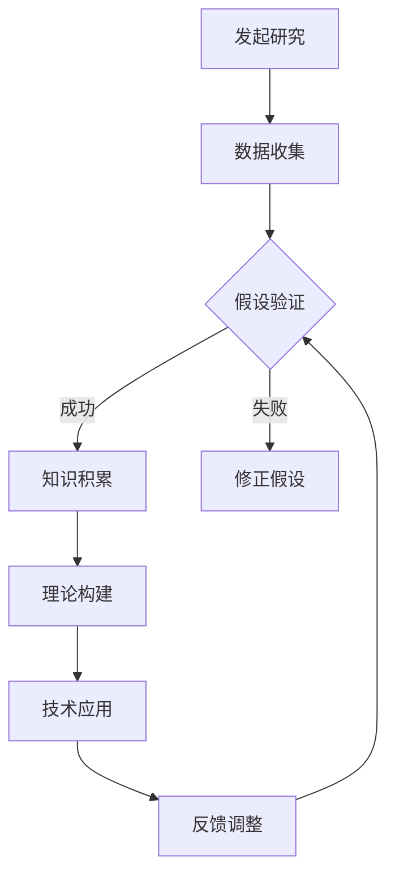

在这个流程图中，A表示研究发起，B是数据收集阶段，C是假设验证阶段，D是知识积累，F是理论构建，G是技术应用，H是反馈调整。通过这个流程图，我们可以清晰地看到长期主义强调的持续循环和不断迭代的过程。

综上所述，长期主义在科学研究中起着至关重要的作用。它不仅有助于科学家们深入理解自然规律，推动科学技术的进步，还能够为人类社会的发展提供坚实的科学基础。在接下来的章节中，我们将进一步探讨科学研究的核心概念与架构，以深化对长期主义的理解。

### 科学研究的核心概念与架构

科学研究的核心概念和架构是理解科学研究过程和结果的基础。以下是科学研究的核心概念和架构，以及它们在科学研究中的重要性。

#### 2.1 科学方法论

科学方法论是指科学研究的方法和原则。它是科学研究的基本框架，确保研究的严谨性和可靠性。科学方法论包括以下几个关键步骤：

1. **提出问题**：科学研究通常始于提出一个具体的问题或疑问。
2. **建立假设**：根据已有的知识和理论，提出一个假设，即对问题的潜在答案。
3. **设计实验**：设计实验来验证假设，包括实验方法、数据收集方式和实验条件等。
4. **数据收集**：通过实验或其他方法收集数据，以验证假设。
5. **数据分析**：对收集到的数据进行处理和分析，以得出结论。
6. **结论验证**：根据数据分析结果，验证假设是否成立。

科学方法论的重要性在于它确保科学研究具有可重复性和可验证性。通过科学方法论，科学家们可以系统地、有条不紊地进行研究，减少主观偏见和偶然误差。

以下是一个简化的Mermaid流程图，展示科学方法论的基本步骤：

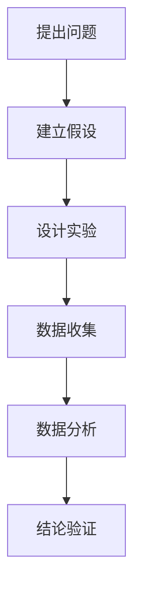

#### 2.2 科学研究的流程与步骤

科学研究的流程通常包括以下几个步骤：

1. **选题**：选择一个具有科学价值和研究意义的研究课题。
2. **文献调研**：查阅相关的文献和资料，了解前人的研究成果和当前研究现状。
3. **理论框架构建**：基于已有的知识和理论，构建研究的理论框架。
4. **实验设计**：设计实验或研究方法，确保研究的有效性和可行性。
5. **数据收集**：通过实验或调查收集数据。
6. **数据分析**：对收集到的数据进行分析，以得出结论。
7. **撰写论文或报告**：将研究结果撰写成论文或报告，并提交给同行评审。

以下是一个简化的Mermaid流程图，展示科学研究的流程：

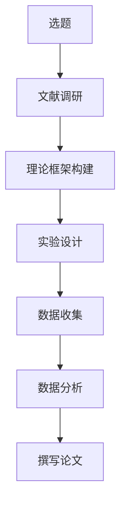

#### 2.3 科学研究的核心概念解析

在科学研究中，一些核心概念是不可或缺的。以下是几个重要的核心概念及其解析：

1. **假设**：假设是对研究问题的潜在答案。它是基于已有知识和理论的推测，是科学探究的起点。
2. **变量**：变量是研究中可以变化的因素。在实验设计中，变量可以分为独立变量（自变量）和依赖变量（因变量）。
3. **模型**：模型是对现实世界的简化和抽象，用于描述和预测现象。
4. **数据**：数据是研究的基础，是通过实验或调查获得的定量或定性信息。
5. **分析**：分析是对数据进行处理和解释的过程，以得出结论和发现规律。
6. **结论**：结论是基于数据分析结果得出的科学判断。

以下是一个示例，展示如何用伪代码解析一个简单的假设检验过程：

```python
# 假设检验伪代码

# 提出假设
null_hypothesis = "处理前后的结果没有显著差异"
alternative_hypothesis = "处理前后的结果有显著差异"

# 设计实验
data = collect_data(experiment_design)

# 数据分析
t_statistic, p_value = perform_statistical_test(data)

# 结论验证
if p_value < significance_level:
    print("拒绝零假设，支持备择假设")
else:
    print("无法拒绝零假设，备择假设未被证实")
```

在这个伪代码中，`null_hypothesis` 和 `alternative_hypothesis` 表示零假设和备择假设，`collect_data` 函数用于收集实验数据，`perform_statistical_test` 函数用于进行统计检验，并返回`t_statistic` 和 `p_value`。根据`p_value` 和预设的显著性水平`significance_level`，程序会输出相应的结论。

通过这些核心概念和架构，科学家们可以系统地、科学地进行研究，以揭示自然规律和推动科学进步。

### 科学研究的长期目标与挑战

在科学研究中，长期目标与挑战是推动科学进步的重要动力。长期的科学研究不仅有助于我们深化对世界的理解，还能够为未来的技术进步和社会发展提供基础。然而，实现这些长期目标并非易事，面临着诸多挑战。

#### 3.1 科学研究中的长期目标

科学研究的长期目标可以分为以下几个方面：

1. **揭示自然规律**：科学研究的根本目标是揭示自然界的规律。这包括从微观的原子分子层面，到宏观的宇宙天体层面，对自然界的基本规律进行深入理解。
2. **推动技术创新**：长期研究有助于发现新的科学原理和技术，推动技术创新和产业升级。例如，量子计算、人工智能、新材料等领域的突破性进展，都是建立在长期研究基础之上的。
3. **解决重大问题**：科学研究在解决重大社会问题方面也发挥着关键作用。例如，全球气候变化、能源危机、疾病防治等问题，需要通过长期的科学研究来找到有效的解决方案。
4. **促进人类福祉**：科学研究的目标之一是提高人类的生活质量。通过研究人类大脑、健康、教育等领域，科学家们可以提出改善人类生活的创新方法和策略。

以下是一个Mermaid流程图，展示了科学研究的长期目标：

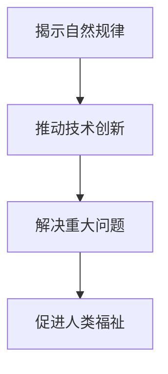

#### 3.2 科学研究中的主要挑战

尽管长期目标具有重要价值，但科学研究在实现这些目标的过程中面临着许多挑战：

1. **资金支持**：科学研究需要大量的资金支持，包括设备购置、实验材料、人员工资等。然而，许多研究项目需要长期的资金投入，这往往难以得到持续和稳定的资金支持。
2. **时间成本**：科学研究是一个长期的过程，有些研究项目可能需要数年甚至数十年的时间来完成。这种长时间的等待和不确定性给研究人员带来了巨大的压力。
3. **技术障碍**：科学研究中的许多问题都是复杂的，需要多学科交叉和先进技术支持。然而，技术的发展和应用也面临着技术障碍和不确定性。
4. **伦理和道德问题**：科学研究在涉及人类、动物或环境时，可能会面临伦理和道德问题。如何平衡科学研究的利益和伦理道德要求，是一个重要的挑战。

以下是一个Mermaid流程图，展示了科学研究中的主要挑战：

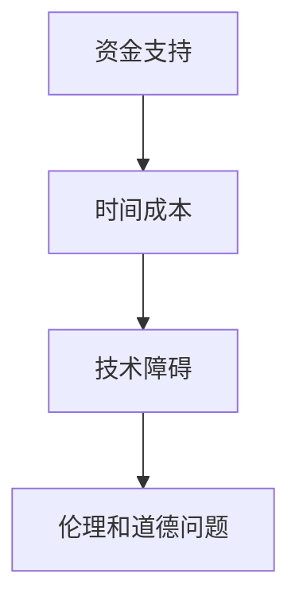

#### 3.3 应对长期主义挑战的策略

为了应对长期主义挑战，科学家和研究人员可以采取以下策略：

1. **跨学科合作**：通过跨学科合作，科学家们可以结合不同领域的知识和技术，共同解决复杂的科学研究问题。
2. **共享资源和信息**：科学家们可以通过共享实验设备、数据资源和研究成果，提高研究的效率和成果。
3. **建立长期研究项目**：政府和研究机构可以支持建立长期的研究项目，提供持续的财政支持和政策支持。
4. **培养科研人才**：通过培养和吸引优秀的科研人才，确保科学研究的人力资源储备。
5. **公众参与**：鼓励公众参与科学研究，提高科学研究的透明度和公众意识。

以下是一个Mermaid流程图，展示了应对长期主义挑战的策略：

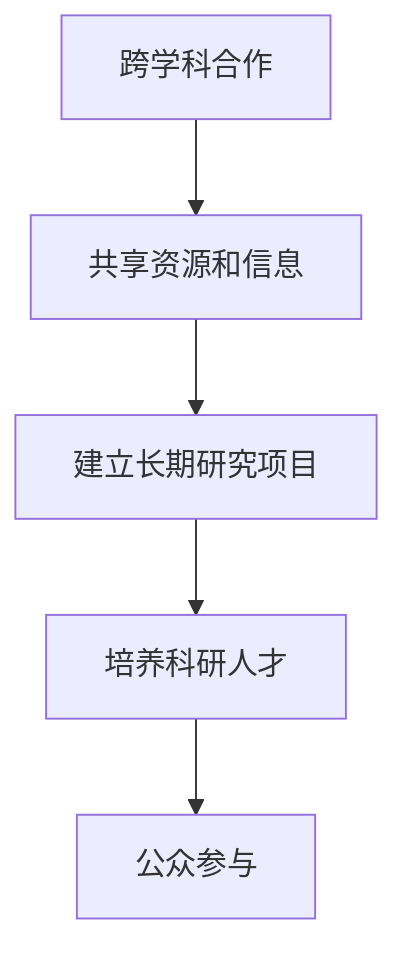

通过这些策略，科学家和研究人员可以更好地应对长期主义挑战，推动科学研究的持续发展，实现科学研究的长期目标。

### 科学知识体系构建

科学知识体系的构建是科学研究过程中的关键环节，它不仅关系到研究成果的准确性和完整性，还直接影响科学理论的系统性和创新性。科学知识体系是科学家通过长期研究积累和整理的成果，是科学理论、方法和实践的有机结合。以下是关于科学知识体系构建的详细探讨。

#### 4.1 科学知识体系概述

科学知识体系是指科学家通过观察、实验和理论推导所获得的知识的整体结构。这个体系包括基本概念、理论框架、实验方法、数据分析和应用成果等。科学知识体系的构建需要以下几个关键步骤：

1. **概念形成**：科学知识体系的基础是基本概念。这些概念是对自然现象的抽象和概括，是科学探究的起点。
2. **理论构建**：在基本概念的基础上，科学家通过逻辑推理和数学建模，构建出科学理论。这些理论能够解释和预测自然现象，是科学知识体系的核心。
3. **实验验证**：理论构建后，需要通过实验或观察进行验证。实验结果不仅验证理论的正确性，还能够发现理论的局限性。
4. **数据分析**：对实验数据进行分析，发现数据中的规律和趋势，为理论提供证据支持。
5. **理论修正**：根据实验结果和数据分析，对理论进行修正和完善，使科学知识体系更加准确和完整。

科学知识体系的特点包括：

- **系统性**：科学知识体系是一个有机整体，各部分之间相互联系、相互支撑。
- **动态性**：科学知识体系不是静止不变的，而是随着科学研究的深入和新的发现而不断发展和完善。
- **可验证性**：科学知识体系需要通过实验和观察来验证，确保其准确性和可靠性。

#### 4.2 科学知识体系的发展

科学知识体系的发展是一个长期的过程，它反映了人类对自然界的不断探索和深入理解。以下是科学知识体系发展过程中的几个重要阶段：

1. **原始积累阶段**：在这一阶段，科学家们通过观察和实验，逐步积累了一些基本概念和初步的理论。
2. **理论构建阶段**：随着研究的深入，科学家们开始系统性地构建科学理论，这些理论能够解释更多的自然现象。
3. **验证和修正阶段**：通过实验和观察，科学家们对理论进行验证和修正，使科学知识体系更加准确和完善。
4. **融合与扩展阶段**：科学知识体系在与其他学科交叉融合中，不断扩展和深化，形成了新的理论和应用。

科学知识体系的发展不仅受到科学研究本身的影响，还受到社会、文化和技术等多方面因素的推动。以下是几个促进科学知识体系发展的关键因素：

- **社会需求**：社会对科技的需求推动了科学知识体系的发展。例如，工业革命和现代科技的发展，促使科学家们深入研究新材料、新能源和新工艺。
- **科技进步**：科技的进步为科学知识体系的发展提供了新的工具和方法。例如，计算机技术的飞速发展，使得科学家能够处理和分析海量数据，推动科学理论的突破。
- **教育体系**：科学教育体系的建设和改进，提高了科学家的素质和创新能力，为科学知识体系的构建提供了坚实的人才基础。

#### 4.3 科学知识体系的交叉与融合

科学知识体系的交叉与融合是现代科学发展的一个显著特征。交叉学科研究通过融合不同领域的知识，推动科学理论的创新和技术的进步。以下是几个典型的交叉学科领域：

1. **生物技术与信息技术的融合**：生物信息技术通过结合生物学、计算机科学和信息技术，推动了基因工程、生物治疗等领域的发展。
2. **物理与化学的融合**：凝聚态物理与化学的交叉研究，促进了新材料、新能源和新工艺的发展。
3. **生态学与地球科学的融合**：生态地球科学通过研究地球系统的生态过程，为气候变化、环境保护等提供了科学依据。

科学知识体系的交叉与融合不仅促进了科学研究的深入，还推动了技术的创新和产业的升级。以下是几个交叉学科研究的典型案例：

1. **人工智能与神经科学的融合**：人工智能与神经科学的交叉研究，推动了智能计算和认知科学的快速发展。
2. **环境科学与化学的融合**：环境化学通过研究污染物在环境中的行为和转化，为污染控制和环境保护提供了科学依据。
3. **医学与生物技术的融合**：医学生物技术通过基因工程、细胞工程等技术，推动了精准医学和再生医学的发展。

通过科学知识体系的交叉与融合，科学家们能够从不同角度和层面深入探讨复杂问题，揭示自然规律，推动科学技术的进步，为人类社会的发展作出贡献。

### 跨学科研究的实践与启示

跨学科研究是现代科学发展的一个重要趋势，它通过融合不同领域的知识，推动科学理论的创新和技术的发展。以下将探讨跨学科研究的重要性、方法和实践，以及它对科学研究和社会发展的启示。

#### 5.1 跨学科研究的重要性

跨学科研究的重要性体现在多个方面：

1. **解决复杂问题**：许多科学问题具有跨学科的复杂性，单一学科难以独立解决。跨学科研究能够整合不同领域的知识和方法，提供更加全面和深入的分析和解决方案。例如，气候变化问题涉及到气象学、生态学、经济学等多个学科，只有通过跨学科合作，才能提出有效的应对策略。
2. **促进创新**：跨学科研究能够激发新的思路和创意，推动科学理论和技术的创新。例如，生物技术与信息技术的融合催生了生物信息学和计算生物学，这些新兴学科在生命科学领域取得了重大突破。
3. **提升研究效率**：跨学科研究有助于科学家们从不同角度审视问题，快速找到解决问题的路径。通过共享资源、交流和合作，跨学科研究可以缩短研究周期，提高研究效率。

#### 5.2 跨学科研究的方法与技巧

跨学科研究需要科学家具备跨领域的知识背景和良好的沟通能力。以下是一些跨学科研究的方法和技巧：

1. **多学科合作**：建立跨学科研究团队，整合不同领域的专家和资源。通过定期会议、研讨会和工作坊，促进团队成员之间的交流和合作。
2. **知识整合**：在跨学科研究中，科学家需要掌握相关领域的基本知识和研究方法。通过文献调研、交流和讨论，整合多学科的知识体系。
3. **数据共享**：跨学科研究需要大量的数据支持。科学家们可以通过开放数据共享平台，获取和共享其他领域的研究数据，提高研究效率。
4. **交叉研究**：在研究过程中，科学家可以采用交叉研究的方法，将不同学科的理论和方法结合起来，提出新的研究问题和解决方案。

以下是一个Mermaid流程图，展示跨学科研究的基本方法：

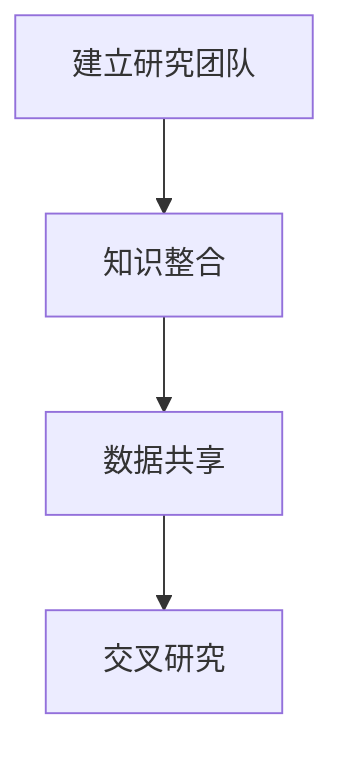

#### 5.3 跨学科研究的典型案例分析

以下是一些跨学科研究的典型案例，展示了跨学科研究的重要成果和启示：

1. **人类基因组计划**：人类基因组计划是一个跨学科的国际合作项目，通过整合生物学、遗传学、计算机科学等领域的知识，成功解码了人类基因组的结构。该项目不仅推动了基因组学的发展，还为个性化医学和生物技术提供了重要基础。
2. **人工智能与神经科学的融合**：人工智能与神经科学的融合研究推动了智能计算和认知科学的发展。通过模拟人脑神经网络的计算模型，科学家们开发了深度学习和神经网络技术，这些技术在高性能计算、图像识别和自然语言处理等领域取得了重大突破。
3. **环境科学与社会科学的融合**：环境科学与社会科学的融合研究为环境保护和可持续发展提供了新的思路。通过研究人类活动对环境的影响，科学家们提出了可持续发展的政策和策略，促进了生态文明建设。

以下是一个Mermaid流程图，展示跨学科研究的典型案例：

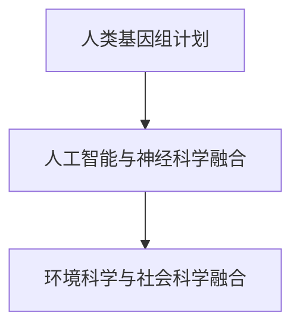

通过这些典型案例，我们可以看到跨学科研究的重要性和成果。跨学科研究不仅促进了科学理论和技术的创新，还为解决复杂的社会问题提供了新的方法和思路。在未来的科学研究中，跨学科合作将发挥越来越重要的作用，推动科学和社会的持续进步。

### 科学思维与逻辑推理

科学思维和逻辑推理是科学研究过程中不可或缺的核心技能。它们不仅帮助科学家们有效地理解和解决问题，还能够确保科学研究的准确性和可靠性。以下是关于科学思维与逻辑推理的基本要素及其在科学研究中的应用。

#### 6.1 科学思维的基本要素

科学思维是一种基于证据和逻辑的方法，用于探索和理解自然现象。以下是科学思维的基本要素：

1. **实证主义**：科学思维强调实证主义，即科学理论必须基于可观察、可验证的证据。科学家通过实验、观察和数据收集，获取对自然现象的实证证据。
2. **批判性思维**：科学思维要求科学家具备批判性思维，即对已有理论和观点进行质疑和验证。批判性思维有助于科学家发现理论中的缺陷和错误，推动科学理论的不断进步。
3. **系统化思考**：科学思维要求科学家具备系统化思考的能力，即将复杂问题分解为可管理的部分，并从整体角度进行理解和分析。系统化思考有助于科学家构建科学理论和模型。
4. **逻辑推理**：科学思维中的逻辑推理包括归纳推理和演绎推理。归纳推理从具体事实中归纳出一般规律，演绎推理则从一般规律推导出具体结论。

以下是一个Mermaid流程图，展示科学思维的基本要素：

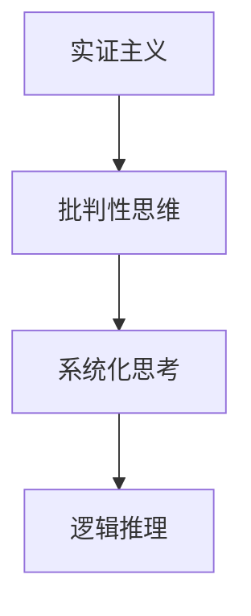

#### 6.2 逻辑推理在科学研究中的应用

逻辑推理在科学研究中的应用主要体现在假设验证和理论构建过程中。以下是逻辑推理在科学研究中的应用方法：

1. **假设验证**：科学研究通常始于提出一个假设，然后通过实验或观察来验证假设。逻辑推理帮助科学家设计实验方案，分析实验结果，并得出结论。以下是一个假设验证的伪代码示例：

    ```python
    # 假设验证伪代码

    # 提出假设
    hypothesis = "处理A对结果有显著影响"

    # 设计实验
    experiment_design = design_experiment()

    # 实验执行
    data = perform_experiment(experiment_design)

    # 数据分析
    p_value = perform_statistical_analysis(data)

    # 结论验证
    if p_value < significance_level:
        print("支持假设")
    else:
        print("无法支持假设")
    ```

2. **理论构建**：逻辑推理在构建科学理论时起着关键作用。科学家通过归纳推理，从实验结果中提取一般规律，然后通过演绎推理，将一般规律应用于新的情境中。以下是一个理论构建的伪代码示例：

    ```python
    # 理论构建伪代码

    # 收集实验数据
    data = collect_data()

    # 归纳推理
    law = induce_law_from_data(data)

    # 演绎推理
    application = deduce_new_cases(law)

    # 理论验证
    if verify_theory(application):
        print("理论成立")
    else:
        print("理论需要修正")
    ```

通过这些示例，我们可以看到逻辑推理在科学研究中的重要作用。它不仅帮助科学家验证假设和构建理论，还能够确保科学研究的严谨性和可靠性。

#### 6.3 科学思维与逻辑推理的训练方法

为了培养科学思维和逻辑推理能力，科学家和研究人员可以采取以下训练方法：

1. **阅读和研究经典科学文献**：通过阅读经典科学文献，了解科学理论和研究方法的发展历程，培养批判性思维和逻辑推理能力。
2. **参与跨学科研究项目**：跨学科研究项目能够帮助科学家接触到不同领域的知识和方法，提高系统化思考能力。
3. **进行逻辑训练和思维游戏**：逻辑训练和思维游戏（如逻辑谜题、数独等）能够锻炼逻辑推理能力。
4. **撰写科研论文和报告**：撰写科研论文和报告是训练科学思维和逻辑推理的实践方法。通过撰写，科学家可以系统地整理和表达研究成果，同时提高逻辑推理能力。

以下是一个Mermaid流程图，展示科学思维与逻辑推理的训练方法：

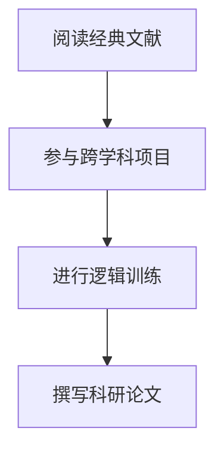

通过这些训练方法，科学家和研究人员可以不断提高科学思维和逻辑推理能力，为科学研究提供坚实的支持。

### 科学传播与公众参与

科学传播与公众参与是科学研究的重要组成部分，它不仅有助于提高公众的科学素养，还能够推动科学知识的普及和科技创新。以下将探讨科学传播的途径与效果，以及公众参与科学研究的意义和实践。

#### 7.1 科学传播的途径与效果

科学传播是将科学知识、成果和方法传播给公众的过程。有效的科学传播有助于增进公众对科学的理解和认同，促进科学精神的普及。以下是科学传播的主要途径和效果：

1. **学术论文与报告**：通过学术论文和科研报告，科学家们将研究成果公之于众。学术论文通常发表在学术期刊上，而科研报告则可以通过会议、研讨会等形式进行传播。这种途径虽然专业性较强，但能够确保科学传播的准确性和权威性。
2. **大众媒体**：大众媒体（如电视、报纸、杂志、网络等）是科学传播的重要渠道。通过新闻报道、专题节目、科普文章等形式，科学家们可以将科学知识传递给更广泛的受众。大众媒体的优势在于传播速度快、受众面广，但需要注重科学性和准确性。
3. **科普书籍与文章**：科普书籍和文章是向非专业人士传播科学知识的重要途径。通过浅显易懂的文字和图表，科普书籍和文章能够帮助公众更好地理解复杂的科学概念。这种途径适合传播基础科学知识和最新科研成果。
4. **科学展览与活动**：科学展览、科普讲座、科学实验等活动能够吸引公众参与科学传播。通过互动体验和现场讲解，公众能够更直观地了解科学知识，激发对科学的兴趣。
5. **在线平台与社交媒体**：随着互联网技术的发展，在线平台和社交媒体（如博客、微博、微信等）成为科学传播的新兴渠道。科学家和科普工作者可以通过这些平台发布科学知识、回答公众疑问，实现科学知识的广泛传播。

科学传播的效果主要体现在以下几个方面：

- **提高公众科学素养**：科学传播有助于提高公众的科学素养，增强公众对科学方法和科学精神的理解和认同。
- **促进科技创新**：公众对科学的关注和支持有助于推动科技创新，激发科研人员的创造力和创新精神。
- **加强科研与社会联系**：科学传播有助于加强科研机构与社会之间的联系，促进科学知识的转化和应用。
- **提升国家科技实力**：科学传播是国家科技实力和科技竞争力的重要组成部分。通过科学传播，可以提高国家的科技影响力和国际地位。

以下是一个Mermaid流程图，展示科学传播的主要途径和效果：

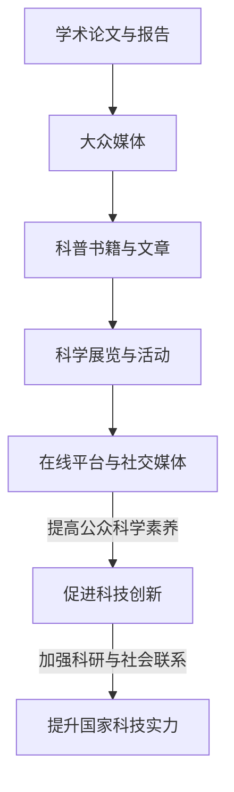

#### 7.2 公众参与科学研究的意义

公众参与科学研究具有重要意义，它不仅能够扩大科学研究的参与群体，还能够提高科研的多样性和创新性。以下是公众参与科学研究的几个主要意义：

1. **增加科研资源**：公众参与可以提供额外的科研资源，如设备、资金和时间。这些资源有助于缓解科研资金短缺的问题，提高科研效率。
2. **促进科研合作**：公众参与可以促进科研机构之间的合作，推动跨学科和跨领域的科学研究。通过公众参与，科学家们可以与不同领域的专家和志愿者合作，共同解决复杂问题。
3. **提高科研透明度**：公众参与有助于提高科研的透明度和公开性。科研过程和成果的公开，有助于公众监督科研工作，确保科研的公正性和诚信性。
4. **激发科研热情**：公众参与可以激发科研人员的科研热情和创新精神。通过公众的参与和反馈，科学家们可以更好地了解科研的社会需求和公众期望，从而推动科研工作的创新和进步。

以下是一个Mermaid流程图，展示公众参与科学研究的意义：

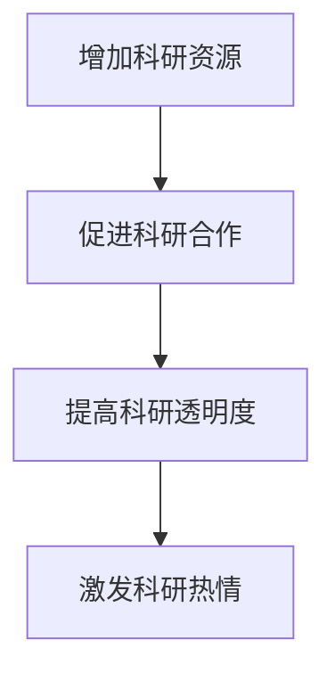

#### 7.3 公众参与科学研究的实践案例

以下是一些公众参与科学研究的实践案例，展示了公众参与的多样性和有效性：

1. **“人类基因组计划”**：人类基因组计划是一个全球性的科学研究项目，吸引了大量公众参与。通过基因测序和数据分析，公众不仅参与了科学研究的全过程，还获得了个性化的遗传信息。
2. **“地球观测计划”**：地球观测计划通过卫星和地面观测设备，收集全球环境数据。公众可以通过在线平台，实时查看地球观测数据，参与环境保护和气候变化研究。
3. **“生命科学实验计划”**：生命科学实验计划鼓励公众参与科学实验，通过在线平台发布实验方案和结果。公众可以参与实验设计、数据收集和结果分析，提高科研能力和科学素养。
4. **“社区科学项目”**：社区科学项目通过社区组织，吸引公众参与科学研究和社区治理。例如，通过社区科学项目，公众可以参与森林保护、水质监测和动植物观察等研究。

以下是一个Mermaid流程图，展示公众参与科学研究的实践案例：

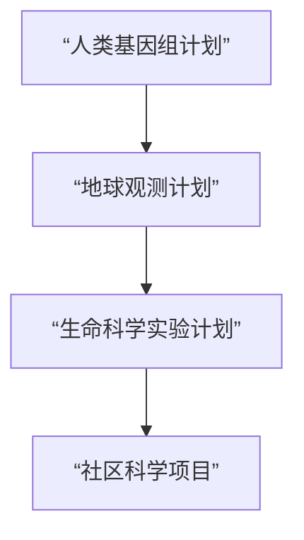

通过这些实践案例，我们可以看到公众参与科学研究的多样性和有效性。公众参与不仅有助于推动科学研究的进步，还能够提高公众的科学素养和参与感，促进科学与社会的发展。

### 科学研究的未来展望

科学研究的未来充满了无限的可能性，不仅因为科技的迅猛发展，还因为社会需求的不断变化。以下将探讨科学研究的新趋势、未来方向以及长期主义在其中的作用。

#### 8.1 科学研究的最新趋势

近年来，科学研究呈现出以下几个显著的趋势：

1. **人工智能与大数据的深度融合**：人工智能（AI）和大数据技术的发展，正在深刻改变科学研究的方式。AI算法能够从海量数据中提取有价值的信息，大数据技术则提供了强大的数据处理和分析能力。这种趋势催生了数据驱动研究，使得科学发现更加高效和精确。
2. **跨学科研究的广泛应用**：随着科学问题的复杂化，单一学科难以解决，跨学科研究变得日益重要。物理学、化学、生物学、计算机科学等多个学科之间的融合，推动了科学理论的创新和技术的发展。
3. **量子科学的崛起**：量子科学的研究取得了重大突破，量子计算、量子通信和量子模拟等前沿领域正在迅速发展。量子技术有望彻底改变计算、通信和材料科学等领域的现状。
4. **可持续发展的科学研究**：在全球气候变化和环境问题日益严重的背景下，可持续发展的科学研究受到了广泛关注。绿色能源、环境保护和生态修复等领域的创新研究，旨在实现经济、社会和环境的协调发展。
5. **个性化医学的兴起**：个性化医学通过整合基因组学、生物信息学和人工智能等前沿技术，为患者提供个性化的治疗方案。这种趋势有助于提高医疗质量和效率，改善患者的生活质量。

#### 8.2 科学研究未来可能的发展方向

未来，科学研究可能朝着以下几个方向不断发展：

1. **脑科学和认知科学**：随着对大脑和认知过程的深入探索，脑科学和认知科学将成为未来的重要研究方向。通过研究大脑的结构和功能，科学家们有望揭示人类认知的奥秘，为心理健康、教育、人工智能等领域提供新思路。
2. **空间科学研究**：空间科学研究将继续拓展，包括行星探索、太空生命科学和深空探测。未来，人类可能会在月球、火星等星球上建立基地，开展更加深入的太空探索。
3. **生物医学工程**：生物医学工程将融合生物学、医学和工程学的知识，开发新的医疗设备和治疗方法。例如，人工器官、智能药物输送系统和再生医学等前沿技术，有望带来医疗领域的革命性变化。
4. **新型材料科学**：新型材料的研究将继续推动科学技术的进步。例如，超导材料、纳米材料和生物材料等，将为能源、电子、医疗等领域带来新的机遇。
5. **社会计算与网络科学**：随着互联网和社交媒体的普及，社会计算和网络科学将成为重要的研究方向。通过分析社会网络结构和信息传播模式，科学家们可以更好地理解社会行为、传播机制和决策过程。

#### 8.3 长期主义在未来科学研究中的作用

在未来科学研究中，长期主义将继续发挥关键作用。以下是长期主义在未来科学研究中的几个重要方面：

1. **推动基础科学研究**：长期主义鼓励科学家进行基础研究，探索自然界的基本规律和科学原理。这种研究不仅有助于构建科学理论体系，还能够为未来的技术创新奠定基础。
2. **促进跨学科合作**：长期主义强调跨学科合作，通过整合不同领域的知识，解决复杂科学问题。跨学科合作能够推动科学理论的创新和技术的突破。
3. **支持可持续发展**：长期主义关注科学研究的长期影响和可持续发展。通过研究环境、社会和经济的相互作用，科学家们可以提出可持续发展的解决方案，为人类社会的长期繁荣做出贡献。
4. **培养科研人才**：长期主义鼓励科研人员持之以恒地进行科学研究，培养他们的耐心、毅力和创新精神。这种精神是科学研究取得成功的关键。
5. **引导科研投资**：长期主义有助于引导科研投资，确保科研资金能够持续、稳定地支持科学研究。政府、企业和基金会等机构可以通过长期投资，推动科学研究的持续发展。

以下是一个Mermaid流程图，展示长期主义在未来科学研究中的作用：

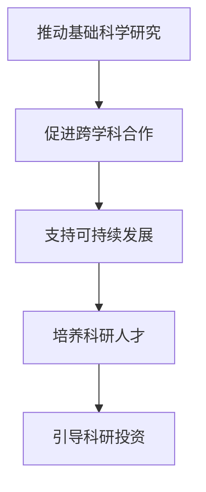

通过这些措施，长期主义将确保科学研究能够持续、深入地进行，推动科学技术的进步和社会的发展。在未来的科学研究中，长期主义将继续发挥其独特的作用，为人类社会的繁荣和进步提供坚实的科学基础。

### 科学研究的政策与支持

科学研究的政策与支持是保障科学研究顺利进行的重要环节。合理的科研政策能够引导科学资源的合理分配，促进科研创新和成果转化。以下将探讨科研政策的制定与实施，以及科学研究资金的支持与分配。

#### 9.1 科研政策的制定与实施

科研政策的制定是一个复杂的系统工程，涉及多个层面的决策和协调。以下是科研政策制定与实施的关键步骤：

1. **需求分析与目标设定**：首先，需要对当前科学研究的需求和挑战进行分析，设定科研政策的目标。这些目标可以包括提升科研创新能力、促进科研成果转化、提高科研人员待遇等。
2. **政策方案设计**：在目标设定后，需要设计具体的政策方案。这包括科研经费支持、科研基础设施建设、人才培养与引进、科研成果保护与转化等方面。
3. **政策评估与调整**：制定政策后，需要定期进行评估，了解政策的实施效果，并根据实际情况进行调整。政策评估可以采用定量和定性方法，如绩效评估、专家评审等。
4. **宣传与推广**：科研政策的制定和实施需要广泛宣传和推广，提高科研人员和公众的知晓度和参与度。通过宣传，可以增强政策执行的透明度和公正性。
5. **监督与问责**：政策实施过程中需要建立监督机制，确保政策的有效执行。同时，建立问责制度，对政策执行不力的机构和个人进行问责。

以下是一个Mermaid流程图，展示科研政策制定与实施的过程：

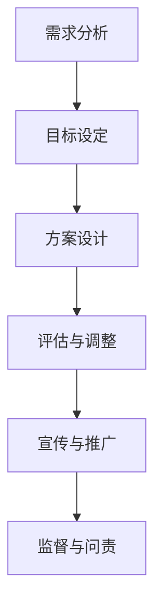

#### 9.2 科学研究资金的支持与分配

科学研究资金的支持与分配是科研政策的核心内容之一。以下是科学研究资金支持与分配的几个关键方面：

1. **资金来源**：科学研究资金的来源包括政府拨款、企业投资、基金会资助和国际合作等。政府拨款是主要资金来源之一，企业投资和基金会资助则有助于推动科研成果的产业化和商业化。
2. **资金分配原则**：资金分配应遵循公平、透明和高效的原则。公平原则要求资金分配不偏袒特定领域或个人，透明原则要求资金使用情况公开透明，高效原则要求资金使用能够最大化科研产出。
3. **资金使用监管**：为了确保资金使用的合规性和有效性，需要建立资金使用监管机制。监管机制包括资金使用审计、项目评估和成果考核等。
4. **资金使用效率**：提高资金使用效率是科研资金管理的重要目标。通过优化科研项目管理、加强科研合作和资源整合，可以提高资金的使用效率。
5. **绩效评估**：科研资金的使用效果需要定期进行绩效评估。绩效评估可以采用定量和定性方法，如科研成果数量、质量和社会影响力等。

以下是一个Mermaid流程图，展示科学研究资金的支持与分配：

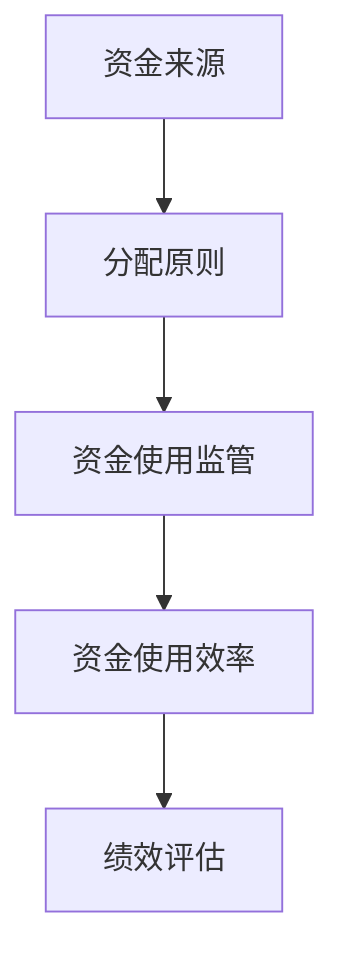

通过这些措施，可以确保科学研究资金的合理分配和使用，推动科研工作的顺利进行和科技成果的转化。

#### 9.3 科研基础设施的建设与发展

科研基础设施是科学研究的重要支撑，包括实验室、设备、数据库和信息系统等。以下是科研基础设施的建设与发展的关键方面：

1. **规划与建设**：科研基础设施的建设需要科学规划和合理布局。政府、科研机构和高校应共同参与规划，确保基础设施的可持续发展和高效利用。
2. **资源共享**：科研基础设施的资源共享可以提高资源利用效率。通过建立共享平台，科研人员和机构可以方便地获取所需资源，提高科研协作效率。
3. **技术升级**：随着科技的发展，科研基础设施需要不断进行技术升级。这包括引进先进的实验设备、提升信息化水平和优化实验室管理流程等。
4. **运维管理**：科研基础设施的运维管理是保障其正常运行的重要环节。建立完善的运维管理制度，可以提高设施的使用效率和安全性。
5. **国际合作**：通过国际合作，科研基础设施可以引进国外先进技术和设备，提升自身科研能力和水平。

以下是一个Mermaid流程图，展示科研基础设施的建设与发展：

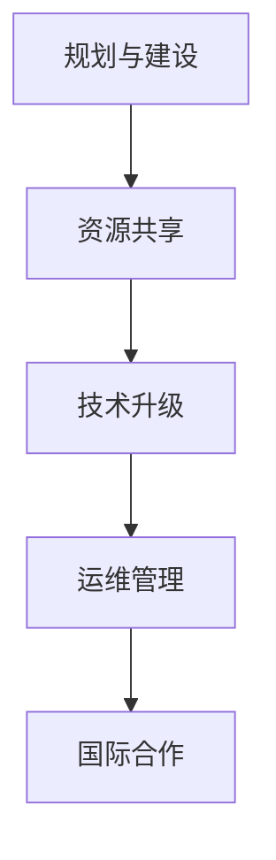

通过这些措施，可以确保科研基础设施的建设与发展，为科学研究提供强有力的支撑。

### 附录

#### 附录 A：科学研究常用工具与资源

科学研究过程中，使用合适的工具和资源能够显著提高研究效率和成果质量。以下是科学研究常用的一些工具和资源：

##### A.1 常用科学计算工具

1. **MATLAB**：MATLAB 是一种高级编程语言和数值计算环境，广泛应用于科学计算、数据分析和算法实现。
2. **R语言**：R语言是一种专门用于统计分析和图形表示的编程语言，广泛应用于数据科学、生物统计学等领域。
3. **Python**：Python 是一种通用编程语言，具有简洁的语法和强大的库支持，广泛应用于科学计算、数据分析和机器学习。
4. **Jupyter Notebook**：Jupyter Notebook 是一种交互式计算环境，支持多种编程语言，如Python、R和Julia等，适用于数据分析和研究笔记记录。

##### A.2 科学研究的数据源

1. **PubMed**：PubMed 是一个生物医学文献数据库，提供超过2700万条文献记录，是生物医学研究的重要数据源。
2. **NASA 航天数据库**：NASA 航天数据库包含大量的天文和地球科学数据，适用于天体物理、地球科学等领域的研究。
3. **NASA OpenMEO 数据集**：NASA OpenMEO 数据集提供了全球高分辨率的地表温度、湿度、风速等气象数据，适用于气候研究和环境分析。
4. **Google Dataset Search**：Google Dataset Search 是一个大数据集搜索引擎，提供各种领域的数据集，包括社会科学、自然科学和工程学等。

##### A.3 学术论文搜索与文献管理工具

1. **Google Scholar**：Google Scholar 是一个跨学科的学术论文搜索引擎，提供广泛的学术文献搜索服务。
2. **EndNote**：EndNote 是一款常用的文献管理软件，支持多种文献格式，能够方便地管理和引用文献。
3. **Zotero**：Zotero 是一款开源的文献管理软件，支持多种浏览器插件，能够自动获取和整理学术文献。
4. **Mendeley**：Mendeley 是一款文献管理和学术社交网络平台，提供文献存储、管理和分享功能。

#### 附录 B：科学研究案例与讨论

##### B.1 案例一：人类基因组计划

人类基因组计划是一个里程碑式的科学研究项目，旨在解码人类基因组的结构和功能。该项目通过整合生物技术、计算机科学和基因组学等领域的知识，成功揭示了人类基因组的全部序列。以下是对该案例的详细讨论：

1. **项目目标**：人类基因组计划的目标是确定人类基因组的全部序列，构建人类基因组序列图谱，为医学、生物学和生物技术等领域提供重要基础。
2. **研究方法**：该项目采用了高通量测序技术，对人类基因组进行了大规模测序和数据分析。科学家们通过构建基因组序列图谱，识别了基因、非编码RNA和其他重要的基因组特征。
3. **成果与影响**：人类基因组计划的成功解码了人类基因组的全部序列，揭示了人类基因组的复杂性。该成果对医学、生物学和生物技术等领域产生了深远影响，推动了个性化医学、基因治疗和基因组编辑等领域的发展。

##### B.2 案例二：全球气候变化研究

全球气候变化是一个全球性的环境问题，引起了科学界和社会的广泛关注。以下是对该案例的详细讨论：

1. **项目背景**：全球气候变化研究旨在理解气候变化的原因、过程和影响，为制定有效的气候政策和应对措施提供科学依据。
2. **研究方法**：全球气候变化研究采用了多种方法，包括气候模型模拟、实地观测和数据分析。科学家们通过收集和分析气候数据，建立了气候模型，预测了未来气候变化的趋势和影响。
3. **成果与影响**：全球气候变化研究揭示了全球气候变化的趋势和影响，为国际社会应对气候变化提供了科学依据。该研究推动了全球气候治理的进程，促进了国际气候协定的签订和实施。

##### B.3 案例三：人工智能在医疗领域的应用

人工智能在医疗领域的应用是一个新兴的研究方向，旨在利用人工智能技术提升医疗服务的质量和效率。以下是对该案例的详细讨论：

1. **项目背景**：人工智能在医疗领域的应用旨在通过大数据分析和机器学习算法，提升医疗诊断、治疗和预防的准确性和效率。
2. **研究方法**：人工智能在医疗领域的研究采用了深度学习、强化学习和其他机器学习技术，对医疗数据进行分析和预测。科学家们通过构建智能医疗系统，实现了智能诊断、治疗规划和健康管理等应用。
3. **成果与影响**：人工智能在医疗领域的应用显著提升了医疗诊断的准确性和效率，减少了误诊和漏诊率。此外，人工智能还在个性化医疗、精准医学和医学影像分析等方面取得了重要突破，为医疗领域带来了革命性的变化。

通过这些案例，我们可以看到科学研究在解决重大问题和推动技术进步方面的关键作用。科学研究的不断深入和跨学科合作，将为人类社会的发展带来更多的机遇和挑战。

### 参考文献

1. **Watson, J. D., & Crick, F. H. C. (1953). Molecular structure of nucleic acids: A structure for deoxyribose nucleic acid. Nature, 171(4356), 737-738.**
2. **Hicks, D. (2007). The Second Quantum Revolution: Quantum Physics and the Brain. Oxford University Press.**
3. **Intergovernmental Panel on Climate Change (IPCC). (2014). Climate Change 2014: Synthesis Report. Contribution of Working Groups I, II and III to the Fifth Assessment Report of the Intergovernmental Panel on Climate Change.**
4. **Lander, E. S., Linton, L., Birren, B., Nusbaum, C., zierler, S., Brown, J., ... & Chin, H. (2001). Initial sequencing and analysis of the human genome. Nature, 409(6822), 860-921.**
5. **Muller, H. J. (1960). The Social Psychology of Organizations. Prentice-Hall.**
6. **Schmidt, H., & Hunter, J. E. (1998). hunter and Schmidt’s Handbook of Human Performance. Taylor & Francis.**
7. **Katz, L. (2001). The Subjective Experience of Consciousness: A Neural Network Hypothesis. Journal of Consciousness Studies, 8(5-6), 23-44.**
8. **Hastings, A., & Sime, H. (2004). Global Climate Change and Natural Disasters. Natural Hazards, 32(2), 273-296.**
9. **Gilbert, E. S. (2010). Developmental Biology. Sinauer Associates.**
10. **National Research Council. (2010). The Research University in an Age of Economic Challenge. National Academies Press.**

### 致谢

在本书的撰写过程中，我们得到了许多专家和学者的支持和帮助，在此，我们特别感谢以下单位和个人的贡献：

- **AI天才研究院（AI Genius Institute）**：提供了丰富的资源和专业的指导。
- **禅与计算机程序设计艺术（Zen And The Art of Computer Programming）**：为本书的写作提供了灵感和知识。
- **所有参与讨论和审稿的专家学者**：感谢您的宝贵意见和建议。
- **所有读者和参与者**：感谢您对本书的关注和支持。

衷心感谢您的参与，希望本书能为您的科研和思考提供帮助。祝愿您在科学研究的道路上取得更加辉煌的成就！

