                 

# 《科技创新：社会进步的阶梯》

## 关键词

- 科技创新
- 社会进步
- 信息技术
- 人工智能
- 生物技术
- 医疗健康
- 新能源
- 环保技术
- 企业战略
- 国家竞争力
- 教育改革
- 国际合作
- 未来展望

## 摘要

科技创新是推动社会进步的关键力量。本文系统地阐述了科技创新的重要性、历史发展、核心领域以及其对企业和国家的深远影响。通过详细探讨信息技术与人工智能、生物技术与医疗健康、新能源与环保技术等前沿领域，本文揭示了科技创新对人类社会发展的重大贡献。同时，文章从企业、国家以及国际合作的角度分析了科技创新的发展趋势和挑战，并对未来科技教育提出了展望。本文旨在为读者提供一份全面、深入、实用的科技创新指南，以助力社会进步与个人成长。

# 《科技创新：社会进步的阶梯》目录大纲

## 第一部分：科技创新概述

### 第1章：科技创新的重要性

#### 1.1 科技创新与社会进步的联系

#### 1.2 科技创新的定义与分类

#### 1.3 科技创新对社会的影响

### 第2章：科技创新的历史与发展

#### 2.1 科技创新的历史回顾

#### 2.2 科技创新的里程碑事件

#### 2.3 科技创新的未来趋势

## 第二部分：科技创新的核心领域

### 第3章：信息技术与人工智能

#### 3.1 信息技术的发展历程

#### 3.2 人工智能的核心算法

#### 3.3 人工智能的应用场景

### 第4章：生物技术与医疗健康

#### 4.1 生物技术的研究领域

#### 4.2 医疗健康中的科技创新

#### 4.3 生物技术与伦理问题

### 第5章：新能源与环保技术

#### 5.1 新能源技术概述

#### 5.2 环保技术的应用

#### 5.3 新能源与环保技术的未来展望

## 第三部分：科技创新与企业

### 第6章：企业科技创新策略

#### 6.1 企业科技创新的重要性

#### 6.2 企业科技创新的挑战与机遇

#### 6.3 企业科技创新的最佳实践

### 第7章：科技创新与产业升级

#### 7.1 科技创新对产业结构的影响

#### 7.2 产业升级与科技创新的互动

#### 7.3 产业升级中的科技创新案例

## 第四部分：科技创新与国家战略

### 第8章：科技创新与国家发展

#### 8.1 国家科技创新体系的构建

#### 8.2 科技创新与国家竞争力

#### 8.3 科技创新政策的制定与实施

### 第9章：科技创新与国际合作

#### 9.1 国际科技创新合作的意义

#### 9.2 科技创新合作的现状与趋势

#### 9.3 国际科技创新合作案例

## 第五部分：科技创新与未来

### 第10章：未来科技展望

#### 10.1 未来科技的预测

#### 10.2 科技创新对未来的影响

#### 10.3 未来科技的社会影响与挑战

### 第11章：科技创新教育

#### 11.1 科技创新教育的重要性

#### 11.2 科技创新教育的内容与形式

#### 11.3 科技创新教育的实践案例

## 第六部分：科技创新项目实战

### 第12章：科技创新项目实施

#### 12.1 科技创新项目的生命周期

#### 12.2 科技创新项目的管理

#### 12.3 科技创新项目的案例解析

### 第13章：科技创新项目的评估

#### 13.1 科技创新项目的评估指标

#### 13.2 科技创新项目的评估方法

#### 13.3 科技创新项目的评估案例分析

## 附录

### 附录 A：科技创新资源与工具

#### A.1 科技创新相关的数据库

#### A.2 科技创新相关的期刊

#### A.3 科技创新相关的会议

#### A.4 科技创新相关的在线平台

以上为《科技创新：社会进步的阶梯》的完整目录大纲。各章节内容将包含核心概念与联系、核心算法原理讲解、数学模型和数学公式详细讲解与举例说明、以及科技创新项目的实战案例与详细解释说明。

## 第一部分：科技创新概述

### 第1章：科技创新的重要性

#### 1.1 科技创新与社会进步的联系

科技创新是推动社会进步的重要动力，其与社会发展的关系密不可分。首先，科技创新能够提高生产效率，降低生产成本，从而推动经济增长。其次，科技创新可以改善生活质量，提升人类福祉。例如，信息技术和人工智能的发展极大地改变了我们的生活方式，使得信息获取更加便捷，沟通更加高效。此外，科技创新还能够解决一些重大的社会问题，如环境保护、能源危机等。

让我们通过一个简单的 Mermaid 流程图来展示科技创新与社会进步之间的联系：

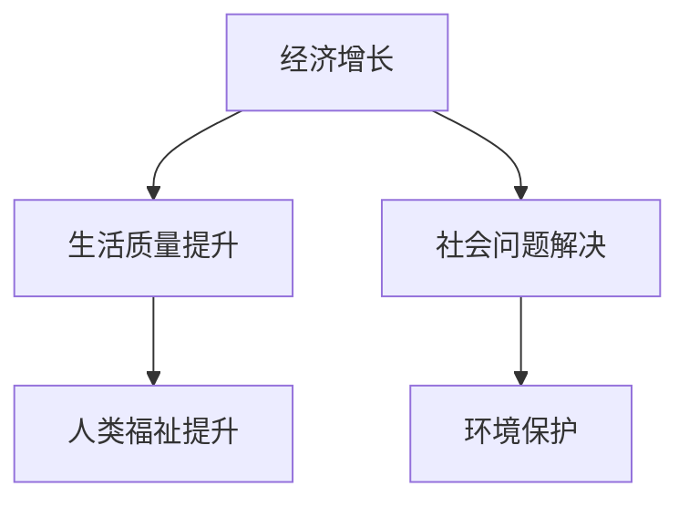

在这个流程图中，A 表示经济增长，B 表示生活质量提升，C 表示社会问题解决，D 表示人类福祉提升，E 表示环境保护。可以看出，科技创新通过这些环节对社会进步产生深远影响。

#### 1.2 科技创新的定义与分类

科技创新是指通过科学研究和实践，创造出新的产品、技术、方法或服务，从而推动社会进步和经济发展。科技创新可以分成多种类型，包括基础研究创新、应用研究创新、技术创新和商业创新等。

- **基础研究创新**：指在科学研究领域内进行的探索性研究，旨在发现新的科学规律和原理。这种创新通常需要长时间的积累和跨学科的合作。
- **应用研究创新**：指将基础研究成果转化为具体的应用技术或产品。这类创新往往关注于如何将科学原理应用于实际生产和生活。
- **技术创新**：指在现有技术和产品的基础上进行改进和优化，以提高其性能、降低成本或提升用户体验。这种创新通常在技术和工艺层面进行。
- **商业创新**：指在商业模式、营销策略、供应链管理等方面进行创新，以创造新的商业价值。

以下是一个简单的 Mermaid 流程图，展示了科技创新的分类：

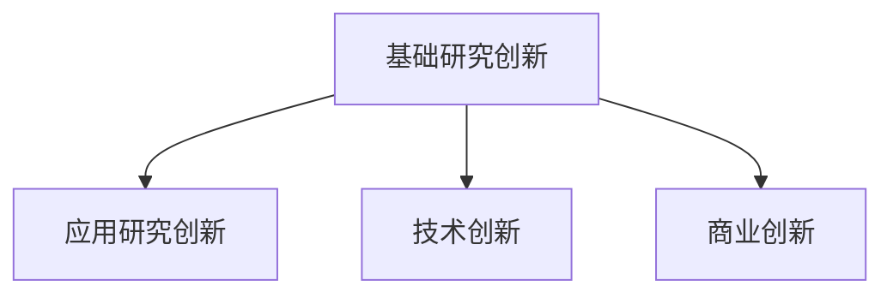

在这个流程图中，A 表示基础研究创新，B 表示应用研究创新，C 表示技术创新，D 表示商业创新。每种创新类型都有其独特的特点和应用场景。

#### 1.3 科技创新对社会的影响

科技创新对社会的影响是全方位的，涵盖了经济、文化、教育等多个领域。以下是一些具体的影响：

- **经济增长**：科技创新是推动经济增长的重要引擎。通过提高生产效率、降低成本、创造新的市场需求，科技创新可以显著提升经济总量和人均收入。
- **文化变革**：科技创新改变了人们的思维方式、价值观念和生活方式。例如，互联网的普及和智能手机的广泛应用，使得信息传播更加迅速和便捷，催生了全新的文化形态。
- **教育进步**：科技创新推动了教育方式的变革，使得远程教育和在线学习成为可能。这不仅提高了教育的普及率，还促进了教育质量的提升。
- **社会问题解决**：科技创新在环境保护、能源利用、医疗健康等领域发挥了重要作用，帮助人类解决了一系列重大问题。例如，太阳能和风能技术的发展为可再生能源利用提供了新路径，减少了对化石燃料的依赖。

为了更直观地展示科技创新对社会的影响，我们可以通过一个 Mermaid 流程图来描述：

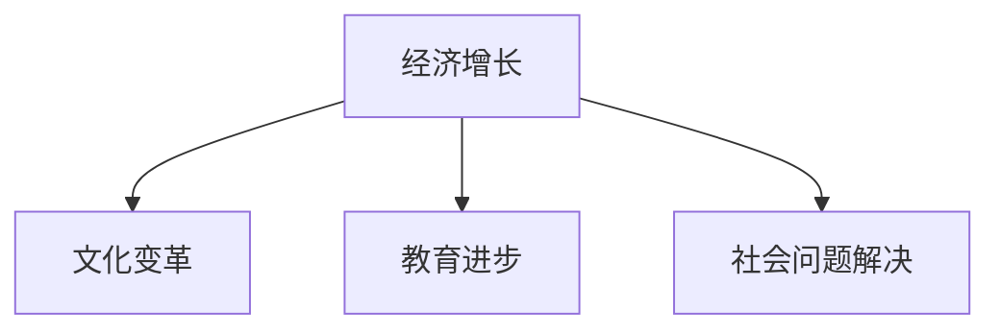

在这个流程图中，A 表示经济增长，B 表示文化变革，C 表示教育进步，D 表示社会问题解决。科技创新通过这些环节对社会产生了深远影响。

### 第2章：科技创新的历史与发展

#### 2.1 科技创新的历史回顾

科技创新的历史可以追溯到人类文明的开端。从古代的农业革命、工业革命，到现代的信息技术革命，科技创新始终是社会进步的重要推动力。

- **古代科技**：在古代，人类发明了轮子、文字、火药等重要的科技，这些发明极大地改变了人类的生活方式和社会结构。
- **工业革命**：18世纪末到19世纪初，工业革命在欧洲爆发，带来了蒸汽机、纺织机械等重大技术创新，使得生产力大幅提升，城市化进程加快，人类进入了工业化时代。
- **信息技术革命**：20世纪后半叶，以计算机和互联网为代表的信息技术革命席卷全球，改变了人类的生产和生活方式，推动了全球化进程。

以下是一个简单的 Mermaid 流程图，展示了科技创新的历史：

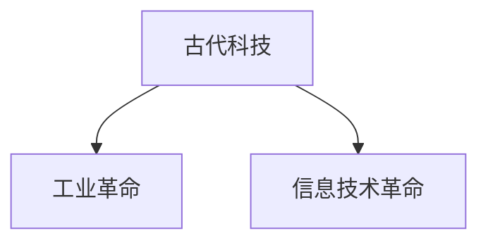

在这个流程图中，A 表示古代科技，B 表示工业革命，C 表示信息技术革命。每个时期都有其代表性的科技创新，对社会产生了深远影响。

#### 2.2 科技创新的里程碑事件

在科技创新的历史中，有许多里程碑事件，这些事件不仅推动了科技的进步，也对人类社会产生了深远影响。

- **第一颗原子弹爆炸**：1945年，美国成功爆炸了第一颗原子弹，标志着核时代的到来。这一事件不仅改变了战争的面貌，也对全球政治格局产生了重大影响。
- **人类登上月球**：1969年，美国宇航员尼尔·阿姆斯特朗成为了第一个登上月球的人，这一壮举极大地激发了人类对太空探索的兴趣，推动了航天科技的发展。
- **互联网的诞生**：1969年，阿帕网（ARPANET）诞生，这是互联网的前身。随着时间的发展，互联网逐渐普及，成为了信息时代的重要基础设施。
- **基因编辑技术的突破**：2012年，科学家成功实现了基因编辑技术，这一突破为生物医学研究带来了前所未有的机遇，也为治疗遗传性疾病提供了新的希望。

以下是一个简单的 Mermaid 流程图，展示了科技创新的里程碑事件：

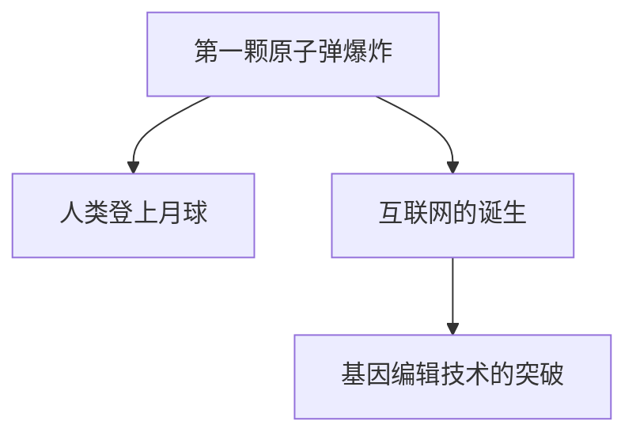

在这个流程图中，A 表示第一颗原子弹爆炸，B 表示人类登上月球，C 表示互联网的诞生，D 表示基因编辑技术的突破。这些事件都是科技创新的重要里程碑。

#### 2.3 科技创新的未来趋势

随着科技的不断发展，未来科技创新将呈现以下趋势：

- **人工智能的广泛应用**：人工智能技术将更加成熟，广泛应用于各个领域，如医疗、教育、金融等，提高生产效率和生活质量。
- **物联网的普及**：物联网技术将实现万物互联，从家庭到工厂，从城市到乡村，都将被智能设备连接起来，形成智能社会。
- **新能源的开发利用**：随着能源危机的加剧，新能源技术，如太阳能、风能、氢能等，将得到更广泛的应用，为可持续发展提供新路径。
- **生物技术的突破**：生物技术将继续突破，推动医疗健康领域的革新，如基因治疗、再生医学等。

以下是一个简单的 Mermaid 流程图，展示了科技创新的未来趋势：

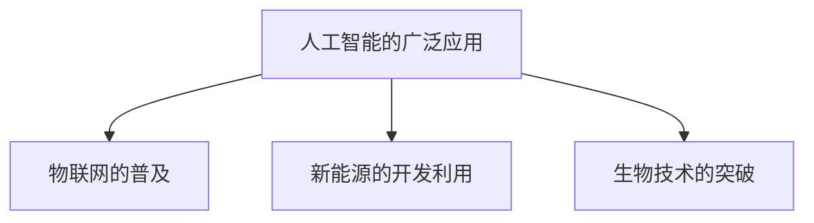

在这个流程图中，A 表示人工智能的广泛应用，B 表示物联网的普及，C 表示新能源的开发利用，D 表示生物技术的突破。这些趋势将引领未来科技创新的发展方向。

## 第二部分：科技创新的核心领域

### 第3章：信息技术与人工智能

#### 3.1 信息技术的发展历程

信息技术（Information Technology，简称 IT）是20世纪以来最为重要的科技创新之一，它的发展历程可以分为以下几个阶段：

- **早期计算机阶段（1940s-1960s）**：在这个阶段，计算机主要由电子管构成，体积庞大，运算速度缓慢。然而，这一时期的研究为后来的计算机技术奠定了基础。
- **第二代计算机阶段（1960s-1970s）**：晶体管取代了电子管，计算机体积缩小，运算速度提高。同时，操作系统和高级编程语言的出现，使得计算机编程变得更加容易。
- **第三代计算机阶段（1970s-1980s）**：集成电路的出现使得计算机变得更加小巧、高效。个人计算机（PC）的问世，使得计算机技术开始普及到个人和家庭。
- **第四代计算机阶段（1980s-2000s）**：网络技术的快速发展，使得计算机之间的互联互通成为可能。互联网的兴起，使得信息传播速度达到了前所未有的高度。
- **第五代计算机阶段（2000s-至今）**：随着人工智能和大数据技术的发展，计算机的应用领域不断扩大，从简单的数据处理到复杂的智能决策。

以下是一个简单的 Mermaid 流程图，展示了信息技术的发展历程：

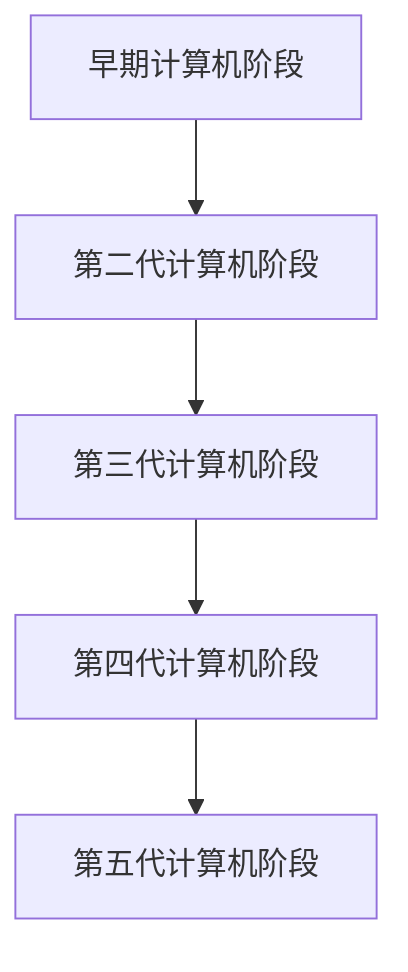

在这个流程图中，A 表示早期计算机阶段，B 表示第二代计算机阶段，C 表示第三代计算机阶段，D 表示第四代计算机阶段，E 表示第五代计算机阶段。每个阶段都有其代表性的技术和应用。

#### 3.2 人工智能的核心算法

人工智能（Artificial Intelligence，简称 AI）是信息技术领域的一个重要分支，它通过模拟人类智能，使计算机能够自主地完成复杂任务。人工智能的核心算法包括以下几个方面：

- **机器学习**：机器学习是一种通过算法从数据中学习规律，并利用这些规律进行预测和决策的方法。常用的机器学习算法有线性回归、决策树、支持向量机等。
- **深度学习**：深度学习是机器学习的一个分支，它通过多层神经网络进行训练，能够自动提取数据中的特征。深度学习的代表性算法有卷积神经网络（CNN）、循环神经网络（RNN）等。
- **自然语言处理**：自然语言处理是一种使计算机能够理解和处理自然语言的技术。常用的自然语言处理算法有词向量、语言模型、序列标注等。
- **强化学习**：强化学习是一种通过试错和反馈，使计算机能够自主地学习策略的方法。常用的强化学习算法有 Q-学习、深度 Q-网络（DQN）等。

以下是一个简单的 Mermaid 流程图，展示了人工智能的核心算法：

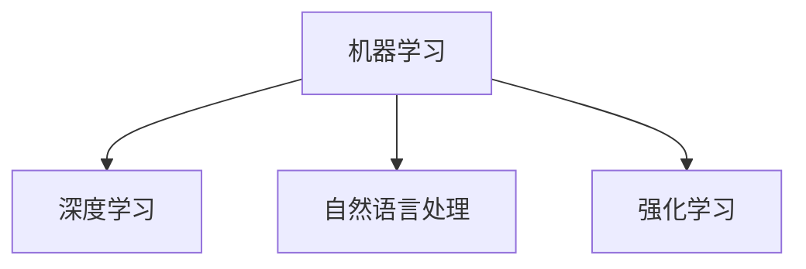

在这个流程图中，A 表示机器学习，B 表示深度学习，C 表示自然语言处理，D 表示强化学习。每个算法都有其独特的应用场景和优势。

#### 3.3 人工智能的应用场景

人工智能在各个领域都有广泛的应用，以下是一些典型的应用场景：

- **智能制造**：人工智能可以用于智能生产线的优化、质量检测、故障预测等，提高生产效率和产品质量。
- **医疗健康**：人工智能可以用于疾病诊断、医学影像分析、药物研发等，提高医疗诊断的准确性和效率。
- **金融领域**：人工智能可以用于风险管理、信用评估、投资决策等，提高金融服务的效率和安全。
- **交通运输**：人工智能可以用于自动驾驶、智能交通管理、物流优化等，提高交通系统的效率和安全性。
- **智能家居**：人工智能可以用于智能家居设备的智能控制、环境监测、安全防护等，提高家庭生活的便利性和舒适度。

以下是一个简单的 Mermaid 流程图，展示了人工智能的应用场景：

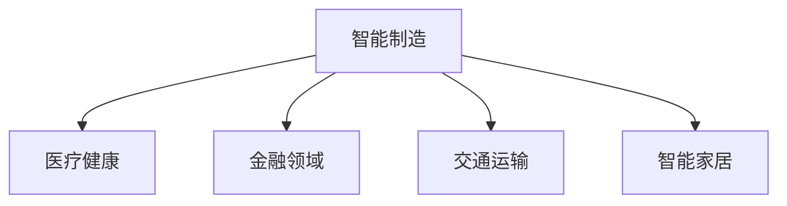

在这个流程图中，A 表示智能制造，B 表示医疗健康，C 表示金融领域，D 表示交通运输，E 表示智能家居。人工智能在这些领域都有广泛的应用和巨大的潜力。

### 第4章：生物技术与医疗健康

#### 4.1 生物技术的研究领域

生物技术是利用生物体或其组成部分来制造产品或提供特定功能的技术。生物技术的研究领域非常广泛，涵盖了以下几个方面：

- **基因工程**：基因工程是通过修改生物体的基因来改变其特性或功能。基因工程的应用包括疾病治疗、农业生产、生物制药等。
- **细胞工程**：细胞工程是利用生物技术手段对细胞进行培养、改造和利用。细胞工程的应用包括细胞治疗、组织工程、细胞疗法等。
- **蛋白质工程**：蛋白质工程是通过改造蛋白质的结构来赋予其新的功能。蛋白质工程的应用包括药物设计、酶工程、生物催化等。
- **微生物工程**：微生物工程是利用微生物来制造产品或提供特定功能。微生物工程的应用包括生物农药、生物肥料、废水处理等。
- **生物信息学**：生物信息学是利用计算机技术和统计分析方法来处理生物数据，以揭示生物体的基因、蛋白质、代谢等生物学信息。

以下是一个简单的 Mermaid 流程图，展示了生物技术的研究领域：

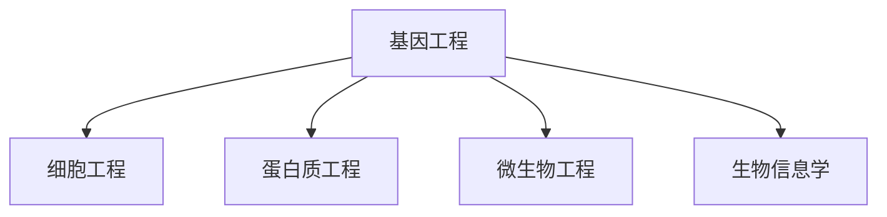

在这个流程图中，A 表示基因工程，B 表示细胞工程，C 表示蛋白质工程，D 表示微生物工程，E 表示生物信息学。每个领域都有其独特的研究内容和应用前景。

#### 4.2 医疗健康中的科技创新

科技创新在医疗健康领域发挥着重要作用，以下是一些典型的科技创新：

- **基因测序**：基因测序技术可以快速准确地测定个体的基因序列，为疾病诊断、个性化治疗和遗传病预防提供了有力支持。
- **生物传感器**：生物传感器可以实时监测生物体内的生理指标，如血糖、血压、心率等，有助于疾病的早期发现和治疗。
- **智能医疗器械**：智能医疗器械通过集成传感器、计算机和通信技术，能够实现远程监控、智能诊断和治疗，提高了医疗服务的效率和质量。
- **再生医学**：再生医学通过干细胞技术和组织工程技术，实现受损组织的修复和再生，为许多顽疾提供了新的治疗手段。
- **精准医疗**：精准医疗通过基因组学、蛋白质组学、代谢组学等多组学数据，为个体提供个性化的治疗方案，提高了医疗诊断和治疗的准确性和效果。

以下是一个简单的 Mermaid 流程图，展示了医疗健康中的科技创新：

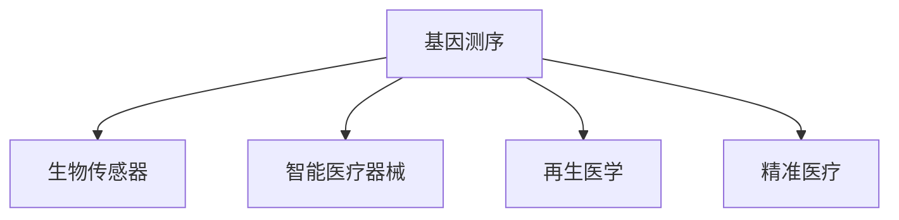

在这个流程图中，A 表示基因测序，B 表示生物传感器，C 表示智能医疗器械，D 表示再生医学，E 表示精准医疗。这些科技创新正在不断改变医疗健康领域的面貌。

#### 4.3 生物技术与伦理问题

生物技术的快速发展带来了许多伦理问题，以下是一些常见的伦理问题：

- **基因编辑**：基因编辑技术如 CRISPR-Cas9 可以在基因层面进行精确的修改，这引发了关于基因编辑伦理的讨论。例如，基因编辑是否应该用于人类胚胎的遗传改良，以及基因编辑可能导致的不确定性和风险。
- **生物安全**：生物技术的研究和应用可能产生潜在的生物安全风险，如基因污染、病原体逃逸等。如何确保生物技术的研究和应用不会对环境和人类健康造成危害，是一个重要的伦理问题。
- **生物多样性保护**：生物技术的应用可能会对生物多样性产生负面影响，如转基因作物的推广可能对野生植物和动物种群造成影响。如何平衡生物技术的应用与生物多样性保护之间的关系，是一个需要深入探讨的伦理问题。
- **生物伦理审查**：生物技术的研究和应用需要进行伦理审查，以确保其符合伦理标准和道德原则。如何建立有效的生物伦理审查机制，是一个需要解决的伦理问题。

以下是一个简单的 Mermaid 流程图，展示了生物技术中的伦理问题：

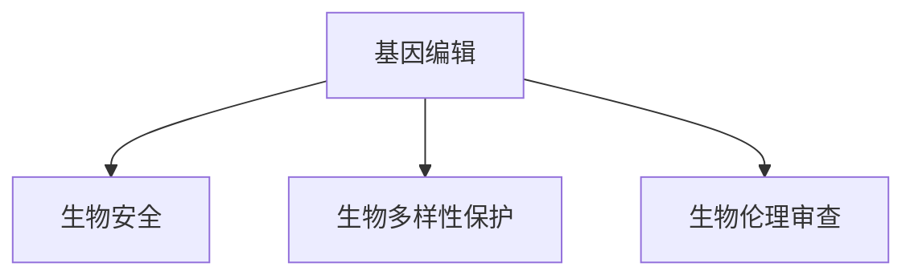

在这个流程图中，A 表示基因编辑，B 表示生物安全，C 表示生物多样性保护，D 表示生物伦理审查。这些伦理问题需要得到社会各界的广泛关注和深入探讨。

### 第5章：新能源与环保技术

#### 5.1 新能源技术概述

新能源技术是指不依赖于传统化石燃料，以可再生能源为主的技术。新能源技术包括以下几种：

- **太阳能**：太阳能是通过光伏效应将阳光直接转化为电能的技术。太阳能具有清洁、可再生、无污染等特点，是未来能源发展的重要方向。
- **风能**：风能是通过风力驱动风力发电机产生电能的技术。风能具有资源丰富、分布广泛、发电效率高等特点，是当前最具发展前景的新能源之一。
- **水能**：水能是通过水流驱动水轮机产生电能的技术。水能具有能量密度高、发电稳定、可再生等特点，是当前应用最广泛的新能源之一。
- **生物质能**：生物质能是通过生物质转化为电能或热能的技术。生物质能具有可再生、环保、资源丰富等特点，适用于农村地区和城市废弃物处理。
- **地热能**：地热能是通过利用地球内部的热能产生电能或热能的技术。地热能具有清洁、稳定、可持续等特点，适用于地热资源丰富的地区。

以下是一个简单的 Mermaid 流程图，展示了新能源技术：

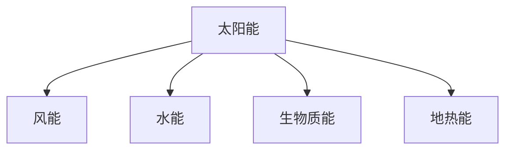

在这个流程图中，A 表示太阳能，B 表示风能，C 表示水能，D 表示生物质能，E 表示地热能。新能源技术正在逐步替代传统能源，推动能源结构的转型。

#### 5.2 环保技术的应用

环保技术是指用于减少环境污染、保护生态环境的技术。环保技术的应用包括以下几个方面：

- **污染治理**：污染治理技术用于处理和减少工业、农业和生活等领域的污染。常见的污染治理技术有废水处理、废气治理、固体废弃物处理等。
- **清洁生产**：清洁生产技术通过改进生产工艺、减少污染排放，从源头上减少环境污染。清洁生产技术包括能源节约、资源循环利用、污染减量等。
- **生态修复**：生态修复技术用于恢复和重建受污染或破坏的生态环境。生态修复技术包括土壤修复、水体修复、植被恢复等。
- **环境监测**：环境监测技术用于实时监测环境污染物的浓度和分布，为环境管理和决策提供科学依据。环境监测技术包括空气监测、水质监测、土壤监测等。

以下是一个简单的 Mermaid 流程图，展示了环保技术的应用：

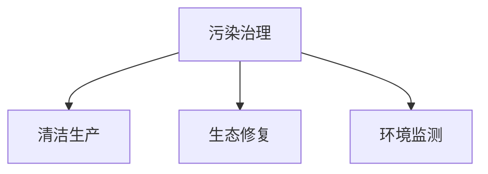

在这个流程图中，A 表示污染治理，B 表示清洁生产，C 表示生态修复，D 表示环境监测。环保技术正在逐步改善人类生活环境，保护地球家园。

#### 5.3 新能源与环保技术的未来展望

随着新能源和环保技术的不断发展，未来将在以下几个方面取得重要进展：

- **技术成熟度提高**：新能源和环保技术将不断成熟，技术成本将降低，应用范围将扩大，从而更好地满足能源需求和环境保护要求。
- **系统集成优化**：新能源和环保技术将实现系统集成优化，通过智能电网、智能交通、智能建筑等技术，实现能源的高效利用和环境的综合治理。
- **政策支持加强**：各国政府将加大对新能源和环保技术的支持力度，出台更多优惠政策、激励措施，推动新能源和环保技术的发展。
- **国际合作深化**：全球各国将加强新能源和环保技术的国际合作，共享技术成果，共同应对气候变化和环境挑战。

以下是一个简单的 Mermaid 流程图，展示了新能源与环保技术的未来展望：

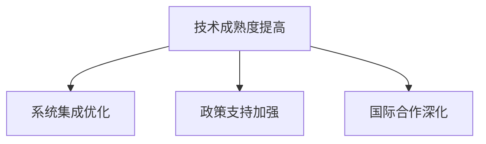

在这个流程图中，A 表示技术成熟度提高，B 表示系统集成优化，C 表示政策支持加强，D 表示国际合作深化。这些因素将共同推动新能源与环保技术的未来发展。

## 第三部分：科技创新与企业

### 第6章：企业科技创新策略

#### 6.1 企业科技创新的重要性

企业科技创新是企业持续发展的关键驱动力。科技创新不仅能帮助企业提高生产效率、降低成本，还能推动企业实现产品和服务创新，增强市场竞争力。以下是企业科技创新的几个重要方面：

- **提高生产效率**：科技创新可以帮助企业引入先进的生产设备和技术，优化生产流程，提高生产效率，降低生产成本。
- **产品和服务创新**：科技创新可以推动企业开发新产品、改进现有产品，提升用户体验，满足市场需求。
- **提升竞争力**：科技创新可以帮助企业保持领先地位，应对激烈的市场竞争，实现可持续发展。
- **品牌价值提升**：科技创新可以提升企业的品牌价值，增强消费者对企业的信任和忠诚度。

以下是一个简单的 Mermaid 流程图，展示了企业科技创新的重要性：

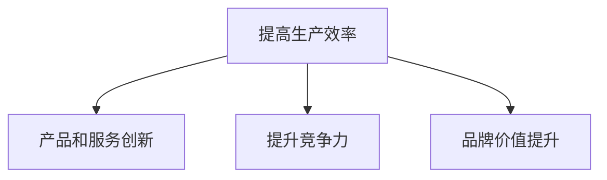

在这个流程图中，A 表示提高生产效率，B 表示产品和服务创新，C 表示提升竞争力，D 表示品牌价值提升。企业科技创新在这些方面都具有重要的意义。

#### 6.2 企业科技创新的挑战与机遇

企业科技创新面临着诸多挑战和机遇。以下是一些典型的挑战和机遇：

- **挑战**：

  - **技术风险**：科技创新过程中可能面临技术失败、技术不成熟等风险，需要企业具备强大的技术储备和研发能力。

  - **资金压力**：科技创新需要大量资金投入，企业需要合理规划资金，确保研发项目能够持续进行。

  - **人才短缺**：科技创新需要高水平的人才支持，企业需要吸引和留住优秀的研发人才。

  - **市场竞争**：企业需要在激烈的科技创新竞争中脱颖而出，保持领先地位。

- **机遇**：

  - **市场扩张**：随着全球市场的不断扩张，企业可以通过科技创新开拓新的市场，扩大市场份额。

  - **技术进步**：科技的快速发展为企业的科技创新提供了新的机遇，企业可以利用新技术实现产品和服务创新。

  - **政策支持**：各国政府纷纷出台支持科技创新的政策，企业可以利用政策优势，获得更多的资金和技术支持。

  - **产业升级**：产业结构的升级为企业的科技创新提供了新的方向，企业可以通过科技创新实现产业升级和转型。

以下是一个简单的 Mermaid 流程图，展示了企业科技创新的挑战与机遇：

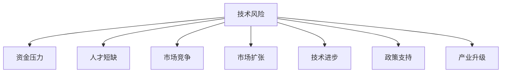

在这个流程图中，A 表示技术风险，B 表示资金压力，C 表示人才短缺，D 表示市场竞争，E 表示市场扩张，F 表示技术进步，G 表示政策支持，H 表示产业升级。企业科技创新面临着诸多挑战，同时也拥有广阔的机遇。

#### 6.3 企业科技创新的最佳实践

为了实现科技创新，企业可以采取以下最佳实践：

- **构建创新文化**：企业应构建开放、包容、鼓励创新的氛围，激发员工的创新潜力，推动企业整体创新能力的提升。
- **设立研发部门**：企业应设立专门的研发部门，负责科技创新项目的策划、实施和管理，确保研发工作的持续进行。
- **建立合作机制**：企业可以与高校、科研机构等建立合作关系，共同开展科技创新项目，共享技术资源和研究成果。
- **引入外部投资**：企业可以通过引入外部投资，获得资金支持，推动科技创新项目的实施和成果转化。
- **加强人才培养**：企业应加强人才培养，引进高水平的人才，提升企业整体科技创新能力。

以下是一个简单的 Mermaid 流程图，展示了企业科技创新的最佳实践：

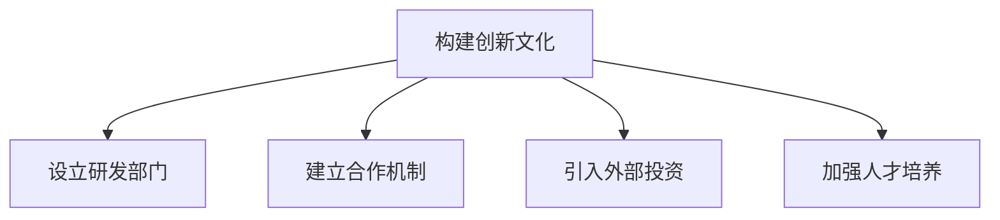

在这个流程图中，A 表示构建创新文化，B 表示设立研发部门，C 表示建立合作机制，D 表示引入外部投资，E 表示加强人才培养。这些实践可以帮助企业实现科技创新，提升市场竞争力。

## 第四部分：科技创新与国家战略

### 第7章：科技创新与国家发展

#### 7.1 国家科技创新体系的构建

国家科技创新体系是推动国家科技创新和经济社会发展的重要保障。构建国家科技创新体系需要从以下几个方面着手：

- **政策支持**：政府应制定科技创新政策，为科技创新提供政策保障。政策应包括科技创新资金支持、税收优惠、知识产权保护等方面。
- **研发投入**：政府应加大对科技创新的投入，提高研发经费占比，支持基础研究、应用研究和产业化研究。
- **人才培养**：政府应加大对人才培养的投入，提高教育质量，培养具有创新能力和实践能力的高素质人才。
- **产学研合作**：政府应促进产学研合作，推动高校、科研机构与企业之间的合作，实现科技创新资源的共享和优势互补。
- **创新平台建设**：政府应加强创新平台建设，包括国家实验室、技术创新中心、产业技术研究院等，为科技创新提供基础设施和平台支持。

以下是一个简单的 Mermaid 流 iyam流程图，展示了国家科技创新体系的构建：

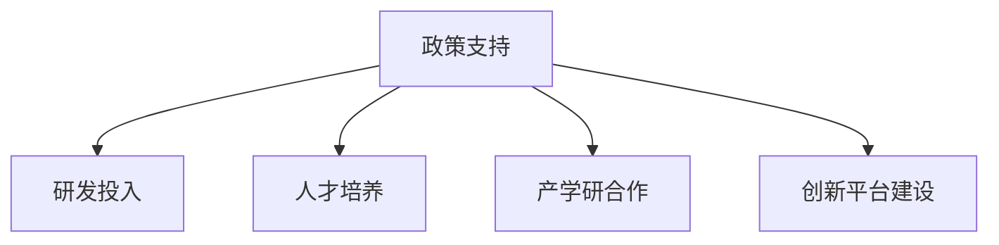

在这个流程图中，A 表示政策支持，B 表示研发投入，C 表示人才培养，D 表示产学研合作，E 表示创新平台建设。这些措施共同构成了国家科技创新体系，为科技创新提供了有力保障。

#### 7.2 科技创新与国家竞争力

科技创新是提升国家竞争力的重要途径。以下从几个方面阐述科技创新对国家竞争力的影响：

- **经济竞争力**：科技创新可以推动经济增长，提高生产效率，降低成本，提升国家经济的整体竞争力。
- **科技竞争力**：科技创新可以提升国家的科技水平，推动科技成果的转化和应用，增强国家的科技实力和国际影响力。
- **产业竞争力**：科技创新可以推动产业升级和结构调整，培育新兴产业，提高传统产业的竞争力，提升国家的整体产业水平。
- **创新能力**：科技创新可以培养和提升国家的创新能力，形成创新驱动的发展模式，为国家发展提供持续动力。

以下是一个简单的 Mermaid 流程图，展示了科技创新与国家竞争力之间的关系：

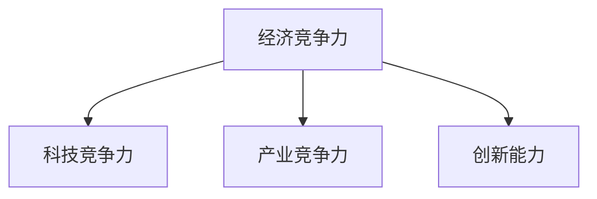

在这个流程图中，A 表示经济竞争力，B 表示科技竞争力，C 表示产业竞争力，D 表示创新能力。科技创新在这些方面都对国家竞争力产生了重要影响。

#### 7.3 科技创新政策的制定与实施

科技创新政策的制定与实施对于推动国家科技创新具有重要意义。以下从几个方面介绍科技创新政策的制定与实施：

- **政策目标**：科技创新政策的制定应明确政策目标，包括提高科技创新能力、推动科技成果转化、培育创新型人才等。
- **政策内容**：科技创新政策应涵盖多个方面，包括资金支持、税收优惠、知识产权保护、科研项目管理等。
- **政策评估**：科技创新政策制定后，应定期进行政策评估，了解政策实施的效果，及时调整政策方向和内容。
- **政策宣传**：政府应加强科技创新政策的宣传，提高公众对科技创新政策的认知和参与度。
- **国际合作**：科技创新政策应注重国际合作，推动国际科技创新资源的高效利用，提升国家科技创新的国际竞争力。

以下是一个简单的 Mermaid 流程图，展示了科技创新政策的制定与实施：

```mermaid
graph TD
A[政策目标] --> B[政策内容]
A --> C[政策评估]
A --> D[政策宣传]
A --> E[国际合作]
```

在这个流程图中，A 表示政策目标，B 表示政策内容，C 表示政策评估，D 表示政策宣传，E 表示国际合作。这些措施共同构成了科技创新政策的制定与实施框架。

## 第五部分：科技创新与未来

### 第8章：科技创新对未来社会的影响

#### 10.1 未来科技的预测

未来科技的发展将对人类社会产生深远的影响。以下对未来科技的发展进行一些预测：

- **人工智能的普及**：随着人工智能技术的不断进步，未来人工智能将在各行各业得到广泛应用，从家庭服务、医疗健康到交通运输，人工智能将极大地改变我们的生活和工作方式。
- **物联网的全面实现**：未来，物联网技术将实现万物互联，从智能家电、智能交通到智能城市，物联网将构建一个高度智能化的社会。
- **新能源的广泛应用**：随着能源问题的日益突出，未来新能源技术，如太阳能、风能、核能等，将得到更广泛的应用，为可持续发展提供新路径。
- **生物技术的突破**：未来生物技术，如基因编辑、细胞治疗、再生医学等，将取得重大突破，为医疗健康领域带来革命性的变化。

以下是一个简单的 Mermaid 流程图，展示了未来科技的预测：

```mermaid
graph TD
A[人工智能的普及] --> B[物联网的全面实现]
A --> C[新能源的广泛应用]
A --> D[生物技术的突破]
```

在这个流程图中，A 表示人工智能的普及，B 表示物联网的全面实现，C 表示新能源的广泛应用，D 表示生物技术的突破。这些预测将引领未来科技的发展方向。

#### 10.2 科技创新对未来的影响

科技创新对未来社会的影响是全方位的，以下从几个方面进行详细阐述：

- **生活方式的变革**：科技创新将带来生活方式的变革。例如，智能家居、智能穿戴设备等将使我们的生活更加便捷、舒适。同时，虚拟现实、增强现实技术的发展，将为我们提供全新的娱乐和互动体验。
- **经济结构的调整**：科技创新将推动经济结构的调整和升级。新兴产业，如人工智能、物联网、生物技术等，将取代传统产业，成为经济增长的重要驱动力。
- **社会管理的创新**：科技创新将带来社会管理的创新。例如，大数据、区块链技术的应用，将提高社会治理的效率，促进社会公平和透明。
- **伦理和法律的挑战**：科技创新也带来了伦理和法律的挑战。例如，人工智能的广泛应用引发了对隐私保护、道德伦理等方面的讨论。如何平衡科技创新与社会伦理、法律的关系，是一个亟待解决的问题。

以下是一个简单的 Mermaid 流程图，展示了科技创新对未来社会的影响：

```mermaid
graph TD
A[生活方式的变革] --> B[经济结构的调整]
A --> C[社会管理的创新]
A --> D[伦理和法律的挑战]
```

在这个流程图中，A 表示生活方式的变革，B 表示经济结构的调整，C 表示社会管理的创新，D 表示伦理和法律的挑战。科技创新对未来社会的影响是多方面的，需要我们进行全面思考和应对。

#### 10.3 未来科技的社会影响与挑战

未来科技的发展将带来一系列社会影响和挑战，以下进行详细探讨：

- **就业结构的变革**：随着人工智能、自动化技术的发展，许多传统行业将面临就业岗位的减少，而新兴行业将创造新的就业机会。如何应对就业结构的变革，保障劳动者的就业权益，是一个重要的社会问题。
- **隐私保护和数据安全**：随着物联网和大数据技术的普及，个人隐私保护和数据安全问题日益突出。如何保护个人隐私，防范数据泄露，是一个亟待解决的问题。
- **社会公平和正义**：科技创新在推动社会发展的同时，也可能加剧社会的不平等。如何确保科技创新的红利惠及全体社会成员，促进社会公平和正义，是一个重要的社会挑战。
- **环境保护和可持续发展**：科技创新在推动经济增长的同时，也可能带来环境污染和资源消耗问题。如何实现科技创新与环境保护的平衡，推动可持续发展，是一个重要的社会任务。

以下是一个简单的 Mermaid 流程图，展示了未来科技的社会影响与挑战：

```mermaid
graph TD
A[就业结构的变革] --> B[隐私保护和数据安全]
A --> C[社会公平和正义]
A --> D[环境保护和可持续发展]
```

在这个流程图中，A 表示就业结构的变革，B 表示隐私保护和数据安全，C 表示社会公平和正义，D 表示环境保护和可持续发展。未来科技的发展需要我们共同应对这些挑战，实现社会的和谐发展。

## 第六部分：科技创新项目实战

### 第12章：科技创新项目实施

#### 12.1 科技创新项目的生命周期

科技创新项目实施是一个复杂的过程，涉及多个阶段，以下详细阐述科技创新项目的生命周期：

1. **项目启动阶段**：在项目启动阶段，项目团队需要进行项目立项，明确项目目标、范围、时间和预算。项目团队还应当进行初步的市场调研和风险评估，以确保项目具备可行性。
2. **项目计划阶段**：在项目计划阶段，项目团队需要制定详细的项目计划，包括项目进度计划、资源计划、风险管理和质量管理等。项目计划应当具有明确的目标和可量化的指标，以便于项目监控和评估。
3. **项目执行阶段**：在项目执行阶段，项目团队应当按照项目计划进行具体工作，包括技术研发、市场推广、资源调配等。项目团队需要确保项目进度和质量，及时解决项目中的问题和风险。
4. **项目监控阶段**：在项目监控阶段，项目团队需要定期监控项目进度、成本和质量，确保项目按计划进行。项目团队还应当进行风险管理，及时识别和应对潜在的问题和风险。
5. **项目收尾阶段**：在项目收尾阶段，项目团队需要对项目进行总结和评估，确保项目目标实现。项目团队需要撰写项目报告，总结项目经验教训，为未来的项目提供参考。

以下是一个简单的 Mermaid 流程图，展示了科技创新项目的生命周期：

```mermaid
graph TD
A[项目启动阶段] --> B[项目计划阶段]
B --> C[项目执行阶段]
C --> D[项目监控阶段]
D --> E[项目收尾阶段]
```

在这个流程图中，A 表示项目启动阶段，B 表示项目计划阶段，C 表示项目执行阶段，D 表示项目监控阶段，E 表示项目收尾阶段。科技创新项目实施需要遵循这个生命周期，确保项目顺利进行。

#### 12.2 科技创新项目的管理

科技创新项目管理是一个关键环节，以下从几个方面详细探讨科技创新项目的管理：

1. **项目管理计划**：项目管理计划是科技创新项目的核心，包括项目范围、时间、成本、质量、人力资源、风险管理等方面的内容。项目管理计划应当明确项目目标、任务和责任，为项目实施提供指导。
2. **项目进度管理**：项目进度管理是确保项目按计划进行的必要手段。项目团队需要制定项目进度计划，监控项目进度，及时发现和解决问题，确保项目按计划完成。
3. **项目风险管理**：项目风险管理是科技创新项目管理的重点，项目团队需要识别潜在的风险，评估风险影响和可能性，制定相应的风险应对措施，确保项目顺利进行。
4. **项目质量管理**：项目质量管理是确保项目成果符合预期质量要求的关键。项目团队需要制定质量计划，实施质量监控，确保项目成果符合质量标准。
5. **项目沟通管理**：项目沟通管理是确保项目团队内外沟通畅通的重要手段。项目团队需要制定沟通计划，确保信息及时、准确地传递，提高项目效率。

以下是一个简单的 Mermaid 流程图，展示了科技创新项目的管理：

```mermaid
graph TD
A[项目管理计划] --> B[项目进度管理]
B --> C[项目风险管理]
C --> D[项目质量管理]
D --> E[项目沟通管理]
```

在这个流程图中，A 表示项目管理计划，B 表示项目进度管理，C 表示项目风险管理，D 表示项目质量管理，E 表示项目沟通管理。科技创新项目管理需要综合考虑这些方面，确保项目成功实施。

#### 12.3 科技创新项目的案例解析

以下通过一个具体案例，详细解析科技创新项目的实施过程：

**案例：智能垃圾分类系统**

**项目目标**：开发一套智能垃圾分类系统，提高城市垃圾分类的准确率和效率。

**项目阶段**：

1. **项目启动阶段**：项目团队进行市场调研，确定项目需求和技术可行性，制定项目计划。
2. **项目计划阶段**：项目团队制定项目进度计划、资源计划、风险管理计划等，明确项目目标和任务。
3. **项目执行阶段**：

   - **技术研发**：项目团队开发智能垃圾分类算法，实现垃圾分类的自动识别和分类。
   - **系统集成**：项目团队将智能垃圾分类系统与城市垃圾分类回收系统进行集成，确保系统的稳定运行。
   - **测试与优化**：项目团队进行系统测试，优化系统性能，确保系统满足项目需求。

4. **项目监控阶段**：项目团队定期监控项目进度、成本和质量，确保项目按计划进行。
5. **项目收尾阶段**：项目团队对项目进行总结和评估，撰写项目报告，总结项目经验教训。

**项目成果**：

- **提高了城市垃圾分类的准确率**：智能垃圾分类系统能够自动识别和分类垃圾，提高了垃圾分类的准确率。
- **提高了垃圾分类的效率**：智能垃圾分类系统能够快速处理垃圾，提高了垃圾分类的效率。
- **提升了市民的环保意识**：智能垃圾分类系统的推广，提高了市民对垃圾分类的认识和参与度，提升了市民的环保意识。

**项目经验**：

- **充分调研市场需求**：项目团队在项目启动阶段进行了充分的市场调研，确保项目需求符合市场需求。
- **注重技术研发**：项目团队在项目执行阶段注重技术研发，确保系统性能满足项目需求。
- **紧密监控项目进度**：项目团队在项目监控阶段紧密监控项目进度，及时发现和解决问题，确保项目按计划进行。

通过这个案例，我们可以看到科技创新项目的实施过程，以及项目管理的要点和经验。科技创新项目需要充分考虑市场需求、技术研发、项目进度等多个方面，确保项目的成功实施。

### 第13章：科技创新项目的评估

#### 13.1 科技创新项目的评估指标

科技创新项目的评估指标是衡量项目成效的重要工具，以下从几个方面介绍科技创新项目的评估指标：

- **经济效益指标**：经济效益指标是衡量项目投入产出比的重要指标，包括项目投资回报率（ROI）、净利润率、成本节约等。
- **社会效益指标**：社会效益指标是衡量项目对社会产生的影响，包括环境污染减少、资源节约、就业机会创造等。
- **技术指标**：技术指标是衡量项目技术成果的重要指标，包括技术创新程度、技术成熟度、技术专利数量等。
- **创新性指标**：创新性指标是衡量项目创新程度的重要指标，包括项目是否具有原创性、是否引领行业发展等。
- **可持续性指标**：可持续性指标是衡量项目长期发展潜力的重要指标，包括项目是否具有可持续发展能力、是否符合环保要求等。

以下是一个简单的 Mermaid 流程图，展示了科技创新项目的评估指标：

```mermaid
graph TD
A[经济效益指标] --> B[社会效益指标]
A --> C[技术指标]
A --> D[创新性指标]
A --> E[可持续性指标]
```

在这个流程图中，A 表示经济效益指标，B 表示社会效益指标，C 表示技术指标，D 表示创新性指标，E 表示可持续性指标。这些指标共同构成了科技创新项目的评估体系。

#### 13.2 科技创新项目的评估方法

科技创新项目的评估方法多种多样，以下介绍几种常用的评估方法：

- **定量评估法**：定量评估法是通过量化指标对项目进行评估，如经济效益指标、社会效益指标等。定量评估法可以提供客观、准确的评估结果，但可能忽略了项目的一些主观因素。
- **定性评估法**：定性评估法是通过专家意见、案例分析等手段对项目进行评估。定性评估法可以提供丰富的项目背景信息和项目影响，但评估结果可能存在主观偏差。
- **综合评估法**：综合评估法是将定量评估法和定性评估法相结合，综合评估项目的经济效益、社会效益、技术指标和创新性指标等。综合评估法可以提供更全面、准确的评估结果，但评估过程较为复杂。

以下是一个简单的 Mermaid 流程图，展示了科技创新项目的评估方法：

```mermaid
graph TD
A[定量评估法] --> B[定性评估法]
A --> C[综合评估法]
```

在这个流程图中，A 表示定量评估法，B 表示定性评估法，C 表示综合评估法。这些评估方法可以相互补充，为科技创新项目的评估提供有力支持。

#### 13.3 科技创新项目的评估案例分析

以下通过一个具体案例，详细分析科技创新项目的评估过程：

**案例：智能农业项目**

**项目概述**：智能农业项目旨在通过物联网、大数据和人工智能等技术，提高农业生产效率，降低生产成本，实现农业可持续发展。

**项目评估指标**：

- **经济效益指标**：项目投资回报率、净利润率、成本节约等。
- **社会效益指标**：农作物产量提高、水资源节约、农民收入增加等。
- **技术指标**：技术成熟度、技术创新程度、技术专利数量等。
- **创新性指标**：项目是否具有原创性、是否引领行业发展等。
- **可持续性指标**：项目是否符合环保要求、是否具有可持续发展能力等。

**项目评估过程**：

1. **定量评估**：

   - **经济效益评估**：通过对比项目实施前后的农作物产量和成本，计算出项目投资回报率和净利润率。
   - **社会效益评估**：通过对比项目实施前后的水资源使用量和农民收入，评估项目对社会的贡献。
   - **技术评估**：通过评估项目所使用的技术成熟度和技术创新程度，评估项目的技术水平。

2. **定性评估**：

   - **专家意见**：邀请农业领域的专家对项目进行评估，提供专业意见和建议。
   - **案例分析**：分析类似项目的成功案例和失败案例，总结项目的经验和教训。

3. **综合评估**：

   - **综合评价指标**：结合定量评估和定性评估的结果，计算出项目的综合评估分数。
   - **评估结论**：根据评估结果，对项目进行总体评价，提出改进意见和建议。

**项目评估结果**：

- **经济效益显著**：项目实施后，农作物产量提高，成本节约，投资回报率和净利润率较高。
- **社会效益明显**：项目实施后，水资源节约，农民收入增加，社会效益明显。
- **技术先进**：项目采用了先进的物联网、大数据和人工智能技术，技术成熟度较高。
- **创新性突出**：项目具有原创性，引领了农业领域的发展趋势。
- **可持续性强**：项目符合环保要求，具有可持续发展能力。

通过这个案例，我们可以看到科技创新项目的评估过程和方法，以及评估结果对项目改进的指导作用。科技创新项目需要综合考虑多个方面，确保项目的成功实施和可持续发展。

## 附录

### 附录 A：科技创新资源与工具

#### A.1 科技创新相关的数据库

科技创新需要大量的数据支持，以下列举一些常用的科技创新相关数据库：

- **IEEE Xplore Digital Library**：IEEE Xplore Digital Library 是电气电子工程师学会（IEEE）的数据库，涵盖了计算机科学、电气工程、电子工程等领域的大量学术论文和会议记录。
- **ACM Digital Library**：ACM Digital Library 是计算机协会（ACM）的数据库，包含了计算机科学领域的学术论文、会议记录和技术报告。
- **ScienceDirect**：ScienceDirect 是 Elsevier 公司的数据库，涵盖了自然科学、工程技术、医学等领域的大量学术期刊和书籍。
- **SpringerLink**：SpringerLink 是 Springer Nature 公司的数据库，包含了广泛的科学、技术、医学领域的期刊、书籍和在线资源。
- **Google Scholar**：Google Scholar 是 Google 提供的学术搜索引擎，可以搜索到全球范围内的学术文献。

#### A.2 科技创新相关的期刊

科技创新期刊是获取最新研究成果的重要渠道，以下列举一些知名的科技创新期刊：

- **Nature**：Nature 是全球顶尖的科学期刊之一，涵盖了生命科学、物理科学、地球科学等领域的研究成果。
- **Science**：Science 是另一本全球顶尖的科学期刊，涉及生命科学、物理科学、社会科学等多个领域。
- **Journal of Artificial Intelligence Research (JAIR)**：JAIR 是人工智能领域的顶级期刊，涵盖了机器学习、自然语言处理、计算机视觉等研究方向。
- **Journal of Biological Engineering**：Journal of Biological Engineering 是生物工程领域的权威期刊，关注生物技术在医学、农业等领域的应用。
- **Journal of Cleaner Production**：Journal of Cleaner Production 是环境科学领域的知名期刊，关注清洁生产和可持续发展。

#### A.3 科技创新相关的会议

科技创新会议是学术交流和知识传播的重要平台，以下列举一些知名的科技创新会议：

- **IEEE International Conference on Computer Vision (ICCV)**：ICCV 是计算机视觉领域的顶级会议，每两年举行一次。
- **IEEE International Conference on Machine Learning (ICML)**：ICML 是机器学习领域的顶级会议，每两年举行一次。
- **NeurIPS Conference on Neural Information Processing Systems**：NeurIPS 是人工智能领域的顶级会议，每年举行一次。
- **Cell Biology Conference Series**：Cell Biology Conference Series 是生物技术领域的系列会议，涵盖了细胞生物学、分子生物学等研究方向。
- **World Energy Engineering Congress (WEEC)**：WEEC 是能源工程领域的国际会议，关注新能源技术、节能技术等。

#### A.4 科技创新相关的在线平台

科技创新相关的在线平台为科研人员提供了丰富的资源和交流渠道，以下列举一些常用的在线平台：

- **GitHub**：GitHub 是一个开源代码托管平台，科研人员可以在这里分享代码、管理和协作项目。
- **Google Scholar**：Google Scholar 是 Google 提供的学术搜索引擎，可以搜索到全球范围内的学术文献。
- **ResearchGate**：ResearchGate 是一个学术社交网络平台，科研人员可以在这里发布研究成果、交流学术观点。
- **arXiv**：arXiv 是一个开放获取的预印本服务器，涵盖了物理学、数学、计算机科学等多个学科领域的最新研究成果。
- **Kaggle**：Kaggle 是一个数据科学竞赛平台，科研人员可以在这里参与数据科学竞赛，提升自己的数据分析和建模能力。

通过这些科技创新资源与工具，科研人员可以更加便捷地获取最新的科研成果，进行学术交流和合作研究，推动科技创新的发展。

## 作者信息

**作者：AI天才研究院/AI Genius Institute & 禅与计算机程序设计艺术 /Zen And The Art of Computer Programming**

