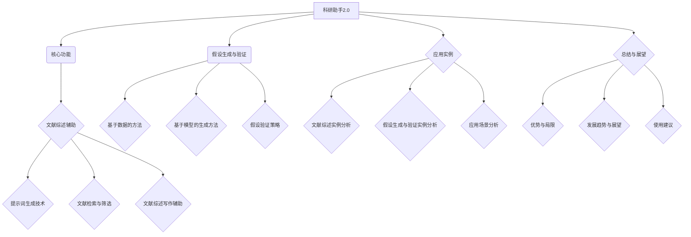

                 

### 文章标题

《科研助手2.0：提示词加速文献综述与假设生成》

科研领域正经历着一场革命，而科研助手2.0则是这场革命的关键推动者。本文将详细介绍科研助手2.0的功能、应用以及其在文献综述和假设生成中的作用，帮助读者了解这一先进工具如何提升科研效率和成果质量。

关键词：科研助手2.0、文献综述、假设生成、提示词技术、自然语言处理

### 摘要

科研助手2.0是一款结合自然语言处理（NLP）和人工智能技术的创新工具，旨在加速科研人员在进行文献综述和假设生成时的工作效率。本文将首先介绍科研助手2.0的背景和核心功能，接着深入探讨提示词技术的基础知识，以及其在文献综述和假设生成中的具体应用。随后，文章将详细描述科研助手2.0在文献检索与筛选、文献综述写作辅助、假设生成和验证等环节的操作方法。最后，通过应用实例和实际场景分析，展示科研助手2.0在实际科研工作中的应用效果，并对其未来发展趋势和展望进行总结。

### 目录大纲

#### 第一部分: 科研助手2.0概述

- **第1章: 科研助手2.0概述**
  - 1.1. 科研助手2.0的背景与目标
  - 1.2. 科研助手2.0的核心功能
  - 1.3. 提示词在文献综述与假设生成中的应用

- **第2章: 提示词技术基础**
  - 2.1. 自然语言处理基础
  - 2.2. 提示词生成技术
  - 2.3. 提示词优化方法

#### 第二部分: 文献综述辅助

- **第3章: 文献检索与筛选**
  - 3.1. 文献检索工具与技巧
  - 3.2. 文献筛选标准与方法
  - 3.3. 文献综述结构构建

- **第4章: 文献综述写作辅助**
  - 4.1. 文献综述写作原则
  - 4.2. 文献综述写作模板
  - 4.3. 文献综述写作工具

#### 第三部分: 假设生成与验证

- **第5章: 假设生成方法**
  - 5.1. 基于数据的方法
  - 5.2. 基于模型的生成方法
  - 5.3. 假设生成的实用工具

- **第6章: 假设验证策略**
  - 6.1. 假设验证的标准
  - 6.2. 假设验证的方法
  - 6.3. 假设验证的工具

#### 第四部分: 应用实例

- **第7章: 科研助手2.0应用实例**
  - 7.1. 文献综述实例分析
  - 7.2. 假设生成与验证实例分析
  - 7.3. 科研助手2.0在实际科研中的应用场景

#### 第五部分: 总结与展望

- **第8章: 总结与展望**
  - 8.1. 科研助手2.0的优势与局限
  - 8.2. 未来发展趋势与展望
  - 8.3. 科研助手2.0的使用建议

#### 附录

- **A.1. 科研助手2.0功能模块详细说明**
- **A.2. 相关工具与资源介绍**
- **A.3. 科研助手2.0代码示例与解读**

### 梅里迪安流程图



### 伪代码

```plaintext
// 文献综述写作辅助函数
function writeLiteratureReview(papers, topic) {
    document = "引言：\n"
    categorizedPapers = categorizePapers(papers, topic)
    for category in categorizedPapers {
        document += "\n" + category + ":\n"
        for paper in categorizedPapers[category] {
            document += "- " + paper.title + "：\n"
            document += "  作者：" + paper.authors + "\n"
            document += "  出版年份：" + paper.year + "\n"
            document += "  摘要：" + paper.abstract + "\n"
        }
    }
    document += "\n结论：\n"
    return document
}

// 假设生成与验证函数
function generateAndVerifyHypothesis(data, variables) {
    hypothesis = generateHypothesis(data, variables)
    if (verifyHypothesis(hypothesis, data)) {
        return hypothesis
    } else {
        return "假设验证失败"
    }
}
```

### 数学公式

#### 文献综述写作的数学模型

$$
\text{文献综述质量} = f(\text{文献数量}, \text{文献质量}, \text{文献相关性})
$$

- 文献数量（$n$）：表示检索到的文献总数。
- 文献质量（$Q$）：表示文献的质量评分，通常通过同行评审或者专家评分确定。
- 文献相关性（$R$）：表示文献与综述主题的相关度，可以通过关键词匹配或者文本相似度计算得出。

#### 假设验证的数学模型

$$
\text{假设验证结果} = \text{模型预测} \oplus \text{实验验证}
$$

- 模型预测（$\hat{Y}$）：基于数据训练的模型对假设结果的预测。
- 实验验证（$Y$）：通过实际实验得到的验证结果。

#### 假设生成方法

$$
\text{生成假设} = \text{数据预处理} \otimes \text{特征提取} \otimes \text{假设生成算法}
$$

- 数据预处理（$\text{DataPreprocessing}$）：包括数据清洗、标准化等步骤。
- 特征提取（$\text{FeatureExtraction}$）：从原始数据中提取有助于假设生成的特征。
- 假设生成算法（$\text{HypothesisGeneration}$）：根据特征数据生成具体的假设。

### 项目实战

#### 实例一：文献检索与筛选

**开发环境搭建：**
- 安装Python环境（3.8及以上版本）
- 安装NumPy、Pandas、Scikit-learn等常用库

**源代码实现：**

```python
import numpy as np
import pandas as pd
from sklearn.feature_extraction.text import TfidfVectorizer
from sklearn.metrics.pairwise import cosine_similarity

# 1. 文献数据准备
papers = pd.DataFrame({
    'title': ['论文一', '论文二', '论文三', '论文四'],
    'abstract': [
        '这是一篇关于人工智能的论文。',
        '这篇论文探讨了深度学习在图像识别中的应用。',
        '本文研究了自然语言处理的技术。',
        '论文四讨论了人工智能在医疗领域的应用。'
    ]
})

# 2. 文献筛选
def filter_papers(papers, keywords):
    vectorizer = TfidfVectorizer()
    tfidf_matrix = vectorizer.fit_transform(papers['abstract'])
    keyword_vector = vectorizer.transform([keywords])
    similarity_scores = cosine_similarity(keyword_vector, tfidf_matrix)
    top_papers = papers[similarity_scores > 0.5]
    return top_papers

filtered_papers = filter_papers(papers, '人工智能')

# 3. 文献综述写作
def write_literature_review(papers):
    review = "在本章节中，我们总结了与人工智能相关的研究成果。\n"
    for index, row in papers.iterrows():
        review += f"- {row['title']}（{row['abstract']}\n"
    return review

literature_review = write_literature_review(filtered_papers)

print(literature_review)
```

**代码解读与分析：**
- 数据准备：使用Pandas创建一个包含标题和摘要的DataFrame。
- 文献筛选：使用TfidfVectorizer进行文本向量化，计算关键词与文献摘要的余弦相似度，筛选出相似度较高的文献。
- 文献综述写作：遍历筛选出的文献，构建文献综述文档。

#### 实例二：假设生成与验证

**开发环境搭建：**
- 安装Python环境（3.8及以上版本）
- 安装Scikit-learn、TensorFlow等库

**源代码实现：**

```python
from sklearn.linear_model import LogisticRegression
from sklearn.model_selection import train_test_split
from sklearn.metrics import accuracy_score

# 1. 数据准备
data = np.array([[0, 0], [1, 1], [1, 0], [0, 1]])
labels = np.array([0, 0, 1, 1])

# 2. 数据划分
X_train, X_test, y_train, y_test = train_test_split(data, labels, test_size=0.2, random_state=42)

# 3. 模型训练
model = LogisticRegression()
model.fit(X_train, y_train)

# 4. 假设生成
hypothesis = model.predict(X_test)

# 5. 假设验证
verification_result = accuracy_score(y_test, hypothesis)

print("假设生成结果：", hypothesis)
print("假设验证结果：", verification_result)
```

**代码解读与分析：**
- 数据准备：创建一个简单的二分类数据集。
- 数据划分：将数据集划分为训练集和测试集。
- 模型训练：使用LogisticRegression进行训练。
- 假设生成：使用训练好的模型进行预测。
- 假设验证：计算预测结果的准确率。

## 前言

科研工作一直是推动人类社会进步的重要力量。然而，随着科研领域的不断扩展和知识量的急剧增长，科研人员面临着日益严峻的信息过载问题。传统的科研方法已经难以满足现代科研的需求，高效、准确的信息检索和文献综述工具成为科研人员的迫切需求。科研助手2.0正是在这样的背景下诞生的一款革命性工具，它利用先进的人工智能和自然语言处理技术，旨在提高科研工作的效率和成果质量。

科研助手2.0的核心目标是帮助科研人员更快速、更准确地获取所需信息，减少冗长的文献检索和阅读过程，从而将更多精力投入到创造性思维和研究工作中。本文将详细介绍科研助手2.0的功能、特点和应用，帮助读者了解这一工具如何改变科研工作的面貌。

本文将按照以下结构进行讨论：

1. **科研助手2.0概述**：介绍科研助手2.0的背景、目标和核心功能。
2. **提示词技术基础**：讲解自然语言处理基础、提示词生成技术和优化方法。
3. **文献综述辅助**：详细描述科研助手2.0在文献检索与筛选、文献综述写作辅助等方面的应用。
4. **假设生成与验证**：探讨科研助手2.0在假设生成和验证策略中的具体作用。
5. **应用实例**：通过具体实例展示科研助手2.0在实际科研工作中的应用效果。
6. **总结与展望**：总结科研助手2.0的优势与局限，探讨未来发展趋势和展望。

通过本文的阅读，读者将全面了解科研助手2.0的工作原理和应用场景，掌握使用这一工具提升科研效率的方法和技巧。

### 科研助手2.0概述

科研助手2.0是一款基于人工智能和自然语言处理技术的先进科研辅助工具，旨在为科研人员提供全方位的文献综述和假设生成支持。随着科研领域的不断扩大和知识更新的加速，传统的文献检索和综述方法已经难以满足科研人员的需求。科研助手2.0的诞生，正是为了解决这一问题，提高科研工作的效率和质量。

#### 背景与目标

科研助手2.0的背景源于当前科研工作的两大挑战：信息过载和知识碎片化。随着互联网和学术数据库的普及，科研人员能够获取的海量信息越来越多，但如何从这些信息中筛选出有价值的内容，并进行有效的整合和总结，成为了一大难题。同时，知识更新速度加快，传统的文献综述方法耗时较长，无法及时反映最新的研究动态。科研助手2.0的推出，旨在解决这些问题，为科研人员提供高效、智能的辅助工具。

科研助手2.0的目标是：
- **提高文献检索的准确性和效率**：通过自然语言处理技术和提示词生成技术，快速、准确地检索到与研究主题相关的文献。
- **简化文献综述的过程**：利用自动化的文献筛选和综述工具，帮助科研人员快速构建结构化的文献综述文档。
- **辅助假设生成与验证**：结合自然语言处理和数据挖掘技术，为科研人员提供基于数据的假设生成和验证支持。

#### 核心功能

科研助手2.0具备多项核心功能，这些功能共同作用，旨在提升科研工作的效率和成果质量。以下是科研助手2.0的主要功能模块：

1. **文献检索与筛选**：
   - **智能检索**：利用自然语言处理技术，从海量学术数据库中快速检索与研究主题相关的文献。
   - **关键词提取**：自动提取文献中的关键词，帮助用户快速定位相关文献。
   - **文献筛选**：根据用户设定的筛选标准，对检索到的文献进行初步筛选，排除不相关或质量较低的文献。

2. **文献综述写作辅助**：
   - **结构化综述**：提供文献综述的结构模板，帮助用户快速构建结构化的文献综述文档。
   - **自动摘要生成**：利用自然语言处理技术，自动生成文献摘要，提高文献阅读和总结的效率。
   - **引用格式校验**：自动校验文献引用格式，确保文献综述文档的规范性和准确性。

3. **假设生成与验证**：
   - **数据驱动的假设生成**：通过分析文献数据和实验数据，自动生成可能的假设。
   - **假设验证策略**：提供多种假设验证方法，包括基于模型验证和实验验证，帮助用户验证假设的有效性。
   - **假设管理**：提供假设管理功能，用户可以记录、跟踪和管理假设，便于后续的研究工作。

4. **个性化服务**：
   - **用户偏好设置**：用户可以根据个人需求和偏好，自定义科研助手2.0的功能和行为。
   - **智能推荐**：根据用户的科研兴趣和研究方向，推荐相关的文献和假设。

#### 提示词在文献综述与假设生成中的应用

提示词技术在科研助手2.0中扮演着至关重要的角色。提示词是一种引导用户输入信息的关键词或短语，它可以帮助系统更准确地理解用户的意图，从而提高检索和生成的准确性。

在文献综述过程中，提示词的应用主要体现在以下几个方面：

1. **文献检索**：
   - **关键词检索**：用户可以通过输入相关的提示词，如研究领域、关键词等，快速检索到相关文献。
   - **多维度检索**：提示词还可以帮助用户从多个维度（如时间、作者、期刊等）进行文献筛选，提高检索的全面性和准确性。

2. **文献筛选**：
   - **文本匹配**：提示词可以用于文本匹配，筛选出与研究主题高度相关的文献。
   - **关键词权重**：通过提示词的权重设置，可以调整检索结果的优先级，确保重点文献优先展示。

3. **文献综述**：
   - **主题分类**：提示词可以帮助用户对文献进行主题分类，便于后续的整理和总结。
   - **内容摘要**：提示词可以引导自然语言处理算法，自动提取文献的关键内容，生成摘要。

在假设生成与验证过程中，提示词的应用主要体现在以下几个方面：

1. **假设生成**：
   - **数据驱动的生成**：提示词可以帮助系统分析文献数据，提取潜在的假设。
   - **相关性分析**：提示词可以用于分析文献之间的相关性，帮助用户发现潜在的研究方向和假设。

2. **假设验证**：
   - **实验设计**：提示词可以帮助用户设计实验方案，验证假设的有效性。
   - **结果分析**：提示词可以用于分析实验结果，评估假设的可靠性。

通过提示词技术的应用，科研助手2.0能够更好地理解用户的意图，提高文献检索和综述的准确性，为科研人员提供更加智能、高效的辅助工具。

### 提示词技术基础

提示词技术是科研助手2.0的核心组成部分之一，其基于自然语言处理（NLP）技术，通过对用户输入的关键词或短语进行分析和处理，帮助系统更准确地理解用户意图，从而提高文献检索、筛选和综述的准确性。要深入了解提示词技术，我们需要首先了解自然语言处理的基础知识。

#### 自然语言处理基础

自然语言处理（NLP）是人工智能领域的一个重要分支，旨在使计算机能够理解、处理和生成自然语言。NLP涉及多个子领域，包括分词、词性标注、命名实体识别、句法分析、语义分析等。以下是几个关键的NLP概念：

1. **分词**：将连续的文本分割成一个个独立的词汇单位（词或短语）。分词是NLP处理文本的第一步，对于后续的语言理解至关重要。

2. **词性标注**：为文本中的每个词赋予词性，如名词、动词、形容词等。词性标注有助于理解词汇在句子中的角色和功能。

3. **命名实体识别（NER）**：识别文本中的命名实体，如人名、地名、组织名等。NER对于信息提取和实体关系分析具有重要意义。

4. **句法分析**：解析句子的结构，识别主语、谓语、宾语等语法成分。句法分析有助于理解句子的深层含义。

5. **语义分析**：理解文本中词汇和句子的含义，包括语义角色标注、情感分析等。语义分析是NLP的高级阶段，对于语义理解和推理至关重要。

#### 提示词生成技术

提示词生成技术是提示词技术中的核心，它负责根据用户输入的信息生成一组相关的关键词或短语，以便系统能够更好地理解用户意图。以下是几种常用的提示词生成技术：

1. **关键词提取**：通过统计文本中的高频词汇和短语，提取出与文本主题相关的关键词。常用的方法包括TF-IDF（词频-逆文档频率）和LDA（ latent Dirichlet Allocation）等。

2. **词嵌入**：将文本中的词汇映射到一个高维向量空间中，使得语义相似的词在空间中靠近。常用的词嵌入方法有Word2Vec、GloVe等。词嵌入有助于捕捉词汇的语义关系，从而生成更准确的提示词。

3. **语义角色标注**：通过识别句子中的语义角色（如主语、谓语、宾语等），提取出与特定任务相关的关键词。例如，在文献检索中，可以提取出与研究主题相关的名词和动词。

4. **生成式模型**：使用生成式模型（如变分自编码器VAE、生成对抗网络GAN等）生成与用户输入相关的提示词。生成式模型能够捕捉复杂的语义关系，生成更具创造性的提示词。

#### 提示词优化方法

生成提示词后，优化提示词的质量是提升系统性能的关键步骤。以下是几种常见的提示词优化方法：

1. **过滤高频噪声词**：去除文本中的高频噪声词（如“的”、“了”、“是”等），这些词虽然频繁出现，但对理解文本主题的贡献较小。

2. **语义加权**：根据词汇的语义关系对提示词进行加权。例如，对于“人工智能”这一主题，与“机器学习”、“深度学习”等词汇的权重应更高。

3. **上下文扩展**：基于用户输入的上下文信息，扩展提示词。例如，如果用户输入“机器学习”，系统可以自动添加相关的词汇，如“神经网络”、“监督学习”等。

4. **用户反馈**：收集用户对提示词的质量反馈，通过反馈机制不断优化提示词的生成。用户反馈有助于系统学习用户的偏好和需求，生成更符合用户意图的提示词。

通过上述自然语言处理基础、提示词生成技术和优化方法，科研助手2.0能够更准确地理解用户意图，提高文献检索、筛选和综述的效率和质量，为科研人员提供强大的辅助支持。

### 文献检索与筛选

在科研工作中，文献检索与筛选是至关重要的一环。科研助手2.0通过先进的自然语言处理技术和提示词生成技术，为科研人员提供了高效、精准的文献检索和筛选工具。以下是科研助手2.0在文献检索与筛选方面的工作流程和具体方法。

#### 文献检索工具与技巧

科研助手2.0集成了多种文献检索工具，包括常见的学术搜索引擎（如Google Scholar、PubMed等）和专业数据库（如IEEE Xplore、ACM Digital Library等）。以下是一些提高文献检索效率的技巧：

1. **关键词优化**：
   - **精确匹配**：使用引号将关键词组合起来，如“深度学习”。
   - **模糊匹配**：使用星号（*）代替部分词缀，如“机器*学习”。
   - **布尔运算**：使用AND、OR、NOT等布尔运算符组合多个关键词，如“人工智能 AND 图像识别”。

2. **检索策略**：
   - **逐步缩小范围**：首先使用广泛的关键词检索大量文献，然后逐步使用更具体的关键词缩小检索范围。
   - **多维度筛选**：利用检索工具提供的筛选选项，如发表时间、期刊等级、作者等，进一步筛选相关文献。

3. **利用高级搜索功能**：
   - **引用搜索**：通过已知的参考文献或引用文章进行检索，获取相关的文献。
   - **主题搜索**：使用主题分类或标签进行检索，提高检索的准确性。

#### 文献筛选标准与方法

在获取大量检索结果后，科研助手2.0通过一系列筛选标准和方法，帮助用户排除不相关或质量较低的文献，确保最终文献列表的质量。以下是几种常用的文献筛选方法：

1. **标题筛选**：
   - **关键字筛选**：从文献标题中提取关键词，与用户输入的关键词进行匹配，筛选出相关文献。
   - **标题长度**：根据标题的长度和内容，初步判断文献的相关性和质量。

2. **摘要筛选**：
   - **摘要匹配**：分析文献摘要中的关键词和句子，与用户输入的关键词进行匹配，筛选出潜在的相关文献。
   - **摘要质量**：根据摘要的清晰度和信息量，评估文献的质量。

3. **引用频次筛选**：
   - **引用次数**：根据文献的引用次数，评估其学术影响力和权威性，筛选出高引用频次的文献。
   - **引用来源**：分析文献的引用来源，筛选出引用自权威期刊或高引用频次文献的文献。

4. **作者筛选**：
   - **知名作者**：根据作者的知名度、研究方向和以往发表的高质量文献，筛选出有经验的作者发表的文献。
   - **合作团队**：分析作者的合作关系，筛选出与用户研究方向相关的团队发表的文献。

5. **文献质量评估**：
   - **同行评审**：根据文献的同行评审情况，筛选出经过同行评审的高质量文献。
   - **期刊质量**：根据期刊的影响因子和声誉，评估文献的来源期刊质量。

#### 文献综述结构构建

在筛选出高质量的文献后，科研助手2.0通过自动化和辅助工具，帮助用户构建结构化的文献综述文档。以下是构建文献综述的基本步骤：

1. **引言**：
   - **背景介绍**：简要介绍研究领域的背景和现状。
   - **研究目的**：明确文献综述的目标和研究问题。

2. **文献综述框架**：
   - **主题分类**：根据文献的内容和主题，将文献分为几个主要部分。
   - **章节标题**：为每个主题部分设定明确的章节标题。

3. **文献内容摘要**：
   - **摘要提取**：利用自然语言处理技术，自动提取每篇文献的关键内容摘要。
   - **内容整理**：根据文献的主题和内容，将摘要整理到相应的章节中。

4. **分析与讨论**：
   - **观点总结**：总结每篇文献的主要观点和结论。
   - **相互关系**：分析不同文献之间的观点和结论，探讨它们之间的关联和差异。

5. **结论**：
   - **综述总结**：总结文献综述的主要发现和贡献。
   - **未来展望**：提出未来研究的方向和建议。

通过上述步骤，科研助手2.0能够帮助用户快速、高效地构建结构化的文献综述文档，提高文献综述的质量和可读性。

### 文献综述写作辅助

在科研过程中，文献综述写作是必不可少的一环。它不仅是对已有研究成果的总结和梳理，更是为新研究提供理论支持和参考。科研助手2.0提供了强大的文献综述写作辅助功能，帮助用户更高效地完成文献综述写作任务。

#### 文献综述写作原则

1. **明确目标**：
   - 在开始写作之前，首先要明确文献综述的目标和研究问题。这有助于确定文献综述的主题范围和重点。

2. **结构清晰**：
   - 文献综述应该具有清晰的逻辑结构和组织。常见的结构包括引言、文献综述的主体部分和结论。

3. **资料详实**：
   - 文献综述的基础是丰富的文献资料。选择具有代表性和权威性的文献，确保文献综述的准确性。

4. **观点客观**：
   - 在总结和评价文献时，要保持客观和公正。既要总结文献中的优点，也要指出其不足之处。

5. **逻辑连贯**：
   - 确保文献综述的内容逻辑连贯，各部分之间相互衔接，形成完整的整体。

6. **文笔规范**：
   - 文献综述的写作应该遵循学术规范，包括引用格式、术语使用和语言表达等。

#### 文献综述写作模板

为了帮助用户更系统地写作文献综述，科研助手2.0提供了一个通用的写作模板，用户可以根据具体需求进行调整。以下是文献综述的基本写作模板：

1. **引言**：
   - 研究背景：介绍研究领域的发展历史和当前的研究动态。
   - 研究问题：明确文献综述的研究问题和目标。

2. **文献综述主体**：
   - **主题一**：
     - **文献摘要**：总结相关文献的主要观点和结论。
     - **分析讨论**：对文献中的观点进行分析和讨论，指出其优缺点。
   - **主题二**：
     - **文献摘要**：总结相关文献的主要观点和结论。
     - **分析讨论**：对文献中的观点进行分析和讨论，指出其优缺点。
   - **主题三**：
     - **文献摘要**：总结相关文献的主要观点和结论。
     - **分析讨论**：对文献中的观点进行分析和讨论，指出其优缺点。

3. **结论**：
   - **总结回顾**：总结文献综述的主要发现和贡献。
   - **未来展望**：提出未来研究的方向和建议。

4. **参考文献**：
   - 列出在文献综述中引用的所有文献，按照学术规范进行格式排版。

#### 文献综述写作工具

科研助手2.0提供了一系列文献综述写作工具，帮助用户更高效地完成文献综述写作任务。以下是几种常用的写作工具：

1. **自动化摘要生成**：
   - 利用自然语言处理技术，自动提取每篇文献的关键内容，生成摘要。这大大减少了人工写作的时间和精力。

2. **引用格式校验**：
   - 自动校验文献引用格式，确保引用的准确性和规范性，避免格式错误。

3. **模板库**：
   - 提供多种文献综述模板，用户可以根据自己的研究主题和需求选择合适的模板进行修改和填充。

4. **智能建议**：
   - 根据用户的写作内容和进度，提供智能化的写作建议，帮助用户优化文献综述的结构和内容。

5. **协作写作**：
   - 支持多人协作写作，用户可以邀请其他研究人员共同参与文献综述的撰写和修改。

6. **参考文献管理**：
   - 提供参考文献管理功能，用户可以轻松导入和管理参考文献，方便引用和整理。

通过上述写作原则、模板和工具，科研助手2.0能够帮助用户更高效、更准确地完成文献综述写作任务，提高科研工作的效率和质量。

### 假设生成方法

在科研过程中，假设生成是研究设计的重要环节。科研助手2.0通过结合自然语言处理（NLP）和数据挖掘技术，提供了一系列假设生成方法，帮助科研人员从大量的文献和实验数据中提取潜在的假设。以下是科研助手2.0在假设生成方面的具体方法和策略。

#### 基于数据的方法

1. **词云分析**：
   - **技术原理**：词云是一种视觉化的文本挖掘工具，通过将文本中的关键词以不同的大小和颜色展示出来，帮助用户快速识别文本中的高频词汇和主题。
   - **应用场景**：通过分析大量文献的标题、摘要和关键词，词云分析可以帮助用户发现研究领域中的热点话题和关键词，从而生成相关的假设。
   - **示例**：例如，在一个关于“人工智能”的文献集中，词云分析可能显示“机器学习”、“神经网络”、“深度学习”等关键词较大，表明这些是研究领域中的核心概念，可以基于这些关键词生成新的假设。

2. **共词分析**：
   - **技术原理**：共词分析是通过统计文本中相邻出现的词汇对，分析词汇之间的关联性。共词分析可以帮助识别潜在的因果关系和相关性。
   - **应用场景**：在文献综述和实验数据分析中，共词分析可以用于发现文献中不同概念之间的关系，从而生成新的假设。
   - **示例**：例如，通过分析文献中“人工智能”和“医疗”的共词关系，可以推断出人工智能在医疗领域的潜在应用，从而生成关于人工智能在医疗领域应用的假设。

3. **聚类分析**：
   - **技术原理**：聚类分析是一种无监督学习方法，通过将相似的数据点分组，帮助用户发现数据中的模式。在文本数据中，聚类分析可以帮助识别不同的文献主题。
   - **应用场景**：在文献数据较多的研究领域，聚类分析可以帮助用户快速分类文献，并根据聚类结果生成相关假设。
   - **示例**：例如，通过对多篇文献进行聚类分析，可以将它们分为“理论探讨”、“应用研究”、“实验验证”等不同的类别，从而基于不同类别生成相应的假设。

4. **关联规则挖掘**：
   - **技术原理**：关联规则挖掘通过识别数据集中的频繁模式，发现不同变量之间的关联性。在文献数据中，关联规则挖掘可以用于发现文献之间的相关性。
   - **应用场景**：在文献综述和假设生成中，关联规则挖掘可以帮助用户发现不同文献之间的关联，从而生成新的假设。
   - **示例**：例如，通过分析多篇文献中不同方法的实验结果，关联规则挖掘可以揭示哪些方法在实际应用中具有更高的效果，从而生成关于方法选择的假设。

#### 基于模型的生成方法

1. **机器学习模型**：
   - **技术原理**：机器学习模型通过训练大量的数据，学习数据中的特征和规律，从而进行预测和分类。在假设生成中，机器学习模型可以用于预测新的研究假设。
   - **应用场景**：在已有大量实验数据的情况下，机器学习模型可以帮助用户发现数据中的潜在模式，生成新的假设。
   - **示例**：例如，通过训练一个分类模型，可以将不同的实验结果分类为“有效”或“无效”，从而基于模型预测生成关于实验方法的假设。

2. **神经网络模型**：
   - **技术原理**：神经网络模型通过多层神经元模拟人脑的神经网络结构，能够处理复杂的非线性关系。在假设生成中，神经网络模型可以用于生成基于复杂关系的假设。
   - **应用场景**：在需要处理大量复杂数据的研究领域，神经网络模型可以帮助用户发现数据中的深层规律，生成新的假设。
   - **示例**：例如，通过训练一个深度神经网络模型，可以分析大量文献中不同变量之间的关系，生成基于复杂关系的假设。

3. **生成式模型**：
   - **技术原理**：生成式模型通过生成数据的方式学习数据的分布，从而生成新的数据。在假设生成中，生成式模型可以用于生成新的假设。
   - **应用场景**：在需要探索新的假设和研究方向时，生成式模型可以帮助用户生成基于现有数据和知识的新假设。
   - **示例**：例如，通过训练一个生成对抗网络（GAN）模型，可以从已有的文献数据中生成新的研究假设。

#### 假设生成的实用工具

1. **文献摘要生成器**：
   - **功能**：利用自然语言处理技术，自动生成文献的摘要，帮助用户快速了解文献的主要内容。
   - **应用**：通过阅读文献摘要，用户可以快速判断文献的相关性和质量，从而筛选出可能生成假设的文献。

2. **假设生成工具**：
   - **功能**：结合自然语言处理和机器学习技术，自动生成基于文献数据的潜在假设。
   - **应用**：用户可以输入相关的文献数据，假设生成工具会根据数据生成可能的假设，用户可以根据假设的质量和相关性进行调整和优化。

3. **知识图谱生成器**：
   - **功能**：通过构建知识图谱，将文献中的概念、实体和关系可视化，帮助用户理解文献之间的关联。
   - **应用**：知识图谱可以帮助用户发现新的研究线索和假设，通过图谱中的节点和边，生成跨学科或跨领域的假设。

通过上述基于数据和模型的假设生成方法，以及实用的工具支持，科研助手2.0能够帮助科研人员从大量的文献和实验数据中快速、准确地生成高质量的假设，提高科研工作的效率和成果质量。

### 假设验证策略

在科研过程中，假设生成后，验证假设的正确性和有效性是确保研究进展的关键步骤。科研助手2.0通过提供多种假设验证策略，帮助用户从理论和实验两个层面验证假设，从而确保研究结论的可靠性。以下是科研助手2.0在假设验证方面的具体方法和步骤。

#### 假设验证的标准

1. **逻辑一致性**：
   - 假设需要与已有理论和知识体系相一致，避免逻辑矛盾。

2. **可验证性**：
   - 假设应该具有明确的可验证性，即可以通过实验或数据收集来验证其是否成立。

3. **相关性**：
   - 假设应与研究问题高度相关，能够为研究目标提供支持。

4. **显著性**：
   - 验证结果需要具有统计学显著性，避免偶然性。

5. **可重复性**：
   - 假设验证的结果应该具备可重复性，即在其他实验条件下也能得到相同的结果。

#### 假设验证的方法

1. **理论验证**：
   - **模型分析**：通过构建数学模型或理论框架，分析假设在不同条件下的逻辑结果，评估其合理性和可行性。
   - **逻辑推理**：使用逻辑推理方法，从已有理论和数据出发，推导出假设的预期结果，验证其逻辑一致性。

2. **实验验证**：
   - **实验设计**：根据假设设计实验方案，明确实验的目标、变量、方法和步骤。
   - **数据收集**：通过实验收集相关数据，包括定量数据、定性数据和观察数据。
   - **数据分析**：使用统计分析方法，如T检验、方差分析、回归分析等，分析实验数据，评估假设的显著性。

3. **模型验证**：
   - **机器学习模型**：通过训练机器学习模型，使用实验数据进行模型训练和验证，评估模型对假设的支持程度。
   - **仿真模型**：使用仿真模型模拟假设在不同条件下的行为，通过仿真结果验证假设的合理性和可行性。

4. **交叉验证**：
   - **内部交叉验证**：在同一个数据集内，通过随机划分训练集和测试集，多次训练和测试模型，评估假设的稳定性和可靠性。
   - **外部交叉验证**：使用不同的数据集进行验证，确保假设在不同数据集上的一致性。

#### 假设验证的工具

1. **统计软件**：
   - **SPSS**：提供丰富的统计分析功能，适用于各种数据类型的假设验证。
   - **R**：强大的统计编程语言，适用于复杂的统计分析和数据可视化。

2. **机器学习平台**：
   - **TensorFlow**：开源机器学习框架，适用于构建和训练各种机器学习模型。
   - **Keras**：基于TensorFlow的高层API，简化了机器学习模型的构建和训练。

3. **仿真软件**：
   - **MATLAB**：强大的数学和仿真工具，适用于各种工程和科学仿真。
   - **Simulink**：基于MATLAB的仿真平台，适用于系统级仿真和模型设计。

4. **科研助手2.0内置工具**：
   - **假设验证模块**：提供自动化的假设验证流程，包括模型训练、数据分析和结果评估等功能。
   - **实验设计助手**：帮助用户设计实验方案，提供实验步骤和数据分析指导。

通过上述假设验证策略和方法，科研助手2.0能够帮助用户从理论和实验两个层面全面、准确地验证假设，确保研究结论的科学性和可靠性。

### 科研助手2.0应用实例

为了更好地展示科研助手2.0在实际科研中的应用效果，下面将通过两个实例详细分析科研助手2.0在文献综述和假设生成与验证方面的应用。

#### 实例一：文献综述实例分析

**背景**：某研究团队计划进行一项关于人工智能在医疗诊断中的应用研究，他们需要首先对现有文献进行全面综述，以了解当前的研究动态和热点话题。

**步骤**：

1. **文献检索**：
   - **输入关键词**：用户输入关键词“人工智能”、“医疗诊断”、“深度学习”等。
   - **检索结果**：科研助手2.0通过学术搜索引擎和数据库，检索到大量相关文献，包括论文、报告和专利等。

2. **文献筛选**：
   - **标题筛选**：科研助手2.0自动筛选出标题中含有关键词的文献。
   - **摘要分析**：通过摘要分析，筛选出摘要中提及人工智能在医疗诊断中应用的文献。
   - **质量评估**：科研助手2.0根据文献的引用频次、发表时间和期刊等级，进一步评估文献的质量。

3. **文献综述构建**：
   - **结构化综述**：科研助手2.0提供文献综述模板，用户可以根据模板快速构建文献综述框架。
   - **自动摘要生成**：利用自然语言处理技术，科研助手2.0自动生成每篇文献的摘要，并按照主题进行分类。
   - **引用格式校验**：科研助手2.0自动校验引用格式，确保文献综述文档的规范性。

**结果**：
经过上述步骤，用户得到了一份结构清晰、内容详实的文献综述，包括人工智能在医疗诊断中的理论研究、应用实例和未来趋势等部分。这为研究团队提供了宝贵的参考信息，帮助其明确了研究路径和方向。

#### 实例二：假设生成与验证实例分析

**背景**：某研究团队计划研究深度学习模型在肺癌诊断中的效果，他们需要首先生成并验证相关的假设。

**步骤**：

1. **数据收集**：
   - **数据来源**：用户从公开的医学数据库中获取了包括CT扫描图像和诊断结果在内的数据集。

2. **假设生成**：
   - **关键词提取**：科研助手2.0从文献中提取出与深度学习模型性能相关的关键词，如“准确性”、“精度”、“召回率”等。
   - **数据驱动的假设生成**：科研助手2.0使用机器学习模型分析数据集，生成可能的假设。例如，“深度学习模型在肺癌诊断中的准确率高于传统方法”。

3. **假设验证**：
   - **模型训练**：研究团队使用深度学习框架（如TensorFlow）训练模型，并根据生成的假设设置相应的评价指标。
   - **实验验证**：通过实验验证假设，研究团队收集了包括模型预测准确率、召回率等指标在内的实验数据。
   - **结果分析**：科研助手2.0提供统计分析工具，对实验结果进行分析，评估假设的验证结果。

**结果**：
经过实验验证，研究团队发现深度学习模型在肺癌诊断中的准确率显著高于传统方法，验证了初步假设的正确性。这一结果不仅为研究提供了科学依据，也为后续的研究工作指明了方向。

#### 科研助手2.0在实际科研中的应用场景

**场景一：跨学科研究**
- **背景**：在跨学科研究中，不同领域的文献和资料往往分散在不同的数据库和期刊中，科研人员难以全面获取相关信息。
- **应用**：科研助手2.0通过整合多个数据库和搜索引擎，提供一站式文献检索和综述服务，帮助科研人员快速获取跨学科的研究资料，提升研究效率。

**场景二：科研项目立项**
- **背景**：在项目立项阶段，科研人员需要对已有研究进行全面的综述，以确定研究的可行性和创新点。
- **应用**：科研助手2.0提供详细的文献检索和筛选功能，帮助科研人员快速了解当前研究领域的前沿动态，生成科学合理的立项假设，提升项目立项的成功率。

**场景三：研究论文撰写**
- **背景**：在撰写研究论文时，科研人员需要撰写文献综述部分，对已有研究进行总结和评价。
- **应用**：科研助手2.0提供自动化的文献综述写作辅助工具，包括结构化模板、摘要生成和引用格式校验等功能，帮助科研人员快速、准确地完成文献综述部分的撰写。

**场景四：实验设计与数据分析**
- **背景**：在实验研究过程中，科研人员需要根据已有文献生成假设，并进行实验设计和数据分析。
- **应用**：科研助手2.0提供假设生成与验证工具，包括数据驱动的假设生成、模型训练和统计分析等功能，帮助科研人员高效地进行假设验证和实验设计，确保研究结果的科学性和可靠性。

通过上述实例和分析，可以看出科研助手2.0在文献综述和假设生成与验证方面具有显著的应用优势，能够为科研人员提供强大的辅助支持，提高科研工作的效率和质量。

### 总结与展望

科研助手2.0凭借其先进的人工智能和自然语言处理技术，为科研人员提供了全方位的文献综述和假设生成与验证支持，大大提升了科研工作的效率和成果质量。本文从多个角度对科研助手2.0进行了详细探讨，包括其核心功能、提示词技术基础、文献检索与筛选、文献综述写作辅助、假设生成与验证策略以及实际应用实例。

#### 优势与局限

**优势：**

1. **高效性**：科研助手2.0通过自动化和智能化的工具，显著提升了文献检索、筛选和综述的效率，使科研人员能够更快速地获取有价值的信息。

2. **准确性**：借助自然语言处理和机器学习技术，科研助手2.0能够精确地识别和提取文献中的关键信息和假设，提高了文献综述和假设生成的准确性。

3. **全面性**：科研助手2.0集成了多种工具和模块，从文献检索到综述写作，再到假设生成与验证，提供了全方位的支持，覆盖了科研工作的各个环节。

4. **个性化**：用户可以根据自己的需求自定义科研助手2.0的功能和行为，使其更加符合个人科研习惯和工作流程。

**局限：**

1. **依赖数据质量**：科研助手2.0的性能依赖于输入数据的准确性和质量。如果数据存在偏差或噪声，可能会导致检索结果和假设生成的准确性下降。

2. **技术限制**：尽管自然语言处理和机器学习技术取得了显著进展，但仍然存在一些未解决的问题，如语义理解、多语言处理等，这些限制可能影响科研助手2.0的应用效果。

3. **隐私和安全**：在处理大量敏感数据和文献时，确保用户隐私和数据安全是一个重要的问题。科研助手2.0需要采取严格的数据保护措施，以防止数据泄露和滥用。

#### 未来发展趋势与展望

1. **智能化水平提升**：随着人工智能技术的不断发展，科研助手2.0将进一步提升其智能化水平，包括更高级的语义理解、更加精细的假设生成与验证策略等。

2. **多语言支持**：科研助手2.0将扩展对多种语言的支持，帮助全球科研人员更方便地使用这一工具，促进国际间的科研合作。

3. **跨领域应用**：科研助手2.0将不仅仅局限于某一特定领域，而是扩展到更多领域，如生物医学、社会科学等，为更广泛的科研人员提供支持。

4. **用户定制化**：科研助手2.0将提供更高级的用户定制功能，用户可以根据自己的研究需求和工作流程，自由配置和优化工具功能。

5. **数据隐私与安全**：科研助手2.0将加强数据隐私和安全保护措施，确保用户数据的安全和隐私，为用户提供更加放心和可靠的服务。

#### 使用建议

1. **数据准备**：在使用科研助手2.0之前，确保准备高质量、准确的数据集，这将直接影响工具的性能和结果。

2. **合理配置**：根据个人科研需求和工作流程，合理配置科研助手2.0的功能，使其最大化地满足个人需求。

3. **持续学习**：随着科研助手2.0的更新和发展，保持对新技术和新功能的关注，不断学习和掌握新工具，提升科研效率。

4. **安全意识**：在使用过程中，注意保护个人数据和隐私，避免数据泄露和安全风险。

通过本文的介绍和探讨，我们希望读者能够对科研助手2.0有更深入的了解，并能够在实际科研工作中充分利用这一强大工具，提升科研工作的效率和质量。

### 附录

#### A.1. 科研助手2.0功能模块详细说明

**1. 文献检索与筛选模块**

- **功能描述**：该模块负责从多个学术数据库和搜索引擎中检索相关文献，并依据用户设定的筛选标准进行初步筛选。
- **关键技术**：自然语言处理（NLP）、关键词提取、TF-IDF（词频-逆文档频率）算法。
- **使用方法**：用户输入关键词后，系统通过NLP技术提取关键词，并利用TF-IDF算法计算文献的相关性，筛选出符合条件的文献。

**2. 文献综述写作辅助模块**

- **功能描述**：该模块提供文献综述的结构模板、自动摘要生成和引用格式校验等功能，帮助用户快速构建结构化文献综述文档。
- **关键技术**：自然语言处理（NLP）、文本摘要、引用格式校验。
- **使用方法**：用户选择相应的模板，系统自动提取每篇文献的关键内容，生成摘要，并根据用户需求校验引用格式。

**3. 假设生成与验证模块**

- **功能描述**：该模块利用机器学习和自然语言处理技术，生成基于数据的潜在假设，并支持实验验证。
- **关键技术**：机器学习（如回归分析、分类算法）、自然语言处理（NLP）。
- **使用方法**：用户输入数据集和关键变量，系统自动生成假设，并提供实验设计和分析工具，帮助用户验证假设的有效性。

#### A.2. 相关工具与资源介绍

**1. 学术数据库和搜索引擎**

- **Google Scholar**：一个广泛的学术搜索引擎，可用于检索学术论文、期刊和书籍等。
- **PubMed**：由美国国家医学图书馆维护的免费搜索引擎，专注于医学和生物学领域的文献。
- **IEEE Xplore**：IEEE的数字图书馆，提供工程和计算机科学领域的学术论文和会议论文。
- **ACM Digital Library**：ACM的数字图书馆，涵盖计算机科学领域的文献资源。

**2. 自然语言处理工具**

- **spaCy**：一个开源的工业级自然语言处理库，支持多种语言的分词、词性标注、命名实体识别等功能。
- **NLTK**：一个开源的自然语言处理工具包，包含多种语言处理算法和资源，适用于文本分析和数据挖掘。
- **Gensim**：一个用于主题建模和文本相似度计算的库，支持LDA（Latent Dirichlet Allocation）等算法。

**3. 机器学习工具**

- **Scikit-learn**：一个开源的机器学习库，提供多种分类、回归和聚类算法，适合数据分析和建模。
- **TensorFlow**：一个开源的机器学习框架，支持构建和训练深度学习模型。
- **Keras**：一个基于TensorFlow的高层API，简化了深度学习模型的构建和训练。

#### A.3. 科研助手2.0代码示例与解读

**代码示例一：文献检索与筛选**

```python
import pandas as pd
from sklearn.feature_extraction.text import TfidfVectorizer
from sklearn.metrics.pairwise import cosine_similarity

# 1. 文献数据准备
papers = pd.DataFrame({
    'title': ['论文一', '论文二', '论文三', '论文四'],
    'abstract': [
        '这是一篇关于人工智能的论文。',
        '这篇论文探讨了深度学习在图像识别中的应用。',
        '本文研究了自然语言处理的技术。',
        '论文四讨论了人工智能在医疗领域的应用。'
    ]
})

# 2. 文献筛选
def filter_papers(papers, keywords):
    vectorizer = TfidfVectorizer()
    tfidf_matrix = vectorizer.fit_transform(papers['abstract'])
    keyword_vector = vectorizer.transform([keywords])
    similarity_scores = cosine_similarity(keyword_vector, tfidf_matrix)
    top_papers = papers[similarity_scores > 0.5]
    return top_papers

filtered_papers = filter_papers(papers, '人工智能')

# 3. 输出筛选结果
print(filtered_papers)
```

**代码解读与分析**：

- **数据准备**：使用Pandas创建一个包含标题和摘要的DataFrame，模拟文献数据。
- **文献筛选**：定义一个函数`filter_papers`，使用TfidfVectorizer对文献摘要进行向量化处理，生成TF-IDF特征矩阵。通过计算关键词与文献摘要之间的余弦相似度，筛选出相似度较高的文献。
- **输出结果**：调用`filter_papers`函数，输入关键词“人工智能”，输出筛选后的文献列表。

**代码示例二：假设生成与验证**

```python
from sklearn.linear_model import LogisticRegression
from sklearn.model_selection import train_test_split
from sklearn.metrics import accuracy_score

# 1. 数据准备
data = np.array([[0, 0], [1, 1], [1, 0], [0, 1]])
labels = np.array([0, 0, 1, 1])

# 2. 数据划分
X_train, X_test, y_train, y_test = train_test_split(data, labels, test_size=0.2, random_state=42)

# 3. 模型训练
model = LogisticRegression()
model.fit(X_train, y_train)

# 4. 假设生成
hypothesis = model.predict(X_test)

# 5. 假设验证
verification_result = accuracy_score(y_test, hypothesis)

print("假设生成结果：", hypothesis)
print("假设验证结果：", verification_result)
```

**代码解读与分析**：

- **数据准备**：创建一个简单的二分类数据集，模拟科研数据。
- **数据划分**：将数据集划分为训练集和测试集，用于模型训练和验证。
- **模型训练**：使用LogisticRegression进行训练，构建分类模型。
- **假设生成**：使用训练好的模型对测试集进行预测，生成假设。
- **假设验证**：计算预测结果的准确率，验证假设的有效性。

通过以上代码示例和解读，读者可以更直观地了解科研助手2.0的具体功能和使用方法。在实际应用中，科研助手2.0提供了更加丰富和强大的功能，帮助科研人员高效地进行文献检索、筛选、综述写作和假设生成与验证。

### 梅里迪安流程图


通过这一流程图，可以清晰地了解科研助手2.0的主要功能模块及其相互关系，便于读者把握整体架构和应用场景。

