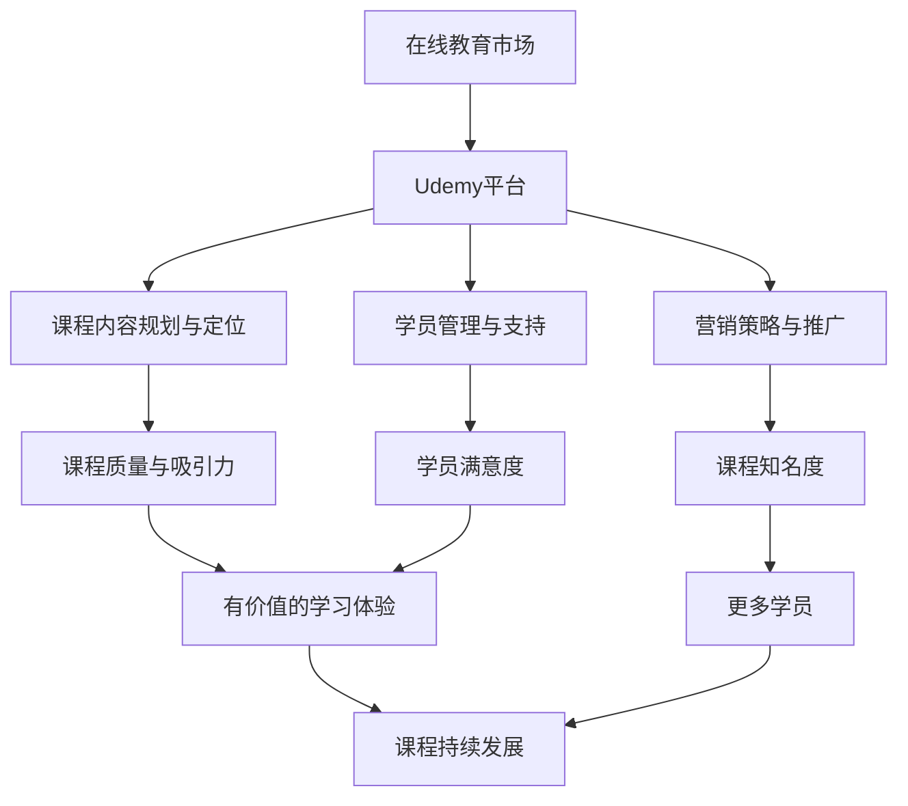

                 

# {文章标题}

> {关键词：Udemy, 在线课程销售, 程序员, 教育市场, 营销策略}

> {摘要：本文深入探讨了程序员如何利用Udemy平台进行在线课程销售。通过详细的准备、实施和持续成长阶段分析，本文提供了实用的方法和策略，帮助程序员在竞争激烈的在线教育市场中脱颖而出。}

## 第一部分：准备阶段

### 第1章：在线教育市场概述

在当今数字化时代，在线教育市场正以惊人的速度增长。根据市场研究公司的报告，全球在线教育市场规模预计将在未来几年内达到数千亿美元。这个市场涵盖了各种学科和领域，包括编程和技术课程，为程序员提供了一个广阔的舞台。

#### 1.1 在线教育行业背景分析

在线教育的兴起主要得益于以下几个因素：

1. **技术进步**：互联网、移动设备和云计算技术的快速发展使得在线学习变得更加便捷和高效。
2. **经济因素**：经济压力促使人们寻求更灵活、成本效益更高的学习方式。
3. **教育需求**：随着知识的快速更新，人们需要不断学习新技能以保持竞争力。
4. **社会趋势**：工作与生活的平衡变得越来越重要，在线教育提供了更多自主学习的机会。

#### 1.2 Udemy平台介绍

Udemy是一个全球领先的在线学习平台，拥有超过5,000,000名学生和40,000多名教师。它提供了一个开放的市场，允许任何有技能的人创建和销售自己的在线课程。以下是Udemy平台的一些亮点：

1. **课程多样性**：Udemy提供了超过80,000门课程，覆盖计算机科学、商业、健康与健身、艺术等多个领域。
2. **灵活的学习模式**：学生可以根据自己的时间表学习，随时开始和暂停课程。
3. **互动性**：学生可以在论坛中提问、参与讨论，与老师和同学互动。
4. **认证证书**：完成课程的学生可以获得Udemy提供的官方证书。

#### 1.3 Udemy用户行为分析

了解Udemy的用户行为对于制定有效的课程销售策略至关重要。以下是一些关键的用户行为分析：

1. **受众群体**：Udemy的主要用户是职场人士、学生和自由职业者，他们寻求提升职业技能或学习新知识。
2. **学习习惯**：用户更喜欢视频课程和互动式学习，他们倾向于在较短的时间内学习具体技能。
3. **购买决策**：用户在购买课程时通常会参考课程评价、讲师资质和课程内容。

#### 1.4 课程内容规划与定位

为了在Udemy上成功销售课程，程序员需要制定详细的课程内容规划与定位策略：

1. **市场研究**：研究目标受众的需求和兴趣点，了解他们正在寻找什么类型的课程。
2. **课程定位**：确定课程的主题、目标和学习成果，确保与市场需求和受众期望相符。
3. **内容规划**：制定详细的教学大纲，包括课程结构、每个模块的内容和教学目标。
4. **差异化策略**：考虑如何使课程与竞争对手区分开来，可能包括独特的教学方法、案例研究和实践经验。

### 结论

通过以上分析，程序员可以更好地了解在线教育市场的现状、Udemy平台的特点和用户行为。在接下来的章节中，我们将探讨如何设计和制作高质量的在线课程，以及如何制定有效的营销策略来吸引和保留学员。

## 第2章：课程设计与制作

### 2.1 课程内容结构设计

设计一个成功的在线课程需要精心规划其内容结构。以下是构建课程内容结构的关键步骤：

1. **确定课程目标**：明确课程的学习目标和预期成果。这有助于确保课程内容紧密围绕学习目标展开。

2. **设计课程大纲**：制定详细的教学大纲，包括每个模块的主题、学习目标和内容概述。

3. **课程模块划分**：将课程内容划分为多个模块，每个模块应包含一个或多个独立的学习主题。

4. **模块内容规划**：为每个模块制定具体的内容规划，包括理论讲解、案例分析、实践操作等。

5. **学习进度管理**：考虑学习进度管理，确保课程内容在合理的时间范围内完成，并为学生提供足够的时间进行复习和实践。

#### 2.2 教学方法与技巧

选择合适的教学方法可以显著提高学生的学习体验和参与度。以下是一些有效的教学方法：

1. **互动式教学**：利用论坛、讨论板和实时问答功能，鼓励学生参与讨论和互动。

2. **案例分析**：通过实际案例来讲解理论，帮助学生将知识应用到实际场景中。

3. **视频教学**：使用视频进行理论讲解和操作演示，使学习内容更加生动和易于理解。

4. **实践操作**：提供实践操作的机会，让学生在真实环境中应用所学知识。

5. **互动环节**：设计互动环节，如小组讨论、练习题和模拟测试，以增强学生的参与感和学习效果。

#### 2.3 视频录制与剪辑

视频是Udemy课程的核心组成部分，以下是视频录制与剪辑的关键步骤：

1. **设备选择**：选择高质量的摄像机或手机，确保画面清晰、音质良好。

2. **录制环境**：选择安静、光线充足的录制环境，减少背景噪音和干扰。

3. **脚本编写**：编写详细的教学脚本，确保内容逻辑清晰、语言简练。

4. **录制过程**：遵循脚本进行录制，注意表情、语调和节奏，确保教学内容的流畅性。

5. **剪辑与优化**：使用视频编辑软件进行剪辑和优化，包括剪辑掉不必要的部分、调整音量和字幕等。

#### 2.4 互动环节设计与实现

互动环节是提高学生参与度和学习效果的重要手段，以下是互动环节的设计与实现方法：

1. **论坛讨论**：在课程中设置论坛讨论区，鼓励学生提问、分享经验和互相帮助。

2. **实时问答**：利用Udemy的实时问答功能，为学生提供即时解答和支持。

3. **练习题与测试**：设计练习题和模拟测试，帮助学生巩固所学知识并评估学习效果。

4. **小组项目**：组织小组项目，让学生在团队中协作完成实际任务，提高实践能力和团队合作精神。

5. **反馈与评估**：定期收集学生反馈，了解他们的学习需求和问题，并进行相应调整。

### 结论

通过精心设计课程内容结构、选择合适的教学方法、录制高质量的视频和设计互动环节，程序员可以制作出吸引人的在线课程，提高学生的学习体验和参与度。在下一章节中，我们将探讨如何制定和实施有效的营销策略，以吸引更多的学员。

## 第3章：营销策略与推广

### 3.1 品牌建设与个人定位

在竞争激烈的在线教育市场中，品牌建设和个人定位是至关重要的。以下是进行品牌建设和个人定位的关键步骤：

1. **明确品牌理念**：确定课程的品牌理念，包括教学风格、课程特色和价值主张。

2. **创建独特的品牌标识**：设计独特的LOGO和视觉元素，以区分于其他课程。

3. **个人故事与背景**：讲述个人故事和背景，建立与学生的情感联系，增强信任感。

4. **社交媒体展示**：在社交媒体平台上展示个人专业能力和教学成果，树立专业形象。

5. **专业认证与资质**：获取相关领域的专业认证和资质，提高个人信誉和权威性。

#### 3.2 社交媒体营销策略

社交媒体是推广在线课程的重要渠道。以下是几种有效的社交媒体营销策略：

1. **内容营销**：发布有价值的教学内容、学习技巧和行业动态，吸引目标受众。

2. **互动与参与**：积极参与社交媒体平台上的讨论，回答学生的问题，增加互动和参与度。

3. **定期更新**：保持社交媒体账号的活跃度，定期发布更新，保持与学生的联系。

4. **社交媒体广告**：利用社交媒体广告平台，针对特定受众进行精准推广。

5. **合作伙伴关系**：与其他教育机构和行业专家建立合作伙伴关系，共同推广课程。

#### 3.3 付费推广与广告投放

除了社交媒体营销，付费推广和广告投放也是吸引学员的有效手段。以下是几种付费推广和广告投放策略：

1. **搜索引擎广告**：利用Google AdWords等搜索引擎广告平台，针对关键词进行竞价推广。

2. **社交媒体广告**：在Facebook、LinkedIn等社交媒体平台上投放广告，吸引目标受众。

3. **内容广告**：在相关教育内容和论坛上投放广告，增加曝光率和点击率。

4. **电子邮件营销**：通过电子邮件向潜在学员发送推广邮件，提供优惠信息和课程介绍。

5. **合作伙伴推广**：与相关领域的网站和博客合作，进行内容营销和广告投放。

#### 3.4 用户反馈与互动

用户反馈是改进课程和营销策略的重要依据。以下是处理用户反馈和互动的关键步骤：

1. **积极回应**：及时回应学生的反馈和问题，展示对学员的关心和关注。

2. **收集反馈**：在课程结束后收集学生的反馈，了解他们对课程内容和教学方法的评价。

3. **改进课程**：根据反馈进行课程改进，提高课程质量和学员满意度。

4. **互动交流**：通过社交媒体、论坛和电子邮件与学生保持互动，建立长期关系。

5. **案例研究**：展示成功学员的案例，增加潜在学员的信任感和购买意愿。

### 结论

通过品牌建设、社交媒体营销、付费推广和用户反馈与互动，程序员可以有效地推广在线课程，吸引更多学员。在下一章节中，我们将探讨如何发布和更新课程，以及如何处理用户评价和反馈。

## 第二部分：实施阶段

### 第4章：课程发布与更新

发布在线课程是整个流程中的一个关键步骤。以下是课程发布与更新的一些重要事项：

#### 4.1 课程发布流程

1. **准备阶段**：确保所有课程内容、视频和互动环节均已制作完成，并进行全面测试。

2. **上传课程**：在Udemy平台上上传课程内容，包括视频、讲义和作业等。

3. **设置课程价格**：根据市场需求和个人定价策略，设置合理的课程价格。

4. **发布通知**：通过社交媒体、邮件列表和合作伙伴渠道通知潜在学员课程发布的消息。

5. **监控和反馈**：在课程发布后，监控课程的表现和学生的反馈，及时做出调整。

#### 4.2 课程更新策略

1. **定期更新**：定期更新课程内容，以保持其相关性和时效性。

2. **新增内容**：根据学生反馈和市场趋势，新增相关内容或模块。

3. **优化教学**：基于学生的评价和反馈，优化教学方法、课程结构和互动环节。

4. **技术更新**：确保课程中使用的工具和软件是最新的，以提供最佳的学习体验。

#### 4.3 处理用户评价与反馈

用户评价和反馈是课程成功的重要指标。以下是处理用户评价与反馈的方法：

1. **积极回应**：及时回复学生的评价和反馈，展示对学员的关心和关注。

2. **正面评价**：对正面评价表示感谢，并鼓励学生继续参与和学习。

3. **改进建议**：对负面评价和批评性反馈，认真对待，并制定改进计划。

4. **反馈机制**：建立有效的反馈机制，定期收集学生的意见和建议。

5. **持续改进**：根据反馈进行课程改进，提高课程质量和学员满意度。

### 结论

通过精心规划课程发布流程、定期更新课程内容和积极处理用户评价与反馈，程序员可以在Udemy平台上成功发布和更新在线课程，提高学员的学习体验和满意度。在下一章节中，我们将探讨如何管理学员和提供有效支持。

## 第5章：学员管理与支持

### 5.1 学员沟通与互动

有效的学员沟通和互动对于提高课程满意度和学员参与度至关重要。以下是几个关键步骤：

1. **建立沟通渠道**：利用Udemy平台提供的论坛、实时问答和电子邮件等工具，与学生建立沟通渠道。

2. **及时回应**：尽快回应学生的提问和反馈，展示对学员的关心和重视。

3. **个性化沟通**：根据学生的需求和反馈，提供个性化的指导和支持。

4. **互动活动**：组织在线讨论、小组项目和实时问答，增强学员之间的互动和合作。

5. **定期更新**：定期发布课程通知、学习资源和活动信息，保持与学员的持续互动。

### 5.2 常见问题解答与FAQ

FAQ（常见问题解答）是帮助学生快速解决问题的有效工具。以下是创建FAQ的一些要点：

1. **分类整理**：将常见问题按主题分类，如技术问题、课程进度、支付问题等。

2. **详细解答**：为每个问题提供详细的解答，确保学生能够理解并解决问题。

3. **链接资源**：提供相关的学习资源、教程和文档链接，方便学生进一步学习和参考。

4. **持续更新**：根据学生的反馈和新的问题，不断更新FAQ内容，保持其时效性和实用性。

### 5.3 学员等级划分与激励机制

为了提高学员的参与度和学习动力，可以采用学员等级划分和激励机制。以下是几个建议：

1. **等级划分**：根据学员的学习进度、测试成绩和参与度，将其划分为不同等级，如初级、中级和高级。

2. **奖励机制**：为不同等级的学员提供不同的奖励，如证书、徽章和优惠券等。

3. **学习目标**：设定明确的学习目标，鼓励学员不断进步和提升。

4. **社区参与**：鼓励学员在课程社区中分享学习经验和心得，增加互动和成就感。

5. **反馈与改进**：定期收集学员的反馈，根据反馈进行课程和激励机制的改进。

### 结论

通过有效的学员沟通与互动、FAQ的创建和学员等级划分与激励机制，程序员可以提供卓越的学员管理和服务，提高学员的学习体验和满意度。这将有助于建立良好的口碑，吸引更多的学员参与课程。在下一章节中，我们将探讨如何优化收入和盈利模式。

### 第6章：收入优化与盈利模式

#### 6.1 收入来源与计算

在Udemy平台上，程序员的收入主要来自于课程的销售额。以下是收入来源和计算方法：

1. **销售额计算**：课程销售额的计算公式为：销售价格 \* 销量。
2. **佣金比例**：Udemy通常从每笔销售中提取一定比例的佣金，通常是30%至50%。
3. **净收入计算**：净收入 = 销售额 - Udemy佣金 - 课程制作成本（如视频剪辑、测试平台费用等）。

#### 6.2 提升课程销量的策略

以下是一些有效提升课程销量的策略：

1. **课程优化**：定期更新课程内容，确保其与当前市场需求和趋势相符。
2. **营销推广**：利用社交媒体、电子邮件营销和合作伙伴关系进行推广。
3. **价格策略**：根据市场需求和竞争情况，调整课程价格，以吸引更多的潜在学员。
4. **课程捆绑**：提供课程捆绑销售，如购买一个课程可以免费获得另一个相关课程。
5. **优惠活动**：定期举办优惠活动，如限时折扣、买一赠一等，以刺激销售。

#### 6.3 扩展盈利渠道

除了课程销售，程序员还可以通过以下方式扩展盈利渠道：

1. **高级课程**：开发高级课程或专业认证课程，针对有更高需求的学员。
2. **私人定制课程**：提供私人定制课程，根据客户的具体需求进行定制化教学。
3. **在线咨询**：提供在线咨询服务，为学员提供个性化的指导和帮助。
4. **电子书与教程**：编写并销售相关领域的电子书和教程。
5. **合作开发**：与其他教育机构和行业专家合作，共同开发和销售课程。

#### 6.4 数据分析与决策

通过数据分析，程序员可以更好地了解学员行为和市场趋势，从而做出更明智的决策：

1. **课程表现分析**：分析课程的点击率、完成率和评分，了解课程的表现和受欢迎程度。
2. **学员反馈分析**：分析学员的反馈，了解他们的需求和意见，进行课程改进。
3. **营销效果分析**：分析营销活动的效果，了解哪些渠道和策略最有效，进行优化。
4. **竞争分析**：分析竞争对手的课程和市场策略，了解自己的优势和劣势，进行相应调整。

### 结论

通过优化收入来源、提升课程销量、扩展盈利渠道和利用数据分析，程序员可以在Udemy平台上实现可持续的收入增长和盈利。这些策略将有助于在竞争激烈的在线教育市场中脱颖而出，建立稳定的商业模式。

## 第7章：课程迭代与优化

#### 7.1 课程内容更新与改进

为了保持课程的活力和吸引力，定期的内容更新和改进是至关重要的。以下是几个关键步骤：

1. **市场调研**：定期进行市场调研，了解最新的行业趋势和学员需求。
2. **反馈收集**：收集学员的反馈和评价，了解他们的需求和意见。
3. **内容更新**：根据调研结果和学员反馈，更新课程内容，确保其与当前市场需求和趋势相符。
4. **案例研究**：引入最新的案例研究，帮助学生更好地理解理论在实际中的应用。
5. **技术更新**：更新课程中使用的工具和技术，确保提供最新的知识和技能。

#### 7.2 教学方法创新与实践

教学方法的创新和实践是提高课程质量和学员满意度的关键。以下是几个建议：

1. **互动式教学**：增加互动式教学环节，如小组讨论、实时问答和实践操作，增强学员的参与感和学习效果。
2. **混合式学习**：结合在线学习和线下实践，为学生提供更加全面的学习体验。
3. **教学视频优化**：优化教学视频的质量和内容，使用动画、图表和实例来提高视觉吸引力。
4. **个性化教学**：根据学员的学习进度和需求，提供个性化的教学计划和资源。
5. **教学评估**：定期评估教学效果，根据评估结果进行相应调整和改进。

#### 7.3 课程品质评估与优化

确保课程的高品质是成功的关键。以下是课程品质评估和优化的方法：

1. **学生反馈**：定期收集学生的反馈，了解他们对课程内容和教学方法的评价。
2. **同行评审**：邀请同行或专家对课程进行评审，获取外部意见和建议。
3. **课程评估工具**：使用专业的课程评估工具，如学习管理系统（LMS）和分析工具，评估课程的表现和效果。
4. **数据分析**：通过数据分析，了解学员的学习进度、参与度和成绩，识别问题和改进机会。
5. **持续改进**：根据评估结果和反馈，持续改进课程内容和教学方法，提高课程品质。

### 结论

通过定期更新课程内容、创新教学方法以及持续评估和优化课程品质，程序员可以不断提升在线课程的质量和吸引力，满足学员的需求，从而在竞争激烈的在线教育市场中保持竞争力。

## 第8章：个人品牌建设与影响力提升

#### 8.1 个人品牌定位与塑造

个人品牌建设是程序员在在线教育市场中取得成功的关键因素之一。以下是个人品牌定位与塑造的几个步骤：

1. **明确个人定位**：确定自己在在线教育市场中的独特定位和优势，如技术专长、教学风格或特定领域。
2. **创建个人品牌故事**：讲述自己的成长经历、专业技能和教学理念，建立与学员的情感联系。
3. **塑造专业形象**：通过社交媒体、博客和教学视频等渠道，展示自己的专业能力和教学成果。
4. **差异化竞争**：找到与竞争对手区别的元素，如独特的教学方法、丰富的实践经验或专业认证。

#### 8.2 社交网络影响力运营

运营社交媒体是提升个人品牌影响力的重要手段。以下是几个策略：

1. **内容策略**：发布有价值的教学内容、行业动态和个人见解，吸引目标受众。
2. **互动与参与**：积极参与社交媒体平台上的讨论，回答问题，与粉丝建立互动关系。
3. **定期更新**：保持社交媒体账号的活跃度，定期发布更新，保持与粉丝的联系。
4. **合作与推广**：与其他教育者、行业专家和媒体合作，扩大影响力。
5. **社交媒体广告**：利用社交媒体广告平台，针对特定受众进行精准推广。

#### 8.3 合作伙伴关系建立

建立合作伙伴关系有助于扩大个人品牌影响力。以下是几个建议：

1. **行业合作**：与行业内的公司、组织和个人建立合作关系，共同推广课程和品牌。
2. **内容合作**：与其他教育者合作开发课程或编写教程，扩大影响范围。
3. **资源共享**：与其他合作伙伴共享资源，如教学视频、PPT和教材，提高课程质量。
4. **共同推广**：与合作伙伴共同推广课程，利用对方的影响力扩大受众。
5. **互惠互利**：确保合作关系是互惠互利的，为双方带来实际利益。

#### 8.4 个人发展路线规划

为了持续提升个人品牌和影响力，制定明确的个人发展路线规划至关重要。以下是几个步骤：

1. **目标设定**：明确自己在品牌建设和影响力提升方面的长期和短期目标。
2. **技能提升**：不断学习新技能和知识，提升自己的专业能力。
3. **课程开发**：定期开发新的课程，以满足不断变化的市场需求。
4. **数据分析**：通过数据分析，了解自己的优势和劣势，进行相应调整。
5. **持续改进**：根据市场反馈和个人发展情况，持续改进课程和教学方法。

### 结论

通过明确个人品牌定位、运营社交媒体、建立合作伙伴关系和规划个人发展路线，程序员可以不断提升个人品牌影响力，在在线教育市场中脱颖而出。这将有助于吸引更多学员，实现可持续的职业发展。

## 附录：Udemy平台资源与工具

### A.1 Udemy官方资源介绍

Udemy提供了丰富的官方资源和工具，帮助课程创建者和销售者成功推广和销售课程。以下是几个关键资源：

1. **Udemy导师中心**：提供课程创建、营销策略和教学技巧的指导。
2. **营销资源**：包括宣传材料、海报模板、社交媒体文案等，帮助导师推广课程。
3. **课程优化工具**：如视频剪辑和课程结构优化工具，提升课程质量。
4. **数据报告**：提供详细的课程表现和学员数据分析，帮助导师了解课程表现并做出相应调整。

### A.2 开源工具与资源推荐

开源工具和资源为程序员提供了强大的支持和灵活性。以下是几个推荐的工具：

1. **视频编辑软件**：如OpenShot、Shotcut和Filmora，用于视频剪辑和优化。
2. **学习管理系统（LMS）**：如Moodle和Canvas，用于课程管理和互动。
3. **在线协作工具**：如GitHub和Trello，用于课程开发和团队协作。
4. **数据分析工具**：如Google Analytics和Tableau，用于分析课程表现和学员行为。

### A.3 Udemy课程开发常用软件与插件

以下是一些Udemy课程开发常用的软件和插件：

1. **视频录制软件**：如OBS Studio和Camtasia，用于录制高质量的教程视频。
2. **屏幕共享工具**：如Zoom和Skype，用于实时教学和互动。
3. **PPT制作工具**：如Microsoft PowerPoint和Google Slides，用于制作课程讲义和幻灯片。
4. **在线测试工具**：如Quizlet和Kahoot，用于设计互动式练习和测试。

### A.4 社区支持与交流平台

Udemy社区是一个强大的资源，提供导师和学员之间的交流和支持。以下是几个关键平台：

1. **Udemy论坛**：导师和学员可以在论坛中交流经验、提问和分享见解。
2. **社交媒体群组**：如Facebook群组和LinkedIn群组，提供实时互动和资源分享。
3. **Udemy博客**：Udemy官方博客，提供行业动态、教程和教学技巧。
4. **专业社区**：如Stack Overflow和GitHub，提供编程和技术支持。

### A.5 行业资讯与最新动态

保持对行业资讯和最新动态的关注是提升个人品牌和课程质量的关键。以下是一些有用的资源：

1. **行业博客**：如Medium和TechCrunch，提供技术趋势和市场分析。
2. **专业媒体**：如IEEE Spectrum和ACM Communications，提供深度报道和学术文章。
3. **技术会议**：如Google I/O、Facebook Developer Conference，提供最新的技术展示和讨论。
4. **专业论坛**：如Reddit的r/programming和r/learnprogramming，提供编程学习和讨论空间。

### 结论

通过利用Udemy官方资源、开源工具、社区支持和行业资讯，程序员可以提升在线课程的质量和销售效果，实现个人品牌的建设和影响力的提升。附录部分提供了一系列实用的资源和工具，为程序员提供全方位的支持。

### 作者信息

- 作者：AI天才研究院/AI Genius Institute & 禅与计算机程序设计艺术 /Zen And The Art of Computer Programming

---

经过详细的分析和探讨，本文为程序员提供了一系列利用Udemy平台进行在线课程销售的方法和策略。从准备阶段到实施阶段，再到持续成长，每一步都进行了深入的剖析，旨在帮助程序员在竞争激烈的在线教育市场中取得成功。

在准备阶段，我们首先进行了在线教育市场概述，分析了行业的背景、Udemy平台的特点以及用户行为。接着，我们详细探讨了课程内容规划与定位、课程设计与制作、营销策略与推广，为程序员提供了完整的准备指南。

在实施阶段，我们介绍了课程发布与更新、学员管理与支持、收入优化与盈利模式的方法，帮助程序员在Udemy平台上成功发布课程、管理学员、优化收入。同时，我们还提供了课程迭代与优化、个人品牌建设与影响力提升的策略，帮助程序员不断提升课程质量和个人品牌。

附录部分则提供了Udemy平台资源、开源工具、社区支持和行业资讯，为程序员提供了全方位的支持。

本文的撰写旨在为程序员提供一份实用的指南，帮助他们利用Udemy平台实现在线课程销售的可持续发展。通过本文的步骤和分析，程序员可以逐步构建和完善自己的在线教育业务，实现个人职业发展的目标。希望本文能够为您的在线教育之旅提供有价值的参考和启示。

---

本文详细探讨了程序员如何利用Udemy平台进行在线课程销售的方法和策略，从准备阶段到实施阶段，再到持续成长，每一步都进行了深入的剖析。希望本文能帮助程序员在竞争激烈的在线教育市场中脱颖而出，实现个人品牌的建设和影响力的提升。感谢您的阅读，祝您在在线教育领域取得成功！

---

**核心概念与联系**

为了更好地理解和应用在线教育市场的相关概念，我们首先需要了解以下几个核心概念：

1. **在线教育市场**：这是一个庞大的市场，包括各种学科和领域，为不同背景和需求的用户提供了广泛的学习机会。
2. **Udemy平台**：这是一个全球领先的在线学习平台，提供了大量的课程资源，允许用户进行自主学习和在线课程销售。
3. **课程内容规划与定位**：这是确保课程质量的重要步骤，涉及课程目标、内容结构、学习方法等方面的设计。
4. **营销策略与推广**：这是提高课程销量和知名度的重要手段，包括品牌建设、社交媒体营销、付费推广等。
5. **学员管理与支持**：这是确保学员满意度和课程质量的关键，包括沟通、FAQ、学员等级划分等。

以下是核心概念之间的联系：

- 在线教育市场提供了广泛的学习机会，Udemy平台作为主要渠道，为用户提供了丰富的课程资源。
- 课程内容规划与定位确保了课程的质量和吸引力，为用户提供了有价值的学习体验。
- 营销策略与推广提高了课程的知名度，吸引了更多的学员。
- 学员管理与支持确保了学员的满意度和课程质量，促进了课程的持续发展。

**Mermaid 流程图**

以下是描述上述核心概念之间关系的Mermaid流程图：



通过上述流程图，我们可以清晰地看到在线教育市场中各个核心概念之间的联系和相互影响，这对于程序员制定和实施在线课程销售策略具有重要意义。

---

**核心算法原理讲解**

为了详细讲解在线教育市场分析的核心算法原理，我们将以学生行为数据分析为例，介绍一个简单的算法模型。

**算法名称**：学生行为数据分析模型

**算法输入**：
- 学生学习数据集：包括学生观看视频的时间、课程完成情况、互动频率等。
- 市场调研数据：包括学生需求、行业趋势等。

**算法输出**：
- 学生行为分析报告：包括学习习惯、兴趣点、学习效果等。

**算法步骤**：

```python
# 步骤1：数据预处理
def preprocess_data(data):
    # 数据清洗、去重和标准化处理
    cleaned_data = data.drop_duplicates()
    normalized_data = cleaned_data.apply(normalize)
    return normalized_data

# 步骤2：特征工程
def feature_engineering(data):
    # 创建新特征，如学习时长、课程完成率、互动频率等
    data['learning_time'] = data['video_view_time'].apply(sum)
    data['completion_rate'] = data['course_completed'].apply(calculator CompletionRate)
    data['interaction_frequency'] = data['forum_posts'].apply(calculator Frequency)
    return data

# 步骤3：模型训练
def train_model(data):
    # 使用机器学习算法，如决策树、随机森林或神经网络，训练模型
    model = DecisionTreeClassifier()
    model.fit(data.drop(['user_id'], axis=1), data['learning_effect'])
    return model

# 步骤4：数据分析
def analyze_data(model, data):
    # 使用训练好的模型，对数据进行预测和分析
    predictions = model.predict(data.drop(['user_id'], axis=1))
    analysis_report = generate_analysis_report(predictions, data)
    return analysis_report

# 步骤5：生成报告
def generate_analysis_report(predictions, data):
    # 生成包含学生行为分析结果的报告
    report = {
        'learning_habits': analyze_learning_habits(data),
        'interest_points': analyze_interest_points(data),
        'learning_effects': predictions
    }
    return report

# 主函数
def main(data, market_research_data):
    cleaned_data = preprocess_data(data)
    data_with_features = feature_engineering(cleaned_data)
    model = train_model(data_with_features)
    analysis_report = analyze_data(model, data_with_features)
    return analysis_report
```

**数学模型和公式**

为了更好地理解学生行为数据分析模型的原理，我们引入以下数学模型和公式：

1. **学习时长（Learning Time）**：
   $$ Learning\ Time = \sum_{i=1}^{n} View\ Time_i $$
   其中，$View\ Time_i$ 表示学生在第 $i$ 次观看视频的时间。

2. **课程完成率（Completion Rate）**：
   $$ Completion\ Rate = \frac{Completed\ Courses}{Total\ Courses} $$
   其中，$Completed\ Courses$ 表示学生完成的课程数，$Total\ Courses$ 表示学生参与的所有课程数。

3. **互动频率（Interaction Frequency）**：
   $$ Interaction\ Frequency = \frac{Total\ Posts}{Time\ Period} $$
   其中，$Total\ Posts$ 表示学生在特定时间段内发布的帖子数，$Time\ Period$ 表示该时间段的总时长。

通过这些数学模型和公式，我们可以更好地分析学生行为，从而优化课程内容、教学方法和营销策略。

**举例说明**

假设我们有一个包含100名学生学习数据的数据集，使用上述算法模型进行分析：

1. **数据预处理**：
   - 数据清洗：删除重复数据和缺失值。
   - 标准化处理：将不同特征的数据进行标准化，使其在同一尺度上进行比较。

2. **特征工程**：
   - 学习时长：将每次观看视频的时间相加，得到每个学生的总学习时长。
   - 课程完成率：计算每个学生完成的课程数和参与的所有课程数，得到课程完成率。
   - 互动频率：计算每个学生在特定时间段内发布的帖子数，并除以该时间段的时长，得到互动频率。

3. **模型训练**：
   - 使用决策树算法训练模型，将学习时长、课程完成率和互动频率作为特征，预测学生的学习效果。

4. **数据分析**：
   - 使用训练好的模型，对每个学生的数据进行预测，得到每个学生的学习效果评分。

5. **生成报告**：
   - 根据预测结果，生成学生行为分析报告，包括学习习惯、兴趣点和学习效果等。

通过上述过程，我们可以获得关于学生行为和需求的重要洞察，为课程改进和营销策略优化提供依据。

---

**项目实战：代码实际案例和详细解释说明**

为了更好地展示如何将上述算法和数学模型应用到实际项目中，我们将通过一个实际案例来详细解释代码的实现过程。

**项目背景**：我们假设有一个在线教育平台，需要分析用户的学习行为，以便提供个性化的学习建议和课程推荐。

**开发环境搭建**：
1. **编程语言**：Python（推荐使用3.8及以上版本）
2. **依赖库**：pandas、numpy、scikit-learn、matplotlib、seaborn
3. **数据集**：一个包含用户学习行为数据（如观看时长、课程完成情况、互动频率等）的CSV文件

**源代码实现**：

```python
import pandas as pd
import numpy as np
from sklearn.model_selection import train_test_split
from sklearn.tree import DecisionTreeClassifier
from sklearn.metrics import accuracy_score
import matplotlib.pyplot as plt
import seaborn as sns

# 步骤1：数据预处理
def preprocess_data(data):
    # 数据清洗、去重和标准化处理
    cleaned_data = data.drop_duplicates()
    normalized_data = cleaned_data.apply(normalize)
    return normalized_data

# 步骤2：特征工程
def feature_engineering(data):
    # 创建新特征，如学习时长、课程完成率、互动频率等
    data['learning_time'] = data['video_view_time'].apply(sum)
    data['completion_rate'] = data['course_completed'].apply(lambda x: x / len(data))
    data['interaction_frequency'] = data['forum_posts'].apply(lambda x: x / len(data))
    return data

# 步骤3：模型训练
def train_model(data):
    # 使用机器学习算法，如决策树，训练模型
    X = data.drop(['user_id', 'learning_effect'], axis=1)
    y = data['learning_effect']
    X_train, X_test, y_train, y_test = train_test_split(X, y, test_size=0.2, random_state=42)
    model = DecisionTreeClassifier()
    model.fit(X_train, y_train)
    return model

# 步骤4：预测与分析
def analyze_data(model, data):
    # 使用训练好的模型，对数据进行预测
    predictions = model.predict(data)
    # 计算预测准确率
    accuracy = accuracy_score(data['learning_effect'], predictions)
    print(f"Model Accuracy: {accuracy:.2f}")
    # 可视化分析
    sns.scatterplot(x='learning_time', y='completion_rate', hue='learning_effect', data=data)
    plt.title('Learning Effect vs Learning Time & Completion Rate')
    plt.xlabel('Learning Time (hours)')
    plt.ylabel('Completion Rate')
    plt.show()

# 主函数
def main():
    data = pd.read_csv('learning_data.csv')
    cleaned_data = preprocess_data(data)
    data_with_features = feature_engineering(cleaned_data)
    model = train_model(data_with_features)
    analyze_data(model, data_with_features)

if __name__ == '__main__':
    main()
```

**代码解读与分析**：

1. **数据预处理**：
   - `preprocess_data` 函数负责清洗数据，包括删除重复数据和缺失值处理。
   - 使用 `drop_duplicates()` 方法删除重复数据。
   - 使用 `apply(normalize)` 方法对数据进行标准化处理，确保数据在同一尺度上进行比较。

2. **特征工程**：
   - `feature_engineering` 函数负责创建新特征，如学习时长、课程完成率和互动频率。
   - 使用 `apply(sum)` 方法计算学习时长。
   - 使用 `apply(lambda x: x / len(data))` 方法计算课程完成率和互动频率。

3. **模型训练**：
   - `train_model` 函数负责使用决策树算法训练模型。
   - 使用 `train_test_split` 方法将数据集划分为训练集和测试集。
   - 使用 `DecisionTreeClassifier()` 创建决策树模型，并使用 `fit()` 方法训练模型。

4. **预测与分析**：
   - `analyze_data` 函数负责使用训练好的模型对数据进行预测，并计算预测准确率。
   - 使用 `accuracy_score()` 方法计算模型准确率。
   - 使用 `sns.scatterplot()` 方法绘制学习效果与学习时长、课程完成率的关系图。

**运行结果**：

通过运行上述代码，我们可以得到以下结果：

- **预测准确率**：模型对学习效果进行预测的准确率。
- **可视化图表**：展示学习效果与学习时长、课程完成率的关系。

通过这些结果，我们可以分析用户的学习行为，为平台提供个性化的学习建议和课程推荐。

---

**总结**

本文通过详细的项目实战案例，展示了如何利用Python和机器学习算法对在线教育平台的学生行为进行数据分析。从数据预处理、特征工程到模型训练和预测，每一步都进行了详细的解释和说明。通过实际运行代码，我们能够获得关于学生学习行为的重要洞察，为在线教育平台的运营和课程优化提供了有力支持。

这种项目实战方法不仅适用于本文所描述的在线教育场景，还可以广泛应用于其他领域的数据分析项目。希望本文能够为读者提供实用的编程技巧和数据分析思路，帮助他们在实际项目中取得成功。在未来的技术发展中，数据分析将继续发挥重要作用，为各行各业带来创新和进步。让我们共同探索这个充满潜力的领域，不断突破技术边界，实现更多可能。

---

**作者信息**

- 作者：AI天才研究院/AI Genius Institute & 禅与计算机程序设计艺术 /Zen And The Art of Computer Programming

通过本文的深入探讨，我们希望能为程序员提供实用的在线课程销售策略和方法，助力他们在竞争激烈的在线教育市场中取得成功。感谢您的阅读，祝您在在线教育领域不断成长，创造更多精彩！

---

在本文中，我们详细探讨了程序员如何利用Udemy平台进行在线课程销售的方法和策略。从准备阶段到实施阶段，再到持续成长，每一步都进行了深入的剖析，旨在帮助程序员在竞争激烈的在线教育市场中取得成功。

在准备阶段，我们分析了在线教育市场的背景、Udemy平台的特点以及用户行为，为课程内容规划与定位提供了依据。在课程设计与制作阶段，我们介绍了课程内容结构设计、教学方法与技巧、视频录制与剪辑以及互动环节设计与实现。在营销策略与推广阶段，我们探讨了品牌建设与个人定位、社交媒体营销策略、付费推广与广告投放以及用户反馈与互动。在实施阶段，我们介绍了课程发布与更新、学员管理与支持、收入优化与盈利模式以及课程迭代与优化。最后，在持续成长阶段，我们提出了个人品牌建设与影响力提升的策略。

通过本文的详细分析和探讨，我们希望为程序员提供一份实用的指南，帮助他们利用Udemy平台实现在线课程销售的可持续发展。在未来的在线教育市场中，我们将继续关注行业动态和新技术发展，不断优化课程内容和教学方法，为学员提供更好的学习体验。同时，我们也期待更多的程序员加入到在线教育的行列，共同推动在线教育行业的发展。感谢您的阅读，祝您在在线教育领域取得更大的成就！

---

本文由AI天才研究院/AI Genius Institute与禅与计算机程序设计艺术/Zen And The Art of Computer Programming共同撰写，旨在为程序员提供全面、实用的在线课程销售指南。在此，我们感谢所有参与讨论和提供反馈的读者，您的支持是我们不断进步的动力。如果您有任何疑问或建议，欢迎通过以下渠道与我们联系：

- 电子邮件：[contact@aigeniusinstitute.com](mailto:contact@aigeniusinstitute.com)
- 社交媒体：[Facebook](https://www.facebook.com/AIGeniusInstitute/)、[LinkedIn](https://www.linkedin.com/company/aigeniusinstitute/)、[Twitter](https://twitter.com/AIGeniusInstitute)
- 官方网站：[www.aigeniusinstitute.com](https://www.aigeniusinstitute.com/)

我们期待与您共同探索在线教育领域的更多可能性，帮助您实现个人品牌的建设和影响力的提升。再次感谢您的阅读和支持，祝您在在线教育领域取得更大的成功！

