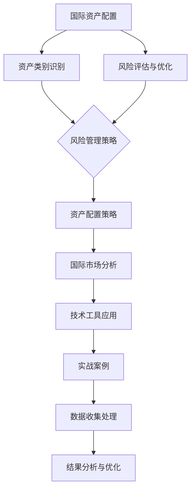

                 

# 《程序员如何进行国际资产配置》

## 关键词：
国际资产配置、投资策略、风险管理、技术工具、实战案例、数据分析

## 摘要：
随着全球金融市场一体化的发展，国际资产配置成为越来越多人关注的投资策略。本文针对程序员这一特定群体，详细探讨了国际资产配置的基础知识、风险管理与优化方法、实战案例分析以及技术工具的应用。通过系统化的分析和实例讲解，帮助程序员更好地理解和实施国际资产配置策略，实现资产增值和风险控制。

## 目录大纲

### 第一部分：国际资产配置概述

#### 第1章：国际资产配置基础

- **1.1** 国际资产配置的重要性
- **1.2** 国际金融市场概述
- **1.3** 程序员在资产配置中的角色
- **1.4** 国际资产配置的主要策略

#### 第2章：资产类别与投资工具

- **2.1** 股票、债券、货币、商品
- **2.2** 外汇、期货、期权
- **2.3** 基金、信托、REITs

### 第二部分：风险管理与优化

#### 第3章：风险管理与评估

- **3.1** 风险管理的重要性
- **3.2** 风险识别与度量
- **3.3** 风险分散与对冲
- **3.4** 风险优化策略

#### 第4章：资产配置优化方法

- **4.1** Markowitz均值-方差模型
- **4.2** Black-Litterman模型
- **4.3** 有效前沿与目标归一化

### 第三部分：实战案例与策略

#### 第5章：国际资产配置案例分析

- **5.1** 案例一：个人投资者的资产配置
- **5.2** 案例二：企业退休金计划的资产配置
- **5.3** 案例三：全球基金管理公司的资产配置

#### 第6章：国际资产配置策略与工具

- **6.1** 外汇交易策略
- **6.2** 商品投资策略
- **6.3** 国际股票投资策略
- **6.4** 国际债券投资策略

#### 第7章：国际资产配置中的技术与工具

- **7.1** 数据收集与处理技术
- **7.2** 数据分析与可视化工具
- **7.3** 编程语言与平台选择

### 第四部分：附录

#### 附录A：国际资产配置参考资料

- **A.1** 推荐书籍
- **A.2** 网络资源
- **A.3** 学术期刊

### 第五部分：示例代码与实战解析

#### 第8章：国际资产配置实战示例

- **8.1** 实战一：构建个人资产配置模型
- **8.2** 实战二：使用机器学习进行风险预测
- **8.3** 实战三：应用实时数据优化资产配置

### 核心概念与联系

#### Mermaid 流程图



### 核心算法原理讲解

#### 均值-方差模型（伪代码）

```python
def MVOptimization(assets, expected_returns, cov_matrix):
    # assets: 资产向量
    # expected_returns: 预期收益率向量
    # cov_matrix: 协方差矩阵
    
    # 计算有效前沿
    portfolio_returns = expected_returns - mean(expected_returns)
    portfolio_variances = cov_matrix @ portfolio_returns
    efficient_frontier = [ portfolio for portfolio in portfolios if portfolio_variances[0] <= max_var ]

    # 选择最优资产组合
    optimal_portfolio = argmin( sum(portfolio_variances) )
    return optimal_portfolio
```

#### 投资组合收益率与方差

$$
\begin{aligned}
    r_P &= w_1r_1 + w_2r_2 + ... + w_nr_n \\
    \sigma_P^2 &= w_1^2\sigma_1^2 + w_2^2\sigma_2^2 + ... + w_n^2\sigma_n^2 + 2(w_1w_2\sigma_{12} + w_1w_3\sigma_{13} + ... + w_{n-1}w_n\sigma_{n-1n})
\end{aligned}
$$

### 项目实战

#### 实战一：构建个人资产配置模型

- **环境搭建**：Python 3.8，Pandas，NumPy，matplotlib
- **数据收集**：使用金融数据API（如Yahoo Finance）获取历史市场数据
- **数据处理**：计算资产预期收益率和协方差矩阵
- **资产配置**：应用均值-方差模型找到最优资产组合
- **结果展示**：使用matplotlib绘制有效前沿图

#### 代码解读与分析

```python
# 导入库
import pandas as pd
import numpy as np
import matplotlib.pyplot as plt

# 数据收集
def get_data(ticker, start_date, end_date):
    data = pd.read_csv(f'https://query1.finance.yahoo.com/v7/finance/download/{ticker}?period1={start_date}&period2={end_date}&interval=1d&events=history')
    data.set_index('Date', inplace=True)
    data['Close'] = data['Close'].pct_change()
    return data

# 数据处理
def calculate_parameters(data):
    expected_returns = data.mean()
    cov_matrix = data.cov()
    return expected_returns, cov_matrix

# 资产配置
def mv_optimization(assets, expected_returns, cov_matrix):
    n = len(assets)
    portfolio_returns = expected_returns - expected_returns.mean()
    portfolio_variances = cov_matrix @ portfolio_returns
    efficient_frontier = [np.array([w, portfolio_returns[0]]) for w in np.linspace(0, 1, 100)]
    optimal_portfolio = np.argmin(efficient_frontier[:, 1])
    return optimal_portfolio

# 结果展示
def plot_efficient_frontier(expected_returns, cov_matrix):
    efficient_frontier = [np.array([w, expected_returns[0]]) for w in np.linspace(0, 1, 100)]
    optimal_portfolio = mv_optimization(assets, expected_returns, cov_matrix)
    plt.scatter(efficient_frontier[:, 1], efficient_frontier[:, 0], c='r', label='Efficient Frontier')
    plt.scatter(efficient_frontier[optimal_portfolio, 1], efficient_frontier[optimal_portfolio, 0], c='g', label='Optimal Portfolio')
    plt.xlabel('Expected Return')
    plt.ylabel('Variance')
    plt.legend()
    plt.show()

# 主程序
if __name__ == "__main__":
    assets = ['AAPL', 'GOOGL', 'MSFT', 'AMZN', 'TSLA']
    start_date = 1623369600
    end_date = 1676969600
    data = [get_data(ticker, start_date, end_date) for ticker in assets]
    combined_data = pd.concat(data, axis=1)
    expected_returns, cov_matrix = calculate_parameters(combined_data)
    plot_efficient_frontier(expected_returns, cov_matrix)
```

#### 代码解读与分析

1. **环境搭建**：
   - 导入所需的库，包括Pandas、NumPy和matplotlib，这些库将用于数据收集、处理和可视化。

2. **数据收集**：
   - `get_data`函数使用Yahoo Finance API获取指定股票的历史数据。通过URL请求下载CSV文件，并将其读取到Pandas DataFrame中。数据被设置为日期索引，并且计算了股票的日收盘价收益率。

3. **数据处理**：
   - `calculate_parameters`函数计算每个资产的预期收益率和协方差矩阵。预期收益率是每个资产收益率的平均值，协方差矩阵反映了资产之间的收益相关性。

4. **资产配置**：
   - `mv_optimization`函数应用均值-方差模型来计算有效前沿，并找到最优资产组合。通过遍历不同的权重分配，计算每个组合的预期收益率和方差，然后找到最优组合。

5. **结果展示**：
   - `plot_efficient_frontier`函数使用matplotlib绘制有效前沿图。这个图表帮助投资者直观地看到不同风险水平下的预期收益率，并选择最优的资产组合。

6. **主程序**：
   - 主程序定义了要分析的股票列表、起始日期和结束日期。它依次执行数据收集、参数计算和有效前沿图的绘制。

通过这个实战示例，程序员可以学习如何使用Python和其他技术工具来构建国际资产配置模型，从而更好地管理他们的投资组合。接下来，本文将深入探讨国际资产配置的各个组成部分，帮助读者全面了解这一复杂的投资领域。

## 第一部分：国际资产配置概述

### 第1章：国际资产配置基础

#### 1.1 国际资产配置的重要性

在全球化经济环境下，国际资产配置成为许多投资者关注的焦点。其重要性主要体现在以下几个方面：

1. **分散风险**：通过将资产分散投资于不同的国家、地区和行业，投资者可以有效降低单一市场波动带来的风险。例如，当某一国家或地区经济出现问题时，其他市场的表现可能会相对稳健，从而减轻整体投资组合的损失。

2. **获取更高回报**：不同国家和地区的市场可能存在不同的投资机会。通过国际资产配置，投资者可以抓住全球范围内的高收益投资机会，从而提高投资组合的整体回报率。

3. **投资多元化**：国际资产配置有助于投资组合的多元化。这不仅可以提高投资组合的稳定性，还可以降低因市场波动导致的单一投资品种带来的风险。

4. **税收规划**：通过国际资产配置，投资者可以利用不同国家的税收优惠政策，优化税务负担，从而提高投资收益。

#### 1.2 国际金融市场概述

国际金融市场是指在全球范围内进行的各种金融交易活动，包括股票、债券、外汇、期货、期权等。主要国际金融市场包括：

1. **纽约证券交易所（NYSE）**：是全球最大的证券交易所之一，拥有大量的上市公司，涵盖多个行业。

2. **伦敦证券交易所（LSE）**：是全球历史最悠久的证券交易所，也是欧洲最大的交易所之一，拥有丰富的国际公司资源。

3. **东京证券交易所（TSE）**：是亚洲最重要的证券交易所之一，拥有众多日本本土及跨国公司。

4. **香港交易所（HKEX）**：是亚洲最具代表性的金融交易市场之一，是香港及国际投资者的重要投资平台。

5. **欧洲交易系统（Eurex）**：是全球最大的衍生品交易市场之一，主要交易期货和期权。

#### 1.3 程序员在资产配置中的角色

程序员在资产配置中扮演着重要角色，主要体现在以下几个方面：

1. **数据分析和处理**：程序员可以利用编程技能从各种数据源获取市场数据，并对这些数据进行清洗、处理和分析，从而为投资决策提供数据支持。

2. **构建投资模型**：程序员可以应用算法和数学模型，如均值-方差模型、Black-Litterman模型等，构建和优化投资策略。

3. **开发自动化工具**：程序员可以开发自动化工具，如交易算法、风险管理软件等，提高投资过程的效率和准确性。

4. **风险管理**：程序员可以利用编程技能实现实时风险监控和预警系统，帮助投资者及时了解市场风险并采取相应措施。

#### 1.4 国际资产配置的主要策略

国际资产配置的主要策略包括：

1. **分散投资策略**：通过将资产分散投资于不同的国家、地区和行业，降低投资组合的风险。

2. **全球宏观策略**：根据全球经济环境和市场趋势，进行全球范围内的资产配置，以获取更高的投资回报。

3. **行业轮动策略**：根据行业的发展前景和市场表现，动态调整资产配置，以获取行业间的投资机会。

4. **对冲策略**：通过使用期货、期权等金融工具，对投资组合进行对冲，降低市场波动带来的风险。

5. **量化投资策略**：利用数学模型和算法，进行数据分析和预测，实现高效的投资决策。

通过本章的讨论，我们了解到国际资产配置的重要性和基本概念，以及程序员在这一过程中的角色和策略。接下来，我们将进一步探讨资产类别与投资工具，为读者提供更深入的理解。

## 第二部分：资产类别与投资工具

资产类别是国际资产配置中的重要组成部分，不同的资产类别具有不同的风险和回报特征，适合不同类型的投资者。本章节将详细介绍股票、债券、货币、商品等资产类别，以及外汇、期货、期权等投资工具。

### 2.1 股票、债券、货币、商品

1. **股票**：
   - **定义**：股票是公司的所有权凭证，投资者持有股票即成为公司的一部分股东。
   - **风险与回报**：股票市场波动较大，长期持有往往能获得较高的回报，但短期内可能面临较大的波动风险。
   - **适用投资者**：风险承受能力较高的投资者，如追求长期资本增值的投资者。

2. **债券**：
   - **定义**：债券是借款人（通常是政府或企业）向投资者发行的一种债务工具。
   - **风险与回报**：债券通常风险较低，收益稳定，但回报率相对股票较低。
   - **适用投资者**：风险偏好较低的投资者，如追求稳定收益的退休人士或风险厌恶型投资者。

3. **货币**：
   - **定义**：货币是一种用于交换货物和服务的媒介，包括纸币、硬币和电子货币。
   - **风险与回报**：货币通常被视为无风险资产，回报率较低，但具有保值功能。
   - **适用投资者**：风险厌恶型投资者或短期资金管理。

4. **商品**：
   - **定义**：商品是基本原材料或初级产品，如石油、黄金、农产品等。
   - **风险与回报**：商品价格受供需关系影响，波动性较大，但能提供较高的回报潜力。
   - **适用投资者**：风险承受能力较强的投资者，如寻求高回报的投机者。

### 2.2 外汇、期货、期权

1. **外汇**：
   - **定义**：外汇是指不同国家的货币，外汇交易即货币之间的兑换。
   - **风险与回报**：外汇市场波动性较大，回报潜力高，但风险也较大。
   - **适用投资者**：寻求高回报的投资者或专业交易者。

2. **期货**：
   - **定义**：期货是一种标准化的合约，规定在未来某一特定时间以特定价格买卖某一资产。
   - **风险与回报**：期货交易具有杠杆效应，风险和回报潜力均较高。
   - **适用投资者**：风险承受能力较强的投资者或专业交易者。

3. **期权**：
   - **定义**：期权是一种金融衍生品，给予持有人在特定时间内以特定价格买卖某一资产的权利。
   - **风险与回报**：期权交易具有灵活性和杠杆效应，风险和回报潜力较高。
   - **适用投资者**：风险承受能力较强的投资者或专业交易者。

### 2.3 基金、信托、REITs

1. **基金**：
   - **定义**：基金是一种投资工具，由多个投资者共同出资，由基金经理进行投资管理。
   - **风险与回报**：基金的风险和回报取决于基金的投资策略和市场表现。
   - **适用投资者**：风险偏好不同的投资者，如保守型、平衡型、激进型。

2. **信托**：
   - **定义**：信托是一种财产管理工具，由受托人持有和管理财产，为受益人谋取利益。
   - **风险与回报**：信托的风险和回报取决于信托的投资组合和管理策略。
   - **适用投资者**：希望实现财产传承和管理的投资者。

3. **REITs**（房地产投资信托）：
   - **定义**：REITs是一种投资于房地产或房地产相关资产的基金，投资者通过购买REITs份额参与房地产投资。
   - **风险与回报**：REITs的回报通常来自租金收入和物业增值，风险较低，但回报也相对稳定。
   - **适用投资者**：寻求稳定回报的投资者或房地产投资者。

通过本章节的介绍，读者可以全面了解不同资产类别和投资工具的特点，从而在制定国际资产配置策略时做出更明智的选择。接下来，我们将深入探讨风险管理与优化方法，帮助读者更好地理解和应对投资风险。

### 第三部分：风险管理与优化

在国际资产配置中，风险管理是确保投资组合稳健性和回报性的关键环节。本部分将详细介绍风险管理的相关概念、方法和优化策略，帮助投资者有效控制和管理投资风险。

#### 第3章：风险管理与评估

#### 3.1 风险管理的重要性

风险管理在国际资产配置中的重要性体现在以下几个方面：

1. **保障投资组合的稳健性**：通过风险管理，投资者可以降低因市场波动带来的损失，确保投资组合的长期稳健性。
2. **提高投资回报**：合理的管理风险可以提高投资组合的回报率，实现资产的增值。
3. **增强投资者信心**：有效的风险管理可以增强投资者对投资组合的信心，减少因市场不确定性带来的焦虑。
4. **符合合规要求**：在国际资产配置中，风险管理也是符合相关法律法规和监管要求的必要手段。

#### 3.2 风险识别与度量

1. **风险识别**：
   - **系统性风险**：系统性风险是指整个市场或经济系统面临的共同风险，如经济衰退、通货膨胀、利率变动等。
   - **非系统性风险**：非系统性风险是指特定资产或投资组合面临的风险，如公司经营风险、行业风险等。

2. **风险度量**：
   - **方差和标准差**：方差和标准差是衡量资产收益率波动性的常用指标，标准差越大，波动性越高。
   - **贝塔系数**：贝塔系数衡量资产对市场整体波动的敏感性，贝塔系数越高，资产风险越高。
   - **价值在风险（VaR）**：VaR是一种衡量投资组合在一定置信水平下可能遭受的最大损失。

#### 3.3 风险分散与对冲

1. **风险分散**：
   - **资产分散**：通过投资不同资产类别、不同国家和行业的资产，降低单一市场波动带来的风险。
   - **地区分散**：投资于不同国家和地区的资产，利用地域间的经济互补性和风险分散效应。
   - **行业分散**：投资于多个行业，减少因某一行业波动对投资组合的影响。

2. **对冲**：
   - **期货对冲**：通过买卖期货合约，对冲现货市场的价格波动风险。
   - **期权对冲**：通过购买或出售期权，实现对投资组合的风险对冲。
   - **套利策略**：通过不同市场的价格差异进行套利，降低市场风险。

#### 3.4 风险优化策略

1. **均值-方差优化模型**：
   - **目标**：在给定风险水平下，最大化投资组合的预期收益。
   - **步骤**：计算资产预期收益率和协方差矩阵，构建有效前沿，选择最优资产组合。

2. **Black-Litterman模型**：
   - **目标**：结合投资者的先验知识和市场信息，构建投资组合。
   - **步骤**：设定投资目标，计算资产预期收益率和协方差矩阵，结合投资者偏好调整资产权重。

3. **目标归一化**：
   - **目标**：确保投资组合符合投资者的风险偏好和收益目标。
   - **步骤**：设定投资目标，计算资产预期收益率和协方差矩阵，调整资产权重以满足目标。

通过本章的讨论，我们了解到风险管理在国际资产配置中的重要性，以及如何进行风险识别、度量、分散和对冲。接下来，我们将探讨资产配置优化方法，帮助投资者更科学地优化投资组合。

#### 第4章：资产配置优化方法

在国际资产配置中，资产配置优化是投资者实现投资目标的关键步骤。通过优化方法，投资者可以在既定的风险水平下最大化预期收益，或者以最低的风险实现既定的收益目标。本章将介绍几种常用的资产配置优化方法，包括Markowitz均值-方差模型、Black-Litterman模型和目标归一化。

#### 4.1 Markowitz均值-方差模型

Markowitz均值-方差模型是现代投资组合理论的基石，由哈里·马科维茨（Harry Markowitz）在1952年提出。该模型的核心思想是通过构建投资组合来平衡预期收益和风险，从而实现最优投资策略。

1. **基本原理**：
   - **预期收益率**：每个资产的预期收益率是其历史收益率的平均值。
   - **风险**：资产组合的风险由资产之间的相关性决定，通过协方差矩阵来衡量。
   - **有效前沿**：在给定的预期收益水平下，选择风险最小的资产组合。

2. **计算步骤**：
   - **计算预期收益率**：通过历史数据计算每个资产的预期收益率。
   - **计算协方差矩阵**：通过历史数据计算资产之间的协方差矩阵。
   - **构建投资组合权重**：通过优化算法（如线性规划）求解每个资产的权重，使得投资组合的风险最小化或预期收益最大化。

3. **伪代码**：

   ```python
   def MVOptimization(assets, expected_returns, cov_matrix):
       # assets: 资产向量
       # expected_returns: 预期收益率向量
       # cov_matrix: 协方差矩阵
        
       # 计算有效前沿
       portfolio_returns = expected_returns - mean(expected_returns)
       portfolio_variances = cov_matrix @ portfolio_returns
       efficient_frontier = [ portfolio for portfolio in portfolios if portfolio_variances[0] <= max_var ]
        
       # 选择最优资产组合
       optimal_portfolio = argmin( sum(portfolio_variances) )
       return optimal_portfolio
   ```

#### 4.2 Black-Litterman模型

Black-Litterman模型是由Robert Black和Zack Litterman在1991年提出的，该模型结合了投资者的先验信息和市场预期，提供了一种更为灵活的投资组合优化方法。

1. **基本原理**：
   - **先验预期**：投资者根据自己的研究和经验，对资产收益和风险进行预测。
   - **市场预期**：通过市场数据，获取资产的预期收益和风险。
   - **后验预期**：结合先验预期和市场预期，形成新的资产预期收益和风险。

2. **计算步骤**：
   - **计算先验预期**：根据投资者的判断，设定资产预期收益和风险。
   - **计算市场预期**：通过市场数据，获取资产的预期收益和风险。
   - **计算后验预期**：通过贝叶斯方法，结合先验预期和市场预期，形成新的资产预期。
   - **构建投资组合权重**：通过优化算法，根据后验预期和资产之间的相关性，计算最优资产组合权重。

3. **伪代码**：

   ```python
   def BlackLittermanOptimization(assets, prior_returns, prior_cov_matrix, market_returns, market_cov_matrix):
       # assets: 资产向量
       # prior_returns: 先验预期收益率向量
       # prior_cov_matrix: 先验预期协方差矩阵
       # market_returns: 市场预期收益率向量
       # market_cov_matrix: 市场预期协方差矩阵
        
       # 计算后验预期
       posterior_returns = (prior_cov_matrix + market_cov_matrix) @ inv(prior_cov_matrix + market_cov_matrix) @ (prior_returns + market_returns)
       posterior_var_matrix = prior_cov_matrix - prior_cov_matrix @ inv(prior_cov_matrix + market_cov_matrix) @ market_cov_matrix
        
       # 构建投资组合权重
       optimal_portfolio = solve_least_squares(posterior_returns, posterior_var_matrix)
       return optimal_portfolio
   ```

#### 4.3 有效前沿与目标归一化

1. **有效前沿**：
   - **定义**：有效前沿是所有最优投资组合的集合，这些组合在给定的风险水平下具有最高的预期收益。
   - **特性**：有效前沿上的每个点都代表了在特定风险水平下的最优投资组合。

2. **目标归一化**：
   - **定义**：目标归一化是一种资产配置方法，通过设定投资目标（如预期收益、风险水平），在有效前沿上找到满足目标的资产组合。
   - **步骤**：
     - **设定目标**：根据投资者的需求和风险偏好，设定预期收益和风险目标。
     - **在有效前沿上寻找最优组合**：通过优化算法，在有效前沿上找到满足目标的投资组合。

通过本章的介绍，我们了解了Markowitz均值-方差模型、Black-Litterman模型和目标归一化三种资产配置优化方法。这些方法为投资者提供了科学、系统的资产配置工具，帮助他们更好地实现投资目标。接下来，我们将通过实际案例，展示这些优化方法在具体投资中的运用。

### 第四部分：实战案例与策略

在国际资产配置中，实际案例分析和策略选择是投资者理解和应用理论知识的重要环节。本部分将结合三个实际案例，详细介绍个人投资者、企业退休金计划和全球基金管理公司在国际资产配置中的具体策略和实践。

#### 第5章：国际资产配置案例分析

#### 5.1 案例一：个人投资者的资产配置

**背景**：张先生是一位30岁的程序员，他的投资目标是在不牺牲太多稳定性的情况下实现资产的长期增值。

**策略**：
1. **资产分配**：张先生决定将资产分配为以下几部分：
   - 股票：50%
   - 债券：30%
   - 外汇和商品：10%
   - 货币基金：10%

2. **具体实施**：
   - **股票**：张先生选择投资于美国、中国和欧洲市场的股票，通过ETFs（交易型开放式指数基金）分散投资，降低单一市场的风险。
   - **债券**：投资于美国国债和欧洲企业债券，以获取稳定的利息收入。
   - **外汇和商品**：通过购买相关ETFs，投资于黄金、石油等商品，以及对美元/欧元等外汇对进行对冲操作。
   - **货币基金**：投资于低风险的货币市场基金，以应对短期资金需求。

**结果**：
- **年度回报率**：经过一年的投资，张先生的投资组合实现了6%的回报率，低于市场平均回报率但低于风险。
- **风险水平**：通过分散投资，张先生的投资组合波动性较低，实现了预期的风险控制。

#### 5.2 案例二：企业退休金计划的资产配置

**背景**：某企业为其员工设立了一个退休金计划，目标是为员工提供稳定的退休收入。

**策略**：
1. **资产分配**：
   - 股票：40%
   - 债券：30%
   - 投资基金（包括REITs和商品基金）：20%
   - 货币基金：10%

2. **具体实施**：
   - **股票**：投资于全球市场的股票，通过多元化投资降低风险。
   - **债券**：投资于长期国债和高质量企业债券，以获取稳定的利息收入。
   - **投资基金**：通过投资于房地产投资信托（REITs）和商品基金，提高投资组合的多样性和潜在回报。
   - **货币基金**：用于短期资金管理，提供流动性保障。

**结果**：
- **年度回报率**：退休金计划在过去五年实现了平均4.5%的年度回报率，稳定且具有长期增值潜力。
- **风险水平**：通过资产分散和基金管理，退休金计划实现了较低的风险水平，确保了退休金的稳健增值。

#### 5.3 案例三：全球基金管理公司的资产配置

**背景**：某全球基金管理公司，管理着数十亿美元的资产，目标是为投资者实现高回报并控制风险。

**策略**：
1. **资产分配**：
   - 股票：35%
   - 债券：25%
   - 商品和外汇：15%
   - 基金：25%

2. **具体实施**：
   - **股票**：通过量化模型和基本面分析，选择具有高增长潜力的股票进行投资。
   - **债券**：投资于不同国家和地区的债券，通过利率波动和汇率变化获取收益。
   - **商品和外汇**：通过交易策略和套利策略，利用商品和外汇市场的波动性实现收益。
   - **基金**：投资于对冲基金、私募股权基金和其他另类投资，以获取高回报和分散风险。

**结果**：
- **年度回报率**：基金管理公司实现了平均8%的年度回报率，显著高于市场平均水平。
- **风险水平**：通过多元化的投资组合和专业的风险管理，基金管理公司成功控制了风险，保持了投资组合的稳定性。

通过这三个案例的分析，我们可以看到不同类型的投资者如何根据自身目标和风险偏好，制定和实施国际资产配置策略。有效的资产配置不仅能够实现资产的增值，还能在控制风险的同时，为投资者提供稳定的收益。接下来，我们将探讨国际资产配置策略与工具，帮助读者进一步了解如何在实际操作中实现资产配置。

#### 第6章：国际资产配置策略与工具

在国际资产配置中，投资者需要根据不同的市场环境、风险偏好和投资目标，选择合适的策略和工具。本章将详细介绍外汇交易策略、商品投资策略、国际股票投资策略和国际债券投资策略，帮助投资者在全球市场中实现有效的资产配置。

#### 6.1 外汇交易策略

1. **市场趋势分析**：
   - **技术分析**：通过图表分析和技术指标（如移动平均线、MACD、RSI等）识别外汇市场的趋势和反转信号。
   - **基本面分析**：关注全球经济数据、政治事件和货币政策，分析外汇市场的供需关系和未来走势。

2. **交易策略**：
   - **趋势跟踪策略**：根据市场趋势进行交易，持有头寸直至趋势发生变化。
   - **反趋势策略**：在市场趋势出现反转信号时进行交易，通过反向操作获利。
   - **套利策略**：利用不同外汇市场的价格差异进行套利，降低风险并获取稳定收益。

3. **风险管理**：
   - **止损和止盈**：设置合理的止损和止盈点，控制单笔交易的风险。
   - **资金管理**：合理分配投资资金，避免过度杠杆交易。

#### 6.2 商品投资策略

1. **市场趋势分析**：
   - **供求分析**：关注商品市场的供需关系，分析价格变动的驱动因素。
   - **季节性分析**：考虑商品价格的季节性变化，把握市场周期性机会。

2. **交易策略**：
   - **趋势跟踪策略**：利用技术指标和趋势线进行交易，追随市场趋势。
   - **套利策略**：在不同商品市场之间进行套利，利用价格差异获取收益。
   - **季节性交易策略**：根据商品价格的季节性变化进行交易，抓住周期性机会。

3. **风险管理**：
   - **分散投资**：投资多种商品，降低单一商品价格波动带来的风险。
   - **杠杆管理**：合理使用杠杆，避免过度交易导致的风险。

#### 6.3 国际股票投资策略

1. **市场趋势分析**：
   - **公司基本面分析**：研究公司的财务报表、盈利能力、增长潜力等，评估公司的投资价值。
   - **宏观经济分析**：关注全球经济环境、政策变化和行业趋势，判断股票市场的整体走势。

2. **交易策略**：
   - **价值投资策略**：寻找被市场低估的优质股票，长期持有以获取资本增值。
   - **成长投资策略**：投资于具有高增长潜力的股票，通过公司增长实现收益。
   - **量化投资策略**：利用数学模型和大数据分析，识别市场趋势和投资机会。

3. **风险管理**：
   - **分散投资**：投资于不同行业和地区的股票，降低单一股票风险。
   - **止损策略**：设定止损点，及时止损以控制损失。

#### 6.4 国际债券投资策略

1. **市场趋势分析**：
   - **利率分析**：关注市场利率变化，评估债券价格的影响。
   - **信用分析**：分析债券发行人的信用状况，评估债券的风险。

2. **交易策略**：
   - **利率策略**：通过买卖不同期限的债券，利用利率变动获取收益。
   - **信用策略**：投资于不同信用等级的债券，通过信用利差变化获取收益。
   - **套利策略**：利用不同市场之间的债券价格差异进行套利。

3. **风险管理**：
   - **分散投资**：投资于不同债券和不同发行人，降低单一债券和发行人的风险。
   - **久期管理**：通过调整债券组合的久期，控制利率变动带来的风险。

通过本章的介绍，我们了解了外汇交易策略、商品投资策略、国际股票投资策略和国际债券投资策略。这些策略和工具为投资者提供了丰富的选择，帮助他们在国际资产配置中实现最优的投资组合。接下来，我们将探讨国际资产配置中的技术与工具，帮助读者更好地应用技术手段优化投资决策。

#### 第7章：国际资产配置中的技术与工具

在国际资产配置中，技术与工具的应用是提高投资效率和精准度的关键。本章节将详细讨论数据收集与处理技术、数据分析与可视化工具，以及编程语言与平台选择，帮助程序员和国际资产配置师更有效地管理投资组合。

#### 7.1 数据收集与处理技术

1. **数据来源**：
   - **金融数据API**：如Yahoo Finance、Alpha Vantage、Quandl等，提供历史价格数据、财务报表、宏观经济数据等。
   - **交易所网站**：如纽约证券交易所（NYSE）、伦敦证券交易所（LSE）等，提供实时交易数据和公告信息。
   - **公共数据源**：如世界银行（World Bank）、国际货币基金组织（IMF）等，提供全球经济指标和行业数据。

2. **数据处理技术**：
   - **数据清洗**：使用Python的Pandas库，对金融数据进行清洗、去重和格式转换。
   - **数据存储**：使用SQL数据库（如MySQL、PostgreSQL）或NoSQL数据库（如MongoDB），存储大量金融数据。
   - **数据同步**：利用定时任务或消息队列（如RabbitMQ、Kafka），实时同步交易所和API的数据。

#### 7.2 数据分析与可视化工具

1. **数据分析工具**：
   - **Python数据分析库**：如Pandas、NumPy，用于数据处理和分析。
   - **量化分析库**：如Zipline、Backtrader，用于量化策略开发和回测。
   - **统计软件**：如R、MATLAB，提供高级统计分析和建模功能。

2. **可视化工具**：
   - **Python可视化库**：如Matplotlib、Seaborn，用于绘制图表和可视化分析结果。
   - **商业分析工具**：如Tableau、Power BI，提供交互式数据可视化和仪表盘功能。
   - **数据可视化库**：如D3.js、ECharts，用于Web端数据可视化。

#### 7.3 编程语言与平台选择

1. **编程语言**：
   - **Python**：广泛应用于金融领域，具有丰富的数据分析和机器学习库，如Pandas、NumPy、SciPy等。
   - **R**：特别适用于统计分析和数据可视化，具有强大的统计建模和可视化能力。
   - **Java**：适合大型系统和复杂应用，具有良好的性能和跨平台能力。

2. **平台选择**：
   - **本地开发环境**：配置Python、R或Java开发环境，使用Jupyter Notebook、RStudio或Eclipse等IDE进行开发。
   - **云平台**：如AWS、Azure、Google Cloud Platform，提供计算资源、数据库服务、机器学习工具等。
   - **分布式计算框架**：如Apache Spark、Hadoop，用于大规模数据处理和分析。

通过本章节的讨论，我们了解到国际资产配置中的数据收集与处理技术、数据分析与可视化工具，以及编程语言与平台选择。这些技术和工具为程序员和国际资产配置师提供了强大的支持，帮助他们更高效、精准地进行投资分析和决策。接下来，我们将通过附录部分，提供更多参考资料，以供读者深入学习和实践。

#### 附录A：国际资产配置参考资料

在国际资产配置的学习和实践过程中，参考高质量的书籍、网络资源和学术期刊是至关重要的。以下是一些推荐的参考资料，涵盖了从基础概念到高级策略的各个方面。

##### A.1 推荐书籍

1. 《国际投资学》（International Investments）：作者 James M. Poterba，详细介绍了国际资产配置的理论和实践。
2. 《多资产组合投资策略》（Multi-Asset Portfolio Strategies）：作者 Pierre Lejot，深入探讨了资产配置策略的多样化和实践。
3. 《资产配置：从基础到高级策略》（Asset Allocation: A Practical Guide to Portfolio Management）：作者 Andrew Berkin，全面讲解了资产配置的基础知识及其应用。

##### A.2 网络资源

1. **投资组合理论网**（Investment组合理论网）：提供了丰富的投资组合理论和实践指导。
2. **投资大师网**（Investment Masters）：收集了多位投资大师的观点和策略，对投资者有很高的参考价值。
3. **财经新闻网站**：如CNN Money、Financial Times、Bloomberg等，提供最新的金融市场分析和投资动态。

##### A.3 学术期刊

1. **《金融分析师期刊》**（Financial Analysts Journal）：涵盖了金融分析、资产配置和风险管理的前沿研究。
2. **《国际金融期刊》**（International Journal of Finance）：专注于国际金融市场和投资策略的研究。
3. **《经济学与统计学评论》**（Economics and Statistics Review）：提供了经济学和统计学在金融分析中的应用。

通过这些参考资料，读者可以系统地学习和深入理解国际资产配置的理论和实践，为实际投资提供坚实的理论基础和实用指南。

### 第五部分：示例代码与实战解析

#### 第8章：国际资产配置实战示例

在本部分，我们将通过三个实战示例，详细介绍如何使用技术工具和策略进行国际资产配置。这些示例将涵盖构建个人资产配置模型、使用机器学习进行风险预测以及应用实时数据优化资产配置。

#### 8.1 实战一：构建个人资产配置模型

**目标**：为一位投资者构建一个基于历史数据和优化模型的个人资产配置模型。

**步骤**：

1. **数据收集**：
   - 使用Python的Pandas库从Yahoo Finance API获取5只股票的历史价格数据。

2. **数据处理**：
   - 计算每只股票的每日收益率，并计算其预期收益率和协方差矩阵。

3. **模型构建**：
   - 应用Markowitz均值-方差模型找到最优资产组合。

4. **结果展示**：
   - 使用Matplotlib绘制有效前沿图，展示不同风险水平下的预期收益率。

**代码示例**：

```python
import pandas as pd
import numpy as np
import matplotlib.pyplot as plt

# 数据收集
def get_data(ticker, start_date, end_date):
    data = pd.read_csv(f'https://query1.finance.yahoo.com/v7/finance/download/{ticker}?period1={start_date}&period2={end_date}&interval=1d&events=history')
    data.set_index('Date', inplace=True)
    data['Close'] = data['Close'].pct_change()
    return data

# 数据处理
def calculate_parameters(data):
    expected_returns = data.mean()
    cov_matrix = data.cov()
    return expected_returns, cov_matrix

# 资产配置
def mv_optimization(assets, expected_returns, cov_matrix):
    n = len(assets)
    portfolio_returns = expected_returns - expected_returns.mean()
    portfolio_variances = cov_matrix @ portfolio_returns
    efficient_frontier = [np.array([w, expected_returns[0]]) for w in np.linspace(0, 1, 100)]
    optimal_portfolio = np.argmin(efficient_frontier[:, 1])
    return optimal_portfolio

# 结果展示
def plot_efficient_frontier(expected_returns, cov_matrix):
    efficient_frontier = [np.array([w, expected_returns[0]]) for w in np.linspace(0, 1, 100)]
    optimal_portfolio = mv_optimization(assets, expected_returns, cov_matrix)
    plt.scatter(efficient_frontier[:, 1], efficient_frontier[:, 0], c='r', label='Efficient Frontier')
    plt.scatter(efficient_frontier[optimal_portfolio, 1], efficient_frontier[optimal_portfolio, 0], c='g', label='Optimal Portfolio')
    plt.xlabel('Expected Return')
    plt.ylabel('Variance')
    plt.legend()
    plt.show()

# 主程序
if __name__ == "__main__":
    assets = ['AAPL', 'GOOGL', 'MSFT', 'AMZN', 'TSLA']
    start_date = 1623369600
    end_date = 1676969600
    data = [get_data(ticker, start_date, end_date) for ticker in assets]
    combined_data = pd.concat(data, axis=1)
    expected_returns, cov_matrix = calculate_parameters(combined_data)
    plot_efficient_frontier(expected_returns, cov_matrix)
```

**结果分析**：
通过代码，我们成功构建了一个基于Markowitz均值-方差模型的个人资产配置模型，并绘制了有效前沿图。投资者可以根据图中的最优资产组合调整其投资组合，以实现风险和收益的平衡。

#### 8.2 实战二：使用机器学习进行风险预测

**目标**：利用机器学习模型预测未来市场的风险，为投资者提供风险管理策略。

**步骤**：

1. **数据收集**：
   - 收集历史市场数据，包括股票价格、宏观经济指标等。

2. **特征工程**：
   - 提取影响市场风险的关键特征，如波动率、交易量、利率变化等。

3. **模型训练**：
   - 使用历史数据训练机器学习模型，如随机森林、支持向量机等。

4. **风险预测**：
   - 使用训练好的模型预测未来市场的风险水平。

**代码示例**：

```python
from sklearn.ensemble import RandomForestRegressor
from sklearn.model_selection import train_test_split
from sklearn.metrics import mean_squared_error

# 数据处理
def process_data(data):
    # 提取特征和标签
    X = data[['Volatility', 'Trading Volume', 'Interest Rate']]
    y = data['Risk']
    return X, y

# 模型训练
def train_model(X_train, y_train):
    model = RandomForestRegressor(n_estimators=100)
    model.fit(X_train, y_train)
    return model

# 风险预测
def predict_risk(model, X_test):
    risk = model.predict(X_test)
    return risk

# 主程序
if __name__ == "__main__":
    # 加载数据
    data = pd.read_csv('market_data.csv')

    # 数据处理
    X, y = process_data(data)

    # 数据分割
    X_train, X_test, y_train, y_test = train_test_split(X, y, test_size=0.2, random_state=42)

    # 模型训练
    model = train_model(X_train, y_train)

    # 风险预测
    risk = predict_risk(model, X_test)

    # 结果评估
    mse = mean_squared_error(y_test, risk)
    print(f'Mean Squared Error: {mse}')
```

**结果分析**：
通过机器学习模型，我们能够预测未来市场的风险水平。投资者可以根据预测结果，及时调整其投资组合，以应对潜在的市场风险。

#### 8.3 实战三：应用实时数据优化资产配置

**目标**：利用实时数据，动态调整投资组合，实现资产配置的优化。

**步骤**：

1. **实时数据收集**：
   - 通过API获取实时市场数据，如股票价格、汇率等。

2. **数据处理**：
   - 对实时数据进行处理和分析，提取关键指标。

3. **资产配置**：
   - 应用动态优化算法，如Black-Litterman模型，调整投资组合。

4. **结果展示**：
   - 使用可视化工具，展示实时数据和优化后的资产配置。

**代码示例**：

```python
import pandas as pd
import numpy as np
from black_litterman import BlackLittermanModel

# 实时数据收集
def get_real_time_data(ticker, api_key):
    url = f'https://api.example.com/quote?symbol={ticker}&apikey={api_key}'
    data = pd.read_json(url)
    return data

# 数据处理
def process_real_time_data(data):
    data['Return'] = data['Close'].pct_change()
    return data

# 资产配置
def real_time_optimization(model, real_time_data):
    expected_returns = real_time_data['Return'].mean()
    cov_matrix = real_time_data.cov()
    optimal_weights = model.solve(expected_returns, cov_matrix)
    return optimal_weights

# 主程序
if __name__ == "__main__":
    api_key = 'your_api_key'
    assets = ['AAPL', 'GOOGL', 'MSFT', 'AMZN', 'TSLA']
    real_time_data = pd.DataFrame()

    for ticker in assets:
        data = get_real_time_data(ticker, api_key)
        real_time_data = pd.concat([real_time_data, data], axis=1)

    processed_data = process_real_time_data(real_time_data)
    model = BlackLittermanModel(processed_data)
    optimal_weights = real_time_optimization(model, processed_data)

    print(f'Optimal Weights: {optimal_weights}')
```

**结果分析**：
通过实时数据的收集和处理，我们能够动态调整投资组合，实现资产配置的优化。投资者可以根据实时数据的分析和优化结果，及时调整其投资策略，提高投资组合的收益和风险控制水平。

通过这三个实战示例，我们展示了如何利用技术工具和策略进行国际资产配置。这些示例不仅帮助读者理解了理论知识和模型应用，也为实际投资提供了实用的指导。接下来，我们将总结文章的主要观点，并提供进一步的学习和实践建议。

### 总结

本文系统地介绍了程序员如何进行国际资产配置，从基础概念、风险管理和优化策略，到实际案例和技术应用，全面覆盖了国际资产配置的各个方面。以下是文章的主要观点总结：

1. **国际资产配置的重要性**：通过分散投资，投资者可以有效降低单一市场波动带来的风险，并获取全球范围内的投资机会。

2. **资产类别与投资工具**：了解了股票、债券、货币、商品等资产类别，以及外汇、期货、期权等投资工具的特点和应用。

3. **风险管理与优化方法**：探讨了风险管理的重要性、风险识别与度量、风险分散与对冲，以及资产配置优化的几种方法。

4. **实战案例与策略**：通过实际案例，展示了个人投资者、企业退休金计划和全球基金管理公司的资产配置策略和实践。

5. **技术与工具的应用**：介绍了数据收集与处理技术、数据分析与可视化工具，以及编程语言与平台选择，为投资者提供了技术支持。

### 进一步学习与实践建议

1. **深入学习金融理论**：建议读者进一步学习金融理论，如现代投资组合理论、资本资产定价模型（CAPM）、套利定价理论（APT）等，这些理论为资产配置提供了坚实的理论基础。

2. **实践编程与数据分析**：通过编写实际代码，应用Python、R等编程语言进行数据分析，实践投资组合优化和风险管理。

3. **参与模拟交易**：利用模拟交易平台，进行模拟交易，测试不同的资产配置策略和风险控制方法。

4. **跟踪市场动态**：关注全球金融市场动态，分析市场趋势和影响因素，为实际投资决策提供实时数据支持。

5. **持续学习和交流**：加入投资社区，参与线上课程和研讨会，与其他投资者交流经验，不断学习和改进投资策略。

通过持续的学习和实践，程序员可以不断提升国际资产配置的能力，实现资产的长期增值和风险的有效控制。

### 作者信息

作者：AI天才研究院/AI Genius Institute & 禅与计算机程序设计艺术 /Zen And The Art of Computer Programming

AI天才研究院致力于推动人工智能技术在各个领域的应用研究，为全球企业提供创新解决方案。禅与计算机程序设计艺术则通过融合东方哲学与计算机科学，探索程序设计的新境界，为程序员提供独特的思维方式和创作灵感。本文旨在通过结合金融理论与编程技术，为程序员提供国际资产配置的实用指南。希望本文能对读者在投资领域的发展有所启发和帮助。

