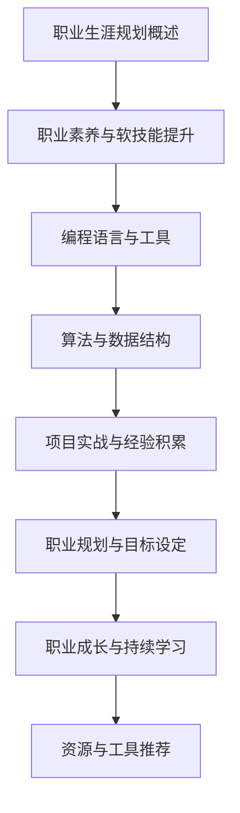

                 

# 程序员的职业生涯规划：长跑与长跑

> 关键词：职业生涯规划、程序员、职业发展、技能提升、持续学习

> 摘要：
> 
> 程序员的职业生涯规划就像一场长跑，需要从基础起步，逐步积累经验，不断提升自身能力。本文将探讨程序员的职业生涯规划基础，职业素养与软技能提升，职业技能提升，项目实战与经验积累，职业规划与目标设定，职业成长与持续学习等方面，帮助程序员更好地规划自己的职业生涯。

## 第一部分：程序员的职业生涯规划基础

### 第1章：程序员的职业生涯规划概述

#### 第1.1节：职业生涯规划的重要性

##### 1.1.1 职业生涯规划的定义

职业生涯规划是指个人根据自己的兴趣、能力、价值观和市场环境，为自己设定职业目标和路径，并采取相应的行动以实现这些目标的过程。

##### 1.1.2 职业生涯规划对程序员的影响

对于程序员来说，职业生涯规划具有以下几个重要影响：

1. **明确职业目标**：职业生涯规划可以帮助程序员明确自己的职业目标，从而更加专注于自己的职业发展。

2. **提升专业技能**：通过职业生涯规划，程序员可以明确自己需要提升的技能点，从而有针对性地学习和实践。

3. **优化职业路径**：职业生涯规划可以帮助程序员合理规划职业发展路径，避免走弯路，提高职业发展的效率。

4. **提升职业满意度**：明确的职业目标和规划可以帮助程序员更好地适应工作，提高职业满意度。

#### 第1.2节：程序员的职业发展路径

程序员的职业发展路径通常可以分为以下几个阶段：

##### 1.2.1 初级程序员的发展

初级程序员通常需要具备以下能力：

1. 掌握一门编程语言的基本语法和用法。

2. 熟悉基本的数据结构和算法。

3. 了解软件开发的基本流程和工具。

4. 具备基本的软件调试能力。

初级程序员可以通过以下途径提升自己：

1. 深入学习编程语言和相关技术。

2. 参与开源项目，积累实战经验。

3. 学习软件工程相关知识，提高编程能力。

4. 参加技术社区，拓展人脉。

##### 1.2.2 中级程序员的发展

中级程序员通常需要具备以下能力：

1. 掌握至少两门编程语言，熟练运用常见的数据结构和算法。

2. 具备一定的软件设计和架构能力。

3. 了解常见的软件开发模式和方法。

4. 具备良好的团队协作和沟通能力。

中级程序员可以通过以下途径提升自己：

1. 深入研究软件设计模式和架构知识。

2. 学习项目管理相关知识，提高项目管理能力。

3. 提升自己的团队协作和沟通技巧。

4. 参与更多的项目实践，积累经验。

##### 1.2.3 高级程序员的发展

高级程序员通常需要具备以下能力：

1. 具备深厚的技术功底，熟练掌握多种编程语言和工具。

2. 具备优秀的软件设计能力和架构能力。

3. 具备良好的团队领导能力和项目管理能力。

4. 对技术有深入的理解和独到的见解。

高级程序员可以通过以下途径提升自己：

1. 深入研究前沿技术，保持技术敏锐度。

2. 学习管理知识和领导力知识，提升管理能力。

3. 参与更多的重大项目，提升实战经验。

4. 撰写技术文章和书籍，提升自己的影响力。

### 第2章：职业素养与软技能提升

#### 第2.1节：职业素养的重要性

##### 2.1.1 职业素养的定义

职业素养是指一个人在职业生涯中表现出的道德、能力、态度和行为等方面的综合素质。

##### 2.1.2 职业素养对程序员的影响

对于程序员来说，职业素养具有重要意义：

1. **提高工作效率**：良好的职业素养可以帮助程序员更好地组织工作，提高工作效率。

2. **提升团队协作能力**：职业素养包括良好的沟通能力和团队协作能力，这有助于程序员更好地融入团队，提高团队的整体效率。

3. **增强职业竞争力**：具备良好职业素养的程序员更容易获得雇主和同事的认可，从而提高自己的职业竞争力。

#### 第2.2节：软技能提升方法

##### 2.2.1 沟通技巧

良好的沟通技巧对于程序员来说至关重要。以下是提升沟通技巧的几个方法：

1. **倾听**：倾听是沟通的基础，要善于倾听他人的意见和需求。

2. **表达**：清晰、准确地表达自己的观点和想法，避免产生误解。

3. **非语言沟通**：注意身体语言、语调和面部表情等非语言沟通，这些都能影响沟通的效果。

##### 2.2.2 团队协作

团队协作能力是程序员的重要软技能之一。以下是提升团队协作能力的几个方法：

1. **明确目标**：确保团队成员都明确项目的目标，这有助于提高团队的协作效率。

2. **分工合作**：合理分配任务，发挥每个人的优势，提高团队的协作效果。

3. **沟通与反馈**：保持开放的沟通渠道，及时给予反馈，帮助团队成员共同进步。

##### 2.2.3 时间管理

良好的时间管理能力可以帮助程序员更好地安排工作和生活。以下是提升时间管理能力的几个方法：

1. **制定计划**：提前制定工作计划，明确每天的任务和目标。

2. **优先级管理**：合理安排任务的优先级，确保重要且紧急的任务得到优先处理。

3. **避免拖延**：克服拖延症，提高工作效率。

## 第二部分：程序员的职业技能提升

### 第3章：编程语言与工具

#### 第3.1节：编程语言的选择

##### 3.1.1 常用编程语言简介

在编程领域，常用的编程语言包括：

1. **Python**：Python 是一种高级、通用、易于学习的编程语言，广泛应用于 Web 开发、人工智能、科学计算等领域。

2. **Java**：Java 是一种跨平台的编程语言，广泛应用于企业级应用、Android 开发等领域。

3. **JavaScript**：JavaScript 是一种客户端脚本语言，广泛应用于 Web 前端开发。

##### 3.1.2 编程语言的选择标准

选择编程语言时，可以从以下几个方面考虑：

1. **应用领域**：根据项目的需求选择合适的编程语言。

2. **学习成本**：选择易于学习且社区活跃的编程语言。

3. **性能需求**：根据项目的性能要求选择合适的编程语言。

#### 第3.2节：开发工具的使用

##### 3.2.1 集成开发环境（IDE）

IDE 是一种集成开发工具，提供了代码编辑、编译、调试等功能。常用的 IDE 包括：

1. **IntelliJ IDEA**：适用于 Java、Python、JavaScript 等多种编程语言。

2. **Visual Studio Code**：适用于多种编程语言，具有丰富的插件生态。

##### 3.2.2 版本控制工具（如 Git）

版本控制工具可以帮助程序员管理和追踪代码的修改历史。Git 是目前最流行的版本控制工具。

##### 3.2.3 自动化工具（如 Jenkins）

自动化工具可以帮助程序员自动化构建、测试和部署等任务，提高开发效率。Jenkins 是目前最流行的自动化工具之一。

### 第4章：算法与数据结构

#### 第4.1节：算法的重要性

##### 4.1.1 算法的定义

算法是一种解决特定问题的步骤序列，通常用伪代码或编程语言表示。

##### 4.1.2 算法在程序员职业中的应用

算法在程序员职业中的应用非常广泛，包括：

1. **软件开发**：算法是软件开发的核心，用于解决各种问题。

2. **系统优化**：通过算法优化，可以提高软件的性能和效率。

3. **面试求职**：许多公司招聘程序员时，都会考察算法能力。

#### 第4.2节：常用数据结构

##### 4.2.1 数组

数组是一种线性数据结构，用于存储一系列元素。

```python
# Python 伪代码示例
arr = [1, 2, 3, 4, 5]
```

##### 4.2.2 链表

链表是一种线性数据结构，通过指针连接节点。

```python
# Python 伪代码示例
class Node:
    def __init__(self, value):
        self.value = value
        self.next = None

head = Node(1)
head.next = Node(2)
head.next.next = Node(3)
```

##### 4.2.3 栈与队列

栈和队列都是线性数据结构，用于存储一系列元素。

栈的特点是后进先出（LIFO），队列的特点是先进先出（FIFO）。

```python
# Python 伪代码示例
class Stack:
    def __init__(self):
        self.items = []

    def push(self, item):
        self.items.append(item)

    def pop(self):
        return self.items.pop()

class Queue:
    def __init__(self):
        self.items = []

    def enqueue(self, item):
        self.items.append(item)

    def dequeue(self):
        return self.items.pop(0)
```

##### 4.2.4 树与图

树和图都是非线性数据结构，用于表示复杂的关系。

树是一种层次结构，图是一种节点和边构成的图形。

```python
# Python 伪代码示例
class TreeNode:
    def __init__(self, value):
        self.value = value
        self.children = []

root = TreeNode(1)
root.children.append(TreeNode(2))
root.children.append(TreeNode(3))

# 图的表示
graph = {
    'A': ['B', 'C'],
    'B': ['D', 'E'],
    'C': ['F', 'G'],
    'D': [],
    'E': [],
    'F': [],
    'G': []
}
```

### 第5章：项目实战与经验积累

#### 第5.1节：项目实战的重要性

##### 5.1.1 项目实战的定义

项目实战是指在真实场景中，运用所学知识和技能完成一个具体的任务。

##### 5.1.2 项目实战对程序员职业的影响

项目实战对于程序员的职业发展具有以下影响：

1. **提升技能**：通过项目实战，程序员可以更好地掌握所学的知识和技能。

2. **积累经验**：项目实战可以帮助程序员积累实际工作经验，提高解决问题的能力。

3. **增加竞争力**：具备丰富项目实战经验的程序员在求职时更具竞争力。

#### 第5.2节：经验积累的方法

##### 5.2.1 代码审查与优化

代码审查和优化是经验积累的重要方法之一。

代码审查可以帮助程序员：

1. **发现代码中的潜在问题**。

2. **学习他人的代码风格和技巧**。

3. **提高编程能力**。

代码优化可以帮助程序员：

1. **提高代码的可读性和可维护性**。

2. **提高代码的性能和效率**。

##### 5.2.2 问题解决与调试

问题解决和调试是程序员必备的能力。

问题解决和调试的方法包括：

1. **定位问题**：通过分析错误信息、日志和代码，定位问题的原因。

2. **解决问题**：根据定位到的问题，采取相应的解决措施。

3. **验证问题解决效果**：在修改代码后，进行测试，验证问题是否得到解决。

##### 5.2.3 阅读优秀代码

阅读优秀代码是经验积累的有效方法。

阅读优秀代码可以帮助程序员：

1. **学习他人的编程技巧和风格**。

2. **提高代码的可读性和可维护性**。

3. **拓展技术视野**。

### 第三部分：程序员的职业规划与成长

#### 第6章：职业规划与目标设定

##### 6.1.1 职业规划的重要性

职业规划对于程序员的职业发展具有重要意义。

职业规划可以帮助程序员：

1. **明确职业目标**。

2. **制定合理的职业发展路径**。

3. **提高职业满意度**。

##### 6.1.2 职业规划对程序员职业的影响

职业规划对程序员职业的影响包括：

1. **提高职业竞争力**：明确的职业规划可以帮助程序员更好地提升自己的能力，提高职业竞争力。

2. **降低职业风险**：职业规划可以帮助程序员规避职业发展中的潜在风险。

3. **提高职业发展速度**：通过合理的职业规划，程序员可以更快地实现自己的职业目标。

##### 6.2.1 目标设定的方法

目标设定是职业规划的重要环节。以下是目标设定的几种方法：

1. **SMART 目标设定法**：SMART 是 Specific（具体）、Measurable（可衡量）、Achievable（可实现）、Relevant（相关）和 Time-bound（有时限）的缩写。

   - **具体**：目标要明确具体，避免模糊。
   - **可衡量**：目标要可衡量，以便评估进展。
   - **可实现**：目标要现实可行，避免过高或过低。
   - **相关**：目标要与职业规划相关。
   - **有时限**：目标要有明确的时间限制。

2. **目标分解与时间规划**：将大目标分解为小目标，并为每个小目标设定完成时间。

   - **目标分解**：将大目标分解为若干个小目标，每个小目标都要具体、可衡量。
   - **时间规划**：为每个小目标设定完成时间，并合理安排时间。

#### 第7章：职业成长与持续学习

##### 7.1.1 持续学习的重要性

持续学习对于程序员的职业成长具有重要意义。

持续学习可以帮助程序员：

1. **跟上技术发展**：技术更新迅速，持续学习可以帮助程序员掌握最新的技术。

2. **提高自身能力**：通过持续学习，程序员可以不断提升自己的能力，提高职业竞争力。

3. **拓宽职业视野**：持续学习可以帮助程序员了解更多的技术和领域，拓宽职业视野。

##### 7.1.2 持续学习的方法

以下是几种持续学习的方法：

1. **参加在线课程**：在线课程可以帮助程序员系统地学习新知识。

2. **阅读技术书籍**：技术书籍是学习新知识的重要来源。

3. **参与开源项目**：参与开源项目可以帮助程序员在实践中学习和提高。

4. **参加技术会议和活动**：参加技术会议和活动可以结识同行业的人，交流学习。

##### 7.1.3 职业成长路径规划

程序员的职业成长路径可以分为以下几个阶段：

1. **初级程序员**：掌握基础知识和技能，提高编程能力。

2. **中级程序员**：提升软件设计能力和团队协作能力。

3. **高级程序员**：具备丰富的项目经验和解决问题的能力。

4. **技术专家**：深入研究技术，成为某一领域的专家。

5. **技术经理**：具备团队管理能力和项目管理能力，成为技术经理。

### 附录：资源与工具推荐

#### 附录 A：编程语言与工具

##### A.1 编程语言推荐

1. **Python**：Python 是一种高级、通用、易于学习的编程语言，广泛应用于 Web 开发、人工智能、科学计算等领域。

2. **Java**：Java 是一种跨平台的编程语言，广泛应用于企业级应用、Android 开发等领域。

3. **JavaScript**：JavaScript 是一种客户端脚本语言，广泛应用于 Web 前端开发。

##### A.2 开发工具推荐

1. **IntelliJ IDEA**：适用于 Java、Python、JavaScript 等多种编程语言。

2. **Visual Studio Code**：适用于多种编程语言，具有丰富的插件生态。

3. **Git**：Git 是目前最流行的版本控制工具。

#### 附录 B：在线学习资源推荐

##### B.1 在线课程推荐

1. **Coursera**：提供丰富的在线课程，涵盖计算机科学、人工智能、数据科学等领域。

2. **Udemy**：提供各类在线课程，包括编程语言、软件工具、项目管理等。

3. **edX**：由哈佛大学和麻省理工学院共同创办的在线学习平台，提供高质量的在线课程。

##### B.2 技术博客推荐

1. **Medium**：提供各类技术文章，涵盖前端、后端、人工智能等领域。

2. **HackerRank**：提供编程挑战和技术文章，帮助程序员提高编程能力。

3. **Stack Overflow**：一个广泛的技术问答社区，程序员可以在这里提问和解答问题。

### Mermaid 流程图：程序员职业生涯规划流程



---

作者：AI天才研究院/AI Genius Institute & 禅与计算机程序设计艺术 /Zen And The Art of Computer Programming

[本文完] <|im_end|>

