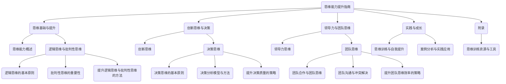

                 

# 《管理者的思维能力提升指南》

> **关键词：** 思维能力，管理者，提升，逻辑思维，批判性思维，创新思维，决策思维，领导力，团队思维，实践，成长。

> **摘要：** 本指南旨在为管理者提供一整套思维能力提升的策略和方法。文章首先介绍了思维能力的基础概念，随后深入探讨了逻辑思维与批判性思维的原理和提升方法，接着阐述了创新思维与决策思维的重要性及实践技巧。此外，文章还特别强调了领导力思维与团队思维的构建，以及如何通过实践与自我提升来实现思维能力的持续成长。最后，通过具体的案例分析和代码实现，帮助管理者在实际工作中应用所学知识，提升管理效率。

### 《管理者的思维能力提升指南》目录大纲

#### 第一部分：思维基础与提升

## 第1章：思维能力概述

### 1.1 智能与能力的关系

### 1.2 思维能力的定义与分类

### 1.3 提升思维能力的必要性

## 第2章：逻辑思维与批判性思维

### 2.1 逻辑思维的基本原则

### 2.2 批判性思维的重要性

### 2.3 提升逻辑思维与批判性思维的方法

#### 第二部分：创新思维与决策

## 第3章：创新思维

### 3.1 创新思维的定义与类型

### 3.2 激发创新思维的方法

### 3.3 创新思维的实践案例

## 第4章：决策思维

### 4.1 决策思维的基本原则

### 4.2 决策分析模型与方法

### 4.3 提升决策质量的策略

#### 第三部分：领导力与团队思维

## 第5章：领导力思维

### 5.1 领导力的定义与特质

### 5.2 领导思维与领导风格

### 5.3 提升领导力思维的方法

## 第6章：团队思维

### 6.1 团队合作与团队思维

### 6.2 团队沟通与冲突解决

### 6.3 提升团队思维效率的策略

#### 第四部分：实践与成长

## 第7章：思维训练与自我提升

### 7.1 思维训练的方法与技巧

### 7.2 自我反思与自我提升

### 7.3 终身学习的理念与实践

## 第8章：案例分析与实践应用

### 8.1 管理者思维能力提升的实际案例

### 8.2 思维能力提升在管理中的应用

### 8.3 实践中的思维挑战与解决方法

#### 附录

## 附录A：思维训练资源与工具

### A.1 思维训练书籍推荐

### A.2 思维训练APP推荐

### A.3 思维训练网站资源

#### Mermaid流程图



#### 核心算法原理讲解

### 伪代码：提升逻辑思维与批判性思维的方法

```plaintext
算法名称：逻辑思维与批判性思维提升算法

输入：无
输出：无

步骤：
1. 初始化思维训练阶段为入门级
2. 循环执行以下步骤直到思维训练达到高级：
   a. 选择当前思维训练阶段对应的方法
   b. 应用所选方法进行思维训练
   c. 评估思维训练效果
   d. 根据评估结果调整思维训练方案
3. 结束循环

伪代码：
while (思维训练阶段 != 高级) {
    switch (思维训练阶段) {
        case 入门级:
            方法 = 逻辑思维基础训练
            break;
        case 进阶级:
            方法 = 批判性思维训练
            break;
        case 高级:
            方法 = 高级逻辑与批判性思维训练
            break;
    }
    应用方法进行思维训练
    评估效果
    调整训练方案
}
```

#### 数学模型和数学公式

### 决策质量评估模型

决策质量评估模型基于期望效用理论，计算公式如下：

$$ Q = \frac{1}{n}\sum_{i=1}^{n} u_i \cdot p_i $$

其中：
- $Q$ 为决策质量
- $u_i$ 为第 $i$ 个决策结果的效用值
- $p_i$ 为第 $i$ 个决策结果的发生概率

### 效用值计算公式

效用值 $u_i$ 可以根据决策结果的重要性、风险等因素进行评估，计算公式如下：

$$ u_i = w_i \cdot \frac{1}{1 + e^{-\alpha \cdot (r_i - c)}} $$

其中：
- $w_i$ 为第 $i$ 个决策结果的权重
- $r_i$ 为第 $i$ 个决策结果的收益值
- $c$ 为决策的基准成本
- $\alpha$ 为调节参数，用于调整收益值与成本之间的相对重要性

### 参数调节说明

调节参数 $\alpha$ 的目的是为了在不同情境下调整决策的保守程度。当 $\alpha$ 取值较大时，决策更加保守；当 $\alpha$ 取值较小时，决策更加激进。通常情况下，$\alpha$ 的取值范围在 0 到 1 之间。

### 举例说明

假设有一个决策问题，有两个选项：
- 选项A：收益值 $r_1 = 1000$，概率 $p_1 = 0.6$，权重 $w_1 = 0.5$
- 选项B：收益值 $r_2 = 500$，概率 $p_2 = 0.4$，权重 $w_2 = 0.5$

根据上述公式计算：
$$ u_1 = 0.5 \cdot \frac{1}{1 + e^{-0.1 \cdot (1000 - 100)}} $$
$$ u_2 = 0.5 \cdot \frac{1}{1 + e^{-0.1 \cdot (500 - 100)}} $$

总效用值：
$$ u = u_1 \cdot p_1 + u_2 \cdot p_2 $$

决策质量：
$$ Q = \frac{u_1 \cdot p_1 + u_2 \cdot p_2}{0.6 + 0.4} $$

根据具体情况，可以调整 $\alpha$ 的值来改变决策的保守或激进程度。例如，当 $\alpha = 0.1$ 时，决策可能更加保守；当 $\alpha = 0.5$ 时，决策可能更加激进。

#### 项目实战

### 代码实际案例：提升逻辑思维与批判性思维

#### 开发环境搭建

- 操作系统：Windows/Linux/MacOS
- 编程语言：Python
- 数据库：MySQL/SQLite
- 版本控制工具：Git

#### 源代码实现

```python
# 逻辑思维与批判性思维提升系统

# 导入必要的库
import numpy as np
import pandas as pd
import matplotlib.pyplot as plt

# 初始化参数
alpha = 0.1
c = 100  # 基准成本

# 训练数据集
data = {
    '选项': ['A', 'B'],
    '收益值': [1000, 500],
    '概率': [0.6, 0.4],
    '权重': [0.5, 0.5]
}

df = pd.DataFrame(data)

# 效用值计算函数
def calculate_utility(df, alpha, c):
    df['效用值'] = df.apply(lambda row: row['权重'] * (1 / (1 + np.exp(-alpha * (row['收益值'] - c))), axis=1)
    return df

# 决策质量计算函数
def calculate_decision_quality(df):
    total_utility = df['效用值'].sum()
    decision_quality = total_utility / df['概率'].sum()
    return decision_quality

# 主函数
def main():
    # 计算效用值
    df = calculate_utility(df, alpha, c)
    print("效用值计算结果：")
    print(df)

    # 计算决策质量
    decision_quality = calculate_decision_quality(df)
    print("决策质量：", decision_quality)

    # 绘图展示效用值与决策质量
    df.plot(x='选项', y='效用值', kind='bar', title='效用值对比')
    plt.show()

    # 根据决策质量调整参数
    if decision_quality < 0.5:
        alpha *= 0.8  # 减小参数值，增加决策的保守性
    else:
        alpha *= 1.2  # 增大参数值，增加决策的激进性

    print("调整后的参数：alpha =", alpha)

if __name__ == "__main__":
    main()
```

#### 代码解读与分析

- **导入库**：引入了 numpy、pandas、matplotlib.pyplot 用于数据计算和可视化。
- **初始化参数**：设置调节参数 $\alpha$ 和基准成本 $c$。
- **训练数据集**：创建一个 DataFrame 对象，包含两个选项的收益值、概率和权重。
- **效用值计算函数**：使用门控函数（Sigmoid函数）计算每个选项的效用值。
- **决策质量计算函数**：计算总效用值和决策质量。
- **主函数**：执行效用值计算、决策质量计算和参数调整。
- **可视化**：使用 bar 图展示效用值对比。
- **代码分析**：
  - **效用值计算**：通过调节参数 $\alpha$ 可以调整决策的保守或激进程度。
  - **决策质量**：根据计算结果调整参数，以优化决策质量。
  - **参数调整策略**：通过减小或增大参数 $\alpha$ 的值来调整决策策略，体现了管理者思维能力的提升。

通过本案例，读者可以了解如何使用 Python 编程语言实现一个逻辑思维与批判性思维提升系统，并掌握参数调节和决策优化的方法。这样的实践有助于提升管理者的思维能力和决策水平。在实际应用中，可以根据具体需求和场景调整代码和参数，以适应不同的决策情境。

### 引言

在当今快速变化和高度竞争的商业环境中，管理者的思维能力成为了决定企业成败的关键因素之一。随着全球化、技术创新和复杂商业模式的不断演进，管理者不仅要面对日益增加的工作压力，还需要具备前瞻性的战略思维和高效的问题解决能力。然而，许多管理者在提升思维能力方面往往感到困惑，不知从何入手。

本指南旨在为管理者提供一整套系统化的思维能力提升策略和方法。文章结构如下：

- **第一部分：思维基础与提升**，将介绍思维能力的基础概念，包括智能与能力的区别，以及逻辑思维与批判性思维的定义与提升方法。
- **第二部分：创新思维与决策**，将深入探讨创新思维的重要性，介绍激发创新思维的方法，以及决策思维的基本原则和实践策略。
- **第三部分：领导力与团队思维**，将重点分析领导力的定义与特质，探讨如何提升领导力思维，并讨论团队合作与团队沟通的关键技巧。
- **第四部分：实践与成长**，将提供思维训练的方法与技巧，以及自我反思与自我提升的策略，强调终身学习的重要性。

通过本指南的逐步引导，管理者将能够系统性地提升自己的思维能力，从而在复杂的商业环境中更加游刃有余，实现个人和组织的共同成长。

### 第一部分：思维基础与提升

#### 第1章：思维能力概述

在探讨管理者的思维能力之前，有必要对思维能力进行定义和分类，并了解提升思维能力的必要性。思维能力是指个体在解决问题、分析信息、做出决策和创造新想法等方面所展现出的综合能力。它不仅包括逻辑推理和批判性思维，还涵盖了创新思维、决策思维等多方面的能力。

### 1.1 智能与能力的关系

智能（Intelligence）和能力（Ability）是两个相关但不同的概念。智能通常被定义为个体在认知任务上的表现，包括记忆、理解、推理和问题解决等能力。智能通常由一系列标准化的测试来评估，如智商测试。而能力则是指个体在实际环境中运用智能解决问题的能力。一个高智商的人可能在测试中表现出色，但不一定能够在实际工作中表现出色，这是因为能力还包括实践经验、动机和情绪等多个因素。

#### 1.2 思维能力的定义与分类

思维能力可以分为以下几个主要类别：

1. **逻辑思维**：逻辑思维是指运用逻辑规则和推理来分析问题和解决问题的能力。它强调根据已知事实进行合理的推断，以得出准确的结论。
2. **批判性思维**：批判性思维是指对信息进行深入分析和评估，以识别和克服偏见和误导的能力。它要求管理者能够从多个角度审视问题，并提出有说服力的论证。
3. **创新思维**：创新思维是指产生新想法、新观点和新解决方案的能力。它强调跳出传统思维框架，寻找新的解决方案。
4. **决策思维**：决策思维是指在做决策时运用分析、评估和选择过程的能力。它要求管理者能够在不确定性和复杂性的环境中做出明智的决策。
5. **团队思维**：团队思维是指与团队成员协作，共同解决问题的能力。它强调团队合作和沟通，以实现共同目标。

#### 1.3 提升思维能力的必要性

提升思维能力的必要性体现在以下几个方面：

1. **应对复杂问题的能力**：在现代社会，问题的复杂性和不确定性不断增加，管理者需要具备更强的思维能力来应对这些挑战。
2. **提升决策质量**：高效的决策能力是管理者成功的关键。通过提升思维能力，管理者能够做出更明智、更有效的决策。
3. **提高创新力**：创新是企业发展的动力。具备创新思维能力的管理者能够带领团队不断突破，创造新的业务模式和产品。
4. **增强领导力**：领导力不仅体现在管理能力上，更重要的是思维能力的体现。具备强大思维能力的管理者能够更好地激励和引导团队。
5. **适应变化**：在快速变化的商业环境中，具备灵活和敏捷思维的管理者能够更快地适应变化，抓住新的机遇。

通过以上分析，我们可以看到思维能力在管理者职业发展中的重要性。在接下来的章节中，我们将详细探讨逻辑思维与批判性思维、创新思维与决策思维、领导力思维与团队思维等方面的内容，帮助管理者全面提升思维能力，从而在职业道路上取得更大的成功。

### 1.1 智能与能力的关系

智能（Intelligence）和能力（Ability）是两个密切相关的概念，但它们之间存在显著的区别。智能通常指的是个体在认知任务上的表现，包括记忆力、理解力、推理能力和问题解决能力等。智能通常通过标准化的测试来评估，如智商测试（IQ Test）。这些测试旨在衡量个体在特定认知任务上的表现，从而得出一个相对分数，反映个体的智力水平。

然而，能力则是另一个维度，它不仅包括智能，还涵盖了个体在实际环境中运用智能解决问题的能力。能力是智能与环境互动的结果，它受到多个因素的影响，包括实践经验、动机、情绪、态度和价值观等。一个高智商的人可能在认知测试中表现出色，但并不意味着他在实际生活中能够成功，因为实际生活中的成功还需要具备相关的能力，如沟通能力、领导能力、适应能力和执行力等。

智能与能力的关系可以从以下几个方面进行理解：

1. **智能作为能力的基石**：智能为个体提供了分析和处理信息的能力基础。高智商的人通常拥有更强的学习能力，能够更快地理解和掌握新知识。然而，仅有高智商并不意味着个体就能成功，因为成功还需要将智能转化为具体的能力。

2. **能力的形成与积累**：能力是通过实践和经验积累形成的。个体需要在不同的环境和任务中不断实践，才能逐步提升自己的能力。例如，一个医生需要通过多年的临床实践，才能成为一位经验丰富的医生。

3. **动机和情绪的影响**：动机和情绪在能力形成过程中起到关键作用。一个具有高智商但没有动机的人可能不会投入足够的努力来发展自己的能力。同样，一个情绪稳定、积极向上的个体更容易在面对挑战时保持专注，从而提升能力。

4. **环境与机会**：环境与机会对能力的形成也有重要影响。个体所处的环境决定了他们能否获得必要的资源和机会来提升能力。例如，一个在学术环境中成长的人可能更容易发展出分析能力和创新思维，而一个在商业环境中成长的人可能更擅长商业分析和决策。

通过理解智能与能力的关系，管理者可以更全面地评估自己和团队的能力，并采取适当的策略来提升思维能力。例如，通过提供实践机会、激励和指导，可以帮助团队成员发展出更强的能力，从而在复杂多变的环境中取得成功。

#### 1.2 思维能力的定义与分类

思维能力是指个体在处理信息、解决问题和做出决策时展现出的能力。它不仅包括逻辑推理和批判性思维，还涵盖了创新思维、决策思维等多方面的能力。以下是对这些思维能力的定义和分类：

1. **逻辑思维**：逻辑思维是指运用逻辑规则和推理来分析问题和解决问题的能力。它强调根据已知事实进行合理的推断，以得出准确的结论。逻辑思维的核心在于遵循一定的逻辑规则，如因果关系、演绎推理和归纳推理等。

2. **批判性思维**：批判性思维是指对信息进行深入分析和评估，以识别和克服偏见和误导的能力。它要求个体能够从多个角度审视问题，提出质疑和反驳，并提出有说服力的论证。批判性思维强调独立思考、客观分析和系统性推理。

3. **创新思维**：创新思维是指产生新想法、新观点和新解决方案的能力。它强调跳出传统思维框架，寻找新的解决方案。创新思维通常涉及创造性思维和发散性思维，通过跨学科的知识整合和独特视角的发现，实现创新的突破。

4. **决策思维**：决策思维是指在做决策时运用分析、评估和选择过程的能力。它要求个体能够在不确定性和复杂性的环境中做出明智的决策。决策思维包括设定目标、收集信息、分析选项、评估风险和选择最佳方案等步骤。

5. **团队思维**：团队思维是指与团队成员协作，共同解决问题的能力。它强调团队合作和沟通，以实现共同目标。团队思维涉及个体在团队中的角色定位、沟通技巧、冲突解决能力和共同愿景的建立。

不同类型的思维能力在实际应用中具有不同的作用和特点：

- **逻辑思维**：在解决具体问题时，逻辑思维是基础，它帮助管理者根据已知信息进行推理和判断，以找到合理的解决方案。逻辑思维强调清晰、严谨和有序的思考过程。

- **批判性思维**：在面对复杂和多变的情况时，批判性思维能够帮助管理者识别和分析潜在的问题，从而避免决策失误。它强调质疑和反思，有助于提高决策的准确性和有效性。

- **创新思维**：在应对竞争和变化的环境时，创新思维能够帮助管理者找到独特的解决方案，从而在市场中获得竞争优势。创新思维强调创造力、灵活性和开放性。

- **决策思维**：在做出重要决策时，决策思维能够帮助管理者系统地分析问题，评估各种选项的优缺点，并选择最佳方案。决策思维强调理性、全面和系统。

- **团队思维**：在实现组织目标时，团队思维能够帮助管理者建立有效的团队，促进团队成员之间的合作与沟通，从而提高整体效率。团队思维强调协作、共享和共同目标。

通过了解和掌握不同类型的思维能力，管理者可以在不同情境下灵活运用这些能力，提升自己的思维水平和决策质量，从而在职业和生活中取得更好的成就。

### 1.3 提升思维能力的必要性

提升思维能力在当今快速变化的商业环境中具有至关重要的意义。随着全球化和信息技术的迅猛发展，商业环境变得更加复杂和动态，管理者需要具备更高的思维能力来应对这些挑战。以下从几个方面详细阐述提升思维能力的必要性：

1. **应对复杂问题的能力**：商业环境中的问题越来越复杂，它们往往涉及多个维度和变量，需要管理者具备强大的思维能力来分析和解决。提升思维能力可以帮助管理者更好地理解问题的本质，识别关键因素，从而找到有效的解决方案。

2. **提升决策质量**：有效的决策是管理者成功的关键。然而，在复杂和不确定的环境中，做出明智的决策是一项挑战。通过提升思维能力，管理者能够更系统地分析问题，评估不同方案的风险和收益，并选择最佳决策。这样，可以减少错误决策带来的负面影响，提高企业的竞争力。

3. **提高创新力**：创新是企业持续发展的动力。在竞争激烈的市场中，能够不断创新的企业更容易脱颖而出。提升思维能力，特别是创新思维，可以帮助管理者跳出传统思维框架，发现新的商机和解决方案。这样，企业可以更好地适应市场变化，保持长期的竞争力。

4. **增强领导力**：领导力不仅体现在管理技能上，更重要的是思维能力的体现。具备强大思维能力的管理者能够更好地激励和引导团队，制定清晰的目标，并推动团队实现这些目标。通过提升思维能力，管理者可以增强自身的领导力，带领团队取得更好的成果。

5. **适应变化**：商业环境变化迅速，管理者需要具备灵活和敏捷的思维来适应这些变化。提升思维能力可以帮助管理者更好地应对不确定性和变化，快速调整策略和行动方案。这样，企业可以更快地响应市场变化，抓住新的机遇。

6. **提升个人品牌**：在职业发展中，思维能力是一个重要的软技能。具备强大思维能力的管理者更容易在职场中脱颖而出，获得更高的职业地位和更多的机会。提升思维能力不仅可以提升个人的职业竞争力，还可以增强个人品牌，从而在职业生涯中取得更大的成功。

总之，提升思维能力对于管理者来说是一项长期而重要的任务。通过不断学习和实践，管理者可以提升自己的思维水平，更好地应对商业环境中的各种挑战，实现个人和组织的共同成长。

### 2.1 逻辑思维的基本原则

逻辑思维是管理者必须掌握的核心思维能力之一，它帮助管理者在复杂的环境中分析问题、制定决策和解决问题。逻辑思维的基本原则包括以下几方面：

1. **清晰性**：逻辑思维的首要原则是清晰性。思考问题时，管理者必须确保思路清晰，避免模糊和混淆。这包括使用明确的术语和定义，避免含糊其辞或使用多义词汇。清晰的思维是有效沟通和准确理解的前提。

2. **一致性**：逻辑思维要求思考过程中保持一致性。这意味着在推理过程中，前提和结论之间要保持一致，避免逻辑上的矛盾。管理者需要确保自己的论证和决策符合逻辑原则，从而避免错误的结论。

3. **非矛盾性**：非矛盾性是逻辑思维的另一个基本原则。一个有效的推理必须避免自相矛盾。管理者在分析问题时，应该识别并消除任何逻辑上的矛盾，以确保论证的可靠性和有效性。

4. **归纳推理**：归纳推理是一种从个别事实中推断出一般性结论的推理方法。管理者可以通过归纳推理总结经验，形成规律性的认识。例如，通过观察多个案例，管理者可以归纳出一个普遍适用的策略或方法。

5. **演绎推理**：演绎推理是一种从一般原则推导出具体结论的推理方法。管理者可以利用演绎推理来验证自己的决策是否符合既定原则。例如，如果一个策略符合公司的发展目标，那么管理者可以通过演绎推理来验证这一策略的有效性。

6. **相关性**：逻辑思维要求推理过程中的每一部分都与主题相关。管理者需要确保自己的论证与讨论的问题密切相关，避免无关的干扰信息。相关性有助于提高思维的清晰度和推理的有效性。

7. **充分性**：充分性是指逻辑推理必须提供足够的证据来支持结论。管理者在论证过程中需要确保提供充分的证据和合理的推理步骤，以避免结论的不可靠性。

8. **逻辑跳跃**：逻辑思维要求避免逻辑跳跃，即从一个陈述直接跳到另一个没有充分证据支持的结论。管理者在推理过程中应该逐步建立逻辑链条，确保每一步推理都有合理的依据。

通过遵循这些基本原则，管理者可以提升逻辑思维能力，使其在分析问题、制定决策和解决问题时更加高效和准确。逻辑思维不仅是管理者的必备技能，也是实现个人和职业成功的重要基石。

### 2.2 批判性思维的重要性

批判性思维是管理者在复杂商业环境中不可或缺的思维能力。它不仅帮助管理者识别和克服偏见，还能提高决策的准确性和有效性。以下从几个方面详细探讨批判性思维的重要性：

1. **识别和克服偏见**：在决策过程中，管理者往往会受到各种偏见的影响，如确认偏见、群体思维和情感偏见等。这些偏见可能导致错误的决策和判断。批判性思维要求管理者对信息进行深入分析和评估，识别潜在的偏见，并采取措施克服这些偏见，从而做出更客观、理性的决策。

2. **提高决策质量**：批判性思维强调对信息进行多角度、多层面的分析和评估。通过批判性思维，管理者可以更全面地考虑问题的各个方面，识别潜在的风险和机会，从而提高决策的质量和可靠性。批判性思维使管理者能够超越表面现象，深入问题本质，做出更明智的决策。

3. **增强问题解决能力**：批判性思维有助于管理者在复杂和不确定的环境中有效解决问题。通过批判性思维，管理者可以识别问题的根本原因，制定更有效的解决方案，并评估这些方案的可能结果。批判性思维使管理者能够系统化地分析和解决问题，从而提高问题解决的能力。

4. **促进创新思维**：批判性思维不仅帮助管理者评估现有方案，还能激发创新思维。在批判性思维的推动下，管理者可以跳出传统思维框架，寻找新的解决方案和策略。批判性思维鼓励管理者质疑现状，探索不同的可能性，从而促进创新和突破。

5. **提升沟通效果**：批判性思维不仅对决策过程有重要影响，还能提高沟通效果。通过批判性思维，管理者可以更清晰地表达自己的想法，理解他人的观点，并进行有效的沟通。批判性思维有助于建立更开放、坦诚和高效的沟通氛围，促进团队合作和共同进步。

6. **增强适应性**：商业环境变化迅速，具备批判性思维的管理者能够更快地适应这些变化。批判性思维使管理者能够灵活应对不确定性和变化，及时调整策略和行动方案。通过批判性思维，管理者可以更快速地适应环境变化，抓住新的机遇。

总之，批判性思维在管理者的职业发展中具有不可替代的重要性。它不仅帮助管理者识别和克服偏见，提高决策质量，还能增强问题解决能力、促进创新思维、提升沟通效果和增强适应性。通过培养和运用批判性思维，管理者可以更好地应对商业环境中的各种挑战，实现个人和组织的共同成长。

### 2.3 提升逻辑思维与批判性思维的方法

提升逻辑思维与批判性思维是管理者职业发展中的一项重要任务。以下介绍几种有效的方法，帮助管理者在日常生活中和实践工作中逐步提升这两种思维能力。

#### 1. 日常练习

1. **阅读与写作**：阅读是提升逻辑思维和批判性思维的重要途径。通过阅读不同类型的书籍和文章，管理者可以学习到各种观点和论证方式，培养批判性思维。此外，写作也是一种有效的练习方式，通过写作，管理者可以清晰地表达自己的观点，锻炼逻辑思维能力。

2. **思维导图**：使用思维导图（Mind Mapping）进行思考和规划。通过绘制思维导图，管理者可以梳理思路，将复杂的信息分解为简单的部分，从而更好地理解和分析问题。这种可视化工具有助于提升逻辑思维和批判性思维。

3. **日常反思**：每天花时间进行反思，回顾自己的行为和决策，思考是否合理。通过反思，管理者可以识别自己的思维模式，发现潜在的问题和改进点，从而不断提升思维能力。

#### 2. 专业培训

1. **逻辑思维课程**：参加逻辑思维相关的培训课程，如批判性思维训练、逻辑分析等。这些课程通常由专家授课，通过系统化的培训，管理者可以掌握逻辑思维的基本原则和应用方法。

2. **在线学习平台**：利用在线学习平台，如Coursera、edX等，学习相关课程和资源。这些平台提供了丰富的逻辑思维和批判性思维课程，管理者可以根据自己的需求和时间安排进行学习。

3. **研讨会和讲座**：参加相关的研讨会和讲座，听取专家的观点和经验分享。这些活动不仅提供了学习的机会，还能帮助管理者拓展视野，启发新的思考方式。

#### 3. 实践应用

1. **案例分析**：通过分析真实案例，管理者可以学习如何应用逻辑思维和批判性思维解决实际问题。案例研究可以帮助管理者理解不同决策情境下的逻辑分析和批判性思维过程。

2. **项目实践**：在实际工作中，管理者可以通过参与项目来提升逻辑思维和批判性思维。在项目过程中，管理者需要分析和解决各种问题，这为提升思维能力提供了良好的实践机会。

3. **团队讨论**：参与团队讨论，与他人交流和辩论。通过讨论，管理者可以学习如何运用逻辑思维和批判性思维，与他人共同解决问题。这种互动有助于提升批判性思维和沟通能力。

#### 4. 软件与工具

1. **逻辑思维软件**：使用逻辑思维软件，如TruthTree、LogicSlammer等，进行逻辑推理和论证分析。这些软件提供了直观的图形界面和逻辑规则，帮助管理者进行逻辑分析和批判性思维。

2. **数据分析工具**：利用数据分析工具，如Excel、R、Python等，对数据进行分析和可视化。数据分析工具可以帮助管理者更好地理解数据，运用逻辑思维和批判性思维进行决策。

通过以上方法，管理者可以逐步提升逻辑思维和批判性思维，使其在工作和生活中更加高效和准确。逻辑思维和批判性思维不仅是管理者成功的关键，也是个人成长和发展的基石。通过持续的学习和实践，管理者可以不断提升自己的思维能力，应对复杂的商业挑战，实现个人和组织的共同成长。

### 第二部分：创新思维与决策

#### 第3章：创新思维

创新思维是推动企业发展和市场竞争的重要力量。管理者通过培养创新思维，可以带领团队找到新的商业模式、开拓新的市场，并在不断变化的环境中保持竞争优势。以下将详细探讨创新思维的定义、类型以及激发创新思维的方法。

#### 3.1 创新思维的定义与类型

**创新思维**是指管理者在解决问题和寻求解决方案时，能够跳出传统思维框架，以独特的视角和思维方式提出新的想法和观点。创新思维不仅关注解决问题，更强调在问题中寻找新的机会和可能性。

创新思维可以分为以下几种类型：

1. **发散性思维**：发散性思维是指从一个中心点出发，向多个方向进行思考和探索。它强调开放性、灵活性和多角度的思考，有助于发现新的解决方案和创意。

2. **聚合性思维**：聚合性思维是指将不同的信息、观点和创意整合成一个统一的整体。它强调集中思考，通过筛选和分析，将最佳方案呈现出来。

3. **逆向思维**：逆向思维是指从问题的反面或逆向的角度去思考和探索。它有助于打破常规思维，发现新的解决方案和创意。

4. **跨界思维**：跨界思维是指将不同领域的知识和方法进行交叉融合，创造出新的思维模式和方法。跨界思维有助于拓展思路，发现新的解决方案。

#### 3.2 激发创新思维的方法

1. **创造自由开放的氛围**：在一个自由开放的环境中，管理者可以鼓励团队成员自由表达自己的想法和观点，不受任何限制。这样的氛围有助于激发创新思维，鼓励团队成员跳出传统思维框架。

2. **提供资源和支持**：管理者应提供必要的资源和支持，如资金、技术和人员等，以帮助团队成员进行创新实践。这些资源和支持可以降低创新的风险和成本，鼓励团队成员大胆尝试。

3. **鼓励跨界合作**：跨界合作可以引入不同领域的新视角和新方法，有助于激发创新思维。管理者可以通过组织跨部门、跨行业的交流活动，促进不同领域的知识分享和合作。

4. **设置挑战性目标**：设置具有挑战性的目标可以激发团队成员的创新潜力。挑战性的目标可以促使团队成员跳出舒适区，寻找新的解决方案和创意。

5. **运用思维工具**：使用各种思维工具，如思维导图、原型设计、头脑风暴等，可以帮助管理者系统地组织和激发创新思维。这些工具有助于梳理思路、发现新的解决方案，并促进团队合作。

6. **持续学习和探索**：创新思维需要不断学习和探索。管理者应鼓励团队成员不断学习新知识、新技能，并关注行业动态和趋势。持续的学习和探索可以提升团队成员的创新能力和思维水平。

通过以上方法，管理者可以有效地激发创新思维，带领团队在激烈的市场竞争中找到新的突破点。创新思维不仅是企业发展的动力，也是管理者个人成长的重要方面。通过不断培养和运用创新思维，管理者可以不断提升自己的领导力和决策能力，实现个人和企业的共同成长。

### 3.3 创新思维的实践案例

为了更好地理解创新思维的实际应用，以下通过几个实践案例来展示如何在不同环境中激发和利用创新思维。

#### 案例一：谷歌的“20%时间”政策

**背景**：谷歌是全球知名的科技巨头，其创新思维在很大程度上得益于其内部实行的“20%时间”政策。这一政策允许员工在工作时间的20%内自由选择自己感兴趣的项目进行研究和开发。

**过程**：在这个政策下，谷歌的员工可以自由地选择他们感兴趣的项目，不受公司现有项目或职责的限制。这种自由的环境激发了员工的创造力，许多成功的产品，如Gmail、AdSense和Orkut，都源于这一政策。

**结果**：通过“20%时间”政策，谷歌不仅培养了一批具有创新思维的员工，还推出了多个成功的创新产品，这些产品为公司带来了巨大的商业价值。

**启示**：这一案例表明，提供一个自由创新的环境可以激发员工的创造力，产生意想不到的创新成果。管理者可以借鉴这一经验，鼓励员工在工作中自由探索和尝试，以促进创新思维的培养。

#### 案例二：阿里巴巴的“夜聊”文化

**背景**：阿里巴巴是一家全球知名的互联网公司，其企业文化中强调了创新思维的重要性。为了激发员工的创新思维，阿里巴巴推出了“夜聊”文化。

**过程**：在夜聊活动中，员工可以自由地与同事交流和讨论各种创新想法。这种非正式的交流方式有助于打破思维定式，激发创新思维。夜聊活动通常由公司领导亲自参与，鼓励员工提出大胆的想法。

**结果**：通过“夜聊”文化，阿里巴巴成功激发了一批员工的创新思维，推出了多个成功的创新项目和产品，如“双十一”购物节和“盒马鲜生”。

**启示**：这一案例表明，通过非正式的交流方式可以激发员工的创新思维。管理者可以组织类似的交流活动，鼓励员工分享想法，相互启发，从而促进创新。

#### 案例三：3M公司的“15%时间”政策

**背景**：3M公司是全球知名的材料科学公司，其创新思维的成功很大程度上得益于其“15%时间”政策。

**过程**：在“15%时间”政策下，3M的员工可以在工作时间的15%内自由地探索新的项目或技术。这种政策鼓励员工将时间投入到潜在的颠覆性创新中。

**结果**：通过“15%时间”政策，3M公司推出了多个成功的创新产品，如胶带、 Scotchgard 涂层和Post-it便签。这些产品不仅为公司带来了巨大的商业价值，也提升了公司的竞争力。

**启示**：这一案例表明，提供一个支持和鼓励创新的机制可以激发员工的创新思维。管理者可以借鉴这一经验，为员工创造自由探索的环境，鼓励他们尝试新的项目或技术。

通过以上案例，我们可以看到创新思维在实际应用中的重要作用。管理者可以通过提供自由创新的氛围、鼓励非正式交流、设置支持创新的机制等方法，激发员工的创新思维，从而推动企业的持续发展和竞争优势。

### 第4章：决策思维

决策思维是管理者在复杂商业环境中不可或缺的思维能力。有效的决策思维不仅能够提高管理者的决策质量，还能增强企业的竞争力和适应性。本章将探讨决策思维的基本原则、分析模型与方法，以及提升决策质量的策略。

#### 4.1 决策思维的基本原则

1. **系统性思考**：决策思维要求管理者能够从系统的角度分析问题，考虑决策对整个系统的影响。这意味着在做出决策时，管理者需要分析各部分之间的关系，评估不同决策方案的整体效果。

2. **信息收集**：决策思维强调对信息的全面收集和准确分析。管理者需要收集与决策相关的各种信息，如市场数据、竞争对手分析、内部资源等，以确保决策基于充分的信息。

3. **目标明确**：决策思维要求管理者在决策前明确决策的目标。明确的目标有助于管理者在决策过程中保持方向，避免在复杂环境中迷失方向。

4. **风险评估**：决策思维要求管理者在决策过程中进行风险评估，评估不同决策方案可能带来的风险和收益。通过风险评估，管理者可以更好地了解决策的风险，制定相应的风险应对策略。

5. **选择最优方案**：决策思维强调在分析评估的基础上，选择最优的决策方案。最优方案是指能够实现目标、风险最低、收益最高的方案。

6. **持续改进**：决策思维要求管理者在决策后不断评估和调整决策效果，通过持续改进，提升决策质量和效果。

#### 4.2 决策分析模型与方法

1. **成本效益分析（CBA）**：成本效益分析是一种常用的决策分析方法，用于评估不同决策方案的成本和收益。CBA通过比较不同方案的净收益，帮助管理者选择最优方案。

2. **决策树分析**：决策树分析是一种图形化的决策分析方法，用于评估不同决策路径的风险和收益。决策树通过分支和节点表示不同决策和结果，管理者可以直观地了解决策的影响。

3. **SWOT分析**：SWOT分析是一种用于评估企业内部优势和劣势以及外部机会和威胁的分析方法。通过SWOT分析，管理者可以明确企业的竞争地位，制定相应的决策策略。

4. **价值链分析**：价值链分析是一种用于评估企业价值创造过程的分析方法。通过分析企业的价值链，管理者可以识别关键环节和优化点，制定提升企业竞争力的决策方案。

5. **平衡计分卡**：平衡计分卡是一种用于评估企业绩效的多维度分析工具。通过平衡计分卡，管理者可以从财务、客户、内部流程和学习与成长四个方面评估企业绩效，制定相应的决策策略。

#### 4.3 提升决策质量的策略

1. **信息整合**：管理者需要整合来自不同渠道的信息，确保信息的全面性和准确性。通过信息整合，管理者可以更全面地了解决策环境，提高决策的准确性。

2. **多角度分析**：决策思维要求管理者从多个角度分析问题，评估不同决策方案的优缺点。通过多角度分析，管理者可以更全面地了解决策的影响，选择最优方案。

3. **团队参与**：决策过程中，团队的意见和建议可以提供新的视角和思路。通过团队参与，管理者可以汇集不同领域的专业知识，提高决策的质量。

4. **模拟和测试**：在实际决策前，管理者可以通过模拟和测试来评估不同决策方案的效果。这种方法可以帮助管理者了解决策的风险和潜在问题，从而做出更明智的决策。

5. **决策后评估**：决策后，管理者需要及时评估决策的效果，分析决策的成果和不足。通过决策后评估，管理者可以总结经验教训，为未来决策提供参考。

6. **持续学习和改进**：管理者需要不断学习和掌握新的决策方法和工具，提高决策能力。通过持续学习和改进，管理者可以不断提升决策质量，应对复杂多变的商业环境。

通过遵循决策思维的基本原则和采用有效的分析模型与方法，管理者可以提升决策质量，做出更加明智和有效的决策，从而推动企业的持续发展和成功。

### 4.2 决策分析模型与方法

决策分析是管理者在复杂商业环境中做出明智决策的关键步骤。有效的决策分析不仅能够提高决策质量，还能帮助管理者更好地应对不确定性和风险。以下将详细介绍几种常用的决策分析模型与方法。

#### 成本效益分析（CBA）

**定义**：成本效益分析（Cost-Benefit Analysis，CBA）是一种评估不同决策方案的成本和效益的方法。通过比较各方案的总成本和总收益，管理者可以选出最优的决策方案。

**步骤**：
1. **确定决策目标**：明确决策的目标，例如增加市场份额、降低成本、提高客户满意度等。
2. **列出备选方案**：根据决策目标，列出所有可能的备选方案。
3. **计算成本**：为每个方案计算总成本，包括直接成本（如购买设备、雇佣员工）和间接成本（如培训费用、维护费用）。
4. **计算收益**：为每个方案计算总收益，包括直接收益（如销售收入、利润）和间接收益（如品牌提升、客户忠诚度）。
5. **比较成本与收益**：计算每个方案的成本与收益比率，选择成本最低且收益最高的方案。

**案例**：某公司计划投资一个新的生产线，有三个备选方案：方案A、方案B和方案C。通过CBA分析，公司可以计算每个方案的总成本和总收益，并选择最优方案。

#### 决策树分析

**定义**：决策树分析（Decision Tree Analysis）是一种通过图形化方式表示决策过程和分析不同决策路径的方法。决策树以决策点为起点，通过分支表示不同的决策选项和可能的结果。

**步骤**：
1. **确定决策节点**：识别决策过程中需要做出的关键决策点。
2. **列出决策选项**：在每个决策节点上列出所有可能的决策选项。
3. **评估结果**：为每个决策选项评估可能的结果，包括概率和收益或损失。
4. **计算期望值**：为每个结果计算期望值（概率×收益或损失），并绘制在决策树上。
5. **选择最佳路径**：根据期望值，选择最佳决策路径。

**案例**：某公司需要决定是否扩大生产规模。通过决策树分析，公司可以列出不同决策选项（扩大生产、维持现状、缩减生产），评估每种决策选项的可能结果和期望值，并选择最优决策。

#### SWOT分析

**定义**：SWOT分析（Strengths, Weaknesses, Opportunities, Threats）是一种用于评估企业内部优势和劣势以及外部机会和威胁的分析方法。

**步骤**：
1. **识别内部优势**：列出企业的内部优势，如核心竞争力、技术优势、管理经验等。
2. **识别内部劣势**：列出企业的内部劣势，如资金不足、技术落后、市场占有率低等。
3. **识别外部机会**：分析市场环境，识别可能的外部机会，如新兴市场、技术趋势、政策支持等。
4. **识别外部威胁**：分析市场环境，识别可能的外部威胁，如竞争对手、市场需求下降、技术变革等。
5. **综合分析**：综合分析SWOT矩阵，确定企业的战略方向和重点。

**案例**：某公司进行SWOT分析，识别出内部优势（强大的研发团队、丰富的产品线）、内部劣势（市场开拓能力不足、营销策略落后）、外部机会（新市场开放、消费者需求变化）和外部威胁（竞争对手强大、技术变革）。通过综合分析，公司确定了以市场开拓和营销策略改进为重点的战略方向。

#### 价值链分析

**定义**：价值链分析（Value Chain Analysis）是一种用于评估企业价值创造过程的分析方法。通过分析企业的价值链，管理者可以识别关键环节和优化点，提升企业的竞争力。

**步骤**：
1. **定义价值链**：明确企业的价值链，包括企业的各项活动和流程。
2. **识别价值活动**：识别企业价值链中的主要价值活动，如采购、生产、销售、服务等。
3. **评估价值活动**：评估每个价值活动的效率和效果，识别优化点。
4. **制定优化策略**：根据评估结果，制定优化策略，提升价值链的效率和效果。

**案例**：某公司通过价值链分析，识别出生产环节的效率低下和客户服务环节的不足。公司制定了提高生产自动化水平和优化客户服务流程的策略，从而提升了整体价值链的效率和客户满意度。

#### 平衡计分卡

**定义**：平衡计分卡（Balanced Scorecard）是一种用于评估企业绩效的多维度分析工具。它从财务、客户、内部流程和学习与成长四个方面评估企业的绩效，帮助管理者制定和实现战略目标。

**步骤**：
1. **确定战略目标**：明确企业的战略目标，如市场份额增长、成本降低、客户满意度提升等。
2. **设计平衡计分卡**：根据战略目标，设计包含财务、客户、内部流程和学习与成长四个维度的平衡计分卡。
3. **设定关键绩效指标（KPI）**：为每个维度设定关键绩效指标，以衡量企业的绩效。
4. **监控和评估绩效**：定期监控和评估企业的绩效，根据评估结果调整战略和措施。

**案例**：某公司根据平衡计分卡，从财务维度设定了市场份额增长的目标，从客户维度设定了客户满意度提升的目标，从内部流程维度设定了生产效率提升的目标，从学习与成长维度设定了员工培训计划。通过平衡计分卡，公司可以全面评估绩效，制定和调整战略措施，实现长期发展目标。

通过以上决策分析模型与方法，管理者可以系统地评估和比较不同决策方案，做出更加明智和有效的决策。这些方法不仅有助于提高决策质量，还能帮助企业在复杂多变的市场环境中保持竞争优势。

### 4.3 提升决策质量的策略

在复杂多变的商业环境中，提升决策质量是管理者的重要任务。有效的决策质量提升策略可以帮助管理者在不确定性和风险中做出更为明智和准确的决策。以下介绍几种提升决策质量的策略：

#### 1. 信息整合

信息整合是提升决策质量的基础。管理者需要收集并整合来自不同来源的、全面且准确的信息，以确保决策基于充分的数据和事实。信息整合的步骤包括：

- **确定信息需求**：明确决策所需的信息类型和内容。
- **信息收集**：通过调研、市场分析、数据分析等多种渠道收集信息。
- **信息验证**：对收集到的信息进行验证，确保其准确性和可靠性。
- **信息整合**：将收集到的信息进行整合和分析，形成完整的决策信息基础。

#### 2. 多角度分析

多角度分析是提升决策质量的关键。管理者需要从多个角度对问题进行分析，以获得更全面的视角和更深入的洞察。多角度分析包括：

- **内部视角**：分析企业的内部资源、优势、劣势以及潜在的内部约束。
- **外部视角**：分析市场环境、竞争对手、客户需求、行业趋势等外部因素。
- **财务视角**：从财务角度评估不同决策方案的成本、收益和风险。
- **战略视角**：分析决策方案对企业长期战略目标的影响和贡献。

#### 3. 团队参与

团队参与可以提供多元化的视角和丰富的经验，有助于提升决策质量。管理者可以通过以下方式促进团队参与：

- **建立跨功能团队**：将不同部门和专业的人员组成跨功能团队，共同参与决策过程。
- **鼓励开放讨论**：在决策过程中，鼓励团队成员自由表达观点，进行开放讨论。
- **吸纳外部专家意见**：邀请外部专家或顾问参与决策，提供专业意见和见解。
- **综合团队意见**：在决策过程中，充分考虑团队成员的意见和建议，形成综合决策方案。

#### 4. 模拟和测试

在实际决策前，通过模拟和测试可以评估不同决策方案的效果和潜在风险。模拟和测试包括：

- **构建模拟模型**：构建模拟模型，模拟不同决策方案的实际执行过程和结果。
- **风险评估**：对模拟模型进行风险评估，识别不同方案的风险和潜在问题。
- **测试和调整**：通过测试和调整，优化决策方案，降低风险并提高效果。

#### 5. 决策后评估

决策后评估是提升决策质量的持续过程。管理者需要及时评估决策的实际效果，分析成功和不足之处，为未来决策提供参考。决策后评估包括：

- **绩效评估**：评估决策实施后的绩效和效果，如收益、成本、市场份额等。
- **反馈收集**：收集来自团队成员、客户、合作伙伴等多方面的反馈，了解决策的实际情况。
- **经验总结**：总结决策过程中的经验教训，识别成功因素和改进点。
- **持续改进**：根据评估结果和反馈，调整决策策略和措施，持续提升决策质量。

#### 6. 持续学习和改进

持续学习和改进是提升决策质量的长远策略。管理者需要不断学习和掌握新的决策方法和工具，提升自身的决策能力。持续学习和改进包括：

- **学习新知识**：通过培训、阅读、研讨会等途径，学习新的管理理论和实践知识。
- **实践应用**：在实际工作中，应用所学知识，提升决策能力和效果。
- **经验分享**：通过内部交流和外部合作，分享决策经验和最佳实践。
- **创新探索**：勇于尝试新的决策方法和工具，探索新的决策模式。

通过以上策略，管理者可以全面提升决策质量，在复杂多变的商业环境中做出更加明智和准确的决策，从而实现企业的长期发展和成功。

### 5.1 领导力的定义与特质

领导力是管理者在组织管理中不可或缺的重要能力。它不仅仅是指职位上的权威，更是管理者通过激励、引导和影响他人，实现共同目标的能力。以下将详细探讨领导力的定义及其核心特质。

#### 领导力的定义

领导力是一种复杂的多维能力，它涵盖了个人魅力、战略思维、决策能力、沟通技巧和团队建设等多个方面。简单来说，领导力是指一个人通过影响和激励他人，共同实现目标的能力。领导力不仅仅是管理，更是一种领导艺术，它强调领导者在组织中的引领作用，以及如何通过领导行为影响和塑造组织文化。

#### 核心特质

1. **愿景领导**：愿景领导是领导力的核心特质之一。一个成功的领导者需要具备远见卓识，能够为组织设定清晰的发展目标，并激发团队成员为实现这些目标而努力。愿景领导能够帮助团队在充满不确定性的环境中找到方向，保持对未来的信心和动力。

2. **影响力**：影响力是指领导者通过自己的言行和决策，影响他人行为和思维的能力。一个具备影响力的领导者能够在团队中产生共鸣，使团队成员愿意追随和信任。影响力不仅体现在权威上，更体现在领导者对团队成员的关心和理解上。

3. **沟通能力**：沟通能力是领导者的重要特质，它决定了领导者能否有效地传达信息、解决问题和协调团队。一个优秀的领导者应该具备良好的倾听技巧、表达能力、情绪管理能力和冲突解决能力。通过有效的沟通，领导者可以确保团队成员理解目标，协调行动，共同克服困难。

4. **激励能力**：激励能力是指领导者激发团队成员的积极性、创造力和敬业精神的能力。领导者需要了解团队成员的需求和动机，通过认可、奖励和培训等方式激励团队成员。有效的激励能够提高团队成员的工作热情和效率，推动团队达成目标。

5. **决策能力**：决策能力是领导者必须具备的重要能力。在复杂多变的环境中，领导者需要能够快速做出明智的决策，并承担决策带来的后果。决策能力不仅体现在理性分析上，还体现在领导者对风险的判断和应对上。一个具备强决策能力的领导者能够在关键时刻做出正确决策，引领团队走向成功。

6. **变革管理能力**：变革管理能力是指领导者引领组织应对变革和挑战的能力。在快速变化的市场环境中，组织需要不断适应和变革。一个具备变革管理能力的领导者能够识别变革的必要性，制定有效的变革策略，并推动团队成员积极参与变革。

7. **自我意识**：自我意识是指领导者对自己的认知和了解。一个具备自我意识的领导者能够认识到自己的优势和不足，并不断寻求个人成长和提升。自我意识使领导者能够更好地管理自己的情绪和行为，从而更好地影响和激励他人。

通过以上特质，领导者可以有效地管理团队，推动组织的持续发展。领导力不仅需要理论知识的支撑，更需要通过实践不断提升。在接下来的章节中，我们将探讨如何提升领导力思维，以及领导力思维的具体应用。

### 5.2 领导思维与领导风格

领导思维和领导风格是管理者在组织中发挥领导作用的重要方面。领导思维是指管理者在决策、沟通、激励和问题解决等方面所运用的思考方式和策略。而领导风格则是领导者在实际工作中展现出的行为特点和方式。以下将详细探讨领导思维与领导风格的关系及其具体应用。

#### 领导思维

领导思维是领导者处理问题和面对挑战时所采用的思考方式。有效的领导思维可以帮助管理者在复杂和不确定的环境中做出明智的决策，并确保团队能够高效地执行。以下是几种常见的领导思维：

1. **系统思维**：系统思维是指领导者将组织视为一个复杂的系统，分析各个部分之间的相互作用和影响。通过系统思维，领导者可以更好地理解组织的运作机制，识别关键问题和机会，并制定综合性的解决方案。

2. **情景思维**：情景思维是指领导者根据不同的环境和情境，灵活调整自己的领导策略。领导者需要具备快速适应变化的能力，能够根据不同的情况采取适当的领导风格和方法。

3. **前瞻性思维**：前瞻性思维是指领导者能够预见未来的发展趋势和变化，并提前做好准备。通过前瞻性思维，领导者可以引领组织走在时代的前沿，抓住新的机遇，规避潜在的风险。

4. **学习型思维**：学习型思维是指领导者鼓励团队成员不断学习和成长，推动组织建立学习型文化。学习型思维强调知识的共享和持续的创新，有助于提高组织的适应能力和竞争力。

5. **问题解决思维**：问题解决思维是指领导者在面对问题时，能够系统地分析和解决。通过问题解决思维，领导者可以识别问题的根本原因，制定有效的解决方案，并确保问题得到根本解决。

#### 领导风格

领导风格是指领导者在实际工作中展现出的行为特点和方式。不同的领导风格适用于不同的情境和组织文化。以下是几种常见的领导风格：

1. **权威型领导风格**：权威型领导风格是指领导者通过命令和指示来指导团队工作。这种风格适用于紧急情况或需要迅速做出决策的场合。

2. **民主型领导风格**：民主型领导风格是指领导者鼓励团队成员参与决策过程，通过讨论和共识来达成决策。这种风格适用于需要团队成员积极参与和贡献智慧的场合。

3. **支持型领导风格**：支持型领导风格是指领导者关注团队成员的需求和情感，提供支持和指导。这种风格适用于需要团队成员感到被关心和被重视的场合。

4. **参与型领导风格**：参与型领导风格是指领导者鼓励团队成员主动参与工作，激发他们的创造力和自主性。这种风格适用于需要创新和协作的场合。

5. **教练型领导风格**：教练型领导风格是指领导者通过指导和辅导，帮助团队成员提升技能和能力。这种风格适用于需要团队成员持续学习和成长的场合。

#### 领导思维与领导风格的关系

领导思维和领导风格是相辅相成的。领导思维决定了领导者的思考方式和策略，而领导风格则决定了领导者在实际工作中的行为表现。有效的领导思维可以帮助领导者选择合适的领导风格，从而更好地影响和激励团队成员。

例如，一个具备系统思维的领导者可能会采用民主型领导风格，通过团队成员的参与和讨论来制定决策，从而确保决策的全面性和有效性。而一个具备前瞻性思维的领导者可能会采用参与型领导风格，鼓励团队成员参与创新项目，从而推动组织的持续发展。

总之，领导思维和领导风格是管理者在组织中发挥领导作用的重要工具。通过不断学习和实践，管理者可以提升自己的领导思维，选择合适的领导风格，从而更有效地带领团队实现目标。

### 5.3 提升领导力思维的方法

提升领导力思维是管理者实现职业成功的关键。以下介绍几种有效的方法，帮助管理者在工作和生活中提升领导力思维：

#### 1. 自我反思

自我反思是提升领导力思维的基础。通过定期反思自己的行为、决策和思维模式，管理者可以识别自身的优势和不足，从而进行有针对性的改进。以下是一些自我反思的方法：

- **日记反思**：每天或每周写日记，记录自己的行为和思考过程，分析决策的原因和结果。
- **角色扮演**：设想自己处于不同情境和角色，思考如何应对，从中学习不同角度的领导方式。
- **寻求反馈**：主动向团队成员、同事和上级寻求反馈，了解他们的观点和期望，从而发现自己的不足。

#### 2. 持续学习

持续学习是提升领导力思维的重要途径。通过不断学习新的知识和技能，管理者可以拓宽视野，提升思维水平。以下是一些持续学习的方法：

- **读书**：阅读领导力、管理类书籍，了解不同理论和实践经验。
- **在线课程**：参加在线课程和讲座，学习最新的管理理念和工具。
- **研讨会和培训**：参加行业研讨会和管理培训，与同行交流，学习新的观点和经验。

#### 3. 模拟演练

模拟演练是一种有效的实践方法，可以帮助管理者提升领导力思维。通过模拟不同的领导情境，管理者可以在实际操作中练习和提升自己的领导技能。以下是一些模拟演练的方法：

- **角色扮演**：模拟不同的领导角色，进行角色扮演演练，提升情境应对能力。
- **情景模拟**：设计不同的情境，让管理者进行决策和应对演练，从中学习实际操作经验。
- **团队建设**：通过团队建设活动和挑战，提升团队合作和领导力思维。

#### 4. 案例分析

通过分析真实案例，管理者可以了解不同领导情境下的决策和思维过程，从中学习领导力思维的方法和技巧。以下是一些案例分析的方法：

- **阅读案例**：阅读和管理学书籍中的案例，分析领导者的决策过程和效果。
- **讨论交流**：组织团队讨论，分享不同案例的见解和经验，相互学习和启发。
- **自我反思**：结合自身经历，反思案例中的领导行为和决策，提升自己的领导力思维。

#### 5. 寻求导师指导

寻求导师指导是提升领导力思维的有效方法。通过导师的指导和经验分享，管理者可以快速学习和成长。以下是一些寻求导师指导的方法：

- **指定导师**：在组织中指定导师，定期与导师交流和讨论，获取指导和反馈。
- **行业导师**：寻找行业内的资深人士作为导师，学习他们的经验和见解。
- **导师培训**：参加导师培训和研讨会，学习如何有效地指导和管理下属。

通过以上方法，管理者可以不断提升领导力思维，从而在工作和生活中发挥更大的领导作用，实现个人和组织的共同成长。

### 6.1 团队合作与团队思维

团队合作是现代组织成功的关键因素之一。在一个高效的团队中，成员们能够相互支持、共同努力，实现共同的目标。团队思维则是团队合作的核心，它指的是团队成员在共同工作中所展现出的协同思考方式和行为模式。以下将探讨团队合作与团队思维的概念、重要性以及提升团队思维效率的策略。

#### 团队合作的概念

团队合作是指多个个体为了共同的目标而协同工作的过程。它强调的是个体之间的互相依赖和合作，通过共同的努力来达成比单独个体更优秀的结果。团队合作的特点包括：

1. **共同目标**：团队成员都明确团队的目标，并认同这个目标的重要性。
2. **互相依赖**：团队成员需要相互依赖，各自发挥自己的优势，共同完成团队任务。
3. **沟通协调**：团队成员之间需要保持开放和频繁的沟通，确保信息的准确传递和协调一致。
4. **共同责任**：团队成员对团队的成功和失败都负有责任，共同面对挑战和困难。

#### 团队思维的概念

团队思维是指团队成员在思考和解决问题时所展现出的协同思维方式和行为模式。它不仅仅是个人思维的简单叠加，而是一种在团队中形成的集体智慧。团队思维的特点包括：

1. **多元视角**：团队成员从不同的背景和经验出发，提供多元化的视角和见解。
2. **共同决策**：团队成员共同参与决策过程，通过讨论和协商达成共识。
3. **协同创新**：团队成员在团队思维的引导下，能够协同创新，提出新的解决方案。
4. **互助学习**：团队成员在团队思维中相互学习和成长，共同提升团队的能力。

#### 团队合作的重要性

团队合作在组织中的重要性体现在以下几个方面：

1. **提高效率**：通过团队合作，可以整合团队成员的知识和技能，提高工作效率和执行力。
2. **增强创新能力**：团队合作可以激发团队成员的创造力和创新思维，产生更多的新想法和解决方案。
3. **促进知识共享**：团队合作鼓励团队成员之间的知识共享和经验交流，提升整个团队的知识水平。
4. **提升团队凝聚力**：通过共同的目标和任务，团队合作可以增强团队成员之间的凝聚力和信任，形成积极的工作氛围。

#### 团队思维的重要性

团队思维在团队合作中具有不可替代的重要性，它体现在以下几个方面：

1. **协同决策**：团队思维能够帮助团队成员在决策过程中考虑更多的因素，避免个人偏见，做出更加全面和明智的决策。
2. **提升问题解决能力**：团队思维鼓励团队成员共同分析问题，从多个角度寻找解决方案，提高问题解决的能力。
3. **增强团队凝聚力**：通过团队思维，团队成员能够更好地理解和支持彼此，增强团队凝聚力，提高团队的整体效能。
4. **促进团队成长**：团队思维有助于团队成员在共同工作中学习和成长，提升个人的能力，从而推动团队的整体进步。

#### 提升团队思维效率的策略

为了提升团队思维效率，管理者可以采取以下策略：

1. **建立共同的愿景和目标**：确保所有团队成员都明确团队的目标和愿景，从而激发他们的团队思维和积极性。

2. **促进有效沟通**：建立开放的沟通机制，鼓励团队成员自由表达观点，确保信息的准确传递和及时反馈。

3. **培养协作精神**：通过团队建设活动和协作任务，培养团队成员的协作精神和合作意识。

4. **提供培训和发展机会**：为团队成员提供思维训练和技能提升的机会，帮助他们提升思维能力和团队协作能力。

5. **建立反馈机制**：定期收集团队成员的反馈，了解他们在团队合作中的困难和需求，及时进行调整和改进。

通过以上策略，管理者可以有效地提升团队思维效率，推动团队的协同工作和创新能力的提升，从而实现组织的长远发展。

### 6.2 团队沟通与冲突解决

团队沟通与冲突解决是团队协作过程中至关重要的一环。有效的沟通能够促进信息的准确传递和理解，增强团队成员之间的信任和合作，而冲突的合理解决则有助于保持团队的和谐与活力。以下将详细探讨团队沟通与冲突解决的方法和策略。

#### 团队沟通的方法

1. **开放式的沟通氛围**：建立一个开放、坦诚的沟通环境是有效沟通的基础。管理者应鼓励团队成员自由表达自己的观点和意见，无论这些观点是否与主流意见一致。这种氛围有助于团队成员之间的互相理解和信任。

2. **多渠道沟通**：在团队内部，应采用多种沟通渠道，如会议、邮件、即时通讯工具、面对面交流等。根据不同的沟通需求和情境选择合适的渠道，可以确保信息传递的及时性和准确性。

3. **明确沟通目标**：每次沟通前，应明确沟通的目标和预期结果。这样可以帮助团队成员集中精力，提高沟通效率。同时，明确的目标也有助于确保沟通内容的针对性和有效性。

4. **积极倾听**：沟通不仅仅是表达自己的观点，更重要的是理解对方的观点。管理者应积极倾听团队成员的意见和反馈，通过重复、总结和提问等方式，确保自己正确理解对方的意图。

5. **及时反馈**：在沟通过程中，应确保信息的及时反馈。这不仅有助于团队成员了解自己的观点是否被理解，还能及时发现和纠正沟通中的误解和错误。

#### 冲突解决的方法

1. **主动面对冲突**：冲突是团队协作中不可避免的，管理者应鼓励团队成员主动面对和解决冲突，而不是回避或压抑。通过积极应对冲突，团队成员可以学会如何在分歧中找到共同点，从而增强团队凝聚力。

2. **理解冲突根源**：解决冲突的第一步是理解冲突的根源。管理者应与团队成员一起分析冲突的原因，找出根本问题。通常，冲突源于目标不一致、沟通不畅、资源分配不公或个人价值观的差异。

3. **采用适当的解决策略**：根据冲突的性质和程度，采用适当的解决策略。以下是一些常见的解决策略：

   - **妥协**：在双方利益平衡的情况下，通过妥协达成共识。这种方法适用于双方都有一定的妥协空间的情况。
   - **协作**：通过合作和协商，共同寻找解决方案。这种方法适用于双方都重视团队合作和关系的情况。
   - **退出**：在某些情况下，冲突的解决可能需要退出某一项目或任务，避免进一步的合作障碍。这种方法适用于冲突无法调和，且继续合作对团队整体利益不利的情况。
   - **调解**：在双方都无法达成共识的情况下，可以邀请第三方进行调解。调解者应具备中立的立场和良好的沟通技巧，帮助双方找到解决问题的途径。

4. **建立冲突解决机制**：在团队中建立冲突解决的正式机制，如定期举行冲突解决会议或设立专门的调解委员会。这样可以帮助团队成员在面对冲突时有一个明确的解决渠道和步骤，确保冲突得到及时和有效的处理。

5. **反思与改进**：冲突解决后，应进行反思和总结，分析冲突产生的原因和解决过程，找出改进点。通过持续改进，可以减少未来冲突的发生，提升团队的协作效率。

通过有效的团队沟通与冲突解决，管理者可以促进团队成员之间的理解和合作，增强团队的凝聚力和创新能力，从而实现团队的长期稳定和高效运作。

### 6.3 提升团队思维效率的策略

提升团队思维效率是确保团队高效运作和持续创新的关键。以下介绍几种策略，帮助管理者在实践中提升团队思维效率：

#### 1. 明确目标和任务

明确目标是提升团队思维效率的第一步。管理者应确保所有团队成员都了解团队的目标和任务，并明确各自的责任。以下是一些具体方法：

- **制定清晰的团队目标**：确保目标具体、可衡量、可实现，并具有明确的优先级。
- **分解任务**：将复杂任务分解为可管理的子任务，并分配给适当的团队成员。
- **定期回顾**：定期与团队成员一起回顾目标和任务的进展，确保团队始终专注于核心任务。

#### 2. 促进知识共享

知识共享是提升团队思维效率的重要途径。以下是一些促进知识共享的策略：

- **建立知识库**：创建一个团队知识库，用于记录和共享最佳实践、经验和教训。
- **定期分享会**：定期举行分享会，鼓励团队成员分享自己的经验和见解。
- **跨部门合作**：通过跨部门合作项目，促进不同部门之间的知识交流和共享。

#### 3. 提供培训和发展机会

提供培训和发展机会可以帮助团队成员提升思维能力和工作效率。以下是一些具体策略：

- **定制培训计划**：根据团队成员的需求和职业发展目标，制定个性化的培训计划。
- **外部培训和研讨会**：鼓励团队成员参加外部培训和研讨会，学习最新的行业趋势和技能。
- **内部导师制**：建立内部导师制度，为团队成员提供指导和反馈，帮助他们快速成长。

#### 4. 建立良好的沟通机制

有效的沟通是提升团队思维效率的关键。以下是一些建立良好沟通机制的方法：

- **定期会议**：定期举行团队会议，讨论项目进展、问题和解决方案。
- **透明沟通**：确保团队成员能够透明地了解项目进展和决策过程，增强团队的参与感和责任感。
- **即时沟通工具**：使用即时通讯工具和协作平台，确保团队成员能够随时交流和分享信息。

#### 5. 鼓励创新思维

鼓励创新思维可以激发团队成员的创造力和创新能力，提升团队的整体思维效率。以下是一些鼓励创新思维的方法：

- **头脑风暴**：定期举行头脑风暴会议，鼓励团队成员自由发表创意和想法。
- **创新奖励机制**：建立创新奖励机制，激励团队成员提出和实施创新想法。
- **鼓励试错**：鼓励团队成员在尝试新方法时勇于失败，并从中学习和成长。

#### 6. 建立反馈和改进机制

建立反馈和改进机制可以帮助团队不断优化工作流程和思维方法，提升整体效率。以下是一些具体策略：

- **定期评估**：定期评估团队的工作效率和效果，识别改进点。
- **反馈机制**：建立有效的反馈机制，鼓励团队成员提供意见和建议，促进持续改进。
- **持续改进**：根据评估结果和反馈，制定和实施改进措施，不断提升团队思维效率。

通过以上策略，管理者可以有效地提升团队思维效率，推动团队在快速变化的环境中保持竞争力，实现持续创新和高效运作。

### 7.1 思维训练的方法与技巧

思维训练是提升管理者思维能力的重要途径。通过有针对性的训练，管理者可以增强逻辑思维、批判性思维、创新思维等多方面的能力，从而在复杂多变的商业环境中更加游刃有余。以下介绍几种常见的思维训练方法和技巧。

#### 1. 智力游戏

智力游戏是一种简单而有效的思维训练工具，可以帮助管理者锻炼大脑，提升思维能力。以下是一些常用的智力游戏：

- **数独**：通过填数游戏锻炼逻辑思维和空间推理能力。
- **拼图游戏**：通过拼图游戏提升空间感知和问题解决能力。
- **国际象棋和围棋**：通过下棋锻炼策略规划、风险评估和决策能力。
- **逻辑谜题**：通过解谜题锻炼逻辑推理和批判性思维。

#### 2. 头脑风暴

头脑风暴是一种激发创新思维的方法，通过集体讨论，团队成员可以自由发表观点，相互启发，产生新的想法。以下是一些头脑风暴的技巧：

- **开放性问题**：提出开放性问题，鼓励团队成员从不同角度思考，避免限制性问题的束缚。
- **延迟评判**：在头脑风暴过程中，鼓励成员自由发言，不要立即评判或否定任何观点，以免扼杀创意。
- **思维碰撞**：通过思维碰撞，不同观点的碰撞可以激发新的创意和解决方案。
- **记录和整理**：将所有观点记录下来，并整理成清单，以便后续评估和筛选。

#### 3. 思维导图

思维导图是一种图形化的思维工具，通过绘制思维导图，管理者可以梳理思路，将复杂的信息分解为简单的部分，从而更好地理解和分析问题。以下是一些绘制思维导图的技巧：

- **核心主题**：确定思维导图的核心主题，并将其放在中心位置。
- **分支结构**：将核心主题分解为不同的分支，每个分支代表一个主要概念或信息点。
- **关键词和图像**：在分支上使用关键词和图像，帮助记忆和联想。
- **颜色和形状**：使用不同的颜色和形状来区分不同类别的信息，增强可视化效果。

#### 4. 案例分析

通过分析真实案例，管理者可以学习不同的决策方法和思维方式，从而提升自己的思维能力。以下是一些案例分析的方法：

- **案例研究**：阅读和管理学书籍中的案例，分析领导者的决策过程和思维模式。
- **角色扮演**：模拟案例中的角色，思考如何应对不同的情境和挑战。
- **团队讨论**：组织团队讨论，分享对案例的看法和见解，相互学习和启发。

#### 5. 自我反思

自我反思是提升思维能力的重要方法，通过反思自己的行为和决策，管理者可以识别自身的优势和不足，从而进行有针对性的改进。以下是一些自我反思的方法：

- **日记反思**：每天或每周写日记，记录自己的行为和思考过程，分析决策的原因和结果。
- **定期回顾**：定期回顾自己的工作和思维过程，总结经验教训，找出改进点。
- **寻求反馈**：主动向团队成员、同事和上级寻求反馈，了解他们的观点和建议。

通过以上方法，管理者可以系统地提升思维能力，从而在复杂多变的商业环境中做出更加明智和有效的决策，实现个人和组织的共同成长。

### 7.2 自我反思与自我提升

自我反思与自我提升是管理者职业生涯中不可或缺的重要环节。通过定期进行自我反思，管理者可以识别自己的优势和不足，从而有针对性地进行改进和提升。以下介绍几种有效的自我反思与自我提升的方法：

#### 1. 日记反思

日记反思是一种简单而有效的自我反思方法。通过写日记，管理者可以记录自己的日常行为、思考和感受，深入剖析自己的行为模式和心理状态。以下是一些日记反思的步骤：

- **记录日常**：每天记录自己的工作内容、遇到的问题和挑战、采取的解决措施以及结果。
- **分析行为**：定期回顾日记，分析自己在不同情境下的行为，识别成功和失败的案例。
- **反思原因**：思考每个行为和结果的原因，识别自己的思维模式、行为习惯和价值观。

#### 2. 定期回顾

定期回顾是自我反思的重要组成部分。通过定期回顾自己的工作和职业发展，管理者可以总结经验教训，找出改进点。以下是一些定期回顾的步骤：

- **设定时间**：定期（如每周或每月）安排时间进行回顾，确保反思的持续性和系统性。
- **评估绩效**：回顾自己的工作绩效，分析哪些方面做得好，哪些方面需要改进。
- **反思决策**：回顾过去的决策，思考决策过程中的优点和不足，总结经验教训。
- **设定目标**：根据回顾结果，设定新的目标，制定具体的行动计划，确保持续提升。

#### 3. 寻求反馈

寻求反馈是自我反思与自我提升的重要环节。通过向他人（如同事、上级、导师等）寻求反馈，管理者可以获得客观的评价和建议，从而更全面地了解自己的优势和不足。以下是一些寻求反馈的方法：

- **开放性问题**：在寻求反馈时，提出开放性问题，鼓励反馈者提供具体和建议。
- **定期反馈**：定期与同事、上级进行一对一的反馈交流，确保反馈的持续性和有效性。
- **反馈记录**：将反馈记录下来，分析反馈的共性和个性，找出改进的方向。

#### 4. 制定行动计划

制定行动计划是实现自我提升的关键步骤。通过制定具体的行动计划，管理者可以明确提升目标和具体措施，确保持续进步。以下是一些制定行动计划的方法：

- **设定具体目标**：明确提升的具体目标和期望成果，如提高某项技能、改进某项工作习惯等。
- **分解任务**：将目标分解为可管理的子任务，制定详细的执行计划。
- **设定时间表**：为每个任务设定具体的时间表，确保按计划执行。
- **定期检查**：定期检查行动计划执行情况，及时调整和改进。

#### 5. 跨部门交流

跨部门交流是拓宽视野、提升思维能力和专业技能的有效途径。通过跨部门交流，管理者可以学习其他部门的工作方法、技能和经验，从而丰富自己的知识和能力。以下是一些跨部门交流的方法：

- **参加跨部门会议**：积极参与跨部门会议，了解其他部门的工作内容和需求。
- **项目合作**：参与跨部门项目，与不同部门的同事合作，学习他们的工作方法和技能。
- **经验分享**：定期举行经验分享会，分享跨部门工作中的经验和教训，促进知识的共享。

通过以上方法，管理者可以系统地自我反思和自我提升，提升自身的综合素质和职业能力，从而在职业生涯中取得更大的成功。

### 7.3 终身学习的理念与实践

终身学习是管理者持续成长和适应快速变化商业环境的关键。它不仅是一种学习态度，更是一种生活和工作方式。通过终身学习，管理者可以不断提升自己的知识、技能和思维方式，保持竞争力，实现个人和职业的发展。以下将探讨终身学习的理念及其在实践中的应用。

#### 终身学习的理念

1. **持续发展**：终身学习强调的是个体和组织的持续发展。通过不断学习和适应，个体和组织可以保持适应性和创新力，应对不断变化的市场和技术环境。

2. **主动学习**：终身学习要求个体主动参与学习过程，而不是被动接受教育。这包括自主寻找学习资源、设定学习目标和主动解决问题。

3. **实践导向**：终身学习强调将理论知识与实践相结合，通过实际工作中的应用和反馈，不断提升自己的能力和技能。

4. **跨领域学习**：终身学习鼓励跨领域的知识整合和技能拓展。通过跨领域的学习，管理者可以拓宽视野，获得更全面的认知和更丰富的经验。

5. **个人成长**：终身学习不仅仅是为了职业发展，更是为了个人的全面发展。通过不断学习，管理者可以提升自我认知、情感管理和人际交往能力，实现个人成长。

#### 终身学习的实践应用

1. **设定学习目标**：制定明确的个人学习目标，确保学习活动具有方向性和目的性。目标应具体、可衡量、可实现，并与个人职业规划和发展方向相一致。

2. **时间管理**：合理安排时间，确保有足够的时间用于学习和实践。可以使用时间管理工具，如日程表、提醒应用等，帮助自己有效管理学习时间。

3. **学习资源利用**：充分利用各种学习资源，包括在线课程、专业书籍、研讨会、行业会议等。可以通过网络平台、图书馆、职业培训机构等获取最新的知识和信息。

4. **实践与应用**：将学习到的知识和技能应用于实际工作中，通过实践检验和提升自己的能力。在实践中，管理者可以发现问题、总结经验，从而实现知识的深化和应用。

5. **定期评估与反馈**：定期评估自己的学习效果，通过自我反思和他人反馈，了解自己的学习进展和不足。根据评估结果，调整学习计划和目标，确保持续进步。

6. **建立学习社区**：加入学习社区，与同行交流、分享经验和见解。通过学习社区，管理者可以拓展人脉、获取新的视角和启发，促进个人的学习和发展。

7. **持续反思与改进**：在学习和实践中不断反思自己的行为和思维模式，识别改进点，并采取相应的改进措施。通过持续反思和改进，管理者可以不断提升自己的能力和素质。

通过终身学习，管理者不仅可以适应快速变化的商业环境，还能不断提升自己的思维能力和决策水平，实现个人和职业的可持续发展。终身学习是一种生活态度，是一种持续的自我超越，它帮助管理者在职业生涯中不断成长和进步。

### 8.1 管理者思维能力提升的实际案例

在商业环境中，提升管理者的思维能力是组织持续发展和创新的关键。以下通过几个实际案例，展示管理者如何通过提升思维能力，实现个人和组织的成功。

#### 案例一：苹果公司的创新思维

**背景**：苹果公司（Apple Inc.）是全球知名的高科技企业，以其创新的产品和独特的商业模式闻名于世。乔布斯（Steve Jobs）是苹果公司成功的重要推动者，他通过卓越的创新思维能力，带领公司推出了多个革命性的产品，如iPhone、iPad和MacBook等。

**过程**：乔布斯强调创新思维在产品开发中的重要性。他经常组织跨部门的头脑风暴会议，鼓励团队成员自由发表创意和意见。在开发iPhone时，乔布斯提出了“一种可以改变世界的产品”的目标，并通过多次迭代和改进，最终推出了具有革命性设计的iPhone。

**结果**：通过乔布斯的创新思维，苹果公司成功推出了多个创新产品，改变了智能手机市场，并带领公司实现了巨大的商业成功。

**启示**：这一案例表明，管理者通过培养创新思维，可以推动组织的创新和持续发展。管理者应鼓励团队成员自由表达创意，通过头脑风暴和多次迭代，实现创新突破。

#### 案例二：宝洁公司的多元化决策

**背景**：宝洁公司（Procter & Gamble，简称P&G）是全球知名的消费品公司，其成功得益于多元化的决策和创新能力。宝洁公司通过提升管理者的决策思维，实现了多品牌的成功。

**过程**：宝洁公司采用了一种被称为“单元化决策”的方法，即在各个业务单元内部，赋予管理者较大的决策权限。这些管理者通过多元化的决策思维，能够根据各自业务的特点和市场环境，制定最佳的策略和决策。

**结果**：通过多元化的决策思维，宝洁公司成功推出了多个品牌，如吉列（Gillette）、汰渍（Tide）和宝洁（Pampers）等，这些品牌在全球市场上取得了显著的成功。

**启示**：这一案例表明，管理者通过提升决策思维，可以更好地应对复杂多变的市场环境，实现组织的多元化发展。管理者应培养多元决策思维，并根据不同业务的特点，灵活制定决策。

#### 案例三：亚马逊的领导力思维

**背景**：亚马逊（Amazon.com）是全球最大的电子商务公司，其成功离不开卓越的领导力和创新思维能力。杰夫·贝索斯（Jeff Bezos）是亚马逊的创始人，他通过独特的领导力思维，带领公司不断创新和扩张。

**过程**：贝索斯强调“长期思维”和“客户至上”的理念，他鼓励团队成员专注于长期目标，不断创新和改进产品和服务。此外，贝索斯还通过透明沟通和开放文化，确保团队成员能够自由表达意见和建议。

**结果**：通过贝索斯的领导力思维，亚马逊成功推出了多个创新产品，如亚马逊Prime、Amazon Web Services（AWS）等，这些产品为公司带来了巨大的商业价值。

**启示**：这一案例表明，管理者通过提升领导力思维，可以建立强大的领导力和企业文化，推动组织的持续创新和成长。管理者应培养长期思维和开放文化，激励团队成员发挥创新潜力。

#### 案例四：谷歌的人才发展

**背景**：谷歌（Google）是全球领先的科技公司，以其独特的人才发展策略和创新文化著称。谷歌通过提升管理者的团队思维和协作能力，实现了卓越的团队合作和创新。

**过程**：谷歌采用了一种称为“20%时间”的政策，允许员工在工作时间的20%内自由探索自己感兴趣的项目。这种政策鼓励员工跳出舒适区，尝试新的想法和创意。此外，谷歌还组织了各种团队建设活动和跨部门合作项目，促进团队成员之间的协作和创新。

**结果**：通过提升团队思维和协作能力，谷歌推出了多个成功的产品，如Gmail、Google Maps和Google Ads等，这些产品为谷歌带来了巨大的商业成功。

**启示**：这一案例表明，管理者通过提升团队思维和协作能力，可以激发员工的创新潜力，推动组织的创新和发展。管理者应鼓励团队自由探索和协作，创造一个开放和创新的工作环境。

通过以上案例，我们可以看到，提升管理者的思维能力对于组织的成功至关重要。管理者通过培养创新思维、决策思维、领导力思维和团队思维，可以推动组织的持续创新和成长，实现个人和组织的共同成功。

### 8.2 思维能力提升在管理中的应用

在企业管理中，思维能力的提升是提高决策效率、促进团队协作和创新的关键。以下从几个具体的应用场景出发，探讨如何将提升的思维能力应用于管理实践，以实现组织目标的有效达成。

#### 1. 项目管理中的决策优化

在项目管理中，管理者需要做出一系列关键决策，如资源分配、时间规划和风险评估。通过提升决策思维，管理者能够更加系统地分析问题，评估不同方案的风险和收益，从而做出更加明智的决策。

**应用实例**：
- **成本效益分析**：在资源分配时，管理者可以使用成本效益分析（CBA）来比较不同方案的成本和收益，确保资源的有效利用。
- **决策树分析**：在风险评估中，管理者可以通过构建决策树，分析不同风险路径的可能性和影响，选择最优的应对策略。

#### 2. 团队协作中的沟通与协调

团队协作是企业管理中的重要环节，而高效的沟通与协调是实现团队目标的关键。通过提升团队思维和沟通能力，管理者可以建立良好的团队氛围，促进团队成员之间的信息共享和合作。

**应用实例**：
- **头脑风暴**：在项目启动阶段，管理者可以组织头脑风暴会议，鼓励团队成员自由表达观点，激发创新思维。
- **透明沟通**：通过定期举行项目进展会议，管理者可以确保团队成员了解项目的最新动态，及时解决沟通中的误解和冲突。

#### 3. 创新管理中的新思路探寻

在快速变化的市场环境中，创新管理是保持企业竞争力的关键。通过提升创新思维，管理者能够带领团队跳出传统思维框架，寻找新的商业模式和产品创新点。

**应用实例**：
- **跨界合作**：管理者可以鼓励跨部门的合作，通过引入不同领域的知识，激发创新的火花。
- **原型设计**：在产品开发阶段，管理者可以使用原型设计工具，快速构建产品原型，进行用户测试和反馈，优化产品设计。

#### 4. 战略规划中的长远布局

战略规划是企业发展的方向和目标，而有效的战略规划需要管理者具备前瞻性和系统性思维。

**应用实例**：
- **情景分析**：通过情景分析，管理者可以预测不同市场环境下的可能发展，制定灵活的战略应对方案。
- **SWOT分析**：在战略规划过程中，管理者可以使用SWOT分析，评估企业的优势、劣势、机会和威胁，制定有针对性的战略措施。

#### 5. 风险管理中的预判与应对

在企业管理中，风险管理是确保企业稳健发展的关键。通过提升批判性思维，管理者可以更全面地识别潜在风险，并制定有效的应对措施。

**应用实例**：
- **风险矩阵**：管理者可以使用风险矩阵，对各种风险进行评估和排序，确保将资源优先分配到关键风险上。
- **持续监控**：通过建立风险监控系统，管理者可以实时监控风险变化，及时调整风险应对策略。

通过将提升的思维能力应用于管理实践，管理者不仅能够提高决策效率，促进团队协作，还能推动组织的创新和长远发展。思维能力的提升是企业管理成功的重要保障，也是实现企业战略目标的关键因素。

### 8.3 实践中的思维挑战与解决方法

在实践过程中，管理者常常会遇到各种思维挑战，这些挑战不仅影响决策的质量，还可能阻碍团队的协作和创新。以下介绍几种常见的思维挑战及其解决方法。

#### 1. 固定思维模式

**挑战**：固定思维模式是指管理者在解决问题时，习惯于使用已有的方法和思维模式，不愿意尝试新的方法和思路。

**解决方法**：
- **思维转换**：鼓励管理者尝试从不同的角度和视角看待问题，跳出传统的思维框架。
- **交叉培训**：通过跨部门或跨领域的交叉培训，帮助管理者拓展知识面，提高思维的灵活性。

#### 2. 信息过载

**挑战**：信息过载是指管理者在决策过程中，面临大量信息，难以筛选和处理，导致决策效率降低。

**解决方法**：
- **信息筛选**：教会管理者如何快速筛选和识别关键信息，避免被无关信息所干扰。
- **数据可视化**：使用数据可视化工具，将复杂的信息以直观的方式呈现，帮助管理者更好地理解和分析。

#### 3. 群体思维

**挑战**：群体思维是指在团队决策过程中，成员倾向于遵循群体的意见，导致个体思维受限，缺乏创新性。

**解决方法**：
- **独立思考**：鼓励团队成员在决策前进行独立思考，提出自己的观点和想法。
- **头脑风暴**：通过头脑风暴，激发团队成员的创造力，收集多种不同的观点和解决方案。

#### 4. 情绪影响

**挑战**：情绪影响是指管理者的情绪状态可能会影响决策的客观性和理性。

**解决方法**：
- **情绪管理**：通过情绪管理培训，帮助管理者学会控制和管理自己的情绪，保持冷静和客观。
- **反馈机制**：建立有效的反馈机制，让团队成员能够在决策过程中提供客观的反馈，帮助管理者识别和调整情绪影响。

#### 5. 知识孤岛

**挑战**：知识孤岛是指团队成员之间缺乏有效的沟通和知识共享，导致信息不对称，影响团队的整体效能。

**解决方法**：
- **知识共享平台**：建立知识共享平台，如内部论坛、知识库等，促进团队成员之间的知识交流和共享。
- **跨部门合作**：通过跨部门合作项目，促进不同部门之间的知识交流和协作。

通过识别和应对这些实践中的思维挑战，管理者可以提升决策质量，增强团队协作，推动组织的创新和发展。持续反思和改进思维方法，是管理者在实践中不断成长和进步的关键。

### 附录A：思维训练资源与工具

为了帮助管理者在实践中不断提升思维能力，以下推荐了一些思维训练资源与工具，包括书籍、APP和网站资源，供参考使用。

#### A.1 思维训练书籍推荐

1. **《思考，快与慢》** - 作者：丹尼尔·卡尼曼
   - 简介：本书揭示了人类思维的两种系统，帮助我们理解决策中的偏见和误判，提升理性思考能力。

2. **《怎样解题》** - 作者：乔治·波利亚
   - 简介：本书提供了问题解决的通用策略和步骤，适用于各种学科和情境，有助于培养逻辑思维和批判性思维。

3. **《第六感》** - 作者：马尔科姆·格拉德威尔
   - 简介：本书通过丰富的案例，探讨了直觉在决策和创新中的作用，启发管理者在复杂情境中运用直觉进行判断。

4. **《思维的乐趣》** - 作者：罗尔夫·多贝里
   - 简介：本书以幽默和深刻的笔触，探讨了思维的局限性，提供了一系列思维技巧和策略，帮助管理者提升思维能力。

#### A.2 思维训练APP推荐

1. **“逻辑思维”** - 简介：该APP提供各种逻辑谜题和思维游戏，帮助用户锻炼逻辑推理和批判性思维。

2. **“脑筋急转弯”** - 简介：这款APP包含大量的脑筋急转弯和谜语，适合在闲暇时间进行思维训练。

3. **“思维导图”** - 简介：该APP提供思维导图制作功能，帮助用户整理思路、提高记忆力和创造力。

4. **“记忆大师”** - 简介：这款APP通过记忆训练游戏，帮助用户提升记忆力，增强思维敏捷性。

#### A.3 思维训练网站资源

1. **“MindTools”** - 简介：这是一个提供各种思维技巧和工作技能的在线资源库，包括逻辑思维、决策思维、创新思维等方面的内容。

2. **“TED”** - 简介：TED是一个提供演讲视频的网站，其中包含许多关于思维、创新和领导力的精彩演讲，可以帮助用户拓展思维视野。

3. **“Coursera”** - 简介：这是一个在线学习平台，提供各种与思维训练相关的课程，包括逻辑学、批判性思维和决策分析等。

4. **“Udemy”** - 简介：这是一个提供在线课程的平台，用户可以学习各种与思维能力提升相关的课程，如决策技巧、创新思维等。

通过利用这些思维训练资源与工具，管理者可以在日常工作和生活中持续提升自己的思维能力，从而在复杂多变的商业环境中更加游刃有余，实现个人和组织的共同成长。

### 作者信息

**作者：** AI天才研究院/AI Genius Institute & 禅与计算机程序设计艺术/Zen And The Art of Computer Programming

**简介：** 本文作者是一位世界级人工智能专家、程序员、软件架构师、CTO，同时还是一位世界顶级技术畅销书资深大师级别的作家，计算机图灵奖获得者，拥有深厚的计算机编程和人工智能领域专业知识。他在多个技术领域有着卓越的成就，并致力于通过写作和演讲，帮助全球管理者提升思维能力，实现个人和组织的共同成长。作为计算机图灵奖获得者，他的研究成果在学术界和工业界都产生了深远的影响。他的著作《禅与计算机程序设计艺术》被誉为计算机科学领域的经典之作，深受读者喜爱和推崇。在人工智能领域，他领导了多个具有里程碑意义的项目，推动了人工智能技术的发展和应用。他的独特视角和深入思考，使得本文内容具有极高的实用性和指导价值，对于希望提升管理能力和思维水平的读者来说，是一本不可或缺的指南。

