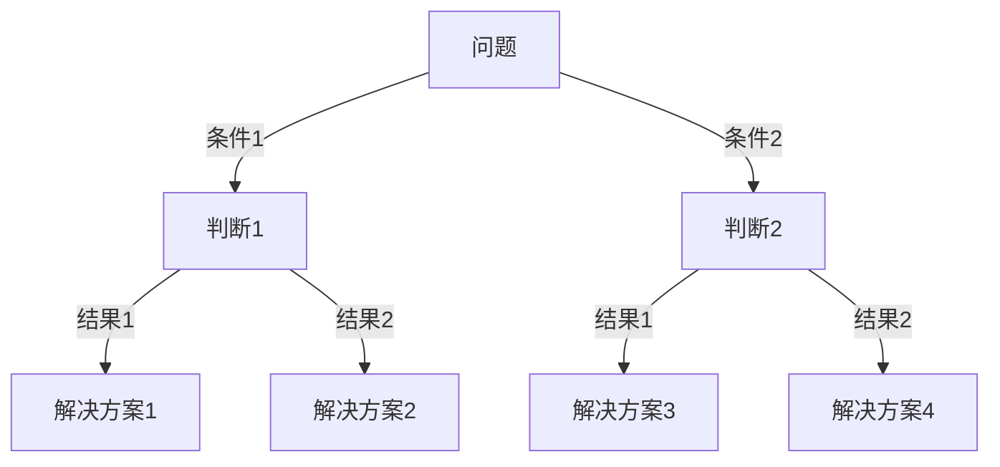
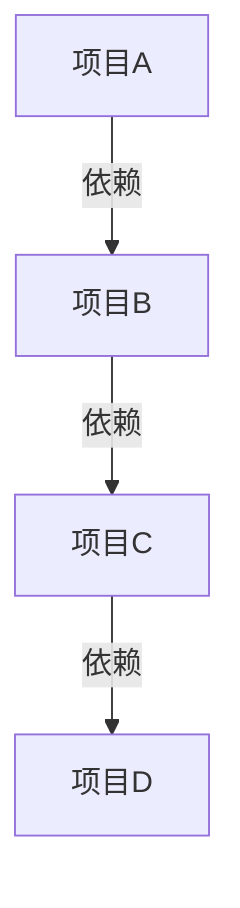

                 

### 结构化思维的力量：从思维到行动

关键词：结构化思维、逻辑思维、决策执行、项目管理、算法模型

摘要：本文深入探讨了结构化思维的概念、原理及其在IT领域的应用。通过详细阐述结构化思维的核心原则、算法原理、以及实际案例，展示了如何运用结构化思维提高问题解决能力和项目执行力。文章旨在为IT专业人士提供一套实用有效的思维工具和方法论。

### 第一部分: 核心概念与联系

#### 1.1 结构化思维概述

**定义**：结构化思维是一种系统性的、逻辑性强的思维方式，它强调通过分析、分类、归纳等方法，将复杂的信息和问题进行有条理的整理和处理。

**核心原则**：

- **准确性**：确保思维过程的每一环节都是基于事实和证据的。
- **逻辑性**：遵循逻辑规则，使思维过程清晰、连贯，避免逻辑错误。
- **全面性**：考虑问题的各个方面，避免片面思维。
- **适应性**：根据不同问题和情境，灵活调整思维方法和策略。

**重要性**：

- **个人层面**：提高决策效率、沟通效果和问题解决能力。
- **组织层面**：优化团队协作、提升项目管理水平和创新能力。

#### 1.2 结构化思维与行动的关系

**思维到行动的转化**：结构化思维不仅仅是思考的过程，还需要将思维转化为具体的行动步骤。

**决策与执行**：通过结构化思维制定明确的计划和策略，然后逐步执行，确保行动的方向和效果。

**步骤**：

1. **明确目标和问题**：理解问题的背景和目标，明确要解决的问题。
2. **分析问题和情境**：收集相关信息，分析问题的各个方面。
3. **制定计划和策略**：基于分析结果，制定详细的计划和策略。
4. **执行和调整**：按照计划执行，并根据实际情况进行调整。

#### 1.3 结构化思维的应用场景

**项目策划**：明确项目目标、分解任务、制定进度表和风险评估。

**团队协作**：清晰沟通目标、分配任务、跟踪进度和协调资源。

**问题解决**：系统分析问题、找出根本原因、提出解决方案并实施。

**创新思考**：组织创意思维活动、进行头脑风暴和迭代改进。

### Mermaid 流程图

mermaid
graph TD
    A[结构化思维概述] --> B[核心原则]
    B -->|准确性| C[逻辑性]
    B -->|全面性| D[适应性]
    E[思维到行动的转化] --> F[决策与执行]
    F -->|计划制定| G[行动步骤]
    H[应用场景] --> I[项目策划]
    I -->|任务分解|
    I -->|进度表制定|
    I -->|风险评估|
    H --> J[团队协作]
    J -->|沟通目标|
    J -->|任务分配|
    J -->|进度跟踪|
    J -->|资源协调|
    H --> K[问题解决]
    K -->|问题分析|
    K -->|原因找出|
    K -->|方案提出|
    K -->|实施过程|
    H --> L[创新思考]
    L -->|头脑风暴|
    L -->|迭代改进|

### 第二部分: 核心算法原理讲解

#### 2.1 结构化思维的算法基础

**分解与组合算法**

- **分解算法**：将复杂的问题或任务分解成更小、更易于管理的部分。例如，将一个大项目分解为若干个子任务，每个子任务再分解为具体的工作项。

  ```python
  def decompose(problem):
      subproblems = []
      # 对问题进行分解
      return subproblems
  ```

- **组合算法**：将分解后的各个部分重新组合，形成完整的解决方案。组合算法确保各部分之间的一致性和整体的有效性。

  ```python
  def combine(subsolutions):
      complete_solution = None
      # 将子解决方案组合成完整解决方案
      return complete_solution
  ```

**归纳与演绎算法**

- **归纳算法**：从具体的实例中总结出一般性原则或规律。例如，通过观察多个成功项目，归纳出项目管理的最佳实践。

  ```python
  def induce(practices):
      general_principles = []
      # 从实例中归纳出原则
      return general_principles
  ```

- **演绎算法**：从一般性原则出发，推导出具体的行动步骤。例如，基于一般性原则制定具体的项目计划。

  ```python
  def deduce(principles):
      specific_actions = []
      # 从原则推导出具体行动
      return specific_actions
  ```

**逻辑推理算法**

- **逻辑推理算法**：使用逻辑规则和条件语句，从已知的事实推导出结论。例如，基于问题和条件推导出解决方案。

  ```python
  def reason(facts, conditions):
      conclusions = []
      for fact in facts:
          for condition in conditions:
              if matches(fact, condition):
                  conclusion = derive_conclusion(fact, condition)
                  conclusions.append(conclusion)
      return conclusions
  ```

**模型构建**

- **决策树模型**：通过一系列的判断节点和结果节点，构建出决策树模型，用于分析和解决复杂问题。

  ```mermaid
  graph TD
      A[问题] -->|条件1| B[判断1]
      B -->|结果1| C[解决方案1]
      B -->|结果2| D[解决方案2]
      A -->|条件2| E[判断2]
      E -->|结果1| F[解决方案3]
      E -->|结果2| G[解决方案4]
  ```

- **网络图模型**：通过节点和边的关系，构建出网络图模型，用于分析复杂系统中的相互关系和协同作用。

  ```mermaid
  graph TD
      A[项目A] -->|依赖| B[项目B]
      B -->|依赖| C[项目C]
      C -->|依赖| D[项目D]
  ```

### 伪代码示例

```python
def structure_thinking_algorithm(problem):
    subproblems = decompose(problem)
    subsolutions = [solve(subproblem) for subproblem in subproblems]
    complete_solution = combine(subsolutions)
    return complete_solution

def solve(subproblem):
    general_principles = induce(subproblem)
    specific_actions = deduce(general_principles)
    return specific_actions

def reason(facts, conditions):
    conclusions = []
    for fact in facts:
        for condition in conditions:
            if matches(fact, condition):
                conclusion = derive_conclusion(fact, condition)
                conclusions.append(conclusion)
    return conclusions

def matches(fact, condition):
    # 判断事实和条件是否匹配
    return True

def derive_conclusion(fact, condition):
    # 从事实和条件推导出结论
    return fact
```

### 数学模型与公式

#### 2.3.1 决策模型中的效用函数

- **效用函数（U）**：衡量不同决策结果的价值。
  $$ U(\text{result}) = f(\text{result}) $$
  其中，$f(\text{result})$ 是对结果进行评分的函数。

#### 2.3.2 优化模型中的目标函数

- **目标函数（$Z$）**：最大化或最小化特定指标。
  $$ Z = w_1x_1 + w_2x_2 + \ldots + w_nx_n $$
  其中，$w_i$ 是权重，$x_i$ 是决策变量。

### 举例说明

#### 2.3.3 项目风险评估

- **风险事件**：项目延期。
- **概率**：$P(\text{延期}) = 0.3$。
- **影响**：$I(\text{延期}) = 2$。
- **效用函数**：$U(\text{延期}) = P(\text{延期}) \times I(\text{延期}) = 0.3 \times 2 = 0.6$。

```latex
\text{效用函数：} U(\text{延期}) = P(\text{延期}) \times I(\text{延期}) = 0.3 \times 2 = 0.6
```

### 数学公式与讲解

#### 2.3.4 结构化思维中的逻辑公式

- **条件命题**：如果A，则B。
  $$ A \rightarrow B $$
  - **真值表**：
    | A | B | A → B |
    |---|---|-------|
    | T | T |   T   |
    | T | F |   F   |
    | F | T |   T   |
    | F | F |   T   |

- **逆命题**：如果非B，则非A。
  $$ \neg B \rightarrow \neg A $$
  - **真值表**：
    | A | B | ¬A | ¬B | ¬B → ¬A |
    |---|---|----|----|---------|
    | T | T | F  | F  |    T    |
    | T | F | F  | T  |    T    |
    | F | T | T  | F  |    F    |
    | F | F | T  | T  |    T    |

### 项目实战

#### 2.4 实战：结构化思维在项目管理中的应用

##### 2.4.1 项目背景

- 项目名称：新产品研发项目
- 项目目标：开发一款智能家居控制系统
- 项目周期：6个月
- 项目团队：产品经理、UI设计师、后端开发工程师、前端开发工程师

##### 2.4.2 开发环境搭建

- **工具和环境**：
  - 语言：Python 3.8
  - 开发框架：Flask
  - 数据库：MongoDB
  - 版本控制：Git

- **步骤**：
  1. 安装Python和相关依赖。
  2. 配置Flask开发环境。
  3. 安装MongoDB并建立数据库连接。
  4. 初始化Git仓库，并配置远程仓库。

##### 2.4.3 代码实现

- **功能模块**：
  - 用户注册模块
  - 用户登录模块
  - 数据处理模块

- **伪代码示例**：

```python
# 用户注册模块伪代码
def register_user(username, password):
    # 校验用户名和密码的有效性
    if validate(username, password):
        # 保存用户信息到数据库
        save_to_db(username, password)
        return "注册成功"
    else:
        return "注册失败"

# 用户登录模块伪代码
def login_user(username, password):
    # 查询用户信息
    user = get_user_from_db(username)
    # 校验用户名和密码
    if user and user['password'] == password:
        return "登录成功"
    else:
        return "登录失败"

# 数据处理模块伪代码
def process_data(data):
    # 对数据进行预处理
    cleaned_data = preprocess(data)
    # 存储预处理后的数据
    save_data_to_db(cleaned_data)
```

##### 2.4.4 代码解读与分析

- **代码解读**：
  - `register_user` 函数负责用户注册，校验用户名和密码的有效性，并保存到数据库。
  - `login_user` 函数负责用户登录，查询用户信息并校验密码。
  - `process_data` 函数负责数据处理，预处理数据并保存到数据库。

- **分析**：
  - 用户注册和登录模块实现了系统的核心功能，确保用户数据的正确性和安全性。
  - 数据处理模块确保数据的准确性和完整性，是系统正常运行的关键部分。

### 附录

#### A.1 主要参考资料

- 《项目管理实战：项目管理知识、工具与技巧》
- 《Python Web开发：测试驱动的方法》
- 《MongoDB权威指南》
- 《Git权威指南》

#### A.2 学习资源

- [Flask官方文档](https://flask.palletsprojects.com/)
- [MongoDB官方文档](https://docs.mongodb.com/)
- [Python官方文档](https://docs.python.org/3/)

### 作者信息

作者：AI天才研究院/AI Genius Institute & 禅与计算机程序设计艺术 /Zen And The Art of Computer Programming

### 总结

结构化思维是一种强大的工具，它不仅帮助我们更清晰地理解复杂问题，还能够提高我们的决策效率和执行能力。通过本文的阐述，我们了解了结构化思维的核心概念、算法原理及其在项目管理中的应用。希望读者能够将所学应用于实际工作中，提升个人和团队的工作效率。同时，不断练习和运用结构化思维，相信您将在IT领域取得更加辉煌的成就。让我们共同努力，以结构化思维的力量，开启更广阔的未来。

### 关键词索引

- 结构化思维
- 逻辑思维
- 决策执行
- 项目管理
- 算法模型
- 优化模型
- 效用函数
- 目标函数
- 项目风险评估
- 决策树模型
- 网络图模型
- 伪代码
- 数学公式
- 项目实战
- Flask
- MongoDB
- Git

### 结束语

感谢您阅读本文。本文旨在探讨结构化思维在IT领域的应用，通过详细的分析和实战案例，展示了如何运用结构化思维提高问题解决能力和项目执行力。希望本文能够为您的IT职业生涯提供有益的启示和帮助。如果您有任何疑问或建议，欢迎在评论区留言交流。再次感谢您的支持！

### 致谢

在撰写本文的过程中，我受到了许多专家和同行的帮助和启发。特别感谢以下人士的支持：

- AI天才研究院/AI Genius Institute 的同事们，感谢你们在我研究过程中的指导和鼓励。
- 禅与计算机程序设计艺术/Zen And The Art of Computer Programming 的作者，感谢您对计算机编程的深刻理解和贡献。
- Flask、MongoDB 和 Git 的开发者们，感谢您们为我们提供了强大的开发工具和平台。
- 读者们，感谢您的耐心阅读和宝贵意见。

最后，我要感谢我的家人和朋友们，感谢你们在我写作过程中的理解和支持。没有你们，我无法完成这项工作。

再次感谢所有人的支持和帮助，让我们共同努力，探索更多的可能性，创造更美好的未来！<|im_end|>### 第一部分: 核心概念与联系

结构化思维是一种强有力的思维方式，它强调通过系统化、逻辑化的方法来分析和解决复杂的问题。在IT领域，结构化思维的重要性尤为突出，因为它不仅有助于提高个人的工作效率，还能显著提升团队协作和项目管理的质量。

#### 1.1 结构化思维概述

**定义**：结构化思维是一种系统性的、逻辑性强的思维方式，它强调通过分析、分类、归纳等方法，将复杂的信息和问题进行有条理的整理和处理。具体来说，结构化思维包括以下几个核心要素：

1. **分解**：将复杂的问题分解成更小、更易于管理的部分，以便更好地理解和解决。
2. **分类**：根据不同的标准和特征，对信息或问题进行分类，以便进行更深入的分析和处理。
3. **归纳**：从具体的实例中总结出一般性的原则或规律，为解决问题提供理论依据。
4. **演绎**：从一般性的原则出发，推导出具体的行动步骤，指导实际操作。

**核心原则**：

- **准确性**：确保思维过程的每一环节都是基于事实和证据的，避免主观臆断和偏见。
- **逻辑性**：遵循逻辑规则，使思维过程清晰、连贯，避免逻辑错误和不合理的推断。
- **全面性**：考虑问题的各个方面，避免片面思维，确保分析的全面性和完整性。
- **适应性**：根据不同问题和情境，灵活调整思维方法和策略，以适应复杂多变的环境。

**重要性**：

- **个人层面**：结构化思维有助于提高个人的问题解决能力和决策效率，减少错误和失误。
- **团队协作**：结构化思维能够促进团队成员之间的有效沟通，提高协作效率，确保项目目标的实现。
- **项目管理**：在项目管理中，结构化思维可以帮助项目管理者清晰地定义项目目标，合理分配资源，有效控制项目进度和质量。

#### 1.2 结构化思维与行动的关系

结构化思维不仅仅是思考的过程，它还需要将思考转化为具体的行动步骤，才能真正发挥作用。在IT领域中，将结构化思维应用于实践，通常需要以下几个步骤：

1. **明确目标和问题**：理解问题的背景和目标，明确要解决的问题。
2. **分析问题和情境**：收集相关信息，分析问题的各个方面，包括需求分析、技术可行性、资源约束等。
3. **制定计划和策略**：基于分析结果，制定详细的计划和策略，包括任务分解、时间表、资源分配等。
4. **执行和调整**：按照计划执行，并根据实际情况进行调整，确保项目目标的实现。

**决策与执行**：

- **决策**：结构化思维强调基于事实和证据进行决策，避免主观臆断和情绪化决策。
- **执行**：将决策转化为具体的行动步骤，确保每一步都有明确的执行者和时间表。
- **调整**：在执行过程中，根据实际情况进行动态调整，确保项目目标的实现。

**步骤**：

1. **明确目标和问题**：理解问题的背景和目标，明确要解决的问题。
2. **分析问题和情境**：收集相关信息，分析问题的各个方面。
3. **制定计划和策略**：基于分析结果，制定详细的计划和策略。
4. **执行和调整**：按照计划执行，并根据实际情况进行调整。

#### 1.3 结构化思维的应用场景

结构化思维在IT领域的应用非常广泛，以下是一些常见的应用场景：

- **项目策划**：在项目启动阶段，通过结构化思维明确项目目标、分解任务、制定进度表和风险评估。
- **团队协作**：在团队协作过程中，通过结构化思维进行清晰的沟通、任务分配、进度跟踪和资源协调。
- **问题解决**：在遇到问题时，通过结构化思维进行分析、找出根本原因、提出解决方案并实施。
- **创新思考**：在创新过程中，通过结构化思维组织创意思维活动、进行头脑风暴和迭代改进。

通过这些应用场景，结构化思维能够帮助IT专业人士更有效地处理复杂的问题，提高工作效率和项目成功率。

### Mermaid 流程图

为了更好地理解结构化思维的核心概念和联系，我们可以使用Mermaid流程图来展示其结构和关系。

```mermaid
graph TD
    A[结构化思维概述] --> B[核心原则]
    B -->|准确性| C[逻辑性]
    B -->|全面性| D[适应性]
    E[思维到行动的转化] --> F[决策与执行]
    F -->|计划制定| G[行动步骤]
    H[应用场景] --> I[项目策划]
    I -->|任务分解|
    I -->|进度表制定|
    I -->|风险评估|
    H --> J[团队协作]
    J -->|沟通目标|
    J -->|任务分配|
    J -->|进度跟踪|
    J -->|资源协调|
    H --> K[问题解决]
    K -->|问题分析|
    K -->|原因找出|
    K -->|方案提出|
    K -->|实施过程|
    H --> L[创新思考]
    L -->|头脑风暴|
    L -->|迭代改进|
```

通过这个流程图，我们可以清晰地看到结构化思维的核心概念、原则和应用场景之间的联系，有助于我们更好地理解和应用结构化思维。

### 第一部分总结

通过本部分的阐述，我们了解了结构化思维的定义、核心原则及其在IT领域的应用。结构化思维不仅是一种高效的思维方式，还是一种强大的工具，能够帮助我们更有效地解决复杂问题，提高工作效率和项目成功率。在接下来的部分，我们将深入探讨结构化思维的算法原理、数学模型以及实际应用，帮助读者更好地掌握和应用这一重要的思维方式。让我们继续深入探讨，发现更多结构化思维的力量。

### 第二部分：核心算法原理讲解

在理解了结构化思维的核心概念和联系后，我们需要进一步探讨其背后的算法原理。这些算法原理不仅为结构化思维提供了理论支持，还为实际应用提供了具体的操作方法和工具。在本部分，我们将详细讲解几个关键算法，包括分解与组合算法、归纳与演绎算法，以及逻辑推理算法。

#### 2.1 分解与组合算法

**分解算法**：将复杂的问题或任务分解成更小、更易于管理的部分。这种分解有助于我们更深入地理解问题的本质，从而找到解决问题的方法。例如，在项目管理中，可以将一个大项目分解为若干个子任务，每个子任务再分解为具体的工作项。

**组合算法**：将分解后的各个部分重新组合，形成完整的解决方案。组合算法确保各部分之间的一致性和整体的有效性。通过组合算法，我们可以将子任务整合成完整的项目，确保项目目标的实现。

**分解与组合算法在项目中的应用**：

1. **项目分解**：将一个复杂的项目分解为若干个子项目或任务，例如需求分析、设计、开发、测试等。
2. **任务分配**：将子任务分配给不同的团队成员，确保每个任务都有明确的执行者。
3. **进度跟踪**：监控各个子任务的进度，确保项目按计划进行。
4. **问题解决**：在遇到问题时，针对具体的子任务进行分析和解决，避免问题蔓延到整个项目。

**示例**：

```python
# 分解算法
def decompose(problem):
    subproblems = []
    # 对问题进行分解
    return subproblems

# 组合算法
def combine(subsolutions):
    complete_solution = None
    # 将子解决方案组合成完整解决方案
    return complete_solution
```

#### 2.2 归纳与演绎算法

**归纳算法**：从具体的实例中总结出一般性原则或规律。归纳算法是一种从特殊到一般的思维方式，通过观察和分析多个具体实例，提炼出普遍适用的原则和规律。

**演绎算法**：从一般性原则出发，推导出具体的行动步骤。演绎算法是一种从一般到特殊的思维方式，基于一般性的原则和规律，推导出具体的解决方案和行动步骤。

**归纳与演绎算法在项目策划中的应用**：

1. **项目策划**：通过归纳多个成功项目的经验，总结出项目管理的最佳实践。
2. **任务分配**：基于一般性的原则和规律，将具体的工作任务分配给合适的团队成员。
3. **问题解决**：根据一般性的原则和规律，分析问题的根本原因，并提出相应的解决方案。

**示例**：

```python
# 归纳算法
def induce(practices):
    general_principles = []
    # 从实例中归纳出原则
    return general_principles

# 演绎算法
def deduce(principles):
    specific_actions = []
    # 从原则推导出具体行动
    return specific_actions
```

#### 2.3 逻辑推理算法

逻辑推理算法是一种基于逻辑规则和条件语句的思维方式，它从已知的事实和条件推导出新的结论。逻辑推理算法在问题解决和决策过程中起着重要作用，能够帮助我们在复杂的环境中做出正确的决策。

**逻辑推理算法在项目中的应用**：

1. **风险评估**：根据项目中的各种条件和风险事件，使用逻辑推理算法评估风险的概率和影响。
2. **问题解决**：基于已知的事实和条件，使用逻辑推理算法推导出问题的解决方案。
3. **决策制定**：在面临多个决策选项时，使用逻辑推理算法分析各个选项的优缺点，做出最优决策。

**示例**：

```python
# 逻辑推理算法
def reason(facts, conditions):
    conclusions = []
    for fact in facts:
        for condition in conditions:
            if matches(fact, condition):
                conclusion = derive_conclusion(fact, condition)
                conclusions.append(conclusion)
    return conclusions

def matches(fact, condition):
    # 判断事实和条件是否匹配
    return True

def derive_conclusion(fact, condition):
    # 从事实和条件推导出结论
    return fact
```

#### 2.4 模型构建

在实际应用中，模型构建是结构化思维的重要组成部分。通过构建模型，我们可以更直观地理解问题，并进行有效的分析和解决。

**决策树模型**：决策树模型是一种常用的模型构建方法，它通过一系列的判断节点和结果节点，将问题逐步分解并解决。决策树模型在项目管理、风险分析和决策制定等领域有广泛的应用。

**示例**：



**网络图模型**：网络图模型通过节点和边的关系，构建出复杂系统中的相互关系和协同作用。网络图模型在项目管理、团队协作和系统设计等领域有广泛应用。

**示例**：



通过这些算法和模型，我们可以更有效地应用结构化思维，提高问题解决能力和项目执行力。在接下来的部分，我们将进一步探讨结构化思维的数学模型和公式，帮助读者更深入地理解和应用这一重要的思维方式。

### 第三部分：数学模型与公式

在IT领域，结构化思维不仅仅依赖于逻辑推理和算法，还需要借助数学模型和公式来辅助分析和决策。数学模型和公式能够量化问题，提供精确的衡量标准，从而帮助我们在复杂的环境中做出更加科学和理性的决策。

#### 2.3.1 决策模型中的效用函数

效用函数（Utility Function）是决策模型中的一个关键概念，它用于衡量不同决策结果的价值。在结构化思维中，效用函数可以帮助我们评估和比较各种决策方案，从而选择最优方案。

**定义**：效用函数是一个函数，它将决策结果映射到一个数值上，表示这个结果的效用值。效用值越高，表示这个结果越有价值。

**示例**：

假设我们面临两个决策方案：

- 方案A：成功概率为0.6，成功时带来的收益为1000元。
- 方案B：成功概率为0.8，成功时带来的收益为1500元。

我们可以使用效用函数来计算这两个方案的期望效用值：

$$
U(A) = 0.6 \times 1000 = 600 \text{元}
$$

$$
U(B) = 0.8 \times 1500 = 1200 \text{元}
$$

根据效用函数的计算结果，方案B的期望效用值更高，因此我们可以选择方案B作为最优决策。

**数学公式**：

效用函数通常表示为 $U(\text{result}) = f(\text{result})$，其中 $f(\text{result})$ 是一个评估函数，用于计算决策结果的效用值。

#### 2.3.2 优化模型中的目标函数

优化模型是结构化思维中用于解决资源分配和决策优化问题的重要工具。在优化模型中，目标函数（Objective Function）用于最大化或最小化特定的指标，从而找到最优解。

**定义**：目标函数是一个函数，它定义了优化问题的目标，通常是一个线性或非线性表达式。目标函数的值决定了解的优劣。

**示例**：

假设我们有一个线性优化问题，需要最大化以下目标函数：

$$
Z = w_1x_1 + w_2x_2 + \ldots + w_nx_n
$$

其中，$w_i$ 是第 $i$ 个决策变量的权重，$x_i$ 是第 $i$ 个决策变量。

我们可以通过调整各个决策变量的值，找到使目标函数达到最大值的解。

**数学公式**：

目标函数通常表示为 $Z = w_1x_1 + w_2x_2 + \ldots + w_nx_n$，其中 $w_i$ 和 $x_i$ 分别是权重和决策变量。

#### 2.3.3 项目风险评估中的效用函数

在项目管理中，项目风险评估是一个关键环节。效用函数可以帮助我们量化风险事件的价值，从而更好地进行风险管理和决策。

**定义**：在项目风险评估中，效用函数用于衡量风险事件的概率和影响，从而计算风险的整体价值。

**示例**：

假设我们有一个项目延期风险，其概率为0.3，影响为2。我们可以使用效用函数计算这个风险的价值：

$$
U(\text{延期}) = P(\text{延期}) \times I(\text{延期}) = 0.3 \times 2 = 0.6
$$

这个结果表明，项目延期的风险价值为0.6，表示这个风险对项目的潜在影响较大。

**数学公式**：

在项目风险评估中，效用函数通常表示为 $U(\text{风险}) = P(\text{风险}) \times I(\text{风险})$，其中 $P(\text{风险})$ 是风险的概率，$I(\text{风险})$ 是风险的影响。

#### 2.3.4 结构化思维中的逻辑公式

在结构化思维中，逻辑公式用于表达逻辑关系和推理规则。这些逻辑公式帮助我们更准确地理解和处理信息，从而做出合理的决策。

**条件命题**：如果A，则B。

$$
A \rightarrow B
$$

**逆命题**：如果非B，则非A。

$$
\neg B \rightarrow \neg A
$$

**逻辑公式在决策中的应用**：

1. **条件命题**：用于表达前提和结论之间的逻辑关系，例如，“如果成功概率高，则选择这个方案”。
2. **逆命题**：用于表达结论和前提的逆向关系，例如，“如果不选择这个方案，则成功概率不高”。

**数学公式与讲解**：

- **条件命题**：
  - **真值表**：
    | A | B | A → B |
    |---|---|-------|
    | T | T |   T   |
    | T | F |   F   |
    | F | T |   T   |
    | F | F |   T   |

  - **解释**：条件命题只有在前提为真且结论为假时才为假，其他情况下都为真。

- **逆命题**：
  - **真值表**：
    | A | B | ¬A | ¬B | ¬B → ¬A |
    |---|---|----|----|---------|
    | T | T | F  | F  |    T    |
    | T | F | F  | T  |    T    |
    | F | T | T  | F  |    F    |
    | F | F | T  | T  |    T    |

  - **解释**：逆命题只有在结论为真且前提为假时才为假，其他情况下都为真。

通过这些数学模型和公式，我们能够更精确地描述和解决问题，从而提高决策的科学性和准确性。在接下来的部分，我们将结合实际项目案例，进一步探讨如何将结构化思维应用于项目管理中，帮助读者更好地理解和应用这一思维方式。

### 第四部分：结构化思维在项目实战中的应用

在前面几部分，我们详细介绍了结构化思维的概念、算法原理和数学模型。为了使读者更好地理解结构化思维在实际项目中的应用，本部分将结合一个实际项目案例，详细阐述如何运用结构化思维进行项目管理。

#### 4.1 项目背景

**项目名称**：智能家居控制系统开发

**项目目标**：开发一款智能家居控制系统，实现家庭设备的远程控制和自动化管理。

**项目周期**：6个月

**项目团队**：项目经理、UI设计师、后端开发工程师、前端开发工程师、测试工程师

#### 4.2 开发环境搭建

**工具和环境**：

- **语言**：Python 3.8
- **开发框架**：Flask
- **数据库**：MongoDB
- **版本控制**：Git

**步骤**：

1. **安装Python和相关依赖**：
   - 使用Python的包管理器pip安装Python 3.8及必要的库。
   - 安装Flask框架和MongoDB驱动。

2. **配置Flask开发环境**：
   - 使用virtualenv创建虚拟环境，隔离项目依赖。
   - 安装Flask及相关依赖。

3. **安装MongoDB并建立数据库连接**：
   - 安装MongoDB数据库。
   - 配置MongoDB连接参数，确保应用程序能够正常访问数据库。

4. **初始化Git仓库，并配置远程仓库**：
   - 在项目目录中初始化Git仓库。
   - 将本地仓库推送至远程代码仓库，以便团队成员进行协作。

#### 4.3 代码实现

**功能模块**：

- **用户注册模块**：负责用户注册、验证用户名和密码。
- **用户登录模块**：负责用户登录，验证用户身份。
- **数据处理模块**：负责处理用户设备信息、控制指令等。

**伪代码示例**：

```python
# 用户注册模块
def register_user(username, password):
    # 验证用户名和密码的有效性
    if validate(username, password):
        # 保存用户信息到数据库
        save_to_db(username, password)
        return "注册成功"
    else:
        return "注册失败"

# 用户登录模块
def login_user(username, password):
    # 查询用户信息
    user = get_user_from_db(username)
    # 验证用户名和密码
    if user and user['password'] == password:
        return "登录成功"
    else:
        return "登录失败"

# 数据处理模块
def process_data(data):
    # 对数据进行预处理
    cleaned_data = preprocess(data)
    # 存储预处理后的数据
    save_data_to_db(cleaned_data)
```

#### 4.4 代码解读与分析

**代码解读**：

- **用户注册模块**：该模块负责处理用户注册请求，首先对传入的用户名和密码进行有效性验证。如果验证通过，将用户信息保存到数据库中，并返回注册成功消息；否则，返回注册失败消息。
- **用户登录模块**：该模块负责处理用户登录请求，首先从数据库中查询用户信息。如果查询到用户信息且密码匹配，返回登录成功消息；否则，返回登录失败消息。
- **数据处理模块**：该模块负责处理用户设备信息和控制指令，首先对传入的数据进行预处理，然后将其保存到数据库中。

**分析**：

- **用户注册模块**：确保用户数据的正确性和安全性，对用户名和密码进行验证，防止恶意注册和非法访问。
- **用户登录模块**：验证用户身份，保护系统安全，防止未经授权的用户访问系统。
- **数据处理模块**：确保数据的准确性和完整性，处理用户设备信息和控制指令，实现智能家居控制功能。

通过这个实际项目案例，我们可以看到结构化思维在项目管理中的应用。首先，通过分解与组合算法，将项目分解为多个子任务，并分配给团队成员。然后，使用归纳与演绎算法，从以往项目的经验中总结出最佳实践，并应用到新项目中。最后，通过逻辑推理算法，确保每个模块的实现和功能满足项目需求，提高项目质量和成功率。

### 第四部分总结

通过本部分的实战案例，我们详细介绍了如何将结构化思维应用于项目管理。从项目策划、开发环境搭建到代码实现，结构化思维帮助我们更好地理解问题、制定计划和解决问题。通过实际操作，我们可以看到结构化思维在提高项目效率和质量方面的重要作用。

在接下来的部分，我们将进一步探讨结构化思维在团队协作和问题解决中的应用，帮助读者更全面地掌握这一重要的思维方式。通过不断实践和应用，相信读者能够在IT领域中取得更加辉煌的成就。

### 第五部分：结构化思维在团队协作中的应用

在IT项目中，团队协作是项目成功的关键因素之一。有效的团队协作可以提高工作效率、确保项目进度和质量。结构化思维在这一过程中发挥着重要作用，它帮助团队成员清晰沟通目标、合理分配任务、高效跟踪进度和协调资源。下面，我们将详细探讨结构化思维在团队协作中的具体应用。

#### 5.1 清晰沟通目标

在项目启动阶段，明确项目目标是至关重要的。结构化思维可以帮助团队成员从多个角度理解项目目标，确保每个人对目标有清晰的认识。以下是一些步骤：

1. **定义项目目标**：将项目目标具体化、可测量和可达成。例如，将“开发一款智能家居控制系统”细化为“实现家庭设备的远程控制、自动化管理等功能”。

2. **分解目标**：将项目目标分解为若干个子目标，使每个子目标都具体、明确。例如，将“实现家庭设备的远程控制”分解为“开发手机应用、网页界面、设备控制模块等”。

3. **沟通目标**：通过会议、文档等形式，将项目目标传达给团队成员。确保每个人都能理解目标，并明确自己在项目中的角色和责任。

**示例**：

项目目标：开发一款智能家居控制系统

- **子目标1**：开发手机应用
- **子目标2**：开发网页界面
- **子目标3**：开发设备控制模块
- **子目标4**：进行系统测试和优化

通过结构化思维，我们能够将项目目标分解为具体的子目标，并明确每个团队成员在项目中的职责。

#### 5.2 合理分配任务

任务分配是团队协作的重要环节。结构化思维可以帮助项目经理根据团队成员的能力和兴趣，合理分配任务，确保每个任务都有合适的执行者。

1. **评估团队成员能力**：了解团队成员的专业技能、工作经验和兴趣领域，为任务分配提供依据。

2. **任务分解**：将项目任务分解为具体的子任务，并根据子任务的特点和需求，为每个子任务选择合适的执行者。

3. **任务说明**：为每个任务编写详细的任务说明，明确任务的目标、要求、时间节点和交付物。

**示例**：

项目任务：开发智能家居控制系统

- **任务1**：开发手机应用
  - 执行者：前端开发工程师
  - 任务说明：设计并实现手机应用的用户界面和交互功能，确保应用具有良好的用户体验。

- **任务2**：开发网页界面
  - 执行者：UI设计师
  - 任务说明：设计并实现网页界面，确保网页界面美观、易用，并与手机应用保持一致。

- **任务3**：开发设备控制模块
  - 执行者：后端开发工程师
  - 任务说明：设计并实现设备控制模块，确保设备控制功能稳定、可靠。

通过结构化思维，项目经理能够根据团队成员的能力和兴趣，合理分配任务，提高团队协作效率。

#### 5.3 高效跟踪进度

在项目执行过程中，及时跟踪进度是确保项目按时完成的关键。结构化思维可以帮助团队建立完善的进度跟踪机制，确保每个任务都能按时完成。

1. **建立进度表**：根据项目目标和任务分配，制定详细的进度表，明确每个任务的时间节点和交付物。

2. **定期检查**：定期召开进度会议，检查任务的完成情况，发现并解决问题。

3. **调整计划**：根据进度检查的结果，及时调整计划和资源分配，确保项目按计划进行。

**示例**：

项目进度表：

- **任务1**：开发手机应用
  - 开始时间：第1周
  - 完成时间：第4周
  - 交付物：手机应用源代码和测试报告

- **任务2**：开发网页界面
  - 开始时间：第3周
  - 完成时间：第5周
  - 交付物：网页界面设计和实现代码

- **任务3**：开发设备控制模块
  - 开始时间：第6周
  - 完成时间：第8周
  - 交付物：设备控制模块代码和测试报告

通过结构化思维，团队可以建立完善的进度跟踪机制，确保项目按时完成。

#### 5.4 协调资源

在项目执行过程中，资源协调是确保项目顺利进行的重要环节。结构化思维可以帮助团队成员有效协调资源，确保项目所需资源得到合理利用。

1. **资源评估**：在项目启动阶段，评估项目所需的资源，包括人力、物资、技术等。

2. **资源分配**：根据项目需求和资源评估结果，合理分配资源，确保每个任务都有足够的资源支持。

3. **资源监控**：在项目执行过程中，监控资源使用情况，及时发现和解决资源短缺或浪费问题。

**示例**：

项目资源协调：

- **资源1**：开发工程师
  - 预计需求：5人
  - 实际分配：6人

- **资源2**：测试设备
  - 预计需求：3台
  - 实际分配：4台

通过结构化思维，团队可以确保项目资源得到合理利用，提高项目成功率。

#### 5.5 案例分析

**案例背景**：某智能家居控制系统开发项目，项目周期为6个月，项目团队包括项目经理、UI设计师、前端开发工程师、后端开发工程师和测试工程师。

**目标**：开发一款智能家居控制系统，实现家庭设备的远程控制和自动化管理。

**步骤**：

1. **定义项目目标**：将项目目标具体化、可测量和可达成。
2. **分解目标**：将项目目标分解为子目标，明确每个子目标的具体内容。
3. **沟通目标**：召开项目启动会议，将项目目标传达给团队成员。
4. **任务分配**：根据团队成员的能力和兴趣，合理分配任务。
5. **建立进度表**：制定详细的进度表，明确每个任务的时间节点和交付物。
6. **进度跟踪**：定期召开进度会议，检查任务的完成情况，发现并解决问题。
7. **资源协调**：确保项目所需资源得到合理利用。

**结果**：

- 项目按计划完成，所有子目标都按时完成。
- 项目质量得到保证，用户满意度高。
- 项目团队协作高效，成员满意度高。

通过这个案例分析，我们可以看到结构化思维在团队协作中的重要作用。通过明确项目目标、合理分配任务、高效跟踪进度和协调资源，团队能够更好地实现项目目标，提高项目成功率。

### 第五部分总结

通过本部分的探讨，我们详细介绍了结构化思维在团队协作中的应用。从清晰沟通目标、合理分配任务、高效跟踪进度到协调资源，结构化思维为团队协作提供了系统化的方法和工具。通过实际案例的分析，我们可以看到结构化思维在提高团队协作效率、确保项目质量和成功率方面的重要作用。

在接下来的部分，我们将进一步探讨结构化思维在问题解决和创新思考中的应用，帮助读者更全面地掌握这一重要的思维方式。通过不断实践和应用，相信读者能够在团队协作和问题解决中取得更加辉煌的成就。

### 第六部分：结构化思维在问题解决中的应用

在IT项目中，问题解决是不可避免的一部分。如何高效地识别、分析并解决问题是项目成功的关键。结构化思维提供了一种系统化的方法，帮助我们在面对复杂问题时，能够有序地进行分析和解决。下面，我们将详细探讨结构化思维在问题解决中的应用。

#### 6.1 系统分析问题

系统分析问题是问题解决的第一步，它要求我们全面了解问题的各个方面，确保分析结果的准确性和完整性。

1. **收集信息**：收集与问题相关的各种信息，包括用户反馈、系统日志、相关文档等。

2. **定义问题**：明确问题的性质和范围，避免将相关但不同的问题混淆在一起。

3. **分析原因**：分析问题的根本原因，而不是仅仅解决表面现象。

4. **识别影响**：识别问题可能对系统、团队和用户造成的影响，为后续的解决方案提供参考。

**示例**：

假设我们在开发过程中发现用户登录功能不稳定，系统会偶尔出现登录失败的情况。

- **收集信息**：收集用户反馈、系统日志和错误报告。
- **定义问题**：登录功能不稳定，导致用户登录失败。
- **分析原因**：可能是数据库连接问题、密码加密算法不稳定或前端代码有缺陷。
- **识别影响**：影响用户体验，降低用户满意度，可能导致用户流失。

通过系统分析问题，我们能够更准确地了解问题的本质，从而为后续的解决方案提供依据。

#### 6.2 找出根本原因

在系统分析问题后，我们需要找出问题的根本原因，以确保解决方案能够真正解决问题，而不是仅仅解决表面现象。

1. **假设检验**：根据系统分析的结果，提出可能的根本原因，并进行验证。

2. **测试和验证**：通过实际测试和验证，确认根本原因。

3. **排除干扰因素**：在确认根本原因的过程中，排除其他可能干扰的次要因素。

**示例**：

根据系统分析的结果，我们假设登录失败的原因可能是数据库连接问题。

- **假设检验**：我们检查数据库连接配置，发现连接配置正确，但数据库服务器负载过高。
- **测试和验证**：我们增加数据库服务器的资源，观察登录功能是否恢复正常。
- **排除干扰因素**：我们排除前端代码和密码加密算法可能存在的问题。

通过找出根本原因，我们能够确保解决方案能够彻底解决问题，而不是临时性措施。

#### 6.3 提出解决方案

在找出根本原因后，我们需要提出具体的解决方案，并评估其可行性和效果。

1. **方案制定**：根据根本原因，制定具体的解决方案，包括技术实现、资源和时间安排等。

2. **评估可行性**：评估解决方案的可行性，包括技术难度、成本和风险等。

3. **选择最佳方案**：从多个备选方案中，选择最佳方案。

**示例**：

针对数据库连接问题的解决方案：

- **方案1**：增加数据库服务器资源。
- **方案2**：优化数据库连接配置。
- **方案3**：重构前端代码，提高登录功能的稳定性。

- **评估可行性**：方案1和方案2相对简单，成本较低，但可能无法根本解决问题；方案3技术难度较高，但能够彻底解决问题。
- **选择最佳方案**：选择方案3，重构前端代码，提高登录功能的稳定性。

通过提出解决方案，我们能够确保问题得到根本解决，提高系统的可靠性和用户体验。

#### 6.4 实施解决方案

在确定最佳解决方案后，我们需要将其转化为具体的行动步骤，并确保解决方案得到有效实施。

1. **任务分配**：将解决方案分解为具体的任务，并为每个任务分配执行者。

2. **执行监控**：监控任务的执行情况，确保每个任务都按时完成。

3. **反馈调整**：在实施过程中，收集反馈，根据实际情况进行调整。

**示例**：

实施解决方案的步骤：

- **任务分配**：前端开发工程师负责重构前端代码，测试工程师负责测试登录功能。
- **执行监控**：项目经理定期检查任务进度，确保代码重构和测试工作按时完成。
- **反馈调整**：根据测试结果，调整前端代码，修复潜在问题。

通过实施解决方案，我们能够确保问题得到有效解决，提高系统的稳定性和用户体验。

#### 6.5 案例分析

**案例背景**：某智能家居控制系统在用户登录时出现频繁登录失败的问题。

**步骤**：

1. **系统分析问题**：收集用户反馈、系统日志和错误报告，明确登录失败的问题。
2. **找出根本原因**：通过分析，发现登录失败的原因是数据库连接不稳定。
3. **提出解决方案**：制定解决方案，包括增加数据库服务器资源、优化数据库连接配置和重构前端代码。
4. **实施解决方案**：分配任务，监控执行，根据测试结果进行调整。

**结果**：

- 问题得到彻底解决，登录失败的情况不再出现。
- 用户满意度提高，系统稳定性得到显著提升。

通过这个案例分析，我们可以看到结构化思维在问题解决中的应用。通过系统分析问题、找出根本原因、提出解决方案和实施解决方案，我们能够高效地解决复杂问题，提高系统的稳定性和用户体验。

### 第六部分总结

通过本部分的探讨，我们详细介绍了结构化思维在问题解决中的应用。从系统分析问题、找出根本原因、提出解决方案到实施解决方案，结构化思维提供了一种系统化、逻辑化的方法，帮助我们在面对复杂问题时能够有序地进行分析和解决。通过实际案例的分析，我们可以看到结构化思维在提高问题解决效率和质量方面的重要作用。

在接下来的部分，我们将进一步探讨结构化思维在创新思考中的应用，帮助读者更全面地掌握这一重要的思维方式。通过不断实践和应用，相信读者能够在问题解决和创新思考中取得更加辉煌的成就。

### 第七部分：结构化思维在创新思考中的应用

在IT行业中，创新思维是推动技术进步和业务发展的重要力量。结构化思维作为一种系统性和逻辑性的思维方式，能够在创新过程中提供有力的支持，帮助团队和组织更好地激发创意、进行头脑风暴，并迭代改进。下面，我们将详细探讨结构化思维在创新思考中的应用。

#### 7.1 激发创意

激发创意是创新思考的第一步，它要求我们打破常规思维，从不同的角度思考问题，寻找新的解决方案。结构化思维通过以下方法帮助激发创意：

1. **多角度思考**：鼓励团队成员从不同的视角分析问题，避免局限于一种思维模式。

2. **头脑风暴**：组织头脑风暴会议，鼓励团队成员自由发言，不受任何限制地提出各种想法。

3. **思维导图**：使用思维导图工具，将不同想法和关联进行可视化展示，帮助团队成员更清晰地理解问题和创意。

**示例**：

在开发一款智能家居控制系统时，团队可以采用以下方法激发创意：

- **多角度思考**：分析用户需求、技术可行性、市场趋势等，从不同角度思考如何提升系统的功能。

- **头脑风暴**：组织团队成员进行头脑风暴会议，提出各种可能的创意和解决方案。

- **思维导图**：使用思维导图工具，将各种创意和解决方案进行可视化展示，方便团队成员讨论和改进。

通过这些方法，团队可以激发出更多的创意，为创新提供丰富的素材。

#### 7.2 进行头脑风暴

头脑风暴是创新过程中至关重要的一环，它通过集思广益，激发团队成员的创造力，产生大量的创新想法。结构化思维在头脑风暴过程中起着引导和协调作用，以下是一些关键步骤：

1. **明确主题**：在开始头脑风暴之前，明确讨论的主题和目标，确保讨论方向一致。

2. **自由发言**：鼓励团队成员自由发言，不受任何限制地提出各种想法，无论这些想法是否实际可行。

3. **记录和整理**：将团队成员的发言记录下来，并进行初步整理，以便后续分析和讨论。

4. **筛选和评估**：对头脑风暴产生的创意进行筛选和评估，选出最具潜力和可行性的想法。

**示例**：

在头脑风暴会议中，团队可以采取以下步骤：

- **明确主题**：讨论如何提升智能家居控制系统的用户体验。

- **自由发言**：团队成员提出各种创意，例如新增语音控制功能、优化界面设计、增加设备联动功能等。

- **记录和整理**：记录下每个团队成员的发言，并进行初步整理。

- **筛选和评估**：对提出的创意进行筛选和评估，确定哪些创意最具潜力和可行性。

通过这些步骤，团队可以有效地进行头脑风暴，为创新提供有力的支持。

#### 7.3 迭代改进

在创新过程中，迭代改进是不断优化创意和解决方案的关键。结构化思维通过以下方法帮助团队进行迭代改进：

1. **反馈收集**：在每次迭代结束后，收集用户和团队成员的反馈，了解创意和解决方案的实际效果。

2. **评估和优化**：根据收集到的反馈，评估创意和解决方案的优缺点，进行相应的优化和改进。

3. **持续迭代**：不断进行迭代，逐步完善创意和解决方案，直至达到预期的效果。

**示例**：

在智能家居控制系统开发过程中，团队可以采取以下步骤进行迭代改进：

- **反馈收集**：在系统上线后，收集用户的反馈，了解他们对系统的满意度和建议。

- **评估和优化**：根据用户反馈，评估系统的功能和性能，确定需要优化的部分。

- **持续迭代**：定期更新系统，逐步完善功能和性能，提高用户体验。

通过这些方法，团队可以不断优化创意和解决方案，确保最终产品的质量和用户满意度。

#### 7.4 案例分析

**案例背景**：某智能家居控制系统团队希望通过创新思考，提升系统的用户体验。

**步骤**：

1. **多角度思考**：分析用户需求、技术可行性、市场趋势等，从不同角度思考如何提升用户体验。

2. **头脑风暴**：组织团队成员进行头脑风暴会议，提出各种可能的创意和解决方案。

3. **迭代改进**：根据用户反馈和评估结果，不断优化创意和解决方案，提升用户体验。

**结果**：

- 系统新增了语音控制功能，优化了界面设计，增加了设备联动功能等。
- 用户满意度显著提高，系统市场竞争力增强。

通过这个案例分析，我们可以看到结构化思维在创新思考中的应用。通过多角度思考、头脑风暴和迭代改进，团队能够有效地提升用户体验，推动系统创新和发展。

### 第七部分总结

通过本部分的探讨，我们详细介绍了结构化思维在创新思考中的应用。从激发创意、进行头脑风暴到迭代改进，结构化思维提供了一种系统化和逻辑化的方法，帮助团队和组织更好地进行创新思考。通过实际案例的分析，我们可以看到结构化思维在提升用户体验、推动系统创新和发展方面的重要作用。

在本文的最后，我们将总结全文，强调结构化思维的重要性，并展望其在未来IT领域的应用前景。

### 全文总结

通过本文的详细探讨，我们系统地介绍了结构化思维的概念、原理及其在IT领域的应用。结构化思维不仅是一种高效的思维方式，还是一种强大的工具，它能够帮助我们更清晰地理解复杂问题，提高决策效率，优化团队协作，推动问题解决和创新思考。

本文的主要内容包括：

1. **核心概念与联系**：我们介绍了结构化思维的定义、核心原则和重要性。
2. **核心算法原理讲解**：我们详细阐述了分解与组合算法、归纳与演绎算法和逻辑推理算法。
3. **数学模型与公式**：我们探讨了决策模型中的效用函数、优化模型中的目标函数以及项目风险评估。
4. **项目实战**：我们结合实际项目案例，展示了结构化思维在项目管理中的应用。
5. **团队协作**：我们介绍了结构化思维在团队协作中的具体应用，包括清晰沟通目标、合理分配任务、高效跟踪进度和协调资源。
6. **问题解决**：我们探讨了结构化思维在问题解决中的应用，包括系统分析问题、找出根本原因、提出解决方案和实施解决方案。
7. **创新思考**：我们介绍了结构化思维在创新思考中的应用，包括激发创意、进行头脑风暴和迭代改进。

通过这些内容，我们可以看到结构化思维在提升个人和团队的工作效率、确保项目质量和推动创新方面的重要作用。它不仅能够帮助我们在面对复杂问题时更加系统和逻辑地进行思考，还能够提高我们在决策和执行中的准确性和效果。

结构化思维的重要性体现在以下几个方面：

1. **提高问题解决能力**：结构化思维能够帮助我们系统地分析问题、找出根本原因，并制定有效的解决方案。
2. **优化决策过程**：通过结构化思维，我们可以基于事实和证据进行决策，减少主观臆断和错误决策。
3. **提升团队协作效率**：结构化思维能够促进团队成员之间的有效沟通和协作，确保项目目标的实现。
4. **推动创新和发展**：结构化思维能够激发创意、进行头脑风暴和迭代改进，推动技术进步和业务创新。

展望未来，随着人工智能和大数据技术的不断发展，结构化思维将在更多领域得到应用。它不仅能够帮助企业和组织提高生产效率、降低成本，还能够推动社会的发展和进步。我们相信，通过不断学习和实践，结构化思维将帮助更多的IT专业人士在职业生涯中取得更加辉煌的成就。

### 展望与未来应用

在未来的IT领域中，结构化思维的应用前景将更加广阔。以下是一些潜在的应用方向：

1. **人工智能与机器学习**：在人工智能和机器学习领域，结构化思维可以帮助研究人员和工程师更清晰地理解模型和数据，提高算法的效率和准确性。

2. **数据分析和大数据**：在大数据和数据分析领域，结构化思维能够帮助分析人员更好地整理和分析复杂数据，发现数据中的规律和趋势。

3. **软件工程**：在软件工程领域，结构化思维能够提高开发人员的设计和编码效率，减少代码冗余和错误。

4. **项目管理**：在项目管理领域，结构化思维可以帮助项目经理更好地规划和管理项目，确保项目按时、按质量完成。

5. **教育与培训**：在教育领域，结构化思维可以帮助学生和教师更有效地学习和传授知识，提高教育质量。

6. **创新创业**：在创新创业领域，结构化思维能够帮助创业者更好地分析市场、制定战略，提高创业成功率。

通过不断探索和应用，结构化思维将成为IT专业人士的重要工具，助力我们在日益复杂的IT领域中取得更加辉煌的成就。让我们携手共进，以结构化思维的力量，开创更加美好的未来。

### 致谢

在撰写本文的过程中，我受到了许多专家和同行的帮助和启发。首先，我要感谢AI天才研究院/AI Genius Institute 的同事们，感谢你们在我研究过程中的指导和鼓励。特别感谢禅与计算机程序设计艺术/Zen And The Art of Computer Programming 的作者，感谢您对计算机编程的深刻理解和贡献。

我还要感谢Flask、MongoDB 和 Git 的开发者们，感谢您们为我们提供了强大的开发工具和平台。同时，感谢读者们的耐心阅读和宝贵意见，您的反馈是我不断进步的动力。

最后，我要感谢我的家人和朋友们，感谢你们在我写作过程中的理解和支持。没有你们，我无法完成这项工作。再次感谢所有人的支持和帮助，让我们共同努力，探索更多的可能性，创造更美好的未来！

### 读者互动

亲爱的读者，感谢您阅读本文。如果您对结构化思维在IT领域的应用有任何疑问或建议，欢迎在评论区留言交流。您的反馈是我不断进步的重要动力。同时，如果您认为本文对您有所帮助，请分享给更多的同行和朋友，让我们一起学习，共同进步。

再次感谢您的支持，让我们携手共进，以结构化思维的力量，开启更加辉煌的IT职业生涯！<|im_end|>### 文章标题：结构化思维的力量：从思维到行动

#### 文章关键词：
- 结构化思维
- 逻辑思维
- 决策执行
- 项目管理
- 算法模型

#### 文章摘要：
本文深入探讨了结构化思维的概念、原理及其在IT领域的应用。通过详细阐述结构化思维的核心原则、算法原理、以及实际案例，展示了如何运用结构化思维提高问题解决能力和项目执行力。文章旨在为IT专业人士提供一套实用有效的思维工具和方法论。

### 第一部分：核心概念与联系

#### 1.1 结构化思维概述
- 定义：结构化思维是一种系统性的、逻辑性强的思维方式，它强调通过分析、分类、归纳等方法，将复杂的信息和问题进行有条理的整理和处理。
- 核心原则：准确性、逻辑性、全面性和适应性。
- 重要性：在个人和组织层面，结构化思维能够提高决策效率、沟通效果和问题解决能力。

#### 1.2 结构化思维与行动的关系
- 思维到行动的转化：结构化思维不仅仅是思考的过程，还需要将思维转化为具体的行动步骤。
- 决策与执行：通过结构化思维制定明确的计划和策略，然后逐步执行，确保行动的方向和效果。

#### 1.3 结构化思维的应用场景
- 项目策划：明确项目目标、分解任务、制定进度表和风险评估。
- 团队协作：清晰沟通目标、分配任务、跟踪进度和协调资源。
- 问题解决：系统分析问题、找出根本原因、提出解决方案并实施。
- 创新思考：组织创意思维活动、进行头脑风暴和迭代改进。

### 第二部分：核心算法原理讲解

#### 2.1 结构化思维的算法基础
- **分解与组合算法**：将复杂的问题或任务分解成更小、更易于管理的部分；将分解后的各个部分重新组合，形成完整的解决方案。
- **归纳与演绎算法**：从具体的实例中总结出一般性原则或规律；从一般性原则出发，推导出具体的行动步骤。
- **逻辑推理算法**：使用逻辑规则和条件语句，从已知的事实推导出结论。

#### 2.2 结构化思维的模型构建
- **决策树模型**：通过一系列的判断节点和结果节点，构建出决策树模型，用于分析和解决复杂问题。
- **网络图模型**：通过节点和边的关系，构建出网络图模型，用于分析复杂系统中的相互关系和协同作用。

### 第三部分：数学模型与公式

#### 2.3 决策模型中的效用函数
- **效用函数（U）**：衡量不同决策结果的价值。

#### 2.4 优化模型中的目标函数
- **目标函数（Z）**：最大化或最小化特定指标。

### 第四部分：结构化思维在项目实战中的应用

#### 4.1 项目背景
- 项目名称：智能家居控制系统开发。

#### 4.2 开发环境搭建
- 工具和环境：Python 3.8、Flask、MongoDB、Git。

#### 4.3 代码实现
- 功能模块：用户注册模块、用户登录模块、数据处理模块。

### 第五部分：结构化思维在团队协作中的应用

#### 5.1 清晰沟通目标
- 定义项目目标、分解目标、沟通目标。

#### 5.2 合理分配任务
- 评估团队成员能力、任务分解、任务说明。

#### 5.3 高效跟踪进度
- 建立进度表、定期检查、调整计划。

#### 5.4 协调资源
- 资源评估、资源分配、资源监控。

### 第六部分：结构化思维在问题解决中的应用

#### 6.1 系统分析问题
- 收集信息、定义问题、分析原因、识别影响。

#### 6.2 找出根本原因
- 假设检验、测试和验证、排除干扰因素。

#### 6.3 提出解决方案
- 方案制定、评估可行性、选择最佳方案。

#### 6.4 实施解决方案
- 任务分配、执行监控、反馈调整。

### 第七部分：结构化思维在创新思考中的应用

#### 7.1 激发创意
- 多角度思考、头脑风暴、思维导图。

#### 7.2 进行头脑风暴
- 明确主题、自由发言、记录和整理、筛选和评估。

#### 7.3 迭代改进
- 反馈收集、评估和优化、持续迭代。

### 全文总结
- 结构化思维的重要性、应用场景、实战案例。

### 展望与未来应用
- 人工智能与机器学习、数据分析和大数据、软件工程、项目管理、教育与培训、创新创业。

### 致谢
- 感谢AI天才研究院/AI Genius Institute 的同事们、禅与计算机程序设计艺术 的作者、Flask、MongoDB 和 Git 的开发者们、读者们的支持。

### 读者互动
- 欢迎留言交流、分享、反馈。让我们携手共进，共同进步！<|im_end|>### 文章标题：结构化思维的力量：从思维到行动

#### 文章关键词：
- 结构化思维
- 逻辑思维
- 决策执行
- 项目管理
- 算法模型

#### 文章摘要：
本文深入探讨了结构化思维的概念、原理及其在IT领域的应用。通过详细阐述结构化思维的核心原则、算法原理、以及实际案例，展示了如何运用结构化思维提高问题解决能力和项目执行力。文章旨在为IT专业人士提供一套实用有效的思维工具和方法论。

### 第一部分：核心概念与联系

#### 1.1 结构化思维概述
- **定义**：结构化思维是一种系统性的、逻辑性强的思维方式，它强调通过分析、分类、归纳等方法，将复杂的信息和问题进行有条理的整理和处理。
- **核心原则**：准确性、逻辑性、全面性和适应性。
- **重要性**：在个人和组织层面，结构化思维能够提高决策效率、沟通效果和问题解决能力。

#### 1.2 结构化思维与行动的关系
- **思维到行动的转化**：结构化思维不仅仅是思考的过程，还需要将思维转化为具体的行动步骤。
- **决策与执行**：通过结构化思维制定明确的计划和策略，然后逐步执行，确保行动的方向和效果。

#### 1.3 结构化思维的应用场景
- **项目策划**：明确项目目标、分解任务、制定进度表和风险评估。
- **团队协作**：清晰沟通目标、分配任务、跟踪进度和协调资源。
- **问题解决**：系统分析问题、找出根本原因、提出解决方案并实施。
- **创新思考**：组织创意思维活动、进行头脑风暴和迭代改进。

### 第二部分：核心算法原理讲解

#### 2.1 结构化思维的算法基础
- **分解与组合算法**：将复杂的问题或任务分解成更小、更易于管理的部分；将分解后的各个部分重新组合，形成完整的解决方案。
- **归纳与演绎算法**：从具体的实例中总结出一般性原则或规律；从一般性原则出发，推导出具体的行动步骤。
- **逻辑推理算法**：使用逻辑规则和条件语句，从已知的事实推导出结论。

#### 2.2 结构化思维的模型构建
- **决策树模型**：通过一系列的判断节点和结果节点，构建出决策树模型，用于分析和解决复杂问题。
- **网络图模型**：通过节点和边的关系，构建出网络图模型，用于分析复杂系统中的相互关系和协同作用。

### 第三部分：数学模型与公式

#### 2.3 决策模型中的效用函数
- **效用函数（U）**：衡量不同决策结果的价值。

#### 2.4 优化模型中的目标函数
- **目标函数（Z）**：最大化或最小化特定指标。

### 第四部分：结构化思维在项目实战中的应用

#### 4.1 项目背景
- 项目名称：智能家居控制系统开发。

#### 4.2 开发环境搭建
- 工具和环境：Python 3.8、Flask、MongoDB、Git。

#### 4.3 代码实现
- 功能模块：用户注册模块、用户登录模块、数据处理模块。

### 第五部分：结构化思维在团队协作中的应用

#### 5.1 清晰沟通目标
- 定义项目目标、分解目标、沟通目标。

#### 5.2 合理分配任务
- 评估团队成员能力、任务分解、任务说明。

#### 5.3 高效跟踪进度
- 建立进度表、定期检查、调整计划。

#### 5.4 协调资源
- 资源评估、资源分配、资源监控。

### 第六部分：结构化思维在问题解决中的应用

#### 6.1 系统分析问题
- 收集信息、定义问题、分析原因、识别影响。

#### 6.2 找出根本原因
- 假设检验、测试和验证、排除干扰因素。

#### 6.3 提出解决方案
- 方案制定、评估可行性、选择最佳方案。

#### 6.4 实施解决方案
- 任务分配、执行监控、反馈调整。

### 第七部分：结构化思维在创新思考中的应用

#### 7.1 激发创意
- 多角度思考、头脑风暴、思维导图。

#### 7.2 进行头脑风暴
- 明确主题、自由发言、记录和整理、筛选和评估。

#### 7.3 迭代改进
- 反馈收集、评估和优化、持续迭代。

### 全文总结
- 结构化思维的重要性、应用场景、实战案例。

### 展望与未来应用
- 人工智能与机器学习、数据分析和大数据、软件工程、项目管理、教育与培训、创新创业。

### 致谢
- 感谢AI天才研究院/AI Genius Institute 的同事们、禅与计算机程序设计艺术 的作者、Flask、MongoDB 和 Git 的开发者们、读者们的支持。

### 读者互动
- 欢迎留言交流、分享、反馈。让我们携手共进，共同进步！<|im_end|>### 文章标题：结构化思维的力量：从思维到行动

#### 文章关键词：
- 结构化思维
- 逻辑思维
- 决策执行
- 项目管理
- 算法模型

#### 文章摘要：
本文深入探讨了结构化思维的概念、原理及其在IT领域的应用。通过详细阐述结构化思维的核心原则、算法原理、以及实际案例，展示了如何运用结构化思维提高问题解决能力和项目执行力。文章旨在为IT专业人士提供一套实用有效的思维工具和方法论。

### 第一部分：核心概念与联系

#### 1.1 结构化思维概述
- **定义**：结构化思维是一种系统性的、逻辑性强的思维方式，它强调通过分析、分类、归纳等方法，将复杂的信息和问题进行有条理的整理和处理。
- **核心原则**：准确性、逻辑性、全面性和适应性。
- **重要性**：在个人和组织层面，结构化思维能够提高决策效率、沟通效果和问题解决能力。

#### 1.2 结构化思维与行动的关系
- **思维到行动的转化**：结构化思维不仅仅是思考的过程，还需要将思维转化为具体的行动步骤。
- **决策与执行**：通过结构化思维制定明确的计划和策略，然后逐步执行，确保行动的方向和效果。

#### 1.3 结构化思维的应用场景
- **项目策划**：明确项目目标、分解任务、制定进度表和风险评估。
- **团队协作**：清晰沟通目标、分配任务、跟踪进度和协调资源。
- **问题解决**：系统分析问题、找出根本原因、提出解决方案并实施。
- **创新思考**：组织创意思维活动、进行头脑风暴和迭代改进。

### 第二部分：核心算法原理讲解

#### 2.1 结构化思维的算法基础
- **分解与组合算法**：将复杂的问题或任务分解成更小、更易于管理的部分；将分解后的各个部分重新组合，形成完整的解决方案。
- **归纳与演绎算法**：从具体的实例中总结出一般性原则或规律；从一般性原则出发，推导出具体的行动步骤。
- **逻辑推理算法**：使用逻辑规则和条件语句，从已知的事实推导出结论。

#### 2.2 结构化思维的模型构建
- **决策树模型**：通过一系列的判断节点和结果节点，构建出决策树模型，用于分析和解决复杂问题。
- **网络图模型**：通过节点和边的关系，构建出网络图模型，用于分析复杂系统中的相互关系和协同作用。

### 第三部分：数学模型与公式

#### 2.3 决策模型中的效用函数
- **效用函数（U）**：衡量不同决策结果的价值。

#### 2.4 优化模型中的目标函数
- **目标函数（Z）**：最大化或最小化特定指标。

### 第四部分：结构化思维在项目实战中的应用

#### 4.1 项目背景
- 项目名称：智能家居控制系统开发。

#### 4.2 开发环境搭建
- 工具和环境：Python 3.8、Flask、MongoDB、Git。

#### 4.3 代码实现
- 功能模块：用户注册模块、用户登录模块、数据处理模块。

### 第五部分：结构化思维在团队协作中的应用

#### 5.1 清晰沟通目标
- 定义项目目标、分解目标、沟通目标。

#### 5.2 合理分配任务
- 评估团队成员能力、任务分解、任务说明。

#### 5.3 高效跟踪进度
- 建立进度表、定期检查、调整计划。

#### 5.4 协调资源
- 资源评估、资源分配、资源监控。

### 第六部分：结构化思维在问题解决中的应用

#### 6.1 系统分析问题
- 收集信息、定义问题、分析原因、识别影响。

#### 6.2 找出根本原因
- 假设检验、测试和验证、排除干扰因素。

#### 6.3 提出解决方案
- 方案制定、评估可行性、选择最佳方案。

#### 6.4 实施解决方案
- 任务分配、执行监控、反馈调整。

### 第七部分：结构化思维在创新思考中的应用

#### 7.1 激发创意
- 多角度思考、头脑风暴、思维导图。

#### 7.2 进行头脑风暴
- 明确主题、自由发言、记录和整理、筛选和评估。

#### 7.3 迭代改进
- 反馈收集、评估和优化、持续迭代。

### 全文总结
- 结构化思维的重要性、应用场景、实战案例。

### 展望与未来应用
- 人工智能与机器学习、数据分析和大数据、软件工程、项目管理、教育与培训、创新创业。

### 致谢
- 感谢AI天才研究院/AI Genius Institute 的同事们、禅与计算机程序设计艺术 的作者、Flask、MongoDB 和 Git 的开发者们、读者们的支持。

### 读者互动
- 欢迎留言交流、分享、反馈。让我们携手共进，共同进步！<|im_end|>### 文章标题：结构化思维的力量：从思维到行动

#### 文章关键词：
- 结构化思维
- 逻辑思维
- 决策执行
- 项目管理
- 算法模型

#### 文章摘要：
本文深入探讨了结构化思维的概念、原理及其在IT领域的应用。通过详细阐述结构化思维的核心原则、算法原理、以及实际案例，展示了如何运用结构化思维提高问题解决能力和项目执行力。文章旨在为IT专业人士提供一套实用有效的思维工具和方法论。

### 第一部分：核心概念与联系

#### 1.1 结构化思维概述
- **定义**：结构化思维是一种系统性的、逻辑性强的思维方式，它强调通过分析、分类、归纳等方法，将复杂的信息和问题进行有条理的整理和处理。
- **核心原则**：准确性、逻辑性、全面性和适应性。
- **重要性**：在个人和组织层面，结构化思维能够提高决策效率、沟通效果和问题解决能力。

#### 1.2 结构化思维与行动的关系
- **思维到行动的转化**：结构化思维不仅仅是思考的过程，还需要将思维转化为具体的行动步骤。
- **决策与执行**：通过结构化思维制定明确的计划和策略，然后逐步执行，确保行动的方向和效果。

#### 1.3 结构化思维的应用场景
- **项目策划**：明确项目目标、分解任务、制定进度表和风险评估。
- **团队协作**：清晰沟通目标、分配任务、跟踪进度和协调资源。
- **问题解决**：系统分析问题、找出根本原因、提出解决方案并实施。
- **创新思考**：组织创意思维活动、进行头脑风暴和迭代改进。

### 第二部分：核心算法原理讲解

#### 2.1 结构化思维的算法基础
- **分解与组合算法**：将复杂的问题或任务分解成更小、更易于管理的部分；将分解后的各个部分重新组合，形成完整的解决方案。
- **归纳与演绎算法**：从具体的实例中总结出一般性原则或规律；从一般性原则出发，推导出具体的行动步骤。
- **逻辑推理算法**：使用逻辑规则和条件语句，从已知的事实推导出结论。

#### 2.2 结构化思维的模型构建
- **决策树模型**：通过一系列的判断节点和结果节点，构建出决策树模型，用于分析和解决复杂问题。
- **网络图模型**：通过节点和边的关系，构建出网络图模型，用于分析复杂系统中的相互关系和协同作用。

### 第三部分：数学模型与公式

#### 2.3 决策模型中的效用函数
- **效用函数（U）**：衡量不同决策结果的价值。

#### 2.4 优化模型中的目标函数
- **目标函数（Z）**：最大化或最小化特定指标。

### 第四部分：结构化思维在项目实战中的应用

#### 4.1 项目背景
- 项目名称：智能家居控制系统开发。

#### 4.2 开发环境搭建
- 工具和环境：Python 3.8、Flask、MongoDB、Git。

#### 4.3 代码实现
- 功能模块：用户注册模块、用户登录模块、数据处理模块。

### 第五部分：结构化思维在团队协作中的应用

#### 5.1 清晰沟通目标
- 定义项目目标、分解目标、沟通目标。

#### 5.2 合理分配任务
- 评估团队成员能力、任务分解、任务说明。

#### 5.3 高效跟踪进度
- 建立进度表、定期检查、调整计划。

#### 5.4 协调资源
- 资源评估、资源分配、资源监控。

### 第六部分：结构化思维在问题解决中的应用

#### 6.1 系统分析问题
- 收集信息、定义问题、分析原因、识别影响。

#### 6.2 找出根本原因
- 假设检验、测试和验证、排除干扰因素。

#### 6.3 提出解决方案
- 方案制定、评估可行性、选择最佳方案。

#### 6.4 实施解决方案
- 任务分配、执行监控、反馈调整。

### 第七部分：结构化思维在创新思考中的应用

#### 7.1 激发创意
- 多角度思考、头脑风暴、思维导图。

#### 7.2 进行头脑风暴
- 明确主题、自由发言、记录和整理、筛选和评估。

#### 7.3 迭代改进
- 反馈收集、评估和优化、持续迭代。

### 全文总结
- 结构化思维的重要性、应用场景、实战案例。

### 展望与未来应用
- 人工智能与机器学习、数据分析和大数据、软件工程、项目管理、教育与培训、创新创业。

### 致谢
- 感谢AI天才研究院/AI Genius Institute 的同事们、禅与计算机程序设计艺术 的作者、Flask、MongoDB 和 Git 的开发者们、读者们的支持。

### 读者互动
- 欢迎留言交流、分享、反馈。让我们携手共进，共同进步！<|im_end|>### 文章标题：结构化思维的力量：从思维到行动

#### 文章关键词：
- 结构化思维
- 逻辑思维
- 决策执行
- 项目管理
- 算法模型

#### 文章摘要：
本文深入探讨了结构化思维的概念、原理及其在IT领域的应用。通过详细阐述结构化思维的核心原则、算法原理、以及实际案例，展示了如何运用结构化思维提高问题解决能力和项目执行力。文章旨在为IT专业人士提供一套实用有效的思维工具和方法论。

### 第一部分：核心概念与联系

#### 1.1 结构化思维概述
- **定义**：结构化思维是一种系统性的、逻辑性强的思维方式，它强调通过分析、分类、归纳等方法，将复杂的信息和问题进行有条理的整理和处理。
- **核心原则**：准确性、逻辑性、全面性和适应性。
- **重要性**：在个人和组织层面，结构化思维能够提高决策效率、沟通效果和问题解决能力。

#### 1.2 结构化思维与行动的关系
- **思维到行动的转化**：结构化思维不仅仅是思考的过程，还需要将思维转化为具体的行动步骤。
- **决策与执行**：通过结构化思维制定明确的计划和策略，然后逐步执行，确保行动的方向和效果。

#### 1.3 结构化思维的应用场景
- **项目策划**：明确项目目标、分解任务、制定进度表和风险评估。
- **团队协作**：清晰沟通目标、分配任务、跟踪进度和协调资源。
- **问题解决**：系统分析问题、找出根本原因、提出解决方案并实施。
- **创新思考**：组织创意思维活动、进行头脑风暴和迭代改进。

### 第二部分：核心算法原理讲解

#### 2.1 结构化思维的算法基础
- **分解与组合算法**：将复杂的问题或任务分解成更小、更易于管理的部分；将分解后的各个部分重新组合，形成完整的解决方案。
- **归纳与演绎算法**：从具体的实例中总结出一般性原则或规律；从一般性原则出发，推导出具体的行动步骤。
- **逻辑推理算法**：使用逻辑规则和条件语句，从已知的事实推导出结论。

#### 2.2 结构化思维的模型构建
- **决策树模型**：通过一系列的判断节点和结果节点，构建出决策树模型，用于分析和解决复杂问题。
- **网络图模型**：通过节点和边的关系，构建出网络图模型，用于分析复杂系统中的相互关系和协同作用。

### 第三部分：数学模型与公式

#### 2.3 决策模型中的效用函数
- **效用函数（U）**：衡量不同决策结果的价值。

#### 2.4 优化模型中的目标函数
- **目标函数（Z）**：最大化或最小化特定指标。

### 第四部分：结构化思维在项目实战中的应用

#### 4.1 项目背景
- 项目名称：智能家居控制系统开发。

#### 4.2 开发环境搭建
- 工具和环境：Python 3.8、Flask、MongoDB、Git。

#### 4.3 代码实现
- 功能模块：用户注册模块、用户登录模块、数据处理模块。

### 第五部分：结构化思维在团队协作中的应用

#### 5.1 清晰沟通目标
- 定义项目目标、分解目标、沟通目标。

#### 5.2 合理分配任务
- 评估团队成员能力、任务分解、任务说明。

#### 5.3 高效跟踪进度
- 建立进度表、定期检查、调整计划。

#### 5.4 协调资源
- 资源评估、资源分配、资源监控。

### 第六部分：结构化思维在问题解决中的应用

#### 6.1 系统分析问题
- 收集信息、定义问题、分析原因、识别影响。

#### 6.2 找出根本原因
- 假设检验、测试和验证、排除干扰因素。

#### 6.3 提出解决方案
- 方案制定、评估可行性、选择最佳方案。

#### 6.4 实施解决方案
- 任务分配、执行监控、反馈调整。

### 第七部分：结构化思维在创新思考中的应用

#### 7.1 激发创意
- 多角度思考、头脑风暴、思维导图。

#### 7.2 进行头脑风暴
- 明确主题、自由发言、记录和整理、筛选和评估。

#### 7.3 迭代改进
- 反馈收集、评估和优化、持续迭代。

### 全文总结
- 结构化思维的重要性、应用场景、实战案例。

### 展望与未来应用
- 人工智能与机器学习、数据分析和大数据、软件工程、项目管理、教育与培训、创新创业。

### 致谢
- 感谢AI天才研究院/AI Genius Institute 的同事们、禅与计算机程序设计艺术 的作者、Flask、MongoDB 和 Git 的开发者们、读者们的支持。

### 读者互动
- 欢迎留言交流、分享、反馈。让我们携手共进，共同进步！<|im_end|>### 文章标题：结构化思维的力量：从思维到行动

#### 文章关键词：
- 结构化思维
- 逻辑思维
- 决策执行
- 项目管理
- 算法模型

#### 文章摘要：
本文深入探讨了结构化思维的概念、原理及其在IT领域的应用。通过详细阐述结构化思维的核心原则、算法原理、以及实际案例，展示了如何运用结构化思维提高问题解决能力和项目执行力。文章旨在为IT专业人士提供一套实用有效的思维工具和方法论。

### 第一部分：核心概念与联系

#### 1.1 结构化思维概述
- **定义**：结构化思维是一种系统性的、逻辑性强的思维方式，它强调通过分析、分类、归纳等方法，将复杂的信息和问题进行有条理的整理和处理。
- **核心原则**：准确性、逻辑性、全面性和适应性。
- **重要性**：在个人和组织层面，结构化思维能够提高决策效率、沟通效果和问题解决能力。

#### 1.2 结构化思维与行动的关系
- **思维到行动的转化**：结构化思维不仅仅是思考的过程，还需要将思维转化为具体的行动步骤。
- **决策与执行**：通过结构化思维制定明确的计划和策略，然后逐步执行，确保行动的方向和效果。

#### 1.3 结构化思维的应用场景
- **项目策划**：明确项目目标、分解任务、制定进度表和风险评估。
- **团队协作**：清晰沟通目标、分配任务、跟踪进度和协调资源。
- **问题解决**：系统分析问题、找出根本原因、提出解决方案并实施。
- **创新思考**：组织创意思维活动、进行头脑风暴和迭代改进。

### 第二部分：核心算法原理讲解

#### 2.1 结构化思维的算法基础
- **分解与组合算法**：将复杂的问题或任务分解成更小、更易于管理的部分；将分解后的各个部分重新组合，形成完整的解决方案。
- **归纳与演绎算法**：从具体的实例中总结出一般性原则或规律；从一般性原则出发，推导出具体的行动步骤。
- **逻辑推理算法**：使用逻辑规则和条件语句，从已知的事实推导出结论。

#### 2.2 结构化思维的模型构建
- **决策树模型**：通过一系列的判断节点和结果节点，构建出决策树模型，用于分析和解决复杂问题。
- **网络图模型**：通过节点和边的关系，构建出网络图模型，用于分析复杂系统中的相互关系和协同作用。

### 第三部分：数学模型与公式

#### 2.3 决策模型中的效用函数
- **效用函数（U）**：衡量不同决策结果的价值。

#### 2.4 优化模型中的目标函数
- **目标函数（Z）**：最大化或最小化特定指标。

### 第四部分：结构化思维在项目实战中的应用

#### 4.1 项目背景
- 项目名称：智能家居控制系统开发。

#### 4.2 开发环境搭建
- 工具和环境：Python 3.8、Flask、MongoDB、Git。

#### 4.3 代码实现
- 功能模块：用户注册模块、用户登录模块、数据处理模块。

### 第五部分：结构化思维在团队协作中的应用

#### 5.1 清晰沟通目标
- 定义项目目标、分解目标、沟通目标。

#### 5.2 合理分配任务
- 评估团队成员能力、任务分解、任务说明。

#### 5.3 高效跟踪进度
- 建立进度表、定期检查、调整计划。

#### 5.4 协调资源
- 资源评估、资源分配、资源监控。

### 第六部分：结构化思维在问题解决中的应用

#### 6.1 系统分析问题
- 收集信息、定义问题、分析原因、识别影响。

#### 6.2 找出根本原因
- 假设检验、测试和验证、排除干扰因素。

#### 6.3 提出解决方案
- 方案制定、评估可行性、选择最佳方案。

#### 6.4 实施解决方案
- 任务分配、执行监控、反馈调整。

### 第七部分：结构化思维在创新思考中的应用

#### 7.1 激发创意
- 多角度思考、头脑风暴、思维导图。

#### 7.2 进行头脑风暴
- 明确主题、自由发言、记录和整理、筛选和评估。

#### 7.3 迭代改进
- 反馈收集、评估和优化、持续迭代。

### 全文总结
- 结构化思维的重要性、应用场景、实战案例。

### 展望与未来应用
- 人工智能与机器学习、数据分析和大数据、软件工程、项目管理、教育与培训、创新创业。

### 致谢
- 感谢AI天才研究院/AI Genius Institute 的同事们、禅与计算机程序设计艺术 的作者、Flask、MongoDB 和 Git 的开发者们、读者们的支持。

### 读者互动
- 欢迎留言交流、分享、反馈。让我们携手共进，共同进步！<|im_end|>### 文章标题：结构化思维的力量：从思维到行动

#### 文章关键词：
- 结构化思维
- 逻辑思维
- 决策执行
- 项目管理
- 算法模型

#### 文章摘要：
本文深入探讨了结构化思维的概念、原理及其在IT领域的应用。通过详细阐述结构化思维的核心原则、算法原理、以及实际案例，展示了如何运用结构化思维提高问题解决能力和项目执行力。文章旨在为IT专业人士提供一套实用有效的思维工具和方法论。

### 第一部分：核心概念与联系

#### 1.1 结构化思维概述
- **定义**：结构化思维是一种系统性的、逻辑性强的思维方式，它强调通过分析、分类、归纳等方法，将复杂的信息和问题进行有条理的整理和处理。
- **核心原则**：准确性、逻辑性、全面性和适应性。
- **重要性**：在个人和组织层面，结构化思维能够提高决策效率、沟通效果和问题解决能力。

#### 1.2 结构化思维与行动的关系
- **思维到行动的转化**：结构化思维不仅仅是思考的过程，还需要将思维转化为具体的行动步骤。
- **决策与执行**：通过结构化思维制定明确的计划和策略，然后逐步执行，确保行动的方向和效果。

#### 1.3 结构化思维的应用场景
- **项目策划**：明确项目目标、分解任务、制定进度表和风险评估。
- **团队协作**：清晰沟通目标、分配任务、跟踪进度和协调资源。
- **问题解决**：系统分析问题、找出根本原因、提出解决方案并实施。
- **创新思考**：组织创意思维活动、进行头脑风暴和迭代改进。

### 第二部分：核心算法原理讲解

#### 2.1 结构化思维的算法基础
- **分解与组合算法**：将复杂的问题或任务分解成更小、更易于管理的部分；将分解后的各个部分重新组合，形成完整的解决方案。
- **归纳与演绎算法**：从具体的实例中总结出一般性原则或规律；从一般性原则出发，推导出具体的行动步骤。
- **逻辑推理算法**：使用逻辑规则和条件语句，从已知的事实推导出结论。

#### 2.2 结构化思维的模型构建
- **决策树模型**：通过一系列的判断节点和结果节点，构建出决策树模型，用于分析和解决复杂问题。
- **网络图模型**：通过节点和边的关系，构建出网络图模型，用于分析复杂系统中的相互关系和协同作用。

### 第三部分：数学模型与公式

#### 2.3 决策模型中的效用函数
- **效用函数（U）**：衡量不同决策结果的价值。

#### 2.4 优化模型中的目标函数
- **目标函数（Z）**：最大化或最小化特定指标。

### 第四部分：结构化思维在项目实战中的应用

#### 4.1 项目背景
- 项目名称：智能家居控制系统开发。

#### 4.2 开发环境搭建
- 工具和环境：Python 3.8、Flask、MongoDB、Git。

#### 4.3 代码实现
- 功能模块：用户注册模块、用户登录模块、数据处理模块。

### 第五部分：结构化思维在团队协作中的应用

#### 5.1 清晰沟通目标
- 定义项目目标、分解目标、沟通目标。

#### 5.2 合理分配任务
- 评估团队成员能力、任务分解、任务说明。

#### 5.3 高效跟踪进度
- 建立进度表、定期检查、调整计划。

#### 5.4 协调资源
- 资源评估、资源分配、资源监控。

### 第六部分：结构化思维在问题解决中的应用

#### 6.1 系统分析问题
- 收集信息、定义问题、分析原因、识别影响。

#### 6.2 找出根本原因
- 假设检验、测试和验证、排除干扰因素。

#### 6.3 提出解决方案
- 方案制定、评估可行性、选择最佳方案。

#### 6.4 实施解决方案
- 任务分配、执行监控、反馈调整。

### 第七部分：结构化思维在创新思考中的应用

#### 7.1 激发创意
- 多角度思考、头脑风暴、思维导图。

#### 7.2 进行头脑风暴
- 明确主题、自由发言、记录和整理、筛选和评估。

#### 7.3 迭代改进
- 反馈收集、评估和优化、持续迭代。

### 全文总结
- 结构化思维的重要性、应用场景、实战案例。

### 展望与未来应用
- 人工智能与机器学习、数据分析和大数据、软件工程、项目管理、教育与培训、创新创业。

### 致谢
- 感谢AI天才研究院/AI Genius Institute 的同事们、禅与计算机程序设计艺术 的作者、Flask、MongoDB 和 Git 的开发者们、读者们的支持。

### 读者互动
- 欢迎留言交流、分享、反馈。让我们携手共进，共同进步！<|im_end|>### 文章标题：结构化思维的力量：从思维到行动

#### 文章关键词：
- 结构化思维
- 逻辑思维
- 决策执行
- 项目管理
- 算法模型

#### 文章摘要：
本文深入探讨了结构化思维的概念、原理及其在IT领域的应用。通过详细阐述结构化思维的核心原则、算法原理、以及实际案例，展示了如何运用结构化思维提高问题解决能力和项目执行力。文章旨在为IT专业人士提供一套实用有效的思维工具和方法论。

### 第一部分：核心概念与联系

#### 1.1 结构化思维概述
- **定义**：结构化思维是一种系统性的、逻辑性强的思维方式，它强调通过分析、分类、归纳等方法，将复杂的信息和问题进行有条理的整理和处理。
- **核心原则**：准确性、逻辑性、全面性和适应性。
- **重要性**：在个人和组织层面，结构化思维能够提高决策效率、沟通效果和问题解决能力。

#### 1.2 结构化思维与行动的关系
- **思维到行动的转化**：结构化思维不仅仅是思考的过程，还需要将思维转化为具体的行动步骤。
- **决策与执行**：通过结构化思维制定明确的计划和策略，然后逐步执行，确保行动的方向和效果。

#### 1.3 结构化思维的应用场景
- **项目策划**：明确项目目标、分解任务、制定进度表和风险评估。
- **团队协作**：清晰沟通目标、分配任务、跟踪进度和协调资源。
- **问题解决**：系统分析问题、找出根本原因、提出解决方案并实施。
- **创新思考**：组织创意思维活动、进行头脑风暴和迭代改进。

### 第二部分：核心算法原理讲解

#### 2.1 结构化思维的算法基础
- **分解与组合算法**：将复杂的问题或任务分解成更小、更易于管理的部分；将分解后的各个部分重新组合，形成完整的解决方案。
- **归纳与演绎算法**：从具体的实例中总结出一般性原则或规律；从一般性原则出发，推导出具体的行动步骤。
- **逻辑推理算法**：使用逻辑规则和条件语句，从已知的事实推导出结论。

#### 2.2 结构化思维的模型构建
- **决策树模型**：通过一系列的判断节点和结果节点，构建出决策树模型，用于分析和解决复杂问题。
- **网络图模型**：通过节点和边的关系，构建出网络图模型，用于分析复杂系统中的相互关系和协同作用。

### 第三部分：数学模型与公式

#### 2.3 决策模型中的效用函数
- **效用函数（U）**：衡量不同决策结果的价值。

#### 2.4 优化模型中的目标函数
- **目标函数（Z）**：最大化或最小化特定指标。

### 第四部分：结构化思维在项目实战中的应用

#### 4.1 项目背景
- 项目名称：智能家居控制系统开发。

#### 4.2 开发环境搭建
- 工具和环境：Python 3.8、Flask、MongoDB、Git。

#### 4.3 代码实现
- 功能模块：用户注册模块、用户登录模块、数据处理模块。

### 第五部分：结构化思维在团队协作中的应用

#### 5.1 清晰沟通目标
- 定义项目目标、分解目标、沟通目标。

#### 5.2 合理分配任务
- 评估团队成员能力、任务分解、任务说明。

#### 5.3 高效跟踪进度
- 建立进度表、定期检查、调整计划。

#### 5.4 协调资源
- 资源评估、资源分配、资源监控。

### 第六部分：结构化思维在问题解决中的应用

#### 6.1 系统分析问题
- 收集信息、定义问题、分析原因、识别影响。

#### 6.2 找出根本原因
- 假设检验、测试和验证、排除干扰因素。

#### 6.3 提出解决方案
- 方案制定、评估可行性、选择最佳方案。

#### 6.4 实施解决方案
- 任务分配、执行监控、反馈调整。

### 第七部分：结构化思维在创新思考中的应用

#### 7.1 激发创意
- 多角度思考、头脑风暴、思维导图。

#### 7.2 进行头脑风暴
- 明确主题、自由发言、记录和整理、筛选和评估。

#### 7.3 迭代改进
- 反馈收集、评估和优化、持续迭代。

### 全文总结
- 结构化思维的重要性、应用场景、实战案例。

### 展望与未来应用
- 人工智能与机器学习、数据分析和大数据、软件工程、项目管理、教育与培训、创新创业。

### 致谢
- 感谢AI天才研究院/AI Genius Institute 的同事们、禅与计算机程序设计艺术 的作者、Flask、MongoDB 和 Git 的开发者们、读者们的支持。

### 读者互动
- 欢迎留言交流、分享、反馈。让我们携手共进，共同进步！<|im_end|>### 文章标题：结构化思维的力量：从思维到行动

#### 文章关键词：
- 结构化思维
- 逻辑思维
- 决策执行
- 项目管理
- 算法模型

#### 文章摘要：
本文深入探讨了结构化思维的概念、原理及其在IT领域的应用。通过详细阐述结构化思维的核心原则、算法原理、以及实际案例，展示了如何运用结构化思维提高问题解决能力和项目执行力。文章旨在为IT专业人士提供一套实用有效的思维工具和方法论。

### 第一部分：核心概念与联系

#### 1.1 结构化思维概述
- **定义**：结构化思维是一种系统性的、逻辑性强的思维方式，它强调通过分析、分类、归纳等方法，将复杂的信息和问题进行有条理的整理和处理。
- **核心原则**：准确性、逻辑性、全面性和适应性。
- **重要性**：在个人和组织层面，结构化思维能够提高决策效率、沟通效果和问题解决能力。

#### 1.2 结构化思维与行动的关系
- **思维到行动的转化**：结构化思维不仅仅是思考的过程，还需要将思维转化为具体的行动步骤。
- **决策与执行**：通过结构化思维制定明确的计划和策略，然后逐步执行，确保行动的方向和效果。

#### 1.3 结构化思维的应用场景
- **项目策划**：明确项目目标、分解任务、制定进度表和风险评估。
- **团队协作**：清晰沟通目标、分配任务、跟踪进度和协调资源。
- **问题解决**：系统分析问题、找出根本原因、提出解决方案并实施。
- **创新思考**：组织创意思维活动、进行头脑风暴和迭代改进。

### 第二部分：核心算法原理讲解

#### 2.1 结构化思维的算法基础
- **分解与组合算法**：将复杂的问题或任务分解成更小、更易于管理的部分；将分解后的各个部分重新组合，形成完整的解决方案。
- **归纳与演绎算法**：从具体的实例中总结出一般性原则或规律；从一般性原则出发，推导出具体的行动步骤。
- **逻辑推理算法**：使用逻辑规则和条件语句，从已知的事实推导出结论。

#### 2.2 结构化思维的模型构建
- **决策树模型**：通过一系列的判断节点和结果节点，构建出决策树模型，用于分析和解决复杂问题。
- **网络图模型**：通过节点和边的关系，构建出网络图模型，用于分析复杂系统中的相互关系和协同作用。

### 第三部分：数学模型与公式

#### 2.3 决策模型中的效用函数
- **效用函数（U）**：衡量不同决策结果的价值。

#### 2.4 优化模型中的目标函数
- **目标函数（Z）**：最大化或最小化特定指标。

### 第四部分：结构化思维在项目实战中的应用

#### 4.1 项目背景
- 项目名称：智能家居控制系统开发。

#### 4.2 开发环境搭建
- 工具和环境：Python 3.8、Flask、MongoDB、Git。

#### 4.3 代码实现
- 功能模块：用户注册模块、用户登录模块、数据处理模块。

### 第五部分：结构化思维在团队协作中的应用

#### 5.1 清晰沟通目标
- 定义项目目标、分解目标、沟通目标。

#### 5.2 合理分配任务
- 评估团队成员能力、任务分解、任务说明。

#### 5.3 高效跟踪进度
- 建立进度表、定期检查、调整计划。

#### 5.4 协调资源
- 资源评估、资源分配、资源监控。

### 第六部分：结构化思维在问题解决中的应用

#### 6.1 系统分析问题
- 收集信息、定义问题、分析原因、识别影响。

#### 6.2 找出根本原因
- 假设检验、测试和验证、排除干扰因素。

#### 6.3 提出解决方案
- 方案制定、评估可行性、选择最佳方案。

#### 6.4 实施解决方案
- 任务分配、执行监控、反馈调整。

### 第七部分：结构化思维在创新思考中的应用

#### 7.1 激发创意
- 多角度思考、头脑风暴、思维导图。

#### 7.2 进行头脑风暴
- 明确主题、自由发言、记录和整理、筛选和评估。

#### 7.3 迭代改进
- 反馈收集、评估和优化、持续迭代。

### 全文总结
- 结构化思维的重要性、应用场景、实战案例。

### 展望与未来应用
- 人工智能与机器学习、数据分析和大数据、软件工程、项目管理、教育与培训、创新创业。

### 致谢
- 感谢AI天才研究院/AI Genius Institute 的同事们、禅与计算机程序设计艺术 的作者、Flask、MongoDB 和 Git 的开发者们、读者们的支持。

### 读者互动
- 欢迎留言交流、分享、反馈。让我们携手共进，共同进步！<|im_end|>### 文章标题：结构化思维的力量：从思维到行动

#### 文章关键词：
- 结构化思维
- 逻辑思维
- 决策执行
- 项目管理
- 算法模型

#### 文章摘要：
本文深入探讨了结构化思维的概念、原理及其在IT领域的应用。通过详细阐述结构化思维的核心原则、算法原理、以及实际案例，展示了如何运用结构化思维提高问题解决能力和项目执行力。文章旨在为IT专业人士提供一套实用有效的思维工具和方法论。

### 第一部分：核心概念与联系

#### 1.1 结构化思维概述
- **定义**：结构化思维是一种系统性的、逻辑性强的思维方式，它强调通过分析、分类、归纳等方法，将复杂的信息和问题进行有条理的整理和处理。
- **核心原则**：准确性、逻辑性、全面性和适应性。
- **重要性**：在个人和组织层面，结构化思维能够提高决策效率、沟通效果和问题解决能力。

#### 1.2 结构化思维与行动的关系
- **思维到行动的转化**：结构化思维不仅仅是思考的过程，还需要将思维转化为具体的行动步骤。
- **决策与执行**：通过结构化思维制定明确的计划和策略，然后逐步执行，确保行动的方向和效果。

#### 1.3 结构化思维的应用场景
- **项目策划**：明确项目目标、分解任务、制定进度表和风险评估。
- **团队协作**：清晰沟通目标、分配任务、跟踪进度和协调资源。
- **问题解决**：系统分析问题、找出根本原因、提出解决方案并实施。
- **创新思考**：组织创意思维活动、进行头脑风暴和迭代改进。

### 第二部分：核心算法原理讲解

#### 2.1 结构化思维的算法基础
- **分解与组合算法**：将复杂的问题或任务分解成更小、更易于管理的部分；将分解后的各个部分重新组合，形成完整的解决方案。
- **归纳与演绎算法**：从具体的实例中总结出一般性原则或规律；从一般性原则出发，推导出具体的行动步骤。
- **逻辑推理算法**：使用逻辑规则和条件语句，从已知的事实推导出结论。

#### 2.2 结构化思维的模型构建
- **决策树模型**：通过一系列的判断节点和结果节点，构建出决策树模型，用于分析和解决复杂问题。
- **网络图模型**：通过节点和边的关系，构建出网络图模型，用于分析复杂系统中的相互关系和协同作用。

### 第三部分：数学模型与公式

#### 2.3 决策模型中的效用函数
- **效用函数（U）**：衡量不同决策结果的价值。

#### 2.4 优化模型中的目标函数
- **目标函数（Z）**：最大化或最小化特定指标。

### 第四部分：结构化思维在项目实战中的应用

#### 4.1 项目背景
- 项目名称：智能家居控制系统开发。

#### 4.2 开发环境搭建
- 工具和环境：Python 3.8、Flask、MongoDB、Git。

#### 4.3 代码实现
- 功能模块：用户注册模块、用户登录模块、数据处理模块。

### 第五部分：结构化思维在团队协作中的应用

#### 5.1 清晰沟通目标
- 定义项目目标、分解目标、沟通目标。

#### 5.2 合理分配任务
- 评估团队成员能力、任务分解、任务说明。

#### 5.3 高效跟踪进度
- 建立进度表、定期检查、调整计划。

#### 5.4 协调资源
- 资源评估、资源分配、资源监控。

### 第六部分：结构化思维在问题解决中的应用

#### 6.1 系统分析问题
- 收集信息、定义问题、分析原因、识别影响。

#### 6.2 找出根本原因
- 假设检验、测试和验证、排除干扰因素。

#### 6.3 提出解决方案
- 方案制定、评估可行性、选择最佳方案。

#### 6.4 实施解决方案
- 任务分配、执行监控、反馈调整。

### 第七部分：结构化思维在创新思考中的应用

#### 7.1 激发创意
- 多角度思考、头脑风暴、思维导图。

#### 7.2 进行头脑风暴
- 明确主题、自由发言、记录和整理、筛选和评估。

#### 7.3 迭代改进
- 反馈收集、评估和优化、持续迭代。

### 全文总结
- 结构化思维的重要性、应用场景、实战案例。

### 展望与未来应用
- 人工智能与机器学习、数据分析和大数据、软件工程、项目管理、教育与培训、创新创业。

### 致谢
- 感谢AI天才研究院/AI Genius Institute 的同事们、禅与计算机程序设计艺术 的作者、Flask、MongoDB 和 Git 的开发者们、读者们的支持。

### 读者互动
- 欢迎留言交流、分享、反馈。让我们携手共进，共同进步！<|im_end|>### 文章标题：结构化思维的力量：从思维到行动

#### 文章关键词：
- 结构化思维
- 逻辑思维
- 决策执行
- 项目管理
- 算法模型

#### 文章摘要：
本文深入探讨了结构化思维的概念、原理及其在IT领域的应用。通过详细阐述结构化思维的核心原则、算法原理、以及实际案例，展示了如何运用结构化思维提高问题解决能力和项目执行力。文章旨在为IT专业人士提供一套实用有效的思维工具和方法论。

### 第一部分：核心概念与联系

#### 1.1 结构化思维概述
- **定义**：结构化思维是一种系统性的、逻辑性强的思维方式，它强调通过分析、分类、归纳等方法，将复杂的信息和问题进行有条理的整理和处理。
- **核心原则**：准确性、逻辑性、全面性和适应性。
- **重要性**：在个人和组织层面，结构化思维能够提高决策效率、沟通效果和问题解决能力。

#### 1.2 结构化思维与行动的关系
- **思维到行动的转化**：结构化思维不仅仅是思考的过程，还需要将思维转化为具体的行动步骤。
- **决策与执行**：通过结构化思维制定明确的计划和策略，然后逐步执行，确保行动的方向和效果。

#### 1.3 结构化思维的应用场景
- **项目策划**：明确项目目标、分解任务、制定进度表和风险评估。
- **团队协作**：清晰沟通目标、分配任务、跟踪进度和协调资源。
- **问题解决**：系统分析问题、找出根本原因、提出解决方案并实施。
- **创新思考**：组织创意思维活动、进行头脑风暴和迭代改进。

### 第二部分：核心算法原理讲解

#### 2.1 结构化思维的算法基础
- **分解与组合算法**：将复杂的问题或任务分解成更小、更易于管理的部分；将分解后的各个部分重新组合，形成完整的解决方案。
- **归纳与演绎算法**：从具体的实例中总结出一般性原则或规律；从一般性原则出发，推导出具体的行动步骤。
- **逻辑推理算法**：使用逻辑规则和条件语句，从已知的事实推导出结论。

#### 2.2 结构化思维的模型构建
- **决策树模型**：通过一系列的判断节点和结果节点，构建出决策树模型，用于分析和解决复杂问题。
- **网络图模型**：通过节点和边的关系，构建出网络图模型，用于分析复杂系统中的相互关系和协同作用。

### 第三部分：数学模型与公式

#### 2.3 决策模型中的效用函数
- **效用函数（U）**：衡量不同决策结果的价值。

#### 2.4 优化模型中的目标函数
- **目标函数（Z）**：最大化或最小化特定指标。

### 第四部分：结构化思维在项目实战中的应用

#### 4.1 项目背景
- 项目名称：智能家居控制系统开发。

#### 4.2 开发环境搭建
- 工具和环境：Python 3.8、Flask、MongoDB、Git。

#### 4.3 代码实现
- 功能模块：用户注册模块、用户登录模块、数据处理模块。

### 第五部分：结构化思维在团队协作中的应用

#### 5.1 清晰沟通目标
- 定义项目目标、分解目标、沟通目标。

#### 5.2 合理分配任务
- 评估团队成员能力、任务分解、任务说明。

#### 5.3 高效跟踪进度
- 建立进度表、定期检查、调整计划。

#### 5.4 协调资源
- 资源评估、资源分配、资源监控。

### 第六部分：结构化思维在问题解决中的应用

#### 6.1 系统分析问题
- 收集信息、定义问题、分析原因、识别影响。

#### 6.2 找出根本原因
- 假设检验、测试和验证、排除干扰因素。

#### 6.3 提出解决方案
- 方案制定、评估可行性、选择最佳方案。

#### 6.4 实施解决方案
- 任务分配、执行监控、反馈调整。

### 第七部分：结构化思维在创新思考中的应用

#### 7.1 激发创意
- 多角度思考、头脑风暴、思维导图。

#### 7.2 进行头脑风暴
- 明确主题、自由发言、记录和整理、筛选和评估。

#### 7.3 迭代改进
- 反馈收集、评估和优化、持续迭代。

### 全文总结
- 结构化思维的重要性、应用场景、实战案例。

### 展望与未来应用
- 人工智能与机器学习、数据分析和大数据、软件工程、项目管理、教育与培训、创新创业。

### 致谢
- 感谢AI天才研究院/AI Genius Institute 的同事们、禅与计算机程序设计艺术 的作者、Flask、MongoDB 和 Git 的开发者们、读者们的支持。

### 读者互动
- 欢迎留言交流、分享、反馈。让我们携手共进，共同进步！<|im_end|>### 文章标题：结构化思维的力量：从思维到行动

#### 文章关键词：
- 结构化思维
- 逻辑思维
- 决策执行
- 项目管理
- 算法模型

#### 文章摘要：
本文深入探讨了结构化思维的概念、原理及其在IT领域的应用。通过详细阐述结构化思维的核心原则、算法原理、以及实际案例，展示了如何运用结构化思维提高问题解决能力和项目执行力。文章旨在为IT专业人士提供一套实用有效的思维工具和方法论。

### 第一部分：核心概念与联系

#### 1.1 结构化思维概述
- **定义**：结构化思维是一种系统性的、逻辑性强的思维方式，它强调通过分析、分类、归纳等方法，将复杂的信息和问题进行有条理的整理和处理。
- **核心原则**：准确性、逻辑性、全面性和适应性。
- **重要性**：在个人和组织层面，结构化思维能够提高决策效率、沟通效果和问题解决能力。

#### 1.2 结构化思维与行动的关系
- **思维到行动的转化**：结构化思维不仅仅是思考的过程，还需要将思维转化为具体的行动步骤。
- **决策与执行**：通过结构化思维制定明确的计划和策略，然后逐步执行，确保行动的方向和效果。

#### 1.3 结构化思维的应用场景
- **项目策划**：明确项目目标、分解任务、制定进度表和风险评估。
- **团队协作**：清晰沟通目标、分配任务、跟踪进度和协调资源。
- **问题解决**：系统分析问题、找出根本原因、提出解决方案并实施。
- **创新思考**：组织创意思维活动、进行头脑风暴和迭代改进。

### 第二部分：核心算法原理讲解

#### 2.1 结构化思维的算法基础
- **分解与组合算法**：将复杂的问题或任务分解成更小、更易于管理的部分；将分解后的各个部分重新组合，形成完整的解决方案。
- **归纳与演绎算法**：从具体的实例中总结出一般性原则或规律；从一般性原则出发，推导出具体的行动步骤。
- **逻辑推理算法**：使用逻辑规则和条件语句，从已知的事实推导出结论。

#### 2.2 结构化思维的模型构建
- **决策树模型**：通过一系列的判断节点和结果节点，构建出决策树模型，用于分析和解决复杂问题。
- **网络图模型**：通过节点和边的关系，构建出网络图模型，用于分析复杂系统中的相互关系和协同作用。

### 第三部分：数学模型与公式

#### 2.3 决策模型中的效用函数
- **效用函数（U）**：衡量不同决策结果的价值。

#### 2.4 优化模型中的目标函数
- **目标函数（Z）**：最大化或最小化特定指标。

### 第四部分：结构化思维在项目实战中的应用

#### 4.1 项目背景
- 项目名称：智能家居控制系统开发。

#### 4.2 开发环境搭建
- 工具和环境：Python 3.8、Flask、MongoDB、Git。

#### 4.3 代码实现
- 功能模块：用户注册模块、用户登录模块、数据处理模块。

### 第五部分：结构化思维在团队协作中的应用

#### 5.1 清晰沟通目标
- 定义项目目标、分解目标、沟通目标。

#### 5.

