                 

### 书名：《2024网易社招算法面试题汇总与解析》

### 《2024网易社招算法面试题汇总与解析》核心概念与联系流程图

为了帮助读者更好地理解本书所涵盖的核心概念，我们使用 Mermaid 图形化语言绘制了一个流程图，展示了各个核心概念之间的联系。以下是该流程图的 Mermaid 表达式：

```mermaid
graph TB
    A[算法面试概述] --> B[数据结构与算法基础]
    A --> C[算法面试准备]
    B --> D[排序算法面试题]
    B --> E[搜索算法面试题]
    B --> F[动态规划面试题]
    B --> G[贪心算法面试题]
    B --> H[图算法面试题]
    B --> I[数学算法面试题]
    B --> J[编码与解码面试题]
    C --> K[编程语言基础]
    C --> L[算法与数据结构综合]
    C --> M[实战项目解析]
    D --> N[快速排序]
    D --> O[归并排序]
    D --> P[堆排序]
    D --> Q[冒泡排序]
    E --> R[二分查找]
    E --> S[暴力搜索]
    E --> T[DFS]
    E --> U[BFS]
    F --> V[斐波那契数列]
    F --> W[最长递增子序列]
    F --> X[最长公共子序列]
    F --> Y[最长公共子串]
    G --> Z[背包问题]
    G --> AA[股票买卖]
    G --> AB[最短路径]
    G --> AC[资源分配]
    H --> AD[拓扑排序]
    H --> AE[最短路径问题]
    H --> AF[最小生成树]
    I --> AG[线性代数基础]
    I --> AH[数论基础]
    I --> AI[几何算法]
    I --> AJ[排列组合与概率论]
    J --> AK[Base64编码与解码]
    J --> AL[RSA加密算法]
    J --> AM[Hash函数]
    M --> AN[网易新闻推荐系统]
    M --> AO[网易购物搜索引擎]
    M --> AP[网易云音乐播放列表推荐]
    M --> AQ[网易游戏对抗AI]
```



以下是该流程图的实际显示效果：


通过这个流程图，读者可以直观地看到各个算法面试题之间的联系，从而更好地掌握整个知识体系。

### 算法面试概述

算法面试是科技公司和互联网企业招聘过程中的一项重要环节，旨在考察应聘者的编程能力、逻辑思维、问题解决能力以及对数据结构和算法的理解和应用。在2024年网易社招中，算法面试题的设计尤为注重考察应聘者的综合素质，不仅涉及基础算法和数据结构的理解，还包括对复杂问题解决能力的评估。

#### 算法面试的重要性

算法面试在企业招聘中占据着核心地位。一方面，它能够有效筛选出具备扎实编程基础和算法知识的人才；另一方面，它能够评估应聘者是否能够将理论知识应用到实际问题的解决中。对于应聘者来说，通过算法面试不仅是对自身能力的验证，也是展示个人技术实力和职业素养的重要机会。

#### 算法面试常见题型

算法面试常见的题型包括但不限于以下几种：

1. **排序与搜索算法题**：如快速排序、归并排序、二分查找等。
2. **动态规划题**：如斐波那契数列、最长公共子序列等。
3. **贪心算法题**：如背包问题、股票买卖等。
4. **图算法题**：如拓扑排序、最短路径问题、最小生成树等。
5. **数学算法题**：如线性代数、数论、几何算法、排列组合等。
6. **编码与解码题**：如Base64编码与解码、RSA加密算法、Hash函数等。
7. **编程语言基础题**：如C/C++、Java、Python、JavaScript等。

#### 算法面试准备策略

为了在算法面试中取得好成绩，应聘者需要做好充分的准备。以下是一些策略和建议：

1. **夯实基础知识**：掌握常见的数据结构和算法，理解其基本原理和实现方式。
2. **刷题实战**：通过在线编程平台（如LeetCode、牛客网等）大量练习各种类型的算法题。
3. **总结与反思**：每次做题后，总结解题思路，分析解题过程中可能遇到的问题和优化方案。
4. **模拟面试**：邀请朋友或同事进行模拟面试，提高自己的表达能力和解题速度。
5. **调整心态**：保持良好的心态，面对面试时做到从容不迫，自信应对。

### 数据结构与算法基础

在算法面试中，数据结构与算法是考察的重点。掌握常见的数据结构和算法不仅能帮助应聘者解决面试中的问题，还能提升编程能力，为未来的职业发展打下坚实基础。

#### 常见数据结构

以下是几种常见的数据结构及其基本原理：

1. **数组**：数组是一种线性数据结构，用于存储一系列相同类型的元素。数组的特点是访问元素快，但插入和删除操作相对较慢。
2. **链表**：链表是一种由节点组成的线性数据结构，每个节点包含数据和指向下一个节点的指针。链表的优势在于插入和删除操作方便，但访问元素较慢。
3. **栈**：栈是一种后进先出（LIFO）的数据结构，通常用于实现递归、深度优先搜索等算法。栈的插入和删除操作都在栈顶进行。
4. **队列**：队列是一种先进先出（FIFO）的数据结构，通常用于实现广度优先搜索等算法。队列的插入操作在队尾进行，删除操作在队头进行。
5. **树**：树是一种层次结构，由节点和边组成。树常用于表示组织结构、文件系统等。常见的树包括二叉树、二叉搜索树、平衡树等。
6. **图**：图是一种由节点和边组成的数据结构，用于表示复杂关系。常见的图包括有向图、无向图、加权图等。

#### 常用算法

以下是几种常用的算法及其基本原理：

1. **排序算法**：排序算法用于将一组元素按照特定顺序排列。常见的排序算法包括冒泡排序、选择排序、插入排序、快速排序、归并排序等。
2. **搜索算法**：搜索算法用于在数据结构中查找特定元素。常见的搜索算法包括线性搜索、二分搜索、深度优先搜索、广度优先搜索等。
3. **动态规划**：动态规划是一种解决最优子结构问题的算法，通过将问题分解成子问题并求解子问题的最优解来得到原问题的最优解。常见的动态规划问题包括斐波那契数列、最长公共子序列、背包问题等。
4. **贪心算法**：贪心算法是一种局部最优策略，通过不断选择局部最优解来达到全局最优解。常见的贪心算法问题包括背包问题、股票买卖、最短路径等。
5. **图算法**：图算法用于解决与图相关的问题，如最短路径、最小生成树、拓扑排序等。常见的图算法包括Dijkstra算法、Floyd算法、Prim算法、Kruskal算法等。
6. **数学算法**：数学算法用于解决与数学相关的问题，如线性代数、数论、几何算法、排列组合等。常见的数学算法问题包括矩阵乘法、最大公约数、几何变换等。

#### 算法复杂度分析

算法复杂度分析是评估算法性能的重要方法。常见的算法复杂度包括时间复杂度和空间复杂度。

1. **时间复杂度**：时间复杂度描述了算法执行时间与数据规模之间的关系。常见的时间复杂度符号包括 $O(1)$、$O(n)$、$O(n^2)$、$O(logn)$ 等。例如，线性搜索的时间复杂度为 $O(n)$，二分搜索的时间复杂度为 $O(logn)$。
2. **空间复杂度**：空间复杂度描述了算法所需存储空间与数据规模之间的关系。常见空间复杂度符号包括 $O(1)$、$O(n)$、$O(n^2)$ 等。例如，数组的空间复杂度为 $O(n)$。

了解算法复杂度对于优化算法性能、选择合适的算法解决实际问题具有重要意义。

### 算法面试准备

为了在算法面试中取得好成绩，应聘者需要做好充分的准备。以下是一些建议和策略：

#### 常见算法面试题分类与解题策略

常见的算法面试题可以分为以下几类：

1. **排序与搜索算法题**：这类题目主要考察对排序算法和搜索算法的理解和应用。常见的排序算法有冒泡排序、选择排序、插入排序、快速排序、归并排序等；常见的搜索算法有线性搜索、二分搜索、深度优先搜索、广度优先搜索等。解题策略是熟练掌握算法原理，能够快速编写代码实现。
2. **动态规划题**：这类题目主要考察对动态规划算法的理解和应用。常见的动态规划问题有斐波那契数列、最长公共子序列、背包问题等。解题策略是理解动态规划的核心思想，能够正确推导状态转移方程。
3. **贪心算法题**：这类题目主要考察对贪心算法的理解和应用。常见的贪心算法问题有背包问题、股票买卖、最短路径等。解题策略是理解贪心算法的思想，能够正确选择局部最优解。
4. **图算法题**：这类题目主要考察对图算法的理解和应用。常见的图算法有拓扑排序、最短路径问题、最小生成树等。解题策略是理解图算法的基本原理，能够正确编写代码实现。
5. **数学算法题**：这类题目主要考察对数学算法的理解和应用。常见的数学算法有线性代数、数论、几何算法、排列组合等。解题策略是掌握相关数学知识，能够运用数学方法解决实际问题。

#### 算法面试常见问题与解答

以下是算法面试中常见的一些问题及其解答：

1. **什么是算法复杂度？**
   算法复杂度是指算法在解决问题时所需要的时间或空间资源，通常用大O符号表示。常见的时间复杂度包括 $O(1)$、$O(n)$、$O(n^2)$、$O(logn)$ 等；常见的空间复杂度包括 $O(1)$、$O(n)$、$O(n^2)$ 等。
2. **什么是动态规划？**
   动态规划是一种解决最优化问题的方法，其核心思想是将问题分解成子问题，并利用子问题的最优解来构造原问题的最优解。
3. **什么是贪心算法？**
   贪心算法是一种局部最优策略，通过不断选择局部最优解来达到全局最优解。
4. **什么是图？**
   图是一种由节点和边组成的数据结构，用于表示复杂关系。常见的图包括有向图、无向图、加权图等。
5. **什么是排序算法？**
   排序算法是一种将一组元素按照特定顺序排列的算法。常见的排序算法有冒泡排序、选择排序、插入排序、快速排序、归并排序等。

#### 算法面试实战演练

为了更好地准备算法面试，应聘者可以通过以下方式进行实战演练：

1. **刷题**：在在线编程平台（如LeetCode、牛客网等）上刷题，提高解题速度和熟练度。
2. **模拟面试**：邀请朋友或同事进行模拟面试，锻炼自己的表达能力和解题思路。
3. **总结与反思**：每次解题后，总结解题思路，分析解题过程中可能遇到的问题和优化方案。
4. **阅读优秀算法书籍**：阅读一些经典的算法书籍，如《算法导论》、《编程之美》等，加深对算法原理的理解。

通过上述方法，应聘者可以系统地准备算法面试，提升自己的编程能力和问题解决能力，从而在面试中脱颖而出。

### 排序算法面试题

排序算法是算法面试中的常见题型，也是计算机科学中的重要概念。在2024年网易社招的算法面试中，排序算法题往往占据了重要位置。以下是几种常见的排序算法及其面试题解析。

#### 快速排序

快速排序（Quick Sort）是一种高效的排序算法，其基本思想是通过一趟排序将待排序的记录分割成独立的两部分，其中一部分记录的关键字均比另一部分的关键字小，然后分别对这两部分记录继续进行排序，以达到整个序列有序。以下是快速排序的伪代码：

```plaintext
quick_sort(arr, low, high)
    if low < high
        pivot = partition(arr, low, high)
        quick_sort(arr, low, pivot - 1)
        quick_sort(arr, pivot + 1, high)
```

快速排序的关键步骤是 partition 函数，它将数组分成两部分，并返回枢轴（pivot）的位置。以下是 partition 函数的伪代码：

```plaintext
partition(arr, low, high)
    pivot = arr[high]
    i = low
    for j = low to high - 1
        if arr[j] < pivot
            swap(arr[i], arr[j])
            i = i + 1
    swap(arr[i], arr[high])
    return i
```

面试题：
1. 描述快速排序的过程。
2. 给出快速排序的时间复杂度和空间复杂度。
3. 解释快速排序的最坏情况是什么，如何避免？

**解答**：
1. 快速排序的过程包括选择一个基准元素（pivot），将数组分成两部分，一部分的所有元素都小于基准元素，另一部分的所有元素都大于基准元素。然后递归地对这两部分进行快速排序。
2. 快速排序的平均时间复杂度为 $O(n\log n)$，最坏情况下的时间复杂度为 $O(n^2)$。空间复杂度为 $O(\log n)$，因为快速排序是一种递归算法，需要栈空间来存储递归的中间结果。
3. 快速排序的最坏情况发生在输入数组已经有序或者部分有序时，导致每次分区只有一个元素比基准元素小或大。为了避免这种情况，可以使用随机化选择 pivot，或者使用三数取中法来选择 pivot。

#### 归并排序

归并排序（Merge Sort）是一种分治算法，其基本思想是将数组分成两半，分别对这两半进行排序，然后将排好序的两半合并成一个有序的数组。以下是归并排序的伪代码：

```plaintext
merge_sort(arr)
    if length(arr) <= 1
        return arr
    mid = length(arr) / 2
    left = merge_sort(arr[0:mid])
    right = merge_sort(arr[mid:length(arr)])
    return merge(left, right)

merge(left, right)
    result = []
    while left and right
        if left[0] <= right[0]
            result.append(left.pop(0))
        else
            result.append(right.pop(0))
    result.extend(left or right)
    return result
```

面试题：
1. 描述归并排序的过程。
2. 给出归并排序的时间复杂度和空间复杂度。
3. 解释归并排序的优点和缺点。

**解答**：
1. 归并排序的过程包括将数组分成两半，分别对这两半进行排序，然后将排好序的两半合并成一个有序的数组。这个过程递归地进行，直到数组的长度为1。
2. 归并排序的时间复杂度为 $O(n\log n)$，空间复杂度为 $O(n)$。这是因为每次合并操作需要额外的数组空间来存储临时结果。
3. 归并排序的优点是时间复杂度稳定，适合处理大数据量的排序问题；缺点是空间复杂度较高，需要额外的存储空间。此外，归并排序不是原地排序算法，不适合内存敏感的应用场景。

#### 堆排序

堆排序（Heap Sort）是一种基于堆数据结构的排序算法。堆是一种特殊的树形数据结构，满足堆的性质：父节点的值不大于或小于其所有子节点的值。最大堆（Max Heap）的父节点值大于或等于其子节点值，而最小堆（Min Heap）的父节点值小于或等于其子节点值。以下是堆排序的伪代码：

```plaintext
heap_sort(arr)
    build_max_heap(arr)
    for i = length(arr) - 1 downto 1
        swap(arr[0], arr[i])
        heapify(arr, 0, i)
    return arr
```

其中，`build_max_heap(arr)` 函数用于构建最大堆，`heapify(arr, i, n)` 函数用于将一个部分堆调整为最大堆。

面试题：
1. 描述堆排序的过程。
2. 给出堆排序的时间复杂度和空间复杂度。
3. 解释堆排序的优点和缺点。

**解答**：
1. 堆排序的过程包括先构建最大堆，然后将堆顶元素（最大值）与最后一个元素交换，然后对剩余的元素重新调整堆结构，再次交换堆顶元素和最后一个元素，重复此过程直到所有元素排序完毕。
2. 堆排序的时间复杂度为 $O(n\log n)$，空间复杂度为 $O(1)$。这是因为堆排序不需要额外的存储空间。
3. 堆排序的优点是时间复杂度较低，且实现简单；缺点是它不是原地排序算法，因为每次交换堆顶元素后需要重新调整堆结构。

#### 冒泡排序

冒泡排序（Bubble Sort）是一种简单的排序算法，其基本思想是通过重复遍历数组，比较相邻的元素并交换它们，使得较大的元素逐渐“冒泡”到数组的末尾。以下是冒泡排序的伪代码：

```plaintext
bubble_sort(arr)
    n = length(arr)
    for i = 0 to n - 1
        for j = 0 to n - i - 1
            if arr[j] > arr[j + 1]
                swap(arr[j], arr[j + 1])
    return arr
```

面试题：
1. 描述冒泡排序的过程。
2. 给出冒泡排序的时间复杂度和空间复杂度。
3. 解释冒泡排序的优点和缺点。

**解答**：
1. 冒泡排序的过程包括重复遍历数组，比较相邻的元素并交换它们，使得较大的元素逐渐移动到数组的末尾。这个过程重复进行，直到整个数组有序。
2. 冒泡排序的时间复杂度为 $O(n^2)$，空间复杂度为 $O(1)$。这是因为冒泡排序每次遍历都需要比较相邻元素，且不需要额外存储空间。
3. 冒泡排序的优点是实现简单，适合小规模数据排序；缺点是效率较低，不适用于大规模数据排序。

通过上述对排序算法的解析和面试题解答，我们可以看到排序算法在面试中的应用和重要性。掌握这些排序算法不仅有助于解决面试中的问题，还能提升我们的编程能力和算法思维。

### 搜索算法面试题

搜索算法是算法面试中的常见题型，用于在数据结构中查找特定元素。以下是几种常见的搜索算法及其面试题解析。

#### 二分查找

二分查找（Binary Search）是一种高效的搜索算法，适用于有序数组。其基本思想是通过重复将搜索范围缩小一半，逐步逼近目标元素。以下是二分查找的伪代码：

```plaintext
binary_search(arr, target)
    low = 0
    high = length(arr) - 1
    while low <= high
        mid = (low + high) / 2
        if arr[mid] == target
            return mid
        elif arr[mid] < target
            low = mid + 1
        else
            high = mid - 1
    return -1
```

面试题：
1. 描述二分查找的过程。
2. 给出二分查找的时间复杂度和空间复杂度。
3. 解释二分查找的优点和缺点。

**解答**：
1. 二分查找的过程包括初始化搜索范围的 low 和 high 边界，然后通过不断计算中间值 mid 并与目标值 target 进行比较，逐步缩小搜索范围。这个过程重复进行，直到找到目标元素或搜索范围变为空。
2. 二分查找的时间复杂度为 $O(logn)$，空间复杂度为 $O(1)$。这是因为每次搜索都会将搜索范围缩小一半，所以复杂度对数增长。
3. 二分查找的优点是搜索效率高，适用于大规模有序数据；缺点是要求数据必须是有序的，且不适合动态变化的数组。

#### 暴力搜索

暴力搜索（Brute-Force Search）是一种简单的搜索算法，通过遍历所有可能的解决方案来找到目标元素。以下是暴力搜索的伪代码：

```plaintext
brute_force_search(arr, target)
    for each element in arr
        if element == target
            return true
    return false
```

面试题：
1. 描述暴力搜索的过程。
2. 给出暴力搜索的时间复杂度和空间复杂度。
3. 解释暴力搜索的优点和缺点。

**解答**：
1. 暴力搜索的过程包括遍历数组中的每个元素，并与目标值进行比较。如果找到目标元素，则返回真；否则，返回假。
2. 暴力搜索的时间复杂度为 $O(n)$，空间复杂度为 $O(1)$。这是因为需要遍历数组中的每个元素。
3. 暴力搜索的优点是简单易懂，适用于小规模数据；缺点是效率较低，不适用于大规模数据。

#### DFS（深度优先搜索）

DFS（Depth-First Search）是一种遍历或搜索数据结构的算法，通过不断向深度遍历直到达到某个条件或遍历完所有元素。以下是 DFS 的伪代码：

```plaintext
dfs(node)
    visit(node)
    for each unvisited neighbor of node
        dfs(neighbor)
```

面试题：
1. 描述 DFS 的过程。
2. 给出 DFS 的时间复杂度和空间复杂度。
3. 解释 DFS 的优点和缺点。

**解答**：
1. DFS 的过程包括访问当前节点，然后递归地访问所有未访问的邻居节点。这个过程一直重复，直到所有节点都被访问或达到某个终止条件。
2. DFS 的时间复杂度为 $O(V+E)$，空间复杂度为 $O(V)$，其中 $V$ 是节点数，$E$ 是边数。这是因为每个节点和边都会被访问一次。
3. DFS 的优点是能够遍历整个数据结构，适用于图的遍历；缺点是对于大规模数据结构可能会导致栈溢出，且不能保证找到最短路径。

#### BFS（广度优先搜索）

BFS（Breadth-First Search）是一种遍历或搜索数据结构的算法，通过先访问当前层的所有节点，再逐层向下遍历。以下是 BFS 的伪代码：

```plaintext
bfs(queue, visited)
    enqueue the starting node
    while queue is not empty
        dequeue a node from the queue
        visit(node)
        for each unvisited neighbor of node
            enqueue(neighbor)
            mark neighbor as visited
```

面试题：
1. 描述 BFS 的过程。
2. 给出 BFS 的时间复杂度和空间复杂度。
3. 解释 BFS 的优点和缺点。

**解答**：
1. BFS 的过程包括初始化一个队列，将起始节点入队，然后不断从队列中取出节点进行访问，并将未访问的邻居节点入队。这个过程一直重复，直到所有节点都被访问。
2. BFS 的时间复杂度为 $O(V+E)$，空间复杂度为 $O(V)$。这是因为需要遍历所有节点和边，且需要额外的队列存储已访问的节点。
3. BFS 的优点是能够找到最短路径，适用于图的遍历；缺点是对于大规模数据结构可能会导致队列溢出，且遍历过程中可能会错过某些节点。

通过上述对搜索算法的解析和面试题解答，我们可以看到搜索算法在面试中的应用和重要性。掌握这些搜索算法不仅有助于解决面试中的问题，还能提升我们的编程能力和算法思维。

### 动态规划面试题

动态规划（Dynamic Programming，简称 DP）是一种解决最优化问题的算法方法，它通过将问题分解为子问题，并利用子问题的最优解来构造原问题的最优解。在算法面试中，动态规划题常常涉及到数列、子序列、背包等问题，下面我们来详细解析几个典型的动态规划面试题。

#### 斐波那契数列

斐波那契数列（Fibonacci Sequence）是一个著名的数列问题，其定义如下：$F_0 = 0, F_1 = 1$，对于 $n \geq 2$，$F_n = F_{n-1} + F_{n-2}$。斐波那契数列在计算机科学中有很多应用，如递归实现、动态规划实现等。

**动态规划实现：**

以下是使用动态规划实现的斐波那契数列的伪代码：

```plaintext
fibonacci(n)
    if n <= 1
        return n
    dp[0] = 0
    dp[1] = 1
    for i = 2 to n
        dp[i] = dp[i-1] + dp[i-2]
    return dp[n]
```

**面试题：**
1. 描述动态规划求解斐波那契数列的过程。
2. 给出动态规划求解斐波那契数列的时间复杂度和空间复杂度。

**解答：**
1. 动态规划求解斐波那契数列的过程包括初始化一个数组 dp，用于存储每个斐波那契数列的值。然后从 $i=2$ 开始，利用状态转移方程 $F_n = F_{n-1} + F_{n-2}$ 逐步计算每个 dp[i] 的值，直到计算出 dp[n]。
2. 动态规划求解斐波那契数列的时间复杂度为 $O(n)$，空间复杂度为 $O(n)$。这是因为需要计算 $n$ 个斐波那契数列的值，并存储在数组中。

#### 最长递增子序列

最长递增子序列（Longest Increasing Subsequence，简称 LIS）问题是一个经典的动态规划问题。给定一个数组，找出该数组的最长递增子序列的长度。

**动态规划实现：**

以下是使用动态规划实现最长递增子序列的伪代码：

```plaintext
LIS(arr)
    n = length(arr)
    dp[0] = 1
    for i = 1 to n
        maxLen = 1
        for j = 0 to i - 1
            if arr[j] < arr[i]
                maxLen = max(maxLen, dp[j] + 1)
        dp[i] = maxLen
    return max(dp)
```

**面试题：**
1. 描述动态规划求解最长递增子序列的过程。
2. 给出动态规划求解最长递增子序列的时间复杂度和空间复杂度。

**解答：**
1. 动态规划求解最长递增子序列的过程包括初始化一个数组 dp，用于存储每个数组元素对应的最长递增子序列的长度。然后从 $i=1$ 开始，对于每个元素 arr[i]，遍历所有前面的元素 arr[j]，如果 arr[j] < arr[i]，则更新 dp[i] 的值。最后返回 dp 中的最大值。
2. 动态规划求解最长递增子序列的时间复杂度为 $O(n^2)$，空间复杂度为 $O(n)$。这是因为需要遍历每个元素，并更新其对应的 dp 值。

#### 最长公共子序列

最长公共子序列（Longest Common Subsequence，简称 LCS）问题是另一个常见的动态规划问题。给定两个序列，找出它们的最长公共子序列的长度。

**动态规划实现：**

以下是使用动态规划实现最长公共子序列的伪代码：

```plaintext
LCS(X, Y)
    m = length(X)
    n = length(Y)
    dp[0, 0] = 0
    for i = 1 to m
        for j = 1 to n
            if X[i-1] == Y[j-1]
                dp[i, j] = dp[i-1, j-1] + 1
            else
                dp[i, j] = max(dp[i-1, j], dp[i, j-1])
    return dp[m, n]
```

**面试题：**
1. 描述动态规划求解最长公共子序列的过程。
2. 给出动态规划求解最长公共子序列的时间复杂度和空间复杂度。

**解答：**
1. 动态规划求解最长公共子序列的过程包括初始化一个二维数组 dp，用于存储每个子序列对应的最长公共子序列的长度。然后从 $i=1$ 开始，对于每个元素 X[i]，遍历所有前面的元素 Y[j]，如果 X[i-1] == Y[j-1]，则更新 dp[i, j] 的值。最后返回 dp[m, n] 的值。
2. 动态规划求解最长公共子序列的时间复杂度为 $O(mn)$，空间复杂度为 $O(mn)$。这是因为需要遍历两个序列的所有元素。

#### 最长公共子串

最长公共子串（Longest Common Substring）问题与最长公共子序列类似，但涉及到字符串，而非数组。

**动态规划实现：**

以下是使用动态规划实现最长公共子串的伪代码：

```plaintext
LCS(X, Y)
    m = length(X)
    n = length(Y)
    dp[0, 0] = 0
    for i = 1 to m
        for j = 1 to n
            if X[i-1] == Y[j-1]
                dp[i, j] = dp[i-1, j-1] + 1
            else
                dp[i, j] = 0
    return max(dp)
```

**面试题：**
1. 描述动态规划求解最长公共子串的过程。
2. 给出动态规划求解最长公共子串的时间复杂度和空间复杂度。

**解答：**
1. 动态规划求解最长公共子串的过程与最长公共子序列类似，唯一的区别是在相等时，dp[i, j] 的值增加 1，而不相等时，dp[i, j] 的值重置为 0。
2. 动态规划求解最长公共子串的时间复杂度为 $O(mn)$，空间复杂度为 $O(mn)$。这是因为需要遍历两个字符串的所有字符。

通过上述对动态规划面试题的解析，我们可以看到动态规划在解决最优化问题中的强大能力。掌握动态规划的原理和实现方法，对于解决算法面试中的问题具有重要意义。

### 贪心算法面试题

贪心算法（Greedy Algorithm）是一种局部最优策略，通过不断选择局部最优解来达到全局最优解。在算法面试中，贪心算法题往往考察对贪心策略的理解和应用。以下是几种常见的贪心算法面试题及其解析。

#### 背包问题

背包问题（Knapsack Problem）是一个经典的贪心算法问题，给定一组物品和它们的重量和价值，以及一个背包的容量，目标是选择一些物品放入背包中，使得背包的总价值最大。

**动态规划实现：**

以下是使用动态规划实现的贪心算法解决背包问题的伪代码：

```plaintext
knapsack(values, weights, capacity)
    items = sorted(zip(values, weights), key=lambda x: x[0] / x[1], reverse=True)
    total_value = 0
    total_weight = 0
    for value, weight in items
        if total_weight + weight <= capacity
            total_value += value
            total_weight += weight
    return total_value
```

**面试题：**
1. 描述贪心算法解决背包问题的过程。
2. 给出贪心算法解决背包问题的时间复杂度和空间复杂度。

**解答：**
1. 贪心算法解决背包问题的过程包括将物品按价值与重量的比值进行排序，然后从最高比值开始逐个选取物品，直到背包的容量达到上限。这个过程确保每次选择的物品都是当前情况下价值最大的。
2. 贪心算法解决背包问题的时间复杂度为 $O(n\log n)$，空间复杂度为 $O(n)$。这是因为需要将物品排序，排序的时间复杂度为 $O(n\log n)$，然后遍历物品的时间复杂度为 $O(n)$。

#### 股票买卖

股票买卖问题是一个典型的贪心算法题，给定一个数组表示每天股票的价格，目标是找出一只股票的最优买卖点，使得利润最大化。

**动态规划实现：**

以下是使用动态规划实现的贪心算法解决股票买卖问题的伪代码：

```plaintext
stock_buy_sell(prices)
    max_profit = 0
    for i = 1 to length(prices) - 1
        if prices[i] > prices[i - 1]
            max_profit += prices[i] - prices[i - 1]
    return max_profit
```

**面试题：**
1. 描述贪心算法解决股票买卖问题的过程。
2. 给出贪心算法解决股票买卖问题的时间复杂度和空间复杂度。

**解答：**
1. 贪心算法解决股票买卖问题的过程包括遍历每天的股票价格，如果当前价格高于前一天的价格，则表示存在一个利润点，将这个差值累加到总利润中。这个过程确保每次交易的利润都是局部最优的。
2. 贪心算法解决股票买卖问题的时间复杂度为 $O(n)$，空间复杂度为 $O(1)$。这是因为只需要遍历一次股票价格数组，且不需要额外的存储空间。

#### 最短路径

最短路径问题（Shortest Path Problem）是贪心算法的另一个重要应用。给定一个加权图和起点，目标是找到从起点到其他所有点的最短路径。

**贪心算法实现（Dijkstra 算法）：**

以下是使用贪心算法（Dijkstra 算法）实现最短路径的伪代码：

```plaintext
dijkstra(graph, start)
    distances = {node: infinity for node in graph}
    distances[start] = 0
    priority_queue = [(0, start)]
    while priority_queue
        current_distance, current_node = pop_priority_queue()
        if current_distance > distances[current_node]
            continue
        for neighbor, weight in graph[current_node].items()
            distance = current_distance + weight
            if distance < distances[neighbor]
                distances[neighbor] = distance
                push_to_priority_queue((distance, neighbor))
    return distances
```

**面试题：**
1. 描述贪心算法（Dijkstra 算法）解决最短路径问题的过程。
2. 给出贪心算法（Dijkstra 算法）解决最短路径问题的时间复杂度和空间复杂度。

**解答：**
1. 贪心算法（Dijkstra 算法）解决最短路径问题的过程包括初始化一个距离字典，将所有节点的距离设置为无穷大，将起点的距离设置为 0，并将起点加入优先队列。然后不断从优先队列中取出距离最小的节点，更新其他节点的距离。这个过程确保每次更新的距离都是局部最优的。
2. 贪心算法（Dijkstra 算法）解决最短路径问题的时间复杂度为 $O((V+E)\log V)$，空间复杂度为 $O(V+E)$。这是因为需要遍历所有节点和边，且可能需要使用优先队列来优化查找操作。

#### 资源分配

资源分配问题是一个简单的贪心算法题，给定一组资源和一组任务，每个任务需要一定数量的资源，目标是选择一些任务使得资源得到最优分配。

**贪心算法实现：**

以下是使用贪心算法解决资源分配问题的伪代码：

```plaintext
resource_allocation(resources, tasks)
    tasks = sorted(tasks, key=lambda x: x[1], reverse=True)
    total_resources = sum(resources)
    assigned_tasks = []
    for task in tasks
        if total_resources >= task[1]
            assigned_tasks.append(task)
            total_resources -= task[1]
    return assigned_tasks
```

**面试题：**
1. 描述贪心算法解决资源分配问题的过程。
2. 给出贪心算法解决资源分配问题的时间复杂度和空间复杂度。

**解答：**
1. 贪心算法解决资源分配问题的过程包括将任务按所需资源量从大到小排序，然后依次选择任务，只要总资源量足够，就将任务分配出去。这个过程确保每次分配的任务都是当前资源下最优的。
2. 贪心算法解决资源分配问题的时间复杂度为 $O(n\log n)$，空间复杂度为 $O(n)$。这是因为需要排序任务，排序的时间复杂度为 $O(n\log n)$，然后遍历任务的时间复杂度为 $O(n)$。

通过上述对贪心算法面试题的解析，我们可以看到贪心算法在解决各种优化问题中的应用和重要性。掌握贪心算法的基本原理和实现方法，对于解决算法面试中的问题具有重要意义。

### 图算法面试题

图算法在算法面试中占据着重要位置，因为它们能够有效地解决许多现实世界中的问题，如社交网络分析、网络路由、图论优化等。以下是几种常见的图算法及其面试题解析。

#### 拓扑排序

拓扑排序是一种对有向无环图（DAG）进行排序的算法，其基本思想是利用深度优先搜索（DFS）将顶点排序，使得每个顶点的入度都小于其后续顶点的入度。

**拓扑排序算法：**

以下是拓扑排序的伪代码：

```plaintext
topological_sort(graph)
    in_degree = {node: 0 for node in graph}
    for each edge (u, v) in graph
        in_degree[v] += 1
    queue = []
    for node in graph
        if in_degree[node] == 0
            queue.append(node)
    result = []
    while queue is not empty
        node = queue.pop(0)
        result.append(node)
        for each neighbor in graph[node]
            in_degree[neighbor] -= 1
            if in_degree[neighbor] == 0
                queue.append(neighbor)
    return result
```

**面试题：**
1. 描述拓扑排序的过程。
2. 给出拓扑排序的时间复杂度和空间复杂度。

**解答：**
1. 拓扑排序的过程包括首先计算每个顶点的入度，然后将入度为 0 的顶点加入队列。接着，依次从队列中取出顶点，并将其加入结果列表。然后，更新其邻接顶点的入度，如果邻接顶点的入度变为 0，则将其加入队列。
2. 拓扑排序的时间复杂度为 $O(V+E)$，空间复杂度为 $O(V+E)$，其中 $V$ 是顶点数，$E$ 是边数。这是因为需要遍历所有顶点和边来计算入度，然后需要遍历队列来执行排序。

#### 最短路径问题

最短路径问题（Shortest Path Problem）是图算法中的经典问题，常见的算法包括 Dijkstra 算法、Floyd 算法等。

**Dijkstra 算法：**

以下是 Dijkstra 算法的伪代码：

```plaintext
dijkstra(graph, start)
    distances = {node: infinity for node in graph}
    distances[start] = 0
    priority_queue = [(0, start)]
    while priority_queue is not empty
        current_distance, current_node = priority_queue.pop(0)
        if current_distance > distances[current_node]
            continue
        for neighbor, weight in graph[current_node].items()
            distance = current_distance + weight
            if distance < distances[neighbor]
                distances[neighbor] = distance
                priority_queue.append((distance, neighbor))
    return distances
```

**面试题：**
1. 描述 Dijkstra 算法的步骤。
2. 给出 Dijkstra 算法的时间复杂度和空间复杂度。

**解答：**
1. Dijkstra 算法的步骤包括初始化所有顶点的距离为无穷大，将起点的距离设置为 0，并将起点加入优先队列。然后，依次从优先队列中取出距离最小的顶点，更新其邻接顶点的距离。这个过程重复进行，直到优先队列为空。
2. Dijkstra 算法的时间复杂度为 $O((V+E)\log V)$，空间复杂度为 $O(V+E)$，其中 $V$ 是顶点数，$E$ 是边数。这是因为需要使用优先队列来优化查找操作。

**Floyd 算法：**

以下是 Floyd 算法的伪代码：

```plaintext
floyd_warshall(graph)
    distances = graph.copy()
    for k in range(V)
        for i in range(V)
            for j in range(V)
                if distances[i][j] > distances[i][k] + distances[k][j]
                    distances[i][j] = distances[i][k] + distances[k][j]
    return distances
```

**面试题：**
1. 描述 Floyd 算法的步骤。
2. 给出 Floyd 算法的时间复杂度和空间复杂度。

**解答：**
1. Floyd 算法的步骤包括对每一对顶点 $(i, j)$，检查是否存在一条经过顶点 $k$ 的路径，使得 $d(i, j)$ 的值小于当前的最短路径值。如果存在，则更新最短路径值。
2. Floyd 算法的时间复杂度为 $O(V^3)$，空间复杂度为 $O(V^2)$，其中 $V$ 是顶点数。这是因为需要计算每对顶点之间的距离。

#### 最小生成树

最小生成树（Minimum Spanning Tree，简称 MST）是图中的一个子图，包含图中所有的顶点，且边的权重之和最小。常见的算法包括 Prim 算法和 Kruskal 算法。

**Prim 算法：**

以下是 Prim 算法的伪代码：

```plaintext
prim(graph, start)
    tree = {}
    total_weight = 0
    edges = [(weight, start)]
    while edges
        weight, vertex = edges.pop(0)
        tree[vertex] = weight
        total_weight += weight
        for edge in graph[vertex]
            if edge not in tree and edge not in edges
                edges.append(edge)
    return tree, total_weight
```

**面试题：**
1. 描述 Prim 算法的步骤。
2. 给出 Prim 算法的时间复杂度和空间复杂度。

**解答：**
1. Prim 算法的步骤包括从起点开始，选择权重最小的边加入生成树，然后更新生成树的顶点和边的权重，重复此过程直到所有顶点都被包含在生成树中。
2. Prim 算法的时间复杂度为 $O(E\log V)$，空间复杂度为 $O(V+E)$，其中 $E$ 是边数，$V$ 是顶点数。这是因为需要使用优先队列来优化边的选择。

**Kruskal 算法：**

以下是 Kruskal 算法的伪代码：

```plaintext
kruskal(graph)
    tree = {}
    total_weight = 0
    edges = sorted(graph.keys(), key=lambda x: graph[x])
    union_set = {vertex: vertex for vertex in graph.keys()}
    for edge in edges
        if find(union_set, edge[0]) != find(union_set, edge[1])
            union(union_set, edge[0], edge[1])
            tree[edge[0]] = edge[1]
            total_weight += edge[1]
    return tree, total_weight
```

**面试题：**
1. 描述 Kruskal 算法的步骤。
2. 给出 Kruskal 算法的时间复杂度和空间复杂度。

**解答：**
1. Kruskal 算法的步骤包括首先对边进行排序，然后依次选择权重最小的边，如果这条边不会形成环，则将其加入生成树。这个过程使用并查集（Union-Find）来检测是否形成环。
2. Kruskal 算法的时间复杂度为 $O(E\log V)$，空间复杂度为 $O(V+E)$，其中 $E$ 是边数，$V$ 是顶点数。这是因为需要使用排序操作和并查集来优化边的选择。

通过上述对图算法面试题的解析，我们可以看到图算法在解决图相关问题时的重要性和应用。掌握这些图算法的基本原理和实现方法，对于解决算法面试中的问题具有重要意义。

### 数学算法面试题

数学算法在算法面试中占据着重要地位，因为它们广泛应用于各种实际问题中，如密码学、数据加密、图像处理、金融计算等。以下是一些常见的数学算法及其面试题解析。

#### 线性代数基础

线性代数是数学中的一个重要分支，它在算法面试中经常出现。以下是一些基本的线性代数概念和算法。

**矩阵乘法**

矩阵乘法是线性代数中最基本的运算之一。给定两个矩阵 $A$（$m \times n$）和 $B$（$n \times p$），其乘积 $C = A \times B$ 是一个 $m \times p$ 的矩阵，计算公式为：

$$
C_{ij} = \sum_{k=1}^{n} A_{ik}B_{kj}
$$

**面试题：**
1. 描述矩阵乘法的过程。
2. 给出矩阵乘法的时间复杂度。

**解答：**
1. 矩阵乘法的过程包括对每个元素 $C_{ij}$ 进行计算，即对 $A$ 的第 $i$ 行和 $B$ 的第 $j$ 列的对应元素进行点积。
2. 矩阵乘法的时间复杂度为 $O(mnp)$，因为需要计算 $m \times n \times p$ 个点积。

**矩阵求逆**

矩阵求逆是另一个重要的线性代数操作。给定一个 $n \times n$ 的方阵 $A$，其逆矩阵 $A^{-1}$ 满足：

$$
AA^{-1} = A^{-1}A = I
$$

其中 $I$ 是单位矩阵。

**面试题：**
1. 描述矩阵求逆的过程。
2. 给出矩阵求逆的时间复杂度。

**解答：**
1. 矩阵求逆的过程可以通过高斯消元法或伴随矩阵法实现。高斯消元法通过将矩阵转换为上三角矩阵，然后逐列求解。伴随矩阵法通过计算伴随矩阵并取逆。
2. 矩阵求逆的时间复杂度为 $O(n^3)$，因为需要多次进行矩阵乘法和除法操作。

#### 数论基础

数论是研究整数性质和整数的算法的一个分支。以下是一些基本的数论概念和算法。

**最大公约数**

最大公约数（GCD）是两个整数的最大正整数，能够同时整除这两个整数。常用的算法有欧几里得算法和扩展欧几里得算法。

**欧几里得算法**

欧几里得算法的伪代码如下：

```plaintext
gcd(a, b)
    while b != 0
        temp = b
        b = a % b
        a = temp
    return a
```

**面试题：**
1. 描述欧几里得算法的过程。
2. 给出欧几里得算法的时间复杂度。

**解答：**
1. 欧几里得算法的过程包括不断用较小数除以较大数，然后用余数替换较大数，直到余数为0。此时的较大数即为最大公约数。
2. 欧几里得算法的时间复杂度为 $O(\log n)$，因为每次迭代都会使除数减小。

**扩展欧几里得算法**

扩展欧几里得算法不仅能够计算最大公约数，还能计算一组整数之间的线性组合。其伪代码如下：

```plaintext
ext_euclid(a, b)
    if b == 0
        return (a, 1, 0)
    else
        d, x, y = ext_euclid(b, a % b)
        new_x = y
        new_y = x - (a // b) * y
        return (d, new_x, new_y)
```

**面试题：**
1. 描述扩展欧几里得算法的过程。
2. 给出扩展欧几里得算法的时间复杂度。

**解答：**
1. 扩展欧几里得算法的过程与欧几里得算法类似，但额外计算了两个整数之间的线性组合的系数。每次迭代都会更新系数。
2. 扩展欧几里得算法的时间复杂度为 $O(\log n)$，因为每次迭代都会使除数减小。

**费马小定理**

费马小定理是一个重要的数论定理，它指出如果 $p$ 是一个质数，$a$ 是一个整数，且 $a$ 不被 $p$ 整除，那么：

$$
a^{p-1} \equiv 1 \pmod{p}
$$

**面试题：**
1. 描述费马小定理。
2. 给出一个简单的应用场景。

**解答：**
1. 费马小定理描述了一个整数模一个质数运算的性质。
2. 应用场景：在一个加密算法中，如果知道质数 $p$ 和一个数 $a$ 的 $a^{p-1} \pmod{p}$ 的值，那么可以快速计算 $a$ 的模 $p$ 的逆元。

#### 几何算法

几何算法在计算机图形学、图像处理等领域有广泛应用。以下是一些基本的几何算法。

**向量点积**

向量点积（Dot Product）是两个向量对应元素相乘后再相加的结果。对于两个向量 $\vec{a} = (a_x, a_y)$ 和 $\vec{b} = (b_x, b_y)$，其点积为：

$$
\vec{a} \cdot \vec{b} = a_x \cdot b_x + a_y \cdot b_y
$$

**面试题：**
1. 描述向量点积的计算过程。
2. 给出一个简单的几何应用场景。

**解答：**
1. 向量点积的计算过程包括对两个向量的对应元素进行乘法运算，然后将结果相加。
2. 应用场景：在计算机图形学中，可以通过计算两个向量的点积来判断它们之间的夹角，例如在渲染中用于计算光照。

**向量叉积**

向量叉积（Cross Product）是三维空间中两个向量的运算，结果是一个垂直于这两个向量的向量。对于两个三维向量 $\vec{a} = (a_x, a_y, a_z)$ 和 $\vec{b} = (b_x, b_y, b_z)$，其叉积为：

$$
\vec{a} \times \vec{b} = (a_y \cdot b_z - a_z \cdot b_y, a_z \cdot b_x - a_x \cdot b_z, a_x \cdot b_y - a_y \cdot b_x)
$$

**面试题：**
1. 描述向量叉积的计算过程。
2. 给出一个简单的几何应用场景。

**解答：**
1. 向量叉积的计算过程包括对两个向量的对应元素进行乘法运算，然后将结果相加，形成一个新向量。
2. 应用场景：在计算机图形学中，可以通过计算两个向量的叉积来判断它们之间的夹角，以及在碰撞检测中用于计算物体的碰撞方向。

#### 排列组合与概率论

排列组合与概率论是数学中非常重要的概念，在算法面试中也经常出现。

**排列**

排列（Permutation）是从 $n$ 个不同元素中取出 $m$ 个元素的所有不同排列方式的总数。排列的公式为：

$$
P(n, m) = \frac{n!}{(n-m)!}
$$

**面试题：**
1. 描述排列的计算过程。
2. 给出一个简单的应用场景。

**解答：**
1. 排列的计算过程包括计算 $n$ 个元素中取 $m$ 个元素的阶乘，然后除以 $(n-m)$ 的阶乘。
2. 应用场景：在一个选举过程中，如果要计算所有可能的候选人排列，可以使用排列公式。

**组合**

组合（Combination）是从 $n$ 个不同元素中取出 $m$ 个元素的所有不同组合方式的总数。组合的公式为：

$$
C(n, m) = \frac{n!}{m!(n-m)!}
$$

**面试题：**
1. 描述组合的计算过程。
2. 给出一个简单的应用场景。

**解答：**
1. 组合的计算过程包括计算 $n$ 个元素中取 $m$ 个元素的阶乘，然后除以 $m$ 的阶乘和 $(n-m)$ 的阶乘。
2. 应用场景：在一个抽奖活动中，如果要计算所有可能的奖项组合，可以使用组合公式。

**概率**

概率（Probability）是某个事件发生的可能性，用 $P(A)$ 表示。概率的计算公式为：

$$
P(A) = \frac{n(A)}{n(S)}
$$

其中 $n(A)$ 是事件 $A$ 的样本点数，$n(S)$ 是样本空间 $S$ 的样本点数。

**面试题：**
1. 描述概率的计算过程。
2. 给出一个简单的应用场景。

**解答：**
1. 概率的计算过程包括计算事件 $A$ 的样本点数和样本空间 $S$ 的样本点数，然后计算两者的比值。
2. 应用场景：在一个投掷骰子的游戏中，如果要计算投掷出特定数字的概率，可以使用概率公式。

通过上述对数学算法面试题的解析，我们可以看到数学算法在解决算法面试中的各种问题中的应用和重要性。掌握这些数学算法的基本原理和实现方法，对于解决算法面试中的问题具有重要意义。

### 编码与解码面试题

编码与解码算法是计算机科学中的重要概念，广泛应用于数据压缩、网络安全、数据传输等领域。以下是一些常见的编码与解码面试题及其解析。

#### Base64编码与解码

Base64 编码是一种基于 64 个可打印字符来表示二进制数据的编码方式。其编码表包括大写字母 A-Z、小写字母 a-z、数字 0-9、加号 "+" 和斜杠 "/"。

**编码过程：**

```plaintext
Base64Encode(input)
    padding = "=" * (3 - len(input) % 3)
    binary_string = convert_to_binary(input)
    groups = split_into_groups(binary_string, 6)
    encoded_string = ""
    for group in groups
        index = convert_binary_to_decimal(group)
        encoded_string += base64_characters[index]
    return encoded_string + padding
```

**解码过程：**

```plaintext
Base64Decode(encoded_string)
    groups = split_into_groups(encoded_string, 4)
    binary_string = ""
    for group in groups
        index = convert_char_to_decimal(group)
        binary_string += convert_decimal_to_binary(index)
    padding = remove_padding_from_string(encoded_string)
    binary_string = remove_extra_zeros(binary_string, padding)
    return convert_binary_to_input(binary_string)
```

**面试题：**
1. 描述 Base64 编码与解码的过程。
2. 给出 Base64 编码与解码的时间复杂度和空间复杂度。

**解答：**
1. Base64 编码的过程包括将输入数据转换为二进制字符串，然后将二进制字符串分成 6 位的组，将每个组转换为十进制数，查找对应的 Base64 字符。解码过程则是反向操作。
2. 时间复杂度为 $O(n)$，空间复杂度为 $O(n)$，其中 $n$ 是输入数据的长度。

#### RSA加密算法

RSA（Rivest-Shamir-Adleman）是一种非对称加密算法，广泛应用于安全通信领域。其核心思想是基于大整数分解的难度。

**加密过程：**

```plaintext
RSAEncrypt(message, public_key)
    n = p * q
    e = public_key[1]
    encrypted_message = pow(message, e, n)
    return encrypted_message
```

**解密过程：**

```plaintext
RSADecrypt(encrypted_message, private_key)
    n = private_key[1]
    d = private_key[2]
    decrypted_message = pow(encrypted_message, d, n)
    return decrypted_message
```

**面试题：**
1. 描述 RSA 加密与解密的过程。
2. 给出 RSA 加密与解密的时间复杂度和空间复杂度。

**解答：**
1. RSA 加密的过程包括使用公钥的指数 $e$ 对明文进行加密。解密过程则是使用私钥的指数 $d$ 对密文进行解密。
2. 时间复杂度为 $O(n^3)$，空间复杂度为 $O(n)$，其中 $n$ 是密钥的长度。

#### Hash函数

Hash 函数是一种将任意大小的数据映射为固定大小的值的函数，广泛应用于数据结构、密码学等领域。

**MD5**

MD5 是一种常用的哈希函数，其输出为 128 位二进制值，通常表示为 32 位十六进制字符串。

**加密过程：**

```plaintext
MD5Encrypt(input)
    hash = MD5(input)
    return hash
```

**面试题：**
1. 描述 MD5 加密的过程。
2. 给出 MD5 加密的时间复杂度和空间复杂度。

**解答：**
1. MD5 加密的过程包括将输入数据通过一系列复杂的运算转换为 128 位二进制值。
2. 时间复杂度为 $O(n)$，空间复杂度为 $O(n)$，其中 $n$ 是输入数据的长度。

#### HMAC算法

HMAC（Hash-based Message Authentication Code）是一种基于哈希函数的消息认证码，用于确保数据的完整性和真实性。

**加密过程：**

```plaintext
HMACEncrypt(message, key)
    hash_function = SHA256
    ipad = '\x36' * 64
    opad = '\x5c' * 64
    key_pad = key + ipad
    hash = hash_function(key_pad)
    key_pad = key + opad
    encrypted_message = hash_function(key_pad + hash)
    return encrypted_message
```

**面试题：**
1. 描述 HMAC 加密的过程。
2. 给出 HMAC 加密的时间复杂度和空间复杂度。

**解答：**
1. HMAC 加密的过程包括将密钥与特定的填充值拼接，然后通过哈希函数进行加密。
2. 时间复杂度为 $O(n)$，空间复杂度为 $O(n)$，其中 $n$ 是密钥的长度。

通过上述对编码与解码面试题的解析，我们可以看到编码与解码算法在计算机科学中的应用和重要性。掌握这些算法的基本原理和实现方法，对于解决算法面试中的问题具有重要意义。

### 网易社招算法面试真题解析

在网易的社招算法面试中，面试官通常会针对应聘者的编程能力、算法知识以及问题解决能力出题。以下是一些典型的面试真题及其解析，帮助读者更好地准备类似的面试。

#### 编程语言基础

**题目：** 编写一个 C++ 函数，实现一个简单的栈（Stack）。

**解析：** 栈是一种后进先出（LIFO）的数据结构。以下是一个使用 C++ 实现栈的示例：

```cpp
#include <iostream>
#include <vector>
using namespace std;

class Stack {
private:
    vector<int> elements;

public:
    void push(int value) {
        elements.push_back(value);
    }

    int pop() {
        if (isEmpty()) {
            throw runtime_error("Stack is empty");
        }
        int value = elements.back();
        elements.pop_back();
        return value;
    }

    int top() {
        if (isEmpty()) {
            throw runtime_error("Stack is empty");
        }
        return elements.back();
    }

    bool isEmpty() {
        return elements.empty();
    }

    int size() {
        return elements.size();
    }
};

int main() {
    Stack stack;
    stack.push(1);
    stack.push(2);
    stack.push(3);
    cout << stack.pop() << endl;  // 输出 3
    cout << stack.top() << endl;  // 输出 2
    return 0;
}
```

#### 数据结构与算法应用

**题目：** 给定一个整数数组，找出数组中的最长递增子序列。

**解析：** 可以使用动态规划的方法来解决这个问题。以下是 Python 代码实现：

```python
def longest_increasing_subsequence(nums):
    if not nums:
        return []
    dp = [1] * len(nums)
    for i in range(1, len(nums)):
        for j in range(i):
            if nums[i] > nums[j]:
                dp[i] = max(dp[i], dp[j] + 1)
    max_len = max(dp)
    result = []
    for i in range(len(dp) - 1, -1, -1):
        if dp[i] == max_len:
            result.append(nums[i])
            max_len -= 1
    return result[::-1]

# 测试
print(longest_increasing_subsequence([10, 9, 2, 5, 3, 7, 101, 18]))  # 输出 [2, 3

