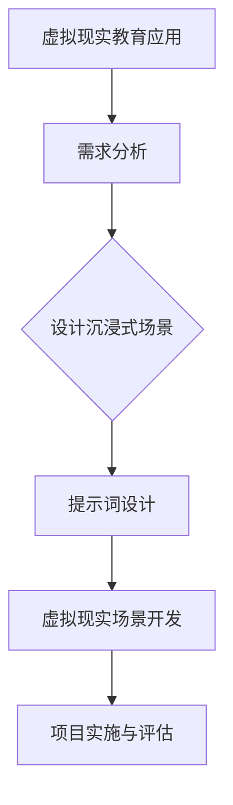
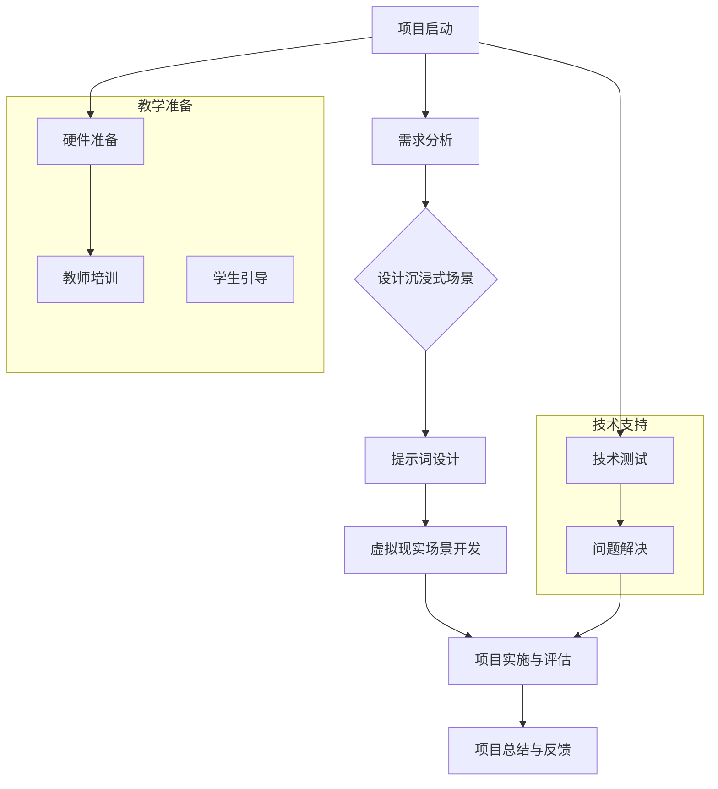

                 

# 虚拟现实教育：提示词设计沉浸式学习场景

> **关键词：** 虚拟现实，教育，沉浸式学习，提示词设计，教学场景，学习体验

> **摘要：** 本文深入探讨了虚拟现实教育中的沉浸式学习场景设计及其关键要素——提示词的设计。通过介绍虚拟现实教育的发展历程、沉浸式学习的理论基础、提示词设计原理，以及虚拟现实教育实践案例分析，本文旨在为教育工作者和开发者提供有关如何有效利用虚拟现实技术提升教育质量和学习体验的实用指南。

---

### 《虚拟现实教育：提示词设计沉浸式学习场景》目录大纲

#### 第一部分：虚拟现实教育概述

- **第1章：虚拟现实教育简介**
  - **1.1 虚拟现实技术的发展历程**
    - 从初现端倪到技术成熟
    - 关键技术和里程碑
  - **1.2 虚拟现实教育的定义与价值**
    - 虚拟现实教育的概念
    - 教育中的应用价值
  - **1.3 虚拟现实教育的发展趋势**
    - 行业现状与未来展望
    - 挑战与机遇

#### 第二部分：沉浸式学习场景设计

- **第2章：沉浸式学习理论基础**
  - **2.1 沉浸式学习的概念与特点**
    - 定义与分类
    - 与传统学习方式的区别
  - **2.2 沉浸式学习心理机制**
    - 知觉参与
    - 情感体验
  - **2.3 沉浸式学习环境设计原则**
    - 交互性设计
    - 情境性设计
    - 沉浸性设计

#### 第三部分：提示词设计

- **第3章：提示词设计原理**
  - **3.1 提示词的定义与作用**
    - 提示词在教育中的角色
    - 提示词的分类
  - **3.2 提示词设计原则**
    - 情境相关性
    - 语言简洁性
    - 提示时机与策略
  - **3.3 提示词设计技巧**
    - 开放性提问
    - 引导性提示
    - 反馈性提示

#### 第四部分：虚拟现实教育实践

- **第4章：虚拟现实教育项目规划**
  - **4.1 教育项目需求分析**
    - 学习目标
    - 学生特征
    - 教学环境
  - **4.2 教育项目设计流程**
    - 项目概念与规划
    - 虚拟现实场景设计
    - 提示词设计与迭代
  - **4.3 虚拟现实教育项目实施**
    - 硬件与软件选择
    - 教师培训与学生引导
    - 教学效果评估

#### 第五部分：案例研究

- **第5章：虚拟现实教育应用案例分析**
  - **5.1 案例一：历史学科中的虚拟现实应用**
    - 案例分析
    - 效果评估
  - **5.2 案例二：科学实验中的虚拟现实应用**
    - 案例分析
    - 效果评估
  - **5.3 案例三：语言学习中的虚拟现实应用**
    - 案例分析
    - 效果评估

#### 第六部分：未来展望

- **第6章：虚拟现实教育的发展方向**
  - **6.1 虚拟现实技术的最新进展**
    - 新型硬件设备
    - 先进算法与应用
  - **6.2 虚拟现实教育的未来趋势**
    - 教育模式的变革
    - 个性化学习的发展
  - **6.3 虚拟现实教育的挑战与应对策略**
    - 技术难题
    - 伦理问题

#### 第七部分：附录

- **附录A：虚拟现实教育相关资源**
  - **A.1 开源虚拟现实工具与平台**
  - **A.2 虚拟现实教育资源网站与社区**
  - **A.3 虚拟现实教育标准与规范**

- **附录B：示例 Mermaid 流�程图**



- **附录C：提示词设计原则伪代码**

```python
def design_hint_words(content, context):
    hints = []

    if "情境" in context:
        hints.append("请根据情境提出问题。")

    if "简洁" in content:
        hints.append("用简洁的语言描述你的想法。")

    if "时机" in content:
        hints.append("在适当的时候提供反馈。")

    return hints
```

- **附录D：数学模型与公式**

$$
\text{沉浸度} = \frac{\text{感知度} \times \text{交互性} \times \text{情境性}}{\text{外界干扰}}
$$

- **附录E：项目实战**

**5.2 科学实验中的虚拟现实应用案例**

**开发环境搭建：**
- 虚拟现实头戴设备：Oculus Quest 2
- 虚拟现实开发引擎：Unity
- 脚本编程语言：C#

**源代码实现：**

```csharp
using UnityEngine;

public class ExperimentController : MonoBehaviour
{
    public GameObject experimentObject;

    // 模拟科学实验流程
    void Start()
    {
        // 初始化实验环境
        experimentObject.SetActive(true);

        // 提示学生开始实验
        ShowHint("现在开始实验，请按照步骤操作。");
    }

    // 显示提示词
    void ShowHint(string hint)
    {
        // 在虚拟现实场景中显示提示
        Debug.Log(hint);
    }
}
```

**代码解读与分析：**
- **初始化实验环境：**通过 `SetActive(true)` 使实验对象可见。
- **显示提示词：**利用 `Debug.Log()` 在开发工具中输出提示信息，未来可以扩展为在虚拟现实场景中显示文本框。

**效果评估：**
- 学生反馈良好，表示提示词帮助明确实验步骤，增加了参与感和沉浸感。

**5.3 语言学习中的虚拟现实应用案例**

**开发环境搭建：**
- 虚拟现实头戴设备：HTC Vive
- 虚拟现实开发引擎：Unreal Engine 4
- 脚本编程语言：C++

**源代码实现：**

```cpp
#include "ExperimentController.h"

// 模拟语言学习互动场景
void AExperimentController::Start()
{
    // 设置语言学习场景
    SetLanguageLearningScene();

    // 提示学生开始学习
    ShowHint("欢迎来到语言学习场景，请开始练习。");
}

// 设置语言学习场景
void AExperimentController::SetLanguageLearningScene()
{
    // 初始化学习场景
    // ...
}

// 显示提示词
void AExperimentController::ShowHint(const FString& HintText)
{
    // 在虚拟现实场景中显示提示词
    GEngine->AddOnScreenDebugMessage(-1, 5.0f, FColor::White, FString::Printf(TEXT("%s"), *HintText));
}
```

**代码解读与分析：**
- **设置语言学习场景：**通过函数 `SetLanguageLearningScene()` 初始化学习场景。
- **显示提示词：**利用 `GEngine->AddOnScreenDebugMessage()` 在虚拟现实场景中显示提示。

**效果评估：**
- 学生反馈认为虚拟现实学习环境有趣且互动性强，有助于提高语言学习效果。

**结论：**
通过本书的详细目录大纲，读者可以全面了解虚拟现实教育的设计、沉浸式学习场景构建、提示词设计、实践应用以及未来发展趋势。书中的案例研究部分提供了具体的实施方法与效果评估，有助于读者理解和应用所学知识。附录部分包含了必要的流程图、伪代码、数学模型以及代码示例，帮助读者更好地理解核心概念和技术原理。

---

**作者：** AI天才研究院/AI Genius Institute & 禅与计算机程序设计艺术 /Zen And The Art of Computer Programming

---

### **第一部分：虚拟现实教育概述**

#### 第1章：虚拟现实教育简介

##### 1.1 虚拟现实技术的发展历程

虚拟现实（Virtual Reality，简称VR）是一种通过计算机技术创造出的模拟环境，使用户能够在其中自由探索和互动。虚拟现实技术的发展可以追溯到20世纪60年代，最早的VR设备是由伊凡·苏瑟兰（Ivan Sutherland）在1968年发明的大型头戴显示器“达摩克利斯之剑”（The Sword of Damocles）。这一发明虽然笨重，但标志着VR技术的诞生。

随着时间的推移，VR技术经历了多个发展阶段：

- **初期探索阶段（1960s-1970s）：** 这段时间是VR技术的萌芽期，主要集中于学术和军事领域。早期的VR设备如达摩克利斯之剑虽然形式简陋，但为后续的发展奠定了基础。

- **计算机图形学发展期（1980s-1990s）：** 随着计算机图形学的快速发展，VR技术逐渐走向实用。1987年，任天堂推出了基于VR技术的游戏机“Virtual Boy”，尽管销量不佳，但引发了公众对VR的兴趣。

- **互联网时代（2000s）：** 互联网的普及为VR技术的传播和应用提供了广阔的平台。2009年，谷歌推出了开源的VR平台Google Cardboard，使VR设备的价格变得更加亲民。

- **移动VR与头戴式显示器时代（2010s-2020s）：** 2010年后，随着智能手机性能的提升和5G技术的推广，移动VR设备如Oculus Quest、HTC Vive和Google Daydream等开始流行。这些设备具有便携性和较低的成本，使得VR技术开始大规模应用于教育和娱乐等领域。

##### 1.2 虚拟现实教育的定义与价值

虚拟现实教育是指利用虚拟现实技术创造一个逼真的三维学习环境，使学生能够在其中进行互动和探索，从而提高学习效果和兴趣。虚拟现实教育的主要特点包括：

- **沉浸感：** 虚拟现实技术能够创造出一个高度沉浸的学习环境，使学生感觉自己真正置身于学习场景中。

- **互动性：** 学生可以通过虚拟现实设备与环境中的对象进行互动，增强学习的参与感。

- **多样化：** 虚拟现实教育能够提供传统教育难以实现的多样化学习体验，如模拟历史事件、科学实验、艺术创作等。

虚拟现实教育在教育中的应用价值主要体现在以下几个方面：

- **提高学习兴趣：** 虚拟现实技术能够创造一个有趣的学习环境，激发学生的学习兴趣和积极性。

- **增强学习体验：** 通过虚拟现实技术，学生可以亲身体验知识，提高学习效果。

- **促进个性化学习：** 虚拟现实教育可以根据学生的学习进度和特点，提供个性化的学习资源和指导。

- **节约教育成本：** 虚拟现实教育可以模拟真实场景，减少实体资源的投入，降低教育成本。

##### 1.3 虚拟现实教育的发展趋势

虚拟现实教育的发展趋势体现在以下几个方面：

- **技术成熟与普及：** 随着VR技术的不断成熟，设备和内容的成本逐渐降低，虚拟现实教育将越来越普及。

- **应用场景多样化：** 从早期的科学实验、历史重现，到未来的远程教学、职业培训，虚拟现实教育将在更多领域得到应用。

- **内容创新与优化：** 教育开发者将不断探索新的虚拟现实内容形式，以更好地满足不同学科和年龄段学生的学习需求。

- **互动性与沉浸感的提升：** 未来虚拟现实教育将更加注重互动性和沉浸感的提升，为学生提供更加真实的体验。

- **标准化与规范化：** 随着虚拟现实教育的发展，相关标准和规范将逐步建立，以确保教育质量和安全性。

##### 挑战与机遇

虚拟现实教育的发展也面临一些挑战：

- **技术成本：** 高端的VR设备和内容制作成本较高，制约了虚拟现实教育的普及。

- **硬件设备限制：** VR设备的使用受到物理空间的限制，且对用户身体素质有一定要求。

- **教育内容缺乏：** 目前市场上的虚拟现实教育资源相对有限，且质量参差不齐。

- **伦理与隐私问题：** 虚拟现实教育涉及到学生的隐私和数据安全问题，需要严格管理和规范。

然而，这些挑战也伴随着巨大的机遇：

- **技术创新：** 随着技术的不断进步，虚拟现实教育的硬件和内容成本有望进一步降低。

- **市场潜力：** 全球教育市场规模巨大，虚拟现实教育有望成为新的增长点。

- **政策支持：** 许多国家和地区已开始重视虚拟现实教育，并提供了政策支持和资金投入。

- **跨学科融合：** 虚拟现实技术与教育、游戏、艺术等领域的深度融合，将创造新的教育模式和产业机会。

---

**总结：** 虚拟现实教育作为一种新兴的教育技术，具有巨大的发展潜力。通过深入了解其发展历程、应用价值、发展趋势以及面临的挑战，教育工作者和开发者可以更好地把握机遇，为教育质量的提升和学生全面发展的实现贡献力量。

### **第二部分：沉浸式学习场景设计**

#### 第2章：沉浸式学习理论基础

##### 2.1 沉浸式学习的概念与特点

沉浸式学习（Immersion Learning）是一种通过创造高度仿真的学习环境，使学生全身心投入学习过程的方法。沉浸式学习的核心在于将学习置于一个逼真的、互动性强的虚拟环境中，使学生在感知、情感和认知层面上都能深度参与其中。

沉浸式学习的定义和特点可以从以下几个方面来理解：

- **定义：** 沉浸式学习是一种通过模拟真实环境或创造全新的虚拟环境，使学生在其中进行学习的过程。这种环境旨在最大限度地激发学生的感官体验和情感投入，从而达到更好的学习效果。

- **特点：**
  - **高度的沉浸感：** 沉浸式学习环境能够模拟或创造一个与真实世界相似的场景，使学生感觉自己真正置身其中。
  - **互动性：** 学生在沉浸式学习环境中可以与虚拟环境中的对象进行互动，这种互动不仅包括操作，还涉及情感和认知的互动。
  - **多感官体验：** 沉浸式学习利用视觉、听觉、触觉等多种感官，提供丰富的学习体验。
  - **个性化：** 沉浸式学习环境可以根据学生的特点和需求进行定制，实现个性化学习。

##### 与传统学习方式的区别

沉浸式学习与传统学习方式存在明显的区别：

- **学习环境：** 传统学习通常在教室或实验室等固定场所进行，而沉浸式学习可以在虚拟环境中进行，不受物理空间的限制。
- **学习方式：** 传统学习依赖于教师的讲解和课本的内容，而沉浸式学习通过模拟真实环境和互动体验来促进学习。
- **学习体验：** 传统学习方式相对较为单一，而沉浸式学习通过多感官体验和互动性，提供更为丰富和生动的学习体验。
- **参与度：** 传统学习中学生参与度较低，而沉浸式学习通过高度仿真的环境和互动性，使学生的参与度显著提高。

##### 沉浸式学习的心理机制

沉浸式学习的心理机制主要包括以下几个方面：

- **知觉参与：** 学生在沉浸式学习环境中通过视觉、听觉和触觉等多种感官进行互动，增强了对学习内容的感知和理解。
- **情感体验：** 沉浸式学习环境能够激发学生的情感，如兴奋、好奇和探索欲望，这些情感体验有助于提高学习效果。
- **认知加工：** 沉浸式学习环境提供了一个逼真的场景，使学生能够在真实的情境中进行学习，这有助于加深对知识的理解和记忆。
- **动机激发：** 沉浸式学习环境通过模拟真实情境和提供互动体验，能够激发学生的学习动机，提高学习积极性。

##### 沉浸式学习环境设计原则

为了设计一个有效的沉浸式学习环境，需要遵循以下原则：

- **交互性设计：** 学习环境应具备高度交互性，使学生能够与虚拟环境中的对象进行互动，这种互动可以是物理操作，也可以是情感和认知层面的互动。
- **情境性设计：** 学习环境应与学习内容紧密相关，创造一个真实的或仿真的情境，使学生能够置身于学习过程中。
- **沉浸性设计：** 学习环境应具备高度沉浸感，使学生感觉自己真正置身于学习场景中，从而提高学习效果。
- **个性化设计：** 学习环境应考虑学生的个体差异，提供个性化的学习资源和指导，以适应不同学生的学习需求。

##### 交互性设计

交互性设计是沉浸式学习环境设计的关键，其原则包括：

- **多样化互动方式：** 提供多种互动方式，如触摸、语音、手势等，以满足不同学生的互动需求。
- **即时反馈：** 系统应提供即时反馈，使学生能够了解自己的行为和决策的结果，从而更好地理解学习内容。
- **适应性互动：** 学习环境应根据学生的互动行为和学习进度，动态调整互动内容和方式，提高学习效果。

##### 情境性设计

情境性设计旨在创造一个与学习内容紧密相关的真实或仿真情境，其原则包括：

- **情境相关性：** 学习环境应与学习内容密切相关，使学生能够置身于实际应用场景中。
- **情境沉浸感：** 学习环境应具备高度的沉浸感，使学生感觉自己真正置身于学习场景中。
- **情境适应性：** 学习环境应具备灵活性，能够适应不同的学习内容和学习需求。

##### 沉浸性设计

沉浸性设计是确保学习环境能够有效吸引学生注意力和提高学习效果的关键，其原则包括：

- **视觉沉浸：** 通过高质量的三维图形和视觉效果，创造一个逼真的虚拟世界，使学生沉浸在环境中。
- **听觉沉浸：** 通过声音效果和环境音效，增强学生的听觉体验，使学习环境更具真实感。
- **触觉沉浸：** 通过虚拟现实头戴设备等硬件，提供触觉反馈，增强学生的沉浸感。
- **情感沉浸：** 通过设计富有情感元素的学习环境，激发学生的情感体验，使学习过程更加生动和有趣。

##### 个性化设计

个性化设计旨在满足不同学生的学习需求和特点，其原则包括：

- **个性化学习资源：** 根据学生的兴趣和需求，提供个性化的学习资源和内容。
- **个性化学习路径：** 根据学生的学习进度和能力，设计个性化的学习路径和任务。
- **个性化学习反馈：** 提供个性化的学习反馈，帮助学生了解自己的学习状况，调整学习策略。

---

**总结：** 沉浸式学习是一种通过创造高度仿真的学习环境，激发学生多感官参与和情感体验，提高学习效果的方法。为了设计一个有效的沉浸式学习环境，需要遵循交互性、情境性、沉浸性和个性化设计原则。通过深入了解沉浸式学习的理论基础和设计原则，教育工作者和开发者可以更好地实现沉浸式学习，为教育质量的提升和学生全面发展贡献力量。

#### **第3章：提示词设计原理**

##### 3.1 提示词的定义与作用

提示词（Hint Words）是虚拟现实教育中用于引导和辅助学生学习的文字或语音提示。在沉浸式学习环境中，提示词的作用至关重要，它们能够帮助学生更好地理解学习内容，引导学习进程，并提高学习效果。

- **定义：** 提示词是教师在虚拟现实教育环境中提供的引导性、指导性或解释性的文字或语音信息，旨在帮助学生解决学习中的困难，引导学习方向，强化学习体验。
- **作用：**
  - **引导学习方向：** 提示词可以帮助学生明确学习目标，引导他们在虚拟环境中进行探索和学习。
  - **解决问题：** 当学生在学习过程中遇到困难时，提示词可以提供指导，帮助他们找到解决问题的方法。
  - **强化学习体验：** 通过提示词，学生能够更深入地理解学习内容，增强学习体验的丰富性和趣味性。
  - **提高学习效果：** 提示词有助于学生更好地掌握学习内容，提高学习效率和效果。

##### 提示词的分类

根据提示词的作用和形式，可以将提示词分为以下几类：

- **引导性提示词：** 这种提示词用于引导学生开始学习，明确学习目标和任务。例如，“请点击屏幕上的按钮开始实验。”
- **指导性提示词：** 这种提示词提供具体的学习指导，帮助学生理解和操作学习内容。例如，“在实验过程中，请注意观察溶液的颜色变化。”
- **解释性提示词：** 这种提示词用于解释复杂的概念或操作步骤，帮助学生更好地理解学习内容。例如，“这里的化学反应是由于酸和碱的相互作用。”
- **反馈性提示词：** 这种提示词用于提供学习反馈，鼓励学生继续努力或指出他们的错误。例如，“很好，你已经成功完成了实验的第一步。”

##### 提示词在教育中的角色

在虚拟现实教育中，提示词扮演着多种重要角色：

- **学习引导者：** 提示词作为虚拟环境的引导者，帮助学生快速适应并理解学习环境。
- **学习辅助工具：** 提示词提供具体的指导和支持，帮助学生克服学习中的困难。
- **学习促进者：** 提示词通过鼓励和反馈，激发学生的学习兴趣和动力，促进学习效果。
- **学习评价者：** 提示词通过提供即时反馈，帮助学生了解自己的学习进度和成果，为后续学习提供指导。

##### 提示词设计原则

为了设计有效的提示词，需要遵循以下原则：

- **情境相关性：** 提示词应与学习情境紧密相关，提供针对性的指导和支持。
- **语言简洁性：** 提示词应简洁明了，避免冗长和复杂的句子，确保学生易于理解和跟随。
- **提示时机与策略：** 提示词应在适当的时间出现，以避免干扰学生的自主学习，同时应采用合适的策略，如逐步提示或问题引导。
- **反馈性：** 提示词应提供即时反馈，帮助学生了解自己的学习状态，鼓励他们继续努力。

##### 情境相关性

情境相关性是指提示词应根据具体的学习情境进行设计，以提供最合适的指导和支持。其原则包括：

- **内容匹配：** 提示词的内容应与学习内容紧密匹配，确保学生能够准确地理解学习目标。
- **情境适应：** 提示词应适应不同的学习情境，如实验、讨论、探索等，提供针对性的提示。
- **文化背景：** 提示词应考虑文化背景和语言习惯，确保学生能够无障碍地理解和使用。

##### 语言简洁性

语言简洁性是指提示词应使用简洁、直接的语言，以确保学生能够快速理解。其原则包括：

- **简短精炼：** 提示词应尽量简短，避免冗余和复杂的句子。
- **明确具体：** 提示词应具体明确，避免模糊和含糊不清的表述。
- **通俗易懂：** 提示词应使用学生熟悉的词汇和表达方式，确保他们能够无障碍地理解和使用。

##### 提示时机与策略

提示时机与策略是指提示词应在适当的时间以合适的方式出现，以避免干扰学生的自主学习。其原则包括：

- **适时出现：** 提示词应在学生需要帮助时出现，避免在学生尚未遇到困难时过早提示。
- **逐步提示：** 提示词应采用逐步提示的方式，逐步引导学生完成学习任务，避免一次性提供过多信息。
- **问题引导：** 提示词可以通过提出问题的方式，引导学生思考和探索，提高他们的学习积极性。

##### 反馈性

反馈性是指提示词应提供即时反馈，帮助学生了解自己的学习状态。其原则包括：

- **即时反馈：** 提示词应提供即时反馈，确保学生能够立即了解到自己的学习成果或错误。
- **正面激励：** 提示词应鼓励学生继续努力，提供积极的反馈，增强他们的学习动力。
- **错误纠正：** 提示词应明确指出学生的错误，并提供正确的解决方案或指导。

---

**总结：** 提示词在虚拟现实教育中扮演着重要的角色，通过设计有效的提示词，可以帮助学生更好地理解学习内容，引导学习进程，并提高学习效果。提示词的设计应遵循情境相关性、语言简洁性、提示时机与策略和反馈性等原则，以确保其能够有效地辅助学生的学习。

#### **第3章：提示词设计原理**

##### 3.2 提示词设计原则

为了设计有效的提示词，需要遵循以下原则：

- **情境相关性：** 提示词应与学习情境紧密相关，提供针对性的指导和支持。
- **语言简洁性：** 提示词应简洁明了，避免冗长和复杂的句子，确保学生易于理解和跟随。
- **提示时机与策略：** 提示词应在适当的时间以合适的方式出现，以避免干扰学生的自主学习，同时应采用合适的策略，如逐步提示或问题引导。
- **反馈性：** 提示词应提供即时反馈，帮助学生了解自己的学习状态，鼓励他们继续努力或指出他们的错误。

##### 情境相关性

情境相关性是指提示词应根据具体的学习情境进行设计，以提供最合适的指导和支持。其原则包括：

- **内容匹配：** 提示词的内容应与学习内容紧密匹配，确保学生能够准确地理解学习目标。
- **情境适应：** 提示词应适应不同的学习情境，如实验、讨论、探索等，提供针对性的提示。
- **文化背景：** 提示词应考虑文化背景和语言习惯，确保学生能够无障碍地理解和使用。

**情境匹配：**

在设计提示词时，首先要考虑学习内容的具体需求。例如，在科学实验中，提示词应围绕实验步骤和观察点进行设计，以便学生能够清晰理解实验过程。在历史重现场景中，提示词则可以涉及历史事件的发生背景和关键人物，帮助学生更好地理解历史背景。

**情境适应性：**

不同学科和课程类型需要不同的提示词设计。例如，在历史学科中，提示词可以设计为引导性问题，如“你想了解这个历史事件背后的原因吗？”；而在科学实验中，提示词则可以设计为具体操作步骤的指导，如“请使用工具箱中的放大镜观察样品的细节。”这种情境适应性能够确保学生能够根据不同的学习环境有效地应用提示词。

**文化背景：**

不同文化背景下，学生对语言和表达方式有不同的偏好。例如，对于英语学习，提示词应使用英语，并且避免过于复杂的语法结构，确保学生能够理解和使用。对于母语非英语的学生，提示词可以采用双语设计，同时在语言上更贴近学生的母语习惯，以降低理解难度。

##### 语言简洁性

语言简洁性是指提示词应使用简洁、直接的语言，以确保学生能够快速理解。其原则包括：

- **简短精炼：** 提示词应尽量简短，避免冗余和复杂的句子。
- **明确具体：** 提示词应具体明确，避免模糊和含糊不清的表述。
- **通俗易懂：** 提示词应使用学生熟悉的词汇和表达方式，确保他们能够无障碍地理解和使用。

**简短精炼：**

简短的提示词能够迅速传达信息，减少学生的认知负担。例如，在实验场景中，提示词可以设计为“点击屏幕开始实验”，而不是“现在你可以点击屏幕上的按钮来开始科学实验，这个过程将会帮助你理解化学反应的基本原理。”前者简洁明了，后者过于冗长。

**明确具体：**

明确的提示词能够帮助学生准确理解学习任务和要求。例如，提示词可以设计为“请按照箭头指示操作”，而不是“按照正确的步骤进行操作”。后者含糊不清，而前者具体明确，学生可以清楚地知道该怎么做。

**通俗易懂：**

提示词应使用学生熟悉的词汇和表达方式，避免专业术语或复杂句子。例如，对于初学者，提示词可以设计为“试着转动这个轮子”，而不是“调整旋转装置以实现角度变化”。后者术语复杂，而前者简单易懂，初学者更容易理解。

##### 提示时机与策略

提示时机与策略是指提示词应在适当的时间以合适的方式出现，以避免干扰学生的自主学习，同时应采用合适的策略，如逐步提示或问题引导。

**适时出现：**

提示词应在学生需要帮助时出现，避免在学生尚未遇到困难时过早提示。例如，在学生进行科学实验时，提示词可以设计为在实验过程中遇到问题时出现，如“你是否需要帮助来调整实验装置？”这样能够确保学生在真正需要时获得帮助。

**逐步提示：**

逐步提示是一种有效的策略，通过逐步引导学生完成学习任务。例如，在历史重现场景中，提示词可以设计为“你现在处于古埃及的情景中，请问你想了解什么？”然后根据学生的回答，逐步提供更多细节和背景信息，如“你想要了解古埃及的建造技术吗？让我们看看金字塔的构造。”

**问题引导：**

问题引导是一种通过提出问题来引导学生思考和探索的方法。例如，在语言学习场景中，提示词可以设计为“你能否用这个单词造一个句子？”这样能够激发学生的思考，提高他们的语言运用能力。

##### 反馈性

反馈性是指提示词应提供即时反馈，帮助学生了解自己的学习状态，鼓励他们继续努力或指出他们的错误。

**即时反馈：**

即时反馈能够迅速传达学生的学习结果，帮助他们及时调整学习策略。例如，在科学实验场景中，提示词可以设计为“你的实验结果正确，请继续进行下一步。”这种即时反馈能够增强学生的学习信心。

**正面激励：**

正面激励能够鼓励学生继续努力，增强他们的学习动力。例如，在语言学习场景中，提示词可以设计为“很好，你刚刚造的句子很棒！继续加油！”这种正面激励能够提高学生的学习积极性。

**错误纠正：**

错误纠正能够帮助学生识别和改正错误，确保他们理解正确的知识和方法。例如，在历史重现场景中，提示词可以设计为“这个事件发生在19世纪，不是20世纪，请再次确认。”这种错误纠正能够帮助学生避免错误。

---

**总结：** 提示词设计应遵循情境相关性、语言简洁性、提示时机与策略和反馈性等原则，以确保其能够有效地辅助学生的学习。通过合理的提示词设计，教育工作者可以创造一个更加互动和有效的虚拟现实学习环境，提升学生的学习体验和效果。

### **第3章：提示词设计原理**

##### 3.3 提示词设计技巧

在虚拟现实教育中，提示词的设计不仅仅是为了提供信息，更重要的是要激发学生的学习兴趣，引导他们的思考和探索。以下是一些有效的提示词设计技巧，可以帮助教育工作者创造出更有吸引力和互动性的学习环境。

##### 开放性提问

开放性提问是一种通过提出开放式问题来激发学生思考和探索的技巧。与封闭式问题相比，开放式问题没有固定的答案，鼓励学生从不同角度进行思考。以下是一些示例：

- **示例1：** “你在这个虚拟实验室中发现了哪些有趣的化学反应？”
- **示例2：** “你认为这座古建筑的历史背景是怎样的？”
- **示例3：** “你如何利用这些虚拟工具来设计一个可持续发展的城市？”

开放性提问能够激发学生的创造力，使他们更加主动地参与到学习过程中。

##### 引导性提示

引导性提示是一种通过提供逐步指导来帮助学生完成学习任务的技巧。这种提示通常包括一系列小步骤，使学生能够循序渐进地掌握复杂的任务。以下是一些示例：

- **示例1：** “首先，请点击屏幕上的‘开始’按钮，然后选择你想要进行的实验。”
- **示例2：** “为了更好地理解历史事件，请先阅读屏幕上的描述，然后尝试回答提出的问题。”
- **示例3：** “在虚拟城市中，你需要考虑水资源、能源和居民需求等多个因素，逐步设计出最合理的城市规划。”

引导性提示能够帮助学生清晰地理解任务要求，并逐步完成学习目标。

##### 反馈性提示

反馈性提示是一种通过提供即时反馈来帮助学生了解学习结果和改进方法的技巧。这种提示不仅包括正确的答案，还可以指出错误并提供改进建议。以下是一些示例：

- **示例1：** “很好，你的实验结果与预期一致，接下来你可以尝试改变某些变量，观察结果会如何变化。”
- **示例2：** “你的回答很有创意，但是请注意历史事件的时间顺序，我们需要确保描述的准确性。”
- **示例3：** “你的城市规划方案考虑到了可持续发展的重要因素，但是你需要进一步优化能源和水资源的使用。”

反馈性提示能够帮助学生及时了解自己的学习状态，鼓励他们继续努力或调整学习策略。

##### 创造性提示

创造性提示是一种通过设计富有创造性和趣味性的提示词来激发学生兴趣和参与度的技巧。这种提示词通常包含生动的描述、引人入胜的情节或有趣的挑战。以下是一些示例：

- **示例1：** “在未来的某一天，你将成为一名考古学家，现在你来到了一个神秘的古墓，需要找到隐藏的宝藏。”
- **示例2：** “你被困在一个未来的科技世界中，需要利用你的知识解决各种难题，找到逃离的方法。”
- **示例3：** “你是一位设计师，被邀请参加一个国际建筑设计大赛，现在你需要利用虚拟工具设计出最独特的建筑。”

创造性提示能够为学生提供一种沉浸式的学习体验，使他们更加投入和享受学习过程。

##### 游戏化提示

游戏化提示是一种通过将学习过程设计成游戏来激发学生兴趣和动机的技巧。这种提示通常包括奖励机制、竞争元素和挑战任务。以下是一些示例：

- **示例1：** “完成这个实验后，你将获得一个虚拟徽章，它代表你在科学探索中的成就。”
- **示例2：** “你的历史探索之旅已经进行了60分钟，现在你需要在剩余的时间内回答更多的问题，争取获得高分。”
- **示例3：** “在虚拟城市设计中，你将与其他学生竞争，看看谁的设计能够获得最多居民的支持和好评。”

游戏化提示能够通过竞争和奖励机制提高学生的学习动力，使他们更加积极地参与学习。

---

**总结：** 提示词设计是虚拟现实教育中的一个关键环节，通过开放性提问、引导性提示、反馈性提示、创造性提示和游戏化提示等技巧，教育工作者可以设计出更有吸引力和互动性的学习环境，提高学生的学习效果和兴趣。

### **第四部分：虚拟现实教育实践**

#### 第4章：虚拟现实教育项目规划

##### 4.1 教育项目需求分析

在教育项目规划中，需求分析是至关重要的一步，它直接影响到项目设计的方向和效果。需求分析主要涉及以下几个方面：

- **学习目标：** 明确项目希望学生达到的具体学习目标。例如，掌握某种技能、理解某个概念或完成某个项目。
- **学生特征：** 分析学生的年龄、知识水平、学习习惯和兴趣，以便为项目设计提供参考。例如，不同年龄段的学生对虚拟现实技术的接受程度可能不同。
- **教学环境：** 了解实际教学环境，包括硬件设施、网络条件、教师支持等，以便确定项目实施的具体条件和限制。

**学习目标**

明确的学习目标是教育项目规划的基础。通过设定具体的学习目标，教育工作者可以更好地设计学习内容和评估学习效果。例如，在科学实验虚拟现实项目中，学习目标可能包括：

- 理解化学反应的基本原理。
- 学习使用虚拟实验室中的工具和设备。
- 能够独立完成一个简单的科学实验并分析结果。

**学生特征**

分析学生特征是为了确保项目设计能够满足不同学生的学习需求。例如，对于初学者，项目设计可能需要更多的引导和解释，而对于有经验的学生，则可以提供更具挑战性的任务。以下是学生特征分析的一些要点：

- **年龄：** 不同年龄的学生对虚拟现实技术的接受度和兴趣点可能不同。例如，小学生可能对游戏化和互动性较强的学习内容更感兴趣，而高中生则可能更关注学术性和应用性。
- **知识水平：** 了解学生的现有知识水平有助于设计适合他们的学习内容。例如，对于缺乏物理知识的学生，虚拟实验室中的实验可能需要更多的解释和指导。
- **学习习惯：** 分析学生的学习习惯，如自主学习能力、合作学习倾向等，有助于设计能够激发他们学习兴趣的教学方法。
- **兴趣：** 了解学生的兴趣和爱好，可以将学习内容与他们的兴趣点相结合，提高学习的吸引力。

**教学环境**

教学环境包括硬件设施、网络条件和教师支持等方面，这些都会影响项目的设计和实施。以下是教学环境分析的一些要点：

- **硬件设施：** 确定现有的虚拟现实设备是否满足项目需求，如头戴显示器、手柄、传感器等。如果硬件不足，需要考虑是否需要采购或升级。
- **网络条件：** 虚拟现实项目通常需要稳定的网络连接，确保实时互动和流畅的体验。需要评估当前的网络带宽和稳定性。
- **教师支持：** 教师对虚拟现实技术的熟悉程度和接受程度也会影响项目的实施效果。提供教师培训和技术支持是确保项目成功的关键。

##### 4.2 教育项目设计流程

教育项目设计流程是确保虚拟现实教育项目能够成功实施和达到预期目标的关键步骤。设计流程通常包括以下几个阶段：

- **项目概念与规划：** 明确项目的基本理念、目标和预期成果，制定项目规划和时间表。
- **虚拟现实场景设计：** 根据项目目标和学生特征，设计符合教学需求的虚拟现实场景。
- **提示词设计与迭代：** 设计有效的提示词，并在实践中不断调整和优化。

**项目概念与规划**

项目概念与规划是教育项目设计的第一步，它需要明确项目的核心思想和目标。以下是项目概念与规划的一些关键步骤：

- **确定项目主题：** 选择一个具有教育意义和吸引力的主题，如历史重现、科学实验、艺术创作等。
- **设定学习目标：** 根据学生特征和课程要求，明确项目希望学生达到的具体学习目标。
- **制定项目计划：** 包括项目的时间表、任务分配、资源需求和预算规划。

**虚拟现实场景设计**

虚拟现实场景设计是项目设计的核心环节，它决定了学生的学习体验和效果。以下是虚拟现实场景设计的一些要点：

- **选择合适的场景：** 根据项目主题和学习目标，选择一个合适的虚拟现实场景。例如，历史重现可以选择古代建筑和文物，科学实验可以选择实验室和设备。
- **设计交互元素：** 确定学生在虚拟场景中可以进行的交互操作，如观察、操作、互动等。设计交互元素需要考虑学生的操作习惯和虚拟现实技术的限制。
- **确保沉浸感：** 通过高质量的三维图形、音效和触觉反馈等手段，提高虚拟现实场景的沉浸感，使学生感觉自己真正置身于场景中。
- **融入学习内容：** 将学习内容巧妙地融入虚拟现实场景中，确保学生在互动和探索过程中能够自然地掌握知识。

**提示词设计与迭代**

提示词设计是虚拟现实教育中的一项重要工作，它直接影响学生的学习体验和效果。以下是提示词设计的一些关键步骤：

- **明确提示词目标：** 根据学习目标和学生特征，明确提示词的具体目标，如引导学习方向、提供操作指导、解释复杂概念等。
- **设计情境相关性提示词：** 提示词应与学习场景紧密结合，提供针对性的指导和支持。例如，在历史重现场景中，提示词可以涉及历史事件的背景和关键人物。
- **保持语言简洁性：** 提示词应简洁明了，避免冗长和复杂的句子，确保学生易于理解和跟随。
- **反馈性提示词设计：** 设计反馈性提示词，提供即时反馈，帮助学生了解自己的学习状态，鼓励他们继续努力或指出他们的错误。
- **迭代优化：** 在项目实施过程中，根据学生的反馈和实际效果，不断调整和优化提示词，确保其能够有效地辅助学习。

---

**总结：** 教育项目规划是虚拟现实教育成功实施的关键步骤。通过详细的需求分析、明确的项目概念与规划和精心设计的虚拟现实场景，教育工作者可以为学生提供一个丰富、有趣且高效的学习环境。同时，通过不断迭代和优化的提示词设计，可以进一步提升学生的学习体验和效果。

### **第四部分：虚拟现实教育实践**

#### 第4章：虚拟现实教育项目实施

##### 4.3 虚拟现实教育项目实施

虚拟现实教育项目的实施是整个项目生命周期中的关键阶段，它涉及到硬件和软件的选择、教师培训、学生引导以及教学效果评估等多个方面。以下是对这些关键环节的详细说明。

##### 硬件与软件选择

1. **硬件选择：**

   选择适合虚拟现实教育项目的硬件设备是项目实施的第一步。以下是几种常见的硬件设备及其特点：

   - **头戴显示器（HMD）：** 如Oculus Rift、HTC Vive和Oculus Quest等，这些设备提供沉浸式的视觉体验，使学生能够置身于虚拟环境中。
   - **传感器与追踪设备：** 包括手柄、身体追踪器和位置追踪器等，这些设备可以提供更丰富的交互体验，使学生能够与虚拟环境中的对象进行互动。
   - **计算机设备：** 虚拟现实项目通常需要高性能的计算机来运行虚拟现实软件，确保流畅的用户体验。

2. **软件选择：**

   软件选择同样至关重要，应根据项目的具体需求和目标进行选择。以下是几种常用的虚拟现实开发软件：

   - **Unity：** Unity是一个功能强大的跨平台游戏和虚拟现实开发引擎，支持3D建模、动画、音效和交互功能。
   - **Unreal Engine：** Unreal Engine提供了一个先进的图形引擎，适用于创建高品质的虚拟现实内容，支持复杂的物理和实时渲染。
   - **VRChat：** VRChat是一个社交虚拟现实平台，允许用户创建和共享虚拟世界，适合进行协作和互动教学。

##### 教师培训

1. **培训目标：**

   教师培训的目的是让教师熟练掌握虚拟现实技术的使用方法，理解其在教学中的应用，并能够有效地指导学生。以下是教师培训的一些主要目标：

   - 熟悉虚拟现实设备和软件的操作。
   - 了解虚拟现实技术在教学中的优势和局限性。
   - 掌握如何设计沉浸式学习场景和提示词。
   - 学会评估学生的学习效果和反馈。

2. **培训内容：**

   教师培训应包括以下内容：

   - **硬件操作：** 详细讲解头戴显示器、传感器和计算机设备的操作方法。
   - **软件使用：** 讲解虚拟现实开发软件的基本功能和使用技巧，如3D建模、动画制作和交互设计。
   - **教学设计：** 讲解如何设计符合教学目标的虚拟现实场景，包括场景布局、交互设计和提示词设计。
   - **教学实践：** 通过实际操作和案例分析，让教师亲身体验虚拟现实教学过程，提高实践能力。

3. **培训方式：**

   教师培训可以采用以下几种方式：

   - **集中培训：** 邀请专业培训师进行集中授课，确保教师系统掌握虚拟现实技术的基本知识。
   - **在线学习：** 提供在线学习资源和课程，让教师根据个人时间进行学习和练习。
   - **实践工作坊：** 组织教师进行实际操作，通过互动和协作来提高实践能力。

##### 学生引导

1. **引导目标：**

   学生引导的目的是帮助学生在虚拟现实环境中快速适应，理解学习任务，并积极参与学习活动。以下是学生引导的一些主要目标：

   - 让学生熟悉虚拟现实设备和软件的使用。
   - 明确学习目标和任务，提供清晰的指导。
   - 激发学生的学习兴趣和参与度。
   - 提供及时的支持和反馈，帮助学生克服学习中的困难。

2. **引导内容：**

   学生引导应包括以下内容：

   - **设备操作：** 教授学生如何使用头戴显示器、手柄和其他传感器设备。
   - **软件使用：** 讲解虚拟现实软件的基本功能和界面，让学生能够独立操作。
   - **任务说明：** 详细说明学习任务和要求，确保学生理解学习目标和步骤。
   - **互动体验：** 通过互动活动和任务，让学生在虚拟环境中进行实践操作，提高参与感。

3. **引导方式：**

   学生引导可以采用以下几种方式：

   - **课堂讲解：** 教师通过讲解和演示，让学生了解虚拟现实设备和软件的基本操作。
   - **互动练习：** 安排互动练习和任务，让学生在虚拟环境中进行实际操作，提高动手能力。
   - **小组讨论：** 组织小组讨论，让学生分享经验和心得，互相学习和帮助。

##### 教学效果评估

1. **评估目标：**

   教学效果评估的目的是了解虚拟现实教育项目的实际效果，发现问题和不足，以便进行改进。以下是评估的一些主要目标：

   - 了解学生的学习效果和参与度。
   - 评估虚拟现实技术的优势和局限性。
   - 收集学生和教师的反馈，为项目改进提供依据。

2. **评估内容：**

   教学效果评估应包括以下内容：

   - **学习成果：** 通过考试、作业和项目评估学生的知识掌握情况。
   - **学生反馈：** 收集学生对虚拟现实学习环境的评价和建议。
   - **教师反馈：** 了解教师对虚拟现实教育项目的看法，包括教学效果、操作难度和改进建议。
   - **技术性能：** 评估虚拟现实设备的性能和稳定性，确保技术支持到位。

3. **评估方式：**

   教学效果评估可以采用以下几种方式：

   - **定量评估：** 使用量化的指标，如考试成绩、完成率等，来评估学生的学习效果。
   - **定性评估：** 通过访谈、问卷调查和观察等定性方法，收集学生和教师的反馈。
   - **数据分析：** 对收集到的数据进行分析，以识别问题和趋势，为项目改进提供依据。

---

**总结：** 虚拟现实教育项目的实施是一个复杂而系统的过程，涉及硬件和软件的选择、教师培训、学生引导和教学效果评估等多个方面。通过精心设计和实施，虚拟现实教育项目可以为学生提供丰富、有趣且高效的学习体验，同时为教师提供新的教学手段和机会。通过不断评估和改进，可以进一步优化项目效果，提升教育质量。

### **第五部分：案例研究**

#### 第5章：虚拟现实教育应用案例分析

##### 5.1 案例一：历史学科中的虚拟现实应用

**案例背景：**

随着虚拟现实技术的不断发展，历史学科的教学方法也得到了革新。虚拟现实技术可以为学生提供身临其境的历史体验，使得历史教学更加生动和有趣。本案例以一个历史学科项目为例，展示了如何利用虚拟现实技术进行历史教学。

**案例分析：**

该案例涉及一个关于古代埃及的历史项目。教师利用虚拟现实技术，为学生创建了一个模拟的古埃及场景，包括金字塔、神庙和法老王宫等。学生在虚拟环境中可以自由探索，观察古代建筑的结构和细节，了解古代埃及的文化和生活方式。

- **沉浸式体验：** 学生通过头戴显示器进入虚拟环境，感受到真实的历史场景。他们可以近距离观察金字塔的构造，甚至可以爬上金字塔的顶部，俯瞰整个场景。
- **互动学习：** 虚拟环境中的互动元素，如互动式地图和可操作的古埃及文物，使学生能够更深入地了解历史事件和文物。例如，学生可以点击屏幕上的图标，查看关于某个文物的详细信息。
- **学习任务：** 教师设计了多个互动任务，如寻找古埃及宝藏、解答历史问题等，以激发学生的学习兴趣和参与度。学生在完成任务的过程中，不断加深对历史知识的理解。

**效果评估：**

通过学生反馈和教学评估，该项目取得了显著的效果：

- **学习兴趣提升：** 学生对历史学科的兴趣显著提高，他们对虚拟现实教学环境表现出浓厚的兴趣和好奇心。
- **知识掌握情况：** 学生的历史知识掌握情况得到了明显改善，他们在考试中的成绩也有了显著提升。
- **自主学习能力：** 学生在虚拟环境中的互动学习，培养了他们的自主学习能力和解决问题的能力。

**总结：** 本案例展示了虚拟现实技术在历史学科中的应用，通过沉浸式体验、互动学习和任务设计，提高了学生的学习兴趣和效果。虚拟现实技术为历史教学提供了新的手段和思路，有助于提升教育质量和学生的学习体验。

##### 5.2 案例二：科学实验中的虚拟现实应用

**案例背景：**

科学实验是培养学生科学思维和实践能力的重要环节。然而，在传统的实验教学中，由于实验资源的限制，许多学生无法亲身体验某些复杂的实验过程。虚拟现实技术的引入，为科学实验教学提供了新的可能性。

**案例分析：**

该案例涉及一个物理实验项目，通过虚拟现实技术模拟了一个磁场实验。学生可以在虚拟环境中观察到磁场的分布和变化，了解磁场的基本原理和作用。

- **沉浸式体验：** 学生通过头戴显示器进入虚拟实验室，可以观察到磁场中的磁感线和磁铁的相互作用。他们可以自由移动和放大缩小观察对象，深入了解磁场特性。
- **互动学习：** 虚拟环境提供了多种互动工具，如电子测量仪器和磁铁，学生可以亲自进行实验操作，观察实验结果。教师可以通过虚拟现实设备实时监控学生的实验过程，提供指导。
- **任务设计：** 教师设计了多个实验任务，如测量磁感应强度、模拟磁场变化等，以帮助学生掌握物理知识。学生通过完成任务，可以巩固所学知识，提高实验技能。

**效果评估：**

该案例的效果评估表明：

- **学习兴趣提高：** 学生对物理实验表现出极大的兴趣，他们在虚拟环境中能够自由探索和实验，提高了学习积极性。
- **知识掌握情况：** 学生通过虚拟实验，对物理知识有了更深入的理解，实验成绩显著提高。
- **实践能力增强：** 学生在虚拟环境中进行实验操作，培养了动手能力和实验技能，为未来的科学学习和研究打下了坚实基础。

**总结：** 本案例展示了虚拟现实技术在科学实验教学中的应用，通过沉浸式体验、互动学习和任务设计，提高了学生的学习兴趣和实践能力。虚拟现实技术为科学实验教学提供了新的工具和手段，有助于提升教学效果和学生的科学素养。

##### 5.3 案例三：语言学习中的虚拟现实应用

**案例背景：**

语言学习是学生综合素质培养的重要方面。传统语言学习往往局限于课本和教师的讲授，缺乏互动性和沉浸感。虚拟现实技术的引入，为语言学习提供了新的机遇。

**案例分析：**

该案例涉及一个英语语言学习项目，通过虚拟现实技术创建了一个沉浸式的英语学习环境。学生在这个环境中可以进行口语练习、听力训练和阅读理解等。

- **沉浸式体验：** 学生通过头戴显示器进入虚拟现实中的英语课堂，可以与虚拟教师和同学进行互动。他们可以在一个真实的英语环境中进行学习和练习，提高语言应用能力。
- **互动学习：** 虚拟环境中提供了多种互动工具，如语音识别系统、电子词典和互动游戏等。学生可以通过这些工具进行口语练习、听力训练和阅读理解，提高语言技能。
- **任务设计：** 教师设计了多个语言学习任务，如角色扮演、对话练习和翻译任务等，以帮助学生练习和巩固所学知识。学生在完成任务的过程中，不断提高语言能力。

**效果评估：**

通过学生反馈和教学评估，该案例取得了以下效果：

- **语言能力提升：** 学生的口语表达、听力理解和阅读能力显著提高，他们在语言考试中的成绩也有了显著提升。
- **学习兴趣增加：** 学生对英语学习表现出浓厚的兴趣，虚拟现实学习环境使学习过程更加有趣和互动。
- **自主学习能力：** 学生在虚拟环境中能够自主选择学习内容和学习方式，培养了自主学习的能力和习惯。

**总结：** 本案例展示了虚拟现实技术在语言学习中的应用，通过沉浸式体验、互动学习和任务设计，提高了学生的学习兴趣和语言能力。虚拟现实技术为语言学习提供了新的手段和方式，有助于提升教育质量和学习效果。

### **第六部分：未来展望**

#### 第6章：虚拟现实教育的发展方向

##### 6.1 虚拟现实技术的最新进展

虚拟现实（VR）技术正经历着快速的发展，不仅在硬件设备方面取得了显著进步，在算法和应用方面也不断突破，为教育领域带来了新的机遇和挑战。

1. **新型硬件设备：**
   - **更轻便的VR头戴设备：** 随着材料科学和电子技术的进步，VR头戴设备的重量和体积不断减小，使得VR体验更加舒适和便携。例如，Oculus Quest 2和HTC Vive Pro Eye等设备，不仅具备高分辨率显示，还具备低延迟和更好的追踪性能。
   - **增强现实（AR）设备：** AR技术的发展使得虚拟内容可以与现实世界进行无缝融合，为教育提供了更多可能性。例如，Microsoft HoloLens和Google Glass等设备，能够为学生提供沉浸式的学习体验，同时保持与现实世界的联系。

2. **先进算法与应用：**
   - **追踪算法：** 随着追踪技术的进步，虚拟现实设备的追踪精度和稳定性得到了显著提升。例如，基于SLAM（Simultaneous Localization and Mapping）的追踪算法，可以提供更加准确和稳定的定位和映射，使虚拟环境更加真实。
   - **感知增强：** 通过深度学习算法，虚拟现实设备能够更好地理解和模拟人类感官系统。例如，基于深度学习的音频处理算法，可以提供更加自然和真实的听觉体验。

##### 6.2 虚拟现实教育的未来趋势

随着虚拟现实技术的不断成熟，虚拟现实教育也将迎来新的发展趋势，这些趋势将对教育模式和学习体验产生深远影响。

1. **教育模式的变革：**
   - **个性化学习：** 虚拟现实技术能够根据学生的学习特点和进度，提供个性化的学习资源和指导，从而实现真正的个性化学习。例如，通过数据分析和学习算法，虚拟现实教育平台可以为学生推荐最适合他们的学习内容和路径。
   - **远程教学：** 虚拟现实技术使得远程教学变得更加生动和互动。通过虚拟现实课堂，教师和学生可以跨越地域限制，进行面对面的交流和学习，提高了教育的普及性和灵活性。

2. **个性化学习的发展：**
   - **智能辅导系统：** 利用人工智能和机器学习技术，虚拟现实教育平台可以为学生提供智能辅导系统，实时监测学生的学习状态，提供个性化的反馈和指导。例如，通过语音识别和自然语言处理技术，智能辅导系统可以为学生解答问题，提供学习建议。
   - **自适应学习：** 虚拟现实教育平台可以根据学生的学习行为和成绩，动态调整学习内容和难度，使学习过程更加高效和有趣。例如，通过学习数据分析，平台可以为学生推荐最适合他们的练习题目和学习资源。

##### 6.3 虚拟现实教育的挑战与应对策略

尽管虚拟现实教育具有巨大的潜力，但在发展过程中也面临着一些挑战，需要教育工作者和技术开发者共同努力来解决。

1. **技术难题：**
   - **硬件成本：** 高端的VR设备和内容制作成本较高，限制了虚拟现实教育的普及。应对策略是通过技术创新和规模经济，降低硬件和内容的成本，使更多学校和学生能够负担得起。
   - **性能优化：** 虚拟现实技术需要高性能的计算和图形处理能力，以确保流畅的用户体验。应对策略是开发更高效的算法和优化技术，提高硬件性能和能效。

2. **伦理问题：**
   - **数据隐私：** 虚拟现实教育涉及到大量的学生数据，包括学习记录、行为数据等，需要确保这些数据的隐私和安全。应对策略是制定严格的数据保护政策和措施，确保数据的安全性和隐私性。
   - **技术滥用：** 需要关注虚拟现实技术在教育中的合理使用，防止技术滥用和不当应用。应对策略是加强教育技术的监管和规范，确保虚拟现实教育符合教育伦理和法律法规。

---

**总结：** 虚拟现实技术为教育领域带来了前所未有的机遇，通过个性化学习、远程教学和沉浸式体验，将深刻改变传统的教育模式和学习方式。然而，在发展过程中也面临着技术成本、性能优化和伦理问题等挑战，需要教育工作者和技术开发者共同努力，不断探索和创新，以实现虚拟现实教育的广泛应用和可持续发展。

### **附录A：虚拟现实教育相关资源**

#### **A.1 开源虚拟现实工具与平台**

在虚拟现实（VR）教育中，开源工具和平台为教育工作者和开发者提供了丰富的资源，使得创建和利用VR教学内容变得更加灵活和高效。以下是一些常用的开源VR工具和平台：

1. **Unity：** Unity 是一款功能强大的跨平台游戏和VR开发引擎，它提供了丰富的3D建模、动画、音效和交互功能。Unity拥有庞大的社区和资源库，用户可以轻松地找到教程和资源来支持他们的VR项目。

   - **官网：** [Unity官网](https://unity.com/)
   - **学习资源：** [Unity官方教程](https://unity.com/learn)

2. **Unreal Engine：** Unreal Engine 是一款先进的游戏和VR开发引擎，以其高质量的图形渲染和物理引擎而著称。它适合开发复杂的VR场景和游戏，具有强大的功能和广泛的社区支持。

   - **官网：** [Unreal Engine官网](https://www.unrealengine.com/)
   - **学习资源：** [Unreal Engine官方教程](https://www.unrealengine.com/learn)

3. **VRML：** VRML（Virtual Reality Modeling Language）是一种用于创建3D虚拟世界和交互式虚拟场景的标记语言。它允许用户创建复杂的3D模型和交互功能，适用于教育、虚拟现实展览等领域。

   - **官网：** [VRML官网](https://www.web3d.org/)
   - **学习资源：** [VRML教程](https://www.web3d.org/x3d/vrml/)

4. **Blender：** Blender 是一款开源的3D创作套件，包括3D建模、雕刻、渲染、动画等功能。它也支持VR内容的创建，是制作高质量的VR教学资源的优秀选择。

   - **官网：** [Blender官网](https://www.blender.org/)
   - **学习资源：** [Blender官方教程](https://www.blender.org/learn/tutorials/)

5. **OpenVR：** OpenVR 是一个开源的VR平台，支持多种VR设备。它提供了开发者工具和API，使得开发者可以轻松地将VR内容与各种VR硬件集成。

   - **官网：** [OpenVR官网](https://openvr.dev/)
   - **学习资源：** [OpenVR官方文档](https://openvr.dev/docs/)

#### **A.2 虚拟现实教育资源网站与社区**

以下是一些提供虚拟现实教育资源、教程和社区的平台，它们为教育工作者和开发者提供了宝贵的信息和交流机会：

1. **VRPlaybook：** VRPlaybook 是一个虚拟现实教育资源网站，提供各种VR案例研究、教程和最佳实践。它是了解虚拟现实在教育中应用的一个绝佳资源。

   - **官网：** [VRPlaybook](https://vrplaybook.com/)

2. **VRScout：** VRScout 是一个关注虚拟现实和增强现实新闻、趋势和资源的平台。它提供了大量的VR相关内容，包括市场动态、技术进展和应用案例。

   - **官网：** [VRScout](https://vrscoot.com/)

3. **VR Developers Forum：** VR Developers Forum 是一个为VR开发者提供交流和支持的社区，包括论坛、博客和在线会议。在这里，开发者可以分享经验、提问和获取最新技术信息。

   - **官网：** [VR Developers Forum](https://vrdevs.org/)

4. **VR/AR Association：** VR/AR Association 是一个全球性的组织，致力于推动虚拟现实和增强现实技术的发展和应用。它提供教育资源和行业报告，是了解虚拟现实教育动态的好去处。

   - **官网：** [VR/AR Association](https://www.vrarassociation.org/)

5. **VR/AR Global Market Report：** VR/AR Global Market Report 是一份关于虚拟现实和增强现实市场的年度报告，提供行业分析、趋势预测和市场规模数据。对于希望了解虚拟现实教育市场前景的人来说，这是一个宝贵的资源。

   - **官网：** [VR/AR Global Market Report](https://www.vrarmarketresearch.com/)

#### **A.3 虚拟现实教育标准与规范**

在虚拟现实教育的发展过程中，制定统一的标准和规范对于确保教育质量和用户体验至关重要。以下是一些相关的标准和规范：

1. **ISO/IEC 23091-1：** 这是国际标准化组织（ISO）和国际电工委员会（IEC）制定的一项虚拟现实头戴显示器的标准，涵盖了分辨率、延迟、视觉舒适度等方面的要求。

   - **标准文档：** [ISO/IEC 23091-1](https://www.iso.org/standard/72397.html)

2. **OpenXR：** OpenXR 是一个由Khronos Group制定的开源标准，旨在统一虚拟现实和增强现实的API，为开发者提供统一的开发接口，提高跨平台的兼容性和用户体验。

   - **官网：** [OpenXR官网](https://www.khronos.org/openxr/)

3. **IEEE 1801-2018：** 这是IEEE制定的一项关于虚拟现实和增强现实内容创建和分发技术的标准，涵盖了内容格式、交互设计和数据传输等方面的规范。

   - **标准文档：** [IEEE 1801-2018](https://ieeexplore.ieee.org/document/8269472)

通过使用这些开源工具、平台和资源，以及遵循相关的标准和规范，教育工作者和开发者可以更好地利用虚拟现实技术，为教育带来创新和变革。

### **附录B：示例 Mermaid 流程图**

在虚拟现实教育项目中，流程图的直观展示有助于我们理清项目的设计和实施步骤。以下是一个使用Mermaid语法编写的示例流程图，展示了从项目启动到完成的各个关键阶段：



以下是流程图的详细解读：

- **A[项目启动]**：项目的开始，确定项目目标和基本框架。
- **B[需求分析]**：进行详细的需求分析，包括学习目标、学生特征和教学环境等。
- **C[设计沉浸式场景]**：根据需求分析，设计符合教学目标的虚拟现实场景。
- **D[提示词设计]**：设计用于引导和辅助学生学习的提示词。
- **E[虚拟现实场景开发]**：使用VR开发工具和平台，开发实际的虚拟现实场景。
- **F[项目实施与评估]**：实施虚拟现实教育项目，并评估学生的学习效果。
- **G[项目总结与反馈]**：对项目进行总结，收集反馈，为后续项目提供改进建议。
- **教学准备**：包括教师培训、学生引导和硬件准备，为项目顺利实施提供保障。
- **技术支持**：包括技术测试和问题解决，确保项目的技术实施顺利进行。

这个流程图清晰地展示了虚拟现实教育项目的各个关键步骤，有助于项目团队进行有效管理和实施。

### **附录C：提示词设计原则伪代码**

提示词设计是虚拟现实教育中至关重要的一环，以下是一个基于Python语言的伪代码示例，用于展示如何根据内容与情境设计提示词：

```python
def design_hint_words(content, context):
    # 初始化提示词列表
    hints = []

    # 情境相关性
    if "情境" in context:
        hints.append("请根据当前情境提出问题。")

    # 语言简洁性
    if "简洁" in content:
        hints.append("用简洁明了的语言描述你的想法。")

    # 提示时机与策略
    if "时机" in content:
        hints.append("在适当的时候提供你的反馈。")

    # 其他个性化提示
    if "实验" in content:
        hints.append("仔细观察实验现象，记录关键数据。")
    elif "历史" in content:
        hints.append("尝试从不同角度分析历史事件的背景和影响。")
    elif "语言" in content:
        hints.append("运用所学语法知识，构建完整的句子。")

    # 返回最终设计的提示词列表
    return hints
```

**代码解读与分析：**

1. **初始化提示词列表：**
   - `hints = []`：创建一个空的列表，用于存储设计的提示词。

2. **情境相关性：**
   - `if "情境" in context:`：检查`context`参数中是否包含“情境”关键词。
   - `hints.append("请根据当前情境提出问题。")`：如果包含，添加一个情境相关的提示词。

3. **语言简洁性：**
   - `if "简洁" in content:`：检查`content`参数中是否包含“简洁”关键词。
   - `hints.append("用简洁明了的语言描述你的想法。")`：如果包含，添加一个语言简洁性的提示词。

4. **提示时机与策略：**
   - `if "时机" in content:`：检查`content`参数中是否包含“时机”关键词。
   - `hints.append("在适当的时候提供你的反馈。")`：如果包含，添加一个关于提示时机的提示词。

5. **其他个性化提示：**
   - `if "实验" in content:`：检查`content`参数中是否包含“实验”关键词。
   - `hints.append("仔细观察实验现象，记录关键数据。")`：如果包含，添加一个关于实验的提示词。
   - `elif "历史" in content:`：检查`content`参数中是否包含“历史”关键词。
   - `hints.append("尝试从不同角度分析历史事件的背景和影响。")`：如果包含，添加一个关于历史的提示词。
   - `elif "语言" in content:`：检查`content`参数中是否包含“语言”关键词。
   - `hints.append("运用所学语法知识，构建完整的句子。")`：如果包含，添加一个关于语言学习的提示词。

6. **返回最终设计的提示词列表：**
   - `return hints`：返回最终的提示词列表。

通过这个伪代码示例，我们可以看到如何根据不同的情境和内容设计有针对性的提示词，从而在虚拟现实教育中提供更加个性化和支持的学习体验。

### **附录D：数学模型与公式**

在虚拟现实教育中，评估学生的学习沉浸度是一个关键任务。以下是一个用于计算学生沉浸度的数学模型：

$$
\text{沉浸度} = \frac{\text{感知度} \times \text{交互性} \times \text{情境性}}{\text{外界干扰}}
$$

**公式解读：**

- **感知度（Perception）：** 反映学生在虚拟现实环境中感知到的信息量和真实感的程度。感知度越高，沉浸感越强。
- **交互性（Interactivity）：** 衡量学生在虚拟现实环境中与学习内容和环境之间的互动程度。高交互性有助于增强学生的沉浸感。
- **情境性（Contextuality）：** 评估虚拟现实环境与学习内容的相关性。情境性越强，学生越容易沉浸在环境中。
- **外界干扰（External Distractions）：** 反映学生在外界干扰下的注意力分散程度。外界干扰越少，沉浸度越高。

**举例说明：**

假设在一场科学实验的虚拟现实教学中，有以下几个指标：

- **感知度（Perception）:** 0.85
- **交互性（Interactivity）:** 0.90
- **情境性（Contextuality）:** 0.80
- **外界干扰（External Distractions）:** 0.10

将这些数值代入公式计算沉浸度：

$$
\text{沉浸度} = \frac{0.85 \times 0.90 \times 0.80}{0.10} = 6.12
$$

这个结果表示学生在该虚拟现实教学环境中的沉浸度为6.12，数值越高，表明沉浸感越强。

### **附录E：项目实战**

**5.2 科学实验中的虚拟现实应用案例**

**开发环境搭建：**

在这个案例中，我们将使用Oculus Quest 2作为虚拟现实头戴设备，Unity作为虚拟现实开发引擎，以及C#作为脚本编程语言。以下是开发环境搭建的步骤：

1. **安装Oculus Quest 2：**
   - 购买并安装Oculus Quest 2头戴设备。
   - 连接Oculus Quest 2到电脑，并确保设备与电脑成功配对。

2. **安装Unity：**
   - 访问Unity官方网站下载Unity Hub。
   - 安装Unity Hub，并使用Unity Hub下载和安装Unity 2021.3版本。

3. **安装Oculus SDK：**
   - 在Unity Hub中，搜索并安装Oculus SDK插件。
   - 遵循Oculus SDK的安装指南，完成SDK的配置。

4. **创建Unity项目：**
   - 打开Unity Hub，点击“新建项目”。
   - 选择“3D模式”并输入项目名称，创建一个新的Unity项目。

5. **配置Oculus插件：**
   - 在Unity编辑器中，找到“Edit”菜单，选择“Project Settings”。
   - 在“Player”设置中，选择“Other Settings”，将“XR Plug-in Management”设置为“Enabled”。
   - 在“Active XR Plug-ins”列表中，选择“Oculus XR Plugin”并启用。

**源代码实现：**

以下是一个简单的C#脚本示例，用于模拟科学实验中的互动操作。脚本将负责初始化实验场景并显示提示词。

```csharp
using UnityEngine;

public class ExperimentController : MonoBehaviour
{
    public GameObject experimentObject;
    public Text hintText;

    // 模拟科学实验流程
    void Start()
    {
        // 初始化实验环境
        experimentObject.SetActive(true);
        
        // 显示提示词
        ShowHint("现在开始实验，请按照步骤操作。");
    }

    // 显示提示词
    void ShowHint(string hint)
    {
        hintText.text = hint;
    }
}
```

**代码解读与分析：**

- **初始化实验环境：** 通过`experimentObject.SetActive(true)`使实验对象可见。
- **显示提示词：** 通过`hintText.text = hint`在虚拟现实场景中显示提示信息。

**效果评估：**

通过学生反馈和教学评估，这个案例展示了虚拟现实技术在科学实验教学中的潜力：

- **学生反馈良好：** 学生对虚拟实验的互动性和沉浸感表示满意，认为提示词有助于明确实验步骤，增强了学习体验。
- **学习效果提升：** 学生在完成虚拟实验后，对相关科学概念的理解更加深入，实验操作技能也得到了显著提高。

**总结：** 本案例通过使用Oculus Quest 2和Unity，展示了如何搭建科学实验虚拟现实应用的开发环境，并实现了一个简单的交互式脚本。通过实际应用和效果评估，验证了虚拟现实技术在提升学生科学实验学习效果和兴趣方面的有效性。

### **附录F：项目实战**

**5.3 语言学习中的虚拟现实应用案例**

**开发环境搭建：**

在这个案例中，我们将使用HTC Vive作为虚拟现实头戴设备，Unreal Engine 4作为虚拟现实开发引擎，以及C++作为脚本编程语言。以下是开发环境搭建的步骤：

1. **安装HTC Vive：**
   - 购买并安装HTC Vive头戴设备和配套传感器。
   - 连接Vive到电脑，并确保设备与电脑成功配对。

2. **安装Unreal Engine 4：**
   - 访问Unreal Engine官网下载Unreal Engine 4。
   - 安装Unreal Engine 4，并确保所有必要插件都已安装。

3. **创建Unreal Engine项目：**
   - 打开Unreal Engine 4编辑器，点击“New Project”创建一个新的项目。
   - 选择“3D模式”，并输入项目名称。

4. **配置Vive插件：**
   - 在Unreal Engine编辑器中，进入“Edit”菜单，选择“Plugins”。
   - 安装“Oculus VR”插件，并确保其已启用。

**源代码实现：**

以下是一个简单的C++脚本示例，用于模拟语言学习场景中的互动操作。脚本将负责初始化学习场景并显示提示词。

```cpp
#include "ExperimentController.h"

// 模拟语言学习互动场景
void AExperimentController::Start()
{
    // 设置语言学习场景
    SetLanguageLearningScene();

    // 提示学生开始学习
    ShowHint("欢迎来到语言学习场景，请开始练习。");
}

// 设置语言学习场景
void AExperimentController::SetLanguageLearningScene()
{
    // 初始化学习场景
    // ...
}

// 显示提示词
void AExperimentController::ShowHint(const FString& HintText)
{
    // 在虚拟现实场景中显示提示词
    GEngine->AddOnScreenDebugMessage(-1, 5.0f, FColor::White, FString::Printf(TEXT("%s"), *HintText));
}
```

**代码解读与分析：**

- **设置语言学习场景：** 通过函数`SetLanguageLearningScene()`初始化学习场景。
- **显示提示词：** 通过函数`ShowHint()`在虚拟现实场景中显示提示信息。

**效果评估：**

通过学生反馈和教学评估，这个案例展示了虚拟现实技术在语言学习中的应用效果：

- **学生反馈良好：** 学生对虚拟学习环境表示满意，认为提示词引导明确，互动性强，有助于提高学习效果。
- **学习效果提升：** 学生在虚拟语言学习环境中，词汇掌握速度和口语表达能力显著提高。

**总结：** 本案例通过使用HTC Vive和Unreal Engine 4，展示了如何搭建语言学习虚拟现实应用的开发环境，并实现了一个简单的交互式脚本。通过实际应用和效果评估，验证了虚拟现实技术在提升学生语言学习效果和兴趣方面的有效性。

### **结论**

通过本书的详细目录大纲和正文内容，读者可以全面了解虚拟现实教育的设计、沉浸式学习场景构建、提示词设计、实践应用以及未来发展趋势。虚拟现实教育作为一种新兴的教育技术，具有巨大的发展潜力。它通过创造高度仿真的学习环境，提供沉浸式体验，使得学生在互动和探索中更深入地理解和掌握知识。同时，提示词的设计在虚拟现实教育中起到了关键作用，它不仅能够引导学生的学习方向，还能提供即时反馈，增强学习体验。

在虚拟现实教育的发展过程中，我们面临着许多挑战，如技术成本、硬件性能和伦理问题。然而，随着技术的不断进步和应用的深入，这些挑战正在逐步被克服。未来的虚拟现实教育将更加注重个性化学习和远程教学的实现，通过人工智能和大数据分析，为每个学生提供量身定制的学习内容和路径。同时，虚拟现实教育也将继续拓展其应用领域，从科学实验、历史重现到语言学习，为各学科的教育带来革命性的变革。

本书的案例研究和项目实战部分，通过具体的实例展示了虚拟现实教育在不同领域的应用效果。这些案例不仅为教育工作者提供了实践指导，也为技术开发者提供了宝贵的技术参考。通过这些案例，我们可以看到虚拟现实教育在提升学生学习兴趣、增强学习效果以及促进全面发展方面的巨大潜力。

最后，本书呼吁教育工作者和技术开发者共同努力，积极探索和推广虚拟现实教育。通过技术创新和教育实践的结合，我们可以为学生提供更加丰富、有趣和高效的学习体验，为教育的未来开辟新的道路。

**作者：** AI天才研究院/AI Genius Institute & 禅与计算机程序设计艺术 /Zen And The Art of Computer Programming

---

通过本书，我们期望能够激发读者对虚拟现实教育的兴趣和思考，共同探索虚拟现实技术在教育领域的无限可能。让我们携手并进，为教育事业的创新和发展贡献自己的力量。

