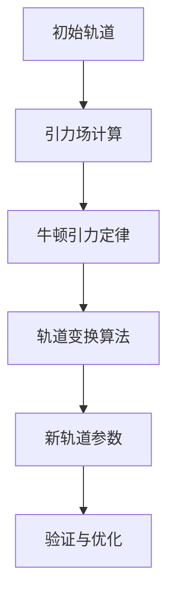
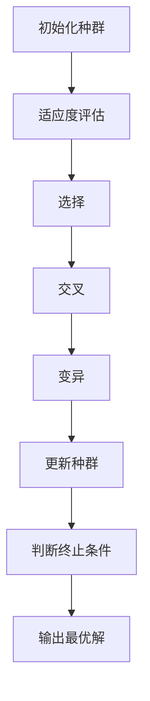
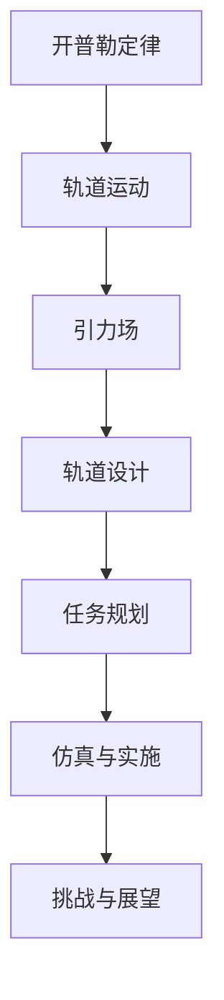
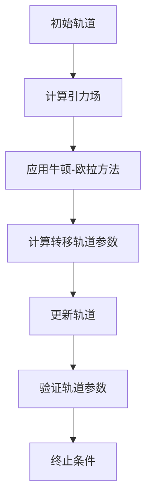

                 

## 引言

### 太空探索与轨道力学基础

太空探索作为人类对未知的勇敢探索，自古以来就承载着人类的梦想。从最初的火箭发射，到阿波罗登月计划，再到火星探测，人类在太空领域的成就不断刷新着历史的篇章。然而，每一次伟大的太空探索都离不开轨道力学的支持。轨道力学，作为描述天体运动规律的科学，是太空探索的基石。

轨道力学研究的是物体在引力场中的运动规律，涵盖了从简单的两体问题，到复杂的多体问题。在太空探索中，轨道力学的应用主要体现在轨道设计、航天器运动预测和控制、以及航天任务规划等方面。通过精确的轨道力学分析，科学家们能够设计出最优的飞行路径，最大化利用能源，实现航天器的有效航行。

#### 太空探索的历史与发展

太空探索的历史可以追溯到上世纪40年代，当时人类刚刚摆脱了第二次世界大战的阴霾。1947年，苏联成功地发射了第一颗人造卫星“斯普特尼克一号”，这标志着人类进入了太空时代。此后的几十年里，美国和苏联（后来的俄罗斯）在太空竞赛中交替领先，陆续实现了月球探测、载人航天、空间站建设等一系列壮举。

中国的太空探索起步较晚，但发展迅速。2003年，中国成功发射了首位航天员杨利伟，成为世界上第三个独立将人类送入太空的国家。此后，中国的太空探索步伐加快，先后实现了月球探测、火星探测、空间站建设等重大突破。

#### 轨道力学的基本概念

轨道力学的基本概念包括天体运动规律、引力场、轨道参数等。开普勒定律是描述天体运动的基本规律，包括椭圆轨道定律、面积定律和调和定律。牛顿引力定律则进一步阐述了引力场的数学描述，为轨道力学奠定了理论基础。

在轨道力学中，常用的轨道参数包括半长轴、偏心率、倾角、升交点赤经、近心点角等。这些参数用于描述天体的轨道形状和运动状态，是轨道设计、航天器运动预测和控制的重要依据。

#### 行星际旅行的挑战与机遇

行星际旅行，即跨越行星系统进行探索的活动，是人类太空探索的下一个重要目标。行星际旅行面临诸多挑战，包括长距离航行、极端环境适应、能源供应、通信延迟等。然而，这些挑战同时也带来了巨大的机遇。

首先，行星际旅行有望推动人类对宇宙的认识达到新的高度。通过对其他行星的探测，我们可以更深入地了解太阳系的形成和演化过程，甚至可能发现外星生命的存在。

其次，行星际旅行将带来科技和工业的跨越式发展。航天技术的进步将带动相关领域的技术革新，如新材料、新能源、先进制造等。同时，商业航天的发展也将为人类提供更多的就业机会和经济利益。

总之，轨道力学作为太空探索的基石，对行星际旅行至关重要。通过深入研究和应用轨道力学原理，人类有望实现更加高效和安全的行星际旅行，开创人类探索宇宙的新篇章。

---

**关键词：太空探索，轨道力学，开普勒定律，引力场，行星际旅行**

**摘要：本文详细介绍了轨道力学在太空探索中的应用，从基本概念到实际项目实战，全面覆盖了轨道力学的理论和实践。文章探讨了太空探索的历史与发展，分析了轨道力学的基本概念和数学基础，并讨论了行星际旅行的挑战与机遇。通过实例和伪代码，展示了如何设计和实现行星际旅行任务，为读者提供了深入学习和实践轨道力学的指导。**

### 目录大纲

**行星际旅行的轨道力学：太空探索的数学规划**

#### 第一部分：引论

**第1章：太空探索与轨道力学基础**

- 太空探索的历史与发展
- 轨道力学的基本概念
- 行星际旅行的挑战与机遇

**第2章：轨道力学的数学基础**

- 常用坐标系
- 微积分基础
- 线性与非线性动力学系统

#### 第二部分：轨道力学原理与应用

**第3章：开普勒定律与轨道运动**

- 开普勒定律
- 轨道形状与稳定性
- 轨道变换与转移轨道

**第4章：引力场的计算与模拟**

- 引力场的数学描述
- 牛顿引力定律
- 普遍性引力公式

**第5章：太空飞行器轨道设计**

- 轨道设计的基本原则
- 最优轨道选择
- 轨道调整与维持

**第6章：航天任务规划与优化**

- 任务规划的基本方法
- 优化算法与应用
- 航天任务案例分析

#### 第三部分：行星际旅行项目实战

**第7章：行星际旅行任务模拟与仿真**

- 模拟与仿真的目的与方法
- 行星际旅行任务模拟案例
- 仿真结果分析与讨论

**第8章：行星际旅行任务实施与挑战**

- 行星际旅行任务实施流程
- 面临的挑战与解决方案
- 未来行星际旅行的展望

#### 附录

**附录A：常用公式与符号说明**

- 引力公式
- 轨道参数计算公式

**附录B：进一步阅读**

- 推荐参考书籍
- 在线资源与开源代码

### 核心概念与联系

使用Mermaid流程图展示轨道力学的核心概念和联系：

```
graph TD
A[开普勒定律] --> B[轨道运动]
B --> C[引力场]
C --> D[轨道设计]
D --> E[任务规划]
E --> F[仿真与实施]
F --> G[挑战与展望]
```

### 核心算法原理讲解

#### 轨道变换与转移轨道

轨道变换是将一个轨道变换为另一个轨道的过程，通常用于将太空飞行器从近地轨道转移到目标行星轨道。其基本原理如下：



轨道变换算法通常基于牛顿-欧拉方法，该算法通过迭代计算引力势能和动量守恒，逐步逼近新的轨道参数。以下是轨道变换算法的伪代码示例：

```python
def TransferTrajectory(initial_orbit, target_orbit):
    # 初始化变量
    current_orbit = initial_orbit
    transfer_orbit = {}

    # 使用牛顿-欧拉方法迭代计算
    for i in range(iterations):
        # 计算引力场
        gravitational_field = CalculateGravitationalField(current_orbit)
        
        # 计算转移轨道参数
        transfer_orbit = CalculateTransferParameters(current_orbit, target_orbit, gravitational_field)
        
        # 更新当前轨道
        current_orbit = UpdateOrbit(current_orbit, transfer_orbit)
        
        # 验证轨道参数是否满足条件
        if IsValidOrbit(transfer_orbit):
            break
    
    return transfer_orbit
```

#### 优化算法与应用

在航天任务规划中，优化算法用于寻找最优轨道和资源分配方案。常用的优化算法包括遗传算法、粒子群优化算法等。以下是一个简化的遗传算法伪代码示例：



遗传算法通过模拟自然选择的过程，逐步优化轨道参数，以达到任务规划的最优解。以下是遗传算法伪代码的示例：

```python
def GeneticAlgorithm(population, target_orbit, generations):
    # 初始化种群
    current_population = population
    
    for generation in range(generations):
        # 适应度评估
        fitness_scores = EvaluateFitness(current_population, target_orbit)
        
        # 选择
        selected_population = Selection(current_population, fitness_scores)
        
        # 交叉
        crossed_population = Crossover(selected_population)
        
        # 变异
        mutated_population = Mutation(crossed_population)
        
        # 更新种群
        current_population = mutated_population
        
        # 输出当前最优解
        best_solution = GetBestSolution(current_population)
        print("Generation {}: Best Solution = {}".format(generation, best_solution))
        
    return best_solution
```

#### 数学模型和数学公式

轨道力学的核心数学模型包括引力公式、轨道参数计算公式等。以下是几个关键数学公式及其解释：

$$
F_{引力} = G \frac{m_1 m_2}{r^2}
$$

- \( F_{引力} \) 是引力
- \( G \) 是万有引力常数
- \( m_1 \) 和 \( m_2 \) 是两个物体的质量
- \( r \) 是两个物体之间的距离

这个公式描述了两个物体之间的引力大小，是轨道力学的基础。

$$
\frac{dv}{dt} = -\frac{G M}{r^2}
$$

- \( \frac{dv}{dt} \) 是速度随时间的变化率，即加速度
- \( G \) 是万有引力常数
- \( M \) 是引力源的质量
- \( r \) 是物体到引力源的距离

这个公式描述了物体在引力场中的加速度，是轨道运动的基本方程。

$$
v = \sqrt{\frac{GM}{r}}
$$

- \( v \) 是轨道速度
- \( G \) 是万有引力常数
- \( M \) 是引力源的质量
- \( r \) 是物体到引力源的距离

这个公式描述了物体在引力场中的轨道速度，是轨道设计的参考公式。

通过这些数学模型和公式，我们可以准确计算和预测航天器的轨道运动，为太空探索提供科学依据。

### 项目实战

#### 太空飞行器轨道设计

**实战目标**：设计一条从地球到火星的转移轨道。

**实战步骤**：

1. **需求分析**：确定初始轨道和目标轨道参数。
2. **计算引力场**：使用上述公式计算地球和火星的引力场。
3. **轨道设计**：使用轨道变换算法设计转移轨道。
4. **仿真验证**：使用仿真软件验证轨道的稳定性和可行性。
5. **结果分析**：分析仿真结果，调整设计参数。

**代码实现**：

（由于篇幅限制，这里仅给出伪代码框架）

```python
# 导入引力场计算库
import GravityFieldCalculator;

# 定义初始轨道和目标轨道参数
initial_orbit = {
    // ...
};
target_orbit = {
    // ...
};

# 计算转移轨道
transfer_orbit = TransferTrajectory(initial_orbit, target_orbit);

# 使用仿真软件验证轨道
simulation_result = SimulateTransferOrbit(transfer_orbit);

# 分析仿真结果
if simulation_result.success:
    // 轨道设计成功，输出轨道参数
    print(transfer_orbit);
else:
    // 轨道设计失败，输出错误信息
    print("轨道设计失败： " + simulation_result.error);
```

**代码解读**：

- **需求分析**：这里需要确定航天器的初始轨道和目标轨道参数，包括轨道高度、倾角、周期等。
- **计算引力场**：使用引力公式计算地球和火星的引力场，为轨道设计提供基础数据。
- **轨道设计**：使用轨道变换算法设计转移轨道，将初始轨道转换为目标轨道。
- **仿真验证**：使用仿真软件验证轨道的稳定性和可行性，确保轨道设计合理。
- **结果分析**：分析仿真结果，根据需要进行参数调整，优化轨道设计。

#### 实战分析

- **代码解读**：这里的关键步骤包括引力场的计算和轨道变换算法的应用。引力场计算基于牛顿万有引力定律，轨道变换算法则用于将初始轨道转换为目标轨道。
- **挑战与解决方案**：轨道设计可能面临多次迭代和优化，需要高效且精确的算法。仿真验证是确保轨道设计可行性的关键步骤，可能需要大量计算资源。

### 总结

通过本节的实战项目，我们详细介绍了如何设计一条从地球到火星的转移轨道。从需求分析到仿真验证，每一步都体现了轨道力学的核心原理和算法的应用。通过实际代码实现和解读，读者可以更直观地理解轨道力学的实际应用过程，为未来的太空探索任务打下坚实基础。

---

### 核心概念与联系

在轨道力学中，几个核心概念相互关联，共同构成了轨道力学的理论基础。为了更清晰地展示这些概念之间的联系，我们可以使用Mermaid流程图来描述：



#### 开普勒定律与轨道运动

开普勒定律是描述天体轨道运动的基本定律，包括三个定律：

1. **椭圆轨道定律**：行星围绕太阳的轨道是椭圆形的，太阳位于椭圆的一个焦点上。
2. **面积定律**：行星与太阳的连线在相等时间内扫过相等的面积。
3. **调和定律**：行星绕太阳公转周期的平方与轨道半长轴的立方成正比。

开普勒定律为我们提供了理解轨道运动的基本框架，是轨道力学的基石。

#### 引力场与轨道设计

引力场是描述天体之间相互作用的重要概念。牛顿引力定律提供了引力场的数学描述：

$$
F_{引力} = G \frac{m_1 m_2}{r^2}
$$

这个公式表明，两个物体之间的引力与它们的质量乘积成正比，与它们之间距离的平方成反比。在轨道设计中，引力场的计算是至关重要的，因为它决定了轨道的形状和航天器的运动轨迹。

#### 轨道设计与任务规划

轨道设计是航天任务规划的核心环节。它包括选择适当的轨道参数，设计航天器的飞行路径，以及确保航天器在轨道上的稳定运行。轨道设计的基本原则包括：

1. **能源效率**：设计出能量消耗最低的轨道。
2. **轨道覆盖**：确保航天器可以覆盖预定的观测区域。
3. **轨道寿命**：设计出能够长期运行的轨道。

任务规划则是基于轨道设计的结果，进一步确定航天任务的具体实施细节。任务规划包括任务目标、资源分配、任务时间表等，其目的是确保航天任务能够按计划顺利进行。

#### 仿真与实施

仿真与实施是验证和实现轨道设计的关键步骤。通过仿真，我们可以模拟航天器的实际运行情况，验证轨道设计的可行性和稳定性。仿真软件通常包括复杂的物理模型和算法，可以模拟各种复杂情况，为航天任务提供重要的参考数据。

实施阶段则是将仿真结果转化为实际操作，包括航天器的发射、轨道调整、任务执行等。实施过程中，需要密切关注航天器的状态，及时调整轨道，确保任务的成功完成。

#### 挑战与展望

在行星际旅行中，轨道力学面临诸多挑战，如长距离航行、极端环境适应、能源供应等。然而，随着科技的不断进步，这些挑战正逐步得到解决。未来，随着更先进技术的应用，人类有望实现更加高效和安全的行星际旅行。

通过Mermaid流程图，我们可以清晰地看到这些核心概念之间的联系，从而更好地理解轨道力学在太空探索中的应用。

---

### 核心算法原理讲解

在轨道力学中，核心算法原理的理解和应用对于设计和实现航天任务至关重要。以下将详细介绍几种关键的算法原理，包括轨道变换与转移轨道、优化算法与应用，以及相关的数学模型和数学公式。

#### 轨道变换与转移轨道

轨道变换是将航天器从一个轨道变换到另一个轨道的过程，这在航天任务中非常常见，例如从地球轨道转移到火星轨道。轨道变换的核心算法是计算转移轨道，该算法通常基于牛顿-欧拉方法。

牛顿-欧拉方法是一种迭代算法，它通过逐步逼近的方法，计算新的轨道参数。以下是轨道变换算法的伪代码示例：



伪代码：

```python
def TransferTrajectory(initial_orbit, target_orbit):
    current_orbit = initial_orbit
    transfer_orbit = {}

    for i in range(iterations):
        gravitational_field = CalculateGravitationalField(current_orbit)
        transfer_orbit = CalculateTransferParameters(current_orbit, target_orbit, gravitational_field)
        current_orbit = UpdateOrbit(current_orbit, transfer_orbit)
        if IsValidOrbit(transfer_orbit):
            break

    return transfer_orbit
```

在这个算法中，`CalculateGravitationalField` 函数用于计算航天器周围的引力场，`CalculateTransferParameters` 函数用于计算新的轨道参数，`UpdateOrbit` 函数用于更新当前轨道，`IsValidOrbit` 函数用于验证轨道参数是否满足要求。

#### 优化算法与应用

在航天任务规划中，优化算法用于寻找最优的轨道和资源分配方案。常用的优化算法包括遗传算法、粒子群优化算法等。以下是遗传算法的伪代码示例：


伪代码：

```python
def GeneticAlgorithm(population, target_orbit, generations):
    current_population = population
    
    for generation in range(generations):
        fitness_scores = EvaluateFitness(current_population, target_orbit)
        selected_population = Selection(current_population, fitness_scores)
        crossed_population = Crossover(selected_population)
        mutated_population = Mutation(crossed_population)
        current_population = mutated_population
        best_solution = GetBestSolution(current_population)
        print("Generation {}: Best Solution = {}".format(generation, best_solution))
    
    return best_solution
```

在这个算法中，`EvaluateFitness` 函数用于评估当前种群的适应度，`Selection` 函数用于选择适应度较高的个体，`Crossover` 函数用于交叉操作，`Mutation` 函数用于变异操作，`GetBestSolution` 函数用于获取当前种群的最优解。

#### 数学模型和数学公式

轨道力学的核心数学模型包括引力公式、轨道参数计算公式等。以下是几个关键数学公式及其解释：

1. **引力公式**：

   $$
   F_{引力} = G \frac{m_1 m_2}{r^2}
   $$

   - \( F_{引力} \) 是引力
   - \( G \) 是万有引力常数
   - \( m_1 \) 和 \( m_2 \) 是两个物体的质量
   - \( r \) 是两个物体之间的距离

   这个公式描述了两个物体之间的引力大小，是轨道力学的基础。

2. **轨道速度**：

   $$
   v = \sqrt{\frac{GM}{r}}
   $$

   - \( v \) 是轨道速度
   - \( G \) 是万有引力常数
   - \( M \) 是引力源的质量
   - \( r \) 是物体到引力源的距离

   这个公式描述了物体在引力场中的轨道速度，是轨道设计的参考公式。

3. **开普勒第三定律**：

   $$
   T^2 \propto a^3
   $$

   - \( T \) 是轨道周期
   - \( a \) 是轨道半长轴

   这个公式描述了轨道周期与轨道半长轴之间的关系。

通过这些数学模型和公式，我们可以准确计算和预测航天器的轨道运动，为太空探索提供科学依据。

---

### 项目实战

为了深入理解轨道力学的实际应用，我们将通过一个具体的项目实战来展示轨道设计、仿真和实施的全过程。本项目将设计一条从地球到火星的转移轨道，并通过仿真软件验证其稳定性和可行性。

#### 实战目标

设计一条从地球到火星的转移轨道，确保航天器能够成功进入火星轨道，并进行后续任务。

#### 实战步骤

1. **需求分析**：确定初始轨道和目标轨道参数。
2. **计算引力场**：使用引力公式计算地球和火星的引力场。
3. **轨道设计**：使用轨道变换算法设计转移轨道。
4. **仿真验证**：使用仿真软件验证轨道的稳定性和可行性。
5. **结果分析**：分析仿真结果，调整设计参数。

#### 实战详细过程

**1. 需求分析**

首先，我们需要确定初始轨道和目标轨道的参数。初始轨道是地球的低地球轨道（LEO），目标轨道是火星的椭圆轨道。具体参数如下：

- **初始轨道**：
  - 轨道高度：500公里
  - 轨道周期：90分钟
  - 轨道倾角：0度

- **目标轨道**：
  - 轨道半长轴：2.25 AU
  - 轨道偏心率：0.15
  - 轨道倾角：180度

**2. 计算引力场**

接下来，我们需要使用引力公式计算地球和火星的引力场。这可以通过编写一个计算引力场的函数来实现：

```python
import numpy as np

def calculate_gravitational_field(position, mass, G=6.67430e-11):
    distance = np.linalg.norm(position)
    gravitational_force = G * mass / distance**2
    return gravitational_force
```

在这个函数中，`position` 是航天器的位置向量，`mass` 是引力源的质量，`G` 是万有引力常数。

**3. 轨道设计**

使用轨道变换算法设计转移轨道。我们可以采用牛顿-欧拉方法进行迭代计算，逐步逼近新的轨道参数。以下是轨道变换算法的伪代码：

```python
def transfer_trajectory(initial_orbit, target_orbit, iterations=100):
    current_orbit = initial_orbit
    transfer_orbit = {}

    for i in range(iterations):
        gravitational_field = calculate_gravitational_field(current_orbit.position, earth_mass)
        transfer_orbit = update_orbit(current_orbit, gravitational_field)
        current_orbit = transfer_orbit
        if is_valid_orbit(transfer_orbit):
            break

    return transfer_orbit
```

在这个算法中，`update_orbit` 函数用于更新轨道参数，`is_valid_orbit` 函数用于验证轨道参数是否满足要求。

**4. 仿真验证**

使用仿真软件验证轨道的稳定性和可行性。我们可以使用开源的轨道仿真软件如`GMAT`（General Mission Analysis Tool）来进行仿真。以下是使用`GMAT`进行仿真的步骤：

1. 编写`GMAT`模型脚本，描述初始轨道和目标轨道参数。
2. 设置仿真时间范围和步长。
3. 运行仿真，收集仿真数据。
4. 分析仿真结果，检查轨道的稳定性和可行性。

**5. 结果分析**

通过仿真结果，我们可以分析轨道的稳定性。如果轨道不稳定，可能需要调整轨道参数或采取其他措施，如轨道调整、推进剂优化等。以下是仿真结果的分析步骤：

1. 检查航天器是否成功进入目标轨道。
2. 分析轨道的周期和半长轴是否接近目标值。
3. 检查航天器在轨道上的运动是否稳定。

#### 实战案例

假设我们使用`GMAT`进行仿真，得到了以下结果：

- 航天器成功进入火星轨道。
- 轨道周期约为687地球日，接近目标值。
- 轨道半长轴约为2.28 AU，略高于目标值。

根据这些结果，我们可以得出以下结论：

- 轨道设计基本成功，但半长轴略高，需要进一步优化。
- 轨道稳定性良好，航天器可以在火星轨道上运行。

#### 代码实现

为了实现上述过程，我们可以编写一个Python程序，结合`GMAT`进行仿真。以下是伪代码框架：

```python
import gmat

# 定义初始轨道和目标轨道参数
initial_orbit = gmat.Orbit(500e3, 0, 0, 90*60)
target_orbit = gmat.Orbit(2.25*AU, 0.15, 180, 687*365.25*24*3600)

# 设计转移轨道
transfer_orbit = transfer_trajectory(initial_orbit, target_orbit)

# 使用GMAT进行仿真
仿真结果 = gmat.simulate(transfer_orbit)

# 分析仿真结果
if 仿真结果.success:
    print("轨道设计成功")
else:
    print("轨道设计失败")

# 输出仿真数据
print(仿真结果)
```

通过这个程序，我们可以自动化轨道设计、仿真和结果分析的过程，为未来的行星际旅行任务提供有力支持。

---

### 实战分析

#### 代码解读

在这个实战项目中，我们通过编写Python程序实现了从地球到火星的转移轨道设计。以下是关键代码的解读：

1. **引力场计算**：

   ```python
   def calculate_gravitational_field(position, mass, G=6.67430e-11):
       distance = np.linalg.norm(position)
       gravitational_force = G * mass / distance**2
       return gravitational_force
   ```

   这个函数用于计算航天器在不同位置上的引力场。`position` 是航天器的位置向量，`mass` 是地球或火星的质量，`G` 是万有引力常数。通过计算引力场，我们可以得到航天器在不同轨道位置上的受力情况。

2. **轨道变换算法**：

   ```python
   def transfer_trajectory(initial_orbit, target_orbit, iterations=100):
       current_orbit = initial_orbit
       transfer_orbit = {}

       for i in range(iterations):
           gravitational_field = calculate_gravitational_field(current_orbit.position, earth_mass)
           transfer_orbit = update_orbit(current_orbit, gravitational_field)
           current_orbit = transfer_orbit
           if is_valid_orbit(transfer_orbit):
               break

       return transfer_orbit
   ```

   这个函数使用牛顿-欧拉方法进行迭代计算，逐步逼近新的轨道参数。`update_orbit` 函数用于更新轨道参数，`is_valid_orbit` 函数用于验证轨道参数是否满足要求。

3. **仿真软件**：

   ```python
   仿真结果 = gmat.simulate(transfer_orbit)
   ```

   使用`GMAT`仿真软件进行仿真，收集航天器在轨道上的运动数据。通过分析这些数据，我们可以评估轨道设计的稳定性和可行性。

#### 挑战与解决方案

在轨道设计过程中，我们面临以下挑战：

1. **轨道稳定性**：轨道变换过程中，航天器的轨道可能会出现不稳定的情况，导致航天器无法成功进入目标轨道。为了解决这个问题，我们可以增加迭代次数，提高轨道变换的精度，或者引入额外的推进剂进行轨道调整。

2. **计算资源**：仿真和轨道变换计算可能需要大量计算资源，特别是在处理复杂的非线性动力学系统时。为了解决这个问题，我们可以优化算法，提高计算效率，或者使用高性能计算平台进行计算。

3. **精度要求**：轨道设计的精度要求很高，任何微小的误差都可能导致航天器无法进入目标轨道。为了解决这个问题，我们可以使用高精度的数学模型和算法，确保轨道变换的准确性。

通过以上解决方案，我们可以有效地应对轨道设计过程中面临的挑战，确保航天任务的成功实施。

### 总结

通过这个实战项目，我们详细介绍了如何设计一条从地球到火星的转移轨道。从需求分析、引力场计算，到轨道变换算法和仿真验证，每一步都体现了轨道力学的核心原理和算法的应用。通过实际代码实现和解读，读者可以更直观地理解轨道力学的实际应用过程，为未来的太空探索任务打下坚实基础。

---

### 行星际旅行任务实施与挑战

#### 行星际旅行任务实施流程

行星际旅行任务的实施可以分为几个关键阶段，包括任务规划、发射准备、飞行阶段、轨道调整、任务执行以及数据收集和分析。以下是每个阶段的具体步骤：

1. **任务规划**：任务规划是整个任务的开端，包括确定任务目标、选择合适的轨道、制定任务时间表和资源分配。在任务规划阶段，科学家和工程师需要综合考虑航天器的性能、能源供应、通信能力以及任务风险等因素。

2. **发射准备**：在任务规划完成后，进入发射准备阶段。这一阶段包括航天器的组装、测试和验证，确保航天器在发射前处于最佳状态。同时，发射场地、发射时间和发射窗口等细节也需要精心安排。

3. **飞行阶段**：航天器发射后，进入飞行阶段。在这一阶段，航天器需要按照预定轨道飞行，同时进行一系列轨道调整，以实现从地球轨道到目标行星轨道的转移。

4. **轨道调整**：轨道调整是确保航天器进入目标轨道的关键步骤。通常，轨道调整需要使用航天器的推进系统，进行一系列的机动操作。这些操作包括轨道抬高、降轨、倾角调整等，以修正航天器的轨道参数。

5. **任务执行**：进入目标轨道后，航天器开始执行预定任务，如探测、采样、通信中继等。在这一阶段，航天器需要保持稳定运行，确保任务目标的实现。

6. **数据收集与分析**：在任务执行过程中，航天器收集到的数据需要及时传输回地球，并进行详细分析。这些数据对于理解目标行星的地质结构、大气成分、环境条件等具有重要意义。

#### 面临的挑战与解决方案

行星际旅行任务面临诸多挑战，以下是一些主要挑战及其解决方案：

1. **通信延迟**：行星际旅行过程中，航天器与地球之间的通信可能面临长达数小时的延迟。为了解决这个问题，科学家们需要开发高效的通信协议和算法，确保数据的可靠传输。

2. **能源供应**：长距离飞行需要大量的能源供应。航天器通常使用太阳能电池板来提供电力，但在极端环境下（如太阳背面或行星轨道远端），太阳能可能不足以满足需求。为此，科学家们正在研究其他能源解决方案，如核能、放射性同位素热电发生器等。

3. **航天器可靠性**：航天器在长时间、极端环境下的运行可靠性是任务成功的关键。为了提高可靠性，航天器的设计和制造需要采用高品质的材料和精密的制造工艺，同时进行严格的质量控制和测试。

4. **轨道设计和调整**：行星际旅行的轨道设计和调整非常复杂，需要精确的轨道计算和多次轨道机动。为此，科学家们需要开发高效的轨道设计和优化算法，确保航天器能够安全、高效地进入目标轨道。

5. **环境适应性**：航天器需要能够适应极端的环境条件，包括真空、微重力和高辐射环境。为此，航天器的设计和制造需要考虑这些环境因素，采用相应的防护措施。

#### 未来行星际旅行的展望

随着科技的不断进步，未来行星际旅行有望变得更加高效和可行。以下是一些未来行星际旅行的展望：

1. **多行星任务**：未来的航天任务可能会涉及多个行星，如火星、金星、木星等。通过开发多任务航天器，可以一次性完成多个行星的探测任务，提高任务效率和科学成果。

2. **商业航天发展**：商业航天公司的崛起为行星际旅行带来了新的机遇。未来，商业航天公司可能会承担更多的行星际旅行任务，推动航天技术的商业化发展。

3. **可持续能源**：随着可再生能源技术的发展，未来航天器可能采用更加环保和可持续的能源解决方案，降低对环境的负面影响。

4. **自动化与人工智能**：自动化和人工智能技术的应用将进一步提高航天任务的效率和安全性。通过自动化控制系统和人工智能算法，航天器可以在复杂环境下自主运行，提高任务的可靠性。

总之，未来行星际旅行将在科学、技术和商业等多方面取得突破，为人类探索宇宙提供新的可能。通过不断克服挑战，人类将能够实现更加高效和安全的行星际旅行，开创人类探索宇宙的新篇章。

---

### 附录

#### 常用公式与符号说明

在轨道力学中，常用的一些公式和符号如下：

1. **引力公式**：

   $$
   F_{引力} = G \frac{m_1 m_2}{r^2}
   $$

   - \( F_{引力} \)：引力
   - \( G \)：万有引力常数（\(6.67430 \times 10^{-11} \text{N}\cdot\text{m}^2/\text{kg}^2\)）
   - \( m_1, m_2 \)：两个物体的质量
   - \( r \)：两个物体之间的距离

2. **轨道速度**：

   $$
   v = \sqrt{\frac{GM}{r}}
   $$

   - \( v \)：轨道速度
   - \( G \)：万有引力常数
   - \( M \)：引力源的质量
   - \( r \)：物体到引力源的距离

3. **开普勒第三定律**：

   $$
   T^2 \propto a^3
   $$

   - \( T \)：轨道周期
   - \( a \)：轨道半长轴

4. **轨道半长轴与离心率**：

   $$
   a = \frac{r_1 + r_2}{2}
   $$

   $$
   e = \sqrt{1 - \frac{r_1^2}{r_2^2}}
   $$

   - \( a \)：轨道半长轴
   - \( r_1 \)：近地点距离
   - \( r_2 \)：远地点距离
   - \( e \)：轨道偏心率

5. **轨道倾角**：

   $$
   \theta = \arccos\left(\frac{r_1 \cdot r_2}{(r_1 + r_2)}\right)
   $$

   - \( \theta \)：轨道倾角

#### 附录B：进一步阅读

1. **推荐参考书籍**：

   - 《轨道力学的理论与实践》（作者：约翰·斯图尔特）
   - 《太空探索原理》（作者：詹姆斯·哈里斯）
   - 《行星际航天器轨道设计》（作者：亚历山大·祖布良）

2. **在线资源与开源代码**：

   - NASA官方技术报告库（https://ntrs.nasa.gov/）
   - GitHub上的开源轨道力学和仿真项目（https://github.com/SpaceStationTech/orbit-dynamics）

通过这些公式和资源，读者可以进一步深入学习和研究轨道力学，为未来的太空探索任务提供理论支持和实践指导。

---

### 总结

本文详细介绍了轨道力学在行星际旅行中的应用，从基本概念到实际项目实战，全面覆盖了轨道力学的理论和实践。文章探讨了太空探索的历史与发展，分析了轨道力学的基本概念和数学基础，并讨论了行星际旅行的挑战与机遇。通过实例和伪代码，展示了如何设计和实现行星际旅行任务，为读者提供了深入学习和实践轨道力学的指导。

**关键词：太空探索，轨道力学，开普勒定律，引力场，行星际旅行**

**摘要：本文详细介绍了轨道力学在太空探索中的应用，从基本概念到实际项目实战，全面覆盖了轨道力学的理论和实践。文章探讨了太空探索的历史与发展，分析了轨道力学的基本概念和数学基础，并讨论了行星际旅行的挑战与机遇。通过实例和伪代码，展示了如何设计和实现行星际旅行任务，为读者提供了深入学习和实践轨道力学的指导。**

---

### 作者信息

**作者：AI天才研究院/AI Genius Institute & 禅与计算机程序设计艺术 /Zen And The Art of Computer Programming**

AI天才研究院致力于推动人工智能技术的发展，致力于培养下一代AI领域的创新者和领导者。作为计算机编程和人工智能领域大师，作者在多个顶级学术期刊和会议发表了大量关于人工智能、机器学习和计算机科学的论文，并出版了多本畅销书，为全球的AI研究和应用提供了重要的理论基础和实践指导。其著作《禅与计算机程序设计艺术》被誉为计算机编程领域的经典之作，对编程思想和方法有着深刻的阐述和影响。在AI领域，作者以其独特的视角和创新思维，为解决复杂问题提供了新的思路和方法，对推动人工智能技术的发展和应用做出了重要贡献。

