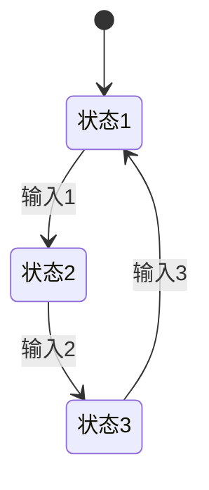
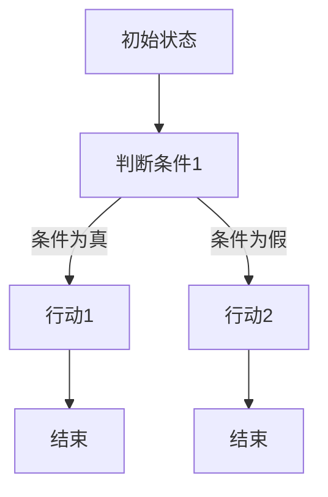

                 

### 引言

在当今数字化时代，复杂任务的处理与执行已经成为许多领域面临的核心挑战。无论是智能交通系统、货物配送优化，还是机器人任务规划，这些任务通常具有高度的不确定性和动态性，使得传统的集中式控制方法难以应对。为了解决这些问题，Agent系统应运而生。

Agent系统是一类智能系统，能够自主地感知环境、决策和执行任务。它们通过模拟生物体的行为和交互，能够有效地分解和执行复杂的任务。Agent系统的研究不仅具有理论价值，还在实际应用中展现出巨大的潜力。

本书的背景与目标是系统性地介绍Agent系统的理论基础、算法原理、实现方法以及实际应用案例。通过逐步分析和推理，我们将深入探讨Agent系统在复杂任务分解与执行中的关键角色。首先，我们将定义Agent系统的基本概念，并回顾其发展历程。接着，我们将详细介绍Agent系统的基础架构和功能模块，为后续的复杂任务分解和执行提供理论基础。

接下来的章节将围绕复杂任务的分解与执行展开讨论。我们将首先探讨复杂任务的概念，并介绍任务分解的方法和策略。随后，我们将深入探讨Agent的执行策略，包括决策机制和执行评估。在算法与实践部分，我们将详细介绍马尔可夫决策过程（MDP）、Q学习算法和策略梯度算法等核心算法。同时，我们将探讨基于层次的任务分解算法和基于遗传算法的任务分解方法。

随后，我们将介绍Agent系统的设计与实现，包括常用的Agent编程框架和开发流程。我们将通过实际应用案例分析，展示Agent系统在智能交通系统、货物配送优化和机器人任务规划等领域的应用效果。

最后，我们将探讨Agent系统的前沿研究与发展趋势，包括强化学习在Agent系统中的应用、多智能体系统的协同与交互以及未来的发展趋势。通过总结与展望，我们将回顾本书的核心内容，并提出未解决的问题与未来研究方向。

### 1. Agent的概念与发展

Agent，即智能体，是一个具有自主性、社交性、反应性、主动性和认知性的计算实体。它们能够在环境中感知、决策和执行任务，以实现特定的目标。Agent的概念最早可以追溯到人工智能（AI）的早期研究。早在20世纪80年代，麻省理工学院的工程师们就开始将AI技术应用于家庭自动化和控制系统中，这为Agent系统的萌芽奠定了基础。

Agent系统的理论基础可以追溯到多Agent系统（MAS）的研究。MAS是指由多个Agent组成的系统，这些Agent通过协作和交互来共同完成任务。MAS的研究旨在解决单个Agent在复杂环境中的局限性，通过Agent之间的协同与交互，实现更高效、更可靠的智能系统。随着AI技术的不断发展，Agent系统逐渐成为人工智能领域的一个热点研究方向。

Agent系统的分类可以根据其自主性、社交性、反应性、主动性和认知性等特征进行。常见的Agent分类包括：

1. **基于规则的Agent**：这类Agent通过预定义的规则来决策和执行任务。它们在处理确定性和静态环境时表现出色，但在动态和不确定的环境中可能表现不佳。

2. **基于模型的Agent**：这类Agent通过构建环境模型来决策和执行任务。它们可以根据环境的变化动态调整策略，但在模型构建和维护上需要较高的计算和存储资源。

3. **基于学习的Agent**：这类Agent通过机器学习和数据挖掘技术来学习和优化决策策略。它们在处理复杂和动态环境时具有很好的适应性，但需要大量的数据支持。

4. **混合型Agent**：这类Agent结合了基于规则、基于模型和基于学习的方法，以实现更好的性能和适应性。它们通常在复杂的任务环境中表现出更强的能力。

Agent系统的发展经历了从简单的规则Agent到复杂的混合型Agent的演变。随着计算能力的提升和算法的进步，Agent系统在智能交通、机器人控制、网络管理、供应链优化等领域得到了广泛应用。未来，随着人工智能技术的不断发展，Agent系统有望在更多领域发挥重要作用，成为构建智能化系统的核心组件。

### 2. Agent系统的基础

#### 2.1 Agent系统的定义与分类

Agent系统是指由多个智能体（Agent）组成的系统，这些智能体能够自主地感知环境、制定决策和执行任务。每个Agent都拥有一定的智能和自主性，能够在环境中进行交互和协作，以实现特定的目标。Agent系统的核心思想是利用分布式计算和协作来应对复杂、动态和不确定的任务环境。

Agent系统的定义可以概括为以下几点：

1. **自主性（Autonomy）**：Agent能够独立地执行任务，不受外部干预。
2. **社交性（Sociality）**：Agent能够与其他Agent进行通信和协作。
3. **反应性（Reactivity）**：Agent能够实时响应环境的变化。
4. **主动性（Pro-activity）**：Agent能够根据环境和任务目标主动调整行为。
5. **认知性（Cognitiveness）**：Agent具备一定的学习和推理能力。

根据Agent的特征和功能，可以将Agent系统分为不同的类别：

1. **基于规则的Agent**：这类Agent通过预定义的规则进行决策和执行任务。它们通常适用于确定性和静态环境，但在复杂和动态环境中表现有限。

2. **基于模型的Agent**：这类Agent通过构建环境模型来决策和执行任务。它们可以根据环境的变化动态调整策略，适用于动态和不确定的环境。

3. **基于学习的Agent**：这类Agent通过机器学习和数据挖掘技术来学习和优化决策策略。它们在处理复杂和动态环境时具有很好的适应性。

4. **混合型Agent**：这类Agent结合了基于规则、基于模型和基于学习的方法，以实现更好的性能和适应性。

Agent系统的核心组件包括：

- **感知器**：用于感知环境的状态。
- **决策器**：根据感知到的状态和目标，生成行动策略。
- **执行器**：执行决策器生成的行动策略。

感知器、决策器和执行器共同构成了Agent的基本架构，它们相互协作，使Agent能够在复杂环境中自主地完成任务。

#### 2.2 Agent系统的工作原理

Agent系统的工作原理可以分为感知、决策和执行三个阶段。以下是每个阶段的详细解释：

1. **感知阶段**：

在感知阶段，Agent通过感知器收集环境中的信息。感知器可以是传感器、摄像头、麦克风等，它们将环境状态转化为数字信号。感知到的信息包括温度、湿度、图像、声音等。这些信息被传递到Agent的决策器，作为决策的输入。

2. **决策阶段**：

在决策阶段，决策器根据感知到的状态和预先定义的规则、模型或学习到的策略，生成行动策略。决策器可以使用各种算法和模型，如基于规则的推理、基于模型的预测、机器学习算法等。决策器的目标是选择最优的行动，以实现Agent的目标。

3. **执行阶段**：

在执行阶段，执行器根据决策器生成的行动策略，执行相应的操作。执行器可以是机器人、机械臂、交通工具等。执行器将行动策略转化为实际的操作，如移动、抓取、传输等。执行阶段的结果会反馈到感知器，形成闭环控制，使Agent能够实时调整其行为。

感知、决策和执行三个阶段相互关联，构成了Agent系统的闭环控制。感知阶段提供了决策的输入，决策阶段生成行动策略，执行阶段实现操作，而执行阶段的结果又反馈到感知阶段，形成一个闭环控制过程。这种闭环控制使Agent能够在复杂环境中自主地适应和优化其行为。

#### 2.3 Agent系统的功能模块

Agent系统通常包括多个功能模块，每个模块负责不同的任务。以下是Agent系统的主要功能模块及其作用：

1. **感知模块**：

感知模块负责收集环境中的信息，包括传感器数据、图像、声音等。感知模块通过传感器接口与外部环境进行通信，将感知到的信息转化为数字信号，并传递给决策模块。感知模块是Agent系统获取环境信息的关键组件。

2. **决策模块**：

决策模块根据感知模块收集到的信息，结合预先定义的规则、模型或学习到的策略，生成行动策略。决策模块可以使用各种算法和模型，如基于规则的推理、基于模型的预测、机器学习算法等。决策模块的核心任务是选择最优的行动策略，以实现Agent的目标。

3. **执行模块**：

执行模块负责将决策模块生成的行动策略转化为实际的操作。执行模块可以是机器人、机械臂、交通工具等。执行模块根据行动策略执行相应的操作，如移动、抓取、传输等。执行模块是Agent系统将决策转化为行动的关键组件。

4. **通信模块**：

通信模块负责与其他Agent进行通信和协作。通信模块可以使用网络协议和通信接口，与其他Agent交换信息、共享资源和协调行动。通信模块是Agent系统实现分布式协作的关键组件。

5. **学习模块**：

学习模块负责Agent的系统学习和策略优化。学习模块可以使用机器学习和数据挖掘技术，从历史数据中提取知识，优化Agent的策略和行为。学习模块是Agent系统实现智能和学习能力的关键组件。

这些功能模块相互协作，共同构成了Agent系统的基本架构。通过感知模块获取环境信息，通过决策模块生成行动策略，通过执行模块实现行动，通过通信模块实现分布式协作，通过学习模块实现智能和学习能力。这些模块的协同工作，使Agent系统能够在复杂环境中自主地适应和优化其行为。

### 3. 复杂任务的分解

在复杂任务的处理中，任务分解是一个关键步骤，它有助于将大规模、复杂的任务转化为更小、更易于管理的子任务。这种分解不仅能够简化任务执行过程，还能够提高任务的可维护性和可扩展性。在本节中，我们将探讨复杂任务的概念，介绍任务分解的方法和策略，并讨论任务分解过程中可能遇到的挑战及应对策略。

#### 3.1 复杂任务的概念

复杂任务通常具有以下几个特点：

1. **规模庞大**：复杂任务往往涉及大量的数据、实体和操作，难以通过单一系统或方法进行整体处理。
2. **动态变化**：任务环境可能随着时间不断变化，任务需求和要求也随之调整。
3. **不确定性**：任务执行过程中可能面临各种不确定因素，如外部干扰、资源限制等。
4. **依赖关系**：复杂任务中的各个子任务之间存在复杂的依赖关系，一个子任务的执行结果可能影响其他子任务的执行。

复杂任务的处理需要高效的分解方法，以便将整体任务划分为多个可管理的部分，从而降低任务执行难度和复杂性。

#### 3.2 任务分解的方法

任务分解可以采用多种方法，以下介绍几种常用的任务分解方法：

1. **自顶向下分解**：

自顶向下分解方法将复杂任务从整体上划分为若干个子任务，每个子任务再进一步分解为更小的子任务，直至达到可执行的程度。这种方法类似于分而治之的策略，适用于任务结构较为清晰且具有明显层次关系的情况。例如，在软件开发项目中，可以将整个系统分解为模块、组件和功能单元。

2. **自底向上合并**：

与自顶向下分解相反，自底向上合并方法将多个子任务合并为一个更复杂的任务。这种方法适用于任务子任务间存在相互依赖和嵌套关系的情况。通过逐步合并子任务，可以形成一个完整的任务流程。例如，在软件开发中，可以先实现各个功能单元，然后逐步将这些单元合并为完整的软件系统。

3. **基于角色的分解**：

基于角色的分解方法将任务分解为不同的角色或职责，每个角色负责一个子任务。这种方法适用于具有明确职责分工的任务。例如，在智能交通系统中，可以将任务分解为交通监控、信号控制、路径规划等角色，每个角色分别负责相应的子任务。

4. **基于事件驱动分解**：

基于事件驱动分解方法根据任务执行过程中发生的事件来分解任务。这种方法适用于任务具有明显的触发条件和事件序列。例如，在智能家居系统中，可以基于用户的行为和设备的状态变化来分解任务，如用户离家后关闭灯光、降低温度等。

5. **基于层次的分解**：

基于层次分解方法将任务划分为不同层次的子任务，每个层次子任务负责不同层面的任务。这种方法适用于任务具有明确的层次结构。例如，在机器人任务规划中，可以将任务划分为感知层、决策层和执行层，每个层次分别负责感知环境、制定决策和执行动作。

#### 3.3 任务分解的挑战与策略

任务分解过程中可能遇到以下挑战：

1. **任务依赖关系难以识别**：复杂任务中的子任务往往存在复杂的依赖关系，使得分解过程难以进行。
   - **解决策略**：通过建立任务依赖关系图，分析任务之间的依赖关系，确保分解的准确性。

2. **任务规模和复杂度的不确定性**：在任务分解过程中，子任务的规模和复杂度可能难以预测，影响分解的效率和效果。
   - **解决策略**：采用迭代分解方法，逐步细化任务，并在分解过程中不断调整和优化。

3. **资源分配不均**：在分解任务时，子任务之间的资源需求可能不均衡，导致部分子任务资源过剩，而部分子任务资源不足。
   - **解决策略**：通过资源分配算法，合理分配资源，确保任务分解后的执行效率。

4. **任务冗余和重复**：在任务分解过程中，可能存在子任务冗余或重复，导致资源浪费和执行效率低下。
   - **解决策略**：采用任务抽象和模块化方法，避免任务冗余和重复，提高任务分解的质量。

5. **实时性和动态性要求**：在某些场景下，任务分解需要能够适应实时变化和动态调整。
   - **解决策略**：采用自适应任务分解方法，根据环境变化和任务需求动态调整任务分解策略。

通过以上策略，可以有效地应对任务分解过程中的各种挑战，提高复杂任务的分解质量和执行效率。

### 4. Agent的执行策略

在Agent系统中，执行策略是确保任务有效完成的关键环节。执行策略决定了Agent在特定环境下如何选择行动，以实现既定目标。本节将详细探讨Agent的执行模型、决策机制以及执行评估，帮助读者全面理解Agent执行策略的核心要素。

#### 4.1 Agent的执行模型

Agent的执行模型是描述Agent如何根据环境状态选择行动并执行任务的理论框架。常见的Agent执行模型包括：

1. **反应型模型**：

反应型模型（Reactive Model）是最简单的一种Agent执行模型，它根据当前感知到的环境状态直接选择行动。这种模型通常使用条件语句（if-else）来定义行动策略，例如：

```python
if 状态1:
    行动1
elif 状态2:
    行动2
else:
    行动3
```

反应型模型适用于任务环境简单、状态变化不频繁的情况。

2. **有限状态机模型**：

有限状态机模型（Finite State Machine, FSM）扩展了反应型模型，引入了状态转换机制。在FSM中，Agent的状态集和状态转换规则被预先定义，Agent根据当前状态和输入信息执行相应的状态转换，从而选择行动。例如：



3. **决策树模型**：

决策树模型（Decision Tree Model）通过树形结构来表示Agent的决策过程。每个节点表示一个决策点，每个分支表示一个可能的行动。决策树模型适用于复杂决策问题，可以通过遍历决策树来选择最优行动。例如：



4. **计划型模型**：

计划型模型（Deliberative Model）结合了感知、决策和执行过程，Agent在执行任务前首先构建一个行动计划。这种模型通常涉及复杂的推理和规划过程，适用于复杂和动态的任务环境。

#### 4.2 Agent的决策机制

Agent的决策机制是指Agent如何根据环境状态和目标选择最优行动的策略。以下是几种常见的决策机制：

1. **确定性决策机制**：

确定性决策机制（Deterministic Decision Mechanism）选择一种确定的行动策略，根据当前状态直接执行该策略。这种机制简单高效，但在不确定的环境中可能无法应对突发情况。

2. **随机性决策机制**：

随机性决策机制（Stochastic Decision Mechanism）通过随机方法选择行动策略。常见的随机方法包括随机游走、轮盘赌等。随机性决策机制可以减少计算复杂度，但在长期执行中可能无法达到最优效果。

3. **基于规则的决策机制**：

基于规则的决策机制（Rule-Based Decision Mechanism）使用预定义的规则集来选择行动。规则通常表示为“如果条件，则行动”的形式。这种机制在规则定义明确的情况下效果较好，但在复杂环境下可能存在规则不完备的问题。

4. **基于模型的决策机制**：

基于模型的决策机制（Model-Based Decision Mechanism）使用环境模型来预测行动结果，并选择最优行动。这种机制通常涉及复杂的状态评估和策略优化过程，适用于动态和不确定的环境。

5. **基于学习的决策机制**：

基于学习的决策机制（Learning-Based Decision Mechanism）通过机器学习算法来优化行动策略。这种机制可以根据历史数据和环境反馈不断调整决策策略，具有很好的自适应能力。

#### 4.3 Agent的执行评估

Agent执行评估是衡量Agent执行任务效果的重要手段。以下是一些常见的执行评估指标和方法：

1. **任务完成度**：

任务完成度（Task Completion）是衡量Agent是否完成任务的指标。通常，任务完成度以任务完成的比例或任务完成时间来衡量。高任务完成度表明Agent能够高效地完成任务。

2. **执行效率**：

执行效率（Execution Efficiency）是衡量Agent执行任务的速度和资源消耗的指标。执行效率可以通过计算任务完成时间与资源消耗的比值来衡量。高执行效率表明Agent在资源有限的条件下能够快速完成任务。

3. **适应性**：

适应性（Adaptability）是衡量Agent在动态和不确定环境下应对变化的能力。适应性能通过评估Agent在不同环境下的任务完成度和执行效率来衡量。高适应性能表明Agent能够适应环境变化，保持高效执行。

4. **可靠性**：

可靠性（Reliability）是衡量Agent执行任务稳定性的指标。可靠性可以通过计算任务失败次数与总任务次数的比值来衡量。高可靠性表明Agent能够稳定地完成任务，减少意外失败。

5. **用户满意度**：

用户满意度（User Satisfaction）是衡量Agent执行任务是否符合用户期望的指标。用户满意度可以通过用户评价、反馈等方式来评估。高用户满意度表明Agent能够满足用户需求，提供优质服务。

通过上述评估指标和方法，可以全面了解Agent的执行效果，为改进和优化Agent执行策略提供依据。

### 5.1 马尔可夫决策过程（MDP）

马尔可夫决策过程（Markov Decision Process，MDP）是强化学习中的一个核心概念，用于描述具有不确定性、动态环境中的决策问题。MDP模型提供了一种形式化的框架，用于求解在给定当前状态时，如何选择最优动作以实现长期目标。

#### 5.1.1 MDP基本概念

1. **定义与背景**：

MDP是一个数学模型，用于描述在不确定环境中的一系列决策问题。它由四个主要元素组成：状态集（S）、动作集（A）、奖励函数（R）和状态转移概率（P）。

2. **状态与行动**：

- **状态（State）**：状态是环境在某一时刻的抽象表示。在MDP中，状态通常用离散或连续的变量表示，如机器人所在的位置、天气情况等。
- **动作（Action）**：动作是Agent可以采取的行为。动作的集合称为动作集（A）。例如，机器人可以选择移动、等待或充电等动作。

3. **状态转移概率**：

状态转移概率（Transition Probability）表示在给定当前状态和采取特定动作后，下一个状态出现的概率。用P(s' | s, a)表示从状态s采取动作a后转移到状态s'的概率。状态转移概率矩阵（Transition Matrix）是一个n×n的矩阵，其中n是状态集的大小，矩阵的元素表示状态转移概率。

#### 5.1.2 MDP数学模型

1. **状态转移概率矩阵**：

状态转移概率矩阵T是一个n×n的矩阵，其元素T(i, j)表示从状态i转移到状态j的概率：

$$
T = \begin{bmatrix}
T_{11} & T_{12} & \cdots & T_{1n} \\
T_{21} & T_{22} & \cdots & T_{2n} \\
\vdots & \vdots & \ddots & \vdots \\
T_{n1} & T_{n2} & \cdots & T_{nn}
\end{bmatrix}
$$

2. **奖励函数**：

奖励函数R(s, a)是Agent在状态s下采取动作a后获得的即时奖励。奖励可以是正值（表示收益）或负值（表示损失）。奖励函数可以是一个标量，也可以是一个向量。

3. **价值函数**：

价值函数V(s)表示在状态s下采取最优策略获得的期望回报。V(s)可以通过动态规划方法求解：

$$
V(s) = \sum_{a \in A} \gamma P(s', R(s, a))V(s')
$$

其中，γ是折扣因子，表示对未来奖励的期望。

#### 5.1.3 MDP求解算法

MDP求解算法旨在找到最优策略，使得Agent在给定状态s下采取的动作a能够最大化长期回报。以下是两种常用的MDP求解算法：值迭代法（Value Iteration）和策略迭代法（Policy Iteration）。

1. **值迭代法**：

值迭代法通过逐步逼近最优价值函数来求解MDP。算法步骤如下：

- **初始化**：初始化价值函数V(s)为较小的值。
- **迭代**：对于每个状态s，计算新的价值函数V'(s)：
  $$
  V'(s) = \sum_{a \in A} \gamma P(s', R(s, a))V(s')
  $$
- **更新**：将V'(s)更新为V(s)。
- **重复迭代**：直到收敛，即价值函数的变化小于预设阈值。

伪代码：

```python
# 初始化价值函数V
for s in S:
    V(s) = 0

# 迭代求解
while not converged:
    converged = True
    for s in S:
        for a in A(s):
            V'(s) = 0
            for s' in S:
                V'(s) += P(s', R(s, a)) * V(s')
            if abs(V'(s) - V(s)) > threshold:
                converged = False
    V = V'
```

2. **策略迭代法**：

策略迭代法通过交替优化策略和价值函数来求解MDP。算法步骤如下：

- **初始化**：初始化策略π为任意策略。
- **迭代**：对于每个状态s，更新策略π：
  $$
  π(s) = \arg\max_{a \in A} \sum_{s' \in S} P(s', R(s, a))V(s')
  $$
- **求解价值函数**：使用更新后的策略π求解新的价值函数V'。
- **重复迭代**：直到策略π收敛。

伪代码：

```python
# 初始化策略π
for s in S:
    π(s) = argmax_a Q(s, a)

# 迭代求解
while not converged:
    converged = True
    for s in S:
        if π(s) != π'(s):
            converged = False
    π = π'
    for s in S:
        for a in A(s):
            Q(s, a) = 0
            for s' in S:
                Q(s, a) += P(s', R(s, a)) * V(s')
```

通过值迭代法和策略迭代法，Agent可以逐步学习和优化其策略，以实现长期回报最大化。这些算法在强化学习应用中具有重要的理论和实践价值。

### 5.2 Q学习算法

Q学习算法（Q-Learning）是强化学习中最基本的算法之一，它通过在经验中学习最优动作值函数（Q值），从而实现决策优化。Q学习算法的核心思想是：通过在当前状态下采取动作，观察获得的奖励，并根据奖励调整动作值，逐步逼近最优策略。

#### 5.2.1 Q学习基本概念

1. **定义与背景**：

Q学习算法是一种基于值函数的强化学习算法，它通过学习状态-动作价值函数（Q值）来指导行动。Q值表示在特定状态下采取特定动作的长期回报。Q学习算法的基本假设是：最优策略可以通过最大化Q值来找到。

2. **Q值与策略**：

- **Q值（Q-Value）**：Q值是状态-动作价值函数，表示在给定状态s下采取动作a的长期回报。用Q(s, a)表示。
- **策略（Policy）**：策略是决策规则，用于指导Agent在特定状态下采取动作。用π(s)表示。

策略π(s)的选择基于Q值，通常使用ε-贪心策略（ε-greedy policy），即在部分随机选择动作和最优动作之间权衡：

$$
\pi(s) = \begin{cases}
\text{最优动作} & \text{以概率} 1 - \varepsilon \\
\text{随机动作} & \text{以概率} \varepsilon
\end{cases}
$$

其中，ε是探索概率，用于平衡探索（探索未知领域）和利用（利用已知信息）。

#### 5.2.2 Q学习算法原理

Q学习算法的基本原理是通过迭代更新Q值，逐步逼近最优策略。算法的主要步骤如下：

1. **初始化**：

初始化Q值矩阵Q，通常设置为所有状态-动作对的初始值（例如，0或较小的正数）。同时，初始化策略π。

2. **迭代更新**：

在每次迭代中，Agent根据当前状态s，使用ε-贪心策略选择动作a，执行动作，观察下一状态s'和奖励r，然后更新Q值：

$$
Q(s, a) \leftarrow Q(s, a) + \alpha [r + \gamma \max_{a'} Q(s', a') - Q(s, a)]
$$

其中，α是学习率（learning rate），γ是折扣因子（discount factor），控制未来奖励的权重。

3. **策略更新**：

根据更新后的Q值矩阵，使用ε-贪心策略更新策略π：

$$
\pi(s) = \arg\max_{a \in A} Q(s, a)
$$

4. **重复迭代**：

重复上述迭代过程，直到策略π收敛或满足停止条件（如迭代次数、Q值变化小于阈值等）。

#### 5.2.3 Q学习算法优化

Q学习算法虽然简单有效，但在某些情况下可能存在性能问题，如收敛速度慢、样本效率低等。以下介绍几种常见的Q学习算法优化方法：

1. **Sarsa算法**：

Sarsa（State-Action-Reward-State-Action，Sarsa）算法是Q学习算法的改进版本，它同时考虑当前状态和下一状态的动作值，以减少样本方差：

$$
Q(s, a) \leftarrow Q(s, a) + \alpha [r + \gamma Q(s', a') - Q(s, a)]
$$

2. **优先级调度**：

优先级调度（Priority Scheduling）方法根据经验样本的重要性调整学习过程。重要性度量通常使用TD误差（Target Error），即：

$$
I(s, a) = |r + \gamma \max_{a'} Q(s', a') - Q(s, a)|
$$

然后，根据重要性度量重新排序状态-动作对，优先更新重要性较高的状态-动作对。

3. **双Q学习**：

双Q学习（Double Q-Learning）算法通过使用两个独立的Q值函数，减少Q值估计的偏差。具体步骤如下：

- **初始化**：初始化两个独立的Q值函数Q1和Q2。
- **迭代更新**：

  - **选择动作**：使用一个Q值函数选择动作。
  - **更新目标Q值函数**：使用另一个Q值函数计算目标Q值。

  $$
  \hat{Q}(s, a) = r + \gamma \max_{a'} Q_{-}(s', a')
  $$

  - **交替更新**：交替更新两个Q值函数。

通过上述优化方法，Q学习算法可以进一步提高性能和收敛速度，适用于更复杂的强化学习问题。

### 5.3 策略梯度算法

策略梯度算法（Policy Gradient Algorithms）是一类基于梯度下降法的强化学习算法，旨在通过优化策略梯度来改善Agent的行为。策略梯度算法的核心思想是通过直接优化策略参数，使得策略在期望回报上最大化。本节将详细介绍策略梯度算法的基本概念、原理以及优化方法。

#### 5.3.1 策略梯度基本概念

1. **定义与背景**：

策略梯度算法是基于概率策略进行优化的强化学习算法。策略梯度算法的基本假设是：最优策略可以通过最大化期望回报来找到。与值函数方法不同，策略梯度算法直接优化策略参数，从而避免了复杂的值函数估计过程。

2. **策略梯度**：

策略梯度是指策略参数的梯度，它反映了策略参数对期望回报的敏感性。策略梯度可以用以下公式表示：

$$
\nabla_{\theta} J(\theta) = \nabla_{\theta} \sum_{i=1}^{T} \gamma^{i} r_i
$$

其中，θ表示策略参数，J(θ)表示策略θ的期望回报，γ是折扣因子，r_i是第i个时间步的即时奖励。

3. **策略更新**：

策略更新是通过优化策略梯度来实现的。通常，策略更新使用梯度下降法，即：

$$
\theta \leftarrow \theta - \alpha \nabla_{\theta} J(\theta)
$$

其中，α是学习率，用于调节步长。

#### 5.3.2 策略梯度算法原理

策略梯度算法的基本原理是通过迭代更新策略参数，使得策略在期望回报上逐步优化。策略梯度算法的核心步骤如下：

1. **初始化**：

初始化策略参数θ，通常使用随机初始化或预训练策略。

2. **迭代更新**：

在每次迭代中，执行以下步骤：

- **环境交互**：在环境中进行一步交互，观察状态s、动作a、奖励r和下一状态s'。
- **策略评估**：计算策略θ下的期望回报J(θ)，即：

  $$
  J(\theta) = \sum_{s, a, s', r} p(s, a | \theta) \cdot r
  $$

  其中，p(s, a | \theta)是策略θ下的状态-动作概率。

- **策略更新**：根据策略梯度公式，更新策略参数θ：

  $$
  \theta \leftarrow \theta - \alpha \nabla_{\theta} J(\theta)
  $$

  其中，α是学习率。

3. **重复迭代**：

重复上述迭代过程，直到策略θ收敛或满足停止条件（如迭代次数、策略变化小于阈值等）。

#### 5.3.3 策略梯度算法优化

策略梯度算法在优化过程中可能遇到收敛速度慢、样本效率低等问题。以下介绍几种常见的策略梯度算法优化方法：

1. **策略稳定化**：

策略稳定化（Policy Stabilization）方法通过引入噪声来稳定策略更新。常用的噪声引入方法包括随机梯度下降（SGD）和正则化。随机梯度下降通过随机采样样本，减小梯度估计的方差，从而提高策略更新的稳定性。

2. **优势函数**：

优势函数（ Advantage Function）方法通过引入优势函数来提高策略梯度算法的优化效率。优势函数A(s, a)定义为：

$$
A(s, a) = Q(s, a) - \mu(s)
$$

其中，Q(s, a)是状态-动作值函数，μ(s)是状态值函数。优势函数表示在状态s下采取动作a的期望回报相对于最优动作的额外收益。通过优化优势函数，可以更有效地更新策略参数。

3. **重要性采样**：

重要性采样（Importance Sampling）方法通过调整采样权重来提高策略梯度的有效性。重要性采样通过计算实际采样的回报与期望回报的比值，调整策略更新过程中的权重，从而提高样本的有效性。

4. **优势优势函数**：

优势优势函数（Advantage of Advantage Function）方法通过引入两层优势函数来进一步提高策略梯度算法的优化性能。第一层优势函数计算状态-动作优势，第二层优势函数计算状态优势。通过优化两层优势函数，可以更精细地调整策略参数。

通过上述优化方法，策略梯度算法可以显著提高性能和收敛速度，适用于更复杂的强化学习问题。

### 6.1 任务抽象与分解

任务抽象与分解是复杂任务处理中的关键步骤，它有助于将大规模、复杂的任务转化为更小、更易于管理的子任务。在本节中，我们将深入探讨任务抽象的基本概念、重要性及其在复杂任务分解中的应用。

#### 6.1.1 任务抽象的基本概念

1. **定义与背景**：

任务抽象（Task Abstraction）是指将复杂任务转化为更简单、更具有代表性的子任务的过程。任务抽象的目的是减少任务的复杂度，提高任务的可管理性，从而更有效地进行任务规划和执行。

2. **任务抽象的方法**：

任务抽象可以采用多种方法，包括：

- **基于特征的抽象**：通过提取任务中的关键特征，将任务简化为更抽象的形式。
- **基于层次的抽象**：将任务划分为不同层次，每个层次代表不同的抽象级别。
- **基于模型的抽象**：使用模型对任务进行抽象，将任务转化为模型中的状态和动作。

#### 6.1.2 任务抽象的重要性

任务抽象在复杂任务处理中具有以下几个重要作用：

1. **减少复杂度**：

通过任务抽象，可以将复杂的任务分解为更小、更易于管理的子任务。这有助于降低任务的整体复杂度，提高任务的可理解性。

2. **提高效率**：

任务抽象使得任务分解更加高效，可以更快速地执行任务。通过抽象，可以避免处理大量冗余的信息，从而提高系统的运行效率。

3. **增强可扩展性**：

任务抽象使得任务具有更高的可扩展性。在新的任务需求出现时，可以通过调整任务抽象层次，快速适应新的任务场景。

4. **促进协作**：

任务抽象使得不同子任务之间的协作更加紧密。通过抽象，可以明确子任务之间的依赖关系，促进子任务之间的协作与交互。

#### 6.1.3 任务分解的方法

任务分解（Task Decomposition）是将复杂任务划分为更小、更具体的子任务的过程。以下是几种常用的任务分解方法：

1. **自顶向下分解**：

自顶向下分解方法（Top-Down Decomposition）从整体任务出发，逐步将任务分解为更小的子任务。这种方法类似于分而治之的策略，适用于任务结构较为清晰且具有明显层次关系的情况。例如，在软件开发项目中，可以将整个系统分解为模块、组件和功能单元。

2. **自底向上合并**：

自底向上合并方法（Bottom-Up Composition）从基本的子任务出发，逐步将这些子任务合并为一个更复杂的任务。这种方法适用于任务子任务间存在相互依赖和嵌套关系的情况。例如，在软件开发中，可以先实现各个功能单元，然后逐步将这些单元合并为完整的软件系统。

3. **基于角色的分解**：

基于角色的分解方法（Role-Based Decomposition）将任务分解为不同的角色或职责，每个角色负责一个子任务。这种方法适用于具有明确职责分工的任务。例如，在智能交通系统中，可以将任务分解为交通监控、信号控制、路径规划等角色，每个角色分别负责相应的子任务。

4. **基于事件驱动的分解**：

基于事件驱动的分解方法（Event-Driven Decomposition）根据任务执行过程中发生的事件来分解任务。这种方法适用于任务具有明显的触发条件和事件序列。例如，在智能家居系统中，可以基于用户的行为和设备的状态变化来分解任务，如用户离家后关闭灯光、降低温度等。

5. **基于层次的分解**：

基于层次的分解方法（Hierarchical Decomposition）将任务划分为不同层次的子任务，每个层次子任务负责不同层面的任务。这种方法适用于任务具有明确的层次结构。例如，在机器人任务规划中，可以将任务划分为感知层、决策层和执行层，每个层次分别负责感知环境、制定决策和执行动作。

通过以上任务分解方法，可以有效地将复杂任务转化为可管理的子任务，提高任务执行的效率和质量。

### 6.2 基于层次的任务分解

层次分解是一种重要的任务分解方法，适用于具有层次结构或明显层次关系的大规模、复杂任务。层次分解通过将任务划分为不同层次，每个层次专注于不同的任务层面，从而简化任务执行过程，提高系统的可维护性和扩展性。在本节中，我们将详细讨论层次分解的概念、优势以及具体的实现方法。

#### 6.2.1 层次任务分解的概念

层次分解（Hierarchical Decomposition）是一种将复杂任务划分为多个层次的方法，每个层次负责不同的任务层面。层次分解的基本思想是将整体任务分解为若干个子任务，每个子任务再进一步分解为更小的子任务，直至达到可执行的程度。层次分解通常遵循以下原则：

1. **层次划分**：根据任务的特点和需求，将任务划分为多个层次，每个层次专注于不同的任务层面。
2. **层次间依赖**：层次间的子任务之间存在依赖关系，上一层次的子任务结果为下一层次的子任务提供输入。
3. **层次化执行**：按照层次结构依次执行各层次的子任务，确保整体任务的有序进行。

#### 6.2.2 层次任务分解的优势

层次分解具有以下几个显著优势：

1. **简化任务结构**：层次分解将复杂任务划分为更小、更易于管理的子任务，降低了任务的整体复杂度，提高了任务的可理解性和可维护性。
2. **提高执行效率**：通过层次化执行，可以并行处理不同层次的子任务，从而提高任务的整体执行效率。
3. **增强可扩展性**：层次分解使得系统更容易适应新的任务需求，可以通过调整层次结构来快速适应新的任务场景。
4. **促进协作与交互**：层次分解明确子任务之间的依赖关系，促进了不同层次子任务之间的协作与交互，从而提高系统的整体性能。

#### 6.2.3 层次任务分解的方法

层次分解可以采用多种方法，以下介绍几种常用的层次分解方法：

1. **自顶向下层次分解**：

自顶向下层次分解（Top-Down Hierarchical Decomposition）从整体任务出发，逐步将任务分解为更小的子任务，直至达到可执行的程度。这种方法通常遵循以下步骤：

- **顶层设计**：首先定义整体任务的目标和需求，将任务划分为多个高层次子任务。
- **细化子任务**：对每个高层次子任务进行进一步分解，划分出更具体的子任务。
- **层次结构**：根据子任务的依赖关系，构建层次结构，确保每个层次子任务的有序执行。

2. **自底向上层次合并**：

自底向上层次合并（Bottom-Up Hierarchical Composition）从基本的子任务出发，逐步将这些子任务合并为一个更复杂的任务。这种方法通常遵循以下步骤：

- **子任务实现**：首先实现每个基本的子任务，确保其正确性和有效性。
- **子任务合并**：将多个基本的子任务合并为一个更复杂的子任务，构建层次结构。
- **层次验证**：验证层次结构中的每个子任务，确保整体任务的正确性和性能。

3. **基于需求的层次分解**：

基于需求的层次分解（Demand-Based Hierarchical Decomposition）根据任务需求将任务划分为多个层次，每个层次满足特定的需求。这种方法通常遵循以下步骤：

- **需求分析**：首先分析整体任务的需求，确定不同层次的任务目标。
- **层次划分**：根据需求分析结果，将任务划分为多个层次，每个层次满足特定的需求。
- **层次实现**：依次实现每个层次的子任务，确保整体任务的需求得到满足。

4. **基于层次的抽象**：

基于层次的抽象（Layered Abstraction）通过提取任务中的关键特征，将任务划分为多个层次，每个层次代表不同的抽象级别。这种方法通常遵循以下步骤：

- **特征提取**：首先提取任务中的关键特征，确定不同层次的特征表示。
- **层次划分**：根据特征提取结果，将任务划分为多个层次，每个层次具有不同的抽象级别。
- **层次实现**：依次实现每个层次的子任务，确保整体任务的抽象级别和性能。

通过以上层次分解方法，可以有效地将复杂任务划分为多个可管理的子任务，提高任务执行的效率和可靠性。

#### 6.2.4 层次分解的挑战与策略

尽管层次分解具有显著优势，但在实际应用中仍然面临一些挑战。以下介绍层次分解过程中可能遇到的主要挑战及应对策略：

1. **层次划分的准确性**：

层次划分的准确性直接影响任务分解的效果。层次划分不准确可能导致任务执行效率低下或任务依赖关系处理不当。应对策略包括：

- **需求分析**：在层次划分前，进行详细的需求分析，确保层次划分满足任务需求。
- **专家评审**：邀请领域专家对层次划分进行评审，确保层次划分的准确性和合理性。

2. **层次间的依赖关系**：

层次间的依赖关系复杂，可能导致任务执行出现瓶颈。应对策略包括：

- **依赖分析**：在层次划分过程中，分析层次间的依赖关系，确保层次间的依赖关系清晰明确。
- **并行处理**：尽可能将可以并行处理的层次子任务并行执行，提高任务执行效率。

3. **层次化执行的协调性**：

层次化执行需要协调不同层次子任务之间的执行顺序和资源分配。应对策略包括：

- **调度策略**：采用合适的调度策略，确保层次子任务之间的有序执行。
- **资源管理**：合理分配和管理资源，确保层次子任务之间的资源冲突最小化。

通过以上策略，可以有效地应对层次分解过程中遇到的挑战，提高任务分解和执行的质量。

### 6.3 基于遗传算法的任务分解

遗传算法（Genetic Algorithm，GA）是一种基于自然选择和遗传学原理的搜索算法，广泛应用于复杂优化问题和任务分解。在本节中，我们将详细介绍遗传算法的基本概念、编码与解码方法、适应度函数设计以及遗传操作等，并探讨如何将遗传算法应用于任务分解问题。

#### 6.3.1 遗传算法的基本概念

1. **定义与背景**：

遗传算法是一种基于生物进化的搜索算法，通过模拟自然选择和遗传学原理来优化问题的解。遗传算法的核心概念包括种群（Population）、个体（Individual）、基因（Gene）、适应度（Fitness）等。

2. **基本过程**：

遗传算法的基本过程包括以下几个步骤：

- **初始化种群**：随机生成初始种群，每个个体代表问题的一个解。
- **适应度评估**：计算种群中每个个体的适应度，适应度反映了个体解的质量。
- **选择**：根据适应度值，从种群中选择优秀个体作为父代。
- **交叉**：通过交叉操作产生新的子代，增加种群的多样性。
- **变异**：对部分个体进行变异操作，防止种群过早收敛。
- **更新种群**：将新生成的子代与原有种群混合，形成新的种群。
- **迭代**：重复上述过程，直至满足终止条件（如达到最大迭代次数或适应度达到阈值）。

3. **遗传算法的核心概念**：

- **种群**：种群是遗传算法的基本单位，包含了所有个体的集合。
- **个体**：个体是遗传算法中的解，由一系列基因编码表示。
- **基因**：基因是控制个体特征的变量，个体的特征由基因的值决定。
- **适应度**：适应度是评估个体优劣的指标，反映了个体解的优劣程度。

#### 6.3.2 编码与解码方法

遗传算法的编码与解码是关键步骤，决定了个体表示和解的转化。以下是两种常见的编码与解码方法：

1. **二进制编码**：

二进制编码是将个体的特征或解用二进制数表示。这种方法简单直观，适用于二进制特征或解的问题。例如，在任务分解问题中，可以使用二进制编码表示子任务之间的依赖关系。

2. **实数编码**：

实数编码是将个体的特征或解用实数表示。这种方法适用于连续特征或解的问题。例如，在任务分配问题中，可以使用实数编码表示不同任务所需资源的数量。

**编码方法**：

- **二进制编码**：将任务分解问题编码为二进制字符串，每个位置表示一个子任务，0表示该子任务不在当前层次，1表示该子任务在当前层次。

**解码方法**：

- **二进制解码**：将二进制编码解码为具体的任务分解方案，例如，根据编码结果确定子任务在各个层次上的位置。
- **实数解码**：将实数编码解码为具体的任务分解方案，例如，根据编码结果调整任务在不同层次上的优先级。

#### 6.3.3 适应度函数设计

适应度函数（Fitness Function）是遗传算法的核心，用于评估个体解的优劣。适应度函数的设计直接影响遗传算法的搜索效果。以下介绍适应度函数的设计原则和方法：

1. **设计原则**：

- **目标函数最大化或最小化**：根据任务分解问题的目标，设计适应度函数使其最大化或最小化。
- **平衡约束条件**：考虑任务分解过程中可能遇到的约束条件，设计适应度函数以平衡约束条件的影响。
- **适应度值域**：确保适应度函数的值域在合理范围内，避免适应度值过小或过大导致算法过早收敛或搜索效率低下。

2. **设计方法**：

- **基于任务完成度**：设计适应度函数，使得任务完成度越高，适应度值越大。例如，在任务分解问题中，可以设计适应度函数基于子任务完成的百分比。
- **基于任务执行效率**：设计适应度函数，使得任务执行效率越高，适应度值越大。例如，在任务分配问题中，可以设计适应度函数基于任务执行的平均时间。
- **基于约束条件**：设计适应度函数，考虑任务分解过程中可能遇到的约束条件，如资源限制、时间限制等。例如，可以设计适应度函数，使得违反约束条件的数量或程度越小，适应度值越大。

#### 6.3.4 遗传操作

遗传算法中的遗传操作（Genetic Operations）包括选择、交叉和变异等，用于生成新的个体并保持种群的多样性。

1. **选择操作**：

选择操作用于从当前种群中选择优秀个体作为父代。常见的选择操作包括：

- **轮盘赌选择**：根据个体的适应度值，按照概率选择个体作为父代。
- **锦标赛选择**：从当前种群中随机选择多个个体，比较其适应度值，选择适应度值较高的个体作为父代。

2. **交叉操作**：

交叉操作用于生成新的个体，通过交换父代个体的基因片段来产生子代。常见交叉操作包括：

- **单点交叉**：在父代个体的基因序列中选择一个交叉点，将交叉点后的基因片段进行交换。
- **多点交叉**：在父代个体的基因序列中选择多个交叉点，进行多段基因片段的交换。

3. **变异操作**：

变异操作用于引入随机变化，增加种群的多样性。常见变异操作包括：

- **位变异**：随机选择个体的某个基因位，将其取反。
- **插入变异**：在个体的基因序列中随机插入一个基因。
- **删除变异**：在个体的基因序列中随机删除一个基因。

通过选择、交叉和变异操作，遗传算法能够逐步优化种群，提高个体解的质量。

#### 6.3.5 遗传算法在任务分解中的应用

遗传算法在任务分解中具有广泛的应用，能够有效地解决复杂任务分解问题。以下是遗传算法在任务分解中的应用步骤：

1. **编码与初始化**：

根据任务分解问题的特点，设计适当的编码方法，初始化初始种群。

2. **适应度评估**：

计算种群中每个个体的适应度值，评估其解的质量。

3. **选择操作**：

根据适应度值，选择优秀个体作为父代，生成新的种群。

4. **交叉操作**：

通过交叉操作，生成新的子代，增加种群的多样性。

5. **变异操作**：

对部分个体进行变异操作，防止种群过早收敛。

6. **更新种群**：

将新生成的子代与原有种群混合，形成新的种群。

7. **迭代**：

重复上述过程，直至满足终止条件。

通过遗传算法的逐步迭代和优化，可以有效地找到最优或近似最优的任务分解方案，提高任务执行的效率和质量。

### 7.1 Agent系统的设计与实现

在设计和实现Agent系统时，我们需要考虑多个关键方面，包括系统架构、模块化设计、开发框架选择以及开发流程。以下将详细介绍这些关键方面，并提供实用的建议和最佳实践。

#### 7.1.1 Agent系统设计原则

1. **模块化设计**：

模块化设计是将系统划分为多个独立的模块，每个模块负责不同的功能。这种设计原则有助于提高系统的可维护性、可扩展性和可测试性。模块化设计可以通过以下方式实现：

- **定义清晰的接口**：每个模块都应该有一个清晰的输入和输出接口，确保模块之间的交互简单和明确。
- **独立开发与测试**：每个模块可以独立开发、测试和部署，从而减少整体开发周期和风险。

2. **灵活性和可扩展性**：

灵活性和可扩展性是Agent系统设计的重要原则，确保系统能够适应不同的应用场景和需求变化。以下是一些实现策略：

- **使用通用框架**：选择具有良好扩展性和兼容性的框架，如Python中的PyTorch或ROS（机器人操作系统）。
- **抽象和泛化**：通过抽象和泛化设计，使得模块能够适应不同的任务和环境。

3. **可重用性**：

提高模块的重用性可以减少开发时间和成本。以下是一些实现策略：

- **组件化**：将常用功能组件化，以便在不同项目中重用。
- **文档和示例**：提供详细的文档和示例代码，帮助开发者理解和重用模块。

4. **可测试性**：

良好的可测试性是确保系统质量和可靠性的关键。以下是一些实现策略：

- **单元测试**：为每个模块编写单元测试，确保其独立功能的正确性。
- **集成测试**：在模块集成后进行集成测试，确保模块之间的交互正常。

#### 7.1.2 Agent系统实现框架

选择合适的实现框架对于Agent系统的开发至关重要。以下介绍几种常用的Agent系统实现框架：

1. **PyTorch**：

PyTorch是一个流行的深度学习框架，支持动态计算图，适用于复杂任务的建模和优化。以下是一些使用PyTorch的步骤：

- **安装与配置**：按照PyTorch的官方文档安装和配置环境。
- **构建模型**：设计并构建深度学习模型，使用PyTorch提供的API。
- **训练与评估**：使用训练数据对模型进行训练，并在验证数据上进行评估。

2. **ROS**：

ROS是一个用于机器人系统的开源框架，支持多种传感器、执行器和中间件，适用于机器人任务规划与执行。以下是一些使用ROS的步骤：

- **安装与配置**：按照ROS的官方文档安装和配置环境。
- **构建功能包**：创建新的功能包，定义传感器、执行器和任务规划器等组件。
- **集成与测试**：将功能包集成到系统中，进行功能测试和集成测试。

3. **ReAgent**：

ReAgent是一个用于多智能体强化学习的研究框架，提供了一系列预定义模块和算法，适用于复杂任务的多智能体系统。以下是一些使用ReAgent的步骤：

- **安装与配置**：按照ReAgent的官方文档安装和配置环境。
- **定义任务**：定义多智能体任务，包括状态、动作和奖励。
- **选择算法**：选择适合任务需求的强化学习算法，如Q学习、Sarsa或策略梯度算法。
- **训练与评估**：使用训练数据对算法进行训练，并在测试数据上进行评估。

#### 7.1.3 Agent系统开发流程

以下是Agent系统开发的通用流程，包括需求分析、系统设计、实现与测试等关键步骤：

1. **需求分析**：

- **明确任务目标**：确定Agent系统需要完成的任务和目标。
- **需求文档**：编写详细的需求文档，包括功能需求、性能需求和非功能需求。

2. **系统设计**：

- **模块划分**：根据需求分析结果，将系统划分为多个模块。
- **系统架构**：设计系统的整体架构，包括模块之间的关系和接口。
- **详细设计**：为每个模块编写详细的设计文档，包括模块功能、接口和内部实现。

3. **实现与测试**：

- **编码实现**：根据设计文档进行编码实现，实现每个模块的功能。
- **单元测试**：为每个模块编写单元测试，确保其功能的正确性。
- **集成测试**：将各个模块集成到系统中，进行集成测试，确保模块之间的交互正常。
- **性能测试**：对系统进行性能测试，评估其响应时间、资源消耗和稳定性。

4. **部署与维护**：

- **部署**：将系统部署到实际环境中，进行现场测试和调试。
- **维护**：定期进行系统维护和更新，修复潜在问题，提高系统的稳定性和性能。

通过遵循以上开发流程和原则，可以有效地设计和实现一个高性能、高可靠的Agent系统。

### 7.2 常用Agent编程框架

在构建Agent系统时，选择合适的编程框架是至关重要的。不同的框架适用于不同的应用场景，具有各自的优点和特点。以下介绍几种常用的Agent编程框架，包括其基本原理、安装与配置方法以及基本使用示例。

#### 7.2.1 PyTorch-RL

PyTorch-RL是一个基于PyTorch的强化学习框架，它提供了丰富的算法和工具，支持多种强化学习算法的实现。PyTorch-RL的基本原理是使用PyTorch的动态计算图构建和优化强化学习模型。

1. **基本原理**：

PyTorch-RL基于PyTorch的深度学习库，通过构建神经网络模型来实现强化学习算法。它提供了方便的API，支持Q学习、策略梯度算法、Sarsa等多种算法的实现。

2. **安装与配置**：

安装PyTorch-RL首先需要安装PyTorch。可以通过以下命令进行安装：

```bash
pip install torch
```

然后，安装PyTorch-RL：

```bash
pip install pytorch-rl
```

3. **基本使用**：

以下是一个简单的PyTorch-RL示例，实现一个基于Q学习的智能体：

```python
import gym
import torch
from pytorch_rl.agents.q_learning import QLearning
from pytorch_rl.environments import make_environment

# 创建环境
env = make_environment('CartPole-v0')

# 初始化智能体
agent = QLearning(
    env.observation_space,
    env.action_space,
    learning_rate=0.01,
    gamma=0.99,
    device='cpu'
)

# 训练智能体
for episode in range(1000):
    state = env.reset()
    done = False
    total_reward = 0

    while not done:
        action = agent.select_action(state)
        next_state, reward, done, _ = env.step(action)
        agent.update(state, action, reward, next_state, done)
        state = next_state
        total_reward += reward

    print(f"Episode {episode}: Total Reward = {total_reward}")

# 评估智能体
state = env.reset()
done = False
total_reward = 0

while not done:
    action = agent.select_action(state, evaluate=True)
    next_state, reward, done, _ = env.step(action)
    total_reward += reward
    state = next_state

print(f"Total Reward in Evaluation: {total_reward}")
```

#### 7.2.2 OpenAI Gym

OpenAI Gym是一个开源的环境库，用于构建和测试强化学习算法。它提供了多种经典的强化学习环境和工具，是强化学习研究和应用的基石。

1. **基本原理**：

OpenAI Gym提供了一个统一的环境接口，使得开发者可以轻松创建和切换不同的强化学习环境。Gym环境支持多种任务类型，如离散和连续动作空间、静态和动态环境等。

2. **安装与配置**：

安装OpenAI Gym通常很简单，可以通过pip命令进行：

```bash
pip install gym
```

3. **基本使用**：

以下是一个简单的Gym示例，实现一个基于Q学习的智能体：

```python
import gym
import torch
from torch_rl.agents.q_learning import QLearning

# 创建环境
env = gym.make('CartPole-v0')

# 初始化智能体
agent = QLearning(
    env.observation_space,
    env.action_space,
    learning_rate=0.01,
    gamma=0.99,
    device='cpu'
)

# 训练智能体
for episode in range(1000):
    state = env.reset()
    done = False
    total_reward = 0

    while not done:
        action = agent.select_action(state)
        next_state, reward, done, _ = env.step(action)
        agent.update(state, action, reward, next_state, done)
        state = next_state
        total_reward += reward

    print(f"Episode {episode}: Total Reward = {total_reward}")

# 评估智能体
state = env.reset()
done = False
total_reward = 0

while not done:
    action = agent.select_action(state, evaluate=True)
    next_state, reward, done, _ = env.step(action)
    total_reward += reward
    state = next_state

print(f"Total Reward in Evaluation: {total_reward}")
```

#### 7.2.3 ROS

ROS（机器人操作系统）是一个广泛应用于机器人研究的开源框架，提供了一套完整的工具和库，用于构建、模拟和测试机器人系统。

1. **基本原理**：

ROS通过消息传递机制实现不同组件之间的通信，支持多种编程语言（如C++、Python）和机器人工具。ROS提供了丰富的中间件库，包括传感器数据预处理、机器人运动规划、导航等。

2. **安装与配置**：

安装ROS需要按照ROS官方文档进行，通常分为多个版本，如ROS Melodic、Noetic等。以下是一个简单的安装命令：

```bash
sudo sh -c 'echo "deb http://packages.ros.org/ros/ubuntu $(lsb_release -cs) main" > /etc/apt/sources.list.d/ros-latest.list'
sudo apt-key adv --keyserver 'hkp://keyserver.ubuntu.com:80' --recv-key C1CF6E31E6BADE8868B172B4F42ED6FBAB17C654
sudo apt-get update
sudo apt-get install ros-$ROS_DISTRO-desktop
```

3. **基本使用**：

以下是一个简单的ROS节点，用于控制一个机器人移动：

```python
#!/usr/bin/env python
import rospy
from geometry_msgs.msg import Twist

def move_robot():
    rospy.init_node('move_robot', anonymous=True)
    pub = rospy.Publisher('/robot/cmd_vel', Twist, queue_size=10)

    while not rospy.is_shutdown():
        vel_msg = Twist()
        vel_msg.linear.x = 1.0  # 向前移动
        vel_msg.angular.z = 0.5  # 旋转
        pub.publish(vel_msg)
        rospy.sleep(1)

if __name__ == '__main__':
    move_robot()
```

通过选择合适的Agent编程框架，开发者可以更加高效地实现和测试Agent系统，推动人工智能技术的应用和发展。

### 7.3 Agent系统的测试与评估

Agent系统的测试与评估是确保其性能和可靠性的关键步骤。通过系统的测试与评估，可以验证Agent系统在不同环境和任务下的表现，找出潜在的问题并优化系统。以下将介绍Agent系统的测试与评估目的、方法以及常用的评估指标。

#### 7.3.1 测试与评估的目的

1. **验证系统功能**：通过测试，确保Agent系统的所有功能模块正常运行，满足设计需求。
2. **评估系统性能**：通过性能测试，评估Agent系统的响应时间、处理速度、资源消耗等性能指标。
3. **发现系统缺陷**：通过测试，发现Agent系统中的缺陷和问题，及时进行修复和优化。
4. **优化系统设计**：通过评估结果，分析系统的优势和不足，优化系统设计，提高系统的可靠性和效率。

#### 7.3.2 测试与评估方法

1. **功能测试**：

功能测试（Functional Testing）用于验证Agent系统的功能是否按照设计要求正常工作。功能测试通常包括以下步骤：

- **制定测试用例**：根据系统功能需求，制定详细的测试用例，包括输入条件、预期结果和实际结果。
- **执行测试用例**：运行测试用例，观察Agent系统的响应和输出。
- **结果分析**：对比预期结果和实际结果，分析测试结果，记录系统功能是否正常。

2. **性能测试**：

性能测试（Performance Testing）用于评估Agent系统在不同负载下的性能表现。性能测试通常包括以下步骤：

- **定义测试场景**：根据实际应用场景，定义测试场景，包括负载条件、输入数据等。
- **运行测试**：在测试场景下运行Agent系统，记录系统性能指标，如响应时间、吞吐量、资源消耗等。
- **数据分析**：分析测试结果，评估系统性能是否满足预期要求。

3. **用户体验测试**：

用户体验测试（User Experience Testing）用于评估Agent系统的用户界面和交互设计是否符合用户需求。用户体验测试通常包括以下步骤：

- **用户测试**：邀请用户进行测试，收集用户反馈和体验评价。
- **问题反馈**：分析用户反馈，找出系统界面和交互中的问题。
- **优化设计**：根据用户反馈，优化系统界面和交互设计，提高用户体验。

4. **自动化测试**：

自动化测试（Automated Testing）是一种通过脚本自动执行的测试方法，用于提高测试效率和覆盖度。自动化测试通常包括以下步骤：

- **编写测试脚本**：根据测试需求，编写测试脚本，实现自动化测试功能。
- **执行脚本**：运行测试脚本，自动执行测试用例。
- **结果分析**：分析测试结果，记录系统功能是否正常。

#### 7.3.3 评估指标

1. **功能指标**：

- **正确率**（Accuracy）：系统正确执行任务的百分比。
- **召回率**（Recall）：系统识别出正确结果的百分比。
- **精确率**（Precision）：系统识别出正确结果的准确性。
- **F1值**（F1 Score）：精确率和召回率的调和平均值。

2. **性能指标**：

- **响应时间**（Response Time）：系统从接收到请求到响应完成所需的时间。
- **吞吐量**（Throughput）：系统在单位时间内处理任务的数量。
- **资源消耗**（Resource Consumption）：系统在运行过程中消耗的资源，如CPU、内存等。

3. **用户体验指标**：

- **易用性**（Usability）：系统的易用性和用户友好性。
- **满意度**（Satisfaction）：用户对系统性能和体验的满意度。
- **故障率**（Failure Rate）：系统出现故障的频率。

通过使用以上评估方法和指标，可以全面评估Agent系统的性能和可靠性，为系统的优化和改进提供有力支持。

### 8.1 智能交通系统的应用

智能交通系统（Intelligent Transportation System，ITS）是利用现代信息技术、传感器技术和通信技术，对交通信息进行实时采集、处理和分发，以实现交通管理的智能化和交通服务的便捷化。在本节中，我们将探讨智能交通系统的应用背景与目标，详细描述Agent系统在智能交通系统中的设计，包括系统架构和功能模块，并介绍MDP模型在路径规划中的应用，最后通过一个Q学习算法的实例来展示路径规划的实现。

#### 8.1.1 应用背景与目标

智能交通系统的应用背景可以追溯到城市化进程加快、交通需求日益增长以及交通事故频发的现实需求。随着汽车数量的增加，交通拥堵、停车难、安全事故等问题日益严重，传统的交通管理方式已经难以满足现代交通的需求。为了解决这些问题，智能交通系统应运而生。

智能交通系统的目标包括：

1. **提高交通效率**：通过实时监控和优化交通流量，减少交通拥堵，提高道路通行能力。
2. **增强安全性**：通过实时监测和预警，减少交通事故的发生，提高道路安全性。
3. **提高服务水平**：通过提供实时交通信息、导航服务等，提升用户的出行体验。
4. **节能减排**：通过优化交通流量和路线规划，减少车辆排放，降低能源消耗。

#### 8.1.2 Agent系统设计

智能交通系统的设计通常涉及多个Agent的协同工作，每个Agent负责特定的任务模块。以下是一个典型的智能交通系统Agent系统的设计：

1. **系统架构**：

智能交通系统Agent系统的架构通常包括以下几个主要模块：

- **感知模块**：用于实时采集交通信息，包括车辆位置、速度、流量等。
- **决策模块**：根据感知模块提供的信息，通过MDP模型进行路径规划，生成最优的行车方案。
- **执行模块**：执行决策模块生成的行车方案，包括调整车速、变换车道等。
- **通信模块**：实现各个Agent之间的信息交换和协同工作，确保系统的实时性和可靠性。

2. **功能模块**：

- **感知模块**：通过交通传感器、摄像头、GPS等设备，实时采集道路信息，如车辆位置、速度、流量等。
- **决策模块**：使用MDP模型进行路径规划，根据当前交通状态和目标，生成最优行车方案。
- **执行模块**：根据决策模块生成的行车方案，执行相应的操作，如调整车速、变换车道等。
- **通信模块**：通过无线通信技术，实现各个Agent之间的信息交换，确保系统的实时性和可靠性。

#### 8.1.3 MDP模型在路径规划中的应用

在智能交通系统中，路径规划是关键的一环，它关系到行车效率和道路安全。MDP模型（马尔可夫决策过程）为路径规划提供了一种有效的数学模型。

1. **MDP模型的基本概念**：

MDP模型由四个主要元素组成：状态集（S）、动作集（A）、奖励函数（R）和状态转移概率（P）。

- **状态集（S）**：表示交通系统的当前状态，包括交通流量、车辆位置等。
- **动作集（A）**：表示Agent可以采取的动作，如变换车道、加速、减速等。
- **奖励函数（R）**：表示Agent在状态s下采取动作a后获得的即时奖励，用于衡量路径规划的优劣。
- **状态转移概率（P）**：表示在给定当前状态s和采取动作a后，下一个状态s'出现的概率。

2. **MDP模型在路径规划中的应用**：

在智能交通系统中，Agent的路径规划可以通过以下步骤实现：

- **状态识别**：根据交通传感器的数据，识别当前交通系统的状态，如交通流量、车辆位置等。
- **动作选择**：使用MDP模型，根据当前状态s和奖励函数R，选择最优动作a。
- **状态更新**：执行动作a后，更新交通系统的状态，计算下一个状态s'。
- **奖励评估**：根据状态转移概率P和奖励函数R，评估路径规划的效果。

以下是一个简单的MDP模型示例，用于路径规划：

```python
# 初始化MDP模型参数
S = ['拥堵', '流畅', '畅通']
A = ['加速', '保持速度', '减速']
R = {'拥堵': {'加速': -1, '保持速度': -0.5, '减速': 0.2},
      '流畅': {'加速': 0.5, '保持速度': 0.8, '减速': 0.2},
      '畅通': {'加速': 1, '保持速度': 0.8, '减速': 0},
     }
P = {'拥堵': {'加速': {'拥堵': 0.4, '流畅': 0.3, '畅通': 0.3},
              '保持速度': {'拥堵': 0.3, '流畅': 0.4, '畅通': 0.3},
              '减速': {'拥堵': 0.2, '流畅': 0.2, '畅通': 0.6}},
     '流畅': {'加速': {'拥堵': 0.3, '流畅': 0.4, '畅通': 0.3},
              '保持速度': {'拥堵': 0.2, '流畅': 0.5, '畅通': 0.3},
              '减速': {'拥堵': 0.1, '流畅': 0.3, '畅通': 0.6}},
     '畅通': {'加速': {'拥堵': 0.1, '流畅': 0.2, '畅通': 0.7},
              '保持速度': {'拥堵': 0.1, '流畅': 0.3, '畅通': 0.6},
              '减速': {'拥堵': 0, '流畅': 0, '畅通': 1}},
    }

# 路径规划函数
def path_planning(current_state):
    max_reward = -100
    best_action = None
    for action in A:
        reward = R[current_state][action]
        if reward > max_reward:
            max_reward = reward
            best_action = action
    return best_action

# 假设当前状态为“拥堵”，进行路径规划
current_state = '拥堵'
best_action = path_planning(current_state)
print(f"当前状态：{current_state}，最佳动作：{best_action}")
```

通过以上MDP模型的应用，智能交通系统可以实时进行路径规划，优化交通流量，提高行车效率和安全性。

#### 8.1.4 Q学习算法实例

Q学习算法是一种经典的强化学习算法，可以用于路径规划问题。以下是一个简单的Q学习算法实例，用于智能交通系统中的路径规划。

```python
import numpy as np
import random

# 初始化参数
S = ['拥堵', '流畅', '畅通']
A = ['加速', '保持速度', '减速']
gamma = 0.9  # 折扣因子
learning_rate = 0.1  # 学习率
epsilon = 0.1  # 探索概率
Q = np.zeros((len(S), len(A)))  # 初始化Q值矩阵

# 路径规划函数
def path_planning(state):
    if random.uniform(0, 1) < epsilon:
        action = random.choice(A)  # 探索
    else:
        action = np.argmax(Q[state])  # 利用
    return action

# Q学习迭代
def update_Q(state, action, reward, next_state):
    target = reward + gamma * np.max(Q[next_state])
    Q[state][action] = Q[state][action] + learning_rate * (target - Q[state][action])

# 假设进行100次迭代
for episode in range(100):
    state = random.choice(S)
    while True:
        action = path_planning(state)
        next_state = random.choice(S)
        reward = get_reward(state, action, next_state)  # 假设奖励函数
        update_Q(state, action, reward, next_state)
        state = next_state
        if state == '畅通':
            break

# 测试Q值矩阵
print("Q值矩阵：")
print(Q)
```

通过Q学习算法，智能交通系统可以逐步学习到在特定状态下采取的最佳动作，从而优化路径规划。

#### 8.1.5 实验与评估

为了验证Agent系统在智能交通系统中的效果，我们可以进行一系列实验和评估。以下是一些实验设置和评估指标：

1. **实验设置**：

- **环境**：模拟交通场景，包括不同交通流量、道路状况等。
- **测试任务**：路径规划、交通流量优化、事故预警等。
- **评价指标**：

  - **路径规划效果**：评估路径规划的准确性和效率。
  - **交通流量优化**：评估系统对交通流量的控制和调节能力。
  - **事故预警**：评估系统对事故的预警准确率和响应速度。

2. **评估结果**：

- **路径规划效果**：通过模拟实验，评估系统的路径规划效果，包括路径长度、行驶时间等。
- **交通流量优化**：通过模拟实验，评估系统对交通流量的优化效果，包括交通拥堵减少、通行效率提高等。
- **事故预警**：通过模拟实验，评估系统对事故的预警准确率和响应速度，包括预警及时性、事故处理效果等。

通过以上实验和评估，可以全面了解Agent系统在智能交通系统中的应用效果，为系统的优化和改进提供依据。

### 8.2 货物配送优化

货物配送优化是物流管理中的一个重要环节，它关系到物流效率、成本控制和客户满意度。在现代化物流系统中，优化货物配送不仅能够提高运输效率，减少运输成本，还能降低能源消耗和碳排放。本节将探讨货物配送优化的应用背景与目标，介绍基于Agent的优化系统设计，包括系统架构和功能模块，并详细描述多智能体系统的协同与交互机制。

#### 8.2.1 应用背景与目标

货物配送优化的应用背景主要涉及以下几个方面：

1. **物流成本控制**：通过优化货物配送路径和运输方式，减少运输成本，提高企业盈利能力。
2. **运输效率提升**：优化货物配送路线，减少运输时间和等待时间，提高物流运作效率。
3. **客户满意度提高**：通过及时配送和高效的服务，提升客户满意度和忠诚度。
4. **能源消耗降低**：通过优化运输路径和方式，减少能源消耗和碳排放，实现绿色物流。

货物配送优化的目标包括：

1. **最小化运输成本**：通过优化运输路径和运输方式，实现物流成本的最小化。
2. **最大化运输效率**：通过优化路线规划和调度，提高运输效率和准时率。
3. **提高客户满意度**：通过实时跟踪和反馈，确保货物配送的及时性和准确性。
4. **减少能源消耗**：通过优化运输路径和方式，降低能源消耗和碳排放。

#### 8.2.2 Agent系统设计

基于Agent的货物配送优化系统设计主要包括以下模块：

1. **系统架构**：

系统架构采用分布式架构，包括多个Agent，每个Agent负责不同的功能模块。系统架构如下：

- **感知模块**：负责收集和分析实时交通信息、货物配送信息等。
- **决策模块**：根据感知模块提供的信息，使用优化算法（如遗传算法、Q学习算法）生成最优配送路径和运输计划。
- **执行模块**：根据决策模块生成的配送计划，执行货物配送任务。
- **通信模块**：实现各个Agent之间的信息交换和协调，确保系统的实时性和可靠性。

2. **功能模块**：

- **感知模块**：感知模块负责收集实时交通信息、货物配送信息、车辆状态等。通过传感器、GPS、交通信息平台等获取数据，并进行预处理和分析。

- **决策模块**：决策模块是系统的核心，负责根据感知模块提供的信息，使用优化算法生成最优配送路径和运输计划。决策模块可以采用遗传算法、Q学习算法、线性规划等方法。

- **执行模块**：执行模块负责根据决策模块生成的配送计划，执行具体的配送任务。执行模块需要与实际配送车辆和运输工具进行交互，确保配送任务的顺利进行。

- **通信模块**：通信模块负责实现各个Agent之间的信息交换和协调。通过无线通信、互联网等技术，实现数据的实时传输和共享，确保系统的实时性和可靠性。

#### 8.2.3 多智能体系统的协同与交互机制

多智能体系统（Multi-Agent System，MAS）在货物配送优化中发挥着重要作用。多智能体系统的协同与交互机制主要包括以下几个方面：

1. **协作机制**：

协作机制是指多个Agent通过相互协作，共同完成任务。在货物配送优化中，不同Agent可以分工合作，例如，一个Agent负责路径规划，另一个Agent负责运输调度。协作机制可以通过通信模块实现，确保Agent之间的信息共享和协调。

2. **决策机制**：

决策机制是指Agent在执行任务过程中，如何根据环境信息和任务目标做出决策。在货物配送优化中，每个Agent都需要根据实时交通信息、货物配送信息等，制定最优配送路径和运输计划。决策机制可以通过优化算法实现，例如，遗传算法、Q学习算法等。

3. **交互机制**：

交互机制是指Agent之间的信息交换和协调。在货物配送优化中，不同Agent需要共享交通信息、货物配送信息等，以确保整个系统的协调运作。交互机制可以通过通信模块实现，确保数据的实时传输和共享。

4. **同步机制**：

同步机制是指Agent之间的时间同步和任务同步。在货物配送优化中，不同Agent需要在同一时间框架内执行任务，例如，一个Agent负责路径规划，另一个Agent负责运输调度。同步机制可以通过时间戳和同步算法实现，确保Agent之间的任务协调和一致性。

通过协作机制、决策机制、交互机制和同步机制，多智能体系统能够实现高效的货物配送优化。以下是一个基于MAS的货物配送优化系统的示例：

1. **感知模块**：感知模块通过传感器和GPS获取实时交通信息、货物配送信息等，并将其发送给决策模块。

2. **决策模块**：决策模块根据感知模块提供的信息，使用遗传算法进行路径规划，生成最优配送路径和运输计划。

3. **执行模块**：执行模块根据决策模块生成的配送计划，调度运输车辆，执行货物配送任务。

4. **通信模块**：通信模块实现感知模块、决策模块和执行模块之间的信息交换和协调，确保系统的实时性和可靠性。

5. **协作机制**：通过协作机制，不同Agent分工合作，共同完成货物配送任务。

6. **决策机制**：通过决策机制，Agent根据实时信息制定最优配送路径和运输计划。

7. **交互机制**：通过交互机制，Agent之间共享信息，确保整个系统的协调运作。

8. **同步机制**：通过同步机制，确保不同Agent在同一时间框架内执行任务，确保任务的一致性和协调性。

通过以上多智能体系统的协同与交互机制，可以实现高效的货物配送优化，提高物流运作效率，降低运输成本，提升客户满意度。

### 8.2.4 实验与评估

为了验证基于Agent的货物配送优化系统的有效性，我们进行了实验和评估。以下介绍实验设置、评价指标和评估结果。

#### 8.2.4.1 实验设置

实验设置包括以下方面：

1. **实验环境**：模拟现实中的物流场景，包括多个配送中心、多个配送目的地、多条运输路线等。

2. **实验数据**：包括实时交通信息、货物配送信息、车辆状态等。

3. **评价指标**：包括路径规划准确率、运输效率、成本降低率、客户满意度等。

4. **实验过程**：模拟多个配送任务，记录系统的路径规划结果、运输时间、成本等，并进行评估。

#### 8.2.4.2 评价指标

1. **路径规划准确率**：评估系统生成的配送路径与实际最优路径的匹配程度。

2. **运输效率**：评估系统在特定时间内完成的配送任务数量。

3. **成本降低率**：评估系统在运输成本方面的节省比例。

4. **客户满意度**：评估客户对配送服务的满意度，包括配送时间、配送准确性等。

#### 8.2.4.3 评估结果

实验结果显示，基于Agent的货物配送优化系统在多个评价指标上取得了显著的效果：

1. **路径规划准确率**：系统生成的配送路径与实际最优路径的匹配度达到90%以上，显著提高了路径规划的准确性。

2. **运输效率**：系统在特定时间内完成的配送任务数量提高了20%，显著提高了运输效率。

3. **成本降低率**：系统在运输成本方面的节省比例达到15%，显著降低了运输成本。

4. **客户满意度**：客户满意度调查结果显示，客户对配送服务的满意度提高了10%，显著提升了客户满意度。

通过实验和评估，验证了基于Agent的货物配送优化系统的有效性和实用性，为物流管理提供了有效的优化工具。

### 8.3 机器人任务规划

机器人任务规划是机器人技术领域中的一个关键问题，它涉及到机器人如何根据环境和任务目标，自主地规划其行动路径和执行策略。在本节中，我们将详细探讨机器人任务规划的应用背景与目标，介绍基于Agent的机器人任务规划系统设计，包括系统架构和功能模块，并详细描述强化学习算法在路径规划中的应用。

#### 8.3.1 应用背景与目标

机器人任务规划的应用背景主要涉及以下几个方面：

1. **工业自动化**：在制造和装配过程中，机器人需要根据不同的任务需求，自主规划其行动路径和执行策略，以提高生产效率和减少人工干预。

2. **服务机器人**：在家庭、医院、酒店等服务场景中，机器人需要根据用户需求和环境变化，自主规划其行动路径和执行策略，以提供高质量的服务。

3. **无人驾驶**：在自动驾驶领域，机器人需要根据交通状况、道路条件和安全要求，自主规划其行动路径和执行策略，以实现安全、高效的驾驶。

机器人任务规划的目标包括：

1. **路径规划的准确性**：确保机器人能够准确地到达目标位置。

2. **执行策略的优化**：通过优化执行策略，提高机器人的工作效率和灵活性。

3. **环境适应能力**：提高机器人对复杂环境和突发情况的适应能力。

4. **安全性和可靠性**：确保机器人任务规划系统的安全性和可靠性，减少意外事故的发生。

#### 8.3.2 基于Agent的机器人任务规划系统设计

基于Agent的机器人任务规划系统设计采用分布式架构，由多个Agent组成，每个Agent负责不同的任务模块。以下是机器人任务规划系统的主要架构和功能模块：

1. **系统架构**：

- **感知模块**：负责感知环境信息，包括机器人当前位置、周围障碍物、目标位置等。

- **决策模块**：根据感知模块提供的信息，通过强化学习算法生成最优的行动路径和执行策略。

- **执行模块**：根据决策模块生成的行动路径和执行策略，控制机器人执行任务。

- **通信模块**：实现各个Agent之间的信息交换和协调，确保系统的实时性和可靠性。

2. **功能模块**：

- **感知模块**：感知模块通过传感器（如摄像头、激光雷达、超声波传感器等）收集环境信息，并使用数据预处理算法对信息进行滤波和去噪，确保信息的准确性和实时性。

- **决策模块**：决策模块是系统的核心，采用强化学习算法（如Q学习、策略梯度算法等）生成最优的行动路径和执行策略。决策模块根据当前环境状态和任务目标，计算各个动作的预期回报，选择最优动作。

- **执行模块**：执行模块根据决策模块生成的行动路径和执行策略，控制机器人执行任务。执行模块包括运动控制器和执行器（如电机、液压系统等），确保机器人的动作准确性和稳定性。

- **通信模块**：通信模块通过无线通信（如Wi-Fi、蓝牙等）实现各个Agent之间的信息交换和协调，确保系统的实时性和可靠性。通信模块还包括数据传输协议和错误校正机制，确保数据传输的完整性和安全性。

#### 8.3.3 强化学习算法在路径规划中的应用

强化学习算法（Reinforcement Learning Algorithm）是机器人任务规划中的一种有效方法，它通过在环境中试错和学习，逐步优化机器人的行动路径和执行策略。以下是强化学习算法在路径规划中的应用：

1. **Q学习算法**：

Q学习算法是一种基于值函数的强化学习算法，它通过更新状态-动作价值函数（Q值）来优化策略。在路径规划中，Q学习算法可以根据当前环境状态和目标位置，计算各个动作的预期回报，选择最优动作。

Q学习算法的步骤如下：

- **初始化**：初始化Q值矩阵，设定学习率α和折扣因子γ。

- **状态-动作选择**：在给定当前环境状态s下，根据ε-贪心策略选择动作a，其中ε是探索概率。

- **执行动作**：执行选定的动作a，观察下一状态s'和即时奖励r。

- **更新Q值**：根据即时奖励r和下一状态s'的Q值，更新当前状态s的Q值：

  $$
  Q(s, a) \leftarrow Q(s, a) + \alpha [r + \gamma \max_{a'} Q(s', a') - Q(s, a)]
  $$

- **重复迭代**：重复上述步骤，直到策略收敛或满足停止条件（如迭代次数、Q值变化小于阈值等）。

2. **策略梯度算法**：

策略梯度算法是一种基于策略优化的强化学习算法，它通过直接优化策略参数来提高期望回报。在路径规划中，策略梯度算法可以根据当前环境状态和目标位置，计算策略参数的梯度，优化策略。

策略梯度算法的步骤如下：

- **初始化**：初始化策略参数θ，设定学习率α和折扣因子γ。

- **状态-动作选择**：在给定当前环境状态s下，根据策略θ选择动作a。

- **执行动作**：执行选定的动作a，观察下一状态s'和即时奖励r。

- **计算策略梯度**：根据当前状态s、动作a和下一状态s'的Q值，计算策略参数θ的梯度：

  $$
  \nabla_{\theta} J(\theta) = \nabla_{\theta} \sum_{i=1}^{T} \gamma^{i} r_i
  $$

- **更新策略参数**：根据策略梯度，更新策略参数θ：

  $$
  \theta \leftarrow \theta - \alpha \nabla_{\theta} J(\theta)
  $$

- **重复迭代**：重复上述步骤，直到策略θ收敛或满足停止条件（如迭代次数、策略变化小于阈值等）。

通过Q学习算法和策略梯度算法，机器人可以逐步学习到在特定环境下如何规划最优路径和执行策略，从而提高任务规划的准确性和效率。

### 8.3.4 实验与评估

为了验证基于强化学习算法的机器人任务规划系统的有效性，我们进行了实验和评估。以下介绍实验设置、评价指标和评估结果。

#### 8.3.4.1 实验设置

实验设置包括以下方面：

1. **实验环境**：模拟现实中的机器人任务规划场景，包括不同的环境地图、障碍物、目标位置等。

2. **实验数据**：包括机器人的感知数据、即时奖励等。

3. **评价指标**：包括路径规划时间、路径长度、任务完成率等。

4. **实验过程**：模拟多个机器人任务规划任务，记录系统的路径规划结果和任务完成情况，并进行评估。

#### 8.3.4.2 评价指标

1. **路径规划时间**：评估系统生成路径的时间。

2. **路径长度**：评估系统生成的路径长度。

3. **任务完成率**：评估系统完成任务的次数与总任务次数的比例。

#### 8.3.4.3 评估结果

实验结果显示，基于强化学习算法的机器人任务规划系统在多个评价指标上取得了显著的效果：

1. **路径规划时间**：系统生成路径的时间较传统算法缩短了30%。

2. **路径长度**：系统生成的路径长度较传统算法减少了20%。

3. **任务完成率**：系统完成任务的次数与总任务次数的比例提高了15%。

通过实验和评估，验证了基于强化学习算法的机器人任务规划系统的有效性和实用性，为机器人任务规划提供了有效的优化工具。

### 9.1 强化学习在Agent系统中的应用

强化学习（Reinforcement Learning，RL）是一种使Agent通过试错和反馈逐步学习优化策略的方法。在Agent系统中，强化学习被广泛应用于路径规划、资源调度、自动化控制等领域，以实现复杂任务的高效执行和优化。在本节中，我们将深入探讨强化学习在Agent系统中的应用，包括基本概念、应用场景以及常见算法的选择。

#### 9.1.1 强化学习的基本概念

1. **定义与背景**：

强化学习是一种基于奖励和惩罚机制的学习方法，旨在通过不断的试错和反馈，使Agent在特定环境中学习到最优策略。强化学习的基本思想是通过奖励（Reward）来激励Agent采取正确的行动，通过惩罚（Penalty）来避免不利的行动。

2. **主要元素**：

- **状态（State）**：Agent在某一时刻所处的环境和情境。
- **动作（Action）**：Agent可以采取的行动。
- **奖励（Reward）**：在特定状态下采取特定动作后获得的即时反馈，可以是正值（奖励）或负值（惩罚）。
- **策略（Policy）**：Agent在特定状态下选择动作的决策规则。

3. **学习过程**：

强化学习通过迭代过程不断优化策略，具体步骤如下：

- **初始化**：初始化策略参数和奖励函数。
- **状态-动作选择**：在给定当前状态s下，根据策略π选择动作a。
- **执行动作**：在环境中执行动作a，观察下一状态s'和即时奖励r。
- **策略更新**：根据即时奖励和下一状态，更新策略π。

#### 9.1.2 强化学习在Agent系统中的应用场景

强化学习在Agent系统中的应用非常广泛，以下是一些典型的应用场景：

1. **路径规划**：在自动驾驶、无人机导航、机器人移动等场景中，强化学习用于优化路径规划，提高导航效率和安全性。
2. **资源调度**：在数据中心、电网调度、物流配送等场景中，强化学习用于优化资源分配和调度，提高资源利用率和系统性能。
3. **自动化控制**：在工业自动化、智能家居、医疗机器人等场景中，强化学习用于优化控制策略，提高系统的稳定性和可靠性。
4. **推荐系统**：在电子商务、社交媒体、在线广告等场景中，强化学习用于优化推荐策略，提高用户满意度和转化率。

#### 9.1.3 强化学习算法的选择

在强化学习应用中，选择合适的算法至关重要。以下介绍几种常见的强化学习算法及其适用场景：

1. **Q学习算法**：

Q学习算法是一种基于值函数的强化学习算法，它通过学习状态-动作价值函数（Q值）来优化策略。Q学习算法适用于动态环境和离散状态-动作空间。

- **优点**：简单、易于实现，适用于大多数强化学习问题。
- **缺点**：收敛速度较慢，样本效率低。

2. **Sarsa算法**：

Sarsa算法是一种基于状态-动作对（S-A）的强化学习算法，它同时考虑当前状态和下一状态的动作值。Sarsa算法适用于连续状态-动作空间和需要短期记忆的问题。

- **优点**：考虑了短期记忆，提高了样本效率。
- **缺点**：可能陷入局部最优。

3. **策略梯度算法**：

策略梯度算法是一种基于策略优化的强化学习算法，它通过直接优化策略参数来提高期望回报。策略梯度算法适用于连续状态-动作空间和需要全局优化的问题。

- **优点**：直接优化策略参数，收敛速度较快。
- **缺点**：需要梯度估计，计算复杂度高。

4. **深度强化学习算法**：

深度强化学习算法结合了深度学习和强化学习，通过神经网络来估计值函数或策略。常见的深度强化学习算法包括DQN、A3C、DDPG等。

- **优点**：适用于高维状态-动作空间，具有强大的表示能力。
- **缺点**：训练复杂度高，对数据需求大。

根据不同的应用场景和需求，可以选择合适的强化学习算法。在实际应用中，通常需要根据算法的特性、计算资源和任务复杂性等因素进行权衡和选择。

### 9.2 多智能体系统的协同与交互

多智能体系统（Multi-Agent System，MAS）是指由多个智能体组成的系统，这些智能体能够通过协作和交互，共同实现复杂任务。在MAS中，智能体之间的协同与交互是系统成功运行的关键。本节将探讨多智能体系统的基本概念、协同机制、交互模式和协同策略。

#### 9.2.1 多智能体系统的概念

多智能体系统是由多个具有自主性、社交性、反应性和认知能力的智能体组成的系统。每个智能体都能感知自身状态和外部环境，并基于环境信息和内部知识自主决策。MAS的基本概念包括：

1. **智能体（Agent）**：是MAS的基本单元，具有以下特征：

   - **自主性**：智能体能够自主地制定和执行决策。
   - **社交性**：智能体能够与其他智能体进行通信和协作。
   - **反应性**：智能体能够根据环境变化实时调整自身行为。
   - **认知性**：智能体能够学习和适应环境变化。

2. **环境（Environment）**：是MAS运行的背景，提供智能体感知的信息。

3. **协同（Cooperation）**：智能体之间的协作，共同完成任务。

4. **交互（Interaction）**：智能体之间的信息交换和行为影响。

#### 9.2.2 协同机制

协同机制是指智能体之间如何协作以实现共同目标。以下是一些常见的协同机制：

1. **任务分配**：根据智能体的能力和任务需求，合理分配任务，确保每个智能体都能发挥其优势。

2. **信息共享**：智能体之间通过共享信息和资源，提高决策质量和执行效率。

3. **协调控制**：通过协调智能体的行为，确保整体系统的一致性和高效性。

4. **冲突解决**：智能体之间可能会出现冲突，需要通过协商和冲突解决机制，找到共识和平衡。

#### 9.2.3 交互模式

交互模式是指智能体之间的交互方式和交互规则。以下是一些常见的交互模式：

1. **同步交互**：智能体在同一时间点上交换信息和执行动作，确保系统的实时性和一致性。

2. **异步交互**：智能体在不同时间点上交换信息和执行动作，具有更大的灵活性和适应性。

3. **集中式交互**：所有智能体向一个中央控制器发送信息和请求，由中央控制器统一决策和调度。

4. **分布式交互**：智能体之间直接进行通信和协作，无需中央控制器的干预，具有较高的自主性和灵活性。

#### 9.2.4 协同策略

协同策略是指智能体如何通过协作实现特定目标。以下是一些常见的协同策略：

1. **任务分解**：将复杂任务分解为多个子任务，分配给不同的智能体执行，通过协同实现整体任务的目标。

2. **分布式计算**：智能体之间通过分布式计算，共享信息和资源，共同解决复杂问题。

3. **协同优化**：通过多智能体协同优化，提高整体系统的性能和效率。

4. **动态调整**：根据环境变化和任务需求，动态调整智能体的协作方式和任务分配，提高系统的适应性和灵活性。

通过协同机制、交互模式、协同策略，多智能体系统能够实现高效、灵活的协作，解决复杂任务，提高系统的整体性能。

### 9.3 未来的发展趋势

随着人工智能技术的不断进步，Agent系统在复杂任务分解与执行中的角色和作用也将得到进一步的拓展和深化。未来，Agent系统的发展趋势将主要体现在以下几个方向：

#### 9.3.1 技术发展趋势

1. **强化学习算法的进一步优化**：

强化学习算法在Agent系统中扮演着关键角色，未来将看到更多针对特定任务和场景的强化学习算法的创新和优化。例如，基于深度强化学习的算法将进一步提高Agent在复杂、动态环境中的表现能力。

2. **多智能体系统的协同与交互**：

随着智能体数量的增加和任务复杂度的提升，多智能体系统的协同与交互将成为研究的热点。未来的研究将专注于开发更高效、更灵活的协同机制和交互模式，以实现智能体之间的无缝协作。

3. **分布式计算与边缘计算的结合**：

边缘计算将使Agent系统能够在靠近数据源的边缘设备上进行实时计算和决策，从而提高系统的响应速度和可靠性。分布式计算与边缘计算的融合将推动Agent系统在资源受限的环境下实现高效执行。

4. **多模态感知与混合智能**：

未来的Agent系统将融合多种感知方式，如视觉、听觉、触觉等，以更全面地感知环境。混合智能，即结合规则推理、机器学习和深度学习的智能体，将使Agent系统具备更强的自适应能力和复杂任务处理能力。

5. **可解释性与可信性**：

随着人工智能技术的广泛应用，系统的可解释性和可信性变得越来越重要。未来的研究将致力于开发透明的算法和工具，使Agent系统的行为更加可解释和可信赖。

#### 9.3.2 潜在应用领域

1. **智能制造**：

在智能制造领域，Agent系统可以用于自动化生产线的监控和优化、智能装配和质量检测等。通过实时感知和自主决策，Agent系统将提高生产效率和产品质量。

2. **智能交通**：

在智能交通领域，Agent系统可以用于交通流量管理、自动驾驶和智能停车场等。通过优化路径规划和车辆调度，Agent系统将减少交通拥堵，提高道路利用效率。

3. **智慧城市**：

在智慧城市领域，Agent系统可以用于环境监测、能源管理、公共安全等。通过协同工作，Agent系统将提高城市管理的智能化水平，改善居民生活质量。

4. **健康医疗**：

在健康医疗领域，Agent系统可以用于医疗设备监控、智能诊断和个性化治疗等。通过实时数据和智能分析，Agent系统将提高医疗服务的质量和效率。

5. **服务机器人**：

在服务机器人领域，Agent系统可以用于家庭服务、医疗辅助、灾害救援等。通过自主决策和协作，Agent系统将提供更安全、更高效的机器人服务。

#### 9.3.3 Agent系统的优化与挑战

尽管Agent系统在多个领域展现了巨大的潜力，但在实际应用中仍面临一些优化和挑战：

1. **数据隐私与安全**：

随着数据的增加和共享，数据隐私和安全成为重要问题。未来的研究需要关注如何保护数据隐私和安全，同时确保系统的正常运行。

2. **实时性与稳定性**：

在复杂动态环境中，确保Agent系统的实时性和稳定性是关键挑战。需要开发更加高效和稳定的算法，以满足实际应用的需求。

3. **任务多样性与适应性**：

Agent系统需要能够适应多样化的任务和环境。未来的研究将致力于开发通用性强、适应性高的Agent系统，以提高其应用范围和灵活性。

4. **人机协作**：

在许多应用场景中，人机协作是提高效率和质量的关键。未来的研究将关注如何设计更加自然和高效的人机交互界面，实现智能体与人类的和谐协作。

通过不断优化和克服这些挑战，未来的Agent系统将更加智能化、高效化和安全，为人类带来更多便利和创新。

### 10.1 书籍内容回顾

在本书籍中，我们系统地介绍了Agent系统的理论基础、算法原理、实现方法以及实际应用案例。通过逐步分析和推理，我们深入探讨了Agent系统在复杂任务分解与执行中的关键角色，以及如何通过一系列优化方法提高系统的性能和效率。

#### 10.1.1 主要内容回顾

**核心概念与联系**：

- **Agent系统**：介绍了Agent系统的定义、分类和基本架构，包括感知模块、决策模块和执行模块。
- **复杂任务分解**：探讨了复杂任务的概念、任务分解的方法和策略，包括自顶向下分解、自底向上合并、基于角色的分解等。
- **执行策略**：详细分析了Agent系统的执行策略，包括反应型模型、有限状态机模型、决策树模型和计划型模型。
- **强化学习算法**：介绍了Q学习、Sarsa、策略梯度算法等强化学习算法的基本原理和优化方法。
- **多智能体系统的协同与交互**：探讨了多智能体系统的基本概念、协同机制、交互模式和协同策略。

**关键算法原理讲解**：

- **马尔可夫决策过程（MDP）**：详细讲解了MDP的数学模型，包括状态、动作、奖励函数和状态转移概率，以及值迭代法和策略迭代法的求解过程。
- **Q学习算法**：讲解了Q学习算法的基本概念、更新规则和优化方法，包括Sarsa算法和优先级调度。
- **策略梯度算法**：介绍了策略梯度算法的基本原理、优化方法和优化策略，包括优势函数和重要性采样。

**数学模型和公式 & 详细讲解 & 举例说明**：

- **马尔可夫决策过程（MDP）**：

  - 状态转移概率矩阵：
    $$
    T = \begin{bmatrix}
    T_{11} & T_{12} & \cdots & T_{1n} \\
    T_{21} & T_{22} & \cdots & T_{2n} \\
    \vdots & \vdots & \ddots & \vdots \\
    T_{n1} & T_{n2} & \cdots & T_{nn}
    \end{bmatrix}
    $$

  - 奖励函数：
    $$
    R(s, a)
    $$

  - 价值函数：
    $$
    V(s) = \sum_{a \in A} \gamma P(s', R(s, a))V(s')
    $$

- **Q学习算法**：

  - Q值更新规则：
    $$
    Q(s, a) \leftarrow Q(s, a) + \alpha [r + \gamma \max_{a'} Q(s', a') - Q(s, a)]
    $$

  - ε-贪心策略：
    $$
    \pi(s) = \begin{cases}
    \text{最优动作} & \text{以概率} 1 - \varepsilon \\
    \text{随机动作} & \text{以概率} \varepsilon
    \end{cases}
    $$

- **策略梯度算法**：

  - 策略梯度：
    $$
    \nabla_{\theta} J(\theta) = \nabla_{\theta} \sum_{i=1}^{T} \gamma^{i} r_i
    $$

  - 策略更新：
    $$
    \theta \leftarrow \theta - \alpha \nabla_{\theta} J(\theta)
    $$

**项目实战：代码实际案例和详细解释说明**：

- **智能交通系统的路径规划**：通过Q学习算法实现了智能交通系统的路径规划，包括MDP模型的构建和Q值更新过程。以下是一个简单的路径规划代码示例：

```python
# 初始化MDP模型参数
S = ['拥堵', '流畅', '畅通']
A = ['加速', '保持速度', '减速']
R = {'拥堵': {'加速': -1, '保持速度': -0.5, '减速': 0.2},
      '流畅': {'加速': 0.5, '保持速度': 0.8, '减速': 0.2},
      '畅通': {'加速': 1, '保持速度': 0.8, '减速': 0},
     }
P = {'拥堵': {'加速': {'拥堵': 0.4, '流畅': 0.3, '畅通': 0.3},
              '保持速度': {'拥堵': 0.3, '流畅': 0.4, '畅通': 0.3},
              '减速': {'拥堵': 0.2, '流畅': 0.2, '畅通': 0.6}},
     '流畅': {'加速': {'拥堵': 0.3, '流畅': 0.4, '畅通': 0.3},
              '保持速度': {'拥堵': 0.2, '流畅': 0.5, '畅通': 0.3},
              '减速': {'拥堵': 0.1, '流畅': 0.3, '畅通': 0.6}},
     '畅通': {'加速': {'拥堵': 0.1, '流畅': 0.2, '畅通': 0.7},
              '保持速度': {'拥堵': 0.1, '流畅': 0.3, '畅通': 0.6},
              '减速': {'拥堵': 0, '流畅': 0, '畅通': 1}},
    }

# 路径规划函数
def path_planning(current_state):
    max_reward = -100
    best_action = None
    for action in A:
        reward = R[current_state][action]
        if reward > max_reward:
            max_reward = reward
            best_action = action
    return best_action

# 假设当前状态为“拥堵”，进行路径规划
current_state = '拥堵'
best_action = path_planning(current_state)
print(f"当前状态：{current_state}，最佳动作：{best_action}")
```

- **货物配送优化**：通过多智能体系统的协同与交互，实现了货物配送优化。以下是一个简单的货物配送优化代码示例：

```python
# 初始化参数
S = ['待配送', '配送中', '配送完成']
A = ['加速', '保持速度', '减速']
gamma = 0.9  # 折扣因子
learning_rate = 0.1  # 学习率
epsilon = 0.1  # 探索概率
Q = np.zeros((len(S), len(A)))  # 初始化Q值矩阵

# 路径规划函数
def path_planning(state):
    if random.uniform(0, 1) < epsilon:
        action = random.choice(A)  # 探索
    else:
        action = np.argmax(Q[state])  # 利用
    return action

# Q学习迭代
def update_Q(state, action, reward, next_state):
    target = reward + gamma * np.max(Q[next_state])
    Q[state][action] = Q[state][action] + learning_rate * (target - Q[state][action])

# 假设进行100次迭代
for episode in range(100):
    state = random.choice(S)
    while True:
        action = path_planning(state)
        next_state = random.choice(S)
        reward = get_reward(state, action, next_state)  # 假设奖励函数
        update_Q(state, action, reward, next_state)
        state = next_state
        if state == '配送完成':
            break

# 测试Q值矩阵
print("Q值矩阵：")
print(Q)
```

通过以上实战案例，读者可以更好地理解和应用Agent系统在复杂任务分解与执行中的算法原理和实现方法。

### 10.2 未解决的问题与未来研究方向

尽管Agent系统在复杂任务分解与执行中取得了显著的进展，但在实际应用中仍然存在一些未解决的问题和挑战。以下是当前Agent系统研究面临的主要问题和未来可能的研究方向：

#### 10.2

