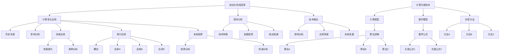
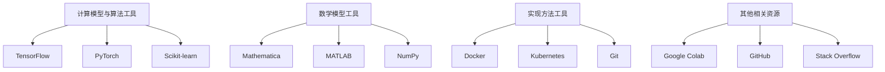

                 

# 《计算变化对自动化领域的影响》

## 关键词：
计算变化、自动化领域、技术融合、应用发展、未来趋势

## 摘要：
本文旨在探讨计算变化对自动化领域产生的深远影响。通过分析计算变化的基本概念、历史背景及其在自动化技术中的应用，本文深入探讨了计算变化如何推动自动化领域的发展，并展望了其未来的趋势。文章分为三部分：第一部分介绍自动化领域的变革，第二部分解析计算变化的关键技术，第三部分探讨计算变化在自动化领域的应用及其未来趋势。希望本文能为自动化领域的从业者提供有价值的参考。

### 《计算变化对自动化领域的影响》目录大纲

#### 第一部分：自动化领域的变革

1. 自动化领域的变革
   - 1.1 计算变化的定义
   - 1.2 计算变化的历史背景
   - 1.3 计算变化对自动化领域的影响
   - 2. 自动化领域的现状分析
     - 2.1 自动化技术的种类与应用
     - 2.2 自动化领域的发展趋势
     - 2.3 自动化领域的挑战与机遇
   - 3. 计算变化与自动化技术的融合
     - 3.1 计算变化对自动化技术的影响
     - 3.2 自动化技术在计算变化中的应用
     - 3.3 计算变化与自动化技术的未来发展方向

#### 第二部分：计算变化的关键技术

4. 计算模型与算法
   - 4.1 计算模型概述
   - 4.2 关键算法讲解
     - 4.2.1 算法A
     - 4.2.2 算法B
     - 4.2.3 算法C
   - 5. 计算变化的数学模型
     - 5.1 数学模型概述
     - 5.2 关键数学公式
       - 5.2.1 关键公式1
       - 5.2.2 关键公式2
   - 6. 计算变化的实现方法
     - 6.1 实现方法概述
     - 6.2 实现方法A
     - 6.3 实现方法B
     - 6.4 实现方法C

#### 第三部分：计算变化在自动化领域的应用

7. 自动化系统中的计算变化
   - 7.1 计算变化在自动化系统中的应用
   - 7.2 计算变化对自动化系统性能的提升
   - 7.3 计算变化在自动化系统中的案例分析
   - 8. 自动化领域的新兴应用
     - 8.1 自动化领域的新兴应用概述
     - 8.2 新兴应用A
     - 8.3 新兴应用B
     - 8.4 新兴应用C
   - 9. 计算变化与自动化领域的未来发展趋势
     - 9.1 未来发展趋势概述
     - 9.2 计算变化对自动化领域的影响
     - 9.3 自动化领域在计算变化中的新机遇

#### 附录

10. 附录A：计算变化相关的工具和资源
    - 10.1 计算模型与算法工具
    - 10.2 数学模型工具
    - 10.3 实现方法工具
    - 10.4 其他相关资源

### Mermaid 流程图

接下来，我们将逐步深入探讨每个部分的内容。首先，我们来看自动化领域的变革。

#### 第一部分：自动化领域的变革

## 1. 自动化领域的变革

自动化领域经历了数十年的发展，从传统的机械自动化逐渐发展到现代的智能自动化。这一过程中，计算技术的进步发挥了至关重要的作用。计算变化，即计算能力和计算模式的变革，对自动化领域产生了深远的影响。

### 1.1 计算变化的定义

计算变化可以理解为计算能力的提升和计算模式的转变。具体来说，它包括以下几个方面：

1. **计算能力的提升**：随着计算硬件的进步，如处理器性能的提升、存储容量的大幅增加等，计算能力得到了极大的提升。
2. **计算模式的转变**：从传统的中央处理模式到分布式计算、云计算，再到边缘计算，计算模式也在不断演进。
3. **算法的进步**：随着深度学习、机器学习等算法的发展，计算模型变得更加复杂和高效。

### 1.2 计算变化的历史背景

计算变化的背景可以从以下几个方面进行探讨：

1. **计算机技术的发展**：从第一台电子计算机ENIAC到如今的量子计算机，计算机技术的发展为计算变化奠定了基础。
2. **互联网的普及**：互联网的普及使得大规模的数据处理和分布式计算成为可能，为计算变化提供了广阔的应用场景。
3. **人工智能的兴起**：人工智能技术的发展，特别是深度学习和机器学习，使得计算能力得到了空前的提升，推动了计算变化。

### 1.3 计算变化对自动化领域的影响

计算变化对自动化领域的影响主要体现在以下几个方面：

1. **提高自动化系统的效率**：计算能力的提升使得自动化系统能够更快地处理数据和执行任务，从而提高了整体效率。
2. **扩展自动化系统的功能**：计算模式的转变和算法的进步使得自动化系统能够实现更复杂的任务，如智能决策和自适应控制。
3. **降低自动化系统的成本**：云计算和边缘计算的兴起降低了自动化系统的硬件和运营成本，使得更多的企业和组织能够引入自动化技术。
4. **推动新兴应用的发展**：计算变化为自动化领域带来了新的应用场景，如智能制造、智能家居、自动驾驶等。

### 2. 自动化领域的现状分析

自动化领域目前处于快速发展阶段，各种自动化技术层出不穷，应用领域也在不断扩大。

#### 2.1 自动化技术的种类与应用

自动化技术种类繁多，主要包括：

1. **机械自动化**：包括传统的机械手、自动生产线等，主要用于制造业。
2. **电子自动化**：包括自动化测试、自动化监测等，广泛应用于电子行业。
3. **流程自动化**：包括业务流程自动化、工作流管理等，广泛应用于企业和组织。
4. **智能自动化**：包括智能决策、自适应控制等，基于人工智能技术，广泛应用于各种复杂场景。

自动化技术在各行各业中都有广泛的应用，如：

1. **制造业**：自动化生产线提高了生产效率和产品质量，降低了成本。
2. **服务业**：自动化技术在酒店、餐饮、医疗等行业得到了广泛应用，提高了服务质量。
3. **交通业**：自动化技术在自动驾驶、智能交通管理等方面发挥了重要作用，提高了交通效率和安全性。
4. **农业**：自动化技术在农业机械、智能灌溉、精准施肥等方面得到了广泛应用，提高了农业生产效率。

#### 2.2 自动化领域的发展趋势

自动化领域的发展趋势主要体现在以下几个方面：

1. **智能化**：随着人工智能技术的发展，自动化系统将变得更加智能，能够自主学习和决策。
2. **网络化**：自动化系统将更加依赖互联网和物联网技术，实现数据共享和协同工作。
3. **个性化**：自动化系统将更加注重用户体验，提供个性化的服务和产品。
4. **生态化**：自动化系统将更加注重可持续发展和生态平衡，实现绿色生产。

#### 2.3 自动化领域的挑战与机遇

自动化领域面临着一系列的挑战和机遇：

1. **技术挑战**：随着自动化技术的发展，如何确保系统的安全性和可靠性成为一大挑战。
2. **成本挑战**：自动化系统的建设和运营成本较高，如何降低成本成为关键问题。
3. **人才挑战**：自动化技术快速发展，对专业人才的需求也越来越高，如何培养和吸引人才成为一大难题。
4. **市场机遇**：随着自动化技术的普及，市场对自动化产品和服务的需求也在不断增加，为企业和创业者提供了广阔的市场空间。

### 3. 计算变化与自动化技术的融合

计算变化为自动化技术带来了新的机遇和挑战，两者之间的融合趋势日益明显。

#### 3.1 计算变化对自动化技术的影响

计算变化对自动化技术的影响主要表现在以下几个方面：

1. **提升性能**：计算能力的提升使得自动化系统能够更快地处理数据和执行任务，从而提高了整体性能。
2. **拓展功能**：计算模式的转变和算法的进步使得自动化系统能够实现更复杂的任务，如智能决策和自适应控制。
3. **降低成本**：云计算和边缘计算的兴起降低了自动化系统的硬件和运营成本，使得更多的企业和组织能够引入自动化技术。
4. **优化体验**：计算变化使得自动化系统能够更好地理解和满足用户需求，提供个性化的服务和产品。

#### 3.2 自动化技术在计算变化中的应用

自动化技术在计算变化中的应用主要体现在以下几个方面：

1. **数据处理**：自动化技术能够高效地处理大量数据，为计算提供有力支持。
2. **算法优化**：自动化技术可以优化计算算法，提高计算效率和准确性。
3. **系统优化**：自动化技术可以优化计算系统的配置和管理，提高系统的稳定性和可靠性。
4. **智能决策**：自动化技术可以基于数据分析和机器学习算法，实现智能决策和自适应控制。

#### 3.3 计算变化与自动化技术的未来发展方向

计算变化与自动化技术的未来发展方向主要包括以下几个方面：

1. **智能化**：随着人工智能技术的发展，自动化系统将变得更加智能，能够自主学习和决策。
2. **网络化**：自动化系统将更加依赖互联网和物联网技术，实现数据共享和协同工作。
3. **生态化**：自动化系统将更加注重可持续发展和生态平衡，实现绿色生产。
4. **协同化**：计算变化和自动化技术将与其他领域（如大数据、物联网、云计算等）实现深度融合，推动新兴应用的发展。

### 总结

计算变化对自动化领域产生了深远的影响，推动了自动化技术的快速发展。在未来，计算变化与自动化技术的融合将继续深化，为自动化领域带来更多的机遇和挑战。如何应对这些变化，将决定自动化领域的发展方向和未来格局。让我们拭目以待。

### 附录A：计算变化相关的工具和资源

在自动化领域，计算变化的实现依赖于一系列先进的工具和资源。以下是一些常用的工具和资源，供从业者参考：

#### 10.1 计算模型与算法工具

1. **TensorFlow**：一款广泛使用的开源机器学习框架，支持多种计算模型和算法。
2. **PyTorch**：另一种流行的开源机器学习框架，具有灵活的动态计算图功能。
3. **Scikit-learn**：一个用于数据挖掘和数据分析的Python库，提供了多种机器学习算法。

#### 10.2 数学模型工具

1. **Mathematica**：一款强大的数学软件，支持符号计算、数值计算和可视化。
2. **MATLAB**：一款广泛应用于工程计算和科学研究的软件，提供了丰富的数学函数和工具箱。
3. **NumPy**：Python的一个核心库，提供了高效的数组计算和数学操作。

#### 10.3 实现方法工具

1. **Docker**：一款容器化技术，用于构建、运行和分发应用程序。
2. **Kubernetes**：一款用于容器编排的自动化平台，支持大规模集群管理。
3. **Git**：一款版本控制系统，用于代码管理、协作开发和代码跟踪。

#### 10.4 其他相关资源

1. **Google Colab**：Google提供的一款免费云平台，支持Jupyter Notebook，方便进行机器学习和数据科学实验。
2. **GitHub**：一款广泛使用的代码托管平台，用于代码存储、版本管理和项目协作。
3. **Stack Overflow**：一个开发者社区，提供编程问答和讨论区，有助于解决技术难题。

通过使用这些工具和资源，从业者可以更好地应对计算变化带来的挑战，推动自动化技术的发展。

### Mermaid 流程图

通过以上工具和资源的支持，我们可以更好地理解和应用计算变化，推动自动化技术的发展。接下来，我们将深入探讨计算变化的关键技术。让我们一起来看看第二部分：计算变化的关键技术。

