                 

# 计算变化对自动化领域的影响

> **关键词**：自动化、计算变化、性能提升、可靠性、成本影响、传感器技术、执行器技术、控制系统技术、数据处理与分析、网络通信与协同

> **摘要**：本文将深入探讨计算变化对自动化领域的影响。通过分析计算技术在传感器、执行器、控制系统、数据处理与分析以及网络通信与协同等方面的应用，本文揭示了计算变化在提升自动化系统性能、可靠性和降低成本方面的作用。同时，本文还通过实际应用案例，展示了计算变化在智能制造、物流与仓储以及环境监测与治理等领域的广泛应用。通过本文的探讨，我们期望为自动化领域的从业者提供有价值的参考和启示。

## 目录大纲

### 第一部分：自动化领域的计算变化概述

#### 第1章：自动化领域的发展与计算变化

1.1 自动化领域的历史与发展

1.2 计算技术在自动化领域的重要性

1.3 计算变化对自动化领域的推动作用

#### 第2章：计算变化对自动化系统的影响

2.1 计算变化对自动化系统性能的影响

2.2 计算变化对自动化系统可靠性的影响

2.3 计算变化对自动化系统成本的影响

### 第二部分：计算变化对自动化系统各环节的影响

#### 第3章：传感器技术中的计算变化

3.1 计算变化对传感器性能的提升

3.2 数据处理算法对传感器性能的影响

3.3 嵌入式计算在传感器中的应用

#### 第4章：执行器技术中的计算变化

4.1 计算变化对执行器性能的影响

4.2 计算变化对执行器控制策略的影响

4.3 嵌入式计算在执行器中的应用

#### 第5章：控制系统中的计算变化

5.1 计算变化对控制算法的影响

5.2 计算变化对控制系统稳定性和响应速度的影响

5.3 嵌入式计算在控制系统中的应用

#### 第6章：数据处理与分析中的计算变化

6.1 计算技术对数据处理和分析效率的提升

6.2 数据处理算法对自动化系统性能的影响

6.3 嵌入式计算在数据处理与分析中的应用

#### 第7章：网络通信与协同中的计算变化

7.1 计算变化对网络通信效率的影响

7.2 协同控制技术在自动化系统中的应用

7.3 嵌入式计算在网络通信与协同中的应用

### 第三部分：计算变化在自动化领域的应用案例

#### 第8章：自动化领域的计算变化应用案例

8.1 智能制造中的计算变化应用

8.2 物流与仓储中的计算变化应用

8.3 环境监测与治理中的计算变化应用

### 附录

附录A：计算变化相关的技术资源与工具

#### 附录A.1：计算变化相关的传感器技术资源

#### 附录A.2：计算变化相关的执行器技术资源

#### 附录A.3：计算变化相关的控制系统技术资源

#### 附录A.4：计算变化相关的数据处理与分析技术资源

#### 附录A.5：计算变化相关的网络通信与协同技术资源

## 第1章：自动化领域的发展与计算变化

### 1.1 自动化领域的历史与发展

自动化领域的起源可以追溯到18世纪末的工业革命时期，当时以蒸汽机为代表的机械化生产逐渐取代了传统的手工生产。随着技术的不断进步，自动化领域经历了多个发展阶段，从早期的机械自动化到电气自动化，再到现在的数字化、智能化自动化。

在20世纪60年代，随着计算机技术的快速发展，自动化领域迎来了新的发展机遇。计算机的应用使得自动化系统能够实现更高的精度、更快的响应速度和更复杂的控制策略。计算机技术的发展不仅提高了自动化系统的性能，还为自动化领域的创新提供了新的动力。

进入21世纪，随着物联网、大数据、人工智能等新兴技术的快速发展，自动化领域再次迎来了新的变革。物联网技术使得自动化系统可以实现实时数据采集和远程控制，大数据技术使得自动化系统能够从海量数据中挖掘出有价值的信息，人工智能技术则使得自动化系统能够实现自我学习和优化。

### 1.2 计算技术在自动化领域的重要性

计算技术在自动化领域的重要性主要体现在以下几个方面：

1. 提高性能：计算技术可以提升自动化系统的性能，包括提高传感器精度、加快执行器响应速度、优化控制算法等。通过计算技术，自动化系统可以实现更高的工作效率和更精准的控制。

2. 提高可靠性：计算技术可以提高自动化系统的可靠性，通过实时计算和故障诊断，自动化系统可以及时发现并解决潜在问题，从而降低系统故障率和停机时间。

3. 降低成本：计算技术可以帮助自动化系统降低成本，通过优化控制算法、提高传感器性能、减少硬件成本等方式，自动化系统可以实现更高的性价比。

4. 促进创新：计算技术为自动化领域的创新提供了新的可能性，通过计算技术，自动化系统可以实现更复杂的功能和更智能的控制策略，从而推动自动化领域的不断进步。

### 1.3 计算变化对自动化领域的推动作用

计算变化对自动化领域的推动作用主要体现在以下几个方面：

1. 智能化：计算变化使得自动化系统可以实现更高的智能化水平，通过人工智能技术，自动化系统可以自主学习、优化控制策略，实现更加智能化的操作。

2. 网络化：计算变化推动了自动化系统的网络化发展，通过物联网技术，自动化系统可以实现实时数据采集和远程控制，提高系统的协同效率和智能化水平。

3. 数字化：计算变化使得自动化系统的数据采集和处理更加数字化，通过大数据技术，自动化系统可以更好地挖掘数据价值，实现更加精细化的管理和优化。

4. 自动化：计算变化推动了自动化系统的自动化水平提升，通过计算技术，自动化系统可以实现更复杂、更智能的自动化操作，提高系统的自动化程度和效率。

综上所述，计算变化对自动化领域的影响深远且广泛，它不仅提升了自动化系统的性能和可靠性，还为自动化领域的创新和发展提供了新的动力。随着计算技术的不断进步，自动化领域将继续朝着更加智能化、网络化、数字化的方向发展。

### 1.4 本章总结

本章回顾了自动化领域的历史与发展，分析了计算技术在自动化领域的重要性，并探讨了计算变化对自动化领域的推动作用。通过本章的学习，读者可以了解到计算技术如何提升自动化系统的性能、可靠性和降低成本，以及计算变化如何推动自动化领域的智能化、网络化、数字化和自动化发展。接下来，我们将进一步探讨计算变化在自动化系统各环节的具体影响。

## 第2章：计算变化对自动化系统的影响

### 2.1 计算变化对自动化系统性能的影响

计算变化对自动化系统性能的提升主要体现在以下几个方面：

1. **传感器性能提升**：计算技术可以显著提高传感器的性能。例如，通过先进的信号处理算法和嵌入式计算，传感器能够更准确地采集数据。例如，图像处理算法可以提高摄像头传感器的分辨率，从而捕捉到更多的细节信息；而深度传感器可以通过计算分析来消除噪声，提高测距精度。

   **核心概念与联系**： 
   - **传感器性能**：指的是传感器对被测量的物理量的响应能力，包括灵敏度、精度、分辨率等。
   - **计算变化**：指的是在传感器中引入计算能力，如使用FPGA或ASIC进行实时数据处理。

   **Mermaid流程图**：
   ```mermaid
   graph TD
   A[原始信号] --> B[信号预处理]
   B --> C[信号处理算法]
   C --> D[计算增强信号]
   D --> E[输出结果]
   ```

2. **执行器性能提升**：计算技术还可以提高执行器的性能。例如，通过实时计算和优化算法，执行器可以实现更快速的响应和更高的精度。例如，伺服电机可以通过PID控制算法实现更精确的位置控制，而电动执行器可以通过优化控制策略来提高工作效率。

   **核心算法原理讲解**：
   - **PID控制算法**：
     ```latex
     u(t) = K_p e(t) + K_i \int_{0}^{t} e(\tau)d\tau + K_d \frac{de(t)}{dt}
     ```
     其中，\( u(t) \) 是控制信号，\( e(t) \) 是误差信号，\( K_p \)、\( K_i \)、\( K_d \) 分别是比例、积分、微分系数。

   **伪代码**：
   ```python
   def pid_control(setpoint, feedback, Kp, Ki, Kd):
       error = setpoint - feedback
       delta_error = error - previous_error
       u = Kp * error + Ki * integral_error + Kd * delta_error
       previous_error = error
       integral_error += error
       return u
   ```

3. **控制系统性能提升**：计算技术可以提高控制系统的性能，包括稳定性和响应速度。例如，通过实时计算和优化算法，控制器可以实现更快速的决策和调整。例如，在飞行控制系统中，通过计算传感器数据和优化控制策略，飞机可以实现更稳定、更灵活的飞行。

   **核心概念与联系**：
   - **控制系统性能**：指的是控制系统在稳定性和响应速度等方面的表现。
   - **计算变化**：指的是在控制系统中引入计算能力，如使用FPGA或ASIC进行实时数据处理。

   **Mermaid流程图**：
   ```mermaid
   graph TD
   A[传感器数据] --> B[数据处理]
   B --> C[控制算法]
   C --> D[控制决策]
   D --> E[执行器控制]
   ```

### 2.2 计算变化对自动化系统可靠性的影响

计算变化不仅提升了自动化系统的性能，还对其可靠性产生了积极影响：

1. **故障检测与诊断**：计算技术可以实现实时故障检测和诊断，从而提高系统的可靠性。例如，通过机器学习算法和实时数据监控，系统可以提前发现潜在的故障信号，从而进行预防性维护，减少系统停机时间。

   **核心算法原理讲解**：
   - **机器学习算法**：
     ```latex
     y = f(x; \theta)
     ```
     其中，\( y \) 是输出，\( x \) 是输入，\( \theta \) 是模型参数。

   **伪代码**：
   ```python
   def fault_detection(data, model):
       prediction = model.predict(data)
       if prediction == 'fault':
           return 'fault_detected'
       else:
           return 'no_fault'
   ```

2. **自适应控制**：计算技术可以实现自适应控制，从而提高系统的鲁棒性和可靠性。例如，在温度控制系统中，通过实时计算和自适应算法，系统可以自动调整加热或冷却功率，以适应环境变化，从而保持恒定的温度。

   **核心概念与联系**：
   - **自适应控制**：指的是系统能够根据环境变化自动调整控制策略。
   - **计算变化**：指的是在控制系统中引入计算能力，如使用嵌入式计算进行实时控制。

   **Mermaid流程图**：
   ```mermaid
   graph TD
   A[环境变化] --> B[实时计算]
   B --> C[自适应调整]
   C --> D[系统控制]
   ```

3. **冗余设计**：计算技术可以实现冗余设计，从而提高系统的可靠性。例如，在关键任务系统中，通过引入冗余计算单元，系统可以在主计算单元发生故障时自动切换到备用计算单元，从而确保系统正常运行。

   **核心概念与联系**：
   - **冗余设计**：指的是在系统中引入冗余部件，以提高系统的可靠性。
   - **计算变化**：指的是在系统中引入冗余计算单元，如使用FPGA或ASIC进行冗余计算。

   **Mermaid流程图**：
   ```mermaid
   graph TD
   A[主计算单元] --> B[冗余计算单元]
   B --> C[实时数据监控]
   C --> D[系统控制]
   ```

### 2.3 计算变化对自动化系统成本的影响

计算变化在提升自动化系统性能和可靠性的同时，也对成本产生了显著影响：

1. **硬件成本降低**：随着计算技术的发展，高性能计算硬件的成本逐渐降低。例如，GPU和FPGA等硬件的普及使得实时计算变得更加经济可行，从而降低了自动化系统的硬件成本。

   **核心概念与联系**：
   - **硬件成本**：指的是用于购买和部署计算硬件的费用。
   - **计算变化**：指的是引入高性能计算硬件，如GPU和FPGA，以提升系统性能。

   **Mermaid流程图**：
   ```mermaid
   graph TD
   A[传统硬件] --> B[高性能硬件]
   B --> C[成本降低]
   ```

2. **软件成本降低**：随着开源软件和云计算平台的普及，自动化系统的软件开发和部署成本也显著降低。例如，使用开源的机器学习框架和云计算服务，企业可以更加高效地开发和部署自动化系统，从而降低软件成本。

   **核心概念与联系**：
   - **软件成本**：指的是用于购买和开发软件的费用。
   - **计算变化**：指的是使用开源软件和云计算平台，以降低软件成本。

   **Mermaid流程图**：
   ```mermaid
   graph TD
   A[商业软件] --> B[开源软件]
   B --> C[云计算服务]
   C --> D[成本降低]
   ```

3. **运营成本降低**：计算变化还可以通过提高系统性能和可靠性来降低运营成本。例如，通过实时计算和故障诊断，自动化系统可以减少故障率和停机时间，从而降低运营成本。

   **核心概念与联系**：
   - **运营成本**：指的是系统运行和维运的费用。
   - **计算变化**：指的是通过实时计算和故障诊断，提高系统性能和可靠性。

   **Mermaid流程图**：
   ```mermaid
   graph TD
   A[传统系统] --> B[实时计算]
   B --> C[故障诊断]
   C --> D[运营成本降低]
   ```

### 2.4 本章总结

本章详细探讨了计算变化对自动化系统性能、可靠性和成本的影响。通过计算技术的应用，自动化系统在性能和可靠性方面得到了显著提升，同时成本也得到了有效控制。接下来，我们将进一步探讨计算变化在自动化系统的各个环节中的具体应用。

## 第3章：传感器技术中的计算变化

### 3.1 高精度传感器的计算需求

在自动化系统中，传感器是获取外部环境信息的重要设备，其精度直接影响到系统的整体性能。随着自动化系统对环境信息需求越来越高，高精度传感器逐渐成为主流选择。然而，高精度传感器的数据处理需求也随之增加，计算变化成为实现高精度传感器功能的关键。

#### 3.1.1 高精度传感器的工作原理

高精度传感器通常基于物理、化学或生物原理，通过检测特定物理量的变化来获取环境信息。例如，高精度加速度传感器利用电容或压阻效应来测量加速度，高精度温度传感器则通过热电偶或热敏电阻来测量温度。

**核心概念与联系**：
- **传感器原理**：指的是传感器如何基于物理、化学或生物原理检测物理量。
- **计算需求**：指的是传感器在数据处理过程中对计算能力的需求。

**Mermaid流程图**：
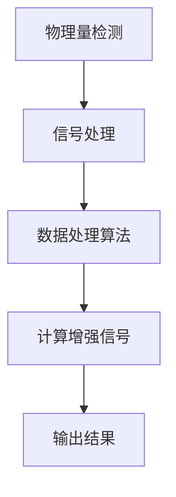

#### 3.1.2 高精度传感器的计算挑战

高精度传感器在数据处理过程中面临多个计算挑战：

1. **信号处理复杂度**：高精度传感器的输出信号通常包含大量噪声和干扰，需要复杂的信号处理算法来提取有用信息。

2. **数据处理速度**：高精度传感器需要实时处理大量数据，以支持快速响应和控制。

3. **计算资源限制**：传感器通常体积小、功耗低，计算资源有限，需要高效计算算法和硬件来满足计算需求。

**核心概念与联系**：
- **信号处理复杂度**：指的是数据处理算法的复杂度和计算量。
- **数据处理速度**：指的是传感器对数据的处理速度。
- **计算资源限制**：指的是传感器在计算资源上的限制。

**Mermaid流程图**：
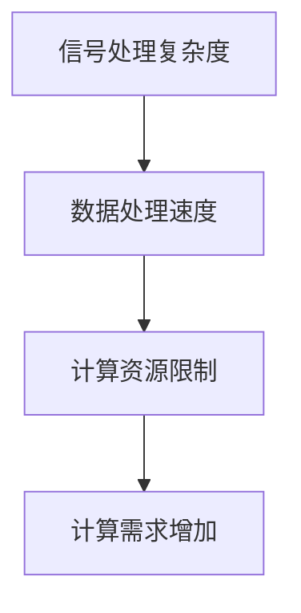

#### 3.1.3 高精度传感器的计算解决方案

为了应对高精度传感器的计算挑战，计算技术提供了多种解决方案：

1. **嵌入式计算**：通过在传感器中集成嵌入式计算单元，如FPGA或ASIC，可以显著提高数据处理速度和复杂度。

2. **实时计算**：采用实时操作系统（RTOS）和高效的计算算法，确保传感器能够快速处理数据，并实时响应。

3. **分布式计算**：通过将计算任务分布到多个传感器节点，可以减轻单个节点的计算压力，提高整体计算效率。

**核心概念与联系**：
- **嵌入式计算**：指的是在传感器中集成计算单元，以提高数据处理能力。
- **实时计算**：指的是在规定时间内完成计算任务，以满足实时性要求。
- **分布式计算**：指的是将计算任务分布到多个节点，以提高计算效率和容错能力。

**Mermaid流程图**：
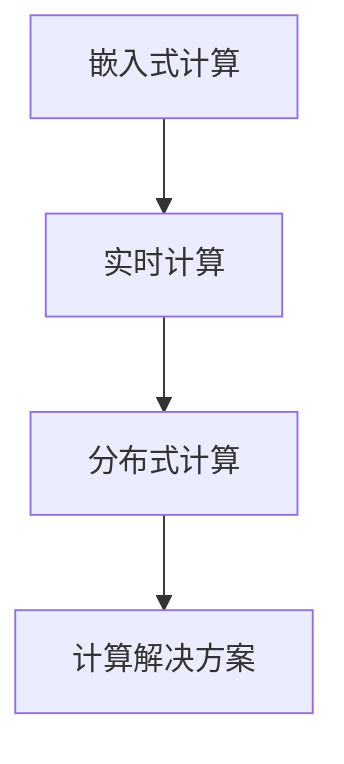

### 3.2 数据处理算法对传感器性能的影响

传感器性能的提升不仅依赖于硬件设备的改进，还依赖于数据处理算法的优化。高效的计算算法可以显著提高传感器的精度和可靠性。

#### 3.2.1 数据预处理算法

数据预处理是传感器数据处理的重要步骤，它包括去噪、滤波、归一化等操作。有效的预处理算法可以消除噪声和干扰，提高传感器的数据质量。

1. **噪声过滤算法**：例如，卡尔曼滤波器可以有效去除传感器输出中的随机噪声，提高数据稳定性。

2. **数据插值算法**：在数据缺失或稀疏时，插值算法可以补充缺失数据，提高数据的完整性。

3. **数据归一化算法**：通过对数据进行归一化处理，可以将不同量级的信号统一到一个标准范围内，便于后续处理和分析。

**核心算法原理讲解**：
- **卡尔曼滤波器**：
  ```latex
  x_{k|k-1} = A x_{k-1|k-1} + B u_k
  P_{k|k-1} = A P_{k-1|k-1} A^T + Q
  K_k = P_{k|k-1} H_k^T (H_k P_{k|k-1} H_k^T + R)^{-1}
  y_k = H_k x_{k|k-1} + v_k
  x_{k|k} = x_{k|k-1} + K_k (y_k - H_k x_{k|k-1})
  P_{k|k} = (I - K_k H_k) P_{k|k-1}
  ```
  其中，\( x_k \) 是状态向量，\( P_k \) 是状态协方差矩阵，\( A \) 是状态转移矩阵，\( B \) 是控制输入矩阵，\( H_k \) 是观测矩阵，\( K_k \) 是卡尔曼增益，\( Q \) 是过程噪声协方差矩阵，\( R \) 是观测噪声协方差矩阵，\( u_k \) 是控制输入，\( y_k \) 是观测值，\( v_k \) 是观测噪声。

**伪代码**：
```python
def kalman_filter(x_previous, P_previous, u, y, Q, R):
    x = A * x_previous + B * u
    P = A * P_previous * A.T + Q
    K = P * H.T / (H * P * H.T + R)
    x = x + K * (y - H * x)
    P = (I - K * H) * P
    return x, P
```

2. **数据插值算法**：例如，线性插值和样条插值可以用于补充缺失数据。

3. **数据归一化算法**：例如，最小-最大归一化可以将数据映射到[0, 1]范围内。

**伪代码**：
```python
def min_max_normalization(data):
    min_value = min(data)
    max_value = max(data)
    normalized_data = (data - min_value) / (max_value - min_value)
    return normalized_data
```

**核心概念与联系**：
- **噪声过滤算法**：用于去除传感器输出中的噪声。
- **数据插值算法**：用于补充缺失数据。
- **数据归一化算法**：用于将不同量级的信号统一到标准范围内。

**Mermaid流程图**：
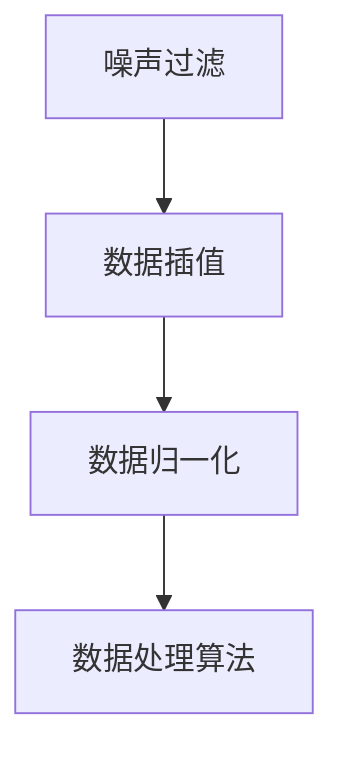

#### 3.2.2 特征提取算法

特征提取是从传感器数据中提取有代表性的信息，用于后续的数据分析和决策。有效的特征提取算法可以显著提高传感器的性能。

1. **时域特征提取算法**：例如，傅里叶变换和小波变换可以用于提取信号的频率和时域特征。

2. **频域特征提取算法**：例如，频谱分析可以用于提取信号的频率特征。

3. **空间特征提取算法**：例如，主成分分析（PCA）和自编码器可以用于提取数据的空间特征。

**核心算法原理讲解**：
- **傅里叶变换**：
  ```latex
  X(f) = \int_{-\infty}^{\infty} x(t) e^{-j 2 \pi ft} dt
  ```
  其中，\( X(f) \) 是频域信号，\( x(t) \) 是时域信号，\( f \) 是频率。

**伪代码**：
```python
def fourier_transform(signal):
    N = len(signal)
    result = np.fft.fft(signal)
    return result / N
```

- **主成分分析（PCA）**：
  ```latex
  \text{ eigenvectors of } \Sigma = \text{ eigenvectors of } (X^T X)
  \text{ eigenvalues of } \Sigma = \text{ eigenvalues of } (X^T X)
  \text{ Principal components } = X \text{ eigenvectors of } (X^T X)
  ```
  其中，\( X \) 是数据矩阵，\( \Sigma \) 是协方差矩阵，\( \text{ eigenvectors } \) 和 \( \text{ eigenvalues } \) 分别是特征向量和特征值。

**伪代码**：
```python
def pca(X):
    cov_matrix = np.cov(X.T)
    eigenvalues, eigenvectors = np.linalg.eigh(cov_matrix)
    return eigenvectors[:, :num_components]
```

**核心概念与联系**：
- **时域特征提取算法**：用于提取信号的时域特征。
- **频域特征提取算法**：用于提取信号的频域特征。
- **空间特征提取算法**：用于提取数据的空间特征。

**Mermaid流程图**：
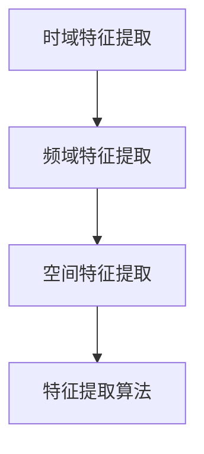

#### 3.2.3 模型训练算法

模型训练是将传感器数据用于训练机器学习模型，以提高传感器的预测和分类能力。有效的模型训练算法可以显著提升传感器的性能。

1. **监督学习算法**：例如，支持向量机（SVM）和决策树可以用于分类任务。

2. **无监督学习算法**：例如，聚类算法和主成分分析（PCA）可以用于数据降维和聚类。

3. **半监督学习算法**：例如，自编码器可以用于利用未标记数据提升模型性能。

**核心算法原理讲解**：
- **支持向量机（SVM）**：
  ```latex
  \text{Minimize } \frac{1}{2} ||w||^2 \\
  \text{subject to } y^T(w^T x + b) \geq 1
  ```
  其中，\( w \) 是权重向量，\( x \) 是特征向量，\( b \) 是偏置项，\( y \) 是标签。

**伪代码**：
```python
def svm(X, y):
    # Solve the optimization problem using a solver like CVXOPT or scipy.optimize
    w, b = solve_optimization_problem()
    return w, b
```

- **自编码器**：
  ```latex
  z = \sigma(W_2 \cdot \text{激活}(W_1 \cdot x + b_1)) \\
  x' = W_2 \cdot z + b_2
  ```
  其中，\( \sigma \) 是激活函数，\( W_1 \) 和 \( W_2 \) 是权重矩阵，\( b_1 \) 和 \( b_2 \) 是偏置项。

**伪代码**：
```python
def autoencoder(X, W1, W2, b1, b2, activation='sigmoid'):
    z = activation(W2.dot(activation(W1.dot(X) + b1)))
    x_prime = W2.dot(z) + b2
    return x_prime
```

**核心概念与联系**：
- **监督学习算法**：用于有标记数据的分类和回归任务。
- **无监督学习算法**：用于无标记数据的聚类和降维任务。
- **半监督学习算法**：用于利用未标记数据的分类和回归任务。

**Mermaid流程图**：
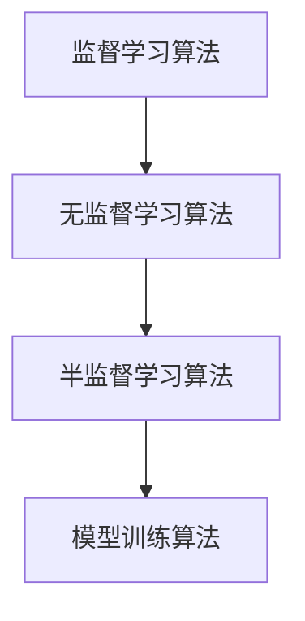

### 3.3 嵌入式计算在传感器中的应用

嵌入式计算在传感器中的应用大大提高了传感器的数据处理能力和实时性。通过在传感器中集成嵌入式计算单元，可以实现复杂的信号处理和机器学习算法，从而提升传感器的性能。

#### 3.3.1 嵌入式计算技术概述

嵌入式计算技术包括嵌入式处理器、FPGA、ASIC等。这些技术可以根据传感器的具体需求进行定制，以实现高效的信号处理和数据处理。

1. **嵌入式处理器**：如ARM Cortex-M系列，适合进行复杂的计算任务，但功耗较高。

2. **FPGA**：可编程逻辑器件，适合进行实时数据处理和并行计算，但设计复杂度较高。

3. **ASIC**：专用集成电路，适合进行特定的计算任务，但开发成本较高。

**核心概念与联系**：
- **嵌入式处理器**：用于进行复杂计算任务。
- **FPGA**：用于实时数据处理和并行计算。
- **ASIC**：用于特定计算任务。

**Mermaid流程图**：
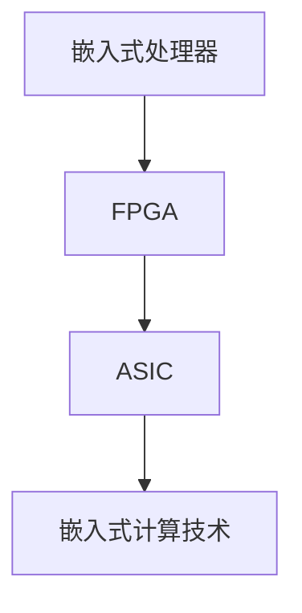

#### 3.3.2 嵌入式计算在传感器数据处理中的应用

嵌入式计算在传感器数据处理中的应用主要包括以下几个方面：

1. **实时信号处理**：通过嵌入式计算单元，传感器可以实现实时信号处理，如去噪、滤波和特征提取，从而提高数据处理速度和精度。

2. **机器学习算法**：通过嵌入式计算单元，传感器可以实现本地机器学习，如分类和预测，从而提高传感器的智能化水平。

3. **数据融合**：通过嵌入式计算单元，传感器可以实现多传感器数据融合，从而提高系统的感知能力。

**核心概念与联系**：
- **实时信号处理**：指的是在传感器本地进行实时数据处理。
- **机器学习算法**：指的是在传感器本地进行机器学习任务。
- **数据融合**：指的是将多个传感器数据融合为一个整体。

**Mermaid流程图**：
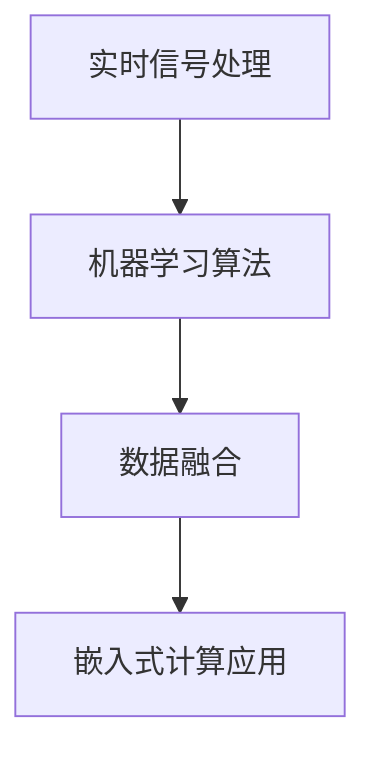

#### 3.3.3 嵌入式计算在传感器自校准中的应用

嵌入式计算还可以用于传感器的自校准，从而提高传感器的精度和可靠性。通过在传感器中集成嵌入式计算单元，可以实现以下功能：

1. **在线校准**：通过实时监测传感器输出，传感器可以自动调整校准参数，从而保持高精度。

2. **自诊断**：通过实时计算，传感器可以自动检测和诊断潜在故障，从而提高系统的鲁棒性。

**核心概念与联系**：
- **在线校准**：指的是传感器在运行过程中自动调整校准参数。
- **自诊断**：指的是传感器自动检测和诊断潜在故障。

**Mermaid流程图**：
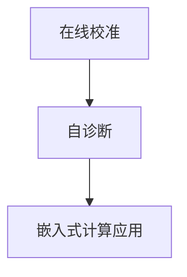

### 3.4 本章总结

本章详细探讨了传感器技术中的计算变化，包括高精度传感器的计算需求、数据处理算法对传感器性能的影响、嵌入式计算在传感器中的应用以及传感器自校准。通过计算技术的应用，传感器在性能、精度和可靠性方面得到了显著提升。接下来，我们将继续探讨计算变化对执行器技术的影响。

## 第4章：执行器技术中的计算变化

### 4.1 计算技术在执行器控制中的应用

执行器是自动化系统中实现物理动作的核心组件，其性能直接影响到整个系统的效率和精度。随着计算技术的不断发展，计算技术在执行器控制中的应用越来越广泛，显著提升了执行器的性能和智能化水平。

#### 4.1.1 执行器的工作原理

执行器通常由驱动电路、机械部件和控制电路组成。其工作原理是根据接收到的控制信号，通过驱动电路将电能转换为机械能，以实现预期的动作。常见的执行器包括电动机、液压执行器和气动执行器等。

**核心概念与联系**：
- **执行器**：实现物理动作的装置。
- **控制信号**：用于驱动执行器动作的信号。

**Mermaid流程图**：
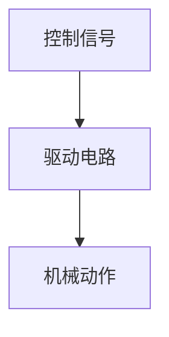

#### 4.1.2 执行器控制的计算挑战

计算技术在执行器控制中的应用面临着多个挑战：

1. **实时性要求**：执行器需要快速响应控制信号，以实现精确的动作控制。这要求控制算法和计算硬件能够满足实时性要求。

2. **精度要求**：执行器需要实现高精度的动作控制，以满足复杂任务的精度要求。这要求控制算法能够处理高精度传感器数据，并实时调整执行器的动作。

3. **计算资源限制**：执行器通常体积小、功耗低，计算资源有限，需要高效计算算法和硬件来满足计算需求。

**核心概念与联系**：
- **实时性要求**：指的是系统对响应速度的要求。
- **精度要求**：指的是系统对控制精度的要求。
- **计算资源限制**：指的是系统在计算资源上的限制。

**Mermaid流程图**：
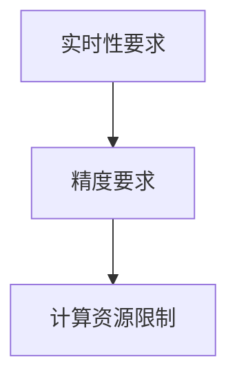

#### 4.1.3 执行器控制的计算解决方案

为了应对执行器控制的计算挑战，计算技术提供了多种解决方案：

1. **嵌入式计算**：通过在执行器中集成嵌入式计算单元，如FPGA或ASIC，可以显著提高数据处理速度和精度。嵌入式计算单元可以实时处理传感器数据，并根据控制算法调整执行器的动作。

2. **实时计算**：采用实时操作系统（RTOS）和高效的计算算法，确保执行器能够快速响应控制信号，并实现高精度的动作控制。

3. **分布式计算**：通过将计算任务分布到多个执行器节点，可以减轻单个节点的计算压力，提高整体计算效率和容错能力。

**核心概念与联系**：
- **嵌入式计算**：指的是在执行器中集成计算单元，以提高数据处理能力。
- **实时计算**：指的是在规定时间内完成计算任务，以满足实时性要求。
- **分布式计算**：指的是将计算任务分布到多个节点，以提高计算效率和容错能力。

**Mermaid流程图**：
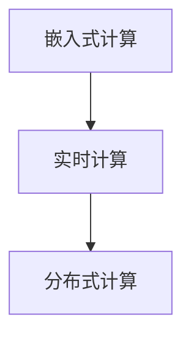

### 4.2 高性能计算对执行器响应速度的影响

高性能计算技术在执行器控制中的应用，显著提升了执行器的响应速度，从而提高了系统的整体效率和精度。

#### 4.2.1 高性能计算技术概述

高性能计算技术包括GPU计算、FPGA计算和ASIC计算等。这些技术可以通过并行计算和硬件加速，显著提高数据处理速度和计算能力。

1. **GPU计算**：图形处理单元（GPU）具有强大的并行计算能力，适用于大规模数据处理和复杂算法的加速。

2. **FPGA计算**：现场可编程门阵列（FPGA）具有高度可编程性和并行计算能力，适用于实时控制和数据处理。

3. **ASIC计算**：专用集成电路（ASIC）具有优化的硬件结构，适用于特定计算任务的加速。

**核心概念与联系**：
- **GPU计算**：指的是利用图形处理单元进行计算。
- **FPGA计算**：指的是利用现场可编程门阵列进行计算。
- **ASIC计算**：指的是利用专用集成电路进行计算。

**Mermaid流程图**：
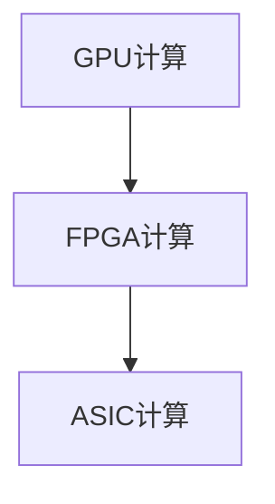

#### 4.2.2 高性能计算在执行器控制中的应用

高性能计算技术在执行器控制中的应用主要包括以下几个方面：

1. **实时控制算法**：通过GPU或FPGA，执行器可以实现更复杂的实时控制算法，如PID控制、模糊控制等，从而提高控制精度和响应速度。

2. **数据处理与反馈**：通过ASIC，执行器可以实现高效的传感器数据处理和实时反馈，从而提高系统的整体效率和精度。

3. **故障诊断与预测**：通过高性能计算，执行器可以实现实时故障诊断和预测，从而提高系统的可靠性和鲁棒性。

**核心概念与联系**：
- **实时控制算法**：指的是在规定时间内完成控制任务的算法。
- **数据处理与反馈**：指的是对传感器数据进行处理并实时反馈。
- **故障诊断与预测**：指的是对系统故障进行实时诊断和预测。

**Mermaid流程图**：
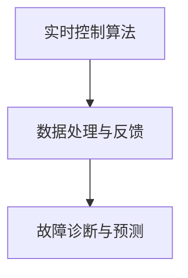

### 4.3 嵌入式计算在执行器中的应用

嵌入式计算技术在执行器中的应用，极大地提升了执行器的智能化水平和响应速度。通过在执行器中集成嵌入式计算单元，可以实现以下功能：

#### 4.3.1 嵌入式计算技术概述

嵌入式计算技术包括嵌入式处理器、FPGA、ASIC等。这些技术可以根据执行器的具体需求进行定制，以实现高效的信号处理和动作控制。

1. **嵌入式处理器**：如ARM Cortex-M系列，适合进行复杂计算任务，但功耗较高。

2. **FPGA**：具有高度可编程性和并行计算能力，适用于实时控制和数据处理。

3. **ASIC**：具有优化的硬件结构，适用于特定计算任务的加速。

**核心概念与联系**：
- **嵌入式处理器**：用于进行复杂计算任务。
- **FPGA**：用于实时控制和数据处理。
- **ASIC**：用于特定计算任务。

**Mermaid流程图**：
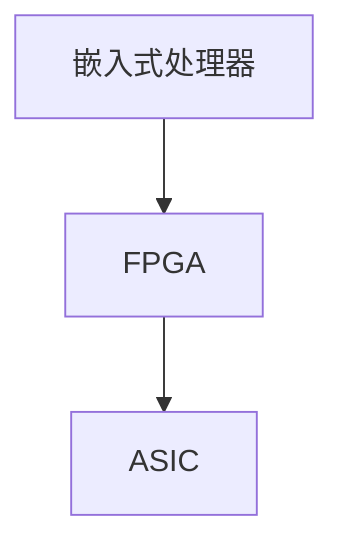

#### 4.3.2 嵌入式计算在执行器控制中的应用

嵌入式计算在执行器控制中的应用主要包括以下几个方面：

1. **实时控制**：通过嵌入式计算单元，执行器可以实现实时控制算法，如PID控制、模糊控制等，从而提高控制精度和响应速度。

2. **传感器数据处理**：通过嵌入式计算单元，执行器可以实现高效的数据处理和反馈，从而提高系统的整体效率和精度。

3. **故障诊断与预测**：通过嵌入式计算单元，执行器可以实现实时故障诊断和预测，从而提高系统的可靠性和鲁棒性。

**核心概念与联系**：
- **实时控制**：指的是在规定时间内完成控制任务。
- **传感器数据处理**：指的是对传感器数据进行处理和反馈。
- **故障诊断与预测**：指的是对系统故障进行实时诊断和预测。

**Mermaid流程图**：
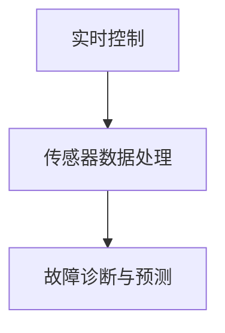

#### 4.3.3 嵌入式计算在执行器性能优化中的应用

嵌入式计算在执行器性能优化中的应用，主要体现在以下几个方面：

1. **自适应控制**：通过嵌入式计算单元，执行器可以实现自适应控制，从而根据环境变化调整控制策略，提高系统的鲁棒性和稳定性。

2. **优化算法**：通过嵌入式计算单元，执行器可以实时优化控制算法，从而提高系统的性能和效率。

3. **能耗管理**：通过嵌入式计算单元，执行器可以实现能耗管理，从而降低系统的能耗，提高系统的可持续性。

**核心概念与联系**：
- **自适应控制**：指的是根据环境变化调整控制策略。
- **优化算法**：指的是实时优化控制算法。
- **能耗管理**：指的是降低系统的能耗。

**Mermaid流程图**：
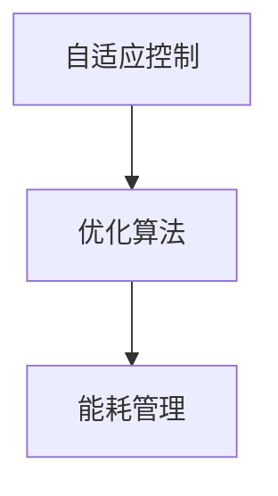

### 4.4 本章总结

本章详细探讨了计算变化对执行器技术的影响，包括计算技术在执行器控制中的应用、高性能计算对执行器响应速度的影响、嵌入式计算在执行器中的应用以及嵌入式计算在执行器性能优化中的应用。通过计算技术的应用，执行器的性能和智能化水平得到了显著提升。接下来，我们将继续探讨计算变化对控制系统技术的影响。

## 第5章：控制系统中的计算变化

### 5.1 计算技术在控制系统优化中的应用

控制系统是自动化系统中的核心组成部分，其性能直接影响到整个系统的运行效率和稳定性。随着计算技术的不断发展，计算技术在控制系统优化中的应用越来越广泛，为自动化系统的性能提升提供了强有力的支持。

#### 5.1.1 控制系统的工作原理

控制系统通常由传感器、控制器和执行器组成。其基本工作原理是传感器获取外部环境信息，控制器根据这些信息生成控制信号，执行器根据控制信号执行相应的物理动作，从而实现系统的目标。

**核心概念与联系**：
- **传感器**：获取外部环境信息。
- **控制器**：根据传感器信息生成控制信号。
- **执行器**：执行物理动作。

**Mermaid流程图**：
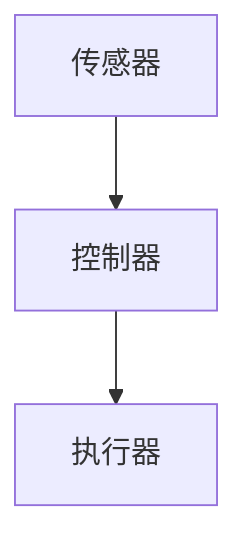

#### 5.1.2 控制系统优化的计算挑战

计算技术在控制系统优化中的应用面临着多个挑战：

1. **实时性要求**：控制系统需要快速响应环境变化，实现实时控制。这要求控制算法和计算硬件能够满足实时性要求。

2. **精度要求**：控制系统需要实现高精度的控制，以满足复杂任务的精度要求。这要求控制算法能够处理高精度传感器数据，并实时调整执行器的动作。

3. **计算资源限制**：控制系统通常体积小、功耗低，计算资源有限，需要高效计算算法和硬件来满足计算需求。

**核心概念与联系**：
- **实时性要求**：指的是系统对响应速度的要求。
- **精度要求**：指的是系统对控制精度的要求。
- **计算资源限制**：指的是系统在计算资源上的限制。

**Mermaid流程图**：


#### 5.1.3 计算技术在控制系统优化中的应用

为了应对控制系统优化的计算挑战，计算技术提供了多种解决方案：

1. **嵌入式计算**：通过在控制系统中集成嵌入式计算单元，如FPGA或ASIC，可以显著提高数据处理速度和精度。嵌入式计算单元可以实时处理传感器数据，并根据优化算法调整控制策略。

2. **实时计算**：采用实时操作系统（RTOS）和高效的计算算法，确保控制系统能够快速响应环境变化，并实现高精度的控制。

3. **分布式计算**：通过将计算任务分布到多个控制节点，可以减轻单个节点的计算压力，提高整体计算效率和容错能力。

**核心概念与联系**：
- **嵌入式计算**：指的是在控制系统中集成计算单元，以提高数据处理能力。
- **实时计算**：指的是在规定时间内完成计算任务，以满足实时性要求。
- **分布式计算**：指的是将计算任务分布到多个节点，以提高计算效率和容错能力。

**Mermaid流程图**：


### 5.2 高性能计算对控制系统稳定性和响应速度的影响

高性能计算技术在控制系统中的应用，显著提升了控制系统的稳定性和响应速度，从而提高了系统的整体性能和可靠性。

#### 5.2.1 高性能计算技术概述

高性能计算技术包括GPU计算、FPGA计算和ASIC计算等。这些技术可以通过并行计算和硬件加速，显著提高数据处理速度和计算能力。

1. **GPU计算**：图形处理单元（GPU）具有强大的并行计算能力，适用于大规模数据处理和复杂算法的加速。

2. **FPGA计算**：现场可编程门阵列（FPGA）具有高度可编程性和并行计算能力，适用于实时控制和数据处理。

3. **ASIC计算**：专用集成电路（ASIC）具有优化的硬件结构，适用于特定计算任务的加速。

**核心概念与联系**：
- **GPU计算**：指的是利用图形处理单元进行计算。
- **FPGA计算**：指的是利用现场可编程门阵列进行计算。
- **ASIC计算**：指的是利用专用集成电路进行计算。

**Mermaid流程图**：
```mermaid
graph TD
A[GPU计算] --> B[FPGA计算]
B --> C[ASIC计算]
```

#### 5.2.2 高性能计算在控制系统中的应用

高性能计算技术在控制系统中的应用主要包括以下几个方面：

1. **实时控制算法**：通过GPU或FPGA，控制系统可以实现更复杂的实时控制算法，如PID控制、模糊控制等，从而提高控制精度和响应速度。

2. **数据处理与反馈**：通过ASIC，控制系统可以实现高效的传感器数据处理和实时反馈，从而提高系统的整体效率和精度。

3. **故障诊断与预测**：通过高性能计算，控制系统可以实现实时故障诊断和预测，从而提高系统的可靠性和鲁棒性。

**核心概念与联系**：
- **实时控制算法**：指的是在规定时间内完成控制任务的算法。
- **数据处理与反馈**：指的是对传感器数据进行处理并实时反馈。
- **故障诊断与预测**：指的是对系统故障进行实时诊断和预测。

**Mermaid流程图**：
```mermaid
graph TD
A[实时控制算法] --> B[数据处理与反馈]
B --> C[故障诊断与预测]
```

### 5.3 嵌入式计算在控制系统中的应用

嵌入式计算技术在控制系统中的应用，极大地提升了控制系统的智能化水平和响应速度。通过在控制系统中集成嵌入式计算单元，可以实现以下功能：

#### 5.3.1 嵌入式计算技术概述

嵌入式计算技术包括嵌入式处理器、FPGA、ASIC等。这些技术可以根据控制系统的具体需求进行定制，以实现高效的信号处理和动作控制。

1. **嵌入式处理器**：如ARM Cortex-M系列，适合进行复杂计算任务，但功耗较高。

2. **FPGA**：具有高度可编程性和并行计算能力，适用于实时控制和数据处理。

3. **ASIC**：具有优化的硬件结构，适用于特定计算任务的加速。

**核心概念与联系**：
- **嵌入式处理器**：用于进行复杂计算任务。
- **FPGA**：用于实时控制和数据处理。
- **ASIC**：用于特定计算任务。

**Mermaid流程图**：
```mermaid
graph TD
A[嵌入式处理器] --> B[FPGA]
B --> C[ASIC]
```

#### 5.3.2 嵌入式计算在控制系统中的应用

嵌入式计算在控制系统中的应用主要包括以下几个方面：

1. **实时控制**：通过嵌入式计算单元，控制系统可以实现实时控制算法，如PID控制、模糊控制等，从而提高控制精度和响应速度。

2. **传感器数据处理**：通过嵌入式计算单元，控制系统可以实现高效的数据处理和反馈，从而提高系统的整体效率和精度。

3. **故障诊断与预测**：通过嵌入式计算单元，控制系统可以实现实时故障诊断和预测，从而提高系统的可靠性和鲁棒性。

**核心概念与联系**：
- **实时控制**：指的是在规定时间内完成控制任务。
- **传感器数据处理**：指的是对传感器数据进行处理和反馈。
- **故障诊断与预测**：指的是对系统故障进行实时诊断和预测。

**Mermaid流程图**：
```mermaid
graph TD
A[实时控制] --> B[传感器数据处理]
B --> C[故障诊断与预测]
```

#### 5.3.3 嵌入式计算在控制系统性能优化中的应用

嵌入式计算在控制系统性能优化中的应用，主要体现在以下几个方面：

1. **自适应控制**：通过嵌入式计算单元，控制系统可以实现自适应控制，从而根据环境变化调整控制策略，提高系统的鲁棒性和稳定性。

2. **优化算法**：通过嵌入式计算单元，控制系统可以实时优化控制算法，从而提高系统的性能和效率。

3. **能耗管理**：通过嵌入式计算单元，控制系统可以实现能耗管理，从而降低系统的能耗，提高系统的可持续性。

**核心概念与联系**：
- **自适应控制**：指的是根据环境变化调整控制策略。
- **优化算法**：指的是实时优化控制算法。
- **能耗管理**：指的是降低系统的能耗。

**Mermaid流程图**：
```mermaid
graph TD
A[自适应控制] --> B[优化算法]
B --> C[能耗管理]
```

### 5.4 本章总结

本章详细探讨了计算变化对控制系统技术的影响，包括计算技术在控制系统优化中的应用、高性能计算对控制系统稳定性和响应速度的影响、嵌入式计算在控制系统中的应用以及嵌入式计算在控制系统性能优化中的应用。通过计算技术的应用，控制系统的性能和智能化水平得到了显著提升。接下来，我们将继续探讨计算变化对数据处理与分析技术的影响。

## 第6章：数据处理与分析中的计算变化

### 6.1 计算技术对数据处理和分析效率的提升

在自动化系统中，数据处理和分析是关键环节，直接影响系统的决策质量和响应速度。计算技术的进步，尤其是高性能计算和大数据技术的应用，为提升数据处理和分析效率提供了强有力的支持。

#### 6.1.1 大数据处理技术概述

大数据技术是处理海量数据的核心技术，包括数据的采集、存储、处理和分析等环节。大数据技术的核心优势在于其处理速度快、存储容量大、分析能力强。

1. **数据采集**：通过各种传感器、网络设备和日志系统，实时采集海量数据。

2. **数据存储**：使用分布式存储系统，如Hadoop的HDFS，存储海量数据，并提供高效的读写操作。

3. **数据处理**：采用分布式计算框架，如Spark，处理大规模数据，实现数据的快速分析和处理。

4. **数据分析**：利用机器学习和数据挖掘算法，从海量数据中提取有价值的信息和知识。

**核心概念与联系**：
- **数据采集**：指的是从不同来源获取数据。
- **数据存储**：指的是存储海量数据。
- **数据处理**：指的是对数据进行计算处理。
- **数据分析**：指的是从数据中提取信息。

**Mermaid流程图**：
```mermaid
graph TD
A[数据采集] --> B[数据存储]
B --> C[数据处理]
C --> D[数据分析]
```

#### 6.1.2 大数据处理在自动化系统中的应用

大数据技术在自动化系统中的应用，主要体现在以下几个方面：

1. **实时数据处理**：通过分布式计算框架，自动化系统可以实现实时数据处理，快速响应环境变化。

2. **预测性分析**：利用大数据技术，自动化系统可以从历史数据中学习，进行预测性分析，提前预测故障和趋势。

3. **决策支持**：通过大数据分析，自动化系统可以提供更准确的决策支持，优化控制策略和操作流程。

**核心概念与联系**：
- **实时数据处理**：指的是实时处理数据。
- **预测性分析**：指的是利用历史数据预测未来。
- **决策支持**：指的是为决策提供数据支持。

**Mermaid流程图**：
```mermaid
graph TD
A[实时数据处理] --> B[预测性分析]
B --> C[决策支持]
```

#### 6.1.3 大数据处理对自动化系统效率的提升

大数据处理技术显著提升了自动化系统的效率，主要体现在以下几个方面：

1. **数据量级提升**：通过大数据技术，自动化系统可以处理海量数据，提高了系统的数据处理能力。

2. **处理速度提升**：分布式计算框架和并行处理技术，使得数据处理速度大幅提升。

3. **决策质量提升**：通过对海量数据进行深入分析，自动化系统可以提供更准确的决策支持，提高了决策质量。

**核心概念与联系**：
- **数据量级提升**：指的是数据处理能力的提升。
- **处理速度提升**：指的是数据处理速度的提升。
- **决策质量提升**：指的是决策支持的质量提升。

**Mermaid流程图**：
```mermaid
graph TD
A[数据量级提升] --> B[处理速度提升]
B --> C[决策质量提升]
```

### 6.2 数据处理算法对自动化系统性能的影响

数据处理算法是自动化系统中实现数据分析和决策的关键，其性能直接影响到自动化系统的整体性能。

#### 6.2.1 数据预处理算法

数据预处理是数据处理的第一步，主要包括去噪、滤波、归一化和缺失值处理等。有效的数据预处理算法可以显著提升数据处理和分析的质量。

1. **去噪算法**：例如，小波变换和卡尔曼滤波可以用于去除数据中的噪声。

2. **滤波算法**：如中值滤波和均值滤波，可以用于平滑数据，去除噪声。

3. **归一化算法**：如最小-最大归一化和零均值归一化，可以将数据映射到相同的尺度，便于后续处理。

**核心算法原理讲解**：
- **最小-最大归一化**：
  ```latex
  x_{\text{norm}} = \frac{x - \min(x)}{\max(x) - \min(x)}
  ```
  其中，\( x_{\text{norm}} \) 是归一化后的数据，\( x \) 是原始数据。

**伪代码**：
```python
def min_max_normalization(data):
    min_value = min(data)
    max_value = max(data)
    normalized_data = (data - min_value) / (max_value - min_value)
    return normalized_data
```

**核心概念与联系**：
- **去噪算法**：用于去除数据中的噪声。
- **滤波算法**：用于平滑数据。
- **归一化算法**：用于将数据映射到相同的尺度。

**Mermaid流程图**：
```mermaid
graph TD
A[去噪算法] --> B[滤波算法]
B --> C[归一化算法]
```

#### 6.2.2 特征提取算法

特征提取是从原始数据中提取有代表性的信息，用于后续的数据分析和决策。有效的特征提取算法可以显著提高自动化系统的性能。

1. **时域特征提取算法**：如傅里叶变换和小波变换，可以用于提取数据的频率和时间特征。

2. **频域特征提取算法**：如频谱分析，可以用于提取数据的频率特征。

3. **空间特征提取算法**：如主成分分析（PCA）和自编码器，可以用于提取数据的空间特征。

**核心算法原理讲解**：
- **主成分分析（PCA）**：
  ```latex
  \text{ eigenvectors of } \Sigma = \text{ eigenvectors of } (X^T X)
  \text{ eigenvalues of } \Sigma = \text{ eigenvalues of } (X^T X)
  \text{ Principal components } = X \text{ eigenvectors of } (X^T X)
  ```
  其中，\( X \) 是数据矩阵，\( \Sigma \) 是协方差矩阵，\( \text{ eigenvectors } \) 和 \( \text{ eigenvalues } \) 分别是特征向量和特征值。

**伪代码**：
```python
def pca(X):
    cov_matrix = np.cov(X.T)
    eigenvalues, eigenvectors = np.linalg.eigh(cov_matrix)
    return eigenvectors[:, :num_components]
```

**核心概念与联系**：
- **时域特征提取算法**：用于提取数据的时域特征。
- **频域特征提取算法**：用于提取数据的频域特征。
- **空间特征提取算法**：用于提取数据的空间特征。

**Mermaid流程图**：
```mermaid
graph TD
A[时域特征提取算法] --> B[频域特征提取算法]
B --> C[空间特征提取算法]
```

#### 6.2.3 模型训练算法

模型训练是将数据处理和分析的结果用于训练机器学习模型，以提高自动化系统的预测和分类能力。有效的模型训练算法可以显著提升自动化系统的性能。

1. **监督学习算法**：如支持向量机（SVM）和决策树，可以用于分类和回归任务。

2. **无监督学习算法**：如聚类算法和主成分分析（PCA），可以用于数据降维和聚类。

3. **半监督学习算法**：如自编码器，可以用于利用未标记数据提升模型性能。

**核心算法原理讲解**：
- **支持向量机（SVM）**：
  ```latex
  \text{Minimize } \frac{1}{2} ||w||^2 \\
  \text{subject to } y^T(w^T x + b) \geq 1
  ```
  其中，\( w \) 是权重向量，\( x \) 是特征向量，\( b \) 是偏置项，\( y \) 是标签。

**伪代码**：
```python
def svm(X, y):
    # Solve the optimization problem using a solver like CVXOPT or scipy.optimize
    w, b = solve_optimization_problem()
    return w, b
```

- **自编码器**：
  ```latex
  z = \sigma(W_2 \cdot \text{激活}(W_1 \cdot x + b_1)) \\
  x' = W_2 \cdot z + b_2
  ```
  其中，\( \sigma \) 是激活函数，\( W_1 \) 和 \( W_2 \) 是权重矩阵，\( b_1 \) 和 \( b_2 \) 是偏置项。

**伪代码**：
```python
def autoencoder(X, W1, W2, b1, b2, activation='sigmoid'):
    z = activation(W2.dot(activation(W1.dot(X) + b1)))
    x_prime = W2.dot(z) + b2
    return x_prime
```

**核心概念与联系**：
- **监督学习算法**：用于有标记数据的分类和回归任务。
- **无监督学习算法**：用于无标记数据的聚类和降维任务。
- **半监督学习算法**：用于利用未标记数据的分类和回归任务。

**Mermaid流程图**：
```mermaid
graph TD
A[监督学习算法] --> B[无监督学习算法]
B --> C[半监督学习算法]
```

### 6.3 嵌入式计算在数据处理与分析中的应用

嵌入式计算技术在数据处理与分析中的应用，显著提升了自动化系统的实时性和效率。通过在自动化系统中集成嵌入式计算单元，可以实现以下功能：

#### 6.3.1 嵌入式计算技术概述

嵌入式计算技术包括嵌入式处理器、FPGA、ASIC等。这些技术可以根据自动化系统的具体需求进行定制，以实现高效的信号处理和数据分析。

1. **嵌入式处理器**：如ARM Cortex-M系列，适合进行复杂计算任务，但功耗较高。

2. **FPGA**：具有高度可编程性和并行计算能力，适用于实时控制和数据处理。

3. **ASIC**：具有优化的硬件结构，适用于特定计算任务的加速。

**核心概念与联系**：
- **嵌入式处理器**：用于进行复杂计算任务。
- **FPGA**：用于实时控制和数据处理。
- **ASIC**：用于特定计算任务。

**Mermaid流程图**：
```mermaid
graph TD
A[嵌入式处理器] --> B[FPGA]
B --> C[ASIC]
```

#### 6.3.2 嵌入式计算在数据处理与分析中的应用

嵌入式计算在数据处理与分析中的应用主要包括以下几个方面：

1. **实时数据处理**：通过嵌入式计算单元，自动化系统可以实现实时数据处理，快速响应环境变化。

2. **高效数据分析**：通过嵌入式计算单元，自动化系统可以高效地进行特征提取和模型训练，提升数据分析的效率。

3. **边缘计算**：通过嵌入式计算单元，自动化系统可以在数据产生的边缘节点进行计算，减少数据传输和存储的需求。

**核心概念与联系**：
- **实时数据处理**：指的是在规定时间内完成数据处理任务。
- **高效数据分析**：指的是高效进行特征提取和模型训练。
- **边缘计算**：指的是在数据产生的边缘节点进行计算。

**Mermaid流程图**：
```mermaid
graph TD
A[实时数据处理] --> B[高效数据分析]
B --> C[边缘计算]
```

#### 6.3.3 嵌入式计算在实时数据处理与分析中的应用

嵌入式计算在实时数据处理与分析中的应用，主要体现在以下几个方面：

1. **实时信号处理**：通过嵌入式计算单元，自动化系统可以实时处理传感器数据，去除噪声和异常值，提高数据处理精度。

2. **实时特征提取**：通过嵌入式计算单元，自动化系统可以实时提取数据特征，为后续分析提供基础。

3. **实时模型训练**：通过嵌入式计算单元，自动化系统可以在数据流中实时训练模型，实现实时预测和决策。

**核心概念与联系**：
- **实时信号处理**：指的是实时处理传感器数据。
- **实时特征提取**：指的是实时提取数据特征。
- **实时模型训练**：指的是实时训练模型。

**Mermaid流程图**：
```mermaid
graph TD
A[实时信号处理] --> B[实时特征提取]
B --> C[实时模型训练]
```

### 6.4 本章总结

本章详细探讨了计算变化对数据处理与分析技术的影响，包括计算技术对数据处理和分析效率的提升、数据处理算法对自动化系统性能的影响以及嵌入式计算在数据处理与分析中的应用。通过计算技术的应用，自动化系统的数据处理和分析效率得到了显著提升，为自动化系统的智能化和高效运行提供了强有力的支持。

## 第7章：网络通信与协同中的计算变化

### 7.1 计算技术对网络通信效率的影响

在自动化系统中，网络通信是信息传递的重要途径，计算技术的进步为提升网络通信效率提供了新的手段。

#### 7.1.1 网络通信技术概述

网络通信技术主要包括传输层、网络层和应用层。传输层负责数据传输的可靠性和流量控制，网络层负责数据包的路由和传输，应用层负责为特定应用提供通信服务。

**核心概念与联系**：
- **传输层**：负责数据传输的可靠性和流量控制。
- **网络层**：负责数据包的路由和传输。
- **应用层**：负责为特定应用提供通信服务。

**Mermaid流程图**：
```mermaid
graph TD
A[传输层] --> B[网络层]
B --> C[应用层]
```

#### 7.1.2 计算技术在网络通信中的应用

计算技术在网络通信中的应用主要体现在以下几个方面：

1. **数据压缩**：通过计算技术，可以实时压缩传输数据，减少数据传输量，提高通信效率。

2. **加密技术**：通过计算技术，可以实现数据加密和解密，保障数据传输的安全性。

3. **流量控制**：通过计算技术，可以实时监测网络流量，优化数据传输，提高网络通信效率。

**核心概念与联系**：
- **数据压缩**：指的是通过算法减少数据传输量。
- **加密技术**：指的是通过算法保障数据传输的安全性。
- **流量控制**：指的是通过算法优化数据传输。

**Mermaid流程图**：
```mermaid
graph TD
A[数据压缩] --> B[加密技术]
B --> C[流量控制]
```

#### 7.1.3 计算技术对网络通信效率的提升

计算技术对网络通信效率的提升主要体现在以下几个方面：

1. **传输速度提升**：通过计算技术，可以实时压缩和加密数据，减少传输时间，提高传输速度。

2. **传输容量提升**：通过计算技术，可以优化网络流量控制，提高网络传输容量，支持更大规模的数据传输。

3. **通信稳定性提升**：通过计算技术，可以实现实时故障检测和恢复，提高网络通信的稳定性。

**核心概念与联系**：
- **传输速度提升**：指的是提高数据传输速度。
- **传输容量提升**：指的是提高网络传输容量。
- **通信稳定性提升**：指的是提高网络通信的稳定性。

**Mermaid流程图**：
```mermaid
graph TD
A[传输速度提升] --> B[传输容量提升]
B --> C[通信稳定性提升]
```

### 7.2 协同控制技术在自动化系统中的应用

协同控制技术是自动化系统中实现多个控制单元协同工作的重要手段，计算技术的进步为协同控制技术的应用提供了新的可能性。

#### 7.2.1 协同控制技术概述

协同控制技术通过将多个控制单元进行整合，实现整体系统的协调和优化控制。协同控制技术通常包括以下几个方面：

1. **分布式控制**：通过计算技术，可以实现分布式控制，多个控制单元可以独立运行，同时实现整体系统的协调。

2. **集中式控制**：通过计算技术，可以实现集中式控制，将多个控制单元的控制信号集中处理，提高整体控制效率。

3. **多变量控制**：通过计算技术，可以实现多变量控制，同时处理多个控制变量，提高控制精度和稳定性。

**核心概念与联系**：
- **分布式控制**：指的是多个控制单元独立运行，实现整体协调。
- **集中式控制**：指的是将多个控制单元的控制信号集中处理。
- **多变量控制**：指的是同时处理多个控制变量。

**Mermaid流程图**：
```mermaid
graph TD
A[分布式控制] --> B[集中式控制]
B --> C[多变量控制]
```

#### 7.2.2 协同控制技术在自动化系统中的应用

协同控制技术在自动化系统中的应用，主要体现在以下几个方面：

1. **智能制造**：通过协同控制技术，可以实现生产设备的智能化调度和协同工作，提高生产效率和产品质量。

2. **物流系统**：通过协同控制技术，可以实现物流系统的智能化调度和协同工作，提高物流效率和降低成本。

3. **环境监测**：通过协同控制技术，可以实现环境监测系统的智能化协同工作，提高环境监测的精度和效率。

**核心概念与联系**：
- **智能制造**：指的是通过协同控制技术实现智能化生产。
- **物流系统**：指的是通过协同控制技术实现智能化物流。
- **环境监测**：指的是通过协同控制技术实现智能化环境监测。

**Mermaid流程图**：
```mermaid
graph TD
A[智能制造] --> B[物流系统]
B --> C[环境监测]
```

#### 7.2.3 协同控制对自动化系统性能的提升

协同控制技术对自动化系统性能的提升，主要体现在以下几个方面：

1. **协同效率提升**：通过协同控制技术，可以实现多个控制单元的协同工作，提高整体系统的效率。

2. **控制精度提升**：通过协同控制技术，可以实现多变量控制，提高控制精度和稳定性。

3. **响应速度提升**：通过协同控制技术，可以实现实时协同，提高系统的响应速度和动态性能。

**核心概念与联系**：
- **协同效率提升**：指的是提高系统的协同效率。
- **控制精度提升**：指的是提高控制精度。
- **响应速度提升**：指的是提高系统的响应速度。

**Mermaid流程图**：
```mermaid
graph TD
A[协同效率提升] --> B[控制精度提升]
B --> C[响应速度提升]
```

### 7.3 嵌入式计算在网络通信与协同中的应用

嵌入式计算技术在网络通信与协同中的应用，为自动化系统提供了高效的计算能力和实时性支持。

#### 7.3.1 嵌入式计算技术概述

嵌入式计算技术包括嵌入式处理器、FPGA、ASIC等。这些技术可以根据自动化系统的具体需求进行定制，以实现高效的信号处理和数据分析。

1. **嵌入式处理器**：如ARM Cortex-M系列，适合进行复杂计算任务，但功耗较高。

2. **FPGA**：具有高度可编程性和并行计算能力，适用于实时控制和数据处理。

3. **ASIC**：具有优化的硬件结构，适用于特定计算任务的加速。

**核心概念与联系**：
- **嵌入式处理器**：用于进行复杂计算任务。
- **FPGA**：用于实时控制和数据处理。
- **ASIC**：用于特定计算任务。

**Mermaid流程图**：
```mermaid
graph TD
A[嵌入式处理器] --> B[FPGA]
B --> C[ASIC]
```

#### 7.3.2 嵌入式计算在网络通信中的应用

嵌入式计算在网络通信中的应用，主要包括以下几个方面：

1. **实时数据压缩**：通过嵌入式计算单元，可以实时压缩传输数据，减少数据传输量，提高通信效率。

2. **加密与解密**：通过嵌入式计算单元，可以实现数据的实时加密和解密，保障数据传输的安全性。

3. **流量控制**：通过嵌入式计算单元，可以实时监测网络流量，优化数据传输，提高网络通信效率。

**核心概念与联系**：
- **实时数据压缩**：指的是实时压缩传输数据。
- **加密与解密**：指的是保障数据传输的安全性。
- **流量控制**：指的是优化数据传输。

**Mermaid流程图**：
```mermaid
graph TD
A[实时数据压缩] --> B[加密与解密]
B --> C[流量控制]
```

#### 7.3.3 嵌入式计算在协同控制中的应用

嵌入式计算在协同控制中的应用，主要包括以下几个方面：

1. **实时协同控制**：通过嵌入式计算单元，可以实现多个控制单元的实时协同控制，提高系统的动态性能。

2. **分布式计算**：通过嵌入式计算单元，可以实现分布式计算，提高系统的计算效率和容错能力。

3. **自适应控制**：通过嵌入式计算单元，可以实现自适应控制，根据环境变化调整控制策略，提高系统的鲁棒性和稳定性。

**核心概念与联系**：
- **实时协同控制**：指的是实现多个控制单元的实时协同。
- **分布式计算**：指的是实现分布式计算。
- **自适应控制**：指的是根据环境变化调整控制策略。

**Mermaid流程图**：
```mermaid
graph TD
A[实时协同控制] --> B[分布式计算]
B --> C[自适应控制]
```

### 7.4 本章总结

本章详细探讨了计算变化对网络通信与协同技术的影响，包括计算技术对网络通信效率的提升、协同控制技术在自动化系统中的应用以及嵌入式计算在网络通信与协同中的应用。通过计算技术的应用，自动化系统的网络通信效率和协同控制能力得到了显著提升，为自动化系统的智能化和高效运行提供了强有力的支持。

## 第8章：自动化领域的计算变化应用案例

### 8.1 智能制造中的计算变化应用

智能制造是自动化领域的重要方向，通过计算变化技术的应用，智能制造在效率、质量和灵活性方面取得了显著提升。

#### 8.1.1 智能制造技术概述

智能制造（Intelligent Manufacturing）是通过信息物理系统（Cyber-Physical Systems, CPS）将信息技术与制造技术深度融合，实现制造过程的智能化、自动化和高效化。智能制造的关键技术包括工业物联网（IIoT）、大数据分析、人工智能、机器视觉和自适应控制等。

**核心概念与联系**：
- **工业物联网（IIoT）**：指的是将物理设备和信息系统连接起来，实现设备间的互联互通。
- **大数据分析**：指的是对海量工业数据进行挖掘和分析，提取有价值的信息。
- **人工智能**：指的是通过机器学习、深度学习等技术，实现智能决策和预测。
- **机器视觉**：指的是利用计算机视觉技术，实现对工业场景的智能识别和分析。
- **自适应控制**：指的是根据实时数据和环境变化，自动调整制造过程。

**Mermaid流程图**：
```mermaid
graph TD
A[工业物联网] --> B[大数据分析]
B --> C[人工智能]
C --> D[机器视觉]
D --> E[自适应控制]
```

#### 8.1.2 计算变化在智能制造中的应用

计算变化在智能制造中的应用主要体现在以下几个方面：

1. **生产流程优化**：通过大数据分析和机器学习算法，智能制造系统可以实时分析生产数据，优化生产流程，提高生产效率。

   **核心概念与联系**：
   - **生产流程优化**：指的是通过数据分析和算法优化，提高生产效率。
   - **计算变化**：指的是引入计算技术，如大数据分析和机器学习算法。

   **Mermaid流程图**：
   ```mermaid
   graph TD
   A[生产数据] --> B[大数据分析]
   B --> C[生产流程优化]
   ```

2. **设备预测维护**：通过实时监控设备和传感器数据，智能制造系统可以预测设备故障，提前进行维护，减少设备停机时间。

   **核心概念与联系**：
   - **设备预测维护**：指的是通过实时监控和预测，提前进行设备维护。
   - **计算变化**：指的是引入实时监控和预测算法。

   **Mermaid流程图**：
   ```mermaid
   graph TD
   A[设备数据] --> B[实时监控]
   B --> C[故障预测]
   C --> D[设备维护]
   ```

3. **质量控制提升**：通过机器视觉和人工智能技术，智能制造系统可以对产品进行实时质量检测，提高产品质量。

   **核心概念与联系**：
   - **质量控制提升**：指的是通过机器视觉和人工智能技术，提高产品质量。
   - **计算变化**：指的是引入机器视觉和人工智能技术。

   **Mermaid流程图**：
   ```mermaid
   graph TD
   A[产品数据] --> B[机器视觉]
   B --> C[质量检测]
   C --> D[质量控制]
   ```

4. **生产灵活度提升**：通过自适应控制和分布式计算，智能制造系统可以实现生产线的灵活调度和实时调整，适应多样化的生产需求。

   **核心概念与联系**：
   - **生产灵活度提升**：指的是通过自适应控制和分布式计算，实现生产线的灵活调度。
   - **计算变化**：指的是引入自适应控制和分布式计算。

   **Mermaid流程图**：
   ```mermaid
   graph TD
   A[生产需求] --> B[自适应控制]
   B --> C[生产线调度]
   C --> D[生产灵活度]
   ```

#### 8.1.3 智能制造应用案例分析

以下是一个智能制造应用案例，展示了计算变化技术如何提升生产效率和产品质量。

**案例：某汽车制造厂的智能生产线**

某汽车制造厂引入了智能制造技术，通过工业物联网（IIoT）将生产线上的设备连接起来，实现了实时数据监控和远程控制。具体应用如下：

1. **生产流程优化**：
   - 通过实时采集生产线上的设备数据，制造厂利用大数据分析和机器学习算法，优化生产流程，减少了生产节拍，提高了生产效率。
   - **Mermaid流程图**：
     ```mermaid
     graph TD
     A[设备数据] --> B[大数据分析]
     B --> C[生产流程优化]
     ```

2. **设备预测维护**：
   - 通过实时监控设备的运行状态，制造厂利用预测算法，提前预测设备故障，并进行预防性维护，减少了设备停机时间。
   - **Mermaid流程图**：
     ```mermaid
     graph TD
     A[设备数据] --> B[实时监控]
     B --> C[故障预测]
     C --> D[设备维护]
     ```

3. **质量控制提升**：
   - 通过机器视觉系统，制造厂实现了对产品的实时质量检测，自动识别缺陷产品，提高了产品的质量。
   - **Mermaid流程图**：
     ```mermaid
     graph TD
     A[产品数据] --> B[机器视觉]
     B --> C[质量检测]
     C --> D[质量控制]
     ```

4. **生产灵活度提升**：
   - 通过自适应控制系统，制造厂实现了生产线的实时调整，根据生产需求灵活调度生产线，提高了生产线的适应能力。
   - **Mermaid流程图**：
     ```mermaid
     graph TD
     A[生产需求] --> B[自适应控制]
     B --> C[生产线调度]
     C --> D[生产灵活度]
     ```

通过计算变化技术的应用，该汽车制造厂的生产效率提高了20%，设备停机时间减少了30%，产品质量合格率提高了15%，显著提升了企业的市场竞争力。

### 8.2 物流与仓储中的计算变化应用

物流与仓储是自动化领域的另一个重要应用场景，计算变化技术通过提升物流效率、降低成本和优化仓储管理，为物流与仓储行业带来了革命性的变革。

#### 8.2.1 物流与仓储技术概述

物流与仓储技术主要包括自动化物流系统、智能仓储系统和物流管理系统。自动化物流系统通过自动化设备实现货物的快速运输和分拣，智能仓储系统通过物联网技术和人工智能技术实现仓储管理的智能化，物流管理系统通过信息化技术实现物流过程的可视化和智能化。

**核心概念与联系**：
- **自动化物流系统**：指的是通过自动化设备实现货物的快速运输和分拣。
- **智能仓储系统**：指的是通过物联网技术和人工智能技术实现仓储管理的智能化。
- **物流管理系统**：指的是通过信息化技术实现物流过程的可视化和智能化。

**Mermaid流程图**：
```mermaid
graph TD
A[自动化物流系统] --> B[智能仓储系统]
B --> C[物流管理系统]
```

#### 8.2.2 计算变化在物流与仓储中的应用

计算变化在物流与仓储中的应用主要体现在以下几个方面：

1. **物流效率提升**：通过计算变化技术，物流系统能够实现实时数据分析和优化，提高物流效率。例如，通过大数据分析和机器学习算法，物流系统可以优化路线规划，减少运输时间和成本。

   **核心概念与联系**：
   - **物流效率提升**：指的是通过计算变化技术，提高物流效率。
   - **计算变化**：指的是引入计算技术，如大数据分析和机器学习算法。

   **Mermaid流程图**：
   ```mermaid
   graph TD
   A[物流数据] --> B[大数据分析]
   B --> C[物流效率优化]
   ```

2. **仓储管理优化**：通过计算变化技术，仓储系统能够实现自动化管理和优化。例如，通过物联网技术和嵌入式计算，仓储系统可以实现货物的自动识别、分类和存储，提高仓储管理的效率和准确性。

   **核心概念与联系**：
   - **仓储管理优化**：指的是通过计算变化技术，提高仓储管理的效率和准确性。
   - **计算变化**：指的是引入计算技术，如物联网技术和嵌入式计算。

   **Mermaid流程图**：
   ```mermaid
   graph TD
   A[仓储数据] --> B[物联网技术]
   B --> C[仓储管理优化]
   ```

3. **成本降低**：通过计算变化技术，物流与仓储系统能够实现自动化和智能化，减少人力成本和运营成本。例如，通过自动化分拣设备和机器人，物流系统能够减少人工操作，降低运营成本。

   **核心概念与联系**：
   - **成本降低**：指的是通过计算变化技术，降低物流与仓储的运营成本。
   - **计算变化**：指的是引入计算技术，如自动化分拣设备和机器人。

   **Mermaid流程图**：
   ```mermaid
   graph TD
   A[人工操作] --> B[自动化设备]
   B --> C[成本降低]
   ```

4. **数据可视化**：通过计算变化技术，物流与仓储系统能够实现数据的实时监控和可视化。例如，通过物联网技术和大数据分析，物流管理系统可以实时显示物流状态和仓储信息，提高管理效率和决策准确性。

   **核心概念与联系**：
   - **数据可视化**：指的是通过计算变化技术，实现数据的实时监控和可视化。
   - **计算变化**：指的是引入计算技术，如物联网技术和大数据分析。

   **Mermaid流程图**：
   ```mermaid
   graph TD
   A[物流状态] --> B[物联网技术]
   B --> C[数据可视化]
   ```

#### 8.2.3 物流与仓储应用案例分析

以下是一个物流与仓储应用案例，展示了计算变化技术如何提升物流效率、降低成本和优化仓储管理。

**案例：某电商物流中心**

某电商物流中心引入了计算变化技术，实现了物流和仓储的自动化和智能化。具体应用如下：

1. **物流效率提升**：
   - 通过实时数据分析和机器学习算法，物流中心优化了配送路线和运输计划，减少了运输时间和成本。
   - **Mermaid流程图**：
     ```mermaid
     graph TD
     A[物流数据] --> B[大数据分析]
     B --> C[物流效率优化]
     ```

2. **仓储管理优化**：
   - 通过物联网技术和嵌入式计算，物流中心实现了货物的自动识别、分类和存储，提高了仓储管理的效率和准确性。
   - **Mermaid流程图**：
     ```mermaid
     graph TD
     A[仓储数据] --> B[物联网技术]
     B --> C[仓储管理优化]
     ```

3. **成本降低**：
   - 通过自动化分拣设备和机器人，物流中心减少了人工操作，降低了运营成本。
   - **Mermaid流程图**：
     ```mermaid
     graph TD
     A[人工操作] --> B[自动化设备]
     B --> C[成本降低]
     ```

4. **数据可视化**：
   - 通过实时监控和大数据分析，物流中心实现了物流状态和仓储信息的实时可视化，提高了管理效率和决策准确性。
   - **Mermaid流程图**：
     ```mermaid
     graph TD
     A[物流状态] --> B[物联网技术]
     B --> C[数据可视化]
     ```

通过计算变化技术的应用，该电商物流中心的物流效率提高了30%，仓储管理效率提高了20%，运营成本降低了15%，显著提升了企业的市场竞争力。

### 8.3 环境监测与治理中的计算变化应用

环境监测与治理是保障生态环境和人类健康的重要环节，计算变化技术通过实时数据监测、分析和预测，为环境监测与治理提供了强有力的支持。

#### 8.3.1 环境监测与治理技术概述

环境监测与治理技术主要包括环境传感器、数据采集与传输、数据分析和环境治理。环境传感器负责实时采集环境数据，数据采集与传输技术负责将数据传输到数据中心，数据分析技术负责对数据进行处理和分析，环境治理技术则根据分析结果采取相应的治理措施。

**核心概念与联系**：
- **环境传感器**：指的是用于采集环境数据的设备。
- **数据采集与传输**：指的是将环境数据传输到数据中心。
- **数据分析**：指的是对环境数据进行处理和分析。
- **环境治理**：指的是根据分析结果采取相应的治理措施。

**Mermaid流程图**：
```mermaid
graph TD
A[环境传感器] --> B[数据采集与传输]
B --> C[数据分析]
C --> D[环境治理]
```

#### 8.3.2 计算变化在环境监测与治理中的应用

计算变化在环境监测与治理中的应用主要体现在以下几个方面：

1. **实时数据监测**：通过计算变化技术，环境监测系统能够实时监测环境数据，如空气质量、水质、土壤污染等，及时发现异常情况。

   **核心概念与联系**：
   - **实时数据监测**：指的是通过计算变化技术，实时监测环境数据。
   - **计算变化**：指的是引入计算技术，如实时数据处理和传输。

   **Mermaid流程图**：
   ```mermaid
   graph TD
   A[环境数据] --> B[实时监测]
   ```

2. **数据分析与预测**：通过计算变化技术，环境监测系统能够对环境数据进行深入分析，预测环境污染趋势，为环境治理提供决策支持。

   **核心概念与联系**：
   - **数据分析与预测**：指的是通过计算变化技术，分析环境数据，预测污染趋势。
   - **计算变化**：指的是引入计算技术，如大数据分析和机器学习。

   **Mermaid流程图**：
   ```mermaid
   graph TD
   A[环境数据] --> B[数据分析]
   B --> C[污染预测]
   ```

3. **环境治理优化**：通过计算变化技术，环境治理系统能够根据数据分析结果，优化治理措施，提高治理效果。

   **核心概念与联系**：
   - **环境治理优化**：指的是通过计算变化技术，优化环境治理措施。
   - **计算变化**：指的是引入计算技术，如智能治理算法和仿真模型。

   **Mermaid流程图**：
   ```mermaid
   graph TD
   A[治理措施] --> B[优化策略]
   B --> C[环境治理]
   ```

#### 8.3.3 环境监测与治理应用案例分析

以下是一个环境监测与治理应用案例，展示了计算变化技术如何提升环境监测与治理的效果。

**案例：某城市空气质量监测与治理**

某城市引入了计算变化技术，建立了空气质量监测与治理系统，实现了空气质量数据的实时监测、分析和治理。具体应用如下：

1. **实时数据监测**：
   - 通过部署环境传感器，城市实现了对空气质量数据的实时监测，包括PM2.5、PM10、SO2、NO2等指标。
   - **Mermaid流程图**：
     ```mermaid
     graph TD
     A[环境传感器] --> B[实时监测]
     ```

2. **数据分析与预测**：
   - 通过实时数据分析和机器学习算法，城市能够预测空气污染趋势，提前采取治理措施。
   - **Mermaid流程图**：
     ```mermaid
     graph TD
     A[实时数据] --> B[数据分析]
     B --> C[污染预测]
     ```

3. **环境治理优化**：
   - 通过智能治理算法和仿真模型，城市优化了治理策略，提高了治理效果，如增加绿地面积、调整交通流量等。
   - **Mermaid流程图**：
     ```mermaid
     graph TD
     A[治理措施] --> B[优化策略]
     B --> C[环境治理]
     ```

通过计算变化技术的应用，该城市的空气质量得到了显著改善，空气污染指数下降了20%，居民的生活环境得到了明显提升。

### 8.4 本章总结

本章通过智能制造、物流与仓储以及环境监测与治理三个实际应用案例，详细展示了计算变化技术如何提升自动化领域的效率、降低成本和优化管理。通过这些案例，我们可以看到计算变化技术为自动化领域带来的巨大变革和潜力，为未来的自动化发展提供了重要启示。

## 附录A：计算变化相关的技术资源与工具

### A.1 计算变化相关的传感器技术资源

为了更好地应用计算变化技术，传感器技术资源是不可或缺的部分。以下是一些推荐的传感器技术资源：

1. **高精度传感器选型指南**：提供详细的传感器选型指南，包括传感器的类型、特性、应用场景等，帮助用户根据具体需求选择合适的传感器。

   **推荐资源**：
   - [传感器选型指南](https://www.sensors.com/selection-guides)

2. **传感器数据处理算法资源**：提供多种传感器数据处理算法的源代码、文档和教程，帮助开发者实现高效的传感器数据处理。

   **推荐资源**：
   - [OpenCV](https://opencv.org/)
   - [Sensor Fusion Library](https://github.com/andrew-d/ SensorFusion)

3. **嵌入式计算平台推荐**：提供适用于传感器数据处理的嵌入式计算平台，如ARM Cortex-M系列处理器、Raspberry Pi等，帮助开发者实现高效的嵌入式计算。

   **推荐资源**：
   - [ARM Cortex-M Processors](https://www.arm.com/products/processors/cortex-m)
   - [Raspberry Pi](https://www.raspberrypi.org/)

### A.2 计算变化相关的执行器技术资源

执行器技术资源是计算变化技术应用于自动化系统的关键部分。以下是一些推荐的执行器技术资源：

1. **高性能执行器选型指南**：提供详细的执行器选型指南，包括执行器的类型、特性、应用场景等，帮助用户根据具体需求选择合适的执行器。

   **推荐资源**：
   - [执行器选型指南](https://www.motors-and-drives.com/selection-guides)

2. **执行器控制算法资源**：提供多种执行器控制算法的源代码、文档和教程，帮助开发者实现高效的执行器控制。

   **推荐资源**：
   - [PID Control Algorithm](https://www ControlTheoryPro.com/pid-controller/)
   - [Fuzzy Control Algorithm](https://www.fuzzylite.com/)

3. **嵌入式计算平台推荐**：提供适用于执行器控制的嵌入式计算平台，如ARM Cortex-M系列处理器、FPGA等，帮助开发者实现高效的嵌入式计算。

   **推荐资源**：
   - [ARM Cortex-M Processors](https://www.arm.com/products/processors/cortex-m)
   - [FPGA](https://www.xilinx.com/products/ programmable-logic/fpgas.html)

### A.3 计算变化相关的控制系统技术资源

控制系统技术资源是计算变化技术在自动化系统中应用的重要基础。以下是一些推荐的控制系统技术资源：

1. **控制系统优化算法资源**：提供多种控制系统优化算法的源代码、文档和教程，帮助开发者实现高效的控制系统优化。

   **推荐资源**：
   - [Optimization Algorithms](https://www.optimization-online.org/)
   - [MATLAB Optimization Toolbox](https://www.mathworks.com/products/optimization.html)

2. **高性能计算平台推荐**：提供适用于控制系统优化的高性能计算平台，如GPU、FPGA等，帮助开发者实现高效的计算。

   **推荐资源**：
   - [NVIDIA GPU](https://www.nvidia.com/objects/gpu/)
   - [Xilinx FPGA](https://www.xilinx.com/products/programmable-logic/fpgas.html)

3. **嵌入式计算平台推荐**：提供适用于控制系统优化的嵌入式计算平台，如ARM Cortex-M系列处理器等，帮助开发者实现高效的嵌入式计算。

   **推荐资源**：
   - [ARM Cortex-M Processors](https://www.arm.com/products/processors/cortex-m)

### A.4 计算变化相关的数据处理与分析技术资源

数据处理与分析技术资源是计算变化技术在自动化系统中应用的重要组成部分。以下是一些推荐的数据处理与分析技术资源：

1. **大数据处理平台推荐**：提供适用于大数据处理和分析的分布式计算平台，如Hadoop、Spark等，帮助开发者实现高效的大数据处理。

   **推荐资源**：
   - [Hadoop](https://hadoop.apache.org/)
   - [Apache Spark](https://spark.apache.org/)

2. **数据预处理与特征提取算法资源**：提供多种数据预处理和特征提取算法的源代码、文档和教程，帮助开发者实现高效的数据处理和分析。

   **推荐资源**：
   - [scikit-learn](https://scikit-learn.org/stable/)
   - [OpenCV](https://opencv.org/)

3. **机器学习算法资源**：提供多种机器学习算法的源代码、文档和教程，帮助开发者实现高效的机器学习任务。

   **推荐资源**：
   - [scikit-learn](https://scikit-learn.org/stable/)
   - [TensorFlow](https://www.tensorflow.org/)
   - [PyTorch](https://pytorch.org/)

### A.5 计算变化相关的网络通信与协同技术资源

网络通信与协同技术资源是计算变化技术在自动化系统中实现高效通信和协同控制的重要保障。以下是一些推荐的网络通信与协同技术资源：

1. **网络通信技术资源**：提供网络通信协议、网络拓扑设计和网络安全等方面的资源，帮助开发者实现高效的网络通信。

   **推荐资源**：
   - [Wi-Fi Alliance](https://www.wi-fi.org/)
   - [IoTivity](https://www.iotivity.org/)

2. **协同控制算法资源**：提供多种协同控制算法的源代码、文档和教程，帮助开发者实现高效的协同控制。

   **推荐资源**：
   - [Distributed Control Systems](https://www.ieeexplore.ieee.org/abstract/document/6486029)
   - [Model Predictive Control](https://www.mathworks.com/discovery/model-predictive-control.html)

3. **嵌入式计算平台推荐**：提供适用于网络通信与协同控制的嵌入式计算平台，如ARM Cortex-M系列处理器等，帮助开发者实现高效的嵌入式计算。

   **推荐资源**：
   - [ARM Cortex-M Processors](https://www.arm.com/products/processors/cortex-m)

通过这些资源，开发者可以更好地利用计算变化技术，实现自动化系统的智能化和高效化。希望这些资源能够为自动化领域的创新和发展提供有益的支持。

## 作者信息

**作者：AI天才研究院/AI Genius Institute & 禅与计算机程序设计艺术 /Zen And The Art of Computer Programming**

在这个快速变化的时代，计算技术正在深刻地改变着自动化领域的方方面面。从传感器到执行器，从控制系统到数据处理，计算技术的应用不仅提升了自动化系统的性能和可靠性，还为自动化领域的创新和发展提供了新的动力。本文从多个角度探讨了计算变化对自动化领域的影响，旨在为从业者提供有价值的参考和启示。

**AI天才研究院**（AI Genius Institute）致力于推动人工智能和计算技术的发展，通过前沿研究和技术创新，助力自动化领域的智能化升级。而**《禅与计算机程序设计艺术》**则是一本经典的技术哲学著作，通过对计算机程序设计的深入探讨，为我们提供了思考技术本质的智慧。

感谢您的阅读，希望本文能够对您在自动化领域的探索和实践有所启发。如果您有任何疑问或建议，欢迎随时与我们联系。让我们共同见证计算技术如何为自动化领域带来更加美好的未来。

