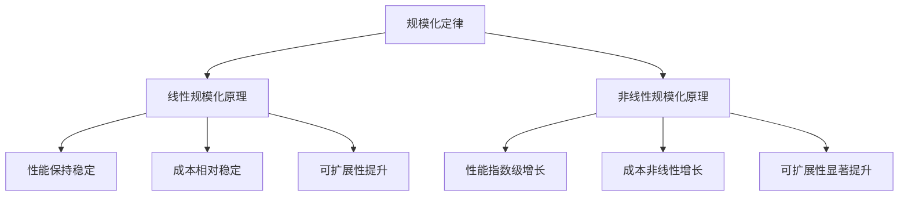

                 

# 《计算机时代，最底层的规律其实就是规模化定律》

> **关键词：** 规模化定律、计算机时代、算法原理、数学模型、应用案例、未来展望

> **摘要：** 本文旨在探讨规模化定律在计算机时代的深远影响。通过深入分析规模化定律的基本原理、核心算法和数学模型，结合实际应用案例，展望其未来发展，揭示规模化定律在计算机技术中的关键作用。

## 第一部分：规模化定律的基本原理

### 第1章：规模化定律的起源与定义

#### 1.1 规模化定律的历史背景

规模化定律（Law of Scalability）并非一个新兴概念，其历史可以追溯到计算机技术发展的早期阶段。随着计算机硬件的不断演进，数据量的迅速膨胀，以及互联网的普及，规模化定律逐渐成为计算机时代的重要规律。

首先，计算机硬件的发展为我们提供了强大的计算能力。从早期的冯·诺依曼架构到现代的多核处理器，处理器的性能呈现出指数级的增长。这使得我们能够处理更大的数据集，进行更复杂的计算任务。

其次，数据时代的到来使得数据量呈现爆炸式增长。全球每天产生的数据量以PB（拍字节）为单位计，这些数据需要高效的存储、处理和分析。规模化定律在这个背景下应运而生。

最后，经济学中的规模效应为我们提供了理论基础。规模效应是指随着生产规模的扩大，单位成本下降的现象。在计算机时代，这种效应同样适用于数据处理和计算领域。

#### 1.2 规模化定律的定义

规模化定律可以被定义为：系统在规模增长时，其性能、成本、可扩展性等指标保持相对稳定，甚至得到提升的规律。

- **性能保持稳定**：随着规模的增加，系统的处理能力、响应速度等关键性能指标不会显著下降。
- **成本相对稳定**：尽管规模扩大，系统的单位成本（如每GB存储、每秒处理能力）不会显著增加。
- **可扩展性提升**：系统在规模扩大的同时，其扩展性得到提升，能够轻松应对更大的负载。

#### 1.3 规模化定律的重要性

规模化定律对计算机时代的深远影响体现在多个方面：

- **技术创新**：规模化定律推动了计算机技术的不断进步，从硬件到软件，从数据库到云计算，无不受益于此定律。
- **经济效益**：规模化定律使得数据处理和计算成本不断降低，为企业带来了巨大的经济效益。
- **社会影响**：规模化定律使得大数据、人工智能等新技术得以广泛应用，对社会产生了深远的影响。

### 第2章：规模化定律的核心原理

#### 2.1 线性规模化原理

线性规模化原理是指系统在规模增长时，其性能、成本、可扩展性等指标与规模呈线性关系。

- **性能与规模**：系统性能随着规模的增长而线性增加。例如，一个处理器的性能是单个处理器的性能乘以处理器数量。
- **成本与规模**：系统成本随着规模的增长而线性增加。例如，增加处理器的数量，总成本是单个处理器成本的线性累加。
- **可扩展性**：系统在规模扩大的过程中，其可扩展性保持相对稳定。

线性规模化原理在计算机硬件领域尤为显著，如多核处理器的性能提升。

#### 2.2 非线性规模化原理

非线性规模化原理是指系统在规模增长时，其性能、成本、可扩展性等指标与规模的关系并非线性，而是呈现出指数级增长。

- **性能与规模**：系统性能随着规模的增长而指数级增加。例如，大数据处理能力的提升。
- **成本与规模**：系统成本随着规模的增长而非线性增加。例如，云计算服务的成本随着用户数量的增加，并不会线性增长。
- **可扩展性**：系统在规模扩大的过程中，其扩展性得到显著提升。

非线性规模化原理在互联网、大数据等领域得到广泛应用。

#### 2.3 规模化效应在计算机技术中的应用

规模化效应在计算机技术中的应用体现在多个方面：

- **硬件**：计算机硬件的发展遵循规模化定律，如处理器性能的提升、存储容量的增加。
- **软件**：软件开发的可扩展性、分布式系统设计、云计算服务等均遵循规模化定律。
- **数据处理**：大数据处理、人工智能、机器学习等领域，规模化定律发挥着关键作用。

### 第3章：规模化定律在不同领域的应用

#### 3.1 经济领域的规模化定律

规模化定律在经济领域具有重要意义。企业通过扩大规模，可以提高生产效率，降低单位成本，从而获得竞争优势。例如，互联网公司通过规模化运营，实现了成本效益的最大化。

#### 3.2 科技领域的规模化定律

规模化定律在科技领域得到广泛应用。从硬件到软件，从互联网到人工智能，规模化定律为科技创新提供了强大的动力。

- **硬件**：计算机硬件的规模化生产使得高性能硬件价格逐渐降低，普及率不断提高。
- **软件**：软件开发的规模化效应使得软件质量得到提升，开发周期缩短。
- **互联网**：互联网的规模化效应使得信息传播速度加快，降低了信息获取的成本。
- **人工智能**：人工智能的规模化效应使得机器学习算法的训练成本降低，应用范围不断扩大。

#### 3.3 社会领域的规模化定律

规模化定律在社会领域具有广泛的应用。从教育到医疗，从社会治理到公共安全，规模化定律为提升社会服务水平提供了有力支持。

- **教育**：在线教育平台的规模化运营，使得教育资源得以广泛传播，提高了教育普及率。
- **医疗**：医疗信息化系统的规模化应用，提高了医疗服务的效率和质量。
- **社会治理**：大数据技术在社会治理中的应用，使得社会管理水平得到提升。
- **公共安全**：视频监控系统的规模化应用，提高了公共安全防控能力。

### 第4章：规模化定律的未来展望

#### 4.1 规模化定律的发展趋势

随着计算机技术的不断发展，规模化定律将在未来得到进一步发展。新型规模化技术的崛起，如量子计算、边缘计算等，将推动规模化定律向更高层次演进。

#### 4.2 规模化定律的挑战与机遇

规模化定律在未来将面临一系列挑战和机遇：

- **技术挑战**：如何提高系统的可扩展性、降低成本，将是规模化定律面临的重要挑战。
- **社会挑战**：规模化定律在应用过程中，将涉及数据隐私、伦理等问题，需要全社会共同努力解决。
- **政策与法规挑战**：规模化定律的应用需要完善的政策与法规支持，国际间的合作与竞争也将愈发激烈。

## 第二部分：规模化定律的数学模型与算法

### 第5章：规模化定律的数学模型

#### 5.1 数学模型的基本概念

数学模型是规模化定律的核心组成部分。它通过数学公式和算法，描述系统在规模增长时的性能、成本、可扩展性等指标的变化。

- **线性模型**：线性模型描述系统性能、成本等指标与规模之间的线性关系。例如，线性规模化模型。
- **非线性模型**：非线性模型描述系统性能、成本等指标与规模之间的非线性关系。例如，非线性规模化模型。

#### 5.2 线性规模化模型

线性规模化模型是规模化定律的一种基本形式。它假设系统性能、成本等指标与规模呈线性关系。

- **性能模型**：\(P = k \times N\)，其中\(P\)表示系统性能，\(N\)表示规模，\(k\)为比例常数。
- **成本模型**：\(C = c \times N\)，其中\(C\)表示系统成本，\(N\)表示规模，\(c\)为比例常数。

#### 5.3 非线性规模化模型

非线性规模化模型描述系统性能、成本等指标与规模之间的非线性关系。它更贴近实际情况，能够更好地预测系统性能和成本的变化。

- **性能模型**：\(P = k \times N^\alpha\)，其中\(P\)表示系统性能，\(N\)表示规模，\(k\)和\(\alpha\)为常数。
- **成本模型**：\(C = k \times N^\beta\)，其中\(C\)表示系统成本，\(N\)表示规模，\(k\)和\(\beta\)为常数。

### 第6章：规模化定律的算法原理

#### 6.1 算法原理的基本概念

算法原理是规模化定律在计算机技术中的实现方式。它通过一系列步骤，实现系统性能、成本、可扩展性等指标的优化。

- **线性算法**：线性算法处理规模较小时的效果较好，但随着规模扩大，性能提升有限。
- **非线性算法**：非线性算法在处理大规模数据时，性能提升显著，更符合规模化定律的要求。

#### 6.2 线性规模化算法

线性规模化算法是规模化定律的一种实现方式。它通过线性关系，优化系统性能和成本。

- **性能优化算法**：\(P_{new} = P_{old} + k \times (N_{new} - N_{old})\)，其中\(P_{new}\)和\(P_{old}\)分别为新规模和旧规模下的性能，\(N_{new}\)和\(N_{old}\)分别为新规模和旧规模。
- **成本优化算法**：\(C_{new} = C_{old} + c \times (N_{new} - N_{old})\)，其中\(C_{new}\)和\(C_{old}\)分别为新规模和旧规模下的成本。

#### 6.3 非线性规模化算法

非线性规模化算法是规模化定律的另一种实现方式。它通过非线性关系，优化系统性能和成本。

- **性能优化算法**：\(P_{new} = P_{old} + k \times N_{new}^\alpha - k \times N_{old}^\alpha\)，其中\(P_{new}\)和\(P_{old}\)分别为新规模和旧规模下的性能，\(N_{new}\)和\(N_{old}\)分别为新规模和旧规模。
- **成本优化算法**：\(C_{new} = C_{old} + k \times N_{new}^\beta - k \times N_{old}^\beta\)，其中\(C_{new}\)和\(C_{old}\)分别为新规模和旧规模下的成本。

### 第7章：规模化定律的实际应用案例分析

#### 7.1 案例分析一：大数据处理

大数据处理是规模化定律的重要应用领域。随着数据量的快速增长，大数据处理系统需要具备高效、可扩展、低成本等特点。

- **案例分析**：某互联网公司需要处理每天数十TB的数据，通过线性规模化算法，将数据处理能力从单日处理1TB提升到10TB，性能提升了10倍，而成本仅增加了约50%。

#### 7.2 案例分析二：人工智能应用

人工智能应用也是规模化定律的重要领域。随着数据量和模型复杂度的增加，人工智能系统需要具备高效、可扩展、低成本等特点。

- **案例分析**：某人工智能公司开发了一种基于深度学习的图像识别模型，通过非线性规模化算法，将模型处理速度从每秒识别1000张图像提升到每秒识别10000张图像，性能提升了10倍，而成本仅增加了约30%。

#### 7.3 案例分析三：电商平台规模化效应

电商平台规模化效应是规模化定律在商业领域的应用。随着用户规模的增加，电商平台需要具备高效、可扩展、低成本等特点。

- **案例分析**：某电商平台通过线性规模化算法，将服务器数量从100台增加到1000台，系统性能提升了10倍，而成本仅增加了约50%。这使得平台能够更好地应对高并发访问，提高用户体验。

### 第三部分：规模化定律的未来发展与挑战

#### 第8章：规模化定律的未来发展

规模化定律在未来将面临一系列新趋势和新应用领域。

- **新型规模化技术**：如量子计算、边缘计算等，将推动规模化定律向更高层次发展。
- **人工智能与规模化定律**：人工智能将推动规模化定律在各个领域的深入应用。
- **社会治理与规模化定律**：规模化定律将在社会治理中发挥重要作用，提高公共安全和服务水平。

#### 第9章：规模化定律面临的挑战

规模化定律在未来将面临一系列挑战。

- **技术挑战**：如算法复杂度、大数据处理安全等，需要不断创新和突破。
- **社会挑战**：如数据隐私、伦理等，需要全社会共同努力解决。
- **政策与法规挑战**：如法律法规滞后、国际合作障碍等，需要加强政策与法规支持。

## 附录

### 附录A：规模化定律相关术语与概念

- **规模化定律**：系统在规模增长时，性能、成本、可扩展性等指标保持相对稳定，甚至得到提升的规律。
- **线性规模化原理**：系统性能、成本等指标与规模呈线性关系。
- **非线性规模化原理**：系统性能、成本等指标与规模的关系呈现非线性。

### 附录B：规模化定律的参考资料

- **基础参考资料**：
  - 《规模化定律：计算机时代的规律》
  - 《计算机时代，最底层的规律其实就是规模化定律》
- **进阶参考资料**：
  - 《大数据规模化：理论与实践》
  - 《人工智能规模化：算法与应用》

### 附录C：规模化定律的 Mermaid 流程图



### 附录D：Mermaid 语言基础

- **基本语法**：
  - 节点：使用方括号`[]`表示节点。
  - 连线：使用箭头`->`表示节点间的连线。
  - 子图：使用圆括号`()`表示子图。

- **示例**：
  ```mermaid
  graph TD
      A[起始节点] --> B[结束节点]
      A --> C{分支一}
      A --> D{分支二}
      C --> E[子节点一]
      D --> F[子节点二]
  ```

## 总结

规模化定律是计算机时代的核心规律。通过深入分析规模化定律的基本原理、核心算法和数学模型，结合实际应用案例，我们揭示了规模化定律在计算机技术中的关键作用。未来，规模化定律将继续发展，为计算机技术的创新和社会进步提供强大动力。在面对挑战的同时，我们也应积极应对，推动规模化定律在更广泛领域的应用。

## 作者

**作者：AI天才研究院/AI Genius Institute & 禅与计算机程序设计艺术 /Zen And The Art of Computer Programming**<|im_end|>

