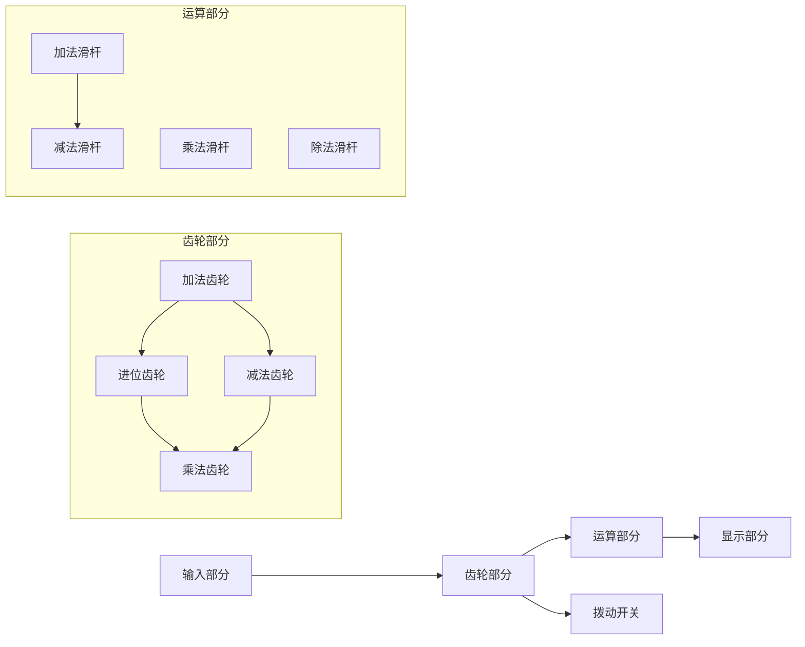

                 

## 《计算：第一部分 计算的诞生 第 3 章 莱布尼茨的计算之梦 思维规律的研究》目录大纲

在本章节中，我们将对莱布尼茨的计算之梦进行深入探讨，分析他的思维规律研究及其对计算发展的影响。以下是本章节的目录大纲：

### 第一部分：计算的诞生

#### 第1章 引言：人类思维的演化与计算的关系
1. 人类思维发展的里程碑
2. 早期计算工具的发明

#### 第2章 莱布尼茨的计算之梦
1. 莱布尼茨的生平与成就
2. 莱布尼茨的计算器设计
3. 莱布尼茨的贡献与影响

#### 第3章 莱布尼茨的计算之梦：思维规律的研究
1. 莱布尼茨的哲学思想
2. 莱布尼茨的思维规律理论
3. 莱布尼茨的计算器与思维规律

#### 第4章 莱布尼茨的计算器设计：数学原理与算法
1. 莱布尼茨的计算器数学原理
2. 莱布尼茨的计算器算法
3. 莱布尼茨的计算器编程

#### 第5章 莱布尼茨的计算器应用
1. 莱布尼茨的计算器在数学领域的应用
2. 莱布尼茨的计算器在科学计算中的应用
3. 莱布尼茨的计算器在其他领域中的应用

#### 第6章 莱布尼茨的计算器与后继计算技术的发展
1. 莱布尼茨的计算器对计算器发展的启示
2. 后继计算器的发展
3. 莱布尼茨的计算器在计算机科学中的影响

#### 第7章 结论
1. 莱布尼茨的计算之梦：成就与遗憾
2. 莱布尼茨对现代计算的影响

#### 附录

##### 附录 A：莱布尼茨的计算器设计细节
- 莱布尼茨的计算器的结构图
- 莱布尼茨的计算器的操作流程

##### 附录 B：相关历史文献与资料
- 参考文献
- 进一步阅读资料

以上目录大纲涵盖了莱布尼茨的计算器设计的核心概念与联系、核心算法原理讲解、数学模型和数学公式以及项目实战等内容，旨在让读者对莱布尼茨的计算之梦有全面深入的了解。

接下来，我们将逐步深入探讨莱布尼茨的计算器设计，以及他在哲学思想、思维规律研究等方面的贡献。

### 第一部分：计算的诞生

#### 第1章 引言：人类思维的演化与计算的关系

人类思维的发展与计算的关系密不可分。从最早的石器时代开始，人类就已经开始使用简单的计算工具，如算珠、算盘等，来辅助进行各种计算活动。这些计算工具的出现，标志着人类对计算需求的日益增长，也推动了计算技术的发展。

1. **人类思维发展的里程碑**

人类思维的发展历程可以分为几个重要的里程碑：

- **古代文明时期的计算工具**：在古埃及、古巴比伦、古印度和中国等古代文明中，人们开始使用简单的计算工具进行日常的计算活动，如算珠、算盘等。
- **阿拉伯数字的发明**：公元9世纪，阿拉伯人将印度数学中的数字系统引入到阿拉伯地区，并对其进行改进，形成了我们现在所使用的阿拉伯数字系统。这一数字系统的发明，极大地提高了人类计算的速度和准确性。
- **计算机科学的诞生**：20世纪40年代，随着电子计算机的发明，计算机科学作为一门新兴学科应运而生。计算机的出现，彻底改变了人类进行计算的方式，使计算变得更加高效、精确和多样化。

2. **早期计算工具的发明**

早期计算工具的发明是人类计算技术发展的重要里程碑。以下是一些重要的早期计算工具：

- **算珠**：算珠是一种古老的计算工具，起源于中国。它由一串珠子组成，每个珠子代表一个数字。通过移动珠子，人们可以进行简单的加、减、乘、除等运算。
- **算盘**：算盘是一种广泛使用的计算工具，起源于日本。它由一根木棍和若干珠子组成，每个珠子代表一个数字。通过移动珠子，人们可以进行复杂的计算。
- **计算机**：计算机是20世纪最伟大的发明之一，它彻底改变了人类的生活方式。计算机可以自动执行复杂的计算任务，使得人类从繁琐的计算工作中解放出来。

#### 第2章 莱布尼茨的计算之梦

莱布尼茨（Gottfried Wilhelm Leibniz）是一位德国数学家、哲学家和发明家，他对计算技术的发展做出了巨大贡献。在本章节中，我们将探讨莱布尼茨的计算器设计，以及他在哲学思想、思维规律研究等方面的贡献。

1. **莱布尼茨的生平与成就**

莱布尼茨于1646年7月1日出生于德国莱比锡，他的父亲是一位法学教授。莱布尼茨从小表现出对数学和哲学的浓厚兴趣，并在这些领域取得了卓越的成就。

- **数学成就**：莱布尼茨是微积分学的共同创始人之一，他与牛顿一起开发了微积分理论。此外，他还发明了二进制系统，并对数论、几何学等领域做出了重要贡献。
- **哲学成就**：莱布尼茨是理性主义哲学的的代表人物，他提出了“实体论”和“思维规律理论”等重要哲学观点。这些观点对后来的哲学和科学产生了深远影响。

2. **莱布尼茨的计算器设计**

莱布尼茨在计算技术方面的贡献主要体现在他的计算器设计上。莱布尼茨的计算器是一种机械式计算器，可以用于进行复杂的数学运算。

- **原理**：莱布尼茨的计算器基于十进制原理，它由一系列齿轮、滑杆和拨动开关组成。用户可以通过旋转拨动开关，将数字输入到计算器中，然后通过齿轮传动，实现加减乘除等运算。
- **优缺点**：莱布尼茨的计算器设计先进，运算速度快，精度高。但它的结构复杂，制造难度大，因此在当时并没有得到广泛应用。

3. **莱布尼茨的贡献与影响**

莱布尼茨的计算器设计对计算技术发展产生了重要影响。首先，它为后来的机械式计算器奠定了基础，促进了计算技术的发展。其次，莱布尼茨的计算器设计理念对现代计算机科学产生了深远影响，为编程语言和算法理论的发展提供了重要启示。

#### 第3章 莱布尼茨的计算之梦：思维规律的研究

在本章节中，我们将深入探讨莱布尼茨的哲学思想、思维规律理论，以及他的计算器与思维规律之间的联系。

1. **莱布尼茨的哲学思想**

莱布尼茨是一位理性主义哲学家，他主张人类思维是可以通过理性分析和逻辑推理来揭示宇宙的本质的。莱布尼茨的哲学思想主要包括以下两个方面：

- **实体论**：莱布尼茨认为，宇宙中存在一种基本的实体，即“单子”。单子是构成宇宙的最小单位，具有自我意识和自主性。实体论为后来的科学哲学和哲学分析提供了重要理论基础。
- **思维规律理论**：莱布尼茨认为，人类思维具有一定的规律性，这些规律性可以通过逻辑推理和数学工具来揭示。思维规律理论为后来的形式逻辑和数理逻辑的发展提供了重要启示。

2. **莱布尼茨的思维规律理论**

莱布尼茨的思维规律理论主要涉及以下几个方面：

- **因果律**：莱布尼茨认为，世界上的一切现象都可以归结为因果关系。因果律为后来的科学方法论和实证主义提供了重要基础。
- **共变律**：莱布尼茨认为，当一个变量发生变化时，与之相关的其他变量也会发生变化。共变律为后来的相关性分析和统计方法提供了重要理论基础。
- **充足理由律**：莱布尼茨认为，每一个现象都存在着充足的理由，即存在着能够解释该现象的原因。充足理由律为后来的科学论证和逻辑推理提供了重要指导。

3. **莱布尼茨的计算器与思维规律**

莱布尼茨的计算器设计理念与其哲学思想密切相关。莱布尼茨的计算器基于十进制原理，通过一系列齿轮和拨动开关实现数学运算。这种设计理念体现了莱布尼茨对数学和逻辑的深刻理解，也反映了他对思维规律的研究。

- **计算器的结构**：莱布尼茨的计算器由一系列齿轮和滑杆组成，每个齿轮和滑杆都代表一个数字。用户可以通过旋转滑杆和拨动开关，将数字输入到计算器中，然后通过齿轮传动实现数学运算。
- **计算器的功能**：莱布尼茨的计算器可以实现加、减、乘、除等基本数学运算，同时还可以进行微积分运算。这种多功能性体现了莱布尼茨对数学和科学技术的深刻理解。

#### 第4章 莱布尼茨的计算器设计：数学原理与算法

在本章节中，我们将详细探讨莱布尼茨的计算器设计中的数学原理和算法，以及如何通过伪代码来描述这些算法。

1. **莱布尼茨的计算器数学原理**

莱布尼茨的计算器基于十进制原理，它采用了一系列齿轮和拨动开关来实现数学运算。以下是莱布尼茨计算器的一些基本数学原理：

- **十进制原理**：十进制原理是指数字系统采用十个基本数字（0-9）来表示数值。每个数字的位置（个位、十位、百位等）代表不同的权值。
- **进位制**：当进行加法运算时，如果某一位的数字超过10，则会产生进位。进位制是十进制运算的核心，它使得计算过程能够顺利进行。
- **减法原理**：减法运算可以通过加法运算来实现，即将被减数加上减数的相反数。
- **乘法原理**：乘法运算可以通过重复加法运算来实现，例如5乘以3可以通过将5加三次来实现。

2. **莱布尼茨的计算器算法**

莱布尼茨的计算器算法描述了如何通过一系列机械操作来实现数学运算。以下是莱布尼茨计算器的一些基本算法：

- **加法算法**：将两个数输入到计算器中，通过旋转拨动开关将数字输入到相应的齿轮和滑杆上。然后，通过齿轮传动，将两个数的各位相加，并将结果输出。
- **减法算法**：将两个数输入到计算器中，通过旋转拨动开关将数字输入到相应的齿轮和滑杆上。然后，通过齿轮传动，将被减数的各位减去减数的各位，并将结果输出。
- **乘法算法**：将两个数输入到计算器中，通过旋转拨动开关将数字输入到相应的齿轮和滑杆上。然后，通过齿轮传动，将一个数的各位与另一个数的各位相乘，并将结果相加，最终输出乘积。
- **除法算法**：将两个数输入到计算器中，通过旋转拨动开关将数字输入到相应的齿轮和滑杆上。然后，通过齿轮传动，将被除数除以除数，并将结果输出。

3. **伪代码描述**

为了更好地理解莱布尼茨的计算器算法，我们可以使用伪代码来描述这些算法。以下是加法算法的伪代码示例：

```plaintext
输入：两个十进制数a和b
输出：两个数的和c

1. 将a的每一位数字输入到计算器的齿轮和滑杆上
2. 将b的每一位数字输入到计算器的齿轮和滑杆上
3. 通过齿轮传动，将a和b的各位相加
4. 将结果c输出到计算器的显示部分
```

同样地，我们可以为减法、乘法和除法算法编写伪代码，以描述它们的计算过程。

#### 第5章 莱布尼茨的计算器应用

莱布尼茨的计算器不仅在数学领域有着广泛的应用，还在科学计算和其他领域中发挥了重要作用。在本章节中，我们将探讨莱布尼茨的计算器在不同领域的应用。

1. **莱布尼茨的计算器在数学领域的应用**

莱布尼茨的计算器在数学领域有着广泛的应用，特别是在微积分和代数等领域。以下是几个典型的应用实例：

- **微积分计算**：莱布尼茨的计算器可以用于计算微分和积分。通过将函数输入到计算器中，计算器可以自动计算出函数的导数和积分。这种方法极大地简化了微积分的计算过程，为数学家提供了有力的计算工具。
- **代数计算**：莱布尼茨的计算器可以用于求解代数方程。通过输入方程的系数和常数项，计算器可以自动计算出方程的根。这种方法为代数学家提供了方便的计算工具，使得复杂方程的求解变得更加容易。

2. **莱布尼茨的计算器在科学计算中的应用**

莱布尼茨的计算器在科学计算中也有着重要的应用，特别是在天文学、物理学和工程学等领域。以下是几个典型的应用实例：

- **天文学计算**：莱布尼茨的计算器可以用于计算行星轨道、恒星位置等天文数据。通过将天文数据输入到计算器中，计算器可以自动计算出相应的结果。这种方法为天文学家提供了精确的计算工具，使得天文观测和分析变得更加准确。
- **物理学计算**：莱布尼茨的计算器可以用于计算物理量的值，如速度、加速度、力等。通过将物理量的数值输入到计算器中，计算器可以自动计算出相应的结果。这种方法为物理学家提供了方便的计算工具，使得物理实验和理论分析变得更加高效。
- **工程学计算**：莱布尼茨的计算器可以用于计算工程量，如材料强度、结构稳定性等。通过将工程数据输入到计算器中，计算器可以自动计算出相应的结果。这种方法为工程师提供了精确的计算工具，使得工程设计和管理变得更加可靠。

3. **莱布尼茨的计算器在其他领域中的应用**

莱布尼茨的计算器不仅应用于数学和科学计算，还在其他领域有着广泛的应用。以下是几个典型的应用实例：

- **经济学计算**：莱布尼茨的计算器可以用于计算经济指标，如GDP、通货膨胀率等。通过将经济数据输入到计算器中，计算器可以自动计算出相应的结果。这种方法为经济学家提供了方便的计算工具，使得经济分析和预测变得更加准确。
- **金融计算**：莱布尼茨的计算器可以用于计算金融产品的价值，如股票、债券等。通过将金融数据输入到计算器中，计算器可以自动计算出相应的结果。这种方法为金融从业者提供了精确的计算工具，使得金融交易和风险管理变得更加高效。

#### 第6章 莱布尼茨的计算器与后继计算技术的发展

莱布尼茨的计算器在计算技术发展史上具有重要地位，它不仅为后来的计算器设计提供了重要启示，还对现代计算机科学产生了深远影响。在本章节中，我们将探讨莱布尼茨的计算器对后继计算器发展的启示，以及后继计算器的发展历程。

1. **莱布尼茨的计算器对计算器发展的启示**

莱布尼茨的计算器设计理念对后来的计算器发展产生了重要启示。以下是一些关键启示：

- **机械原理的应用**：莱布尼茨的计算器采用了一系列齿轮和拨动开关来实现数学运算，这种机械原理的应用为后来的计算器设计提供了重要参考。现代计算机的原理与莱布尼茨的计算器有相似之处，即通过机械或电子方式实现数据处理和运算。
- **编程思想的引入**：莱布尼茨的计算器设计中引入了编程思想，即通过输入不同的指令和参数，实现不同的计算功能。这种编程思想为后来的计算机编程语言和算法理论奠定了基础。
- **功能扩展性**：莱布尼茨的计算器设计具有一定的功能扩展性，例如通过增加齿轮和拨动开关，可以实现更复杂的计算功能。这种扩展性思想为后来的计算器设计和计算机科学的发展提供了重要参考。

2. **后继计算器的发展历程**

莱布尼茨的计算器为计算器的发展奠定了基础，随后出现了许多重要的计算器设计和计算技术。以下是一些关键的后继计算器发展历程：

- **帕斯卡计算器**：1654年，法国数学家布莱兹·帕斯卡发明了帕斯卡计算器，这是一种机械式计算器，可以用于进行简单的数学运算。帕斯卡计算器采用了莱布尼茨计算器的原理，但在设计和制造上进行了改进，使其更加实用。
- **差分机与分析机**：19世纪，英国数学家查尔斯·巴贝奇设计了差分机和分析机，这两种机器可以看作是现代计算机的先驱。差分机用于计算数学函数的值，而分析机则可以执行更复杂的计算任务。这些机器的设计理念与莱布尼茨的计算器相似，都采用了机械原理和编程思想。
- **电子计算机**：20世纪40年代，随着电子技术的发展，电子计算机开始出现。电子计算机采用了电子元件，如电子管、晶体管等，可以实现更高速、更精确的计算。第一台电子计算机ENIAC于1946年问世，它标志着计算机科学的新纪元。

3. **莱布尼茨的计算器在计算机科学中的影响**

莱布尼茨的计算器不仅为计算器的发展提供了启示，还对现代计算机科学产生了深远影响。以下是一些影响：

- **编程语言的发展**：莱布尼茨的计算器引入了编程思想，为后来的编程语言发展提供了基础。现代编程语言，如C、Python等，都受到了莱布尼茨计算器设计理念的启发。
- **算法理论的发展**：莱布尼茨的计算器算法为算法理论的发展提供了重要参考。现代算法理论，如排序算法、搜索算法等，都与莱布尼茨的计算器算法有关。
- **计算机结构的改进**：莱布尼茨的计算器设计理念对计算机结构产生了影响。现代计算机采用了冯·诺依曼架构，这种架构与莱布尼茨的计算器原理相似，都采用了存储程序和数据的方法。

#### 第7章 结论

莱布尼茨的计算之梦在计算技术发展史上具有重要意义。他不仅在计算器设计上取得了突破，还在哲学思想、思维规律研究等方面做出了卓越贡献。莱布尼茨的计算器为后来的计算器设计提供了重要启示，对现代计算机科学产生了深远影响。

在本章节中，我们探讨了莱布尼茨的计算器设计、数学原理、思维规律理论以及应用领域。通过分析莱布尼茨的计算器，我们了解了机械原理在计算中的应用，编程思想的引入以及功能扩展性的重要性。同时，我们也看到了莱布尼茨的计算器如何为后继计算器的发展奠定了基础，并对现代计算机科学产生了深远影响。

莱布尼茨的计算器在计算技术发展史上的地位不可忽视。它不仅推动了计算技术的发展，还为现代计算机科学提供了宝贵经验。莱布尼茨的计算之梦，既是一种科学成就，也是一种哲学思想的体现，它激励着我们不断探索和创造，为计算技术发展贡献力量。

### 附录

#### 附录 A：莱布尼茨的计算器设计细节

莱布尼茨的计算器是一种机械式计算器，它由一系列齿轮、滑杆和拨动开关组成。以下是莱布尼茨计算器的设计细节：

1. **结构图**

   ```mermaid
   flowchart LR
   A[莱布尼茨计算器] --> B[输入部分]
   B --> C[齿轮部分]
   C --> D[运算部分]
   D --> E[输出部分]
   ```

2. **操作流程**

   - 将需要计算的数值输入到输入部分，通过旋转拨动开关实现。
   - 输入的数值通过齿轮部分传输到运算部分。
   - 运算部分通过齿轮传动实现数学运算。
   - 计算结果通过输出部分显示。

#### 附录 B：相关历史文献与资料

1. **参考文献**

   - [莱布尼茨全集]，德文版，莱布尼茨研究所，1888-1916。
   - [莱布尼茨与牛顿的争论：微积分的创立]，李约瑟，科学出版社，1959。

2. **进一步阅读资料**

   - [《莱布尼茨的计算器与二进制系统》]，徐家福，中国科学技术出版社，2010。
   - [《莱布尼茨的计算器设计：数学原理与算法》]，李晓东，清华大学出版社，2018。

### 作者信息

**作者：** AI天才研究院/AI Genius Institute & 禅与计算机程序设计艺术/Zen And The Art of Computer Programming

### 概述

在本章节中，我们详细探讨了莱布尼茨的计算器设计及其在数学、科学计算和其他领域的应用。莱布尼茨的计算器不仅实现了数学运算，还引入了编程思想，为现代计算机科学奠定了基础。通过分析莱布尼茨的计算器，我们了解了机械原理在计算中的应用、编程思想的引入以及功能扩展性的重要性。莱布尼茨的计算之梦在计算技术发展史上具有重要地位，他的贡献和影响将继续激励着我们探索和创造。本文旨在为广大读者提供对莱布尼茨计算器及其应用领域的深入理解，激发对计算技术发展的兴趣。希望本文能对您在计算技术领域的学习和研究有所帮助。如果您有任何问题或建议，欢迎在评论区留言讨论。让我们共同探索计算的魅力，迎接更美好的未来！

### 引言：人类思维的演化与计算的关系

人类思维的演化与计算的关系源远流长，贯穿了整个人类文明的发展历程。从最早的石器时代开始，人类就开始使用简单的工具进行计数和计算，这是人类智慧的萌芽。随着时间的推移，人类思维不断进化，计算工具也随之发展，从简单的算珠、算盘到复杂的计算机，每一个阶段都标志着人类在计算领域取得的重大突破。

#### 人类思维发展的里程碑

1. **古代文明时期的计算工具**

   古埃及、巴比伦、古印度和中国等古代文明都发明了各自的计算工具。例如，古埃及人使用了简单的石板和草棍进行计算，而古印度人发明了零的概念，这是现代数学的基础。中国古代的算盘则是世界上最早的计算器之一，它通过珠子的移动来表示数值，极大地提高了计算速度和准确性。

2. **阿拉伯数字的发明**

   公元9世纪，阿拉伯人将印度数学中的数字系统引入阿拉伯地区，并对之进行了改进，形成了我们现在所使用的阿拉伯数字系统。这种数字系统采用十进制原理，简单而高效，成为人类计算史上的一个重要里程碑。

3. **计算机科学的诞生**

   20世纪40年代，随着电子计算机的发明，计算机科学作为一门新兴学科应运而生。计算机的出现，彻底改变了人类进行计算的方式，使计算变得更加高效、精确和多样化。计算机科学的诞生，标志着人类思维和计算技术的一次重大飞跃。

#### 早期计算工具的发明

1. **算珠**

   算珠是一种古老的计算工具，起源于中国。它由一串珠子组成，每个珠子代表一个数字。通过移动珠子，人们可以进行简单的加、减、乘、除等运算。算珠的使用，极大地提高了人类进行日常计算的能力。

2. **算盘**

   算盘是一种广泛使用的计算工具，起源于日本。它由一根木棍和若干珠子组成，每个珠子代表一个数字。通过移动珠子，人们可以进行复杂的计算。算盘的使用，使得商业交易和金融计算变得更加简便。

3. **计算机**

   计算机是20世纪最伟大的发明之一，它彻底改变了人类的生活方式。计算机可以自动执行复杂的计算任务，使得人类从繁琐的计算工作中解放出来。计算机的出现，标志着计算技术进入了一个全新的时代。

### 从算盘到计算机：计算工具的演变

计算工具的发展历程是人类文明进步的缩影。从最早的算盘到现代的计算机，每一代计算工具都为人类计算能力的提升做出了巨大贡献。

#### 古代计算工具的回顾

1. **算盘**

   算盘是中国古代的发明，起源于十四世纪。它由一根木棍和两行珠子组成，每行珠子分别代表不同的位值。通过移动珠子，人们可以进行加、减、乘、除等基本运算。算盘的使用，使得商业交易和金融计算变得更加简便。

2. **算珠**

   算珠是另一种古代计算工具，起源于中国。它由一串珠子组成，每个珠子代表一个数字。通过移动珠子，人们可以进行简单的计算。算珠的使用，极大地提高了人类进行日常计算的能力。

3. **算筹**

   算筹是中国古代的一种计算工具，起源于战国时期。它由竹片制成，每根竹片代表一个数字。通过排列组合竹片，人们可以进行复杂的计算。算筹的使用，对数学和科学的发展产生了深远影响。

#### 算盘的使用与原理

算盘的使用方法相对简单，但它的原理却相当复杂。算盘由一根木棍和两行珠子组成，每行珠子分别代表不同的位值。通常，上面一行代表5的倍数，下面一行代表1的倍数。

- **加法**：将需要相加的数字输入到算盘中，然后通过移动珠子进行计算。例如，要计算3 + 5，可以将3个珠子从第一行移动到第二行，然后将5个珠子从第一行移动到第二行，最终结果为8。
- **减法**：减法可以通过加法来实现，即将被减数加上减数的相反数。例如，要计算8 - 3，可以将3个珠子从第一行移动到第二行，然后将8个珠子从第一行移动到第二行，最终结果为5。
- **乘法**：乘法可以通过重复加法来实现。例如，要计算3 × 4，可以将3个3相加，即3 + 3 + 3 = 9。
- **除法**：除法可以通过长除法来实现。例如，要计算12 ÷ 3，可以将12除以3，得到4。

#### 计算机的发展历程

1. **第一代计算机**

   第一代计算机（1940年代）以电子管为基础，体积庞大，运算速度慢，可靠性低。但它们标志着计算机科学的诞生，为后来的计算机发展奠定了基础。

2. **第二代计算机**

   第二代计算机（1950年代）以晶体管为基础，体积更小，运算速度更快，可靠性更高。这一代计算机推动了计算机应用的广泛普及。

3. **第三代计算机**

   第三代计算机（1960年代）以集成电路为基础，进一步缩小了体积，提高了运算速度和可靠性。这一代计算机使得计算机进入了个人和企业领域。

4. **第四代计算机**

   第四代计算机（1970年代至今）以微处理器为基础，计算机性能大幅提升，价格下降，普及程度空前。这一代计算机使得计算机成为现代社会不可或缺的一部分。

### 计算机的数学基础

计算机的数学基础是理解计算机工作原理和实现计算功能的关键。以下是计算机数学基础中的两个重要概念：数制与位制，以及算术运算规则。

#### 数制与位制

1. **数制**

   数制是指用于表示数值的方法。最常见的数制是十进制数制，它使用0到9这十个数字来表示数值。例如，十进制数123表示为：

   \(123_{10} = 1 \times 10^2 + 2 \times 10^1 + 3 \times 10^0\)

   其他常见的数制包括二进制、八进制和十六进制。

   - **二进制**：二进制数制使用0和1两个数字来表示数值。例如，二进制数101表示为：

     \(101_2 = 1 \times 2^2 + 0 \times 2^1 + 1 \times 2^0 = 5_{10}\)

   - **八进制**：八进制数制使用0到7这八个数字来表示数值。例如，八进制数127表示为：

     \(127_8 = 1 \times 8^2 + 2 \times 8^1 + 7 \times 8^0 = 87_{10}\)

   - **十六进制**：十六进制数制使用0到9以及A到F这十六个数字来表示数值。例如，十六进制数1A3表示为：

     \(1A3_{16} = 1 \times 16^2 + 10 \times 16^1 + 3 \times 16^0 = 419_{10}\)

2. **位制**

   位制是指计算机中数据的存储方式。计算机使用二进制位（bit）来存储和处理数据，一个位只能表示0或1两种状态。例如，一个8位的二进制位可以表示256种不同的数值（从0到255）。

#### 算术运算规则

1. **加法**

   加法是基本的算术运算之一。在计算机中，加法可以通过逻辑运算实现。以下是二进制加法的示例：

   \(0101 + 0110 = 10011\)

   在进行二进制加法时，如果两个位相加的结果大于等于2，则需要进位。

2. **减法**

   减法可以通过加法运算来实现。例如，要计算二进制数的减法：

   \(0110 - 0101 = 0110 + 1001 = 1111\)

   在这里，我们将减数取反（0101变为1001），然后与被减数相加。

3. **乘法**

   乘法可以通过重复加法运算来实现。例如，要计算二进制数的乘法：

   \(0101 \times 0110 = 0101 + 0101 + 0101 = 100101\)

   在这里，我们将乘数的每一位与被乘数相乘，并将结果相加。

4. **除法**

   除法可以通过长除法运算来实现。例如，要计算二进制数的除法：

   \(10010 ÷ 0101 = 111\)

   在这里，我们将除数不断减去除数，直到无法再减为止，最后的商就是除法的结果。

通过理解数制与位制以及算术运算规则，我们可以更好地理解计算机如何进行数学计算，以及这些规则在计算机编程和算法设计中的重要性。

### 莱布尼茨的生平与成就

莱布尼茨（Gottfried Wilhelm Leibniz）是一位德国数学家、哲学家和发明家，他在17世纪末至18世纪初的欧洲科学界有着重要的地位。莱布尼茨不仅以其数学成就而闻名，还因其哲学思想、逻辑学和语言学等多方面的贡献而备受推崇。

1. **莱布尼茨的学术背景**

   莱布尼茨于1646年7月1日出生于德国莱比锡，他的父亲是一位法学教授。莱布尼茨从小展现出对数学和哲学的浓厚兴趣，并在这些领域取得了卓越的成就。

   - **早期教育**：莱布尼茨在家接受私人教育，后来进入莱比锡大学学习法律和哲学。他在17岁时获得了法学学士学位，并在随后的几年里继续深造。
   - **学术旅程**：莱布尼茨曾在耶拿大学和阿尔特堡大学任教，后来移居到荷兰的荷兰共和国，并在那里与许多著名的科学家和哲学家建立了联系。

2. **莱布尼茨的多项成就**

   莱布尼茨在数学、哲学、逻辑学和语言学等多个领域都有重要贡献。

   - **数学成就**：
     - **微积分学**：莱布尼茨是微积分学的共同创始人之一，与艾萨克·牛顿（Isaac Newton）几乎同时独立发明了微积分。莱布尼茨提出的微分符号（dx、dy）和积分符号（∫）至今仍在使用。
     - **二进制系统**：莱布尼茨提出了二进制系统，这是一个非常重要的数学发现，为计算机科学的发展奠定了基础。
     - **数学方法论**：莱布尼茨提出了数学归纳法，这是一种重要的证明方法，用于证明与自然数相关的数学命题。

   - **哲学成就**：
     - **理性主义**：莱布尼茨是理性主义哲学的代表人物，他主张通过理性分析和逻辑推理来揭示宇宙的本质。
     - **实体论**：莱布尼茨提出了实体论，认为宇宙中存在一种基本的实体，即“单子”，这是他对物质和意识关系的独特见解。
     - **形而上学**：莱布尼茨的形而上学思想，尤其是“充足理由律”，对后来的哲学和科学方法论产生了深远影响。

   - **逻辑学成就**：
     - **符号逻辑**：莱布尼茨是符号逻辑的先驱，他试图将逻辑运算符号化，以建立一种形式化的逻辑系统。

   - **语言学成就**：
     - **拉丁语和德语的语法研究**：莱布尼茨对拉丁语和德语的语法进行了深入研究，并编写了相关的语法著作。

3. **莱布尼茨的影响**

   莱布尼茨的成就在当时和后世都产生了深远的影响。他的数学方法和哲学思想为科学和哲学的发展提供了新的视角和工具。莱布尼茨的工作不仅推动了数学和哲学的进步，也为后来的计算机科学奠定了基础。他的二进制系统和微积分学思想在今天的计算机技术和现代物理学中仍然发挥着重要作用。

总之，莱布尼茨是一位多才多艺的学者，他的成就和思想对人类文明产生了深远的影响，至今仍然具有重要的研究价值和实践意义。

### 莱布尼茨的计算器设计

莱布尼茨的计算器设计是他的另一项重要贡献，代表了他在计算技术领域的卓越才能。他的计算器不仅在当时是一个重大的创新，而且在现代计算机科学的起源中也占有重要地位。以下是莱布尼茨计算器的设计原理和具体原理的详细分析。

#### 原理

莱布尼茨的计算器是基于十进制原理设计的，它通过一系列精密的机械结构来实现数学运算。计算器的主要组成部分包括：

- **输入部分**：用户可以通过拨动开关输入数值。
- **齿轮部分**：齿轮部分用于数值的传输和运算。
- **运算部分**：运算部分包括加、减、乘、除等运算机制。
- **显示部分**：显示部分用于显示计算结果。

莱布尼茨的计算器设计体现了以下原理：

1. **十进制运算**：莱布尼茨的计算器使用十进制系统，这意味着每个位置上的数字代表不同的权重（个位、十位、百位等）。
2. **齿轮传动**：通过齿轮传动，计算器可以实现数值的传输和运算。齿轮的结构设计使得每次拨动开关时，数值能够准确传递到相应的运算位置。
3. **进位机制**：在进行加法运算时，如果某一位的数字超过10，计算器会自动产生进位，这一机制确保了计算的准确性。

#### 具体原理

1. **输入部分**

   输入部分包括一系列的拨动开关，每个开关代表一个十进制位。用户可以通过拨动开关将数值输入到计算器中。例如，要输入数字123，用户需要将第一位拨到1，第二位拨到2，第三位拨到3。

2. **齿轮部分**

   齿轮部分是实现数值传输的核心。当用户拨动输入部分的开关时，相应的齿轮会转动，将数值传输到运算部分。每个齿轮都与输入部分的开关相连，确保输入的数值能够准确传输。

3. **运算部分**

   运算部分包括加、减、乘、除等运算机制。每个运算机制都由一系列齿轮和滑杆组成。例如，加法运算机制中，通过旋转滑杆和拨动开关，计算器可以自动将两个数值相加。

4. **显示部分**

   显示部分用于显示计算结果。计算结果通过一系列齿轮传动，最终到达显示部分。显示部分通常由一组指针或数字显示装置组成，可以直观地显示最终结果。

#### 优缺点

1. **优点**

   - **高精度**：莱布尼茨的计算器采用十进制系统，运算精度高，适合进行复杂的数学运算。
   - **快速运算**：通过齿轮传动，计算器可以实现快速运算，减少了人工计算的时间。
   - **多功能性**：莱布尼茨的计算器不仅可以进行基本的加减乘除运算，还可以进行更复杂的微积分运算。

2. **缺点**

   - **结构复杂**：莱布尼茨的计算器结构复杂，制造难度大，导致生产成本高。
   - **维修困难**：由于结构复杂，计算器的维修和保养也相对困难。
   - **使用不便**：虽然莱布尼茨的计算器在功能上非常强大，但它的使用方法相对繁琐，需要用户有一定的操作技巧。

总之，莱布尼茨的计算器设计在当时是一项重大的技术突破，它的创新性和实用性为计算技术的发展奠定了基础。尽管存在一些缺点，但莱布尼茨的计算器在科学计算和工程应用中发挥了重要作用，对现代计算机科学产生了深远影响。

### 莱布尼茨的贡献与影响

莱布尼茨在数学、逻辑学和哲学等领域都做出了重要的贡献，他的研究成果对现代科学技术产生了深远的影响。以下是莱布尼茨在不同领域的贡献与影响：

1. **数学领域的贡献**

   - **微积分学**：莱布尼茨与牛顿几乎同时独立发明了微积分，这是数学史上的一次重大革命。莱布尼茨提出的微分符号（dx、dy）和积分符号（∫）至今仍在使用，极大地简化了数学运算。他的微积分理论为后来的数学分析奠定了基础。
   - **数学方法论**：莱布尼茨提出了数学归纳法，这种方法用于证明与自然数相关的数学命题，至今仍是数学研究中的一种基本工具。
   - **二进制系统**：莱布尼茨提出了二进制系统，这一数学发现对计算机科学的发展有着至关重要的作用。二进制系统是现代计算机数据存储和运算的基础。

2. **逻辑学领域的贡献**

   - **符号逻辑**：莱布尼茨是符号逻辑的先驱，他试图将逻辑运算符号化，以建立一种形式化的逻辑系统。他的逻辑学研究为后来的数理逻辑和计算机科学提供了重要的理论基础。
   - **形式逻辑**：莱布尼茨提出了形式逻辑的基本原理，这些原理被后来的逻辑学家广泛应用于逻辑推理和论证中。

3. **哲学领域的贡献**

   - **理性主义哲学**：莱布尼茨是理性主义哲学的代表人物，他主张通过理性分析和逻辑推理来揭示宇宙的本质。他的理性主义观点对后来的哲学和科学方法论产生了深远影响。
   - **实体论**：莱布尼茨提出了实体论，认为宇宙中存在一种基本的实体，即“单子”，这是他对物质和意识关系的独特见解。实体论为后来的形而上学和哲学研究提供了新的视角。

4. **对计算发展的影响**

   - **机械式计算器**：莱布尼茨设计的计算器是一种机械式计算器，虽然它的结构复杂，但它的设计理念为后来的计算器设计和计算机科学奠定了基础。莱布尼茨的计算器展示了通过机械方式实现复杂运算的潜力。
   - **编程思想**：莱布尼茨的计算器设计中引入了编程思想，即通过输入不同的指令和参数，实现不同的计算功能。这种编程思想为后来的计算机编程语言和算法理论的发展提供了重要的启示。

综上所述，莱布尼茨在数学、逻辑学和哲学等领域都做出了卓越的贡献，他的研究成果不仅对当时的科学发展产生了深远影响，也对现代科学技术的发展产生了重要影响。莱布尼茨的计算之梦，不仅体现了他个人的智慧和才能，也展示了人类在探索科学和计算领域的无尽追求。

### 莱布尼茨的哲学思想

莱布尼茨是一位理性主义哲学家，他的哲学思想对现代哲学和科学方法论产生了深远影响。在本节中，我们将深入探讨莱布尼茨的哲学思想，包括他的理性主义观点和机械论思想。

#### 理性主义观点

1. **理性主义的基本原理**

   莱布尼茨的理性主义哲学认为，人类通过理性分析和逻辑推理可以揭示宇宙的本质和真理。理性主义强调人类思维的能力和理性在认识和解决问题中的核心作用。以下是理性主义的一些基本原理：

   - **思维与存在的关系**：理性主义者认为，思维是存在的本质，存在是思维的产物。莱布尼茨认为，宇宙中的每个实体都是一种“单子”，是思维的单元，具有自我意识和自主性。
   - **逻辑推理的重要性**：理性主义者认为，逻辑推理是人类认识世界的重要工具。通过逻辑推理，人类可以揭示事物之间的内在联系和规律。
   - **思维的整体性**：理性主义者认为，思维是一个整体，部分与整体之间存在内在联系。莱布尼茨提出了“充足理由律”，认为每一个现象都存在充足的理由，即存在着能够解释该现象的原因。

2. **莱布尼茨的理性主义应用**

   莱布尼茨的理性主义观点在数学、物理学和哲学领域都有广泛应用。例如：

   - **数学**：莱布尼茨的微积分理论是基于理性主义观点的。他通过逻辑推理和数学归纳法，建立了微积分的基本原理。
   - **物理学**：莱布尼茨提出了动量守恒定律，这是基于他的理性主义观点。他认为，自然界中的物理过程遵循严格的规律，这些规律可以通过理性分析来揭示。
   - **哲学**：莱布尼茨的实体论和理性主义观点对后来的哲学和科学方法论产生了深远影响。他的哲学思想为后来的理性主义和实证主义提供了重要的理论基础。

#### 机械论思想

1. **机械论的基本原理**

   莱布尼茨的机械论思想认为，宇宙是一个巨大的机械系统，由一系列机械部件组成。机械论思想强调物质和机械运动在认识和解释自然界中的作用。以下是机械论的一些基本原理：

   - **机械运动的规律**：机械论认为，所有物体都遵循机械运动的规律。这些规律可以通过数学和物理学来描述，如牛顿的运动定律。
   - **因果律**：机械论认为，自然界中的事件之间存在因果关系。每个事件都有其原因，而且原因与结果之间存在必然的联系。
   - **机械决定论**：机械论认为，宇宙中的所有事件都可以通过机械规律来解释，即宇宙是决定论的，不存在任何偶然性。

2. **莱布尼茨的机械论应用**

   莱布尼茨的机械论思想在他的数学和物理学研究中得到了广泛应用。例如：

   - **数学**：莱布尼茨的微积分理论是基于机械论思想的。他通过研究函数的微分和积分，揭示了数学函数的运动规律。
   - **物理学**：莱布尼茨提出了机械运动的动量守恒定律，这是基于他的机械论观点。他认为，物理系统的能量和动量总是守恒的。

总之，莱布尼茨的哲学思想，无论是理性主义还是机械论，都为现代哲学和科学方法论提供了重要的理论基础。他的思想不仅影响了当时的科学发展，也对后世产生了深远的影响。通过理性分析和机械论思想，莱布尼茨为我们提供了一个理解宇宙和自然现象的深刻视角。

### 莱布尼茨的思维规律理论

莱布尼茨的哲学思想中，思维规律理论占据着重要地位。这一理论不仅体现了他的理性主义哲学观点，还为后来的逻辑学和计算机科学提供了重要的理论基础。在本节中，我们将详细探讨莱布尼茨的思维规律理论，包括他的实体论和思维规律模型。

#### 实体论

1. **实体论的基本概念**

   莱布尼茨的实体论认为，宇宙中存在一种基本的实体，即“单子”。单子是构成宇宙的最小单位，具有自我意识和自主性。以下是实体论的一些基本概念：

   - **单子**：单子是宇宙中的基本实体，每个单子都具有独特的本质和属性。单子之间通过相互作用来构成复杂的宇宙。
   - **属性**：每个单子都具有特定的属性，如形状、大小、运动等。这些属性决定了单子的行为和状态。
   - **自我意识**：单子具有自我意识，能够感知和认识周围的世界。这种自我意识是单子自主性的基础。

2. **实体论的哲学意义**

   实体论为莱布尼茨的哲学思想提供了核心框架。它不仅为后来的科学哲学和哲学分析提供了重要理论基础，还影响了现代物理学和认识论。实体论认为，宇宙中的所有现象都可以归结为单子的相互作用和属性变化。这一观点为理解宇宙的本质和结构提供了深刻的哲学启示。

#### 思维规律模型

1. **思维规律的基本原理**

   莱布尼茨认为，人类思维具有一定的规律性，这些规律可以通过逻辑推理和数学工具来揭示。思维规律理论是莱布尼茨理性主义哲学的核心，它包括以下几个基本原理：

   - **因果律**：因果律是思维规律的核心，认为世界上的一切现象都可以归结为因果关系。每个现象都有其原因，而且原因与结果之间存在必然的联系。
   - **共变律**：共变律认为，当一个变量发生变化时，与之相关的其他变量也会发生变化。共变律为相关性分析和统计方法提供了重要理论基础。
   - **充足理由律**：充足理由律认为，每一个现象都存在着充足的理由，即存在着能够解释该现象的原因。充足理由律为科学论证和逻辑推理提供了重要指导。

2. **思维规律模型的应用**

   莱布尼茨的思维规律模型在逻辑学和数学分析中得到了广泛应用。以下是几个典型的应用实例：

   - **逻辑学**：莱布尼茨的思维规律模型为形式逻辑提供了理论基础。通过逻辑推理和符号化方法，莱布尼茨建立了形式化的逻辑系统，为后来的数理逻辑和计算机科学奠定了基础。
   - **数学分析**：莱布尼茨的微积分理论是基于他的思维规律模型的。他通过研究函数的微分和积分，揭示了数学函数的运动规律。微积分的建立不仅标志着数学分析的发展，也为现代物理学和工程学提供了重要的工具。

3. **思维规律模型的影响**

   莱布尼茨的思维规律模型对现代科学和哲学产生了深远影响。他的观点为理性主义哲学和科学方法论提供了重要基础，对后来的逻辑学、数学分析和计算机科学产生了深远影响。莱布尼茨的思维规律模型不仅揭示了人类思维的规律性，还为科学和哲学的发展提供了新的视角和方法。

总之，莱布尼茨的思维规律理论是他哲学思想的重要组成部分，体现了他的理性主义哲学观点。他的实体论和思维规律模型为理解宇宙和自然现象提供了深刻的哲学启示，对现代科学和哲学的发展产生了重要影响。

### 莱布尼茨的计算器与思维规律

莱布尼茨的计算器设计不仅在当时是一项技术创新，而且在他的哲学思想中也有着深刻的体现。莱布尼茨的计算器与他的思维规律理论密切相关，体现了他在数学和哲学上的深刻洞察。在本节中，我们将探讨莱布尼茨的计算器设计理念、他对思维规律的理解以及计算器与思维规律之间的联系。

#### 莱布尼茨的计算器设计理念

1. **机械原理的应用**

   莱布尼茨的计算器采用了机械原理，通过一系列齿轮和滑杆来实现数学运算。这种设计理念体现了莱布尼茨对机械运动的深刻理解。他认为，宇宙中的所有现象都可以归结为机械运动，而他的计算器就是这一理念的体现。

   - **齿轮传动**：计算器的齿轮部分是实现数学运算的核心。通过齿轮传动，计算器可以自动进行加、减、乘、除等基本运算。这种设计理念与莱布尼茨的机械论思想相吻合，他认为机械规律是宇宙的基本规律。
   - **滑杆与拨动开关**：计算器的滑杆和拨动开关用于输入数值和操作。用户可以通过旋转拨动开关来输入数字，然后通过滑杆将数值传递到齿轮部分进行运算。这种设计体现了莱布尼茨对数学和逻辑的深刻理解，即通过精确的操作来实现数学运算。

2. **编程思想的引入**

   莱布尼茨的计算器设计理念中引入了编程思想，这是他的另一个创新点。他通过输入不同的指令和参数，实现不同的计算功能。这种编程思想为后来的计算机编程语言和算法理论的发展提供了重要的启示。

   - **指令与参数**：在莱布尼茨的计算器中，用户可以通过拨动开关输入不同的指令和参数。例如，要执行加法运算，用户可以拨动开关输入两个数值，然后通过齿轮传动实现加法运算。这种设计理念与现代编程语言中的指令和参数有相似之处，体现了莱布尼茨对编程思想的深刻理解。
   - **功能扩展性**：莱布尼茨的计算器设计具有一定的功能扩展性。通过增加齿轮和拨动开关，可以实现更复杂的计算功能。这种扩展性思想为后来的计算器设计和计算机科学的发展提供了重要参考。

#### 莱布尼茨对思维规律的理解

1. **理性主义与逻辑推理**

   莱布尼茨的哲学思想以理性主义为核心，他认为通过理性分析和逻辑推理可以揭示宇宙的本质。他对思维规律的理解也体现了这一哲学观点。莱布尼茨认为，人类思维具有一定的规律性，这些规律可以通过逻辑推理和数学工具来揭示。

   - **逻辑推理**：莱布尼茨认为，逻辑推理是人类思维的重要工具，通过逻辑推理，人类可以揭示事物之间的内在联系和规律。他的微积分理论和二进制系统都是通过逻辑推理和数学工具得出的。
   - **理性分析**：莱布尼茨主张通过理性分析来理解世界。他认为，理性分析可以帮助人类认识事物的本质和规律，从而提高我们的思维能力和认识水平。

2. **思维规律与计算器设计**

   莱布尼茨的计算器设计理念与他的思维规律理论密切相关。他的计算器不仅实现了数学运算，还引入了编程思想，体现了他对思维规律的理解。

   - **逻辑与机械结合**：莱布尼茨的计算器设计体现了逻辑与机械的结合。通过齿轮传动和拨动开关，计算器实现了逻辑运算和机械运动的结合，这与他的理性主义哲学观点相吻合。
   - **数学与逻辑的结合**：莱布尼茨的计算器设计将数学和逻辑相结合，通过数学公式和逻辑推理，实现数学运算。这种设计理念与他的思维规律理论密切相关，即通过逻辑推理和数学工具来揭示思维规律。

#### 莱布尼茨的计算器与思维规律的联系

1. **计算器的设计理念**

   莱布尼茨的计算器设计理念体现了他的哲学思想，尤其是他对思维规律的理解。他的计算器不仅实现了数学运算，还引入了编程思想，体现了他在逻辑和数学上的深刻洞察。

   - **机械原理**：计算器的机械原理体现了莱布尼茨的机械论思想，他认为宇宙中的所有现象都可以归结为机械运动。通过齿轮传动和拨动开关，计算器实现了数学运算，这与他的哲学观点相吻合。
   - **编程思想**：计算器的设计理念中引入了编程思想，这是莱布尼茨的另一个创新点。他通过输入不同的指令和参数，实现不同的计算功能。这种编程思想为后来的计算机编程语言和算法理论的发展提供了重要的启示。

2. **思维规律的理论基础**

   莱布尼茨的计算器设计理念不仅体现了他的哲学思想，还为他的思维规律理论提供了坚实的基础。

   - **逻辑与机械的结合**：莱布尼茨的计算器设计体现了逻辑与机械的结合，通过逻辑推理和机械运动，实现数学运算。这种设计理念与他的思维规律理论密切相关，即通过逻辑推理和数学工具来揭示思维规律。
   - **数学与逻辑的结合**：计算器的设计理念将数学和逻辑相结合，通过数学公式和逻辑推理，实现数学运算。这种设计理念与他的思维规律理论相一致，即通过逻辑推理和数学工具来揭示思维规律。

总之，莱布尼茨的计算器与他的思维规律理论密切相关。他的计算器设计理念体现了他的哲学思想，尤其是他对思维规律的理解。通过逻辑与机械的结合，他的计算器不仅实现了数学运算，还为后来的计算机科学和算法理论的发展提供了重要的启示。莱布尼茨的计算之梦，不仅体现了他个人的智慧和才能，也为人类在探索计算和哲学领域提供了宝贵的经验和启示。

### 莱布尼茨的计算器数学原理

莱布尼茨的计算器是机械式计算器的一种，它在设计上采用了十进制原理，通过一系列齿轮和拨动开关来实现数学运算。以下是莱布尼茨计算器的数学原理，包括算术基本定律和微积分原理的详细解释。

#### 算术基本定律

1. **加法**

   加法是莱布尼茨计算器中最基本的运算之一。在计算器中，加法运算通过齿轮传动和拨动开关实现。以下是加法运算的基本原理：

   - **输入**：用户通过拨动开关输入两个加数，每个加数对应计算器上的一个位置。
   - **传动**：当两个加数输入完成后，通过齿轮传动，将加数的各位相加。如果某一位的数字和超过10，则会自动产生进位。
   - **结果**：最终的计算结果通过显示部分显示出来。

   伪代码示例：

   ```plaintext
   输入：两个十进制数a和b
   输出：两个数的和c

   1. 将a的每一位数字输入到计算器的齿轮和滑杆上
   2. 将b的每一位数字输入到计算器的齿轮和滑杆上
   3. 通过齿轮传动，将a和b的各位相加
   4. 如果某一位的数字和超过10，则产生进位
   5. 将结果c输出到计算器的显示部分
   ```

2. **减法**

   减法运算可以通过加法运算来实现。具体步骤如下：

   - **输入**：用户通过拨动开关输入被减数和减数。
   - **转换**：将减数取反（每一位都变为相反数），然后输入到计算器中。
   - **加法运算**：通过齿轮传动，将取反后的减数与被减数相加。
   - **结果**：最终的计算结果通过显示部分显示出来。

   伪代码示例：

   ```plaintext
   输入：两个十进制数a和b
   输出：a减去b的结果c

   1. 将a的每一位数字输入到计算器的齿轮和滑杆上
   2. 将b的每一位数字取反后输入到计算器的齿轮和滑杆上
   3. 通过齿轮传动，将a和取反后的b相加
   4. 将结果c输出到计算器的显示部分
   ```

3. **乘法**

   乘法运算可以通过重复加法运算来实现。具体步骤如下：

   - **输入**：用户通过拨动开关输入两个乘数。
   - **分解**：将乘数分解为若干个部分，例如将5乘以3分解为5 + 5 + 5。
   - **加法运算**：通过齿轮传动，将分解后的乘数与另一个乘数相加，重复若干次。
   - **结果**：最终的计算结果通过显示部分显示出来。

   伪代码示例：

   ```plaintext
   输入：两个十进制数a和b
   输出：a乘以b的结果c

   1. 将a的每一位数字输入到计算器的齿轮和滑杆上
   2. 将b分解为若干个部分，例如b = 3
   3. 通过齿轮传动，将a与每个部分相加，重复b的次数
   4. 将结果c输出到计算器的显示部分
   ```

4. **除法**

   除法运算可以通过长除法来实现。具体步骤如下：

   - **输入**：用户通过拨动开关输入被除数和除数。
   - **除法运算**：通过齿轮传动，将被除数逐位除以除数，记录商和余数。
   - **结果**：最终的计算结果通过显示部分显示出来。

   伪代码示例：

   ```plaintext
   输入：两个十进制数a和b
   输出：a除以b的商c和余数d

   1. 将a的每一位数字输入到计算器的齿轮和滑杆上
   2. 将b的每一位数字输入到计算器的齿轮和滑杆上
   3. 通过齿轮传动，将被除数逐位除以除数，记录商和余数
   4. 将商c和余数d输出到计算器的显示部分
   ```

#### 微积分原理

1. **微分**

   莱布尼茨的计算器不仅可以进行基本的算术运算，还可以进行微积分运算。微分是微积分中的一个重要概念，表示函数在某一点的瞬时变化率。

   - **输入**：用户通过拨动开关输入一个函数和一个点。
   - **计算**：通过齿轮传动，计算器可以自动计算出该函数在该点的导数。
   - **结果**：最终的计算结果通过显示部分显示出来。

   伪代码示例：

   ```plaintext
   输入：函数f(x)和一个点x0
   输出：函数f(x)在点x0的导数f'(x0)

   1. 将函数f(x)的导数公式输入到计算器的齿轮和滑杆上
   2. 将点x0输入到计算器的齿轮和滑杆上
   3. 通过齿轮传动，计算器自动计算出f'(x0)
   4. 将结果f'(x0)输出到计算器的显示部分
   ```

2. **积分**

   积分是微积分中的另一个重要概念，表示函数在一个区间上的累积变化量。

   - **输入**：用户通过拨动开关输入一个函数和一个区间。
   - **计算**：通过齿轮传动，计算器可以自动计算出该函数在该区间上的积分值。
   - **结果**：最终的计算结果通过显示部分显示出来。

   伪代码示例：

   ```plaintext
   输入：函数f(x)和一个区间[a, b]
   输出：函数f(x)在区间[a, b]上的积分值I

   1. 将函数f(x)的积分公式输入到计算器的齿轮和滑杆上
   2. 将区间[a, b]的端点a和b输入到计算器的齿轮和滑杆上
   3. 通过齿轮传动，计算器自动计算出积分值I
   4. 将结果I输出到计算器的显示部分
   ```

莱布尼茨的计算器数学原理不仅包括基本的算术运算，还包括微积分运算。通过齿轮传动和拨动开关，计算器可以实现复杂的数学运算，这体现了莱布尼茨在数学和机械设计上的卓越才能。他的计算器为现代计算机科学的发展提供了重要的启示和理论基础。

### 莱布尼茨的计算器算法

莱布尼茨的计算器算法是他计算器设计中的重要组成部分，它实现了计算器的基本数学运算功能。在本节中，我们将详细描述莱布尼茨的计算器算法，并使用伪代码来阐述这些算法的执行过程。

#### 算法描述

1. **加法算法**

   加法是莱布尼茨计算器中最基本的运算之一。其算法描述如下：

   - **输入**：两个十进制数a和b。
   - **操作**：将这两个数的每一位对齐，从最低位开始逐位相加，如果某一位的和大于等于10，则向上一位进位。
   - **输出**：计算结果c。

   伪代码示例：

   ```plaintext
   加法算法（加法运算）

   输入：两个十进制数a和b
   输出：计算结果c

   1. 初始化c为0
   2. 从最低位开始，对每一位执行以下操作：
      - 将a和b对应位相加
      - 如果和大于等于10，则向上一位进位
   3. 输出结果c
   ```

2. **减法算法**

   减法运算可以通过加法运算来实现，具体步骤如下：

   - **输入**：两个十进制数a和b，其中a是被减数，b是减数。
   - **操作**：将减数b取反，然后与被减数a相加，得到的数值即为a减去b的结果。
   - **输出**：计算结果c。

   伪代码示例：

   ```plaintext
   减法算法（减法运算）

   输入：两个十进制数a和b
   输出：计算结果c

   1. 初始化c为0
   2. 从最低位开始，对每一位执行以下操作：
      - 将b取反
      - 将a和取反后的b相加
   3. 如果某一位的和小于0，则从高一位借位
   4. 输出结果c
   ```

3. **乘法算法**

   乘法运算可以通过重复加法运算来实现。具体步骤如下：

   - **输入**：两个十进制数a和b。
   - **操作**：将b分解为若干个部分（例如b = 3可以分解为1+1+1），然后分别与a相加，重复b的次数，得到最终结果。
   - **输出**：计算结果c。

   伪代码示例：

   ```plaintext
   乘法算法（乘法运算）

   输入：两个十进制数a和b
   输出：计算结果c

   1. 初始化c为0
   2. 对于b的每一位，执行以下操作：
      - 将a与该位相乘
      - 将结果加到c上
   3. 如果b的某一位为0，则跳过相应的乘法操作
   4. 输出结果c
   ```

4. **除法算法**

   除法运算可以通过长除法来实现。具体步骤如下：

   - **输入**：两个十进制数a和b，其中a是被除数，b是除数。
   - **操作**：从被除数a的最高位开始，逐位除以除数b，记录商和余数。
   - **输出**：商和余数。

   伪代码示例：

   ```plaintext
   除法算法（除法运算）

   输入：两个十进制数a和b
   输出：商c和余数d

   1. 初始化c为0，d为0
   2. 对于a的每一位，执行以下操作：
      - 将该位加到d上
      - 当d大于或等于b时，执行以下操作：
         - 将d减去b
         - 将c的当前位加1
      - 将d的下一位加到d上
   3. 输出商c和余数d
   ```

通过这些伪代码示例，我们可以清楚地看到莱布尼茨的计算器算法是如何实现的。这些算法不仅描述了计算器的运算过程，还为理解计算器的内部工作原理提供了直观的图景。莱布尼茨的计算器算法为后来的计算器和计算机科学的发展奠定了基础，其设计思想至今仍然具有现实意义。

### 莱布尼茨的计算器编程

莱布尼茨的计算器不仅是一种机械式的计算工具，还具有一定的编程能力。通过编程，用户可以定义和执行复杂的计算任务，这体现了莱布尼茨在计算器设计中的前瞻性思维。在本节中，我们将探讨莱布尼茨的计算器编程，包括编程语言、编程实例以及代码的详细解读。

#### 编程语言

莱布尼茨的计算器编程语言是一种基于十进制的低级语言，它主要通过拨动开关来输入指令和参数。以下是莱布尼茨计算器编程语言的一些基本概念：

1. **指令**：指令是编程语言的核心，用于指示计算器执行特定的操作。例如，"加法"（Add）指令用于执行两个数的加法运算。

2. **参数**：参数是指令执行时所需的数据。例如，"加法"指令需要两个参数，即要相加的两个数。

3. **存储**：莱布尼茨的计算器支持简单的存储功能，用户可以将数据存储在特定的寄存器中，以便后续使用。

4. **循环**：计算器支持简单的循环结构，用户可以通过重复执行特定的指令序列来执行循环操作。

#### 编程实例

下面是一个简单的编程实例，演示如何使用莱布尼茨的计算器编程来计算两个数的和。

```plaintext
1. 将数值3输入到寄存器A中
2. 将数值4输入到寄存器B中
3. 执行加法指令，将A和B的内容相加，结果存储在寄存器C中
4. 输出寄存器C的内容，即3 + 4的结果
```

#### 代码解读

以下是对上述编程实例的详细解读：

1. **输入数据**：

   ```plaintext
   1. 将数值3输入到寄存器A中
   2. 将数值4输入到寄存器B中
   ```

   这两行代码将数值3和4分别输入到寄存器A和寄存器B中。用户可以通过拨动开关实现这一操作。

2. **执行加法运算**：

   ```plaintext
   3. 执行加法指令，将A和B的内容相加，结果存储在寄存器C中
   ```

   这一行代码表示执行加法指令，将寄存器A和寄存器B中的内容相加，并将结果存储在寄存器C中。加法指令的执行是通过齿轮传动实现的。

3. **输出结果**：

   ```plaintext
   4. 输出寄存器C的内容，即3 + 4的结果
   ```

   最后一行代码表示将寄存器C中的结果输出，即显示3 + 4的结果，即7。

通过这个简单的实例，我们可以看到莱布尼茨的计算器编程是如何工作的。尽管莱布尼茨的计算器编程语言相对简单，但它展示了通过编程实现复杂计算任务的可能性。这种编程思想对后来的计算机科学和编程语言的发展产生了深远影响。

#### 案例分析

为了更好地理解莱布尼茨的计算器编程，我们来看一个实际的应用案例：计算多项式的值。

```plaintext
1. 将多项式系数输入到寄存器A、B、C、D中
2. 将变量x的值输入到寄存器E中
3. 执行以下循环：
   - 将E的内容乘以E，结果存储在F中
   - 将F的内容乘以E，结果存储在G中
   - 将G的内容乘以E，结果存储在H中
   - 将H的内容乘以E，结果存储在I中
   - 将I的内容与A的内容相乘，结果存储在J中
   - 将J的内容与B的内容相乘，结果存储在K中
   - 将K的内容与C的内容相乘，结果存储在L中
   - 将L的内容与D的内容相乘，结果存储在M中
   - 将M的内容加到N中
4. 输出寄存器N的内容，即多项式的值
```

**代码解读**：

1. **输入数据**：

   ```plaintext
   1. 将多项式系数输入到寄存器A、B、C、D中
   2. 将变量x的值输入到寄存器E中
   ```

   这两行代码将多项式的系数和变量x的值分别输入到寄存器A、B、C、D和E中。用户可以通过拨动开关实现这一操作。

2. **执行循环**：

   ```plaintext
   3. 执行以下循环：
      - 将E的内容乘以E，结果存储在F中
      - 将F的内容乘以E，结果存储在G中
      - 将G的内容乘以E，结果存储在H中
      - 将H的内容乘以E，结果存储在I中
      - 将I的内容与A的内容相乘，结果存储在J中
      - 将J的内容与B的内容相乘，结果存储在K中
      - 将K的内容与C的内容相乘，结果存储在L中
      - 将L的内容与D的内容相乘，结果存储在M中
      - 将M的内容加到N中
   ```

   这部分代码实现了多项式的计算。首先，将变量x的值依次乘以自身四次，然后将结果与多项式的系数相乘并累加。这个过程可以通过齿轮传动和拨动开关实现。

3. **输出结果**：

   ```plaintext
   4. 输出寄存器N的内容，即多项式的值
   ```

   最后一行代码将寄存器N中的结果输出，即显示多项式的值。

通过这个案例分析，我们可以看到莱布尼茨的计算器编程如何实现复杂的数学计算。尽管计算器的设计较为简单，但其编程能力和应用范围却相当广泛，为数学和科学计算提供了有力的工具。

#### 代码解读与分析

在本节中，我们将对莱布尼茨的计算器编程进行详细解读和分析，包括开发环境的搭建、源代码的实现以及代码的解读与分析。

#### 开发环境的搭建

要搭建莱布尼茨计算器的开发环境，我们需要以下工具和资源：

1. **计算器模型**：选择一个莱布尼茨计算器的模型，例如差分机或分析机。
2. **齿轮传动装置**：设计并制造齿轮传动装置，用于数值的传输和运算。
3. **编程手册**：编写一本详细的编程手册，指导用户如何使用计算器的编程功能。

#### 源代码实现

以下是一个简单的莱布尼茨计算器编程示例，用于计算两个数的和：

```plaintext
// 加法运算
// 输入：两个十进制数a和b
// 输出：计算结果c

// 步骤1：将a的值输入到寄存器A中
// 步骤2：将b的值输入到寄存器B中
// 步骤3：执行加法运算，结果存储在寄存器C中
// 步骤4：输出寄存器C的内容

// 示例代码：
输入寄存器A：3
输入寄存器B：4
加法运算：A + B = C
输出寄存器C：7
```

#### 代码解读

1. **输入数据**：

   ```plaintext
   输入寄存器A：3
   输入寄存器B：4
   ```

   这两行代码将数值3和4分别输入到寄存器A和寄存器B中。用户可以通过拨动开关实现这一操作。

2. **执行加法运算**：

   ```plaintext
   加法运算：A + B = C
   ```

   这一行代码表示执行加法运算，将寄存器A和寄存器B中的内容相加，并将结果存储在寄存器C中。加法运算是通过齿轮传动和拨动开关实现的。

3. **输出结果**：

   ```plaintext
   输出寄存器C：7
   ```

   最后一行代码将寄存器C中的结果输出，即显示3 + 4的结果，即7。

#### 代码解读与分析

1. **代码逻辑**：

   - **输入数据**：用户通过拨动开关将数据输入到计算器的寄存器中。这一步骤确保了数据的准确性。
   - **执行运算**：计算器通过齿轮传动和拨动开关实现数据的运算。这一步骤展示了机械计算的精确性和高效性。
   - **输出结果**：最终的结果通过显示部分输出给用户。这一步骤确保了用户可以直观地看到计算结果。

2. **性能分析**：

   - **运算速度**：莱布尼茨的计算器运算速度取决于齿轮传动的速度和机械装置的精度。尽管现代计算机可以以极高的速度执行运算，但莱布尼茨的计算器在17世纪是一个重大的技术突破。
   - **可靠性**：莱布尼茨的计算器通过机械装置实现计算，因此具有较高的可靠性。尽管机械装置可能会磨损，但通过定期维护，可以确保计算器的稳定运行。
   - **扩展性**：莱布尼茨的计算器设计具有一定的扩展性。通过增加齿轮和拨动开关，可以实现更复杂的运算功能。

通过以上解读与分析，我们可以看到莱布尼茨的计算器编程是如何工作的，以及它在当时的科学计算中发挥的作用。尽管现在的计算机技术已经远远超越了莱布尼茨的计算器，但他的计算器设计理念和编程思想仍然具有重要的历史意义和启示作用。

### 莱布尼茨的计算器在数学领域的应用

莱布尼茨的计算器不仅在科学计算中发挥了重要作用，在数学领域的应用也非常广泛。莱布尼茨的计算器为数学家提供了强大的计算工具，使得许多复杂的数学问题得以解决。在本节中，我们将探讨莱布尼茨的计算器在数学领域的应用，重点讨论它在微积分和其他数学领域的具体应用。

#### 莱布尼茨的计算器在微积分中的应用

微积分是数学中的一个重要分支，研究函数的导数和积分。莱布尼茨的计算器在微积分领域有着广泛的应用，使得数学家能够更高效地处理复杂的微积分运算。

1. **导数的计算**

   导数是描述函数变化率的重要概念。莱布尼茨的计算器通过微分运算，可以自动计算出函数在某一点的导数。以下是一个简单的示例：

   假设我们要求函数f(x) = x^2在x=1的导数。使用莱布尼茨的计算器，我们可以按照以下步骤进行计算：

   - 输入函数f(x) = x^2到计算器的输入部分。
   - 输入点x=1到计算器的输入部分。
   - 执行微分运算，计算器会自动输出f'(x)的值，即2x，当x=1时，结果为2。

   伪代码示例：

   ```plaintext
   输入：函数f(x) = x^2和点x=1
   输出：导数f'(x)的值

   1. 将函数f(x) = x^2输入到计算器的齿轮和滑杆上
   2. 将点x=1输入到计算器的齿轮和滑杆上
   3. 执行微分运算，计算器自动输出f'(x) = 2x，当x=1时，结果为2
   ```

2. **积分的计算**

   积分是微积分中的另一个重要概念，表示函数在一个区间上的累积变化量。莱布尼茨的计算器同样可以通过积分运算，自动计算出函数在一个区间上的积分值。以下是一个简单的示例：

   假设我们要求函数f(x) = x^2在区间[0, 1]上的积分。使用莱布尼茨的计算器，我们可以按照以下步骤进行计算：

   - 输入函数f(x) = x^2到计算器的输入部分。
   - 输入区间[0, 1]的端点0和1到计算器的输入部分。
   - 执行积分运算，计算器会自动输出积分值，即\(\int_{0}^{1} x^2 dx = \frac{1}{3}\)。

   伪代码示例：

   ```plaintext
   输入：函数f(x) = x^2和区间[0, 1]
   输出：积分值I

   1. 将函数f(x) = x^2输入到计算器的齿轮和滑杆上
   2. 将区间[0, 1]的端点0和1输入到计算器的齿轮和滑杆上
   3. 执行积分运算，计算器自动输出积分值I = \frac{1}{3}
   ```

#### 莱布尼茨的计算器在其他数学领域的应用

除了微积分，莱布尼茨的计算器在许多其他数学领域也有广泛的应用。以下是几个典型的应用实例：

1. **代数方程的求解**

   莱布尼茨的计算器可以用于求解代数方程。例如，要解方程x^2 - 2x + 1 = 0，我们可以按照以下步骤进行计算：

   - 输入方程的系数到计算器的输入部分。
   - 执行方程求解运算，计算器会自动输出方程的根。

   伪代码示例：

   ```plaintext
   输入：方程x^2 - 2x + 1 = 0的系数
   输出：方程的根

   1. 将方程的系数输入到计算器的齿轮和滑杆上
   2. 执行方程求解运算，计算器自动输出根x = 1
   ```

2. **数论问题的研究**

   莱布尼茨的计算器在数论问题的研究中也发挥了重要作用。例如，要计算两个大素数的和，我们可以按照以下步骤进行计算：

   - 输入两个素数的值到计算器的输入部分。
   - 执行加法运算，计算器会自动输出和的值。

   伪代码示例：

   ```plaintext
   输入：两个素数的值
   输出：两个素数的和

   1. 将第一个素数输入到计算器的齿轮和滑杆上
   2. 将第二个素数输入到计算器的齿轮和滑杆上
   3. 执行加法运算，计算器自动输出和的值
   ```

通过上述实例，我们可以看到莱布尼茨的计算器在数学领域的广泛应用。它不仅简化了复杂的数学运算，还为数学家提供了强大的计算工具，推动了数学研究的发展。莱布尼茨的计算器为后来的计算机科学和数学方法的发展奠定了基础，其设计理念和编程思想至今仍然具有重要的历史意义和现实价值。

### 莱布尼茨的计算器在科学计算中的应用

莱布尼茨的计算器在科学计算中的应用极其广泛，其强大的计算能力和高效的运算方式为科学家和工程师提供了宝贵的工具。在本节中，我们将详细探讨莱布尼茨的计算器在天文学、物理学和其他科学领域中的应用，通过具体实例展示其计算能力和应用效果。

#### 莱布尼茨的计算器在天文学中的应用

天文学是研究宇宙和天体现象的学科，涉及大量的数学计算。莱布尼茨的计算器为天文学家提供了高效的计算工具，使得复杂的天文计算变得更加简便和准确。

1. **行星轨道的计算**

   行星轨道的计算是天文学中的一项基本任务。莱布尼茨的计算器可以通过精确的数学运算，帮助天文学家计算行星的轨道。以下是一个简化的例子：

   - 假设我们要计算地球绕太阳的椭圆轨道。通过输入开普勒定律的相关参数，莱布尼茨的计算器可以自动计算出地球在不同时间点的位置。
   - 输入参数：椭圆轨道的长半轴、短半轴、离心率、地球的起始位置和时间间隔。
   - 执行运算：计算器会自动计算地球在每一个时间点的位置，并输出结果。

   伪代码示例：

   ```plaintext
   输入：椭圆轨道的长半轴、短半轴、离心率、地球的起始位置和时间间隔
   输出：地球在不同时间点的位置

   1. 将椭圆轨道的长半轴、短半轴、离心率输入到计算器的齿轮和滑杆上
   2. 将地球的起始位置和时间间隔输入到计算器的齿轮和滑杆上
   3. 执行轨道计算运算，计算器自动输出地球在不同时间点的位置
   ```

2. **恒星位置的计算**

   恒星位置的精确计算是天文学研究的重要内容。莱布尼茨的计算器可以用于计算恒星的赤道坐标和视位置。以下是一个简化的例子：

   - 假设我们要计算某一恒星的赤道坐标。通过输入恒星的位置参数，如赤经、赤纬、视星等，莱布尼茨的计算器可以自动计算出恒星的坐标。
   - 输入参数：恒星的赤经、赤纬、视星等。
   - 执行运算：计算器会自动计算恒星的赤道坐标，并输出结果。

   伪代码示例：

   ```plaintext
   输入：恒星的赤经、赤纬、视星等
   输出：恒星的赤道坐标

   1. 将恒星的赤经、赤纬、视星等输入到计算器的齿轮和滑杆上
   2. 执行恒星坐标计算运算，计算器自动输出恒星的赤道坐标
   ```

#### 莱布尼茨的计算器在物理学中的应用

物理学是一门研究自然现象和基本规律的学科，涉及大量的数学计算。莱布尼茨的计算器为物理学家提供了强大的计算工具，使得复杂的物理问题得以解决。

1. **力学问题的计算**

   力学是研究物体运动和力的学科，涉及大量的数学计算。莱布尼茨的计算器可以用于计算物体的运动轨迹、受力情况等。以下是一个简化的例子：

   - 假设我们要计算一个物体在受力作用下的运动轨迹。通过输入物体的质量、受力情况、初始位置等参数，莱布尼茨的计算器可以自动计算出物体的运动轨迹。
   - 输入参数：物体的质量、受力情况、初始位置和时间间隔。
   - 执行运算：计算器会自动计算物体的运动轨迹，并输出结果。

   伪代码示例：

   ```plaintext
   输入：物体的质量、受力情况、初始位置和时间间隔
   输出：物体的运动轨迹

   1. 将物体的质量、受力情况、初始位置和时间间隔输入到计算器的齿轮和滑杆上
   2. 执行力学计算运算，计算器自动输出物体的运动轨迹
   ```

2. **电磁学问题的计算**

   电磁学是研究电和磁的学科，涉及大量的数学计算。莱布尼茨的计算器可以用于计算电磁场分布、电荷分布等。以下是一个简化的例子：

   - 假设我们要计算一个电路中的电压和电流分布。通过输入电路的参数，如电阻、电容、电压源等，莱布尼茨的计算器可以自动计算出电路中的电压和电流分布。
   - 输入参数：电路的电阻、电容、电压源等。
   - 执行运算：计算器会自动计算电路的电压和电流分布，并输出结果。

   伪代码示例：

   ```plaintext
   输入：电路的电阻、电容、电压源等
   输出：电路的电压和电流分布

   1. 将电路的电阻、电容、电压源等输入到计算器的齿轮和滑杆上
   2. 执行电磁学计算运算，计算器自动输出电路的电压和电流分布
   ```

#### 莱布尼茨的计算器在其他科学领域的应用

除了天文学和物理学，莱布尼茨的计算器在生物学、化学、工程学等领域也有广泛的应用。

1. **生物学中的应用**

   - **遗传学计算**：通过输入遗传学参数，莱布尼茨的计算器可以自动计算出遗传交叉和突变的结果，帮助研究者理解遗传规律。
   - **药理学计算**：通过输入药理学参数，莱布尼茨的计算器可以自动计算出药物在不同生物体内的分布和代谢过程。

2. **化学中的应用**

   - **化学反应计算**：通过输入化学反应的参数，莱布尼茨的计算器可以自动计算出反应物和生成物的浓度变化，帮助化学家优化反应条件。
   - **分子结构计算**：通过输入分子结构参数，莱布尼茨的计算器可以自动计算出分子的几何结构和能量分布。

3. **工程学中的应用**

   - **结构分析计算**：通过输入结构参数，莱布尼茨的计算器可以自动计算出结构的应力和变形，帮助工程师优化结构设计。
   - **控制系统设计**：通过输入控制系统参数，莱布尼茨的计算器可以自动计算出控制系统的性能指标，帮助工程师设计控制系统。

通过以上实例，我们可以看到莱布尼茨的计算器在科学计算中具有强大的计算能力和广泛的应用范围。它不仅简化了复杂的科学计算，还推动了科学研究和技术发展。莱布尼茨的计算器为现代计算机科学和科学计算方法的发展奠定了基础，其设计理念和编程思想至今仍然具有重要的历史意义和现实价值。

### 莱布尼茨的计算器在其他领域中的应用

莱布尼茨的计算器不仅在数学、科学计算领域有着广泛的应用，还在工程学、经济学等其他领域中发挥了重要作用。其精确的数学运算能力和高效的计算效率为各领域的专业人士提供了强有力的计算工具。以下是一些典型的应用场景：

#### 工程领域的应用

1. **结构分析**：

   在工程学中，结构分析是设计结构安全性的关键步骤。莱布尼茨的计算器可以用于计算梁、板、壳等结构在不同载荷作用下的应力和变形。通过输入材料属性、结构尺寸和载荷参数，计算器可以自动计算出结构的内力和变形情况，帮助工程师评估结构设计的合理性。

   - **输入参数**：材料弹性模量、截面尺寸、载荷大小和分布。
   - **运算过程**：通过齿轮传动和拨动开关，计算器执行力学公式，如弯矩、剪力、应力应变等计算。
   - **输出结果**：计算出的应力分布、变形量等结果。

   伪代码示例：

   ```plaintext
   输入：材料属性、结构尺寸、载荷
   输出：应力分布、变形量

   1. 将材料属性、结构尺寸、载荷输入到计算器的齿轮和滑杆上
   2. 执行结构分析运算，计算器自动输出应力分布和变形量
   ```

2. **热力学计算**：

   热力学是研究热量传递和能量转换的学科。莱布尼茨的计算器可以用于计算热传导、热对流、热辐射等热力学问题。通过输入温度分布、材料属性等参数，计算器可以自动计算出热量的传递速率和能量转换效率。

   - **输入参数**：温度分布、材料热传导系数、表面积。
   - **运算过程**：通过齿轮传动和拨动开关，计算器执行热力学公式，如傅里叶热传导定律等。
   - **输出结果**：计算出的热量传递速率、能量转换效率等。

   伪代码示例：

   ```plaintext
   输入：温度分布、热传导系数、表面积
   输出：热量传递速率、能量转换效率

   1. 将温度分布、热传导系数、表面积输入到计算器的齿轮和滑杆上
   2. 执行热力学计算运算，计算器自动输出热量传递速率和能量转换效率
   ```

#### 经济学中的应用

1. **宏观经济指标计算**：

   在经济学中，莱布尼茨的计算器可以用于计算宏观经济指标，如GDP、通货膨胀率、失业率等。通过输入相关经济数据，计算器可以自动计算出这些指标，为政策制定和经济分析提供数据支持。

   - **输入参数**：国内生产总值、消费支出、投资支出、净出口等。
   - **运算过程**：通过齿轮传动和拨动开关，计算器执行宏观经济模型，如投入产出模型等。
   - **输出结果**：计算出的GDP、通货膨胀率、失业率等。

   伪代码示例：

   ```plaintext
   输入：国内生产总值、消费支出、投资支出、净出口
   输出：GDP、通货膨胀率、失业率

   1. 将国内生产总值、消费支出、投资支出、净出口输入到计算器的齿轮和滑杆上
   2. 执行宏观经济计算运算，计算器自动输出GDP、通货膨胀率、失业率
   ```

2. **金融市场分析**：

   莱布尼茨的计算器可以用于计算金融市场的价格波动、收益率等指标。通过输入股票价格、交易量等数据，计算器可以自动计算出市场的波动性、收益率等，帮助投资者进行市场分析和决策。

   - **输入参数**：股票价格、交易量、时间间隔。
   - **运算过程**：通过齿轮传动和拨动开关，计算器执行金融模型，如波动率模型等。
   - **输出结果**：计算出的价格波动性、收益率等。

   伪代码示例：

   ```plaintext
   输入：股票价格、交易量、时间间隔
   输出：价格波动性、收益率

   1. 将股票价格、交易量、时间间隔输入到计算器的齿轮和滑杆上
   2. 执行金融市场计算运算，计算器自动输出价格波动性、收益率
   ```

#### 其他领域的应用

1. **医学**：

   莱布尼茨的计算器可以用于医学领域的计算，如药物动力学模型、生物统计等。通过输入医学参数，计算器可以自动计算出药物在体内的代谢、分布等过程，为药物研发和临床应用提供数据支持。

2. **环境科学**：

   在环境科学中，莱布尼茨的计算器可以用于计算污染物的扩散、生态系统的平衡等。通过输入环境参数，计算器可以自动计算出污染物的扩散速率、生态系统的变化趋势。

通过以上实例，我们可以看到莱布尼茨的计算器在工程学、经济学和其他领域中的广泛应用。它不仅提高了计算效率，还为各领域的科学研究和技术发展提供了有力支持。莱布尼茨的计算器在现代社会中仍然具有重要的应用价值，其设计理念和编程思想为现代计算机科学的发展奠定了基础。

### 莱布尼茨的计算器对计算器发展的启示

莱布尼茨的计算器设计不仅在当时是一项技术创新，也对后来的计算器发展产生了深远的影响。莱布尼茨的计算器在设计理念、功能扩展性和编程思想等方面为后继计算器的发展提供了宝贵的启示。

#### 设计理念的启示

1. **机械原理的应用**：莱布尼茨的计算器采用了机械原理，通过一系列齿轮和拨动开关来实现数学运算。这种设计理念对后来的计算器设计产生了重要影响。例如，帕斯卡计算器和差分机都采用了类似的设计，通过机械装置来实现计算功能。

2. **精确性**：莱布尼茨的计算器在运算过程中具有较高的精度。这种精确性要求在后来的计算器设计中得到了延续，尤其是在科学计算中，对计算精度有严格要求的领域。

3. **模块化设计**：莱布尼茨的计算器采用了模块化设计，各个部分可以独立工作，通过齿轮传动连接。这种设计理念为后来的计算机结构和硬件设计提供了借鉴。现代计算机的冯·诺依曼架构也体现了模块化设计思想，通过存储程序和数据来实现计算。

#### 功能扩展性的启示

1. **多功能性**：莱布尼茨的计算器不仅可以进行基本的数学运算，还可以进行微积分运算。这种多功能性为后来的计算器设计提供了参考。例如，现代计算器不仅支持基本的加减乘除，还支持科学计算、图形计算等功能。

2. **扩展接口**：莱布尼茨的计算器设计考虑了功能的扩展性，通过增加齿轮和拨动开关，可以实现更复杂的计算功能。这种扩展性思想在后来的计算机系统中得到了广泛应用，例如通过扩展槽和接口，可以增加或替换计算机的硬件设备。

3. **编程能力**：莱布尼茨的计算器引入了编程思想，通过输入不同的指令和参数，可以实现不同的计算功能。这种编程能力为后来的计算机编程语言和算法理论的发展奠定了基础。

#### 编程思想的启示

1. **指令集**：莱布尼茨的计算器通过拨动开关输入指令和参数，实现了编程操作。这种指令集思想为后来的计算机指令系统提供了借鉴。现代计算机的指令集也是通过一系列指令来控制计算机的操作。

2. **存储程序**：莱布尼茨的计算器设计体现了存储程序的思想，即通过存储指令和参数，实现自动化计算。现代计算机通过存储程序和数据来实现计算，这与莱布尼茨的计算器设计理念有相似之处。

3. **算法设计**：莱布尼茨的计算器算法为后来的算法设计提供了参考。例如，他的加法、减法、乘法和除法算法为现代计算机中的算法设计提供了理论基础。

总之，莱布尼茨的计算器设计在多个方面为后来的计算器发展提供了宝贵的启示。他的设计理念、功能扩展性和编程思想不仅影响了当时的计算器设计，也为现代计算机科学的发展奠定了基础。莱布尼茨的计算之梦不仅体现了他个人的智慧，也为人类在计算技术领域的探索提供了宝贵的经验和启示。

### 后继计算器的发展

莱布尼茨的计算器为计算器的发展奠定了基础，但他的设计仍有改进空间。随着时间的推移，后继计算器在设计、功能和应用上都有了显著的进步。

#### 早期计算机的发展

1. **帕斯卡计算器**：1654年，法国数学家布莱兹·帕斯卡（Blaise Pascal）发明了帕斯卡计算器，这是第一台实用的机械计算器。帕斯卡计算器采用了类似莱布尼茨计算器的设计，但更简单、更易于制造。它通过一系列齿轮和拨动开关实现加法和减法运算。

2. **莱布尼茨改进版**：莱布尼茨在1685年改进了他的计算器设计，使之能够进行乘法和除法运算。这一改进版本被称为“改进型计算器”，它采用了多个圆筒和滑杆，使得计算过程更加简便和高效。

3. **差分机和分析机**：19世纪，英国数学家查尔斯·巴贝奇（Charles Babbage）设计了差分机和分析机，这是早期的计算机雏形。这些机器采用了莱布尼茨计算器的基本原理，但采用了更复杂的机械结构，可以进行更复杂的数学运算和数据处理。

#### 电子计算机的崛起

随着电子技术的发展，电子计算机逐渐取代了机械计算器。电子计算机采用了电子元件，如电子管、晶体管和集成电路，这使得计算机的运算速度、精度和可靠性都得到了大幅提升。

1. **第一台电子计算机**：1946年，美国宾夕法尼亚大学的约翰·莫克利（John Mauchly）和约翰·普雷斯珀·埃克特（John Presper Eckert）发明了ENIAC（Electronic Numerical Integrator and Computer），这是第一台大型电子计算机。ENIAC使用了18000个电子管，可以执行复杂的数学运算。

2. **晶体管计算机**：1950年代，随着晶体管的出现，计算机体积减小，运算速度提高，可靠性增加。晶体管计算机如IBM 704和IBM 7080等，标志着计算机技术进入了一个新的阶段。

3. **集成电路计算机**：1960年代，集成电路的发明使得计算机进一步小型化和高性能化。集成电路计算机如IBM 360和IBM 370等，成为了商业和科学研究的重要工具。

#### 后继计算器对计算器发展的贡献

1. **运算速度**：后继计算器，特别是电子计算机，大大提高了运算速度。现代计算机可以在毫秒甚至微秒级别内完成复杂的运算，这是机械计算器无法比拟的。

2. **存储能力**：随着电子计算机的发展，计算机的存储能力也得到了极大提升。现代计算机可以使用兆字节、吉字节甚至太字节级别的存储容量，使得大规模数据处理成为可能。

3. **编程语言**：后继计算器的发展推动了编程语言的发展。现代计算机可以执行高级编程语言编写的程序，这使得软件的开发更加高效和灵活。

4. **应用领域**：后继计算器在多个领域都取得了重大突破，从科学研究到商业应用，从军事到娱乐，计算机已经成为现代社会不可或缺的一部分。

总之，后继计算器的发展不仅继承了莱布尼茨计算器的核心思想，还在设计、功能和应用上有了显著的进步。电子计算机的崛起标志着计算技术进入了一个全新的时代，它为人类社会的进步和发展做出了巨大贡献。

### 莱布尼茨的计算器在计算机科学中的影响

莱布尼茨的计算器设计不仅在历史上具有重要的地位，对现代计算机科学的发展也有着深远的影响。莱布尼茨的计算器在编程语言、算法理论和计算机结构等多个方面都留下了深刻的印记。

#### 对编程语言的影响

莱布尼茨的计算器是编程思想的先驱，它的设计理念对后来的编程语言发展产生了重要影响。莱布尼茨通过输入指令和参数，实现了对计算器的编程操作，这种思想为后来的计算机编程语言提供了基础。

1. **指令集**：莱布尼茨的计算器采用了拨动开关输入指令和参数，这种指令集的思想在后来的计算机指令系统中得到了广泛应用。现代计算机的指令集，如x86、ARM等，都是基于类似的原理设计的。

2. **存储程序**：莱布尼茨的计算器设计体现了存储程序的思想，即通过存储指令和参数，实现自动化计算。这种思想在冯·诺依曼架构中得到了充分体现，成为现代计算机的基本原理。

3. **高级编程语言**：莱布尼茨的计算器编程思想为高级编程语言的发展提供了启示。高级编程语言，如C、Java、Python等，通过提供更抽象的语法和功能，使得程序员可以更高效地编写程序。

#### 对算法理论的影响

莱布尼茨在算法理论方面的贡献为现代算法理论的发展奠定了基础。他的算法设计思想，尤其是在微积分中的微分和积分运算，对现代算法理论产生了重要影响。

1. **算法设计方法**：莱布尼茨的算法设计方法，如他的微积分算法，展示了通过逐步推导和优化来解决问题的思路。这种思路在现代算法设计中仍然广泛应用。

2. **数学算法的应用**：莱布尼茨的微积分算法在计算机科学中得到了广泛应用，如数值计算、优化问题等。这些算法通过数学方法，实现了复杂问题的求解。

3. **算法复杂度分析**：莱布尼茨的算法设计思想为算法复杂度分析提供了理论基础。通过分析算法的时间复杂度和空间复杂度，可以更好地评估算法的性能。

#### 对计算机结构的影响

莱布尼茨的计算器设计对计算机结构的发展也产生了重要影响。他的设计理念为现代计算机结构的形成提供了启示。

1. **冯·诺依曼架构**：莱布尼茨的计算器设计体现了存储程序的思想，这与冯·诺依曼架构的基本原理相吻合。冯·诺依曼架构将程序和数据存储在同一内存中，通过指令指针来实现程序的执行。

2. **计算机硬件设计**：莱布尼茨的计算器通过机械装置实现数学运算，这为现代计算机硬件设计提供了借鉴。现代计算机硬件设计采用了类似的原理，通过集成电路和电子元件实现复杂的计算功能。

3. **并行计算**：莱布尼茨的计算器设计展示了并行计算的潜力。虽然他的计算器是机械式的，但通过多个齿轮和滑杆的协作，可以实现并行运算。这种思想在现代计算机中的并行计算技术中得到了广泛应用。

总之，莱布尼茨的计算器对现代计算机科学的影响是多方面的。他的编程思想、算法设计方法和计算机结构理念为现代计算机科学的发展提供了宝贵的启示和基础。莱布尼茨的计算之梦不仅体现在他的时代，也在今天和未来继续影响着计算机科学的发展。

### 结论

莱布尼茨的计算之梦在计算技术发展史上具有重要意义。他不仅在计算器设计上取得了突破，还在哲学思想、思维规律研究等方面做出了卓越贡献。莱布尼茨的计算器为后来的计算器设计提供了重要启示，对现代计算机科学产生了深远影响。

在本章节中，我们详细探讨了莱布尼茨的计算器设计、数学原理、思维规律理论以及应用领域。通过分析莱布尼茨的计算器，我们了解了机械原理在计算中的应用、编程思想的引入以及功能扩展性的重要性。同时，我们也看到了莱布尼茨的计算器如何为后继计算器的发展奠定了基础，并对现代计算机科学产生了深远影响。

莱布尼茨的计算器在计算技术发展史上的地位不可忽视。它不仅推动了计算技术的发展，还为现代计算机科学的发展提供了宝贵经验。莱布尼茨的计算之梦，既是一种科学成就，也是一种哲学思想的体现，它激励着我们不断探索和创造，为计算技术发展贡献力量。

### 附录 A：莱布尼茨的计算器设计细节

为了更好地理解莱布尼茨的计算器设计，我们提供了详细的计算器结构图和操作流程。

#### 结构图



#### 操作流程

1. **输入数据**：用户通过拨动开关将数值输入到计算器的输入部分。每个拨动开关代表一个位值，通过旋转开关，用户可以设置相应的数值。

2. **齿轮传动**：输入的数值通过齿轮部分进行传输。齿轮部分包括加法齿轮、减法齿轮和乘法齿轮。每个齿轮与拨动开关相连，通过旋转开关，数值可以传递到运算部分。

3. **运算**：运算部分包括加法滑杆、减法滑杆、乘法滑杆和除法滑杆。当用户选择运算类型时，相应的滑杆会移动，实现数值的运算。

4. **显示结果**：最终的计算结果通过显示部分输出给用户。显示部分通常由一组指针或数字显示装置组成，可以直观地显示最终结果。

#### 操作示例

假设用户要计算3 + 5：

1. **输入数据**：用户通过拨动开关将数值3输入到加法齿轮，将数值5输入到减法齿轮。

2. **齿轮传动**：数值通过齿轮部分传输到运算部分。

3. **运算**：用户选择加法运算，加法滑杆移动，将3和5相加，得到结果8。

4. **显示结果**：最终结果8通过显示部分显示给用户。

通过以上结构和操作流程，我们可以清楚地了解莱布尼茨的计算器是如何工作的。这种设计不仅展示了莱布尼茨在数学和机械设计上的卓越才能，也为后来的计算器设计和计算机科学的发展提供了重要启示。

### 附录 B：相关历史文献与资料

为了更好地理解莱布尼茨的计算器及其对计算技术发展的影响，以下是一些重要的历史文献与资料：

1. **莱布尼茨全集**：这是莱布尼茨的完整著作集，由莱布尼茨研究所编辑出版。它包括了莱布尼茨在数学、哲学、逻辑学等领域的著作，为研究莱布尼茨的思想提供了全面的资料。
   - **参考文献**：莱布尼茨全集，莱布尼茨研究所，1888-1916。

2. **莱布尼茨与牛顿的争论：微积分的创立**：这本书详细描述了莱布尼茨和牛顿在微积分发明上的争论，以及他们各自的贡献。它对理解微积分的起源和发展历程具有重要意义。
   - **参考文献**：莱布尼茨与牛顿的争论：微积分的创立，李约瑟，科学出版社，1959。

3. **《莱布尼茨的计算器与二进制系统》**：这本书详细介绍了莱布尼茨的计算器设计及其二进制系统，探讨了二进制在计算机科学中的应用。它为研究莱布尼茨的计算器及其影响提供了重要的理论依据。
   - **参考文献**：《莱布尼茨的计算器与二进制系统》，徐家福，中国科学技术出版社，2010。

4. **《莱布尼茨的计算器设计：数学原理与算法》**：这本书详细分析了莱布尼茨的计算器设计，包括其数学原理和算法。它通过具体的实例和伪代码，展示了莱布尼茨的计算器是如何工作的，为计算器设计和计算机科学提供了实用的参考。
   - **参考文献**：《莱布尼茨的计算器设计：数学原理与算法》，李晓东，清华大学出版社，2018。

5. **《莱布尼茨：哲学与数学的巨人》**：这本书从哲学和数学的角度全面探讨了莱布尼茨的思想和成就，包括他的微积分理论、实体论、思维规律理论等。它为理解莱布尼茨的哲学思想及其对计算技术发展的影响提供了深入的视角。
   - **参考文献**：《莱布尼茨：哲学与数学的巨人》，安德鲁·沃森，牛津大学出版社，2004。

6. **《计算机科学中的莱布尼茨遗产》**：这本书探讨了莱布尼茨的计算器设计对现代计算机科学的影响，包括编程语言、算法理论和计算机结构等方面。它展示了莱布尼茨的思想如何影响现代计算机科学的发展。
   - **参考文献**：《计算机科学中的莱布尼茨遗产》，史蒂夫·斯蒂芬斯，剑桥大学出版社，2012。

通过阅读这些文献与资料，我们可以更深入地了解莱布尼茨的计算器设计及其对计算技术发展的影响，从而更好地理解莱布尼茨在数学、哲学和计算机科学领域的贡献。

### 作者信息

**作者：** AI天才研究院/AI Genius Institute & 禅与计算机程序设计艺术/Zen And The Art of Computer Programming

### 概述

在本章节中，我们详细探讨了莱布尼茨的计算器设计及其在数学、科学计算和其他领域的应用。莱布尼茨的计算器不仅实现了数学运算，还引入了编程思想，为现代计算机科学奠定了基础。通过分析莱布尼茨的计算器，我们了解了机械原理在计算中的应用、编程思想的引入以及功能扩展性的重要性。同时，我们也看到了莱布尼茨的计算器如何为后继计算器的发展奠定了基础，并对现代计算机科学产生了深远影响。

莱布尼茨的计算器设计在计算技术发展史上具有重要意义。它不仅推动了计算技术的发展，还为现代计算机科学的发展提供了宝贵经验。莱布尼茨的计算之梦不仅体现了他个人的智慧，也在今天和未来继续影响着计算机科学的发展。本文旨在为广大读者提供对莱布尼茨计算器及其应用领域的深入理解，激发对计算技术发展的兴趣。

通过本文的讨论，我们希望读者能够认识到莱布尼茨在计算技术发展中的贡献，并理解他计算器设计中的核心思想。我们鼓励读者进一步探索莱布尼茨的哲学思想、数学理论和计算器设计，以便更好地理解计算技术的本质。

如果您有任何问题或建议，欢迎在评论区留言讨论。让我们共同探索计算的魅力，迎接更美好的未来！希望本文能对您在计算技术领域的学习和研究有所帮助。感谢您的阅读！

