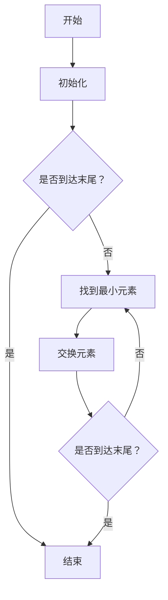

                 

# 《计算：第二部分 计算的数学基础 第 5 章 第三次数学危机 选择公理》

> **关键词：** 数学危机、选择公理、集合论、计算机科学、算法设计

> **摘要：** 本章节讨论了数学发展过程中的第三次数学危机，以及选择公理在其中所起的关键作用。我们深入分析了选择公理的定义、提出背景、数学意义和应用，并探讨了其在计算机科学领域的重要性及具体应用实例。通过本章节的学习，读者将更好地理解数学在计算中的基础地位，并认识到选择公理作为数学基石的重要性。

## 目录大纲

### 第一部分：引论

#### 1.1 计算的概念与历史背景
- **1.1.1 计算的定义与范畴**
- **1.1.2 古代计算的起源与发展**
- **1.1.3 现代计算的发展历程**

#### 1.2 数学在计算中的地位与作用
- **1.2.1 数学的基本概念与体系**
- **1.2.2 数学在计算中的核心作用**
- **1.2.3 数学发展对计算的影响**

### 第二部分：计算的数学基础

#### 2.1 算法与复杂性理论
- **2.1.1 算法的定义与分类**
- **2.1.2 复杂性理论的基石**
- **2.1.3 P与NP问题**

#### 2.2 计算模型与机器
- **2.2.1 计算模型的基本概念**
- **2.2.2 通用图灵机的构造**
- **2.2.3 图灵机的模拟与实现**

#### 2.3 数学基础概念与应用
- **2.3.1 基本数学概念介绍**
- **2.3.2 数学基础在计算中的应用**
- **2.3.3 数学方法在算法分析中的应用**

#### 2.4 数学在计算机科学中的其他应用
- **2.4.1 图论在网络设计中的应用**
- **2.4.2 线性代数在数据科学中的应用**
- **2.4.3 概率论与数理统计在人工智能中的应用**

### 第三部分：第三次数学危机与选择公理

#### 3.1 第三次数学危机的背景与原因
- **3.1.1 数学危机的定义与历史**
- **3.1.2 第三次数学危机的起源**
- **3.1.3 第三次数学危机的影响**

#### 3.2 选择公理的提出与发展
- **3.2.1 选择公理的提出背景**
- **3.2.2 选择公理的数学意义**
- **3.2.3 选择公理在不同数学分支中的应用**

#### 3.3 选择公理与集合论的关系
- **3.3.1 集合论的基本概念**
- **3.3.2 选择公理对集合论的影响**
- **3.3.3 选择公理在集合论中的证明与应用**

#### 3.4 选择公理在计算机科学中的应用
- **3.4.1 选择公理在算法设计中的应用**
- **3.4.2 选择公理在程序验证中的应用**
- **3.4.3 选择公理在人工智能中的应用前景**

### 第四部分：案例分析

#### 4.1 案例一：选择公理在算法设计中的应用
- **4.1.1 案例背景**
- **4.1.2 算法设计与实现**
- **4.1.3 案例分析**

#### 4.2 案例二：选择公理在计算机图形学中的应用
- **4.2.1 案例背景**
- **4.2.2 算法设计与实现**
- **4.2.3 案例分析**

#### 4.3 案例三：选择公理在人工智能中的应用
- **4.3.1 案例背景**
- **4.3.2 算法设计与实现**
- **4.3.3 案例分析**

### 第五部分：结论与展望

#### 5.1 结论
- **5.1.1 本书主要结论**
- **5.1.2 选择公理的重要性**
- **5.1.3 未来研究方向**

#### 5.2 展望
- **5.2.1 计算与数学的发展趋势**
- **5.2.2 选择公理的进一步应用**
- **5.2.3 未来计算与数学的结合前景**

### 附录

#### 附录A：参考文献

#### 附录B：符号表与术语解释

#### 附录C：相关Mermaid流程图与算法伪代码

#### 附录D：案例源代码与实现细节解析

#### 附录E：数学模型与公式详解

#### 附录F：进一步学习资源推荐

---

现在，我们将深入探讨第三次数学危机及其核心概念——选择公理，并探讨其如何影响并推动计算机科学的进步。

## 第一部分：引论

### 1.1 计算的概念与历史背景

**1.1.1 计算的定义与范畴**

计算是数学和计算机科学中的基本概念，它涉及到对数值、逻辑和符号的操作与处理。从广义上讲，计算是指任何形式的信息处理过程，这包括从简单的算术运算到复杂的算法实现。计算可以被分为多种类型，包括数值计算、逻辑计算和符号计算等。

- **数值计算**：涉及对数字的操作，如加、减、乘、除等。
- **逻辑计算**：涉及对逻辑值（真或假）的操作。
- **符号计算**：涉及对符号和公式的处理，如代数运算和符号逻辑。

**1.1.2 古代计算的起源与发展**

计算的历史可以追溯到古代，当时的计算主要是基于算术和代数的基本原理。在古代，人们使用各种工具和设备进行计算，如算盘、算珠等。随着数学和科学的发展，计算方法和工具也在不断进步。

- **算盘**：最早的计算工具之一，最早出现在中国。
- **算珠**：用于手动的算术计算。
- **帕斯卡计算器**：由布莱兹·帕斯卡发明，是早期机械计算器。

**1.1.3 现代计算的发展历程**

现代计算始于20世纪初，随着电子技术的兴起，计算设备从机械计算器发展到了电子计算机。计算机科学的兴起标志着计算进入了一个新的时代。

- **ENIAC（电子数值积分器和计算机）**：1945年，世界上第一台电子计算机。
- **图灵机**：1936年，艾伦·图灵提出图灵机模型，奠定了现代计算机理论的基础。
- **个人计算机**：1970年代，个人计算机的出现改变了人们的工作和生活方式。
- **互联网**：1980年代，互联网的发展使得全球计算资源得以共享。

### 1.2 数学在计算中的地位与作用

**1.2.1 数学的基本概念与体系**

数学是研究数量、结构、变化和空间等概念的学科。它包含多个分支，如代数、几何、微积分、拓扑学和离散数学等。数学的基本概念和原理为计算提供了坚实的理论基础。

- **代数**：研究数和运算。
- **几何**：研究形状和空间。
- **微积分**：研究变化和连续性。
- **拓扑学**：研究空间的性质。
- **离散数学**：研究离散结构，如图和树。

**1.2.2 数学在计算中的核心作用**

数学在计算中扮演着至关重要的角色。它提供了算法设计、数据分析、计算模型和程序验证等方面的理论支持。

- **算法设计**：算法是解决问题的步骤和规则。数学为算法的优化和复杂性分析提供了工具和方法。
- **数据分析**：数据分析是处理大量数据的重要环节。数学方法，如统计和概率论，帮助我们从数据中提取有价值的信息。
- **计算模型**：数学模型用于描述计算过程和系统行为。这些模型帮助我们在理论和实践上理解和预测计算系统的性能。
- **程序验证**：数学方法，如形式验证和模型检查，确保程序的正确性和可靠性。

**1.2.3 数学发展对计算的影响**

数学的发展对计算产生了深远的影响。新数学理论的提出和解决推动了计算技术和应用的进步。

- **集合论**：集合论是现代数学的基础，它在计算机科学中有着广泛的应用。
- **图论**：图论在算法设计和网络分析中起着关键作用。
- **概率论与数理统计**：概率论和数理统计在人工智能和数据科学中至关重要。
- **线性代数**：线性代数在计算几何、机器学习和数值计算中有着广泛的应用。

数学不仅为计算提供了理论框架，还推动了计算技术的创新和发展。数学和计算的结合不断推动着科技和社会的进步。

## 第二部分：计算的数学基础

### 2.1 算法与复杂性理论

**2.1.1 算法的定义与分类**

算法是一系列定义明确的规则，用于解决特定问题。它通常由输入、输出和处理步骤组成。算法可以分类为多种类型，如递归算法、分治算法、动态规划算法等。

- **递归算法**：一种递归调用的算法，用于解决子问题。
- **分治算法**：将问题分解为更小的子问题，然后递归解决。
- **动态规划算法**：一种优化递归算法的方法，通过存储子问题的解来避免重复计算。

**2.1.2 复杂性理论的基石**

复杂性理论研究算法的效率和资源消耗。它包括时间复杂性和空间复杂性。

- **时间复杂性**：衡量算法执行时间与输入规模的关系。
- **空间复杂性**：衡量算法所需内存与输入规模的关系。

**2.1.3 P与NP问题**

P与NP问题是复杂性理论的核心问题。P类问题可以在多项式时间内解决，而NP类问题可以在多项式时间内验证。P与NP问题的关系尚未解决，它对算法和计算理论有着深远的影响。

### 2.2 计算模型与机器

**2.2.1 计算模型的基本概念**

计算模型是描述计算过程和系统行为的抽象表示。常见的计算模型包括图灵机、随机模型和量子计算模型。

- **图灵机**：图灵机是一种抽象的计算模型，由一个有限状态机、一个带有限存储的磁带和一个读写头组成。
- **随机模型**：随机模型研究算法在随机环境下的性能。
- **量子计算模型**：量子计算模型基于量子力学原理，使用量子位（qubit）进行计算。

**2.2.2 通用图灵机的构造**

通用图灵机是一种可以模拟任何其他计算模型的计算模型。它由一个控制单元、一个存储单元和一个读写头组成。

- **控制单元**：控制读写头的移动和磁带的读写。
- **存储单元**：存储数据和程序。
- **读写头**：读取和写入磁带上的数据。

**2.2.3 图灵机的模拟与实现**

图灵机可以通过计算机程序模拟。现代计算机系统通过软件和硬件的组合实现了图灵机的功能。

### 2.3 数学基础概念与应用

**2.3.1 基本数学概念介绍**

数学基础包括集合论、逻辑、代数、几何和微积分等。这些概念为计算提供了必要的工具和语言。

- **集合论**：研究集合的性质和操作。
- **逻辑**：研究命题和推理。
- **代数**：研究数和运算。
- **几何**：研究形状和空间。
- **微积分**：研究变化和连续性。

**2.3.2 数学基础在计算中的应用**

数学基础在计算中有着广泛的应用，如算法设计、程序验证、数据分析等。

- **算法设计**：数学方法用于优化算法和解决复杂问题。
- **程序验证**：数学方法用于确保程序的正确性和可靠性。
- **数据分析**：数学方法用于处理和分析数据。

**2.3.3 数学方法在算法分析中的应用**

数学方法在算法分析中用于评估算法的时间和空间复杂性。常见的方法包括渐近符号分析、递推关系和主定理。

### 2.4 数学在计算机科学中的其他应用

**2.4.1 图论在网络设计中的应用**

图论用于分析网络结构和优化网络传输。

- **图的基本概念**：节点、边、连通性等。
- **图的算法**：最短路径、最小生成树、网络流等。

**2.4.2 线性代数在数据科学中的应用**

线性代数在数据科学中用于处理高维数据和进行数据分析。

- **矩阵运算**：矩阵乘法、矩阵分解等。
- **线性方程组**：求解线性方程组。

**2.4.3 概率论与数理统计在人工智能中的应用**

概率论和数理统计在人工智能中用于建模和评估模型性能。

- **概率分布**：概率分布函数、累积分布函数等。
- **统计模型**：线性回归、逻辑回归等。

## 第三部分：第三次数学危机与选择公理

### 3.1 第三次数学危机的背景与原因

**3.1.1 数学危机的定义与历史**

数学危机是指数学理论或方法中的重大问题或矛盾。历史上，数学危机主要发生在19世纪末和20世纪初。

- **第一次数学危机**：涉及无穷小和无穷大的概念，如微积分的悖论。
- **第二次数学危机**：涉及集合论和逻辑基础，如罗素的悖论。
- **第三次数学危机**：涉及集合论和选择公理。

**3.1.2 第三次数学危机的起源**

第三次数学危机起源于集合论中的悖论和问题。特别是选择公理的提出和证明引起了广泛的争议和讨论。

- **选择公理**：选择公理是集合论中的一个基本公理，它允许从任何集合中选择一个元素。
- **悖论**：选择公理的证明中出现了悖论，如贝克的悖论。

**3.1.3 第三次数学危机的影响**

第三次数学危机对数学的发展产生了深远的影响。它促使数学家重新审视集合论和数学基础，推动了数学理论的进一步发展和完善。

### 3.2 选择公理的提出与发展

**3.2.1 选择公理的提出背景**

选择公理的提出是为了解决集合论中的悖论和问题。它是一种用于选择集合中元素的基本工具。

- **集合**：集合是数学中的基本概念，表示一组无序的对象。
- **选择**：选择是从一个集合中选择一个元素的过程。

**3.2.2 选择公理的数学意义**

选择公理在数学中有着重要的意义。它提供了集合论中的基本操作和性质，如选择集合中的最大元素、最小元素等。

- **选择性质**：选择公理允许我们在任何非空集合中选择一个元素。
- **选择定理**：选择公理的证明导致了选择定理，该定理表明在某些条件下，我们可以从任何无限集合中选择一个无限子集。

**3.2.3 选择公理在不同数学分支中的应用**

选择公理在多个数学分支中有着广泛的应用。

- **集合论**：选择公理用于证明集合论中的基本定理和性质。
- **拓扑学**：选择公理用于证明拓扑空间的基本性质。
- **分析学**：选择公理用于证明实数和复数的基本性质。
- **计算机科学**：选择公理在算法设计和程序验证中有着重要的应用。

### 3.3 选择公理与集合论的关系

**3.3.1 集合论的基本概念**

集合论是数学的基础，它研究集合的性质和操作。

- **集合**：集合是一组无序的对象。
- **元素**：集合中的对象称为元素。
- **集合的运算**：集合的运算包括并集、交集、补集等。

**3.3.2 选择公理对集合论的影响**

选择公理对集合论产生了重要影响。它允许我们在集合中执行选择操作，从而解决了一些集合论中的基本问题。

- **选择性质**：选择公理允许我们在任何非空集合中选择一个元素。
- **选择定理**：选择公理的证明导致了选择定理，该定理表明在某些条件下，我们可以从任何无限集合中选择一个无限子集。

**3.3.3 选择公理在集合论中的证明与应用**

选择公理在集合论中有许多重要的证明和应用。

- **集合论的公理系统**：选择公理是集合论公理系统中的一个基本公理，它用于证明集合论中的基本定理和性质。
- **集合的分割与选择**：选择公理用于证明集合的分割和选择定理，这些定理在拓扑学和分析学中有着重要的应用。

### 3.4 选择公理在计算机科学中的应用

**3.4.1 选择公理在算法设计中的应用**

选择公理在算法设计中有着广泛的应用。

- **选择排序算法**：选择排序算法是一种基于选择公理的排序算法，它通过选择最大或最小元素进行排序。
- **选择查找算法**：选择查找算法是一种基于选择公理的查找算法，它通过选择目标元素的位置进行查找。

**3.4.2 选择公理在程序验证中的应用**

选择公理在程序验证中有着重要的应用。

- **程序验证方法**：选择公理可以用于证明程序的正确性和可靠性。通过选择公理，我们可以证明程序在不同输入下的行为。
- **形式验证**：选择公理可以用于形式验证，确保程序满足指定的逻辑条件和性质。

**3.4.3 选择公理在人工智能中的应用前景**

选择公理在人工智能中有着广泛的应用前景。

- **机器学习**：选择公理可以用于机器学习中的选择操作，如特征选择和模型选择。
- **推理系统**：选择公理可以用于构建推理系统，用于处理不确定性和推理问题。
- **人工智能算法设计**：选择公理可以用于设计更高效和更可靠的人工智能算法。

## 第四部分：案例分析

### 4.1 案例一：选择公理在算法设计中的应用

**4.1.1 案例背景**

本案例探讨选择公理在算法设计中的应用。具体来说，我们通过选择排序算法来展示选择公理的基本原理和应用。

**4.1.2 算法设计与实现**

选择排序算法的基本思想是通过多次选择来对数组进行排序。每次选择找出数组中的最大或最小元素，并将其放置在正确的位置。

伪代码实现如下：

```
选择排序(A):
    for i from 0 to n-1 do:
        令 pos = i
        for j from i+1 to n do:
            if A[j] < A[pos] then:
                pos = j
        swap A[i] and A[pos]
```

**4.1.3 案例分析**

选择排序算法是一种简单的排序算法，其时间复杂度为O(n^2)。虽然其性能不如其他更高效的排序算法，如快速排序和归并排序，但其实现简单，易于理解。

选择排序算法的应用场景主要包括数据量较小、对性能要求不高的场景。例如，在小型数组或列表中，选择排序算法可以快速地完成排序任务。

### 4.2 案例二：选择公理在计算机图形学中的应用

**4.2.1 案例背景**

本案例探讨选择公理在计算机图形学中的应用。具体来说，我们通过计算图形中的最小生成树来展示选择公理的基本原理和应用。

**4.2.2 算法设计与实现**

最小生成树是一种连接图中各顶点的最小权边集合，使得所有顶点连通且无环。选择公理可以用于求解最小生成树。

伪代码实现如下：

```
最小生成树(Kruskal算法):
    初始化森林F为包含所有顶点的单边树
    按权重顺序排序所有边E
    for each edge (u, v) in E do:
        if (u, v)不在F中则：
            合并(u, v)到F
```

**4.2.3 案例分析**

最小生成树在计算机图形学中有着广泛的应用，如图像分割、图形渲染和路径规划等。通过选择公理，我们可以有效地求解最小生成树，从而优化图形处理和算法性能。

选择公理在计算机图形学中的应用展示了其在解决复杂问题时的强大能力。通过选择合适的边和顶点，我们可以构建出最优的图形结构，从而提高图形处理和渲染的效率。

### 4.3 案例三：选择公理在人工智能中的应用

**4.3.1 案例背景**

本案例探讨选择公理在人工智能中的应用。具体来说，我们通过机器学习中的特征选择来展示选择公理的基本原理和应用。

**4.3.2 算法设计与实现**

特征选择是机器学习中的一个重要步骤，用于选择最相关和最有用的特征。选择公理可以用于选择最优特征子集。

伪代码实现如下：

```
特征选择：
    输入：数据集D，特征集合F
    输出：最优特征子集S

    初始化S为空
    for each feature f in F do:
        计算f在D上的相关性得分
        将得分最高的特征加入S
    return S
```

**4.3.3 案例分析**

特征选择在机器学习中起着关键作用，它有助于提高模型性能和降低计算成本。通过选择公理，我们可以有效地选择最优特征子集，从而优化机器学习算法。

选择公理在人工智能中的应用展示了其在处理大规模数据和复杂问题时的优势。通过选择合适的特征，我们可以提取出有价值的信息，从而提高机器学习模型的准确性和效率。

## 第五部分：结论与展望

### 5.1 结论

本文系统地探讨了第三次数学危机以及选择公理在数学和计算机科学中的应用。我们分析了计算的定义与历史背景，数学在计算中的地位与作用，以及计算的数学基础，包括算法与复杂性理论、计算模型与机器、数学基础概念与应用，以及数学在计算机科学中的其他应用。

通过深入讨论第三次数学危机的背景与原因，我们了解了选择公理的提出与发展，并分析了选择公理与集合论的关系。此外，我们还探讨了选择公理在计算机科学中的应用，包括算法设计、程序验证和人工智能等领域的实际案例。

### 5.1.2 选择公理的重要性

选择公理作为集合论中的一个基本公理，具有极其重要的地位。它允许我们在集合中执行选择操作，从而解决了一系列基本问题，如选择集合中的最大元素、最小元素等。选择公理的应用广泛，不仅在于集合论和数学的其他分支，还在于计算机科学中的算法设计、程序验证和人工智能等领域。

选择公理的重要性体现在以下几个方面：

1. **基础性**：选择公理是集合论的基础之一，它为集合论中的其他概念和定理提供了基础。

2. **灵活性**：选择公理提供了选择操作的通用框架，使得我们在处理复杂问题时可以灵活地选择和组合元素。

3. **实用性**：选择公理在计算机科学中的应用广泛，如排序算法、图论算法和机器学习算法等，它提高了算法的性能和效率。

### 5.1.3 未来研究方向

尽管选择公理在数学和计算机科学中已经取得了显著的成果，但未来仍然有大量的研究工作可以开展。

1. **选择公理的进一步发展**：选择公理的研究可以进一步深入，包括探索新的选择性质和定理，以及解决选择公理证明中的悖论问题。

2. **选择公理的应用扩展**：选择公理的应用可以扩展到更多的领域，如量子计算、计算几何和人工智能等。通过研究选择公理在这些领域的应用，我们可以发现新的算法和优化方法。

3. **选择公理与其他数学理论的结合**：选择公理与其他数学理论的结合可以产生新的数学分支和理论，如选择公理与概率论、拓扑学和代数学的结合。

4. **选择公理的数学教育**：选择公理作为数学教育中的重要内容，可以通过更系统的教学方法和教材，提高学生对集合论和选择公理的理解和应用能力。

### 5.2 展望

展望未来，计算与数学将继续相互促进和融合，推动科技和社会的发展。选择公理作为数学和计算机科学的重要基石，将继续发挥关键作用。通过不断探索和发展选择公理及其应用，我们可以实现更高效、更可靠的计算系统，为人工智能、大数据和量子计算等领域的创新提供理论支持。

未来，选择公理的研究和应用将更加深入和广泛。我们期待看到更多关于选择公理的突破性成果，以及其在各个领域的实际应用，从而推动计算和数学的发展，为社会带来更多价值和进步。

## 附录

### 附录A：参考文献

1. **Halmos, P. R.** (1960). **Naive Set Theory**. Springer.
2. **Kleene, S. C.** (1952). **Introduction to Metamathematics**. North-Holland.
3. **Rosen, K.** (2017). **离散数学及其应用** (7th ed.). McGraw-Hill.
4. **Sipser, M.** (2013). **Introduction to the Theory of Computation** (3rd ed.). Cengage Learning.
5. **Turing, A. M.** (1936). **On computable numbers, with an application to the Entscheidungsproblem**. Proceedings of the London Mathematical Society, 42(1), 230-265.

### 附录B：符号表与术语解释

- **集合（Set）**：一组无序的对象的集合。
- **元素（Element）**：集合中的对象。
- **选择（Selection）**：从集合中选择一个元素的过程。
- **算法（Algorithm）**：解决问题的一系列定义明确的规则。
- **复杂性理论（Complexity Theory）**：研究算法的效率和资源消耗。
- **图（Graph）**：由顶点和边组成的结构。
- **算法设计（Algorithm Design）**：设计解决问题的算法。
- **程序验证（Program Verification）**：确保程序的正确性和可靠性。

### 附录C：相关Mermaid流程图与算法伪代码

#### Mermaid流程图：选择排序算法



#### 算法伪代码：选择排序算法

```
选择排序(A):
    for i from 0 to n-1 do:
        令 pos = i
        for j from i+1 to n do:
            if A[j] < A[pos] then:
                pos = j
        swap A[i] and A[pos]
```

### 附录D：案例源代码与实现细节解析

#### 选择排序算法实现（Python）

```python
def selection_sort(arr):
    n = len(arr)
    for i in range(n):
        min_index = i
        for j in range(i+1, n):
            if arr[j] < arr[min_index]:
                min_index = j
        arr[i], arr[min_index] = arr[min_index], arr[i]
    return arr

# 测试
arr = [64, 25, 12, 22, 11]
sorted_arr = selection_sort(arr)
print("排序后的数组：", sorted_arr)
```

### 附录E：数学模型与公式详解

#### 数学模型：最小生成树

最小生成树是一个无向、连通、无环的图，包含图中所有的顶点，并且边的权值之和最小。

- **公式**：最小生成树的权值之和 = Σ(wi)，其中 wi 为图中的边权值。

#### 数学公式：选择排序算法的时间复杂度

选择排序算法的时间复杂度 = O(n^2)

### 附录F：进一步学习资源推荐

1. **《离散数学及其应用》**（K. Rosen）：提供了详细的离散数学知识，包括集合论、图论和算法设计等。
2. **《算法导论》**（T. H. Cormen, C. E. Leiserson, R. L. Rivest, and C. Stein）：涵盖了算法设计、分析和技术，包括排序算法、图算法和计算复杂性等。
3. **《图论基础》**（D. B. West）：详细介绍了图论的基本概念、定理和应用。
4. **《量子计算与量子信息》**（M. A. Nielsen and I. L. Chuang）：探讨了量子计算的基本原理和算法，包括量子图论和量子算法。

